## 1. The AWS Well-Architected Framework

**What it is, in one line:** AWS's checklist of questions and best practices for judging whether an architecture is good. It is organized into **six pillars**. The SAA-C03 exam is built around the same ideas, and its four domains (secure, resilient, high-performing, cost-optimized) map directly onto four of the pillars.

The framework is free. The **AWS Well-Architected Tool** in the console walks a team through the questions for a workload and records risks. **Lenses** add domain-specific questions, for example the **Serverless lens**, **SaaS lens** and the **Financial Services Industry lens**, which is useful for a fintech team.

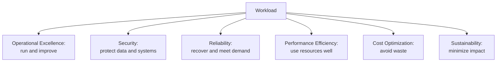

> **Interview tip:** When an interviewer asks "what would you improve in this design?", walking the six pillars in order is a reliable structure. It shows you consider more than just "does it work".

### Pillar 1: Operational Excellence
**What it is:** The ability to run workloads, understand how they behave, and keep improving processes.

**Why it's used:** Most outages are caused by changes. Teams that deploy small, observable, reversible changes have fewer and shorter incidents.

**How it works (design principles):**
- Perform operations as code (CloudFormation, CDK, SSM Automation runbooks).
- Make frequent, small, reversible changes (CI/CD, blue/green, canary deployments).
- Refine procedures often; run game days; anticipate failure.
- Learn from operational events (blameless post-incident reviews).
- Use managed services to reduce operational burden.
- Implement observability for actionable insights (CloudWatch, X-Ray, structured logs).

**Pros:** fewer outages, faster recovery, less heroics. **Cons / limits:** needs investment in automation before it pays off.

**Use it when / avoid when:** always; the question is how much automation is justified for the workload's criticality.

**Exam facts:**
- "Least operational overhead" almost always favors **managed or serverless services** (Fargate over EC2, Aurora over self-managed MySQL, Lambda over cron servers).
- Infrastructure as code = **CloudFormation / CDK**; runbooks = **SSM Automation**.
- Safe deployments: **CodeDeploy** blue/green or canary, Lambda aliases with weighted traffic, Elastic Beanstalk immutable deployments.

### Pillar 2: Security
**What it is:** Protecting data, systems and assets, and being able to detect and respond to security events.

**Why it's used:** For a financial app, a breach is existential: regulatory fines, lost trust, fraud losses.

**How it works (design principles):**
- Implement a strong identity foundation: least privilege, central identity (IAM Identity Center), no long-lived credentials.
- Maintain traceability: CloudTrail, Config, logs everywhere.
- Apply security at all layers: edge (WAF, Shield), VPC (subnets, security groups, NACLs), compute, application, data.
- Automate security best practices (SCPs, Config rules, GuardDuty to EventBridge remediation).
- Protect data in transit (TLS via ACM) and at rest (KMS).
- Keep people away from data (no manual console access to prod databases).
- Prepare for security events (incident response runbooks, isolation automation).

**Pros:** reduces risk systematically. **Cons / limits:** controls can slow teams if not automated.

**Use it when / avoid when:** always; this is the heaviest exam domain.

**Exam facts:**
- Credentials for workloads = **IAM roles**; secrets = **Secrets Manager**; encryption keys = **KMS**.
- Private access to S3/DynamoDB from a VPC = **gateway VPC endpoints** (no internet, no NAT).
- Multi-account guardrails = **Organizations + SCPs**.
- Detection = **GuardDuty, Security Hub, Config, CloudTrail**.

### Pillar 3: Reliability
**What it is:** The ability of a workload to perform its function correctly and consistently, recover from failure, and meet demand.

**Why it's used:** Hardware fails, AZs have incidents, deployments break things, and traffic spikes. Reliability is designing so these are non-events.

**How it works (design principles):**
- Automatically recover from failure (health checks, Auto Scaling, Multi-AZ failover).
- Test recovery procedures (chaos engineering with **AWS Fault Injection Service**, DR drills).
- Scale horizontally to increase aggregate availability (many small instances, not one big one).
- Stop guessing capacity (Auto Scaling, serverless, on-demand capacity).
- Manage change through automation.

Key vocabulary: **Multi-AZ** (survive a data center/AZ failure), **multi-region** (survive a regional failure), **RTO/RPO** (see Section 2), **loose coupling** (queues), **idempotency** and **retries with exponential backoff and jitter**, **service quotas** (plan and raise them before launch).

**Pros:** fewer outages and data loss. **Cons / limits:** redundancy costs money; multi-region adds major complexity.

**Use it when / avoid when:** match the investment to the business's RTO/RPO, not to "maximum possible".

**Exam facts:**
- "Highly available" = spread across **at least two AZs** (ALB + ASG across AZs, RDS Multi-AZ).
- "Survive a region failure" = multi-region (Aurora Global Database, DynamoDB global tables, S3 CRR, Route 53 failover).
- Decouple with **SQS** so failure of one component does not cascade.
- **RDS read replicas** are for read scaling (and can be promoted for DR); **Multi-AZ** is for HA.

### Pillar 4: Performance Efficiency
**What it is:** Using computing resources efficiently to meet requirements, and keeping that efficiency as demand and technology change.

**Why it's used:** A dashboard that loads in 300 ms instead of 3 s keeps users; picking the right database type avoids expensive rewrites.

**How it works (design principles):**
- Democratize advanced technologies: use managed services (for example DynamoDB, OpenSearch) instead of building expertise in-house.
- Go global in minutes: CloudFront, Global Accelerator, multi-region deployments.
- Use serverless architectures.
- Experiment more often; benchmark instance types.
- Consider **mechanical sympathy**: pick the data store and access pattern that fit the workload (key-value, relational, graph, time series, search).

**Pros:** better user experience and often lower cost. **Cons / limits:** constant re-evaluation needed as services evolve.

**Use it when / avoid when:** always; especially for latency-sensitive user-facing paths.

**Exam facts:**
- Global static/dynamic content latency = **CloudFront**; global TCP/UDP with static IPs and fast failover = **Global Accelerator**.
- Read-heavy database = **ElastiCache** or **read replicas**; DynamoDB microsecond reads = **DAX**.
- High IOPS block storage = **EBS io2 Block Express**; shared file system for Linux = **EFS**; high-performance computing file system = **FSx for Lustre**.
- Low-latency between instances = **cluster placement group**.

### Pillar 5: Cost Optimization
**What it is:** Delivering business value at the lowest price point: paying only for what you need, and knowing where the money goes.

**Why it's used:** Cloud bills grow silently: idle instances, oversized databases, forgotten snapshots, cross-AZ data transfer.

**How it works (design principles):**
- Implement cloud financial management (ownership, budgets, regular review).
- Adopt a consumption model (pay for what you use; stop dev environments at night).
- Measure overall efficiency (cost per transaction, per customer).
- Stop spending money on undifferentiated heavy lifting (managed services).
- Analyze and attribute expenditure (cost allocation tags, Cost Explorer).

**Pros:** direct savings. **Cons / limits:** commitments (Savings Plans) reduce flexibility; over-optimization can hurt reliability.

**Use it when / avoid when:** always; Section 3 lists the levers.

**Exam facts:**
- Steady-state = **Savings Plans / Reserved Instances**; fault-tolerant batch = **Spot**; unpredictable short-term = **On-Demand**.
- Infrequently accessed data = **S3 lifecycle** to IA/Glacier classes, or **Intelligent-Tiering** when access is unknown.
- Reduce NAT data processing cost for S3/DynamoDB = **gateway endpoints**.

### Pillar 6: Sustainability
**What it is:** Minimizing the environmental impact of running workloads (added as the sixth pillar in 2021).

**Why it's used:** Many companies have carbon reporting goals; efficient architectures usually also cost less.

**How it works (design principles):**
- Understand your impact (**AWS Customer Carbon Footprint Tool**).
- Establish sustainability goals.
- Maximize utilization (right-size, consolidate, auto-scale to zero when idle).
- Adopt more efficient hardware and software (**Graviton** processors, managed services).
- Use managed services (shared infrastructure runs at higher utilization).
- Reduce downstream impact (smaller payloads, efficient front-end bundles, caching).

**Exam facts:**
- "Reduce environmental impact" answers usually overlap with cost: **Graviton**, right-sizing, serverless, lifecycle policies that delete unneeded data, choosing regions thoughtfully.

#### Q: [Mid] A team asks for a structured review of their payments workload to find risks before a launch. Which AWS offering is designed for this, and what would it check?

**Scenario:** Options: A) AWS Trusted Advisor only. B) The AWS Well-Architected Tool, using the Financial Services Industry lens, reviewing the workload against all six pillars. C) AWS Config conformance packs. D) AWS Artifact.

**Answer:** B. The Well-Architected Tool guides the team through pillar questions (identity, data protection, failure management, scaling, cost, etc.), records high and medium risks, and produces an improvement plan. Lenses add domain questions; the Financial Services lens adds topics like resilience requirements and regulatory controls.

**Why the others are wrong:**
- A) Trusted Advisor gives automated checks (cost, security, limits) but not a design review.
- C) Config checks resource compliance, not architecture decisions.
- D) Artifact provides AWS compliance reports (SOC, PCI) and agreements, not workload reviews.

**Exam tip:** Artifact = AWS's own compliance documents. Trusted Advisor = automated account checks. Well-Architected Tool = workload design review.

#### Q: [Senior] Which pillar does each change primarily improve: (1) moving from one large EC2 instance to an ASG of small instances across three AZs, (2) moving cron servers to EventBridge Scheduler + Lambda, (3) moving to Graviton instances?

**Scenario:** Interviewers use this kind of question to check that you can name trade-offs, not only services.

**Answer:**
- (1) **Reliability** first (no single point of failure, survives an AZ failure), and also performance efficiency (horizontal scaling).
- (2) **Operational excellence** (no servers to patch, managed scheduling, retries) and **cost** (pay per invocation instead of idle servers).
- (3) **Cost optimization** and **sustainability** (better price-performance and energy efficiency, hedge: AWS cites up to about 40% better price-performance for many workloads), assuming the software supports ARM64.

**Why the others are wrong:** There is no single "correct" pillar for most changes; what matters is naming the primary one and the side effects (for example Graviton requires ARM-compatible builds and dependencies, which is an operational cost).

**Exam tip:** When two answers both "work", the exam picks the one that best serves the pillar named in the question's last sentence ("most cost-effective", "most resilient", "least operational overhead").

## 2. Disaster recovery strategies

### RTO and RPO
**What it is:** The two numbers that define any DR plan.
- **RTO (Recovery Time Objective):** how long the business can be down. "We must be serving again within 1 hour."
- **RPO (Recovery Point Objective):** how much data the business can lose, measured in time. "We can lose at most 5 minutes of transactions."

**Why it's used:** They turn "make it resilient" into a requirement you can price. Lower RTO and RPO cost more.

**How it works:** RPO is driven by how often and how continuously you copy data (nightly backups = up to 24 h RPO; asynchronous replication = seconds). RTO is driven by how much of the environment is already running in the recovery location and how automated failover is.


**Exam facts:**
- Read the numbers in the question first; they eliminate most options immediately.
- RPO in seconds across regions = **Aurora Global Database** (typical replication lag under 1 second, hedge) or **DynamoDB global tables**.
- RPO in hours, low cost = **AWS Backup** with cross-region copy.

### Backup and restore
**What it is:** Regularly back up data (and infrastructure definitions) to another region; in a disaster, create everything from scratch and restore.

**Why it's used:** Cheapest DR. Fine for internal tools, reporting systems, or anything that can be down for hours.

**How it works:** **AWS Backup** plans take snapshots of EBS, RDS, Aurora, DynamoDB, EFS, FSx and more, with **cross-region and cross-account copy**. S3 data uses **Cross-Region Replication** or versioned backups. Infrastructure is in **CloudFormation/CDK** so you can redeploy quickly. **AWS Backup Vault Lock** (WORM) protects backups from deletion, including ransomware scenarios.

**Pros:** lowest cost. **Cons / limits:** RTO and RPO measured in **hours**; restore times grow with data size.

**Use it when / avoid when:** use for non-critical workloads; avoid for customer-facing payment systems.

**Exam facts:**
- Centralized, policy-based backups across services and accounts = **AWS Backup**.
- Immutable backups for compliance = **Backup Vault Lock** (compliance mode).
- RTO/RPO of hours, lowest cost = **backup and restore**.

### Pilot light
**What it is:** Keep the **core data replicated and live** in the DR region, but servers are **off or minimal**. Like a gas heater's pilot flame: small, always on, ready to ignite the full system.

**Why it's used:** RPO of minutes or less with cost much lower than running a full copy.

**How it works:** Databases replicate continuously (RDS cross-region read replica, Aurora Global Database, DynamoDB global tables, S3 CRR). AMIs, container images and IaC templates are ready. In a disaster: promote the database, launch compute from templates (Auto Scaling groups set from 0 to N), switch DNS.

**Pros:** low RPO, moderate cost. **Cons / limits:** RTO is **tens of minutes** because compute must start and scale; failover must be rehearsed.

**Use it when / avoid when:** use when data loss must be small but some downtime is acceptable.

**Exam facts:**
- "Core components (database) running, application servers launched on failover" = **pilot light**.
- Database replica in the DR region; compute **not running**.

### Warm standby
**What it is:** A **scaled-down but fully functional** copy of production runs in the DR region all the time.

**Why it's used:** RTO of minutes. The system can even take a small share of real traffic, which proves it works.

**How it works:** Same as pilot light, but the app tier is running at minimum capacity (for example an ASG of 2 small instances instead of 20). On failover: promote the database, scale out the ASG, shift traffic with Route 53 failover or ARC.

**Pros:** faster RTO than pilot light, continuously testable. **Cons / limits:** higher cost (always-on compute); still a database promotion step.

**Use it when / avoid when:** use for business-critical apps where minutes of downtime are acceptable but hours are not.

**Exam facts:**
- "Scaled-down version of a fully functional environment always running" = **warm standby**.
- Failover = **scale up** the standby + DNS switch.

### Multi-site active-active
**What it is:** Full production capacity runs in **two or more regions at the same time**, all serving traffic.

**Why it's used:** Near-zero RTO and RPO, for systems where even minutes of downtime costs millions (card authorization, trading).

**How it works:** Route 53 latency or geolocation routing (or Global Accelerator) sends users to the nearest healthy region. Data replicates across regions with multi-writer stores (DynamoDB global tables) or a single-writer design with fast promotion (Aurora Global Database with write forwarding). Applications must handle replication lag and conflicts. **Route 53 Application Recovery Controller (ARC)** provides routing controls and readiness checks for controlled failover.

**Pros:** lowest RTO/RPO, also lower latency for global users. **Cons / limits:** most expensive, hardest to build: conflict resolution, data consistency, testing.

**Use it when / avoid when:** use only when the business case justifies it; avoid as a default.

**Exam facts:**
- RTO/RPO "near zero" or "seconds", "most resilient regardless of cost" = **multi-site active-active**.
- Multi-region multi-writer NoSQL = **DynamoDB global tables**.
- **AWS Elastic Disaster Recovery (DRS)** continuously replicates servers (on-premises or EC2) at block level to a low-cost staging area and launches recovery instances in minutes: a managed way to get pilot-light-like RPO in seconds and RTO in minutes for server workloads.

### DR comparison table and diagram

| Strategy | RPO | RTO | Cost | What runs in DR region |
|---|---|---|---|---|
| Backup and restore | Hours | Hours (up to a day) | $ | Nothing; only backups |
| Pilot light | Minutes (seconds with continuous replication) | Tens of minutes | $$ | Data replicas only; compute off |
| Warm standby | Seconds to minutes | Minutes | $$$ | Full stack at reduced capacity |
| Multi-site active-active | Near zero | Near zero | $$$$ | Full stack at full capacity, serving traffic |

(Figures are typical ranges; real values depend on data size, automation and testing.)

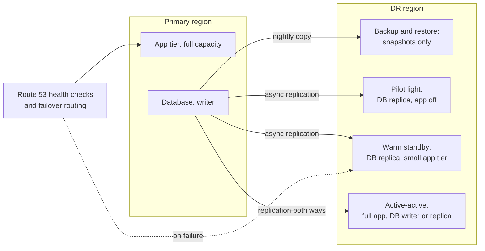

#### Q: [Mid] An internal reporting system can be unavailable for up to 24 hours and lose up to 12 hours of data in a regional disaster. Which DR strategy is most cost-effective?

**Scenario:** Options: A) Multi-site active-active. B) Warm standby. C) Pilot light. D) Backup and restore with AWS Backup copying snapshots to a second region every 12 hours, and infrastructure defined in CloudFormation.

**Answer:** D. RTO 24 hours and RPO 12 hours are generous. Backups every 12 hours meet the RPO; redeploying from templates and restoring snapshots fits within a day. Nothing runs in the DR region except storage of backups.

**Why the others are wrong:**
- A, B, C) All keep resources running or replicating continuously; they meet the goal but cost more than needed.

**Exam tip:** "Most cost-effective" + large RTO/RPO = backup and restore. Do not over-engineer when the numbers allow it.

#### Q: [Senior] A payments API on EC2 with Aurora PostgreSQL needs RPO under 1 minute and RTO under 15 minutes for a regional outage. Minimize cost while meeting targets.

**Scenario:** Options: A) Nightly snapshots copied cross-region. B) Aurora Global Database with a secondary region, AMIs and an Auto Scaling group with minimum capacity of 1 to 2 instances in the DR region, Route 53 failover records with health checks. C) Multi-site active-active with DynamoDB global tables (rewrite the app). D) A single Aurora cluster with Multi-AZ replicas.

**Answer:** B. Aurora Global Database replicates storage to the secondary region with typical lag under a second (meets RPO) and can fail over to the secondary in minutes. A warm standby app tier (small ASG) scales out quickly, and Route 53 shifts traffic. This is warm standby (or pilot light if the ASG is at zero and launch is fast enough).

**Why the others are wrong:**
- A) RPO up to 24 hours.
- C) Meets targets but requires a rewrite and costs far more than needed.
- D) Multi-AZ protects against AZ failure, not region failure.

**Exam tip:** Multi-AZ is not DR across regions. Any question saying "region outage" needs something in a second region.

> **Gotcha:** DNS-based failover depends on TTLs and client caching. Use low TTLs on failover records, or Global Accelerator (static anycast IPs, failover in seconds) when clients cache DNS aggressively.

## 3. Cost optimization levers

Think of the AWS bill as **rate x usage**. You lower the **rate** with pricing models (Savings Plans, Spot, Graviton), and you lower **usage** with right-sizing, scaling, storage tiering and architecture changes. Visibility tools tell you where to start.

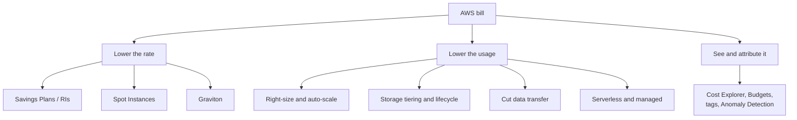

### Compute purchase options
**What it is:** Different ways to pay for the same EC2 (and Fargate, Lambda, RDS) capacity.

**Why it's used:** A 24/7 production database billed On-Demand can cost much more than the same database on a 1-year commitment.

**How it works:**

| Option | Discount vs On-Demand (hedge) | Commitment | Best for |
|---|---|---|---|
| On-Demand | 0% | None | Spiky, short-term, unknown workloads |
| **Compute Savings Plans** | Up to ~66% | $/hour for 1 or 3 years | Steady usage; flexible across instance family, region, OS, and also **Fargate and Lambda** |
| **EC2 Instance Savings Plans** | Up to ~72% | $/hour for one instance family in one region | Steady usage on a known family |
| **Standard Reserved Instances** | Up to ~72% | 1 or 3 years, specific attributes | Steady usage; also the model for RDS, ElastiCache, OpenSearch, Redshift reserved nodes |
| **Convertible RIs** | Up to ~66% | Can exchange attributes | Steady usage, may change family |
| **Spot Instances** | Up to ~90% | None; AWS can reclaim with a **2-minute warning** | Fault-tolerant, stateless, flexible batch, CI, big data, containers |
| **Dedicated Hosts** | Varies | On-Demand or reserved | Bring-your-own per-socket/per-core licenses, compliance |
| **On-Demand Capacity Reservations** | 0% (combine with Savings Plans) | None | Guarantee capacity in an AZ for a known event |

**Exam facts:**
- Steady 24/7 baseline = **Savings Plans or RIs**; spikes on top = On-Demand or Spot.
- "Can be interrupted", "batch", "fault tolerant" = **Spot** (use Spot Fleet / EC2 Fleet / ASG mixed instances with several instance types).
- "Commit to spend but keep flexibility across EC2, Fargate and Lambda" = **Compute Savings Plans**.
- Guarantee capacity without a long-term commitment = **On-Demand Capacity Reservation**.
- "Licensing tied to physical cores/sockets" = **Dedicated Hosts**.

### Right-sizing and elasticity
**What it is:** Matching resource size and count to actual demand.

**Why it's used:** Teams often over-provision "to be safe". An `m5.4xlarge` running at 8% CPU is mostly waste.

**How it works:** **AWS Compute Optimizer** analyzes CloudWatch metrics and recommends smaller instance types, EBS volume types, Lambda memory sizes and ECS task sizes. **Auto Scaling** (target tracking on CPU, request count per target or queue depth) adds and removes capacity. **Instance Scheduler** or simple EventBridge schedules stop dev/test at night and on weekends. **Graviton** instances often give better price-performance. **Aurora Serverless v2** and **DynamoDB on-demand** scale databases with load.

**Exam facts:**
- "Recommend optimal instance types based on utilization" = **Compute Optimizer**.
- "Stop non-production instances outside business hours" = scheduling (Instance Scheduler / EventBridge + SSM or Lambda).
- Unpredictable relational load = **Aurora Serverless v2**; unpredictable key-value load = **DynamoDB on-demand**.

### Storage tiering and lifecycle
**What it is:** Putting data in the cheapest storage class that still meets access needs, and deleting what you no longer need.

**Why it's used:** Bank statements are read often for 30 days, rarely for a year, and must be kept for 7 years. Paying S3 Standard prices for 7 years is waste.

**How it works:**
- **S3 classes:** Standard, **Intelligent-Tiering** (automatic tiering when access patterns are unknown, small monitoring fee), Standard-IA and One Zone-IA (cheaper storage, retrieval fees, 30-day minimum), **Glacier Instant Retrieval** (milliseconds, archive pricing), **Glacier Flexible Retrieval** (minutes to hours), **Glacier Deep Archive** (cheapest, hours, 180-day minimum). **Express One Zone** for very high-performance single-AZ access.
- **Lifecycle rules:** transition after N days, expire objects and old versions, abort incomplete multipart uploads.
- **EBS:** **gp3** is cheaper than gp2 (hedge: about 20%) and decouples IOPS from size; delete unattached volumes and old snapshots; **EBS Snapshots Archive** for long-term.
- **Logs:** set CloudWatch Logs retention; export old logs to S3.

**Exam facts:**
- Unknown or changing access pattern = **S3 Intelligent-Tiering**.
- Keep for years, rarely accessed, retrieval within 12–48 hours is acceptable = **Glacier Deep Archive**.
- Archive but need millisecond access occasionally = **Glacier Instant Retrieval**.
- Re-creatable data, infrequent access = **One Zone-IA** (cheaper, single AZ).
- Move gp2 to **gp3** for cost savings.

### Data transfer costs
**What it is:** Charges for moving data, which surprise most teams.

**Why it's used:** A chatty microservice architecture spread across AZs, or a NAT gateway carrying terabytes of S3 traffic, can cost more than the compute.

**How it works (general rules, hedge on exact prices):**
- Data **into** AWS from the internet is free. Data **out** to the internet is charged; **CloudFront** egress is usually cheaper and cached responses avoid origin egress.
- Traffic within the same AZ over private IPs is free; **cross-AZ** traffic is charged in each direction; **cross-region** traffic is charged.
- **NAT gateways** charge per hour and per GB processed. For S3 and DynamoDB, use **gateway VPC endpoints** (free). For other services, **interface endpoints** (PrivateLink) have hourly and per-GB fees but may beat NAT.
- Direct Connect has lower egress rates than internet for large volumes.

**Exam facts:**
- Reduce NAT gateway cost for S3 traffic = **S3 gateway endpoint**.
- Reduce egress and latency for global users = **CloudFront**.
- Keep chatty components in the same AZ only if HA requirements allow; replication traffic (for example RDS Multi-AZ) between AZs is not charged for the standby replication itself, but your app's cross-AZ traffic is.

### Visibility and governance tools
**What it is:** The tools that show where money goes and alert you before surprises.

**How it works:**
- **Cost Explorer:** visualize and forecast spend; Savings Plans and RI recommendations.
- **AWS Budgets:** alert (or take actions) when cost, usage or coverage crosses a threshold.
- **Cost Anomaly Detection:** ML-based alerts on unusual spend.
- **Cost allocation tags:** tag resources by team, environment, product; activate tags in Billing to break costs down.
- **Cost and Usage Report / Data Exports:** most detailed billing data, queryable with Athena.
- **Trusted Advisor:** checks for idle resources, underutilized instances and more (full checks on Business/Enterprise support plans).
- **Pricing Calculator:** estimate before you build.

**Exam facts:**
- "Alert when monthly spend exceeds $X" = **AWS Budgets**.
- "Detect unusual spend automatically" = **Cost Anomaly Detection**.
- "Break down cost by department" = **cost allocation tags** (+ separate accounts in Organizations).
- "Most granular billing data for analysis" = **Cost and Usage Report** / Data Exports to S3 + Athena.

#### Q: [Mid] A company runs a steady fleet of 40 m6i instances 24/7, plus nightly batch jobs that can be retried if interrupted, and expects to move some workloads to Fargate next year. Most cost-effective purchasing mix?

**Scenario:** Options: A) All On-Demand. B) Compute Savings Plan covering the steady baseline, and Spot Instances for the batch jobs. C) Standard RIs for everything including batch. D) Dedicated Hosts.

**Answer:** B. A Compute Savings Plan discounts the steady baseline and stays flexible if workloads move to other instance families or to Fargate. The batch jobs are interruptible, so Spot gives the largest discount; use multiple instance types and checkpointing to handle interruptions.

**Why the others are wrong:**
- A) Most expensive for steady usage.
- C) RIs for batch that runs a few hours a night waste the reservation the rest of the day, and Standard RIs do not follow workloads to Fargate.
- D) For licensing/compliance, not savings.

**Exam tip:** "Will move to Fargate / Lambda" or "may change instance family" points to Compute Savings Plans over EC2 Instance Savings Plans or Standard RIs.

#### Q: [Senior] A data platform's monthly bill jumped. Cost Explorer shows "NAT Gateway - Data Processing" as the biggest line. EC2 instances in private subnets read terabytes daily from S3 in the same region. Cheapest fix with no application changes?

**Scenario:** Options: A) Move instances to public subnets. B) Add an S3 gateway VPC endpoint and route table entries for the private subnets. C) Use S3 Transfer Acceleration. D) Put CloudFront in front of S3.

**Answer:** B. A gateway endpoint routes S3 traffic privately from the VPC to S3 without passing through the NAT gateway, and gateway endpoints have no hourly or data processing charge. No code change: the SDK uses the same S3 endpoint names; the route table sends the traffic to the endpoint. Add an endpoint policy to restrict which buckets can be reached.

**Why the others are wrong:**
- A) Exposes instances and still pays for internet path data; bad for security.
- C) Transfer Acceleration speeds long-distance uploads over the internet; it adds cost.
- D) CloudFront is for serving content to users, not for EC2 in the same region reading S3.

**Exam tip:** S3 and DynamoDB are the only services with **gateway** endpoints. Everything else uses **interface** endpoints (PrivateLink).

## 4. Reference architectures: web, serverless and events

Each card below is a pattern you should be able to sketch on a whiteboard in two minutes and defend. Learn the shape, then the "why" of each box.

### React SPA hosting (S3 + CloudFront + OAC + Route 53 + ACM)
**What it is:** The standard way to host a static single-page app (React, Vite or Next.js static export) on AWS: files in a private S3 bucket, served worldwide through the CloudFront CDN on your own HTTPS domain.

**Why it's used:** No servers, near-infinite scale, low latency from edge locations, cheap. Example: `app.acme-bank.com` serving the customer dashboard bundle.

**How it works:**
- `npm run build` output (`index.html`, hashed JS/CSS) is uploaded to an **S3 bucket with Block Public Access on**.
- **CloudFront** distribution uses the bucket as origin with **Origin Access Control (OAC)**: CloudFront signs requests to S3, and the bucket policy allows only `cloudfront.amazonaws.com` with a condition on the distribution's ARN. OAC replaced the legacy Origin Access Identity (OAI) and supports SSE-KMS.
- **ACM certificate in us-east-1** for `app.acme-bank.com` attached to CloudFront. **Route 53 alias record** points the domain to the distribution.
- **SPA routing:** deep links like `/accounts/42` do not exist as files. Either configure CloudFront **custom error responses** (map 403/404 to `/index.html` with status 200) or use a **CloudFront Function** to rewrite non-file paths to `/index.html`.
- **Caching:** hashed assets get long TTLs (`Cache-Control: public, max-age=31536000, immutable`); `index.html` gets a short TTL or `no-cache`, and deployments invalidate `/index.html`.
- **Security headers** (CSP, HSTS, X-Frame-Options) via a CloudFront **response headers policy**; **WAF** on the distribution.
- API calls go to a separate origin or behavior (`/api/*` to API Gateway or ALB), which also avoids CORS when served from the same domain.

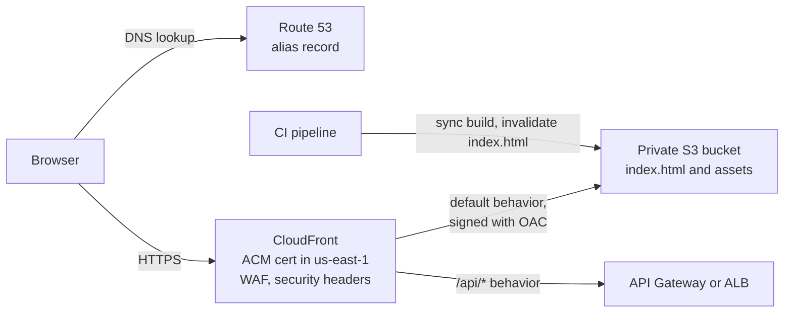

```json
{
  "Version": "2012-10-17",
  "Statement": [{
    "Sid": "AllowCloudFrontOAC",
    "Effect": "Allow",
    "Principal": { "Service": "cloudfront.amazonaws.com" },
    "Action": "s3:GetObject",
    "Resource": "arn:aws:s3:::acme-web-prod/*",
    "Condition": { "StringEquals": { "AWS:SourceArn": "arn:aws:cloudfront::111122223333:distribution/EDFDVBD6EXAMPLE" } }
  }]
}
```

**Pros:** serverless, cheap, global, secure (bucket never public). **Cons / limits:** no server-side rendering (use Lambda@Edge, Amplify Hosting or a container for SSR); cache invalidation discipline needed.

**Use it when / avoid when:** use for any static SPA; avoid S3 static website endpoints for production (HTTP only, bucket must be public). **AWS Amplify Hosting** is a managed alternative with CI/CD built in.

**Exam facts:**
- "Restrict S3 access so content is only served through CloudFront" = **OAC** (older answers: OAI).
- CloudFront certificate must be in **us-east-1**.
- Route 53 **alias** records can point the zone apex (`acme-bank.com`) to CloudFront; CNAMEs cannot be at the apex.
- S3 static website hosting endpoints do **not support HTTPS**; put CloudFront in front.

### Classic 3-tier web app (ALB + ASG + RDS Multi-AZ + ElastiCache)
**What it is:** The traditional layout: a **web/load balancing tier**, an **application tier** of servers, and a **data tier**, spread across multiple Availability Zones.

**Why it's used:** Lift-and-shift of existing apps (Java, .NET, Node monoliths), and the default "highly available web application" exam answer.

**How it works:**
- **VPC** with public subnets (ALB, NAT gateways) and private subnets (app instances, databases) in **at least two AZs**.
- **Application Load Balancer** distributes HTTP(S) traffic, terminates TLS (ACM), health-checks targets, routes by path/host.
- **Auto Scaling group** of EC2 instances from a launch template, across AZs, scaling on target tracking (CPU or `RequestCountPerTarget`).
- **RDS Multi-AZ:** synchronous standby in another AZ with automatic failover (typically 1–2 minutes, hedge). The classic Multi-AZ instance's standby does not serve reads; **Multi-AZ DB clusters** (two readable standbys) and **Aurora** replicas can serve reads. Add **read replicas** for read scaling.
- **ElastiCache (Redis OSS / Valkey or Memcached)** caches hot reads and stores **session state**, so app instances are stateless and any instance can serve any user.
- Security groups chain: ALB SG allows 443 from the internet; app SG allows traffic only from the ALB SG; DB SG allows 5432 only from the app SG.

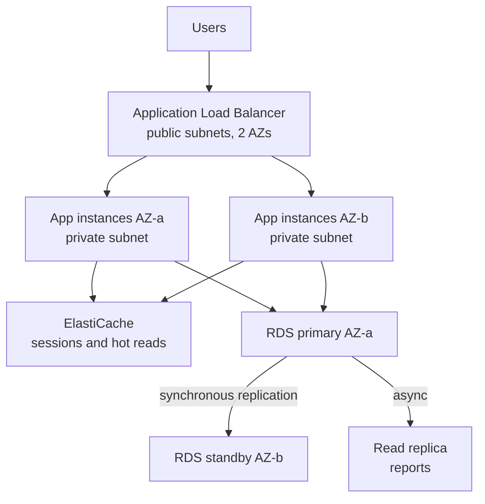

**Pros:** well understood, works for any language, highly available. **Cons / limits:** servers to patch, idle capacity cost, slower scaling than serverless.

**Use it when / avoid when:** use for existing apps and steady traffic; consider containers or serverless for new builds.

**Exam facts:**
- "Highly available web app" = **ALB + ASG across multiple AZs + RDS Multi-AZ**.
- "Users get logged out when instances scale in" = move sessions to **ElastiCache or DynamoDB** (sticky sessions are a weaker alternative).
- "Database CPU high from repeated reads" = **ElastiCache** (or read replicas).
- One **NAT gateway per AZ** for resilience of outbound traffic.

### Serverless API (API Gateway + Lambda + DynamoDB + Cognito)
**What it is:** An API with no servers to manage: API Gateway receives requests, Lambda runs code, DynamoDB stores data, Cognito authenticates users.

**Why it's used:** Pay per request, scale from zero to thousands of requests per second, minimal ops. Ideal for new product APIs with uneven traffic.

**How it works:**
- **Cognito user pool** (or an OIDC IdP such as Okta) issues JWTs to the SPA.
- **API Gateway HTTP API** with a **JWT authorizer** (or REST API with Cognito authorizer if you need caching, usage plans or WAF).
- **Lambda** functions per route or per bounded context, with least-privilege execution roles. **Provisioned concurrency** for latency-sensitive paths to avoid cold starts; **reserved concurrency** to protect downstream systems.
- **DynamoDB** table (on-demand capacity) designed around access patterns, for example `PK = ACCOUNT#42`, `SK = TXN#2026-10-01T12:00:00Z#t_981`. **DAX** for microsecond reads if needed.
- If you need a relational database, use **Aurora Serverless v2** with **RDS Proxy** to pool connections from many Lambdas.

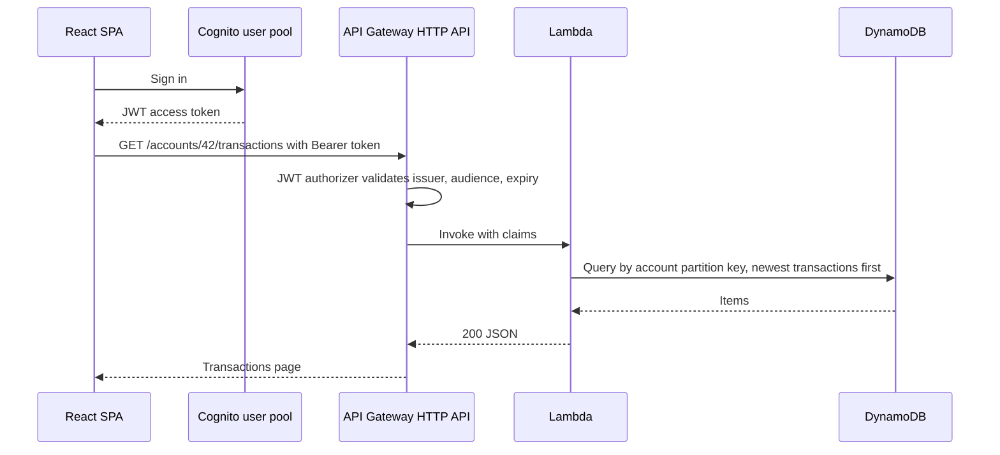

```typescript
// Lambda handler (Node 20, AWS SDK v3) behind an HTTP API JWT authorizer
import { DynamoDBClient } from "@aws-sdk/client-dynamodb";
import { DynamoDBDocumentClient, QueryCommand } from "@aws-sdk/lib-dynamodb";
import type { APIGatewayProxyEventV2WithJWTAuthorizer, APIGatewayProxyResultV2 } from "aws-lambda";

const ddb = DynamoDBDocumentClient.from(new DynamoDBClient({}));

export const handler = async (
  event: APIGatewayProxyEventV2WithJWTAuthorizer
): Promise<APIGatewayProxyResultV2> => {
  const accountId = event.pathParameters?.accountId;
  const userSub = event.requestContext.authorizer.jwt.claims.sub as string;
  if (!accountId || !(await userOwnsAccount(userSub, accountId))) {
    return { statusCode: 403, body: JSON.stringify({ error: "forbidden" }) };
  }
  const res = await ddb.send(new QueryCommand({
    TableName: process.env.TABLE!,
    KeyConditionExpression: "PK = :pk AND begins_with(SK, :sk)",
    ExpressionAttributeValues: { ":pk": `ACCOUNT#${accountId}`, ":sk": "TXN#" },
    ScanIndexForward: false,
    Limit: 50,
  }));
  return { statusCode: 200, body: JSON.stringify({ items: res.Items, next: res.LastEvaluatedKey }) };
};

declare function userOwnsAccount(sub: string, accountId: string): Promise<boolean>;
```

**Pros:** no servers, automatic scaling, pay per use, fine-grained IAM per function. **Cons / limits:** cold starts, 15-minute Lambda limit, API Gateway payload/timeout limits, DynamoDB requires up-front access-pattern design.

**Use it when / avoid when:** use for spiky or new APIs; avoid for long-running compute or very high steady throughput where containers are cheaper.

**Exam facts:**
- "Least operational overhead API that scales automatically" = **API Gateway + Lambda + DynamoDB**.
- "Lambda overwhelms RDS with connections" = **RDS Proxy**.
- "Cold start latency" = **provisioned concurrency** (or SnapStart for supported runtimes).
- Unpredictable traffic on DynamoDB = **on-demand capacity mode**.

### Event-driven order pipeline (SNS/SQS/EventBridge + Lambda + Step Functions)
**What it is:** An order (or payment) system where services communicate through events rather than direct calls, and a workflow engine coordinates the multi-step part.

**Why it's used:** Checkout must respond in 200 ms, but fulfilment involves payment capture, stock reservation, fraud scoring, invoicing and email. Doing all that synchronously is slow and fragile.

**How it works:**
- The **Order API** (API Gateway + Lambda) validates the request, writes the order to DynamoDB with an **idempotency key**, and returns `202 Accepted`.
- **DynamoDB Streams + EventBridge Pipes** (or a direct `PutEvents` call) publish `OrderPlaced` to an **EventBridge** custom bus. Writing to the database and emitting via the stream avoids the "saved but event lost" problem (an outbox pattern).
- **Rules** route the event: one target starts a **Step Functions** workflow (charge payment, reserve stock, compensate on failure: the **saga** pattern); other rules send to **SQS** queues for invoicing and analytics, each with a **DLQ**.
- Notifications fan out with **SNS** (email, SMS, mobile push).
- Consumers are **idempotent** because delivery is at-least-once.

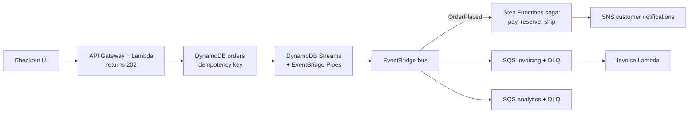

**Pros:** fast user response, independent scaling and failure, easy to add consumers. **Cons / limits:** eventual consistency (UI must show "processing"), harder debugging (use X-Ray and correlation IDs), duplicate handling required.

**Use it when / avoid when:** use for multi-step business processes and many downstream consumers; avoid for simple CRUD where a synchronous call is clearer.

**Exam facts:**
- "Decouple order processing" = **SQS**; "multiple systems react" = **SNS fan-out or EventBridge**; "coordinate steps with rollback" = **Step Functions**.
- Capture item-level changes from DynamoDB = **DynamoDB Streams** (24 h retention) feeding Lambda or Pipes.
- Ordered per customer = **SQS FIFO** with `MessageGroupId = customerId`.

### File upload processing (S3 presigned URL + event + Lambda)
**What it is:** Clients upload files **directly to S3** using a short-lived **presigned URL**, and S3 events trigger processing.

**Why it's used:** Routing a 50 MB bank statement PDF through API Gateway and Lambda hits payload limits and wastes compute. Direct-to-S3 is faster, cheaper and scales.

**How it works:**
1. The SPA asks the API for an upload URL. A Lambda checks the user's JWT, picks a key (`uploads/{userSub}/{uuid}.pdf`), and returns a **presigned PUT URL** (or a presigned POST with conditions like max size and content type) valid for a few minutes.
2. The browser PUTs the file straight to S3. Large files use **multipart upload**; long-distance uploads can use **S3 Transfer Acceleration**.
3. S3 emits an **event notification** (`s3:ObjectCreated:*`) to SQS, SNS, Lambda or **EventBridge**. Prefer SQS or EventBridge in between for retries and fan-out.
4. A processing Lambda scans for malware (**GuardDuty Malware Protection for S3** can do this managed), extracts text (**Textract**), generates thumbnails, writes metadata to DynamoDB, and moves the object from `uploads/` to `clean/`.
5. Notify the UI (WebSocket / AppSync subscription or polling a status endpoint).

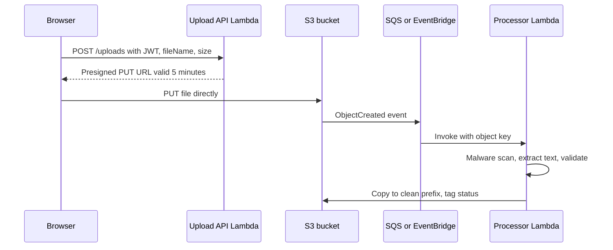

```typescript
// Generate a presigned PUT URL (AWS SDK v3)
import { S3Client, PutObjectCommand } from "@aws-sdk/client-s3";
import { getSignedUrl } from "@aws-sdk/s3-request-presigner";
import { randomUUID } from "node:crypto";

const s3 = new S3Client({});

export async function createUploadUrl(userSub: string, contentType: "application/pdf" | "image/png") {
  const key = `uploads/${userSub}/${randomUUID()}`;
  const url = await getSignedUrl(
    s3,
    new PutObjectCommand({ Bucket: process.env.BUCKET!, Key: key, ContentType: contentType }),
    { expiresIn: 300 } // seconds
  );
  return { url, key };
}
```

**Pros:** no payload limits, cheap, scalable, backend never handles bytes. **Cons / limits:** a presigned PUT URL cannot enforce max size (use presigned POST with `content-length-range`), and you must validate files after upload; avoid recursive triggers (do not write output to the same prefix that triggers the function).

**Use it when / avoid when:** use for any user uploads larger than a few KB; avoid passing files through API Gateway.

**Exam facts:**
- "Allow users to upload directly to S3 without AWS credentials, time-limited" = **presigned URL**.
- "Process files as soon as they are uploaded" = **S3 event notification to Lambda/SQS/EventBridge**.
- Faster uploads from distant users = **S3 Transfer Acceleration**; large files = **multipart upload** (recommended above 100 MB, required above 5 GB).
- Lambda writing back to the triggering bucket/prefix can cause an **infinite loop**.

#### Q: [Mid] A React SPA is in S3 and served through CloudFront. Users can still open files via the S3 URL, and deep links like `/portfolio/123` return 403 when refreshed. Fix both.

**Scenario:** Options: A) Enable S3 static website hosting and make the bucket public. B) Enable Block Public Access, configure Origin Access Control with a bucket policy allowing only the distribution, and add CloudFront custom error responses (or a CloudFront Function) that serve `/index.html` with 200 for unknown paths. C) Use Route 53 to block S3 URLs. D) Move the app to EC2 with Nginx.

**Answer:** B. OAC plus a bucket policy scoped to the distribution ARN makes S3 reachable only through CloudFront. The 403 comes from S3 because `/portfolio/123` is not an object; returning `index.html` lets React Router handle the path.

**Why the others are wrong:**
- A) Makes the problem worse (public bucket, HTTP-only website endpoint).
- C) DNS cannot block access to S3 endpoints.
- D) Works but adds servers to manage for no benefit.

**Exam tip:** With OAC, S3 returns **403** (not 404) for missing keys unless CloudFront has `s3:ListBucket` permission, which is why SPA error mapping often covers 403 as well as 404.

#### Q: [Senior] A serverless transaction API built on Lambda and RDS PostgreSQL fails under load with "too many connections". Traffic is spiky (100 to 3,000 requests per second). What is the best fix with least operational overhead?

**Scenario:** Options: A) Increase the RDS instance size. B) Put Amazon RDS Proxy between Lambda and the database, and use IAM authentication or Secrets Manager credentials. C) Move the database to an EC2 instance with PgBouncer. D) Lower Lambda's memory.

**Answer:** B. Each concurrent Lambda environment opens its own connection; spikes create thousands. RDS Proxy pools and reuses connections, handles failover faster, and integrates with Secrets Manager and IAM auth. Optionally set reserved concurrency to cap pressure on the database.

**Why the others are wrong:**
- A) Raises `max_connections` a bit; still fails at the next spike and costs more.
- C) Possible but self-managed; more overhead.
- D) Unrelated to connections.

**Exam tip:** "Lambda + relational database + connection exhaustion" = RDS Proxy. If the question allows a data model change, DynamoDB avoids the problem entirely.

## 5. Reference architectures: data, containers, hybrid and global

### Real-time analytics (Kinesis + Firehose + S3 + Athena)
**What it is:** A pipeline that ingests a continuous stream of events, reacts to some of them in seconds, and lands all of them in S3 for SQL analysis.

**Why it's used:** A trading app wants live "top traded symbols" on a dashboard and also wants analysts to query a year of trade events with SQL.

**How it works:**
- Producers (apps, API Gateway, Kinesis Agent, SDK) write to **Kinesis Data Streams** with a sensible partition key (for example `accountId`).
- **Real-time path:** Lambda or **Managed Service for Apache Flink** computes windows (trades per minute per symbol), writes results to DynamoDB or pushes to dashboards.
- **Batch path:** **Data Firehose** reads the stream, converts JSON to **Parquet** using a Glue Data Catalog schema, partitions by date (`dt=2026-10-01/`), and delivers to **S3**.
- **Glue Data Catalog** holds table definitions; **Athena** queries S3 with SQL, charged per TB scanned (Parquet + partitions cut cost dramatically); **QuickSight** visualizes.
- Search and log analytics alternative: Firehose to **OpenSearch Service**.

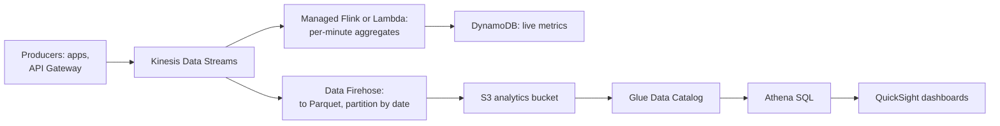

**Pros:** serverless end to end (with on-demand streams), cheap storage, SQL on raw data. **Cons / limits:** Athena latency is seconds (not for OLTP); small files hurt query performance (tune Firehose buffers or compact).

**Use it when / avoid when:** use for clickstream, telemetry, audit events; for complex BI joins at high concurrency consider **Redshift**.

**Exam facts:**
- "Query data in S3 with SQL, serverless, pay per query" = **Athena**.
- Reduce Athena cost = **columnar format (Parquet/ORC), compression, partitioning**.
- "Near real-time delivery to S3 with format conversion" = **Firehose**.
- "Data warehouse for complex analytics" = **Redshift** (Redshift Spectrum queries S3 directly).

### Data lake (S3 + Glue + Athena + Lake Formation)
**What it is:** A central repository in S3 that stores all data, structured and unstructured, at any scale, with a catalog, ETL and governed access on top.

**Why it's used:** A bank has transactions in Aurora, CRM exports in CSV, clickstream in Kinesis and documents in S3. Analysts and ML teams need one governed place to query it, with PII columns restricted.

**How it works:**
- **Zones** in S3: `raw/` (as ingested), `curated/` (cleaned, Parquet), `analytics/` (aggregates). Ingest with **DMS** (databases, including ongoing change data capture), **DataSync** (file systems), **Firehose** (streams), **AppFlow** (SaaS).
- **AWS Glue:** **crawlers** infer schemas into the **Glue Data Catalog**; **Glue ETL jobs** (Spark) transform raw to curated; **Glue DataBrew** for visual data prep.
- **Lake Formation:** central permissions on the catalog: database, table, **column, row and cell-level** access, **tag-based access control (LF-TBAC)**, and cross-account sharing. Athena, Redshift Spectrum, EMR and Glue enforce these permissions.
- Consumers: **Athena** (ad hoc SQL), **Redshift Spectrum**, **EMR** (big data frameworks), **SageMaker** (ML), **QuickSight** (BI).
- Open table formats such as **Apache Iceberg** (and **S3 Tables**, managed Iceberg tables in S3) add ACID updates and time travel (hedge on feature details).

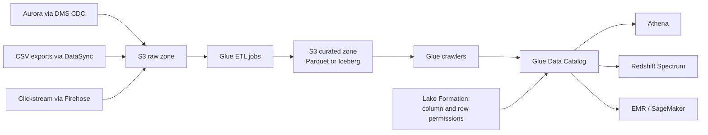

**Pros:** cheap storage, decoupled compute, many engines on one copy of data, fine-grained governance. **Cons / limits:** without a catalog and governance it becomes a "data swamp"; ETL pipelines need ownership.

**Use it when / avoid when:** use when many teams and tools need shared data; avoid for transactional workloads.

**Exam facts:**
- "Centrally manage fine-grained (column/row) access to a data lake" = **Lake Formation**.
- "Discover schema of data in S3 automatically" = **Glue crawler** to **Glue Data Catalog**.
- "Serverless ETL" = **Glue**; "migrate database with ongoing replication" = **DMS**.
- "Hadoop/Spark clusters with full control" = **EMR**.

### Containers platform (ECS on Fargate / EKS)
**What it is:** Running containerized services (Docker images) on AWS-managed orchestration.

**Why it's used:** Teams want consistent builds from laptop to production, faster deploys than VMs, and better density than one-app-per-instance.

**How it works:**
- Images live in **Amazon ECR** (with Inspector scanning).
- **Orchestrator:** **ECS** (AWS-native, simpler) or **EKS** (managed Kubernetes, portable, rich ecosystem).
- **Compute:** **Fargate** (serverless: no nodes to manage, pay per vCPU/memory per second) or **EC2** (you manage instances, cheaper at scale, GPU or special needs). **Fargate Spot** and EC2 Spot for interruptible tasks.
- **Networking:** tasks in private subnets with `awsvpc` networking (each task gets an ENI and security group); **ALB** with IP target groups routes by path/host; **ECS Service Connect** or a service mesh for service-to-service.
- **IAM:** the **task execution role** lets ECS pull images and write logs; the **task role** is what your application code uses to call AWS (for example DynamoDB). On EKS, **EKS Pod Identity** or IRSA gives pods IAM roles.
- **Scaling:** ECS Service Auto Scaling (target tracking on CPU, memory or ALB requests); on EKS, Karpenter or Cluster Autoscaler for nodes plus HPA for pods.

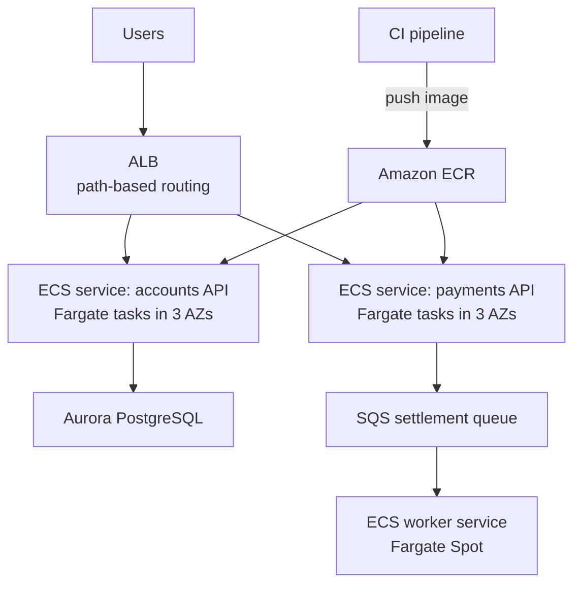

| | ECS on Fargate | ECS on EC2 | EKS |
|---|---|---|---|
| Ops overhead | Lowest | Medium (patch, scale nodes) | Highest (Kubernetes) |
| Portability | AWS only | AWS only | Kubernetes anywhere |
| Cost at scale | Higher per unit | Lower with RIs/Spot | Control plane fee + nodes |
| Best for | Most AWS-native teams | Large steady fleets, GPUs | Existing Kubernetes skills, multi-cloud |

**Pros:** consistent deployments, fine-grained scaling, no idle VMs with Fargate. **Cons / limits:** container skills needed; EKS has a steep learning curve.

**Use it when / avoid when:** use for long-running services, workloads beyond Lambda's 15-minute limit, or apps already containerized; avoid EKS unless Kubernetes is a requirement.

**Exam facts:**
- "Run containers without managing servers" = **Fargate** (ECS or EKS).
- "Already use Kubernetes / need Kubernetes compatibility" = **EKS**.
- App permissions in ECS = **task role** (not the execution role, not the instance role).
- Simple container web app from source with least effort = **App Runner** (hedge: AWS has limited App Runner to existing customers or reduced investment in recent announcements; check current status) or **Elastic Beanstalk**.

### Hybrid connectivity and storage (Direct Connect + Storage Gateway)
**What it is:** Connecting an on-premises data center to AWS privately and bridging on-premises storage with AWS storage.

**Why it's used:** A bank keeps its core banking mainframe on-premises but moves digital channels and analytics to AWS. It needs predictable, private, high-bandwidth connectivity and file shares backed by S3.

**How it works:**
- **AWS Direct Connect (DX):** a dedicated private network connection from your data center (via a DX location) to AWS, at 1, 10, 100 Gbps dedicated or smaller **hosted connections** through partners. Consistent latency, lower egress cost. Takes **weeks** to provision. Traffic is **not encrypted by default**: use **MACsec** (on supported dedicated ports) or run **Site-to-Site VPN over DX**. **Direct Connect Gateway** reaches VPCs in many regions; combine with **Transit Gateway** for many VPCs.
- **Resilience:** two DX connections at **two different DX locations** for maximum resilience; or DX plus **Site-to-Site VPN as backup** for a cheaper option.
- **Site-to-Site VPN:** IPsec over the internet, quick to set up (minutes), lower bandwidth and variable latency.
- **AWS Storage Gateway:** on-premises appliance (VM or hardware) that presents local protocols backed by AWS:
  - **S3 File Gateway:** NFS/SMB file shares stored as objects in S3, with local cache.
  - **Volume Gateway:** iSCSI block volumes; **cached** mode (primary data in S3, cache on-premises) or **stored** mode (primary on-premises, async backups to AWS as EBS snapshots).
  - **Tape Gateway:** virtual tape library for existing backup software, archived to Glacier classes.
  - (FSx File Gateway for SMB to FSx for Windows is no longer offered to new customers, hedge.)
- **Migration helpers:** **DataSync** (online transfer of files/objects to S3, EFS, FSx, scheduled and accelerated), **Snow Family** for offline bulk transfer (AWS has been retiring some Snow devices; check availability), **Transfer Family** (managed SFTP/FTPS to S3), **DMS** for databases.

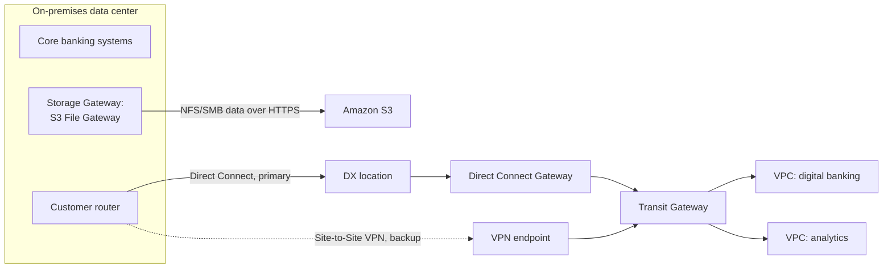

**Pros:** private, predictable networking; on-premises apps use AWS storage without rewrites. **Cons / limits:** DX lead time and cost; more moving parts to operate; physical redundancy planning.

**Use it when / avoid when:** use DX for sustained high-bandwidth or latency-sensitive hybrid traffic; use VPN for quick, low-volume or backup links.

**Exam facts:**
- "Dedicated, consistent, private connection, high throughput" = **Direct Connect**. "Quickly, encrypted over internet" = **Site-to-Site VPN**.
- "Encrypt traffic over DX" = **VPN over DX** or **MACsec**.
- "On-premises apps need file shares backed by S3" = **S3 File Gateway**. "Replace physical tape backups" = **Tape Gateway**. "iSCSI with cloud backup" = **Volume Gateway**.
- "Transfer large datasets online, scheduled, with integrity checks" = **DataSync**.
- "Connect many VPCs and on-premises networks hub-and-spoke" = **Transit Gateway**.

### Multi-region active-active for a fintech
**What it is:** A payments platform serving customers from two or more regions at once, designed to keep running (and keep money correct) if an entire region fails.

**Why it's used:** Card authorization and instant payments have regulatory and business requirements of near-zero downtime. Users in Europe and the US also benefit from lower latency.

**How it works:**
- **Traffic:** Route 53 **latency-based** routing with **health checks**, or **Global Accelerator** (static anycast IPs, health-based failover in seconds, no DNS caching problem). **Route 53 ARC** routing controls let operators shift traffic deliberately and safely.
- **Data, the hard part:** money requires **correctness over availability** for a single balance. Common designs:
  - **Home-region per account (cell-based):** each account is owned by one region at a time; writes for that account go there. Reads can be served anywhere. Failover moves ownership of cells. Avoids write conflicts on balances.
  - **DynamoDB global tables:** multi-active replication across regions with last-writer-wins conflict resolution in the default (eventually consistent) mode, which is unsafe for concurrent balance updates unless writes for a key go to one region. AWS added **multi-Region strong consistency** for global tables in 2025 (hedge: check region and feature limits); it trades higher write latency for no conflicts.
  - **Aurora Global Database:** one writer region, read replicas in others (typical lag under 1 second, hedge), **write forwarding** from secondaries, and managed switchover/failover to promote another region in minutes.
- **Idempotency:** every payment request carries an idempotency key stored with the result; retries after failover never double-charge.
- **Supporting services replicated:** **KMS multi-Region keys**, **Secrets Manager replication**, **S3 Cross-Region Replication** (documents, statements), **ECR replication**, IaC deployed to every region by pipeline.
- **Operations:** regular region evacuation drills, per-region quotas raised ahead of time, observability per region.

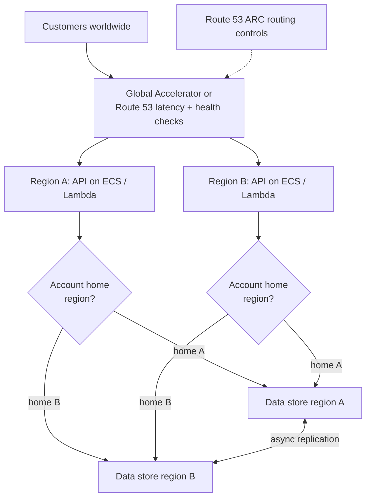

**Pros:** survives region failure, low latency globally. **Cons / limits:** high cost and complexity; consistency trade-offs must be explicit; testing failover is mandatory.

**Use it when / avoid when:** use when RTO/RPO near zero is a hard requirement; avoid when warm standby satisfies the business.

**Exam facts:**
- "Global users, lowest latency, multi-region writes, NoSQL" = **DynamoDB global tables**.
- "Relational, cross-region DR with RPO about 1 second and RTO about 1 minute" = **Aurora Global Database**.
- "Static IPs, fast regional failover, TCP/UDP" = **Global Accelerator**.
- "Route users to the region with lowest latency" = **Route 53 latency-based routing**.

#### Q: [Senior] A company needs a dedicated 10 Gbps connection from its data center to AWS with encryption in transit and a resilient backup path, while keeping cost reasonable. Which design?

**Scenario:** Options: A) Two Site-to-Site VPN tunnels only. B) One Direct Connect 10 Gbps connection with an IPsec Site-to-Site VPN running over it (or MACsec), plus a separate Site-to-Site VPN over the internet as backup. C) One Direct Connect connection, no encryption. D) Snowball devices weekly.

**Answer:** B. DX gives dedicated bandwidth and consistent latency; encryption comes from IPsec over DX or MACsec. A VPN over the internet is a cheap backup path if the DX link fails (with lower bandwidth). For maximum resilience AWS recommends two DX connections at separate locations, but the question asked for reasonable cost.

**Why the others are wrong:**
- A) VPN tunnels over the internet do not give dedicated 10 Gbps or consistent latency.
- C) DX is not encrypted by default and has no backup.
- D) Offline transfer, not connectivity.

**Exam tip:** DX alone is never "encrypted". "Maximum resiliency" = two DX connections at two DX locations; "cost-effective backup" = VPN.

#### Q: [Staff] Design a multi-region active-active payments API for EU and US customers that never double-charges and keeps balances correct during a regional failover. Walk through your choices.

**Short answer:** Route users by latency to the nearest healthy region, but give every account a **home region** that owns writes to its balance. Use idempotency keys end to end. Replicate data asynchronously for reads and failover, and move account ownership deliberately during a regional event.

**Clarify first:** Required RTO and RPO per operation (authorizations versus statements). Data residency (EU data must stay in the EU?). Peak TPS per region. Can an account be served from either region at the same time, or is a short write pause during failover acceptable? Is strong consistency required for every read or only for balance-changing writes?

**Solution:**
- **Edge:** Global Accelerator in front of regional ALBs or API Gateway; WAF and Shield Advanced.
- **Compute:** stateless ECS Fargate services (or Lambda) in each region, deployed by the same pipeline.
- **Routing to data:** a small, globally replicated **account directory** (DynamoDB global table) maps `accountId` to home region. Requests for a balance-changing operation are forwarded to the home region if they land elsewhere.
- **Ledger store:** per-region DynamoDB tables (or Aurora clusters) owning their cells, replicated to the peer region for failover; or DynamoDB global tables with multi-Region strong consistency if latency budgets allow.
- **Idempotency:** `Idempotency-Key` header stored with a conditional write (`attribute_not_exists(pk)`), returning the original result on retry.
- **Failover:** Route 53 ARC routing controls flip traffic; a runbook (SSM Automation) updates the directory to move cells to the surviving region only after replication catches up or after accepting a defined RPO for in-flight items, which are reconciled from the event log afterwards.
- **Events:** EventBridge global endpoints (or cross-region bus targets) for downstream consumers, all idempotent.

```typescript
// Idempotent payment write with DynamoDB conditional put
import { DynamoDBDocumentClient, PutCommand, GetCommand } from "@aws-sdk/lib-dynamodb";
import { DynamoDBClient, ConditionalCheckFailedException } from "@aws-sdk/client-dynamodb";

const ddb = DynamoDBDocumentClient.from(new DynamoDBClient({}));

export async function recordPayment(idempotencyKey: string, accountId: string, amountCents: number) {
  const item = { pk: `IDEMP#${idempotencyKey}`, accountId, amountCents, status: "ACCEPTED", createdAt: Date.now() };
  try {
    await ddb.send(new PutCommand({
      TableName: process.env.TABLE!,
      Item: item,
      ConditionExpression: "attribute_not_exists(pk)",
    }));
    return item;
  } catch (err) {
    if (err instanceof ConditionalCheckFailedException) {
      const existing = await ddb.send(new GetCommand({ TableName: process.env.TABLE!, Key: { pk: item.pk } }));
      return existing.Item; // replay the original result, never charge twice
    }
    throw err;
  }
}
```

**Trade-offs:** Home-region ownership avoids conflicts but adds a forwarding hop for users who travel and needs a careful failover runbook. Multi-Region strong consistency simplifies the model but increases write latency and cost. Full multi-writer with last-writer-wins is fastest and simplest to operate, but unsafe for balances. Active-active roughly doubles infrastructure cost compared with warm standby.

**What interviewers listen for:**
- Separating "traffic is active-active" from "every record is writable everywhere".
- Explicit handling of replication lag, conflicts and idempotency for money.
- Mentioning failover drills, quotas in both regions and data residency.
- Red flag: "Just use DynamoDB global tables" with no mention of conflict resolution for balances.

> **Finance tip:** Regulators often care more that you can prove what happened than that you never paused. An append-only ledger with idempotency keys and reconciliation after failover is usually more defensible than chasing zero RTO for every operation.

## 6. Exam strategy

### How SAA-C03 questions are worded
**What it is:** Every question is a short scenario followed by a requirement sentence, usually with a **qualifier** that decides between several technically valid answers.

**Why it's used:** The exam tests judgment, not memory. Two or three options will "work"; only one best satisfies the qualifier.

**How it works:** Read the **last sentence first** to find the qualifier, then read the scenario for constraints (numbers, existing tech, compliance). Map qualifiers to design instincts:

| Keyword in question | What it usually means |
|---|---|
| "Most cost-effective" / "lowest cost" | Cheapest option that still meets every stated requirement: Spot, S3 lifecycle/IA/Glacier, serverless pay-per-use, backup and restore DR, gateway endpoints |
| "Least operational overhead" / "least management effort" | Managed or serverless: Lambda, Fargate, Aurora, DynamoDB, Secrets Manager rotation, AWS Backup, managed rule groups. Avoid "write a script on EC2" |
| "Highly available" | Multiple AZs: ALB + ASG across AZs, RDS Multi-AZ, EFS, S3 |
| "Fault tolerant" | Keeps working with no interruption when a component fails (stronger than HA): redundant capacity already running |
| "Disaster recovery" / "region outage" | Something in a second region; pick the strategy by RTO/RPO |
| "Decouple" / "spiky" / "buffer" | SQS (plus SNS or EventBridge for fan-out) |
| "Real-time" / "streaming" | Kinesis Data Streams (or MSK); "near real-time to S3" is Firehose |
| "Securely" / "least privilege" | IAM roles, KMS, Secrets Manager, private subnets, VPC endpoints |
| "Without changing application code" | Storage Gateway, Amazon MQ, RDS Proxy, CloudFront, lift-and-shift options |
| "Minimize latency for global users" | CloudFront, Global Accelerator, DynamoDB global tables, Aurora Global Database |
| "Temporary" / "short-lived" credentials | IAM roles, STS, Cognito identity pools, presigned URLs |

**Pros:** keyword mapping quickly eliminates options. **Cons / limits:** do not answer from keywords alone; check every constraint (region, data size, existing tech, compliance) in the scenario.

**Use it when / avoid when:** use on every question; avoid picking an answer that adds unrequested components (extra complexity is usually wrong).

**Exam facts:**
- Eliminate options that are **impossible** (wrong service capability), then options that **violate a constraint**, then compare the rest against the qualifier.
- "Select TWO" or "Select THREE" multiple-response questions are all-or-nothing.
- Options that involve **custom scripts on EC2** are rarely correct when a managed feature exists.
- Watch for **outdated service names** used as distractors (CloudWatch Events, OAI, Kinesis Data Analytics, AWS SSO).

### Exam format and domain weights
**What it is:** The structure of the AWS Certified Solutions Architect – Associate (SAA-C03) exam, per the exam guide at time of writing (hedge: AWS updates exam guides and versions; always check the current guide on the AWS Certification site).

**How it works:**
- **65 questions** (50 scored, 15 unscored pilot questions that you cannot identify), **130 minutes**, multiple choice and multiple response.
- Scaled score **100–1,000**, passing score **720**. No penalty for guessing, so never leave a question blank.
- Taken at a test center or online proctored. Fee around USD 150 (hedge).
- **Domains and weights:**

| Domain | Weight (approx.) | What it covers |
|---|---|---|
| 1. Design Secure Architectures | ~30% | IAM, Organizations/SCPs, Cognito, KMS, secrets, VPC security, WAF/Shield, data protection |
| 2. Design Resilient Architectures | ~26% | Decoupling (SQS/SNS/EventBridge), Multi-AZ, DR, Auto Scaling, Route 53 |
| 3. Design High-Performing Architectures | ~24% | Storage, compute, databases, caching, networking, data ingestion and analytics |
| 4. Design Cost-Optimized Architectures | ~20% | Purchase options, storage tiering, data transfer, right-sizing, cost tools |

**Exam facts:**
- Security is the largest domain; IAM policy evaluation, encryption and VPC security appear constantly.
- Roughly 2 minutes per question; flag long ones and return.

### A study plan for a frontend developer starting from zero
**What it is:** A suggested 8-week plan at about 6–8 hours per week. Adjust to your pace.

**How it works:**

| Week | Focus | Hands-on (free tier or low cost) |
|---|---|---|
| 1 | Global infrastructure, IAM, Organizations, billing alarms | Create an account, enable MFA on root, IAM Identity Center user, a Budget alert |
| 2 | VPC fundamentals: subnets, route tables, IGW, NAT, security groups vs NACLs, endpoints | Build a 2-AZ VPC with public/private subnets by hand, then in CDK |
| 3 | Compute: EC2, AMIs, ASG, ELB (ALB vs NLB), Lambda, containers | Deploy an ASG behind an ALB; a Lambda behind API Gateway |
| 4 | Storage: S3 (classes, lifecycle, replication, encryption), EBS, EFS, FSx, Storage Gateway | Host your React SPA with S3 + CloudFront + OAC + ACM |
| 5 | Databases: RDS, Aurora, DynamoDB, ElastiCache, migration (DMS) | DynamoDB table with a GSI; RDS Multi-AZ demo (delete after) |
| 6 | Integration and analytics: SQS, SNS, EventBridge, Kinesis, Step Functions, Athena, Glue | SNS fan-out to two SQS queues; Athena query over S3 |
| 7 | Security and operations: KMS, Secrets Manager, WAF, GuardDuty, CloudWatch, CloudTrail, Config | Turn on GuardDuty and Config in a sandbox; a CloudWatch alarm to SNS |
| 8 | Well-Architected, DR, cost; full practice exams | Two or three timed practice exams; review every wrong answer and why each distractor is wrong |

**Pros:** builds from fundamentals (IAM, VPC) that every later topic depends on. **Cons / limits:** reading alone does not stick; build each pattern once.

**Exam facts:**
- Use the official exam guide, AWS Skill Builder practice question set, and AWS whitepapers (Well-Architected, DR).
- Aim for consistent 80%+ on practice exams before booking.
- Always clean up lab resources (NAT gateways, RDS, load balancers bill by the hour).

> **Interview tip:** The same keyword discipline helps in system design interviews. Ask "what is the most important constraint: cost, latency, availability or time to market?" before picking services. It shows you design to requirements, not to favorite tools.

#### Q: [Mid] A company stores monthly statements in S3. They are accessed frequently for 30 days, rarely for the next year, and must be retained for 7 years for compliance, then deleted. Most cost-effective solution?

**Scenario:** Options: A) Keep everything in S3 Standard. B) S3 lifecycle rule: Standard for 30 days, then Standard-IA (or Glacier Instant Retrieval) until day 365, then Glacier Deep Archive, and expire after 7 years. C) Move everything to Glacier Deep Archive on upload. D) Store on EBS volumes.

**Answer:** B. Lifecycle transitions match storage cost to the known access pattern and automatically delete data after the retention period. Add S3 Object Lock in compliance mode if records must be immutable.

**Why the others are wrong:**
- A) Pays Standard prices for years of rarely accessed data.
- C) Deep Archive retrieval takes hours; frequent access in the first 30 days would be slow and incur retrieval charges.
- D) EBS is more expensive, single-AZ and not designed for this.

**Exam tip:** Known, predictable access pattern = lifecycle rules. Unknown pattern = Intelligent-Tiering.

#### Q: [Mid] An application on EC2 in a private subnet must read from DynamoDB without traffic going over the internet. Which is the most secure and cost-effective option?

**Scenario:** Options: A) NAT gateway. B) DynamoDB gateway VPC endpoint with an endpoint policy, and an IAM role on the instance. C) Public subnet with an Elastic IP. D) Direct Connect.

**Answer:** B. Gateway endpoints for DynamoDB (and S3) keep traffic on the AWS network, cost nothing, and can be restricted with endpoint policies. The instance role grants table permissions.

**Why the others are wrong:**
- A) Goes via the internet path and charges per GB.
- C) Exposes the instance.
- D) For on-premises connectivity.

**Exam tip:** "Private subnet" + "S3 or DynamoDB" + "no internet" = gateway endpoint.

#### Q: [Mid] Users report being logged out randomly on a web app behind an ALB with an Auto Scaling group. Sessions are stored in instance memory. What is the most scalable fix?

**Scenario:** Options: A) Enable sticky sessions on the ALB. B) Store sessions in ElastiCache (or DynamoDB) so instances are stateless. C) Use a single larger instance. D) Switch to an NLB.

**Answer:** B. When instances scale in or fail, in-memory sessions are lost. An external session store lets any instance serve any user and lets the ASG scale freely.

**Why the others are wrong:**
- A) Reduces the symptom but sessions are still lost when an instance terminates, and load becomes uneven.
- C) Single point of failure, not scalable.
- D) Changes nothing about session storage.

**Exam tip:** "Stateless application tier" is the scalable answer; sticky sessions are the quick-fix distractor.

#### Q: [Senior] A company wants to analyze 5 TB of CSV logs in S3 with SQL occasionally, a few times per week. They want no infrastructure and the lowest cost. What should they do?

**Scenario:** Options: A) Load into a provisioned Redshift cluster. B) Catalog the data with a Glue crawler, convert to partitioned Parquet with a Glue job, and query with Athena. C) Launch an EMR cluster permanently. D) Load into RDS PostgreSQL.

**Answer:** B. Athena is serverless and charged per data scanned. Converting CSV to compressed, partitioned Parquet typically cuts scanned bytes by a large factor, lowering cost and query time. Glue catalogs the schema.

**Why the others are wrong:**
- A) Always-on cluster for occasional queries; Redshift Serverless could work but Athena is simpler for ad hoc S3 queries.
- C) Permanent clusters cost money when idle.
- D) Not designed for multi-TB analytics; loading is slow and expensive.

**Exam tip:** "Occasional SQL on S3, serverless" = Athena. Optimize with Parquet + partitions + compression.

#### Q: [Senior] A web app must remain available if an entire AZ fails. It runs on two EC2 instances in one AZ behind an ALB, with RDS Single-AZ. Which changes are required? (Select TWO.)

**Scenario:** Options: A) Configure the Auto Scaling group to span at least two AZs, with the ALB enabled in those AZs. B) Convert RDS to Multi-AZ. C) Add an RDS read replica in the same AZ. D) Increase the instance size. E) Add CloudFront.

**Answer:** A and B. The compute tier must run in multiple AZs, and the database needs a synchronous standby in another AZ with automatic failover.

**Why the others are wrong:**
- C) A replica in the same AZ fails with the AZ, and replicas do not fail over automatically for Single-AZ RDS.
- D) Bigger instances in one AZ are still in one AZ.
- E) CloudFront caches content but the origin still fails with the AZ.

**Exam tip:** In multiple-response questions, each correct option fixes one tier. Check every tier (edge, compute, data) for single points of failure.

#### Q: [Senior] An e-commerce site's product images are served from EC2 in us-east-1. Users in Asia see slow loads, and EC2 egress costs are high. Least operational overhead fix?

**Scenario:** Options: A) Launch EC2 instances in Asia regions. B) Move images to S3 and serve through CloudFront with OAC. C) Enlarge the EC2 instances. D) Use Global Accelerator in front of EC2.

**Answer:** B. S3 offloads static storage from servers; CloudFront caches images at edge locations near users, reducing latency and origin egress.

**Why the others are wrong:**
- A) More servers to manage and data to sync.
- C) Does not fix geographic latency.
- D) Global Accelerator improves network paths for TCP/UDP but does not cache content; CloudFront is the fit for cacheable HTTP content.

**Exam tip:** Static or cacheable HTTP content = CloudFront. Non-HTTP, static IPs, fast failover = Global Accelerator.

#### Q: [Senior] A company's batch job runs nightly for 3 hours, can be restarted from checkpoints, and currently uses 50 On-Demand instances. They want to cut cost significantly without changing the job's architecture much. What should they do?

**Scenario:** Options: A) Buy 3-year Standard Reserved Instances for 50 instances. B) Use Spot Instances via an EC2 Fleet or ASG with multiple instance types across AZs, capacity-optimized allocation, and checkpointing to S3. C) Use Dedicated Hosts. D) Move to larger instances.

**Answer:** B. The job is interruptible and runs a few hours a day, the ideal Spot workload. Diversifying instance types and AZs with capacity-optimized allocation reduces interruptions; checkpoints make interruptions cheap.

**Why the others are wrong:**
- A) Reservations charge 24 hours a day for a 3-hour job.
- C) Most expensive option.
- D) Does not change the pricing model.

**Exam tip:** "Can be interrupted" or "restarted" or "flexible timing" is the signal for Spot. Never use Spot for a database primary or a stateful component without a fallback.

#### Q: [Senior] A company must give 500 employees, who sign in with Okta, access to 30 AWS accounts with different permission levels per team. Least operational overhead?

**Scenario:** Options: A) Create IAM users in each account. B) Configure IAM Identity Center with Okta as an external SAML identity provider and SCIM provisioning, and assign permission sets to groups per account. C) Share the root credentials of each account. D) Use Cognito user pools.

**Answer:** B. Identity Center federates with Okta, provisions users and groups automatically via SCIM, and creates roles in each account from permission sets. Offboarding in Okta removes AWS access everywhere.

**Why the others are wrong:**
- A) 30 x 500 users to manage; long-lived credentials.
- C) Never share root.
- D) Cognito is for customers of your apps, not workforce access to AWS accounts.

**Exam tip:** Workforce into AWS accounts = IAM Identity Center. Customers into your app = Cognito.

#### Q: [Senior] An application publishes events that three teams consume. One team needs only events where `amountCents > 1000000`, and the security team wants to replay last week's events after deploying a fix. Which service fits best?

**Scenario:** Options: A) SQS standard queue. B) Amazon EventBridge custom bus with rules using numeric content filtering, and an archive with replay. C) SNS standard topic with email subscriptions. D) Amazon MQ.

**Answer:** B. EventBridge rules filter on event content (including numeric comparisons), each rule routes to that team's target, and **archive and replay** re-sends past events to the bus.

**Why the others are wrong:**
- A) One consumer per message and no replay after deletion.
- C) SNS supports subscription filtering, but has no archive or replay, and email is not a processing target.
- D) For protocol-compatible migrations, not content routing with replay.

**Exam tip:** "Replay" narrows to Kinesis (stream retention) or EventBridge (archive and replay). "Content-based routing to multiple targets" favors EventBridge.

#### Q: [Staff] A regulated company must ensure that no S3 bucket in any account can ever be made public, that all data is encrypted with company-controlled keys, and that any violation is detected within minutes. Design the controls with the least ongoing operational overhead.

**Scenario:** Options: A) A weekly script that checks buckets. B) Organization-wide S3 Block Public Access at the account level enforced by an SCP denying `s3:PutAccountPublicAccessBlock` changes and public ACL/policy actions; default bucket encryption with SSE-KMS using customer managed keys and an SCP denying uploads that do not use the approved key; AWS Config organization rules (`s3-bucket-public-read-prohibited`, `s3-bucket-server-side-encryption-enabled`) aggregated in Security Hub; Macie for sensitive-data discovery. C) Rely on each team to configure buckets correctly. D) Enable GuardDuty only.

**Answer:** B. Prevention (Block Public Access + SCPs that stop anyone from turning it off), default encryption with company-controlled KMS keys, and continuous detection (Config rules, Security Hub, Macie) with EventBridge-driven alerts. This is layered: prevent, enforce, detect.

**Why the others are wrong:**
- A) Weekly is not "within minutes", and scripts are operational overhead.
- C) No guarantee.
- D) GuardDuty detects threats such as anomalous access, not misconfigurations as a compliance control.

**Exam tip:** Strong answers combine **preventive** (SCPs, Block Public Access, default settings) and **detective** (Config, Security Hub, GuardDuty, Macie) controls. If an option only detects, look for one that also prevents.

> **Interview tip:** On exam day and in interviews, say the requirement back before answering: "So we need multi-AZ availability at the lowest cost, and the team is small." Half of wrong answers come from solving a different problem than the one asked.
