## 1. AWS basics: global infrastructure and shared responsibility

Before any service makes sense, you need four ideas: where AWS runs (Regions, Availability Zones, edge locations), who is responsible for what (the shared responsibility model), and how you pay (usage-based billing). Every exam question quietly assumes you know these.

### Regions

**What it is:** A Region is a geographic area (for example `us-east-1` in Northern Virginia or `eu-west-2` in London) that contains several isolated data center groups. Think of a Region as a city where AWS has several independent campuses.

**Why it's used:** You pick a Region to be close to your users (lower latency), to meet data residency laws (a UK bank may need data to stay in the UK), and because prices and available services differ by Region.

**How it works:** Most services are regional: an S3 bucket, a VPC or an RDS database lives in exactly one Region. Data does not leave a Region unless you configure it to (replication, backups copied cross-region). A few services are global: IAM, Route 53, CloudFront, and AWS Organizations.

**Pros:**
- Strong isolation: a failure in one Region rarely affects another.
- Data sovereignty control.

**Cons / limits:**
- Not every service or instance type is in every Region.
- Prices vary; `us-east-1` is often cheapest and gets new features first.
- Multi-Region architectures cost more and are harder to keep consistent.

**Use it when / avoid when:**
- Choose the Region by: compliance first, then latency to users, then service availability, then price.
- Avoid spreading across Regions "just because"; most apps only need Multi-AZ inside one Region.

**Exam facts:**
- The four Region-selection factors: compliance, latency, service availability, pricing.
- IAM, Route 53, CloudFront, WAF (for CloudFront) and Organizations are global; most other services are regional.
- Some services require resources in `us-east-1`, for example the ACM certificate used by CloudFront.
- Data never moves between Regions unless you set it up.

### Availability Zones (AZs)

**What it is:** An Availability Zone is one or more discrete data centers inside a Region, with independent power, cooling and networking. Each Region has at least three AZs (older Regions may have fewer or more; check the current count). AZ names look like `us-east-1a`.

**Why it's used:** AZs let you survive a data center failure. You run copies of your app in two or three AZs so that if one floods or loses power, the others keep serving. This is called a Multi-AZ design and it is the default answer to "make this highly available."

**How it works:** AZs in a Region are connected with high-bandwidth, low-latency private links (single-digit milliseconds), so synchronous replication between them is practical. They are far enough apart that a local disaster is unlikely to hit two at once.

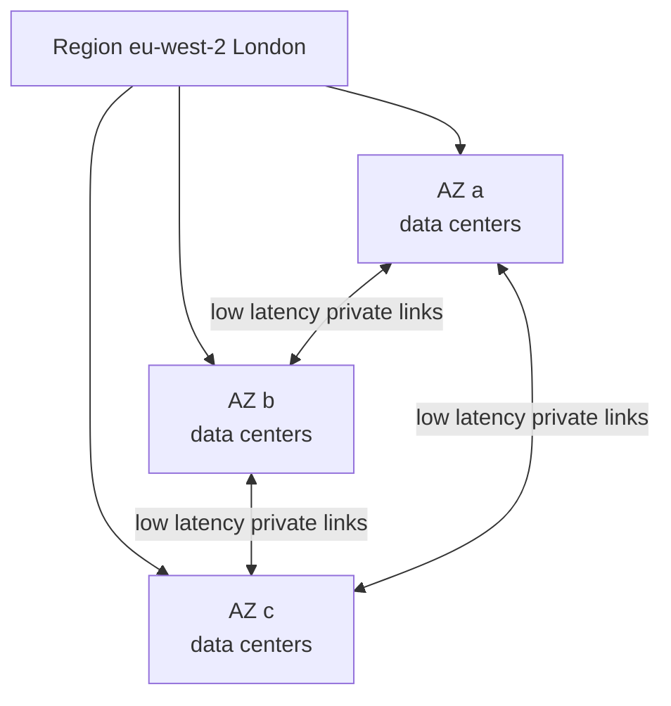

**Pros:**
- High availability inside one Region with low latency between copies.
- Many services do Multi-AZ for you (S3, DynamoDB, Aurora storage, EFS Regional).

**Cons / limits:**
- Data transfer between AZs is charged (small per-GB fee each way).
- Some resources are AZ-locked: an EC2 instance, an EBS volume, a subnet.

**Use it when / avoid when:**
- Use at least two AZs for anything in production.
- A single AZ is acceptable for dev/test, scratch data, or HPC that needs the lowest latency (cluster placement group).

**Exam facts:**
- "Highly available" on the exam almost always means "Multi-AZ."
- "Fault tolerant" means it keeps working with no interruption during a failure (more than just recovering).
- AZ names like `us-east-1a` are mapped randomly per account; AZ IDs like `use1-az1` are the same for everyone.
- EBS volumes and subnets live in one AZ; S3 Standard stores data across at least three AZs.

### Edge locations, Local Zones, Wavelength and Outposts

**What it is:** Edge locations are hundreds of small sites in major cities (points of presence) that serve cached content and DNS close to users. Local Zones extend a Region into a metro area for low-latency compute. Wavelength puts compute inside 5G carrier networks. Outposts are AWS racks installed in your own data center.

**Why it's used:** Edge locations make CloudFront, Route 53 and Global Accelerator fast worldwide. Local Zones help with latency-sensitive workloads like video editing or real-time gaming in a specific city. Outposts serve workloads that must stay on premises but want AWS APIs.

**How it works:** A user in Sydney requesting a file from a bucket in `us-east-1` hits a nearby edge location. If the file is cached there, it returns in milliseconds; otherwise the edge fetches it over the AWS backbone.

**Pros:**
- Global low latency without deploying to every Region.

**Cons / limits:**
- Edge locations do not run your general compute (only CloudFront Functions and Lambda@Edge).
- Local Zones and Outposts offer a subset of services.

**Use it when / avoid when:**
- Use edge services for static content, APIs used globally, DNS.
- Use Outposts only when data or latency must stay on premises.

**Exam facts:**
- CloudFront, Route 53, Global Accelerator and S3 Transfer Acceleration use edge locations.
- Outposts = AWS infrastructure on premises, managed by AWS.
- Local Zones = single-digit millisecond latency to a specific metro area.
- Wavelength = compute at the edge of 5G networks.

### The shared responsibility model

**What it is:** AWS is responsible for security **of** the cloud (hardware, data centers, the hypervisor, the global network). You are responsible for security **in** the cloud (your data, IAM users and permissions, OS patches on EC2, security group rules, encryption settings).

**Why it's used:** It tells you who must fix what. If an EC2 instance is hacked through an unpatched OS, that is your responsibility. If a data center loses power, that is AWS's.

**How it works:** The line moves depending on how managed the service is. With EC2 (infrastructure as a service) you patch the OS. With RDS, AWS patches the database engine and OS but you manage users, network access and encryption choices. With Lambda or S3, AWS handles almost everything below your code and data.

| Layer | EC2 | RDS | Lambda / S3 |
|---|---|---|---|
| Physical, network, hypervisor | AWS | AWS | AWS |
| Guest OS patching | You | AWS | AWS |
| Database engine patching | You (if self-installed) | AWS (you pick maintenance window) | n/a |
| App code | You | You | You |
| Network rules (security groups) | You | You | You (VPC config, bucket policies) |
| Data encryption choice | You | You | You |
| IAM permissions | You | You | You |

**Pros:**
- Managed services move work off your team.

**Cons / limits:**
- "AWS is secure" does not mean "my app is secure." Misconfigured S3 buckets are the classic customer-side failure.

**Use it when / avoid when:**
- Prefer managed services when the exam asks to "reduce operational overhead."

**Exam facts:**
- Customer: data, IAM, OS on EC2, firewall rules, client-side and server-side encryption choices.
- AWS: physical security, hardware, hypervisor, managed service infrastructure.
- Shared controls: patch management, configuration management, awareness and training (each party does its own part).
- "Least operational overhead" usually points to the most managed or serverless option.

### How AWS billing works

**What it is:** You pay for what you use, typically per second, per hour, per GB stored, per request, or per GB transferred. No upfront cost unless you choose a commitment discount.

**Why it's used:** It turns capital expense (buying servers) into operating expense, and lets you scale to zero.

**How it works:** The three cost drivers are **compute** (time running), **storage** (GB-months), and **data transfer**. Data coming **into** AWS is generally free. Data going **out** to the internet costs money. Data between AZs and between Regions also costs. Tools: AWS Budgets (alerts when you pass a threshold), Cost Explorer (analyze spend), cost allocation tags (per team or project), and the Pricing Calculator (estimate before building). New accounts get a Free Tier; AWS changed the Free Tier to a credits-based model in 2025, so check the current terms.

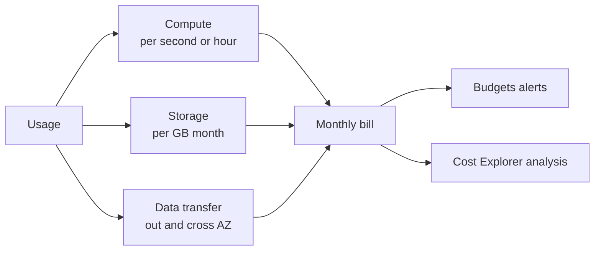

**Pros:**
- No upfront investment, easy to experiment.

**Cons / limits:**
- Surprise bills from NAT gateway data processing, data transfer out, or forgotten resources.

**Use it when / avoid when:**
- Always set a Budget alert on a new account.

**Exam facts:**
- Inbound data transfer is free; outbound to the internet is charged.
- Cross-AZ and cross-Region transfer is charged; same-AZ traffic over private IP is generally free.
- Commitment discounts: Reserved Instances and Savings Plans (1 or 3 years).
- AWS Budgets alerts; Cost Explorer analyzes and forecasts; Cost and Usage Report is the most detailed data.

#### Q: [Mid] A company must keep customer data inside Germany and serve users in Europe with low latency. Which TWO factors drive the Region choice first?

**Scenario:** A fintech startup in Berlin is choosing where to deploy. Options: A) Pick `us-east-1` because it is cheapest. B) Pick the Region based on data residency rules and latency to users, then confirm the needed services are available. C) Pick any Region and use CloudFront to fix latency. D) Deploy to every European Region for safety.

**Answer:** B. Compliance (data must stay in Germany, so `eu-central-1` Frankfurt) comes first, then latency, then service availability, then price.

**Why the others are wrong:** A ignores the residency requirement. C: CloudFront caches content at the edge but does not change where the data is stored. D adds cost and complexity without a requirement.

**Exam tip:** When a question mentions regulations or "data must not leave country X," that single fact decides the Region.

#### Q: [Mid] Under the shared responsibility model, who patches the OS of an EC2 instance and who patches the OS under an RDS database?

**Scenario:** An auditor asks who is responsible for OS patches. Options: A) AWS for both. B) Customer for both. C) Customer for EC2, AWS for RDS. D) AWS for EC2, customer for RDS.

**Answer:** C. EC2 is infrastructure you control, so you patch the guest OS. RDS is a managed service, so AWS patches the OS and engine during your maintenance window.

**Why the others are wrong:** A and B ignore the difference between IaaS and managed services. D is the reverse of reality.

**Exam tip:** The more managed the service, the more AWS owns. Your data and IAM are always yours.

#### Q: [Senior] A monthly bill doubled. Compute did not change. What are the usual hidden cost drivers and which tools find them?

**Scenario:** The team runs the same EC2 fleet, but the bill jumped. Options: A) Contact AWS Support to remove the charges. B) Use Cost Explorer grouped by service and usage type, look at data transfer and NAT gateway processing, and set AWS Budgets alerts. C) Move everything to a cheaper Region immediately. D) Turn on CloudTrail to see the bill.

**Answer:** B. Cost Explorer breaks the bill down by service and usage type. Common surprises are NAT gateway per-GB processing, data transfer out, cross-AZ traffic, unattached EBS volumes, old snapshots and idle load balancers. Budgets alerts catch the next spike early.

**Why the others are wrong:** A: Support does not waive normal usage. C is a risky migration before you know the cause. D: CloudTrail records API calls (who did what), not costs, though it can help find who created a resource.

**Exam tip:** "Analyze or visualize costs" = Cost Explorer. "Alert when spend exceeds X" = AWS Budgets. "Most detailed billing data" = Cost and Usage Report.

## 2. EC2, Auto Scaling and load balancing

EC2 is the classic virtual server. Most exam architectures put EC2 instances in an Auto Scaling group behind a load balancer across multiple AZs. Learn that pattern first; everything else is a variation.

### EC2 basics

**What it is:** Amazon Elastic Compute Cloud (EC2) gives you virtual machines ("instances") that you rent by the second. You choose CPU, memory, storage, network and OS.

**Why it's used:** Any workload that needs full control of the OS: legacy apps, custom software, long-running services, licensed software.

**How it works:** You launch an instance from an AMI (the disk image), into a subnet in one AZ, with a security group (firewall), an IAM role (permissions for code on the instance), a key pair or Session Manager for login, and storage (EBS volumes or instance store). The instance gets a private IP; it can also get a public IP or an Elastic IP (a static public IP you own until you release it).

**Pros:**
- Full control, any software, huge range of sizes.

**Cons / limits:**
- You patch and manage the OS.
- An instance lives in one AZ; you need multiple instances for high availability.

**Use it when / avoid when:**
- Use for full OS control, long-running processes, special hardware (GPU).
- Avoid when a managed or serverless option meets the need with less operations work.

**Exam facts:**
- Give code on EC2 permissions with an **IAM role** (instance profile), never stored access keys.
- Stopping an EBS-backed instance keeps EBS data; terminating deletes the root volume by default (`DeleteOnTermination`).
- Hibernate saves RAM to the encrypted EBS root volume for fast resume.
- Use IMDSv2 (session-based) for the instance metadata service.
- An Elastic IP is free while attached to a running instance in most cases, but AWS now charges for all public IPv4 addresses (since 2024), so hedge on "free."

### Instance families and naming

**What it is:** Instance types are grouped by what they are optimized for. A name like `m7g.xlarge` means: family `m` (general purpose), generation `7`, attribute `g` (AWS Graviton ARM processor), size `xlarge`.

**Why it's used:** Matching the family to the workload saves money. A memory-hungry cache on a compute-optimized instance wastes CPU you pay for.

**How it works:**

| Family | Letters | Optimized for | Typical workload |
|---|---|---|---|
| General purpose | M, T (burstable), Mac | Balanced CPU and memory | Web servers, small databases |
| Compute optimized | C | High CPU per GB RAM | Batch, gaming servers, encoding, HPC |
| Memory optimized | R, X, z, U (high memory) | Large RAM | In-memory caches, SAP HANA, big databases |
| Storage optimized | I, D, H | High local disk IOPS or throughput | NoSQL, data warehousing, Kafka |
| Accelerated computing | P, G, Inf, Trn, F | GPUs, ML chips, FPGAs | ML training and inference, graphics |

Attribute letters: `g` Graviton, `a` AMD, `i` Intel, `d` local NVMe instance store, `n` high networking, `e` extra storage or memory.

**Pros:**
- Graviton instances often give better price-performance for Linux workloads.

**Cons / limits:**
- T instances use CPU credits; a sustained high-CPU workload can run out (unless in unlimited mode, which costs extra).

**Use it when / avoid when:**
- Use T for spiky, mostly idle workloads. Avoid T for steady high CPU.

**Exam facts:**
- R = RAM (memory), C = compute, I = I/O (storage), P/G = GPU, T = burstable.
- Storage optimized instances come with NVMe instance store for very high IOPS.
- Right-size with AWS Compute Optimizer.

### AMIs and user data

**What it is:** An Amazon Machine Image (AMI) is a template containing the OS, software and configuration used to launch instances. User data is a script you pass at launch that runs on first boot.

**Why it's used:** AMIs give fast, identical launches (bake software in once). User data handles last-mile setup (pull config, start the app).

**How it works:** AMIs are regional; copy one to another Region to use it there. You can build "golden AMIs" with EC2 Image Builder. User data runs as root, by default only on the first boot, and is limited to 16 KB.

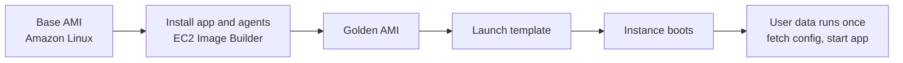

**Pros:**
- Golden AMIs cut boot time, which makes Auto Scaling react faster.

**Cons / limits:**
- Baked AMIs go stale; you need a pipeline to rebuild with patches.
- Long user data scripts slow scale-out.

**Use it when / avoid when:**
- Bake slow, stable steps into the AMI; keep per-environment config in user data or Parameter Store.

**Exam facts:**
- AMIs are regional; copy them to use in another Region (and share across accounts).
- User data runs as root on first launch by default.
- "Reduce instance boot time" = golden AMI (pre-installed software), not a longer user data script.
- Encrypted AMIs shared cross-account need the KMS key shared too.

### EC2 purchase options

**What it is:** The same instance can be paid for in different ways, trading flexibility for discount.

**Why it's used:** Steady workloads should not pay on-demand prices; interruptible workloads can use spare capacity very cheaply.

**How it works:**

| Option | Discount vs On-Demand | Commitment | Can be interrupted | Best for |
|---|---|---|---|---|
| On-Demand | none | none | no | Short, unpredictable workloads |
| Reserved Instances (Standard) | up to about 72% | 1 or 3 years, specific instance family/Region | no | Steady state, known type |
| Reserved Instances (Convertible) | up to about 66% | 1 or 3 years, can change family | no | Steady but may change type |
| Compute Savings Plans | up to about 66% | 1 or 3 years of $/hour spend | no | Steady spend across EC2, Fargate, Lambda |
| EC2 Instance Savings Plans | up to about 72% | $/hour for a family in a Region | no | Steady, one family |
| Spot Instances | up to about 90% | none | yes, 2-minute warning | Fault-tolerant, stateless, batch |
| Dedicated Instances | premium | none or reserved | no | Hardware not shared with other accounts |
| Dedicated Hosts | premium | on-demand or reserved | no | BYOL licenses tied to sockets/cores, compliance |
| On-Demand Capacity Reservations | none by itself | none (pay while reserved) | no | Guarantee capacity in an AZ |

Payment for RIs: all upfront (largest discount), partial upfront, no upfront. Percentages are approximate and change; check current pricing.

**Pros:**
- Mixing options (Savings Plan for baseline, Spot for burst, On-Demand for the rest) can cut cost dramatically.

**Cons / limits:**
- Commitments are paid whether you use them or not.
- Spot can be reclaimed at any time with a two-minute notice.

**Use it when / avoid when:**
- Spot: batch jobs, CI runners, stateless web tiers in an ASG with mixed instances. Avoid for a single critical database.
- Dedicated Host: licenses per physical core or socket (some Oracle, Windows Server, SQL Server licensing).

**Exam facts:**
- "Cheapest for fault-tolerant, interruptible" = Spot.
- "Steady 24/7 for 3 years" = Reserved Instances or Savings Plans, 3-year all upfront for max discount.
- "Flexibility across instance families, Regions, Fargate and Lambda" = Compute Savings Plan.
- "Existing server-bound licenses" or "visibility into sockets/cores" = Dedicated Host.
- "Guarantee capacity in a specific AZ for an event" = On-Demand Capacity Reservation (combine with Savings Plans for discount).
- Spot Fleet / EC2 Fleet launch a mix of Spot and On-Demand across pools with an allocation strategy (`price-capacity-optimized` is the recommended default).

### Placement groups

**What it is:** A placement group tells EC2 how to physically place a set of instances relative to each other.

**Why it's used:** To get the lowest network latency between instances, or to make sure instances do not share hardware failures.

**How it works:**

| Strategy | Placement | Strength | Weakness | Use case |
|---|---|---|---|---|
| Cluster | Packed close together in one AZ | Lowest latency, highest throughput (up to high Gbps between instances) | One rack or AZ failure hits all | HPC, tightly coupled jobs |
| Spread | Each instance on distinct hardware | Minimizes correlated failure | Max 7 running instances per AZ per group | Small set of critical instances |
| Partition | Groups (partitions) on separate racks, up to 7 partitions per AZ | Large distributed systems with rack awareness | Instances within a partition share racks | HDFS, HBase, Cassandra, Kafka |

**Pros:**
- Free to use.

**Cons / limits:**
- Cluster groups can hit insufficient capacity errors; launch all instances at once with the same type.

**Use it when / avoid when:**
- Cluster for HPC; spread for a handful of must-not-fail-together instances; partition for big data clusters.

**Exam facts:**
- "Low latency, 10+ Gbps between nodes, HPC" = cluster placement group (plus Elastic Fabric Adapter for MPI).
- "Maximum isolation of a few critical instances" = spread (7 per AZ limit).
- "Hadoop, Cassandra, Kafka, rack-aware" = partition.

### Auto Scaling groups and scaling policies

**What it is:** An Auto Scaling group (ASG) keeps a fleet of EC2 instances at the right size: it replaces unhealthy instances and adds or removes instances based on demand.

**Why it's used:** A trading dashboard has 10x traffic at market open. You do not want to pay for peak capacity all day, and you do not want to crash at 9:30.

**How it works:** You define a **launch template** (AMI, instance type, security group, user data), the subnets (spread across AZs), and **min / desired / max** capacity. The ASG balances instances across AZs. It uses EC2 status checks by default, and can also use ELB health checks so that an instance failing the app health check is replaced.

| Policy | How it decides | Example |
|---|---|---|
| Target tracking | Keep a metric at a target (like a thermostat) | Keep average CPU at 50% |
| Step scaling | Add or remove by amounts depending on alarm breach size | CPU over 70%: +2, over 90%: +4 |
| Simple scaling | One adjustment per alarm, then wait for cooldown | Legacy; prefer step or target tracking |
| Scheduled | At a set time | Scale to 20 at 09:00 on weekdays |
| Predictive | ML forecast from history, scales ahead of time | Daily cyclical traffic |

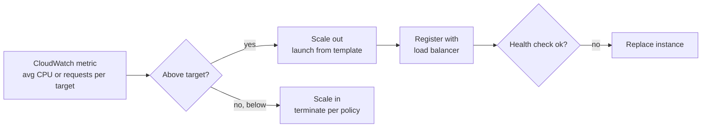

Other features: **cooldown** (default 300 seconds for simple scaling), **instance warmup**, **lifecycle hooks** (run a script before an instance goes in service or is terminated, e.g. drain logs), **warm pools** (pre-initialized stopped instances for fast scale-out), **instance refresh** (rolling replacement to a new launch template), and **termination policies** (default: balance AZs, then oldest launch template).

**Pros:**
- Self-healing plus elasticity, at no extra charge beyond the instances.

**Cons / limits:**
- Reacts in minutes, not seconds. Sudden spikes need predictive or scheduled scaling, or a warm pool.
- Instances must be stateless (store sessions in ElastiCache or DynamoDB).

**Use it when / avoid when:**
- Use for any EC2 fleet in production, even with min = max = 1 for self-healing.

**Exam facts:**
- Launch templates replace launch configurations (deprecated).
- "Replace instances that fail the application health check" = enable ELB health checks on the ASG.
- Target tracking on `ALBRequestCountPerTarget` is a common right answer for web tiers.
- "Known daily spike at 9 AM" = scheduled or predictive scaling.
- Lifecycle hooks let you run custom actions on launch or terminate.

### Elastic Load Balancing: ALB, NLB, GWLB

**What it is:** A managed load balancer that spreads incoming traffic across healthy targets in multiple AZs.

**Why it's used:** One stable DNS name in front of many instances or containers, with health checks, TLS termination and routing.

**How it works:** A load balancer has **listeners** (port and protocol), **rules**, and **target groups** (instances, IPs, Lambda functions, or another ALB). It sends traffic only to targets passing health checks.

| | Application LB (ALB) | Network LB (NLB) | Gateway LB (GWLB) |
|---|---|---|---|
| OSI layer | 7 (HTTP, HTTPS, gRPC, WebSocket) | 4 (TCP, UDP, TLS) | 3 (IP packets, GENEVE port 6081) |
| Routing | Path, host, header, query string, method, source IP | Port based | Sends all traffic through appliances |
| Static IP | No (use Global Accelerator) | Yes, one per AZ, Elastic IP supported | n/a |
| Performance | Scales automatically, adds some latency | Millions of requests per second, ultra-low latency | High throughput |
| Targets | Instances, IPs, Lambda, containers | Instances, IPs, ALB | Virtual appliances (firewalls, IDS) |
| Typical use | Web apps, microservices, APIs | Gaming, IoT, financial feeds, non-HTTP, static IP needs | Third-party firewalls, deep packet inspection |
| WAF support | Yes | No | No |

The Classic Load Balancer is legacy; do not choose it for new designs.

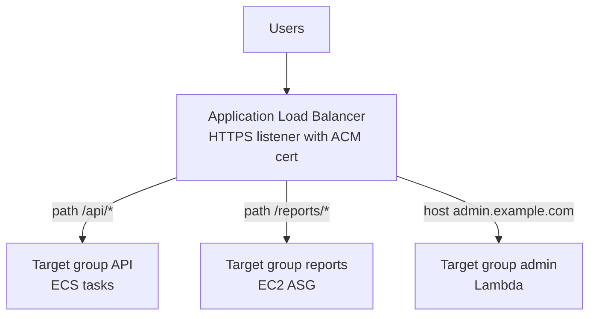

**Pros:**
- Managed, Multi-AZ, integrates with ASG, ECS, ACM certificates, WAF.

**Cons / limits:**
- ALB has no fixed IP. NLB cross-zone traffic is billed.

**Use it when / avoid when:**
- ALB for HTTP. NLB for TCP/UDP, extreme performance or static IPs. GWLB for inline security appliances.

**Exam facts:**
- Path-based or host-based routing = ALB.
- Static IP or Elastic IP on the load balancer, or UDP = NLB.
- Third-party virtual appliances = GWLB (GENEVE on port 6081).
- Client IP behind ALB is in the `X-Forwarded-For` header; NLB preserves the source IP.
- Sticky sessions (session affinity) use cookies on ALB; SNI lets one listener serve many TLS certificates.
- Cross-zone load balancing: on by default for ALB (no inter-AZ charge), off by default for NLB and GWLB (charged when enabled).
- Deregistration delay (connection draining) lets in-flight requests finish before a target is removed.

#### Q: [Mid] A batch image-processing job runs nightly, can restart if interrupted, and must be as cheap as possible. Which purchase option?

**Scenario:** Jobs take 2–4 hours, write checkpoints to S3, and can be retried. Options: A) On-Demand Instances. B) Spot Instances. C) 3-year Reserved Instances. D) Dedicated Hosts.

**Answer:** B. Spot gives up to about 90% off and the job tolerates interruption thanks to checkpoints.

**Why the others are wrong:** A works but costs far more. C needs a 24/7 steady workload to pay off; a nightly job wastes most reserved hours. D is the most expensive and is for licensing or compliance.

**Exam tip:** Keywords "interruptible," "can be restarted," "fault tolerant," "flexible start time" mean Spot.

#### Q: [Senior] A web app on EC2 behind an ALB sometimes serves errors because an instance's app process hangs while the VM stays up. The ASG never replaces it. Fix?

**Scenario:** EC2 status checks pass, but the app returns 500s. Options: A) Increase the ASG max size. B) Configure the ASG to use ELB health checks so instances failing the target group health check are replaced. C) Add a CloudWatch alarm that emails the team. D) Switch to a Network Load Balancer.

**Answer:** B. By default an ASG only uses EC2 status checks, which look at the hypervisor and OS, not the app. With ELB health checks enabled, the ASG terminates and replaces instances the load balancer marks unhealthy.

**Why the others are wrong:** A adds capacity but the broken instance remains. C notifies but does not heal. D changes the protocol layer and does not fix health checking.

**Exam tip:** "The ALB already stops routing to it, but the instance is never replaced" always means: turn on ELB health checks in the ASG.

#### Q: [Mid] A UDP-based multiplayer game needs a load balancer with a fixed IP address that partners can allow-list. Which one?

**Scenario:** Options: A) Application Load Balancer. B) Network Load Balancer with Elastic IPs. C) Classic Load Balancer. D) Gateway Load Balancer.

**Answer:** B. NLB supports UDP and lets you attach an Elastic IP per AZ, giving stable IPs for allow-lists.

**Why the others are wrong:** A is HTTP/HTTPS only and has no static IP. C is legacy and has no UDP. D is for routing traffic through security appliances, not serving clients.

**Exam tip:** UDP, static IP, millions of requests per second or "extreme low latency" all point to NLB. If they want static IPs in front of an ALB, add Global Accelerator.

#### Q: [Senior] An HPC simulation needs the lowest possible latency between 20 instances. Another app runs 5 critical instances that must not fail together. Which placement groups?

**Scenario:** Options: A) Spread for HPC, cluster for the critical app. B) Cluster for HPC, spread for the critical app. C) Partition for both. D) No placement group; use multiple AZs.

**Answer:** B. Cluster packs instances close in one AZ for low latency. Spread puts each instance on separate hardware (up to 7 per AZ), so five instances fit.

**Why the others are wrong:** A is reversed. C: partition is designed for large rack-aware systems like Kafka, not lowest latency. D: spreading across AZs increases latency for HPC.

**Exam tip:** Remember "cluster = speed, spread = safety, partition = big data."

## 3. Serverless, containers and managed platforms

Moving right on the "how much do I manage" scale: containers on ECS or EKS, then Fargate (no servers to manage for containers), then Lambda (just functions). Beanstalk, Lightsail and App Runner are simplified platforms on top.

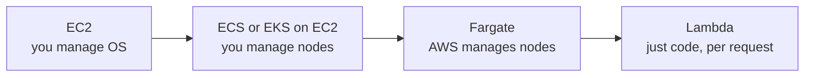

### AWS Lambda

**What it is:** Lambda runs your function code in response to events, without servers to manage. You pay per request and per millisecond of compute (memory times duration).

**Why it's used:** Event-driven glue and APIs: resize an image when it lands in S3, process a payment webhook, run an API behind API Gateway, react to DynamoDB Streams.

**How it works:** You upload code (zip or container image) and configure memory (128 MB to 10,240 MB; CPU scales with memory), timeout (max 15 minutes), and a trigger. There are three invocation styles: **synchronous** (API Gateway, ALB, function URL: caller waits), **asynchronous** (S3, SNS, EventBridge: Lambda queues the event and retries twice on error, then sends to a dead-letter queue or on-failure destination), and **event source mapping** (Lambda polls SQS, Kinesis, DynamoDB Streams, Kafka and invokes in batches).

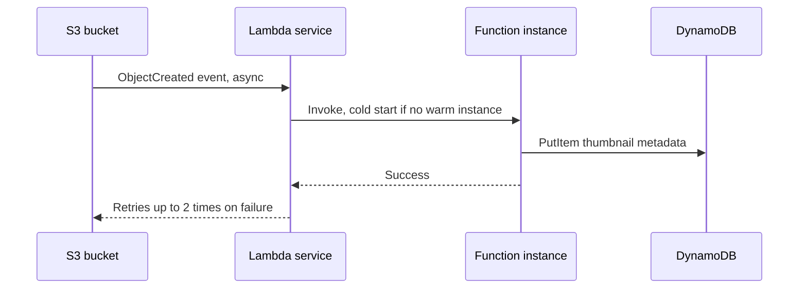

**Pros:**
- No servers, scales from zero to thousands of concurrent executions, pay only when running.
- Deep integration with AWS event sources.

**Cons / limits:**
- 15-minute max duration.
- Cold starts add latency (mitigate with provisioned concurrency or SnapStart).
- Default concurrency quota per Region is about 1,000 (soft limit, can be raised).
- Package size limits: 50 MB zipped direct upload, 250 MB unzipped including layers, or 10 GB container image.
- `/tmp` ephemeral storage configurable up to 10 GB.

**Use it when / avoid when:**
- Use for event-driven, short, spiky workloads.
- Avoid for jobs over 15 minutes (use Batch, ECS or Step Functions to orchestrate), or steady high-throughput workloads where containers are cheaper.

**Exam facts:**
- Max timeout 15 minutes; memory up to 10 GB; ephemeral storage up to 10 GB.
- Reserved concurrency caps (and guarantees) a function's concurrency; provisioned concurrency keeps instances warm to remove cold starts.
- Lambda in a VPC can reach private resources (RDS); to reach the internet it then needs a NAT gateway.
- Use RDS Proxy to stop many Lambda instances from exhausting database connections.
- Async failures go to a DLQ (SQS or SNS) or on-failure destinations.
- Store secrets in Secrets Manager or Parameter Store, not plain environment variables.

### Amazon ECS

**What it is:** Elastic Container Service is AWS's own container orchestrator. It runs Docker containers ("tasks") and keeps the right number running ("services").

**Why it's used:** Run microservices or workers in containers without learning Kubernetes.

**How it works:** A **task definition** describes containers (image, CPU, memory, ports, environment, IAM roles). A **service** keeps N tasks running, integrates with an ALB, and can auto scale. A **cluster** is the logical group. Launch types: **EC2** (you manage the container instances, can use Spot, more control) or **Fargate** (serverless). Two IAM roles matter: the **task execution role** (lets ECS pull images from ECR and write logs) and the **task role** (what your app code may call, e.g. S3).

**Pros:**
- Simpler than Kubernetes, tight AWS integration, no control plane fee.

**Cons / limits:**
- AWS-specific; not portable like Kubernetes manifests.

**Use it when / avoid when:**
- Use for containerized apps on AWS when you do not need Kubernetes.

**Exam facts:**
- Task role = permissions for your app; task execution role = permissions for ECS agent (pull from ECR, push logs).
- ECS service auto scaling uses Application Auto Scaling (target tracking on CPU, memory, or ALB request count).
- ALB with dynamic port mapping lets many tasks share one EC2 host.
- Images are typically stored in Amazon ECR.

### Amazon EKS

**What it is:** Elastic Kubernetes Service is managed Kubernetes. AWS runs the control plane; you run workloads with standard Kubernetes tools.

**Why it's used:** Teams already on Kubernetes, multi-cloud portability, or a need for the Kubernetes ecosystem (Helm, operators).

**How it works:** Worker capacity options: **managed node groups** (AWS manages EC2 node lifecycle), **self-managed nodes**, **Fargate** profiles (pods run serverless), and **EKS Auto Mode** (AWS manages nodes, scaling and core add-ons). Karpenter or Cluster Autoscaler scale nodes.

**Pros:**
- Standard Kubernetes, portable, huge ecosystem.

**Cons / limits:**
- Per-cluster hourly fee, steeper learning curve, more to operate than ECS.

**Use it when / avoid when:**
- Use when the question says "Kubernetes," "existing Kubernetes," or "open source, cloud agnostic."
- Avoid when the team has no Kubernetes skills and wants least operational overhead (ECS on Fargate).

**Exam facts:**
- "Migrate existing Kubernetes workloads" = EKS.
- Pods get IAM permissions through IAM Roles for Service Accounts (IRSA) or EKS Pod Identity.
- EKS supports EC2 nodes, Fargate and Auto Mode.

### AWS Fargate

**What it is:** A serverless compute engine for containers. You specify CPU and memory per task or pod; AWS provides and manages the underlying servers.

**Why it's used:** Run containers without patching, scaling or right-sizing EC2 hosts.

**How it works:** Works as a launch type for ECS and as a profile for EKS. Each task gets its own isolated kernel and an ENI in your subnet (awsvpc networking), so security groups apply per task. Fargate Spot gives a discount for interruptible tasks.

**Pros:**
- No nodes to manage, per-task isolation, pay per vCPU and GB per second.

**Cons / limits:**
- Higher unit price than well-utilized EC2. No GPU support on Fargate (use EC2). No privileged containers or host access.

**Use it when / avoid when:**
- Use for "containers with least operational overhead."
- Avoid for GPU workloads or when you can keep EC2 hosts highly utilized.

**Exam facts:**
- "Run containers without managing servers or clusters" = ECS (or EKS) on Fargate.
- Each Fargate task has its own ENI and security group.
- Fargate Spot exists for interruptible ECS tasks.

### AWS Elastic Beanstalk

**What it is:** A platform-as-a-service. Upload your code (Java, .NET, Node.js, Python, PHP, Ruby, Go, Docker) and Beanstalk creates the EC2 instances, ASG, load balancer and monitoring for you.

**Why it's used:** Developers who want to deploy a standard web app fast without designing the infrastructure, while still being able to see and tweak the resources.

**How it works:** An **application** has **environments** (web server tier or worker tier with SQS). Deployment policies:

| Policy | Downtime | Extra capacity | Rollback |
|---|---|---|---|
| All at once | Yes | No | Redeploy |
| Rolling | No, reduced capacity | No | Redeploy |
| Rolling with additional batch | No, full capacity | One batch | Redeploy |
| Immutable | No | Full new ASG temporarily | Fast, terminate new ASG |
| Traffic splitting | No | New instances, canary percentage | Fast |
| Blue/green | No | Whole new environment | Swap URL back |

**Pros:**
- Fast to start, you keep full access to underlying resources, no extra charge.

**Cons / limits:**
- Less flexible for unusual architectures; configuration via `.ebextensions` can get messy.

**Use it when / avoid when:**
- Use for "developers want to deploy quickly without managing infrastructure" with a classic web app.

**Exam facts:**
- Beanstalk itself is free; you pay for the resources it creates.
- Blue/green in Beanstalk = clone environment, deploy, then swap environment URLs (a DNS change).
- Immutable deployments are the safest in-place option for quick rollback.
- Worker environments process messages from an SQS queue.

### AWS Batch

**What it is:** A managed service that runs batch computing jobs (containers) at any scale, queuing them and provisioning the right EC2, Spot or Fargate capacity.

**Why it's used:** Thousands of jobs such as end-of-day risk calculations, genomics, video rendering, which may run longer than 15 minutes.

**How it works:** You define **job definitions** (container image, vCPU, memory), submit jobs to **job queues**, and Batch schedules them onto **compute environments** that it scales up and down (including Spot).

**Pros:**
- No scheduler to run, uses Spot automatically, supports dependencies and array jobs.

**Cons / limits:**
- Not for low-latency request/response work.

**Use it when / avoid when:**
- Use when jobs exceed Lambda's 15 minutes or need lots of CPU/GPU.

**Exam facts:**
- "Batch jobs longer than 15 minutes, managed, cost-effective" = AWS Batch with Spot.
- Batch runs containers on EC2, Spot, Fargate, or EKS.
- Lambda vs Batch: Lambda for short and event-driven; Batch for long, heavy, queued.

### Amazon Lightsail (brief)

**What it is:** Simple virtual private servers with a fixed monthly price that bundles compute, storage and data transfer. Also offers simple databases, load balancers and containers.

**Why it's used:** Small websites, WordPress, dev environments, people new to cloud who want predictable cost.

**How it works:** Pick a blueprint (e.g. WordPress, LAMP) and a bundle size. Peering with a default VPC is possible for limited integration.

**Pros:**
- Very simple, predictable pricing.

**Cons / limits:**
- Limited scaling and integration compared with EC2.

**Use it when / avoid when:**
- Use for simple, low-traffic apps. Avoid for enterprise architectures.

**Exam facts:**
- "Simple, low cost, predictable monthly price, little cloud experience" = Lightsail.

### AWS App Runner (brief)

**What it is:** A fully managed service that turns source code or a container image into a running, auto-scaling HTTPS web service.

**Why it's used:** Deploy a web app or API without configuring load balancers, clusters or scaling.

**How it works:** Point App Runner at an ECR image or a source repository; it builds, deploys, provides a URL with TLS, and scales on concurrent requests. It can connect to private VPC resources through a VPC connector.

**Pros:**
- Minimal configuration.

**Cons / limits:**
- Fewer controls than ECS. AWS has been adding simpler ECS options too, so check the current service status and recommendations before choosing it for new work.

**Use it when / avoid when:**
- Use for simple web services with very little ops effort.

**Exam facts:**
- "Deploy a containerized web app from source or image with no infrastructure experience" = App Runner.

#### Q: [Mid] A function must process each uploaded file. Processing takes about 40 minutes per file. A developer proposes Lambda. What should you choose?

**Scenario:** Files arrive in S3 a few hundred times per day. Options: A) Lambda with maximum memory. B) Lambda with a 60-minute timeout. C) S3 event to an SQS queue or EventBridge rule that starts an AWS Batch job or an ECS task on Fargate. D) A single large EC2 instance polling S3 every minute.

**Answer:** C. The job exceeds Lambda's 15-minute limit. An event triggers a container job on Batch or Fargate, which has no such limit and scales with demand.

**Why the others are wrong:** A: more memory speeds up code but does not lift the 15-minute cap. B: Lambda cannot be set above 15 minutes. D works but is a single point of failure and wastes money when idle.

**Exam tip:** Any task over 15 minutes rules out a single Lambda invocation. Look for Batch, ECS/Fargate or Step Functions splitting the work.

#### Q: [Senior] A team wants to run containerized microservices with the least operational overhead. They have no Kubernetes experience. Which option?

**Scenario:** Options: A) EKS with self-managed nodes. B) ECS with the EC2 launch type. C) ECS with Fargate. D) Docker installed on EC2 in an ASG.

**Answer:** C. ECS is simpler than Kubernetes, and Fargate removes server management.

**Why the others are wrong:** A requires Kubernetes skills and node management. B means patching and scaling EC2 hosts. D means building your own orchestration.

**Exam tip:** "Least operational overhead" + containers = Fargate. "Kubernetes" in the question = EKS (with Fargate or Auto Mode if they also want low ops).

#### Q: [Senior] Hundreds of Lambda functions behind API Gateway open connections to an RDS PostgreSQL database during a traffic spike. The database runs out of connections. Best fix?

**Scenario:** Options: A) Increase the RDS instance size only. B) Put Amazon RDS Proxy between Lambda and RDS. C) Set Lambda reserved concurrency to 1. D) Move the database to S3.

**Answer:** B. RDS Proxy pools and reuses database connections, so thousands of short-lived Lambda instances share a small pool. It also speeds up failover and supports IAM authentication.

**Why the others are wrong:** A raises the max connections a bit but does not solve the pattern. C fixes connections by breaking throughput. D: S3 is object storage, not a relational database.

**Exam tip:** Lambda + RDS + "too many connections" = RDS Proxy.

#### Q: [Mid] An app on ECS needs to read objects from an S3 bucket. Where do you grant that permission?

**Scenario:** Options: A) Put an IAM user's access keys in the container's environment variables. B) Attach the S3 policy to the ECS task role. C) Attach it to the task execution role. D) Make the bucket public.

**Answer:** B. The task role provides credentials to the application code in the task.

**Why the others are wrong:** A: long-lived keys in config are a security anti-pattern. C: the execution role is for ECS itself (pull images, write logs), not your app. D exposes data to everyone.

**Exam tip:** Code running on AWS should always get permissions from a role: EC2 instance profile, ECS task role, Lambda execution role, EKS pod identity.

## 4. Amazon S3: object storage

S3 is the most tested storage service. It is not a disk and not a file system: it stores whole objects (files plus metadata) by key in buckets, accessed over HTTPS APIs.

### S3 basics

**What it is:** Simple Storage Service stores objects of any type, up to 5 TB each, in **buckets**. Each object has a **key** (like `statements/2026/09/acct-123.pdf`), the data, and metadata. Durability is designed for 99.999999999% (eleven nines).

**Why it's used:** Store user uploads, statements, backups, logs, data lake files, and static website assets. It scales without limits and is cheap per GB.

**How it works:** Bucket names are globally unique, but a bucket lives in one Region. "Folders" are just key prefixes. Uploads over 100 MB should use **multipart upload** (required above 5 GB). S3 has **strong read-after-write consistency** for all operations. Access is controlled by IAM policies, bucket policies, and Block Public Access (on by default). ACLs are disabled by default (Object Ownership: bucket owner enforced).

**Pros:**
- Virtually unlimited, very durable, cheap, integrates with everything.

**Cons / limits:**
- Not a POSIX file system, no in-place partial edits (you rewrite the object).
- Request rate guidance: at least 3,500 writes and 5,500 reads per second per prefix (spread keys across prefixes for more).

**Use it when / avoid when:**
- Use for files, backups, data lakes, static content.
- Avoid as a database or as a shared drive that apps write to with file locks (use EFS or FSx).

**Exam facts:**
- Max object size 5 TB; single PUT max 5 GB; multipart recommended over 100 MB.
- Strong read-after-write consistency.
- Performance scales per prefix (3,500 PUT / 5,500 GET per second per prefix).
- Block Public Access is on by default for new buckets; use bucket policies, not ACLs.
- S3 Express One Zone uses "directory buckets" in a single AZ for single-digit millisecond latency.

### S3 storage classes

**What it is:** Different price and access-speed tiers for objects. You pay less to store data you read rarely, but pay retrieval fees and minimum durations.

**Why it's used:** A statement from last week is read often; a statement from 2019 is almost never read but must be kept for 7 years. They should not cost the same.

**How it works:**

| Class | AZs | First-byte latency | Min storage duration | Retrieval fee | Use case |
|---|---|---|---|---|---|
| S3 Standard | 3 or more | milliseconds | none | no | Frequently accessed data |
| S3 Intelligent-Tiering | 3 or more | milliseconds (archive tiers are opt-in and slower) | none | no (small monitoring fee per object) | Unknown or changing access patterns |
| S3 Express One Zone | 1 | single-digit ms | 1 hour | no | Very low latency, high request rate (ML, analytics) |
| S3 Standard-IA | 3 or more | milliseconds | 30 days | yes, per GB | Infrequent access, needs fast retrieval (backups, DR) |
| S3 One Zone-IA | 1 | milliseconds | 30 days | yes | Re-creatable infrequent data, secondary copies |
| S3 Glacier Instant Retrieval | 3 or more | milliseconds | 90 days | yes, higher | Archive accessed about once a quarter, needs instant access |
| S3 Glacier Flexible Retrieval | 3 or more | minutes to hours (expedited 1–5 min, standard 3–5 h, bulk 5–12 h) | 90 days | yes (bulk free) | Archives, retrieval can wait |
| S3 Glacier Deep Archive | 3 or more | hours (standard within 12 h, bulk within 48 h) | 180 days | yes | Long-term compliance retention, lowest cost |

The IA and Glacier Instant Retrieval classes have a minimum billable object size of 128 KB. Numbers are as published; check current docs.

**Pros:**
- Large savings for cold data.

**Cons / limits:**
- Minimum duration charges if you delete early; retrieval charges can surprise you.

**Use it when / avoid when:**
- Use Intelligent-Tiering when you cannot predict access. Use lifecycle rules when you can.

**Exam facts:**
- "Unknown or unpredictable access pattern" = Intelligent-Tiering.
- "Infrequent but immediate access, must survive AZ loss" = Standard-IA.
- "Infrequent, re-creatable, cheapest with ms access" = One Zone-IA.
- "Archive, retrieve in milliseconds" = Glacier Instant Retrieval.
- "Archive, retrieve within 12 hours, cheapest" = Glacier Deep Archive.
- Minimum durations: 30 days (IA), 90 days (Glacier IR and Flexible), 180 days (Deep Archive).

### S3 lifecycle rules

**What it is:** Rules on a bucket that automatically move objects to cheaper classes or delete them after a number of days.

**Why it's used:** Automate cost savings and retention: keep statements in Standard for 30 days, then Standard-IA, then Glacier Deep Archive after a year, delete after 7 years.

**How it works:** A rule targets a prefix or tags and defines **transition actions** and **expiration actions**. With versioning, you can also expire noncurrent versions and clean up incomplete multipart uploads.

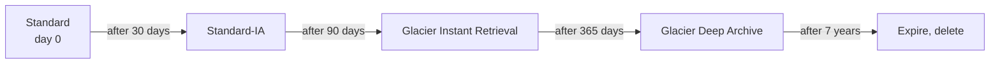

**Pros:**
- Hands-off, rules apply to existing and new objects.

**Cons / limits:**
- Objects must be in Standard or Standard-IA for at least 30 days before a lifecycle transition to Standard-IA or One Zone-IA.
- Transitions have per-request costs; avoid transitioning millions of tiny objects.

**Use it when / avoid when:**
- Use when access drops predictably with age.

**Exam facts:**
- Lifecycle can expire old versions (`NoncurrentVersionExpiration`) and abort incomplete multipart uploads.
- S3 Storage Lens and Storage Class Analysis help decide transition days.
- Lifecycle cannot move objects "up" to a warmer class; you copy or restore instead.

### Versioning and replication (CRR and SRR)

**What it is:** **Versioning** keeps every version of an object; a delete adds a "delete marker" instead of removing data. **Replication** copies objects asynchronously to another bucket, in another Region (Cross-Region Replication, CRR) or the same Region (Same-Region Replication, SRR).

**Why it's used:** Versioning protects against accidental overwrites and deletes. CRR serves compliance (copy in a second Region), lower latency for distant users, and disaster recovery. SRR aggregates logs or keeps a copy in a different account.

**How it works:** Both buckets must have versioning on. An IAM role lets S3 replicate. Only new objects replicate after the rule is created; use **S3 Batch Replication** for existing ones. Delete markers can optionally replicate; deletes of specific versions do not (to protect against malicious deletes). **S3 Replication Time Control (RTC)** gives an SLA of replicating 99.99% of objects within 15 minutes.

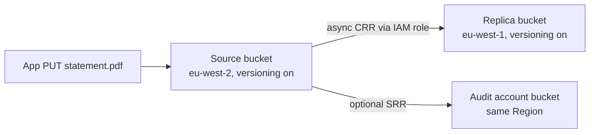

**Pros:**
- Protection from user error and Regional disasters.

**Cons / limits:**
- Versioning stores every version, which costs money; pair with lifecycle rules.
- Versioning cannot be turned off once enabled, only suspended.
- Replication is not chained (A to B to C does not copy A's objects to C).

**Use it when / avoid when:**
- Enable versioning on any bucket holding important data.

**Exam facts:**
- Replication requires versioning on both source and destination.
- Existing objects need S3 Batch Replication.
- RTC = 15-minute replication SLA.
- MFA Delete (root user only, CLI) adds protection for version deletes.
- Replication can change the storage class and owner of the replica (useful for cross-account).

### S3 encryption options

**What it is:** Ways to encrypt objects at rest, plus TLS for data in transit.

**Why it's used:** Compliance (PCI DSS, SOC 2) and defense in depth.

**How it works:**

| Option | Who manages keys | Notes |
|---|---|---|
| SSE-S3 | S3 (AES-256) | Default for all new objects since January 2023, no extra cost |
| SSE-KMS | AWS KMS key (AWS managed or customer managed) | Audit key use in CloudTrail, control key policy, KMS request quotas apply; S3 Bucket Keys cut KMS calls and cost |
| DSSE-KMS | KMS, two layers of encryption | For standards that require dual-layer encryption |
| SSE-C | You provide the key on every request | AWS does not store the key; HTTPS required. AWS has moved to disable SSE-C by default on new buckets, so check current behavior |
| Client-side | You encrypt before upload | AWS never sees plaintext |

Enforce TLS with a bucket policy condition `aws:SecureTransport = false` then Deny. Enforce a specific encryption with a condition on `s3:x-amz-server-side-encryption`, or rely on default bucket encryption.

**Pros:**
- Encryption at rest is automatic; KMS gives audit and fine-grained control.

**Cons / limits:**
- SSE-KMS adds KMS API calls that can be throttled at high request rates (use Bucket Keys).

**Use it when / avoid when:**
- SSE-KMS with a customer managed key when you need to control rotation, key policies, and audit who decrypted.

**Exam facts:**
- "Audit trail of key usage" or "control over key rotation" = SSE-KMS with a customer managed key.
- "Company must manage keys outside AWS" = SSE-C or client-side encryption.
- Default encryption is SSE-S3 for all new uploads.
- Use a bucket policy to deny non-HTTPS requests.

### Presigned URLs and static website hosting

**What it is:** A **presigned URL** grants temporary access to one object (GET or PUT) using the signer's permissions. **Static website hosting** serves a bucket as an HTTP website.

**Why it's used:** Let a browser upload a receipt directly to S3 without routing bytes through your API, or let a user download their private statement for 5 minutes. Host a React single-page app cheaply.

**How it works:** Your backend (with IAM permission) generates a signed URL with an expiry. The client uses it directly. With SigV4, expiry can be up to 7 days, but it also ends when the signing credentials expire (for a role, often hours).

```typescript
import { S3Client, PutObjectCommand } from "@aws-sdk/client-s3";
import { getSignedUrl } from "@aws-sdk/s3-request-presigner";

const s3 = new S3Client({ region: "eu-west-2" });

export async function createReceiptUploadUrl(accountId: string, receiptId: string): Promise<string> {
  const command = new PutObjectCommand({
    Bucket: "acme-receipts",
    Key: `receipts/${accountId}/${receiptId}.pdf`,
    ContentType: "application/pdf",
  });
  return getSignedUrl(s3, command, { expiresIn: 300 }); // 5 minutes
}
```

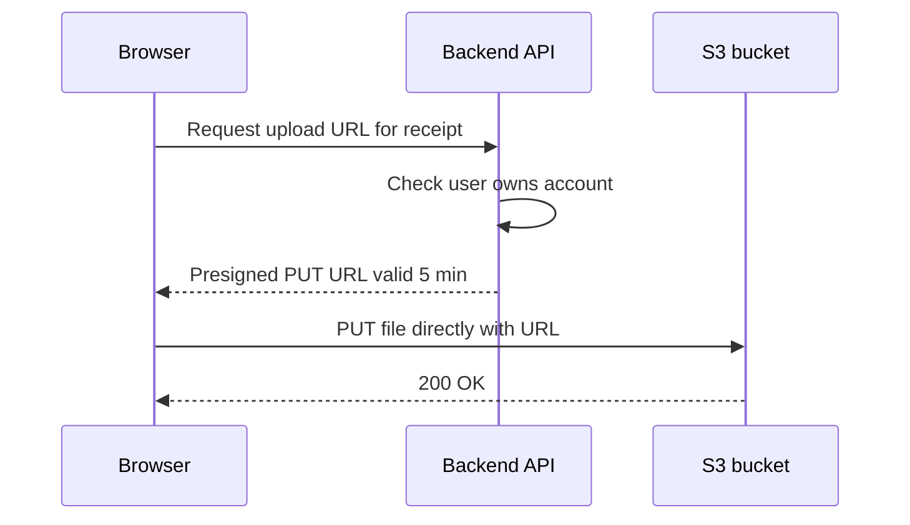

Static website hosting gives an HTTP-only website endpoint and needs public read. The better production pattern is a **private** bucket behind **CloudFront** with Origin Access Control (OAC), which adds HTTPS, caching, and keeps the bucket private.

**Pros:**
- Presigned URLs offload traffic from your servers; static hosting is near-free.

**Cons / limits:**
- Anyone holding a presigned URL can use it until it expires.
- The website endpoint has no HTTPS.

**Use it when / avoid when:**
- Presigned URLs for private, per-user downloads and direct uploads. CloudFront plus private S3 for public sites.

**Exam facts:**
- "Temporary access to a private object without AWS credentials" = presigned URL.
- S3 website endpoints are HTTP only; use CloudFront for HTTPS and custom domains with certificates.
- CORS configuration is needed when a site on one origin calls a bucket on another.
- For many files to a set of users, CloudFront signed URLs or signed cookies are the CDN equivalent.

### S3 Object Lock

**What it is:** Write-once-read-many (WORM) protection that prevents an object version from being deleted or overwritten for a retention period or indefinitely.

**Why it's used:** Financial regulations (for example SEC 17a-4 style rules) require records that cannot be altered. It also protects backups from ransomware.

**How it works:** Requires versioning. Modes: **Governance** (users with special permission `s3:BypassGovernanceRetention` can override) and **Compliance** (no one, not even the root user, can delete or shorten retention until it expires). **Legal hold** blocks deletion with no expiry until removed. Object Lock can now be enabled on existing buckets too.

**Pros:**
- Strong immutability for audits.

**Cons / limits:**
- Compliance mode is truly irreversible; a mistake means paying to store data for years.

**Use it when / avoid when:**
- Compliance mode for regulated records; Governance mode for testing or for protection with an admin escape hatch.

**Exam facts:**
- "No one, including root, can delete" = Object Lock in Compliance mode.
- "Most users cannot delete, but admins can" = Governance mode.
- Legal hold has no retention period.
- S3 Glacier Vault Lock is the older equivalent for Glacier vaults.

### S3 Transfer Acceleration

**What it is:** Faster uploads and downloads over long distances by routing through the nearest CloudFront edge location and then over the AWS backbone to the bucket.

**Why it's used:** Users in Asia uploading large files to a bucket in `eu-west-2`.

**How it works:** Enable it on the bucket and use the `bucketname.s3-accelerate.amazonaws.com` endpoint. You pay only when it actually speeds up the transfer.

**Pros:**
- No app change beyond the endpoint; works with multipart upload.

**Cons / limits:**
- Little benefit for users close to the bucket's Region. Bucket name cannot contain dots.

**Use it when / avoid when:**
- Use for global users sending large objects. For downloads of popular content, CloudFront caching is better.

**Exam facts:**
- "Speed up uploads from around the world to one bucket" = Transfer Acceleration (plus multipart upload for big files).
- Uses edge locations.
- Global, low-latency reads of cached content = CloudFront, not Transfer Acceleration.

#### Q: [Mid] Statements are read often for 30 days, rarely after that, and must be kept for 7 years at the lowest cost. Retrieval within 12 hours is fine for old statements. Design the storage.

**Scenario:** Options: A) Keep all in S3 Standard. B) Lifecycle rule: Standard, then Standard-IA after 30 days, then Glacier Deep Archive after 1 year, expire after 7 years. C) Store everything in One Zone-IA. D) Store everything in Glacier Flexible Retrieval from day one.

**Answer:** B. It matches cost to access pattern and automates deletion at the retention deadline.

**Why the others are wrong:** A overpays for cold data. C risks loss if the AZ fails, and statements are not re-creatable. D makes recent statements slow and expensive to read.

**Exam tip:** Read the retrieval-time requirement carefully: "within 12 hours" allows Deep Archive; "within minutes" needs Glacier Flexible (expedited) or Instant Retrieval.

#### Q: [Senior] Users must download their own private statement PDFs from a web app. The bucket must stay private and the API should not stream the bytes. What do you do?

**Scenario:** Options: A) Make the bucket public with hard-to-guess keys. B) Backend checks authorization and returns a short-lived presigned GET URL. C) Give each user an IAM user. D) Use S3 static website hosting.

**Answer:** B. The bucket stays private, the API authorizes the request, and S3 serves the bytes directly.

**Why the others are wrong:** A: obscurity is not security, URLs leak. C: IAM users are for workforce or programmatic identities, not millions of app customers. D needs a public bucket.

**Exam tip:** "Temporary access to a specific private object" = presigned URL. For app customers, use Cognito or your own auth, never IAM users.

#### Q: [Senior] A compliance team requires that audit logs in S3 cannot be deleted or modified by anyone, including administrators, for 7 years. Which configuration?

**Scenario:** Options: A) Bucket policy denying `s3:DeleteObject`. B) Versioning with MFA Delete. C) S3 Object Lock in Compliance mode with a 7-year retention. D) Object Lock in Governance mode.

**Answer:** C. Compliance mode blocks deletes and overwrites for all users, including root, until retention ends.

**Why the others are wrong:** A: an admin can edit the bucket policy. B: the root user with MFA can still delete. D: privileged users can bypass Governance mode.

**Exam tip:** "Including root" or "no one" means Compliance mode.

#### Q: [Staff] A bank needs a copy of all new and existing objects in a second Region within a guaranteed time, owned by a separate backup account. Design it.

**Scenario:** Options: A) Enable CRR with RTC to a bucket in the backup account, with owner override; run S3 Batch Replication for existing objects; enable versioning on both. B) Use a nightly Lambda that copies objects. C) Enable CRR only; existing objects will copy automatically. D) Use S3 Transfer Acceleration.

**Answer:** A. CRR with Replication Time Control gives a 15-minute SLA, owner override puts ownership in the backup account (protecting against compromise of the source account), and Batch Replication handles objects that existed before the rule.

**Why the others are wrong:** B is custom code with no SLA and high operational cost. C: replication rules only apply to new objects. D speeds client uploads; it does not copy between buckets.

**Exam tip:** Remember the trio for CRR questions: versioning on both sides, IAM role, Batch Replication for existing objects. "Predictable replication time" = RTC.

#### Q: [Mid] A company requires that every object uploaded to a bucket is encrypted with a key whose usage is audited and whose rotation they control. Which option?

**Scenario:** Options: A) SSE-S3. B) SSE-KMS with a customer managed key. C) SSE-C. D) No encryption, rely on HTTPS.

**Answer:** B. A customer managed KMS key lets you set the key policy, enable or schedule rotation, and see every use in CloudTrail.

**Why the others are wrong:** A encrypts but you do not control or audit the key. C requires your app to send the key on every request and manage it yourself. D covers only data in transit.

**Exam tip:** "Audit" or "control key policy" = KMS. "Keys must never be stored in AWS" = SSE-C or client-side.

## 5. Block and file storage: EBS, instance store, EFS, FSx

Three shapes of storage show up on every exam: **object** (S3, whole files over HTTP), **block** (EBS and instance store, a raw disk for one machine), and **file** (EFS and FSx, a shared network drive many machines mount at once).

| Need | Service |
|---|---|
| Boot disk or database disk for one EC2 instance | EBS |
| Fastest temporary scratch disk, data can be lost | Instance store |
| Shared Linux file system across many instances or AZs | EFS |
| Shared Windows file share with Active Directory | FSx for Windows File Server |
| HPC file system linked to S3 | FSx for Lustre |
| Multi-protocol NFS, SMB and iSCSI, NetApp features | FSx for NetApp ONTAP |
| Files and objects over HTTP at any scale | S3 |

### Amazon EBS and volume types

**What it is:** Elastic Block Store provides network-attached virtual disks for EC2. A volume persists independently of the instance's life.

**Why it's used:** Root volumes, databases on EC2, any app needing a durable block device.

**How it works:** A volume lives in one AZ and attaches to instances in that AZ. It is replicated within the AZ. You can resize and change type live (Elastic Volumes).

| Type | Kind | Performance (approximate) | Use case | Boot volume |
|---|---|---|---|---|
| gp3 | General purpose SSD | Baseline 3,000 IOPS and 125 MB/s regardless of size; provision more IOPS and throughput independently of size (AWS raised gp3 maximums in 2025; older material says 16,000 IOPS and 1,000 MB/s) | Most workloads, boot, dev, medium databases | Yes |
| gp2 | General purpose SSD (previous) | 3 IOPS per GB, burst to 3,000, max 16,000 | Legacy; migrate to gp3 for lower cost | Yes |
| io2 Block Express | Provisioned IOPS SSD | Up to 256,000 IOPS, sub-millisecond latency, 99.999% durability | Critical, I/O-intensive databases (Oracle, SQL Server, SAP) | Yes |
| io1 | Provisioned IOPS SSD (previous) | Up to 64,000 IOPS | Legacy high IOPS | Yes |
| st1 | Throughput optimized HDD | High MB/s for sequential reads | Big data, log processing, data warehouses | No |
| sc1 | Cold HDD | Lowest cost, low throughput | Infrequently accessed sequential data | No |

**Pros:**
- Durable, resizable, snapshots, encryption with KMS.

**Cons / limits:**
- AZ-locked. Generally one instance at a time, except **Multi-Attach** on io1/io2 (same AZ, needs a cluster-aware file system).

**Use it when / avoid when:**
- gp3 by default. io2 when the question says "sustained high IOPS" or "more than gp3 can deliver." HDD types only for large sequential workloads.

**Exam facts:**
- EBS volumes are AZ-scoped; move to another AZ via snapshot then restore.
- gp3 lets you set IOPS and throughput independently of size; gp2 ties IOPS to size.
- st1 and sc1 cannot be boot volumes.
- Multi-Attach: io1/io2 only, same AZ.
- Encryption: enable "encryption by default" per Region; encrypt an unencrypted volume by snapshot, copy with encryption, restore.

### EBS snapshots

**What it is:** Point-in-time, incremental backups of EBS volumes stored in S3 (managed by AWS, not visible as your bucket).

**Why it's used:** Backups, cloning volumes, moving volumes across AZs or Regions, creating AMIs.

**How it works:** The first snapshot copies all used blocks; later ones only changed blocks. Snapshots are regional; copy them to another Region for DR. Features: **Fast Snapshot Restore** (no first-read latency penalty, extra cost), **Snapshot Archive** tier (up to 75% cheaper, 24–72 hour restore), **Recycle Bin** (recover accidentally deleted snapshots), and **Amazon Data Lifecycle Manager** (schedule snapshots and retention).

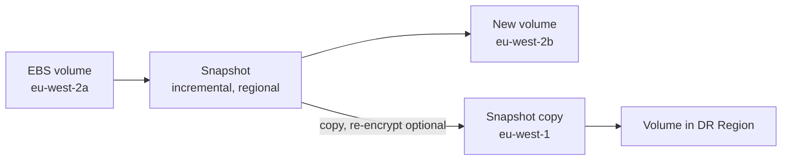

**Pros:**
- Cheap, incremental, easy cross-AZ and cross-Region movement.

**Cons / limits:**
- Restored volumes load blocks lazily from S3 (first access slower) unless Fast Snapshot Restore is on.
- Application-consistent snapshots need you to flush or freeze writes first.

**Use it when / avoid when:**
- Use DLM or AWS Backup to automate. Use FSR when a restored volume must be fast immediately.

**Exam facts:**
- Snapshots are incremental and regional.
- Moving EBS to another AZ or Region = snapshot, copy (if needed), create volume.
- Recycle Bin protects against accidental snapshot deletion.
- Fast Snapshot Restore removes the restore latency penalty.

### Instance store

**What it is:** Disks physically attached to the host machine running your instance. Very fast, but **ephemeral**.

**Why it's used:** Buffers, caches, scratch data, temporary files, or data replicated elsewhere (for example a distributed database that keeps copies on other nodes).

**How it works:** Comes with certain instance types (often with `d` in the name, and I-family). Data survives a reboot but is **lost** when the instance stops, hibernates, terminates, or the underlying host fails.

**Pros:**
- Very high IOPS and throughput (millions of IOPS on storage-optimized types), no extra charge.

**Cons / limits:**
- Data loss on stop or failure; cannot detach or snapshot it.

**Use it when / avoid when:**
- Use for temporary high-performance data. Avoid for anything you cannot lose.

**Exam facts:**
- "Highest IOPS, data is temporary or replicated" = instance store.
- Data is lost on stop, terminate or hardware failure; survives reboot.
- Cannot be used if you need to stop the instance and keep the data.

### Amazon EFS

**What it is:** Elastic File System is a managed NFS (v4.1) file system for Linux that many instances, containers and Lambda functions can mount at the same time, across AZs.

**Why it's used:** Shared content (uploaded documents processed by a fleet), home directories, CMS media folders, ML training data shared by many workers.

**How it works:** Create a file system and **mount targets** in each AZ's subnet; clients mount it over NFS (security groups must allow port 2049). It grows and shrinks automatically; you pay per GB used. Options:

- **Storage classes:** Standard, Infrequent Access (IA), Archive; lifecycle policies move files between them. One Zone variants are cheaper but single-AZ.
- **Throughput modes:** Elastic (scales automatically, recommended for spiky workloads), Provisioned (fixed), Bursting (scales with size).
- **Performance modes:** General Purpose (default, lowest latency); Max I/O is legacy for very parallel workloads.
- **Access points** enforce a user, group and root directory per application.

**Pros:**
- Fully managed, elastic, Multi-AZ, POSIX permissions.

**Cons / limits:**
- Linux only (NFS). Higher cost per GB than EBS or S3. Latency higher than local disk.

**Use it when / avoid when:**
- Use for "shared file system for Linux across multiple AZs."
- Avoid for Windows (FSx for Windows) or single-instance databases (EBS).

**Exam facts:**
- EFS = Linux, NFS, multi-AZ, many instances concurrently, elastic size.
- Mount targets per AZ; security group must allow NFS port 2049.
- Lifecycle management moves cold files to EFS IA and Archive.
- Works with EC2, ECS, EKS, Fargate and Lambda.

### Amazon FSx (Windows, Lustre, NetApp ONTAP)

**What it is:** A family of managed third-party file systems.

**Why it's used:** When EFS does not fit: Windows apps needing SMB and Active Directory, HPC needing massive throughput, or companies migrating NetApp storage.

**How it works:**

| | FSx for Windows File Server | FSx for Lustre | FSx for NetApp ONTAP | FSx for OpenZFS |
|---|---|---|---|---|
| Protocol | SMB | Lustre client (Linux) | NFS, SMB, iSCSI | NFS |
| OS clients | Windows (Linux can mount SMB) | Linux | Linux, Windows, macOS | Linux, macOS |
| Key features | Active Directory integration, DFS namespaces, shadow copies, Multi-AZ | Hundreds of GB/s, sub-ms latency, links to an S3 bucket (lazy-loads objects, writes back) | Snapshots, cloning, deduplication, compression, SnapMirror, Multi-AZ | Snapshots, cloning, low latency |
| Deployment types | Single-AZ, Multi-AZ | Scratch (temporary, cheaper, no replication), Persistent (replicated in one AZ) | Single-AZ, Multi-AZ | Single-AZ, Multi-AZ |
| Typical workload | Windows file shares, SQL Server, SharePoint | HPC, ML training, financial modelling, video rendering | Lift-and-shift from on-prem NetApp, multi-protocol | Migrate ZFS workloads |

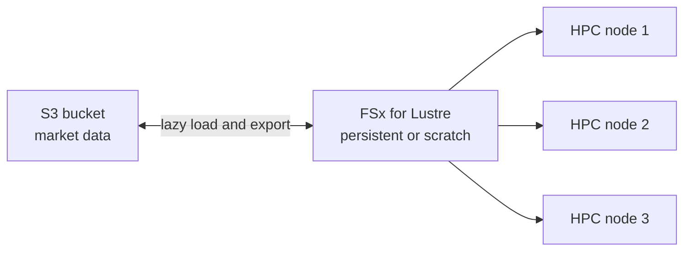

**Pros:**
- Familiar features fully managed; very high performance options.

**Cons / limits:**
- More configuration choices than EFS; capacity is provisioned rather than fully elastic.

**Use it when / avoid when:**
- Match the keyword: Windows/SMB/AD, HPC/Lustre/S3, NetApp/multi-protocol, ZFS.

**Exam facts:**
- "Windows, SMB, Active Directory, DFS" = FSx for Windows File Server.
- "HPC, ML, high throughput, integrate with S3" = FSx for Lustre (Scratch for short-term, Persistent for long-term).
- "NFS + SMB + iSCSI" or "NetApp" = FSx for NetApp ONTAP.
- EFS does not support Windows.

#### Q: [Mid] A fleet of Linux EC2 instances in three AZs must read and write the same set of documents concurrently. Which storage?

**Scenario:** Options: A) One EBS gp3 volume attached to all instances. B) Amazon EFS. C) Instance store on each instance. D) FSx for Windows File Server.

**Answer:** B. EFS is a Multi-AZ NFS file system that many Linux instances mount at the same time.

**Why the others are wrong:** A: EBS is single-AZ and generally single-instance (Multi-Attach is io1/io2 only, same AZ). C: instance store is local to each host and ephemeral. D works over SMB but is aimed at Windows; EFS is the native Linux answer.

**Exam tip:** "Shared," "concurrently," "Linux," "multiple AZs" = EFS.

#### Q: [Senior] A self-managed SQL Server database on EC2 needs 80,000 sustained IOPS with consistent sub-millisecond latency. Which EBS volume type?

**Scenario:** Options: A) gp2. B) st1. C) io2 Block Express. D) sc1.

**Answer:** C. io2 Block Express is built for sustained high IOPS, sub-millisecond latency and high durability.

**Why the others are wrong:** A tops out far lower and ties IOPS to size. B and D are HDD types for sequential throughput, not random I/O, and cannot boot.

**Exam tip:** "Mission-critical database," "highest IOPS," "consistent latency" = io2 Block Express. If gp3 can meet the number, gp3 is the cheaper answer; check the latest gp3 limits but the exam's intent with very high sustained IOPS is io2.

#### Q: [Mid] A Windows-based application needs a shared file share integrated with the company's Active Directory. Which service?

**Scenario:** Options: A) Amazon EFS. B) Amazon FSx for Windows File Server. C) Amazon S3. D) FSx for Lustre.

**Answer:** B. Native SMB, Active Directory integration, Windows ACLs and Multi-AZ.

**Why the others are wrong:** A is NFS for Linux. C is object storage, not an SMB share. D is a Linux HPC file system.

**Exam tip:** Any mention of Windows, SMB, NTFS ACLs or AD with shared files is FSx for Windows File Server.

#### Q: [Senior] An ML team trains on 200 TB of data in S3 and needs a file system with hundreds of GB/s throughput for a 2-week job. Which option is most cost-effective?

**Scenario:** Options: A) EFS with Provisioned Throughput. B) FSx for Lustre, Scratch deployment, linked to the S3 bucket. C) FSx for Lustre, Persistent deployment, kept forever. D) Copy data to EBS volumes on each node.

**Answer:** B. Lustre gives HPC-level throughput, lazy-loads data from S3, and Scratch is the cheapest for temporary jobs; results can be exported back to S3.

**Why the others are wrong:** A cannot reach the same throughput for this scale and costs more per GB. C: Persistent is for long-lived workloads that need durability. D duplicates data, is slow to prepare, and is AZ-bound.

**Exam tip:** "Short-term, processing heavy, data in S3" = FSx for Lustre Scratch. "Long-term, needs data replication" = Persistent.

## 6. Hybrid storage, data migration and backup

Many exam questions start with "a company has an on-premises data center." These services connect on-premises storage to AWS, move large data sets, and centralize backups.

### AWS Storage Gateway

**What it is:** A hybrid storage service: a gateway (VM on premises or hardware appliance) that presents local storage protocols to on-prem apps while storing data in AWS.

**Why it's used:** Extend on-prem storage into AWS without changing apps: file shares backed by S3, iSCSI volumes backed by S3 and EBS snapshots, or virtual tapes for backup software.

**How it works:**

| Type | Protocol to apps | Stored in AWS as | Use case |
|---|---|---|---|
| S3 File Gateway | NFS, SMB | S3 objects (one file = one object), local cache for hot data | File shares backed by S3, data lake ingest |
| FSx File Gateway | SMB | FSx for Windows File Server, local cache | Low-latency on-prem access to FSx shares (AWS stopped offering it to new customers in 2024, so check availability) |
| Volume Gateway (cached) | iSCSI | Primary data in S3, cache on prem | Expand capacity, frequently used data local |
| Volume Gateway (stored) | iSCSI | Primary data on prem, async backups as EBS snapshots | Low latency for the whole dataset, backups in AWS |
| Tape Gateway | iSCSI VTL | Virtual tapes in S3, archived to Glacier or Deep Archive | Replace physical tape with existing backup software |

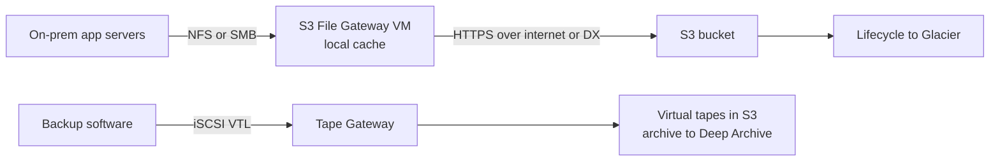

**Pros:**
- No app changes, local caching for latency, data ends up in durable AWS storage.

**Cons / limits:**
- Needs a VM or appliance on premises and bandwidth to AWS.

**Use it when / avoid when:**
- Use for ongoing hybrid access. For a one-time migration, prefer DataSync or Snowball.

**Exam facts:**
- "Replace tape backups, keep backup software" = Tape Gateway.
- "On-prem NFS/SMB share stored as S3 objects" = S3 File Gateway.
- "iSCSI block storage, low latency for full dataset" = Volume Gateway stored mode; "frequently accessed data cached" = cached mode.
- A hardware appliance option exists for sites without virtualization.

### AWS Snow family

**What it is:** Physical devices that AWS ships to you for offline data transfer (and edge computing), then you ship back so AWS loads the data into S3.

**Why it's used:** Moving tens or hundreds of terabytes when the network would take weeks, or computing in disconnected places (ships, mines, field sites).

**How it works:** Order a job in the console, receive the device, copy data with the client or NFS interface, ship it back; data is encrypted with KMS keys and the device is wiped. Snowball Edge Storage Optimized and Compute Optimized are the main exam devices. AWS discontinued Snowcone and has been retiring older Snowball generations and limiting new customers, so check current availability; for new projects AWS also points to DataSync over the network or the AWS Data Transfer Terminal (physical sites where you bring your own storage).

Rule of thumb: if transfer over the network would take more than about a week, consider an offline device.

**Pros:**
- Moves massive data without network bottlenecks; encrypted and tamper resistant.

**Cons / limits:**
- Shipping time (days), limited ongoing sync, device availability is changing.

**Use it when / avoid when:**
- Use for large one-time migrations with limited bandwidth, or edge computing offline.
- Avoid when the network can do it in reasonable time (DataSync).

**Exam facts:**
- "Petabytes, limited bandwidth, would take weeks over the network" = Snowball Edge.
- Snowball imports into S3; to get data into Glacier, import to S3 then use a lifecycle rule.
- Snowball Edge Compute Optimized runs EC2 instances and Lambda at the edge.
- Older questions mention Snowmobile (exabyte truck), which is retired.

### AWS DataSync

**What it is:** An online data transfer service that moves data between on-premises storage (NFS, SMB, HDFS, object storage), other clouds, and AWS storage (S3, EFS, FSx), quickly and on a schedule.

**Why it's used:** Migrating a file server to EFS or FSx, replicating data to S3 every night, moving data between AWS storage services.

**How it works:** Install a DataSync **agent** (VM) near the source for on-prem transfers. Create a **task** with source location, destination location, options (verify data, preserve metadata, bandwidth limit, filters) and a schedule. Transfers are encrypted in transit (TLS) and can go over the internet, Direct Connect or a VPC endpoint. No agent is needed for AWS-to-AWS transfers.

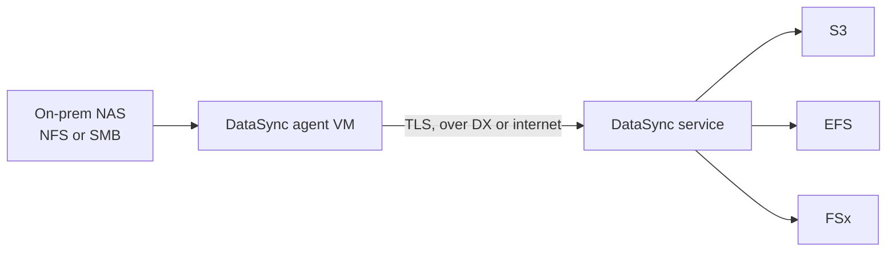

**Pros:**
- Much faster than scripts (parallel, optimized protocol), preserves permissions and metadata, verifies integrity, scheduling built in.

**Cons / limits:**
- Uses network bandwidth; for very large data with low bandwidth, Snowball is faster.

**Use it when / avoid when:**
- Use for online migrations and recurring syncs.

**Exam facts:**
- "Migrate on-prem NFS/SMB to EFS, FSx or S3, preserve metadata, schedule" = DataSync.
- Needs an agent for on-prem sources; agentless between AWS services.
- Can throttle bandwidth so production traffic is not saturated.
- DataSync for one-time or scheduled copies; Storage Gateway for ongoing hybrid access.

### AWS Backup

**What it is:** A central, policy-based service to back up AWS resources: EC2, EBS, RDS, Aurora, DynamoDB, EFS, FSx, S3, Storage Gateway volumes, and more.

**Why it's used:** One place to define "daily backups, keep 35 days, monthly kept 7 years, copy to another Region and account," instead of separate settings per service.

**How it works:** A **backup plan** defines frequency, backup window, lifecycle (move to cold storage, expire) and copy rules. You assign resources by tags or IDs. Backups land in **backup vaults**. **Vault Lock** makes backups immutable (WORM, Compliance or Governance mode). Cross-Region and cross-account copies give isolation from ransomware or account compromise. Works with AWS Organizations for org-wide policies. Backup Audit Manager reports compliance.

**Pros:**
- Central policy, auditing, immutability, cross-account copies.

**Cons / limits:**
- Restore is per service; supported features vary by resource type.

**Use it when / avoid when:**
- Use when the question says "centrally manage and automate backups across services."

**Exam facts:**
- "Centralized backup across many AWS services with policies" = AWS Backup.
- Vault Lock = immutable backups (ransomware protection).
- Cross-Region and cross-account copy for DR.
- Assign resources to backup plans with tags.

#### Q: [Mid] A company must move 500 TB from its data center to S3. Its internet link is 100 Mbps and the deadline is 3 weeks. Best option?

**Scenario:** Options: A) DataSync over the internet. B) S3 Transfer Acceleration. C) Offline transfer devices from the Snow family (Snowball Edge Storage Optimized), several in parallel. D) Set up Site-to-Site VPN.

**Answer:** C. At 100 Mbps, 500 TB would take over a year. Offline devices move it in days to weeks.

**Why the others are wrong:** A and B are limited by the same 100 Mbps link. D adds encryption but not bandwidth.

**Exam tip:** Calculate roughly: 100 Mbps is about 1 TB per day at best. If the math gives weeks or more, the exam wants a Snow device (check current device availability in real projects).

#### Q: [Senior] An on-prem backup system writes to physical tape libraries. The company wants to stop managing tapes but keep its existing backup software. Which solution?

**Scenario:** Options: A) S3 File Gateway. B) Tape Gateway with virtual tapes archived to S3 Glacier Deep Archive. C) Volume Gateway cached mode. D) EBS snapshots.

**Answer:** B. Tape Gateway presents a virtual tape library over iSCSI that the existing backup software already understands, and archives tapes to low-cost Glacier storage.

**Why the others are wrong:** A exposes NFS/SMB, not a tape interface. C is block storage, not tape. D is for EBS volumes in AWS.

**Exam tip:** "Keep existing backup software" + "tapes" = Tape Gateway.

#### Q: [Senior] A company migrates a 50 TB NFS file share to Amazon EFS over a 10 Gbps Direct Connect link, and needs to preserve file permissions and run incremental syncs until cutover. Which service?

**Scenario:** Options: A) AWS DataSync with an on-prem agent and scheduled tasks. B) `rsync` scripts on a single EC2 instance. C) Snowball Edge. D) S3 File Gateway.

**Answer:** A. DataSync transfers in parallel, preserves metadata, verifies data, and runs incremental scheduled tasks until the final cutover.

**Why the others are wrong:** B is slower, needs custom error handling and monitoring. C is offline; the link is fast enough and you need repeated syncs. D stores data in S3, not EFS, and is for ongoing hybrid access.

**Exam tip:** Good bandwidth + migrate files to EFS/FSx/S3 = DataSync. Poor bandwidth + huge data = Snowball.

#### Q: [Staff] A regulated company needs automated daily backups of RDS, DynamoDB, EFS and EC2, kept for 7 years, protected against deletion even by a compromised admin account, with a copy in another Region. Design it.

**Scenario:** Options: A) Per-service snapshot scripts in Lambda. B) AWS Backup plan assigned by tags, backup vault with Vault Lock in Compliance mode, copy rule to a vault in another Region and a separate backup account through AWS Organizations. C) Enable RDS automated backups with 35-day retention. D) S3 versioning.

**Answer:** B. AWS Backup centralizes policy across services, Vault Lock Compliance mode makes recovery points immutable, and cross-Region plus cross-account copies isolate backups from a compromised production account.

**Why the others are wrong:** A is custom, hard to audit, and not immutable. C covers only RDS and caps at 35 days. D covers only S3 objects.

**Exam tip:** "Centralized," "across services," "immutable," "compliance" = AWS Backup with Vault Lock. Add cross-account copies whenever ransomware or compromised credentials are mentioned.

> **Interview tip:** In a system design conversation, name the storage shape first (object, block, file), then the access pattern (how often, how many readers, which OS), then cost. That order leads you to the right service almost every time.

