## 1. Relational databases: RDS and Aurora

A relational database stores data in tables with a fixed schema and supports SQL joins and ACID transactions. That is what you want for accounts, payments and ledgers. On AWS you rarely install one on EC2 yourself; you use RDS or Aurora so AWS handles patching, backups and failover.

### Amazon RDS

**What it is:** Relational Database Service runs managed MySQL, PostgreSQL, MariaDB, Oracle, Microsoft SQL Server and IBM Db2 on instances AWS operates for you.

**Why it's used:** A payments app needs a PostgreSQL database with automated backups, patching and a standby in another AZ, without a DBA managing servers.

**How it works:** You pick an engine, instance class and storage (gp3 or io2, with optional storage autoscaling). The database runs in your VPC subnets (a DB subnet group spanning AZs) and is reached through a DNS endpoint. You do not get OS access (except RDS Custom for Oracle and SQL Server). Security: security groups, encryption at rest with KMS (must be chosen at creation), TLS in transit, IAM database authentication (MySQL, PostgreSQL), and Secrets Manager for password rotation.

**Pros:**
- Familiar engines, managed backups, patching, Multi-AZ and read replicas.

**Cons / limits:**
- Vertical scaling for writes (one primary). Maintenance and failover cause short interruptions.
- Cannot encrypt an existing unencrypted instance in place.

**Use it when / avoid when:**
- Use for relational workloads that need a specific engine version or Oracle/SQL Server.
- Avoid for massive key-value scale with single-digit ms at any size (DynamoDB).

**Exam facts:**
- Encrypt an existing unencrypted RDS database: snapshot, copy snapshot with encryption, restore.
- RDS Proxy pools connections (great with Lambda) and cuts failover time.
- Storage autoscaling grows storage automatically when free space is low.
- You cannot SSH into RDS; use RDS Custom if you need OS access (Oracle, SQL Server).
- Engines: MySQL, PostgreSQL, MariaDB, Oracle, SQL Server, Db2 (plus Aurora as a separate engine family).

### RDS Multi-AZ vs read replicas

**What it is:** Two different features that are often confused. **Multi-AZ** is for high availability (a standby takes over on failure). **Read replicas** are for read scaling (extra copies that serve SELECT queries).

**Why it's used:** A statement-history page runs heavy reads (replicas help). The database must survive an AZ outage (Multi-AZ helps). Many systems use both.

**How it works:**

| | Multi-AZ instance deployment | Multi-AZ DB cluster | Read replicas |
|---|---|---|---|
| Purpose | High availability | HA plus readable standbys | Read scaling, cross-Region DR |
| Replication | Synchronous | Semi-synchronous | Asynchronous (replica lag) |
| Standby readable? | No | Yes, two readable standbys | Yes |
| Failover | Automatic, DNS flips to standby, typically 1–2 minutes | Automatic, typically under 35 seconds | Manual promotion |
| Location | Another AZ, same Region | Three AZs | Same AZ, cross-AZ, or cross-Region |
| Engines | All RDS engines | MySQL, PostgreSQL | MySQL, PostgreSQL, MariaDB, Oracle, SQL Server (up to 15 for MySQL/PostgreSQL/MariaDB; check limits) |
| Endpoint | Same endpoint after failover | Writer and reader endpoints | Each replica has its own endpoint |

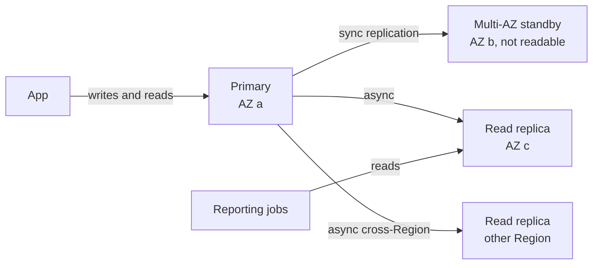

**Pros:**
- Multi-AZ gives automatic failover without app changes. Replicas offload reads and give a DR copy.

**Cons / limits:**
- Multi-AZ standby (instance deployment) cannot serve reads. Replicas lag, so reads can be stale.
- Data transfer for cross-Region replicas is charged; same-Region replica traffic is not.

**Use it when / avoid when:**
- Multi-AZ for production always. Replicas when reads overwhelm the primary or you need a warm DR copy in another Region.

**Exam facts:**
- "High availability, automatic failover" = Multi-AZ. "Scale reads" = read replicas.
- Multi-AZ replication is synchronous; read replicas are asynchronous.
- A read replica can be promoted to a standalone database (DR across Regions).
- Converting single-AZ to Multi-AZ is an online modification (a snapshot is taken behind the scenes).
- Read replica traffic within a Region is free; cross-Region is charged.

### RDS backups and restore

**What it is:** Automated backups (daily snapshot plus transaction logs) and manual snapshots.

**Why it's used:** Recover from a bad deploy that deleted rows at 14:03 by restoring to 14:02.

**How it works:** **Automated backups** run in a backup window, retention 1 to 35 days (0 disables them), and allow **point-in-time recovery** to any second within the retention, typically up to about the last 5 minutes. **Manual snapshots** are kept until you delete them, even after the instance is deleted. Restoring always creates a **new** DB instance with a new endpoint. Snapshots can be copied cross-Region and shared cross-account. AWS Backup can manage both.

**Pros:**
- PITR with no effort; snapshots for long-term retention.

**Cons / limits:**
- Restore creates a new instance, so you must repoint the app. Automated backups max 35 days.

**Use it when / avoid when:**
- Use manual snapshots or AWS Backup for retention beyond 35 days.

**Exam facts:**
- Automated backup retention: up to 35 days; PITR within that window.
- Restores create a new DB instance (new endpoint).
- Manual snapshots persist until deleted.
- To save cost on a database used only a few hours a month: snapshot and delete, then restore when needed (stopped instances restart automatically after 7 days).

### Amazon Aurora

**What it is:** AWS's cloud-native relational database, compatible with MySQL and PostgreSQL, with a distributed storage layer shared by the writer and up to 15 readers.

**Why it's used:** Higher performance and faster failover than standard RDS, with storage that grows automatically.

**How it works:** Data is stored as six copies across three AZs; it tolerates losing two copies for writes and three for reads, and repairs itself. Storage grows automatically in 10 GB increments up to 128 TiB (newer versions support more; check current limits). Compute is a **cluster**: one writer instance and up to 15 Aurora Replicas sharing the same storage, so replica lag is usually under 100 ms and failover is typically under 30 seconds. Endpoints: **cluster (writer) endpoint**, **reader endpoint** (load balances across replicas), **custom endpoints** (a subset, e.g. bigger replicas for analytics), and instance endpoints. Extras: **Backtrack** (rewind MySQL-compatible clusters in place, no restore), **fast cloning** (copy-on-write clone for testing), auto scaling of replicas, I/O-Optimized storage pricing for I/O-heavy workloads, and zero-ETL integration to Redshift.

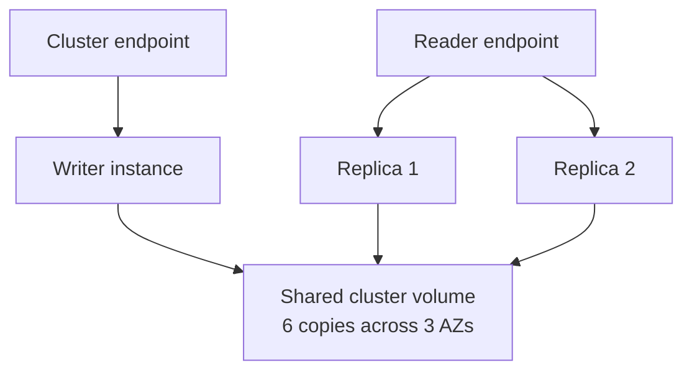

**Pros:**
- Faster failover, up to 15 low-lag replicas, self-healing storage, auto-growing.

**Cons / limits:**
- Costs more than RDS for small, simple databases. Only MySQL and PostgreSQL compatibility.

**Use it when / avoid when:**
- Use for production MySQL/PostgreSQL needing high availability and read scale.
- Avoid when you need Oracle or SQL Server (RDS) or a tiny dev database on a budget.

**Exam facts:**
- 6 copies across 3 AZs; up to 15 Aurora Replicas; failover usually under 30 seconds.
- Reader endpoint load-balances connections across replicas; custom endpoints target subsets.
- Backtrack (MySQL-compatible) rewinds without restoring from backup.
- Cloning is fast and cheap for test copies of production.
- Replica auto scaling adds replicas based on CPU or connections.

### Aurora Serverless v2

**What it is:** An Aurora capacity mode where compute scales automatically in fine-grained units called Aurora Capacity Units (ACUs), instead of you picking an instance size.

**Why it's used:** Spiky or unpredictable workloads (month-end statement generation), dev/test databases, multi-tenant SaaS with many databases.

**How it works:** You set a minimum and maximum ACU range. Capacity adjusts in seconds while staying online. Serverless v2 instances can be the writer or readers and can be mixed with provisioned instances in the same cluster. Recent versions can scale down to 0 ACUs and auto-pause when idle (with a resume delay on first connection).

**Pros:**
- No capacity planning, pay per ACU-second, supports Multi-AZ, replicas and Global Database.

**Cons / limits:**
- At steady high load, provisioned instances (with reservations) can be cheaper.
- Resume from 0 ACUs adds latency to the first request.

**Use it when / avoid when:**
- Use for variable or unknown load. Avoid when load is flat and predictable.

**Exam facts:**
- "Unpredictable, intermittent workload, relational, least management" = Aurora Serverless v2.
- Capacity measured in ACUs with a min and max.
- Serverless v1 is retired; questions now mean v2.

### Aurora Global Database

**What it is:** One Aurora cluster spanning multiple Regions: a primary Region that takes writes, and up to several read-only secondary Regions (check the current maximum).

**Why it's used:** Low-latency reads for global users and disaster recovery from a full Regional outage with very low RPO and RTO.

**How it works:** Replication happens at the storage layer over dedicated infrastructure, typically under 1 second. In a disaster you promote a secondary Region in about a minute (managed failover or "switchover" for planned moves). **Write forwarding** lets apps in a secondary Region send writes that are forwarded to the primary.

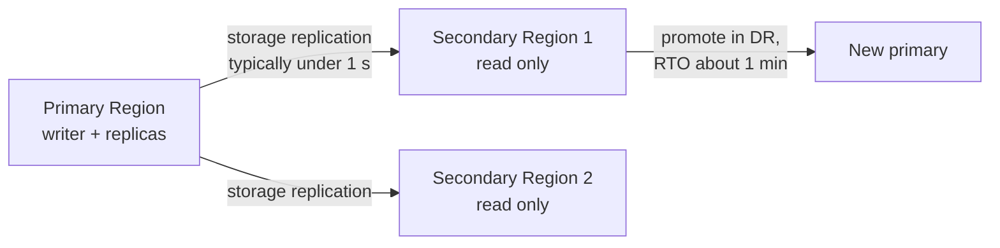

**Pros:**
- RPO around 1 second, RTO around 1 minute, local reads worldwide.

**Cons / limits:**
- One writer Region at a time; cost of running clusters in several Regions.

**Use it when / avoid when:**
- Use for cross-Region DR with tight RPO/RTO on a relational DB. For multi-Region active-active writes, consider DynamoDB global tables or Aurora DSQL (newer, check fit).

**Exam facts:**
- "Cross-Region DR for Aurora with RPO of seconds and RTO under a minute" = Aurora Global Database.
- Replication lag typically under 1 second.
- Cross-Region read replicas (RDS or Aurora MySQL binlog) are slower and have higher RPO than Global Database.

#### Q: [Mid] A production MySQL database on RDS must automatically survive an AZ failure. Reporting queries also slow down the app. What do you enable?

**Scenario:** Options: A) Read replica only. B) Multi-AZ only. C) Multi-AZ for availability and a read replica for the reporting queries. D) A bigger instance class.

**Answer:** C. Multi-AZ gives synchronous standby and automatic failover. A read replica takes the reporting load off the primary.

**Why the others are wrong:** A does not fail over automatically. B does not help reads (the standby is not readable in the instance deployment). D postpones the problem and does not add HA.

**Exam tip:** Two separate needs, two separate features. HA = Multi-AZ, read scale = replicas.

#### Q: [Senior] A bank's core relational database on Aurora PostgreSQL needs a DR plan for a full Region outage with RPO under 5 seconds and RTO under 2 minutes. What do you propose?

**Scenario:** Options: A) Daily snapshots copied to another Region. B) Aurora Global Database with a secondary Region. C) Multi-AZ deployment. D) Cross-Region read replica using logical replication.

**Answer:** B. Global Database replicates at the storage layer in typically under a second and can promote a secondary Region in about a minute.

**Why the others are wrong:** A has RPO up to 24 hours and long RTO. C protects only against AZ failures inside one Region. D has higher lag and slower, more manual promotion.

**Exam tip:** "Region failure" rules out Multi-AZ answers. "Seconds of RPO" for Aurora = Global Database.

#### Q: [Mid] A developer accidentally deleted rows from an RDS PostgreSQL table 20 minutes ago. Automated backups are enabled with 7-day retention. How do you recover?

**Scenario:** Options: A) Restore the latest manual snapshot over the existing instance. B) Point-in-time restore to just before the delete, which creates a new instance; copy the rows back or repoint the app. C) Promote the read replica. D) Contact AWS Support to undo the transaction.

**Answer:** B. PITR restores to any second inside the retention window, into a new DB instance.

**Why the others are wrong:** A: restores never overwrite an existing instance, and the snapshot may be older. C: the replica already applied the delete. D: AWS cannot undo your transactions.

**Exam tip:** Restores always create a new instance with a new endpoint. For in-place rewind on Aurora MySQL, Backtrack is the answer.

#### Q: [Senior] An internal reporting database is used for heavy queries only during the first 3 days of each month and is idle otherwise. The team wants relational SQL with minimal cost and management. Best fit?

**Scenario:** Options: A) Large provisioned Aurora instance running all month. B) Aurora Serverless v2 with a low minimum ACU (or scale to zero where supported). C) RDS with a 3-year Reserved Instance. D) DynamoDB on-demand.

**Answer:** B. Serverless v2 scales up for the busy days and down when idle, without manual resizing.

**Why the others are wrong:** A pays for peak capacity all month. C commits to an always-on instance. D is not a relational SQL database for ad hoc reporting joins.

**Exam tip:** "Intermittent," "unpredictable" or "idle most of the time" + relational = Aurora Serverless v2.

## 2. NoSQL and caching: DynamoDB and ElastiCache

NoSQL databases trade joins and flexible queries for predictable speed at any scale. You design the table around the queries you will run, not around normalized entities. Caches sit in front of any database to serve hot reads from memory.

### Amazon DynamoDB basics and keys

**What it is:** A fully managed, serverless key-value and document database with single-digit millisecond latency at any scale. No servers, no patching, Multi-AZ by default.

**Why it's used:** Session stores, user profiles, shopping carts, idempotency keys for payments, high-traffic event data, anything that needs fast lookups by key with huge scale.

**How it works:** A **table** holds **items** (rows, max 400 KB each) made of attributes. Every item has a **primary key**: either a **partition key** alone (simple key) or a **partition key + sort key** (composite key). DynamoDB hashes the partition key to decide which physical partition stores the item, so a good partition key has many distinct, evenly accessed values. Items with the same partition key are stored together, sorted by sort key, which makes "all transactions for account X between two dates" a fast `Query`.

```typescript
import { DynamoDBClient } from "@aws-sdk/client-dynamodb";
import { DynamoDBDocumentClient, QueryCommand } from "@aws-sdk/lib-dynamodb";

const doc = DynamoDBDocumentClient.from(new DynamoDBClient({}));

// Table "Transactions": PK = accountId, SK = "2026-09-30T12:00:00Z#txn_123"
export async function listTransactions(accountId: string, fromIso: string, toIso: string) {
  const res = await doc.send(new QueryCommand({
    TableName: "Transactions",
    KeyConditionExpression: "accountId = :a AND sk BETWEEN :from AND :to",
    ExpressionAttributeValues: { ":a": accountId, ":from": fromIso, ":to": `${toIso}~` },
    ScanIndexForward: false, // newest first
    Limit: 50,
  }));
  return { items: res.Items ?? [], nextKey: res.LastEvaluatedKey };
}
```

`Query` reads items for one partition key (efficient). `Scan` reads the whole table (slow and expensive; avoid in hot paths). Transactions (`TransactWriteItems`) give ACID across up to 100 items. Conditional writes (`attribute_not_exists(pk)`) implement idempotency and optimistic locking.

**Pros:**
- Serverless, scales to millions of requests per second, consistent low latency, Multi-AZ.

**Cons / limits:**
- No joins, limited ad hoc queries; you must know access patterns up front.
- 400 KB item limit (store big payloads in S3 and keep a pointer).
- Hot partition keys get throttled.

**Use it when / avoid when:**
- Use for known access patterns at high scale, key lookups, serverless apps.
- Avoid for complex relational reporting or ad hoc analytics (use RDS/Aurora or Redshift).

**Exam facts:**
- Max item size 400 KB.
- Partition key choice should spread traffic evenly (high cardinality).
- `Query` by key is efficient; `Scan` reads everything.
- Eventually consistent reads by default; strongly consistent reads optional (not on GSIs).
- "Serverless, key-value, single-digit millisecond, any scale" = DynamoDB.

### DynamoDB capacity: RCU/WCU vs on-demand

**What it is:** How you pay for reads and writes. **Provisioned** mode: you set read capacity units (RCU) and write capacity units (WCU), optionally with auto scaling. **On-demand** mode: pay per request, no capacity planning.

**Why it's used:** Steady, predictable traffic is cheaper provisioned. New or spiky traffic is simpler and safer on-demand.

**How it works:**

- **1 RCU** = one strongly consistent read per second of an item up to 4 KB, or **two** eventually consistent reads per second. Transactional reads cost 2 RCUs.
- **1 WCU** = one write per second of an item up to 1 KB. Transactional writes cost 2 WCUs.
- Sizes round **up**: a 6 KB strongly consistent read uses 2 RCUs; a 2.5 KB write uses 3 WCUs.

Example: 100 strongly consistent reads per second of 6 KB items = 100 x 2 = 200 RCUs. Eventually consistent: 100 RCUs. 50 writes per second of 2.5 KB = 50 x 3 = 150 WCUs.

| | Provisioned (with auto scaling) | On-demand |
|---|---|---|
| Billing | Per capacity unit per hour | Per request |
| Planning | You set RCU/WCU, auto scaling adjusts within limits | None |
| Spikes | Can throttle if above capacity and burst | Absorbs sudden spikes (up to about double the previous peak instantly; scales beyond over time) |
| Cost | Cheaper for steady, predictable load; reserved capacity available | Simpler; price was cut significantly in 2024, so it fits more workloads |
| Use | Known traffic | New apps, unpredictable or spiky traffic |

**Pros:**
- Choice between cost control and zero planning; you can switch modes (limited number of times per day).

**Cons / limits:**
- Provisioned throttles (`ProvisionedThroughputExceededException`) if under-sized or with hot keys.

**Use it when / avoid when:**
- On-demand for unknown traffic; provisioned with auto scaling for steady traffic.

**Exam facts:**
- RCU: 4 KB strongly consistent (or 2 x 4 KB eventually consistent) per second. WCU: 1 KB per second.
- Round item size up to the next 4 KB (reads) or 1 KB (writes).
- "Unpredictable traffic, no capacity planning" = on-demand.
- Throttling with enough total capacity usually means a hot partition key.

### DynamoDB indexes: GSI and LSI

**What it is:** Secondary indexes let you query by attributes other than the primary key.

**Why it's used:** The table is keyed by `accountId`, but support staff need "find transactions by `merchantId`" or "by status."

**How it works:**

| | Global Secondary Index (GSI) | Local Secondary Index (LSI) |
|---|---|---|
| Key | Different partition key and optional sort key | Same partition key, different sort key |
| When created | Any time | Only at table creation |
| Consistency | Eventually consistent only | Eventually or strongly consistent |
| Capacity | Its own RCU/WCU (provisioned mode) | Shares the table's capacity |
| Size limit | None | 10 GB per partition key value (item collection) |
| Max per table | 20 (default quota) | 5 |

Indexes **project** attributes (keys only, include list, or all). Writes to the table also update every index, so each GSI adds write cost. A throttled GSI can throttle writes on the base table.

**Pros:**
- New query patterns without duplicating data yourself.

**Cons / limits:**
- Extra cost per index; LSIs must be planned up front.

**Use it when / avoid when:**
- GSI for new access patterns on different keys. LSI only when you need strong consistency on an alternate sort order and know it at creation.

**Exam facts:**
- LSI: same partition key, created only with the table, supports strong consistency.
- GSI: any key, add anytime, eventually consistent, own capacity.
- GSI throttling can back-pressure the base table's writes.

### DAX, Streams, global tables and TTL

**What it is:** Four DynamoDB features that show up constantly on the exam.

**Why it's used and how it works:**

- **DynamoDB Accelerator (DAX):** an in-memory cache cluster in front of DynamoDB, API-compatible, that cuts read latency from milliseconds to **microseconds**. It caches item reads (GetItem) and query/scan results. Best for read-heavy, repeated reads of the same items. Not useful for write-heavy or strongly consistent reads (passed through).
- **DynamoDB Streams:** an ordered, time-ordered log of item changes (insert, modify, remove) kept for **24 hours**. Lambda can process it to send notifications, update a search index, or aggregate. An alternative is Kinesis Data Streams for DynamoDB (longer retention, more consumers).
- **Global tables:** multi-Region, multi-active replication. Every replica Region accepts reads and writes; replication is typically under a second; conflicts resolve with last-writer-wins (newer option: multi-Region strong consistency for some Region sets; check availability).
- **Time to Live (TTL):** set an epoch-seconds attribute, and DynamoDB deletes expired items in the background at no cost, typically within a few days of expiry (filter expired items in queries). Deletions appear in Streams.

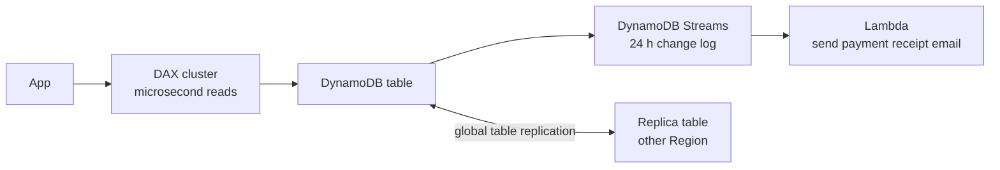

**Pros:**
- Caching, event-driven processing, multi-Region active-active and cleanup without managing servers.

**Cons / limits:**
- DAX is eventually consistent and adds a cluster to pay for. Streams 24-hour retention. Global tables use last-writer-wins by default.

**Use it when / avoid when:**
- DAX for microsecond reads on DynamoDB; ElastiCache for caching other databases or complex data structures.

**Exam facts:**
- "Microsecond latency for DynamoDB reads, no app rewrite" = DAX.
- "React to item changes" = DynamoDB Streams + Lambda.
- "Multi-Region, active-active, low latency writes everywhere" = global tables (Streams are used under the hood in older versions).
- "Delete expired sessions automatically at no cost" = TTL.
- Point-in-time recovery (configurable up to 35 days) and on-demand backups; export to S3 without consuming capacity.

### Amazon ElastiCache (Valkey/Redis OSS vs Memcached)

**What it is:** Managed in-memory data stores for caching and fast data structures. Engines: **Valkey** (open source fork of Redis, AWS's recommended and cheaper option), **Redis OSS**, and **Memcached**. A serverless option scales automatically.

**Why it's used:** Cut database load and latency: cache an account summary for 60 seconds, store user sessions, run leaderboards and rate limiters.

**How it works:** Your app talks to the cache (it is not transparent like DAX). Common patterns:

- **Lazy loading (cache-aside):** read cache; on miss, read DB and populate the cache with a TTL. Only requested data is cached; first read is slow; data can be stale.
- **Write-through:** write to DB and cache together. Cache is fresh; writes are slower and you may cache data never read.
- Add TTLs to both to limit staleness.

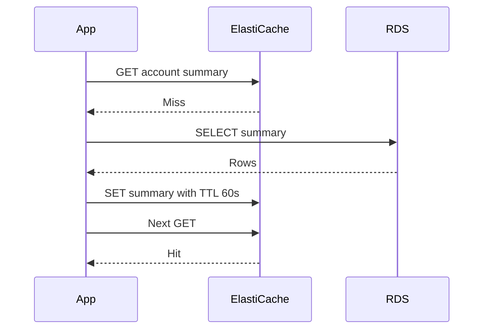

| | Valkey / Redis OSS | Memcached |
|---|---|---|
| Data types | Strings, hashes, lists, sets, sorted sets, streams, geospatial | Simple key-value strings |
| Replication and Multi-AZ failover | Yes | No |
| Persistence and backups | Yes (snapshots) | No |
| Threads | Mostly single-threaded command execution (I/O threads help) | Multi-threaded |
| Sharding | Cluster mode | Client-side across nodes |
| Pub/sub, Lua, transactions | Yes | No |
| Typical use | Sessions, leaderboards, queues, HA cache | Simple, horizontally scaled cache where loss is fine |

**Pros:**
- Sub-millisecond reads, offloads databases.

**Cons / limits:**
- Cache invalidation is your problem. Data in Memcached is lost on node failure.
- Requires app code changes.

**Use it when / avoid when:**
- Use for read-heavy data that tolerates brief staleness. For a durable in-memory primary database, use Amazon MemoryDB.

**Exam facts:**
- "HA cache, Multi-AZ, persistence, sorted sets/leaderboard" = Valkey or Redis OSS.
- "Simple cache, multi-threaded, no persistence needed" = Memcached.
- Store session state in ElastiCache or DynamoDB to make EC2 web tiers stateless.
- Redis AUTH / IAM authentication and in-transit encryption are Redis/Valkey features.
- Cache is not transparent: app changes are needed (unlike DAX for DynamoDB).

#### Q: [Mid] An app reads 80 items per second, each 10 KB, using strongly consistent reads. How many RCUs are needed?

**Scenario:** Options: A) 80. B) 160. C) 240. D) 120.

**Answer:** C. 10 KB rounds up to 12 KB, which is 3 units of 4 KB. 80 x 3 = 240 RCUs.

**Why the others are wrong:** A ignores item size. B uses 2 units per item (8 KB, too small). D halves it as if reads were eventually consistent (eventually consistent would be 120, so D is the eventual-consistency answer, not this one).

**Exam tip:** Round up first, then multiply. Eventually consistent = divide by 2. Transactional = multiply by 2.

#### Q: [Senior] A DynamoDB table keyed by `date` throttles during business hours although total provisioned capacity is barely used. Why, and what is the fix?

**Scenario:** Options: A) Switch to on-demand and the problem disappears forever. B) The partition key has low cardinality (all of today's writes hit one key); redesign the key, for example `accountId` or `date#shard` with a random suffix. C) Add an LSI. D) Increase RCUs tenfold.

**Answer:** B. All current writes go to the same partition key value, creating a hot partition. Spreading keys distributes traffic across partitions.

**Why the others are wrong:** A helps somewhat but a single hot key still has per-partition throughput limits. C adds reads options, not write distribution, and needs table recreation. D wastes money; the bottleneck is one partition.

**Exam tip:** "Throttled while overall capacity is low" = hot partition. Fix the key design (high cardinality, write sharding).

#### Q: [Senior] A leaderboard and session store need sub-millisecond latency, automatic failover across AZs, and must survive a node restart without losing data. Which ElastiCache engine?

**Scenario:** Options: A) Memcached. B) ElastiCache for Valkey (or Redis OSS) with Multi-AZ replicas and snapshots. C) DAX. D) DynamoDB with TTL.

**Answer:** B. Valkey/Redis supports sorted sets for leaderboards, replication with automatic failover, and persistence.

**Why the others are wrong:** A has no replication or persistence. C caches DynamoDB only and is not a general data structure store. D is not sub-millisecond for this pattern and has no sorted set operations.

**Exam tip:** Leaderboard = sorted sets = Redis/Valkey. Memcached = simple, multi-threaded, ephemeral.

#### Q: [Staff] A global payments app needs users in three Regions to write with low latency, and the app must keep working if one Region fails. Which data store?

**Scenario:** Options: A) RDS MySQL with cross-Region read replicas. B) DynamoDB global tables. C) Aurora Global Database with write forwarding as the only write path. D) ElastiCache Global Datastore as the primary store.

**Answer:** B. Global tables are multi-active: every Region accepts local writes and replicates to the others. If one Region fails, the others keep serving. Design for last-writer-wins conflicts (for example, idempotency keys and per-account home Regions), or evaluate the multi-Region strong consistency option where available.

**Why the others are wrong:** A: replicas are read-only; writes go to one Region. C: Aurora Global has one write Region; write forwarding still sends writes there, adding latency. D: a cache is not a durable system of record.

**Exam tip:** "Active-active multi-Region writes" on the exam = DynamoDB global tables.

## 3. Analytics and purpose-built databases

AWS's view is "pick a purpose-built database for each access pattern." The exam tests whether you can match the keyword to the service.

| Need | Service |
|---|---|
| Relational OLTP, specific engine | RDS |
| Relational OLTP, high performance, MySQL/PostgreSQL | Aurora |
| Key-value or document at any scale, serverless | DynamoDB |
| In-memory cache | ElastiCache |
| Data warehouse, analytics SQL on TBs to PBs | Redshift |
| MongoDB-compatible documents | DocumentDB |
| Graph relationships (fraud rings, social) | Neptune |
| Apache Cassandra-compatible wide-column | Keyspaces |
| Time-series metrics | Timestream |
| Full-text search, log analytics | OpenSearch Service |
| Ad hoc SQL on files in S3, serverless | Athena (related, not a database) |

### Amazon Redshift

**What it is:** A managed, columnar, massively parallel processing (MPP) data warehouse for analytics SQL over large data sets.

**Why it's used:** Finance dashboards aggregating years of transactions, BI tools (QuickSight, Tableau) on billions of rows.

**How it works:** Data is stored by column and compressed, so aggregations read only the needed columns. Provisioned clusters (RA3 nodes with managed storage that separates compute and storage) or **Redshift Serverless**. Load with `COPY` from S3, or use **zero-ETL integrations** from Aurora, RDS and DynamoDB. **Redshift Spectrum** queries data directly in S3. **Concurrency scaling** adds capacity for bursts of queries. Snapshots can be copied to another Region automatically for DR.

**Pros:**
- Fast analytics at scale, standard SQL, BI integrations.

**Cons / limits:**
- Not for OLTP (many small single-row writes). Provisioned clusters need sizing.

**Use it when / avoid when:**
- Use for OLAP and BI on structured data. Avoid for transactional app backends.

**Exam facts:**
- "Data warehouse," "OLAP," "BI on petabytes" = Redshift.
- Spectrum queries S3 without loading; Athena does similar ad hoc queries serverlessly.
- Cross-Region snapshot copy for DR.
- Enhanced VPC routing forces `COPY`/`UNLOAD` traffic through your VPC.

### Amazon DocumentDB

**What it is:** A managed document database compatible with the MongoDB API, using an Aurora-like distributed storage layer.

**Why it's used:** Migrate MongoDB workloads to a managed service; store JSON documents like product catalogs or user profiles.

**How it works:** Clusters with one primary and up to 15 replicas, storage replicated six ways across three AZs, auto-growing storage; elastic clusters for sharded scale.

**Pros:**
- MongoDB drivers and tools work for most cases, managed HA.

**Cons / limits:**
- Not 100% MongoDB feature-compatible; check the supported API version.

**Use it when / avoid when:**
- Use for "migrate MongoDB to managed AWS."

**Exam facts:**
- "MongoDB compatible" = DocumentDB.
- Storage model similar to Aurora (six copies, three AZs).

### Amazon Neptune

**What it is:** A managed graph database supporting property graphs (Gremlin, openCypher) and RDF (SPARQL).

**Why it's used:** Fraud detection (accounts sharing devices and cards), social networks, knowledge graphs, recommendation engines where relationships matter more than rows.

**How it works:** Cluster with replicas across AZs; Neptune Analytics for large graph analytics in memory.

**Pros:**
- Traverses deep relationships in milliseconds, which would need many self-joins in SQL.

**Cons / limits:**
- Specialized query languages; not a general-purpose store.

**Use it when / avoid when:**
- Use when the question says "relationships," "graph," "connected data," "fraud rings."

**Exam facts:**
- Graph = Neptune. Query languages: Gremlin, openCypher, SPARQL.

### Amazon Keyspaces (for Apache Cassandra)

**What it is:** A serverless, managed database compatible with Apache Cassandra's CQL.

**Why it's used:** Move Cassandra workloads off self-managed clusters.

**How it works:** Use existing CQL drivers; on-demand or provisioned capacity; data replicated across three AZs; multi-Region replication available.

**Pros:**
- No Cassandra cluster operations.

**Cons / limits:**
- Some Cassandra features are not supported.

**Use it when / avoid when:**
- Use for "Cassandra" in the question.

**Exam facts:**
- "Apache Cassandra compatible, serverless" = Keyspaces.

### Amazon Timestream

**What it is:** A managed time-series database for metrics and events that arrive in time order.

**Why it's used:** IoT sensor data, application metrics, price ticks over time.

**How it works:** Two offerings: Timestream for LiveAnalytics (serverless, memory and magnetic tiers) and Timestream for InfluxDB (managed InfluxDB). AWS has closed LiveAnalytics to new customers, so for new builds check current guidance (InfluxDB edition is the usual recommendation).

**Pros:**
- Built-in time-series functions, automatic tiering.

**Cons / limits:**
- Service lineup is changing; verify availability.

**Use it when / avoid when:**
- Use for time-series keywords on the exam.

**Exam facts:**
- "Time-series data, IoT telemetry, trillions of events per day" = Timestream.

### Amazon OpenSearch Service

**What it is:** Managed OpenSearch (open source fork of Elasticsearch) for full-text search, log analytics and observability, with OpenSearch Dashboards. A serverless option exists.

**Why it's used:** Search transactions by free text ("coffee London"), analyze application logs, security analytics.

**How it works:** Domains (clusters) with data nodes across AZs and dedicated master nodes; ingest from Kinesis Data Firehose (now Amazon Data Firehose), CloudWatch Logs, or DynamoDB via zero-ETL / Streams; UltraWarm and cold storage tiers lower cost.

**Pros:**
- Powerful search and aggregation, dashboards.

**Cons / limits:**
- Not a primary system of record; clusters need sizing (unless serverless).

**Use it when / avoid when:**
- Use as a search index next to a primary database.

**Exam facts:**
- "Full-text search," "search any field," "log analytics with dashboards" = OpenSearch.
- Common pattern: DynamoDB Streams to Lambda to OpenSearch for searchable data.

> **Outdated:** Amazon QLDB (ledger database) was discontinued in July 2025. Older practice questions may still list it for "immutable, cryptographically verifiable journal." For new designs, AWS suggests Aurora PostgreSQL with audit tables, or other ledger patterns.

#### Q: [Mid] Analysts need to run complex SQL aggregations over 5 years of transaction history (40 TB) for BI dashboards. Which service?

**Scenario:** Options: A) RDS PostgreSQL with a large instance. B) DynamoDB with GSIs. C) Amazon Redshift. D) ElastiCache.

**Answer:** C. A columnar MPP warehouse is built for large aggregations and BI tools.

**Why the others are wrong:** A is row-oriented OLTP and will struggle at this scale. B cannot do ad hoc aggregations efficiently. D is a cache, not an analytics engine.

**Exam tip:** OLAP, warehouse, BI, petabytes = Redshift. Ad hoc queries on S3 files without loading = Athena.

#### Q: [Senior] A fraud team wants to find accounts linked through shared devices, cards and addresses, up to 5 hops away, in real time. Which database fits best?

**Scenario:** Options: A) Aurora MySQL with recursive joins. B) Amazon Neptune. C) DynamoDB. D) Redshift.

**Answer:** B. A graph database traverses multi-hop relationships efficiently.

**Why the others are wrong:** A: multi-hop self-joins get slow and complex. C: no relationship traversal. D: analytics engine, not real-time graph traversal.

**Exam tip:** Relationships, connections, graph, social, fraud rings = Neptune.

#### Q: [Mid] Users must be able to search transaction descriptions by free text. The system of record is DynamoDB. What do you add?

**Scenario:** Options: A) Scan DynamoDB with a `contains` filter. B) Stream changes to Amazon OpenSearch Service (via DynamoDB zero-ETL integration or Streams with Lambda) and search there. C) Add 20 GSIs. D) Move all data to Redshift.

**Answer:** B. OpenSearch provides full-text search; DynamoDB remains the source of truth.

**Why the others are wrong:** A reads the whole table every time. C: GSIs need exact key matches, not free text. D is for analytics, not low-latency search for users.

**Exam tip:** "Search on any attribute" or "full-text" = OpenSearch.

## 4. VPC fundamentals and security

A Virtual Private Cloud is your own private network inside AWS. Almost every exam architecture has a VPC with public and private subnets in two or more AZs. Learn the parts and how a packet travels through them.

### VPC and CIDR blocks

**What it is:** A VPC is a logically isolated network in one Region that you define with an IP range in CIDR notation, for example `10.0.0.0/16` (65,536 addresses).

**Why it's used:** To control which resources are reachable from the internet, from each other, and from your offices.

**How it works:** CIDR: the number after the slash is how many bits are fixed. `/16` = 65,536 addresses, `/24` = 256, `/28` = 16. A VPC can be between `/16` and `/28`, and you can add secondary CIDRs. Use private ranges (RFC 1918: `10.0.0.0/8`, `172.16.0.0/12`, `192.168.0.0/16`) and plan ranges that **do not overlap** with other VPCs or on-prem networks, because overlapping ranges cannot be peered or routed. IPv6 is optional (AWS-assigned `/56`). Every Region has a default VPC with public subnets, which is fine for experiments but not production.

**Pros:**
- Full control of IP ranges, routing and isolation.

**Cons / limits:**
- Changing CIDRs later is painful; plan with growth and other networks in mind.

**Use it when / avoid when:**
- Always; every production workload belongs in a planned VPC.

**Exam facts:**
- VPC CIDR size: `/16` to `/28`.
- AWS reserves **5 IP addresses** in every subnet (first four and last). A `/24` subnet has 251 usable addresses.
- VPCs are regional; subnets are AZ-scoped.
- Overlapping CIDRs block peering and Transit Gateway routing.
- VPC Flow Logs capture IP traffic metadata (accept/reject) to CloudWatch Logs or S3 for troubleshooting.

### Subnets, route tables and the internet gateway

**What it is:** A **subnet** is a slice of the VPC's range in one AZ. A **route table** decides where traffic leaving a subnet goes. An **internet gateway (IGW)** connects the VPC to the internet.

**Why it's used:** Put load balancers in public subnets and app servers and databases in private subnets, so only the load balancer is reachable from the internet.

**How it works:** A subnet is **public** if its route table has `0.0.0.0/0 -> igw-xxx` and instances have public IPs. A subnet is **private** if it has no route to the IGW. Every route table has a `local` route for the VPC CIDR, so all subnets can talk to each other (subject to security groups and NACLs). One IGW per VPC; it is highly available and horizontally scaled, and it performs one-to-one NAT for instances with public IPs.

| Destination | Target | Meaning |
|---|---|---|
| `10.0.0.0/16` | local | Traffic within the VPC |
| `0.0.0.0/0` | igw-123 | Internet (public subnet) |
| `0.0.0.0/0` | nat-456 | Outbound internet via NAT (private subnet) |
| `pl-s3-prefix` | vpce-789 | S3 via gateway endpoint |

**Pros:**
- Simple, explicit traffic control.

**Cons / limits:**
- A subnet cannot span AZs; you need one subnet per AZ per tier.

**Use it when / avoid when:**
- Standard design: public subnet (ALB, NAT gateway) + private app subnet + private data subnet, in each of 2–3 AZs.

**Exam facts:**
- Public subnet = route `0.0.0.0/0` to an IGW. Instances also need a public or Elastic IP.
- Each subnet is associated with exactly one route table (the main one by default).
- One IGW per VPC; IGW is not a single point of failure.
- Most specific route (longest prefix) wins.

### NAT gateway

**What it is:** A managed service that lets instances in private subnets start outbound connections to the internet (download patches, call payment APIs) while blocking inbound connections from the internet.

**Why it's used:** App servers in private subnets must call Stripe or download OS updates without being reachable from the internet.

**How it works:** The classic NAT gateway lives in a **public subnet** in one AZ, has an Elastic IP, and private subnets route `0.0.0.0/0` to it. For high availability, put one NAT gateway in each AZ and route each AZ's private subnets to their local NAT gateway (also avoids cross-AZ data charges). AWS has also introduced a Regional NAT gateway mode that spans AZs; check current docs. It scales bandwidth automatically and is charged per hour plus per GB processed. For IPv6, use an **egress-only internet gateway** instead. NAT instances (self-managed EC2) are legacy and require disabling source/destination check.

**Pros:**
- Managed, scales, no patching.

**Cons / limits:**
- Per-GB processing fee can dominate bills (send S3/DynamoDB traffic through gateway endpoints instead).
- A zonal NAT gateway is an AZ-level resource; one per AZ for HA.
- Security groups cannot be attached to a NAT gateway.

**Use it when / avoid when:**
- Use when private resources need outbound internet. Avoid sending AWS service traffic through it when endpoints exist.

**Exam facts:**
- NAT gateway goes in a public subnet; the private subnet route table points `0.0.0.0/0` at it.
- Highly available design = one NAT gateway per AZ.
- IPv6 outbound-only = egress-only internet gateway.
- NAT gateway does not allow inbound connections initiated from the internet.

### VPC reference diagram

A typical three-tier VPC across two AZs:

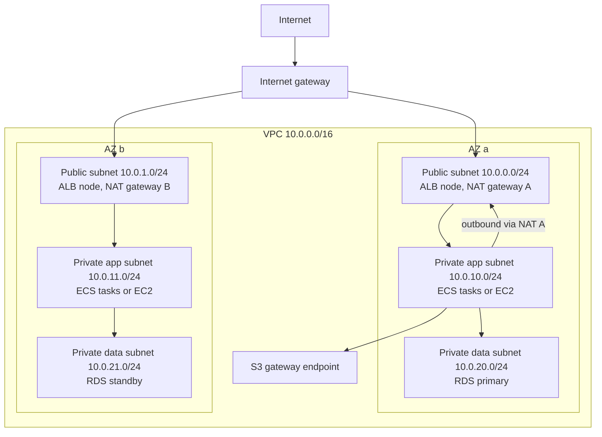

Packet walk for a user request: Internet to IGW, to the ALB in the public subnets, to app tasks in private subnets (security group allows only the ALB's security group), to RDS in data subnets (security group allows only the app security group). Outbound calls from the app go to the NAT gateway in the same AZ, then the IGW. S3 traffic goes through the gateway endpoint and never touches the internet.

### Security groups vs network ACLs

**What it is:** Two layers of firewall. **Security groups (SGs)** attach to network interfaces (instances, ALBs, RDS, Lambda in VPC). **Network ACLs (NACLs)** attach to subnets.

**Why it's used:** SGs are the main tool for least-privilege access between tiers. NACLs add a coarse subnet-level guardrail, such as blocking a known bad IP range.

**How it works:**

| | Security group | Network ACL |
|---|---|---|
| Applies to | ENI / instance level | Subnet level |
| State | **Stateful**: return traffic is automatically allowed | **Stateless**: return traffic must be explicitly allowed (ephemeral ports 1024–65535) |
| Rules | Allow only | Allow and deny |
| Evaluation | All rules evaluated together | Numbered rules in order, first match wins |
| Default | New SG: no inbound, all outbound allowed. Default SG allows inbound from itself | Default NACL allows all in and out. Custom NACL denies all until you add rules |
| References | Can reference other security groups (e.g. "allow from sg-alb") | IP CIDRs only |
| Block a specific IP | Not possible (no deny) | Yes, with a deny rule |

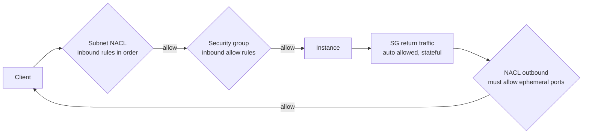

**Pros:**
- SGs are simple and expressive (reference other SGs). NACLs can deny.

**Cons / limits:**
- Forgetting ephemeral ports in a NACL is a classic outage. SG rule counts have quotas.

**Use it when / avoid when:**
- Use SGs for all app-level rules. Use NACLs sparingly for subnet-wide denies.

**Exam facts:**
- SG = stateful, allow-only, instance level. NACL = stateless, allow and deny, subnet level, ordered.
- "Block a specific malicious IP" = NACL deny rule (or AWS WAF for HTTP at the ALB/CloudFront).
- Responses through a NACL need outbound rules for ephemeral ports 1024–65535.
- Chain SGs by referencing the previous tier's SG ID (ALB SG to app SG to DB SG).

### VPC endpoints: gateway vs interface (PrivateLink)

**What it is:** Private connections from your VPC to AWS services (and to services exposed by other accounts) without using an IGW, NAT gateway or public IPs.

**Why it's used:** Security (traffic stays on the AWS network, no internet path) and cost (avoid NAT gateway per-GB charges).

**How it works:**

| | Gateway endpoint | Interface endpoint (PrivateLink) |
|---|---|---|
| Services | **S3 and DynamoDB only** | Most AWS services (SQS, SNS, KMS, Secrets Manager, ECR, CloudWatch, STS...), S3 too, plus partner and your own services |
| Mechanism | Route table entry (prefix list) | ENI with private IPs in your subnets, private DNS |
| Cost | Free | Hourly per AZ plus per GB |
| Access from on-prem or peered VPC | No | Yes (over VPN/Direct Connect/peering) |
| Security | Endpoint policy, bucket policy with `aws:SourceVpce` | Security groups on the ENI, endpoint policy |

**PrivateLink** also lets you expose your own service: put it behind an NLB, create an endpoint service, and consumers in other VPCs or accounts create interface endpoints to it. No peering, no overlapping CIDR issues, one-directional.

**Pros:**
- Private, often cheaper, fine-grained policies.

**Cons / limits:**
- Gateway endpoints only work from within the VPC. Interface endpoints cost per AZ per hour.

**Use it when / avoid when:**
- Always add S3 and DynamoDB gateway endpoints to VPCs with private workloads.

**Exam facts:**
- S3 and DynamoDB = gateway endpoint (free, route table). Everything else = interface endpoint.
- "Access S3 privately from on-premises over Direct Connect" = S3 interface endpoint (gateway endpoints are not reachable from on-prem).
- "Expose a service to many VPCs/accounts privately without peering" = PrivateLink (NLB + endpoint service).
- Restrict a bucket to one VPC endpoint with `aws:SourceVpce` in the bucket policy.

#### Q: [Mid] EC2 instances in a private subnet must download OS patches from the internet but must not be reachable from the internet. What do you add?

**Scenario:** Options: A) Attach an internet gateway route to the private subnet. B) A NAT gateway in a public subnet and a route `0.0.0.0/0 -> NAT` in the private subnet's route table. C) An S3 gateway endpoint. D) Assign Elastic IPs to the instances.

**Answer:** B. NAT allows outbound-initiated connections and blocks inbound-initiated ones.

**Why the others are wrong:** A makes the subnet public. C only reaches S3. D makes instances reachable from the internet (if routed to an IGW).

**Exam tip:** NAT gateway lives in the public subnet, serves the private subnet. For HA, one per AZ.

#### Q: [Mid] A web server's security group allows inbound 443. The subnet's custom NACL allows inbound 443 and outbound 443. Users time out. Why?

**Scenario:** Options: A) Security groups are stateless. B) The NACL is stateless and must allow outbound ephemeral ports (1024–65535) for responses to clients. C) The IGW is blocking traffic. D) HTTPS needs port 80 too.

**Answer:** B. Responses go back to the client's ephemeral port, which the NACL outbound rules block.

**Why the others are wrong:** A is false; SGs are stateful. C: IGWs do not filter traffic. D: HTTPS does not require port 80.

**Exam tip:** Stateless NACL questions almost always hinge on ephemeral ports.

#### Q: [Senior] Lambda functions in private subnets read and write large objects in S3, and the NAT gateway bill is very high. Cheapest fix with no code change?

**Scenario:** Options: A) Move the Lambda functions out of the VPC. B) Add an S3 gateway endpoint and associate it with the private subnets' route tables. C) Add an S3 interface endpoint in each AZ. D) Use S3 Transfer Acceleration.

**Answer:** B. Gateway endpoints are free and route S3 traffic privately, bypassing the NAT gateway's per-GB charge.

**Why the others are wrong:** A may break access to private resources like RDS. C works but costs hourly and per GB. D speeds long-distance transfers and adds cost.

**Exam tip:** S3 or DynamoDB from a private subnet = gateway endpoint first. Interface endpoint only if on-prem or other VPCs need it.

#### Q: [Senior] A SaaS provider wants to offer its API privately to hundreds of customer VPCs, some with overlapping CIDR ranges, without exposing it to the internet. Which design?

**Scenario:** Options: A) VPC peering with every customer. B) Transit Gateway shared with all customers. C) AWS PrivateLink: the service behind an NLB as an endpoint service; customers create interface endpoints. D) Public ALB with IP allow-lists.

**Answer:** C. PrivateLink is one-directional, scales to many consumers, and works with overlapping CIDRs because consumers reach the service through ENIs in their own subnets.

**Why the others are wrong:** A doesn't scale and fails with overlapping CIDRs. B requires non-overlapping routing and gives broad network connectivity. D uses the internet.

**Exam tip:** "Expose a service privately to many VPCs or accounts" or "overlapping CIDRs" = PrivateLink.

## 5. Connecting networks: peering, Transit Gateway, VPN, Direct Connect

Companies have many VPCs (per team, per environment, per account) plus on-premises data centers. These services connect them.

### VPC peering vs Transit Gateway

**What it is:** **VPC peering** is a private one-to-one connection between two VPCs (same or different account or Region). **Transit Gateway (TGW)** is a regional hub router that connects many VPCs, VPNs and Direct Connect gateways.

**Why it's used:** Shared services (logging, CI, identity) must be reachable from 40 application VPCs, and on-prem must reach all of them.

**How it works:** Peering: request and accept the connection, then add routes in **both** VPCs' route tables and allow traffic in security groups. Peering is **not transitive**: if A peers with B and B with C, A cannot reach C through B. No overlapping CIDRs. With N VPCs, full mesh needs N(N-1)/2 connections. Transit Gateway: attach VPCs (and VPN, Direct Connect gateway, Connect for SD-WAN, peering to TGWs in other Regions); TGW route tables control which attachments can talk (segmentation, e.g. prod cannot reach dev). Share a TGW across accounts with AWS Resource Access Manager (RAM). It supports ECMP over multiple VPN tunnels for more bandwidth, and multicast.

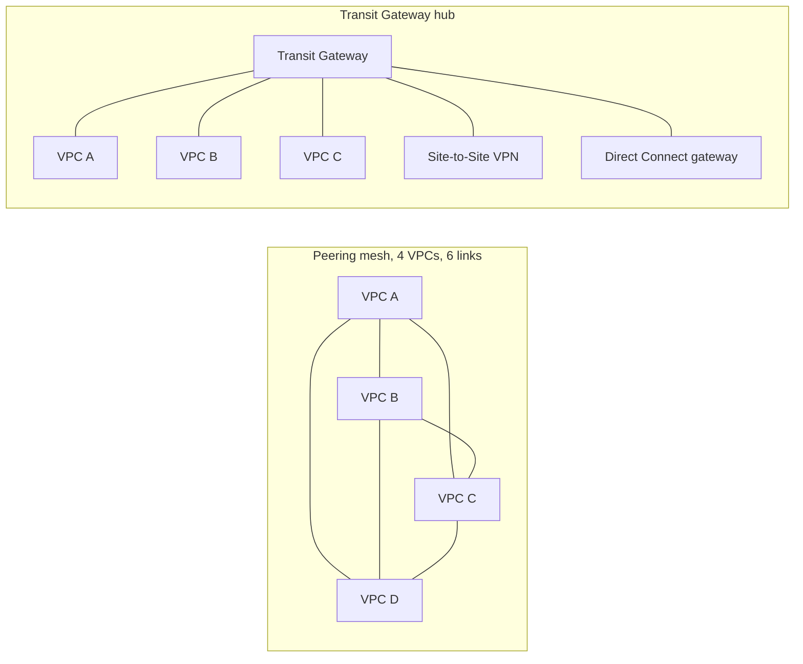

| | VPC peering | Transit Gateway |
|---|---|---|
| Topology | One-to-one, non-transitive | Hub and spoke, transitive |
| Scale | Hard to manage beyond a handful | Thousands of attachments |
| On-prem connectivity | No (cannot route through a peer to VPN/DX) | Yes, VPN and DX attach to the hub |
| Cost | No hourly fee, data transfer charges | Hourly per attachment plus per GB |
| Bandwidth | No extra bottleneck | High, per attachment limits apply |
| Cross-Region | Yes | Yes, via TGW peering |
| Overlapping CIDRs | Not allowed | Not routable |

**Pros:**
- Peering: simple and cheapest for a few VPCs. TGW: central routing, segmentation, scales.

**Cons / limits:**
- Peering: non-transitive and mesh explosion. TGW: per-GB processing cost.

**Use it when / avoid when:**
- Peering for 2–3 VPCs. TGW for many VPCs and hybrid connectivity.

**Exam facts:**
- Peering is not transitive and does not support overlapping CIDRs or edge-to-edge routing (no using a peer's IGW, NAT, VPN).
- "Connect hundreds of VPCs and on-prem with a hub" = Transit Gateway.
- Share TGW across accounts with RAM.
- ECMP on TGW aggregates multiple VPN tunnels for more bandwidth.

### AWS Site-to-Site VPN

**What it is:** An encrypted IPsec tunnel over the public internet between your on-premises network and AWS.

**Why it's used:** Quick, cheap hybrid connectivity (hours to set up), or a backup path for Direct Connect.

**How it works:** On AWS: a **virtual private gateway (VGW)** attached to one VPC, or a **Transit Gateway**. On premises: a **customer gateway** device (router or firewall) with a public IP (a customer gateway resource in AWS represents it). Each connection has **two tunnels** in different AWS endpoints for redundancy. Routing is static or dynamic (BGP). Each tunnel has a bandwidth cap (historically about 1.25 Gbps; larger tunnel options have been introduced, check current limits); use ECMP on a TGW to aggregate. **Accelerated VPN** routes through Global Accelerator edge locations for better performance. **VPN CloudHub** connects several branch offices to each other through a VGW. **AWS Client VPN** is a different service for individual users' laptops.

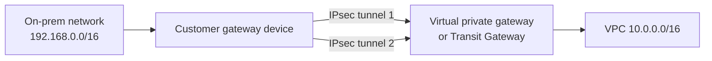

**Pros:**
- Fast to set up, encrypted, low cost.

**Cons / limits:**
- Internet-dependent: variable latency and throughput. Per-tunnel bandwidth cap.

**Use it when / avoid when:**
- Use for quick setup, low-to-moderate bandwidth, or as a DX backup.
- Avoid for consistent high bandwidth and low latency (Direct Connect).

**Exam facts:**
- Components: customer gateway (on-prem side), VGW or TGW (AWS side), two tunnels.
- Enable route propagation on the VPC route table for VGW-learned routes.
- "Set up connectivity in hours, encrypted" = Site-to-Site VPN.
- "Encrypted connection over Direct Connect" = VPN over DX (or MACsec).
- Client VPN = remote users; Site-to-Site = networks.

### AWS Direct Connect

**What it is:** A dedicated private network connection from your data center (through a Direct Connect location, a colocation facility) to AWS, not over the internet.

**Why it's used:** Consistent latency and high bandwidth for large data transfer, trading systems, or regulatory preference for private links.

**How it works:** **Dedicated connections** (1, 10, 100, 400 Gbps physical ports) or **hosted connections** through a partner (from about 50 Mbps up to 25 Gbps). Provisioning takes weeks or longer. You create **virtual interfaces (VIFs)**: **private VIF** (to a VGW or Direct Connect gateway, reaches VPCs), **transit VIF** (to a Transit Gateway via a DX gateway), **public VIF** (reach AWS public endpoints like S3 over the private link). A **Direct Connect gateway** lets one connection reach VPCs in many Regions. DX traffic is **not encrypted by default**: use **MACsec** (on supported dedicated connections) or run a Site-to-Site VPN over the DX.

Resiliency models (from the AWS Resiliency Toolkit): **development** (one connection), **high resiliency** (two connections at two DX locations), **maximum resiliency** (two connections at each of two locations, separate devices). A cheaper option for backup is a Site-to-Site VPN.

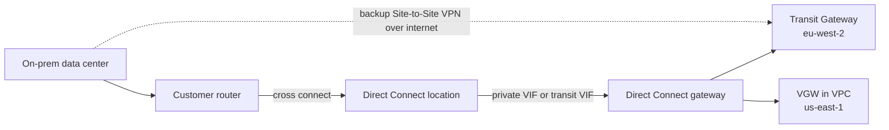

**Pros:**
- Predictable latency, high throughput, lower data transfer out price than internet.

**Cons / limits:**
- Long lead time, physical setup, not encrypted by default, single connection is a single point of failure.

**Use it when / avoid when:**
- Use for sustained, high-volume, latency-sensitive hybrid traffic.
- Avoid when you need connectivity this week (start with VPN, migrate to DX later).

**Exam facts:**
- Not encrypted by default; use MACsec or VPN over DX for encryption.
- Takes weeks to provision; VPN is the quick interim or backup.
- Direct Connect gateway = one DX to many VPCs in many Regions.
- Public VIF reaches AWS public services; private VIF reaches VPCs; transit VIF reaches TGW.
- Highest resiliency: multiple connections at multiple DX locations.

#### Q: [Mid] VPC A is peered with VPC B, and B is peered with C. Instances in A cannot reach C. Why, and what is the scalable fix for 30 VPCs?

**Scenario:** Options: A) Security groups in B block traffic; fix the SGs. B) VPC peering is not transitive; for 30 VPCs use a Transit Gateway. C) Add a NAT gateway in B. D) Enable DNS resolution on the peering.

**Answer:** B. Traffic cannot transit through B. A TGW provides transitive hub-and-spoke routing for many VPCs.

**Why the others are wrong:** A: even perfect SGs cannot make peering transitive. C: NAT does not route between peered VPCs. D: DNS settings resolve names but do not add routes.

**Exam tip:** "Transitive," "many VPCs," "hub and spoke," or "simplify network management" = Transit Gateway.

#### Q: [Senior] A company needs connectivity from its data center to AWS within 2 days, and in the long term needs consistent 10 Gbps with an encrypted path. What is the plan?

**Scenario:** Options: A) Order Direct Connect and wait. B) Set up Site-to-Site VPN now; order a 10 Gbps Direct Connect; when ready, use MACsec or VPN over DX for encryption and keep the internet VPN as backup. C) Use Client VPN. D) Use VPC peering to the data center.

**Answer:** B. VPN is ready in hours; DX takes weeks. DX is not encrypted by default, so add MACsec or IPsec over DX.

**Why the others are wrong:** A misses the 2-day deadline. C is for individual users. D: peering only connects VPCs.

**Exam tip:** "Quickly" = VPN. "Consistent bandwidth, lower latency" = Direct Connect. "Encrypted + DX" = MACsec or VPN over DX.

#### Q: [Staff] A bank's trading platform depends on a single 10 Gbps Direct Connect connection. Leadership requires that losing a single DX location does not cut connectivity. What is the most resilient design?

**Scenario:** Options: A) Add a second connection at the same DX location. B) Add connections at a second DX location, ideally two connections at each of two locations on separate devices, with BGP failover; optionally a VPN as a last resort. C) Only rely on a Site-to-Site VPN backup. D) Use Global Accelerator.

**Answer:** B. Spreading across two DX locations survives a location failure; two connections at each gives maximum resiliency.

**Why the others are wrong:** A survives a device or cable failure but not a location failure. C gives a much lower and variable bandwidth backup, which may be acceptable for some, but does not meet "most resilient." D accelerates internet traffic, not private hybrid links.

**Exam tip:** "Maximum resiliency for critical workloads" = separate connections terminating at separate DX locations.

## 6. DNS and the edge: Route 53, CloudFront, Global Accelerator

These services sit in front of everything else. Route 53 tells clients where to go, CloudFront caches and serves HTTP content close to users, and Global Accelerator gives fast, stable entry points over the AWS backbone.

### Amazon Route 53: records and alias

**What it is:** A highly available, scalable DNS service (with a 100% availability SLA), plus domain registration and health checks.

**Why it's used:** Map `app.example.com` to your ALB, route users to the nearest Region, and fail over to a DR site automatically.

**How it works:** A **hosted zone** holds records for a domain. **Public hosted zones** answer internet queries; **private hosted zones** answer only inside associated VPCs. Each record has a name, type, value and **TTL** (how long resolvers cache the answer; lower TTL means faster changes but more queries).

| Record type | Purpose |
|---|---|
| A | Name to IPv4 address |
| AAAA | Name to IPv6 address |
| CNAME | Name to another name (not allowed at the zone apex, e.g. `example.com`) |
| Alias (Route 53 extension) | Name to an AWS resource (ALB, NLB, CloudFront, S3 website, API Gateway, another record); works at the apex; free queries to AWS resources; no TTL you set |
| MX | Mail servers |
| TXT | Verification, SPF, DKIM |
| NS | Name servers for the zone |
| SOA | Zone authority info |
| CAA | Which certificate authorities may issue certificates |
| SRV, PTR | Service locator, reverse lookup |

**Route 53 Resolver** handles DNS inside VPCs; **inbound endpoints** let on-prem DNS resolve private AWS names, **outbound endpoints** with forwarding rules let VPC resources resolve on-prem names.

**Pros:**
- Global, very reliable, integrated with AWS resources.

**Cons / limits:**
- DNS changes are subject to client caching (TTL); DNS failover is not instantaneous.

**Use it when / avoid when:**
- Use alias records for any AWS resource target, especially at the apex.

**Exam facts:**
- CNAME cannot be used at the zone apex; Alias can.
- Alias targets: ELB, CloudFront, API Gateway, S3 website endpoint, Elastic Beanstalk, VPC interface endpoint, Global Accelerator, another Route 53 record. Not an EC2 DNS name.
- Alias queries to AWS resources are free.
- Private hosted zones need VPC DNS hostnames and DNS resolution enabled.
- Hybrid DNS = Route 53 Resolver inbound and outbound endpoints.

### Route 53 routing policies and health checks

**What it is:** Rules that decide which answer Route 53 returns for a query, and health checks that remove unhealthy targets from answers.

**Why it's used:** Canary releases, multi-Region latency optimization, active-passive DR, country-specific content.

**How it works:**

| Policy | How it answers | Typical use |
|---|---|---|
| Simple | One record, possibly multiple values returned in random order; no health checks | Single resource |
| Weighted | Splits traffic by weights (e.g. 90/10) | Canary, blue/green, A/B testing |
| Latency-based | Region with lowest measured latency for the user | Multi-Region active-active performance |
| Failover | Primary when healthy, else secondary | Active-passive DR |
| Geolocation | Based on the user's continent, country or US state; needs a default record | Localized content, legal restrictions |
| Geoproximity | Based on geographic distance with a bias to grow or shrink regions (via traffic flow) | Shift traffic between Regions gradually |
| Multivalue answer | Up to 8 healthy records returned at random | Simple client-side load spreading with health checks (not a load balancer replacement) |
| IP-based | Based on the client's source IP CIDR | Route specific ISPs or networks to specific endpoints |

**Health checks** types: **endpoint** (HTTP/HTTPS/TCP from global checkers, optional string matching), **calculated** (combine child checks with AND/OR/threshold), and **CloudWatch alarm-based** (for private resources, since checkers are on the internet and cannot reach private endpoints). Health checkers must be allowed by your firewall.

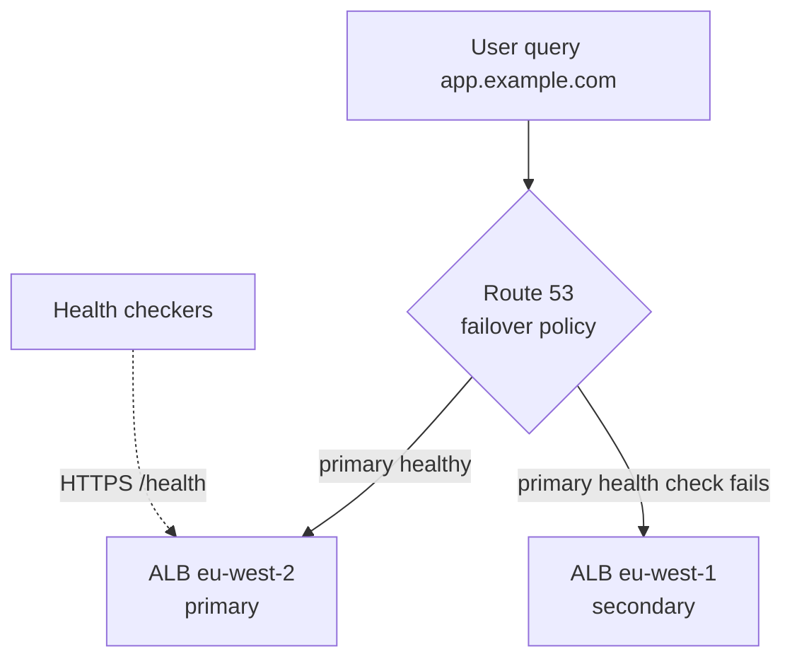

**Pros:**
- Flexible global traffic management with no servers.

**Cons / limits:**
- DNS caching delays failover by about the TTL. Clients that ignore TTL can stick to a dead endpoint.

**Use it when / avoid when:**
- Use failover for active-passive DR, latency for active-active, weighted for gradual rollouts.

**Exam facts:**
- "Route users to the Region with the lowest latency" = latency-based (not geolocation).
- "Users in Germany must see the German site" or "restrict by country" = geolocation.
- "Shift traffic gradually between Regions using bias" = geoproximity.
- "Send 10% of traffic to the new version" = weighted.
- Private resource health = CloudWatch alarm-based health check.

### Amazon CloudFront

**What it is:** AWS's content delivery network (CDN): caches content at hundreds of edge locations so users get it from nearby.

**Why it's used:** Serve a React app and its assets globally with HTTPS, accelerate APIs, protect origins with WAF and Shield, and keep S3 buckets private.

**How it works:** A **distribution** has one or more **origins**: S3 bucket, S3 website endpoint, ALB, EC2, API Gateway, Lambda function URL, MediaPackage, any custom HTTP server, and **VPC origins** (private ALB/NLB/EC2 in private subnets, so the origin needs no public exposure). **Cache behaviors** match path patterns (`/api/*`, `/static/*`) to origins with their own settings. A **cache policy** decides the cache key (which headers, cookies, query strings) and TTLs; an **origin request policy** decides what is forwarded to the origin without affecting the cache key. Content updates: version file names (`app.3f9a.js`) or create **invalidations** (charged beyond a free monthly allowance). **Origin Access Control (OAC)** lets CloudFront read a private S3 bucket using SigV4, replacing the older Origin Access Identity (OAI). **Origin groups** fail over to a secondary origin. **Origin Shield** adds a central caching layer to reduce origin load. **Signed URLs / signed cookies** restrict private content. Custom domain TLS certificates from ACM must be in `us-east-1`. **Geo restriction** allows or blocks countries.

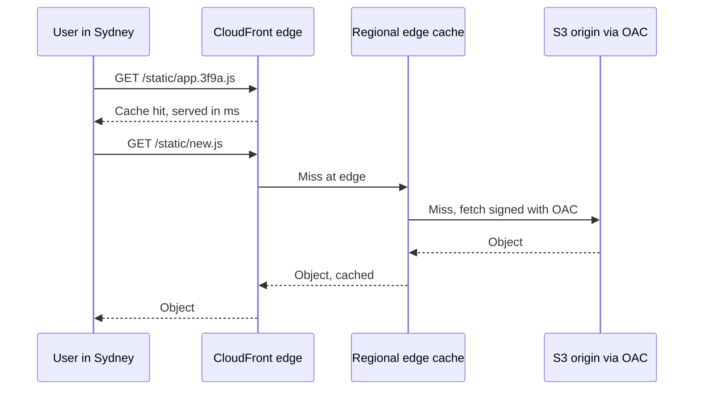

**Lambda@Edge vs CloudFront Functions:**

| | CloudFront Functions | Lambda@Edge |
|---|---|---|
| Runtime | JavaScript (lightweight) | Node.js, Python |
| Triggers | Viewer request, viewer response | Viewer request/response and origin request/response |
| Max execution time | Sub-millisecond (about 1 ms) | Up to 5 s (viewer) or 30 s (origin) |
| Network and body access | No network calls, no request body | Network calls, can read body (origin events) |
| Scale and cost | Millions of requests per second, very cheap | Thousands per second per Region, more expensive |
| Runs at | Edge locations | Regional edge caches |
| Use cases | Header rewrites, URL rewrites and redirects, cache key normalization, simple JWT validation, A/B cookie | Auth calls to an external service, image resizing, dynamic origin selection, bigger logic |

CloudFront KeyValueStore gives CloudFront Functions a small, fast key-value data store (for redirects or feature flags).

**Pros:**
- Lower latency, offloads origins, HTTPS, DDoS protection with Shield Standard included, WAF integration.

**Cons / limits:**
- Cache invalidation and cache key design need care; stale content risks.

**Use it when / avoid when:**
- Use in front of any public web content or API with global users.
- Avoid relying on it for non-HTTP traffic (use Global Accelerator).

**Exam facts:**
- Keep S3 private behind CloudFront with **OAC** (OAI is legacy).
- ACM certificate for CloudFront must be in `us-east-1`.
- "Restrict content to paying users" = signed URLs (one file) or signed cookies (many files).
- "Block access from specific countries" = CloudFront geo restriction (or WAF geo match).
- CloudFront Functions for simple, high-volume viewer manipulations; Lambda@Edge for heavier logic or origin events.
- Use origin groups for origin failover; Origin Shield to reduce origin load.

### AWS Global Accelerator

**What it is:** A networking service that gives you **two static anycast IP addresses** that route users into the AWS global network at the nearest edge location, then over the AWS backbone to your endpoints in one or more Regions.

**Why it's used:** Improve performance and availability for TCP/UDP apps (gaming, VoIP, IoT, financial APIs), provide fixed IPs for allow-lists, and fail over between Regions in seconds without DNS caching issues.

**How it works:** Create an accelerator with **listeners** (ports, TCP/UDP), **endpoint groups** per Region (with **traffic dials** to control the percentage per Region), and **endpoints** (ALB, NLB, EC2, Elastic IP) with weights. Health checks route away from unhealthy endpoints quickly. Client IP preservation is supported for some endpoint types.

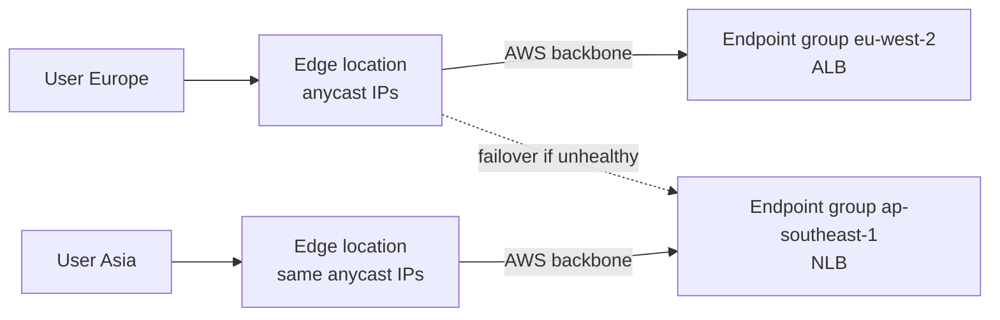

**Pros:**
- Static IPs, fast failover (no DNS TTL), works for any TCP/UDP, uses the AWS backbone.

**Cons / limits:**
- No caching. Costs a fixed hourly fee plus data transfer premium.

**Use it when / avoid when:**
- Use for non-HTTP traffic, static IP needs, or fast multi-Region failover.
- Avoid when the content is cacheable HTTP (CloudFront is better and cheaper).

| | CloudFront | Global Accelerator |
|---|---|---|
| Layer | HTTP/HTTPS (layer 7) | TCP/UDP (layer 4) |
| Caching | Yes | No |
| IPs | Many, changing | Two static anycast IPs |
| Best for | Static and dynamic web content, APIs | Gaming, IoT, VoIP, static IP allow-lists, fast regional failover |
| Failover | Origin groups | Health-based endpoint failover in seconds |

**Exam facts:**
- "Static IP addresses for a global application" or "allow-list fixed IPs" = Global Accelerator.
- "UDP, gaming, VoIP, IoT, non-HTTP" + global performance = Global Accelerator.
- "Cache content at the edge" = CloudFront.
- Global Accelerator failover is not affected by DNS caching.

#### Q: [Mid] The company wants `example.com` (the zone apex) to point at an Application Load Balancer. Which record?

**Scenario:** Options: A) CNAME `example.com` to the ALB DNS name. B) Route 53 Alias A record `example.com` to the ALB. C) A record with the ALB's current IP addresses. D) MX record.

**Answer:** B. Alias works at the apex, tracks the ALB's changing IPs, and queries are free.

**Why the others are wrong:** A: CNAME is not allowed at the apex. C: ALB IPs change; hardcoding breaks. D is for mail.

**Exam tip:** Apex + AWS resource = Alias. Alias can't point to an EC2 instance's DNS name.

#### Q: [Senior] An app runs in `eu-west-2` and `us-east-1`. Users should be served by the Region that gives them the fastest response, and an unhealthy Region must be removed automatically. Which Route 53 setup?

**Scenario:** Options: A) Geolocation routing. B) Latency-based routing with health checks on each record. C) Weighted 50/50 routing. D) Simple routing with two values.

**Answer:** B. Latency-based routing picks the lowest-latency Region; health checks remove failed endpoints.

**Why the others are wrong:** A routes by location, which is not always the lowest latency, and is meant for content or compliance. C splits traffic regardless of performance. D cannot use health checks.

**Exam tip:** "Best performance" = latency-based. "Based on user's country" = geolocation. "Active-passive" = failover.

#### Q: [Senior] A React SPA is served from a private S3 bucket. Global users need HTTPS on `app.example.com`, and the bucket must not be publicly accessible. Design?

**Scenario:** Options: A) Enable S3 static website hosting with a public bucket policy. B) CloudFront distribution with an S3 origin using Origin Access Control, bucket policy allowing only that distribution, ACM certificate in `us-east-1`, and Route 53 alias to CloudFront. C) S3 Transfer Acceleration. D) An ALB in front of the S3 bucket.

**Answer:** B. CloudFront provides HTTPS and caching; OAC lets only CloudFront read the private bucket.

**Why the others are wrong:** A requires a public bucket and website endpoints are HTTP only. C speeds uploads, not secure hosting. D: ALB cannot use S3 as a target this way and adds cost.

**Exam tip:** "Private bucket" + "CloudFront" = OAC. CloudFront certificates live in `us-east-1`. For SPA routing, map 403/404 errors to `/index.html` with a custom error response.

#### Q: [Mid] On every request, a site needs to add security headers and redirect old URLs, at very high request rates with the lowest cost. Which edge compute?

**Scenario:** Options: A) Lambda@Edge on origin request. B) CloudFront Functions on viewer request (redirects) and viewer response (headers). C) An EC2 proxy fleet. D) API Gateway.

**Answer:** B. CloudFront Functions are built for lightweight viewer-side manipulations at massive scale and very low cost. (Response headers policies can also add security headers without code.)

**Why the others are wrong:** A works but costs more and runs at regional caches. C and D add servers or latency for a trivial edge task.

**Exam tip:** Simple, sub-millisecond, viewer-only = CloudFront Functions. Network calls, body access, origin events = Lambda@Edge.

#### Q: [Senior] A multiplayer game uses UDP in two Regions. Players need low latency, partners need two fixed IP addresses to allow-list, and failover between Regions must happen in seconds. Which service?

**Scenario:** Options: A) CloudFront. B) Route 53 failover routing. C) AWS Global Accelerator with endpoint groups in both Regions pointing to NLBs. D) S3 Transfer Acceleration.

**Answer:** C. Global Accelerator offers two static anycast IPs, supports UDP, routes over the AWS backbone, and fails over based on health checks without DNS caching delays.

**Why the others are wrong:** A is HTTP/HTTPS only. B depends on DNS TTLs and gives no static IPs. D is for S3 uploads.

**Exam tip:** Static IPs + UDP/TCP + multi-Region failover = Global Accelerator.

#### Q: [Staff] On-premises servers must resolve names in a Route 53 private hosted zone, and EC2 instances must resolve `corp.internal` names hosted on on-prem DNS. A Direct Connect link exists. What do you configure?

**Scenario:** Options: A) Make the private hosted zone public. B) Route 53 Resolver inbound endpoint (on-prem DNS forwards AWS zone queries to it) and outbound endpoint with forwarding rules for `corp.internal` to on-prem DNS servers. C) Run BIND on EC2 without Resolver endpoints. D) Use Global Accelerator for DNS.

**Answer:** B. Inbound endpoints accept queries from on-prem; outbound endpoints with rules forward VPC queries to on-prem resolvers. Share rules across accounts with RAM.

**Why the others are wrong:** A exposes internal names publicly. C works but adds servers to manage and patch. D does not provide DNS resolution.

**Exam tip:** Hybrid DNS = Route 53 Resolver endpoints. Inbound = on-prem asks AWS. Outbound = AWS asks on-prem.

> **Interview tip:** In a design conversation, trace one request end to end: DNS (Route 53), edge (CloudFront or Global Accelerator), load balancer in public subnets, app in private subnets, database in data subnets, with security groups chained between tiers and endpoints for AWS services. Then say how each hop survives an AZ failure and a Region failure.


