## 1. Messaging and decoupling

Before the services, one idea: **decoupling**. If service A calls service B directly over HTTP and B is slow or down, A is slow or down too. If A instead drops a message into a middle layer (a queue, a topic or an event bus) and B picks it up when it can, then A and B can fail, scale and deploy independently. Almost every "make this more resilient" exam question is really asking "where do I put the buffer?".

Three shapes to remember:

- **Queue (point-to-point):** one message, one consumer group processes it. Example: SQS.
- **Pub/sub (fan-out):** one message, many independent subscribers each get a copy. Example: SNS, EventBridge.
- **Stream (ordered log):** messages are kept for a time window, many readers can re-read them in order. Example: Kinesis Data Streams.

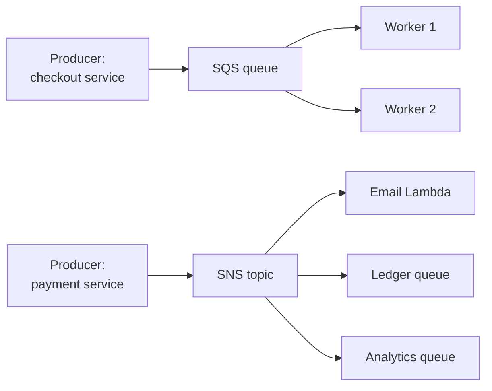

### Amazon SQS (Simple Queue Service)
**What it is:** A fully managed message queue. Think of it as a to-do tray between two services: the producer drops a message in, a worker takes it out, does the job, and deletes it.

**Why it's used:** It absorbs spikes and protects slow downstream systems. Example: on payday 50,000 payment confirmations arrive in one minute, but the statement generator can only process 500 per second. Put SQS in between and the generator works through the backlog at its own pace without anything being lost.

**How it works:** Producers call `SendMessage`. Consumers poll with `ReceiveMessage`. When a consumer receives a message it is not deleted; it becomes **invisible** to other consumers for the **visibility timeout**. If the consumer finishes, it calls `DeleteMessage`. If it crashes, the timeout expires and the message reappears for another worker. After a configured number of failed receives (`maxReceiveCount`) the message moves to a **dead-letter queue (DLQ)** so one poison message does not block everything.

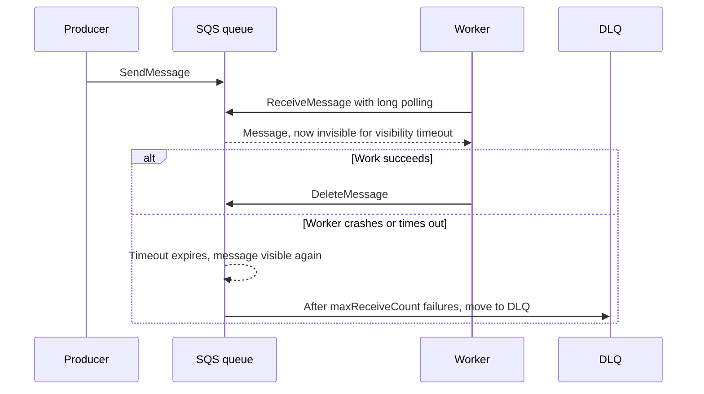

Key settings, in plain English:

- **Standard vs FIFO.** Standard queues give nearly unlimited throughput, **at-least-once** delivery (a message can occasionally arrive twice) and **best-effort ordering**. FIFO queues (name must end in `.fifo`) give **strict ordering within a message group** and **exactly-once processing** using a deduplication ID, at lower throughput (hedge: about 300 API calls per second per action without batching, 3,000 messages per second with batching, much higher in high-throughput mode; check current quotas).
- **Visibility timeout.** Default 30 seconds, maximum 12 hours. Set it longer than your worst-case processing time, otherwise a second worker picks up the same message while the first is still working. A worker can extend it with `ChangeMessageVisibility`.
- **Long polling.** Set `WaitTimeSeconds` up to 20 seconds. The call waits until a message arrives instead of returning empty immediately. Fewer empty responses means lower cost and lower CPU.
- **DLQ.** A normal queue that receives messages after `maxReceiveCount` failed attempts. A FIFO queue's DLQ must also be FIFO. You can later "redrive" messages from the DLQ back to the source queue.
- **Retention.** Default 4 days, configurable from 1 minute to 14 days.
- **Delay queues.** Delay delivery of new messages by up to 15 minutes.
- **Message size.** Historically 256 KB; AWS raised the limit to 1 MiB in 2025 (verify current docs). For larger payloads store the body in S3 and send a pointer (the SQS Extended Client Library does this).

```typescript
// Node/TypeScript worker using AWS SDK v3, long polling + delete on success
import { SQSClient, ReceiveMessageCommand, DeleteMessageCommand } from "@aws-sdk/client-sqs";

const sqs = new SQSClient({ region: "us-east-1" });
const QueueUrl = process.env.QUEUE_URL!;

export async function poll(): Promise<void> {
  const res = await sqs.send(new ReceiveMessageCommand({
    QueueUrl,
    MaxNumberOfMessages: 10,
    WaitTimeSeconds: 20,      // long polling
    VisibilityTimeout: 120,   // longer than worst-case processing
  }));
  for (const msg of res.Messages ?? []) {
    const payment = JSON.parse(msg.Body!) as { paymentId: string; amountCents: number };
    await processPaymentIdempotently(payment); // standard queues can deliver twice
    await sqs.send(new DeleteMessageCommand({ QueueUrl, ReceiptHandle: msg.ReceiptHandle! }));
  }
}

declare function processPaymentIdempotently(p: { paymentId: string; amountCents: number }): Promise<void>;
```

**Pros:**
- Fully managed, scales automatically, pay per request.
- Simple mental model; strong decoupling and buffering.
- Native Lambda trigger (event source mapping) handles polling for you.

**Cons / limits:**
- Consumers must poll (Lambda hides this).
- One message is processed by one consumer; not a fan-out tool by itself.
- Standard queues can duplicate and reorder; your consumer must be idempotent.
- Messages are deleted after processing, so you cannot replay history like a stream.

**Use it when / avoid when:**
- Use when you need a buffer between producer and worker, background jobs, or load leveling.
- Use FIFO when order matters per entity (all events for `accountId=42` in order).
- Avoid when many independent consumers need the same message (add SNS or EventBridge in front).
- Avoid when you need replay or multiple readers of an ordered log (use Kinesis).

**Exam facts:**
- "Decouple tiers", "buffer writes to the database", "handle sudden spikes" usually points to SQS.
- Duplicate processing problem: increase the **visibility timeout** to exceed processing time.
- Reduce empty receives and cost: enable **long polling** (`ReceiveMessageWaitTimeSeconds` > 0, max 20).
- Strict order plus no duplicates: **SQS FIFO**; ordering is per **message group ID**.
- Scale an Auto Scaling group of workers on the **ApproximateNumberOfMessagesVisible** (backlog) metric.
- Max retention is **14 days**; delay queues max **15 minutes**.

### Amazon SNS (Simple Notification Service)
**What it is:** A managed publish/subscribe service. A publisher sends one message to a **topic**; SNS pushes a copy to every **subscriber**. Like a group chat: you post once, everyone in the group gets it.

**Why it's used:** To notify many systems about one event without the publisher knowing who they are. Example: a `PaymentSettled` event must update the ledger, email the customer and feed analytics. The payment service publishes once.

**How it works:** Subscribers can be SQS queues, Lambda functions, HTTP/S endpoints, email, SMS, mobile push and Amazon Data Firehose. SNS **pushes** (no polling). **Message filtering policies** on a subscription let each subscriber receive only the messages it cares about (for example only `currency = "USD"`). SNS has standard topics and **FIFO topics** (ordering and dedup, which deliver to SQS queues).

**The fan-out pattern (SNS + SQS):** Publish to one SNS topic, subscribe several SQS queues. Each queue gets its own copy, and each consumer processes at its own pace with its own retries and DLQ. SNS alone has no durable buffer for slow consumers; SQS adds that.

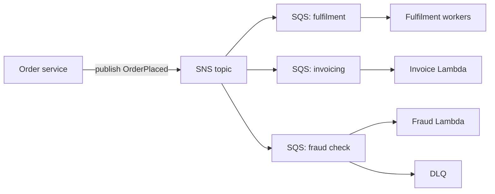

**Pros:**
- Push-based, very low latency, massive scale.
- Many protocols, including email and SMS for human notifications.
- Filtering reduces wasted work in subscribers.

**Cons / limits:**
- No message retention for replay; if an HTTP subscriber is down, SNS retries with a policy and then can send to a DLQ, but it is not a queue.
- Standard topics can deliver duplicates and out of order.
- Fewer routing rules than EventBridge.

**Use it when / avoid when:**
- Use for fan-out to multiple queues or Lambdas, and for alerts (CloudWatch alarm to email or SMS).
- Avoid when you need content-based routing across many AWS and SaaS sources, schema discovery or replay (EventBridge).

**Exam facts:**
- "One event, multiple independent processing paths" = **SNS fan-out to SQS queues**.
- The SQS queue's **access policy must allow the SNS topic** to `sqs:SendMessage`.
- S3 event notifications can only go to one destination per event type/prefix combination; to send one S3 event to many consumers, use **S3 to SNS fan-out** (or EventBridge).
- **Message filtering** on subscriptions avoids building separate topics per message type.
- SNS FIFO + SQS FIFO keeps order end to end.

### Amazon EventBridge
**What it is:** A serverless **event bus** with routing rules. Services put events on a bus; **rules** match events by their content and send them to **targets**. Think of it as a smart post office that reads every envelope and forwards it based on what is written on it.

**Why it's used:** To build event-driven systems where producers and consumers are fully unaware of each other, and to react to events from AWS services (for example "EC2 instance stopped", "GuardDuty finding") and SaaS partners (for example Zendesk, Datadog, Okta event streams via partner buses).

**How it works:**
- **Event buses:** the **default bus** receives AWS service events automatically; **custom buses** for your app events; **partner buses** for SaaS.
- **Rules:** a JSON **event pattern** (match `source`, `detail-type`, any field in `detail`) or a schedule. Each rule can have multiple targets (hedge: up to 5 per rule).
- **Targets:** Lambda, SQS, SNS, Step Functions, Kinesis, API destinations (any HTTP API), another bus (including cross-account or cross-region), and many more.
- **Archive and replay:** keep events and replay them later, useful after fixing a bug.
- **Schema registry:** discovers event shapes and generates code bindings.
- **EventBridge Scheduler:** one-time or recurring schedules at scale (the modern replacement for scheduled rules / "cron").
- **EventBridge Pipes:** point-to-point connection from a source (SQS, Kinesis, DynamoDB Streams) through optional filtering and enrichment to a target.

```json
{
  "source": ["com.acme.payments"],
  "detail-type": ["PaymentFailed"],
  "detail": { "amountCents": [{ "numeric": [">", 100000] }] }
}
```

This pattern matches only failed payments above $1,000.

**Pros:**
- Rich content-based filtering without code.
- Native integration with 200+ AWS services and SaaS partners.
- Archive/replay, schema registry, cross-account routing.

**Cons / limits:**
- Slightly higher latency than SNS (typically still sub-second, hedge).
- Throughput quotas per region (adjustable) rather than "unlimited".
- Not an ordered log; no guaranteed ordering.

**Use it when / avoid when:**
- Use for app-wide event routing, reacting to AWS service events, SaaS integration, schedules.
- Avoid for high-volume ordered streaming (Kinesis) or simple work queues (SQS).

**Exam facts:**
- "React to an AWS service state change" (EC2 state, CodePipeline, GuardDuty finding) = **EventBridge rule**.
- "Integrate with a SaaS partner with least code" = **EventBridge partner event bus**.
- "Run a Lambda every night at 2 AM" = **EventBridge Scheduler** (or scheduled rule).
- EventBridge was formerly **CloudWatch Events**; older questions use that name.
- Cross-account event delivery: target another account's event bus, with a resource policy on that bus.

### Amazon Kinesis (Data Streams and Data Firehose)
**What it is:** A family of services for **real-time streaming data**. **Kinesis Data Streams** is an ordered, replayable log you read with your own consumers. **Amazon Data Firehose** (formerly Kinesis Data Firehose) is a fully managed "pipe" that loads streaming data into storage like S3, Redshift or OpenSearch.

**Why it's used:** Clickstreams, IoT telemetry, application logs, real-time fraud scoring on card swipes. These are continuous, high-volume flows where order and re-reading matter.

**How it works:**
- **Data Streams:** capacity is split into **shards**. Each shard handles about **1 MB/s or 1,000 records/s of writes** and **2 MB/s of reads** (shared across consumers, or 2 MB/s per consumer with **enhanced fan-out**). Producers send records with a **partition key**; records with the same key go to the same shard and stay in order. Data is retained 24 hours by default, extendable up to 365 days. Capacity modes: **provisioned** (you choose shards) or **on-demand** (auto-scales).
- **Firehose:** no shards to manage. It **buffers** records (by size or time), optionally transforms them with Lambda, converts JSON to Parquet/ORC, compresses, and delivers to S3, Redshift (via S3), OpenSearch, Splunk, Snowflake, Iceberg tables or HTTP endpoints. It is **near real-time** (seconds to minutes depending on buffer), not a replayable store.

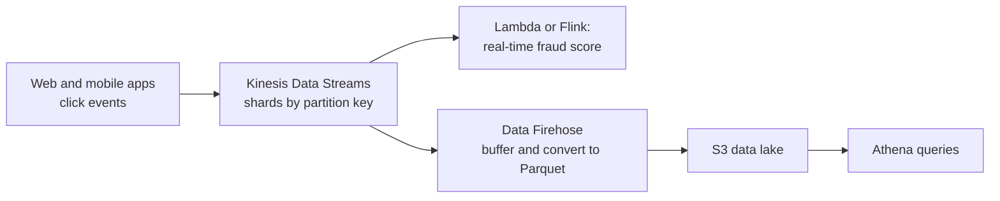

**Pros:**
- Ordered per partition key, replayable, multiple consumers on the same data.
- Firehose is zero-ops delivery into analytics stores.
- Integrates with Lambda, Managed Service for Apache Flink, Glue.

**Cons / limits:**
- Data Streams needs shard planning in provisioned mode; hot partition keys overload one shard.
- More complex than SQS for simple job queues.
- Firehose cannot be replayed and is not for sub-second processing.

**Use it when / avoid when:**
- Use Data Streams for real-time processing with ordering and replay, multiple consumers.
- Use Firehose for "load streaming data into S3/Redshift/OpenSearch with no code".
- Avoid for task queues with per-message acknowledgement (SQS).

**Exam facts:**
- "Real-time" + "multiple consumers" + "replay" = **Kinesis Data Streams**.
- "Load streaming data into S3 / Redshift / OpenSearch, minimal management, near real-time" = **Data Firehose**.
- `ProvisionedThroughputExceededException` = hot shard or too few shards: better partition key or more shards (or on-demand mode).
- Ordering is guaranteed **per shard** (per partition key).
- Real-time SQL/stream analytics = **Amazon Managed Service for Apache Flink** (formerly Kinesis Data Analytics).
- Kinesis Video Streams is for video, not general data.

### Amazon MQ
**What it is:** Managed **Apache ActiveMQ** and **RabbitMQ** message brokers.

**Why it's used:** Migrating existing on-premises applications that already speak standard protocols such as **JMS, AMQP, MQTT, STOMP, OpenWire** without rewriting them for SQS/SNS. Example: a bank's Java settlement system uses ActiveMQ; lift it to AWS with Amazon MQ.

**How it works:** AWS runs broker instances for you (patching, backups). You choose instance size and deployment: single-instance, or **active/standby across two AZs** for high availability (ActiveMQ), or a cluster (RabbitMQ).

**Pros:**
- No application code change for protocol-based apps.
- Supports queues and topics, standard broker features.

**Cons / limits:**
- Not serverless; you pick instance sizes and it does not scale like SQS.
- More expensive and more operational overhead than SQS/SNS for new apps.

**Use it when / avoid when:**
- Use for migrating apps that use industry-standard messaging protocols.
- Avoid for new cloud-native apps (SQS, SNS, EventBridge are simpler and scale further).

**Exam facts:**
- Keywords "JMS", "AMQP", "MQTT", "existing on-premises broker", "without changing code" = **Amazon MQ**.
- For HA, use **active/standby broker** with storage across AZs (Amazon EFS-backed for ActiveMQ).
- New application, no protocol constraint: choose **SQS/SNS** instead.

### Comparison: SQS vs SNS vs EventBridge vs Kinesis

| | SQS | SNS | EventBridge | Kinesis Data Streams |
|---|---|---|---|---|
| Model | Queue (pull) | Pub/sub (push) | Event bus with rules (push) | Ordered stream (pull) |
| Consumers per message | One (per queue) | Many subscribers | Many targets per rule, many rules | Many consumers, each reads all |
| Ordering | FIFO queues only, per group | FIFO topics only | No guarantee | Per shard / partition key |
| Retention / replay | Up to 14 days, no replay after delete | None | Archive and replay | 24 h default, up to 365 days, replayable |
| Filtering | None (consumer side) | Subscription filter policies | Rich event patterns | None (consumer side) |
| Throughput | Nearly unlimited (standard) | Very high | High, quota-based | Per shard or on-demand |
| Typical use | Job queue, buffering, load leveling | Fan-out, alerts | Event routing, AWS/SaaS events, schedules | Clickstream, telemetry, real-time analytics |
| Exam keyword | "decouple", "buffer", "spikes" | "notify multiple", "fan-out" | "react to AWS events", "SaaS", "rules" | "real-time", "ordered", "replay", "big data" |

> **Interview tip:** A one-sentence way to choose: SQS when one worker should do the job, SNS when many should hear about it, EventBridge when routing rules matter, Kinesis when you need an ordered, replayable firehose of data.

#### Q: [Mid] An order service writes directly to an RDS database. During flash sales the database is overwhelmed and orders are lost. Which change is most resilient with least operational overhead?

**Scenario:** A web tier on EC2 inserts orders into RDS MySQL. During sales, write spikes of 20x cause timeouts and lost orders. The business accepts that order processing may lag by a few minutes but no order may be lost. Options: A) Increase the RDS instance size. B) Put an SQS queue between the web tier and a worker that writes to RDS. C) Add RDS read replicas. D) Send orders to SNS with an email subscription.

**Answer:** B. The web tier sends each order to SQS (fast and durable), and a pool of workers (EC2 Auto Scaling or Lambda) drains the queue at a rate the database can handle. Orders wait safely in the queue during the spike.

**Why the others are wrong:**
- A) A bigger instance raises the ceiling but a large enough spike still overwhelms it, and you pay for peak capacity all the time.
- C) Read replicas scale reads, not writes.
- D) SNS does not buffer; email is not a processing path.

**Exam tip:** "Writes are spiky", "orders are lost", "can tolerate delay" is the classic signature for SQS load leveling. Read replicas are only ever the answer for read-heavy problems.

#### Q: [Mid] Workers on an SQS standard queue sometimes process the same payment twice. Processing takes up to 90 seconds. What is the most likely cause and fix?

**Scenario:** A queue uses the default settings. Logs show two workers handling the same message about 30 seconds apart. Options: A) Switch to SNS. B) Increase the visibility timeout above the maximum processing time and make the handler idempotent. C) Enable long polling. D) Reduce the message retention period.

**Answer:** B. The default visibility timeout is 30 seconds. A worker that takes 90 seconds has not deleted the message when it becomes visible again, so a second worker receives it. Set the timeout above worst-case processing time (for example 180 seconds) or have the worker extend it with `ChangeMessageVisibility`. Because standard queues are at-least-once anyway, also dedupe using an idempotency key such as `paymentId`.

**Why the others are wrong:**
- A) SNS is push fan-out; it does not solve processing duplication.
- C) Long polling reduces empty receives and cost; it does not affect redelivery.
- D) Retention controls how long unprocessed messages live, not redelivery timing.

**Exam tip:** "Processed more than once" + "processing takes longer than X" almost always means visibility timeout. If the question also says "must never be duplicated", the answer is SQS FIFO with deduplication.

> **Finance tip:** Even with FIFO, design payment handlers to be idempotent. FIFO deduplication only covers a 5-minute window and only for messages that went through that queue.

#### Q: [Senior] One "AccountOpened" event must trigger a welcome email, a KYC check and a CRM update. Each can fail independently and must retry without affecting the others. What do you build?

**Scenario:** Options: A) The account service calls three APIs in sequence. B) One SQS queue with three consumer types. C) An SNS topic with three SQS queues subscribed, each with its own consumer and DLQ. D) A Kinesis stream with a single Lambda consumer.

**Answer:** C. This is SNS fan-out. Each subscriber queue gets its own copy, its own retry behavior and its own DLQ. If the CRM is down for an hour, its queue fills up and drains later; email and KYC are unaffected. EventBridge with three rules and SQS targets is an equally valid modern design, especially if routing is content-based.

**Why the others are wrong:**
- A) Synchronous chaining couples availability: one slow API blocks account opening.
- B) In a single queue each message is consumed by only one consumer, so two of three jobs would be skipped.
- D) One consumer reintroduces coupling; Kinesis is for high-volume ordered streams.

**Exam tip:** "Multiple independent consumers of the same message" never has a single SQS queue as the answer. Look for SNS + SQS or EventBridge.

#### Q: [Senior] A mobile banking app sends 50,000 events per second of user activity. The fraud team wants real-time scoring, and the data team wants the same events in S3 as Parquet. Which design fits?

**Scenario:** Options: A) SQS standard queue and a Lambda that writes to S3. B) Kinesis Data Streams with a fraud consumer, plus Data Firehose reading the stream and writing Parquet to S3. C) SNS topic with email subscription. D) Write events directly to S3 and run Athena every second.

**Answer:** B. Kinesis Data Streams handles high-throughput ordered ingest and supports multiple consumers. The fraud consumer (Lambda or Managed Service for Apache Flink) reads in real time. Firehose uses the stream as its source and handles buffering, Parquet conversion and delivery to S3 with no servers.

**Why the others are wrong:**
- A) SQS gives each message to one consumer; you would need two queues and custom Parquet logic, and you lose replay.
- C) Not a data pipeline.
- D) Athena is for interactive queries on stored data, not real-time scoring, and tiny objects are inefficient.

**Exam tip:** "Real-time" + "multiple applications consume the same stream" = Kinesis Data Streams. "Deliver to S3/Redshift with transformation, managed" = Firehose. Questions often combine both.

## 2. Orchestration and APIs

### AWS Step Functions
**What it is:** A serverless **workflow orchestrator**. You draw (or write in JSON, the Amazon States Language) a state machine: do step A, then if X do B else C, retry on error, wait for a human, run steps in parallel.

**Why it's used:** Multi-step business processes are hard to get right inside one Lambda: timeouts, retries, partial failure, and "where did it stop?". Example: loan application = validate input, run credit check, wait for manual approval (up to days), create account, send documents. Step Functions keeps the state and history for you.

**How it works:**
- **States:** `Task` (call Lambda or any of 200+ AWS service APIs directly via SDK integrations), `Choice` (branch), `Parallel`, `Map` (loop over items; Distributed Map can process millions of S3 objects), `Wait`, `Pass`, `Succeed`, `Fail`.
- **Error handling:** `Retry` with backoff and `Catch` to a fallback state, declared per state.
- **Callback pattern:** a task sends a **task token** to an external system or human and pauses until `SendTaskSuccess` is called.
- **Workflow types:** **Standard** (up to 1 year, exactly-once execution, full history, priced per state transition) and **Express** (up to 5 minutes, at-least-once, very high volume, priced by executions and duration).
- **Saga pattern:** on failure, run compensating steps (refund, release reservation) in a `Catch`.

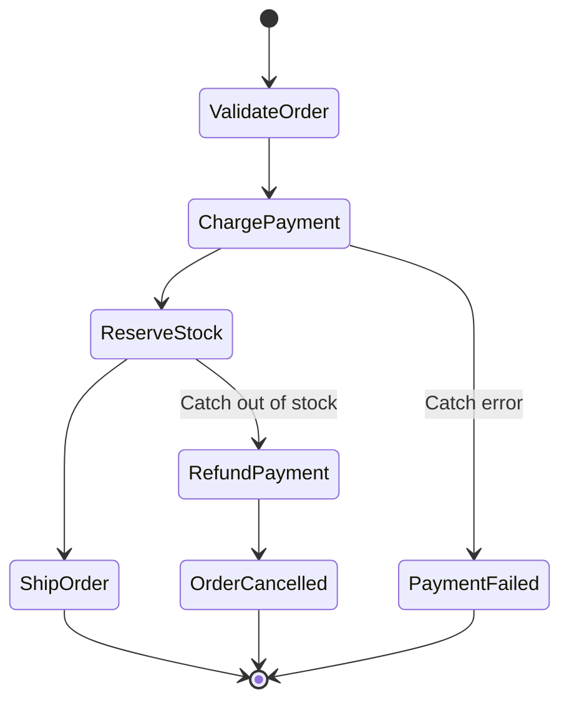

**Pros:**
- Visual execution history; easy to see where a workflow failed.
- Built-in retries, timeouts, parallelism and human-approval waits.
- Direct service integrations remove "glue" Lambdas.

**Cons / limits:**
- Standard workflows cost per state transition; very chatty workflows get expensive (use Express).
- Payload size limits between states (hedge: 256 KB); pass S3 pointers for large data.
- Another language (ASL) to learn, though Workflow Studio and CDK help.

**Use it when / avoid when:**
- Use for multi-step processes with branching, retries, waits, or compensation.
- Use Express for high-volume, short event processing (IoT ingestion, streaming transforms).
- Avoid for a single simple step (just use Lambda) or pure fan-out (SNS/EventBridge).

**Exam facts:**
- "Coordinate multiple Lambda functions", "workflow with retries and error handling", "human approval step" = **Step Functions**.
- Long-running (days to months) = **Standard**; high-volume short (under 5 minutes) = **Express**.
- Lambda max timeout is **15 minutes**; longer processes should be split into Step Functions steps.
- Task token / callback pattern for waiting on external systems or people.
- Older "Amazon SWF" appears as a distractor; Step Functions is the recommended choice for new workflows.

### Amazon API Gateway
**What it is:** A managed "front door" for APIs. It receives HTTP or WebSocket requests from clients, handles auth, throttling and caching, and forwards them to backends such as Lambda, HTTP services, or AWS services.

**Why it's used:** So you do not run and patch your own API servers or reverse proxies. Example: a React banking dashboard calls `GET /accounts/{id}/transactions`; API Gateway checks the Cognito or Okta JWT, rate-limits the client, and invokes a Lambda.

**How it works:** You define routes/resources and methods, attach an **integration** (Lambda proxy, HTTP proxy, AWS service, mock, or VPC link to private ALB/NLB), and deploy to a **stage** (`dev`, `prod`). Three API types:

| | REST API | HTTP API | WebSocket API |
|---|---|---|---|
| Purpose | Full-featured REST | Cheaper, faster, simpler REST-like proxy | Two-way, persistent connections |
| Auth | IAM, Cognito, Lambda authorizer, API keys | IAM, JWT authorizer (Cognito, Okta, any OIDC), Lambda authorizer | IAM, Lambda authorizer on `$connect` |
| Caching | Yes (stage cache) | No | No |
| Usage plans and API keys | Yes | No | No |
| AWS WAF | Yes | No (put CloudFront + WAF in front) | No |
| Request validation / transformation | Yes (models, mapping templates) | Limited (parameter mapping) | Route selection |
| Endpoint types | Edge-optimized, Regional, Private | Regional | Regional |
| Cost | Higher | Roughly 70% lower (hedge) | Per message and connection minute |

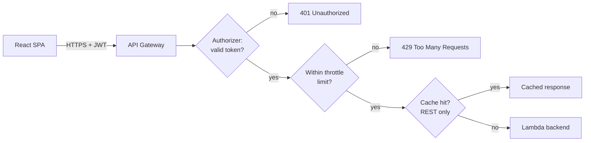

- **Throttling:** token-bucket limits at account level per region (hedge: 10,000 requests/s steady with 5,000 burst by default, adjustable), per stage/method, and per client via **usage plans** with API keys (REST). Excess requests get **HTTP 429**.
- **Caching (REST only):** per stage, TTL default 300 seconds (max 3,600), cache keys can include query strings and headers. Reduces backend calls and latency. Clients can be allowed to invalidate with `Cache-Control: max-age=0` if authorized.
- **Timeouts:** integration timeout historically capped at 29 seconds; AWS has allowed raising it for Regional and private REST APIs (hedge, check quotas). Long jobs should be asynchronous: return `202 Accepted` and process via SQS or Step Functions.

**Pros:**
- Serverless, scales automatically, pay per request.
- Auth, throttling, caching, CORS, stages, canary releases built in.
- Pairs perfectly with Lambda for serverless APIs.

**Cons / limits:**
- Payload limit (hedge: 10 MB); upload large files directly to S3 with presigned URLs instead.
- Integration timeout limits long synchronous requests.
- Cost at very high sustained volume can exceed an ALB.

**Use it when / avoid when:**
- Use REST API when you need caching, usage plans/API keys, WAF, request validation or private APIs.
- Use HTTP API for cheap, low-latency JWT-protected proxies to Lambda or HTTP backends.
- Use WebSocket API for chat, live prices, notifications pushed to the browser.
- Avoid for large file transfers or very long requests.

**Exam facts:**
- "Throttle per customer / monetize API / API keys" = **REST API usage plans**.
- "Reduce latency and backend load for repeated GETs" = **API Gateway caching** (REST) or CloudFront.
- **429** from API Gateway means throttling; **504** often means integration timeout.
- Expose API only inside a VPC = **private REST API** with an interface VPC endpoint.
- Edge-optimized endpoints use CloudFront edge locations; the ACM certificate for an edge-optimized custom domain must be in **us-east-1**.
- Real-time bidirectional browser communication = **WebSocket API** (or AppSync subscriptions).

### AWS AppSync
**What it is:** A managed **GraphQL** API service (plus AppSync Events for serverless WebSocket pub/sub). Clients send GraphQL queries, mutations and subscriptions; AppSync resolves fields from data sources.

**Why it's used:** A React dashboard that needs account summary, last 20 transactions and portfolio value in one request, plus live updates when a new transaction posts. GraphQL fetches exactly the fields needed; subscriptions push updates over WebSockets.

**How it works:** You define a GraphQL schema. **Resolvers** (JavaScript or VTL) connect fields to data sources: DynamoDB, Lambda, Aurora (via Data API), OpenSearch, HTTP endpoints, EventBridge. **Subscriptions** are tied to mutations and delivered over managed WebSockets. Auth modes: API key, IAM, Cognito user pools, OIDC, Lambda. Server-side caching is available. Amplify adds offline sync for mobile/web clients.

**Pros:**
- One endpoint, client chooses fields, fewer round trips.
- Real-time subscriptions without managing WebSocket servers.
- Multiple auth modes on one API.

**Cons / limits:**
- GraphQL learning curve; resolver logic can sprawl.
- Caching and authorization per field need careful design.

**Use it when / avoid when:**
- Use for GraphQL APIs aggregating multiple sources, real-time and offline apps.
- Avoid when a simple REST API suffices or the team does not use GraphQL.

**Exam facts:**
- "GraphQL" anywhere in the question = **AppSync**.
- "Real-time updates to mobile/web clients" + "offline sync" = **AppSync** (often with Amplify).
- AppSync can be protected with **AWS WAF**.
- Combine data from DynamoDB, Lambda and HTTP in one API = AppSync resolvers.

#### Q: [Mid] A public partner API must limit each partner to 100 requests per second and 1 million requests per month, and cache popular GET responses. Which option fits?

**Scenario:** Options: A) API Gateway HTTP API with a JWT authorizer. B) API Gateway REST API with usage plans, API keys and stage caching. C) ALB with Lambda targets. D) CloudFront with a Lambda@Edge function counting requests.

**Answer:** B. REST APIs support **usage plans** (throttle rate, burst and monthly quota per API key) and **stage caching**. Each partner gets an API key attached to a usage plan.

**Why the others are wrong:**
- A) HTTP APIs do not support usage plans, API keys or caching.
- C) ALB has no per-client quotas or API keys.
- D) Possible to build, but custom code and high operational overhead.

**Exam tip:** API keys are for identifying and metering clients, not for security. Combine them with a real authorizer (IAM, Cognito, Lambda) when the question mentions authentication.

#### Q: [Senior] A mortgage approval process takes up to 10 days, includes a manual underwriter approval, and must retry a flaky credit-bureau API. The current single Lambda keeps timing out. What should the architect do?

**Scenario:** Options: A) Increase the Lambda timeout to 10 days. B) Use an SQS delay queue to wait 10 days. C) Model the process as a Step Functions Standard workflow with Retry on the credit-check task and a task-token callback for underwriter approval. D) Use a Step Functions Express workflow.

**Answer:** C. Standard workflows run up to a year with exactly-once semantics and full history. The credit check task gets a `Retry` block with exponential backoff. The approval step uses `.waitForTaskToken`: Step Functions sends a token to the underwriter UI (via SQS or a Lambda that emails a link), and the workflow resumes when the UI calls `SendTaskSuccess`.

**Why the others are wrong:**
- A) Lambda's maximum timeout is 15 minutes.
- B) SQS delay queues max out at 15 minutes, and a queue does not model branching or approvals.
- D) Express workflows max out at 5 minutes.

**Exam tip:** Durations are the giveaway. Over 15 minutes rules out Lambda alone; over 5 minutes rules out Express; human approval points to the callback pattern.

#### Q: [Senior] A trading dashboard needs live price updates pushed to thousands of browsers and a GraphQL API that combines DynamoDB positions with a third-party pricing REST API. Least operational overhead?

**Scenario:** Options: A) EC2 fleet running a Node WebSocket server behind an NLB. B) AWS AppSync with DynamoDB and HTTP resolvers and GraphQL subscriptions. C) API Gateway REST API with polling every second. D) SNS with SMS subscriptions.

**Answer:** B. AppSync is managed GraphQL. Resolvers fetch positions from DynamoDB and prices from the HTTP data source; a mutation that publishes a price triggers subscriptions to connected clients over managed WebSockets.

**Why the others are wrong:**
- A) Works, but you manage servers, scaling and connection state.
- C) Polling wastes requests and adds latency.
- D) SMS is not a browser channel.

**Exam tip:** "GraphQL" or "real-time + offline for mobile" means AppSync. If the question only asks for WebSockets without GraphQL, API Gateway WebSocket API is also a valid serverless answer.

## 3. Identity and access

Security is the largest SAA-C03 domain (about 30%, hedge). Start with the **shared responsibility model**: AWS secures the cloud itself (data centers, hardware, the hypervisor, managed service internals); you secure what you put in it (IAM, data encryption, network rules, OS patching on EC2). The more managed the service, the more AWS takes on: on EC2 you patch the OS; on Lambda or DynamoDB you do not.

### IAM (Identity and Access Management)
**What it is:** The global AWS service that decides **who** (an identity) can do **what** (actions) on **which resources**, under **which conditions**. It is the bouncer for every AWS API call.

**Why it's used:** Every action in AWS, from a developer clicking in the console to a Lambda writing to DynamoDB, is an API call that IAM authorizes. Getting IAM right is most of AWS security.

**How it works:**
- **Root user:** the email that created the account. Has full power, cannot be restricted by IAM policies. Enable MFA, delete its access keys, lock it away.
- **IAM users:** long-lived identities with a password and/or access keys. Modern practice: avoid them for humans (use IAM Identity Center) and for workloads (use roles).
- **Groups:** collections of users that share policies (for example `Developers`). Groups cannot contain other groups and are not identities you can sign in as.
- **Roles:** identities with **no long-term credentials**. Someone (a user, an AWS service, another account, a federated user) **assumes** the role via AWS STS and gets **temporary credentials**. EC2 gets a role through an **instance profile**; Lambda through its **execution role**.
- **Policies:** JSON documents with `Effect`, `Action`, `Resource` and optional `Condition`.
  - **Identity-based policies** attach to users, groups or roles (AWS managed, customer managed, or inline).
  - **Resource-based policies** attach to resources (S3 bucket policy, SQS queue policy, KMS key policy, Lambda resource policy) and name a `Principal`.
  - **Permissions boundaries** cap the maximum permissions an identity-based policy can grant to a user or role.
  - **Session policies** limit a single assumed-role session.
  - **SCPs and RCPs** (from Organizations) cap what accounts can do.

```json
{
  "Version": "2012-10-17",
  "Statement": [
    {
      "Sid": "ReadOwnStatements",
      "Effect": "Allow",
      "Action": ["s3:GetObject"],
      "Resource": "arn:aws:s3:::acme-statements/${aws:PrincipalTag/customerId}/*",
      "Condition": { "Bool": { "aws:SecureTransport": "true" } }
    }
  ]
}
```

**Policy evaluation logic (memorize this):**
1. Start with **implicit deny**: nothing is allowed by default.
2. If any applicable policy has an **explicit Deny** that matches, the request is denied. Explicit deny always wins.
3. Organizations SCPs (and RCPs), permissions boundaries and session policies must **allow** the action if they apply; they act as filters, never as grants.
4. Within the same account, an **Allow** in either the identity-based policy or the resource-based policy is enough.
5. **Cross-account**: the identity's account must allow it (identity policy) **and** the resource's account must allow it (resource policy or a role trust).

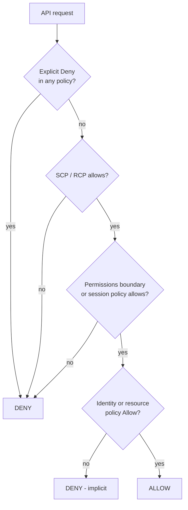

**Least privilege:** grant only the actions and resources needed, then tighten. Tools: **IAM Access Analyzer** (finds resources shared outside your account or organization, validates policies, and can generate a policy from CloudTrail activity), **last accessed** data, and conditions such as `aws:SourceIp`, `aws:PrincipalOrgID`, `aws:MultiFactorAuthPresent`.

**Pros:**
- Fine-grained, free, applies to every AWS API.
- Roles with temporary credentials remove secret sprawl.

**Cons / limits:**
- Policy evaluation across many policy types is easy to get wrong.
- IAM is eventually consistent; changes can take a few seconds to apply.

**Use it when / avoid when:**
- Use roles for every workload (EC2, Lambda, ECS tasks) and for cross-account access.
- Avoid IAM users with access keys for applications; avoid putting credentials in code or AMIs.

**Exam facts:**
- Application on EC2 needs S3 access = **IAM role via instance profile**, never access keys on the instance.
- **Explicit deny overrides any allow**; default is implicit deny.
- Cross-account access = **role in the target account with a trust policy** (or a resource policy naming the other account).
- Delegate admin but prevent privilege escalation = **permissions boundaries**.
- IAM is **global**, not regional.
- Restrict a bucket to your organization = `aws:PrincipalOrgID` condition in the bucket policy.

### AWS IAM Identity Center (successor to AWS SSO)
**What it is:** The recommended way for **people** to sign in to **many AWS accounts** (and business apps) with one login.

**Why it's used:** A company with 40 AWS accounts does not want 40 sets of IAM users. Employees already log in with Okta or Microsoft Entra ID; Identity Center federates with that identity provider.

**How it works:** Connect an identity source (its built-in directory, Active Directory, or an external IdP via **SAML 2.0**, with **SCIM** for automatic user/group provisioning). Define **permission sets** (bundles of policies, for example `ReadOnly`, `PowerUser`). Assign groups to accounts with permission sets. Behind the scenes Identity Center creates roles in each account; users get short-lived credentials in the console and CLI (`aws sso login`).

**Pros:**
- Single sign-on across all accounts in AWS Organizations.
- No long-lived IAM users; central offboarding.

**Cons / limits:**
- Designed for workforce users, not your app's customers (use Cognito for those).

**Use it when / avoid when:**
- Use for employee access to multiple accounts and SAML apps.
- Avoid for customer sign-in to your app.

**Exam facts:**
- "Employees use existing corporate IdP to access multiple AWS accounts" = **IAM Identity Center** with SAML federation.
- **Permission sets** define what users can do in assigned accounts.
- Works with **AWS Organizations**; managed from the management account or a delegated admin account.

### AWS Organizations and SCPs
**What it is:** A service to manage many AWS accounts as one organization: group them, apply guardrail policies, and pay one bill.

**Why it's used:** Separate accounts for prod, dev, security and each team limit blast radius. Organizations lets you govern them centrally. Example: no account in the `Prod` OU may disable CloudTrail or use regions outside the EU.

**How it works:**
- **Management account** at the root, **organizational units (OUs)** in a tree, **member accounts** in OUs.
- **Consolidated billing:** one bill, and aggregated usage for volume discounts and shared Reserved Instance / Savings Plans benefits.
- **Service control policies (SCPs):** guardrails on the **maximum** permissions for IAM users and roles in member accounts (including their root users). SCPs **never grant** permissions; an action still needs an IAM allow. SCPs **do not affect the management account**.
- **Resource control policies (RCPs, 2024):** guardrails on resources (for example S3, KMS, SQS) regardless of who calls them, useful for a "data perimeter".
- **AWS Control Tower** sets up a multi-account landing zone with best-practice guardrails on top of Organizations.

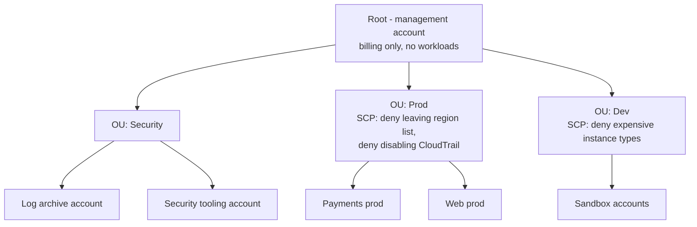

```json
{
  "Version": "2012-10-17",
  "Statement": [{
    "Sid": "DenyOutsideEU",
    "Effect": "Deny",
    "NotAction": ["iam:*", "organizations:*", "sts:*", "cloudfront:*", "route53:*", "support:*"],
    "Resource": "*",
    "Condition": { "StringNotEquals": { "aws:RequestedRegion": ["eu-west-1", "eu-central-1"] } }
  }]
}
```

**Pros:**
- Central guardrails that even account admins cannot bypass.
- Consolidated billing and volume discounts.

**Cons / limits:**
- SCP mistakes can lock out whole OUs; test in a sandbox OU.
- SCPs do not restrict the management account, so keep workloads out of it.

**Use it when / avoid when:**
- Use from the start for any company with more than one account.
- Avoid using SCPs as the only control; combine with IAM least privilege.

**Exam facts:**
- "Prevent any user, including account administrators, in member accounts from doing X" = **SCP**.
- SCPs **do not grant** permissions and **do not apply to the management account**.
- Share Reserved Instance / Savings Plans discounts across accounts = **consolidated billing**.
- Multi-account best-practice setup with guardrails quickly = **AWS Control Tower**.
- Share resources (subnets, Transit Gateway) across accounts = **AWS RAM** (Resource Access Manager).

### Amazon Cognito (user pools vs identity pools)
**What it is:** Customer identity for your web and mobile apps. Two separate parts that often work together.

**Why it's used:** Your React app needs sign-up, sign-in, MFA, password reset and social login without building an auth server, and sometimes needs to let a logged-in user upload directly to S3.

**How it works:**
- **User pools** = **authentication** ("who are you?"). A user directory with sign-up/sign-in, MFA, password policies, managed login UI, and federation with Google, Apple, Facebook, SAML and OIDC providers. After login, it issues **JWTs** (ID, access, refresh tokens). API Gateway and ALB can validate them directly.
- **Identity pools** (federated identities) = **authorization to AWS** ("what AWS resources can you touch?"). Exchange a token (from a user pool, Google, SAML, or even no login for guests) for **temporary AWS credentials** tied to an IAM role. Then the browser can call S3 or DynamoDB directly, scoped by policy variables such as `${cognito-identity.amazonaws.com:sub}`.

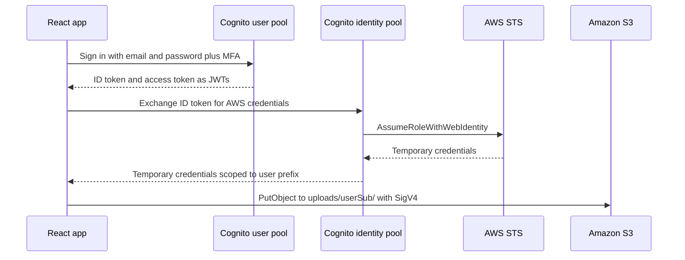

**Pros:**
- Managed auth with MFA, federation and token issuance.
- Direct, scoped AWS access from clients without proxies.

**Cons / limits:**
- Customizing flows needs Lambda triggers; migration of users out can be hard (password hashes are not exportable).
- Many enterprises use their own IdP (Okta, Auth0) instead of user pools; identity pools can still federate with those.

**Use it when / avoid when:**
- Use user pools for customer sign-in to your app; identity pools when the client must call AWS services directly.
- Avoid for workforce access to AWS accounts (IAM Identity Center).

**Exam facts:**
- "Sign-up and sign-in for a mobile/web app, social login" = **Cognito user pool**.
- "Give app users temporary AWS credentials to access S3/DynamoDB directly" = **Cognito identity pool**.
- API Gateway **Cognito user pool authorizer** validates tokens without custom code.
- ALB can authenticate users via Cognito or any OIDC IdP before forwarding requests.
- Guest (unauthenticated) access = identity pool with unauthenticated role.

#### Q: [Mid] A Lambda function in account A must read objects from an S3 bucket in account B. Which combination is required?

**Scenario:** Options: A) Only add the permission to the Lambda execution role in account A. B) Only add a bucket policy in account B. C) Allow `s3:GetObject` in the Lambda execution role in account A and grant the role access in the bucket policy in account B (or assume a role in account B). D) Create an IAM user in account B and store its keys in Lambda environment variables.

**Answer:** C. Cross-account access needs permission on **both** sides: the caller's identity policy must allow the action, and the resource owner must allow the caller (bucket policy naming the role ARN, or a role in account B with a trust policy that account A's role assumes). If objects are encrypted with a customer managed KMS key, the KMS key policy must also allow the role.

**Why the others are wrong:**
- A) Account B has not trusted account A, so S3 denies the request.
- B) The Lambda role in account A has no allow for the action.
- D) Long-lived keys in environment variables violate best practice and least privilege.

**Exam tip:** Same-account: one allow is enough. Cross-account: both accounts must say yes. Watch for the hidden third gate: a KMS key policy on encrypted objects.

#### Q: [Senior] The security team wants to guarantee that no one in any production account can disable CloudTrail or launch resources outside two EU regions, even account administrators. What is the most effective control?

**Scenario:** Options: A) IAM policies in each account denying these actions. B) A service control policy attached to the Prod OU in AWS Organizations. C) AWS Config rules with notifications. D) A permissions boundary on every role.

**Answer:** B. SCPs apply to all IAM users and roles (including the member account root user) in every account under the OU. A Deny statement for `cloudtrail:StopLogging`, `cloudtrail:DeleteTrail` and a region condition cannot be overridden by any IAM policy inside those accounts.

**Why the others are wrong:**
- A) Account administrators can edit or detach their own IAM policies.
- C) Config detects and reports after the fact; it does not prevent.
- D) Boundaries are per identity and can be removed by an admin who has IAM permissions; new roles might not get them.

**Exam tip:** "Prevent" across accounts = SCP. "Detect / audit compliance" = AWS Config. "Who did it" = CloudTrail.

#### Q: [Senior] A React banking app uses Cognito for sign-in. Customers must upload ID documents directly to S3, each customer only into their own folder, without routing files through the backend. What should you configure?

**Scenario:** Options: A) Put an IAM user's access keys in the React bundle. B) Use a Cognito identity pool to exchange the user pool token for temporary credentials with an IAM role whose policy allows `s3:PutObject` on `uploads/${cognito-identity.amazonaws.com:sub}/*`. C) Make the bucket public-write. D) Use Cognito user pool groups only.

**Answer:** B. The identity pool issues short-lived credentials per user. The IAM policy variable restricts each user to their own prefix. (An equally common alternative: the backend issues an **S3 presigned URL** for a specific key after checking the JWT; this keeps AWS credentials out of the browser entirely.)

**Why the others are wrong:**
- A) Anyone can extract keys from a JavaScript bundle.
- C) Public write is a data-integrity and cost disaster.
- D) User pool groups describe users; they do not issue AWS credentials on their own.

**Exam tip:** User pool = authentication and JWTs. Identity pool = AWS credentials. If the question says "access AWS services directly from the client", you need an identity pool (or presigned URLs).

## 4. Data protection: keys, secrets and certificates

### AWS KMS (Key Management Service)
**What it is:** A managed service that creates and guards **encryption keys** in hardware security modules. Keys never leave KMS unencrypted; you ask KMS to encrypt, decrypt or generate data keys.

**Why it's used:** Encryption at rest for S3, EBS, RDS, DynamoDB, SQS and more is a checkbox backed by KMS, and every use of a key is logged in CloudTrail. Regulators like that.

**How it works:**
- **Key types by owner:** **AWS owned keys** (invisible, free), **AWS managed keys** (`aws/s3`, `aws/ebs`; created by services, rotated automatically, you cannot change their policy), **customer managed keys (CMKs)** (you control key policy, rotation, deletion, cross-account grants).
- **Symmetric** (AES-256, default, most services) and **asymmetric** (RSA, ECC for signing or encryption outside AWS) keys; also HMAC keys.
- **Envelope encryption:** KMS's `Encrypt` API handles only small payloads (4 KB). For real data, call `GenerateDataKey`: KMS returns a plaintext data key and the same key encrypted under your KMS key. You encrypt the data locally with the plaintext key, throw it away, and store the encrypted data key next to the data.
- **Key policy:** every KMS key has a resource policy; it is the primary access control. IAM policies only work if the key policy allows the account to use IAM.
- **Rotation:** automatic rotation for customer managed symmetric keys (yearly by default; configurable period, hedge: 90 to 2,560 days). Old key material is kept so old data still decrypts.
- **Multi-Region keys:** same key ID and material replicated to other regions, for encrypting in one region and decrypting in another.
- **AWS CloudHSM:** dedicated single-tenant HSMs that you fully control (for strict compliance requirements, or custom key stores).

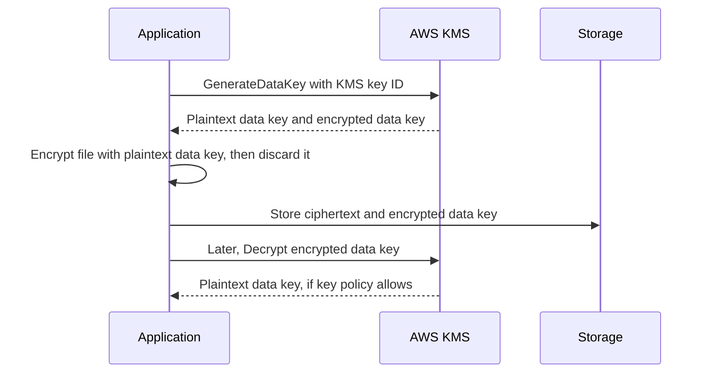

**Pros:**
- Integrated with almost every AWS storage service.
- Every key use is auditable in CloudTrail.
- Fine-grained control via key policies and grants.

**Cons / limits:**
- Request quotas per region; very high-volume S3 workloads with SSE-KMS can hit them (use **S3 Bucket Keys** to reduce KMS calls).
- Keys are regional unless you use multi-Region keys.
- Deleting a key is irreversible after a 7–30 day waiting period; data encrypted under it is lost.

**Use it when / avoid when:**
- Use customer managed keys when you need control over key policy, rotation, auditing or cross-account use.
- Use CloudHSM when compliance demands single-tenant HSMs you exclusively control.

**Exam facts:**
- "Control and audit who can use the key, rotate it" = **customer managed KMS key** (SSE-KMS).
- Large data encryption = **envelope encryption** with `GenerateDataKey`.
- **S3 Bucket Keys** reduce KMS request costs and throttling for SSE-KMS.
- Copying an encrypted EBS snapshot or AMI to another region/account needs re-encryption with a key in that region and key policy access.
- "Single-tenant HSM, FIPS 140 Level 3, customer has exclusive control" = **CloudHSM**.
- You cannot change an unencrypted RDS instance to encrypted in place: **snapshot, copy with encryption, restore**.

### AWS Secrets Manager vs Systems Manager Parameter Store
**What it is:** Two managed places to store configuration and secrets (database passwords, API keys) instead of hard-coding them.

**Why it's used:** Credentials in code or environment files leak through Git, logs and screenshots. Central stores give access control, encryption with KMS, audit and rotation.

**How it works:**
- **Secrets Manager:** stores secrets (up to 64 KB, hedge), encrypts with KMS, and has **built-in automatic rotation** using a Lambda function. Native rotation templates exist for RDS, Aurora, Redshift and DocumentDB. Supports **cross-region replication** of secrets. RDS can manage its master password in Secrets Manager for you. Paid per secret per month plus API calls.
- **Parameter Store:** hierarchical key/value config (`/payments/prod/db-host`). Types `String`, `StringList`, `SecureString` (KMS-encrypted). **Standard tier** is free (hedge: up to 10,000 parameters, 4 KB each); **Advanced tier** costs money and allows larger values (8 KB) and parameter policies (expiration). **No built-in rotation** (you would build it with EventBridge + Lambda).

| | Secrets Manager | Parameter Store |
|---|---|---|
| Main purpose | Secrets with lifecycle | Config and simple secrets |
| Automatic rotation | Yes, built in | No (DIY) |
| Cost | Per secret per month | Standard free, Advanced paid |
| Cross-region replication | Yes | No |
| Max size | Larger (tens of KB) | 4 KB standard, 8 KB advanced |
| Hierarchy and versioning | Versions and staging labels | Paths and versions |

**Pros:**
- Both remove secrets from code and integrate with Lambda, ECS, EKS, CloudFormation.

**Cons / limits:**
- Secrets Manager costs more at scale; Parameter Store lacks rotation.
- Applications should cache secrets (AWS provides caching clients and a Lambda extension) to avoid per-request API calls and throttling.

**Use it when / avoid when:**
- Use Secrets Manager for database credentials and anything that must rotate.
- Use Parameter Store for feature flags, URLs, non-rotating config, and cost-sensitive cases.

**Exam facts:**
- "Automatically rotate RDS credentials every 30 days" = **Secrets Manager**.
- "Store configuration values hierarchically at no extra cost" = **Parameter Store** standard.
- ECS task definitions can inject secrets from either service as environment variables.
- Both encrypt using **KMS**.

### AWS Certificate Manager (ACM)
**What it is:** Free public TLS/SSL certificates (and a private CA option) that AWS provisions and **renews automatically**.

**Why it's used:** HTTPS for `app.acme-bank.com` on CloudFront or an ALB without buying certificates or remembering to renew them.

**How it works:** Request a certificate, prove domain ownership with **DNS validation** (a CNAME record, ideal with Route 53) or email validation. Attach it to integrated services: **Elastic Load Balancing, CloudFront, API Gateway, App Runner, Cognito custom domains** and others. AWS handles renewal for DNS-validated certs in use.

**Pros:**
- Free public certs, automatic renewal, no private keys to manage.

**Cons / limits:**
- Classic ACM public certificates could not be exported to install on your own EC2 web server; AWS added exportable public certificates in 2025 for a fee (hedge, check current docs). Usually terminate TLS at an ALB or CloudFront instead.
- Certificates are regional; **CloudFront requires the certificate in us-east-1**.

**Use it when / avoid when:**
- Use for any HTTPS endpoint on integrated AWS services.
- Avoid when TLS must terminate on your own instances (use exportable certs, or third-party certs, or terminate at a load balancer).

**Exam facts:**
- CloudFront custom domain certificate must be in **us-east-1 (N. Virginia)**.
- **DNS validation** enables automatic renewal.
- Offload TLS from EC2 by terminating HTTPS at the **ALB** with an ACM certificate.
- ACM Private CA issues private certificates for internal services (paid).

#### Q: [Mid] An application on EC2 reads an RDS password from a config file. Security requires that the password is not stored on the instance and is rotated every 30 days automatically. Which solution has the least operational overhead?

**Scenario:** Options: A) Store the password in Parameter Store SecureString and write a rotation Lambda. B) Store the password in Secrets Manager with automatic rotation enabled, and grant the EC2 instance role `secretsmanager:GetSecretValue`. C) Encrypt the config file with KMS. D) Bake the password into the AMI.

**Answer:** B. Secrets Manager has native rotation for RDS. The app fetches the secret at startup (and caches it, refreshing on authentication failure) using the instance role.

**Why the others are wrong:**
- A) Works, but you build and maintain rotation yourself: more overhead.
- C) The secret still lives on the instance and nothing rotates it.
- D) Worst option: secrets in images spread to every copy.

**Exam tip:** "Rotate automatically" plus "database credentials" is Secrets Manager every time. Parameter Store appears as the cheaper distractor.

#### Q: [Senior] A company stores millions of small objects per hour in S3 with SSE-KMS using a customer managed key. They see `ThrottlingException` from KMS and a high KMS bill. What should they do?

**Scenario:** Options: A) Switch to SSE-S3. B) Enable S3 Bucket Keys for the bucket. C) Request a larger S3 PUT quota. D) Use a different KMS key for every object.

**Answer:** B. An S3 Bucket Key is a bucket-level data key derived from the KMS key, so S3 calls KMS far less often. This reduces KMS request costs (AWS says by up to 99%, hedge) and avoids throttling, while keeping the customer managed key's control and audit.

**Why the others are wrong:**
- A) Would fix throttling but lose control over the key policy and per-key audit, which the company chose SSE-KMS for.
- C) The throttling is on KMS, not S3.
- D) Increases KMS calls and management burden.

**Exam tip:** If the requirement includes "customer controls the key" or "audit key usage", SSE-S3 is wrong even if it seems simpler.

## 5. Threat protection and detection

A useful way to keep these straight: **WAF and Shield block attacks at the edge**, **GuardDuty detects threats from logs**, **Inspector finds vulnerabilities in software**, **Macie finds sensitive data in S3**, and **Security Hub collects everything in one dashboard**.

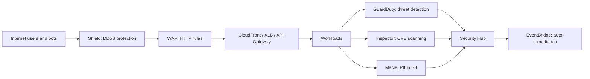

### AWS WAF (Web Application Firewall)
**What it is:** A layer 7 (HTTP) firewall. It inspects each web request and allows, blocks, counts or challenges it based on rules.

**Why it's used:** Block SQL injection, cross-site scripting, bad bots, credential stuffing on `/login`, and traffic from countries you do not serve.

**How it works:** Create a **Web ACL** with rules and attach it to **CloudFront, Application Load Balancer, API Gateway REST APIs, AppSync, Cognito user pools, App Runner** and **Verified Access**. Rule types: **managed rule groups** (AWS and Marketplace: core rule set, known bad inputs, SQLi, IP reputation, Bot Control, account takeover prevention), **IP sets**, **geo match**, **rate-based rules** (block an IP that exceeds N requests in a window), string/regex match on headers, body, query. Actions include CAPTCHA and challenge.

**Pros:**
- Managed rules give quick protection with no code.
- Rate-based rules stop simple floods and brute force.

**Cons / limits:**
- Not available on NLB (layer 4) or directly on EC2.
- Rules need tuning to avoid blocking real users; start in Count mode.

**Use it when / avoid when:**
- Use in front of every public web app or API.
- Avoid relying on it for volumetric network DDoS (that is Shield's job).

**Exam facts:**
- "Block SQL injection / XSS" = **WAF**.
- "Block a specific IP / country" on an ALB or CloudFront = **WAF** (geo match, IP set). On a network level for a subnet, **NACLs** can deny IPs; security groups cannot deny.
- "Limit requests per IP" = **WAF rate-based rule**.
- WAF attaches to **CloudFront, ALB, API Gateway, AppSync, Cognito** but **not NLB**.

### AWS Shield (Standard and Advanced)
**What it is:** DDoS protection. **Shield Standard** is free and automatic for all customers, defending against common layer 3/4 attacks (SYN floods, UDP reflection). **Shield Advanced** is a paid subscription (hedge: about $3,000 per month per organization plus data transfer) for higher-value targets.

**Why it's used:** A payments site cannot be knocked offline on Black Friday by a botnet.

**How it works:** Shield Advanced adds protection for EC2 Elastic IPs, ELB, CloudFront, Global Accelerator and Route 53; near real-time attack visibility; **24/7 access to the AWS Shield Response Team (SRT)**; **cost protection** (credits for scaling charges caused by a DDoS); and WAF at no extra cost on protected resources, with automatic application-layer mitigation.

**Pros:**
- Standard is free and always on. Advanced adds experts and cost protection.

**Cons / limits:**
- Advanced is expensive and needs a 1-year commitment.

**Use it when / avoid when:**
- Use Advanced for business-critical, high-profile apps that need DDoS response support and cost protection.
- Avoid paying for Advanced on low-risk internal apps.

**Exam facts:**
- "DDoS protection at no cost" = **Shield Standard** (already on).
- "24/7 DDoS response team" or "protect against DDoS-related scaling costs" = **Shield Advanced**.
- Best DDoS architecture: **CloudFront + Route 53 + Shield + WAF**, with origins hidden behind them, and Auto Scaling to absorb.

### Amazon GuardDuty
**What it is:** Managed **threat detection**. It continuously analyzes logs with threat intelligence and machine learning to spot malicious or unusual activity.

**Why it's used:** To learn that an EC2 instance is talking to a known crypto-mining pool, that credentials are being used from an unusual country, or that someone is exfiltrating S3 data, without building a SIEM.

**How it works:** Enable it per account/region (centrally via Organizations). It reads **CloudTrail management events, VPC Flow Logs and DNS logs** automatically (you do not need to enable those yourself for GuardDuty), plus optional protection plans: S3 data events, EKS audit logs and runtime, ECS/EC2 runtime monitoring, RDS login activity, Lambda network activity, and **malware protection** for EBS and S3. It produces **findings**, which go to Security Hub and **EventBridge** for automated response.

**Pros:**
- One click, no agents for the core feature, no log pipeline to run.

**Cons / limits:**
- Detects; does not block. Pair with EventBridge + Lambda to remediate.
- Cost scales with log volume.

**Use it when / avoid when:**
- Use in every account and region as a baseline.

**Exam facts:**
- "Detect compromised instances, crypto-mining, unusual API calls" = **GuardDuty**.
- Data sources: **CloudTrail, VPC Flow Logs, DNS logs** (plus optional S3, EKS, RDS, Lambda, runtime, malware).
- Automate response = **GuardDuty finding to EventBridge rule to Lambda/SSM** (for example isolate the instance's security group).

### Amazon Inspector
**What it is:** Automated **vulnerability management**. It scans workloads for known software vulnerabilities (CVEs) and unintended network exposure.

**Why it's used:** To learn that your container image includes a vulnerable OpenSSL or a Lambda dependency has a critical CVE.

**How it works:** Continuously scans **EC2 instances** (via the SSM Agent, or agentless EBS snapshot scanning), **container images in Amazon ECR**, and **Lambda functions** (packages and, optionally, code). Findings have a risk score and go to Security Hub and EventBridge. Rescans automatically when new CVEs are published.

**Exam facts:**
- "Scan EC2 / ECR images / Lambda for software vulnerabilities (CVEs)" = **Inspector**.
- "Network reachability" findings for EC2 = Inspector.
- Not for threat detection from logs (GuardDuty) or PII (Macie).

### Amazon Macie
**What it is:** A data security service that uses machine learning and pattern matching to **discover sensitive data (PII, financial data, credentials) in S3**.

**Why it's used:** A compliance audit asks "where do we store card numbers or passport scans?". Macie scans buckets and reports.

**How it works:** Inventories buckets (flags public or unencrypted ones), runs discovery jobs with managed and custom data identifiers, and sends findings to Security Hub and EventBridge.

**Exam facts:**
- "Discover and protect PII / sensitive data in S3" = **Macie**.
- Macie works on **S3 only**.

### AWS Security Hub
**What it is:** A central security dashboard and **posture management** (CSPM) service. It aggregates findings from GuardDuty, Inspector, Macie, IAM Access Analyzer, Firewall Manager and partners in one normalized format, and runs automated checks against standards.

**Why it's used:** A security team with 30 accounts wants one place to see "how compliant are we with CIS benchmarks" and "what are today's critical findings".

**How it works:** Enable with Organizations and a delegated administrator; enable standards such as **AWS Foundational Security Best Practices**, **CIS AWS Foundations**, **PCI DSS**, NIST. Checks rely on **AWS Config** being enabled. Cross-region aggregation; automation rules; findings to EventBridge. **Amazon Detective** is the companion for investigating root cause of findings with graph analysis.

**Exam facts:**
- "Single view of security findings across accounts" or "automated compliance checks against CIS / PCI" = **Security Hub**.
- Security Hub requires **AWS Config** for its control checks.
- "Investigate the root cause of a GuardDuty finding" = **Amazon Detective**.
- Manage WAF rules and Shield across many accounts centrally = **AWS Firewall Manager**.

#### Q: [Mid] A public ALB-hosted login page is being hit by a credential-stuffing attack: thousands of POST requests per minute from a few hundred IPs. Fastest effective mitigation?

**Scenario:** Options: A) Add security group deny rules for the IPs. B) Attach AWS WAF to the ALB with a rate-based rule on `/login` and the account takeover prevention managed rule group. C) Enable GuardDuty. D) Subscribe to Shield Advanced.

**Answer:** B. WAF inspects HTTP requests at the ALB. A rate-based rule scoped to the login path blocks IPs exceeding a threshold; managed rule groups add detection of stolen-credential patterns and bots; CAPTCHA can challenge suspicious clients.

**Why the others are wrong:**
- A) Security groups only have allow rules; they cannot deny.
- C) GuardDuty detects threats against your AWS resources; it does not block HTTP requests.
- D) Shield Advanced is for DDoS; this is an application-layer abuse problem that WAF solves directly and cheaply.

**Exam tip:** Security groups: allow-only, stateful. NACLs: allow and deny, stateless, subnet level. WAF: HTTP-aware rules on L7 services.

#### Q: [Senior] The CISO wants: detect compromised EC2 instances automatically, isolate them within minutes without human action, and see all findings across 25 accounts in one place. Which combination?

**Scenario:** Options: A) Inspector + CloudWatch dashboards. B) GuardDuty enabled organization-wide with a delegated admin, findings sent to EventBridge rules that trigger a Lambda (or SSM Automation) to swap the instance's security group to a quarantine group, and Security Hub as the aggregated view. C) Macie + SNS email. D) CloudTrail + Athena queries run weekly.

**Answer:** B. GuardDuty detects compromise from flow, DNS and CloudTrail logs. EventBridge matches high-severity findings and invokes automation to isolate the instance (and snapshot its EBS volume for forensics). Security Hub aggregates findings from all accounts and regions.

**Why the others are wrong:**
- A) Inspector finds vulnerabilities, not active compromise.
- C) Macie is about sensitive data in S3.
- D) Manual and weekly is not "within minutes".

**Exam tip:** Detection service + EventBridge + Lambda/SSM is the standard "automated remediation" pattern across GuardDuty, Security Hub and Config.

## 6. Monitoring, audit and operations

Three questions you will be asked about any production system, and which service answers each:

- **"Is it healthy and fast right now?"** CloudWatch (metrics, logs, alarms) and X-Ray (traces).
- **"Who did what, when?"** CloudTrail (API activity).
- **"What did this resource look like, and is it compliant?"** AWS Config (configuration history and rules).

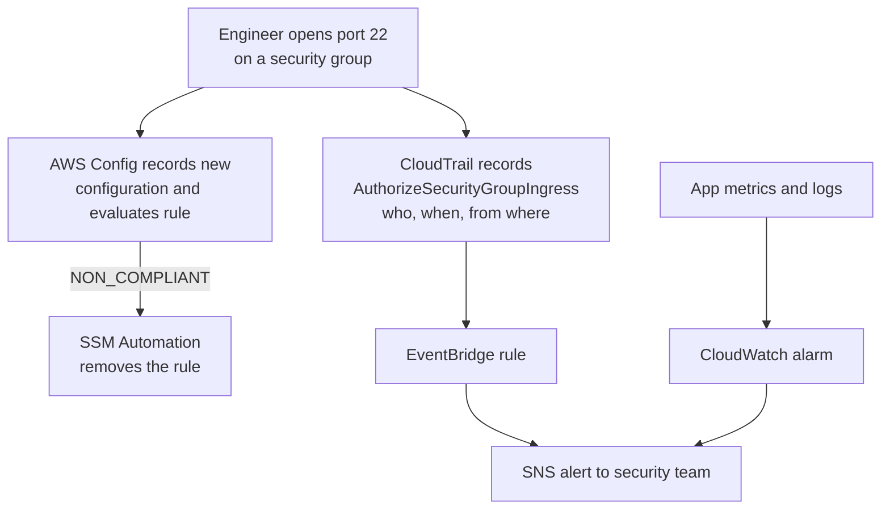

### Amazon CloudWatch (metrics, logs, alarms)
**What it is:** AWS's monitoring service: it collects **metrics** (numbers over time), **logs** (text events), and fires **alarms** when something crosses a threshold.

**Why it's used:** To know the p99 latency of the payments API, see Lambda errors, page the on-call engineer when the queue backlog grows, and scale servers automatically.

**How it works:**
- **Metrics:** organized by **namespace** (`AWS/EC2`, `AWS/Lambda`) and **dimensions** (`InstanceId`, `FunctionName`). EC2 basic monitoring sends every **5 minutes**; **detailed monitoring** every 1 minute (paid). **Memory and disk usage are not collected by default** on EC2; install the **CloudWatch agent**. You can publish **custom metrics** (standard 1-minute or **high-resolution** down to 1 second) or use Embedded Metric Format in logs.
- **Logs:** **log groups** (per app) contain **log streams** (per instance/container). Set **retention** (default is never expire, so set it). **Metric filters** turn log patterns (for example `"PaymentDeclined"`) into metrics. **Logs Insights** queries logs with a query language. **Subscription filters** stream logs in real time to Lambda, Kinesis or Firehose. Export to S3 for archiving.
- **Alarms:** watch one metric (or a math expression) and change state among **OK, ALARM, INSUFFICIENT_DATA**. Actions: notify **SNS**, scale an **Auto Scaling group**, **EC2 actions** (stop, terminate, reboot, recover), create Systems Manager OpsItems. **Composite alarms** combine alarms to reduce noise.
- Also: dashboards, **Synthetics** canaries (scripted user journeys), **RUM** (real-user monitoring in browsers), **Application Signals** for service-level objectives, **Container Insights** and **Lambda Insights**.

```typescript
// Querying Logs Insights from the console: top error messages in the last hour
// fields @timestamp, @message
// | filter level = "error"
// | stats count(*) as errors by errorCode
// | sort errors desc
// | limit 10
```

**Pros:**
- Built into every AWS service, no setup for basic metrics.
- Alarms drive both humans (SNS) and automation (Auto Scaling, EC2 recovery).

**Cons / limits:**
- Custom metrics, high-resolution metrics, log ingestion and Logs Insights queries cost money; log retention defaults to forever.
- Cross-account observability needs explicit setup (CloudWatch cross-account observability).

**Use it when / avoid when:**
- Use always; it is the baseline.
- Many teams add third-party APM (Datadog, New Relic) on top; CloudWatch is still the source for AWS metrics.

**Exam facts:**
- "Monitor EC2 memory / disk utilization" = install the **CloudWatch agent** (not available by default).
- "Automatically recover an impaired EC2 instance" = CloudWatch alarm with **EC2 recover action** (keeps instance ID, private IP, Elastic IP).
- "Notify when error count in logs exceeds N" = **metric filter + alarm + SNS**.
- "Near real-time log processing" = **subscription filter** to Lambda/Kinesis/Firehose.
- Default EC2 metric period is **5 minutes**; detailed monitoring gives **1 minute**.

### AWS CloudTrail
**What it is:** The **audit log of API calls** in your AWS account: who did what, when, from which IP, with what result.

**Why it's used:** Security investigations ("who deleted this bucket?"), compliance evidence, and triggers for automation.

**How it works:**
- **Event history:** management events for the last **90 days** are available in the console for free, per region.
- **Trails:** deliver events continuously to an **S3 bucket** (and optionally CloudWatch Logs) for long-term retention and analysis with Athena. Create a **multi-region trail**, or an **organization trail** from the management account covering all accounts.
- **Event types:** **management events** (control plane: `CreateBucket`, `RunInstances`; logged by default), **data events** (high-volume data plane: S3 `GetObject`, Lambda `Invoke`, DynamoDB item operations; off by default, extra cost), **Insights events** (detect unusual API call volumes or error rates).
- **Log file integrity validation** creates digest files to prove logs were not tampered with. Protect the bucket with S3 Object Lock and restrict access.
- **CloudTrail Lake**: managed event data store queried with SQL.

**Exam facts:**
- "Who made this change / which user deleted the resource" = **CloudTrail**.
- Retain logs beyond 90 days = **trail to S3** (optionally with lifecycle to Glacier).
- "Prove logs were not modified" = **log file integrity validation**.
- S3 object-level access logging via CloudTrail requires **data events**.
- Organization-wide audit = **organization trail** delivered to a central log archive account.

### AWS Config
**What it is:** A service that records the **configuration of your resources over time** and checks them against **rules**.

**Why it's used:** "Show me every change to this security group in the last six months" and "alert me if any S3 bucket becomes public or any EBS volume is unencrypted".

**How it works:** A configuration recorder captures configuration items for supported resource types whenever they change. **Config rules** (AWS managed, such as `s3-bucket-public-read-prohibited`, `encrypted-volumes`, `restricted-ssh`, or custom rules in Lambda or Guard) mark resources **COMPLIANT** or **NON_COMPLIANT**. **Remediation actions** use SSM Automation documents, automatically or manually. **Conformance packs** bundle rules (for example for PCI). **Aggregators** give a multi-account, multi-region view.

**Exam facts:**
- "Track configuration changes over time / resource history" = **AWS Config**.
- "Continuously audit compliance of resources" (unencrypted volumes, public buckets, open SSH) = **Config rules**.
- "Automatically fix non-compliant resources" = **Config remediation with SSM Automation**.
- Config **records and evaluates**; it does not prevent changes (that is SCPs or IAM).
- CloudTrail = who called the API; Config = what the resource looked like before and after.

### AWS X-Ray
**What it is:** **Distributed tracing.** It follows a single request through API Gateway, Lambda, DynamoDB and downstream HTTP calls, and shows where time was spent and where errors occurred.

**Why it's used:** "The transfer endpoint takes 3 seconds sometimes. Which hop is slow?" Logs per service do not answer that; a trace does.

**How it works:** Instrumented services send **segments** and **subsegments** with timing; a **trace ID** propagates through headers. X-Ray builds a **service map** and lets you filter traces by annotations (for example `accountTier = "premium"`). **Sampling rules** control how many requests are traced to limit cost. Enable with a checkbox on Lambda and API Gateway; on EC2/ECS run the X-Ray daemon or the OpenTelemetry collector. AWS now steers new instrumentation toward **OpenTelemetry (AWS Distro for OpenTelemetry)** with traces still viewable in X-Ray / CloudWatch (hedge: classic X-Ray SDKs are moving to maintenance).

**Exam facts:**
- "Trace requests across microservices / find latency bottlenecks / service map" = **X-Ray**.
- Lambda and API Gateway support X-Ray with **active tracing** settings.
- Annotations are indexed for filtering; metadata is not.

### AWS Systems Manager (SSM)
**What it is:** A toolbox for **operating fleets of servers** (EC2 and on-premises) and managing configuration.

**Why it's used:** Patch 300 instances on schedule, open a shell without SSH keys or bastion hosts, run a command on every server, store parameters.

**How it works:** Instances need the **SSM Agent** (preinstalled on many AMIs), network access to SSM endpoints (internet/NAT or **VPC interface endpoints**), and an **instance role** with the `AmazonSSMManagedInstanceCore` policy. Key capabilities:
- **Session Manager:** browser or CLI shell with **no inbound ports, no SSH keys, no bastion**; sessions are logged to S3/CloudWatch and controlled by IAM.
- **Patch Manager** with **Maintenance Windows:** scheduled OS patching with patch baselines.
- **Run Command:** run scripts across many instances, targeted by tags.
- **Automation:** runbooks for common tasks (create AMI, remediate Config findings).
- **State Manager**, **Inventory**, **Fleet Manager**, **Parameter Store** (covered above), **OpsCenter**.
- **Hybrid activations** manage on-premises servers too.

**Exam facts:**
- "Securely access instances without opening port 22 or using a bastion host" = **Session Manager**.
- "Automate OS patching across a fleet" = **Patch Manager + Maintenance Windows**.
- "Run a script on many instances at once" = **Run Command**.
- Private subnet without NAT needs **VPC interface endpoints** for SSM (`ssm`, `ssmmessages`, `ec2messages`).

### AWS CloudFormation and AWS CDK
**What it is:** **Infrastructure as code (IaC).** CloudFormation provisions AWS resources from a declarative **template** (YAML/JSON). The **CDK** (Cloud Development Kit) lets you write that infrastructure in TypeScript, Python, Java and others; it **synthesizes** to CloudFormation.

**Why it's used:** Repeatable environments (dev, staging, prod identical), reviewable changes in pull requests, easy rollback and disaster recovery ("redeploy the whole stack in another region").

**How it works:**
- **Stack:** a deployed template. Update with **change sets** (preview what will change). Failed updates **roll back** automatically.
- **Parameters, Mappings, Conditions, Outputs**, intrinsic functions (`!Ref`, `!GetAtt`, `!Sub`), **exports/imports** across stacks, **nested stacks**.
- **DeletionPolicy:** `Retain` or `Snapshot` to keep databases when a stack is deleted.
- **Drift detection:** find resources changed manually outside CloudFormation.
- **StackSets:** deploy one template to **many accounts and regions** (for example a baseline CloudTrail + Config in every account).
- **CDK constructs:** L1 (raw CloudFormation resources), L2 (sensible defaults, helper methods like `bucket.grantRead(fn)`), L3 patterns (for example `ApplicationLoadBalancedFargateService`).

```typescript
// AWS CDK v2 (TypeScript): an SQS queue with a DLQ processed by a Lambda
import { Stack, StackProps, Duration } from "aws-cdk-lib";
import { Construct } from "constructs";
import * as sqs from "aws-cdk-lib/aws-sqs";
import * as lambda from "aws-cdk-lib/aws-lambda";
import { SqsEventSource } from "aws-cdk-lib/aws-lambda-event-sources";

export class PaymentsStack extends Stack {
  constructor(scope: Construct, id: string, props?: StackProps) {
    super(scope, id, props);

    const dlq = new sqs.Queue(this, "PaymentsDlq", { retentionPeriod: Duration.days(14) });
    const queue = new sqs.Queue(this, "PaymentsQueue", {
      visibilityTimeout: Duration.seconds(180), // at least 6x the function timeout is a common guideline
      deadLetterQueue: { queue: dlq, maxReceiveCount: 5 },
    });

    const fn = new lambda.Function(this, "SettlePayment", {
      runtime: lambda.Runtime.NODEJS_20_X,
      handler: "index.handler",
      code: lambda.Code.fromAsset("dist/settle"),
      timeout: Duration.seconds(30),
    });

    fn.addEventSource(new SqsEventSource(queue, { batchSize: 10, reportBatchItemFailures: true }));
  }
}
```

**Pros:**
- Repeatable, reviewable, version-controlled infrastructure; free (you pay for resources).
- CDK gives real programming language features and least-privilege `grant*` helpers.

**Cons / limits:**
- CloudFormation can be slow for big stacks; some new features lag behind the console.
- Manual console changes cause drift.

**Use it when / avoid when:**
- Use for every production environment.
- Terraform is a popular third-party alternative; the exam focuses on CloudFormation.

**Exam facts:**
- "Provision identical environments repeatably / infrastructure as code" = **CloudFormation** (or CDK).
- "Deploy to multiple accounts and regions" = **StackSets**.
- "Preview changes before applying" = **change sets**. "Detect manual changes" = **drift detection**.
- "Keep the database when the stack is deleted" = **DeletionPolicy: Retain / Snapshot**.
- **Elastic Beanstalk** (managed app platform) and **AWS SAM** (serverless shorthand on CloudFormation) are related answers for "deploy a web app with least effort" and "serverless app IaC".

#### Q: [Mid] An S3 bucket containing statements was deleted. The security team needs to know which IAM principal deleted it and from which IP address. Where do they look?

**Scenario:** Options: A) CloudWatch metrics for S3. B) AWS CloudTrail event history or the trail logs, filtering for `DeleteBucket`. C) AWS Config resource timeline. D) VPC Flow Logs.

**Answer:** B. `DeleteBucket` is a management event, recorded by CloudTrail by default, with `userIdentity`, `sourceIPAddress`, time and request parameters. If it happened within 90 days it is in event history; otherwise in the trail's S3 bucket.

**Why the others are wrong:**
- A) Metrics show numbers, not identities.
- C) Config shows the bucket's configuration history and that it was deleted, but CloudTrail is the source of truth for who called the API (Config links to the CloudTrail event).
- D) Flow logs show network traffic metadata in a VPC, not API calls.

**Exam tip:** "Who" = CloudTrail. "What changed in the configuration and is it compliant" = Config. "How is it performing" = CloudWatch.

#### Q: [Mid] A company must ensure that every EBS volume is encrypted and that any unencrypted volume is reported and automatically remediated. Least operational overhead?

**Scenario:** Options: A) A nightly Lambda that lists volumes. B) AWS Config managed rule `encrypted-volumes` with an SSM Automation remediation, plus enabling EBS encryption by default in each region. C) CloudTrail data events. D) Trusted Advisor weekly report.

**Answer:** B. Turning on **EBS encryption by default** prevents most new unencrypted volumes. The Config rule continuously evaluates existing and new volumes, marks violations, and triggers remediation (for example snapshot, copy encrypted, notify). Conformance packs and aggregators extend this across accounts.

**Why the others are wrong:**
- A) Custom code to maintain; not continuous.
- C) CloudTrail records API calls; it does not evaluate compliance.
- D) Trusted Advisor gives recommendations, not continuous custom compliance with remediation.

**Exam tip:** "Continuously evaluate", "compliance", "configuration drift" = AWS Config. Add "prevent" and the answer adds SCPs or default settings.

#### Q: [Senior] Operations wants to remove all bastion hosts and close port 22 on 200 private EC2 instances, while keeping auditable shell access and monthly OS patching. The private subnets have no NAT gateway. What should they do?

**Scenario:** Options: A) Keep one bastion with MFA. B) Use Systems Manager Session Manager and Patch Manager; attach `AmazonSSMManagedInstanceCore` to the instance role; create VPC interface endpoints for `ssm`, `ssmmessages` and `ec2messages`; log sessions to S3 and CloudWatch. C) Use EC2 Instance Connect over the internet. D) Use Run Command with SSH keys stored in Parameter Store.

**Answer:** B. Session Manager gives shell access through the SSM Agent's outbound connection, so no inbound ports are needed. Interface endpoints let instances reach SSM without internet. Patch Manager with maintenance windows handles patching. IAM controls who can start sessions; logs give audit.

**Why the others are wrong:**
- A) Still a bastion and an open SSH path.
- C) Classic Instance Connect still uses SSH on port 22 (the EC2 Instance Connect Endpoint can reach private instances, but still uses SSH and does not cover patching).
- D) Run Command does not need SSH keys at all; storing keys is pointless risk.

**Exam tip:** "Without opening inbound ports" or "without a bastion" is Session Manager. "Private subnet, no internet" means VPC endpoints for SSM.

#### Q: [Staff] A platform team must roll out the same security baseline (organization CloudTrail, Config recorder and rules, GuardDuty, an IAM role for auditors) to 60 existing and all future accounts across 4 regions, and prevent teams from disabling it. Design the approach.

**Scenario:** Options: A) Each team runs a shared CloudFormation template manually. B) AWS Organizations with Control Tower (or CloudFormation StackSets with service-managed permissions and automatic deployment to new accounts in target OUs), delegated administrators for GuardDuty, Security Hub and Config, and SCPs denying changes to the baseline resources. C) A script run by the security team monthly. D) AWS Config rules only.

**Answer:** B. Control Tower provides the landing zone (log archive and audit accounts, organization CloudTrail, Config, guardrails). For anything beyond it, **StackSets with service-managed permissions** deploy templates to every account in an OU and **automatically deploy to new accounts** that join. GuardDuty and Security Hub use a **delegated administrator** account with auto-enable for new members. SCPs deny `cloudtrail:StopLogging`, `config:StopConfigurationRecorder`, `guardduty:DeleteDetector` and changes to the auditor role, except for a break-glass platform role.

**Why the others are wrong:**
- A) Manual, inconsistent, and new accounts are missed.
- C) Drift between runs, no prevention.
- D) Config detects but does not deploy GuardDuty, trails or roles, and does not prevent tampering.

**Exam tip:** "Many accounts and regions" + "automatically for new accounts" = Organizations with StackSets (service-managed) or Control Tower. "Prevent disabling" = SCP. "Central view" = delegated administrator + Security Hub.

> **Interview tip:** When asked "how would you secure a new AWS environment?", walk the layers in order: accounts and guardrails (Organizations, SCPs), identity (Identity Center, roles, least privilege), network (VPC, security groups, WAF), data (KMS, Secrets Manager), detection (CloudTrail, Config, GuardDuty, Security Hub), and response (EventBridge automation). That structure itself signals seniority.
