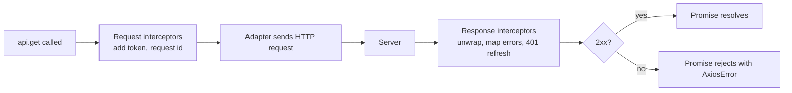
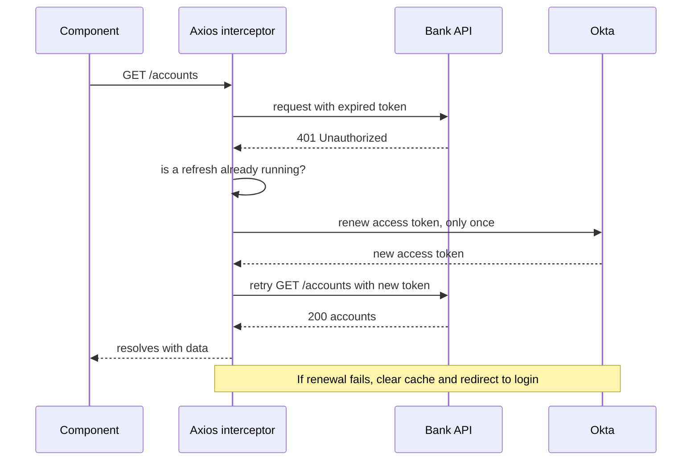
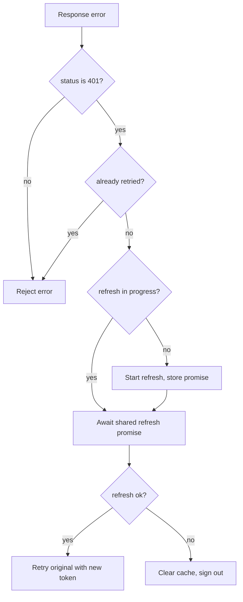
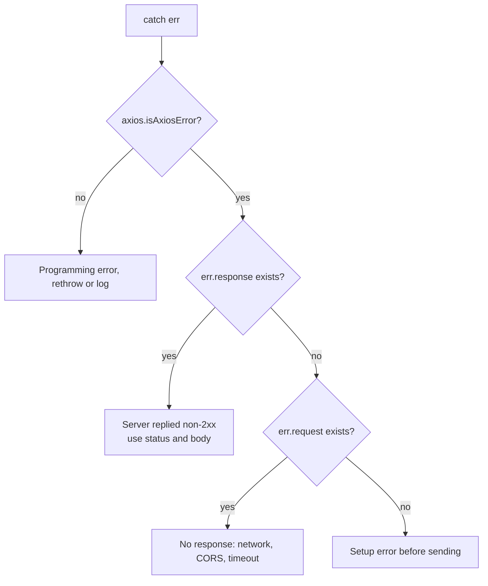

## 1. What it is

**Axios is an HTTP client library: it sends requests from the browser (or Node) and returns promises, with built-in JSON handling, shared instance config, interceptors and rich error objects.**

Think of the browser's `fetch` as sending a letter yourself: you write the address every time, put on the stamp, and when a reply arrives you open it and check whether it is good or bad news. Axios is a mailroom. You configure it once (return address, stamp, standard envelope), it opens replies for you, and it throws any bad-news letter (4xx, 5xx) straight onto your desk as an error so you cannot miss it. You can also station a clerk (an interceptor) who adds your security badge to every outgoing letter and handles "badge expired" replies automatically.

The problem it solves: raw `fetch` needs repetitive code for base URLs, auth headers, JSON parsing, timeouts and error checks, and has no hook to run logic on every request. Axios centralizes all of that in one configured instance, so every API call in the app behaves the same way.

## 2. Core concepts

### [Beginner] A request and its response shape

```ts
import axios from 'axios';

const response = await axios.get('https://api.example-bank.com/v1/accounts');

response.data;     // parsed JSON body
response.status;   // 200
response.headers;  // AxiosHeaders object
response.config;   // the config used to make this request
```

> **Why:** Axios parses JSON automatically and wraps the body in `data`. With `fetch` you must call `await res.json()` yourself, and you get a `Response` object that still needs a status check.

### [Beginner] Instances: configure once, use everywhere

An instance is a pre-configured copy of Axios. Every request made through it inherits the config.

```ts
// src/lib/api.ts
import axios from 'axios';

export const api = axios.create({
  baseURL: import.meta.env.VITE_API_BASE_URL, // e.g. https://api.example-bank.com/v1
  timeout: 15_000,                            // abort if no response in 15s
  headers: {
    'Content-Type': 'application/json',
    Accept: 'application/json',
  },
});

// Every call is now short and consistent
await api.get('/accounts');             // GET https://api.example-bank.com/v1/accounts
await api.post('/transfers', payload);  // body is JSON-serialized automatically
```

> **Gotcha:** Using the global `axios` default export and mutating `axios.defaults` affects every library in the bundle that also uses Axios. Always create your own instance.

> **Gotcha:** A leading slash matters. With `baseURL: 'https://x.com/v1'`, `api.get('/accounts')` resolves to `https://x.com/v1/accounts` because Axios joins the strings, unlike the browser's `new URL()` rules. Passing a full absolute URL bypasses `baseURL` entirely (see section 7).

### [Beginner] Typing responses

Pass the expected response body type as a generic. Axios does not validate it at runtime; it is a promise you make to the compiler.

```ts
type Account = {
  id: string;
  nickname: string;
  balanceCents: number;
  currency: 'USD' | 'EUR' | 'GBP';
};

const { data } = await api.get<Account[]>('/accounts'); // data: Account[]

// Request body type is the second generic on post/put/patch
type TransferInput = { fromAccountId: string; toAccountId: string; amountCents: number };
type TransferReceipt = { id: string; status: 'PENDING' | 'COMPLETED' };

const receipt = await api.post<TransferReceipt, AxiosResponse<TransferReceipt>, TransferInput>(
  '/transfers',
  { fromAccountId: 'a1', toAccountId: 'a2', amountCents: 12_500 }
);
```

For real safety, validate at the boundary with a schema library:

```ts
import { z } from 'zod';

const AccountSchema = z.object({
  id: z.string(),
  nickname: z.string(),
  balanceCents: z.number().int(),
  currency: z.enum(['USD', 'EUR', 'GBP']),
});

export async function fetchAccounts(signal?: AbortSignal) {
  const { data } = await api.get<unknown>('/accounts', { signal });
  return z.array(AccountSchema).parse(data); // throws if the API contract broke
}
```

> **Finance tip:** Runtime validation catches a backend that suddenly returns `balance: "123.45"` as a string instead of integer cents. Without it, `balance + fee` becomes string concatenation and shows a wrong total.

### [Intermediate] Interceptors

Interceptors are functions that run on every request before it is sent, and on every response before your code sees it. They form a pipeline.



```ts
// Request interceptor: runs before every request
api.interceptors.request.use((config) => {
  config.headers['X-Request-Id'] = crypto.randomUUID(); // correlate frontend and backend logs
  return config; // must return the config (or a promise of it)
});

// Response interceptor: success handler and error handler
api.interceptors.response.use(
  (response) => response,            // 2xx: pass through
  (error) => Promise.reject(error)   // non-2xx or network error: must re-reject
);

// Interceptors return an id so you can remove them (useful in tests or React effects)
const id = api.interceptors.request.use((c) => c);
api.interceptors.request.eject(id);
```

> **Gotcha:** Request interceptors run in **reverse** order of registration (last added runs first). Response interceptors run in registration order. Keep the count small and register them in one file.

> **Gotcha:** An error handler that returns a value instead of `Promise.reject(error)` turns the failure into a success. Your query would then treat an error as data.

### [Intermediate] Attaching an Okta bearer token

The request interceptor is the natural place to attach the access token, because every call needs it and no component should handle it.

```ts
// src/lib/auth.ts
import { OktaAuth } from '@okta/okta-auth-js';

export const oktaAuth = new OktaAuth({
  issuer: import.meta.env.VITE_OKTA_ISSUER,
  clientId: import.meta.env.VITE_OKTA_CLIENT_ID,
  redirectUri: `${window.location.origin}/login/callback`,
  scopes: ['openid', 'profile', 'email', 'offline_access'],
  pkce: true,                                   // required for SPAs
  tokenManager: { autoRenew: true, storage: 'memory' }, // renew before expiry, avoid localStorage
});
```

```ts
// src/lib/api.ts
api.interceptors.request.use((config) => {
  const accessToken = oktaAuth.getAccessToken(); // string | undefined
  if (accessToken) {
    config.headers.Authorization = `Bearer ${accessToken}`;
  }
  return config;
});
```

> **Why in an interceptor:** Tokens rotate. If components read the token once and pass it around, they keep using an expired one. Reading it inside the interceptor gets the current token at the moment of each request.

> **Finance tip:** Only attach the bearer token to your own API origin. If the same instance is ever used for a third-party URL, the token leaks. Check `config.baseURL` or the resolved URL before adding the header.

### [Advanced] The 401 refresh flow

Even with auto-renew, tokens can expire (laptop sleep, clock skew, revoked session). A response interceptor can catch the 401, renew once, and retry the original request. When several requests fail at the same time, they must share **one** renewal, not start five.



```ts
// src/lib/api.ts
import axios, { AxiosError, InternalAxiosRequestConfig } from 'axios';

// Mark retried requests so we never loop forever
declare module 'axios' {
  interface InternalAxiosRequestConfig {
    _retried?: boolean;
  }
}

let refreshPromise: Promise<string> | null = null;

async function renewAccessToken(): Promise<string> {
  // All concurrent 401s await the same promise
  refreshPromise ??= oktaAuth.tokenManager
    .renew('accessToken')
    .then((token) => (token as { accessToken: string }).accessToken)
    .finally(() => {
      refreshPromise = null;
    });
  return refreshPromise;
}

api.interceptors.response.use(
  (res) => res,
  async (error: AxiosError) => {
    const original = error.config as InternalAxiosRequestConfig | undefined;

    const isUnauthorized = error.response?.status === 401;
    if (!original || !isUnauthorized || original._retried) {
      return Promise.reject(error);
    }

    original._retried = true;
    try {
      const newToken = await renewAccessToken();
      original.headers.Authorization = `Bearer ${newToken}`;
      return api(original); // replay the original request
    } catch (renewError) {
      queryClient.clear();                    // remove cached PII
      await oktaAuth.signOut();               // send to Okta login
      return Promise.reject(renewError);
    }
  }
);
```



> **Why the shared promise:** A dashboard fires many requests at once. If the token expired, all of them get 401. Without deduplication you start many renewals, and some providers rotate refresh tokens so the second renewal invalidates the first, logging the user out.

> **Gotcha:** Never retry a non-idempotent POST (like a transfer) blindly unless the server supports an idempotency key. If the 401 happened after the server processed the request (rare, but possible behind some gateways), a replay could duplicate the payment. Send an `Idempotency-Key` header with money-moving requests.

### [Advanced] Error handling: response vs request vs setup

An `AxiosError` can mean three different things. Check them in order.

```ts
import axios from 'axios';

type ApiErrorBody = { code: string; message: string; fieldErrors?: Record<string, string> };

export function toUserMessage(err: unknown): string {
  if (!axios.isAxiosError<ApiErrorBody>(err)) {
    return 'Unexpected error.'; // a bug in our code, not an HTTP problem
  }

  if (err.response) {
    // 1. The server answered with a non-2xx status
    const { status, data } = err.response;
    if (status === 401) return 'Your session has expired. Please sign in again.';
    if (status === 403) return 'You do not have permission for this action.';
    if (status === 409) return 'This transfer was already submitted.';
    if (status === 422) return data?.message ?? 'Please check the highlighted fields.';
    if (status >= 500) return 'Our service is having trouble. Try again shortly.';
    return data?.message ?? `Request failed (${status}).`;
  }

  if (err.request) {
    // 2. The request was sent but no response arrived: offline, DNS, CORS, timeout
    if (err.code === 'ECONNABORTED' || err.code === 'ETIMEDOUT') return 'The request timed out.';
    return 'Network error. Check your connection.';
  }

  // 3. Something failed while setting up the request (bad config, interceptor threw)
  return 'Could not send the request.';
}
```



> **Why `isAxiosError`:** In TypeScript a `catch` variable is `unknown`. `axios.isAxiosError(err)` is a type guard that narrows it, so `err.response` is typed. The generic types the error body.

> **Gotcha:** CORS failures look like network errors (`err.request` set, no `err.response`). The browser hides the real reason from JavaScript. Check the browser console, not the error object.

You can change what counts as an error with `validateStatus`:

```ts
// Treat 404 as a valid "not found" result instead of an exception
const res = await api.get(`/accounts/${id}`, {
  validateStatus: (status) => (status >= 200 && status < 300) || status === 404,
});
if (res.status === 404) return null;
```

### [Advanced] Cancellation with AbortController

Axios accepts a standard `AbortSignal`. Aborting rejects the promise with a cancel error.

```ts
const controller = new AbortController();

api.get('/transactions', { params: { q: 'coffee' }, signal: controller.signal })
  .catch((err) => {
    if (axios.isCancel(err)) return; // err.code === 'ERR_CANCELED'. Not a real failure.
    throw err;
  });

controller.abort(); // e.g. the user typed another character
```

With TanStack Query, the signal is provided for you:

```ts
useQuery({
  queryKey: ['transactions', accountId, search],
  queryFn: ({ signal }) =>
    api.get<Transaction[]>(`/accounts/${accountId}/transactions`, { params: { q: search }, signal })
      .then((r) => r.data),
});
```

> **Outdated:** `CancelToken` (`axios.CancelToken.source()`) is deprecated since v0.22. It was based on a withdrawn TC39 proposal. Use `AbortController`, which is a web standard and works with fetch, TanStack Query and React effects.

## 3. Why it's used in this project

- **One place for Okta auth.** The request interceptor attaches the bearer token; the response interceptor handles 401 renewal and logout. No component touches tokens.
- **Consistent error UX.** A single `toUserMessage` maps 401/403/409/422/5xx into clear messages, and maps `fieldErrors` onto form fields for account and payment forms.
- **Audit and tracing.** An `X-Request-Id` (or `traceparent`) header on every request lets support match a customer's failed transfer to backend logs.
- **Idempotency.** An interceptor adds `Idempotency-Key` to POSTs on `/transfers` and `/payments`, so retries never double-charge.
- **Timeouts.** A 15-second timeout prevents a spinner from hanging forever on a slow core-banking call.
- **Cancellation.** Account switchers and transaction search cancel stale requests so old responses never overwrite new ones.
- **PII-safe logging.** A response interceptor can redact account numbers before errors are sent to monitoring.

> **Finance tip:** Never log full request or response bodies from interceptors in production. Redact fields like `accountNumber`, `routingNumber`, `ssn` and card numbers before sending errors to Sentry or similar tools.

## 4. Setup & configuration

```bash
npm install axios
```

```ts
// src/lib/api.ts
import axios from 'axios';
import { oktaAuth } from './auth';

export const api = axios.create({
  baseURL: import.meta.env.VITE_API_BASE_URL, // all relative URLs resolve against this
  timeout: 15_000,                            // ms before rejecting with ECONNABORTED
  headers: {
    Accept: 'application/json',               // ask for JSON
    'Content-Type': 'application/json',       // send JSON (axios also sets this for objects)
  },
  withCredentials: false,                     // true only if the API uses cookies (needs CORS credentials)
  responseType: 'json',                       // default; 'blob' for PDF statements
  allowAbsoluteUrls: false,                   // v1.8+: refuse absolute URLs that would bypass baseURL
  // validateStatus: (s) => s >= 200 && s < 300, // default: anything else rejects
});

// 1. Auth header
api.interceptors.request.use((config) => {
  const token = oktaAuth.getAccessToken();
  if (token) config.headers.Authorization = `Bearer ${token}`;
  return config;
});

// 2. Tracing + idempotency for writes
api.interceptors.request.use((config) => {
  config.headers['X-Request-Id'] = crypto.randomUUID();
  const isWrite = ['post', 'put', 'patch'].includes(config.method ?? '');
  if (isWrite && !config.headers['Idempotency-Key']) {
    config.headers['Idempotency-Key'] = crypto.randomUUID();
  }
  return config;
});

// 3. 401 renewal (see Core concepts) and error normalization
api.interceptors.response.use((res) => res, handleResponseError);
```

> **Gotcha:** Generating the idempotency key inside the interceptor means a *manual* retry by the user gets a new key. For true deduplication, generate the key when the form is first submitted and pass it explicitly, so retries reuse it.

## 5. Key features we use

### [Beginner] Query params

```ts
const { data } = await api.get<TxPage>(`/accounts/${accountId}/transactions`, {
  params: { from: '2026-09-01', to: '2026-09-30', status: 'posted', limit: 50 },
}); // ?from=2026-09-01&to=2026-09-30&status=posted&limit=50
```

### [Beginner] Downloading a PDF statement

```ts
const res = await api.get<Blob>(`/statements/${statementId}/pdf`, { responseType: 'blob' });
const url = URL.createObjectURL(res.data);
const a = Object.assign(document.createElement('a'), { href: url, download: `statement-${statementId}.pdf` });
a.click();
URL.revokeObjectURL(url);
```

### [Intermediate] Upload with progress

```ts
const form = new FormData();
form.append('file', file);
await api.post('/documents/kyc', form, {
  onUploadProgress: (e) => setProgress(Math.round(((e.loaded ?? 0) / (e.total ?? 1)) * 100)),
}); // Content-Type with boundary is set automatically for FormData
```

### [Intermediate] Typed API module

```ts
export const accountsApi = {
  list: (signal?: AbortSignal) => api.get<Account[]>('/accounts', { signal }).then((r) => r.data),
  get: (id: string, signal?: AbortSignal) => api.get<Account>(`/accounts/${id}`, { signal }).then((r) => r.data),
  rename: (id: string, nickname: string) => api.patch<Account>(`/accounts/${id}`, { nickname }).then((r) => r.data),
};
```

### [Advanced] Mapping 422 field errors to a form

```ts
try {
  await paymentsApi.schedule(values);
} catch (err) {
  if (axios.isAxiosError<ApiErrorBody>(err) && err.response?.status === 422) {
    Object.entries(err.response.data.fieldErrors ?? {}).forEach(([field, message]) =>
      form.setError(field as keyof PaymentForm, { message })
    );
    return;
  }
  throw err;
}
```

## 6. Interview questions

#### Q: What are the main differences between Axios and fetch?

- Axios rejects on non-2xx by default. `fetch` only rejects on network failure; you must check `res.ok`.
- Axios parses JSON automatically (`res.data`). `fetch` needs `await res.json()`.
- Axios has instances (`baseURL`, default headers, `timeout`) and interceptors. `fetch` has none; you write wrapper functions.
- Axios has a `timeout` option. `fetch` uses `AbortSignal.timeout()`.
- Axios offers upload/download progress events. `fetch` has no simple upload progress.
- `fetch` is built in (0 KB) and supports streaming bodies natively. Axios adds roughly ~13 KB gzip.

Both support `AbortController` for cancellation.

#### Q: How would you implement token refresh on 401 with Axios?

A response interceptor checks `error.response?.status === 401` and a `_retried` flag on the request config. If not retried, it marks it, awaits a **shared** refresh promise (so concurrent 401s trigger one renewal), sets the new `Authorization` header and replays the request with `api(originalConfig)`. If renewal fails, it clears cached data and redirects to login. Request interceptors read the token fresh on every call. I would be careful replaying non-idempotent writes and use idempotency keys.

#### Q: What is the difference between error.response and error.request?

`error.response` exists when the server replied with a status outside `validateStatus` (default 2xx); use `status` and `data`. `error.request` without `response` means the request went out but nothing came back: offline, DNS failure, CORS block, or timeout (`code` is `ECONNABORTED`/`ETIMEDOUT`). Neither means the error happened while building the request (bad config, interceptor threw). `axios.isAxiosError` narrows an `unknown` catch variable before checking these.

#### Q: How do you cancel requests in Axios today?

Pass `signal` from an `AbortController` (or the `signal` that TanStack Query passes to `queryFn`). Calling `abort()` rejects the promise with a cancel error; detect it with `axios.isCancel(err)` or `err.code === 'ERR_CANCELED'` and do not show it as a failure. `CancelToken` is deprecated because it was based on a withdrawn proposal.

#### Q: Would you choose Axios for a new project in 2026?

It depends. Axios is still very popular, well understood, and its interceptors make auth and error policies easy. But `fetch` is now universal (browsers, Node 18+, edge runtimes), and small fetch wrappers like `ky` or `ofetch` give retries, hooks, timeouts and JSON handling at a fraction of the size. For a new SPA with TanStack Query, I would lean toward a thin fetch wrapper or `ky`. For an existing codebase with established Axios interceptors, switching has little value. Either way I would keep HTTP behind one module so it can be swapped.

## 7. Drawbacks & pain points

- **Bundle size.** Roughly ~13-14 KB gzip for something `fetch` mostly does natively.
- **Types are promises, not validation.** `api.get<Account>()` does not check the response shape.
- **Interceptor ordering** is non-obvious (request interceptors run in reverse).
- **Global defaults** leak across libraries if you mutate `axios.defaults`.
- **Absolute URLs bypass `baseURL`.** If a user-controlled value becomes the URL, the request (with your auth header) can go to another host. This was the subject of a 2025 security advisory; v1.8 added `allowAbsoluteUrls`. Keep Axios patched.
- **Supply chain.** Like any popular package, it is a target. Pin versions and use lockfiles and audit tooling.

Gotchas that trip devs up:

```ts
// 1. Error handler that forgets to re-reject turns failures into "success"
api.interceptors.response.use(
  (r) => r,
  (err) => { toast.error(err.message); } // BAD: resolves with undefined
);
api.interceptors.response.use(
  (r) => r,
  (err) => { toast.error(err.message); return Promise.reject(err); } // GOOD
);

// 2. Interceptor registered inside a React component: a new one each render
function App() {
  api.interceptors.request.use(addToken); // BAD: piles up, runs N times per request
}
// GOOD: register once at module level, or in useEffect with eject() in cleanup

// 3. Infinite 401 loop when the refresh endpoint itself returns 401
// GOOD: mark retried requests with _retried and skip the refresh URL

// 4. Treating a cancel as an error
catch (err) { showError(err); } // BAD: shows "canceled" to the user
catch (err) { if (!axios.isCancel(err)) showError(err); } // GOOD
```

## 8. Better alternatives

The industry trend is toward **native `fetch` plus a tiny wrapper**, because `fetch` now exists in every runtime (browser, Node 18+, Deno, Bun, edge functions). Popular wrappers: **ky** (browser-focused, hooks and retries), **ofetch** (unjs, universal, used by Nuxt). Axios itself added a fetch adapter (`adapter: 'fetch'`) in v1.7 for environments without XHR. Typed API clients generated from OpenAPI (for example `openapi-fetch` or Orval) are also popular, since they give real end-to-end types.

| Option | Bundle (gzip) | Boilerplate | Interceptors / hooks | Learning curve | TypeScript | Popularity | When it wins |
|---|---|---|---|---|---|---|---|
| Axios 1.x | ~13 KB | Low | Yes, request and response | Low | Good (generics, isAxiosError) | Very high | Existing apps, progress events, team familiarity |
| fetch (native) | 0 KB | High without a wrapper | No | Low | Basic | Universal | Minimal deps, streaming, edge runtimes |
| ky | ~4 KB | Low | Yes (beforeRequest, afterResponse, beforeRetry) | Low | Good | Medium-high | Modern SPAs wanting fetch with conveniences |
| ofetch | ~3-5 KB | Low | Yes (onRequest, onResponseError) | Low | Good | Medium | Universal code, Nuxt/Nitro ecosystems |
| openapi-fetch | ~2 KB | Very low with codegen | Middleware | Medium | Excellent, types from the API spec | Growing | Teams with an OpenAPI contract |

```ts
// ky equivalent of our Axios instance
import ky from 'ky';

export const api = ky.create({
  prefixUrl: import.meta.env.VITE_API_BASE_URL,
  timeout: 15_000,
  retry: { limit: 2, methods: ['get'] }, // safe methods only
  hooks: {
    beforeRequest: [(req) => { req.headers.set('Authorization', `Bearer ${oktaAuth.getAccessToken()}`); }],
  },
});
const accounts = await api.get('accounts').json<Account[]>();
```

## 9. When NOT to use it

- **Bundle-critical pages** (a public marketing or login page) where every KB counts: use `fetch`.
- **Streaming responses** (server-sent events, large streamed exports, AI token streams): `fetch` exposes `ReadableStream` directly.
- **Edge or service worker code**: `fetch` is native there; XHR is not available.
- **You already have a generated OpenAPI client** with its own fetch layer.
- **Framework data layers** (Next.js server `fetch` with caching options) that extend `fetch` itself: Axios bypasses those features.

## Cheatsheet

| Task | Axios |
|---|---|
| Create instance | `axios.create({ baseURL, timeout, headers })` |
| GET typed | `api.get<T>(url, { params, signal })` |
| POST typed | `api.post<Res>(url, body)` |
| Body | `res.data` |
| Auth header | `api.interceptors.request.use(c => { c.headers.Authorization = ...; return c })` |
| Global error handling | `api.interceptors.response.use(r => r, err => Promise.reject(err))` |
| Remove interceptor | `api.interceptors.request.eject(id)` |
| Narrow error | `axios.isAxiosError<Body>(err)` |
| Server replied | `err.response.status`, `err.response.data` |
| No response | `err.request` set, `err.response` undefined |
| Timeout | `timeout: ms`, `err.code === 'ECONNABORTED'` |
| Cancel | `signal: controller.signal`, `axios.isCancel(err)` |
| Accept other statuses | `validateStatus: s => s < 500` |
| Binary | `responseType: 'blob'` |
| Progress | `onUploadProgress`, `onDownloadProgress` |
| Deprecated | `CancelToken` (use AbortController) |

```ts
const api = axios.create({ baseURL: '/api', timeout: 15_000 });
api.interceptors.request.use((c) => {
  const t = oktaAuth.getAccessToken();
  if (t) c.headers.Authorization = `Bearer ${t}`;
  return c;
});
const { data } = await api.get<Account[]>('/accounts', { signal });
try { await api.post('/transfers', input); }
catch (e) { if (axios.isAxiosError(e) && e.response?.status === 422) { /* field errors */ } }
```
