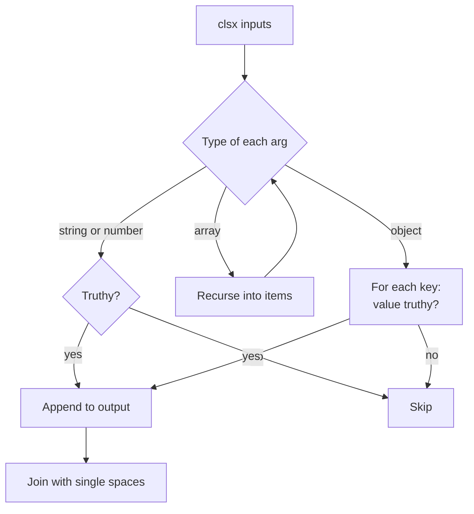
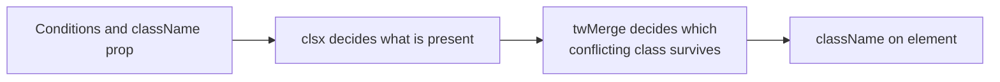

## 1. What it is

**classnames and clsx are tiny functions that take strings, objects and arrays and return one space-separated class string, keeping only the parts whose condition is true.**

Think of a checklist where you tick the boxes that apply: "base style: always", "selected: yes", "disabled: no". The helper reads the ticks and writes the final list for you, with the spaces in the right places.

The problem it solves: building class names with template literals and ternaries gets unreadable fast, and leaves stray `"undefined"`, `"false"` or double spaces in your HTML. These helpers make conditional classes declarative and safe.

## 2. Core concepts

### [Beginner] The problem with manual concatenation

```tsx
type Props = { selected: boolean; disabled?: boolean; className?: string };

// Hard to read, easy to break
function AccountRowManual({ selected, disabled, className }: Props) {
  return (
    <li
      className={
        "account-row" +
        (selected ? " is-selected" : "") +
        (disabled ? " is-disabled" : "") +
        " " + className // if className is undefined -> "account-row undefined"
      }
    />
  );
}
```

> **Why:** `"a" + undefined` is the string `"aundefined"` in JavaScript. `` `a ${false && "b"}` `` gives `"a false"`. String building does not know which values mean "no class". The helpers do: they skip every falsy value.

### [Beginner] Basic usage: strings and falsy values

```ts
import clsx from "clsx";           // or: import { clsx } from "clsx";
import classNames from "classnames";

clsx("btn", "btn-primary");        // "btn btn-primary"
clsx("btn", false, null, undefined, 0, ""); // "btn"
clsx("btn", isLoading && "opacity-50");     // "btn opacity-50" or "btn"

classNames("btn", isLoading && "opacity-50"); // same result
```

Falsy values (`false`, `null`, `undefined`, `0`, `""`, `NaN`) are dropped. Truthy strings and non-zero numbers are kept.

### [Beginner] Object syntax: key is the class, value is the condition

```tsx
import clsx from "clsx";

type Tx = { id: string; status: "pending" | "posted" | "failed"; amountCents: number };

export function TxAmount({ tx }: { tx: Tx }) {
  return (
    <span
      className={clsx("tabular-nums text-right", {
        "text-red-700": tx.amountCents < 0,
        "text-green-700": tx.amountCents > 0,
        "italic text-gray-500": tx.status === "pending",
        "line-through": tx.status === "failed",
      })}
    >
      {(tx.amountCents / 100).toFixed(2)}
    </span>
  );
}
```

Each key is included when its value is truthy. A key can hold several classes separated by spaces.

### [Intermediate] Array syntax and nesting

Arrays are flattened recursively, and they can contain strings, objects and more arrays.

```ts
const base = ["rounded-md", "px-3", "py-2"];
const sizes = { sm: "text-sm", md: "text-base" } as const;

clsx(base, sizes["sm"], [isActive && "ring-2", { "opacity-50": disabled }]);
// "rounded-md px-3 py-2 text-sm ring-2"   (when isActive true, disabled false)
```



### [Intermediate] classnames extras: bind and dedupe

`classnames` ships two extra entry points that clsx does not have.

```tsx
// classnames/bind: map logical names to CSS Modules hashed names
import classNames from "classnames/bind";
import styles from "./AccountCard.module.scss";

const cx = classNames.bind(styles);

export function AccountCard({ selected }: { selected: boolean }) {
  // "card" -> styles.card, "selected" -> styles.selected
  return <div className={cx("card", { selected })} />;
}
```

```ts
// classnames/dedupe: later object keys can REMOVE earlier classes
import classNames from "classnames/dedupe";

classNames("foo", "bar", { foo: false }); // "bar"
```

> **Gotcha:** `dedupe` removes identical class names only. It does not understand that `px-4` and `px-2` conflict. For Tailwind conflicts you need tailwind-merge.

### [Intermediate] clsx vs classnames

| | clsx | classnames |
| --- | --- | --- |
| Size (~gzip) | ~0.24 kB (`clsx/lite` even smaller) | ~0.4-0.5 kB |
| API | Strings, objects, arrays, nested | Same |
| Speed | Generally benchmarked faster | Fast enough for nearly all apps |
| Extras | `clsx/lite` (strings only) | `/bind` for CSS Modules, `/dedupe` |
| TypeScript | Bundled types, exports `ClassValue` | Bundled types |
| Default in | shadcn/ui, many modern templates | Older CRA-era apps |

They are drop-in replacements for each other in normal usage. Pick clsx for new code unless you rely on `bind`.

### [Advanced] The cn() pattern

When using Tailwind, combine clsx with tailwind-merge so conditional classes AND overrides both work.

```ts
// src/lib/cn.ts
import { clsx, type ClassValue } from "clsx";
import { twMerge } from "tailwind-merge";

export function cn(...inputs: ClassValue[]) {
  return twMerge(clsx(inputs));
}
```

```tsx
import { cn } from "@/lib/cn";

type ButtonProps = React.ButtonHTMLAttributes<HTMLButtonElement> & { loading?: boolean };

export function Button({ loading, disabled, className, ...rest }: ButtonProps) {
  return (
    <button
      disabled={disabled || loading}
      className={cn(
        "inline-flex items-center rounded-md bg-blue-600 px-4 py-2 text-white",
        { "cursor-wait opacity-70": loading },
        className, // caller overrides, e.g. "bg-red-600"
      )}
      {...rest}
    />
  );
}
```



> **Interview tip:** Say clearly: clsx does not resolve conflicts. `clsx("px-4", "px-2")` returns `"px-4 px-2"`. That is why `cn()` wraps it with `twMerge`.

## 3. Why it's used in this project

- **Status-heavy UI.** Transactions, payments and accounts have many states (pending, posted, failed, reversed, frozen, overdrawn). Object syntax keeps each state's styling on one readable line.
- **Form validation states.** Inputs switch between neutral, focused, invalid and disabled classes based on form library state.
- **CSS Modules** in older screens use `classnames/bind` to keep JSX readable with hashed names.
- **Table rows** combine zebra striping, selected row, and "flagged for review" highlighting.

```tsx
type Account = { id: string; frozen: boolean; overdrawn: boolean };

export function AccountRow({ account, selected }: { account: Account; selected: boolean }) {
  return (
    <tr
      aria-selected={selected}
      className={clsx("border-b", {
        "bg-blue-50": selected,
        "bg-red-50 text-red-900": account.overdrawn,
        "opacity-60": account.frozen,
      })}
    />
  );
}
```

> **Finance tip:** Class names change visuals only. If a state matters (frozen, overdrawn), also expose it with text or ARIA (`aria-disabled`, a visible "Frozen" badge) so it is not conveyed by color or opacity alone.

## 4. Setup & configuration

### [Beginner] Install

```bash
npm install clsx
# or
npm install classnames
```

No configuration needed. Both ship TypeScript types.

### [Intermediate] Editor support with Tailwind

```json
// .vscode/settings.json: Tailwind IntelliSense inside clsx()/cn() calls
{
  "tailwindCSS.classFunctions": ["clsx", "cn", "classNames"]
}
```

> **Gotcha:** `classFunctions` is a newer IntelliSense setting. On older extension versions, use `tailwindCSS.experimental.classRegex` with a regex for `clsx(...)` instead.

## 5. Key features we use

### [Beginner] Conditional class from a boolean

```tsx
<input className={clsx("rounded border px-2", hasError && "border-red-600")} />
```

### [Beginner] Mutually exclusive variants via lookup

```tsx
const intentClass = {
  primary: "bg-blue-600 text-white",
  danger: "bg-red-600 text-white",
  ghost: "bg-transparent text-gray-900",
} as const;

type Intent = keyof typeof intentClass;

function Btn({ intent = "primary" }: { intent?: Intent }) {
  return <button className={clsx("rounded px-4 py-2", intentClass[intent])} />;
}
```

### [Intermediate] Typing props with ClassValue

```ts
import type { ClassValue } from "clsx";

// Allow callers to pass anything clsx accepts
type CardProps = { className?: ClassValue; children: React.ReactNode };
```

## 6. Interview questions

#### Q: Why use clsx or classnames instead of template literals?

Template literals turn falsy values into text: `` `btn ${false && "x"}` `` is `"btn false"`, and `undefined` becomes `"undefined"`. You also get double spaces and nested ternaries. The helpers skip all falsy values, support object syntax (`{ "is-active": active }`) and arrays, and produce clean, readable code.

#### Q: What is the difference between clsx and classnames?

They have the same core API. clsx is smaller (~0.24 kB vs ~0.4-0.5 kB gzip) and typically faster, and offers `clsx/lite` for string-only usage. classnames is older and includes `classnames/bind` for CSS Modules and `classnames/dedupe` for removing duplicate class names. Most new projects use clsx.

#### Q: Does clsx resolve Tailwind class conflicts?

No. It only joins strings. `clsx("px-4", "px-2")` returns `"px-4 px-2"`, and which applies depends on CSS order. Use `tailwind-merge` on top, usually in a `cn()` helper.

#### Q: What does `cn()` usually mean in a React + Tailwind codebase?

A project helper defined as `twMerge(clsx(inputs))`. clsx handles conditional and nested inputs, twMerge removes conflicting Tailwind classes so later ones win. It was popularized by shadcn/ui.

#### Q: How would you use classnames with CSS Modules?

Either pass the module values directly, `clsx(styles.card, selected && styles.selected)`, or use `classnames/bind`: `const cx = classNames.bind(styles); cx("card", { selected })`, which looks up each logical name in the `styles` object.

## 7. Drawbacks & pain points

- **No conflict resolution**, which surprises Tailwind users.
- **Object syntax can grow huge**, hiding logic that belongs in a lookup map or a variant library.
- **Typos are silent**: `clsx({ "text-gren-700": up })` produces a useless class with no error.
- **Not needed at all** for a single static class string.

Gotchas that trip devs up:

```ts
// 1. Non-zero numbers are KEPT as class names
clsx("row", tx.amountCents);         // "row -4250"  (oops: passed the value, not a condition)
clsx("row", tx.amountCents < 0 && "row--debit"); // correct

// 2. Expecting later classes to override
clsx("text-sm", "text-lg");   // both remain

// 3. Using dedupe for Tailwind
classNames("px-4", "px-2");   // dedupe does not help here

// 4. Passing a React element or object by mistake
clsx({ ...props });           // every truthy prop name becomes a class!
```

## 8. Better alternatives

These helpers are still the standard. The trend is to layer abstractions on top:

- **cva (class-variance-authority)** and **tailwind-variants** for typed variant APIs instead of big condition objects.
- **cn() with tailwind-merge** for overridable Tailwind components.
- **Data attributes** (`data-state="open"` with `data-[state=open]:` variants or CSS attribute selectors) to move state styling into CSS.

| Option | Bundle (~gzip) | Boilerplate | Devtools | Learning curve | TS support | Popularity | When it wins |
| --- | --- | --- | --- | --- | --- | --- | --- |
| clsx | ~0.24 kB | None | n/a | Very low | Good | Very high | Default choice |
| classnames | ~0.4-0.5 kB | None | n/a | Very low | Good | Very high (legacy) | Existing code, CSS Modules bind |
| cn() = clsx + tailwind-merge | ~8 kB | Tiny helper | n/a | Low | Excellent | Very high | Tailwind components with overrides |
| cva | ~1 kB | Variant config | n/a | Low | Excellent | High | Typed component variants |
| Template literals | 0 | None | n/a | None | n/a | n/a | One static class |

## 9. When NOT to use it

- A single static class: just write `className="card"`.
- Mutually exclusive variants: a lookup object or cva is clearer than many object keys.
- Tailwind components accepting overrides: use `cn()` (clsx alone is not enough).
- When state belongs in CSS: prefer `data-*`/`aria-*` attributes and selectors over JS-computed classes.

## Cheatsheet

| Input | Example | Output |
| --- | --- | --- |
| Strings | `clsx("a", "b")` | `"a b"` |
| Falsy | `clsx("a", false, null, undefined, 0, "")` | `"a"` |
| Condition | `clsx("a", ok && "b")` | `"a b"` or `"a"` |
| Object | `clsx({ a: true, b: false })` | `"a"` |
| Array | `clsx(["a", ["b", { c: true }]])` | `"a b c"` |
| Bind (classnames) | `classNames.bind(styles)("card", { selected })` | hashed names |
| Dedupe (classnames) | `classNames("a", { a: false })` from `/dedupe` | `""` |

```ts
import clsx, { type ClassValue } from "clsx";
import { twMerge } from "tailwind-merge";

export const cn = (...inputs: ClassValue[]) => twMerge(clsx(inputs));

clsx("btn", { "btn-active": active, "btn-disabled": disabled }, className);
```
