> **Version note (October 2026):** This guide targets Next.js 16 and the current Sanity stack. At the time of writing the newest Sanity Studio major is v6 (it needs Node.js 22.12+), next-sanity is on v13, and `@sanity/image-url` is on v2. Everything here also works on Studio v4/v5 unless a callout says otherwise. If a command prints a different prompt or a flag is rejected, check the official docs for your installed version. The ideas do not change, only the exact spelling.

## 1. What a headless CMS is, and the plan

### [Beginner] Step 1 — Understand what a headless CMS does

A traditional CMS such as WordPress stores your content **and** renders the HTML. The "head" is the website. A **headless CMS** keeps only the content part. It stores structured data and serves it through an API. You build the head yourself, in any framework you like.

In this guide:

- **Sanity Studio** is the editing app. It is a React app that editors use to write pages and posts. We embed it inside our own Next.js site at `/studio`.
- **Sanity Content Lake** is the hosted database. When an editor clicks Publish, the document is saved there. You never run a server for it.
- **Next.js** is the head. It queries the Content Lake with **GROQ** (Sanity's query language), renders HTML, and caches it.
- **Visitors** get fast, pre-rendered pages.

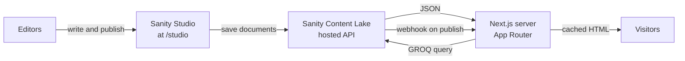

> **Why:** You get a real editing UI for non-developers without building an admin panel, and you keep full control of the front end. Content is structured JSON, so the same post can feed a website, an app, or an email later.

> **Interview tip:** "Headless" is about separation of concerns. The CMS owns content and editorial workflow. The front end owns presentation and performance. They meet at an API contract, which here is your GROQ queries plus the generated TypeScript types.

### [Beginner] Step 2 — Understand static pages and on-demand revalidation

A page can get its data at two moments:

1. **At build time (static).** `next build` runs your queries once and saves the HTML. Visitors get that saved HTML. It is very fast and cheap, but it goes stale when an editor publishes something new.
2. **At request time (dynamic).** Every visit runs the query. Always fresh, but slower and it costs API requests.

We want the best of both. Pages are static, and they are refreshed **on demand**: when an editor publishes, Sanity calls a **webhook** on our site, and our route handler tells Next.js "throw away the cached data tagged `post`". The next visitor gets a freshly rendered page, which is cached again.

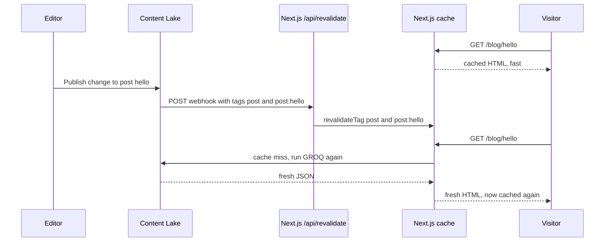

| Strategy | When data is fetched | Freshness | Cost | Use it for |
|---|---|---|---|---|
| Static only | `next build` | Stale until next deploy | Lowest | Content that never changes |
| Time-based ISR | Every N seconds at most | Up to N seconds stale | Low | Feeds where a delay is fine |
| On-demand (tags) | After a webhook | Fresh within seconds | Low | CMS content, **our choice** |
| Fully dynamic | Every request | Always fresh | Highest | Per-user pages |

> **Outdated:** In the Pages Router you used `getStaticProps` with `revalidate` and `res.revalidate()`. In the App Router you tag `fetch` calls and call `revalidateTag()` from a route handler. You will still see the old pattern in blog posts from 2022 and 2023.

### [Beginner] Step 3 — Plan the site

Keep it small. The site has exactly three content types and four routes.

| Content type | Fields | Used by |
|---|---|---|
| `siteSettings` (one document only) | title, description, navLinks | Header, footer, metadata |
| `page` | title, slug, body (Portable Text) | `/[slug]`, for example `/about` |
| `post` | title, slug, excerpt, mainImage, publishedAt, body | `/blog`, `/blog/[slug]` |

| Route | What it shows |
|---|---|
| `/` | Site title, description, latest 3 posts |
| `/[slug]` | A `page` document |
| `/blog` | All posts, newest first |
| `/blog/[slug]` | One post |
| `/studio` | The embedded Sanity Studio (editors only) |
| `/api/revalidate` | Webhook receiver (machines only) |

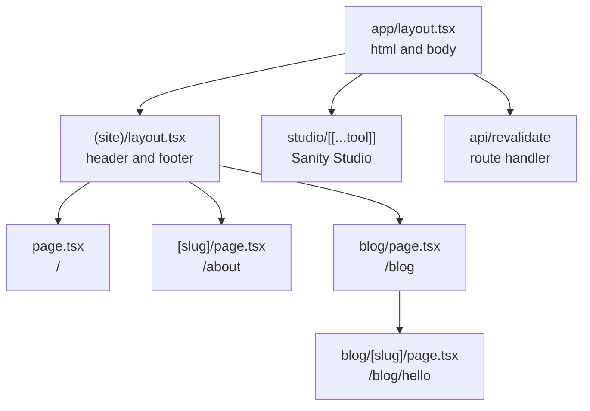

> **Why:** The `(site)` folder is a **route group**. The parentheses mean it does not appear in the URL. It lets the public pages share a header and footer while `/studio` gets a clean full-screen layout.

### [Beginner] Step 4 — See the final folder tree

This is where you will end up. Do not create these files yet. Come back to this tree whenever you are lost.

```text
simple-site/
├── public/
├── src/
│   ├── app/
│   │   ├── (site)/
│   │   │   ├── [slug]/page.tsx
│   │   │   ├── blog/
│   │   │   │   ├── [slug]/page.tsx
│   │   │   │   └── page.tsx
│   │   │   ├── layout.tsx
│   │   │   └── page.tsx
│   │   ├── api/
│   │   │   ├── draft-mode/
│   │   │   │   ├── disable/route.ts
│   │   │   │   └── enable/route.ts
│   │   │   └── revalidate/route.ts
│   │   ├── studio/[[...tool]]/page.tsx
│   │   ├── globals.css
│   │   ├── layout.tsx
│   │   ├── not-found.tsx
│   │   ├── opengraph-image.tsx
│   │   ├── robots.ts
│   │   └── sitemap.ts
│   ├── components/
│   │   ├── Footer.tsx
│   │   ├── Header.tsx
│   │   ├── PortableTextBody.tsx
│   │   ├── PostList.tsx
│   │   └── SanityImage.tsx
│   ├── lib/
│   │   ├── format.test.ts
│   │   └── format.ts
│   └── sanity/
│       ├── env.ts
│       ├── lib/
│       │   ├── client.ts
│       │   ├── fetch.ts
│       │   ├── image.ts
│       │   ├── queries.ts
│       │   └── token.ts
│       ├── schemaTypes/
│       │   ├── index.ts
│       │   ├── page.ts
│       │   ├── post.ts
│       │   └── siteSettings.ts
│       ├── structure.ts
│       └── types.ts            (generated by sanity typegen)
├── tests/
│   └── e2e/
│       ├── a11y.spec.ts
│       └── smoke.spec.ts
├── .env.example
├── .env.local                  (never committed)
├── .prettierignore
├── .prettierrc
├── eslint.config.mjs
├── next.config.ts
├── package.json
├── playwright.config.ts
├── README.md
├── sanity.cli.ts
├── sanity.config.ts
├── schema.json                 (generated by sanity schema extract)
├── tsconfig.json
└── vitest.config.ts
```

## 2. Create the Next.js app

### [Beginner] Step 5 — Install the prerequisites

You need:

- **Node.js 22 LTS or newer.** Next.js 16 needs Node 20.9+, but Sanity Studio v6 needs Node 22.12+, so 22 or 24 covers both. Check with `node -v`.
- **git.** Check with `git --version`.
- **A Sanity account.** Free at sanity.io. You can sign in with GitHub or Google.
- **A GitHub account.** Not needed in this guide, but the next guide (CI/CD and deployment) pushes this repo there.
- **A code editor.** VS Code with the "Sanity.io" and "Tailwind CSS IntelliSense" extensions is a comfortable setup.

```bash
node -v
npm -v
git --version
```

```text
v22.12.0
10.9.0
git version 2.47.0
```

Your exact numbers will differ. Only the Node major version matters here.

> **Gotcha:** If you use `nvm`, add a `.nvmrc` file containing `22` to the project later. Teammates and CI then pick the same Node version.

### [Beginner] Step 6 — Create the app with create-next-app

```bash
npx create-next-app@latest simple-site --ts --tailwind --eslint --app --src-dir --import-alias "@/*" --use-npm
cd simple-site
```

The flags answer the setup questions for you: TypeScript, Tailwind, ESLint, App Router, a `src/` directory, and `@/` as the import alias for `src/`. If it still asks a question (for example about the React Compiler or Turbopack), accept the default.

```text
Creating a new Next.js app in /home/you/simple-site.
Using npm.
Initializing project with template: app-tw
Installing dependencies:
- next
- react
- react-dom
...
Success! Created simple-site at /home/you/simple-site
```

Initialize git and make a first commit now, so every later step is a small diff you can inspect:

```bash
git init
git add -A
git commit -m "chore: scaffold Next.js app"
```

> **Why:** `create-next-app` may already have run `git init`. Running it again is harmless.

**Check it works.** Start the dev server:

```bash
npm run dev
```

```text
   ▲ Next.js 16.x (Turbopack)
   - Local:        http://localhost:3000

 ✓ Ready in 900ms
```

Open http://localhost:3000. You see the Next.js starter page. Stop the server with Ctrl+C.

> **Outdated:** Next.js 16 uses Turbopack for `next dev` and `next build` by default. Older tutorials pass `--turbopack` explicitly or use webpack. You do not need any flag.

### [Beginner] Step 7 — Clean up the starter and add Tailwind Typography

Delete the starter page content. We will create our own pages inside the `(site)` group, so remove the default home page:

```bash
rm src/app/page.tsx
rm -f public/*.svg
```

Rich text from the CMS needs nice default styles for headings, lists and links. The official Tailwind Typography plugin gives you a `prose` class for that.

```bash
npm install -D @tailwindcss/typography
```

Replace the global stylesheet:

```css
/* src/app/globals.css */
@import "tailwindcss";
@plugin "@tailwindcss/typography";

:root {
  color-scheme: light;
}

body {
  @apply bg-white text-gray-900 antialiased;
}

/* Visible focus for keyboard users on every interactive element */
:focus-visible {
  @apply outline-2 outline-offset-2 outline-blue-600;
}
```

> **Outdated:** Tailwind CSS 4 has no `tailwind.config.js` by default. You configure it in CSS with `@import "tailwindcss"` and `@plugin`. If you see `@tailwind base; @tailwind components;` in a tutorial, it is Tailwind 3.

### [Beginner] Step 8 — Write the root layout

The root layout is the only file that renders `<html>` and `<body>`. It wraps everything, including the Studio, so keep it minimal.

```tsx
// src/app/layout.tsx
import type { Metadata } from 'next'
import './globals.css'

const siteUrl = process.env.NEXT_PUBLIC_SITE_URL ?? 'http://localhost:3000'

export const metadata: Metadata = {
  metadataBase: new URL(siteUrl),
}

export default function RootLayout({
  children,
}: Readonly<{ children: React.ReactNode }>) {
  return (
    <html lang="en">
      <body>{children}</body>
    </html>
  )
}
```

> **Why:** `metadataBase` turns relative URLs in metadata (canonical links, Open Graph images) into absolute ones. Social networks need absolute URLs. We read it from `NEXT_PUBLIC_SITE_URL` so the deployed site can set its real domain.

### [Beginner] Step 9 — Add the header and footer components

For now the header takes plain props. In Part 5 we feed it data from Sanity.

```tsx
// src/components/Header.tsx
import Link from 'next/link'

export type NavLink = {
  _key: string
  label: string | null
  href: string | null
}

type HeaderProps = {
  title: string
  links: NavLink[] | null
}

export function Header({ title, links }: HeaderProps) {
  return (
    <header className="border-b border-gray-200">
      <a
        href="#main"
        className="sr-only focus:not-sr-only focus:absolute focus:left-2 focus:top-2 focus:bg-white focus:p-2"
      >
        Skip to content
      </a>
      <div className="mx-auto flex max-w-3xl items-center justify-between gap-4 px-4 py-4">
        <Link href="/" className="text-lg font-semibold">
          {title}
        </Link>
        <nav aria-label="Main">
          <ul className="flex gap-4 text-sm">
            <li>
              <Link href="/blog" className="hover:underline">
                Blog
              </Link>
            </li>
            {(links ?? []).map((link) =>
              link.href && link.label ? (
                <li key={link._key}>
                  <Link href={link.href} className="hover:underline">
                    {link.label}
                  </Link>
                </li>
              ) : null,
            )}
          </ul>
        </nav>
      </div>
    </header>
  )
}
```

```tsx
// src/components/Footer.tsx
type FooterProps = {
  title: string
}

export function Footer({ title }: FooterProps) {
  const year = new Date().getFullYear()
  return (
    <footer className="mt-16 border-t border-gray-200">
      <div className="mx-auto max-w-3xl px-4 py-6 text-sm text-gray-500">
        © {year} {title}
      </div>
    </footer>
  )
}
```

### [Beginner] Step 10 — Add the site layout and a temporary home page

```tsx
// src/app/(site)/layout.tsx
import { Footer } from '@/components/Footer'
import { Header } from '@/components/Header'

export default function SiteLayout({
  children,
}: Readonly<{ children: React.ReactNode }>) {
  return (
    <>
      <Header title="Simple Site" links={null} />
      <main id="main" className="mx-auto max-w-3xl px-4 py-10">
        {children}
      </main>
      <Footer title="Simple Site" />
    </>
  )
}
```

```tsx
// src/app/(site)/page.tsx
export default function HomePage() {
  return <h1 className="text-3xl font-bold">Hello from simple-site</h1>
}
```

**Check it works.** Run `npm run dev` and open http://localhost:3000. You should see the header with "Simple Site" and a "Blog" link, the heading, and the footer. Press Tab once: a "Skip to content" link appears in the top-left corner. Clicking "Blog" gives a 404 for now. That is expected.

```bash
git add -A
git commit -m "feat: base layout with header and footer"
```

## 3. Create the Sanity project and embed the Studio

### [Beginner] Step 11 — Create the Sanity project with the CLI

Run the Sanity CLI inside the Next.js folder. It detects Next.js and offers to wire the Studio into it.

```bash
npx sanity@latest init
```

Answer the prompts roughly like this (wording changes between CLI versions):

```text
? Create a new project or select an existing one: Create new project
? Your project name: simple-site
? Use the default dataset configuration? Yes
✓ Creating dataset production
? Would you like to add configuration files for a Sanity project in this Next.js folder? Yes
? Do you want to use TypeScript? Yes
? Would you like an embedded Sanity Studio? Yes
? What route do you want to use for the Studio? /studio
? Select project template to use: Clean project with no predefined schema types
? Would you like to add the project ID and dataset to your .env.local file? Yes
```

The CLI creates the project in Sanity's cloud, creates a `production` dataset, installs packages (`sanity`, `next-sanity`, `@sanity/vision`, `styled-components`) and writes several files. It is fine if its files look a little different from the ones below. In the next steps we overwrite them with known content, so your project matches this guide exactly.

If you prefer to do it by hand, create a project at sanity.io/manage, then install the packages yourself:

```bash
npm install sanity next-sanity @sanity/vision @sanity/image-url styled-components
```

If you used the CLI, also install the image URL builder now (the CLI does not add it):

```bash
npm install @sanity/image-url
```

> **Why:** `sanity` is the Studio itself. `next-sanity` is the official toolkit for Next.js: a preconfigured client, the `NextStudio` component, Portable Text rendering, webhook parsing and draft mode helpers. `@sanity/vision` adds a GROQ playground to the Studio.

> **Gotcha:** `styled-components` is a peer dependency of the Studio. If npm prints a peer dependency warning about it or about React, read it. Studio v5+ needs React 19.2 or newer, which Next.js 16 already ships.

### [Beginner] Step 12 — Set the environment variables

Find your project ID in the CLI output or at sanity.io/manage. Project ID and dataset are **not secrets**. They are visible in every request your site makes. Tokens and webhook secrets **are** secrets.

```bash
# .env.local
NEXT_PUBLIC_SANITY_PROJECT_ID="abc123xy"
NEXT_PUBLIC_SANITY_DATASET="production"
NEXT_PUBLIC_SITE_URL="http://localhost:3000"

# Server-only secrets (filled in later steps)
SANITY_API_READ_TOKEN=""
SANITY_REVALIDATE_SECRET=""
```

| Variable | Secret? | Used for |
|---|---|---|
| `NEXT_PUBLIC_SANITY_PROJECT_ID` | No | Which Sanity project to talk to |
| `NEXT_PUBLIC_SANITY_DATASET` | No | Which dataset, `production` |
| `NEXT_PUBLIC_SITE_URL` | No | Absolute URLs in metadata, sitemap, robots |
| `SANITY_API_READ_TOKEN` | **Yes** | Reading drafts in draft mode |
| `SANITY_REVALIDATE_SECRET` | **Yes** | Verifying webhook signatures |

> **Gotcha:** Only variables prefixed with `NEXT_PUBLIC_` reach the browser. That is why the token and secret do **not** have the prefix. Never rename them to make an error go away.

`create-next-app` already put `.env*` in `.gitignore`. Check it:

```bash
grep -n "env" .gitignore
```

```text
34:.env*
```

### [Beginner] Step 13 — Write the env helper and the client

One small module reads and validates the public env vars. Everything else imports from it.

```ts
// src/sanity/env.ts
function required(value: string | undefined, name: string): string {
  if (!value) {
    throw new Error(`Missing environment variable: ${name}`)
  }
  return value
}

// Must be written out in full so Next.js can inline them at build time
export const projectId = required(
  process.env.NEXT_PUBLIC_SANITY_PROJECT_ID,
  'NEXT_PUBLIC_SANITY_PROJECT_ID',
)

export const dataset = required(
  process.env.NEXT_PUBLIC_SANITY_DATASET,
  'NEXT_PUBLIC_SANITY_DATASET',
)

// A fixed date. Sanity's API behaves as it did on this date, so upgrades
// never change query results under your feet.
export const apiVersion = '2026-10-01'
```

```ts
// src/sanity/lib/client.ts
import { createClient } from 'next-sanity'
import { apiVersion, dataset, projectId } from '../env'

export const client = createClient({
  projectId,
  dataset,
  apiVersion,
  // false: we cache in Next.js and refresh via webhooks, so we want the
  // freshest data from the API, not the Sanity CDN.
  useCdn: false,
  perspective: 'published',
})
```

> **Why:** `useCdn: true` is great for client-side fetching from many browsers. Here only our server talks to Sanity, and Next.js caches the result. When a webhook fires right after publish, we must not get a slightly stale CDN copy, so we go straight to the API.

> **Interview tip:** `apiVersion` is a date, not a semver number. Pinning it is how Sanity avoids breaking changes. You bump it on purpose after reading the changelog.

### [Beginner] Step 14 — Configure the Studio

```ts
// sanity.config.ts
'use client'

import { visionTool } from '@sanity/vision'
import { defineConfig } from 'sanity'
import { structureTool } from 'sanity/structure'
import { apiVersion, dataset, projectId } from './src/sanity/env'
import { schemaTypes } from './src/sanity/schemaTypes'
import { structure } from './src/sanity/structure'

export default defineConfig({
  name: 'default',
  title: 'Simple Site',
  basePath: '/studio',
  projectId,
  dataset,
  schema: {
    types: schemaTypes,
    // Hide "Site settings" from the "create new document" menu. It is a singleton.
    templates: (templates) =>
      templates.filter((template) => template.schemaType !== 'siteSettings'),
  },
  plugins: [structureTool({ structure }), visionTool({ defaultApiVersion: apiVersion })],
})
```

```ts
// sanity.cli.ts
import { defineCliConfig } from 'sanity/cli'

const projectId = process.env.NEXT_PUBLIC_SANITY_PROJECT_ID
const dataset = process.env.NEXT_PUBLIC_SANITY_DATASET

export default defineCliConfig({
  api: { projectId, dataset },
  typegen: {
    path: './src/**/*.{ts,tsx}',
    schema: 'schema.json',
    generates: './src/sanity/types.ts',
    overloadClientMethods: true,
  },
})
```

> **Why `'use client'`:** The Studio is a big interactive React app that only runs in the browser. The directive tells Next.js not to try to render the config on the server.

> **Gotcha:** The Sanity CLI reads `sanity.cli.ts` when you run commands like `npx sanity typegen generate`. Recent CLI versions load `.env` files automatically. If a CLI command says the project ID is missing, run it with the vars exported (`export $(grep -v '^#' .env.local | xargs)` on macOS/Linux) or put the project ID directly in `sanity.cli.ts`. It is not a secret.

> **Outdated:** Older projects keep TypeGen settings in a `sanity-typegen.json` file. The `typegen` key in `sanity.cli.ts` replaces it.

Now add an empty schema list and the Studio sidebar structure. We fill in the schemas in Part 4.

```ts
// src/sanity/schemaTypes/index.ts
import type { SchemaTypeDefinition } from 'sanity'

export const schemaTypes: SchemaTypeDefinition[] = []
```

```ts
// src/sanity/structure.ts
import type { StructureResolver } from 'sanity/structure'

export const structure: StructureResolver = (S) =>
  S.list()
    .title('Content')
    .items([
      S.listItem()
        .title('Site settings')
        .id('siteSettings')
        .child(S.document().schemaType('siteSettings').documentId('siteSettings')),
      S.divider(),
      S.documentTypeListItem('page').title('Pages'),
      S.documentTypeListItem('post').title('Posts'),
    ])
```

> **Why the structure file:** By default the Studio lists every document type and lets you create many of each. Site settings should exist exactly once. Pinning it to the fixed ID `siteSettings` makes it a **singleton**. Clicking it always opens the same document.

### [Beginner] Step 15 — Mount the Studio at /studio

The folder name `[[...tool]]` is an **optional catch-all** route. It matches `/studio`, `/studio/structure`, `/studio/vision/...` and so on. The Studio does its own routing inside.

```tsx
// src/app/studio/[[...tool]]/page.tsx
import { NextStudio } from 'next-sanity/studio'
import config from '../../../../sanity.config'

// The Studio is a client-side app. Build its shell once as static HTML.
export const dynamic = 'force-static'

// Sensible defaults: noindex, viewport settings the Studio expects
export { metadata, viewport } from 'next-sanity/studio'

export default function StudioPage() {
  return <NextStudio config={config} />
}
```

Your tree now looks like this:

```text
simple-site/
├── sanity.cli.ts
├── sanity.config.ts
└── src/
    ├── app/
    │   ├── (site)/
    │   │   ├── layout.tsx
    │   │   └── page.tsx
    │   ├── studio/[[...tool]]/page.tsx
    │   ├── globals.css
    │   └── layout.tsx
    ├── components/
    │   ├── Footer.tsx
    │   └── Header.tsx
    └── sanity/
        ├── env.ts
        ├── lib/client.ts
        ├── schemaTypes/index.ts
        └── structure.ts
```

> **Gotcha:** If the CLI created extra files such as `src/sanity/lib/live.ts` or `src/sanity/schemaTypes/*.ts` with sample types, delete them now. Keeping two configs around is the most common source of "why does my Studio show the wrong schema".

### [Beginner] Step 16 — Add CORS origins

The Studio runs in your browser at `http://localhost:3000/studio` and talks directly to Sanity's API with your login cookie. Sanity refuses such requests unless the origin is on the project's **CORS allow list** with **credentials** allowed.

```bash
npx sanity cors add http://localhost:3000 --credentials
npx sanity cors list
```

```text
http://localhost:3333
http://localhost:3000
```

You can also manage this at sanity.io/manage under your project, then **API**, then **CORS origins**. The CLI may already have added `http://localhost:3000` during `init`.

> **Gotcha:** When you deploy (next guide), you must add the production URL, for example `https://simple-site.vercel.app`, with credentials allowed. Forgetting it is the classic "Studio works locally but shows a CORS error in production" bug.

**Check it works.** Run `npm run dev` and open http://localhost:3000/studio. Sign in with the same account you used for `sanity init`. You see an empty Studio with "Site settings", "Pages" and "Posts" in the sidebar. Clicking them shows an error that the types are unknown. That is expected: we have no schemas yet.

### [Intermediate] Step 17 — Understand datasets, roles and tokens

**Datasets** are separate databases inside one project. Same schema code, different content. Common setups:

- `production` only. Enough for this guide.
- `production` plus `staging` (or `development`) for trying schema changes safely.

```bash
npx sanity dataset list
# optional: a private dataset for experiments
npx sanity dataset create staging --visibility private
```

A **public** dataset lets anyone read published documents without a token. That is normal for a public website. Drafts are never public. A **private** dataset needs a token even for published content.

**Roles** decide what a project member or token can do. The exact list depends on your plan, but you will always see at least:

| Role | Can do |
|---|---|
| Administrator | Everything, including billing, members, CORS, webhooks |
| Editor | Create, edit, publish and delete documents |
| Viewer | Read everything, including drafts. Cannot write |

Invite real editors as **Editor**, not Administrator.

**Tokens** are roles for machines. Create a read token for draft mode now:

1. Go to sanity.io/manage, pick the project, then **API**, then **Tokens**.
2. Click **Add API token**. Name it `simple-site read`, choose **Viewer**.
3. Copy it once (it is shown only once) into `.env.local` as `SANITY_API_READ_TOKEN`.

> **Why Viewer:** The website only needs to read drafts. A leaked Viewer token can expose unpublished content, but it cannot delete anything. Always give a token the smallest role that works.

> **Finance tip:** In regulated teams, the dataset and role setup is part of your audit story. Unpublished content (an upcoming rate change, an unreleased product) lives in drafts, readable only by members and Viewer tokens. Keep tokens server-only and rotate them when someone leaves.

```bash
git add -A
git commit -m "feat: embed Sanity Studio at /studio"
```

## 4. Schemas and content

### [Beginner] Step 18 — Understand what a schema is

A Sanity **schema** is TypeScript code that describes your document types and their fields. The Studio reads it to build the editing forms. The Content Lake itself is schemaless: it stores whatever JSON you send. So the schema is a contract for the **editing UI**, and TypeGen later turns it into a contract for your **front-end code**.

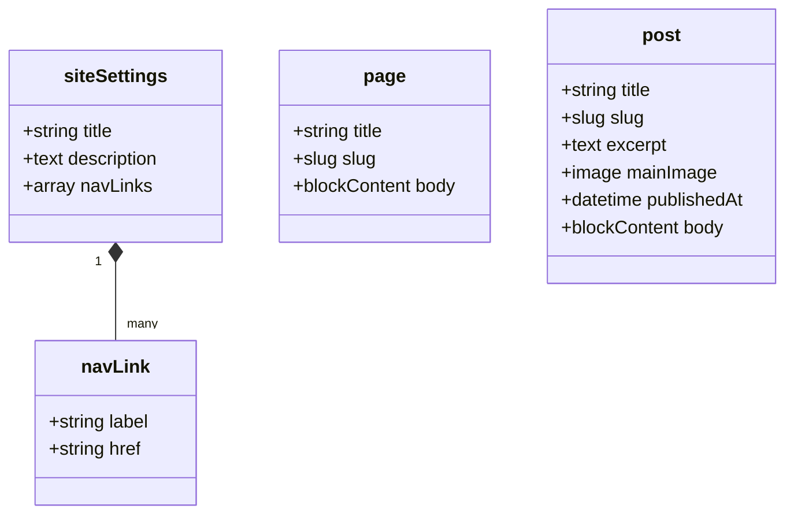

You will use three helpers from the `sanity` package:

- `defineType` declares a type, for example a document.
- `defineField` declares a field inside it.
- `defineArrayMember` declares what can go inside an array field.

> **Why the helpers:** They do nothing at runtime. They give you autocompletion and type errors while writing the schema. Without them, a typo like `tpye: 'string'` silently breaks a form.

### [Beginner] Step 19 — Add a small helper for reserved slugs

A `page` with slug `blog` would fight with the `/blog` route. We block that in the Studio with a shared helper. We will also unit test this file in Part 8.

```ts
// src/lib/format.ts
export const RESERVED_SLUGS = ['blog', 'studio', 'api'] as const

export function isReservedSlug(slug: string): boolean {
  return (RESERVED_SLUGS as readonly string[]).includes(slug.trim().toLowerCase())
}

/** Cache tag for a document type, optionally scoped to one slug: "post" or "post:hello" */
export function docTag(type: string, slug?: string | null): string {
  return slug ? `${type}:${slug}` : type
}

/** Formats an ISO date as "October 6, 2026". Uses UTC so server and tests agree. */
export function formatDate(iso: string | null | undefined, locale = 'en-US'): string {
  if (!iso) return ''
  const date = new Date(iso)
  if (Number.isNaN(date.getTime())) return ''
  return new Intl.DateTimeFormat(locale, {
    year: 'numeric',
    month: 'long',
    day: 'numeric',
    timeZone: 'UTC',
  }).format(date)
}
```

> **Gotcha:** Schema files are loaded by the Sanity CLI too, not only by Next.js. The CLI may not understand the `@/` alias, so schema files use relative imports like `../../lib/format`.

### [Beginner] Step 20 — The siteSettings schema

```ts
// src/sanity/schemaTypes/siteSettings.ts
import { defineArrayMember, defineField, defineType } from 'sanity'

export const siteSettings = defineType({
  name: 'siteSettings',
  title: 'Site settings',
  type: 'document',
  fields: [
    defineField({
      name: 'title',
      title: 'Site title',
      type: 'string',
      validation: (rule) => rule.required().max(60),
    }),
    defineField({
      name: 'description',
      title: 'Default meta description',
      type: 'text',
      rows: 3,
      validation: (rule) => rule.max(160),
    }),
    defineField({
      name: 'navLinks',
      title: 'Navigation links',
      type: 'array',
      of: [
        defineArrayMember({
          name: 'navLink',
          type: 'object',
          fields: [
            defineField({
              name: 'label',
              type: 'string',
              validation: (rule) => rule.required(),
            }),
            defineField({
              name: 'href',
              title: 'Link (for example /about or https://...)',
              type: 'string',
              validation: (rule) =>
                rule.required().custom((value) => {
                  if (!value) return true
                  return value.startsWith('/') || value.startsWith('https://')
                    ? true
                    : 'Start with / for internal links or https:// for external links'
                }),
            }),
          ],
          preview: { select: { title: 'label', subtitle: 'href' } },
        }),
      ],
    }),
  ],
})
```

> **Why max 160 on description:** Search engines usually cut meta descriptions around that length. Putting the rule in the schema means editors see the warning while typing, not after launch.

### [Beginner] Step 21 — The page schema

```ts
// src/sanity/schemaTypes/page.ts
import { defineArrayMember, defineField, defineType } from 'sanity'
import { isReservedSlug } from '../../lib/format'

export const page = defineType({
  name: 'page',
  title: 'Page',
  type: 'document',
  fields: [
    defineField({
      name: 'title',
      type: 'string',
      validation: (rule) => rule.required().max(120),
    }),
    defineField({
      name: 'slug',
      type: 'slug',
      options: { source: 'title', maxLength: 96 },
      validation: (rule) =>
        rule.required().custom((value) => {
          const current = value?.current
          if (current && isReservedSlug(current)) {
            return `"${current}" is used by the site itself. Pick another slug.`
          }
          return true
        }),
    }),
    defineField({
      name: 'body',
      type: 'array',
      of: [defineArrayMember({ type: 'block' })],
    }),
  ],
})
```

The `block` type is **Portable Text**: Sanity's rich text format. Instead of an HTML string, it stores an array of JSON blocks (paragraphs, headings, list items) with spans and marks (bold, links). You render it with React components, so you control the markup completely.

```json
[
  {
    "_type": "block",
    "_key": "a1",
    "style": "h2",
    "children": [{ "_type": "span", "_key": "b1", "text": "Our story", "marks": [] }],
    "markDefs": []
  }
]
```

> **Interview tip:** Why not store HTML? Structured rich text can be rendered safely (no `dangerouslySetInnerHTML`), restyled without migrating content, and reused in non-HTML targets like mobile apps or emails.

### [Beginner] Step 22 — The post schema

```ts
// src/sanity/schemaTypes/post.ts
import { defineArrayMember, defineField, defineType } from 'sanity'

export const post = defineType({
  name: 'post',
  title: 'Post',
  type: 'document',
  fields: [
    defineField({
      name: 'title',
      type: 'string',
      validation: (rule) => rule.required().max(120),
    }),
    defineField({
      name: 'slug',
      type: 'slug',
      options: { source: 'title', maxLength: 96 },
      validation: (rule) => rule.required(),
    }),
    defineField({
      name: 'excerpt',
      type: 'text',
      rows: 3,
      validation: (rule) => rule.max(200),
    }),
    defineField({
      name: 'mainImage',
      title: 'Main image',
      type: 'image',
      options: { hotspot: true },
      fields: [
        defineField({
          name: 'alt',
          title: 'Alternative text',
          type: 'string',
          description: 'Describe the image for screen reader users.',
          validation: (rule) =>
            rule.custom((value, context) => {
              const parent = context.parent as { asset?: unknown } | undefined
              return parent?.asset && !value ? 'Alt text is required when an image is set' : true
            }),
        }),
      ],
    }),
    defineField({
      name: 'publishedAt',
      title: 'Published at',
      type: 'datetime',
      initialValue: () => new Date().toISOString(),
      validation: (rule) => rule.required(),
    }),
    defineField({
      name: 'body',
      type: 'array',
      of: [defineArrayMember({ type: 'block' })],
    }),
  ],
  orderings: [
    {
      title: 'Published, newest first',
      name: 'publishedAtDesc',
      by: [{ field: 'publishedAt', direction: 'desc' }],
    },
  ],
  preview: {
    select: { title: 'title', subtitle: 'publishedAt', media: 'mainImage' },
  },
})
```

> **Why `hotspot: true`:** Editors can mark the important part of an image. When the image URL builder crops to a different aspect ratio, it keeps that part in frame.

Register all three:

```ts
// src/sanity/schemaTypes/index.ts
import type { SchemaTypeDefinition } from 'sanity'
import { page } from './page'
import { post } from './post'
import { siteSettings } from './siteSettings'

export const schemaTypes: SchemaTypeDefinition[] = [siteSettings, page, post]
```

**Check it works.** Reload http://localhost:3000/studio. "Site settings" opens a form with title, description and navigation links. "Pages" and "Posts" show empty lists with a create button. Try giving a page the slug `blog`: the Studio shows the reserved-slug error and the Publish button is disabled.

### [Beginner] Step 23 — Add content in the Studio

Create this content. The tests in Part 8 expect at least one post and one page.

1. **Site settings:** title `Simple Site`, description `A small website built with Next.js and Sanity.`, one nav link with label `About` and href `/about`. Click **Publish**.
2. **Pages:** a page titled `About`, click **Generate** next to slug (gives `about`), write two paragraphs and an H2 in the body. **Publish**.
3. **Posts:** a post titled `Hello world`, generate the slug, write an excerpt, upload any image with alt text, keep the default date, write a short body. **Publish**.
4. Create a second post the same way, so the blog list has more than one item.

> **Gotcha:** Editing a published document creates a **draft**. The live site only shows **published** content. If your change "does not show up", check that the Publish button is not still highlighted.

**Check it works.** Open the **Vision** tab in the Studio (top bar) and run:

```groq
*[_type == "post"]{ title, "slug": slug.current }
```

```json
[
  { "title": "Hello world", "slug": "hello-world" },
  { "title": "Second post", "slug": "second-post" }
]
```

The Content Lake is just an HTTP API. Because the `production` dataset is public, you can query it with curl and no token. Replace `abc123xy` with your project ID:

```bash
curl -s --get "https://abc123xy.api.sanity.io/v2026-10-01/data/query/production" \
  --data-urlencode 'query=*[_type == "post"]{title}'
```

```text
{"query":"*[_type == \"post\"]{title}","result":[{"title":"Hello world"},{"title":"Second post"}],"ms":4}
```

```bash
git add -A
git commit -m "feat: siteSettings, page and post schemas"
```

## 5. Fetching and rendering content

### [Beginner] Step 24 — Learn just enough GROQ

GROQ (Graph-Relational Object Queries) reads like a pipeline: **filter**, then **slice or order**, then **project** (pick fields).

```groq
*[_type == "post" && defined(slug.current)] | order(publishedAt desc) [0...3] {
  _id,
  title,
  "slug": slug.current,
  publishedAt
}
```

| Piece | Meaning |
|---|---|
| `*` | Every document in the dataset |
| `[_type == "post" && ...]` | Filter. Like `Array.filter` |
| `defined(slug.current)` | The field exists and is not null |
| `\| order(publishedAt desc)` | Sort |
| `[0...3]` | Slice: items 0, 1, 2 (three dots exclude the end) |
| `[0]` | First item only. Returns an object or `null`, not an array |
| `{ title, "slug": slug.current }` | Projection. Pick and rename fields |
| `$slug` | A parameter, passed separately. Never build queries with string concatenation |
| `author->` | Follow a reference (a join). Not needed in this site |

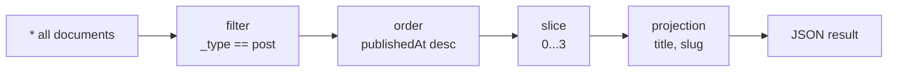

> **Gotcha:** `[0..3]` (two dots) **includes** index 3, so you get four items. `[0...3]` (three dots) gives three. This trips everyone once.

> **Interview tip:** Always pass user input as parameters (`$slug`). It is the GROQ equivalent of prepared statements in SQL. It prevents query injection and lets Sanity cache query plans.

### [Beginner] Step 25 — Write all queries with defineQuery

`defineQuery` returns the query string unchanged. Its only job is to mark the string so **TypeGen** can find it and generate a result type.

```ts
// src/sanity/lib/queries.ts
import { defineQuery } from 'next-sanity'

export const SETTINGS_QUERY = defineQuery(`*[_type == "siteSettings"][0]{
  title,
  description,
  navLinks[]{ _key, label, href }
}`)

const postFields = /* groq */ `
  _id,
  title,
  "slug": slug.current,
  excerpt,
  publishedAt,
  mainImage
`

export const POSTS_QUERY = defineQuery(`*[_type == "post" && defined(slug.current)]
  | order(publishedAt desc){ ${postFields} }`)

export const LATEST_POSTS_QUERY = defineQuery(`*[_type == "post" && defined(slug.current)]
  | order(publishedAt desc)[0...3]{ ${postFields} }`)

export const POST_QUERY = defineQuery(`*[_type == "post" && slug.current == $slug][0]{
  ${postFields},
  body
}`)

export const POST_SLUGS_QUERY = defineQuery(`*[_type == "post" && defined(slug.current)]{
  "slug": slug.current
}`)

export const PAGE_QUERY = defineQuery(`*[_type == "page" && slug.current == $slug][0]{
  _id,
  title,
  "slug": slug.current,
  body
}`)

export const PAGE_SLUGS_QUERY = defineQuery(`*[_type == "page" && defined(slug.current)]{
  "slug": slug.current
}`)

export const SITEMAP_QUERY = defineQuery(`{
  "pages": *[_type == "page" && defined(slug.current)]{ "slug": slug.current, _updatedAt },
  "posts": *[_type == "post" && defined(slug.current)]{ "slug": slug.current, _updatedAt }
}`)
```

> **Gotcha:** TypeGen understands template literals that interpolate other **constant strings** declared in the same file, like `postFields`. If it ever cannot resolve a query, it prints a warning and skips it. Inline the fields in that case.

> **Outdated:** You may see `import { groq } from 'next-sanity'` with a tagged template. `groq` only adds syntax highlighting. `defineQuery` (also exported from the standalone `groq` package) is the current way because TypeGen can type it.

### [Intermediate] Step 26 — Generate TypeScript types with TypeGen

TypeGen works in two steps. First it **extracts** your schema to `schema.json`. Then it **scans** your code for `defineQuery` calls and writes one result type per query.

Add the scripts. Open `package.json` and make the `scripts` section look like this (we add `test` and `e2e` tooling in Part 8, the scripts can be added now):

```json
{
  "scripts": {
    "dev": "next dev",
    "build": "next build",
    "start": "next start",
    "lint": "eslint .",
    "typecheck": "tsc --noEmit",
    "test": "vitest run",
    "e2e": "playwright test",
    "typegen": "sanity schema extract --enforce-required-fields && sanity typegen generate",
    "format": "prettier --write ."
  }
}
```

```bash
npm run typegen
```

```text
✓ Extracted schema to schema.json
✓ Generated TypeScript types for 15 schema types and 8 GROQ queries in 8 files into: ./src/sanity/types.ts
```

Open `src/sanity/types.ts`. Near the bottom you will find types like:

```ts
// excerpt of src/sanity/types.ts (generated, do not edit)
export type POST_QUERYResult = {
  _id: string
  title: string
  slug: string | null
  excerpt: string | null
  publishedAt: string
  mainImage: {
    asset?: { _ref: string; _type: 'reference'; _weak?: boolean }
    hotspot?: SanityImageHotspot
    crop?: SanityImageCrop
    alt?: string
    _type: 'image'
  } | null
  body: Array<{ /* Portable Text block */ }> | null
} | null
```

Your file will differ in details. The important parts: names follow the variable (`POST_QUERY` becomes `POST_QUERYResult`), optional fields are `| null`, and `[0]` queries are `| null` because the document might not exist.

> **Why `--enforce-required-fields`:** Without it every field is optional, because the Content Lake does not enforce your schema. With it, fields with `rule.required()` become non-optional in the types. Drafts can still be incomplete, so keep handling `null` where a missing value would crash.

> **Why commit the generated file:** Commit `schema.json` and `src/sanity/types.ts`. CI can then run `typecheck` without network access, and diffs show you exactly how a schema change affected your types. Re-run `npm run typegen` after every schema or query change.

### [Intermediate] Step 27 — A fetch helper with cache tags

Every page fetch goes through one helper. It does two things: caches the result in Next.js, and labels it with **tags** so the webhook can invalidate it later.

```ts
// src/sanity/lib/fetch.ts
import type { QueryParams } from 'next-sanity'
import type { SETTINGS_QUERYResult } from '../types'
import { client } from './client'
import { SETTINGS_QUERY } from './queries'

type FetchOptions = {
  query: string
  params?: QueryParams
  tags: string[]
}

export async function sanityFetch<T>({ query, params = {}, tags }: FetchOptions): Promise<T> {
  return client.fetch<T>(query, params, {
    cache: 'force-cache',
    next: { tags },
  })
}

export function getSettings() {
  return sanityFetch<SETTINGS_QUERYResult>({
    query: SETTINGS_QUERY,
    tags: ['siteSettings'],
  })
}
```

| Fetch | Tags | Invalidated when |
|---|---|---|
| Site settings | `siteSettings` | Settings published |
| Post list, latest posts | `post` | Any post published, edited or deleted |
| One post | `post:hello-world` | That post changes |
| One page | `page:about` | That page changes |

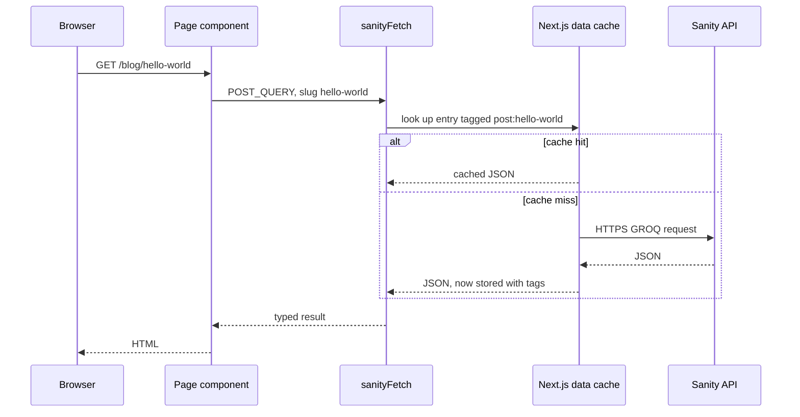

> **Why explicit `cache: 'force-cache'`:** Since Next.js 15, `fetch` is **not** cached by default. Without it, tags would have nothing to invalidate and every request would hit Sanity. The Sanity client passes `cache` and `next` through to Next.js's `fetch`.

> **Why a generic `<T>`:** We pass the generated result type explicitly, for example `sanityFetch<POST_QUERYResult>(...)`. With `overloadClientMethods`, calling `client.fetch(POST_QUERY)` directly would also be typed automatically. The wrapper takes `query: string`, which loses that inference, so we name the type ourselves. It is explicit and easy to read.

> **Outdated (and an alternative):** next-sanity also offers `defineLive` (import from `next-sanity/live`), which returns its own `sanityFetch` and a `<SanityLive />` component. It subscribes to Sanity's **Live Content API** and refreshes content automatically, with no webhook. It is a great choice, but its setup changed between next-sanity v12 and v13 (v13 is recommended for Next.js 16, and v12 caused extra API requests with Next.js 16 prefetching). This guide uses the webhook approach because it has fewer moving parts and teaches how caching actually works. Check the next-sanity docs before switching.

### [Intermediate] Step 28 — Configure next/image for Sanity images

Sanity serves images from `cdn.sanity.io`. `next/image` refuses remote hosts unless you allow them.

```ts
// next.config.ts
import type { NextConfig } from 'next'

const nextConfig: NextConfig = {
  images: {
    remotePatterns: [
      {
        protocol: 'https',
        hostname: 'cdn.sanity.io',
        pathname: '/images/**',
      },
    ],
  },
}

export default nextConfig
```

The image URL builder turns an image reference into a CDN URL with size, crop and format parameters.

```ts
// src/sanity/lib/image.ts
import { createImageUrlBuilder, type SanityImageSource } from '@sanity/image-url'
import { dataset, projectId } from '../env'

const builder = createImageUrlBuilder({ projectId, dataset })

export function urlFor(source: SanityImageSource) {
  return builder.image(source)
}
```

> **Outdated:** `@sanity/image-url` v1 used a default export: `import imageUrlBuilder from '@sanity/image-url'`. Version 2 is ESM-only and uses the named export `createImageUrlBuilder`. If you are stuck on v1, swap the import and the rest is the same.

A small component wraps it:

```tsx
// src/components/SanityImage.tsx
import Image from 'next/image'
import type { SanityImageSource } from '@sanity/image-url'
import { urlFor } from '@/sanity/lib/image'

type SanityImageProps = {
  source: SanityImageSource
  alt: string
  width: number
  height: number
  className?: string
  sizes?: string
}

export function SanityImage({
  source,
  alt,
  width,
  height,
  className,
  sizes = '(min-width: 768px) 720px, 100vw',
}: SanityImageProps) {
  const src = urlFor(source).width(width).height(height).fit('crop').auto('format').url()
  return (
    <Image src={src} alt={alt} width={width} height={height} className={className} sizes={sizes} />
  )
}
```

> **Why both width and height:** `next/image` needs them to reserve space before the image loads. That prevents layout shift, which is a Core Web Vitals metric. Asking the builder for the same size and `fit('crop')` makes the real image match the reserved box.

> **Gotcha:** We pass `mainImage.asset` (the reference) as the source. That is the simplest type-safe option, but it ignores the editor's hotspot and crop. To use them, pass the whole image object `{ asset, hotspot, crop }`. You may need a small type adapter, because the generated types mark crop fields optional.

### [Beginner] Step 29 — Render Portable Text

`next-sanity` re-exports `PortableText` from `@portabletext/react`. You pass it the blocks and, optionally, components to override how each piece renders.

```tsx
// src/components/PortableTextBody.tsx
import {
  PortableText,
  type PortableTextComponents,
  type PortableTextProps,
} from 'next-sanity'

const components: PortableTextComponents = {
  marks: {
    link: ({ children, value }) => {
      const href = typeof value?.href === 'string' ? value.href : '#'
      const isExternal = href.startsWith('http')
      return (
        <a
          href={href}
          {...(isExternal ? { target: '_blank', rel: 'noopener noreferrer' } : {})}
        >
          {children}
        </a>
      )
    },
  },
}

type PortableTextBodyProps = {
  value: PortableTextProps['value']
}

export function PortableTextBody({ value }: PortableTextBodyProps) {
  return (
    <div className="prose prose-gray max-w-none">
      <PortableText value={value} components={components} />
    </div>
  )
}
```

> **Why `prose`:** Portable Text renders plain `<h2>`, `<p>`, `<ul>`. Tailwind's preflight removes their default styles. The Typography plugin's `prose` class puts sensible styles back, only inside this container.

### [Beginner] Step 30 — A reusable post list

```tsx
// src/components/PostList.tsx
import Link from 'next/link'
import { formatDate } from '@/lib/format'
import type { POSTS_QUERYResult } from '@/sanity/types'

type PostListProps = {
  posts: POSTS_QUERYResult
}

export function PostList({ posts }: PostListProps) {
  if (posts.length === 0) {
    return <p className="text-gray-500">No posts yet.</p>
  }
  return (
    <ul className="space-y-8">
      {posts.map((post) => (
        <li key={post._id}>
          <article>
            <h2 className="text-xl font-semibold">
              <Link href={`/blog/${post.slug}`} className="hover:underline">
                {post.title}
              </Link>
            </h2>
            <p className="text-sm text-gray-500">
              <time dateTime={post.publishedAt}>{formatDate(post.publishedAt)}</time>
            </p>
            {post.excerpt ? <p className="mt-2 text-gray-700">{post.excerpt}</p> : null}
          </article>
        </li>
      ))}
    </ul>
  )
}
```

> **Gotcha:** If TypeScript says `publishedAt` is `string | null`, you ran TypeGen without `--enforce-required-fields`, or the field is not required in the schema. Use `post.publishedAt ?? undefined` for `dateTime` in that case. Let the generated types guide you, do not silence them with `as`.

### [Intermediate] Step 31 — Feed the layout from Sanity, with metadata

Replace the site layout. It now fetches settings once and passes them down. `generateMetadata` builds the default title template.

```tsx
// src/app/(site)/layout.tsx
import type { Metadata } from 'next'
import { Footer } from '@/components/Footer'
import { Header } from '@/components/Header'
import { getSettings } from '@/sanity/lib/fetch'

export async function generateMetadata(): Promise<Metadata> {
  const settings = await getSettings()
  const title = settings?.title ?? 'Simple Site'
  return {
    title: { default: title, template: `%s | ${title}` },
    description: settings?.description ?? undefined,
    openGraph: { siteName: title, type: 'website' },
  }
}

export default async function SiteLayout({
  children,
}: Readonly<{ children: React.ReactNode }>) {
  const settings = await getSettings()
  const title = settings?.title ?? 'Simple Site'

  return (
    <>
      <Header title={title} links={settings?.navLinks ?? null} />
      <main id="main" className="mx-auto max-w-3xl px-4 py-10">
        {children}
      </main>
      <Footer title={title} />
    </>
  )
}
```

> **Why fetching twice is fine:** `generateMetadata` and the layout both call `getSettings()`. Next.js memoizes identical `fetch` calls within one render, and the result is cached anyway. You get clean code without a performance cost.

### [Intermediate] Step 32 — The home page and the blog index

```tsx
// src/app/(site)/page.tsx
import Link from 'next/link'
import { PostList } from '@/components/PostList'
import { getSettings, sanityFetch } from '@/sanity/lib/fetch'
import { LATEST_POSTS_QUERY } from '@/sanity/lib/queries'
import type { LATEST_POSTS_QUERYResult } from '@/sanity/types'

export default async function HomePage() {
  const [settings, posts] = await Promise.all([
    getSettings(),
    sanityFetch<LATEST_POSTS_QUERYResult>({ query: LATEST_POSTS_QUERY, tags: ['post'] }),
  ])

  return (
    <>
      <section className="mb-12">
        <h1 className="text-4xl font-bold">{settings?.title ?? 'Simple Site'}</h1>
        {settings?.description ? (
          <p className="mt-3 text-lg text-gray-600">{settings.description}</p>
        ) : null}
      </section>
      <section aria-labelledby="latest-heading">
        <h2 id="latest-heading" className="mb-6 text-2xl font-semibold">
          Latest posts
        </h2>
        <PostList posts={posts} />
        <p className="mt-8">
          <Link href="/blog" className="text-blue-700 underline">
            All posts
          </Link>
        </p>
      </section>
    </>
  )
}
```

```tsx
// src/app/(site)/blog/page.tsx
import type { Metadata } from 'next'
import { PostList } from '@/components/PostList'
import { sanityFetch } from '@/sanity/lib/fetch'
import { POSTS_QUERY } from '@/sanity/lib/queries'
import type { POSTS_QUERYResult } from '@/sanity/types'

export const metadata: Metadata = {
  title: 'Blog',
  description: 'All posts, newest first.',
  alternates: { canonical: '/blog' },
}

export default async function BlogPage() {
  const posts = await sanityFetch<POSTS_QUERYResult>({ query: POSTS_QUERY, tags: ['post'] })

  return (
    <>
      <h1 className="mb-8 text-3xl font-bold">Blog</h1>
      <PostList posts={posts} />
    </>
  )
}
```

> **Gotcha:** `PostList` expects `POSTS_QUERYResult`, and the home page passes `LATEST_POSTS_QUERYResult`. It compiles because both queries use the same projection, so the types have the same shape. TypeScript compares shapes, not names.

**Check it works.** With `npm run dev` running, open http://localhost:3000. You see your site title and description from Sanity, your posts, and an "About" link in the header. http://localhost:3000/blog lists all posts.

### [Intermediate] Step 33 — The post page: generateStaticParams, generateMetadata, notFound

```tsx
// src/app/(site)/blog/[slug]/page.tsx
import type { Metadata } from 'next'
import { notFound } from 'next/navigation'
import { PortableTextBody } from '@/components/PortableTextBody'
import { SanityImage } from '@/components/SanityImage'
import { docTag, formatDate } from '@/lib/format'
import { client } from '@/sanity/lib/client'
import { sanityFetch } from '@/sanity/lib/fetch'
import { urlFor } from '@/sanity/lib/image'
import { POST_QUERY, POST_SLUGS_QUERY } from '@/sanity/lib/queries'
import type { POST_QUERYResult, POST_SLUGS_QUERYResult } from '@/sanity/types'

type PostPageProps = {
  params: Promise<{ slug: string }>
}

// Runs at build time: which /blog/[slug] pages to pre-render
export async function generateStaticParams() {
  const posts = await client.fetch<POST_SLUGS_QUERYResult>(POST_SLUGS_QUERY)
  return posts.flatMap((post) => (post.slug ? [{ slug: post.slug }] : []))
}

function getPost(slug: string) {
  return sanityFetch<POST_QUERYResult>({
    query: POST_QUERY,
    params: { slug },
    tags: [docTag('post', slug)],
  })
}

export async function generateMetadata({ params }: PostPageProps): Promise<Metadata> {
  const { slug } = await params
  const post = await getPost(slug)
  if (!post) return {}

  const ogImage = post.mainImage?.asset
    ? urlFor(post.mainImage.asset).width(1200).height(630).fit('crop').url()
    : undefined

  return {
    title: post.title,
    description: post.excerpt ?? undefined,
    alternates: { canonical: `/blog/${slug}` },
    openGraph: {
      type: 'article',
      title: post.title,
      description: post.excerpt ?? undefined,
      publishedTime: post.publishedAt,
      images: ogImage ? [{ url: ogImage, width: 1200, height: 630 }] : undefined,
    },
  }
}

export default async function PostPage({ params }: PostPageProps) {
  const { slug } = await params
  const post = await getPost(slug)

  if (!post) notFound()

  return (
    <article>
      <p className="text-sm text-gray-500">
        <time dateTime={post.publishedAt}>{formatDate(post.publishedAt)}</time>
      </p>
      <h1 className="mt-2 text-4xl font-bold">{post.title}</h1>
      {post.mainImage?.asset ? (
        <SanityImage
          source={post.mainImage.asset}
          alt={post.mainImage.alt ?? ''}
          width={1200}
          height={630}
          className="my-8 h-auto w-full rounded-lg"
        />
      ) : null}
      {post.body ? <PortableTextBody value={post.body} /> : null}
    </article>
  )
}
```

Things to notice:

- **`params` is a Promise.** Since Next.js 15 you must `await params`. In Next.js 16 the old synchronous access is removed.
- **`generateStaticParams` uses `client.fetch` directly.** It runs once at build time, outside any request, so it does not need tags. It also must not depend on request-only APIs like draft mode.
- **`notFound()`** throws a special error. Next.js stops rendering and shows the nearest `not-found.tsx` with a **404** status. The function's return type is `never`, so TypeScript knows `post` is not `null` after that line.
- **New posts work without a rebuild.** A slug not returned at build time is rendered on the first request (because `dynamicParams` defaults to `true`) and then cached.

> **Outdated:** `params.slug` without `await` worked in Next.js 14. In Next.js 15 it was deprecated with a warning. In Next.js 16 it is an error.

### [Intermediate] Step 34 — The page route /[slug]

Almost the same as a post, with fewer fields.

```tsx
// src/app/(site)/[slug]/page.tsx
import type { Metadata } from 'next'
import { notFound } from 'next/navigation'
import { PortableTextBody } from '@/components/PortableTextBody'
import { docTag } from '@/lib/format'
import { client } from '@/sanity/lib/client'
import { sanityFetch } from '@/sanity/lib/fetch'
import { PAGE_QUERY, PAGE_SLUGS_QUERY } from '@/sanity/lib/queries'
import type { PAGE_QUERYResult, PAGE_SLUGS_QUERYResult } from '@/sanity/types'

type PageProps = {
  params: Promise<{ slug: string }>
}

export async function generateStaticParams() {
  const pages = await client.fetch<PAGE_SLUGS_QUERYResult>(PAGE_SLUGS_QUERY)
  return pages.flatMap((page) => (page.slug ? [{ slug: page.slug }] : []))
}

function getPage(slug: string) {
  return sanityFetch<PAGE_QUERYResult>({
    query: PAGE_QUERY,
    params: { slug },
    tags: [docTag('page', slug)],
  })
}

export async function generateMetadata({ params }: PageProps): Promise<Metadata> {
  const { slug } = await params
  const page = await getPage(slug)
  if (!page) return {}
  return { title: page.title, alternates: { canonical: `/${slug}` } }
}

export default async function SanityPage({ params }: PageProps) {
  const { slug } = await params
  const page = await getPage(slug)

  if (!page) notFound()

  return (
    <article>
      <h1 className="mb-6 text-4xl font-bold">{page.title}</h1>
      {page.body ? <PortableTextBody value={page.body} /> : null}
    </article>
  )
}
```

> **Why `/blog` and `/studio` still work:** Static route segments win over dynamic ones. `/blog` matches `blog/page.tsx` before `[slug]` is considered. The reserved-slug validation from Step 21 stops editors from creating a page that could never be reached.

### [Beginner] Step 35 — The 404 page

```tsx
// src/app/not-found.tsx
import type { Metadata } from 'next'
import Link from 'next/link'

export const metadata: Metadata = {
  title: 'Page not found',
  robots: { index: false },
}

export default function NotFound() {
  return (
    <main id="main" className="mx-auto max-w-3xl px-4 py-24 text-center">
      <p className="text-sm font-semibold text-blue-700">404</p>
      <h1 className="mt-2 text-3xl font-bold">Page not found</h1>
      <p className="mt-4 text-gray-600">The page you are looking for does not exist or was moved.</p>
      <p className="mt-8">
        <Link href="/" className="text-blue-700 underline">
          Go to the home page
        </Link>
      </p>
    </main>
  )
}
```

**Check it works.** Regenerate types and run the type checker, then a production build:

```bash
npm run typegen
npm run typecheck
npm run build
```

```text
Route (app)
┌ ○ /
├ ○ /_not-found
├ ● /[slug]
│ └ /about
├ ○ /blog
├ ● /blog/[slug]
│ ├ /blog/hello-world
│ └ /blog/second-post
└ ○ /studio/[[...tool]]

○  (Static)  prerendered as static content
●  (SSG)     prerendered as static HTML (uses generateStaticParams)
```

Every content route is static. Now check the 404 status:

```bash
npm run start &
sleep 3
curl -s -o /dev/null -w "%{http_code}\n" http://localhost:3000/about
curl -s -o /dev/null -w "%{http_code}\n" http://localhost:3000/blog/does-not-exist
kill %1
```

```text
200
404
```

```bash
git add -A
git commit -m "feat: fetch and render pages, posts and settings"
```

## 6. Freshness: webhooks and draft mode

### [Intermediate] Step 36 — See the stale content problem

Run the production build (`npm run build && npm run start`), open http://localhost:3000/blog/hello-world, then change the post's title in the Studio and publish. Reload the page. The old title is still there. That is correct behaviour: the page is static and cached. We need Sanity to tell us when content changes.

### [Intermediate] Step 37 — The revalidate route handler

Generate a long random secret and put it in `.env.local`:

```bash
openssl rand -hex 32
```

```bash
# .env.local
SANITY_REVALIDATE_SECRET="paste-the-64-hex-characters-here"
```

Now the route handler. `parseBody` from `next-sanity/webhook` reads the raw body and checks the `sanity-webhook-signature` header, an HMAC of the body made with your secret. Only Sanity knows the secret, so a valid signature proves the request came from your webhook.

```ts
// src/app/api/revalidate/route.ts
import { revalidateTag } from 'next/cache'
import { type NextRequest, NextResponse } from 'next/server'
import { parseBody } from 'next-sanity/webhook'

type WebhookPayload = {
  tags?: Array<string | null>
}

export async function POST(req: NextRequest) {
  const secret = process.env.SANITY_REVALIDATE_SECRET
  if (!secret) {
    return new Response('Missing SANITY_REVALIDATE_SECRET', { status: 500 })
  }

  try {
    const { isValidSignature, body } = await parseBody<WebhookPayload>(req, secret)

    // null means the signature header was missing, false means it did not match
    if (isValidSignature !== true) {
      return new Response('Invalid signature', { status: 401 })
    }

    const tags = (body?.tags ?? []).filter(
      (tag): tag is string => typeof tag === 'string' && tag.length > 0,
    )
    if (tags.length === 0) {
      return new Response('No tags in payload', { status: 400 })
    }

    for (const tag of tags) {
      // expire: 0 means "expire now", the next request renders fresh data
      revalidateTag(tag, { expire: 0 })
    }

    return NextResponse.json({ revalidated: true, tags, now: Date.now() })
  } catch (error) {
    console.error(error)
    return new Response('Error while revalidating', { status: 500 })
  }
}
```

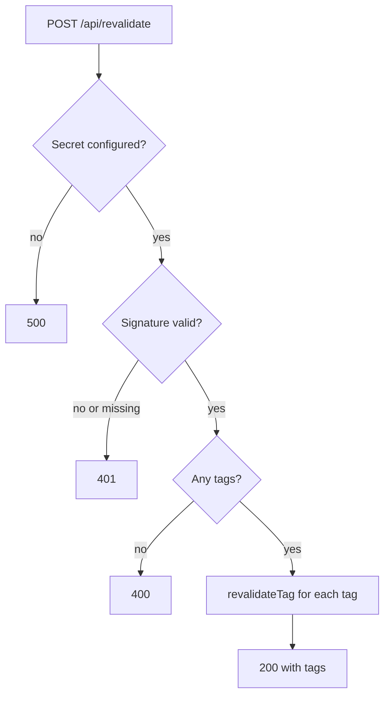

> **Why a signature instead of a `?secret=` query string:** A secret in the URL ends up in logs and browser history. An HMAC signature never sends the secret at all, and it also proves the body was not modified.

> **Outdated:** In Next.js 14 and 15 you called `revalidateTag(tag)` with one argument. In Next.js 16 the one-argument form is deprecated. Pass a cache profile: `'max'` gives stale-while-revalidate (the next visitor may still see old content once while it refreshes in the background) and `{ expire: 0 }` expires immediately, which Next.js recommends for webhooks. If your installed version's types reject `{ expire: 0 }`, use `'max'`.

> **Gotcha:** `parseBody` waits a few seconds by default before resolving. This gives the Content Lake time to make the change visible everywhere, so your re-render does not fetch the old version. Do not remove that delay to "make it faster".

**Check it works.** You cannot easily receive a real Sanity webhook on localhost (Sanity's servers cannot reach your laptop without a tunnel). But you can prove the guard works:

```bash
npm run dev
# in a second terminal
curl -s -i -X POST http://localhost:3000/api/revalidate \
  -H "Content-Type: application/json" \
  -d '{"tags":["post"]}'
```

```text
HTTP/1.1 401 Unauthorized
...
Invalid signature
```

The end-to-end check happens after deployment in the next guide. If you want it now, expose your local server with a tunnel tool and use that public URL in the webhook below.

### [Intermediate] Step 38 — Create the webhook in Sanity

Go to sanity.io/manage, pick the project, then **API**, then **Webhooks**, then **Create webhook**.

| Setting | Value |
|---|---|
| Name | `Revalidate simple-site` |
| URL | `https://YOUR-DEPLOYED-SITE/api/revalidate` (set after deploying) |
| Dataset | `production` |
| Trigger on | Create, Update, Delete |
| Filter | `_type in ["siteSettings", "page", "post"]` |
| Projection | `{"tags": [_type, _type + ":" + slug.current]}` |
| HTTP method | POST |
| API version | `v2026-10-01` |
| Drafts | Off (only published changes) |
| Secret | The same value as `SANITY_REVALIDATE_SECRET` |

The **projection** shapes the JSON body. For a post with slug `hello-world` the body is:

```json
{ "tags": ["post", "post:hello-world"] }
```

For site settings, which has no slug, `_type + ":" + slug.current` evaluates to `null`. Our handler filters out nulls, so the body becomes just `["siteSettings"]`.

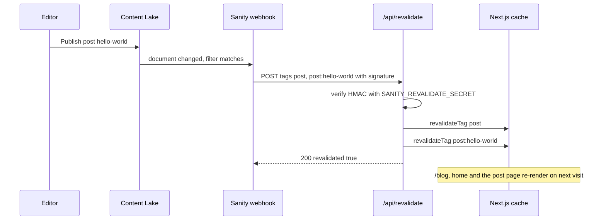

> **Interview tip:** Tag-based invalidation scales better than path-based (`revalidatePath`). A post appears on the home page, the blog index and its own page. With tags you invalidate the **data**, and every page that used it refreshes. With paths you must remember every URL that shows the post.

> **Gotcha:** The webhook's attempt log in sanity.io/manage shows each delivery with its status code. A `401` there means the secret in Sanity and in your hosting env vars do not match. Check for stray spaces or quotes.

### [Advanced] Step 39 — Draft mode preview (optional)

Editors often want to see a draft on the real site before publishing. Next.js **draft mode** sets a special cookie. When it is present, pages render on every request instead of from cache. We use that to fetch **drafts** with our Viewer token.

This step is optional. Skip it for a bare-minimum site. Everything else works without it.

Install the `server-only` guard and keep the token in its own file:

```bash
npm install server-only
```

```ts
// src/sanity/lib/token.ts
import 'server-only'

// Viewer token. Never import this file from a client component.
export const readToken = process.env.SANITY_API_READ_TOKEN ?? ''
```

> **Why `server-only`:** If anyone ever imports this file from a `'use client'` component, the build fails with a clear error instead of shipping your token to every browser.

Update the fetch helper so it switches to drafts when draft mode is on:

```ts
// src/sanity/lib/fetch.ts
import { draftMode } from 'next/headers'
import type { QueryParams } from 'next-sanity'
import type { SETTINGS_QUERYResult } from '../types'
import { client } from './client'
import { SETTINGS_QUERY } from './queries'
import { readToken } from './token'

type FetchOptions = {
  query: string
  params?: QueryParams
  tags: string[]
}

export async function sanityFetch<T>({ query, params = {}, tags }: FetchOptions): Promise<T> {
  const { isEnabled } = await draftMode()

  if (isEnabled) {
    if (!readToken) throw new Error('SANITY_API_READ_TOKEN is required for draft mode')
    return client
      .withConfig({ token: readToken, perspective: 'drafts', useCdn: false })
      .fetch<T>(query, params, { cache: 'no-store' })
  }

  return client.fetch<T>(query, params, {
    cache: 'force-cache',
    next: { tags },
  })
}

export function getSettings() {
  return sanityFetch<SETTINGS_QUERYResult>({
    query: SETTINGS_QUERY,
    tags: ['siteSettings'],
  })
}
```

Add routes to turn draft mode on and off. `defineEnableDraftMode` from next-sanity validates a short-lived secret that the Studio generates, so a random visitor cannot enable draft mode.

```ts
// src/app/api/draft-mode/enable/route.ts
import { defineEnableDraftMode } from 'next-sanity/draft-mode'
import { client } from '@/sanity/lib/client'
import { readToken } from '@/sanity/lib/token'

export const { GET } = defineEnableDraftMode({
  client: client.withConfig({ token: readToken }),
})
```

```ts
// src/app/api/draft-mode/disable/route.ts
import { draftMode } from 'next/headers'
import { type NextRequest, NextResponse } from 'next/server'

export async function GET(req: NextRequest) {
  const draft = await draftMode()
  draft.disable()
  return NextResponse.redirect(new URL('/', req.url))
}
```

Add the **Presentation** tool to the Studio, which opens your site in a preview pane and enables draft mode for it:

```ts
// sanity.config.ts (only the changed parts)
import { presentationTool } from 'sanity/presentation'

// inside defineConfig({ ... plugins: [ ... ] })
plugins: [
  structureTool({ structure }),
  presentationTool({
    previewUrl: { previewMode: { enable: '/api/draft-mode/enable' } },
  }),
  visionTool({ defaultApiVersion: apiVersion }),
],
```

Finally, show a banner in the site layout so editors know they are looking at drafts. Add this to `src/app/(site)/layout.tsx`:

```tsx
// src/app/(site)/layout.tsx (changed parts)
import { draftMode } from 'next/headers'

// inside SiteLayout, before return
const { isEnabled: isDraftMode } = await draftMode()

// first child inside the fragment
{isDraftMode ? (
  <div className="bg-amber-100 px-4 py-2 text-center text-sm">
    Previewing drafts.{' '}
    <a href="/api/draft-mode/disable" className="underline">
      Exit preview
    </a>
  </div>
) : null}
```

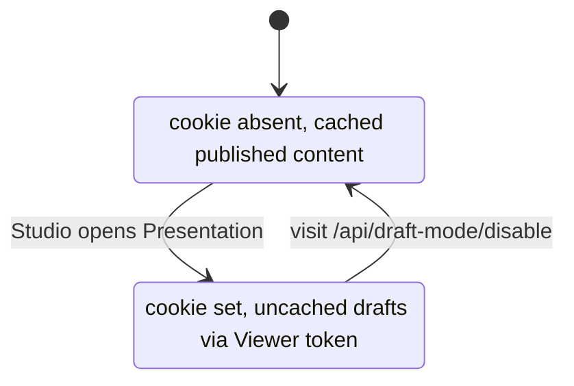

> **Gotcha:** `generateStaticParams`, `sitemap.ts` and other build-time code must not call `sanityFetch`, because `draftMode()` needs a request. That is why they use `client.fetch` directly.

> **Why so brief:** Full **visual editing** (click-to-edit overlays in the preview) adds `<VisualEditing />` from `next-sanity/visual-editing` and stega-encoded strings. It is powerful but not bare minimum. Add it once the basic site is live.

**Check it works.** Edit a post title in the Studio without publishing. Open the **Presentation** tool. The preview pane shows the draft title and the amber banner. Visit http://localhost:3000/blog/hello-world in a normal browser window: it still shows the published title.

```bash
git add -A
git commit -m "feat: webhook revalidation and draft mode"
```

## 7. SEO and polish

### [Beginner] Step 40 — Review how metadata flows

You already wrote most of the metadata. Here is how the pieces combine. Next.js resolves metadata from the root layout down to the page. A child's fields override the parent's.

| Where | What it sets |
|---|---|
| `app/layout.tsx` | `metadataBase` from `NEXT_PUBLIC_SITE_URL` |
| `(site)/layout.tsx` | Title template `%s \| Site title`, default description, `openGraph.siteName` |
| `blog/page.tsx` | Title `Blog`, canonical `/blog` |
| `blog/[slug]/page.tsx` | Post title, excerpt, canonical, Open Graph article with image |
| `[slug]/page.tsx` | Page title, canonical |
| `not-found.tsx` | `noindex` |
| `studio/[[...tool]]` | `noindex` (from `next-sanity/studio`) |

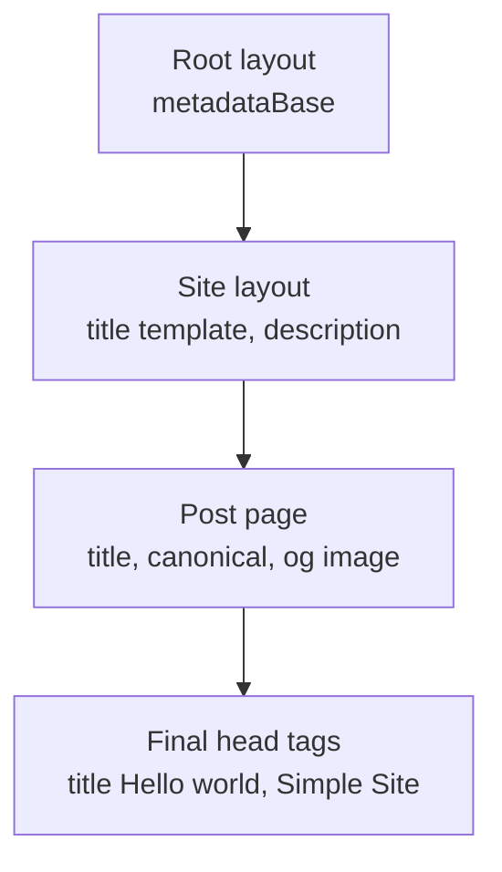

**Check it works.** With the production server running, look at the head of a post:

```bash
curl -s http://localhost:3000/blog/hello-world | grep -oE '<title>[^<]*</title>|<link rel="canonical"[^>]*>|<meta property="og:image"[^>]*>'
```

```text
<title>Hello world | Simple Site</title>
<link rel="canonical" href="http://localhost:3000/blog/hello-world"/>
<meta property="og:image" content="https://cdn.sanity.io/images/abc123xy/production/...-1200x630.jpg?rect=...&w=1200&h=630"/>
```

> **Interview tip:** A canonical URL tells search engines which URL is the "real" one when the same content is reachable at several URLs (with query strings, trailing slashes, preview domains). It prevents duplicate-content dilution.

### [Beginner] Step 41 — sitemap.ts

A sitemap lists every public URL so search engines find new posts quickly. In the App Router, a `sitemap.ts` file that exports a function becomes `/sitemap.xml`.

```ts
// src/app/sitemap.ts
import type { MetadataRoute } from 'next'
import { client } from '@/sanity/lib/client'
import { SITEMAP_QUERY } from '@/sanity/lib/queries'
import type { SITEMAP_QUERYResult } from '@/sanity/types'

const siteUrl = process.env.NEXT_PUBLIC_SITE_URL ?? 'http://localhost:3000'

export default async function sitemap(): Promise<MetadataRoute.Sitemap> {
  const { pages, posts } = await client.fetch<SITEMAP_QUERYResult>(
    SITEMAP_QUERY,
    {},
    { cache: 'force-cache', next: { tags: ['page', 'post'] } },
  )

  const staticRoutes: MetadataRoute.Sitemap = [
    { url: `${siteUrl}/`, changeFrequency: 'weekly', priority: 1 },
    { url: `${siteUrl}/blog`, changeFrequency: 'weekly', priority: 0.8 },
  ]

  const pageRoutes: MetadataRoute.Sitemap = pages.flatMap((page) =>
    page.slug ? [{ url: `${siteUrl}/${page.slug}`, lastModified: new Date(page._updatedAt) }] : [],
  )

  const postRoutes: MetadataRoute.Sitemap = posts.flatMap((post) =>
    post.slug
      ? [{ url: `${siteUrl}/blog/${post.slug}`, lastModified: new Date(post._updatedAt) }]
      : [],
  )

  return [...staticRoutes, ...pageRoutes, ...postRoutes]
}
```

> **Why tags here too:** The sitemap is cached like a page. Tagging it with `page` and `post` means the same webhook refreshes it when content is added or removed.

### [Beginner] Step 42 — robots.ts

```ts
// src/app/robots.ts
import type { MetadataRoute } from 'next'

const siteUrl = process.env.NEXT_PUBLIC_SITE_URL ?? 'http://localhost:3000'

export default function robots(): MetadataRoute.Robots {
  return {
    rules: [{ userAgent: '*', allow: '/', disallow: ['/studio', '/api/'] }],
    sitemap: `${siteUrl}/sitemap.xml`,
  }
}
```

> **Gotcha:** `robots.txt` is a polite request, not security. The Studio is protected by Sanity login, and `/api/revalidate` by the signature. The `disallow` only keeps them out of search results.

**Check it works.**

```bash
npm run build && npm run start &
sleep 5
curl -s http://localhost:3000/robots.txt
curl -s http://localhost:3000/sitemap.xml | head -12
```

```text
User-Agent: *
Allow: /
Disallow: /studio
Disallow: /api/

Sitemap: http://localhost:3000/sitemap.xml
<?xml version="1.0" encoding="UTF-8"?>
<urlset xmlns="http://www.sitemaps.org/schemas/sitemap/0.9">
<url>
<loc>http://localhost:3000/</loc>
<changefreq>weekly</changefreq>
<priority>1</priority>
</url>
...
```

### [Intermediate] Step 43 — A default Open Graph image

When someone shares your home page on Slack or LinkedIn, the platform shows an image from the `og:image` tag. Posts already use their main image. For everything else, generate a simple default with `ImageResponse`. A file named `opengraph-image.tsx` is picked up automatically.

```tsx
// src/app/opengraph-image.tsx
import { ImageResponse } from 'next/og'

export const alt = 'Simple Site'
export const size = { width: 1200, height: 630 }
export const contentType = 'image/png'

export default function OpengraphImage() {
  return new ImageResponse(
    (
      <div
        style={{
          width: '100%',
          height: '100%',
          display: 'flex',
          flexDirection: 'column',
          justifyContent: 'center',
          padding: 80,
          background: '#0f172a',
          color: '#ffffff',
        }}
      >
        <div style={{ fontSize: 72, fontWeight: 700 }}>Simple Site</div>
        <div style={{ fontSize: 32, marginTop: 24, color: '#cbd5e1' }}>
          Built with Next.js and Sanity
        </div>
      </div>
    ),
    { ...size },
  )
}
```

> **Gotcha:** `ImageResponse` supports a subset of CSS (flexbox, no grid) and every `div` with more than one child needs `display: 'flex'`. If the image fails to render, check the dev server log for that message first.

> **Why hard-coded text:** It keeps the image static and build-time only. You could fetch the site title from Sanity here with `client.fetch`, at the cost of one more query per build.

**Check it works.** Open http://localhost:3000/opengraph-image in the browser. You see the dark 1200 by 630 image. View the source of the home page and find `<meta property="og:image" ...>` pointing to it. A post page should still point to its own Sanity image, because the page's metadata overrides the root default.

### [Beginner] Step 44 — Accessibility checks

Small sites fail accessibility in the same few places. Walk this list once, then automate it with the axe test in Part 8.

| Check | Where we handled it |
|---|---|
| Page language set | `<html lang="en">` in the root layout |
| Skip link to main content | First element in `Header`, target `<main id="main">` |
| Landmarks | `<header>`, `<nav aria-label="Main">`, `<main>`, `<footer>` |
| Exactly one `h1` per page | Home, blog, post, page and 404 each have one |
| Images have alt text | Schema requires alt when an image is set, `SanityImage` requires `alt` |
| Visible keyboard focus | `:focus-visible` outline in `globals.css` |
| Readable contrast | Gray text is `gray-500` or darker on white |
| Meaningful link text | Post titles are the links, no "click here" |
| Dates are machine readable | `<time dateTime="...">` |
| External links in rich text | `rel="noopener noreferrer"` |

**Check it works.** Tab through the home page with the keyboard only. The first Tab shows "Skip to content". Enter jumps focus to the main area. Every link has a visible outline. Then open Chrome DevTools, the **Lighthouse** tab, select **Accessibility** and **SEO**, and run it on the home page and a post. Aim for 100 on both. Fix anything it reports before moving on.

> **Finance tip:** Many financial institutions have legal accessibility obligations (for example WCAG 2.1 AA). Putting `alt` validation in the CMS schema moves the responsibility to the moment content is created, which is far cheaper than auditing after publication.

```bash
git add -A
git commit -m "feat: sitemap, robots, OG image, a11y polish"
```

## 8. Quality: linting, tests and docs

### [Beginner] Step 45 — ESLint and Prettier

`create-next-app` set up ESLint with a flat config. Add Prettier for formatting and turn off the ESLint rules that would fight with it.

```bash
npm install -D prettier eslint-config-prettier
```

```js
// eslint.config.mjs
import { defineConfig, globalIgnores } from 'eslint/config'
import nextVitals from 'eslint-config-next/core-web-vitals'
import nextTs from 'eslint-config-next/typescript'
import prettier from 'eslint-config-prettier/flat'

export default defineConfig([
  ...nextVitals,
  ...nextTs,
  prettier,
  globalIgnores([
    '.next/**',
    'out/**',
    'build/**',
    'next-env.d.ts',
    'src/sanity/types.ts',
    'playwright-report/**',
    'test-results/**',
  ]),
])
```

```json
// .prettierrc
{
  "semi": false,
  "singleQuote": true,
  "printWidth": 100,
  "trailingComma": "all"
}
```

```text
# .prettierignore
.next
node_modules
src/sanity/types.ts
schema.json
playwright-report
test-results
```

> **Outdated:** `next lint` was removed in Next.js 16, and `next build` no longer runs the linter. That is why our `lint` script calls `eslint .` directly, and why CI (next guide) runs `lint` as its own step.

> **Gotcha:** If your `eslint.config.mjs` from `create-next-app` looks different (older versions used `FlatCompat`), keep its structure and just add the `prettier` import and the extra ignores. The exact export names of `eslint-config-next` changed between versions.

**Check it works.**

```bash
npm run format
npm run lint
npm run typecheck
```

```text
> simple-site@0.1.0 lint
> eslint .

> simple-site@0.1.0 typecheck
> tsc --noEmit
```

No output after the command lines means no problems.

### [Beginner] Step 46 — A Vitest unit test

Unit tests are for pure logic: input in, output out, no network. Our `format.ts` helpers are perfect. They decide cache tags and reserved slugs, so a bug there would break revalidation or routing silently.

```bash
npm install -D vitest
```

```ts
// vitest.config.ts
import { fileURLToPath } from 'node:url'
import { defineConfig } from 'vitest/config'

export default defineConfig({
  resolve: {
    alias: { '@': fileURLToPath(new URL('./src', import.meta.url)) },
  },
  test: {
    environment: 'node',
    include: ['src/**/*.test.ts'],
  },
})
```

```ts
// src/lib/format.test.ts
import { describe, expect, it } from 'vitest'
import { docTag, formatDate, isReservedSlug } from './format'

describe('docTag', () => {
  it('returns the bare type when there is no slug', () => {
    expect(docTag('post')).toBe('post')
    expect(docTag('siteSettings', null)).toBe('siteSettings')
  })

  it('matches the webhook projection format type:slug', () => {
    expect(docTag('post', 'hello-world')).toBe('post:hello-world')
  })
})

describe('isReservedSlug', () => {
  it('blocks slugs that collide with app routes', () => {
    expect(isReservedSlug('blog')).toBe(true)
    expect(isReservedSlug(' Studio ')).toBe(true)
  })

  it('allows normal slugs', () => {
    expect(isReservedSlug('about')).toBe(false)
  })
})

describe('formatDate', () => {
  it('formats in UTC so the day does not shift by timezone', () => {
    expect(formatDate('2026-10-06T23:30:00Z')).toBe('October 6, 2026')
  })

  it('returns an empty string for missing or invalid input', () => {
    expect(formatDate(null)).toBe('')
    expect(formatDate(undefined)).toBe('')
    expect(formatDate('not a date')).toBe('')
  })
})
```

**Check it works.**

```bash
npm test
```

```text
 RUN  v3.x /home/you/simple-site

 ✓ src/lib/format.test.ts (6 tests) 4ms

 Test Files  1 passed (1)
      Tests  6 passed (6)
```

Break it on purpose: change `${type}:${slug}` to `${type}-${slug}` in `docTag`, run `npm test`, watch it fail, then revert.

> **Interview tip:** The `docTag` test is really a **contract test** between two systems: the GROQ projection in the Sanity webhook and the tags in your fetch calls. If they drift apart, nothing errors, content just stops refreshing. Cheap tests on such seams catch the worst bugs.

### [Intermediate] Step 47 — A Playwright smoke test

End-to-end (e2e) tests drive a real browser against the real built site. Keep them few and broad: "does the site basically work?"

```bash
npm install -D @playwright/test @axe-core/playwright
npx playwright install chromium
```

```ts
// playwright.config.ts
import { defineConfig, devices } from '@playwright/test'

const PORT = 3000

export default defineConfig({
  testDir: './tests/e2e',
  fullyParallel: true,
  forbidOnly: !!process.env.CI,
  retries: process.env.CI ? 2 : 0,
  reporter: process.env.CI ? 'github' : 'list',
  use: {
    baseURL: `http://localhost:${PORT}`,
    trace: 'on-first-retry',
  },
  projects: [{ name: 'chromium', use: { ...devices['Desktop Chrome'] } }],
  // Tests run against the production build. Run `npm run build` first.
  webServer: {
    command: 'npm run start',
    url: `http://localhost:${PORT}`,
    reuseExistingServer: !process.env.CI,
    timeout: 120_000,
  },
})
```

```ts
// tests/e2e/smoke.spec.ts
import { expect, test } from '@playwright/test'

test('home page loads with header and heading', async ({ page }) => {
  await page.goto('/')
  await expect(page.getByRole('banner')).toBeVisible()
  await expect(page.getByRole('heading', { level: 1 })).toBeVisible()
  await expect(page.getByRole('navigation', { name: 'Main' })).toBeVisible()
})

test('a blog post opens from the blog index', async ({ page }) => {
  await page.goto('/blog')
  const firstLink = page.getByRole('article').first().getByRole('link').first()
  const title = (await firstLink.textContent())?.trim() ?? ''
  expect(title).not.toBe('')

  await firstLink.click()

  await expect(page).toHaveURL(/\/blog\/.+/)
  await expect(page.getByRole('heading', { level: 1 })).toHaveText(title)
})

test('unknown URLs return 404', async ({ page }) => {
  const response = await page.goto('/this-page-does-not-exist')
  expect(response?.status()).toBe(404)
  await expect(page.getByRole('heading', { name: 'Page not found' })).toBeVisible()
})
```

```ts
// tests/e2e/a11y.spec.ts
import AxeBuilder from '@axe-core/playwright'
import { expect, test } from '@playwright/test'

for (const path of ['/', '/blog']) {
  test(`no automatically detectable a11y violations on ${path}`, async ({ page }) => {
    await page.goto(path)
    const results = await new AxeBuilder({ page }).analyze()
    expect(results.violations).toEqual([])
  })
}
```

Add Playwright's output folders to `.gitignore`:

```text
# .gitignore (append)
/test-results/
/playwright-report/
/playwright/.cache/
```

**Check it works.**

```bash
npm run build
npm run e2e
```

```text
Running 5 tests using 4 workers

  ✓  1 [chromium] › tests/e2e/smoke.spec.ts:3:5 › home page loads with header and heading (620ms)
  ✓  2 [chromium] › tests/e2e/smoke.spec.ts:10:5 › a blog post opens from the blog index (840ms)
  ✓  3 [chromium] › tests/e2e/smoke.spec.ts:22:5 › unknown URLs return 404 (310ms)
  ✓  4 [chromium] › tests/e2e/a11y.spec.ts:5:7 › no automatically detectable a11y violations on / (1.1s)
  ✓  5 [chromium] › tests/e2e/a11y.spec.ts:5:7 › no automatically detectable a11y violations on /blog (1.0s)

  5 passed (4.2s)
```

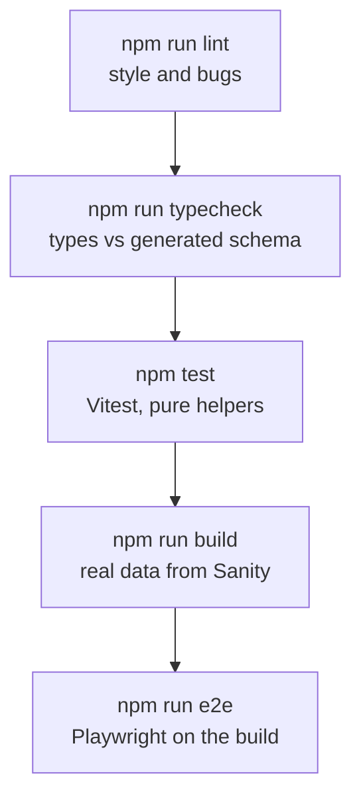

> **Why test against content:** These tests need at least one published post. That makes them a little coupled to the CMS, but it is the honest test: "the real site, with real data, works". The next guide runs them in CI with the same env vars.

> **Gotcha:** Getting elements by **role** (`getByRole('heading', { level: 1 })`) instead of CSS classes makes tests survive styling changes. As a bonus, if a role query cannot find something, a screen reader probably cannot either.

### [Beginner] Step 48 — .env.example and README

`.env.example` documents every variable without values. It **is** committed. Allow it in `.gitignore` explicitly, because `.env*` would otherwise ignore it:

```text
# .gitignore (append)
!.env.example
```

```bash
# .env.example
# Public: safe to expose
NEXT_PUBLIC_SANITY_PROJECT_ID=
NEXT_PUBLIC_SANITY_DATASET=production
NEXT_PUBLIC_SITE_URL=http://localhost:3000

# Secret: server only, never commit real values
# Viewer token from sanity.io/manage, API, Tokens (used by draft mode)
SANITY_API_READ_TOKEN=
# Random string, same value as the Sanity webhook secret. openssl rand -hex 32
SANITY_REVALIDATE_SECRET=
```

````markdown
<!-- README.md -->
# simple-site

A small website built with Next.js (App Router), TypeScript, Tailwind CSS and Sanity.
The Sanity Studio is embedded at `/studio`.

## Requirements

- Node.js 22 or newer
- Access to the Sanity project (ask an admin to invite you)

## Setup

```bash
npm install
cp .env.example .env.local   # then fill in the values
npm run dev                  # http://localhost:3000 and http://localhost:3000/studio
```

## Scripts

| Script | What it does |
|---|---|
| `npm run dev` | Dev server with hot reload |
| `npm run build` | Production build (fetches content from Sanity) |
| `npm run start` | Serve the production build |
| `npm run lint` | ESLint |
| `npm run typecheck` | TypeScript, no emit |
| `npm test` | Vitest unit tests |
| `npm run e2e` | Playwright tests (run `npm run build` first) |
| `npm run typegen` | Regenerate `schema.json` and `src/sanity/types.ts` after schema or query changes |
| `npm run format` | Prettier |

## Content model

- `siteSettings` (singleton): title, description, nav links
- `page`: title, slug, body. Served at `/[slug]`
- `post`: title, slug, excerpt, main image, published date, body. Served at `/blog/[slug]`

## Content freshness

Pages are static. A Sanity webhook calls `POST /api/revalidate` on publish,
which calls `revalidateTag` for the tags in the payload (`post`, `post:<slug>`, ...).
See the webhook settings table in the docs.
````

Final check of the whole pipeline:

```bash
npm run lint && npm run typecheck && npm test && npm run build && npm run e2e
```

When all five pass, the site is done.

```bash
git add -A
git commit -m "chore: lint, format, unit and e2e tests, docs"
```

> **Interview tip:** If you are asked "what makes a project ready to hand over?", list exactly these: a one-command setup in the README, an `.env.example`, scripts that a CI server can run unchanged, and tests that fail when the important thing breaks.

## 9. Interview questions

#### Q: What is a headless CMS, and why pair Sanity with Next.js instead of using a traditional CMS?

A headless CMS stores structured content and serves it through an API, with no built-in front end. Sanity gives editors a customizable Studio and a hosted Content Lake. Next.js renders the site, so the team keeps full control of markup, performance and SEO. Content is JSON, so the same documents can feed other channels later. The trade-off: you build and maintain the front end yourself, and you need a strategy for freshness (webhooks or live updates) because pages are cached.

#### Q: How does content get from "Publish" in the Studio to an updated page without a redeploy?

Pages fetch data with `cache: 'force-cache'` and `next: { tags }`. On publish, a Sanity webhook (filtered to our types) POSTs a projection like `{"tags": ["post", "post:hello"]}` to `/api/revalidate`. The handler verifies the HMAC signature with `parseBody`, then calls `revalidateTag(tag, { expire: 0 })` for each tag. Every cached fetch with those tags is invalidated, and the next request re-renders the affected pages and caches them again.

#### Q: Why tag-based revalidation instead of revalidatePath or a short time-based revalidate?

Time-based revalidation is either stale (long interval) or wasteful (short interval). `revalidatePath` needs you to know every URL that shows a piece of content: a post shows on the home page, the blog index, the post page and the sitemap. Tags describe the **data** instead. Every page that used `post` data is refreshed automatically, including pages you add later.

#### Q: What does `defineQuery` plus `sanity typegen` give you, and what are its limits?

`defineQuery` marks a GROQ string so TypeGen can find it. `sanity schema extract` turns the schema into `schema.json`, and `sanity typegen generate` writes a result type per query (for example `POST_QUERYResult`). Front-end code then fails to compile if it reads a field the query does not return. Limits: the Content Lake does not enforce the schema, so types describe what **should** be there. Old documents or drafts can still miss fields, and you must re-run TypeGen after every schema or query change (ideally checked in CI).

#### Q: How do you render rich text from Sanity safely?

Sanity stores rich text as Portable Text: an array of typed JSON blocks, not HTML. You render it with `<PortableText>` and a components map, which produces React elements. There is no `dangerouslySetInnerHTML`, so no HTML injection. You control every element: links get `rel="noopener noreferrer"`, headings get your classes, and custom block types (images, callouts) map to your own components.

#### Q: Which Sanity values are safe to expose to the browser, and how do you protect the rest?

Project ID and dataset are public identifiers, so `NEXT_PUBLIC_` is fine. Tokens and the webhook secret are not. They have no `NEXT_PUBLIC_` prefix, so Next.js never bundles them for the browser. The token lives in a `server-only` module, has the smallest role that works (Viewer), and is rotated if leaked. The webhook uses an HMAC signature rather than a secret in the URL.

#### Q: How do you handle a slug that does not exist, and a post published after the last build?

The page fetches by slug and calls `notFound()` when the result is `null`. That renders `not-found.tsx` with a real 404 status, which matters for SEO. For new content, `generateStaticParams` only lists slugs known at build time. Because `dynamicParams` defaults to `true`, an unknown slug is rendered on its first request, then cached and tagged like the others. No rebuild needed.

#### Q: What would you add next to this bare-minimum site, and in what order?

First, CI/CD: run lint, typecheck, unit tests, build and e2e on every pull request, and deploy previews. Second, image quality: use the editor's hotspot and crop, and LQIP placeholders. Third, editor experience: visual editing with the Presentation tool, or next-sanity's `defineLive` for automatic live updates. Fourth, content model growth: authors and categories as references, with tags added to the webhook projection. Each step is independent, which is the point of starting small.

## Cheatsheet

**Create and run**

```bash
npx create-next-app@latest simple-site --ts --tailwind --eslint --app --src-dir --import-alias "@/*" --use-npm
npx sanity@latest init                         # project, dataset, embedded Studio at /studio
npm install @sanity/image-url
npx sanity cors add http://localhost:3000 --credentials
npm run dev                                    # site :3000, Studio :3000/studio
```

**Day-to-day**

```bash
npm run typegen        # after any schema or query change
npm run lint && npm run typecheck && npm test
npm run build && npm run e2e
npx sanity dataset list
npx sanity cors list
```

**Environment variables**

| Name | Public | Purpose |
|---|---|---|
| `NEXT_PUBLIC_SANITY_PROJECT_ID` | Yes | Project |
| `NEXT_PUBLIC_SANITY_DATASET` | Yes | `production` |
| `NEXT_PUBLIC_SITE_URL` | Yes | Absolute URLs, sitemap, robots |
| `SANITY_API_READ_TOKEN` | No | Draft mode (Viewer token) |
| `SANITY_REVALIDATE_SECRET` | No | Webhook HMAC secret |

**GROQ**

```groq
*[_type == "post"]                                   // all posts
*[_type == "post" && slug.current == $slug][0]       // one or null
*[_type == "post"] | order(publishedAt desc)[0...3]  // latest three (three dots exclude end)
{ title, "slug": slug.current }                      // projection with rename
*[_type == "post" && defined(slug.current)]          // field exists
author->name                                         // follow a reference
```

**Fetching pattern**

```ts
const post = await sanityFetch<POST_QUERYResult>({
  query: POST_QUERY,
  params: { slug },
  tags: [docTag('post', slug)],
})
if (!post) notFound()
```

**Revalidation**

```ts
// app/api/revalidate/route.ts
const { isValidSignature, body } = await parseBody<{ tags?: Array<string | null> }>(req, secret)
if (isValidSignature !== true) return new Response('Invalid signature', { status: 401 })
revalidateTag(tag, { expire: 0 }) // Next.js 16: profile argument required in practice
```

Webhook: filter `_type in ["siteSettings", "page", "post"]`, projection `{"tags": [_type, _type + ":" + slug.current]}`, POST to `/api/revalidate`, secret = `SANITY_REVALIDATE_SECRET`.

**Images**

```ts
import { createImageUrlBuilder } from '@sanity/image-url' // v2 named export
urlFor(image.asset).width(1200).height(630).fit('crop').auto('format').url()
// next.config.ts: images.remotePatterns hostname cdn.sanity.io, pathname /images/**
```

**Next.js 16 reminders**

- `params` and `searchParams` are Promises: `const { slug } = await params`.
- `fetch` is not cached by default: pass `cache: 'force-cache'` plus `next: { tags }`.
- `revalidateTag(tag, profile)`: use `'max'` or `{ expire: 0 }`.
- `next lint` is gone: use `eslint .`. `next build` does not lint.
- `draftMode()` is async and needs a request: not in `generateStaticParams` or `sitemap.ts`.

**File map**

| File | Job |
|---|---|
| `sanity.config.ts` | Studio config: schemas, plugins, basePath `/studio` |
| `sanity.cli.ts` | CLI config: project, dataset, TypeGen paths |
| `src/sanity/schemaTypes/*` | Content model |
| `src/sanity/lib/queries.ts` | All GROQ, wrapped in `defineQuery` |
| `src/sanity/types.ts` | Generated types, never edit by hand |
| `src/sanity/lib/fetch.ts` | Cached, tagged, draft-aware fetch |
| `src/app/api/revalidate/route.ts` | Webhook receiver |
| `src/app/sitemap.ts`, `robots.ts`, `opengraph-image.tsx` | SEO files |
