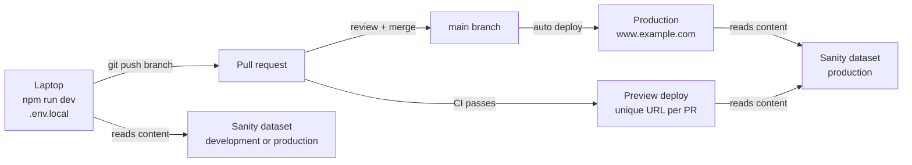
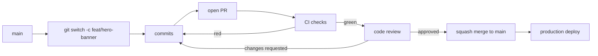
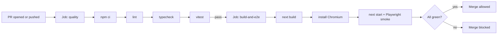
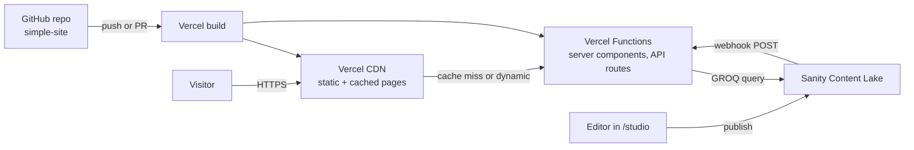
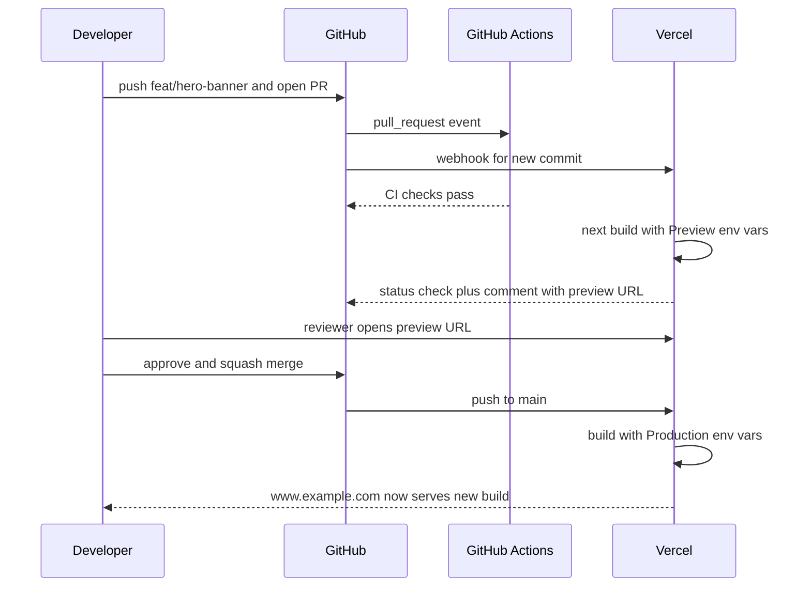
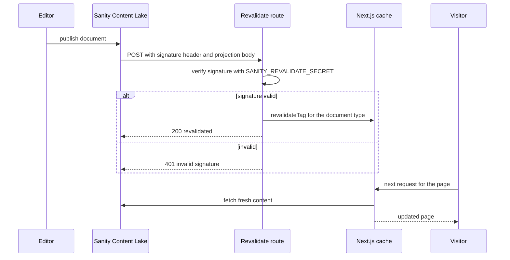
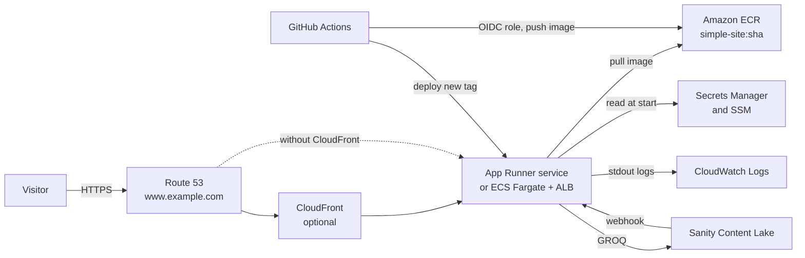
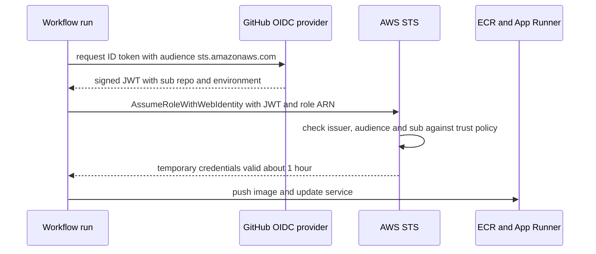
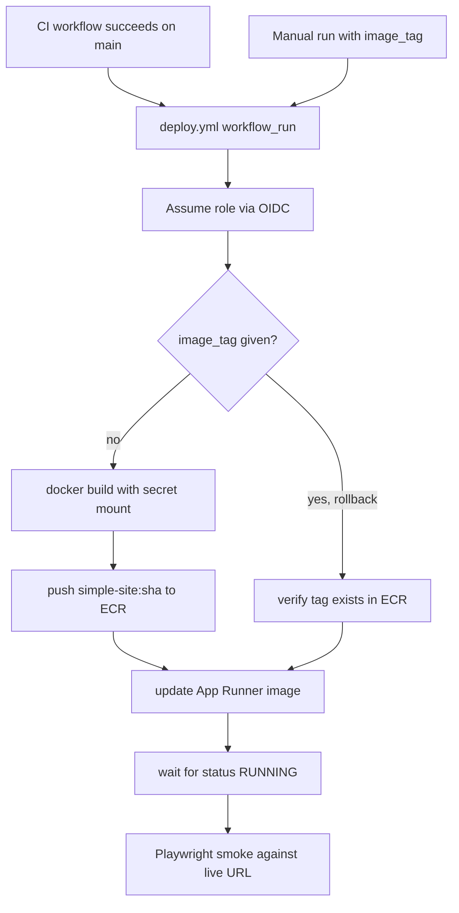
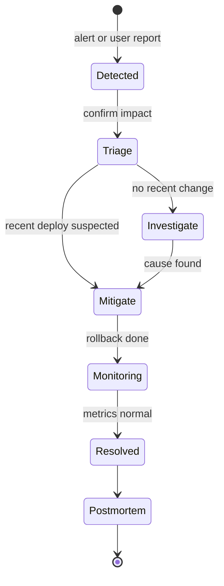

This guide continues the `simple-site` build. You already have a Next.js 16 App Router app (TypeScript, Tailwind,
`src/` folder) with Sanity Studio embedded at `/studio`, an on-demand revalidation route at `/api/revalidate`
that a Sanity webhook calls, and these scripts in `package.json`: `dev`, `build`, `start`, `lint`, `typecheck`,
`test` (Vitest) and `e2e` (Playwright).

Now you make it production-ready. You will:

- Set up the GitHub repo so secrets never leak and every change goes through a pull request.
- Write a CI workflow that lints, type-checks, tests, builds and smoke-tests every PR.
- Deploy it two ways: Path A on Vercel (the easy default) and Path B on AWS with Docker (the "I need to own
  the infrastructure" route).
- Finish with a go-live checklist, backups and basic incident handling.

You do not need to do both paths. Read Path A first even if you plan to use AWS, because it explains the
environment model both paths share.

> **Outdated:** Cloud products move fast. Everything below was checked in October 2026. The biggest recent
> change: AWS App Runner is no longer open to new customers (existing accounts can keep using it). AWS now
> points new users to Amazon ECS Express Mode. Path B covers both. Always check the current docs before you
> rely on a version number or price in this guide.

## 1. What "production-ready" means for a bare-minimum site

### [Beginner] Step 1 — Write down your production checklist

"Production-ready" sounds big. For a small marketing or content site it means a short, concrete list. If you
can tick every item, you can ship.

| Area | Bare minimum | Why it matters |
| --- | --- | --- |
| Source control | Code on GitHub, `main` is protected | Nobody can push broken code straight to production |
| Secrets | No secrets in git, `.env.example` documents them | Leaked tokens are the most common real-world breach |
| CI | Lint, typecheck, unit tests, build, smoke test on every PR | Mistakes are caught before a human reviews |
| Environments | Separate preview and production config | You can test safely without touching real users |
| Deploys | Automatic on merge to `main` | Releases are boring and repeatable |
| Rollback | One click or one command | Bad deploys get fixed in minutes, not hours |
| HTTPS + domain | Custom domain with a valid certificate | Trust, SEO, and browsers require it |
| Content flow | Sanity webhook hits the production URL | Editors see their changes go live |
| Observability | Logs, error tracking, uptime check | You hear about outages before your users tell you |
| Security headers | CSP basics, HSTS, frame protection | Cheap protection against common attacks |
| Backups | Scheduled Sanity dataset export | Content is the one thing you cannot redeploy |

> **Why:** A checklist turns a vague feeling ("is it ready?") into a yes/no question. Interviewers like this
> too: being able to list what "ready" means shows you think beyond writing features.

### [Beginner] Step 2 — Understand the three environments

An environment is one running copy of your app with its own configuration. You will have three.

- **Development (dev):** your laptop. `npm run dev`. Uses `.env.local`. Can point at a dev Sanity dataset.
- **Preview:** a temporary, real deployment for each pull request. Reviewers click a link and see the change.
- **Production (prod):** the real site at your domain. Only `main` deploys here.



Each environment gets its own values for the same variable names:

| Variable | Dev | Preview | Production |
| --- | --- | --- | --- |
| `NEXT_PUBLIC_SANITY_PROJECT_ID` | same project | same project | same project |
| `NEXT_PUBLIC_SANITY_DATASET` | `development` or `production` | `production` | `production` |
| `SANITY_API_READ_TOKEN` | your token | read token | read token |
| `SANITY_REVALIDATE_SECRET` | any local string | optional | strong random secret |
| `NEXT_PUBLIC_SITE_URL` | `http://localhost:3000` | the preview URL | `https://www.example.com` |

> **Gotcha:** Variables starting with `NEXT_PUBLIC_` are inlined into the JavaScript bundle at **build time**.
> Changing them later in a dashboard does nothing until you rebuild. Server-only variables (like
> `SANITY_API_READ_TOKEN`) are read at runtime by server code. This difference bites hard in Docker (Step 25).

> **Why:** Many small teams share one Sanity dataset across preview and production because content is
> curated by editors, not generated by tests. That is fine to start. Split datasets when you need to test
> schema migrations without touching live content.

### [Beginner] Step 3 — Pick a branch strategy: trunk-based with short-lived branches

Keep it simple. One long-lived branch, `main`, which is always deployable. Every change is a short-lived
feature branch that becomes a pull request (PR).



Naming convention (optional but helpful): `feat/...`, `fix/...`, `chore/...`.

```bash
git switch main
git pull
git switch -c feat/hero-banner
# ...edit files...
git add -A
git commit -m "feat: add hero banner to home page"
git push -u origin feat/hero-banner
```

> **Why:** Long-lived `develop` or `release` branches (Git Flow) add merge pain and slow feedback. For a
> website that deploys continuously, trunk-based development is the norm.

> **Interview tip:** If asked "Git Flow or trunk-based?", answer with the trade-off: trunk-based gives fast
> feedback and small merges but needs good CI and feature flags. Git Flow suits versioned products shipped
> on a schedule (mobile apps, libraries), not websites.

### [Beginner] Step 4 — Plan the branch protection rules

You will turn these on in Step 13 after CI exists, but decide them now. For `main`:

- Require a pull request before merging (no direct pushes).
- Require at least 1 approval (if you have a teammate; solo devs can skip this one).
- Dismiss stale approvals when new commits are pushed.
- Require status checks to pass: the CI job names from Step 9.
- Require branches to be up to date before merging.
- Require conversation resolution.
- Block force pushes and deletions.
- Optionally require linear history (works well with squash merges).

> **Gotcha:** GitHub now offers both classic "branch protection rules" and newer "rulesets". Rulesets are
> more flexible (they can target many branches and be shared across an org). Either works for one repo.
> The settings have the same meaning.

## 2. Git and GitHub setup

### [Beginner] Step 5 — Create the repo and push

If `simple-site` is not on GitHub yet, create an empty repo named `simple-site` on github.com (no README,
no `.gitignore`, so there is nothing to merge), then:

```bash
cd simple-site
git init -b main          # skip if already a git repo
git add -A
git commit -m "chore: initial commit"
git remote add origin git@github.com:<your-user>/simple-site.git
git push -u origin main
```

With the GitHub CLI, `gh repo create simple-site --private --source=. --remote=origin --push` does all
of that in one go.

### [Beginner] Step 6 — Harden `.gitignore` so secrets never get committed

`create-next-app` gives you a decent `.gitignore`. Make sure it has at least these lines.

```text
# .gitignore
/node_modules
/.next/
/out/
/coverage
/test-results/
/playwright-report/
/blob-report/
/dist/
.vercel
*.tsbuildinfo
next-env.d.ts
.DS_Store
*.pem
npm-debug.log*
/backups/
*.tar.gz
# env files: ignore every real env file, keep the example
.env
.env*
!.env.example
```

The `!.env.example` line re-includes one file that an earlier pattern would otherwise ignore.

**Check it works:** confirm git ignores your real env file but not the example.

```bash
git check-ignore -v .env.local .env.example
```

```text
.gitignore:20:.env*	.env.local
```

Only `.env.local` is listed. `.env.example` is not ignored, which is what you want.

> **Gotcha:** `.gitignore` does not un-commit a file. If you already committed `.env.local`, run
> `git rm --cached .env.local`, commit, and then **rotate every secret in it**. The old values stay in git
> history forever, and anyone with a clone has them.

### [Beginner] Step 7 — Document every variable in `.env.example`

`.env.example` is a template with no real values. New developers copy it to `.env.local`. CI and hosting
dashboards use it as the list of what to set.

```bash
# .env.example
# Copy to .env.local and fill in. Never commit real values.

# Public: inlined into the browser bundle at build time
NEXT_PUBLIC_SANITY_PROJECT_ID=yourprojectid
NEXT_PUBLIC_SANITY_DATASET=production
NEXT_PUBLIC_SITE_URL=http://localhost:3000

# Server only: never exposed to the browser
# Viewer-role token from sanity.io/manage > API > Tokens
SANITY_API_READ_TOKEN=
# Shared secret that the Sanity webhook signs requests with. Generate with:
#   openssl rand -base64 32
SANITY_REVALIDATE_SECRET=
```

Add a tiny runtime check so a missing variable fails loudly at startup instead of producing a blank page.
If the earlier guide already created an env module, compare and keep the stricter one.

```ts
// src/lib/env.ts
function required(name: string, value: string | undefined): string {
  if (!value) {
    throw new Error(`Missing required environment variable: ${name}`);
  }
  return value;
}

// NEXT_PUBLIC_ values must be referenced with the full literal name
// so Next.js can inline them at build time.
export const publicEnv = {
  sanityProjectId: required(
    "NEXT_PUBLIC_SANITY_PROJECT_ID",
    process.env.NEXT_PUBLIC_SANITY_PROJECT_ID,
  ),
  sanityDataset: required(
    "NEXT_PUBLIC_SANITY_DATASET",
    process.env.NEXT_PUBLIC_SANITY_DATASET,
  ),
  siteUrl: required("NEXT_PUBLIC_SITE_URL", process.env.NEXT_PUBLIC_SITE_URL),
} as const;

// Only import this from server code (route handlers, server components).
export function serverEnv() {
  return {
    sanityReadToken: required(
      "SANITY_API_READ_TOKEN",
      process.env.SANITY_API_READ_TOKEN,
    ),
    revalidateSecret: required(
      "SANITY_REVALIDATE_SECRET",
      process.env.SANITY_REVALIDATE_SECRET,
    ),
  };
}
```

> **Why:** `process.env.SOMETHING` is typed `string | undefined`. With `strict: true` TypeScript forces you to
> handle the `undefined` case. Doing it once in `env.ts` beats sprinkling `!` across the codebase.

> **Gotcha:** Writing `process.env[name]` with a dynamic key does **not** work for `NEXT_PUBLIC_` variables in
> client code. Next.js replaces the literal text `process.env.NEXT_PUBLIC_X` at build time. That is why the
> helper takes the value, not just the name.

You can also add the `server-only` package import at the top of any file that must never reach the browser.
It makes the build fail if a client component imports it.

### [Beginner] Step 8 — Add a PR template, Dependabot, and (optionally) conventional commits

A PR template is a checklist that GitHub pre-fills in every PR description.

```markdown
<!-- .github/pull_request_template.md -->
**What**

<!-- One or two sentences: what changed and why. -->

**How to test**

1. Open the preview deployment link posted by the bot.
2. Go to ...

**Checklist**

- [ ] CI is green
- [ ] No secrets or real tokens in the diff
- [ ] New env vars added to `.env.example` and to every hosting environment
- [ ] Sanity schema changes are backwards compatible with live content
- [ ] Screenshots attached for UI changes
```

Dependabot opens PRs to update dependencies and GitHub Actions. Create:

```yaml
# .github/dependabot.yml
version: 2
updates:
  - package-ecosystem: "npm"
    directory: "/"
    schedule:
      interval: "weekly"
    open-pull-requests-limit: 5
    groups:
      minor-and-patch:
        update-types:
          - "minor"
          - "patch"
  - package-ecosystem: "github-actions"
    directory: "/"
    schedule:
      interval: "weekly"
```

`groups` bundles minor and patch bumps into one PR so you are not buried in noise. Major versions still
come one per PR so you can read their changelogs.

> **Why:** Renovate (a free GitHub app) does the same job with more control: automerge rules, schedules,
> monorepo grouping. Pick one, not both. Dependabot needs zero setup beyond this file.

**Conventional commits (optional).** A commit message format like `feat: ...`, `fix: ...`, `chore: ...`,
`docs: ...`. It makes history readable and lets tools generate changelogs. If you squash-merge, only the PR
title becomes the commit on `main`, so enforcing the format on PR titles is enough.

**Check it works:** after pushing `.github/dependabot.yml` to `main`, open the repo's **Insights >
Dependency graph > Dependabot** tab. You should see both ecosystems listed with a "Last checked" time.

Your repo now looks like this:

```text
simple-site/
├── .github/
│   ├── dependabot.yml
│   └── pull_request_template.md
├── public/
├── src/
│   ├── app/
│   │   ├── api/revalidate/route.ts
│   │   ├── studio/[[...tool]]/page.tsx
│   │   └── ...
│   ├── lib/env.ts
│   └── sanity/
├── tests/e2e/
├── .env.example
├── .gitignore
├── next.config.ts
├── package.json
├── playwright.config.ts
├── sanity.config.ts
├── tsconfig.json
└── vitest.config.ts
```

## 3. CI with GitHub Actions

### [Beginner] Step 9 — Understand what CI does before writing YAML

Continuous Integration (CI) means: every time code is pushed, a fresh machine checks out the code and
proves it still works. GitHub Actions is GitHub's built-in CI. You describe the work in a YAML file under
`.github/workflows/`. Words you need:

- **Workflow:** one YAML file. Runs when an event happens (`pull_request`, `push`, a schedule).
- **Job:** a group of steps that runs on one fresh virtual machine (a "runner"). Jobs run in parallel unless
  one `needs` another.
- **Step:** one command (`run:`) or one reusable action (`uses:`).
- **Action:** a packaged step someone else wrote, like `actions/checkout`.

Your pipeline has two jobs. The fast one gives quick feedback; the slow one only runs if the fast one passed.



### [Beginner] Step 10 — Pin the Node version

CI, your laptop and production must run the same Node major. Create `.nvmrc`:

```text
24
```

Optionally add `"engines": { "node": ">=22" }` to `package.json` so `npm` warns on a mismatch.

> **Why:** Next.js 16 needs Node 20.9 or newer. Node 24 is the Active LTS line in late 2026 and Node 22 is in
> maintenance LTS. Pick one, put it in `.nvmrc`, and use the same number in the Dockerfile (Step 24). If you
> are unsure which line is current when you read this, check nodejs.org/en/about/previous-releases.

### [Intermediate] Step 11 — Make Playwright start the production server

The smoke test must run against `next start` (the real production server), not `next dev`. Dev mode compiles
on demand and hides production-only bugs. Configure Playwright's `webServer`:

```ts
// playwright.config.ts
import { defineConfig, devices } from "@playwright/test";

const PORT = Number(process.env.PORT ?? 3000);
const baseURL = process.env.E2E_BASE_URL ?? `http://localhost:${PORT}`;

export default defineConfig({
  testDir: "./tests/e2e",
  fullyParallel: true,
  forbidOnly: Boolean(process.env.CI),
  retries: process.env.CI ? 2 : 0,
  workers: process.env.CI ? 1 : undefined,
  reporter: process.env.CI ? [["github"], ["html", { open: "never" }]] : "list",
  use: {
    baseURL,
    trace: "on-first-retry",
  },
  projects: [{ name: "chromium", use: { ...devices["Desktop Chrome"] } }],
  // If E2E_BASE_URL is set we test a deployed site and start nothing locally.
  webServer: process.env.E2E_BASE_URL
    ? undefined
    : {
        command: "npm run start",
        url: baseURL,
        reuseExistingServer: !process.env.CI,
        timeout: 120_000,
      },
});
```

> **Why:** `E2E_BASE_URL` lets the same tests run against a Vercel preview URL or a freshly deployed AWS
> service later. One test suite, three targets.

Add a small health route. Load balancers, uptime monitors and your smoke test all use it.

```ts
// src/app/api/health/route.ts
export function GET() {
  return Response.json(
    {
      status: "ok",
      commit: process.env.GIT_COMMIT_SHA ?? "unknown",
      time: new Date().toISOString(),
    },
    { headers: { "Cache-Control": "no-store" } },
  );
}
```

> **Gotcha:** Since Next.js 15, `GET` route handlers are not cached by default, so this always runs. Keep the
> health route cheap: do not call Sanity from it. If Sanity has a blip, you do not want your load balancer to
> kill healthy containers.

Now the smoke tests. Keep them few and fast. They answer "did the deploy basically work?", not "is every
feature correct?".

```ts
// tests/e2e/smoke.spec.ts
import { expect, test } from "@playwright/test";

test("home page renders", async ({ page }) => {
  const response = await page.goto("/");
  expect(response?.status()).toBe(200);
  await expect(page.locator("h1").first()).toBeVisible();
});

test("health endpoint responds", async ({ request }) => {
  const response = await request.get("/api/health");
  expect(response.ok()).toBe(true);
  const body: { status: string } = await response.json();
  expect(body.status).toBe("ok");
});

test("revalidate rejects unsigned requests", async ({ request }) => {
  const response = await request.post("/api/revalidate", {
    data: { _type: "page" },
  });
  // Our route returns 401 when the Sanity signature is missing or wrong.
  // Adjust if your route uses a different status code.
  expect(response.status()).toBe(401);
});

test("studio route is served", async ({ page }) => {
  const response = await page.goto("/studio");
  expect(response?.status()).toBe(200);
});
```

**Check it works locally:**

```bash
npm run build
npm run e2e
```

```text
Running 4 tests using 4 workers
  ✓  1 [chromium] › tests/e2e/smoke.spec.ts:3:5 › home page renders (1.2s)
  ✓  2 [chromium] › tests/e2e/smoke.spec.ts:9:5 › health endpoint responds (210ms)
  ✓  3 [chromium] › tests/e2e/smoke.spec.ts:16:5 › revalidate rejects unsigned requests (180ms)
  ✓  4 [chromium] › tests/e2e/smoke.spec.ts:25:5 › studio route is served (2.1s)
  4 passed (6.3s)
```

### [Intermediate] Step 12 — Write the full `ci.yml`

First store config in GitHub: **Settings > Secrets and variables > Actions**.

- **Variables** tab (not secret, visible in logs): `NEXT_PUBLIC_SANITY_PROJECT_ID`, `NEXT_PUBLIC_SANITY_DATASET`.
- **Secrets** tab (masked in logs): `SANITY_API_READ_TOKEN`.

Or with the GitHub CLI:

```bash
gh variable set NEXT_PUBLIC_SANITY_PROJECT_ID --body "yourprojectid"
gh variable set NEXT_PUBLIC_SANITY_DATASET --body "production"
gh secret set SANITY_API_READ_TOKEN   # prompts for the value, keeps it out of shell history
```

Now the workflow:

```yaml
# .github/workflows/ci.yml
name: CI

on:
  pull_request:
  push:
    branches: [main]

concurrency:
  group: ci-${{ github.workflow }}-${{ github.ref }}
  cancel-in-progress: true

permissions:
  contents: read

env:
  NEXT_TELEMETRY_DISABLED: "1"
  NEXT_PUBLIC_SANITY_PROJECT_ID: ${{ vars.NEXT_PUBLIC_SANITY_PROJECT_ID }}
  NEXT_PUBLIC_SANITY_DATASET: ${{ vars.NEXT_PUBLIC_SANITY_DATASET }}
  NEXT_PUBLIC_SITE_URL: http://localhost:3000
  SANITY_API_READ_TOKEN: ${{ secrets.SANITY_API_READ_TOKEN }}
  SANITY_REVALIDATE_SECRET: ci-only-not-a-real-secret

jobs:
  quality:
    name: Lint, typecheck, unit tests
    runs-on: ubuntu-latest
    timeout-minutes: 10
    steps:
      - name: Check out code
        uses: actions/checkout@v6

      - name: Set up Node
        uses: actions/setup-node@v6
        with:
          node-version-file: .nvmrc
          cache: npm

      - name: Install dependencies
        run: npm ci

      - name: Lint
        run: npm run lint

      - name: Typecheck
        run: npm run typecheck

      - name: Unit tests
        run: npm run test -- --run

  build-and-e2e:
    name: Build and smoke test
    needs: quality
    runs-on: ubuntu-latest
    timeout-minutes: 20
    steps:
      - name: Check out code
        uses: actions/checkout@v6

      - name: Set up Node
        uses: actions/setup-node@v6
        with:
          node-version-file: .nvmrc
          cache: npm

      - name: Install dependencies
        run: npm ci

      - name: Cache Next.js build cache
        uses: actions/cache@v4
        with:
          path: .next/cache
          key: nextjs-${{ runner.os }}-${{ hashFiles('package-lock.json') }}-${{ hashFiles('src/**/*.ts', 'src/**/*.tsx') }}
          restore-keys: |
            nextjs-${{ runner.os }}-${{ hashFiles('package-lock.json') }}-

      - name: Build
        run: npm run build

      - name: Install Playwright browser
        run: npx playwright install --with-deps chromium

      - name: Smoke test against next start
        run: npm run e2e

      - name: Upload Playwright report
        if: failure()
        uses: actions/upload-artifact@v4
        with:
          name: playwright-report
          path: playwright-report/
          retention-days: 7
```

> **Outdated:** Action major versions change roughly yearly (mostly to move to a newer Node runtime). At the
> time of writing `actions/checkout` and `actions/setup-node` are on v6 or later (setup-node v7 has shipped),
> and `actions/cache` and `actions/upload-artifact` on v4 or later. Dependabot's `github-actions` ecosystem
> (Step 8) will open PRs when new majors appear. Read their release notes before merging.

### [Intermediate] Step 13 — Read the workflow line by line

Do not paste YAML you cannot explain. Here is every important line.

| Line | What it does | Why |
| --- | --- | --- |
| `on: pull_request` | Runs for every PR, against the merge result of PR + base | Catches problems before merge |
| `on: push: branches: [main]` | Runs again after merge | Proves `main` is green; deploy workflows can depend on it |
| `concurrency` + `cancel-in-progress` | A new push to the same branch cancels the old run | Saves minutes, avoids stale results |
| `permissions: contents: read` | The job's `GITHUB_TOKEN` can only read the repo | Least privilege; a compromised step cannot push code |
| top-level `env:` | Variables for every job | The build needs Sanity config to prerender pages |
| `vars.X` / `secrets.X` | Read repo variables and secrets | Config lives in GitHub, not in the YAML |
| `SANITY_REVALIDATE_SECRET: ci-only...` | A dummy value | CI does not receive real webhooks; it only needs the variable to exist |
| `runs-on: ubuntu-latest` | Fresh Linux VM each run | Clean, reproducible environment |
| `timeout-minutes` | Kills a hung job | Default is 360 minutes; a hung run would waste hours |
| `actions/checkout` | Clones the repo into the runner | Runners start empty |
| `node-version-file: .nvmrc` | Installs the Node version from the file | One source of truth for the version |
| `cache: npm` | Caches the npm download cache (`~/.npm`) keyed on `package-lock.json` | `npm ci` gets much faster; `node_modules` itself is not cached |
| `npm ci` | Clean install exactly from the lockfile | Fails if `package.json` and lockfile disagree, unlike `npm install` |
| `npm run test -- --run` | Runs Vitest once, not in watch mode | Watch mode would never exit. Vitest also detects CI and skips watch, but be explicit |
| `needs: quality` | Second job waits for the first | No point building if lint fails |
| `actions/cache` on `.next/cache` | Reuses Next.js compiler and image cache | Faster rebuilds; Next.js warns in CI if this is missing |
| `playwright install --with-deps chromium` | Downloads one browser plus OS libraries | Only Chromium keeps it fast; full cross-browser runs belong in a nightly job |
| `if: failure()` | Upload the HTML report only when something broke | You can download it and open the trace viewer |

> **Gotcha:** Secrets are **not** passed to workflows triggered by PRs from forks, and PRs opened by
> Dependabot read from a separate "Dependabot secrets" store. If your build needs `SANITY_API_READ_TOKEN`, add
> it under **Settings > Secrets and variables > Dependabot** too, or Dependabot PRs will fail to build. For a
> public repo with outside contributors, make the build tolerate a missing token (published content is
> readable without a token if your dataset is public).

> **Gotcha:** `npm run build` prerenders pages, so it calls Sanity. A Sanity outage can fail CI. That is
> acceptable for a small site. If it becomes annoying, have pages fall back gracefully when a fetch fails.

**Check it works:** push a branch and open a PR.

```bash
git switch -c chore/add-ci
git add .github .nvmrc package.json playwright.config.ts tests src/app/api/health
git commit -m "ci: add lint, typecheck, test, build and smoke workflow"
git push -u origin chore/add-ci
gh pr create --fill
gh pr checks --watch
```

```text
Lint, typecheck, unit tests   pass   48s
Build and smoke test          pass   3m12s
```

### [Beginner] Step 14 — Turn on required status checks

Now that the checks exist (GitHub only lets you select checks it has seen run at least once), protect `main`:

1. **Settings > Branches > Add branch protection rule** (or **Settings > Rules > Rulesets > New branch
   ruleset**).
2. Branch name pattern: `main`.
3. Enable the rules from Step 4.
4. Under "Require status checks to pass", search for and add **Lint, typecheck, unit tests** and **Build and
   smoke test**. These are the `name:` values of the jobs.

**Check it works:** try pushing directly to `main`.

```bash
git switch main
git commit --allow-empty -m "test: direct push"
git push
```

```text
remote: error: GH006: Protected branch update failed for refs/heads/main.
remote: - Changes must be made through a pull request.
```

Then undo the local commit with `git reset --hard origin/main`.

> **Interview tip:** "How do you stop a broken build reaching production?" Answer in layers: required CI
> checks on PRs, branch protection so nobody bypasses them, preview deploys for human review, a post-deploy
> smoke test, and fast rollback when all else fails.

## 4. Path A — Deploy on Vercel

Vercel is the company behind Next.js, so it supports every Next.js feature with zero config:
server components, ISR, on-demand revalidation, image optimization, streaming. It connects to GitHub and
gives you preview deploys per PR for free. For a content site this is the default choice.



### [Beginner] Step 15 — Import the project

1. Sign in at vercel.com with your GitHub account.
2. **Add New > Project**, pick `simple-site`, and grant the Vercel GitHub app access to that repo only.
3. Vercel detects Next.js. Leave Build Command (`next build`), Output and Install Command on their defaults.
4. Do **not** click Deploy yet. Open **Environment Variables** first (next step). If you already deployed,
   that is fine; the first build will just fail or render empty pages until variables exist.

You can also link from the terminal:

```bash
npm i -g vercel
vercel login
vercel link          # connects this folder to a Vercel project, writes .vercel/ (gitignored)
```

> **Why:** Granting the GitHub app access to a single repo, not "All repositories", is least privilege again.
> If the Vercel account is compromised, the blast radius is one repo.

### [Beginner] Step 16 — Set environment variables per environment

Vercel has three built-in environments: **Production** (the production branch, `main`), **Preview** (every
other branch and PR) and **Development** (pulled to your laptop with `vercel env pull`). Each variable can be
enabled for any combination.

| Variable | Production | Preview | Development |
| --- | --- | --- | --- |
| `NEXT_PUBLIC_SANITY_PROJECT_ID` | yes | yes | yes |
| `NEXT_PUBLIC_SANITY_DATASET` | `production` | `production` | `production` or `development` |
| `SANITY_API_READ_TOKEN` | yes (Sensitive) | yes (Sensitive) | yes |
| `SANITY_REVALIDATE_SECRET` | yes (Sensitive) | not needed | local value |
| `NEXT_PUBLIC_SITE_URL` | `https://www.example.com` | leave unset (see below) | `http://localhost:3000` |

Using the CLI:

```bash
vercel env add SANITY_API_READ_TOKEN production
vercel env add SANITY_API_READ_TOKEN preview
vercel env add SANITY_REVALIDATE_SECRET production
vercel env add NEXT_PUBLIC_SITE_URL production
vercel env ls
vercel env pull .env.local   # copies Development values to your laptop
```

Preview URLs change per deploy, so do not hard-code `NEXT_PUBLIC_SITE_URL` for previews. Vercel exposes system
variables such as `VERCEL_ENV` and `VERCEL_URL`, and for Next.js also `NEXT_PUBLIC_VERCEL_URL` when
"Automatically expose System Environment Variables" is on (the default). Fall back to it:

```ts
// src/lib/env.ts (replace the siteUrl line inside publicEnv)
  siteUrl:
    process.env.NEXT_PUBLIC_SITE_URL ??
    (process.env.NEXT_PUBLIC_VERCEL_URL
      ? `https://${process.env.NEXT_PUBLIC_VERCEL_URL}`
      : required("NEXT_PUBLIC_SITE_URL", undefined)),
```

> **Gotcha:** Changing a variable in the dashboard does not affect existing deployments. You must redeploy.
> For `NEXT_PUBLIC_` variables this is doubly true because they are baked in at build time.

> **Gotcha:** Mark tokens as **Sensitive** in Vercel. Sensitive values cannot be read back from the dashboard
> after saving, only replaced. That is what you want for secrets.

### [Beginner] Step 17 — Get a preview deploy on every PR

With the GitHub integration, every push to a non-production branch creates a Preview deployment. The Vercel
bot comments on the PR with the URL and adds a "Vercel" status check.



Previews are protected by Vercel Authentication by default (only your team can open them). That is good for
unreleased content but blocks automated tests. To run the Playwright smoke suite against a preview, create a
**Protection Bypass for Automation** secret in **Settings > Deployment Protection** and send it as a header:

```ts
// playwright.config.ts (inside `use`)
    extraHTTPHeaders: process.env.VERCEL_AUTOMATION_BYPASS_SECRET
      ? { "x-vercel-protection-bypass": process.env.VERCEL_AUTOMATION_BYPASS_SECRET }
      : {},
```

```bash
E2E_BASE_URL=https://simple-site-git-feat-hero-banner-you.vercel.app \
VERCEL_AUTOMATION_BYPASS_SECRET=xxxx npm run e2e
```

**Check it works:** open a PR. Within a minute or two the PR shows a Vercel comment with a "Visit Preview"
link, and `curl` against the preview health route (with the bypass header) returns JSON:

```bash
curl -s -H "x-vercel-protection-bypass: $VERCEL_AUTOMATION_BYPASS_SECRET" \
  https://<preview-url>/api/health
```

```text
{"status":"ok","commit":"unknown","time":"2026-10-06T09:12:44.120Z"}
```

`commit` says `unknown` because Vercel's own variable is `VERCEL_GIT_COMMIT_SHA`. Change the health route to
`process.env.GIT_COMMIT_SHA ?? process.env.VERCEL_GIT_COMMIT_SHA ?? "unknown"` if you want it on both paths.

### [Beginner] Step 18 — Production on merge to `main`

Nothing to configure: `main` is the Production Branch by default (**Settings > Git**). Merge a PR and Vercel
builds and promotes it. Because branch protection only lets green PRs into `main`, CI effectively gates
production.

> **Why:** Vercel builds independently of GitHub Actions. If you want a hard guarantee that production never
> deploys a commit CI has not checked (for example, someone with admin rights bypasses protection), you can
> turn off auto-deploys and deploy from Actions with `vercel deploy --prebuilt --prod` after CI passes. For
> most small sites branch protection is enough.

### [Intermediate] Step 19 — Add a custom domain with DNS and HTTPS

1. **Settings > Domains > Add**, enter `example.com` and `www.example.com`. Choose one as primary (usually
   `www`) and redirect the other to it.
2. Vercel shows the DNS records to create at your registrar. Typically an `A` record for the apex and a
   `CNAME` for `www`. **Copy the exact values the dashboard shows**; Vercel has moved to per-project DNS
   targets, so older blog posts that list a single IP may be stale.
3. Wait for DNS to propagate (minutes to a few hours). Vercel issues and renews TLS certificates
   automatically (Let's Encrypt).

**Check it works:**

```bash
dig +short www.example.com
curl -sI https://example.com | head -n 3
curl -sI https://www.example.com | grep -i strict-transport
```

```text
xxxxxxxx.vercel-dns-017.com.
HTTP/2 308
location: https://www.example.com/
strict-transport-security: max-age=63072000
```

Then update `NEXT_PUBLIC_SITE_URL` for Production to `https://www.example.com` and redeploy.

> **Gotcha:** If your DNS is on Cloudflare with the orange-cloud proxy on, Vercel may fail to issue certs or
> you may get redirect loops. Use DNS-only (grey cloud) for records pointing at Vercel unless you know why
> you need the proxy.

### [Intermediate] Step 20 — Point Sanity at production: CORS and the webhook

Two Sanity settings depend on your real URL.

**CORS origins.** The browser talks to Sanity directly from `/studio` (and from any client-side queries). Sanity
only allows listed origins. `--credentials` is needed because Studio users are logged in.

```bash
npx sanity cors add https://www.example.com --credentials
npx sanity cors add http://localhost:3000 --credentials
npx sanity cors list
```

If you use Studio on previews, add your preview pattern too (Sanity allows wildcards such as
`https://*.vercel.app`, but a team-specific pattern is safer than allowing every Vercel site).

**Webhook.** In sanity.io/manage > your project > **API > Webhooks > Create webhook**:

| Field | Value |
| --- | --- |
| URL | `https://www.example.com/api/revalidate` |
| Dataset | `production` |
| Trigger on | Create, Update, Delete |
| Filter | `_type in ["page", "post", "settings"]` (match your schema) |
| Projection | `{_type, "slug": slug.current}` |
| HTTP method | POST |
| Secret | the same value as `SANITY_REVALIDATE_SECRET` in Vercel Production |
| API version | the latest dated version offered |



> **Gotcha:** Point the webhook at the **custom domain**, not a `*.vercel.app` URL. Preview URLs are protected
> and short-lived. The `vercel.app` production alias works, but if you ever move hosting you will forget it
> exists.

**Check it works:** publish a small text change in `/studio`. In Sanity's webhook screen open **Attempts log**:
you should see `200`. Reload the live page; the change appears without a redeploy. In Vercel **Logs**, filter
by `/api/revalidate` to see the request.

### [Intermediate] Step 21 — Roll back instantly when a deploy goes wrong

Every Vercel deployment is immutable and kept. Rolling back just re-points your domains at an older one. No
rebuild.

- Dashboard: project **Overview > Production Deployment > Instant Rollback**, pick a deployment, confirm.
- CLI:

```bash
vercel ls simple-site --prod          # list recent production deployments
vercel rollback                       # roll back to the previous production deployment
vercel rollback <deployment-url-or-id>
vercel promote <deployment-url-or-id> # undo the rollback / restore normal flow
```

> **Gotcha:** After a rollback, Vercel turns off automatic promotion of new `main` pushes, so your next merge
> will build but not go live. This is deliberate: it stops a fix-forward from racing your rollback. When the
> fix is ready, promote it (dashboard **Undo Rollback** or `vercel promote`).

> **Gotcha:** A rollback reverts code, not data. It keeps current environment variables at the values the old
> build used, and it cannot undo a Sanity schema change or content edit. Keep schema changes backwards
> compatible (add fields, do not rename or remove in the same release).

Hobby plans can roll back to the immediately previous production deployment; Pro and Enterprise can pick any
eligible earlier one (as of the docs updated July 2026).

### [Beginner] Step 22 — Add Analytics, Speed Insights and Sentry

**Vercel Web Analytics** (page views, privacy-friendly) and **Speed Insights** (real-user Core Web Vitals):

```bash
npm i @vercel/analytics @vercel/speed-insights
```

```tsx
// src/app/layout.tsx
import type { Metadata } from "next";
import type { ReactNode } from "react";
import { Analytics } from "@vercel/analytics/next";
import { SpeedInsights } from "@vercel/speed-insights/next";
import "./globals.css";

export const metadata: Metadata = {
  metadataBase: new URL(process.env.NEXT_PUBLIC_SITE_URL ?? "http://localhost:3000"),
  title: { default: "Simple Site", template: "%s | Simple Site" },
};

export default function RootLayout({ children }: { children: ReactNode }) {
  return (
    <html lang="en">
      <body>
        {children}
        <Analytics />
        <SpeedInsights />
      </body>
    </html>
  );
}
```

Then enable both in the project's **Analytics** and **Speed Insights** tabs. They only collect data on
deployed sites, not on `localhost`. Merge this with your existing layout; do not drop fonts or providers you
already had.

> **Gotcha:** These components render nothing useful on AWS. On Path B, use CloudWatch RUM, your analytics
> tool of choice, or keep `@vercel/speed-insights` out of the build.

**Sentry (errors).** Logs tell you something failed; Sentry tells you which line, which user action, and how
often. The setup wizard writes the config files for you:

```bash
npx @sentry/wizard@latest -i nextjs
```

It creates `instrumentation.ts`, `instrumentation-client.ts`, Sentry config files, an example error page, and
wraps `next.config.ts` with `withSentryConfig`. Add `SENTRY_AUTH_TOKEN` as a Sensitive variable in Vercel (and
as a GitHub secret for Path B) so source maps upload during the build. Review every file it changed before
committing.

> **Why:** Free tiers of Sentry and Vercel Analytics are enough for a small site. Turn on Sentry alerts for
> "new issue" so you hear about errors the same day.

### [Intermediate] Step 23 — Add security headers in `next.config.ts`

Headers cost nothing and close common holes. Add them once in config so they apply on both Vercel and AWS.

```ts
// next.config.ts
import type { NextConfig } from "next";

const securityHeaders = [
  // Only talk to this site over HTTPS for 2 years, including subdomains.
  { key: "Strict-Transport-Security", value: "max-age=63072000; includeSubDomains; preload" },
  // Do not guess MIME types.
  { key: "X-Content-Type-Options", value: "nosniff" },
  // Send only the origin to other sites.
  { key: "Referrer-Policy", value: "strict-origin-when-cross-origin" },
  // Older browsers: no framing by other sites.
  { key: "X-Frame-Options", value: "SAMEORIGIN" },
  // Turn off powerful browser features we do not use.
  { key: "Permissions-Policy", value: "camera=(), microphone=(), geolocation=()" },
  // A conservative CSP that does not break Next.js or Sanity Studio scripts.
  {
    key: "Content-Security-Policy",
    value: "frame-ancestors 'self'; base-uri 'self'; form-action 'self'; object-src 'none'",
  },
];

const nextConfig: NextConfig = {
  poweredByHeader: false,
  // Standalone output is only needed for Docker (Path B). Vercel does not need it.
  output: process.env.BUILD_STANDALONE === "true" ? "standalone" : undefined,
  images: {
    remotePatterns: [{ protocol: "https", hostname: "cdn.sanity.io" }],
  },
  async headers() {
    return [{ source: "/:path*", headers: securityHeaders }];
  },
};

export default nextConfig;
```

> **Gotcha:** A full Content Security Policy with `script-src` needs per-request nonces (generated in
> `proxy.ts`, the Next.js 16 name for middleware) and makes every page dynamic. Sanity Studio also loads
> scripts and connects to several Sanity domains. Start with the safe directives above. Tighten later with
> `Content-Security-Policy-Report-Only` first, so you see violations before you break anything.

> **Gotcha:** `preload` in HSTS is a promise to browsers that every subdomain supports HTTPS forever. Remove
> `preload` unless you plan to submit to hstspreload.org and are sure.

**Check it works:**

```bash
curl -sI https://www.example.com | grep -iE "strict-transport|x-content-type|content-security|x-powered"
```

```text
strict-transport-security: max-age=63072000; includeSubDomains; preload
x-content-type-options: nosniff
content-security-policy: frame-ancestors 'self'; base-uri 'self'; form-action 'self'; object-src 'none'
```

No `x-powered-by` line appears, because `poweredByHeader: false` removed it. You can also scan the site at
securityheaders.com.

## 5. Path B — Deploy on AWS with Docker

Choose AWS when your company already runs there, needs everything inside its own AWS account (compliance,
private networking, one bill), or wants to avoid platform lock-in. The cost is that you now own the
container, the load balancing, the certificates and the cache behaviour.



> **Outdated:** AWS App Runner stopped accepting **new customers** (existing customers can still create and
> update services; AWS says it will keep security and availability fixes but add no features). If your
> account has never used App Runner, use **Amazon ECS Express Mode** (Step 31), which AWS recommends as the
> replacement: you give it an image and two IAM roles and it creates an ECS Fargate service, an Application
> Load Balancer and autoscaling. Steps 24 to 27 (Docker, ECR, OIDC, secrets) are identical for both.

### [Intermediate] Step 24 — Write a multi-stage, standalone, non-root Dockerfile

`output: "standalone"` (set via `BUILD_STANDALONE=true` in Step 23) makes `next build` trace exactly which
files in `node_modules` the server needs and copy them into `.next/standalone` with a tiny `server.js`. The
final image does not need your full `node_modules`, so it is much smaller.

A multi-stage build uses one stage to install, one to build, and a clean final stage that only copies the
output. Build tools and source never reach production.

```dockerfile
# Dockerfile
# syntax=docker/dockerfile:1
ARG NODE_VERSION=24

FROM node:${NODE_VERSION}-alpine AS base
RUN apk add --no-cache libc6-compat

# 1) Install dependencies from the lockfile only (cached unless the lockfile changes)
FROM base AS deps
WORKDIR /app
COPY package.json package-lock.json ./
RUN npm ci

# 2) Build the app
FROM base AS builder
WORKDIR /app
COPY --from=deps /app/node_modules ./node_modules
COPY . .
ARG NEXT_PUBLIC_SANITY_PROJECT_ID
ARG NEXT_PUBLIC_SANITY_DATASET
ARG NEXT_PUBLIC_SITE_URL
ENV NEXT_PUBLIC_SANITY_PROJECT_ID=${NEXT_PUBLIC_SANITY_PROJECT_ID} \
    NEXT_PUBLIC_SANITY_DATASET=${NEXT_PUBLIC_SANITY_DATASET} \
    NEXT_PUBLIC_SITE_URL=${NEXT_PUBLIC_SITE_URL} \
    NEXT_TELEMETRY_DISABLED=1 \
    BUILD_STANDALONE=true
# The read token is mounted only for this command. It is never written to an image layer.
RUN --mount=type=secret,id=sanity_read_token \
    SANITY_API_READ_TOKEN="$(cat /run/secrets/sanity_read_token)" npm run build

# 3) Minimal runtime image
FROM base AS runner
WORKDIR /app
ARG GIT_COMMIT_SHA=unknown
ENV NODE_ENV=production \
    NEXT_TELEMETRY_DISABLED=1 \
    PORT=3000 \
    HOSTNAME=0.0.0.0 \
    GIT_COMMIT_SHA=${GIT_COMMIT_SHA}
RUN addgroup --system --gid 1001 nodejs && adduser --system --uid 1001 nextjs
COPY --from=builder /app/public ./public
COPY --from=builder --chown=nextjs:nodejs /app/.next/standalone ./
COPY --from=builder --chown=nextjs:nodejs /app/.next/static ./.next/static
USER nextjs
EXPOSE 3000
HEALTHCHECK --interval=30s --timeout=5s --start-period=20s --retries=3 \
  CMD node -e "fetch('http://127.0.0.1:3000/api/health').then(r=>process.exit(r.ok?0:1)).catch(()=>process.exit(1))"
CMD ["node", "server.js"]
```

And keep junk out of the build context:

```text
# .dockerignore
node_modules
.next
.git
.github
.env*
!.env.example
coverage
playwright-report
test-results
backups
Dockerfile
.dockerignore
```

| Line | Why |
| --- | --- |
| `ARG NEXT_PUBLIC_...` then `ENV` | Public vars are baked in at build time, so the image is tied to one environment |
| `--mount=type=secret` | Prerendering needs the Sanity token, but a `--build-arg` would leave it in image history |
| `HOSTNAME=0.0.0.0` | `server.js` must listen on all interfaces, or the container is unreachable from outside |
| `adduser ... nextjs` + `USER nextjs` | If an attacker gets code execution, they are not root in the container |
| `--chown=nextjs:nodejs` on `.next` | The server writes ISR cache files under `.next`; it needs permission |
| Copy `public` and `.next/static` | Standalone output does not include them; without these, CSS and images 404 |
| `HEALTHCHECK` | Used by `docker run` and some platforms; App Runner and ECS use their own health checks (Steps 28 and 31) |

> **Gotcha:** Because `NEXT_PUBLIC_*` values are compiled in, you cannot promote one image from staging to
> production if they differ. Either build one image per environment, or keep public values identical across
> environments and put differences in server-only runtime variables.

> **Gotcha:** On Vercel the Next.js cache is shared by all instances. In your own containers each instance
> has its **own** cache under `.next`. A Sanity webhook hits one instance, so `revalidateTag` only refreshes
> that one; the others serve stale pages until their time-based revalidation expires. For a small site run a
> **single instance** (plus a short `revalidate` time as a safety net). For more, configure a shared cache
> handler (for example Redis) via Next.js's `cacheHandler` option; read the current Next.js self-hosting docs,
> because this area changes between versions.

### [Beginner] Step 25 — Build and run the image locally

```bash
set -a; source .env.local; set +a   # load your local env vars into this shell

docker build \
  --secret id=sanity_read_token,env=SANITY_API_READ_TOKEN \
  --build-arg NEXT_PUBLIC_SANITY_PROJECT_ID \
  --build-arg NEXT_PUBLIC_SANITY_DATASET \
  --build-arg NEXT_PUBLIC_SITE_URL \
  --build-arg GIT_COMMIT_SHA="$(git rev-parse --short HEAD)" \
  -t simple-site:local .

docker run --rm -p 3000:3000 \
  -e SANITY_API_READ_TOKEN -e SANITY_REVALIDATE_SECRET \
  simple-site:local
```

`--build-arg NAME` with no value copies it from your shell. `-e NAME` does the same at runtime.

**Check it works:** in a second terminal:

```bash
curl -s localhost:3000/api/health
docker run --rm --entrypoint whoami simple-site:local
docker images simple-site:local --format "{{.Size}}"
E2E_BASE_URL=http://localhost:3000 npm run e2e
```

```text
{"status":"ok","commit":"a1b2c3d","time":"2026-10-06T10:01:12.004Z"}
nextjs
~250MB
  4 passed (5.8s)
```

The exact size varies; anything far above 500 MB usually means standalone output is not enabled.

### [Intermediate] Step 26 — Create the ECR repository

ECR (Elastic Container Registry) stores your images inside your AWS account.

```bash
export AWS_REGION=us-east-1
aws ecr create-repository \
  --repository-name simple-site \
  --image-tag-mutability IMMUTABLE \
  --image-scanning-configuration scanOnPush=true

# Keep only the 30 most recent images
aws ecr put-lifecycle-policy --repository-name simple-site --lifecycle-policy-text '{
  "rules": [{
    "rulePriority": 1,
    "description": "keep last 30",
    "selection": {"tagStatus": "any", "countType": "imageCountMoreThan", "countNumber": 30},
    "action": {"type": "expire"}
  }]
}'
```

> **Why:** `IMMUTABLE` tags mean `simple-site:3f9c2ab` always points at the same bytes. That is what makes
> "roll back by redeploying the previous tag" trustworthy. Tag images with the git SHA, never only `latest`.

### [Advanced] Step 27 — Let GitHub Actions into AWS with OIDC (no long-lived keys)

The old way was an IAM user with an access key stored as a GitHub secret. Those keys never expire and leak
easily. With OpenID Connect (OIDC), GitHub issues a short-lived signed token per workflow run, and AWS
exchanges it for temporary credentials only if the token comes from **your repo and your branch or
environment**.



One-time setup (adjust the account ID and owner):

```bash
aws iam create-open-id-connect-provider \
  --url https://token.actions.githubusercontent.com \
  --client-id-list sts.amazonaws.com
```

Older AWS CLI versions also require `--thumbprint-list`; AWS no longer relies on the thumbprint for GitHub's
provider, but if the CLI insists, pass the value from the GitHub docs.

```json
// trust-policy.json  (remove this comment line before use; JSON has no comments)
{
  "Version": "2012-10-17",
  "Statement": [{
    "Effect": "Allow",
    "Principal": { "Federated": "arn:aws:iam::123456789012:oidc-provider/token.actions.githubusercontent.com" },
    "Action": "sts:AssumeRoleWithWebIdentity",
    "Condition": {
      "StringEquals": {
        "token.actions.githubusercontent.com:aud": "sts.amazonaws.com",
        "token.actions.githubusercontent.com:sub": "repo:your-user/simple-site:environment:production"
      }
    }
  }]
}
```

```json
// deploy-policy.json  (remove this comment line before use)
{
  "Version": "2012-10-17",
  "Statement": [
    { "Effect": "Allow", "Action": "ecr:GetAuthorizationToken", "Resource": "*" },
    {
      "Effect": "Allow",
      "Action": [
        "ecr:BatchCheckLayerAvailability", "ecr:BatchGetImage", "ecr:CompleteLayerUpload",
        "ecr:InitiateLayerUpload", "ecr:PutImage", "ecr:UploadLayerPart", "ecr:DescribeImages"
      ],
      "Resource": "arn:aws:ecr:us-east-1:123456789012:repository/simple-site"
    },
    {
      "Effect": "Allow",
      "Action": ["apprunner:DescribeService", "apprunner:UpdateService"],
      "Resource": "arn:aws:apprunner:us-east-1:123456789012:service/simple-site/*"
    },
    {
      "Effect": "Allow",
      "Action": "iam:PassRole",
      "Resource": "arn:aws:iam::123456789012:role/simple-site-apprunner-ecr-access"
    }
  ]
}
```

```bash
aws iam create-role --role-name simple-site-github-deploy \
  --assume-role-policy-document file://trust-policy.json
aws iam put-role-policy --role-name simple-site-github-deploy \
  --policy-name deploy --policy-document file://deploy-policy.json
```

> **Gotcha:** The `sub` condition is the whole security model. `repo:your-user/*` would let **any** of your
> repos deploy; `StringLike` with `*` after the repo lets any branch or PR deploy. Pin it to the `production`
> GitHub environment, and in **Settings > Environments > production** restrict deployment branches to `main`
> and optionally add required reviewers.

> **Interview tip:** "How does your pipeline authenticate to AWS?" Strong answer: OIDC federation, a role per
> repo and environment, trust policy scoped by `sub`, least-privilege permissions, no static keys anywhere.

### [Intermediate] Step 28 — Store runtime secrets and create the App Runner service

Server-only secrets go in AWS, not in GitHub, and the service reads them at startup.

```bash
aws secretsmanager create-secret --name simple-site/prod/sanity-read-token \
  --secret-string "$SANITY_API_READ_TOKEN"
aws ssm put-parameter --name /simple-site/prod/revalidate-secret \
  --type SecureString --value "$SANITY_REVALIDATE_SECRET"
```

Secrets Manager costs a small monthly fee per secret and supports rotation; SSM Parameter Store
`SecureString` (standard tier) is free. Both work. App Runner and ECS accept either ARN.

Create the service once in the console (**App Runner > Create service**). Only possible if your account is an
existing App Runner customer; otherwise jump to Step 31.

| Setting | Value |
| --- | --- |
| Source | Container registry, Amazon ECR, image `.../simple-site:<first-sha>` |
| Deployment trigger | Manual (the workflow deploys) |
| ECR access role | create `simple-site-apprunner-ecr-access` |
| Service name | `simple-site` |
| CPU / memory | 1 vCPU / 2 GB to start (0.25 vCPU / 0.5 GB works for very small sites) |
| Port | 3000 |
| Environment variables | `NEXT_PUBLIC_SITE_URL=https://www.example.com` |
| Secrets | `SANITY_API_READ_TOKEN` and `SANITY_REVALIDATE_SECRET`, each referencing the ARN above |
| Instance role | a role allowed `secretsmanager:GetSecretValue` and `ssm:GetParameters` on those two ARNs |
| Health check | HTTP, path `/api/health`, interval 10 s |
| Auto scaling | min 1, max 1 (see the cache gotcha in Step 24) |

Store the service ARN as a GitHub **environment variable** `APP_RUNNER_SERVICE_ARN` on the `production`
environment, and the role ARN as `AWS_DEPLOY_ROLE_ARN`.

> **Gotcha:** The *access role* lets App Runner pull from ECR. The *instance role* is what your running code
> uses (here: to read secrets). Mixing them up gives "access denied" errors that look identical.

### [Advanced] Step 29 — Write `deploy.yml`: build, push, deploy, smoke test, roll back



```yaml
# .github/workflows/deploy.yml
name: Deploy to AWS

on:
  workflow_run:
    workflows: ["CI"]
    types: [completed]
    branches: [main]
  workflow_dispatch:
    inputs:
      image_tag:
        description: "Existing image tag (git SHA) to deploy. Leave empty to build HEAD of main."
        required: false

concurrency:
  group: deploy-production
  cancel-in-progress: false

permissions:
  id-token: write   # needed to request the OIDC token
  contents: read

jobs:
  deploy:
    if: github.event_name == 'workflow_dispatch' || github.event.workflow_run.conclusion == 'success'
    runs-on: ubuntu-latest
    timeout-minutes: 30
    environment:
      name: production
      url: https://www.example.com
    env:
      AWS_REGION: us-east-1
      ECR_REPOSITORY: simple-site
      IMAGE_TAG: ${{ inputs.image_tag || github.event.workflow_run.head_sha || github.sha }}
    steps:
      - name: Check out the commit CI tested
        uses: actions/checkout@v6
        with:
          ref: ${{ github.event.workflow_run.head_sha || github.sha }}

      - name: Configure AWS credentials (OIDC)
        uses: aws-actions/configure-aws-credentials@v5
        with:
          role-to-assume: ${{ vars.AWS_DEPLOY_ROLE_ARN }}
          aws-region: ${{ env.AWS_REGION }}

      - name: Log in to ECR
        id: ecr
        uses: aws-actions/amazon-ecr-login@v2

      - name: Set image URI
        run: echo "IMAGE=${{ steps.ecr.outputs.registry }}/${ECR_REPOSITORY}:${IMAGE_TAG}" >> "$GITHUB_ENV"

      - name: Set up Docker Buildx
        if: ${{ !inputs.image_tag }}
        uses: docker/setup-buildx-action@v3

      - name: Build and push image
        if: ${{ !inputs.image_tag }}
        uses: docker/build-push-action@v6
        with:
          context: .
          push: true
          tags: ${{ env.IMAGE }}
          build-args: |
            NEXT_PUBLIC_SANITY_PROJECT_ID=${{ vars.NEXT_PUBLIC_SANITY_PROJECT_ID }}
            NEXT_PUBLIC_SANITY_DATASET=${{ vars.NEXT_PUBLIC_SANITY_DATASET }}
            NEXT_PUBLIC_SITE_URL=https://www.example.com
            GIT_COMMIT_SHA=${{ env.IMAGE_TAG }}
          secrets: |
            sanity_read_token=${{ secrets.SANITY_API_READ_TOKEN }}
          cache-from: type=gha
          cache-to: type=gha,mode=max

      - name: Verify image exists (rollback path)
        if: ${{ inputs.image_tag }}
        run: aws ecr describe-images --repository-name "$ECR_REPOSITORY" --image-ids imageTag="$IMAGE_TAG"

      - name: Deploy new image to App Runner
        env:
          SERVICE_ARN: ${{ vars.APP_RUNNER_SERVICE_ARN }}
        run: |
          CURRENT=$(aws apprunner describe-service --service-arn "$SERVICE_ARN" \
            --query 'Service.SourceConfiguration' --output json)
          NEW=$(echo "$CURRENT" | jq --arg img "$IMAGE" '.ImageRepository.ImageIdentifier = $img')
          aws apprunner update-service --service-arn "$SERVICE_ARN" --source-configuration "$NEW"

      - name: Wait until the service is RUNNING
        env:
          SERVICE_ARN: ${{ vars.APP_RUNNER_SERVICE_ARN }}
        run: |
          for i in $(seq 1 60); do
            STATUS=$(aws apprunner describe-service --service-arn "$SERVICE_ARN" \
              --query 'Service.Status' --output text)
            echo "Attempt $i: $STATUS"
            if [ "$STATUS" = "RUNNING" ]; then exit 0; fi
            if [ "$STATUS" != "OPERATION_IN_PROGRESS" ]; then exit 1; fi
            sleep 15
          done
          exit 1

      - name: Set up Node for smoke tests
        uses: actions/setup-node@v6
        with:
          node-version-file: .nvmrc
          cache: npm

      - name: Smoke test production
        env:
          E2E_BASE_URL: https://www.example.com
        run: |
          npm ci
          npx playwright install --with-deps chromium
          npm run e2e
```

Key points:

- `workflow_run` starts this only after the **CI** workflow finishes on `main`; the `if:` skips it when CI
  failed. Checking out `head_sha` deploys exactly the commit CI tested.
- `id-token: write` is the permission that lets the job request an OIDC token. Without it,
  `configure-aws-credentials` fails with "Credentials could not be loaded".
- `environment: production` makes the OIDC `sub` match the trust policy, and lets you add required reviewers
  as a manual approval gate.
- `concurrency` with `cancel-in-progress: false` queues deploys rather than killing one halfway.
- Reading the current `SourceConfiguration` and changing only the image keeps your env vars and secrets
  intact. `update-service` replaces the whole source configuration you pass.

> **Outdated:** Versions shown (`configure-aws-credentials@v5`, `amazon-ecr-login@v2`,
> `build-push-action@v6`, `setup-buildx-action@v3`) were current majors at the time of writing; newer majors
> may exist. Dependabot will tell you. For extra supply-chain safety, pin third-party actions to a full commit
> SHA.

**Check it works:** merge a PR. In **Actions** you see CI run, then "Deploy to AWS" start. The log ends with:

```text
Attempt 9: RUNNING
  4 passed (7.1s)
```

### [Intermediate] Step 30 — Roll back by redeploying the previous image tag

Because every image is tagged with its commit SHA and tags are immutable, rollback is "deploy an old tag".

```bash
# Find recent tags, newest first
aws ecr describe-images --repository-name simple-site \
  --query 'reverse(sort_by(imageDetails,&imagePushedAt))[:5].[imageTags[0],imagePushedAt]' --output table

# Deploy the one you want
gh workflow run deploy.yml -f image_tag=3f9c2ab1e4d5...
gh run watch
```

Then fix forward with a normal PR. The next merge deploys a new SHA as usual.

### [Advanced] Step 31 — The alternative: ECS Fargate behind an ALB (and ECS Express Mode)

If App Runner is not available to you, or you outgrow it (VPC-only resources, sidecars, fine-grained
networking), run the same image on **Amazon ECS with Fargate** behind an **Application Load Balancer**.

What changes compared to App Runner:

| Concern | App Runner | ECS Fargate + ALB |
| --- | --- | --- |
| Load balancer and TLS | Built in | You run an ALB, a target group and an ACM certificate |
| Networking | Managed | You choose a VPC, subnets and security groups |
| Config | Service settings | A **task definition** (image, CPU, memory, env, `secrets` with `valueFrom`, log config) |
| Roles | Access role + instance role | **Execution role** (pull image, read secrets, write logs) + **task role** (what your code calls) |
| Health check | Service health check | ALB target group health check on `/api/health` |
| Deploy step | `update-service` with new image | Register a new task definition revision, update the service (rolling or blue/green) |
| Cost floor | Pay per active vCPU/GB | Fargate tasks + ALB hourly charge + public IPv4 addresses |

**ECS Express Mode** sets up most of that table for you from one call. In the workflow, replace the two App
Runner steps with:

```yaml
      - name: Deploy to ECS Express Mode
        uses: aws-actions/amazon-ecs-deploy-express-service@v1
        with:
          service-name: simple-site
          image: ${{ env.IMAGE }}
          execution-role-arn: ${{ vars.ECS_EXECUTION_ROLE_ARN }}
          infrastructure-role-arn: ${{ vars.ECS_INFRASTRUCTURE_ROLE_ARN }}
          container-port: 3000
          cpu: "512"
          memory: "1024"
```

The deploy role then needs ECS permissions and `iam:PassRole` for those two roles instead of the App Runner
ones. Express Mode is new (late 2025), so check its README for how to pass secrets, health check path and
scaling limits, and pin the action to a SHA. For classic ECS without Express Mode, the standard pair is
`aws-actions/amazon-ecs-render-task-definition` then `aws-actions/amazon-ecs-deploy-task-definition`, with a
`task-definition.json` committed to the repo.

### [Intermediate] Step 32 — Custom domain with Route 53 and ACM, optional CloudFront

**App Runner.** It manages the certificate itself:

```bash
aws apprunner associate-custom-domain --service-arn "$SERVICE_ARN" \
  --domain-name www.example.com --enable-www-subdomain
aws apprunner describe-custom-domains --service-arn "$SERVICE_ARN"
```

The output lists certificate validation CNAME records and the target DNS name. Add them in your Route 53
hosted zone (Route 53 also supports an alias record for App Runner, which you need for the apex domain,
since a CNAME is not allowed there). Status moves from `pending_certificate_dns_validation` to `active`.

**ECS + ALB.** Request a certificate from **ACM** in the same region as the ALB, validate it by DNS, attach it
to an HTTPS listener on 443, redirect 80 to 443, and create a Route 53 **alias A record** pointing
`www.example.com` at the ALB.

```bash
aws acm request-certificate --domain-name www.example.com \
  --subject-alternative-names example.com --validation-method DNS
```

**Optional CloudFront** in front adds edge caching worldwide, AWS WAF, and one place for your domain. Rules of
thumb: cache `/_next/static/*` for a year (file names are content-hashed); for HTML, honour the origin's
`Cache-Control` headers and keep TTLs short, otherwise the webhook revalidation in your container will not
reach visitors until CloudFront's copy expires. Certificates for CloudFront must be in ACM **us-east-1**.

> **Gotcha:** Do not forget Sanity. Update the webhook URL to `https://www.example.com/api/revalidate` and add
> the domain to CORS (Step 20) once DNS works.

### [Intermediate] Step 33 — Health checks and logs in CloudWatch

Your `/api/health` route is now used three times: App Runner or ALB health checks, the deploy smoke test, and
uptime monitoring (Step 35). If it fails repeatedly, the platform replaces the instance.

Anything your server writes to stdout and stderr goes to **CloudWatch Logs**. App Runner creates groups like
`/aws/apprunner/simple-site/<id>/application`; ECS uses whatever the task definition's `awslogs` config says.

```bash
aws logs describe-log-groups --log-group-name-prefix /aws/apprunner/simple-site
aws logs tail /aws/apprunner/simple-site/<id>/application --follow --since 15m
```

Two cheap improvements: log one JSON object per line (CloudWatch Logs Insights can then query fields), and set
log retention (for example 30 days) so logs do not grow forever:

```bash
aws logs put-retention-policy --log-group-name /aws/apprunner/simple-site/<id>/application \
  --retention-in-days 30
```

Add a CloudWatch alarm on 5xx count (App Runner publishes `5xxStatusResponses`; the ALB publishes
`HTTPCode_Target_5XX_Count`) that emails you through an SNS topic.

### [Beginner] Step 34 — Compare rough monthly costs

> **Finance tip:** Treat these as order-of-magnitude estimates for a small site with modest traffic in
> us-east-1, checked October 2026. Prices change, free tiers change, and bandwidth or image optimization can
> dominate. Always run the AWS Pricing Calculator and read Vercel's current pricing page before deciding.

| Item | Vercel Hobby | Vercel Pro | AWS App Runner | AWS ECS Fargate + ALB |
| --- | --- | --- | --- | --- |
| Base | Free, **non-commercial use only** | About $20 per member per month, includes usage credit | None | None |
| Compute | Included within limits | Included credit, then usage-based | 1 vCPU / 2 GB always on: very roughly $50 to $60; smaller sizes or idle (provisioned) time cost much less | 0.5 vCPU / 1 GB task: roughly $15 to $20 |
| Load balancer | Included | Included | Included | ALB: roughly $16 to $25 |
| Other | None | Overages for bandwidth, functions, image optimization | ECR storage, Secrets Manager, CloudWatch: a few dollars | Same, plus public IPv4 about $3.60 each, NAT gateway if you use private subnets (about $30+) |
| Ops effort | Very low | Very low | Low | Medium |
| Typical total | $0 | About $20 | Roughly $25 to $70 | Roughly $40 to $80 |

The honest summary: for a small content site Vercel is usually cheaper **and** less work. AWS wins when the
organisation already pays for and operates AWS, needs data residency or private networking, or has traffic
large enough that Vercel overages exceed the cost of running containers.

## 6. Go-live checklist and post-launch

### [Beginner] Step 35 — Run the go-live checklist

Work through this the day before launch. Each line is a yes/no.

- [ ] `main` is protected, required checks are CI's two jobs, CI is green.
- [ ] Production env vars set; `NEXT_PUBLIC_SITE_URL` is the real domain; a fresh deploy has run since.
- [ ] Custom domain resolves, HTTPS works, apex redirects to `www` (or the reverse).
- [ ] Security headers present (Step 23 check).
- [ ] Sanity CORS includes the production origin; `/studio` login works on the live domain.
- [ ] Sanity webhook points to the production URL; a test publish shows `200` and the page updates.
- [ ] Smoke tests pass against production (`E2E_BASE_URL=https://www.example.com npm run e2e`).
- [ ] `robots.txt` allows crawling in production (and previews are not indexed); `sitemap.xml` uses the real domain.
- [ ] 404 and error pages look right.
- [ ] Error tracking receives a test error; uptime monitor is green; alerts reach a real person.
- [ ] Rollback rehearsed once (Vercel instant rollback, or `deploy.yml` with an old `image_tag`).
- [ ] First Sanity backup exists and you have tried restoring it into a scratch dataset.

> **Gotcha:** Vercel sends `X-Robots-Tag: noindex` on preview deployments, but your own AWS staging
> environment does not. If you run one, block indexing there yourself.

### [Beginner] Step 36 — Add uptime monitoring

An uptime monitor requests a URL every minute or few from outside your infrastructure and alerts you when it
fails. Free tiers of tools like UptimeRobot, Better Stack, or Checkly are enough. Monitor two URLs:

- `https://www.example.com/api/health` — the server is alive.
- `https://www.example.com/` — the real page renders (catches Sanity or rendering failures that the health
  route deliberately ignores). Add a keyword check for text that is always on the home page.

Send alerts to email plus a chat channel. An alert nobody sees is not monitoring.

### [Intermediate] Step 37 — Back up the Sanity dataset on a schedule

Your code lives in git and can be redeployed any time. Your content lives only in Sanity. Editors can delete
things, and a bad import script can overwrite a dataset. Export it daily.

The Sanity CLI needs to know the project. If the earlier guide did not create `sanity.cli.ts`, add it:

```ts
// sanity.cli.ts
import { defineCliConfig } from "sanity/cli";

export default defineCliConfig({
  api: {
    projectId: process.env.NEXT_PUBLIC_SANITY_PROJECT_ID,
    dataset: process.env.NEXT_PUBLIC_SANITY_DATASET,
  },
});
```

Create a separate read token for backups in sanity.io/manage (**API > Tokens**, Viewer role), and save it as
the GitHub secret `SANITY_BACKUP_TOKEN`.

```yaml
# .github/workflows/sanity-backup.yml
name: Backup Sanity dataset

on:
  schedule:
    - cron: "17 3 * * *"   # daily 03:17 UTC; off the hour to avoid queue spikes
  workflow_dispatch:

permissions:
  contents: read

jobs:
  backup:
    runs-on: ubuntu-latest
    timeout-minutes: 20
    env:
      NEXT_PUBLIC_SANITY_PROJECT_ID: ${{ vars.NEXT_PUBLIC_SANITY_PROJECT_ID }}
      NEXT_PUBLIC_SANITY_DATASET: ${{ vars.NEXT_PUBLIC_SANITY_DATASET }}
      SANITY_AUTH_TOKEN: ${{ secrets.SANITY_BACKUP_TOKEN }}
    steps:
      - uses: actions/checkout@v6
      - uses: actions/setup-node@v6
        with:
          node-version-file: .nvmrc
          cache: npm
      - run: npm ci
      - name: Export dataset (documents and assets)
        run: |
          mkdir -p backups
          npx sanity dataset export "$NEXT_PUBLIC_SANITY_DATASET" \
            "backups/${NEXT_PUBLIC_SANITY_DATASET}-$(date -u +%Y-%m-%d).tar.gz" --overwrite
      - name: Store as workflow artifact
        uses: actions/upload-artifact@v4
        with:
          name: sanity-backup-${{ github.run_id }}
          path: backups/*.tar.gz
          retention-days: 30
```

**Check it works:**

```bash
gh workflow run sanity-backup.yml
gh run watch
gh run download --name sanity-backup-<run-id> -D /tmp/restore-test
tar -tzf /tmp/restore-test/*.tar.gz | head
```

```text
production-export/data.ndjson
production-export/images/...
production-export/files/...
```

Practice a restore into a **scratch** dataset, never straight into production:

```bash
npx sanity dataset create restore-test
npx sanity dataset import /tmp/restore-test/production-2026-10-06.tar.gz restore-test
```

> **Gotcha:** Workflow artifacts expire (90 days maximum) and live in the same GitHub account as your code. For
> real disaster recovery, also copy the file to versioned S3 storage in another account (use the OIDC pattern
> from Step 27 with a role that can only `s3:PutObject` to one bucket). Higher Sanity plans also offer
> platform-side backups; check what yours includes.

> **Gotcha:** GitHub disables scheduled workflows in public repos after 60 days without repository activity.
> Dependabot PRs usually keep the repo active, but check the Actions tab now and then.

### [Beginner] Step 38 — Keep dependencies current

- Merge Dependabot's grouped minor/patch PR weekly once CI is green and the preview looks right.
- Read release notes for majors (Next.js, React, Sanity, Tailwind) and do them one per PR.
- Run `npm audit --omit=dev` occasionally; treat "high" findings in runtime dependencies as real work.
- Next.js and Sanity both publish security advisories; watch the GitHub repos (**Watch > Custom > Security
  alerts**) so critical patches do not wait for the weekly batch.

### [Intermediate] Step 39 — Handle incidents calmly

An incident is any time users cannot use the site properly. The goal is to **restore service first**, then find
the cause.



A minimal runbook, stored in the repo as `docs/runbook.md`:

1. **Confirm.** Open the site and `/api/health`. Check the uptime monitor and error tracker.
2. **What changed?** Last deploy time (Vercel dashboard or Actions history), last Sanity schema change, last
   big content publish.
3. **Mitigate.** If a deploy is suspect, roll back first (Step 21 or Step 30). Ask questions later.
4. **Communicate.** Tell stakeholders what is broken and when you will update next.
5. **Fix forward** with a normal PR once the site is stable. Remember to re-enable auto-promotion on Vercel.
6. **Write a short blameless postmortem:** timeline, impact, root cause, what will prevent a repeat.

> **Interview tip:** "Roll back first, debug second" is the answer most interviewers want for production
> incidents. Debugging under pressure with users affected is slow and error-prone.

## 7. Interview questions

#### Q: What is the difference between CI and CD, and what does your pipeline do at each stage?

CI (continuous integration) checks every change automatically: install, lint, typecheck, unit tests, build,
smoke test. CD (continuous delivery or deployment) releases checked changes automatically: here, a merge to
`main` deploys to production (Vercel's Git integration or `deploy.yml` on AWS), and PRs get preview deploys.
Delivery means always releasable with a manual button; deployment means every green merge ships.

#### Q: Why are `NEXT_PUBLIC_` variables a problem for "build once, deploy many"?

Next.js inlines them into the client bundle at build time. An image or build built with staging values will
show staging values in production. Options: build per environment, keep public values identical across
environments, or move differing values to server-only runtime variables.

#### Q: How does GitHub Actions authenticate to AWS without access keys?

OIDC federation. The workflow (with `id-token: write`) gets a short-lived JWT from GitHub, then calls
`AssumeRoleWithWebIdentity`. The IAM role's trust policy checks the issuer, audience `sts.amazonaws.com` and
the `sub` claim (repo plus branch or environment). Credentials last about an hour, and nothing long-lived is
stored in GitHub.

#### Q: How would you roll back a bad release on Vercel and on AWS?

Vercel: Instant Rollback re-points the domain to a previous immutable deployment in seconds, with no rebuild;
auto-promotion is then paused until you promote again. AWS: images are tagged with the commit SHA in an
immutable ECR repo, so you redeploy the previous tag (`workflow_dispatch` with `image_tag`). In both cases code
rolls back but data and schema do not, so schema changes must be backwards compatible.

#### Q: Why does on-demand revalidation behave differently when you self-host with several containers?

Each Next.js server keeps its own cache on local disk and memory. The Sanity webhook reaches one instance, so
only that instance purges. Others serve stale pages until time-based revalidation. Fixes: run one instance,
use a shared cache handler (for example Redis), or add a CDN invalidation step. Vercel shares the cache across
its infrastructure, so it does not have this issue.

#### Q: What makes a good Dockerfile for a Next.js app?

Multi-stage (deps, build, runtime), `output: "standalone"` so the runtime stage copies only traced files plus
`public` and `.next/static`, a non-root user, `HOSTNAME=0.0.0.0`, a lockfile-only dependency layer for caching,
build secrets passed with `--mount=type=secret` rather than build args, and a `.dockerignore` that keeps
`.env` files and `node_modules` out of the context.

#### Q: When would you choose AWS over Vercel for a marketing site?

When the organisation already standardises on AWS (security reviews, billing, networking), needs data
residency or private VPC access, wants to avoid platform lock-in, or has traffic where container costs beat
usage-based platform pricing. Otherwise Vercel gives previews, CDN, TLS and rollbacks with almost no ops work.
AWS's simplest container option also changed: App Runner is closed to new customers, so new setups use ECS
Express Mode or ECS Fargate with an ALB.

#### Q: What checks would you require before merging to `main`?

A PR with at least one approval (on teams), green required checks (lint, typecheck, unit tests, build, smoke),
up-to-date branch, resolved conversations, no force pushes. Plus a preview deploy reviewed by a human for
visual changes, and Dependabot or Renovate to keep dependencies moving through the same gates.

## Cheatsheet

```bash
# Git flow
git switch -c feat/x && git push -u origin feat/x && gh pr create --fill
gh pr checks --watch
gh pr merge --squash --delete-branch

# GitHub config
gh variable set NEXT_PUBLIC_SANITY_PROJECT_ID --body "<id>"
gh secret set SANITY_API_READ_TOKEN
gh workflow run deploy.yml -f image_tag=<sha>     # AWS rollback
gh run watch

# Local production check
npm run lint && npm run typecheck && npm run test -- --run && npm run build && npm run e2e
E2E_BASE_URL=https://www.example.com npm run e2e  # smoke test any deployed URL

# Vercel
vercel link
vercel env add NAME production|preview|development
vercel env pull .env.local
vercel ls --prod
vercel rollback [deployment]
vercel promote <deployment>

# Docker
docker build --secret id=sanity_read_token,env=SANITY_API_READ_TOKEN \
  --build-arg NEXT_PUBLIC_SANITY_PROJECT_ID --build-arg NEXT_PUBLIC_SANITY_DATASET \
  --build-arg NEXT_PUBLIC_SITE_URL -t simple-site:local .
docker run --rm -p 3000:3000 -e SANITY_API_READ_TOKEN -e SANITY_REVALIDATE_SECRET simple-site:local

# AWS
aws ecr create-repository --repository-name simple-site --image-tag-mutability IMMUTABLE
aws apprunner describe-service --service-arn "$ARN" --query 'Service.Status'
aws logs tail <log-group> --follow --since 15m
aws secretsmanager create-secret --name simple-site/prod/x --secret-string "..."
aws ssm put-parameter --name /simple-site/prod/x --type SecureString --value "..."

# Sanity
npx sanity cors add https://www.example.com --credentials
npx sanity dataset export production backup.tar.gz
npx sanity dataset import backup.tar.gz restore-test
```

Workflow skeletons:

```yaml
# CI: .github/workflows/ci.yml
on: { pull_request: {}, push: { branches: [main] } }
permissions: { contents: read }
jobs:
  quality:   # checkout, setup-node (cache: npm), npm ci, lint, typecheck, test
  build-and-e2e:
    needs: quality  # npm ci, cache .next/cache, build, playwright install, e2e
```

```yaml
# Deploy: .github/workflows/deploy.yml
on:
  workflow_run: { workflows: ["CI"], types: [completed], branches: [main] }
  workflow_dispatch: { inputs: { image_tag: { required: false } } }
permissions: { id-token: write, contents: read }
jobs:
  deploy:
    environment: production
    # configure-aws-credentials (OIDC), ecr-login, build-push (secret mount),
    # update service image, wait for RUNNING, smoke test live URL
```

```yaml
# Backup: .github/workflows/sanity-backup.yml
on: { schedule: [{ cron: "17 3 * * *" }], workflow_dispatch: {} }
jobs:
  backup:  # npm ci, sanity dataset export, upload-artifact or copy to S3
```

| Decision | Default |
| --- | --- |
| Branching | Trunk-based, short-lived branches, squash merge |
| Hosting | Vercel unless AWS is required |
| AWS compute | ECS Express Mode or Fargate + ALB (App Runner only for existing customers) |
| AWS auth from CI | OIDC role scoped to repo + `production` environment |
| Image tags | Git SHA, immutable |
| Secrets | Hosting platform or Secrets Manager/SSM, never git |
| Rollback | Vercel Instant Rollback, or redeploy previous image tag |
| Backups | Daily `sanity dataset export`, restore tested |
