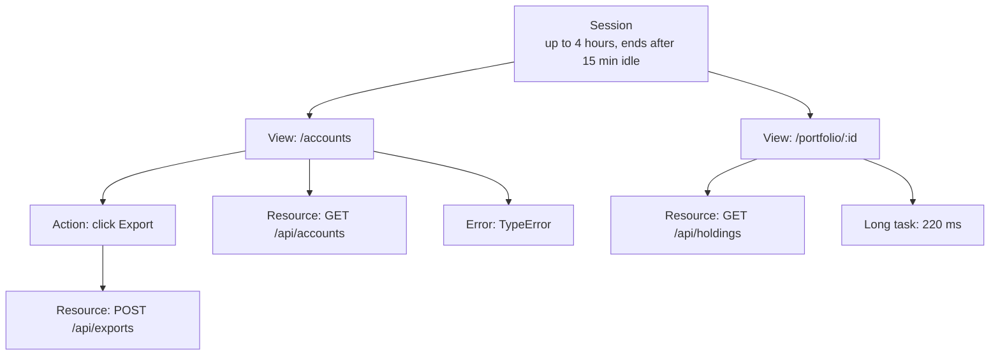
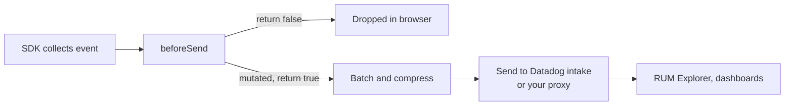
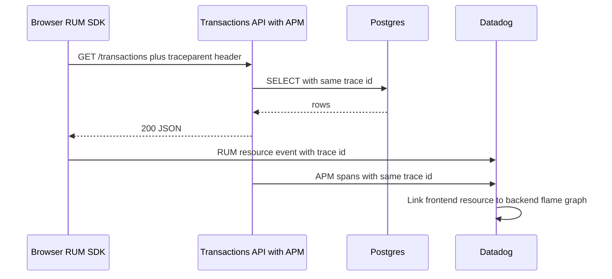

## 1. What it is

**Datadog Browser RUM (Real User Monitoring) is a JavaScript SDK that measures performance, errors, user actions and resource loading in real users' browsers and sends them to Datadog, where they connect to backend traces, logs and session replays.**

Analogy: your backend monitoring is like a kitchen camera in a restaurant. It shows how fast the chefs cook. RUM is like a camera at every table. It shows how long each diner actually waited, whether their plate arrived cold, and when they gave up and left. A fast kitchen does not guarantee happy diners.

The problem it solves: "it works on my machine" is useless for a trading dashboard used on slow office laptops, VPNs and old browsers. RUM tells you what actual users saw: which page was slow, which button threw an error, which API call took 8 seconds for users in Singapore, and which release made it worse.

## 2. Core concepts

### [Beginner] RUM vs APM vs logs vs synthetics

```ts
// The four signals, from the browser's point of view
type Signal =
  | "RUM"        // real users, in their browsers: views, actions, errors, resources, vitals
  | "APM"        // backend traces: which service and DB query took how long
  | "Logs"       // text events from any code: "payment 123 rejected: insufficient funds"
  | "Synthetics"; // robots running scripted tests from fixed locations on a schedule
```

| Signal | Who generates it | Answers | Example |
|---|---|---|---|
| RUM | Real users | "What did users experience?" | LCP is 4.2 s on the Portfolio page for EU users |
| APM | Backend services | "Where did the server spend time?" | `GET /transactions` spent 1.8 s in Postgres |
| Logs | Any code | "What exactly happened?" | `transfer_failed reason=limit_exceeded` |
| Synthetics | Datadog robots | "Is it up and working right now?" | Login test from London failed at 03:00 |

> **Why:** Synthetics catch outages before users do, but only on scripted paths and fast networks. RUM sees everything, but only after users hit it. You want both. APM explains *why* a RUM resource was slow.

### [Beginner] The RUM event model

RUM groups everything into a hierarchy.

```ts
// Event types the SDK produces
type RumEventType = "view" | "action" | "error" | "resource" | "long_task" | "vital";
```



- **Session**: one user's visit. Sampled as a whole.
- **View**: one page or route. In an SPA, route changes create new views.
- **Action**: a click or a custom action.
- **Resource**: a network request (XHR, fetch, image, script).
- **Error**: uncaught exceptions, console errors, network failures, or manual `addError`.
- **Long task**: main thread blocked for 50 ms or more (v6 also reports Long Animation Frames where supported).

### [Beginner] Initialising the SDK

```ts
import { datadogRum } from "@datadog/browser-rum";

datadogRum.init({
  applicationId: "a1b2c3d4-0000-0000-0000-000000000000",
  clientToken: "pub0123456789abcdef", // public, safe in the bundle
  site: "datadoghq.com",
  service: "wealth-web",
  env: "production",
  version: "2026.10.1",
  sessionSampleRate: 100,
  sessionReplaySampleRate: 20,
  trackUserInteractions: true,
  trackResources: true,
  trackLongTasks: true,
  defaultPrivacyLevel: "mask-user-input",
});
```

> **Why the client token is public:** The browser must send data directly, so any credential in the bundle is visible. Datadog's client token can only *submit* RUM data. It cannot read anything. That is why it is separate from API keys, which must never ship to a browser.

### [Intermediate] Sampling

```ts
datadogRum.init({
  // ...
  sessionSampleRate: 50,        // keep 50% of sessions at all (RUM data)
  sessionReplaySampleRate: 10,  // of ALL sessions, 10% also get replay (must be <= sessionSampleRate to matter)
});
```

Sampling is decided once per session, so a sampled session is complete, never half-recorded.

> **Why:** RUM is billed per session, and replay costs more. Sampling controls cost. For a low-traffic internal advisor portal, 100% is affordable. For a public banking site with millions of sessions, 5 to 20% is typical.

> **Gotcha:** Errors in unsampled sessions are not sent. If you need every error, also use Datadog Browser Logs (`@datadog/browser-logs`) or a dedicated error tracker with its own sampling.

### [Intermediate] Identifying the user

```ts
// After Okta login completes
datadogRum.setUser({
  id: "00u98xyz",            // stable, non-PII id (Okta sub)
  // name and email are supported, but consider leaving them out in finance apps
  plan: "private-banking",   // custom attributes allowed
});

datadogRum.setUserProperty("region", "EMEA");

// On logout
datadogRum.clearUser();
```

> **Finance tip:** Use the Okta `sub` or an internal hashed id, not email or account number. Support staff can still look up the user internally, and you avoid sending PII to a third party.

### [Intermediate] Custom actions, errors and timings

```ts
// Business event with context
datadogRum.addAction("transfer_submitted", {
  amountBucket: "1k-10k",      // bucket, not the exact amount
  currency: "GBP",
  fromAccountType: "checking",
});

// Handled error that would otherwise be swallowed
try {
  await submitTransfer(payload);
} catch (err) {
  datadogRum.addError(err, { feature: "transfers", step: "submit" });
  throw err;
}

// Time from view start to "portfolio chart rendered"
function PortfolioChart() {
  useEffect(() => {
    datadogRum.addTiming("portfolio_chart_rendered"); // relative to current view start
  }, []);
  return null;
}
```

> **Why `addTiming`:** Web Vitals measure generic paint events. They do not know when *your* meaningful content appeared (the chart, the balance). Custom timings let you track "time to useful" per release.

### [Intermediate] Global context

Attributes attached to every subsequent event.

```ts
datadogRum.setGlobalContextProperty("tenant", "uk-retail");
datadogRum.setGlobalContextProperty("featureFlags", { newLedger: true });
datadogRum.removeGlobalContextProperty("featureFlags");
const ctx = datadogRum.getGlobalContext();
```

Use it for tenant, feature flags, A/B variant, or a LogRocket session URL.

### [Advanced] beforeSend for PII scrubbing

`beforeSend` runs for every event before it leaves the browser. You can mutate allowed fields or return `false` to drop the event.

```ts
const ACCOUNT_NUMBER = /\b\d{8,17}\b/g;
const IBAN = /\b[A-Z]{2}\d{2}[A-Z0-9]{11,30}\b/g;
const EMAIL = /[\w.+-]+@[\w-]+\.[\w.]+/g;

function scrub(s: string): string {
  return s.replace(IBAN, "[IBAN]").replace(ACCOUNT_NUMBER, "[ACCOUNT]").replace(EMAIL, "[EMAIL]");
}

datadogRum.init({
  // ...
  beforeSend: (event, _context) => {
    // URLs often contain ids: /accounts/12345678/statements?email=...
    if (event.view?.url) event.view.url = scrub(event.view.url);
    if (event.type === "resource" && event.resource?.url) event.resource.url = scrub(event.resource.url);
    if (event.type === "error" && event.error?.message) event.error.message = scrub(event.error.message);
    if (event.type === "action" && event.action?.target?.name) {
      event.action.target.name = scrub(event.action.target.name); // button text can contain names
    }
    // Drop noisy third-party errors entirely
    if (event.type === "error" && event.error?.message?.includes("ResizeObserver loop")) return false;
    return true;
  },
});
```



> **Gotcha:** Only some fields are modifiable in `beforeSend` (URLs, messages, context, action names and a few more). Changes to other fields are ignored. Check the SDK docs for the current list rather than assuming.

> **Why scrub in the browser:** Once PII reaches a vendor, deleting it is a compliance incident (GDPR, PCI DSS). Datadog also offers server-side Sensitive Data Scanner, but browser-side scrubbing means the data never leaves the user's machine.

### [Advanced] Connecting RUM to backend traces

```ts
datadogRum.init({
  // ...
  allowedTracingUrls: [
    "https://api.bank.example.com",                                 // string = prefix match
    /https:\/\/.*\.internal\.bank\.example\.com/,                   // regex
    (url) => url.startsWith("https://payments.bank.example.com"),    // function
    { match: "https://reports.bank.example.com", propagatorTypes: ["tracecontext", "datadog"] },
  ],
  traceSampleRate: 100, // % of matched requests that get trace headers
});
```

For matched URLs, the SDK adds trace headers (`traceparent` for W3C, `x-datadog-*` for Datadog) so the backend APM trace links to the RUM resource.



> **Gotcha:** The API must allow these headers in CORS (`Access-Control-Allow-Headers: traceparent, tracestate, x-datadog-trace-id, x-datadog-parent-id, x-datadog-origin, x-datadog-sampling-priority`). Otherwise the browser's preflight fails and **real requests break**. Only list your own APIs, never third parties.

### [Advanced] Core Web Vitals

RUM collects Core Web Vitals automatically on every view.

```ts
// Thresholds Google uses for "good" at the 75th percentile
const goodThresholds = {
  LCP: 2500, // ms, Largest Contentful Paint: main content visible
  INP: 200,  // ms, Interaction to Next Paint: responsiveness to clicks and keys
  CLS: 0.1,  // unitless, Cumulative Layout Shift: visual stability
};
```

> **Outdated:** FID (First Input Delay) was replaced by INP as a Core Web Vital in March 2024. Older dashboards and interview prep may still mention FID.

> **Finance tip:** CLS matters more than you think: a balance table that shifts as the "pending transactions" banner loads can make a user click "Confirm transfer" instead of "Cancel". INP is the key metric for heavy grids with thousands of transaction rows.

## 3. Why it's used in this project

- **Slow dashboard reports.** Advisors complain "the portfolio page is slow". RUM shows LCP and long tasks per route and per release, and links slow `GET /holdings` resources to the backend trace.
- **Release health.** `version` lets us compare error rate and vitals before and after a deploy and roll back fast.
- **Business funnels.** `addAction("transfer_submitted")` and `addAction("transfer_confirmed")` show where users drop out.
- **Error triage with replay.** Sampled session replays (masked) show what a user did before an error.
- **Compliance.** `defaultPrivacyLevel: "mask"` and `beforeSend` scrubbing keep account numbers, balances and names out of Datadog.
- **Single pane of glass.** Backend teams already use Datadog APM and logs. Frontend data in the same tool cuts incident time.

## 4. Setup & configuration

```bash
npm install @datadog/browser-rum
# optional, for separate log events
npm install @datadog/browser-logs
```

```ts
// src/observability/datadog.ts
import { datadogRum } from "@datadog/browser-rum";

export function initDatadog() {
  if (import.meta.env.MODE === "test") return; // never in unit tests

  datadogRum.init({
    applicationId: import.meta.env.VITE_DD_APP_ID,     // RUM application id (UUID)
    clientToken: import.meta.env.VITE_DD_CLIENT_TOKEN, // public client token, write-only
    site: "datadoghq.eu",            // your Datadog region: datadoghq.com, datadoghq.eu, us3/us5.datadoghq.com, ap1.datadoghq.com
    service: "wealth-web",           // must match the service name used for source maps
    env: import.meta.env.VITE_ENV,   // "production" | "staging"
    version: import.meta.env.VITE_RELEASE, // must match source map --release-version

    sessionSampleRate: 100,          // % of sessions tracked at all
    sessionReplaySampleRate: 20,     // % of sessions with replay

    trackUserInteractions: true,     // auto-collect clicks as actions
    trackResources: true,            // collect fetch/XHR/static resources
    trackLongTasks: true,            // collect main-thread blocks of 50 ms or more
    trackViewsManually: false,       // true = you call startView() on route change

    defaultPrivacyLevel: "mask",     // replay privacy: "allow" | "mask" | "mask-user-input"

    allowedTracingUrls: [            // only YOUR APIs get trace headers
      { match: import.meta.env.VITE_API_BASE_URL, propagatorTypes: ["tracecontext"] },
    ],
    traceSampleRate: 100,

    // Optional: send through your own domain to avoid ad blockers
    // proxy: "https://rum-proxy.bank.example.com",

    beforeSend: (event) => {
      if (event.view?.url) event.view.url = event.view.url.replace(/\/accounts\/\d+/, "/accounts/:id");
      return true;
    },
  });
}
```

```ts
// src/main.tsx
initDatadog(); // as early as possible, before React renders, to catch startup errors
```

Source maps upload in CI so minified stack traces become readable:

```bash
npx @datadog/datadog-ci sourcemaps upload ./dist \
  --service wealth-web \
  --release-version "$RELEASE" \
  --minified-path-prefix https://app.bank.example.com/assets
# requires DATADOG_API_KEY (CI secret, never in the bundle) and DATADOG_SITE
```

```ts
// vite.config.ts - generate hidden source maps (not referenced from the JS)
export default defineConfig({ build: { sourcemap: "hidden" } });
```

> **Why hidden source maps:** You want Datadog to have them but not the public. `hidden` writes `.map` files without the `//# sourceMappingURL` comment. Upload them in CI, then do not deploy them to the CDN.

> **Gotcha:** `service` and `version` in `init` must exactly match `--service` and `--release-version` at upload, or Datadog cannot match maps to errors.

> **Outdated:** In v4, `allowedTracingOrigins`, `sampleRate`, `premiumSampleRate` and calling `startSessionReplayRecording()` were common. v5 renamed them to `allowedTracingUrls`, `sessionSampleRate`, `sessionReplaySampleRate`, and replay starts automatically for sampled sessions (unless `startSessionReplayRecordingManually: true`). v5 also made `trackUserInteractions`, `trackResources` and `trackLongTasks` default to true and changed the default privacy level to `mask`. Check the v6 upgrade guide for further changes such as the minimum supported browsers.

## 5. Key features we use

### [Beginner] Set user after Okta login

```tsx
export function useDatadogUser() {
  const { authState } = useOktaAuth();
  useEffect(() => {
    const sub = authState?.idToken?.claims.sub;
    if (authState?.isAuthenticated && sub) datadogRum.setUser({ id: sub });
    else datadogRum.clearUser();
  }, [authState?.isAuthenticated, authState?.idToken?.claims.sub]);
}
```

### [Beginner] React error boundary reporting

```tsx
import { ErrorBoundary } from "react-error-boundary";

<ErrorBoundary
  fallback={<p>Something went wrong.</p>}
  onError={(error, info) => datadogRum.addError(error, { componentStack: info.componentStack })}
>
  <PortfolioPage />
</ErrorBoundary>;
```

> **Why:** React catches render errors in boundaries, so they never reach `window.onerror`. Without this, RUM misses them. Datadog also ships an `@datadog/browser-rum-react` package with an error boundary and router integration; check whether it fits your React Router version.

### [Intermediate] Named views for parametrised routes

```ts
// With trackViewsManually: true
import { useLocation, matchRoutes } from "react-router-dom";

export function useRumViews(routes: { path: string }[]) {
  const location = useLocation();
  useEffect(() => {
    const match = matchRoutes(routes, location)?.at(-1);
    datadogRum.startView({ name: match?.route.path ?? location.pathname }); // "/portfolio/:id"
  }, [location.pathname]);
}
```

> **Why:** Without named views, `/portfolio/123` and `/portfolio/456` are separate views, which ruins aggregation and leaks ids.

### [Intermediate] Business timing

```ts
const start = performance.now();
await loadStatementPdf(accountId);
datadogRum.addAction("statement_loaded", { durationMs: Math.round(performance.now() - start) });
```

## 6. Interview questions

#### Q: What is RUM and how is it different from APM and synthetic monitoring?

RUM collects telemetry from real users' browsers: page views, Core Web Vitals, clicks, network resources, JS errors and optionally session replays. APM collects backend traces showing where server time goes. Synthetics run scripted robot tests from fixed locations on a schedule. RUM shows true user experience across real devices and networks; synthetics give proactive uptime checks; APM explains backend causes. Linking RUM resources to APM traces via `allowedTracingUrls` gives end-to-end visibility.

#### Q: How do you stop PII from reaching Datadog in a banking app?

Layers: do not put PII in `setUser` (use an opaque id), set `defaultPrivacyLevel: "mask"` for replays plus `data-dd-privacy` attributes on sensitive elements, normalise URLs with ids, scrub messages and URLs in `beforeSend` with regexes for account numbers, IBANs and emails, avoid sensitive values in `addAction` context (bucket amounts), and enable server-side Sensitive Data Scanner as a safety net. Review with the compliance team.

#### Q: What do `sessionSampleRate` and `sessionReplaySampleRate` control, and what are the trade-offs?

`sessionSampleRate` is the percentage of sessions tracked at all. `sessionReplaySampleRate` is the percentage of all sessions that also record replay (effectively capped by the session sample). Sampling is per session, so tracked sessions are complete. Lower rates cut cost but you lose visibility into rare errors in unsampled sessions, so pair RUM with logs or an error tracker for full error capture.

#### Q: Why upload source maps, and how do you do it securely?

Production bundles are minified, so stack traces show `a.js:1:48213`. Source maps let Datadog map back to original files and lines. Build with hidden source maps, upload them in CI with `datadog-ci sourcemaps upload` using the same `service` and `version` as `init`, keep the API key as a CI secret, and do not deploy the `.map` files publicly so you do not expose source code.

#### Q: What are the Core Web Vitals in 2026 and what thresholds mean "good"?

LCP (Largest Contentful Paint) at or below 2.5 s, INP (Interaction to Next Paint) at or below 200 ms, CLS (Cumulative Layout Shift) at or below 0.1, measured at the 75th percentile. INP replaced FID in March 2024. RUM collects them per view, so you can see which route and release regressed.

## 7. Drawbacks & pain points

- **Cost** scales with sessions and replay. Bills surprise teams that leave 100% sampling on a public site.
- **Bundle size**: roughly ~30 to 50 KB gzip for RUM with replay recorder (replay is lazy-loaded in recent versions).
- **Ad blockers** block Datadog intake domains. Use the `proxy` option to route through your own domain.
- **CORS breakage** from `allowedTracingUrls` if the backend does not allow trace headers.
- **SPA view naming** needs manual work for parametrised routes.
- **Vendor lock-in**: dashboards, monitors and queries are Datadog-specific.

Gotchas that trip devs up:

```ts
// 1. Initialising inside a component - runs on every mount (and twice in StrictMode)
function App() { datadogRum.init({ /* ... */ }); } // init once at module level instead

// 2. Putting the API key in the bundle
datadogRum.init({ clientToken: process.env.DD_API_KEY }); // API key is secret, client token is not

// 3. Tracing third parties
allowedTracingUrls: ["https://"]; // adds headers to every https request, breaks CORS on vendors

// 4. Real values in actions
datadogRum.addAction("transfer", { amount: 125000.5, iban: "GB33BUKB20201555555555" }); // PII leak
```

## 8. Better alternatives

The trend is toward **OpenTelemetry** as a vendor-neutral standard (browser support is maturing but still less complete than vendor SDKs), and toward combining error tracking, performance and replay in one tool. Datadog wins when the backend already lives in Datadog.

| Tool | Bundle (gzip) | Setup | Backend trace link | Replay | Pricing model | When it wins |
|---|---|---|---|---|---|---|
| Datadog RUM | ~30 to 50 KB | Low | Excellent with Datadog APM | Yes | Per session | Org already on Datadog |
| Sentry (errors + tracing + replay) | ~25 to 70 KB depending on features | Low | Good with Sentry backend SDKs | Yes | Per event/replay | Error-first teams, great stack traces |
| New Relic Browser | ~30 KB+ | Low | Good with New Relic APM | Yes | Per data ingest/user | New Relic shops |
| Grafana Faro + OpenTelemetry | ~20 to 40 KB | Medium | Good with Tempo/OTel | Limited | Self-host or Grafana Cloud | Open-source, cost control |
| Elastic RUM | ~20 KB | Medium | Good with Elastic APM | No (as far as known) | Self-host or Elastic Cloud | Elastic stack users |
| web-vitals + own endpoint | ~2 KB | Medium | None | No | Free | Just vitals, minimal budget |

## 9. When NOT to use it

- Your backend observability is not in Datadog and you only need error tracking (Sentry is simpler and cheaper).
- Highly regulated screens where even masked replay is not approved: disable replay or use `defaultPrivacyLevel: "mask"` with selective `data-dd-privacy="hidden"`.
- Unit and component tests, local development (noise and cost).
- Very small apps where `web-vitals` plus a log endpoint gives enough insight.
- Public marketing pages where cost per session outweighs the value; sample heavily instead.

## Cheatsheet

| API | Purpose |
|---|---|
| `datadogRum.init(config)` | Start SDK once, early |
| `setUser({ id })` / `setUserProperty(k, v)` / `clearUser()` | Identify user |
| `addAction(name, context)` | Custom business event |
| `addError(error, context)` | Handled error |
| `addTiming(name)` | Custom timing in current view |
| `setGlobalContextProperty(k, v)` / `removeGlobalContextProperty(k)` | Attributes on all events |
| `startView({ name })` | Manual view (with `trackViewsManually`) |
| `getSessionReplayLink()` | Link to current replay (when recorded) |
| `beforeSend(event, ctx)` | Scrub or drop events |

| Init option | Typical value |
|---|---|
| `sessionSampleRate` | 100 internal, 5 to 20 public |
| `sessionReplaySampleRate` | 0 to 20 |
| `defaultPrivacyLevel` | `"mask"` for finance |
| `allowedTracingUrls` | your API origins only |
| `trackUserInteractions` / `trackResources` / `trackLongTasks` | `true` |

```ts
datadogRum.init({ applicationId, clientToken, site: "datadoghq.com", service: "wealth-web",
  env: "production", version: RELEASE, sessionSampleRate: 100, sessionReplaySampleRate: 20,
  trackUserInteractions: true, trackResources: true, trackLongTasks: true,
  defaultPrivacyLevel: "mask", allowedTracingUrls: [API_URL], beforeSend: scrubEvent });
datadogRum.setUser({ id: oktaSub });
datadogRum.addAction("transfer_submitted", { currency: "GBP" });
datadogRum.addError(err, { feature: "transfers" });
```
