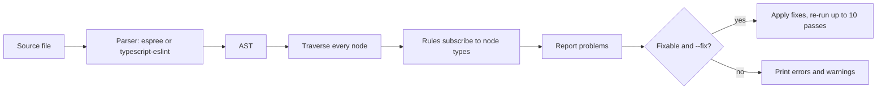
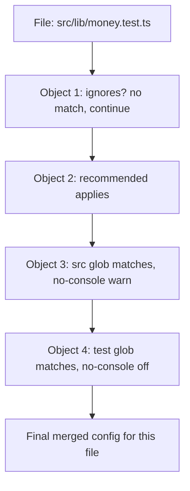

## 1. What it is

**ESLint is a pluggable static analysis tool for JavaScript and TypeScript: it parses code into an AST and runs rules over it to report, and often auto-fix, problems.**

Analogy: ESLint is a building inspector who walks through the blueprint room by room with a checklist. Each checklist item is a rule ("every exit has a sign", "no `useEffect` with missing dependencies"). Plugins add specialist checklists for React, TypeScript, accessibility, and so on. The inspector never builds anything; it only reads and reports.

The problem it solves: many bugs are visible from the code alone: unused variables, unhandled promises, hooks called conditionally, comparing with `==`. Catching them at edit time is far cheaper than in QA or production. It also enforces team conventions automatically, so code review can focus on logic.

## 2. Core concepts

### [Beginner] Parse, walk, report



```ts
// This code has three problems ESLint can see without running it
export function totalBalance(accounts: { balanceCents: number }[]) {
  let unused = 0;                       // no-unused-vars
  let total = 0;
  for (const a of accounts) total += a.balanceCents;
  if (total == '0') return 0;           // eqeqeq
  return total;
  console.log('done');                  // no-unreachable
}
```

> **Why an AST?** Rules need structure, not text. "Is this identifier ever read?" is a question about scopes and references, which only a parsed tree can answer reliably.

### [Beginner] Rules and severities

Each rule has a severity: `"off"` (0), `"warn"` (1), `"error"` (2). Errors make the CLI exit with code 1, which fails CI. Many rules take options.

```js
// eslint.config.js
export default [
  {
    rules: {
      eqeqeq: ['error', 'always'],
      'no-console': ['warn', { allow: ['warn', 'error'] }],
      'prefer-const': 'error',
    },
  },
];
```

### [Beginner] Plugins vs configs

- A **plugin** is an npm package that provides rules (and sometimes processors/parsers). Example: `eslint-plugin-react-hooks` provides `rules-of-hooks` and `exhaustive-deps`.
- A **config** is a preset bundle of rule settings. Example: `js.configs.recommended`, `tseslint.configs.recommended`.

Plugins add capabilities; configs turn them on.

### [Intermediate] Flat config (ESLint 9 default)

ESLint 9 uses `eslint.config.js`: a single JS file exporting an array of config objects. Objects are merged in order; later objects override earlier ones for files they match.

```js
// eslint.config.js
import js from '@eslint/js';
import globals from 'globals';

export default [
  { ignores: ['dist/**', 'coverage/**'] },           // global ignores (object with only `ignores`)
  js.configs.recommended,                             // applies to all files
  {
    files: ['src/**/*.{ts,tsx}'],                     // scope by glob
    languageOptions: { globals: globals.browser },
    rules: { 'no-console': 'warn' },
  },
  {
    files: ['**/*.test.ts'],                          // later object overrides for tests
    rules: { 'no-console': 'off' },
  },
];
```



> **Why flat?** Legacy `.eslintrc` had cascading config files per folder, `extends` strings resolved by magic naming (`plugin:react/recommended`), and `overrides`. It was hard to know which config applied. Flat config is plain JavaScript imports: what you see is what runs.

### [Intermediate] Legacy .eslintrc for comparison

```json
// .eslintrc.json -- ESLint 8 style
{
  "root": true,
  "parser": "@typescript-eslint/parser",
  "plugins": ["@typescript-eslint", "react-hooks"],
  "extends": ["eslint:recommended", "plugin:@typescript-eslint/recommended", "plugin:react-hooks/recommended"],
  "overrides": [{ "files": ["*.test.ts"], "rules": { "no-console": "off" } }],
  "ignorePatterns": ["dist"]
}
```

> **Outdated:** `.eslintrc.*` and `.eslintignore` are deprecated in ESLint 9 and removed in ESLint 10 (verify for your version). Use `npx @eslint/migrate-config .eslintrc.json` to convert, and `FlatCompat` from `@eslint/eslintrc` for plugins that still only ship legacy configs.

### [Intermediate] typescript-eslint and type-aware rules

`typescript-eslint` provides a parser for TS syntax and rules for TS code. Some rules need the type checker ("type-aware"), which is slower but catches real bugs.

```js
// eslint.config.js
import tseslint from 'typescript-eslint';

export default tseslint.config(
  ...tseslint.configs.recommendedTypeChecked,
  {
    languageOptions: {
      parserOptions: {
        projectService: true,                   // find the right tsconfig per file automatically
        tsconfigRootDir: import.meta.dirname,
      },
    },
  },
);
```

```ts
// Bugs only a type-aware rule can see
async function saveTransfer(t: Transfer): Promise<void> { /* ... */ }

function onSubmit(t: Transfer) {
  saveTransfer(t);          // @typescript-eslint/no-floating-promises: rejection is silently lost
}

if (fetchBalance()) {}      // @typescript-eslint/no-misused-promises: a Promise is always truthy

const amount: any = JSON.parse(body);
amount.cents.toFixed(2);    // @typescript-eslint/no-unsafe-member-access
```

> **Finance tip:** `no-floating-promises` is a must in money flows. An unawaited `submitPayment()` that rejects means the UI says "Sent" while the payment failed.

### [Advanced] How a rule is written

```js
// eslint-rules/no-float-money.js
// Flag arithmetic on variables named *Amount that use parseFloat (prefer integer cents)
export default {
  meta: {
    type: 'problem',
    docs: { description: 'Disallow parseFloat for money amounts' },
    messages: { useCents: 'Parse money into integer cents, not floats.' },
    schema: [],
  },
  create(context) {
    return {
      // Visitor keyed by AST node type
      CallExpression(node) {
        if (node.callee.type === 'Identifier' && node.callee.name === 'parseFloat') {
          const parent = node.parent;
          if (parent.type === 'VariableDeclarator' && /amount/i.test(parent.id.name)) {
            context.report({ node, messageId: 'useCents' });
          }
        }
      },
    };
  },
};
```

```js
// eslint.config.js -- local plugin
import noFloatMoney from './eslint-rules/no-float-money.js';
export default [
  { plugins: { acme: { rules: { 'no-float-money': noFloatMoney } } } },
  { rules: { 'acme/no-float-money': 'error' } },
];
```

Use AST Explorer (astexplorer.net) to see node types for any snippet.

## 3. Why it's used in this project

- **Hooks correctness.** Dashboards are full of `useEffect` subscriptions to prices and balances. `exhaustive-deps` catches stale closures that show yesterday's balance.
- **Async safety.** Type-aware rules catch unawaited payment, transfer and save calls.
- **No floats and no `any` in money code.** Custom rules or `no-restricted-syntax` can ban `parseFloat` near amounts or `Number()` on money strings.
- **PII and logging.** `no-console` (error in `src/`) prevents accidental logging of account numbers into browser consoles and log aggregators.
- **Accessibility.** `eslint-plugin-jsx-a11y` catches unlabeled inputs on account forms, important for regulated public-facing apps.
- **Consistent reviews.** Rules run in editors, pre-commit, and CI so violations never reach main.

## 4. Setup & configuration

```bash
npm init @eslint/config@latest      # interactive generator
# or manually:
npm i -D eslint @eslint/js typescript-eslint globals \
  eslint-plugin-react-hooks eslint-plugin-react-refresh eslint-plugin-jsx-a11y eslint-config-prettier
```

```js
// eslint.config.js
import js from '@eslint/js';
import globals from 'globals';
import tseslint from 'typescript-eslint';
import reactHooks from 'eslint-plugin-react-hooks';
import reactRefresh from 'eslint-plugin-react-refresh';
import jsxA11y from 'eslint-plugin-jsx-a11y';
import prettier from 'eslint-config-prettier';

export default tseslint.config(
  // 1. Never lint build output
  { ignores: ['dist', 'coverage', '.yarn', '*.config.js'] },

  // 2. Base JS recommended rules
  js.configs.recommended,

  // 3. TS rules that use type information (slower, much stronger)
  ...tseslint.configs.recommendedTypeChecked,

  {
    files: ['src/**/*.{ts,tsx}'],
    languageOptions: {
      ecmaVersion: 2022,
      globals: globals.browser,               // window, document, fetch...
      parserOptions: {
        projectService: true,                 // type info from tsconfig
        tsconfigRootDir: import.meta.dirname,
      },
    },
    plugins: {
      'react-hooks': reactHooks,
      'react-refresh': reactRefresh,
    },
    rules: {
      ...reactHooks.configs.recommended.rules, // rules-of-hooks: error, exhaustive-deps: warn
      'react-refresh/only-export-components': ['warn', { allowConstantExport: true }],
      'no-console': ['error', { allow: ['warn', 'error'] }],
      eqeqeq: ['error', 'always'],
      '@typescript-eslint/no-floating-promises': 'error',
      '@typescript-eslint/no-explicit-any': 'error',
      '@typescript-eslint/no-unused-vars': ['error', { argsIgnorePattern: '^_' }],
      'no-restricted-imports': ['error', {
        paths: [{ name: 'moment', message: 'Use date-fns.' }],
      }],
    },
  },

  // 4. Accessibility for JSX
  jsxA11y.flatConfigs.recommended,

  // 5. Relax rules in tests
  {
    files: ['**/*.test.{ts,tsx}'],
    rules: { '@typescript-eslint/no-explicit-any': 'off' },
  },

  // 6. LAST: turn off rules that conflict with Prettier formatting
  prettier,
);
```

```json
// package.json
{
  "scripts": {
    "lint": "eslint . --max-warnings 0",
    "lint:fix": "eslint . --fix"
  }
}
```

> **Gotcha:** Newer `eslint-plugin-react-hooks` versions export flat configs (for example `reactHooks.configs['recommended-latest']` or `.configs.flat.recommended` depending on version) and add React Compiler-related rules. Check the plugin README for your version rather than copying configs blindly.

## 5. Key features we use

### [Beginner] Autofix

```bash
npx eslint src --fix            # apply safe fixes
npx eslint src --fix-dry-run --format json   # see fixes without writing
```

Rules can provide **fixes** (safe, applied by `--fix`) or **suggestions** (possibly behavior-changing, only applied manually in the editor).

### [Beginner] Disable comments, sparingly

```ts
// eslint-disable-next-line @typescript-eslint/no-explicit-any -- third-party callback is untyped
const onLegacyEvent = (e: any) => track(e.type);
```

Always add a `--` reason. Enable `linterOptions.reportUnusedDisableDirectives` (default "warn" in ESLint 9) to catch stale ones.

### [Intermediate] react-hooks rules in practice

```tsx
function BalanceTicker({ accountId }: { accountId: string }) {
  const [balance, setBalance] = useState<number | null>(null);

  useEffect(() => {
    const sub = subscribeBalance(accountId, setBalance);
    return () => sub.unsubscribe();
  }, []); // exhaustive-deps: missing 'accountId'. Switching accounts would keep the old feed.

  if (!accountId) return null;
  const fmt = useMemo(() => formatCents(balance ?? 0, 'USD'), [balance]);
  // rules-of-hooks: hook called after an early return -> hook order changes between renders
}
```

### [Intermediate] Restricting patterns

```js
rules: {
  'no-restricted-syntax': ['error', {
    selector: "CallExpression[callee.name='parseFloat']",
    message: 'Use parseMoneyToCents() from @/lib/money.',
  }],
}
```

### [Advanced] Speed: cache and type-aware cost

```bash
npx eslint . --cache --cache-location node_modules/.cache/eslint
```

Type-aware linting builds a TS program, so it can be several times slower. Options: apply `recommendedTypeChecked` only to `src/**`, use `projectService` (faster than listing `project` arrays), and run full lint in CI while pre-commit lints only staged files.

## 6. Interview questions

#### Q: How does ESLint work internally?

It parses each file into an AST (espree for JS, `@typescript-eslint/parser` for TS), builds scope information, then traverses every node. Rules register visitor functions for node types (for example `CallExpression`) and call `context.report` when they find a problem. Fixable rules return text edits; with `--fix` ESLint applies them and re-runs, up to 10 passes, until stable.

#### Q: What is flat config and why did ESLint move to it?

Flat config is `eslint.config.js`, which exports an array of config objects merged in order, each optionally scoped with `files` and `ignores`. Plugins and parsers are imported as JS objects instead of resolved by string names. ESLint moved to it because cascading `.eslintrc` files, magic `extends` name resolution, and `overrides` made it hard to know which settings applied to a file and caused plugin resolution bugs. It is the default in ESLint 9.

#### Q: What are type-aware lint rules, and what is the trade-off?

Rules that use the TypeScript type checker, such as `no-floating-promises`, `no-misused-promises`, `no-unsafe-*`, `await-thenable`. They catch bugs syntax alone cannot, like an unawaited promise or treating a promise as a boolean. The trade-off is speed, because a full TS program must be built. Mitigate with `projectService`, caching, and scoping to source files.

#### Q: What do rules-of-hooks and exhaustive-deps protect against?

React tracks hooks by call order. `rules-of-hooks` errors if a hook is called conditionally, in a loop, or after an early return, because the order would change between renders and state would be mismatched. `exhaustive-deps` warns when an effect, memo or callback reads a value not listed in its dependency array, which causes stale closures (for example, an effect still subscribed to the previous account).

#### Q: How should ESLint and Prettier work together?

ESLint for code quality, Prettier for formatting. Add `eslint-config-prettier` last in the config to turn off ESLint's stylistic rules that would conflict. Run Prettier separately (editor on save, lint-staged). Avoid `eslint-plugin-prettier` (running Prettier as a lint rule) in most cases because it is slower and floods the output with formatting noise.

## 7. Drawbacks & pain points

- **Speed on large TS codebases**, especially type-aware rules. Minutes in CI are common.
- **Plugin churn** during the flat config migration. Some plugins lagged or changed export shapes.
- **Config complexity**: many plugins, ordering rules, conflicting presets.
- **Warnings get ignored.** Hundreds of warnings become noise; use `--max-warnings 0` or make them errors.
- **Overlap with TypeScript**: some core rules (`no-undef`, `no-unused-vars`) duplicate or conflict with TS and must be swapped for TS versions.

Gotchas that trip devs up:

```js
// 1. Spreading a typescript-eslint config array without the spread
export default [tseslint.configs.recommended];   // nested array, wrong in plain array export
export default [...tseslint.configs.recommended]; // correct (or use tseslint.config(...))

// 2. `ignores` inside an object WITH other keys only applies to that object
{ files: ['src/**'], ignores: ['dist'], rules: {} }  // does not globally ignore dist
{ ignores: ['dist'] }                                 // global ignore: only key in the object

// 3. Core rule conflicts with TS
'no-unused-vars': 'error',                       // false positives on types
'@typescript-eslint/no-unused-vars': 'error',    // use this one, turn the core one off
```

> **Gotcha:** `no-undef` should be off for TS files. TypeScript already checks undefined identifiers, and the core rule does not understand types or globals declared in `.d.ts` files.

## 8. Better alternatives

Rust-based linters are the big trend: Biome (lint + format, one tool) and oxlint (from the Oxc project, very fast, ESLint-compatible rule names). Many teams run oxlint for speed plus a smaller ESLint config for type-aware and niche plugin rules.

| Tool | Speed | Boilerplate | Plugin ecosystem | Type-aware rules | TS support | Popularity | When it wins |
| --- | --- | --- | --- | --- | --- | --- | --- |
| ESLint 9 + typescript-eslint | ~baseline | medium-high | huge | yes | excellent | dominant | full coverage, custom rules |
| Biome | ~10-25x faster | low, one `biome.json` | small, growing | limited | good | growing fast | new projects wanting lint + format in one |
| oxlint | ~50x faster | low | ports of popular plugins | emerging | good | growing | huge repos, pair with ESLint |
| TSLint | n/a | n/a | n/a | n/a | n/a | dead | never |
| Deno lint | fast | ~none | small | no | good | niche | Deno projects |

> **Outdated:** TSLint was deprecated in 2019 in favor of typescript-eslint. If you see `tslint.json`, migrate.

## 9. When NOT to use it

- **Formatting.** Do not use ESLint stylistic rules for whitespace and quotes; use Prettier or Biome.
- **Type-aware rules in a pre-commit hook on a huge repo** if they make commits slow; run them in CI.
- **Generated code** (OpenAPI clients, GraphQL types): ignore it rather than linting.
- **Tiny scripts or prototypes** where config cost exceeds value.
- **When Biome already covers your rule needs** and you want one fast tool.

## Cheatsheet

| Task | Command / config |
| --- | --- |
| Init | `npm init @eslint/config@latest` |
| Lint | `eslint .` |
| Fix | `eslint . --fix` |
| CI strict | `eslint . --max-warnings 0` |
| Cache | `eslint . --cache` |
| Inspect config | `npx eslint --inspect-config` |
| Print config for file | `npx eslint --print-config src/App.tsx` |
| Migrate | `npx @eslint/migrate-config .eslintrc.json` |
| Disable line | `// eslint-disable-next-line rule -- reason` |
| Global ignore | `{ ignores: ['dist'] }` |
| Scope | `{ files: ['src/**/*.tsx'], rules: {} }` |
| Severity | `'off'` / `'warn'` / `'error'` |

```js
// eslint.config.js minimal TS + React
import js from '@eslint/js';
import tseslint from 'typescript-eslint';
import reactHooks from 'eslint-plugin-react-hooks';
import prettier from 'eslint-config-prettier';

export default tseslint.config(
  { ignores: ['dist'] },
  js.configs.recommended,
  ...tseslint.configs.recommended,
  { plugins: { 'react-hooks': reactHooks }, rules: reactHooks.configs.recommended.rules },
  prettier,
);
```
