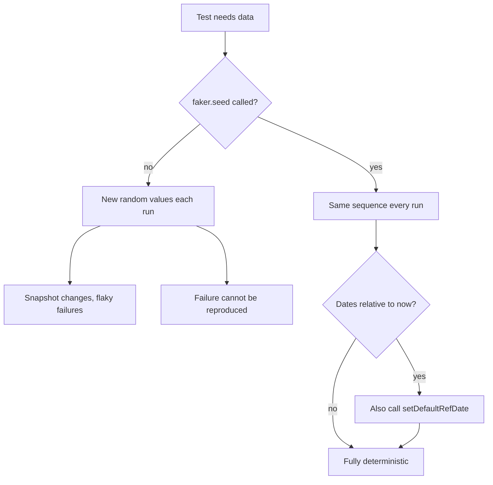
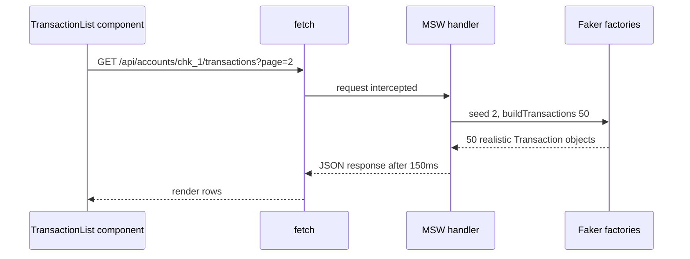

## 1. What it is

**@faker-js/faker generates realistic, random-looking fake data: names, emails, money amounts, account numbers, IBANs, dates, UUIDs, and more.**

Think of it as a props department for a film. You need a believable bank statement in the background of a scene, but you must not use a real customer's statement. The props team prints a convincing fake. Faker is that props team for your tests, Storybook stories, and local mock servers.

The problem it solves: hand-writing test data (`{ name: 'Test User', amount: 100 }`) is tedious, repetitive, and unrealistic, so it misses bugs like long names breaking layout or unusual currencies breaking formatting. Copying production data is worse: it leaks PII. Faker produces varied, realistic data on demand, and with a **seed** it produces the exact same data every run.

## 2. Core concepts

### [Beginner] Importing and the main modules

Faker is organised into modules. You call `faker.<module>.<method>()`.

```ts
import { faker } from '@faker-js/faker'; // English locale by default

faker.person.fullName();          // 'Maria Kovacek'
faker.person.firstName();         // 'Dewayne'
faker.internet.email();           // 'Kody.Grant@hotmail.com'
faker.string.uuid();              // '7f3a2c8e-...-...'
faker.number.int({ min: 1, max: 100 });   // 42
faker.date.past({ years: 1 });    // Date within the last year
faker.helpers.arrayElement(['checking', 'savings', 'credit'] as const);
```

> **Outdated:** The original `faker` npm package was sabotaged by its author in January 2022 and must not be used. The community fork is `@faker-js/faker`. Also, old APIs like `faker.name.findName()`, `faker.datatype.uuid()`, and `faker.datatype.number()` were renamed to `faker.person.fullName()`, `faker.string.uuid()`, and `faker.number.int()` in v8 and later removed.

### [Beginner] The finance module

These are the methods most useful in a banking app:

```ts
import { faker } from '@faker-js/faker';

faker.finance.amount();                                  // '492.17'  (a STRING)
faker.finance.amount({ min: 5, max: 500, dec: 2 });      // '73.40'
faker.finance.accountNumber();                           // '82937465' (8 digits default)
faker.finance.accountNumber(12);                         // '120394857261'
faker.finance.iban();                                    // 'DE89370400440532013000' style
faker.finance.iban({ formatted: true, countryCode: 'GB' }); // 'GB29 NWBK 6016 1331 9268 19' style
faker.finance.bic();                                     // 'DEUTDEFF'
faker.finance.currencyCode();                            // 'EUR'
faker.finance.currency();                                // { code: 'EUR', name: 'Euro', symbol: '€' }
faker.finance.transactionType();                         // 'deposit' | 'withdrawal' | 'payment' | 'invoice'
faker.finance.transactionDescription();                  // long human-readable sentence
faker.finance.creditCardNumber();                        // Luhn-valid fake number
```

> **Gotcha:** `faker.finance.amount()` returns a **string**, not a number. For money stored as integer cents, generate cents directly: `faker.number.int({ min: 100, max: 500_000 })`. Converting `Number('73.40') * 100` can produce `7339.999999999999`.

> **Finance tip:** `currencyCode()` can return codes your `Intl.NumberFormat` call handles fine but your backend does not support, or currencies with 0 or 3 decimal places (JPY, KWD). Use `faker.helpers.arrayElement(['USD', 'EUR', 'GBP'])` for "supported" fixtures, and a separate test that deliberately uses JPY and KWD.

### [Beginner] Dates and IDs

```ts
faker.date.past({ years: 2 });                       // Date in last 2 years
faker.date.recent({ days: 30 });                     // Date in last 30 days
faker.date.soon({ days: 7 });                        // Date in next 7 days
faker.date.between({ from: '2026-01-01', to: '2026-03-31' });
faker.string.uuid();                                 // RFC 4122 v4 style UUID
faker.string.alphanumeric({ length: 10, casing: 'upper' }); // 'A7K2P9QX0M'
```

### [Intermediate] Locales

The default `faker` export is English. Import a pre-built localized instance, or build one with fallbacks.

```ts
// Pre-built localized instances
import { fakerDE, fakerEN_GB, fakerJA } from '@faker-js/faker';
fakerDE.person.fullName();   // 'Lukas Schmidt'
fakerEN_GB.location.zipCode(); // 'SW1A 1AA' style

// Custom instance with fallback chain: German, then English, then base data
import { Faker, de, en, base } from '@faker-js/faker';
export const fakerCustom = new Faker({ locale: [de, en, base] });
```

> **Why:** Each locale is a large data file. Importing only the localized instance you need keeps the test bundle smaller. The fallback chain matters because a locale may lack some data (for example a method's word list), and Faker falls back to the next locale instead of throwing.

### [Intermediate] Seeding for deterministic tests

Faker uses a pseudo-random number generator. Given the same **seed**, it produces the same sequence of values. Without a seed, every run produces different data.

```ts
import { faker } from '@faker-js/faker';
import { beforeEach } from 'vitest';

beforeEach(() => {
  faker.seed(20261001);                                   // same values every run
  faker.setDefaultRefDate(new Date('2026-10-01T00:00:00Z')); // "now" for date.past/recent
});
```



Why this matters:

- **Reproducible failures.** If a test fails on a random name with an apostrophe, you need the same name next run to debug it.
- **Stable snapshots.** Random data in a snapshot means it changes every run.
- **Dates drift.** `faker.date.recent()` is relative to the current time. A seed alone is not enough; pin the reference date too.

> **Gotcha:** The sequence depends on call **order**. Adding one extra `faker.person.firstName()` call earlier in a test shifts every later value. Assert on properties you control (override them), not on exact faker-generated strings.

> **Gotcha:** Upgrading Faker can change generated values even with the same seed, because word lists and algorithms change. Expect snapshot updates on major upgrades.

### [Intermediate] Factory functions for fixtures

A factory returns a valid default object and accepts **overrides** for the fields a test cares about. The test then states only what matters.

```ts
// test/factories.ts
import { faker } from '@faker-js/faker';

export type Currency = 'USD' | 'EUR' | 'GBP';

export interface Account {
  id: string;
  name: string;
  iban: string;
  accountNumberMasked: string;
  currency: Currency;
  balanceCents: number;
  type: 'checking' | 'savings';
}

export interface Transaction {
  id: string;
  accountId: string;
  type: 'deposit' | 'withdrawal' | 'payment' | 'invoice';
  amountCents: number;  // negative = money out
  currency: Currency;
  description: string;
  bookedAt: string;     // ISO string, as the API returns
  status: 'pending' | 'posted';
}

export function buildAccount(overrides: Partial<Account> = {}): Account {
  const accountNumber = faker.finance.accountNumber(10);
  return {
    id: faker.string.uuid(),
    name: `${faker.person.firstName()}'s ${faker.helpers.arrayElement(['Checking', 'Savings'])}`,
    iban: faker.finance.iban(),
    accountNumberMasked: `****${accountNumber.slice(-4)}`,
    currency: faker.helpers.arrayElement<Currency>(['USD', 'EUR', 'GBP']),
    balanceCents: faker.number.int({ min: 0, max: 5_000_000 }),
    type: faker.helpers.arrayElement(['checking', 'savings'] as const),
    ...overrides,
  };
}

export function buildTransaction(overrides: Partial<Transaction> = {}): Transaction {
  const type = overrides.type ?? faker.finance.transactionType();
  const magnitude = faker.number.int({ min: 100, max: 250_000 });
  const isOutflow = type === 'withdrawal' || type === 'payment';
  return {
    id: faker.string.uuid(),
    accountId: faker.string.uuid(),
    type,
    amountCents: isOutflow ? -magnitude : magnitude,
    currency: 'USD',
    description: faker.company.name(),
    bookedAt: faker.date.recent({ days: 60 }).toISOString(),
    status: faker.helpers.weightedArrayElement([
      { weight: 9, value: 'posted' as const },
      { weight: 1, value: 'pending' as const },
    ]),
    ...overrides,
  };
}

export function buildTransactions(count: number, overrides: Partial<Transaction> = {}) {
  return faker.helpers.multiple(() => buildTransaction(overrides), { count });
}
```

Using factories in a test:

```ts
import { it, expect } from 'vitest';
import { buildTransaction } from '../test/factories';
import { sumPostedCents } from './sumPostedCents';

it('ignores pending transactions in the posted balance', () => {
  const txs = [
    buildTransaction({ amountCents: 10_000, status: 'posted' }),
    buildTransaction({ amountCents: -2_500, status: 'posted' }),
    buildTransaction({ amountCents: 99_999, status: 'pending' }),
  ];
  expect(sumPostedCents(txs)).toBe(7_500);
});
```

> **Why:** The test reads as a specification: only `amountCents` and `status` matter, and they are explicit. Everything else is realistic noise that would catch accidental dependencies, such as code that breaks on long descriptions.

### [Advanced] Combining with MSW

MSW intercepts network requests in tests, Storybook, and local dev. Faker supplies the response bodies. Together they give a realistic fake backend.

```ts
// test/handlers.ts
import { http, HttpResponse, delay } from 'msw';
import { faker } from '@faker-js/faker';
import { buildAccount, buildTransactions } from './factories';

export const handlers = [
  http.get('/api/accounts', () => {
    return HttpResponse.json(faker.helpers.multiple(() => buildAccount(), { count: 3 }));
  }),

  http.get('/api/accounts/:accountId/transactions', async ({ params, request }) => {
    const url = new URL(request.url);
    const page = Number(url.searchParams.get('page') ?? '1');
    faker.seed(Number(page)); // same page always returns the same rows
    await delay(150);         // realistic latency for loading states
    return HttpResponse.json({
      page,
      items: buildTransactions(50, { accountId: String(params.accountId) }),
    });
  }),
];
```



> **Gotcha:** Re-seeding the global `faker` inside a handler resets the sequence for every other test using it too. For isolated sequences, create a dedicated instance: `const apiFaker = new Faker({ locale: [en, base] }); apiFaker.seed(page)`.

## 3. Why it's used in this project

- **No real PII.** Compliance forbids copying production customer data into tests, stories, or demo environments. Faker gives realistic names, IBANs, and account numbers that belong to nobody.
- **Volume testing.** `buildTransactions(10_000)` exercises virtualization, sorting, and grouping performance on a dashboard with realistic variety.
- **Edge cases surface naturally.** Long company names, negative and positive amounts, multiple currencies, and pending vs posted statuses appear without hand-writing them.
- **Storybook and demos.** The same factories feed stories and MSW handlers, so designers and QA see believable data.
- **Deterministic CI.** Seeds keep tests and snapshots stable.

> **Finance tip:** Faker IBANs and card numbers pass format and checksum checks, which is ideal for validator tests. Still mark fixtures clearly as fake, and never send them to a real payment provider sandbox expecting failure; some generated values can collide with sandbox test numbers.

## 4. Setup & configuration

```bash
npm i -D @faker-js/faker
```

```ts
// test/setupTests.ts
import { faker } from '@faker-js/faker';
import { beforeEach } from 'vitest';

beforeEach(() => {
  faker.seed(12345);                                         // deterministic values per test
  faker.setDefaultRefDate(new Date('2026-10-01T00:00:00Z')); // deterministic "now" for date helpers
});
```

> **Gotcha:** Recent major versions ship as ESM (v10 is ESM-first and needs a modern Node). In Jest with CommonJS transforms you may need to add `@faker-js` to the `transformIgnorePatterns` allowlist. Vitest needs nothing.

Keep Faker in `devDependencies`. It is large (locale data), and it should never ship in the production bundle.

## 5. Key features we use

```ts
import { faker } from '@faker-js/faker';

// Repeat a generator
faker.helpers.multiple(() => faker.finance.iban(), { count: 5 });

// Pick one or several
faker.helpers.arrayElement(['USD', 'EUR'] as const);
faker.helpers.arrayElements(['food', 'travel', 'rent', 'salary'], { min: 1, max: 2 });

// Weighted choices (most transactions are posted)
faker.helpers.weightedArrayElement([{ weight: 9, value: 'posted' }, { weight: 1, value: 'pending' }]);

// Unique-looking ids and refs
faker.string.uuid();
faker.string.numeric(8);                      // '04839201' (string, keeps leading zeros)

// Money as cents
faker.number.int({ min: 1, max: 1_000_000 });

// Template strings
faker.helpers.fake('{{person.firstName}} paid {{company.name}}');
```

## 6. Interview questions

#### Q: Why seed Faker in tests?

Faker is pseudo-random. Without a seed, data differs every run, so failures cannot be reproduced and snapshots change constantly. `faker.seed(n)` makes the sequence deterministic. Because date helpers are relative to the current time, also pin `faker.setDefaultRefDate`. Even then, avoid asserting on exact generated strings; override the fields the test cares about.

#### Q: What is a test data factory and why use one?

A function that returns a valid default object (for example a `Transaction`) and accepts partial overrides. Tests specify only the fields relevant to the behaviour under test, which makes intent clear, reduces duplication, and means adding a required field to the type is fixed in one place.

#### Q: Why not use production data for realistic tests?

It contains PII and financial data, which creates regulatory and security risk (data can leak via CI logs, snapshots, or screenshots). It is also unstable and hard to control. Faker gives realistic shape and variety without real people.

#### Q: What is a common bug when using faker.finance.amount for money?

It returns a string with decimals. Converting to cents with floating point multiplication can give values like `7339.999999999999`. Generate integer cents with `faker.number.int` instead and format for display separately.

#### Q: How do Faker and MSW work together?

MSW intercepts HTTP requests and returns mock responses; Faker factories build the response bodies. The same handlers serve unit tests, Storybook, and local development, giving a realistic fake API. Seeding per request (for example by page number) keeps pagination stable.

## 7. Drawbacks & pain points

- Seeded output depends on call order and library version; snapshots break on upgrades.
- Random data can occasionally hit rare edge cases and cause intermittent failures if unseeded.
- Large package because of locale data; slow to import if you pull every locale.
- Generated data is realistic in shape, not in business rules: a "withdrawal" may exceed the balance, dates are not ordered, IBAN country may not match currency.
- Overusing random values in assertions hides intent.

```ts
// Gotcha: asserting on a generated value you did not control
const tx = buildTransaction();
expect(screen.getByText(tx.description)).toBeInTheDocument(); // fine
expect(formatCents(tx.amountCents)).toBe('$12.34');           // brittle, depends on seed

// Better: override what you assert
const tx2 = buildTransaction({ amountCents: 1_234 });
expect(formatCents(tx2.amountCents)).toBe('$12.34');
```

## 8. Better alternatives

Faker remains the dominant fake-data library. The trend is to wrap it in typed factories, or to use schema-driven generation so fixtures stay in sync with API types.

| Tool | Bundle size (dev only) | Boilerplate | Learning curve | TypeScript | Popularity | When it wins |
|---|---|---|---|---|---|---|
| @faker-js/faker | ~large, locale data, tree-shakable per locale | Low | Low | Excellent | Very high | Realistic values of any kind |
| fishery | ~small | Low | Low | Excellent | Medium | Typed factories with traits and associations, uses Faker inside |
| @mswjs/data | ~small | Medium | Medium | Good | Medium | Relational in-memory fake DB behind MSW |
| zod-fixture or schema mocks | ~small | Low | Low | Good | Low to medium | Generate fixtures straight from Zod or OpenAPI schemas |
| Chance.js | ~small | Low | Low | Fair | Lower | Simple random values, older projects |
| Hand-written fixtures | 0 | High | None | Excellent | Universal | A few precise, readable cases |

## 9. When NOT to use it

- A test that checks one exact formatting rule: write the literal value, randomness adds nothing.
- Production code: never ship Faker or generate user-visible data with it.
- Golden-file or regulatory report tests that must match a known expected output exactly.
- Load or contract testing that needs data obeying business rules (balances, ordering): use dedicated seed scripts or schema-aware generators.
- When the team cannot keep seeds and reference dates consistent, leading to flaky tests.

## Cheatsheet

| Need | Call |
|---|---|
| Person | `faker.person.fullName()`, `faker.person.firstName()` |
| Money string | `faker.finance.amount({ min, max, dec })` |
| Money cents | `faker.number.int({ min, max })` |
| Account | `faker.finance.accountNumber(10)`, `faker.finance.iban({ formatted, countryCode })`, `faker.finance.bic()` |
| Currency | `faker.finance.currencyCode()`, `faker.finance.currency()` |
| Transaction | `faker.finance.transactionType()`, `faker.finance.transactionDescription()` |
| IDs | `faker.string.uuid()`, `faker.string.numeric(8)`, `faker.string.alphanumeric(10)` |
| Dates | `faker.date.past({ years })`, `faker.date.recent({ days })`, `faker.date.between({ from, to })` |
| Pick | `faker.helpers.arrayElement(arr)`, `faker.helpers.weightedArrayElement(list)` |
| Repeat | `faker.helpers.multiple(fn, { count })` |
| Determinism | `faker.seed(n)`, `faker.setDefaultRefDate(date)` |
| Locale | `import { fakerDE } from '@faker-js/faker'` or `new Faker({ locale: [de, en, base] })` |
