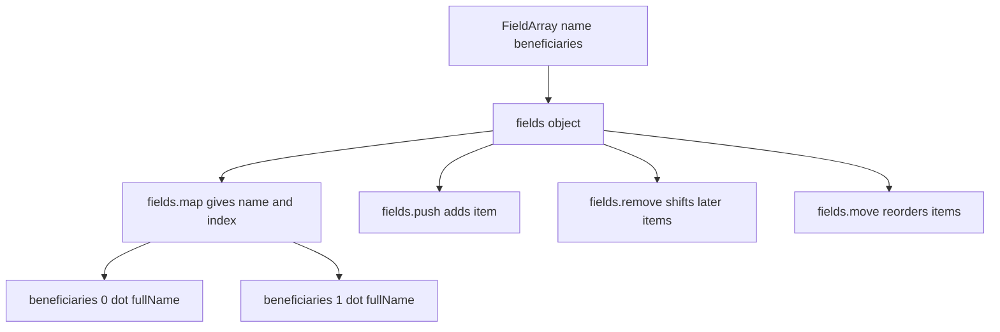
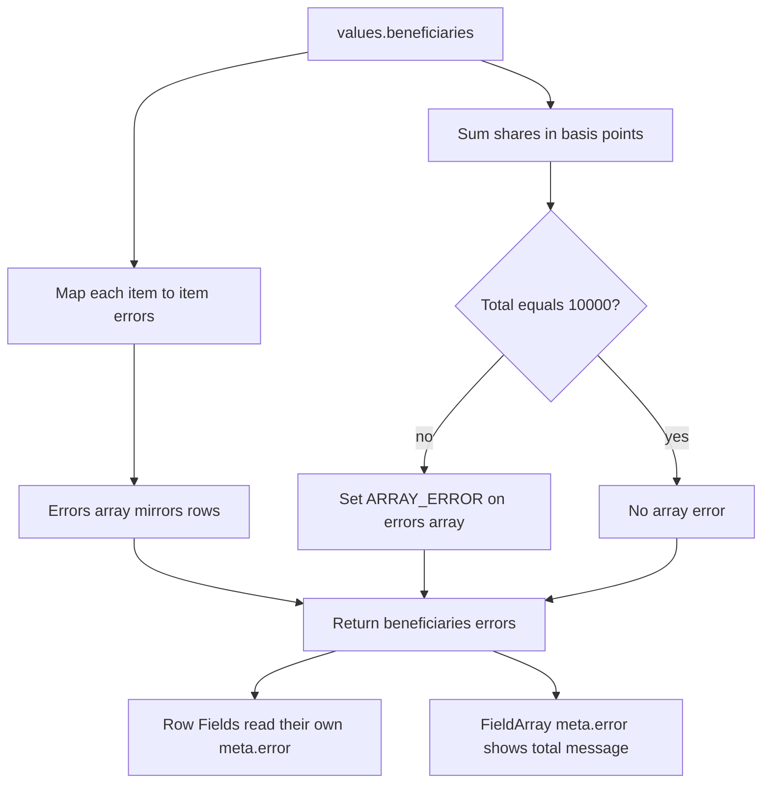

## 1. What it is

**`final-form-arrays` is a set of mutators that let Final Form insert, remove and move items in an array value, and `react-final-form-arrays` gives you a `<FieldArray>` component and `useFieldArray` hook to render one group of fields per item.**

Analogy: think of a paper form with a "Beneficiaries" table and an "add another row" button. The mutators are the clerk who knows how to add a row, cross one out, or reorder rows, while keeping each row's notes (touched, errors) attached to the right row. `<FieldArray>` is the table itself on screen.

The problem it solves: arrays inside form state are hard. If you remove row 1 of 3, rows 2 and 3 must become rows 1 and 2, and their values, errors, touched flags and dirty flags must move with them. Doing that by hand with `form.change` loses field metadata. The mutators shift all of it in one operation.

> **Why mutators and not `form.change`?** `form.change('beneficiaries', newArray)` replaces the value only. Field state like `touched['beneficiaries[2].name']` stays keyed to index 2, so an error would show on the wrong row. Mutators have access to internal state and rename those keys too.

## 2. Core concepts

### [Beginner] Register the array mutators

`<FieldArray>` will throw if the form has no array mutators. Register them once on `<Form>`.

```tsx
import { Form } from 'react-final-form';
import arrayMutators from 'final-form-arrays';

interface Beneficiary {
  id: string;          // stable id for React keys
  fullName: string;
  relationship: 'spouse' | 'child' | 'other' | '';
  sharePercent: string; // string in UI, convert at API boundary
}

interface BeneficiaryFormValues {
  accountId: string;
  beneficiaries: Beneficiary[];
}

<Form<BeneficiaryFormValues>
  onSubmit={saveBeneficiaries}
  mutators={{ ...arrayMutators }}
  initialValues={{ accountId: 'ACC-001', beneficiaries: [] }}
  render={({ handleSubmit }) => <form onSubmit={handleSubmit}>{/* FieldArray here */}</form>}
/>;
```

### [Beginner] `<FieldArray>` and `fields.map`

`<FieldArray name="beneficiaries">` gives you a `fields` object. `fields.map` calls you with the **field name prefix** for each item (for example `beneficiaries[0]`) and the index.

```tsx
import { Field } from 'react-final-form';
import { FieldArray } from 'react-final-form-arrays';

<FieldArray<Beneficiary> name="beneficiaries">
  {({ fields }) => (
    <div>
      {fields.map((name, index) => (
        <fieldset key={fields.value[index]?.id ?? name}>
          <legend>Beneficiary {index + 1}</legend>
          <Field name={`${name}.fullName`} component="input" placeholder="Full name" />
          <Field name={`${name}.relationship`} component="select">
            <option value="">Select</option>
            <option value="spouse">Spouse</option>
            <option value="child">Child</option>
            <option value="other">Other</option>
          </Field>
          <Field name={`${name}.sharePercent`} component="input" inputMode="decimal" />
          <button type="button" onClick={() => fields.remove(index)}>Remove</button>
        </fieldset>
      ))}
    </div>
  )}
</FieldArray>;
```



> **Why the name is a prefix string:** Final Form addresses nested values with path strings like `beneficiaries[1].sharePercent`. Each `<Field>` registers under its full path, so each sub-field gets its own subscription and only re-renders when its own value changes.

### [Beginner] push, remove, move and friends

```tsx
const newBeneficiary = (): Beneficiary => ({
  id: crypto.randomUUID(),
  fullName: '',
  relationship: '',
  sharePercent: '',
});

<FieldArray<Beneficiary> name="beneficiaries">
  {({ fields }) => (
    <>
      {fields.map((name, index) => (
        <div key={fields.value[index]?.id ?? name}>
          {/* ... */}
          <button type="button" disabled={index === 0} onClick={() => fields.move(index, index - 1)}>
            Move up
          </button>
          <button type="button" onClick={() => fields.remove(index)}>Remove</button>
        </div>
      ))}
      <button type="button" onClick={() => fields.push(newBeneficiary())} disabled={(fields.length ?? 0) >= 5}>
        Add beneficiary
      </button>
    </>
  )}
</FieldArray>;
```

| Method | Effect |
| --- | --- |
| `fields.push(value)` | Append |
| `fields.pop()` | Remove last |
| `fields.insert(index, value)` | Insert at index |
| `fields.remove(index)` | Remove at index, shift the rest |
| `fields.move(from, to)` | Reorder |
| `fields.swap(a, b)` | Swap two items |
| `fields.update(index, value)` | Replace one item |
| `fields.unshift(value)` / `fields.shift()` | Prepend / remove first |
| `fields.length` | Item count |
| `fields.value` | The current array |
| `fields.forEach`, `fields.map` | Iterate names |

Outside a `FieldArray` you can call the same mutators through the form API: `form.mutators.push('beneficiaries', item)`.

### [Intermediate] useFieldArray

The hook version is handy for custom components.

```tsx
import { useFieldArray } from 'react-final-form-arrays';

function LineItems() {
  const { fields, meta } = useFieldArray<LineItem>('lineItems');
  return (
    <table>
      <tbody>
        {fields.map((name, index) => (
          <LineItemRow key={fields.value[index]?.id ?? name} name={name} onRemove={() => fields.remove(index)} />
        ))}
      </tbody>
      {meta.error && typeof meta.error === 'string' && <caption role="alert">{meta.error}</caption>}
    </table>
  );
}
```

### [Intermediate] Validating array items and the array as a whole

There are two kinds of errors:

1. **Item errors**: "row 2 name is required". The errors object mirrors the values: `{ beneficiaries: [undefined, { fullName: 'Required' }] }`.
2. **Array-level errors**: "shares must total 100%". These belong to the array, not a row. Final Form uses a special `ARRAY_ERROR` key on the errors array.

```ts
import { ARRAY_ERROR } from 'final-form';

type ItemErrors = Partial<Record<keyof Beneficiary, string>> | undefined;

export function validateBeneficiaries(values: BeneficiaryFormValues) {
  const list = values.beneficiaries ?? [];

  const itemErrors: ItemErrors[] = list.map((b) => {
    const e: Partial<Record<keyof Beneficiary, string>> = {};
    if (!b.fullName?.trim()) e.fullName = 'Required';
    if (!b.relationship) e.relationship = 'Required';
    const pct = Number(b.sharePercent);
    if (!b.sharePercent || !Number.isFinite(pct) || pct <= 0 || pct > 100) {
      e.sharePercent = 'Enter 1 to 100';
    }
    return Object.keys(e).length ? e : undefined;
  });

  // Sum with integer basis points to avoid float drift: 33.33 + 33.33 + 33.34
  const totalBps = list.reduce((sum, b) => sum + Math.round(Number(b.sharePercent || 0) * 100), 0);

  const arrayErrors = itemErrors as ItemErrors[] & { [ARRAY_ERROR]?: string };
  if (list.length > 0 && totalBps !== 10_000) {
    arrayErrors[ARRAY_ERROR] = 'Shares must add up to exactly 100%';
  }

  const hasAny = itemErrors.some(Boolean) || arrayErrors[ARRAY_ERROR];
  return hasAny ? { beneficiaries: arrayErrors } : {};
}
```

Read the array-level error from the FieldArray's `meta.error`:

```tsx
<FieldArray<Beneficiary> name="beneficiaries">
  {({ fields, meta }) => (
    <>
      {fields.map(/* rows */)}
      {(meta.touched || meta.submitFailed) && typeof meta.error === 'string' && (
        <p role="alert">{meta.error}</p>
      )}
    </>
  )}
</FieldArray>
```



> **Finance tip:** Never sum percentages or money as floats. `33.33 + 33.33 + 33.34` in floating point may not equal `100` exactly. Convert to integers (basis points, cents) before comparing.

You can also pass a `validate` prop directly to `<FieldArray>` for a self-contained component; it receives the array value and returns errors in the same shape.

### [Advanced] Line items with a live total

```tsx
interface LineItem { id: string; description: string; quantity: string; unitPrice: string }
interface InvoiceValues { lineItems: LineItem[] }

const toCents = (s: string) => Math.round(Number(s || 0) * 100); // fine for display preview only

function InvoiceTotal() {
  const { values } = useFormState<InvoiceValues>({ subscription: { values: true } });
  const totalCents = (values.lineItems ?? []).reduce(
    (sum, li) => sum + Number(li.quantity || 0) * toCents(li.unitPrice),
    0,
  );
  return <output>{(totalCents / 100).toLocaleString('en-US', { style: 'currency', currency: 'USD' })}</output>;
}
```

> **Why a separate component:** Only `InvoiceTotal` subscribes to all values. The rows and the form itself do not re-render when a sibling row changes.

## 3. Why it's used in this project

- **Beneficiaries** on retirement and brokerage accounts: add up to N people, shares must total 100%.
- **Invoice and payment-batch line items**: bulk payouts, split payments, multi-leg transfers.
- **Authorized signers and joint owners** with per-person KYC fields.
- **Address history** ("list every address for the last 3 years").
- **Audit trails**: final-form tracks dirty state per row, so you can show "row 2 modified" in a review step.

> **Finance tip:** Give every row a client-generated `id` and send it to the API. It makes server-side diffing and audit logs ("beneficiary X removed") reliable instead of guessing by index.

## 4. Setup & configuration

```bash
npm install final-form-arrays react-final-form-arrays
# peer deps: final-form, react-final-form, react
```

```tsx
import arrayMutators from 'final-form-arrays';
import { FieldArray } from 'react-final-form-arrays';

<Form
  onSubmit={onSubmit}
  // Required for FieldArray. You can merge your own mutators too.
  mutators={{ ...arrayMutators, setFieldValue }}
  // Good default for arrays: removed rows drop their values entirely.
  destroyOnUnregister
  render={({ handleSubmit }) => (
    <form onSubmit={handleSubmit}>
      <FieldArray
        name="beneficiaries"
        // Optional array-level validator.
        validate={validateBeneficiaryArray}
        // Optional: what FieldArray re-renders on. Include value if you read fields.value.
        subscription={{ length: true, value: true, error: true, touched: true, submitFailed: true }}
      >
        {({ fields, meta }) => null}
      </FieldArray>
    </form>
  )}
/>;
```

> **Gotcha:** If you narrow the `subscription` and leave out `value`, `fields.value` can be `undefined` and your key lookup breaks.

## 5. Key features we use

### [Beginner] Start with one empty row

```tsx
const initialValues = useMemo(
  () => ({ accountId, beneficiaries: [newBeneficiary()] }),
  [accountId],
);
```

### [Intermediate] Remove with confirmation and focus management

```tsx
const removeRow = (index: number) => {
  if (!window.confirm('Remove this beneficiary?')) return;
  fields.remove(index);
  // move focus to the Add button for keyboard and screen reader users
  addButtonRef.current?.focus();
};
```

### [Intermediate] Converting rows at the API boundary

```ts
const toApi = (v: BeneficiaryFormValues) => ({
  accountId: v.accountId,
  beneficiaries: v.beneficiaries.map((b) => ({
    id: b.id,
    fullName: b.fullName.trim(),
    relationship: b.relationship,
    shareBps: Math.round(Number(b.sharePercent) * 100),
  })),
});
```

### [Advanced] Calling array mutators outside FieldArray

```tsx
function DuplicateLastButton() {
  const form = useForm<InvoiceValues>();
  return (
    <button
      type="button"
      onClick={() => {
        const items = form.getState().values.lineItems ?? [];
        const last = items[items.length - 1];
        if (last) form.mutators.push('lineItems', { ...last, id: crypto.randomUUID() });
      }}
    >
      Duplicate last line
    </button>
  );
}
```

## 6. Interview questions

#### Q: Why do you need mutators for arrays instead of calling form.change with a new array?

`form.change` replaces the value only. Field state such as touched, visited, errors and submit errors is stored per path (`items[2].name`). After removing index 1, index 2's metadata must move to index 1. Mutators get access to Final Form's internal mutable state and rename those keys, so errors and touched flags stay with the correct row.

#### Q: What should you use as the React key in fields.map, and why?

A stable, unique id stored in each item (for example `crypto.randomUUID()` set when the row is created). The `name` passed by `fields.map` is index-based (`items[0]`), so after a remove or move, React would reuse the wrong component instance. That breaks anything with local state (an open date picker, a react-select's typed text, focus). The docs show `key={name}`, which works for plain inputs but is fragile with stateful children.

#### Q: How do you show an error that applies to the whole array, not a row?

Return an errors array with the `ARRAY_ERROR` key set (imported from `final-form`), e.g. `errors[ARRAY_ERROR] = 'Shares must total 100%'`. Row errors stay at their indices. The `<FieldArray>` render props expose it as `meta.error`.

#### Q: How do you validate that beneficiary percentages total 100?

In record-level validation (or the FieldArray `validate`), convert each share to integer basis points with `Math.round(pct * 100)`, sum them, and compare to `10000`. Set an array-level error if not equal. Using integers avoids floating-point errors like `0.1 + 0.2 !== 0.3`. Also enforce it on the server.

#### Q: How do you keep a large list of line items fast?

Keep each sub-field as its own `<Field>` with a narrow subscription, give the `<Form>` a narrow subscription, compute totals in a separate component subscribed to `values` (or use `final-form-calculate`), use stable keys, and for very long lists virtualize the rows. Avoid reading `values` in the form's render function.

## 7. Drawbacks & pain points

- Field names are strings built by concatenation (`` `${name}.sharePercent` ``), so typos are not caught.
- `ARRAY_ERROR` requires casting in TypeScript because arrays do not normally have extra keys.
- Errors for arrays are easy to get wrong in shape; a flat object will not map to rows.
- Many rows with many fields can still be slow without careful subscriptions.
- Packages are mature but rarely updated.

Gotchas that trip devs up:

```tsx
// 1. Forgetting mutators
<Form onSubmit={s} render={() => <FieldArray name="x">{() => null}</FieldArray>} />
// Error: array mutators not found. Add mutators={{ ...arrayMutators }}.

// 2. Using the index as key with stateful children
{fields.map((name, i) => <Row key={i} name={name} />)} // wrong row keeps state after remove

// 3. Pushing nothing
fields.push(undefined); // creates an undefined item; validators must handle it
fields.push(newBeneficiary()); // better

// 4. Removing inside a loop by ascending index
selected.forEach((i) => fields.remove(i)); // indexes shift after each remove
[...selected].sort((a, b) => b - a).forEach((i) => fields.remove(i)); // remove from the end
// or form.mutators.removeBatch('beneficiaries', selected)
```

## 8. Better alternatives

React Hook Form's `useFieldArray` provides the same features with a generated stable `id` per row (`field.id`) built in, typed paths, and resolver-based validation. TanStack Form supports array fields with typed `pushValue`/`removeValue` helpers.

| Library | Bundle (gzip) | Boilerplate | Devtools | Learning curve | TypeScript | Popularity | When it wins |
| --- | --- | --- | --- | --- | --- | --- | --- |
| final-form-arrays + RFF arrays | ~2 kB | Medium | None | Medium | Weak paths | Declining | Existing RFF apps |
| RHF useFieldArray | included in ~10 kB | Low | Yes | Low | Good | Very high | New React forms |
| TanStack Form array fields | included in ~10-13 kB | Medium | Yes | Medium | Excellent | Growing | Strictly typed complex forms |

```tsx
// RHF equivalent: ids are generated for you
const { fields, append, remove } = useFieldArray({ control, name: 'beneficiaries' });
fields.map((f, i) => <input key={f.id} {...register(`beneficiaries.${i}.fullName`)} />);
```

## 9. When NOT to use it

- The list is fixed length (exactly two signers): use normal fields with fixed names.
- The array is display-only or edited in a separate modal one item at a time: keep it outside the form.
- Very large editable grids (hundreds of rows, spreadsheet-like): use a data grid with its own editing model (AG Grid, TanStack Table with cell editors).
- You are not using Final Form at all.

## Cheatsheet

| Need | Code |
| --- | --- |
| Register | `mutators={{ ...arrayMutators }}` |
| Render rows | `<FieldArray name="items">{({ fields, meta }) => fields.map((name, i) => ...)}</FieldArray>` |
| Sub-field | ``<Field name={`${name}.amount`} />`` |
| Add | `fields.push(item)` / `fields.insert(i, item)` |
| Remove | `fields.remove(i)` / `form.mutators.removeBatch('items', [1, 3])` |
| Reorder | `fields.move(from, to)` / `fields.swap(a, b)` |
| Replace | `fields.update(i, item)` |
| Read | `fields.length`, `fields.value[i]` |
| Hook | `const { fields, meta } = useFieldArray('items')` |
| Row error | `{ items: [undefined, { amount: 'Required' }] }` |
| Array error | `errorsArray[ARRAY_ERROR] = 'Must total 100%'` |
| Key | `key={fields.value[i]?.id ?? name}` |

```tsx
<FieldArray<LineItem> name="lineItems">
  {({ fields, meta }) => (
    <>
      {fields.map((name, i) => (
        <div key={fields.value[i]?.id ?? name}>
          <Field name={`${name}.description`} component="input" />
          <Field name={`${name}.unitPrice`} component="input" inputMode="decimal" />
          <button type="button" onClick={() => fields.remove(i)}>x</button>
        </div>
      ))}
      <button type="button" onClick={() => fields.push({ id: crypto.randomUUID(), description: '', quantity: '1', unitPrice: '' })}>
        Add line
      </button>
      {typeof meta.error === 'string' && <p role="alert">{meta.error}</p>}
    </>
  )}
</FieldArray>
```
