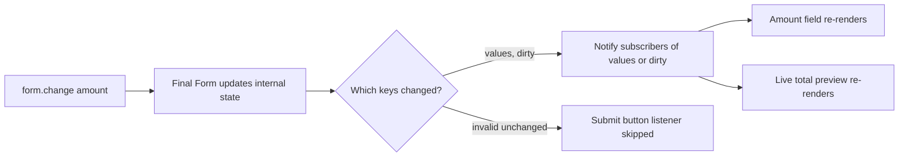
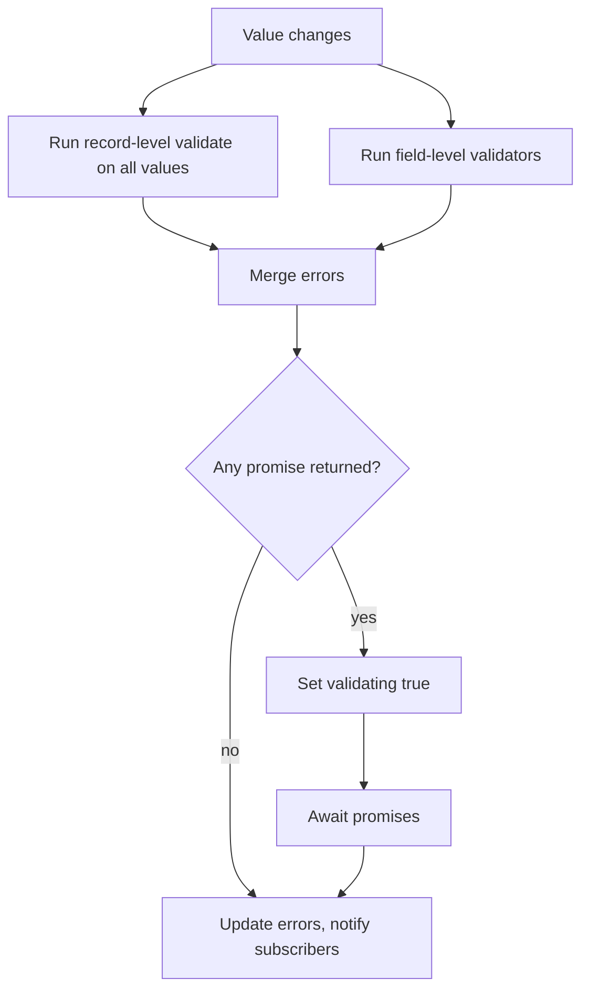
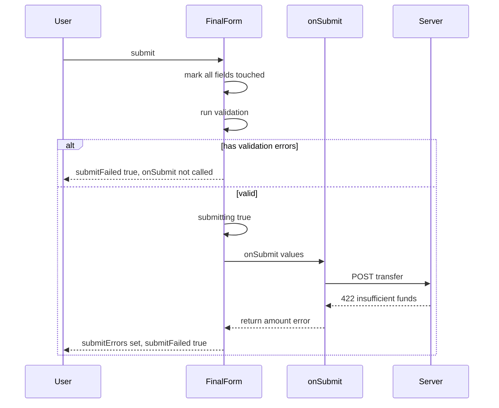

## 1. What it is

**Final Form is a plain JavaScript "form state machine": it stores values, errors and flags for every field, and notifies subscribers only about the pieces of state they asked for.**

Think of it as a newspaper subscription desk. The form is the printing press. Every input, error label and submit button is a reader. Instead of delivering the whole paper to everyone every time anything changes, the desk only delivers the section each reader subscribed to. The "amount" input subscribes to its own value and error. The submit button subscribes to `submitting` and `invalid`. Nobody gets mail they did not ask for.

The problem it solves: forms have a lot of state (values, touched, dirty, errors, submit status) and a lot of small UI parts that each care about a slice of it. If you keep that state in one React `useState`, every keystroke re-renders the entire form. On a 60-field account-opening form that becomes laggy. Final Form keeps the state outside React and lets each part subscribe surgically. It has zero dependencies and no knowledge of React; `react-final-form` is a thin binding on top.

> **Why:** Separating the engine from the UI layer means the same logic can be unit-tested in plain Node, and bindings can exist for other frameworks (Vue, Svelte, Angular wrappers exist).

## 2. Core concepts

### [Beginner] createForm: the engine instance

`createForm` returns a `FormApi` object. It needs one required option: `onSubmit`. Everything else is optional.

```ts
import { createForm, FormApi } from 'final-form';

interface TransferValues {
  fromAccountId: string;
  toAccountId: string;
  amount: string; // keep money as a string in the UI layer
  memo?: string;
}

const form: FormApi<TransferValues> = createForm<TransferValues>({
  initialValues: { fromAccountId: 'ACC-001', toAccountId: '', amount: '' },
  onSubmit: async (values) => {
    await api.createTransfer(values);
  },
});

// Imperative API — what React bindings call under the hood
form.change('amount', '250.00');
form.focus('amount');
form.blur('amount');
console.log(form.getState().values.amount); // "250.00"
form.submit();
```

The mental model: `form` is an object that lives outside any component. You "drive" it with `change`, `focus`, `blur`, `submit`, `reset`. You "read" it with `getState()` or, much better, with `subscribe`.

### [Beginner] Subscriptions: why Final Form avoids re-renders

`form.subscribe(listener, subscription)` registers a callback. The `subscription` object is a set of boolean flags naming which keys of form state you care about. The listener fires once immediately, then only when one of those keys changes.

```ts
const unsubscribe = form.subscribe(
  (state) => {
    // Only called when `submitting` or `invalid` changes
    submitButton.disabled = state.submitting || state.invalid;
  },
  { submitting: true, invalid: true },
);

// typing into "memo" changes `values`, but this listener is NOT called
form.change('memo', 'Rent');

unsubscribe();
```



> **Why:** React re-renders a component when its state changes. If the whole form is one state object, every change re-renders everything. Final Form compares old and new values per subscribed key and only calls listeners whose keys actually changed. In React this maps to "only the components that care re-render."

> **Interview tip:** Say "observer pattern with opt-in, per-key subscriptions." That phrase shows you understand the core design.

### [Beginner] Form state shape

`form.getState()` returns a `FormState`. The keys you use most:

| Key | Meaning |
| --- | --- |
| `values` | Current values object |
| `initialValues` | Values the form was initialized with |
| `pristine` | `true` if values deep-equal `initialValues` |
| `dirty` | Opposite of `pristine` |
| `dirtyFields` | Map of field name to `true` for each changed field |
| `touched` | Map of field name to boolean (blurred at least once) |
| `visited` | Map of field name to boolean (focused at least once) |
| `active` | Name of the currently focused field, or `undefined` |
| `errors` | Validation errors (sync + async) |
| `valid` / `invalid` | Whether `errors` is empty |
| `validating` | `true` while async validation is running |
| `submitting` | `true` while an `onSubmit` promise is pending |
| `submitSucceeded` / `submitFailed` | Result of the last submit |
| `submitErrors` / `submitError` | Errors returned by `onSubmit` (field-level / form-level) |
| `hasValidationErrors` / `hasSubmitErrors` | Shortcuts |
| `dirtySinceLastSubmit` | Changed after the last submit attempt |
| `modified` | Map of fields ever changed by the user |

```ts
const state = form.getState();
if (state.dirty && !state.submitting) {
  window.onbeforeunload = () => 'You have unsaved changes';
}
```

### [Beginner] Field state shape

Each registered field has its own `FieldState`. The keys mirror form state but scoped to one field.

```ts
form.registerField(
  'amount',
  (field) => {
    // field.value, field.error, field.touched, field.dirty, field.pristine,
    // field.active, field.visited, field.submitError, field.valid, field.invalid,
    // field.initial, field.modified, field.validating, field.length (arrays)
    const showError = field.touched && (field.error || field.submitError);
    errorLabel.textContent = showError ? (field.error ?? field.submitError) : '';
  },
  { value: true, error: true, touched: true, submitError: true },
);
```

> **Gotcha:** `touched` means "blurred", not "changed". A user who types and never leaves the input has `touched: false`. That is why errors usually show on blur, not on every keystroke.

### [Intermediate] Record-level validation

A single `validate(values)` function on the form returns an errors object whose shape mirrors `values`. An empty object (or `undefined`) means valid.

```ts
const form = createForm<TransferValues>({
  onSubmit,
  validate: (values) => {
    const errors: Partial<Record<keyof TransferValues, string>> = {};
    if (!values.toAccountId) errors.toAccountId = 'Choose a destination account';
    if (values.toAccountId === values.fromAccountId) {
      errors.toAccountId = 'Cannot transfer to the same account';
    }
    const amount = Number(values.amount);
    if (!values.amount) errors.amount = 'Amount is required';
    else if (!Number.isFinite(amount) || amount <= 0) errors.amount = 'Enter a positive amount';
    return errors;
  },
});
```

Use record-level validation for **cross-field rules** (to vs from account, end date after start date) because the function sees all values at once. It also plugs naturally into schema libraries like Zod.

### [Intermediate] Field-level validation

Each field can register its own validator. It receives `(value, allValues, meta)`.

```ts
const required = (v: unknown) => (v ? undefined : 'Required');
const maxAmount = (limit: number) => (v: string) =>
  Number(v) > limit ? `Daily limit is ${limit}` : undefined;

form.registerField('amount', () => {}, { value: true }, {
  getValidator: () => (value: string) => required(value) ?? maxAmount(10000)(value),
});
```

Final Form merges field-level errors and record-level errors into one `errors` object. If both produce an error for the same field, the field-level one wins.



> **Why:** By default Final Form re-runs *all* field validators when any value changes, because a validator may read `allValues`. In React Final Form you can narrow this with `validateFields={[]}` for expensive validators.

### [Intermediate] Async validation

A validator may return a Promise. While it is pending, `validating` is `true`.

```ts
const checkIbanRemote = async (iban: string) => {
  if (!iban) return 'Required';
  const res = await fetch(`/api/iban/validate?value=${encodeURIComponent(iban)}`);
  const { valid } = (await res.json()) as { valid: boolean };
  return valid ? undefined : 'IBAN not recognised';
};

form.registerField('iban', () => {}, { value: true, validating: true }, {
  getValidator: () => checkIbanRemote,
});
```

Final Form does **not** debounce. Every keystroke triggers a call. Debounce or cache yourself:

```ts
function memoizeLast<T>(fn: (v: string) => Promise<T>) {
  let lastValue: string | undefined;
  let lastResult: Promise<T>;
  return (v: string) => {
    if (v !== lastValue) {
      lastValue = v;
      lastResult = fn(v);
    }
    return lastResult;
  };
}
const ibanValidator = memoizeLast(checkIbanRemote);
```

> **Gotcha:** Async validators run on every change of *any* field (see above). Without memoizing, typing into "memo" fires IBAN API calls. Prefer validating remote things in `onSubmit` instead, unless the UX truly needs it.

### [Intermediate] onSubmit and submission errors

`onSubmit(values, form, callback)` can:

1. Return `undefined` (or resolve to it): success.
2. Return an errors object (or resolve to one): **submission errors**. These land in `submitErrors` and each field's `meta.submitError`.
3. Use the special key `FORM_ERROR` for an error that belongs to the form, not a field.

```ts
import { createForm, FORM_ERROR } from 'final-form';

const form = createForm<TransferValues>({
  onSubmit: async (values) => {
    const res = await fetch('/api/transfers', {
      method: 'POST',
      headers: { 'Content-Type': 'application/json' },
      body: JSON.stringify(values),
    });
    if (res.status === 422) {
      const body = (await res.json()) as { field?: keyof TransferValues; message: string };
      return body.field
        ? { [body.field]: body.message } // e.g. { amount: 'Insufficient funds' }
        : { [FORM_ERROR]: body.message };
    }
    if (!res.ok) return { [FORM_ERROR]: 'Transfer failed. Please try again.' };
    return undefined; // success
  },
});
```



> **Why:** Validation errors answer "is this input well-formed?" Submission errors answer "did the server accept it?" Keeping them separate lets the UI clear a server error the moment the user edits (`dirtySinceLastSubmit`) without hiding real validation errors.

> **Finance tip:** Server-side rules (insufficient funds, cut-off time passed, duplicate payment) must always come back as submission errors. Never trust client validation alone for money movement.

### [Advanced] Decorators

A decorator is a function `(form) => unsubscribe` that subscribes to the form and reacts. It adds behavior without touching field components.

```ts
import createCalculator from 'final-form-calculate';
import createFocusDecorator from 'final-form-focus';

interface InvoiceValues { quantity: string; unitPrice: string; total: string }

const calculator = createCalculator<InvoiceValues>({
  field: /quantity|unitPrice/, // string or RegExp
  updates: {
    total: (_value, allValues) => {
      const q = Number(allValues?.quantity ?? 0);
      const p = Number(allValues?.unitPrice ?? 0);
      return (q * p).toFixed(2);
    },
  },
});

const focusOnError = createFocusDecorator<InvoiceValues>();

const form = createForm<InvoiceValues>({ onSubmit });
const undoCalc = calculator(form);
const undoFocus = focusOnError(form); // focuses first errored input after failed submit
```

> **Finance tip:** `final-form-calculate` is great for derived fields such as fees or totals. Still recompute totals on the server; the client value is a preview only.

### [Advanced] Mutators

A mutator is a function that changes form state in ways the public API cannot (for example, setting a field value without marking it touched, or inserting into an array). Signature: `(args, state, tools) => void`.

```ts
import { createForm, Mutator } from 'final-form';

const setFieldValue: Mutator<TransferValues> = ([name, value], state, { changeValue }) => {
  changeValue(state, name, () => value);
};

const clearSubmitErrors: Mutator<TransferValues> = (_args, state) => {
  state.formState.submitErrors = undefined;
  state.formState.submitError = undefined;
};

const form = createForm<TransferValues>({
  onSubmit,
  mutators: { setFieldValue, clearSubmitErrors },
});

form.mutators.setFieldValue('amount', '0.00');
form.mutators.clearSubmitErrors();
```

`tools` gives `changeValue`, `getIn`, `setIn`, `shallowEqual` and `resetFieldState`. The most famous mutator package is `final-form-arrays`.

### [Advanced] batch, pause validation, and reinitialize

```ts
// Change several fields but notify subscribers once
form.batch(() => {
  form.change('fromAccountId', 'ACC-002');
  form.change('amount', '');
});

// Skip validation during a bulk load
form.pauseValidation();
loaded.forEach(([k, v]) => form.change(k, v));
form.resumeValidation();

// Reset to new server data (e.g. after save)
form.initialize(savedTransfer);     // new initialValues, pristine again
form.reset();                       // back to current initialValues
form.restart();                     // reset values AND all field state (touched, etc.)
```

## 3. Why it's used in this project

- **Large account forms.** Onboarding and KYC forms have dozens of fields (address history, employment, beneficiaries). Subscription-based updates keep typing smooth.
- **Separate validation from server results.** Transfers and payments get server-side rejections (insufficient funds, limits, cut-off times). `submitErrors` and `FORM_ERROR` model this cleanly.
- **Derived money values.** Decorators compute fees, FX conversions and totals as the user types.
- **Audit-friendly dirty tracking.** `dirtyFields` tells you exactly which fields changed. You can send only changed fields to an "edit account details" endpoint and log them for audit.
- **Unsaved-changes guards.** `dirty` powers "you have unsaved changes" prompts before a session timeout or navigation.

> **Finance tip:** Use `dirtyFields` to build a PATCH payload. Smaller payloads mean smaller audit diffs and fewer accidental overwrites of fields another operator changed.

```ts
function changedOnly<T extends object>(state: { values: T; dirtyFields: Record<string, boolean> }) {
  return Object.fromEntries(
    Object.keys(state.dirtyFields).map((k) => [k, (state.values as Record<string, unknown>)[k]]),
  ) as Partial<T>;
}
```

## 4. Setup & configuration

```bash
npm install final-form
# optional helpers
npm install final-form-arrays final-form-calculate final-form-focus
```

```ts
import { createForm, FormApi, Config } from 'final-form';
import arrayMutators from 'final-form-arrays';

const config: Config<AccountValues> = {
  // Required. Called only when there are no validation errors.
  onSubmit: async (values, form) => saveAccount(values),

  // Starting values. Changing them later requires form.initialize().
  initialValues: { name: '', currency: 'USD', beneficiaries: [] },

  // Record-level validation. Return {} or undefined for valid.
  validate: validateAccount,

  // Extra state-changing functions, exposed on form.mutators.
  mutators: { ...arrayMutators },

  // When initialValues change, keep the user's unsaved edits.
  keepDirtyOnReinitialize: false,

  // If a field unregisters (unmounts), delete its value too.
  // Useful for conditional fields so hidden values are not submitted.
  destroyOnUnregister: false,

  // Logs every state change. Development only.
  debug: undefined,

  // Validate on blur only? Not a config here; that is a binding concern.
};

export const accountForm: FormApi<AccountValues> = createForm(config);
```

> **Gotcha:** `destroyOnUnregister: false` (the default) means a hidden field keeps its value. If the user picked "Joint account", entered a co-owner, then switched back to "Individual", the co-owner data is still submitted unless you clear it.

## 5. Key features we use

### [Beginner] Reading state once vs subscribing

```ts
// One-off read (in an event handler)
const { values, valid } = form.getState();

// Reactive read (keeps UI in sync)
form.subscribe(({ dirty }) => setUnsavedBanner(dirty), { dirty: true });
```

### [Beginner] Getting one field's state

```ts
const amountState = form.getFieldState('amount');
if (amountState?.error) console.warn(amountState.error);
```

### [Intermediate] Form-level submit error display

```ts
form.subscribe(
  ({ submitError, submitting }) => {
    banner.textContent = submitting ? 'Processing...' : submitError ?? '';
  },
  { submitError: true, submitting: true },
);
```

### [Intermediate] Changing initial values after save

```ts
const onSubmit = async (values: AccountValues, form: FormApi<AccountValues>) => {
  const saved = await saveAccount(values);
  // Make the saved data the new baseline so `pristine` is true again
  setTimeout(() => form.initialize(saved));
};
```

> **Gotcha:** Calling `form.initialize` or `form.reset` synchronously inside `onSubmit` can be overwritten by Final Form's own post-submit state update. Wrapping in `setTimeout` (or using the `then` of `form.submit()`) is the common workaround.

### [Advanced] Setting a field value without touching it

```ts
form.mutators.setFieldValue('currency', defaultCurrencyFor(country));
```

## 6. Interview questions

#### Q: Why does Final Form re-render fewer components than storing form state in a single useState?

Because it uses the observer pattern with per-key subscriptions. Each subscriber passes a flags object (`{ value: true, error: true }`). After every state change Final Form compares the previous and next values for only those keys and calls a listener only if one changed. In React, each `Field` is its own subscriber, so typing in one input re-renders only that input (plus anything subscribed to `values`). A single `useState` holding the whole form re-renders the parent and every child on every keystroke unless you add a lot of memoization.

#### Q: What is the difference between validation errors and submission errors?

Validation errors come from `validate` functions and describe client-side correctness. If any exist, `onSubmit` is not called. Submission errors are what `onSubmit` returns (an object, or `{ [FORM_ERROR]: msg }`) after talking to the server. They live in `submitErrors`/`submitError` and per-field `meta.submitError`. You can hide a submission error once the user edits (`dirtySinceLastSubmit`) while still showing validation errors.

#### Q: When would you use record-level validation vs field-level validation?

Record-level (`validate` on the form) for cross-field rules and for schema-based validation (one Zod schema for the whole form). Field-level (`validate` on a field) for reusable, self-contained rules attached to a component, such as an IBAN field that always validates IBAN format, or for conditional fields that should only validate while mounted. Both can be combined; Final Form merges the results.

#### Q: What is a decorator and what is a mutator?

A decorator is `(form) => unsubscribe`: it subscribes to the form from the outside and reacts, for example computing totals (`final-form-calculate`) or focusing the first error (`final-form-focus`). A mutator is `(args, state, tools) => void`: it is registered in config and gets direct, mutable access to internal state, enabling operations the public API does not offer, like array insert/remove (`final-form-arrays`) or setting a value without marking it touched.

#### Q: How does Final Form handle async validation, and what are its pitfalls?

A validator can return a Promise. While pending, `validating` is `true` and errors update when it resolves. Pitfalls: no built-in debounce, validators re-run when any field changes (so an API check fires on unrelated keystrokes), and stale responses must be handled. Fix by memoizing on the last value, narrowing `validateFields` in React Final Form, or moving remote checks to `onSubmit` as submission errors.

## 7. Drawbacks & pain points

- **Low release activity.** The library is stable but sees few releases. Community energy has shifted to React Hook Form and TanStack Form.
- **Stringly-typed field names.** `form.change('amout', ...)` (typo) compiles. Generics help for top-level keys but nested paths like `beneficiaries[0].name` are plain strings.
- **TypeScript types are loose** around errors objects (`ValidationErrors` is basically `any`-ish) in 4.x.
- **No built-in schema support.** You write an adapter for Zod or Yup yourself.
- **Async validation has no debounce** and runs too often by default.
- **Hidden fields keep values** unless `destroyOnUnregister` is set or you clear them.

Gotchas that trip devs up:

```ts
// 1. Error shape must mirror the values shape
validate: (v) => ({ 'beneficiaries[0].name': 'Required' }); // WRONG: flat key is not a path
validate: (v) => ({ beneficiaries: [{ name: 'Required' }] }); // RIGHT: nested like values
// Tip: build nested errors with setIn(errors, 'beneficiaries[0].name', 'Required')

// 2. Expecting onSubmit to run when there are validation errors
// It will not. submitFailed becomes true and all fields become touched.

// 3. Reading state in a subscriber you did not subscribe to
form.subscribe((s) => console.log(s.values), { submitting: true });
// s.values is undefined - you only get the keys you subscribed to.
```

## 8. Better alternatives

The industry default for React forms in 2026 is **React Hook Form** (uncontrolled inputs + refs, very small re-render surface, first-class resolvers for Zod/Valibot). **TanStack Form** is the rising option: fully type-safe field paths, framework-agnostic core (like Final Form), and built-in async debouncing. React 19 also adds `useActionState` and form Actions, which cover simple server-submitted forms without any library.

| Library | Bundle (gzip) | Boilerplate | Devtools | Learning curve | TypeScript | Popularity | When it wins |
| --- | --- | --- | --- | --- | --- | --- | --- |
| Final Form + RFF | ~8 kB | Medium | None official (`debug` option) | Medium | OK, loose paths | Declining | Existing codebases, framework-agnostic core |
| React Hook Form | ~10 kB | Low | `@hookform/devtools` | Low | Good, typed paths | Very high | Most new React forms |
| TanStack Form | ~10-13 kB | Medium | TanStack devtools | Medium | Excellent, typed paths | Growing fast | Complex, strongly typed forms |
| Formik | ~13 kB | Medium | None | Low | OK | High but stagnant | Legacy only |
| React 19 Actions | 0 kB | Low | React DevTools | Low | Good | New | Simple server-submitted forms |

> **Outdated:** Formik is effectively unmaintained. Final Form is maintained but slow-moving. Do not pick either for a new project without a reason.

## 9. When NOT to use it

- A login or search form with two fields: plain `useState` or React 19 form Actions are enough.
- A new greenfield app where the team already knows React Hook Form.
- When you need strongly typed nested field paths enforced by the compiler (TanStack Form does this).
- Server-rendered forms that should work without JavaScript (use native forms + server actions).
- When you need built-in schema integration and devtools out of the box.

## Cheatsheet

| API | Purpose |
| --- | --- |
| `createForm({ onSubmit, initialValues, validate, mutators })` | Create engine |
| `form.subscribe(fn, { values: true })` | Listen to form state keys |
| `form.registerField(name, fn, sub, { getValidator })` | Register a field |
| `form.change / focus / blur(name, value?)` | Drive a field |
| `form.submit()` | Validate then call `onSubmit` |
| `form.reset(values?) / initialize(values) / restart()` | Reset helpers |
| `form.batch(fn)` | Many changes, one notification |
| `form.getState() / getFieldState(name)` | Snapshot reads |
| `form.mutators.x(...)` | Call a registered mutator |
| `FORM_ERROR` | Key for form-level submit error |
| `ARRAY_ERROR` | Key for array-level error |
| `setIn / getIn` | Path helpers for nested objects |

```ts
import { createForm, FORM_ERROR } from 'final-form';

const form = createForm<{ amount: string }>({
  initialValues: { amount: '' },
  validate: (v) => (v.amount ? {} : { amount: 'Required' }),
  onSubmit: async (v) => (Number(v.amount) > 1000 ? { amount: 'Over limit' } : undefined),
});

form.subscribe((s) => render(s), { values: true, errors: true, submitting: true });
form.change('amount', '50');
await form.submit();
// Server failure example: return { [FORM_ERROR]: 'Network error' }
```
