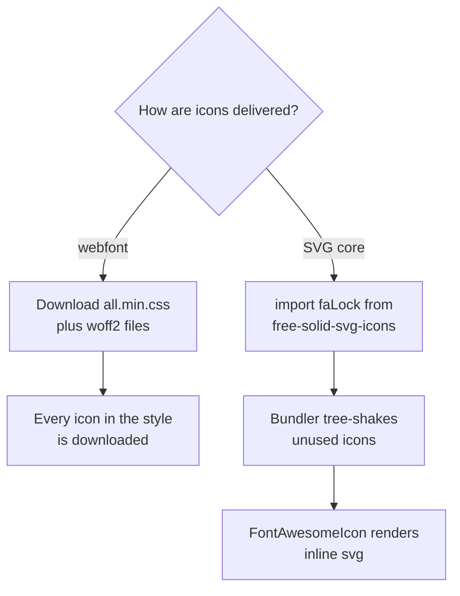
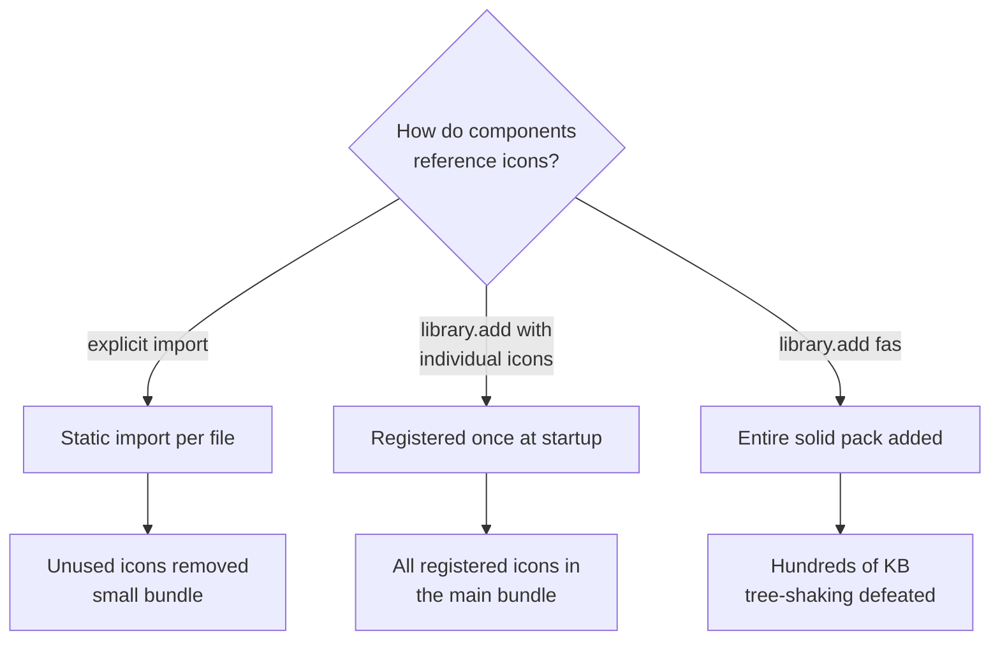
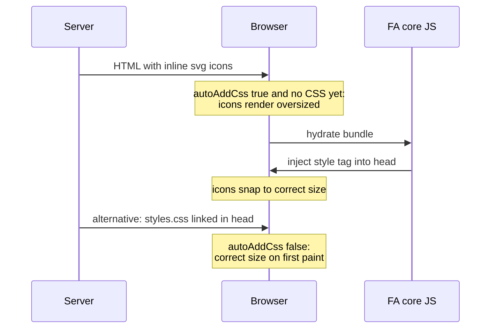

## 1. What it is

**Font Awesome is a large library of icons (free and paid), and `@fortawesome/react-fontawesome` gives you a `<FontAwesomeIcon>` component that renders any of them as an inline SVG.**

Think of Font Awesome as a giant sticker book. The old way (webfont) was to mail the whole book to every visitor so they could peel off one sticker. The modern React way (SVG core) cuts out only the stickers you use and glues them directly onto the page.

The problem it solves: apps need consistent, recognizable icons (download, lock, warning, arrows, bank, card) in many sizes and states. Drawing and maintaining your own SVGs is slow. Font Awesome gives thousands of designed, consistent icons with a single component API for size, rotation and animation.

## 2. Core concepts

### [Beginner] Webfont vs SVG core

Font Awesome can be delivered two ways.

| | Webfont (CSS + font files) | SVG + JS core (React) |
| --- | --- | --- |
| How it renders | A font glyph via `<i class="fa-solid fa-lock">` | An inline `<svg>` element |
| What is downloaded | The whole font file for a style, every icon | Only icons you import |
| Tree-shaking | No | Yes, with explicit imports |
| Styling | Font properties (`font-size`, `color`) | SVG + CSS, `currentColor` |
| Rendering issues | Font loading flash, blurry sub-pixel rendering | Crisp, no font loading |
| Accessibility | Manual `aria-hidden` | Handled by the component |

```html
<!-- Webfont: classic, still used in server-rendered pages -->
<link rel="stylesheet" href="/fontawesome/css/all.min.css" />
<i class="fa-solid fa-lock" aria-hidden="true"></i>
```

```tsx
// SVG core: the React way
import { FontAwesomeIcon } from "@fortawesome/react-fontawesome";
import { faLock } from "@fortawesome/free-solid-svg-icons";

export const SecureBadge = () => <FontAwesomeIcon icon={faLock} />;
```

> **Why:** An icon font must load every glyph in that style before any icon shows, because a font file is one binary blob. SVG icon definitions are plain JS objects (path data plus width/height), so a bundler can drop the ones you never import.



### [Beginner] The packages

```bash
npm install @fortawesome/fontawesome-svg-core \
            @fortawesome/react-fontawesome \
            @fortawesome/free-solid-svg-icons \
            @fortawesome/free-regular-svg-icons \
            @fortawesome/free-brands-svg-icons
```

- `fontawesome-svg-core`: the engine that turns icon definitions into SVG, plus `library` and `config`.
- `react-fontawesome`: the `<FontAwesomeIcon>` component.
- `free-*-svg-icons`: the icon definitions, one export per icon (`faLock`, `faBell`, `faCcVisa`).

### [Beginner] Icon props

```tsx
import { FontAwesomeIcon } from "@fortawesome/react-fontawesome";
import { faArrowUp, faSpinner, faTriangleExclamation } from "@fortawesome/free-solid-svg-icons";

export function IconExamples() {
  return (
    <>
      <FontAwesomeIcon icon={faArrowUp} size="lg" />                 {/* xs sm lg xl 2xl, 1x..10x */}
      <FontAwesomeIcon icon={faArrowUp} rotation={180} />            {/* 90 | 180 | 270 */}
      <FontAwesomeIcon icon={faArrowUp} flip="horizontal" />         {/* horizontal | vertical | both */}
      <FontAwesomeIcon icon={faSpinner} spin />                      {/* also spinPulse, pulse */}
      <FontAwesomeIcon icon={faTriangleExclamation} beat />          {/* v6 animations: beat fade bounce shake */}
      <FontAwesomeIcon icon={faArrowUp} fixedWidth />                {/* equal widths in lists */}
      <FontAwesomeIcon icon={faArrowUp} transform="shrink-4 up-2" /> {/* power transforms */}
      <FontAwesomeIcon icon={faArrowUp} className="text-green-700" />{/* color via currentColor */}
      <FontAwesomeIcon icon={faTriangleExclamation} title="Warning" /> {/* accessible label */}
    </>
  );
}
```

> **Gotcha:** The SVG uses `fill="currentColor"`, so color comes from CSS `color` on the icon or its parent. Setting `fill` in CSS usually is not needed; set `color` (or a Tailwind `text-*` class).

### [Intermediate] Explicit import vs library.add

There are two ways to reference icons.

```tsx
// 1. Explicit import (recommended): bundler sees exactly which icons are used
import { faBell } from "@fortawesome/free-regular-svg-icons";
<FontAwesomeIcon icon={faBell} />;
```

```tsx
// 2. Library: register once, reference by string anywhere
// src/icons.ts (imported once in main.tsx)
import { library } from "@fortawesome/fontawesome-svg-core";
import { faLock, faDownload } from "@fortawesome/free-solid-svg-icons";
import { faBell } from "@fortawesome/free-regular-svg-icons";

library.add(faLock, faDownload, faBell);

// any component
<FontAwesomeIcon icon="lock" />;              // default prefix "fas" (solid)
<FontAwesomeIcon icon={["far", "bell"]} />;   // [prefix, iconName]
```



> **Gotcha:** `import { fas } from "@fortawesome/free-solid-svg-icons"; library.add(fas);` pulls in every solid icon (well over 1,000) and kills tree-shaking. String names also have no type safety: a typo like `icon="lok"` renders nothing and logs a console error.

> **Interview tip:** Say "explicit imports are tree-shakable and type-checked. The library is convenient for icon names stored as strings (for example from a CMS or config), but every registered icon ships in the main bundle."

### [Intermediate] Accessibility behavior

By default, the component renders `aria-hidden="true"`, treating icons as decoration. When an icon carries meaning on its own, give it a `title`, or put a text label next to it.

```tsx
// Decorative: text already explains it
<button>
  <FontAwesomeIcon icon={faDownload} /> Download statement
</button>

// Icon-only button: label the BUTTON, not just the icon
<button aria-label="Download statement">
  <FontAwesomeIcon icon={faDownload} />
</button>

// Standalone meaningful icon: title adds <title> and role="img"
<FontAwesomeIcon icon={faTriangleExclamation} title="Payment failed" />
```

### [Advanced] config.autoAddCss and CSS in SSR

The SVG core needs a small stylesheet (classes like `.svg-inline--fa`, sizing, animations). By default it injects this CSS into `<head>` at runtime from JavaScript.

```tsx
// main.tsx or app root
import { config } from "@fortawesome/fontawesome-svg-core";
import "@fortawesome/fontawesome-svg-core/styles.css"; // ship CSS with your bundle

config.autoAddCss = false; // stop runtime <style> injection
```

Why turn it off:

- **SSR (Next.js, Remix):** the server HTML contains the SVGs, but the CSS is only injected after JS runs. Until then icons render with no size constraints, so they appear **huge** for a moment. Importing the CSS file puts it in the server-rendered stylesheet.
- **Content Security Policy:** banks often forbid inline styles (`style-src` without `'unsafe-inline'`). Runtime `<style>` injection can be blocked by CSP. A static CSS file is allowed.



## 3. Why it's used in this project

- **Recognizable financial icons:** lock (secure), shield, credit cards and brands (`faCcVisa`, `faCcMastercard`), building columns (bank), arrows for gains/losses, file download for statements, triangle exclamation for alerts.
- **Consistent visual language** across dashboards, settings and transaction details without a custom icon pipeline.
- **CSP-friendly setup** with `autoAddCss = false` fits strict security headers required by many financial institutions.

```tsx
import { FontAwesomeIcon } from "@fortawesome/react-fontawesome";
import { faArrowTrendUp, faArrowTrendDown, faMinus } from "@fortawesome/free-solid-svg-icons";

export function ChangeIndicator({ pct }: { pct: number }) {
  const icon = pct > 0 ? faArrowTrendUp : pct < 0 ? faArrowTrendDown : faMinus;
  const label = pct > 0 ? "Up" : pct < 0 ? "Down" : "No change";
  return (
    <span className={pct >= 0 ? "text-green-700" : "text-red-700"}>
      <FontAwesomeIcon icon={icon} fixedWidth />
      <span className="sr-only">{label}</span> {Math.abs(pct).toFixed(2)}%
    </span>
  );
}
```

> **Finance tip:** Pair trend colors with an icon direction and a screen-reader label. Color alone fails users with color vision deficiency, and the icon alone is hidden from screen readers by default.

## 4. Setup & configuration

### [Beginner] Install and wire up

```bash
npm install @fortawesome/fontawesome-svg-core @fortawesome/react-fontawesome \
  @fortawesome/free-solid-svg-icons @fortawesome/free-regular-svg-icons
```

```tsx
// src/main.tsx
import { config } from "@fortawesome/fontawesome-svg-core";
import "@fortawesome/fontawesome-svg-core/styles.css";

// Do not inject a <style> tag at runtime (SSR flash, CSP). CSS is imported above.
config.autoAddCss = false;
```

### [Intermediate] Pro icons

Pro icons come from Font Awesome's private npm registry and require an auth token.

```ini
# .npmrc (token from your Font Awesome account, stored as a CI secret, never committed)
@fortawesome:registry=https://npm.fontawesome.com/
//npm.fontawesome.com/:_authToken=${FONTAWESOME_NPM_AUTH_TOKEN}
```

```bash
npm install @fortawesome/pro-solid-svg-icons @fortawesome/pro-light-svg-icons
```

> **Gotcha:** CI builds fail if the token is missing, and license seats matter. Confirm your organization's license before using Pro packages.

### [Intermediate] A typed wrapper component

```tsx
// src/components/Icon.tsx
import { FontAwesomeIcon, type FontAwesomeIconProps } from "@fortawesome/react-fontawesome";
import { cn } from "@/lib/cn";

type IconProps = FontAwesomeIconProps & { label?: string };

export function Icon({ label, className, ...rest }: IconProps) {
  return (
    <FontAwesomeIcon
      {...rest}
      title={label}                       // only meaningful icons get a title
      className={cn("shrink-0", className)}
    />
  );
}
```

## 5. Key features we use

### [Beginner] Icon in a button with a loading state

```tsx
import { faPaperPlane, faSpinner } from "@fortawesome/free-solid-svg-icons";

export function SendPaymentButton({ loading }: { loading: boolean }) {
  return (
    <button disabled={loading} className="inline-flex items-center gap-2 rounded bg-blue-600 px-4 py-2 text-white">
      <FontAwesomeIcon icon={loading ? faSpinner : faPaperPlane} spin={loading} />
      {loading ? "Sending..." : "Send payment"}
    </button>
  );
}
```

### [Intermediate] Mapping domain values to icons

```tsx
import type { IconDefinition } from "@fortawesome/fontawesome-svg-core";
import { faCcVisa, faCcMastercard, faCcAmex } from "@fortawesome/free-brands-svg-icons";
import { faCreditCard } from "@fortawesome/free-solid-svg-icons";

type CardBrand = "visa" | "mastercard" | "amex" | "other";

const brandIcon: Record<CardBrand, IconDefinition> = {
  visa: faCcVisa,
  mastercard: faCcMastercard,
  amex: faCcAmex,
  other: faCreditCard,
};

export const CardBrandIcon = ({ brand }: { brand: CardBrand }) => (
  <FontAwesomeIcon icon={brandIcon[brand]} size="xl" title={brand} />
);
```

### [Intermediate] Stacking and masking

```tsx
import { faCircle, faCheck } from "@fortawesome/free-solid-svg-icons";

// Layered icons using the fa-stack classes
<span className="fa-stack">
  <FontAwesomeIcon icon={faCircle} className="fa-stack-2x text-green-700" />
  <FontAwesomeIcon icon={faCheck} className="fa-stack-1x" inverse />
</span>;
```

## 6. Interview questions

#### Q: What is the difference between the Font Awesome webfont and the SVG core approach?

The webfont ships a CSS file and font files containing every icon in a style. Icons render as font glyphs in `<i>` tags, cannot be tree-shaken, and can flash or render blurry while fonts load. The SVG core represents each icon as a JS object that the component renders as an inline `<svg>`. With explicit imports the bundler includes only used icons, rendering is crisp, and the React component handles accessibility attributes.

#### Q: Why are explicit imports preferred over library.add?

Explicit imports (`import { faLock } ...; icon={faLock}`) let the bundler tree-shake unused icons and give TypeScript checking. `library.add` registers icons globally so you can use string names, but everything registered ships in the main bundle, and adding whole packs (`library.add(fas)`) includes every icon. String names also fail silently at compile time.

#### Q: What does `config.autoAddCss = false` do and when do you need it?

It stops the SVG core from injecting its stylesheet into `<head>` at runtime. You then import `@fortawesome/fontawesome-svg-core/styles.css` yourself. It is needed for SSR frameworks (otherwise icons render oversized until JS hydrates and injects CSS) and for strict Content Security Policies that block runtime inline styles.

#### Q: How do you make icons accessible?

The component renders `aria-hidden="true"` by default, which is right for decorative icons next to text. For icon-only buttons, put `aria-label` on the button. For standalone meaningful icons, pass `title`, which adds a `<title>` and an image role. Never rely on icon color alone to convey meaning.

#### Q: Your bundle analyzer shows 700 kB from free-solid-svg-icons. What happened?

Something imported the whole pack: `library.add(fas)`, `import * as icons`, or a dynamic lookup like `icons[name]` that forces the bundler to keep everything. Fix by importing named icons explicitly, building a small registry of only needed icons for string lookups, and checking that the bundler is in production mode with ESM tree-shaking. Deep imports (`@fortawesome/free-solid-svg-icons/faLock`) can also speed up dev builds.

## 7. Drawbacks & pain points

- **Package size on disk and dev build speed**: the icon packages are large; some dev setups scan the whole pack.
- **Easy to break tree-shaking** with packs or dynamic lookups.
- **Pro licensing and private registry tokens** complicate CI.
- **Icon renames between majors** (v5 `faCoffee` became v6 `faMugSaucer`, with aliases kept for a while).
- **Runtime CSS injection** conflicts with CSP and SSR unless configured.
- **Mixed visual styles** if you combine FA with other icon sets.

Gotchas that trip devs up:

```tsx
// 1. String icon not registered: renders nothing, console error
<FontAwesomeIcon icon="lock" />  // forgot library.add(faLock)

// 2. Whole pack import
import { fas } from "@fortawesome/free-solid-svg-icons";
library.add(fas);                // hundreds of KB

// 3. Huge icons on first paint in SSR: missing styles.css + autoAddCss=false

// 4. Wrong prefix for string usage
<FontAwesomeIcon icon="bell" />          // looks in "fas", but you registered the regular one
<FontAwesomeIcon icon={["far", "bell"]} /> // correct
```

> **Outdated:** Font Awesome 7 was released in 2025 with updated icon designs and some API and default changes (for example around fixed-width defaults), and newer major versions of the React package. Check the official upgrade guide before mixing v6 and v7 packages; all `@fortawesome/*` packages should be on the same major.

## 8. Better alternatives

Many React teams have moved to lighter, MIT/ISC-licensed SVG icon sets that ship one component per icon:

- **lucide-react**: fork of Feather icons, ~1,500+ consistent outline icons, each a tiny tree-shakable component. Very popular with shadcn/ui.
- **Heroicons** (`@heroicons/react`): by the Tailwind team, ~300 icons in outline/solid at 24px and 20px/16px mini sizes. Small and clean, limited set.
- **Iconify** (`@iconify/react`): one API for 200,000+ icons from many sets. By default it fetches icon data at runtime from an API, which may be blocked by a bank's network policy; for offline/bundled use, prefer build-time tools like `unplugin-icons` or bundled icon data.
- **react-icons**: many sets in one package, convenient but historically heavier dev builds.

```tsx
import { Lock, TrendingUp } from "lucide-react";
<Lock size={16} aria-hidden="true" />;
<TrendingUp className="h-4 w-4 text-green-700" />;
```

| Option | Per-icon cost (~gzip) | Boilerplate | Devtools | Learning curve | TS support | Popularity | When it wins |
| --- | --- | --- | --- | --- | --- | --- | --- |
| Font Awesome SVG + React | ~0.5-1 kB plus ~15 kB core | Medium (core, config, packs) | n/a | Low-medium | Good | Very high | Huge set, brand icons, Pro styles |
| Font Awesome webfont | ~100+ kB per style | Low | n/a | Low | n/a | High (legacy) | Server-rendered non-React pages |
| lucide-react | ~0.3-0.5 kB, no core | None | n/a | Very low | Excellent | Very high | Modern React + Tailwind apps |
| Heroicons | ~0.3-0.5 kB | None | n/a | Very low | Good | High | Tailwind UI look, small set |
| Iconify | Runtime fetch or bundled | Low | n/a | Low | Good | Medium | Mixing many icon sets |

## 9. When NOT to use it

- You need only a handful of icons: inline SVGs or lucide-react are lighter.
- Strict networks or CSP and no time to configure `autoAddCss` and static CSS.
- Your design system already defines a custom icon set (use SVG components or a sprite generated from it).
- Licensing constraints: Pro icons require a paid license per project or organization.
- Pure webfont in a React SPA: always use the SVG packages instead.

## Cheatsheet

| Prop / API | Purpose |
| --- | --- |
| `icon={faX}` / `icon="x"` / `icon={["far","x"]}` | Which icon |
| `size` | `2xs xs sm lg xl 2xl 1x ... 10x` |
| `fixedWidth` | Equal width for alignment |
| `rotation` / `flip` | `90 180 270` / `horizontal vertical both` |
| `spin` `spinPulse` `beat` `fade` `bounce` `shake` | Animations |
| `transform` | `"shrink-4 up-2 rotate-45"` |
| `mask` / `inverse` / `border` / `pull` | Advanced styling |
| `title` | Accessible name for meaningful icons |
| `library.add(...)` | Register icons for string names |
| `config.autoAddCss = false` | Disable runtime CSS injection |

```tsx
import { config, library } from "@fortawesome/fontawesome-svg-core";
import "@fortawesome/fontawesome-svg-core/styles.css";
import { FontAwesomeIcon } from "@fortawesome/react-fontawesome";
import { faLock } from "@fortawesome/free-solid-svg-icons";

config.autoAddCss = false;
library.add(faLock); // only if you need icon="lock"

<FontAwesomeIcon icon={faLock} size="lg" fixedWidth className="text-gray-600" />;
```
