This is guide 4. In guide 1 you created `my-site` and its content model. In guide 2 you built the website. In
guide 3 you tested it and deployed it to production. The site is live at `https://www.my-site.com`.

Live is not the same as **launched**. Right now Google may not know the site exists. A shared link might show
a plain grey card. The contact form saves messages, but nobody gets an email. You have no idea how many people
visit, and contact messages pile up forever. This guide fixes all of that, one small step at a time.

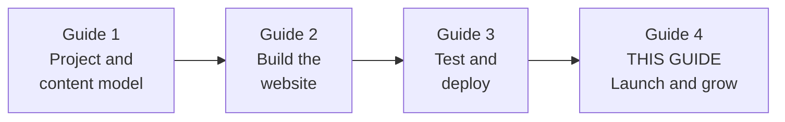

> **Version note (October 2026):** This guide targets Next.js 16, React 19, Payload 3.x and Node 22 LTS, the
> same versions as guides 1 to 3. Search engines, email providers and privacy rules change often. Where a
> detail is likely to move (a dashboard button, a quota, a limit), the text says so. When a screen looks
> different, trust the official docs over this guide.

We build on what you already have. When this guide says "Guide 2, Step 28", open that step if you need a
reminder. We will not repeat it; we will go deeper.

| Already done | Where | What this guide adds |
|---|---|---|
| Title template, `metadataBase`, description | Guide 2, Step 6 | Per-page SEO fields editors control, with fallbacks |
| `generateMetadata` and `alternates.canonical` on pages and posts | Guide 2, Steps 11 and 15 | Correct canonicals for paginated lists, `noindex`, redirects |
| Default Open Graph image | Guide 2, Step 27 | A generated share image **per post**, X card tags, testing previews |
| `sitemap.ts` and `robots.ts` | Guide 2, Step 28 | Fresh `lastModified`, hidden pages left out, no indexing of previews |
| Accessibility checklist, Lighthouse | Guide 2, Steps 29 and 30 | Real-user Core Web Vitals and fixing their causes |
| Honeypot on the contact form | Guide 2, Steps 16 to 18 | Email notifications, Turnstile captcha, rate limits, consent |
| Custom domain with HTTPS | Guide 3, Steps 24 and 36 | DNS records for Search Console and for sending email |
| Sentry, uptime monitor, backups | Guide 3, Steps 39 and 40 | 404 monitoring, broken links, a monthly checklist |

## 1. Concepts: how people find your site

Before we change any code, you need a clear picture of what search engines and social apps actually do with
your site. Every step later in this guide makes sense once you have this picture.

### [Beginner] Step 1 — Concept: what happens when someone finds your site on Google

**What we're doing:** Following one page of your site from "just published" to "someone clicked it in Google".

**Why:** Most SEO advice online is noise. If you understand the four stages, you can tell which advice matters
and which problem you are looking at when traffic is missing.

**Do it:** Read the diagram from left to right.

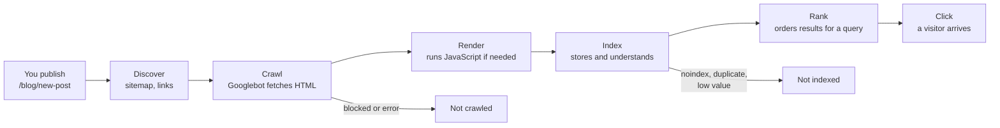

Here are the stages in plain words.

1. **Discover.** Google learns that a URL exists. It finds URLs by following links from other pages (yours or
   other sites) and by reading your **sitemap** (`/sitemap.xml`, from Guide 2, Step 28).
2. **Crawl.** A program called a **crawler** (Google's is called **Googlebot**) downloads the page, the same
   way your browser does. It first checks `robots.txt` to see if it is allowed.
3. **Render.** If the page needs JavaScript to show its content, Google runs it later, in a queue. Our pages
   are rendered on the server, so the full text is already in the HTML. This is a big advantage of server
   components: nothing waits for the render queue.
4. **Index.** Google stores the page in its giant database, the **index**. It reads the title, the headings,
   the text, the links and the structured data. It also decides whether this page is a duplicate of another
   one. A page with `noindex` is dropped here.
5. **Rank.** When someone searches, Google picks the most useful indexed pages and orders them. Hundreds of
   signals matter. The ones you control most: useful content that matches what people search for, a clear
   title, a fast page, a working mobile layout and links from other sites.
6. **Click.** The visitor sees your **title** and a **snippet** (usually your meta description, sometimes text
   Google picks from the page). A good title and description make people click.

**Check it works:** You can see the stages for your own site. In a browser, search for:

```text
site:my-site.com
```

```text
About 0 results          <- not indexed yet (normal for a new site)
About 5 results          <- indexed; each result is one page Google stored
```

The `site:` operator is a rough count, not an exact one. Part 4 gives you the precise numbers.

**What just happened:** You learned that "my page is not on Google" can mean four different problems: not
discovered, not crawled, not indexed, or indexed but ranked low. Each has a different fix. Search Console
(Part 4) tells you which one you have.

> **Interview tip:** If asked "how does SEO work for a server-rendered React app?", walk through these stages.
> Then point out that server rendering puts the content in the first HTML response, so crawlers do not depend
> on running JavaScript. That is the main SEO reason teams choose Next.js over a client-only single-page app.

### [Beginner] Step 2 — Concept: what search engines and social apps read from your HTML

**What we're doing:** Looking at the exact HTML tags that robots read, using the live site.

**Why:** Search engines and apps like Slack, LinkedIn, WhatsApp and X do not "see" your design. They read a
handful of tags in the `<head>` of the HTML. If you know which tags they read, you know what to test.

**Do it:** Fetch your home page like a robot does and filter the interesting lines:

```bash
curl -s https://www.my-site.com/blog/welcome-to-our-new-website \
  | grep -oE '<(title|meta|link)[^>]*>' \
  | grep -E 'title|description|canonical|robots|og:|twitter:'
```

`curl -s` downloads the page silently. `grep -oE` prints only the tags that match the pattern. Use your own
domain; on your laptop use `http://localhost:3000` with `npm run build && npm run start` running.

**Check it works:** You should see something like this (yours may differ slightly):

```text
<title>Welcome to our new website | My Site</title>
<meta name="description" content="We rebuilt our website ..."/>
<link rel="canonical" href="https://www.my-site.com/blog/welcome-to-our-new-website"/>
<meta property="og:title" content="Welcome to our new website"/>
<meta property="og:url" content="https://www.my-site.com/blog/welcome-to-our-new-website"/>
<meta property="og:type" content="article"/>
<meta name="twitter:card" content="summary_large_image"/>
```

Who reads what:

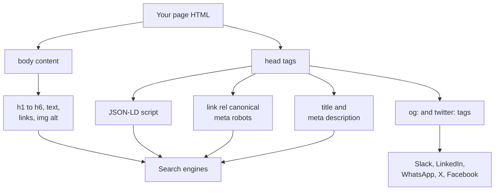

| Tag | Read by | What it controls |
|---|---|---|
| `<title>` | Search engines, browser tabs | The blue link text in results (Google may rewrite it) |
| `<meta name="description">` | Search engines | Often the grey snippet under the link |
| `<link rel="canonical">` | Search engines | "This is the main URL for this content" |
| `<meta name="robots">` | Search engines | `noindex` keeps a page out of results |
| `og:title`, `og:description`, `og:image` | Social apps | The link preview card |
| `twitter:card` and friends | X, and some others as a fallback | The X preview card style |
| `<script type="application/ld+json">` | Search engines | Structured data: "this is an article by X, published on Y" |
| `<h1>`, links, `alt` text | Search engines, screen readers | What the page is about and how pages connect |

**What just happened:** You saw that SEO and social sharing are mostly about a few predictable tags. Next.js
writes all of them for you from the `metadata` objects. Your job is to give it good values, which is what
Part 2 does.

> **Gotcha:** Social apps do **not** run JavaScript. If a tag is added by client-side code after the page
> loads, they never see it. In the App Router, `metadata` and `generateMetadata` always render on the server,
> so this is safe by default. Do not try to set tags with `useEffect`.

### [Beginner] Step 3 — The real-world launch checklist, at a glance

**What we're doing:** Seeing the whole list of work in this guide before starting it.

**Why:** "Launch" is a dozen small jobs. A list stops you forgetting the boring ones, like email DNS records or
deleting old contact messages, that cause real trouble months later.

**Do it:** Read the table. Each row is a part of this guide.

| Area | The question it answers | Part |
|---|---|---|
| SEO foundations | Can editors control titles and descriptions? Do old URLs still work? | 2 |
| Structured data | Does Google understand what each page is? | 3 |
| Search Console and Bing | Is the site indexed, and what is broken? | 4 |
| Speed | Is the site fast for real visitors on real phones? | 5 |
| Social sharing | Does a shared link look good everywhere? | 6 |
| Contact form for real | Does a message reach a human, and not spam? | 7 |
| Privacy basics | What personal data do we keep, why, and for how long? | 8 |
| After launch | Is caching right, are links broken, how do editors work? | 9 |

**Check it works:** Make a branch for this guide's work, like you learned in guide 3:

```bash
git switch main && git pull
git switch -c feat/launch-essentials
```

```text
Switched to a new branch 'feat/launch-essentials'
```

You can also split the work into several smaller pull requests, one per part. That is what a team would do.

**What just happened:** You have a map and a branch. Every change in this guide goes through the same pull
request, CI and preview deployment loop you built in guide 3.

## 2. SEO foundations done right

In guide 2, metadata came straight from the post title and excerpt. That is a good start, but in a real
project the people writing content want control: a shorter title for Google, a description written for
searchers, a different share image, or "keep this page out of Google". In this part you give them that
control, with safe fallbacks for when they leave fields empty.

### [Beginner] Concept — SEO fields: write your own group, or use the official plugin?

You have two good options for storing SEO data in Payload.

| Option | What you get | Trade-off |
|---|---|---|
| Your own `group` field named `seo` with `metaTitle`, `metaDescription`, `ogImage`, `noIndex` | Full control, nothing new to learn | You build the admin niceties yourself |
| The official `@payloadcms/plugin-seo` | A `meta` group with `title`, `description`, `image`, character counters, a "generate" button that fills the field from the content, and a Google-style search preview | One more dependency to keep on the same version as `payload` |

We use the **official plugin**. Editors get a live preview of how the page looks in search results and a
counter that turns red when a title is too long. Those two features prevent most editor mistakes. The plugin
also has a `fields` option to add our own fields to its group, so we can still add `noIndex`.

A **group** field, in case you have not met one, is a field that holds other fields. In the database it
becomes several columns with a shared prefix (`meta_title`, `meta_description`...). In TypeScript it becomes a
nested object: `page.meta.title`.

### [Beginner] Step 4 — Install the SEO plugin and add a noIndex field

**What we're doing:** Adding a `meta` group (title, description, image, noIndex) to Pages and Posts.

**Why:** Without it, the only way to change a page's Google title is to change its visible `h1`, which is often
not what you want. Without `noIndex`, an editor cannot hide a thank-you page or a test page from search.

**Do it:** Install the plugin. Like every `@payloadcms/*` package, it must match your `payload` version:

```bash
npm ls payload
npm install @payloadcms/plugin-seo@<the same version as payload>
```

`npm ls payload` prints the installed version, for example `payload@3.62.0`. Use that number.

Open `src/payload.config.ts`. Add the import at the top and the plugin to the `plugins` array (the array
already holds the storage adapter from guide 3). Only the new lines are shown:

```ts
// src/payload.config.ts (new import and new plugin entry)
import { seoPlugin } from '@payloadcms/plugin-seo'

// inside buildConfig({ ... }), in the existing plugins array:
  plugins: [
    // ...the storage adapter from guide 3 stays here...
    seoPlugin({
      collections: ['pages', 'posts'],
      uploadsCollection: 'media',
      // Just the title. The layout's template adds " | My Site" for us.
      generateTitle: ({ doc }) => (typeof doc?.title === 'string' ? doc.title : ''),
      // Posts have an excerpt. Pages do not, so the button leaves it empty for them.
      generateDescription: ({ doc }) => (typeof doc?.excerpt === 'string' ? doc.excerpt : ''),
      // Shown in the search preview in the admin.
      generateURL: ({ doc, collectionSlug }) => {
        const base = process.env.NEXT_PUBLIC_SERVER_URL ?? 'http://localhost:3000'
        const slug = typeof doc?.slug === 'string' ? doc.slug : ''
        if (collectionSlug === 'posts') return `${base}/blog/${slug}`
        return slug === 'home' ? `${base}/` : `${base}/${slug}`
      },
      // Keep the plugin's fields and add our own checkbox to the same group.
      fields: ({ defaultFields }) => [
        ...defaultFields,
        {
          name: 'noIndex',
          type: 'checkbox',
          label: 'Hide this page from search engines (noindex)',
          defaultValue: false,
        },
      ],
    }),
  ],
```

The plugin changes the database schema (new columns), so create a migration, apply it, and regenerate types
and the admin import map (the plugin adds admin components):

```bash
docker compose up -d
npm run migrate:create -- seo-fields
npm run migrate
npm run generate:types
npm run generate:importmap
```

**Check it works:** Run `npm run dev` and open any post in `/admin`. At the bottom you see a new **SEO**
section:

```text
SEO
  Overview: 2/3 checks are passing
  Meta Title  [Welcome to our new website]  27/50-60 chars   [Auto-generate]
  Meta Description [                    ]   0/100-150 chars   [Auto-generate]
  Meta Image  [ Select image ]
  [ ] Hide this page from search engines (noindex)
  Preview
    https://www.my-site.com/blog/welcome-to-our-new-website
    Welcome to our new website
    (description)
```

The exact labels and recommended lengths depend on your plugin version. Click **Auto-generate** next to the
description: it copies the excerpt. Save. Then open `src/payload-types.ts` and find the `Post` interface:

```text
meta?: {
  title?: string | null;
  description?: string | null;
  image?: (number | null) | Media;
  noIndex?: boolean | null;
};
```

**What just happened:** The plugin added a `meta` group field to both collections. The migration added
`meta_title`, `meta_description`, `meta_image_id` and `meta_no_index` columns to the `pages` and `posts`
tables. Nothing on the website uses these fields yet; that is the next two steps.

> **Why:** We return only `doc.title` from `generateTitle` on purpose. The root layout already has
> `title.template: '%s | My Site'`. If the meta title also contained " | My Site", the browser tab would show
> "Welcome | My Site | My Site".

> **Gotcha:** If TypeScript complains that `doc` has type `unknown` or `any` in the generate functions, keep
> the `typeof` checks as written. They make the code safe whatever the exact type is in your plugin version.

**If it breaks:**
- The SEO fields do not appear and the console mentions the import map: you skipped
  `npm run generate:importmap`. Run it and restart `npm run dev`.
- `npm run migrate` says there is nothing to run: you ran `npm run dev` before creating the migration and dev
  "push mode" already changed your local database (guide 1, Step 31). The migration file still matters for
  production. Check that a new file exists in `src/migrations`.

### [Beginner] Step 5 — One small helper that decides the final SEO values

**What we're doing:** Writing a pure function that takes a document and returns the final title, description,
image and noIndex flag, with fallbacks. Plus a second function that turns that into a Next.js `Metadata`
object.

**Why:** Pages, posts and the home page all need the same "use the editor's value, otherwise fall back to
something sensible" logic. One function means one place to get it right and one place to test it.

**Do it:** The fallback rules:

| Final value | First choice | Fallback |
|---|---|---|
| Title | `meta.title` | The document `title` |
| Description | `meta.description` | The post `excerpt`, or the first 155 characters of the body text |
| Image | `meta.image` | The post `coverImage`, or nothing (the generated Open Graph image is used) |
| noIndex | `meta.noIndex` | `false` |

```ts
// src/utilities/seo.ts
import type { Metadata } from 'next'
import type { Media } from '@/payload-types'
import { toImageSrc } from './media'
import { siteConfig } from './site'

type MaybeMedia = number | Media | null | undefined

export type SeoSource = {
  title: string
  meta?: {
    title?: string | null
    description?: string | null
    image?: MaybeMedia
    noIndex?: boolean | null
  } | null
  fallbackDescription?: string | null
  fallbackImage?: MaybeMedia
}

export type ResolvedSeo = {
  title: string
  description?: string
  image?: { url: string; width?: number; height?: number; alt: string }
  noIndex: boolean
}

/** Trim text to at most `max` characters, cutting at a word boundary and adding an ellipsis. */
export function clampText(text: string, max = 155): string {
  const clean = text.replace(/\s+/g, ' ').trim()
  if (clean.length <= max) return clean
  const cut = clean.slice(0, max - 1)
  const lastSpace = cut.lastIndexOf(' ')
  return `${(lastSpace > 40 ? cut.slice(0, lastSpace) : cut).trimEnd()}…`
}

function pickImage(media: MaybeMedia, serverUrl?: string): ResolvedSeo['image'] {
  if (!media || typeof media !== 'object') return undefined
  // Prefer the 1600px "hero" copy from guide 1: big enough for share cards, smaller than the original.
  const hero = media.sizes?.hero
  const useHero = Boolean(hero?.url && hero.width && hero.height)
  const url = toImageSrc(useHero ? hero?.url : media.url, serverUrl)
  if (!url) return undefined
  return {
    url,
    width: (useHero ? hero?.width : media.width) ?? undefined,
    height: (useHero ? hero?.height : media.height) ?? undefined,
    alt: media.alt ?? '',
  }
}

function firstNonEmpty(...values: Array<string | null | undefined>): string | undefined {
  for (const value of values) {
    if (typeof value === 'string' && value.trim().length > 0) return value.trim()
  }
  return undefined
}

/** Decide the final SEO values for a document, with fallbacks. Pure: no I/O. */
export function resolveSeo(source: SeoSource, serverUrl?: string): ResolvedSeo {
  const description = firstNonEmpty(source.meta?.description, source.fallbackDescription)
  return {
    title: firstNonEmpty(source.meta?.title, source.title) ?? siteConfig.name,
    description: description ? clampText(description) : undefined,
    image: pickImage(source.meta?.image, serverUrl) ?? pickImage(source.fallbackImage, serverUrl),
    noIndex: source.meta?.noIndex === true,
  }
}

type BuildMetadataOptions = {
  seo: ResolvedSeo
  /** Path of the canonical URL, for example "/blog/hello". metadataBase makes it absolute. */
  path: string
  type?: 'website' | 'article'
  publishedTime?: string
  modifiedTime?: string
  /** true on the home page: do not apply the "%s | My Site" template. */
  absoluteTitle?: boolean
}

/** Turn resolved SEO values into a Next.js Metadata object. */
export function buildMetadata({
  seo,
  path,
  type = 'website',
  publishedTime,
  modifiedTime,
  absoluteTitle = false,
}: BuildMetadataOptions): Metadata {
  const images = seo.image ? [seo.image] : undefined
  const shared = {
    title: seo.title,
    description: seo.description,
    url: path,
    siteName: siteConfig.name,
    locale: 'en_US',
    images,
  }

  return {
    title: absoluteTitle ? { absolute: seo.title } : seo.title,
    description: seo.description,
    alternates: { canonical: path },
    // Only ever ADD noindex here. Never set index: true, or a page could undo the
    // site-wide noindex that previews get (Step 13).
    ...(seo.noIndex ? { robots: { index: false, follow: true } } : {}),
    openGraph:
      type === 'article'
        ? { ...shared, type: 'article', publishedTime, modifiedTime }
        : { ...shared, type: 'website' },
    twitter: {
      card: 'summary_large_image',
      title: seo.title,
      description: seo.description,
      images: images?.map((image) => image.url),
    },
  }
}
```

Now a unit test, in the same style as guide 2's tests:

```ts
// tests/unit/seo.test.ts
import { describe, expect, it } from 'vitest'
import { buildMetadata, clampText, resolveSeo } from '@/utilities/seo'

describe('clampText', () => {
  it('keeps short text as it is', () => {
    expect(clampText('Hello world')).toBe('Hello world')
  })

  it('cuts long text at a word boundary and adds an ellipsis', () => {
    const long = 'word '.repeat(60)
    const result = clampText(long, 50)
    expect(result.length).toBeLessThanOrEqual(50)
    expect(result.endsWith('…')).toBe(true)
    expect(result).not.toContain('wor…')
  })
})

describe('resolveSeo', () => {
  it('prefers the editor values', () => {
    const seo = resolveSeo({
      title: 'Doc title',
      meta: { title: 'SEO title', description: 'SEO description', noIndex: true },
      fallbackDescription: 'Excerpt',
    })
    expect(seo).toEqual({ title: 'SEO title', description: 'SEO description', image: undefined, noIndex: true })
  })

  it('falls back to the document title and excerpt when meta is empty', () => {
    const seo = resolveSeo({ title: 'Doc title', meta: { title: '  ' }, fallbackDescription: 'Excerpt' })
    expect(seo.title).toBe('Doc title')
    expect(seo.description).toBe('Excerpt')
    expect(seo.noIndex).toBe(false)
  })

  it('ignores an image that is only an ID (depth 0)', () => {
    const seo = resolveSeo({ title: 'T', meta: { image: 42 } })
    expect(seo.image).toBeUndefined()
  })
})

describe('buildMetadata', () => {
  it('adds robots noindex only when asked', () => {
    const hidden = buildMetadata({ seo: { title: 'T', noIndex: true }, path: '/t' })
    const visible = buildMetadata({ seo: { title: 'T', noIndex: false }, path: '/t' })
    expect(hidden.robots).toEqual({ index: false, follow: true })
    expect(visible.robots).toBeUndefined()
    expect(visible.alternates?.canonical).toBe('/t')
  })
})
```

**Check it works:**

```bash
npm run typecheck && npx vitest run tests/unit/seo.test.ts
```

```text
 ✓ tests/unit/seo.test.ts (6 tests)
 Test Files  1 passed (1)
      Tests  6 passed (6)
```

**What just happened:** You separated **deciding** (pure `resolveSeo`, easy to test) from **formatting**
(`buildMetadata`, which knows the Next.js `Metadata` shape). `buildMetadata` always sets `siteName` and
`locale` inside `openGraph`, because of an important Next.js rule explained in the Gotcha below.

> **Gotcha:** Next.js merges metadata from the layout and the page **shallowly**. If a page sets `openGraph`,
> the layout's whole `openGraph` object is replaced, not combined. Guide 2's layout set
> `openGraph.siteName` and `locale`, and the post page's `openGraph` silently dropped them. That is why
> `buildMetadata` repeats them. The same is true for `twitter` and `robots`.

### [Intermediate] Step 6 — Use the helper in every generateMetadata

**What we're doing:** Replacing the hand-written metadata in the home page, CMS pages, the post page and the
blog list with the helper. We also fix one real SEO bug from guide 2 on the way.

**Why:** Now editors' SEO fields take effect. And every page gets the same complete set of tags.

**Do it:** First, the site URL. In guide 3 you created `getServerUrl()` in `src/lib/serverUrl.ts`, which also
knows the preview URL on Vercel. Make `siteConfig` use it, so `metadataBase` is right in every environment:

```ts
// src/utilities/site.ts
import { getServerUrl } from '@/lib/serverUrl'

export const siteConfig = {
  name: 'My Site',
  description: 'A small website built with Next.js, Payload CMS and Postgres.',
  url: getServerUrl(),
  nav: [
    { href: '/', label: 'Home' },
    { href: '/about', label: 'About' },
    { href: '/blog', label: 'Blog' },
    { href: '/contact', label: 'Contact' },
  ],
} as const
```

The home page. Replace only `generateMetadata` (and add the new imports):

```tsx
// src/app/(frontend)/page.tsx (new imports and the new generateMetadata)
import { getServerUrl } from '@/lib/serverUrl'
import { lexicalToPlainText } from '@/utilities/reading-time'
import { buildMetadata, resolveSeo } from '@/utilities/seo'

export async function generateMetadata(): Promise<Metadata> {
  const page = await getPageBySlug('home')
  if (!page) return {}
  const seo = resolveSeo(
    {
      title: page.title === 'Home' ? siteConfig.name : `${page.title} | ${siteConfig.name}`,
      meta: page.meta,
      fallbackDescription: lexicalToPlainText(page.layout) || siteConfig.description,
    },
    getServerUrl(),
  )
  return buildMetadata({ seo, path: '/', absoluteTitle: true })
}
```

Keep the `siteConfig` import the file already has. The CMS page at `/[slug]`:

```tsx
// src/app/(frontend)/[slug]/page.tsx (new imports and the new generateMetadata)
import { getServerUrl } from '@/lib/serverUrl'
import { lexicalToPlainText } from '@/utilities/reading-time'
import { buildMetadata, resolveSeo } from '@/utilities/seo'

export async function generateMetadata({ params }: PageProps): Promise<Metadata> {
  const { slug } = await params
  const page = await getPageBySlug(slug)
  if (!page) return {}
  const seo = resolveSeo(
    { title: page.title, meta: page.meta, fallbackDescription: lexicalToPlainText(page.layout) },
    getServerUrl(),
  )
  return buildMetadata({ seo, path: `/${slug}` })
}
```

The post page:

```tsx
// src/app/(frontend)/blog/[slug]/page.tsx (new imports and the new generateMetadata)
import { getServerUrl } from '@/lib/serverUrl'
import { buildMetadata, resolveSeo } from '@/utilities/seo'

export async function generateMetadata({ params }: PostPageProps): Promise<Metadata> {
  const { slug } = await params
  const post = await getPostBySlug(slug)
  if (!post) return {}
  const seo = resolveSeo(
    {
      title: post.title,
      meta: post.meta,
      fallbackDescription: post.excerpt ?? lexicalToPlainText(post.content),
      // No fallbackImage: posts get a generated share image in Part 6.
    },
    getServerUrl(),
  )
  return buildMetadata({
    seo,
    path: `/blog/${slug}`,
    type: 'article',
    publishedTime: post.publishedAt ?? undefined,
    modifiedTime: post.updatedAt,
  })
}
```

The post page already imports `lexicalToPlainText`. You can delete the `toImageSrc` import if nothing else in
the file uses it.

Now the bug. Guide 2's blog list says `canonical: '/blog'` for **every** page of the list, including
`/blog?page=2`. A canonical tag says "this URL is a copy of that one". So we told Google that page 2 is a copy
of page 1, and Google may never crawl the older posts linked from page 2. Each page of a paginated list should
be canonical to **itself**. Replace the `metadata` export with `generateMetadata`:

```tsx
// src/app/(frontend)/blog/page.tsx (replace "export const metadata" with this)
export async function generateMetadata({ searchParams }: BlogPageProps): Promise<Metadata> {
  const { page: pageParam } = await searchParams
  const page = parsePageParam(pageParam)
  const path = page > 1 ? `/blog?page=${page}` : '/blog'
  return {
    title: page > 1 ? `Blog, page ${page}` : 'Blog',
    description: 'Articles and notes.',
    alternates: { canonical: path },
  }
}
```

**Check it works:**

```bash
npm run build && npm run start
```

In another terminal:

```bash
curl -s http://localhost:3000/blog?page=2 | grep -oE '<link rel="canonical"[^>]*>'
curl -s http://localhost:3000/about | grep -oE '<meta (name|property)="(description|og:site_name)"[^>]*>'
```

```text
<link rel="canonical" href="http://localhost:3000/blog?page=2"/>
<meta name="description" content="We are a small team that ..."/>
<meta property="og:site_name" content="My Site"/>
```

(If you have fewer than seven posts, `/blog?page=2` is a 404 and prints nothing. Create a few test posts or
check `/blog` instead.) Now edit the About page in `/admin`: write a Meta Description and save. Reload
`/about` and the new description appears in the HTML.

**What just happened:** The editor's fields now drive the tags, with a fallback at every level. The About page
gets a description from its own body text even when nobody wrote one. Paginated pages each have their own
canonical URL.

> **Gotcha:** `getServerUrl()` reads `VERCEL_URL`, which only exists on the server. That is fine here:
> `siteConfig.url` is only used in metadata, sitemaps and server code. If a client component ever needs the
> site URL, pass it down as a prop.

> **Outdated:** Older tutorials put `<link rel="prev">` and `<link rel="next">` on paginated pages. Google
> stopped using them years ago. Self-referencing canonicals plus normal links between pages (our `Pagination`
> component) are what matter.

### [Beginner] Step 7 — Canonical URLs, trailing slashes, headings and URL structure

**What we're doing:** Checking the four "boring" things that quietly decide whether Google sees one site or a
messy pile of duplicates.

**Why:** The same page can often be reached at several URLs: with and without `www`, with and without a slash
at the end, with tracking parameters like `?utm_source=newsletter`. Google sees those as different pages with
the same content. It then has to guess which one to show, and it splits the "credit" between them.

**Do it:** Check each item. Most are already right; you are confirming it.

**1. One host.** Guide 3, Step 24 redirected `my-site.com` to `www.my-site.com`. Confirm:

```bash
curl -sI https://my-site.com/about | grep -iE '^(HTTP|location)'
```

```text
HTTP/2 308
location: https://www.my-site.com/about
```

**2. One trailing slash style.** Next.js has a `trailingSlash` setting in `next.config.mjs`. Its default is
`false`, which means `/about/` is redirected to `/about`. Leave it at the default. Our canonicals, links and
sitemap all use the no-slash style, so everything agrees.

```bash
curl -sI http://localhost:3000/about/ | grep -iE '^(HTTP|location)'
```

```text
HTTP/1.1 308 Permanent Redirect
location: /about
```

**3. Canonical on every page.** Every page in `(frontend)` sets `alternates.canonical`. The canonical strips
query strings, so `/about?utm_source=newsletter` says "my main URL is `/about`". Check any page you add later.

**4. Headings and URL structure.**

| Rule | Why | How we do it |
|---|---|---|
| One `h1` per page, describing the page | It is the strongest on-page hint about the topic | Each page renders the title as `h1` |
| Headings in order (h2 inside h1, h3 inside h2) | Screen readers and crawlers use them as an outline | Tell editors to start rich text headings at H2 |
| Short, readable, lowercase URLs with hyphens | People and Google read them; they appear in results | The slug hook from guide 1 does this |
| A folder for each type of content | `/blog/...` tells everyone what the page is | Posts live under `/blog` |
| Never change a published URL without a redirect | Old links and rankings break | Steps 10 to 12 |

Editors can pick "Heading 1" in the rich text toolbar, which creates a second `h1`. Remove that option for
Pages and Posts. Lexical's `HeadingFeature` takes a list of allowed sizes. In `src/payload.config.ts` (or on
each rich text field) change the editor like this:

```ts
// src/payload.config.ts (the editor line inside buildConfig)
import { HeadingFeature, lexicalEditor } from '@payloadcms/richtext-lexical'

  editor: lexicalEditor({
    features: ({ defaultFeatures }) => [
      // Remove the default heading feature, then add it back without h1.
      ...defaultFeatures.filter((feature) => feature.key !== 'heading'),
      HeadingFeature({ enabledHeadingSizes: ['h2', 'h3', 'h4'] }),
    ],
  }),
```

This changes only the admin UI, not the database, so no migration is needed. Existing content with an `h1`
keeps it until someone edits it.

**Check it works:** In `/admin`, open a post and type `/` in the rich text editor (or open the block type
menu). You can choose Heading 2, 3 and 4, but not Heading 1. Then run Lighthouse's SEO audit (Guide 2, Step 30)
on a post; "Document has a valid rel=canonical" passes.

**What just happened:** You made sure each piece of content has exactly one address and one main heading.
This is called avoiding **duplicate content**. It does not get you "penalised", but it wastes crawling and
splits signals between URLs.

> **Gotcha:** If the filter by `feature.key` does not remove the heading option in your version, look at the
> keys with `console.log(defaultFeatures.map((f) => f.key))` and use the one that matches. Feature keys have
> been stable, but this is exactly the kind of detail that moves.

### [Beginner] Step 8 — Image alt text and file names

**What we're doing:** Making sure every image has a useful `alt` text and a meaningful file name, and helping
editors do it right.

**Why:** Google Images is a real source of visitors. Google reads the `alt` text, the file name and the text
around an image to understand it. Screen reader users depend on `alt` completely. Guide 1 made `alt` required,
but "required" still lets editors type "image" or "IMG_4032".

**Do it:** Add a validator and better help text to the `alt` field in `src/collections/Media.ts`. Replace the
`alt` field object with this one:

```ts
// src/collections/Media.ts (replace the alt field in the fields array)
    {
      name: 'alt',
      type: 'text',
      required: true,
      maxLength: 160,
      admin: {
        description:
          'Describe what the image shows, as you would to someone on the phone. ' +
          'Example: "Two people reviewing a floor plan at a desk". Do not start with "Image of".',
      },
      validate: (value: string | null | undefined) => {
        const text = (value ?? '').trim().toLowerCase()
        if (text.length < 5) return 'Please write a short description (at least 5 characters).'
        const useless = ['image', 'photo', 'picture', 'img', 'logo', 'banner']
        if (useless.includes(text)) return 'Describe what is in the image, not that it is an image.'
        if (/^(img|dsc|pxl|screenshot)[_\-\s]?\d+/.test(text)) {
          return 'That looks like a file name. Describe the image instead.'
        }
        return true
      },
    },
```

`maxLength: 160` changes the column definition, so create a migration:

```bash
npm run migrate:create -- media-alt-length
npm run migrate
```

For file names there is no code to write; it is an editor habit. Payload keeps the uploaded file name (it
only makes it URL-safe and unique). Add a line to your editor notes (Step 46): **rename the file before
uploading**, for example `team-reviewing-floor-plan.jpg` instead of `IMG_4032.jpg`.

**Check it works:** In `/admin`, upload an image with alt text `photo`. Saving fails:

```text
Alt: Describe what is in the image, not that it is an image.
```

Change it to a real description and it saves.

**What just happened:** You moved a guideline ("write good alt text") into the system, where it is enforced.
Rules that live only in a document get forgotten. Rules in validation do not.

> **Gotcha:** Purely decorative images (a background pattern) should have `alt=""` so screen readers skip
> them. Those should not be uploaded as Media at all; put them in CSS. Every Media image in this site is
> content, so it needs a real description.

### [Beginner] Step 9 — Internal links: related posts

**What we're doing:** Adding a "Related posts" section to the bottom of each post.

**Why:** Internal links (links between your own pages) help in three ways. Crawlers discover pages through
them. They pass a little "importance" from page to page. And visitors read more. A post that nothing links to,
except the paginated blog list, is called an **orphan page**, and it is easy for Google to ignore.

**Do it:** Add a query to `src/utilities/queries.ts`. It returns the newest published posts except the current
one. (A real "related by topic" feature would use categories or tags; this is a simple start.)

```ts
// src/utilities/queries.ts (add at the end of the file)

/** A few other published posts, newest first, for the "Related posts" block. */
export async function getRelatedPosts(excludeId: number | string, limit: number = 3) {
  const payload = await getPayloadClient()
  const result = await payload.find({
    collection: 'posts',
    where: { and: [publishedOnly, { id: { not_equals: excludeId } }] },
    sort: '-publishedAt',
    limit,
    depth: 1,
  })
  return result.docs
}
```

Render them at the end of the post page, after the `RichText`:

```tsx
// src/app/(frontend)/blog/[slug]/page.tsx (changes only)
import { PostCard } from '@/components/PostCard'
import { getAllPublishedPosts, getPostBySlug, getRelatedPosts } from '@/utilities/queries'

// inside PostPage, after the post is loaded:
const related = await getRelatedPosts(post.id)

// at the end of the <Container>, after <RichText ... />:
{related.length > 0 ? (
  <section aria-labelledby="related-heading" className="mt-16 border-t border-slate-200 pt-10">
    <h2 id="related-heading" className="font-serif text-2xl font-semibold">
      Related posts
    </h2>
    <div className="mt-6 grid gap-6 sm:grid-cols-2">
      {related.map((item) => (
        <PostCard key={item.id} post={item} />
      ))}
    </div>
  </section>
) : null}
```

**Check it works:** Open a post. At the bottom you see up to three other posts, never the one you are reading
and never a draft. Each card title is a link whose text is the post title.

**What just happened:** Every post now links to other posts with **descriptive link text** (the title), which
tells Google what the target page is about. "Click here" links tell it nothing.

> **Gotcha:** The post page is static. When a new post is published, older posts' "Related posts" sections
> stay as they were until those pages are re-rendered. That is acceptable for a sidebar-style block. If you
> want it exact, add `export const revalidate = 86400` to the post page so each one refreshes daily.

### [Beginner] Concept — Redirects: 301, 302, 307 and 308

A **redirect** is the server answering "this page moved, go to this other URL instead". The browser follows
it automatically. So does Googlebot. The number is the HTTP status code, and it tells everyone **how long**
the move lasts.

| Code | Meaning | Use it when | What Google does |
|---|---|---|---|
| 301 | Moved permanently | A slug changed for good | Moves the old URL's ranking signals to the new URL and shows the new one |
| 308 | Moved permanently, keep the method | Same as 301; Next.js uses it | Treated the same as 301 |
| 302 | Found, temporary | A short campaign, maintenance | Keeps the old URL in results, expecting it back |
| 307 | Temporary, keep the method | Same as 302; Next.js uses it | Treated the same as 302 |

"Keep the method" means a `POST` stays a `POST` after the redirect. For normal page visits (`GET`), 301 and
308 behave the same. Next.js's `permanentRedirect()` sends 308 and `redirect()` sends 307. That is fine for
SEO.

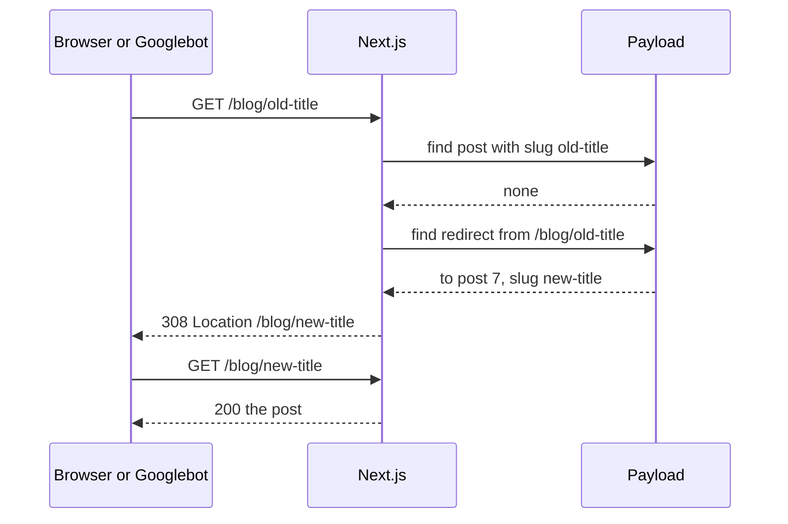

Notice the order. We only look for a redirect **after** the normal lookup failed. A visitor to a page that
exists pays nothing extra.

### [Intermediate] Step 10 — Install the redirects plugin

**What we're doing:** Adding a `redirects` collection where editors (and our code) store "from this path, to
that page".

**Why:** Guide 1, Step 23 warned: changing a slug breaks old links. Links in old emails, other websites and
Google's index keep pointing to the old URL and now land on a 404. A redirect keeps those visitors and passes
the old URL's ranking to the new one.

**Do it:**

```bash
npm install @payloadcms/plugin-redirects@<the same version as payload>
```

```ts
// src/payload.config.ts (new import and new plugin entry)
import { redirectsPlugin } from '@payloadcms/plugin-redirects'
import { revalidateRedirect } from './hooks/revalidateRedirect'

// in the plugins array, next to seoPlugin:
    redirectsPlugin({
      // Which collections a redirect may point to.
      collections: ['pages', 'posts'],
      // Let editors choose 301 (permanent) or 302 (temporary).
      redirectTypes: ['301', '302'],
      overrides: {
        admin: { group: 'Settings' },
        // Only logged-in admins may read or change redirects.
        access: {
          read: ({ req: { user } }) => Boolean(user),
          create: ({ req: { user } }) => Boolean(user),
          update: ({ req: { user } }) => Boolean(user),
          delete: ({ req: { user } }) => Boolean(user),
        },
        hooks: {
          afterChange: [revalidateRedirect],
        },
      },
    }),
```

Why that hook? A missing page that redirects is rendered once and then cached like any other page. If an
editor later changes or deletes the redirect, the cached answer must be thrown away:

```ts
// src/hooks/revalidateRedirect.ts
import type { CollectionAfterChangeHook } from 'payload'
import { safeRevalidate } from '@/utilities/revalidate'

export const revalidateRedirect: CollectionAfterChangeHook = ({ doc, previousDoc, req, context }) => {
  if (context.disableRevalidate) return doc
  const paths: string[] = []
  if (typeof doc?.from === 'string') paths.push(doc.from)
  if (typeof previousDoc?.from === 'string') paths.push(previousDoc.from)
  safeRevalidate(paths, (message) => req.payload.logger.info(message))
  return doc
}
```

New collection, so: migration, types, import map.

```bash
npm run migrate:create -- redirects
npm run migrate
npm run generate:types
npm run generate:importmap
```

**Check it works:** Restart `npm run dev`. The admin sidebar has a **Settings** group with **Redirects**.
Create one by hand: From `/old-about`, To type **Internal link**, Reference: the About page, Type **301**.
Save. The site does not use it yet (next steps), but the data is stored:

```bash
curl -s 'http://localhost:3000/api/redirects' | head -c 120
```

```text
{"errors":[{"message":"You are not allowed to perform this action."}]}
```

That error is correct: anonymous visitors cannot list your redirects. Logged in, the same URL shows the doc.

**What just happened:** The plugin created a `redirects` collection with a `from` text field, a `to` group
(either a reference to a page or post, or a custom URL) and a `type` select. It does not redirect anything by
itself. The plugin docs say this clearly: your frontend must look redirects up. That is Step 12.

> **Why:** A **reference** redirect points at the document, not at its current slug. If the post's slug
> changes again later, the redirect follows it automatically. No redirect chains (A to B to C).

> **Gotcha:** The exact labels ("Internal link" and "Custom URL") and field names in the generated types can
> differ slightly between plugin versions. Open the `Redirect` interface in `src/payload-types.ts` and compare
> it with the code in the next two steps.

### [Intermediate] Step 11 — Create a redirect automatically when a slug changes

**What we're doing:** A hook that adds a redirect whenever an editor changes the slug of a published page or
post.

**Why:** Editors will forget to create redirects. Every forgotten one is a broken link. Doing it
automatically costs a few lines.

**Do it:**

```ts
// src/hooks/createRedirectOnSlugChange.ts
import type { CollectionAfterChangeHook } from 'payload'
import { pathForDoc } from '@/utilities/redirect-target'

type Target = 'pages' | 'posts'

export function createRedirectOnSlugChange(collection: Target): CollectionAfterChangeHook {
  return async ({ doc, previousDoc, operation, req, context }) => {
    if (operation !== 'update' || context.disableRedirects) return doc

    const oldSlug: unknown = previousDoc?.slug
    const newSlug: unknown = doc?.slug
    if (typeof oldSlug !== 'string' || typeof newSlug !== 'string' || oldSlug === newSlug) return doc
    // The home page lives at "/" whatever its slug is.
    if (collection === 'pages' && (oldSlug === 'home' || newSlug === 'home')) return doc
    // A post that was never public has no old links to protect.
    if (collection === 'posts' && previousDoc?.status !== 'published') return doc

    const from = pathForDoc(collection, oldSlug)
    const newPath = pathForDoc(collection, newSlug)
    const reference =
      collection === 'pages'
        ? { relationTo: 'pages' as const, value: doc.id }
        : { relationTo: 'posts' as const, value: doc.id }
    const data = { from, to: { type: 'reference' as const, reference }, type: '301' as const }

    // Passing req keeps these writes in the same database transaction as the save.
    const existing = await req.payload.find({
      collection: 'redirects',
      where: { from: { equals: from } },
      limit: 1,
      depth: 0,
      req,
    })
    if (existing.docs[0]) {
      await req.payload.update({ collection: 'redirects', id: existing.docs[0].id, data, req })
    } else {
      await req.payload.create({ collection: 'redirects', data, req })
    }

    // If an older redirect started at the NEW path (the slug went A to B and back to A), remove it.
    await req.payload.delete({ collection: 'redirects', where: { from: { equals: newPath } }, req })

    req.payload.logger.info(`Redirect ${from} -> ${newPath} saved`)
    return doc
  }
}
```

The small pure helper both this hook and the next step use:

```ts
// src/utilities/redirect-target.ts
type RedirectReference = { relationTo: string; value: unknown } | null | undefined

export type RedirectTo =
  | { type?: string | null; url?: string | null; reference?: RedirectReference }
  | null
  | undefined

/** The public path of a page or post with this slug. */
export function pathForDoc(relationTo: string, slug: string): string {
  if (relationTo === 'posts') return `/blog/${slug}`
  return slug === 'home' ? '/' : `/${slug}`
}

/** Where a redirect points, or null if it cannot be resolved (for example, the target was deleted). */
export function redirectTargetPath(to: RedirectTo): string | null {
  if (!to) return null
  if (to.type === 'custom') {
    return typeof to.url === 'string' && to.url.length > 0 ? to.url : null
  }
  const value = to.reference?.value
  if (to.reference && value && typeof value === 'object' && 'slug' in value) {
    const slug = (value as { slug?: unknown }).slug
    if (typeof slug === 'string' && slug.length > 0) return pathForDoc(to.reference.relationTo, slug)
  }
  return null
}
```

Register the hook next to the revalidate hooks from guide 2. Add it to the **existing** `afterChange` arrays:

```ts
// src/collections/Pages.ts (inside the existing hooks key)
import { createRedirectOnSlugChange } from '../hooks/createRedirectOnSlugChange'

  hooks: {
    afterChange: [revalidatePageAfterChange, createRedirectOnSlugChange('pages')],
    afterDelete: [revalidatePageAfterDelete],
  },
```

```ts
// src/collections/Posts.ts (inside the existing hooks key)
import { createRedirectOnSlugChange } from '../hooks/createRedirectOnSlugChange'

  hooks: {
    beforeChange: [setPublishedAt],
    afterChange: [revalidatePostAfterChange, createRedirectOnSlugChange('posts')],
    afterDelete: [revalidatePostAfterDelete],
  },
```

And a test for the pure helper:

```ts
// tests/unit/redirect-target.test.ts
import { describe, expect, it } from 'vitest'
import { pathForDoc, redirectTargetPath } from '@/utilities/redirect-target'

describe('pathForDoc', () => {
  it('maps posts, pages and home', () => {
    expect(pathForDoc('posts', 'hello')).toBe('/blog/hello')
    expect(pathForDoc('pages', 'about')).toBe('/about')
    expect(pathForDoc('pages', 'home')).toBe('/')
  })
})

describe('redirectTargetPath', () => {
  it('resolves a populated reference', () => {
    const to = { type: 'reference', reference: { relationTo: 'posts', value: { id: 7, slug: 'new-title' } } }
    expect(redirectTargetPath(to)).toBe('/blog/new-title')
  })

  it('returns null for an unpopulated reference (depth 0)', () => {
    expect(redirectTargetPath({ type: 'reference', reference: { relationTo: 'posts', value: 7 } })).toBeNull()
  })

  it('returns a custom URL as it is', () => {
    expect(redirectTargetPath({ type: 'custom', url: 'https://example.com/x' })).toBe('https://example.com/x')
  })
})
```

**Check it works:** `npm run typecheck && npm test` passes. Then in `/admin`, open the published post
`five-tips-for-choosing-the-right-service`, change its slug to `five-tips-for-choosing-a-service`, and save.
The terminal prints:

```text
INFO: Revalidated /blog/five-tips-for-choosing-a-service
INFO: Revalidated /blog/five-tips-for-choosing-the-right-service
INFO: Redirect /blog/five-tips-for-choosing-the-right-service -> /blog/five-tips-for-choosing-a-service saved
```

**Settings > Redirects** now lists the new redirect.

**What just happened:** Guide 2's revalidate hook already refreshed both the new and the old path. Now the
old path also has somewhere to send people. The hook runs inside the same **transaction** as the save (because
we passed `req`), so if saving the redirect fails, the slug change is rolled back too. You never end up with a
changed slug and no redirect.

> **Gotcha:** The seed script creates documents with `operation: 'create'`, so this hook ignores them. If you
> ever bulk-update slugs from a script, pass `context: { disableRedirects: true }` when you do not want
> redirects.

### [Intermediate] Step 12 — Follow redirects before showing a 404

**What we're doing:** Making the website use the redirects: when a page or post is not found, check for a
redirect first.

**Why:** This is the part that actually sends visitors and Googlebot to the new URL.

**Do it:** Add the lookup to the data layer:

```ts
// src/utilities/queries.ts (add the import at the top and the function at the end)
import { redirectTargetPath } from './redirect-target'

/** The redirect for this exact path, or null. Only used when a page or post was not found. */
export const getRedirectFor = cache(async (path: string) => {
  const payload = await getPayloadClient()
  const result = await payload.find({
    collection: 'redirects',
    where: { from: { equals: path } },
    limit: 1,
    depth: 1, // populate the referenced page or post so we can read its current slug
  })
  const doc = result.docs[0]
  if (!doc) return null
  const destination = redirectTargetPath(doc.to)
  if (!destination || destination === path) return null
  return { destination, permanent: doc.type !== '302' }
})
```

Then one helper that every "not found" branch uses:

```ts
// src/utilities/redirect-or-not-found.ts
import 'server-only'
import { notFound, permanentRedirect, redirect } from 'next/navigation'
import { getPayloadClient } from './payload'
import { getRedirectFor } from './queries'

/** Redirect if a redirect exists for this path, otherwise log it and show the 404 page. */
export async function redirectOrNotFound(path: string): Promise<never> {
  const target = await getRedirectFor(path)
  if (target) {
    if (target.permanent) permanentRedirect(target.destination)
    redirect(target.destination)
  }
  const payload = await getPayloadClient()
  payload.logger.warn({ path }, 'Page not found') // Part 9 uses these log lines
  notFound()
}
```

Use it in the two dynamic routes. In each, replace the `notFound()` line in the page component:

```tsx
// src/app/(frontend)/[slug]/page.tsx (inside CmsPage)
import { redirectOrNotFound } from '@/utilities/redirect-or-not-found'

  const page = await getPageBySlug(slug)
  if (!page) return redirectOrNotFound(`/${slug}`)
```

```tsx
// src/app/(frontend)/blog/[slug]/page.tsx (inside PostPage)
import { redirectOrNotFound } from '@/utilities/redirect-or-not-found'

  const post = await getPostBySlug(slug, isDraft)
  if (!post) return redirectOrNotFound(`/blog/${slug}`)
```

(If you skipped draft mode in guide 2, the post line is `getPostBySlug(slug)`.) Remove the `notFound` import
from a file if nothing else in it uses it.

Some redirects are part of the **code**, not content. For example, if you renamed a whole section from `/news`
to `/blog`, that rule never changes and should be reviewed in a pull request. Put those in
`next.config.mjs`:

```js
// next.config.mjs (add inside the nextConfig object)
  async redirects() {
    return [
      // permanent: true sends 308. Use statusCode: 301 instead if a tool insists on 301.
      { source: '/news', destination: '/blog', permanent: true },
      { source: '/news/:slug', destination: '/blog/:slug', permanent: true },
    ]
  },
```

**Check it works:** Build and start, then ask for the old URL from Step 11:

```bash
npm run build && npm run start
curl -sI http://localhost:3000/blog/five-tips-for-choosing-the-right-service | grep -iE '^(HTTP|location)'
curl -sI http://localhost:3000/news | grep -iE '^(HTTP|location)'
curl -sI http://localhost:3000/does-not-exist | grep -iE '^HTTP'
```

```text
HTTP/1.1 308 Permanent Redirect
location: /blog/five-tips-for-choosing-a-service
HTTP/1.1 308 Permanent Redirect
location: /blog
HTTP/1.1 404 Not Found
```

**What just happened:** Two kinds of redirects, each in the right place. Content redirects live in the CMS,
where editors manage them, and are looked up only on a miss. Structural redirects live in `next.config.mjs`,
under version control. `return redirectOrNotFound(...)` both ends the function and tells TypeScript that
`page` cannot be `null` after that line.

> **Why not `proxy.ts`?** Next.js 16 renamed `middleware.ts` to `proxy.ts`. It runs before **every** request.
> You could look up redirects there, but then every page view pays for a database query, even for pages that
> exist. Teams with thousands of redirects sometimes load them all into memory or into an edge config and
> check them in the proxy. For a small site, "look up on miss" is simpler and cheaper.

> **Gotcha:** Do not redirect deleted content to the home page "to keep the traffic". Google treats a
> redirect to an unrelated page as a **soft 404**. If a page is gone with no replacement, a real 404 (or 410)
> is the honest answer.

### [Beginner] Step 13 — Keep previews and staging out of Google

**What we're doing:** Making every non-production deployment tell search engines "do not index me".

**Why:** Guide 3 gave every pull request a preview site. If Google finds one of those URLs (people paste
preview links in public issues, chats and docs), it may index a copy of your site under a strange domain. That
creates duplicate content and can show unfinished work in search results.

**Do it:** We use one explicit environment variable, `ALLOW_INDEXING`. It is `true` **only** in production.
Everything else defaults to "not allowed", which is the safe direction to fail in.

```ts
// src/utilities/indexing.ts
/** Only the real production site may be indexed. Set ALLOW_INDEXING=true there and nowhere else. */
export function isIndexingAllowed(): boolean {
  return process.env.ALLOW_INDEXING === 'true'
}
```

Use it in three places. **1. The root layout metadata** (the robots meta tag on every page):

```tsx
// src/app/(frontend)/layout.tsx (inside the existing metadata object)
import { isIndexingAllowed } from '@/utilities/indexing'

export const metadata: Metadata = {
  // ...everything from guide 2 stays...
  robots: isIndexingAllowed() ? undefined : { index: false, follow: false },
}
```

**2. An HTTP header** for every response, including images and PDFs that have no HTML. Add a `headers`
function to `next.config.mjs`:

```js
// next.config.mjs (add inside the nextConfig object)
  async headers() {
    if (process.env.ALLOW_INDEXING === 'true') return []
    return [{ source: '/:path*', headers: [{ key: 'X-Robots-Tag', value: 'noindex, nofollow' }] }]
  },
```

**3. robots.txt.** Only production advertises a sitemap:

```ts
// src/app/robots.ts
import type { MetadataRoute } from 'next'
import { isIndexingAllowed } from '@/utilities/indexing'
import { siteConfig } from '@/utilities/site'

export default function robots(): MetadataRoute.Robots {
  return {
    rules: [{ userAgent: '*', allow: '/', disallow: ['/admin', '/api/', '/next/'] }],
    sitemap: isIndexingAllowed() ? `${siteConfig.url}/sitemap.xml` : undefined,
  }
}
```

Finally set the variable. On Vercel, for **Production only**:

```bash
echo "true" | vercel env add ALLOW_INDEXING production
```

On AWS (Path B), add `ALLOW_INDEXING=true` to the production task definition environment and as a Docker build
argument for the production image (it is read at build time for static pages). Add it to `.env.example` with
a comment:

```bash
# .env.example (add)
# Set to "true" ONLY in production. Anywhere else, pages send noindex.
ALLOW_INDEXING=
```

**Check it works:** Locally, without the variable:

```bash
npm run build && npm run start
curl -sI http://localhost:3000/ | grep -i x-robots-tag
curl -s http://localhost:3000/ | grep -oE '<meta name="robots"[^>]*>'
```

```text
x-robots-tag: noindex, nofollow
<meta name="robots" content="noindex, nofollow"/>
```

After merging and deploying, run the same two commands against `https://www.my-site.com`: they print nothing.
Against a preview URL they print the noindex lines.

**What just happened:** Production and everything else now behave differently on purpose, through
configuration, not code branches. `robots.txt` still **allows** crawling on previews. That is deliberate: a
crawler must be able to fetch a page to see its `noindex`. If you blocked previews in `robots.txt`, Google
could still index the bare URL from links, without ever seeing the `noindex`.

> **Gotcha:** `noindex` keeps pages out of search results, but anyone with the link can still open them.
> Guide 3, Step 23 told you to keep Vercel's Deployment Protection on for previews. That is the real
> protection; `noindex` is the second layer. (Vercel also adds its own `noindex` header to preview URLs on its
> domain, but do not depend on platform defaults you did not set.)

> **Gotcha:** If you build one Docker image and promote the same image from staging to production, a
> build-time value cannot differ between them. In that setup, read `ALLOW_INDEXING` at request time instead,
> for example in `proxy.ts` (setting the header) and by making the layout dynamic. For Vercel, where each
> environment builds separately, the simple version above is correct.

### [Beginner] Step 14 — Keep the sitemap fresh and honest

**What we're doing:** Updating `sitemap.ts` so it leaves out `noIndex` pages and reports real change dates.

**Why:** A sitemap is a promise: "these are my important pages, and this is when they last changed". Listing a
`noindex` page sends Google mixed signals. A `lastModified` that is always "now" teaches Google to ignore your
dates. Accurate dates help Google recrawl the pages that really changed.

**Do it:** First, make the two sitemap queries also return the `meta` group. In `src/utilities/queries.ts`,
change the `select` in `getAllPages` and `getAllPublishedPosts`:

```ts
// src/utilities/queries.ts (in getAllPages and in getAllPublishedPosts)
    select: { slug: true, updatedAt: true, meta: true },
```

Then replace the sitemap:

```ts
// src/app/sitemap.ts
import type { MetadataRoute } from 'next'
import { getAllPages, getAllPublishedPosts } from '@/utilities/queries'
import { siteConfig } from '@/utilities/site'

// Refreshed on demand by our hooks; this hourly fallback is a safety net.
export const revalidate = 3600

type SitemapDoc = { slug?: string | null; updatedAt: string; meta?: { noIndex?: boolean | null } | null }

function isListed(doc: SitemapDoc): doc is SitemapDoc & { slug: string } {
  return typeof doc.slug === 'string' && doc.slug.length > 0 && doc.meta?.noIndex !== true
}

export default async function sitemap(): Promise<MetadataRoute.Sitemap> {
  const base = siteConfig.url
  const [pages, posts] = await Promise.all([getAllPages(), getAllPublishedPosts()])

  const listedPosts = posts.filter(isListed)
  // The blog index changes whenever any post changes.
  const newestPostUpdate = listedPosts
    .map((post) => post.updatedAt)
    .sort()
    .at(-1)

  return [
    ...pages.filter(isListed).map((page) => ({
      url: page.slug === 'home' ? `${base}/` : `${base}/${page.slug}`,
      lastModified: page.updatedAt,
    })),
    { url: `${base}/blog`, lastModified: newestPostUpdate },
    { url: `${base}/contact` },
    ...listedPosts.map((post) => ({
      url: `${base}/blog/${post.slug}`,
      lastModified: post.updatedAt,
    })),
  ]
}
```

**Check it works:** In `/admin`, tick **Hide this page from search engines** on the About page and save. Then:

```bash
curl -s http://localhost:3000/sitemap.xml | grep -c '<url>'
curl -s http://localhost:3000/sitemap.xml | grep about
curl -s http://localhost:3000/about | grep -oE '<meta name="robots"[^>]*>'
```

```text
4          <- one fewer <url> than before (your number depends on your content)
(nothing: /about is no longer listed)
<meta name="robots" content="noindex, follow"/>
```

(Locally, without `ALLOW_INDEXING`, the robots tag is the site-wide `noindex, nofollow` from Step 13 instead,
because that one wins in the layout. Set `ALLOW_INDEXING=true` in your `.env` for a moment to see the
page-level tag, then remove it.) Untick the box again afterwards.

**What just happened:** The sitemap and the pages now agree. `lastModified` comes from Payload's `updatedAt`
column, which Payload sets on every save. We removed `changeFrequency` and `priority`; Google has said it
ignores both, so they were only noise.

> **Gotcha:** `updatedAt` changes on **any** save, even fixing a typo in the SEO description. That is fine.
> What you must never do is set `lastModified: new Date()` for everything.

> **Interview tip:** "How do you keep a sitemap fresh with a CMS?" Generate it from the same queries as the
> pages, filter out drafts and noindex pages, use the CMS `updatedAt` for `lastModified`, and revalidate it on
> content changes (our `afterChange` hooks call `revalidatePath('/sitemap.xml')`). For very large sites, split
> it with `generateSitemaps` into several files of up to 50,000 URLs each.

## 3. Structured data

Your HTML already says a lot, but in human language. **Structured data** says the same things in a strict,
machine-readable vocabulary, so search engines do not have to guess.

### [Beginner] Concept — What is JSON-LD, and what are rich results?

**JSON-LD** ("JSON for Linking Data") is a `<script type="application/ld+json">` tag holding a JSON object. It
uses the shared vocabulary from **schema.org**, a dictionary of types such as `Organization`, `WebSite`,
`Article`, `BreadcrumbList`, `Product` and `Event`, each with known properties.

```json
{
  "@context": "https://schema.org",
  "@type": "Article",
  "headline": "Welcome to our new website",
  "datePublished": "2026-10-01T09:30:00.000Z",
  "author": { "@type": "Organization", "name": "My Site" }
}
```

The browser ignores this script. Search engines read it. When Google understands a page well, it **may** show
a **rich result**: a search result with extra parts, such as a breadcrumb trail instead of a raw URL, a date,
a logo or star ratings.

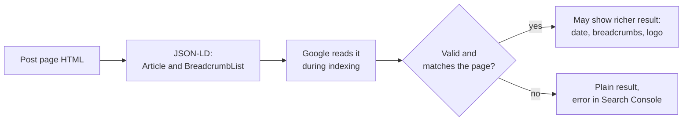

Three honest rules:

1. Structured data is **not** a ranking boost by itself. It helps Google understand and present the page.
2. Rich results are **never guaranteed**. Google decides per query. Google has also reduced several rich
   result types over the years (FAQ results now appear only for a few authoritative sites, and the sitelinks
   search box was retired). Do not build features expecting a specific rich result.
3. The data must describe what is **visible on the page**. Marking up things the visitor cannot see (fake
   reviews, hidden text) can earn a manual penalty.

### [Intermediate] Step 15 — A JsonLd component and typed builders

**What we're doing:** A tiny component that prints JSON-LD safely, and pure functions that build each schema
object from our data.

**Why:** Hand-writing JSON in JSX is error-prone. Builders give us one tested place per schema type, and the
component handles the one security detail.

**Do it:**

```tsx
// src/components/JsonLd.tsx
type JsonLdProps = {
  data: Record<string, unknown>
}

/**
 * Prints structured data. JSON.stringify does not escape "<", so a post title containing
 * "</script>" could break out of the tag. Replacing "<" with its unicode escape prevents that.
 */
export function JsonLd({ data }: JsonLdProps) {
  return (
    <script
      type="application/ld+json"
      dangerouslySetInnerHTML={{ __html: JSON.stringify(data).replace(/</g, '\\u003c') }}
    />
  )
}
```

```ts
// src/utilities/json-ld.ts
import { siteConfig } from './site'

type Crumb = { name: string; path: string }

/** Stable IDs let objects refer to each other, for example an Article's publisher. */
export const orgId = (base: string) => `${base}/#organization`
export const websiteId = (base: string) => `${base}/#website`

export function organizationJsonLd(base: string) {
  return {
    '@type': 'Organization',
    '@id': orgId(base),
    name: siteConfig.name,
    url: `${base}/`,
    logo: `${base}/logo.png`,
    // Your official profiles. Remove the ones you do not have.
    sameAs: ['https://www.linkedin.com/company/my-site', 'https://github.com/my-site'],
  }
}

export function websiteJsonLd(base: string) {
  return {
    '@type': 'WebSite',
    '@id': websiteId(base),
    name: siteConfig.name,
    url: `${base}/`,
    publisher: { '@id': orgId(base) },
    inLanguage: 'en',
  }
}

type ArticleInput = {
  base: string
  path: string
  headline: string
  description?: string
  imageUrls: string[]
  datePublished?: string | null
  dateModified: string
}

export function articleJsonLd(input: ArticleInput) {
  return {
    '@type': 'BlogPosting',
    '@id': `${input.base}${input.path}#article`,
    mainEntityOfPage: `${input.base}${input.path}`,
    headline: input.headline.slice(0, 110),
    description: input.description,
    image: input.imageUrls.length > 0 ? input.imageUrls : undefined,
    datePublished: input.datePublished ?? undefined,
    dateModified: input.dateModified,
    author: { '@id': orgId(input.base) },
    publisher: { '@id': orgId(input.base) },
  }
}

export function breadcrumbJsonLd(base: string, crumbs: Crumb[]) {
  return {
    '@type': 'BreadcrumbList',
    itemListElement: crumbs.map((crumb, index) => ({
      '@type': 'ListItem',
      position: index + 1,
      name: crumb.name,
      item: `${base}${crumb.path}`,
    })),
  }
}

/** Wrap several objects in one document. */
export function graph(...nodes: Array<Record<string, unknown>>) {
  return { '@context': 'https://schema.org', '@graph': nodes }
}
```

Add a square logo of at least 112 by 112 pixels (512 by 512 is a good size) at `public/logo.png`. Then a
test:

```ts
// tests/unit/json-ld.test.ts
import { describe, expect, it } from 'vitest'
import { articleJsonLd, breadcrumbJsonLd, graph, orgId } from '@/utilities/json-ld'

describe('json-ld builders', () => {
  it('numbers breadcrumb positions from 1 with absolute URLs', () => {
    const data = breadcrumbJsonLd('https://x.test', [
      { name: 'Home', path: '/' },
      { name: 'Blog', path: '/blog' },
    ])
    expect(data.itemListElement[1]).toEqual({
      '@type': 'ListItem',
      position: 2,
      name: 'Blog',
      item: 'https://x.test/blog',
    })
  })

  it('links the article to the organization', () => {
    const article = articleJsonLd({
      base: 'https://x.test',
      path: '/blog/a',
      headline: 'A',
      imageUrls: [],
      dateModified: '2026-10-01T00:00:00.000Z',
    })
    expect(article.publisher).toEqual({ '@id': orgId('https://x.test') })
    expect(article.image).toBeUndefined()
  })

  it('wraps nodes in a graph with the schema.org context', () => {
    expect(graph({ '@type': 'Thing' })['@context']).toBe('https://schema.org')
  })
})
```

**Check it works:**

```bash
npm run typecheck && npx vitest run tests/unit/json-ld.test.ts
```

```text
 ✓ tests/unit/json-ld.test.ts (3 tests)
```

**What just happened:** You have small builders that return plain objects. `@id` values are just unique
strings (by convention, the page URL plus a `#name`). They let one object point at another, so we describe
the organization once and the article says "my publisher is that one".

> **Why:** We used `BlogPosting`, a more specific kind of `Article` in schema.org. Google accepts `Article`,
> `NewsArticle` and `BlogPosting` for the same purpose.

> **Gotcha:** `dangerouslySetInnerHTML` is normally a red flag for **cross-site scripting** (XSS). It is safe
> here only because the content is `JSON.stringify` output with `<` escaped. Never put raw HTML from the CMS
> into it.

### [Beginner] Step 16 — Organization and WebSite on the home page

**What we're doing:** Telling Google who runs the site and what the site is called.

**Why:** The `WebSite` name is one of the signals Google uses for the **site name** shown above your results.
`Organization` with a logo can be used for the logo in search and in Google's knowledge panel.

**Do it:** In the home page component, render the JSON-LD as the first child of the fragment:

```tsx
// src/app/(frontend)/page.tsx (changes only)
import { JsonLd } from '@/components/JsonLd'
import { graph, organizationJsonLd, websiteJsonLd } from '@/utilities/json-ld'

// inside HomePage, at the top of the returned fragment <>...</>:
      <JsonLd data={graph(organizationJsonLd(siteConfig.url), websiteJsonLd(siteConfig.url))} />
```

**Check it works:**

```bash
curl -s http://localhost:3000/ | grep -o '<script type="application/ld+json">.*</script>' | head -c 300
```

```text
<script type="application/ld+json">{"@context":"https://schema.org","@graph":[{"@type":"Organization","@id":"http://localhost:3000/#organization","name":"My Site", ...
```

**What just happened:** The home page now carries a small, machine-readable "about us" card. It only needs to
be on one page, usually the home page.

### [Intermediate] Step 17 — Article and BreadcrumbList on posts

**What we're doing:** Describing each post as an article, with its dates and image, and its place in the site
(Home > Blog > Post).

**Why:** Dates and images in structured data help Google show the right date in results and pick a good
thumbnail. Breadcrumbs help Google understand your site's hierarchy.

**Do it:** In the post page, build the data after loading the post and render it as the first child of
`<article>`:

```tsx
// src/app/(frontend)/blog/[slug]/page.tsx (changes only)
import { JsonLd } from '@/components/JsonLd'
import { articleJsonLd, breadcrumbJsonLd, graph } from '@/utilities/json-ld'
import { resolveSeo } from '@/utilities/seo'
import { siteConfig } from '@/utilities/site'

// inside PostPage, after the post is loaded:
  const base = siteConfig.url
  const path = `/blog/${slug}`
  const seo = resolveSeo(
    { title: post.title, meta: post.meta, fallbackDescription: post.excerpt, fallbackImage: post.coverImage },
    base,
  )
  const imageUrls = [
    // Our generated share image (Part 6) always exists.
    `${base}${path}/opengraph-image`,
    ...(seo.image ? [seo.image.url.startsWith('http') ? seo.image.url : `${base}${seo.image.url}`] : []),
  ]
  const jsonLd = graph(
    articleJsonLd({
      base,
      path,
      headline: post.title,
      description: seo.description,
      imageUrls,
      datePublished: post.publishedAt,
      dateModified: post.updatedAt,
    }),
    breadcrumbJsonLd(base, [
      { name: 'Home', path: '/' },
      { name: 'Blog', path: '/blog' },
      { name: post.title, path },
    ]),
  )

// first child of <article>:
      <JsonLd data={jsonLd} />
```

Show the same breadcrumb visibly, so the structured data matches the page. Replace the "Back to blog" paragraph
with a breadcrumb nav:

```tsx
// src/app/(frontend)/blog/[slug]/page.tsx (replace the "Back to blog" <p>)
        <nav aria-label="Breadcrumb" className="text-sm text-slate-500">
          <ol className="flex flex-wrap gap-2">
            <li>
              <Link href="/" className="hover:underline">Home</Link>
              <span aria-hidden="true"> /</span>
            </li>
            <li>
              <Link href="/blog" className="font-medium text-brand-700 hover:underline">Blog</Link>
              <span aria-hidden="true"> /</span>
            </li>
            <li aria-current="page" className="truncate">{post.title}</li>
          </ol>
        </nav>
```

**Check it works:** View source on a post and find two objects inside one `@graph`: `BlogPosting` with
`datePublished` and `dateModified`, and `BreadcrumbList` with three items. The page shows
"Home / Blog / Welcome to our new website" at the top.

> **Gotcha:** Guide 2's Playwright test may click the "Back to blog" link by name. If it does, change it to
> click the "Blog" link inside the breadcrumb:
> `page.getByRole('navigation', { name: 'Breadcrumb' }).getByRole('link', { name: 'Blog' })`.

**What just happened:** Each post page now explains itself: what it is, who published it, when, and where it
sits in the site. The visible breadcrumb and the JSON-LD tell the same story, which is what Google expects.

### [Beginner] Step 18 — Validate with the Rich Results Test

**What we're doing:** Checking the structured data with Google's own tool, before and after deploying.

**Why:** A missing comma or a wrong type silently disables structured data. The tool tells you in seconds.

**Do it:**

1. Deploy your branch (the pull request preview is enough).
2. Open Google's **Rich Results Test** (search for "Rich Results Test"). Paste the URL of a post.
   Preview deployments need a login, so use the **Code** tab instead: in your browser, view source of the
   preview post page, copy everything, and paste it.
3. Also try the **Schema Markup Validator** at validator.schema.org. It checks against all of schema.org,
   not only the types Google uses for rich results.

**Check it works:**

```text
Rich Results Test
  2 valid items detected
  Articles      1 valid item
  Breadcrumbs   1 valid item
```

Warnings such as "Missing field author.url" are optional improvements, not errors. Errors (red) must be fixed.

**What just happened:** You validated what Google sees, not what you hope it sees. After the site is live,
Search Console (Part 4) keeps checking every page and reports structured data problems under **Enhancements**.

> **Gotcha:** "Eligible for rich results" does not mean Google will show one. Give it a few weeks after
> indexing, and remember Step 15's honest rules.

## 4. Google Search Console and Bing Webmaster Tools

Until now you have guessed what Google thinks of your site. **Google Search Console** is Google's free
dashboard that tells you exactly: which pages are indexed, which are not and why, what people searched for to
find you, and how fast your pages are for real visitors. **Bing Webmaster Tools** is the same for Bing, which
also feeds DuckDuckGo, Yahoo and several AI assistants' search features.

Do this part after the work so far is merged and deployed to production, with `ALLOW_INDEXING=true` set.

### [Beginner] Step 19 — Verify your domain with a DNS TXT record

**What we're doing:** Proving to Google that you own `my-site.com`.

**Why:** Search Console shows private data and lets you remove pages from Google. It must be sure you are the
owner. Verifying with DNS is the strongest proof: only the owner of a domain can add records to it.

**Do it:**

1. Open **Google Search Console** (search for it, then sign in with the Google account the business will
   keep; a shared company account is better than a personal one).
2. Click **Add property**. You are offered two types:

| Property type | Covers | Verification options |
|---|---|---|
| **Domain** (`my-site.com`) | Every protocol and subdomain: `https://www.`, `http://`, `blog.` and so on | DNS record only |
| **URL prefix** (`https://www.my-site.com/`) | Only URLs starting with exactly that prefix | HTML file, HTML meta tag, Google Analytics, Tag Manager, or DNS |

   Choose **Domain** and type `my-site.com` (no `https://`, no `www`).
3. Google shows a TXT record value like `google-site-verification=AbC123...`. Copy it.
4. At the place that manages your DNS (your registrar, Cloudflare, Vercel DNS or Route 53, whichever you used
   in guide 3), add a record:

```text
Type   Name / Host   Value
TXT    @             google-site-verification=AbC123...
```

   `@` means the apex domain itself. Some DNS panels want the name left empty instead of `@`.
5. Wait a few minutes, then click **Verify**.

**Check it works:** Before clicking Verify, confirm the record is visible to the world:

```bash
dig +short TXT my-site.com
```

```text
"google-site-verification=AbC123..."
```

Then Search Console says **Ownership verified**. Leave the TXT record in place forever; Google checks it again
from time to time, and removing it removes your access.

**What just happened:** You proved ownership with DNS, the same mechanism Vercel used for your custom domain
and the one email providers use in Part 7. A TXT record is just a piece of text attached to a domain name.
Many services use them to say "the owner of this domain approved me".

> **Gotcha:** If you prefer a URL-prefix property with the meta tag method, Next.js can print the tag for you.
> Add `verification: { google: 'AbC123...' }` to the root layout's `metadata`. It renders
> `<meta name="google-site-verification" content="AbC123..."/>`. Bing's tag works through
> `verification: { other: { 'msvalidate.01': 'XYZ...' } }`. DNS is still the better choice: it survives a
> redesign that accidentally drops the tag.

> **Why:** Add a second owner in **Settings > Users and permissions**. If the only owner leaves the company,
> you can still get back in with the DNS record, but it is slower.

### [Beginner] Step 20 — Submit your sitemap to Google and Bing

**What we're doing:** Telling both search engines where your sitemap is.

**Why:** Google will eventually find `/sitemap.xml` through `robots.txt`, but submitting it makes discovery
faster and gives you a status report for it.

**Do it:**

**Google.** In Search Console, open **Sitemaps** (left menu, under Indexing). Enter `sitemap.xml` (the field
already has your domain in front) and click **Submit**.

**Bing.** Open **Bing Webmaster Tools** and sign in. Choose **Import from Google Search Console**. It copies your
verified sites and sitemaps in one click, so you do not have to verify again. If you prefer to set it up by
hand, add the site, verify it (Bing offers a meta tag, an XML file or a DNS CNAME record), then open
**Sitemaps** and submit `https://www.my-site.com/sitemap.xml`.

**Check it works:** Within minutes to a day, Google's Sitemaps page shows:

```text
Sitemap        Type      Submitted    Last read    Status     Discovered pages
/sitemap.xml   Sitemap   Oct 6, 2026  Oct 6, 2026  Success    7
```

"Discovered pages" should equal the number of `<url>` entries in your sitemap. "Couldn't fetch" usually means
the URL is wrong, the deploy still has `noindex` headers, or the sitemap lists `localhost` URLs because
`NEXT_PUBLIC_SERVER_URL` is wrong in production.

**What just happened:** Both search engines now poll your sitemap regularly. Because our sitemap updates on
every publish (Guide 2, Step 22 revalidates it), new posts are discovered without you doing anything.

> **Why:** Bing also supports **IndexNow**, a protocol where your site pings search engines the moment a URL
> changes, instead of waiting for them to poll. Bing, Yandex and a few others use it; Google does not. For a
> small site the sitemap is enough. If you want it later, you would call the IndexNow API from the same
> `afterChange` hooks that revalidate pages.

### [Beginner] Step 21 — Use URL Inspection to see one page through Google's eyes

**What we're doing:** Checking a single URL: is it indexed, which canonical did Google choose, and what HTML
did Googlebot get?

**Why:** When one specific page is missing from Google, this tool tells you why in under a minute.

**Do it:** In Search Console, paste a full URL (for example
`https://www.my-site.com/blog/welcome-to-our-new-website`) into the search bar at the top.

**Check it works:** You see one of two answers:

```text
URL is on Google
  Page indexing: Page is indexed
  User-declared canonical: https://www.my-site.com/blog/welcome-to-our-new-website
  Google-selected canonical: Inspected URL
```

```text
URL is not on Google
  Page indexing: Discovered - currently not indexed
```

Three useful buttons:

- **Test live URL** fetches the page now, as Googlebot. Use it right after a fix.
- **View tested page** shows the HTML Google received, a screenshot, and any blocked resources. If the HTML is
  missing your content, Google cannot see it either.
- **Request indexing** asks Google to crawl the page soon. There is a small daily quota. Use it for an
  important new page, not for every post.

**What just happened:** You compared "what you declared" (your canonical) with "what Google decided" (its
canonical). When they differ, Google thinks your page is a duplicate of another URL. Step 7 is how you prevent
that.

### [Intermediate] Step 22 — Read the Page indexing report

**What we're doing:** Learning what each "not indexed" reason means and which ones you should actually fix.

**Why:** Every site has some non-indexed URLs, and that is normal. Beginners panic at a long list of "errors"
that are fine. The skill is knowing which reasons are expected and which are real problems.

**Do it:** Open **Indexing > Pages**. The top chart shows indexed vs not indexed. Below it, **Why pages aren't
indexed** lists reasons. Click a reason to see example URLs.

| Reason | What it means | On this site | Action |
|---|---|---|---|
| Excluded by 'noindex' tag | The page asked not to be indexed | Pages where an editor ticked noIndex | Expected. Fix only if the URL should be indexed |
| Page with redirect | The URL redirects elsewhere | Old slugs from Step 11, `my-site.com` to `www` | Expected |
| Not found (404) | The URL returns 404 | Deleted posts, typos in links from other sites | Add a redirect if there is a good replacement; otherwise fine |
| Alternate page with proper canonical tag | The page points its canonical at another URL, and Google agreed | `/about?utm_source=...` | Expected |
| Duplicate without user-selected canonical | Google found duplicates and the page had no canonical | Should not happen: every page sets one | Find the page type missing `alternates.canonical` |
| Duplicate, Google chose different canonical than user | You said A, Google picked B | Content too similar between two pages | Merge the pages or make them clearly different |
| Blocked by robots.txt | `robots.txt` disallows it | `/admin`, `/api/`, `/next/` | Expected |
| Crawled - currently not indexed | Google fetched it and decided not to index it, for now | Thin or very short posts | Improve the content, add internal links; then wait |
| Discovered - currently not indexed | Google knows the URL but has not crawled it yet | New posts on a young site | Usually just time. Internal links and sitemap help |
| Server error (5xx) | Your server failed when Googlebot visited | A crash or a database outage | Real problem. Check Sentry and logs (guide 3) |
| Soft 404 | The page returns 200 but looks empty or like an error | An empty blog page or a redirect to home | Return a real 404 (our `notFound()` does this) |

When you fix a group of URLs, open the reason and click **Validate fix**. Google re-checks those URLs over the
next days and emails you the result.

**Check it works:** Open the report for your site. For each reason listed, you can say "expected" or name the
fix. For a new site, expect mostly "Discovered - currently not indexed" for the first one to three weeks.

**What just happened:** You turned a scary list into a short to-do list. In practice only **Server error**,
**Soft 404**, and **Duplicate ... chose different canonical** need action on a healthy site.

> **Interview tip:** "A page is not showing up in Google. How do you debug it?" Answer in stages: is it in the
> sitemap and linked (discovery), does URL Inspection show it was crawled, does the live test show the full
> HTML, is there a `noindex` or a canonical pointing elsewhere (indexing), and only then, is the content good
> enough to rank.

### [Beginner] Step 23 — The Core Web Vitals report and the Performance report

**What we're doing:** Finding the two other reports you will check every month.

**Why:** The Core Web Vitals report shows how fast your site is for **real Chrome users**, which is what Google
uses. The Performance report shows what people search for before they click on you, which tells you what to
write next.

**Do it:**

1. Open **Experience > Core Web Vitals**. You see a Mobile chart and a Desktop chart, each splitting URLs
   into Good, Needs improvement and Poor. Click a row like "LCP issue: longer than 2.5s (mobile)" to see
   **URL groups**: Google groups similar pages (all blog posts, for example), so one fix often fixes many.
2. Open **Performance > Search results**. Tick all four boxes at the top: **Total clicks**, **Total
   impressions** (how often you appeared in results), **Average CTR** (clicks divided by impressions) and
   **Average position**. Look at the **Queries** tab.

**Check it works:** On a new site, the Core Web Vitals report probably says:

```text
Not enough usage data in the last 90 days for this device type
```

That is normal. The data comes from the **Chrome User Experience Report** (CrUX), which only covers sites and
pages with enough Chrome visitors. Until then, use your own measurements from Part 5.

**What just happened:** You found where the real-world data lives. A useful habit: in the Queries tab, sort by
impressions. A query with many impressions but low CTR means your title or description does not match what
people want. Rewrite the meta title and description (Step 4) and check again in a month.

## 5. Speed for SEO

Speed is a small ranking factor, but a large factor for visitors: slow pages lose people before they read a
word. Guide 2, Step 30 measured speed with Lighthouse on your laptop. Here you measure what **real visitors**
experience and fix the usual causes.

### [Beginner] Concept — Core Web Vitals, explained simply

Google uses three **Core Web Vitals**. Each answers one question a visitor would ask.

| Metric | Full name | The visitor's question | Good | Poor |
|---|---|---|---|---|
| **LCP** | Largest Contentful Paint | "When can I see the main thing?" Time until the biggest image or text block is shown | 2.5 s or less | More than 4 s |
| **INP** | Interaction to Next Paint | "When I click, does it react?" Delay between a tap, click or key press and the screen updating | 200 ms or less | More than 500 ms |
| **CLS** | Cumulative Layout Shift | "Does stuff jump around?" How much visible content moves unexpectedly | 0.1 or less | More than 0.25 |

Google judges each metric at the **75th percentile**: 3 out of 4 page loads must be "good" for the page to
pass. Mobile and desktop are judged separately.

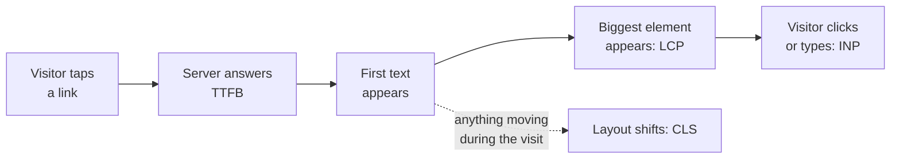

**Lab data vs field data.** Lighthouse is **lab** data: one simulated load on one simulated phone. It is great
for debugging, because you can repeat it. **Field** data comes from real visitors on real devices and
networks. Google ranks with field data. Lighthouse cannot even measure INP properly, because nobody clicks
during a lab run. You need both.

### [Beginner] Step 24 — Measure Core Web Vitals in the field

**What we're doing:** Collecting Core Web Vitals from real visitors.

**Why:** CrUX data (Step 23) needs a lot of traffic and is 28 days behind. Your own field data starts the day
you deploy, and shows every page.

**Do it:** Pick the path you deployed with in guide 3.

**Path A (Vercel): Speed Insights.** In the Vercel project, open **Speed Insights** and click **Enable**. Then:

```bash
npm install @vercel/speed-insights
```

```tsx
// src/app/(frontend)/layout.tsx (changes only)
import { SpeedInsights } from '@vercel/speed-insights/next'

// inside <body>, after <Footer />:
        <SpeedInsights />
```

**Path B (AWS, or any host): report to your own logs.** Next.js has a hook that receives each metric from the
browser. A tiny client component sends them to a route handler, which writes one log line per metric:

```tsx
// src/components/WebVitals.tsx
'use client'

import { useReportWebVitals } from 'next/web-vitals'

const TRACKED = new Set(['LCP', 'INP', 'CLS', 'TTFB', 'FCP'])

export function WebVitals() {
  useReportWebVitals((metric) => {
    if (!TRACKED.has(metric.name)) return
    const body = JSON.stringify({
      name: metric.name,
      value: Math.round(metric.name === 'CLS' ? metric.value * 1000 : metric.value),
      rating: metric.rating,
      path: window.location.pathname,
    })
    // sendBeacon survives the page being closed. fetch with keepalive is the fallback.
    if (!navigator.sendBeacon?.('/next/vitals', body)) {
      void fetch('/next/vitals', { method: 'POST', body, keepalive: true })
    }
  })
  return null
}
```

```ts
// src/app/(frontend)/next/vitals/route.ts
import { z } from 'zod'

const metricSchema = z.object({
  name: z.enum(['LCP', 'INP', 'CLS', 'TTFB', 'FCP']),
  value: z.number().nonnegative().max(600000),
  rating: z.enum(['good', 'needs-improvement', 'poor']),
  path: z.string().max(300),
})

export async function POST(request: Request): Promise<Response> {
  const parsed = metricSchema.safeParse(await request.json().catch(() => null))
  if (!parsed.success) return new Response(null, { status: 400 })
  // One JSON line per metric. CloudWatch Logs Insights can then compute percentiles.
  console.info(JSON.stringify({ type: 'web-vital', ...parsed.data }))
  return new Response(null, { status: 204 })
}
```

Render `<WebVitals />` inside `<body>` in the `(frontend)` layout, the same place as `SpeedInsights` above.

**Check it works:** Path A: deploy, browse a few pages on your phone, and within an hour the Speed Insights tab
shows a **Real Experience Score** and per-route LCP, INP and CLS. Path B: browse locally with
`npm run build && npm run start`, then click around. The terminal shows:

```text
{"type":"web-vital","name":"TTFB","value":42,"rating":"good","path":"/"}
{"type":"web-vital","name":"LCP","value":612,"rating":"good","path":"/"}
```

In CloudWatch Logs Insights you can then ask for the 75th percentile:

```text
filter type = "web-vital" and name = "LCP"
| stats pct(value, 75) as p75 by path
```

**What just happened:** Each visitor's browser now measures the vitals using the standard browser APIs (the
`web-vitals` library is built into Next.js) and reports them. CLS is a small decimal, so we multiplied it by
1000 to log a whole number; remember that when reading the numbers. Also try **PageSpeed Insights** (search for
it): at the top it shows CrUX field data for your URL when Google has enough, and Lighthouse lab data below.

> **Gotcha:** The `/next/vitals` endpoint accepts anonymous POSTs. That is fine for log lines, which is why we
> validate and size-limit the body. Do not write these to the database; a bot could fill it.

### [Intermediate] Step 25 — Fix LCP: the main image, the server and fonts

**What we're doing:** Making the largest element on each page type appear sooner.

**Why:** LCP is the vital most sites fail. On a content site like ours, it is almost always a big image or the
`h1` text.

**Do it:** First find the LCP element per page type. In Chrome DevTools, open the **Performance** panel and
reload with recording on; the **LCP** marker shows the element. Or read Lighthouse's "Largest Contentful Paint
element" audit. On `my-site` it is typically:

| Page | LCP element | Status |
|---|---|---|
| Post | The cover image | Already `eager` with `fetchPriority="high"` (Guide 2, Step 15) |
| Home | The hero `h1` text | Fast, as long as the font is ready |
| Blog list | The **first card's image** | Lazy-loaded today: this is the bug |

**1. Do not lazy-load the LCP image.** `loading="lazy"` makes the browser wait until layout to decide whether
to download an image. Above the fold, that delay is pure loss. Let the first card on the blog list load
eagerly. Add an `eager` prop to `PostCard` and pass it to `CmsImage`:

```tsx
// src/components/PostCard.tsx (changes only)
type PostCardProps = {
  post: Post
  /** true for the first card above the fold */
  eager?: boolean
}

export function PostCard({ post, eager = false }: PostCardProps) {
  // ...unchanged...
  // on the existing <CmsImage ... /> add:
  //   eager={eager}
}
```

```tsx
// src/app/(frontend)/blog/page.tsx (in the map over result.docs)
          {result.docs.map((post, index) => (
            <PostCard key={post.id} post={post} eager={index === 0} />
          ))}
```

**2. Correct `sizes`.** `sizes` tells the browser how wide the image will be **before** CSS loads, so it can
pick the right file from the `srcset` that `next/image` generates. Too large wastes bytes; too small looks
blurry. Check each `CmsImage`:

```text
Post cover in a max-w-3xl container:  sizes="(min-width: 768px) 720px, 100vw"
Card in a 2-column grid:              sizes="(min-width: 640px) 50vw, 100vw"
Card in a 3-column grid (home):       sizes="(min-width: 768px) 33vw, (min-width: 640px) 50vw, 100vw"
```

**3. A fast first byte.** LCP cannot be earlier than the server's first byte (TTFB). Static pages are served
from the CDN and are fast. But `/blog` reads `searchParams`, so it renders on every request and queries the
database. On Neon, a database that scaled to zero must wake up first, which can add a noticeable delay to the
first visitor after a quiet period. For production, look at Neon's compute settings for "scale to zero" or
autosuspend, and consider keeping the production compute always on if your plan allows it (check current Neon
pricing). Then check **TTFB** in your field data.

**4. Fonts.** Guide 2 used `next/font`, which self-hosts the files, uses `font-display: swap` and creates a
size-matched fallback font. That is already the best setup. Two rules to keep it that way: never add a
`<link>` to Google Fonts by hand, and keep to two font families.

**Check it works:** Run Lighthouse on `/blog` (production build, Mobile). The audit "Largest Contentful Paint
image was lazily loaded" is gone, and LCP improves. In the Network panel, the first card image now shows
priority **High**.

**What just happened:** You removed artificial delays in front of the most important element. In Next.js 16,
`loading="eager"` plus `fetchPriority="high"` is the recommended way to mark the LCP image. The older `priority`
prop on `next/image` is deprecated in Next.js 16 (check the `next/image` docs for your exact version; a
`preload` prop exists for the rare case where you need a `<link rel="preload">`).

> **Gotcha:** Mark only **one** image per page as high priority. If everything is "high priority", nothing is.

### [Intermediate] Step 26 — Fix CLS: reserve space for everything

**What we're doing:** Making sure nothing pushes content down after it first appears.

**Why:** Layout shift is the "I tapped the wrong button because the page jumped" problem. It is almost always
caused by something that loads late without reserved space.

**Do it:** Check the usual causes on this site:

| Cause | Status | Fix |
|---|---|---|
| Images without dimensions | Fixed: `CmsImage` always passes `width` and `height` | Keep using `CmsImage`, never a bare `` |
| Web fonts swapping | Mostly fixed by `next/font`'s size-adjusted fallback | Nothing to do |
| Embeds (YouTube, maps) in content | Not yet used | Wrap in a box with a fixed aspect ratio (below) |
| A cookie or consent banner | Comes in Part 8 | Use `position: fixed` so it overlays instead of pushing |
| The captcha widget on `/contact` | Comes in Part 7 | Reserve its height with `min-height` |
| Content injected above existing content | Not used | Never insert above what the visitor already sees |

When you add a video embed, always reserve the space before the iframe loads:

```tsx
// src/components/VideoEmbed.tsx
type VideoEmbedProps = { youtubeId: string; title: string }

export function VideoEmbed({ youtubeId, title }: VideoEmbedProps) {
  return (
    // aspect-video = 16:9. The box has its final size before the iframe loads.
    <div className="relative aspect-video w-full overflow-hidden rounded-lg bg-slate-100">
      <iframe
        className="absolute inset-0 h-full w-full"
        src={`https://www.youtube-nocookie.com/embed/${encodeURIComponent(youtubeId)}`}
        title={title}
        loading="lazy"
        allow="accelerometer; encrypted-media; gyroscope; picture-in-picture"
        allowFullScreen
      />
    </div>
  )
}
```

**Check it works:** In Chrome DevTools, open the **Performance** panel, record a page load, and look at the
**Layout shifts** track. It should be empty or show tiny shifts. Lighthouse's CLS should be 0 or close to it.

**What just happened:** CLS is about **reserving space**. Width and height on images, aspect-ratio boxes on
embeds, and fixed positioning for overlays all tell the browser the final layout before the late content
arrives. The `youtube-nocookie.com` domain is YouTube's privacy-enhanced embed, which matters in Part 8.

### [Intermediate] Step 27 — Fix INP: keep JavaScript small and load third-party scripts carefully

**What we're doing:** Keeping the main thread free so clicks get an instant response.

**Why:** INP is bad when the browser is busy running JavaScript at the moment the visitor taps. On marketing
sites, the biggest cause is **third-party scripts**: chat widgets, analytics, tag managers, A/B testing tools.

**Do it:** Our own JavaScript is already small: only the nav link, the contact form and the error boundary are
client components. The rule for everything else: **every third-party script goes through `next/script`**, with
the latest strategy that still works.

| Strategy | When it loads | Use for |
|---|---|---|
| `beforeInteractive` | Before the page becomes interactive (root layout only) | Almost nothing. Bot detection or consent tools that must run first |
| `afterInteractive` (default) | Right after hydration | Analytics, our captcha |
| `lazyOnload` | When the browser is idle | Chat widgets, social embeds, anything not needed at once |

Example: a chat widget loaded only when the browser is idle:

```tsx
// src/components/ChatWidget.tsx
import Script from 'next/script'

export function ChatWidget() {
  return <Script src="https://chat.example.com/widget.js" strategy="lazyOnload" />
}
```

Two more habits:

- Load a script only on pages that need it. Our captcha script (Part 7) is rendered inside the contact form, so
  it is downloaded only on `/contact`, not on every page.
- Before adding any tag, ask "what decision will we make with this data?" A forgotten marketing pixel costs
  INP on every page, forever.

**Check it works:** On a production build, open DevTools, **Performance** panel, and use the page normally
(open the menu, type in the form). The **Interactions** track shows each interaction's duration. Anything above
200 ms has a long task under it; click it to see which script ran.

**What just happened:** You learned the main INP lever on a content site: control third-party JavaScript.
`next/script` deduplicates scripts, keeps them out of the critical path, and lets you choose when they load.

> **Interview tip:** If asked how you would improve Core Web Vitals on a Next.js site, give one fix per metric:
> LCP, eager-load and prioritise the hero image with correct `sizes`, and serve HTML statically from a CDN.
> CLS, dimensions on every image and reserved space for embeds and banners. INP, fewer and smaller client
> components and third-party scripts via `next/script` with `lazyOnload`. Then say you would confirm with field
> data, not just Lighthouse.

## 6. Social sharing

When someone pastes your link into Slack, LinkedIn, WhatsApp or X, those apps fetch the page and build a
preview card from the Open Graph tags. A good card gets far more clicks than a bare link.

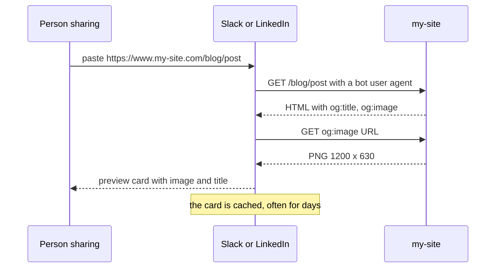

### [Intermediate] Step 28 — A generated Open Graph image for every post

**What we're doing:** Creating a branded 1200 by 630 share image per post, showing the post title, using the
same `opengraph-image.tsx` convention as guide 2's default image.

**Why:** Many posts have no cover image, and cover photos are often the wrong shape (social cards are about
1.91 to 1). A generated card with the title is always the right size, always readable and needs no designer.

**Do it:** Create the file **inside** the post route folder, so it applies to every post:

```tsx
// src/app/(frontend)/blog/[slug]/opengraph-image.tsx
import { ImageResponse } from 'next/og'
import { formatDate } from '@/utilities/format-date'
import { getPostBySlug } from '@/utilities/queries'
import { siteConfig } from '@/utilities/site'

export const alt = 'Blog post'
export const size = { width: 1200, height: 630 }
export const contentType = 'image/png'

type ImageProps = {
  params: Promise<{ slug: string }>
}

export default async function PostOpenGraphImage({ params }: ImageProps) {
  const { slug } = await params
  const post = await getPostBySlug(slug)

  const title = post?.meta?.title || post?.title || siteConfig.name
  // Long titles get a smaller font so they still fit on three lines.
  const fontSize = title.length > 70 ? 56 : title.length > 40 ? 68 : 80
  const date = post?.publishedAt ? formatDate(post.publishedAt) : ''

  return new ImageResponse(
    (
      <div
        style={{
          width: '100%',
          height: '100%',
          display: 'flex',
          flexDirection: 'column',
          justifyContent: 'space-between',
          padding: 72,
          background: 'linear-gradient(135deg, #eef5ff 0%, #ffffff 60%)',
          color: '#142a63',
        }}
      >
        <div style={{ display: 'flex', fontSize: 30, fontWeight: 600, color: '#1c44ab' }}>
          {siteConfig.name} · Blog
        </div>
        <div style={{ display: 'flex', fontSize, fontWeight: 700, lineHeight: 1.15, maxWidth: 1000 }}>
          {title}
        </div>
        <div style={{ display: 'flex', fontSize: 28, color: '#475569' }}>{date}</div>
      </div>
    ),
    size,
  )
}
```

Because the image depends on the post, the post's revalidate hook must also refresh the image. In
`src/hooks/revalidatePost.ts`, add the image path next to the post path in `revalidatePostAfterChange`:

```ts
// src/hooks/revalidatePost.ts (inside revalidatePostAfterChange)
  if (doc.slug) paths.push(`/blog/${doc.slug}`, `/blog/${doc.slug}/opengraph-image`)
```

**Check it works:** With `npm run dev`, open
`http://localhost:3000/blog/welcome-to-our-new-website/opengraph-image`. You see a 1200 by 630 PNG with the
title. Then check the tags:

```bash
curl -s http://localhost:3000/blog/welcome-to-our-new-website | grep -oE '<meta property="og:image[^>]*>'
```

```text
<meta property="og:image" content="http://localhost:3000/blog/welcome-to-our-new-website/opengraph-image?a1b2c3"/>
<meta property="og:image:width" content="1200"/>
<meta property="og:image:height" content="630"/>
<meta property="og:image:alt" content="Blog post"/>
```

**What just happened:** Next.js found `opengraph-image.tsx` in the `blog/[slug]` segment and, for each post,
rendered the JSX to a PNG with `ImageResponse` (it uses a library called Satori under the hood, which supports
flexbox and a subset of CSS; every `div` with more than one child needs `display: 'flex'`). The short hash
after `?` changes when the image changes, which helps social apps notice updates.

> **Gotcha:** **File-based metadata wins over `metadata` objects.** With this file present, a post's
> `og:image` is always the generated card, even if an editor set **Meta Image** in the SEO fields. That is a
> deliberate choice here: consistent cards for posts. If you would rather use the editor's image when there is
> one, delete this file and pass `fallbackImage: post.coverImage` in the post's `generateMetadata` instead.
> Pages (not posts) still use **Meta Image** when set, and the site-wide default card otherwise.

> **Gotcha:** `params` is a Promise here too, as everywhere in Next.js 16. To use a custom font, read a
> `.ttf` file with `readFile` from `node:fs/promises` and pass it in the `fonts` option of `ImageResponse`.
> WOFF2 is not supported by Satori.

### [Beginner] Step 29 — X (Twitter) card metadata

**What we're doing:** Completing the `twitter:` tags with your account handle.

**Why:** X reads its own `twitter:*` tags first and falls back to Open Graph. `summary_large_image` gives the
big image layout instead of a small square thumbnail. The `site` handle credits your account on the card.

**Do it:** `buildMetadata` (Step 5) already sets the card type, title and description on every page. Add the
handle once, in the layout, and make sure pages keep it. In the root layout metadata:

```tsx
// src/app/(frontend)/layout.tsx (inside the existing metadata object)
  twitter: { card: 'summary_large_image', site: '@mysite' },
```

Because metadata merges shallowly (Step 5's Gotcha), add the same `site` to `buildMetadata`'s `twitter`
object too:

```ts
// src/utilities/seo.ts (inside buildMetadata, the twitter object)
    twitter: {
      card: 'summary_large_image',
      site: '@mysite',
      title: seo.title,
      description: seo.description,
      images: images?.map((image) => image.url),
    },
```

Use your real handle, or remove `site` if the business has no X account.

**Check it works:**

```bash
curl -s http://localhost:3000/blog/welcome-to-our-new-website | grep -oE '<meta name="twitter:[^>]*>'
```

```text
<meta name="twitter:card" content="summary_large_image"/>
<meta name="twitter:site" content="@mysite"/>
<meta name="twitter:title" content="Welcome to our new website"/>
<meta name="twitter:description" content="We rebuilt our website ..."/>
```

There is no `twitter:image` on posts. That is fine: X uses `og:image` when `twitter:image` is missing.

**What just happened:** You completed the set of tags every major platform reads. LinkedIn, Slack, WhatsApp,
Facebook, Discord and iMessage all read Open Graph. X reads `twitter:*` and falls back to Open Graph.

### [Beginner] Step 30 — Test previews, and the caching gotchas

**What we're doing:** Checking the real cards on the real platforms, and learning how to refresh them.

**Why:** Each platform has quirks: image size limits, caching, required tags. A preview tool shows the problem
before your marketing team posts the link.

**Do it:** Deploy, then test one post URL in each tool:

| Tool | Where | What it gives you |
|---|---|---|
| opengraph.xyz | Search "opengraph.xyz", paste the URL | Previews for many platforms at once, plus missing tags |
| LinkedIn Post Inspector | linkedin.com/post-inspector | LinkedIn's card, and **refreshes LinkedIn's cache** for the URL |
| Facebook Sharing Debugger | developers.facebook.com/tools/debug | Facebook's card, warnings, and a **Scrape Again** button to refresh the cache |
| Slack | Paste the link in a message to yourself | Slack's unfurl |
| WhatsApp | Send the link to yourself | WhatsApp's card |

**Check it works:** Every tool shows the generated card with the post title, your site name and the post's
description. No tool reports a missing `og:image` or an image it could not fetch.

**What just happened:** You saw the cards as your audience will. The most common problems and fixes:

- **Old card after you changed the title.** Platforms cache cards, often for days. LinkedIn and Facebook have
  refresh buttons (above). Slack refreshes after a while on its own.
- **WhatsApp shows an old card or none.** WhatsApp caches per URL on its side and has no public refresh tool.
  The practical workaround is to share a slightly different URL, for example adding `?v=2`. Our canonical tag
  still points at the clean URL, so SEO is not affected. WhatsApp is also picky about image weight; keep share
  images small (a few hundred KB at most). Our generated PNGs are usually far below that.
- **Image missing everywhere.** The `og:image` URL must be absolute and publicly reachable. If it says
  `localhost`, `NEXT_PUBLIC_SERVER_URL` is wrong in production. On a preview deployment behind Vercel
  Deployment Protection, social bots cannot fetch anything; test on production.

> **Gotcha:** Some platforms request your page with a **HEAD** request or with a short timeout. A slow,
> dynamically rendered page can produce no card. Static pages, like our posts, avoid this.

## 7. The contact form, for real

Guide 2's form validates input, stops lazy bots with a honeypot and stores messages. Three things are missing
for a real business: **somebody has to be told** a message arrived, **smarter bots** must be stopped, and one
visitor must not be able to send a thousand messages. We also record that the visitor saw the privacy notice.

### [Beginner] Concept — The hardened contact flow

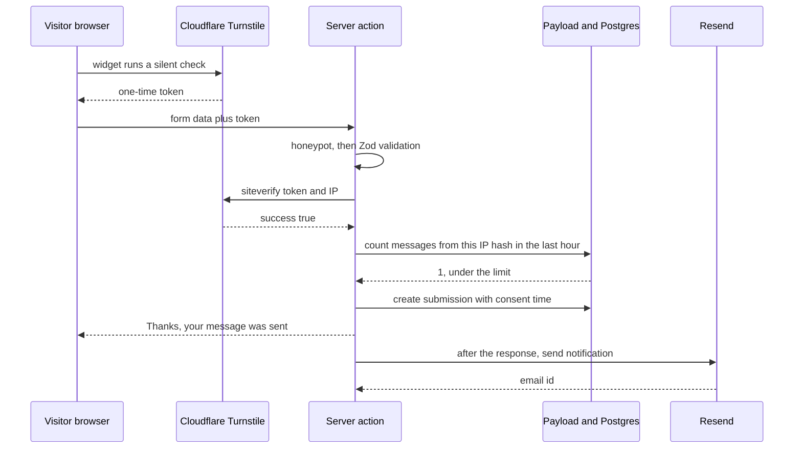

Each layer stops a different attacker:

| Layer | Stops | Cost to the visitor |
|---|---|---|
| Honeypot (guide 2) | Simple bots that fill every field | None |
| Zod validation (guide 2) | Garbage and oversized input | None |
| Turnstile | Most automated bots, including headless browsers | Usually none; sometimes one click |
| Rate limit per IP | A person or script hammering the form | Only after 5 messages in an hour |
| Closed REST endpoint | Bots posting straight to `/api/contact-submissions`, skipping all of the above | None |

That last row is a real hole in what we built so far. Guide 1 gave the collection `create: anyone`, so anyone
can still `POST` to Payload's REST API directly and bypass the form, the captcha and the rate limit. We close
it in Step 31.

### [Intermediate] Step 31 — Lock down the collection and store consent

**What we're doing:** Allowing submissions only through our server action, and adding fields for the consent
record and the rate limit.

**Why:** Security checks in a server action mean nothing if there is a second, unchecked door into the same
table. And if anyone asks "did this person agree to our privacy notice?", you want a timestamp and the exact
wording they saw, not a guess.

**Do it:** Replace the whole file:

```ts
// src/collections/ContactSubmissions.ts
import type { CollectionConfig } from 'payload'

import { authenticated } from '../access/authenticated'

export const ContactSubmissions: CollectionConfig = {
  slug: 'contact-submissions',
  labels: {
    singular: 'Contact submission',
    plural: 'Contact submissions',
  },
  admin: {
    useAsTitle: 'name',
    defaultColumns: ['name', 'email', 'createdAt'],
    description: 'Messages sent through the /contact form. Deleted automatically after 180 days.',
  },
  access: {
    // Only our server action creates submissions. It uses the Local API, which skips
    // access checks, so this closes the public REST and GraphQL door without affecting the form.
    create: () => false,
    read: authenticated,
    delete: authenticated,
    update: () => false,
  },
  fields: [
    { name: 'name', type: 'text', required: true, maxLength: 100 },
    { name: 'email', type: 'email', required: true },
    { name: 'message', type: 'textarea', required: true, minLength: 10, maxLength: 5000 },
    {
      name: 'consentAt',
      type: 'date',
      admin: { readOnly: true, position: 'sidebar', date: { pickerAppearance: 'dayAndTime' } },
    },
    {
      name: 'consentText',
      type: 'textarea',
      admin: { readOnly: true, position: 'sidebar', description: 'The exact wording the visitor agreed to.' },
    },
    {
      // A keyed hash of the visitor's IP address. Used only for rate limiting. Never the raw IP.
      name: 'ipHash',
      type: 'text',
      index: true,
      admin: { hidden: true },
    },
  ],
}
```

```bash
npm run migrate:create -- contact-hardening
npm run migrate
npm run generate:types
```

**Check it works:** Try guide 1's anonymous request again:

```bash
curl -s -X POST http://localhost:3000/api/contact-submissions \
  -H 'Content-Type: application/json' \
  -d '{"name":"Bot","email":"bot@example.com","message":"Buy cheap things now please"}'
```

```text
{"errors":[{"message":"You are not allowed to perform this action."}]}
```

The form on `/contact` still works, because the server action uses the Local API.

**What just happened:** You applied the **principle of least privilege**: give every path only the access it
needs. The public never needed the REST endpoint; the form only needed the server action. Guide 1's check
"public can create" is now intentionally false.

> **Why:** We store a **hash** of the IP, not the IP. An IP address is personal data under GDPR. A keyed hash
> (HMAC with a secret) lets us answer "have we seen this visitor in the last hour?" without being able to
> read the address back, and without someone with the database being able to guess it from a list of IPs.

### [Beginner] Concept — How email proves it is really from you: SPF, DKIM and DMARC

Email was designed in the 1980s with no proof of sender. Anyone can write "From: you@my-site.com". Three DNS
records fix this, and Gmail, Yahoo and Outlook increasingly require all three; without them, your notification
emails go to spam or are rejected.

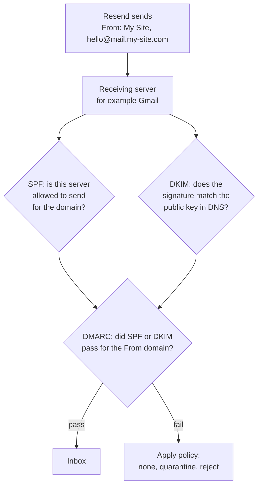

| Record | Lives at | In one sentence |
|---|---|---|
| **SPF** (Sender Policy Framework) | A TXT record on the sending domain | "These servers are allowed to send mail for this domain." |
| **DKIM** (DomainKeys Identified Mail) | A TXT record at `<selector>._domainkey.<domain>` | "Here is the public key; every email we send carries a signature made with the matching private key." |
| **DMARC** (Domain-based Message Authentication, Reporting and Conformance) | A TXT record at `_dmarc.<domain>` | "If an email claims to be from us and fails SPF and DKIM for our domain, do this with it, and send me reports." |

**Alignment** is the key DMARC idea: it is not enough that SPF or DKIM pass for *some* domain. They must pass
for a domain that matches the visible **From** address (same organisational domain, by default).
`mail.my-site.com` aligns with `my-site.com`.

### [Intermediate] Step 32 — Set up Resend with your own domain

**What we're doing:** Creating a Resend account, verifying a sending subdomain with DNS records, and adding a
DMARC policy.

**Why:** **Resend** is an email API: you call a function, it delivers the email and handles the hard parts
(sending servers, reputation, bounces). Sending from **your** domain, with the three records, is what gets the
email into the inbox. We use a **subdomain** (`mail.my-site.com`) so automated mail has its own reputation and
cannot interfere with the business's normal email on `my-site.com`.

**Do it:**

1. Sign up at resend.com. Open **Domains > Add domain** and enter `mail.my-site.com`. Pick the region closest
   to your server.
2. Resend shows the records to create. They look roughly like this; **copy the exact names and values Resend
   shows you**, they differ per account and region:

```text
Type   Name                          Value
MX     send.mail                     feedback-smtp.<region>.amazonses.com   (priority 10)
TXT    send.mail                     v=spf1 include:amazonses.com ~all
TXT    resend._domainkey.mail        p=MIGfMA0GCSqGSIb3DQEBAQUAA4GNADCBiQ...
```

   The `send.mail` records set up the **return path** (where bounces go) and its SPF. The `_domainkey` record
   is the DKIM public key.
3. Add DMARC for your main domain if it does not have one yet. Subdomains inherit it:

```text
Type   Name     Value
TXT    _dmarc   v=DMARC1; p=none; rua=mailto:dmarc-reports@my-site.com
```

   `p=none` means "only report, do not block". Start there. After a few weeks of clean reports, move to
   `p=quarantine` and later `p=reject`.
4. Click **Verify** in Resend. Then create an **API key** with "Sending access" only, restricted to this
   domain.
5. Store the settings. Locally in `.env`, and in Vercel (Production and Preview) or AWS Secrets Manager:

```bash
# .env.example (add)
# Resend API key with sending access only. Secret.
RESEND_API_KEY=
# Who emails come from. Must use the domain verified in Resend.
EMAIL_FROM="My Site <hello@mail.my-site.com>"
# Where contact notifications go.
CONTACT_TO_EMAIL=owner@my-site.com
# "true" to send the visitor a short confirmation email.
CONTACT_AUTO_REPLY=false
```

**Check it works:**

```bash
dig +short TXT resend._domainkey.mail.my-site.com
dig +short TXT _dmarc.my-site.com
```

```text
"p=MIGfMA0GCSqGSIb3DQEBAQUAA4GNADCBiQ..."
"v=DMARC1; p=none; rua=mailto:dmarc-reports@my-site.com"
```

Resend's Domains page shows the domain as **Verified**. After Step 34 sends a real email to a Gmail address,
open it, choose **Show original**, and look for:

```text
SPF:   PASS with IP ...
DKIM:  'PASS' with domain mail.my-site.com
DMARC: 'PASS'
```

**What just happened:** You gave receiving servers two independent proofs (SPF and DKIM) that Resend may send
for `mail.my-site.com`, and a policy (DMARC) for what to do with fakes. DMARC reports arrive as XML
attachments; free services can turn them into readable dashboards.

> **Gotcha:** A domain may have only **one** SPF record and only **one** DMARC record. If the business already
> uses Google Workspace or Microsoft 365 on `my-site.com`, there may already be a `_dmarc` record. Do not add
> a second one; edit the existing one. Using the `mail.` subdomain means Resend's SPF never touches the main
> domain's SPF.

> **Outdated:** Before 2024 you could often get away with no DMARC. Since then, the big mailbox providers
> require SPF, DKIM and a DMARC record for bulk senders and treat unauthenticated mail much more harshly for
> everyone. A contact form is low volume, but authentication still decides inbox or spam.

### [Intermediate] Step 33 — Email templates with React Email

**What we're doing:** Writing the notification email (to the site owner) and the auto-reply (to the visitor)
as React components.

**Why:** HTML email is notoriously hard: every email client renders it differently, and many ignore modern
CSS. **React Email** gives you components (`Html`, `Container`, `Text`, `Button`...) that output the
old-fashioned, table-based HTML email clients understand. You write normal React.

**Do it:**

```bash
npm install resend @react-email/components
```

```tsx
// src/emails/ContactNotification.tsx
import { Body, Container, Head, Heading, Hr, Html, Link, Preview, Section, Text } from '@react-email/components'

type ContactNotificationProps = {
  name: string
  email: string
  message: string
  adminUrl: string
}

export function ContactNotification({ name, email, message, adminUrl }: ContactNotificationProps) {
  return (
    <Html lang="en">
      <Head />
      <Preview>{`New message from ${name}`}</Preview>
      <Body style={{ backgroundColor: '#f8fafc', fontFamily: 'Arial, sans-serif', color: '#0f172a' }}>
        <Container style={{ backgroundColor: '#ffffff', padding: '32px', maxWidth: '560px' }}>
          <Heading as="h1" style={{ fontSize: '22px', margin: '0 0 16px' }}>
            New contact message
          </Heading>
          <Text style={{ margin: '0 0 4px' }}>
            <strong>Name:</strong> {name}
          </Text>
          <Text style={{ margin: '0 0 16px' }}>
            <strong>Email:</strong> {email}
          </Text>
          <Section style={{ backgroundColor: '#f1f5f9', padding: '16px', borderRadius: '6px' }}>
            <Text style={{ margin: 0, whiteSpace: 'pre-wrap' }}>{message}</Text>
          </Section>
          <Hr style={{ margin: '24px 0' }} />
          <Text style={{ fontSize: '14px', color: '#475569' }}>
            Reply to this email to answer {name} directly, or{' '}
            <Link href={adminUrl}>open the message in the admin</Link>.
          </Text>
        </Container>
      </Body>
    </Html>
  )
}
```

```tsx
// src/emails/ContactAutoReply.tsx
import { Body, Container, Head, Heading, Html, Preview, Text } from '@react-email/components'
import { siteConfig } from '@/utilities/site'

type ContactAutoReplyProps = { name: string }

export function ContactAutoReply({ name }: ContactAutoReplyProps) {
  return (
    <Html lang="en">
      <Head />
      <Preview>{`We received your message`}</Preview>
      <Body style={{ backgroundColor: '#f8fafc', fontFamily: 'Arial, sans-serif', color: '#0f172a' }}>
        <Container style={{ backgroundColor: '#ffffff', padding: '32px', maxWidth: '560px' }}>
          <Heading as="h1" style={{ fontSize: '22px', margin: '0 0 16px' }}>
            Thanks, {name}
          </Heading>
          <Text>We received your message and will reply within two working days.</Text>
          <Text>
            If you did not send a message to {siteConfig.name}, you can ignore this email.
          </Text>
          <Text style={{ color: '#475569' }}>{siteConfig.name}</Text>
        </Container>
      </Body>
    </Html>
  )
}
```

**Check it works:** `npm run typecheck` passes. (React Email also has a local preview server; see its docs for
the current command if you want to design emails visually.)

**What just happened:** The templates are plain React components with inline styles, because many email
clients strip `<style>` tags. React escapes `{message}`, so a visitor who types HTML or a `<script>` in the
form only produces harmless text in your inbox.

> **Gotcha:** The auto-reply deliberately does **not** repeat the visitor's message. If it did, a spammer
> could type an advert, put a victim's address in the email field, and use your domain to deliver it. That
> would destroy your domain's reputation. Keep auto-replies generic.

### [Intermediate] Step 34 — A small email module

**What we're doing:** One server-only function that sends both emails and never breaks the form if email is
down.

**Why:** Email is a side effect. If Resend has an outage, the message is still safely in the database and the
visitor should still see "Thanks". We log the failure instead of showing it.

**Do it:**

```ts
// src/utilities/email.ts
import 'server-only'
import type { Payload } from 'payload'
import { Resend } from 'resend'
import { ContactAutoReply } from '@/emails/ContactAutoReply'
import { ContactNotification } from '@/emails/ContactNotification'
import { getServerUrl } from '@/lib/serverUrl'
import { siteConfig } from './site'

type Submission = { id: number | string; name: string; email: string; message: string }

/** Remove line breaks so user input can never add lines to an email header such as Subject. */
const oneLine = (text: string): string => text.replace(/[\r\n]+/g, ' ').trim()

export async function sendContactEmails(submission: Submission, logger: Payload['logger']): Promise<void> {
  const apiKey = process.env.RESEND_API_KEY
  const from = process.env.EMAIL_FROM
  const to = process.env.CONTACT_TO_EMAIL
  if (!apiKey || !from || !to) {
    logger.warn('Email not configured (RESEND_API_KEY, EMAIL_FROM, CONTACT_TO_EMAIL). Skipping.')
    return
  }

  const resend = new Resend(apiKey)
  const name = oneLine(submission.name)

  const notification = await resend.emails.send({
    from,
    to: [to],
    replyTo: submission.email, // "Reply" in the owner's mail app answers the visitor
    subject: `New contact message from ${name}`,
    react: ContactNotification({
      name,
      email: submission.email,
      message: submission.message,
      adminUrl: `${getServerUrl()}/admin/collections/contact-submissions/${submission.id}`,
    }),
  })
  if (notification.error) {
    logger.error({ err: notification.error, submissionId: submission.id }, 'Contact notification failed')
  } else {
    logger.info({ emailId: notification.data?.id, submissionId: submission.id }, 'Contact notification sent')
  }

  if (process.env.CONTACT_AUTO_REPLY === 'true') {
    const reply = await resend.emails.send({
      from,
      to: [submission.email],
      replyTo: to,
      subject: `We received your message | ${siteConfig.name}`,
      react: ContactAutoReply({ name }),
    })
    if (reply.error) logger.error({ err: reply.error, submissionId: submission.id }, 'Auto-reply failed')
  }
}
```

**Check it works:** `npm run typecheck` passes. We call this from the server action in Step 37.

**What just happened:** The Resend SDK returns `{ data, error }` instead of throwing, so we check `error`
explicitly. React components are passed as a **function call** (`ContactNotification({...})`), which is how the
Resend docs show it. With no API key (your laptop, CI), the function logs a warning and returns, so nothing
else needs to know whether email is configured.

> **Why not a Payload hook?** You could send the email from an `afterChange` hook on `contact-submissions`,
> or use Payload's own email adapter (`@payloadcms/email-resend`) and `payload.sendEmail`. A hook would also
> fire for submissions created elsewhere, which is its advantage. But a hook runs **before** the response is
> sent, so a slow email provider makes the visitor wait. In Step 37 we use Next.js's `after()` in the server
> action instead, which runs the email work after the response has gone out.

### [Intermediate] Step 35 — The Cloudflare Turnstile widget

**What we're doing:** Adding Turnstile, Cloudflare's free, privacy-friendly CAPTCHA, to the form.

**Why:** A **CAPTCHA** checks that a human is present. Old ones made people click traffic lights. Turnstile
usually runs invisible checks in the browser and only asks for a click when unsure. It does not require your
DNS to be on Cloudflare.

**Do it:**

1. In the Cloudflare dashboard, open **Turnstile > Add widget**. Name it `my-site contact`, add the hostname
   `www.my-site.com` (and `my-site.com`), choose **Managed** mode. You get a **site key** (public) and a
   **secret key** (private).
2. For local development and CI, Cloudflare publishes **test keys** that always pass. Put them in
   `.env.example`, so a fresh checkout works without an account:

```bash
# .env.example (add)
# Cloudflare Turnstile. These defaults are Cloudflare's "always passes" TEST keys.
# Production must use real keys from the Cloudflare dashboard.
NEXT_PUBLIC_TURNSTILE_SITE_KEY=1x00000000000000000000AA
TURNSTILE_SECRET_KEY=1x0000000000000000000000000000000AA
```

   Copy both lines into your `.env` too. In Vercel, set the real keys for Production. For Preview, either add
   the preview hostnames to the widget or use the test keys.
3. The widget component. We use **explicit rendering**: our code tells Turnstile when and where to draw the
   widget. That works reliably with client-side navigation, where the page changes without a full reload.

```tsx
// src/components/Turnstile.tsx
'use client'

import Script from 'next/script'
import { useCallback, useEffect, useRef } from 'react'

type TurnstileApi = {
  render: (
    container: HTMLElement,
    options: { sitekey: string; action?: string; theme?: 'auto' | 'light' | 'dark' },
  ) => string
  reset: (widgetId?: string) => void
  remove: (widgetId?: string) => void
}

declare global {
  interface Window {
    turnstile?: TurnstileApi
  }
}

type TurnstileProps = {
  siteKey: string
  /** Any value that changes after each submit. A token works only once, so we reset the widget. */
  resetKey: unknown
}

export function Turnstile({ siteKey, resetKey }: TurnstileProps) {
  const containerRef = useRef<HTMLDivElement>(null)
  const widgetIdRef = useRef<string | null>(null)

  const renderWidget = useCallback(() => {
    if (!window.turnstile || !containerRef.current || widgetIdRef.current) return
    widgetIdRef.current = window.turnstile.render(containerRef.current, {
      sitekey: siteKey,
      action: 'contact',
      theme: 'auto',
    })
  }, [siteKey])

  // If the script is already loaded (the visitor came back to /contact), render now.
  // Remove the widget when the form unmounts.
  useEffect(() => {
    renderWidget()
    return () => {
      if (widgetIdRef.current) window.turnstile?.remove(widgetIdRef.current)
      widgetIdRef.current = null
    }
  }, [renderWidget])

  // After every submit, get a fresh token.
  useEffect(() => {
    if (widgetIdRef.current) window.turnstile?.reset(widgetIdRef.current)
  }, [resetKey])

  return (
    <>
      <Script
        src="https://challenges.cloudflare.com/turnstile/v0/api.js?render=explicit"
        strategy="afterInteractive"
        onReady={renderWidget}
      />
      {/* min-height reserves the widget's space, so the button below does not jump (CLS). */}
      <div ref={containerRef} className="min-h-[65px]" />
    </>
  )
}
```

**Check it works:** Wait for Step 37, which puts it in the form. With the test site key you will see a small
box that says the check was successful.

**What just happened:** The Turnstile script runs its checks and, when satisfied, puts a hidden input named
`cf-turnstile-response` holding a token **inside our form**. When the form is submitted, that token travels with
the other fields. On its own the token proves nothing; the server must verify it with Cloudflare, next step.

### [Intermediate] Step 36 — Server-side helpers: verify the token, find the IP, rate limit

**What we're doing:** Three small server-only helpers the server action will use.

**Why:** Each one has a subtle detail that is easy to get wrong inline: the captcha must be verified on the
server, the IP must come from a header you can trust, and the limit must work across many servers.

**Do it:** **1. Verify the Turnstile token.**

```ts
// src/utilities/turnstile.ts
import 'server-only'

const VERIFY_URL = 'https://challenges.cloudflare.com/turnstile/v0/siteverify'

type SiteverifyResponse = {
  success: boolean
  'error-codes'?: string[]
  action?: string
  hostname?: string
}

export type CaptchaResult = { ok: true } | { ok: false; reason: string }

export async function verifyTurnstile(token: string, ip: string | null): Promise<CaptchaResult> {
  const secret = process.env.TURNSTILE_SECRET_KEY
  if (!secret) {
    // Fail closed in production. In development, allow it so you can work offline.
    return process.env.NODE_ENV === 'production' ? { ok: false, reason: 'not-configured' } : { ok: true }
  }
  if (!token) return { ok: false, reason: 'missing-token' }

  const body = new URLSearchParams({ secret, response: token })
  if (ip) body.set('remoteip', ip)

  try {
    const response = await fetch(VERIFY_URL, {
      method: 'POST',
      body,
      signal: AbortSignal.timeout(5000),
      cache: 'no-store',
    })
    const data = (await response.json()) as SiteverifyResponse
    if (!data.success) return { ok: false, reason: data['error-codes']?.join(',') || 'failed' }
    // A token made for another form on another page should not work here.
    if (data.action && data.action !== 'contact') return { ok: false, reason: 'wrong-action' }
    return { ok: true }
  } catch {
    return { ok: false, reason: 'network-error' }
  }
}
```

**2. Find the visitor's IP, and hash it.**

```ts
// src/utilities/client-ip.ts
import 'server-only'
import { createHmac } from 'node:crypto'
import { headers } from 'next/headers'

/**
 * The visitor's IP address, as seen by our load balancer.
 * - Vercel replaces x-forwarded-for with the real client IP, so it has one entry.
 * - An AWS load balancer APPENDS the address it saw. Entries to the left can be faked by
 *   the client, so we take the last one.
 * If you put another proxy (like CloudFront) in front, adjust this to skip its entry.
 */
export async function getClientIp(): Promise<string | null> {
  const forwarded = (await headers()).get('x-forwarded-for')
  if (!forwarded) return null
  const parts = forwarded
    .split(',')
    .map((part) => part.trim())
    .filter(Boolean)
  return parts.at(-1) ?? null
}

/** A keyed hash: stable for the same IP, but cannot be reversed without the secret. */
export function hashIp(ip: string): string {
  const secret = process.env.IP_HASH_SECRET || process.env.PAYLOAD_SECRET || ''
  return createHmac('sha256', secret).update(ip).digest('hex')
}
```

Add `IP_HASH_SECRET` to `.env.example` with a comment ("random 32+ characters, secret"), and set a random value
in production with `openssl rand -hex 32`, like `PAYLOAD_SECRET` in guide 3.

**3. Rate limit using the table we already have.**

```ts
// src/utilities/rate-limit.ts
import 'server-only'
import type { Payload } from 'payload'

export const CONTACT_LIMIT_PER_HOUR = 5

/** True when this IP hash already sent the maximum number of messages in the last hour. */
export async function isContactRateLimited(
  payload: Payload,
  ipHash: string,
  now: Date = new Date(),
): Promise<boolean> {
  const since = new Date(now.getTime() - 60 * 60 * 1000).toISOString()
  const { totalDocs } = await payload.count({
    collection: 'contact-submissions',
    where: { and: [{ ipHash: { equals: ipHash } }, { createdAt: { greater_than: since } }] },
  })
  return totalDocs >= CONTACT_LIMIT_PER_HOUR
}
```

**Check it works:** `npm run typecheck` passes.

**What just happened:** All three helpers are boring on purpose. The captcha is verified server-to-server,
because anything the browser says can be faked. The IP comes from the one header entry our platform controls.
The rate limit counts rows in Postgres, which every server instance shares. An in-memory counter (a `Map` in
the server process) would not work on Vercel or ECS: each instance has its own memory, and serverless
instances come and go.

> **Why:** Counting rows works well for a low-traffic form. For high traffic or for limiting every endpoint,
> use a dedicated store such as Redis (for example Upstash's rate limit library) or your platform's firewall
> rules (Vercel's WAF rate limiting or AWS WAF), which block abusive traffic before it reaches your code.

### [Intermediate] Step 37 — The new server action and form

**What we're doing:** Putting it all together: schema with consent, state, action and form.

**Why:** Each piece is ready; now the order matters. Cheap checks first, network calls later, the database
write only when everything passed, and the email after the visitor already has their answer.

**Do it:** **The schema.** Add the consent checkbox. A checked checkbox sends the value `on`; an unchecked one
sends nothing.

```ts
// src/utilities/contact-schema.ts
import { z } from 'zod'

export const contactSchema = z.object({
  name: z
    .string()
    .trim()
    .min(2, 'Please enter your name.')
    .max(100, 'Name must be 100 characters or fewer.'),
  email: z.string().trim().toLowerCase().pipe(z.email('Please enter a valid email address.')),
  message: z
    .string()
    .trim()
    .min(10, 'Message must be at least 10 characters.')
    .max(2000, 'Message must be 2000 characters or fewer.'),
  consent: z.literal('on', { error: 'Please confirm you have read the privacy notice.' }),
  // Honeypot: a hidden field real people never fill in. Bots often do.
  website: z.string().optional(),
})

export type ContactInput = z.infer<typeof contactSchema>
```

**The state.** `consent` becomes a field, and the consent wording lives here so the form and the action share
it:

```ts
// src/app/(frontend)/contact/contact-state.ts
export type ContactField = 'name' | 'email' | 'message' | 'consent'

export type ContactState = {
  status: 'idle' | 'success' | 'error'
  message: string
  fieldErrors: Partial<Record<ContactField, string[]>>
  values: Record<ContactField, string>
}

/** Shown next to the checkbox and stored with each submission. Change the version when you change the text. */
export const CONSENT_TEXT =
  'I agree that My Site may store my name, email and message to answer my request (privacy notice v1).'

export const emptyValues: Record<ContactField, string> = { name: '', email: '', message: '', consent: '' }

export const initialContactState: ContactState = {
  status: 'idle',
  message: '',
  fieldErrors: {},
  values: emptyValues,
}
```

**The action.** Replace the whole file:

```ts
// src/app/(frontend)/contact/actions.ts
'use server'

import { after } from 'next/server'
import { z } from 'zod'
import { getClientIp, hashIp } from '@/utilities/client-ip'
import { contactSchema } from '@/utilities/contact-schema'
import { sendContactEmails } from '@/utilities/email'
import { getPayloadClient } from '@/utilities/payload'
import { isContactRateLimited } from '@/utilities/rate-limit'
import { verifyTurnstile } from '@/utilities/turnstile'
import { CONSENT_TEXT, emptyValues, type ContactState } from './contact-state'

const SUCCESS_MESSAGE = "Thanks, your message was sent. We'll get back to you soon."

function readText(formData: FormData, key: string): string {
  const value = formData.get(key)
  return typeof value === 'string' ? value : ''
}

export async function submitContact(
  _previousState: ContactState,
  formData: FormData,
): Promise<ContactState> {
  const raw = {
    name: readText(formData, 'name'),
    email: readText(formData, 'email'),
    message: readText(formData, 'message'),
    consent: readText(formData, 'consent'),
    website: readText(formData, 'website'),
  }
  const values = { name: raw.name, email: raw.email, message: raw.message, consent: raw.consent }
  const fail = (message: string): ContactState => ({ status: 'error', message, fieldErrors: {}, values })

  // 1. Honeypot. A bot filled the hidden field. Pretend it worked so it does not retry.
  if (raw.website.trim() !== '') {
    return { status: 'success', message: SUCCESS_MESSAGE, fieldErrors: {}, values: emptyValues }
  }

  // 2. Validate. Cheap and local, so it runs before any network call.
  const result = contactSchema.safeParse(raw)
  if (!result.success) {
    const { fieldErrors } = z.flattenError(result.error)
    return {
      status: 'error',
      message: 'Please fix the highlighted fields.',
      fieldErrors: {
        name: fieldErrors.name,
        email: fieldErrors.email,
        message: fieldErrors.message,
        consent: fieldErrors.consent,
      },
      values,
    }
  }

  // 3. Captcha, verified with Cloudflare.
  const ip = await getClientIp()
  const captcha = await verifyTurnstile(readText(formData, 'cf-turnstile-response'), ip)
  if (!captcha.ok) {
    return fail('Please complete the "verify you are human" check and send again.')
  }

  const payload = await getPayloadClient()

  // 4. Rate limit per IP (hashed).
  const ipHash = ip ? hashIp(ip) : undefined
  if (ipHash && (await isContactRateLimited(payload, ipHash))) {
    payload.logger.warn('Contact form rate limit reached')
    return fail('You have sent several messages in a short time. Please try again in an hour.')
  }

  // 5. Save. The data object is built from validated fields only.
  let submissionId: number | string
  try {
    const doc = await payload.create({
      collection: 'contact-submissions',
      data: {
        name: result.data.name,
        email: result.data.email,
        message: result.data.message,
        consentAt: new Date().toISOString(),
        consentText: CONSENT_TEXT,
        ipHash,
      },
    })
    submissionId = doc.id
  } catch (error) {
    payload.logger.error({ err: error }, 'Failed to save contact submission')
    return fail('Sorry, something went wrong on our side. Please try again in a minute.')
  }

  // 6. Email, after the response has been sent. The visitor does not wait for Resend.
  const { name, email, message } = result.data
  after(() => sendContactEmails({ id: submissionId, name, email, message }, payload.logger))

  return { status: 'success', message: SUCCESS_MESSAGE, fieldErrors: {}, values: emptyValues }
}
```

**The form.** Three changes to `ContactForm.tsx`: imports, a consent checkbox after the message field, and the
widget before the submit button.

```tsx
// src/app/(frontend)/contact/ContactForm.tsx (changes only)
import Link from 'next/link'
import { Turnstile } from '@/components/Turnstile'
import { CONSENT_TEXT, initialContactState, type ContactField } from './contact-state'

// after the message <div>...</div>, before the honeypot:
      <div>
        <div className="flex items-start gap-3">
          <input
            id="consent"
            name="consent"
            type="checkbox"
            required
            defaultChecked={state.values.consent === 'on'}
            aria-invalid={errorFor('consent') ? true : undefined}
            aria-describedby={errorFor('consent') ? 'consent-error' : 'consent-help'}
            className="mt-1 h-4 w-4 rounded border-slate-300"
          />
          <label htmlFor="consent" className="text-sm text-slate-700">
            {CONSENT_TEXT}
          </label>
        </div>
        <p id="consent-help" className="mt-1 pl-7 text-sm text-slate-500">
          <Link href="/privacy" className="underline">
            Read our privacy policy
          </Link>
          . We delete messages after 180 days.
        </p>
        {errorFor('consent') ? (
          <p id="consent-error" className="mt-1 pl-7 text-sm text-red-700">
            {errorFor('consent')}
          </p>
        ) : null}
      </div>

// directly before the submit <button>:
      <Turnstile siteKey={process.env.NEXT_PUBLIC_TURNSTILE_SITE_KEY ?? ''} resetKey={state} />
```

Finally, update guide 2's schema tests: every **valid** input object in `tests/unit/contact-schema.test.ts` now
needs `consent: 'on'`, and add one test:

```ts
// tests/unit/contact-schema.test.ts (add inside the existing describe block)
  it('rejects a message without consent', () => {
    const result = contactSchema.safeParse({
      name: 'Ada',
      email: 'ada@example.com',
      message: 'Hello, I would like a quote.',
    })
    expect(result.success).toBe(false)
  })
```

And give CI the Turnstile test keys. In guide 3's `.github/workflows/ci.yml`, add two lines to the top-level
`env:` block:

```yaml
# .github/workflows/ci.yml (inside the existing top-level env: block)
  NEXT_PUBLIC_TURNSTILE_SITE_KEY: 1x00000000000000000000AA
  TURNSTILE_SECRET_KEY: 1x0000000000000000000000000000000AA
```

**Check it works:**

```bash
npm run typecheck && npm test
npm run build && npm run start
```

Open `http://localhost:3000/contact`:

1. Submit without ticking the checkbox: "Please confirm you have read the privacy notice." under it.
2. Fill everything in, tick it, wait for the Turnstile box to show success, and send. You see the success
   message. In `/admin`, the submission shows **Consent At** and **Consent Text** in the sidebar.
3. If `RESEND_API_KEY` is set in your `.env`, the notification arrives within seconds and the terminal shows
   `Contact notification sent`. Without it, you see `Email not configured ... Skipping.`
4. Send four more messages within the hour. The sixth attempt says "You have sent several messages in a short
   time".

Then run the e2e tests (`npm run e2e`); the contact test must still pass with the test keys.

**What just happened:** The action now runs the layers in order of cost: honeypot (free), Zod (microseconds),
Turnstile (one HTTP call), rate limit (one `COUNT` query), save, and email in `after()`. `after()` schedules
work to run once the response has been sent; on Vercel it keeps the function alive until that work finishes.
The visitor's experience no longer depends on the email provider's speed.

> **Gotcha:** If you test the form locally many times, you will hit your own rate limit. Delete your test
> submissions in `/admin`, or temporarily raise `CONTACT_LIMIT_PER_HOUR` in development.

> **Gotcha:** Turnstile tokens are valid for five minutes and only **once**. That is why the widget resets
> after every submit (the `resetKey` prop). Without it, a visitor who fixes a typo after an error would fail
> the captcha on the second try.

**If it breaks:**
- Every submission fails the captcha in production: the hostname is missing from the widget's settings in
  Cloudflare, or the site key and secret key are from different widgets.
- `after is not a function`: your Next.js is older than 15.1, where `after` became stable. Upgrade, or await
  `sendContactEmails` directly (the visitor then waits for the email).
- No email and no error in the logs: check that the environment variables are set for the right environment
  (Production vs Preview) and that you redeployed after adding them.

### [Beginner] Step 38 — A real-world test from your phone

**What we're doing:** Testing the whole chain in production, from a different network.

**Why:** Local tests use test keys and your laptop's IP. Production has real keys, real DNS and a real inbox.
Most launch-day email problems are configuration, which only a production test finds.

**Do it:** Merge and deploy. Then, from your phone on mobile data (not your office Wi-Fi):

1. Open `https://www.my-site.com/contact`, send a message with your personal email address.
2. Check the owner inbox: the notification arrived, not in spam, and **Reply** goes to your personal address.
3. If you enabled `CONTACT_AUTO_REPLY`, check your personal inbox for the confirmation.
4. In Resend's **Emails** (or **Logs**) page, see the delivered emails.
5. Open the notification's "Show original" (Gmail) or "View source" and confirm SPF, DKIM and DMARC pass.

**Check it works:**

```text
Resend > Emails
  New contact message from Ada     delivered    owner@my-site.com
  We received your message ...     delivered    ada@personal.example
```

**What just happened:** You tested what the business actually cares about: a stranger's message reaches a
person, quickly, in the inbox. Add this test to guide 3's release checklist under "Once, before launch".

## 8. Privacy and legal basics

> **This is not legal advice.** Privacy law depends on where the business is, where its visitors are and what
> it does. The EU's **GDPR** and **ePrivacy** rules, the UK's version of them, California's **CCPA/CPRA** and
> many others differ in the details, and they change. This part teaches the engineering side: knowing what data
> you collect, collecting less, keeping it for less time, and building the switches a lawyer will ask for. Have
> the actual policy text reviewed by someone qualified for your jurisdiction.

### [Beginner] Step 39 — Write down what personal data the site collects

**What we're doing:** Making a **data inventory**: a table of every piece of personal data, where it lives, why
we have it and how long we keep it.

**Why:** You cannot write an honest privacy policy, answer "please delete my data", or pass a security review
without this list. **Personal data** means anything that identifies a person directly or indirectly: names,
emails, IP addresses, even a cookie ID.

**Do it:** Create `docs/data-inventory.md` in the repo (it is documentation for the team, reviewed in pull
requests like code) with this table, adjusted to your setup:

| Data | Where it lives | Why | Kept for | Shared with (processors) |
|---|---|---|---|---|
| Name, email, message, consent time and text, IP hash | `contact_submissions` table (Neon or RDS) | To answer the request | 180 days, then deleted (Step 43) | Database host; Resend (the emails); the owner's mailbox |
| Admin users: email, password hash | `users` table | Log in to `/admin` | Until the account is removed | Database host |
| IP address, user agent, URL | Hosting logs (Vercel or CloudWatch) | Security, debugging | The platform's log retention (set CloudWatch to 30 days) | Vercel or AWS |
| Error reports: URL, browser, sometimes IP | Sentry (guide 3) | Fixing bugs | Your Sentry plan's retention | Sentry |
| Browser and network signals | Cloudflare Turnstile, on `/contact` only | Stopping bots | Cloudflare's policy | Cloudflare |
| Page views, without cookies | Analytics (Step 40) | Knowing which pages help | The analytics tool's retention | Vercel, Plausible or Umami |
| Everything above that is in the database | Backups (guide 3, Step 40) | Disaster recovery | Until the backup expires | Database host |

And a list of **cookies**:

| Cookie | Set by | Who gets it | Purpose | Needs consent? |
|---|---|---|---|---|
| `payload-token` | Payload | Logged-in admins only | Keeps you logged in | No: strictly necessary |
| `__prerender_bypass` | Next.js draft mode | Editors previewing drafts only | Shows draft content | No: strictly necessary |
| (none) | Cookieless analytics | Visitors | - | - |

**Check it works:** Ask yourself for each row: "if a visitor asked us to delete their data, could we find and
delete it?" For the contact table, yes (in `/admin`). For logs and backups, they expire on a schedule; say so in
the policy.

**What just happened:** You did the most valuable privacy step, and it is not code. Notice what we did
**not** collect: no tracking cookies, no raw IPs in the database, no phone number we never needed. Collecting
less (**data minimisation**) is the cheapest way to be compliant and the best protection if you are ever
breached.

> **Gotcha:** Sentry's Next.js SDK has a `sendDefaultPii` option. Leave it `false` (the default) unless you
> have a reason, so IP addresses and cookies are not attached to error reports. If the wizard from guide 3
> set it to `true`, decide deliberately.

### [Beginner] Step 40 — Choose privacy-friendly analytics

**What we're doing:** Adding visitor analytics that do not use cookies or track people across sites.

**Why:** You want to know which pages people read. Classic analytics (Google Analytics) sets cookies and
builds profiles, which in the EU generally requires the visitor's **prior consent** and therefore a consent
banner. Privacy-friendly tools count page views without cookies or personal profiles, which usually means no
banner is needed for them. (Usually: some regulators look at any device fingerprinting, and your lawyer has
the final word.)

**Do it:** Compare, then pick one.

| Tool | Cookies | Hosting | Good for |
|---|---|---|---|
| **Vercel Web Analytics** | No | Built into Vercel | Path A; one line of code |
| **Plausible** | No | Paid cloud (EU-hosted) or self-hosted | Simple, clean dashboard; any host |
| **Umami** | No | Free self-hosted, or cloud | Path B; you can run it next to your app |
| **Google Analytics 4** | Yes | Google | Deep marketing funnels, Google Ads; needs consent in the EU (Step 41) |

**Path A: Vercel Web Analytics.** Enable it in the project's **Analytics** tab, then:

```bash
npm install @vercel/analytics
```

```tsx
// src/app/(frontend)/layout.tsx (changes only)
import { Analytics } from '@vercel/analytics/next'

// inside <body>, next to <SpeedInsights />:
        <Analytics />
```

**Any host: Plausible or Umami.** Both give you a small script tag in their dashboard. Load it with
`next/script`, reading the ID from an environment variable so previews do not count:

```tsx
// src/components/PrivacyAnalytics.tsx
import Script from 'next/script'

/** Umami example. For Plausible, paste the exact script tag their dashboard gives you instead. */
export function PrivacyAnalytics() {
  const websiteId = process.env.NEXT_PUBLIC_UMAMI_WEBSITE_ID
  if (!websiteId) return null
  return (
    <Script
      src="https://cloud.umami.is/script.js"
      data-website-id={websiteId}
      strategy="afterInteractive"
    />
  )
}
```

Render `<PrivacyAnalytics />` in the layout's `<body>`, and set `NEXT_PUBLIC_UMAMI_WEBSITE_ID` in Production
only. If you self-host Umami, the script URL is your own Umami server.

**Check it works:** Deploy, open the site in a private window and visit three pages. Within a minute or two the
analytics dashboard shows the visit and the pages. In DevTools, **Application > Cookies** for your site shows
no analytics cookies.

**What just happened:** You can now answer "which posts do people read and where do they come from?" without
setting a single tracking cookie. Combined with the Search Console Performance report (Step 23), that covers
what most small sites need.

> **Why:** Vercel Web Analytics and Speed Insights only run on Vercel deployments. On Path B they do nothing,
> which is why Path B uses Umami or Plausible plus Step 24's own Web Vitals logging.

### [Intermediate] Step 41 — If you must use Google Analytics: a simple consent banner (optional)

**What we're doing:** A banner that loads Google Analytics **only after** the visitor clicks Accept, remembers
the choice, and lets them change it later.

**Why:** Sometimes the marketing team needs GA4 (for example, to measure Google Ads). In the EU and UK, cookies
that are not strictly necessary need consent **before** they are set. "By using this site you agree" is not
consent. Rejecting must be as easy as accepting. And people must be able to change their mind.

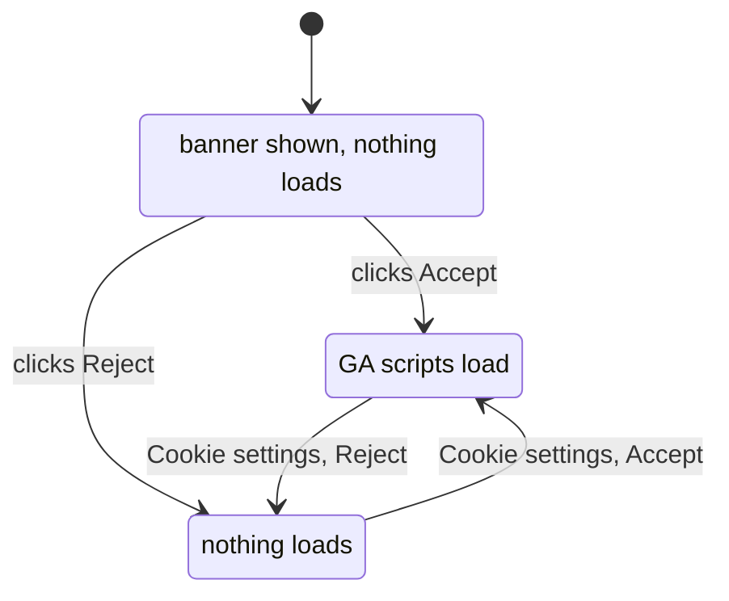

**Do it:** Skip this step if Step 40's cookieless analytics is enough.

```tsx
// src/components/ConsentBanner.tsx
'use client'

import Script from 'next/script'
import { useEffect, useState } from 'react'

type Choice = 'granted' | 'denied'

const STORAGE_KEY = 'analytics-consent-v1'
export const OPEN_CONSENT_EVENT = 'open-consent-settings'

function readChoice(): Choice | null {
  try {
    const value = window.localStorage.getItem(STORAGE_KEY)
    return value === 'granted' || value === 'denied' ? value : null
  } catch {
    return null // storage blocked: treat as "not decided"
  }
}

export function ConsentBanner({ gaId }: { gaId: string }) {
  const [choice, setChoice] = useState<Choice | null>(null)
  const [open, setOpen] = useState(false)

  // localStorage exists only in the browser, so we read it after the first render.
  useEffect(() => {
    const stored = readChoice()
    setChoice(stored)
    setOpen(stored === null)
    const reopen = () => setOpen(true)
    window.addEventListener(OPEN_CONSENT_EVENT, reopen)
    return () => window.removeEventListener(OPEN_CONSENT_EVENT, reopen)
  }, [])

  function decide(next: Choice) {
    try {
      window.localStorage.setItem(STORAGE_KEY, next)
    } catch {
      // ignore: the choice still applies to this page view
    }
    const wasGranted = choice === 'granted'
    setChoice(next)
    setOpen(false)
    // GA is already running on this page. A reload is the simplest way to stop it.
    if (wasGranted && next === 'denied') window.location.reload()
  }

  return (
    <>
      {choice === 'granted' ? (
        <>
          <Script src={`https://www.googletagmanager.com/gtag/js?id=${gaId}`} strategy="afterInteractive" />
          <Script id="ga-init" strategy="afterInteractive">
            {`window.dataLayer=window.dataLayer||[];function gtag(){dataLayer.push(arguments);}gtag('js',new Date());gtag('config','${gaId}');`}
          </Script>
        </>
      ) : null}

      {open ? (
        <div
          role="dialog"
          aria-labelledby="consent-title"
          className="fixed inset-x-4 bottom-4 z-50 mx-auto max-w-xl rounded-lg border border-slate-200 bg-white p-5 shadow-lg"
        >
          <h2 id="consent-title" className="font-semibold">
            Analytics cookies
          </h2>
          <p className="mt-2 text-sm text-slate-600">
            We would like to use Google Analytics cookies to understand how the site is used. You can change
            your choice at any time with "Cookie settings" in the footer.{' '}
            <a href="/privacy" className="underline">
              Privacy policy
            </a>
          </p>
          <div className="mt-4 flex gap-3">
            {/* Equal weight on purpose: rejecting must be as easy as accepting. */}
            <button
              type="button"
              onClick={() => decide('denied')}
              className="rounded-md border border-slate-300 px-4 py-2 text-sm font-medium"
            >
              Reject
            </button>
            <button
              type="button"
              onClick={() => decide('granted')}
              className="rounded-md border border-slate-300 px-4 py-2 text-sm font-medium"
            >
              Accept
            </button>
          </div>
        </div>
      ) : null}
    </>
  )
}
```

```tsx
// src/components/CookieSettingsButton.tsx
'use client'

import { OPEN_CONSENT_EVENT } from './ConsentBanner'

export function CookieSettingsButton() {
  return (
    <button
      type="button"
      onClick={() => window.dispatchEvent(new Event(OPEN_CONSENT_EVENT))}
      className="hover:text-slate-900"
    >
      Cookie settings
    </button>
  )
}
```

Render the banner in the layout only when a GA ID is configured:

```tsx
// src/app/(frontend)/layout.tsx (inside <body>, after <Footer />)
        {process.env.NEXT_PUBLIC_GA_ID ? <ConsentBanner gaId={process.env.NEXT_PUBLIC_GA_ID} /> : null}
```

The footer gets the `CookieSettingsButton` in Step 42.

**Check it works:** Set `NEXT_PUBLIC_GA_ID=G-TEST123` in `.env`, rebuild and start. Open the site in a private
window:

1. The banner appears. In DevTools, **Network** shows no request to `googletagmanager.com`.
2. Click **Reject**. The banner disappears. Reload: no banner, no GA request.
3. Click **Cookie settings** in the footer, then **Accept**: a request to `googletagmanager.com` appears.

**What just happened:** Nothing that needs consent runs until consent is given. The choice lives in
`localStorage`, which is not sent to the server. We gave the choice a version (`-v1`): if you add new
tracking later, bump it to `-v2` so everyone is asked again.

> **Gotcha:** Google has its own **Consent Mode** (v2), which lets Google tags load in a restricted,
> cookieless mode before consent and is required for some Google Ads features in the EU. If marketing needs
> that, use a certified **consent management platform** (CMP) rather than extending this banner. This
> component shows the principle; a CMP handles the legal details, records and Google's requirements.

> **Gotcha:** Rejecting after accepting reloads the page, which stops GA, but the `_ga` cookies GA already set
> stay in the browser until they expire. A thorough implementation also deletes them. Another reason to
> prefer Step 40's cookieless tools.

### [Beginner] Step 42 — Privacy policy and terms pages in the CMS

**What we're doing:** Creating `/privacy` and `/terms` as normal CMS pages, and linking them from the footer.

**Why:** Privacy laws require you to tell people, in plain language, what you do with their data. It must be
easy to find from every page. Keeping it in the CMS lets the business update it without a developer. Terms of
use are not always legally required for a brochure site, but they are common and live in the same place.

**Do it:**

1. In `/admin`, **Pages > Create New**: title `Privacy policy`, slug `privacy`. Write the content using your
   data inventory from Step 39. A typical structure (have it reviewed):

```text
Who we are, and how to contact us about privacy
What we collect: contact messages, server logs, cookieless analytics, error reports
Why we collect it, and the legal basis for each purpose
Who processes it for us: hosting, database, email (Resend), bot protection (Cloudflare), analytics
How long we keep it: contact messages 180 days, logs 30 days, backups until they expire
Your rights: access, correction, deletion, objection, complaint to a supervisory authority
Cookies: only strictly necessary ones for administrators (and analytics only with consent, if used)
Changes to this policy, with the date of the current version ("privacy notice v1, October 2026")
```

2. Create `Terms of use` with slug `terms` the same way.
3. Link both from every page. Replace the footer:

```tsx
// src/components/Footer.tsx
import Link from 'next/link'
import { siteConfig } from '@/utilities/site'
import { Container } from './Container'
import { CookieSettingsButton } from './CookieSettingsButton'

export function Footer() {
  const year = new Date().getFullYear()
  const usesConsent = Boolean(process.env.NEXT_PUBLIC_GA_ID)

  return (
    <footer className="mt-16 border-t border-slate-200 bg-slate-50">
      <Container className="flex flex-col gap-2 py-8 text-sm text-slate-600 sm:flex-row sm:items-center sm:justify-between">
        <p>
          &copy; {year} {siteConfig.name}. Built with Next.js and Payload.
        </p>
        <p className="flex flex-wrap gap-4">
          <Link href="/blog" className="hover:text-slate-900">
            Blog
          </Link>
          <Link href="/contact" className="hover:text-slate-900">
            Contact
          </Link>
          <Link href="/privacy" className="hover:text-slate-900">
            Privacy
          </Link>
          <Link href="/terms" className="hover:text-slate-900">
            Terms
          </Link>
          {usesConsent ? <CookieSettingsButton /> : null}
        </p>
      </Container>
    </footer>
  )
}
```

We removed the **Admin** link from guide 2's footer. Editors know the URL; advertising it to every visitor and
bot only invites login attempts.

**Check it works:** Every page's footer shows Privacy and Terms. `/privacy` renders your text through the same
`[slug]` route as `/about`, and appears in the sitemap. The consent text on `/contact` links to it.

**What just happened:** Legal pages are content, so they live in the content system, with the same SEO,
revalidation and sitemap handling as any page. When you change the privacy policy in a meaningful way, also
change `CONSENT_TEXT`'s version in `contact-state.ts`, so new submissions record which version people saw.

### [Intermediate] Step 43 — Delete old contact messages automatically

**What we're doing:** A scheduled job that deletes contact submissions older than 180 days, every night.

**Why:** GDPR's **storage limitation** principle says: keep personal data no longer than you need it. A
promise in the privacy policy ("we delete messages after 180 days") is only true if something actually
deletes them. And data you no longer have cannot leak.

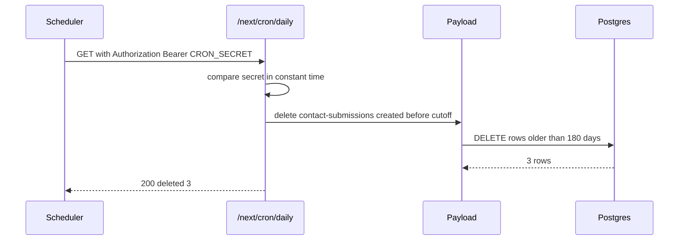

**Do it:** First a helper that checks the secret safely:

```ts
// src/utilities/cron-auth.ts
import 'server-only'
import { timingSafeEqual } from 'node:crypto'

/** True when the request carries "Authorization: Bearer <CRON_SECRET>". */
export function isAuthorizedCron(request: Request): boolean {
  const secret = process.env.CRON_SECRET
  if (!secret) return false
  const given = Buffer.from(request.headers.get('authorization') ?? '')
  const expected = Buffer.from(`Bearer ${secret}`)
  // timingSafeEqual needs equal lengths, and takes the same time whatever the content.
  return given.length === expected.length && timingSafeEqual(given, expected)
}
```

The route. It lives under `/next/`, which `robots.txt` already disallows and which does not clash with
Payload's `/api/`:

```ts
// src/app/(frontend)/next/cron/daily/route.ts
import { isAuthorizedCron } from '@/utilities/cron-auth'
import { getPayloadClient } from '@/utilities/payload'

export const dynamic = 'force-dynamic'

const CONTACT_RETENTION_DAYS = 180

export async function GET(request: Request): Promise<Response> {
  if (!isAuthorizedCron(request)) return new Response('Unauthorized', { status: 401 })

  const payload = await getPayloadClient()
  const cutoff = new Date(Date.now() - CONTACT_RETENTION_DAYS * 24 * 60 * 60 * 1000).toISOString()

  const result = await payload.delete({
    collection: 'contact-submissions',
    where: { createdAt: { less_than: cutoff } },
  })

  payload.logger.info(
    { deleted: result.docs.length, failed: result.errors.length, cutoff },
    'Contact retention cleanup finished',
  )
  return Response.json({ deleted: result.docs.length, failed: result.errors.length })
}
```

Generate a secret and add it everywhere the app runs:

```bash
openssl rand -hex 32
```

```bash
# .env.example (add)
# Protects /next/cron/* routes. Random 32+ characters. Secret.
CRON_SECRET=
```

Now schedule it. **Path A (Vercel Cron).** Create `vercel.json` in the project root:

```json
{
  "crons": [{ "path": "/next/cron/daily", "schedule": "0 3 * * *" }]
}
```

`0 3 * * *` is **cron syntax**: minute 0, hour 3, every day, every month, every weekday, in UTC. When a
`CRON_SECRET` environment variable exists in the project, Vercel sends it as `Authorization: Bearer ...` with
each cron request. Add `CRON_SECRET` for Production in Vercel.

**Path B (AWS), or as a host-independent option: GitHub Actions on a schedule.**

```yaml
# .github/workflows/daily-jobs.yml
name: daily-jobs

on:
  schedule:
    - cron: '0 3 * * *'
  workflow_dispatch: {} # lets you run it by hand from the Actions tab

jobs:
  daily:
    runs-on: ubuntu-latest
    steps:
      - name: Run daily jobs on production
        run: |
          curl --fail --silent --show-error \
            -H "Authorization: Bearer ${{ secrets.CRON_SECRET }}" \
            https://www.my-site.com/next/cron/daily
```

Add `CRON_SECRET` as a repository secret (**Settings > Secrets and variables > Actions**) with the same value as
in production. On AWS you could also use **EventBridge Scheduler**; the GitHub version needs no extra AWS
resources.

**Check it works:** Locally, with `CRON_SECRET=local-test` in `.env`:

```bash
curl -s http://localhost:3000/next/cron/daily
curl -s -H "Authorization: Bearer local-test" http://localhost:3000/next/cron/daily
```

```text
Unauthorized
{"deleted":0,"failed":0}
```

To see a deletion, temporarily change `CONTACT_RETENTION_DAYS` to `0`, call it again, and the count matches
your test submissions. Change it back. In production, Vercel's **Cron Jobs** settings page (or the Actions tab)
shows each run.

**What just happened:** You turned a policy into a schedule. `payload.delete` with a `where` deletes every
matching document and reports successes and failures separately. Comparing secrets with `timingSafeEqual`
avoids leaking, through response timing, how many characters of a guess were right.

> **Gotcha:** Vercel's free (Hobby) plan limits how often cron jobs may run (at most once a day at the time of
> writing) and may run them at any point within the scheduled hour. Daily cleanup fits. If you need hourly
> jobs, use a paid plan or the GitHub Actions version (whose schedules can also be delayed by several minutes
> at busy times).

> **Gotcha:** Deleted rows still exist in **backups** until those backups expire. Mention this in the privacy
> policy ("removed from backups within N days"). With Neon or RDS, the backup window from guide 3 decides N.

> **Why not Payload's jobs queue?** Payload 3 has a built-in jobs queue with scheduled tasks (`jobs.tasks` with
> a `schedule` cron). It is great for many background tasks, retries and history in the admin. But on
> serverless hosting something must still wake the app up to run the queue, which is again a cron calling an
> endpoint. For one nightly task, a plain route is easier to understand.

## 9. After launch

The site is launched. These last steps keep it fast, healthy and easy to work with for the people who edit it.

### [Intermediate] Step 44 — Caching and CDN basics: what is cached where

**What we're doing:** Understanding each cache between the visitor and Postgres, and checking them with
`curl`.

**Why:** "I published but I still see the old page" is the most common support question for CMS sites. Knowing
the layers lets you answer it in a minute instead of an afternoon.

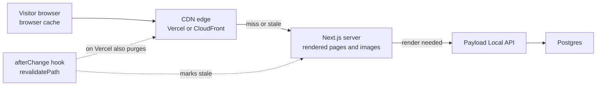

| What | Cached where | For how long | How it is refreshed |
|---|---|---|---|
| `/_next/static/...` (JS, CSS, fonts) | Browser and CDN | One year (`immutable`) | Never needed: file names contain a content hash |
| Static pages (`/`, `/about`, `/blog/post`) | CDN and Next.js cache | Until revalidated | Our `afterChange` hooks; the hourly sitemap fallback |
| `/blog?page=2` (reads `searchParams`) | Not cached | - | Rendered per request |
| Optimised images (`/_next/image?...`) | CDN and Next.js image cache | `images.minimumCacheTTL` or the source's `Cache-Control` | Expire on their own; a new upload gets a new URL |
| Media files (`/api/media/file/...`) | Depends on the storage adapter | - | Usually only fetched by the image optimiser on a miss |
| Share images (`opengraph-image`) | CDN, and each social platform | Until revalidated; platforms cache for days | Our hook (Step 28); platform tools (Step 30) |

**Do it:** Look at the headers on production:

```bash
# Run it twice: the first request may warm the cache.
curl -sI https://www.my-site.com/blog/welcome-to-our-new-website | grep -iE '^(cache-control|x-vercel-cache|age):'
```

**Check it works:** On Vercel, the second request shows:

```text
cache-control: public, max-age=0, must-revalidate
x-vercel-cache: HIT
age: 1520
```

`HIT` means the CDN answered without touching your server. `max-age=0, must-revalidate` is what Vercel tells
the **browser**: always ask again (cheaply), so a revalidated page appears on the next reload. On a self-hosted
Next.js server (Path B), you see instead something like `cache-control: s-maxage=31536000` for static pages:
`s-maxage` is a lifetime for **shared** caches such as a CDN, not for the browser.

**What just happened:** You saw that "cached" means different things at different layers. On Vercel,
`revalidatePath` also clears the CDN, so the hooks from guide 2 are all you need. On Path B, the ALB has no
cache, so Next.js's own cache is the only layer and revalidation just works. If you later put CloudFront in
front of the ECS service, CloudFront follows `s-maxage` and will **not** hear about `revalidatePath`; you then
need shorter `s-maxage` values or a CloudFront invalidation after publishing.

> **Gotcha:** "I published and still see the old page": check in this order. 1) Is the post actually
> **Published** (not Draft, and Step 46's publish date not in the future)? 2) Did the server log
> "Revalidated /blog/..."? 3) Does `curl -sI` show `x-vercel-cache: STALE` or `HIT` with a large `age`?
> 4) Is it your browser? Try a private window.

> **Outdated:** Next.js 16 introduced **Cache Components** (`'use cache'`, `cacheLife`, `cacheTag`) as a new,
> opt-in caching model. Our path-based `revalidatePath` approach keeps working without it. When you are ready,
> read the Next.js caching docs and consider tag-based invalidation for pages that list many documents.

### [Beginner] Step 45 — Watch for broken links and 404s

**What we're doing:** Finding broken links before visitors and Google do: from the logs, from Search Console,
and with a weekly link checker.

**Why:** Links break over time. A post links to a deleted page, an editor makes a typo in a URL, another site
links to a page you renamed before you had redirects. Each 404 is a visitor lost and a small trust signal lost.

**Do it:** **1. Read the 404 log lines.** Step 12's `redirectOrNotFound` already logs `Page not found` with the
path. On Vercel, open **Logs** and search for `Page not found`. On AWS, in CloudWatch Logs Insights:

```text
filter msg = "Page not found"
| stats count(*) as hits by path
| sort hits desc
| limit 20
```

Paths with many hits deserve a redirect (create one in **Settings > Redirects**). Paths like `/wp-login.php` are
bots probing for WordPress; ignore them.

**2. Search Console.** The Pages report's **Not found (404)** reason (Step 22) lists URLs Google tried. Check it
monthly.

**3. A weekly link checker in CI.** `linkinator` crawls your site and reports every broken link it finds:

```yaml
# .github/workflows/link-check.yml
name: link-check

on:
  schedule:
    - cron: '0 6 * * 1' # Mondays 06:00 UTC
  workflow_dispatch: {}

jobs:
  links:
    runs-on: ubuntu-latest
    steps:
      - uses: actions/setup-node@v4
        with:
          node-version: 22
      - name: Check every link on the live site
        run: npx linkinator https://www.my-site.com --recurse --skip "^(?!https://www\.my-site\.com)"
```

`--recurse` follows links within the site. `--skip` with that pattern skips every URL that is not on our
domain, so a slow external site cannot fail the job. The job fails when it finds a broken internal link, and
GitHub emails you.

**Check it works:** Run it locally first:

```bash
npx linkinator https://www.my-site.com --recurse --skip "^(?!https://www\.my-site\.com)"
```

```text
Scanning https://www.my-site.com
...
✓ Successfully scanned 42 links in 6.1 seconds.
```

Then in `/admin`, add a link to `/does-not-exist` in a post, publish, and run it again: it reports `[404]
https://www.my-site.com/does-not-exist` and exits with an error. Remove the link.

**What just happened:** You now have three nets: logs (what real visitors hit), Search Console (what Google
hit), and the link checker (what your own pages link to). Together they catch nearly every broken link.

### [Intermediate] Step 46 — The editor workflow: drafts, review and scheduled publishing

**What we're doing:** Giving editors a predictable way to work, and letting them schedule a post for a future
date.

**Why:** Technical quality is wasted if editors publish half-finished posts or forget the SEO fields. A light
process, plus "publish on Monday at 9" support, is what content teams ask for first.

**Do it:** **1. A written workflow.** Add a short guide for editors, for example as a Page with `noIndex`
ticked, or in `docs/editor-guide.md`:

```text
1. Create the post. Leave Status on Draft.
2. Write. Headings start at H2. Link to at least one related post or page.
3. Images: rename the file before uploading; write a real alt text.
4. SEO section: check the Meta Title (under 60 characters) and write a Meta Description.
5. Click Live Preview and read it on the real site.
6. Ask a colleague to review the preview link.
7. Set Published At (now, or a future date and time) and change Status to Published.
8. Never change the slug of a published post unless you must (a redirect is created automatically).
```

**2. Scheduled publishing.** We let `publishedAt` be in the future and hide posts until that moment. In
`src/utilities/queries.ts`, turn the `publishedOnly` constant into a function, so "now" is fresh on every
query:

```ts
// src/utilities/queries.ts (replace the publishedOnly constant)
/** Published, and the publish date has arrived. A function, so "now" is evaluated per query. */
function publishedOnly(): Where {
  return {
    and: [{ status: { equals: 'published' } }, { publishedAt: { less_than_equal: new Date().toISOString() } }],
  }
}
```

Then change every use from `publishedOnly` to `publishedOnly()` in that file (in `getPublishedPosts`,
`getPostBySlug`, `getAllPublishedPosts` and `getRelatedPosts`). Do the same in the REST access rule, so the
public API agrees with the website:

```ts
// src/collections/Posts.ts (replace publishedOrLoggedIn)
const publishedOrLoggedIn: Access = ({ req: { user } }) => {
  if (user) return true
  return {
    and: [{ status: { equals: 'published' } }, { publishedAt: { less_than_equal: new Date().toISOString() } }],
  }
}
```

A static site does not notice that the clock passed 9:00. Something must revalidate when a post becomes due.
Extend Step 43's daily route: after the cleanup, revalidate the lists and every post that became due in the
last 25 hours (a small overlap, so a late run never misses one):

```ts
// src/app/(frontend)/next/cron/daily/route.ts (add the import, and this block before "return")
import { safeRevalidate } from '@/utilities/revalidate'

  const since = new Date(Date.now() - 25 * 60 * 60 * 1000).toISOString()
  const due = await payload.find({
    collection: 'posts',
    where: {
      and: [
        { status: { equals: 'published' } },
        { publishedAt: { greater_than: since } },
        { publishedAt: { less_than_equal: new Date().toISOString() } },
      ],
    },
    pagination: false,
    depth: 0,
    select: { slug: true },
  })
  if (due.docs.length > 0) {
    const postPaths = due.docs.flatMap((post) => (post.slug ? [`/blog/${post.slug}`] : []))
    safeRevalidate(['/', '/blog', '/sitemap.xml', ...postPaths], (message) => payload.logger.info(message))
  }
```

With a daily cron, a post scheduled for 9:00 appears at the next run. For hour-level precision, run the same
route hourly (GitHub Actions `cron: '5 * * * *'`, or a paid Vercel plan).

**Check it works:** Create a post, set **Published At** to two minutes from now and **Status** to Published.
Open `/blog` in a private window: the post is not listed, and its URL returns 404. Wait until the time passes,
then call the cron route by hand:

```bash
curl -s -H "Authorization: Bearer local-test" http://localhost:3000/next/cron/daily
```

The terminal logs `Revalidated /blog` and the post's path, and the post now appears.

**What just happened:** "Published" now means "published, and its time has come". The page, the list, the
sitemap and the REST API all use the same rule. Live preview from guide 2 still shows scheduled posts to
editors, because it calls `getPostBySlug(slug, true)`, which skips the filter.

> **Why:** Payload's built-in **versions and drafts** (`versions: { drafts: { schedulePublish: true } }`) offer
> scheduled publishing, version history and autosave out of the box, using the jobs queue. Guide 1 chose a
> plain `status` field to keep things visible. If your editors need history or autosave, migrating to built-in
> drafts is a worthwhile project; plan the data migration from `status` to Payload's `_status`.

### [Advanced] Step 47 — Optional: going multi-language

**What we're doing:** An overview of what it takes to serve the site in several languages. Read it before
deciding; it is a project of its own.

**Why:** Adding languages late is expensive: every URL, query, sitemap entry and metadata function changes.
Knowing the shape helps you decide early, and answer the interview question.

**Do it:** The four pieces:

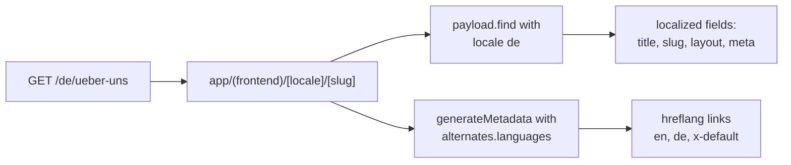

**1. Payload localization.** In `payload.config.ts`:

```ts
// src/payload.config.ts (inside buildConfig, sketch)
  localization: {
    locales: [
      { label: 'English', code: 'en' },
      { label: 'Deutsch', code: 'de' },
    ],
    defaultLocale: 'en',
    fallback: true, // show English when a German translation is missing
  },
```

Then mark translatable fields with `localized: true` (title, slug, layout, content, excerpt, and the SEO
fields). Payload stores localized values in separate locale tables, so this needs a careful migration of
existing content. Queries pass `locale: 'de'` to `payload.find`.

**2. Next.js routing.** Move the frontend routes under a `[locale]` segment (`app/(frontend)/[locale]/...`), set
`<html lang={locale}>`, and use `proxy.ts` to send `/` to the visitor's preferred language using the
`Accept-Language` header. Libraries such as `next-intl` handle routing and UI strings (button labels, dates).

**3. SEO for languages.** Each page tells Google about its translations with `hreflang`:

```ts
// in generateMetadata for /en/about (sketch)
  alternates: {
    canonical: '/en/about',
    languages: { en: '/en/about', de: '/de/ueber-uns', 'x-default': '/en/about' },
  },
```

The sitemap can list the same alternates per URL (`MetadataRoute.Sitemap` entries accept
`alternates.languages`).

**4. Content work.** Every page needs a real translation, and someone to keep translations in sync.

**Check it works:** There is nothing to run in this overview. Check your understanding: you should be able to
explain why each language version needs its own canonical (each is its own page) and why `hreflang` links must
be **reciprocal** (the English page lists the German one and the German page lists the English one).

**What just happened:** You saw that i18n touches the data model, routing, metadata and content process at
once. That is why teams decide on it before launch, or treat it as a planned migration later.

### [Beginner] Step 48 — A monthly maintenance checklist

**What we're doing:** Writing the short routine that keeps a launched site healthy.

**Why:** Sites rarely break in one big event. They decay: a dependency falls behind, a DNS record expires, the
contact email goes to someone who left. Thirty minutes a month prevents most of it.

**Do it:** Add this to `docs/maintenance.md` and put a recurring monthly event in a calendar:

| Area | Check | Where |
|---|---|---|
| Search | Pages report: any new Server error, Soft 404 or canonical problems? | Search Console (Step 22) |
| Search | Top queries with low CTR: rewrite one title and description | Search Console Performance (Step 23) |
| Speed | p75 LCP, INP, CLS still good on mobile? | Speed Insights or logs (Step 24) |
| Errors | New or rising Sentry issues | Sentry (guide 3) |
| Uptime | Any incidents? Alerts still reach a person? | Uptime monitor (guide 3) |
| Links | Link-check workflow green? Top 404 paths redirected? | Actions tab, logs (Step 45) |
| Email | Send a test through `/contact`; still in the inbox? DMARC reports clean? | Your phone (Step 38) |
| Privacy | Cleanup cron ran every day? No submissions older than 180 days? | Cron logs (Step 43) |
| Security | Dependabot pull requests reviewed and merged; Payload and Next.js patch releases applied | GitHub (guide 3) |
| Backups | Quarterly: restore test still works | Guide 3, Step 40 |
| Domain | Domain and DNS renewal dates more than 60 days away; auto-renew on | Registrar |
| Access | Remove admin users and API keys of people who left | `/admin`, Resend, Vercel, AWS |

**Check it works:** The first time, go through the whole list and write the date and any findings at the
bottom of `docs/maintenance.md`. Next month, compare.

**What just happened:** You closed the loop. Launch is not the end of the project; it is the start of running
it. This checklist is what separates a site that is still fast and trustworthy in two years from one that
quietly fell apart.

## 10. Interview questions

#### Q: How do you handle SEO metadata in a Next.js App Router site backed by a CMS?

The root layout sets `metadataBase`, a title template and site-wide defaults. Each dynamic route exports
`generateMetadata`, which loads the document (deduplicated with React's `cache()` so the page and the metadata
share one query) and builds the `Metadata` object. Editors control a `meta` group from Payload's SEO plugin
(title, description, image, plus a `noIndex` checkbox I added through the plugin's `fields` option). A pure
`resolveSeo` function applies fallbacks (meta title, else the document title; meta description, else the
excerpt or the first 155 characters of the body), and it is unit tested. One gotcha: Next.js merges metadata
shallowly, so a page that sets `openGraph` must repeat `siteName` and `locale` from the layout.

#### Q: What is a canonical URL, and where can it go wrong?

It is a `<link rel="canonical">` telling search engines which URL is the main one for a piece of content, so
duplicates (tracking parameters, trailing slashes, `www` versus apex) consolidate their signals. I set
`alternates.canonical` on every route, keep one host via a redirect, and keep Next.js's default no-trailing-slash
behaviour so links, canonicals and the sitemap agree. The classic mistake, which we actually had, is pointing
every page of a paginated list at page 1. That tells Google pages 2 and up are duplicates, and the older posts
they link to may never be crawled. Each paginated page should be canonical to itself.

#### Q: How do you handle a changed slug without losing traffic?

With a 301-style permanent redirect from the old path to the new one. In this project, Payload's redirects plugin
stores redirects in a collection, and an `afterChange` hook creates one automatically when a published
document's slug changes. The redirect references the document rather than its slug, so later slug changes
never create chains. The frontend looks redirects up only when the normal lookup fails, then calls
`permanentRedirect()` (308) or `redirect()` (307), so pages that exist pay no extra query. Structural, code-level
redirects go in `next.config` `redirects()`. I would not redirect deleted content to the home page, because
Google treats that as a soft 404.

#### Q: Explain the Core Web Vitals and one fix for each.

LCP measures when the largest element renders; good is 2.5 seconds or less at the 75th percentile. Fixes:
never lazy-load the LCP image, give it `fetchPriority="high"` and correct `sizes`, and serve HTML statically
from a CDN for a fast first byte. INP measures the delay from an interaction to the next paint; good is 200 ms
or less. Fixes: keep client components small and load third-party scripts with `next/script`, often
`lazyOnload`. CLS measures unexpected layout movement; good is 0.1 or less. Fixes: dimensions on every image,
aspect-ratio boxes for embeds, reserved height for widgets, and overlays that do not push content. Lighthouse
is lab data; Google ranks on field data, so I measure with Speed Insights or `useReportWebVitals`.

#### Q: How would you protect a public contact form from spam and abuse?

In layers, cheapest first: a honeypot field, server-side Zod validation, a CAPTCHA token verified
server-to-server (Cloudflare Turnstile's siteverify, with the action checked), and a per-IP rate limit stored
somewhere shared by all instances (we count rows by a keyed IP hash in Postgres; at scale I would use Redis or
the platform's WAF). Then I close other doors: the collection's public REST `create` is disabled so bots cannot
skip the form. Emails escape user input, strip line breaks from header values, and the auto-reply never echoes
the visitor's message, so the form cannot be used to send spam from our domain.

#### Q: What are SPF, DKIM and DMARC?

They are DNS records that let receiving mail servers verify email claiming to be from your domain. SPF lists
which servers may send for a domain. DKIM publishes a public key, and each email carries a signature made with
the private key. DMARC tells receivers what to do when an email's visible From domain does not pass SPF or DKIM
in alignment with it (none, quarantine or reject) and where to send reports. I send from a subdomain like
`mail.my-site.com` so transactional mail has its own reputation, start DMARC at `p=none`, read the reports, and
tighten the policy once they are clean.

#### Q: Do you need a cookie banner? How did you approach privacy?

It depends on what you set. Strictly necessary cookies, like the admin's login cookie, do not need consent.
Analytics or advertising cookies generally need prior, opt-in consent in the EU and UK, with rejecting as easy
as accepting. So the first choice is architectural: cookieless analytics (Vercel Web Analytics, Plausible or
Umami) usually avoid the banner entirely. If GA4 is required, nothing loads before consent, the choice can be
changed later, and for Google Ads requirements a certified consent platform is the right tool. Beyond cookies,
I keep a data inventory, collect the minimum (an IP hash instead of the IP), store the consent text and time
with each submission, and delete contact messages after 180 days with a scheduled job. I would always have a
lawyer review the policy; engineers build the switches, not the legal judgement.

#### Q: An editor says "I published, but the site still shows the old version". How do you debug it?

I walk the cache layers from the source outward. First the data: is the document really published, and is its
publish date in the past? Then the trigger: did the `afterChange` hook log that it revalidated the path? Then
the server and CDN: `curl -sI` shows `x-vercel-cache` and `age`, telling me whether the CDN served a stale
copy. Then the browser: a private window rules out local caching. Typical root causes are a path missing from
the revalidation list (for example a new listing page), a CDN like CloudFront in front of a self-hosted server
that does not hear about `revalidatePath`, or social platforms caching an old preview, which need their own
refresh tools.

## Cheatsheet

**The launch checklist**

| Area | Done when | Step |
|---|---|---|
| SEO fields | Pages and Posts have a `meta` group with title, description, image, noIndex | 4 |
| Metadata | Every route uses `resolveSeo` and `buildMetadata`; paginated pages self-canonical | 5, 6 |
| One URL per page | Apex redirects to `www`; no trailing slash; canonical on every page | 7 |
| Headings | One `h1` per page; editors cannot add another | 7 |
| Images | Real alt text enforced; meaningful file names | 8 |
| Internal links | Related posts on every post; descriptive link text | 9 |
| Redirects | Slug changes create redirects; misses check redirects before 404 | 10 to 12 |
| Previews hidden | `ALLOW_INDEXING=true` only in production; noindex header and meta elsewhere | 13 |
| Sitemap | No drafts, no noindex pages, real `lastModified` | 14 |
| Structured data | Organization and WebSite on home; BlogPosting and BreadcrumbList on posts; Rich Results Test passes | 15 to 18 |
| Search Console | Domain verified by DNS TXT; sitemap submitted; Bing imported | 19, 20 |
| Indexing | Pages report reviewed; only expected reasons left | 22 |
| Speed | Field data collected; p75 LCP under 2.5 s, INP under 200 ms, CLS under 0.1 | 24 to 27 |
| Social | Per-post OG image; X card tags; previews tested on LinkedIn, Facebook, WhatsApp | 28 to 30 |
| Contact form | REST create closed; Turnstile; rate limit; consent stored; email delivered to inbox | 31 to 38 |
| Email DNS | SPF and DKIM via Resend on `mail.` subdomain; DMARC `p=none`, then tighten | 32 |
| Privacy | Data inventory; cookieless analytics or consent banner; privacy and terms pages | 39 to 42 |
| Retention | Nightly job deletes contact messages older than 180 days | 43 |
| Operations | Cache layers understood; 404s and broken links monitored; monthly checklist | 44 to 48 |

**New environment variables**

| Variable | Secret? | Where | Purpose |
|---|---|---|---|
| `ALLOW_INDEXING` | No | Production only: `true` | Allows search engines to index |
| `RESEND_API_KEY` | Yes | Production (and Preview if wanted) | Sending email |
| `EMAIL_FROM` | No | All | `My Site <hello@mail.my-site.com>` |
| `CONTACT_TO_EMAIL` | No | All | Who receives contact notifications |
| `CONTACT_AUTO_REPLY` | No | All | `true` to confirm receipt to the visitor |
| `NEXT_PUBLIC_TURNSTILE_SITE_KEY` | No | All; test key outside production | Turnstile widget |
| `TURNSTILE_SECRET_KEY` | Yes | All; test key outside production | Turnstile verification |
| `IP_HASH_SECRET` | Yes | All | Keyed hash of IPs for rate limiting |
| `CRON_SECRET` | Yes | Production, and GitHub Actions secret | Protects `/next/cron/*` |
| `NEXT_PUBLIC_UMAMI_WEBSITE_ID` or `NEXT_PUBLIC_GA_ID` | No | Production only | Analytics |

**Files added or changed in this guide**

```text
my-site/
  vercel.json                               # Path A: nightly cron
  next.config.mjs                           # redirects(), noindex headers()
  docs/
    data-inventory.md
    editor-guide.md
    maintenance.md
  .github/workflows/
    daily-jobs.yml                          # Path B: nightly cron
    link-check.yml                          # weekly broken-link check
  public/logo.png                           # for Organization JSON-LD
  src/
    payload.config.ts                       # seoPlugin, redirectsPlugin, heading levels
    collections/ContactSubmissions.ts       # closed create, consent, ipHash
    collections/Media.ts                    # alt text validation
    collections/Pages.ts, Posts.ts          # redirect hook; scheduled publish access
    hooks/createRedirectOnSlugChange.ts
    hooks/revalidateRedirect.ts
    emails/ContactNotification.tsx
    emails/ContactAutoReply.tsx
    components/JsonLd.tsx
    components/Turnstile.tsx
    components/WebVitals.tsx                # Path B
    components/PrivacyAnalytics.tsx
    components/ConsentBanner.tsx            # only if using GA
    components/CookieSettingsButton.tsx     # only if using GA
    components/VideoEmbed.tsx
    components/Footer.tsx                   # privacy and terms links
    utilities/seo.ts
    utilities/json-ld.ts
    utilities/redirect-target.ts
    utilities/redirect-or-not-found.ts
    utilities/indexing.ts
    utilities/turnstile.ts
    utilities/client-ip.ts
    utilities/rate-limit.ts
    utilities/email.ts
    utilities/cron-auth.ts
    app/robots.ts, app/sitemap.ts
    app/(frontend)/blog/[slug]/opengraph-image.tsx
    app/(frontend)/next/cron/daily/route.ts
    app/(frontend)/next/vitals/route.ts     # Path B
  tests/unit/
    seo.test.ts
    json-ld.test.ts
    redirect-target.test.ts
```

**Useful commands**

```bash
# What robots see
curl -s https://www.my-site.com/blog/x | grep -oE '<(title|meta|link)[^>]*>'
curl -sI https://www.my-site.com/ | grep -iE 'x-robots-tag|cache-control|x-vercel-cache'
curl -sI https://my-site.com/about | grep -iE '^(HTTP|location)'

# DNS records for Search Console and email
dig +short TXT my-site.com
dig +short TXT _dmarc.my-site.com
dig +short TXT resend._domainkey.mail.my-site.com

# Jobs and checks
curl -s -H "Authorization: Bearer $CRON_SECRET" https://www.my-site.com/next/cron/daily
npx linkinator https://www.my-site.com --recurse --skip "^(?!https://www\.my-site\.com)"

# After changing collections or plugins
npm run migrate:create -- <name> && npm run migrate
npm run generate:types && npm run generate:importmap
```

**Metadata snippets**

| Need | Code |
|---|---|
| Canonical | `alternates: { canonical: '/blog/x' }` |
| Hide one page | `robots: { index: false, follow: true }` |
| Search Console meta tag | `verification: { google: '...' }` |
| Article Open Graph | `openGraph: { type: 'article', publishedTime, modifiedTime, siteName, ... }` |
| X card | `twitter: { card: 'summary_large_image', site: '@mysite' }` |
| Languages | `alternates: { languages: { en: '/en/x', de: '/de/x', 'x-default': '/en/x' } }` |
| Per-route share image | `opengraph-image.tsx` exporting `size`, `contentType`, `alt` and a default function returning `new ImageResponse(...)` |
| JSON-LD | `<script type="application/ld+json" dangerouslySetInnerHTML={{ __html: JSON.stringify(data).replace(/</g, '\\u003c') }} />` |
| Permanent redirect | `permanentRedirect('/new')` (308) or `next.config` `redirects()` with `permanent: true` |
