> **Version note (October 2026):** This guide targets Next.js 16, React 19 and Payload 3.x running inside the Next.js App Router. Payload added Next.js 16 support during the 3.x line, so use a recent 3.x release (check the Payload release notes if `npm install` complains about a peer dependency on `next`). Tailwind is v4, Zod is v4. Exact import paths, especially for Payload's React rich text component, have moved between minor versions before. If an import in this guide is rejected, search the official Payload docs for the name of the thing (for example "RichText React component") and use the path they show for your installed version. The ideas do not change, only the spelling.

This is guide 2 of 3. In guide 1 you set up the project and the content model. In this guide you build everything a visitor sees. In guide 3 you put it on the internet with automatic deploys.

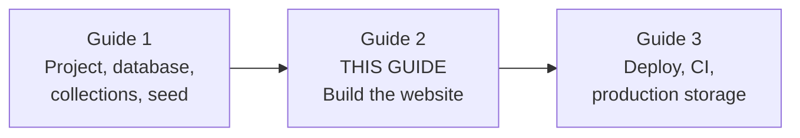

## 1. Concepts first

Before writing any page, you need three ideas in your head. Every file you write later uses them. Take your time here. Reading this part slowly saves hours of confusion later.

### [Beginner] Step 1 — Recap what you already have

**What we're doing:** Reminding ourselves what guide 1 built, so we know which pieces we can use.

**Why:** This guide reads data from collections that already exist. If you know their field names, the code in this guide will make sense instead of looking like magic.

**Do it:** Open the `my-site` folder in your editor. You should have this (only the important files are shown):

```text
my-site/
  docker-compose.yml          # Postgres 16, service "db", database my_site
  .env                        # DATABASE_URI, PAYLOAD_SECRET, NEXT_PUBLIC_SERVER_URL (git-ignored)
  .env.example                # the same keys without real secrets (committed)
  next.config.mjs             # wraps the Next.js config with withPayload
  package.json
  tsconfig.json
  src/
    payload.config.ts         # the Payload configuration
    payload-types.ts          # TypeScript types generated from your collections
    seed.ts                   # the seed script behind "npm run seed" (payload run src/seed.ts)
    access/                   # anyone.ts, authenticated.ts
    fields/slug.ts            # shared slug field with a formatting hook
    utilities/slugify.ts      # turns "Hello, World!" into "hello-world"
    collections/
      Users.ts                # admin users who can log in to /admin
      Media.ts                # images: required "alt", sizes thumbnail, card, hero
      Pages.ts                # title, slug, layout (rich text)
      Posts.ts                # title, slug, excerpt, coverImage, publishedAt, status, content (rich text)
      ContactSubmissions.ts   # name, email, message; public create, admin-only read
    migrations/               # database migration files
    app/
      (frontend)/             # the public website (we build this now)
        layout.tsx
        page.tsx
      (payload)/              # the admin panel and the REST/GraphQL API
        admin/
        api/
```

A quick reminder of the words:

- A **collection** is a group of documents of the same kind, like a database table. Payload turns each collection into a Postgres table, an admin screen and an API.
- A **slug** is the URL-friendly name of a page, for example `about` in `/about`.
- Every Post has a **`status`** select field with the value `draft` or `published`. Visitors must only ever see `published` posts. When a post is published without a date, a hook in guide 1 fills in `publishedAt`.
- A Page's body is the rich text field **`layout`** (named that way so it can become a page builder later). A Post's body is the rich text field **`content`**.
- The **seed** (`npm run seed`, which runs `payload run src/seed.ts`) filled your database with: the Page with slug `home`, and two published Posts, `welcome-to-our-new-website` and `five-tips-for-choosing-the-right-service`. The seed adds no images.

> **Gotcha:** Your generated `src/payload-types.ts` is the source of truth for field names. If anything in this guide's code does not match it, trust the types file. Open it and look at the `Page`, `Post` and `Media` interfaces.

**Check it works:** Start the database and the app, then log in to the admin:

```bash
docker compose up -d
npm run dev
```

```text
 ✓ Starting...
 ✓ Ready in 3.1s
 - Local:        http://localhost:3000
```

Open `http://localhost:3000/admin`, log in, and click **Posts**. You should see the two seeded posts, both with status Published.

Now add three things by hand in the admin, so this guide has something to show for every case. The seed does not create them on purpose; making them yourself is good practice with the admin:

1. **An About page.** Pages, Create New, title `About`, leave the slug empty (the slug hook fills in `about`), write a sentence or two in Layout, Save.
2. **A draft post.** Posts, Create New, title `Draft idea`, write some content, leave status as **Draft**, Save. We use it to prove drafts never leak.
3. **A cover image.** Media, Create New, upload any photo, fill in Alt, Save. Then open the post `welcome-to-our-new-website`, pick that image as **Cover Image**, Save.

The end-to-end tests in Part 8 only rely on what the seed creates, so they still pass on a fresh database without these three.

**What just happened:** `docker compose up -d` started Postgres in the background (`-d` means "detached", it does not block your terminal). `npm run dev` started Next.js in development mode. Payload lives inside the same Next.js app, which is why the admin is just another route.

### [Beginner] Concept — What is a server component, and what is a client component?

In the Next.js App Router, every React component is a **server component** unless you say otherwise.

- A **server component** runs only on the server. It can be `async`. It can talk to the database directly. Its code is never sent to the browser. It cannot use `useState`, `useEffect`, or event handlers like `onClick`, because those only make sense in a browser.
- A **client component** starts with the line `'use client'` at the top of the file. It is rendered to HTML on the server first, and then its JavaScript is also sent to the browser so it can become interactive. This "wake up in the browser" process is called **hydration**. Client components can use state, effects and event handlers. They cannot read the database directly.

The rule of thumb: fetch data in server components, and push `'use client'` down to the smallest piece that needs interactivity. In our site almost everything is a server component. Only three small things are client components: the active nav link, the contact form, and the error boundary.

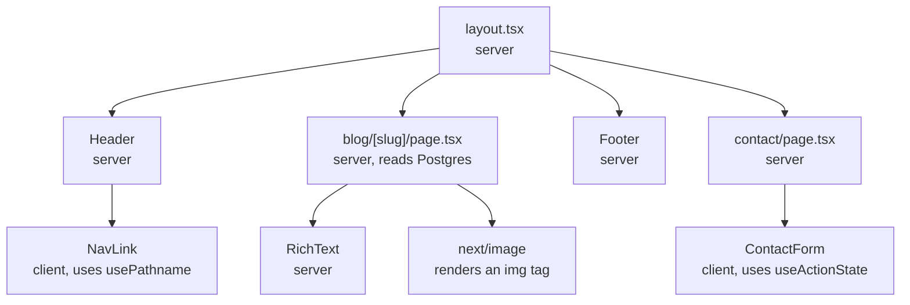

> **Why:** Less JavaScript in the browser means faster pages, and database secrets never leave the server. A server component can pass data to a client component as props, but the props must be serializable (plain objects, strings, numbers, arrays), not functions or class instances.

> **Interview tip:** "Server component" does not mean "server-side rendering". Client components are also rendered to HTML on the server. The difference is whether the component's JavaScript is shipped to the browser.

### [Beginner] Concept — How a request travels from a URL to HTML

When someone opens `http://localhost:3000/blog/welcome-to-our-new-website`, this is what happens:

1. The browser sends an HTTP GET request to the Next.js server.
2. Next.js matches the URL against the folders in `src/app`. Route groups in parentheses, like `(frontend)`, do not appear in the URL. `blog/[slug]` matches, with `slug = "welcome-to-our-new-website"`.
3. If a ready-made (cached) HTML version exists and is still fresh, Next.js sends it immediately.
4. Otherwise Next.js runs the layout and the page server components. The page calls the Payload **Local API**, which runs a SQL query against Postgres through Payload's database adapter (Drizzle ORM under the hood; an **ORM** is a library that turns code calls into SQL).
5. React renders the components into HTML plus a compact description of the component tree (called the RSC payload).
6. The browser shows the HTML immediately, then downloads the small JavaScript bundle for client components and hydrates them.

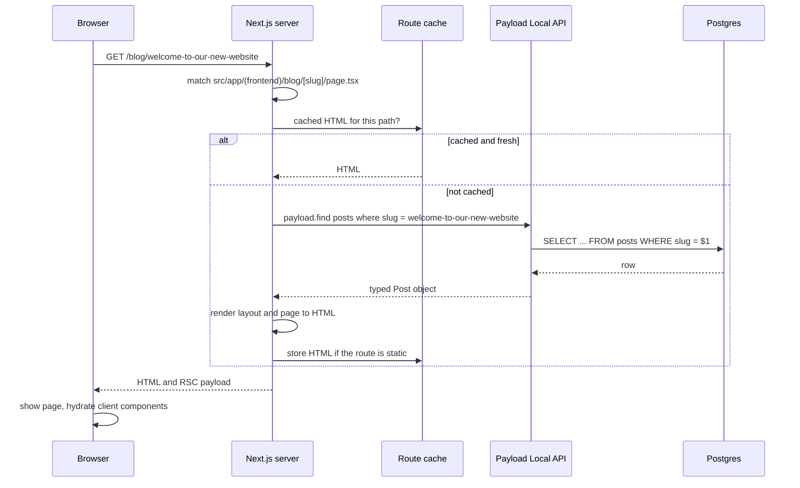

### [Beginner] Concept — Static rendering, dynamic rendering and revalidation

Next.js renders each route in one of two ways:

- **Static rendering:** the HTML is built once (at `npm run build`, or the first time it is requested) and then reused for every visitor. Very fast and cheap. The risk is **stale content**: the page keeps showing old data after an editor changes something.
- **Dynamic rendering:** the HTML is built fresh on every request. Always up to date, but slower, and every visit hits the database.

Next.js decides automatically. A route becomes dynamic when it reads something that only exists at request time, such as `searchParams` (the `?page=2` part of a URL), `cookies()`, `headers()`, or `draftMode()` when draft mode is on.

**Revalidation** is how a static page gets refreshed. There are two kinds:

- **Time-based:** `export const revalidate = 60` means "rebuild this page at most once every 60 seconds".
- **On-demand:** call `revalidatePath('/blog/welcome-to-our-new-website')` from server code. Next.js throws away the cached HTML for that path, and the next visitor gets a fresh render. We will call this from Payload hooks whenever an editor saves content.

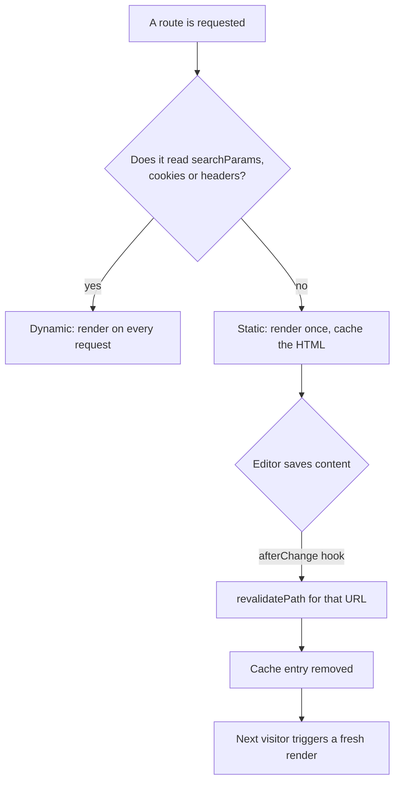

Here is the plan for our routes:

| URL | File | Rendering | Freshness |
|---|---|---|---|
| `/` | `(frontend)/page.tsx` | static | on-demand via hooks |
| `/about` and other pages | `(frontend)/[slug]/page.tsx` | static, `generateStaticParams` | on-demand via hooks |
| `/blog?page=2` | `(frontend)/blog/page.tsx` | dynamic (reads `searchParams`) | always fresh |
| `/blog/welcome-to-our-new-website` | `(frontend)/blog/[slug]/page.tsx` | static, `generateStaticParams` | on-demand via hooks |
| `/contact` | `(frontend)/contact/page.tsx` | static page, server action on submit | not needed |
| `/admin` | `(payload)/admin/...` | dynamic | always fresh |

> **Gotcha:** In development (`npm run dev`) every page is rendered on every request, so you will never see stale content there. To see real caching you must run a production build with `npm run build` and `npm run start`. We do exactly that in Part 6.

> **Outdated:** Older tutorials talk about `getStaticProps`, `getServerSideProps` and `revalidate` returned from them. Those belong to the Pages Router. In the App Router you use async server components, `generateStaticParams` and `revalidatePath` instead. Next.js 16 also offers an opt-in model called Cache Components (`cacheComponents: true` with the `'use cache'` directive). We do not turn it on in this guide. The defaults described here are simpler to learn first.

### [Beginner] Step 2 — Generate fresh types

**What we're doing:** Regenerating the TypeScript types from the collections.

**Why:** Every data function in this guide uses the generated `Page`, `Post` and `Media` types. If they are out of date, TypeScript will show confusing errors.

**Do it:**

```bash
npm run generate:types
```

This script came with the Payload template. It reads your collections and writes `src/payload-types.ts`. If your `package.json` does not have it, run `npx payload generate:types` instead.

**Check it works:**

```text
[12:00:01] INFO: Compiling TS types for Collections and Globals...
[12:00:02] INFO: Types written to /.../my-site/src/payload-types.ts
```

You will add about 40 small files in this guide. Step 35 shows the finished folder tree, so you can always check where a file belongs.

**What just happened:** Payload looked at your collection configs and produced one TypeScript interface per collection. When you later write `post.title`, your editor knows it is a string. When you misspell `post.titel`, TypeScript catches it before the browser does.

## 2. Layout and styling

The **layout** is the frame around every page: the `<html>` and `<body>` tags, the header, the footer, fonts and global CSS. Pages render inside it.

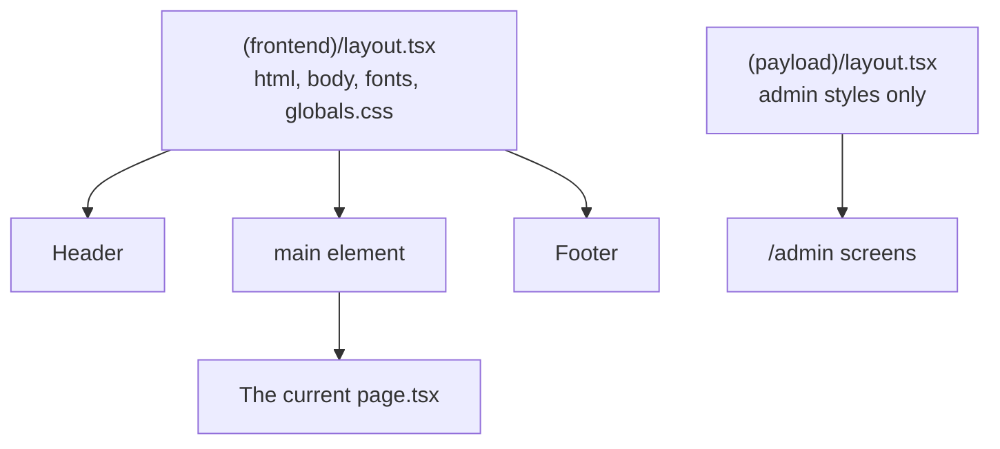

Notice there are two separate root layouts. The `(frontend)` group has one for the public site, and the `(payload)` group has one for the admin. This is why your Tailwind styles will not leak into the admin panel, and the admin's styles will not leak into your site.

### [Beginner] Step 3 — Install Tailwind CSS 4

**What we're doing:** Adding Tailwind CSS, a utility-first CSS framework, plus its Typography plugin for nicely styled article text.

**Why:** The Payload blank template ships with a small plain CSS file, not Tailwind. Tailwind lets you style elements with short class names like `text-lg font-bold` without writing separate CSS files. The Typography plugin gives rich text (paragraphs, lists, headings from the CMS) good default styles with a single `prose` class.

**Do it:** First check whether Tailwind is already installed:

```bash
npm ls tailwindcss
```

If it prints `(empty)`, install it:

```bash
npm install tailwindcss @tailwindcss/postcss postcss @tailwindcss/typography
```

- `tailwindcss` is the framework.
- `@tailwindcss/postcss` connects Tailwind to **PostCSS**, the CSS processing tool Next.js uses under the hood.
- `@tailwindcss/typography` adds the `prose` classes.

Create the PostCSS config in the project root:

```js
// postcss.config.mjs
const config = {
  plugins: {
    '@tailwindcss/postcss': {},
  },
}

export default config
```

Now create the global stylesheet for the public site. If the template created `src/app/(frontend)/styles.css`, delete it; we replace it with this file:

```css
/* src/app/(frontend)/globals.css */
@import 'tailwindcss';
@plugin '@tailwindcss/typography';

/* Fonts come from next/font as CSS variables (see layout.tsx). */
@theme inline {
  --font-sans: var(--font-inter), ui-sans-serif, system-ui, sans-serif;
  --font-serif: var(--font-fraunces), ui-serif, Georgia, serif;
}

/* A small brand palette. Use as bg-brand-600, text-brand-700 and so on. */
@theme {
  --color-brand-50: #eef5ff;
  --color-brand-100: #d9e8ff;
  --color-brand-600: #2456d6;
  --color-brand-700: #1c44ab;
  --color-brand-900: #142a63;
}

html {
  scroll-behavior: smooth;
}

/* Make keyboard focus clearly visible everywhere. */
:focus-visible {
  outline: 2px solid var(--color-brand-600);
  outline-offset: 2px;
}
```

**Check it works:** Nothing visible yet, because no file imports `globals.css`. The next step does. Run this to make sure the packages installed:

```bash
npm ls tailwindcss @tailwindcss/postcss
```

```text
my-site@1.0.0
├── @tailwindcss/postcss@4.x.x
└── tailwindcss@4.x.x
```

**What just happened:** Tailwind 4 is configured in CSS, not in a `tailwind.config.js` file. `@import 'tailwindcss'` pulls in the framework, `@plugin` loads the typography plugin, and `@theme` defines design tokens that become class names. Tailwind 4 also finds your source files automatically, so there is no `content` array to maintain.

> **Outdated:** Tailwind 3 tutorials use `tailwind.config.js`, `@tailwind base; @tailwind components; @tailwind utilities;` and a `content` array. That still works in v4 through a compatibility path, but new projects should use the CSS-first setup above.

**If it breaks:**
- `Cannot apply unknown utility class`: the `@import 'tailwindcss'` line is missing or the file is not imported by the layout yet.
- Admin panel looks broken: you imported `globals.css` in `(payload)/layout.tsx` by mistake. Import it only in `(frontend)/layout.tsx`.

### [Beginner] Step 4 — Small helpers: cn and the site config

**What we're doing:** Writing two tiny files that many components will share.

**Why:** Hard-coding the site name and navigation in five places means five places to update later. We keep all small helpers in `src/utilities/`, the folder guide 1 created for `slugify.ts`. A single `siteConfig` object is the one place to change them. The `cn` helper joins class names and skips empty ones, which keeps JSX readable.

**Do it:**

```ts
// src/utilities/cn.ts
/**
 * Join class names, skipping false, null, undefined and empty strings.
 * cn('a', isActive && 'b', undefined) -> 'a b' when isActive is true.
 */
export function cn(...classes: Array<string | false | null | undefined>): string {
  return classes.filter(Boolean).join(' ')
}
```

```ts
// src/utilities/site.ts
export const siteConfig = {
  name: 'My Site',
  description: 'A small website built with Next.js, Payload CMS and Postgres.',
  url: process.env.NEXT_PUBLIC_SERVER_URL ?? 'http://localhost:3000',
  nav: [
    { href: '/', label: 'Home' },
    { href: '/about', label: 'About' },
    { href: '/blog', label: 'Blog' },
    { href: '/contact', label: 'Contact' },
  ],
} as const
```

**Check it works:** Run the type checker:

```bash
npx tsc --noEmit
```

```text
(no output means no errors)
```

**What just happened:** `as const` tells TypeScript that these values never change, so it keeps the exact strings as types. `process.env.NEXT_PUBLIC_SERVER_URL` reads the environment variable from `.env`. Variables that start with `NEXT_PUBLIC_` are also available in browser code; everything else stays on the server.

### [Beginner] Step 5 — Container, Header with an active nav link, and Footer

**What we're doing:** Building the three layout components.

**Why:** Every page needs the same header and footer. The active link highlights where you are, which helps all visitors and is required for good accessibility (screen readers announce "current page").

**Do it:** The `Container` centers content and adds side padding:

```tsx
// src/components/Container.tsx
import type { ReactNode } from 'react'
import { cn } from '@/utilities/cn'

type ContainerProps = {
  children: ReactNode
  className?: string
}

export function Container({ children, className }: ContainerProps) {
  return <div className={cn('mx-auto w-full max-w-3xl px-4 sm:px-6', className)}>{children}</div>
}
```

The nav link needs to know the current URL. Only the browser router knows that cheaply, through the `usePathname` hook, so this is a client component:

```tsx
// src/components/NavLink.tsx
'use client'

import Link from 'next/link'
import { usePathname } from 'next/navigation'
import type { ReactNode } from 'react'
import { cn } from '@/utilities/cn'

type NavLinkProps = {
  href: string
  children: ReactNode
}

export function NavLink({ href, children }: NavLinkProps) {
  const pathname = usePathname()
  const isActive = href === '/' ? pathname === '/' : pathname === href || pathname.startsWith(`${href}/`)

  return (
    <Link
      href={href}
      aria-current={isActive ? 'page' : undefined}
      className={cn(
        'rounded px-1 py-0.5 text-sm font-medium transition-colors',
        isActive ? 'text-brand-700 underline underline-offset-4' : 'text-slate-600 hover:text-slate-900',
      )}
    >
      {children}
    </Link>
  )
}
```

The header itself stays a server component. It only renders the small client `NavLink` inside it:

```tsx
// src/components/Header.tsx
import Link from 'next/link'
import { siteConfig } from '@/utilities/site'
import { Container } from './Container'
import { NavLink } from './NavLink'

export function Header() {
  return (
    <header className="border-b border-slate-200 bg-white">
      <Container className="flex h-16 items-center justify-between gap-4">
        <Link href="/" className="font-serif text-xl font-semibold tracking-tight text-slate-900">
          {siteConfig.name}
        </Link>
        <nav aria-label="Main">
          <ul className="flex items-center gap-4 sm:gap-6">
            {siteConfig.nav.map((item) => (
              <li key={item.href}>
                <NavLink href={item.href}>{item.label}</NavLink>
              </li>
            ))}
          </ul>
        </nav>
      </Container>
    </header>
  )
}
```

```tsx
// src/components/Footer.tsx
import Link from 'next/link'
import { siteConfig } from '@/utilities/site'
import { Container } from './Container'

export function Footer() {
  const year = new Date().getFullYear()

  return (
    <footer className="mt-16 border-t border-slate-200 bg-slate-50">
      <Container className="flex flex-col gap-2 py-8 text-sm text-slate-600 sm:flex-row sm:items-center sm:justify-between">
        <p>
          &copy; {year} {siteConfig.name}. Built with Next.js and Payload.
        </p>
        <p className="flex gap-4">
          <Link href="/blog" className="hover:text-slate-900">
            Blog
          </Link>
          <Link href="/contact" className="hover:text-slate-900">
            Contact
          </Link>
          <Link href="/admin" className="hover:text-slate-900">
            Admin
          </Link>
        </p>
      </Container>
    </footer>
  )
}
```

**Check it works:** `npx tsc --noEmit` prints nothing. We will see the components in the browser after the next step.

**What just happened:** You built a small component tree where only `NavLink` ships JavaScript to the browser. `aria-current="page"` is the standard way to mark the current link. `Link` from `next/link` makes navigation between pages happen without a full page reload, and Next.js prefetches linked pages when they scroll into view.

> **Gotcha:** `new Date().getFullYear()` in a static footer is computed at build time. On New Year's Day it shows last year until the page is rebuilt. For a footer that is fine. For anything time-sensitive, compute it dynamically.

### [Beginner] Step 6 — The root layout for (frontend), with fonts and metadata

**What we're doing:** Replacing the template's `(frontend)/layout.tsx` with our own, loading two fonts and wiring in the header and footer.

**Why:** The root layout is the only place that renders `<html>` and `<body>`. Fonts loaded here apply to the whole site. The default metadata defined here is inherited by every page, so pages only have to override what is different.

**Do it:**

```tsx
// src/app/(frontend)/layout.tsx
import type { Metadata } from 'next'
import { Fraunces, Inter } from 'next/font/google'
import type { ReactNode } from 'react'
import { Footer } from '@/components/Footer'
import { Header } from '@/components/Header'
import { siteConfig } from '@/utilities/site'
import './globals.css'

const inter = Inter({ subsets: ['latin'], variable: '--font-inter', display: 'swap' })
const fraunces = Fraunces({ subsets: ['latin'], variable: '--font-fraunces', display: 'swap' })

export const metadata: Metadata = {
  metadataBase: new URL(siteConfig.url),
  title: {
    default: siteConfig.name,
    template: `%s | ${siteConfig.name}`,
  },
  description: siteConfig.description,
  openGraph: {
    type: 'website',
    siteName: siteConfig.name,
    locale: 'en_US',
  },
  twitter: { card: 'summary_large_image' },
}

export default function FrontendLayout({ children }: { children: ReactNode }) {
  return (
    <html lang="en" className={`${inter.variable} ${fraunces.variable}`}>
      <body className="flex min-h-screen flex-col bg-white font-sans text-slate-900 antialiased">
        <a
          href="#main"
          className="sr-only focus:not-sr-only focus:absolute focus:left-4 focus:top-4 focus:z-50 focus:rounded focus:bg-white focus:px-3 focus:py-2 focus:shadow"
        >
          Skip to content
        </a>
        <Header />
        <main id="main" className="flex-1">
          {children}
        </main>
        <Footer />
      </body>
    </html>
  )
}
```

Replace the template's demo home page with a temporary one, so we can see the layout:

```tsx
// src/app/(frontend)/page.tsx
import { Container } from '@/components/Container'

export default function HomePage() {
  return (
    <Container className="py-16">
      <h1 className="font-serif text-4xl font-semibold">Layout works</h1>
      <p className="mt-4 text-slate-600">The real home page comes from the CMS in Part 3.</p>
    </Container>
  )
}
```

**Check it works:** Restart `npm run dev` (PostCSS config changes need a restart) and open `http://localhost:3000`.

```text
My Site                         Home  About  Blog  Contact
----------------------------------------------------------
Layout works
The real home page comes from the CMS in Part 3.
----------------------------------------------------------
(c) 2026 My Site. Built with Next.js and Payload.   Blog Contact Admin
```

"Home" is underlined. Press Tab once: a "Skip to content" link appears in the top-left corner. The heading uses the serif font. Open `/admin` and confirm the admin panel still looks normal.

**What just happened:** `next/font/google` downloads the fonts at build time and serves them from your own domain, so there is no request to Google from the visitor's browser and no layout jump while fonts load. The `variable` option exposes each font as a CSS variable, and our `@theme inline` block maps those variables to Tailwind's `font-sans` and `font-serif`. `metadataBase` lets pages use relative URLs for things like Open Graph images; Next.js turns them into absolute URLs.

**If it breaks:**
- `Failed to fetch font` during build: the build machine has no internet. Use `next/font/local` with font files committed to the repo instead.
- `Module not found: Can't resolve '@/components/Header'`: check that `tsconfig.json` has `"paths": { "@/*": ["./src/*"] }`. The Payload template includes it.

## 3. Pages from the CMS

Now the site starts to show real content. Editors write pages in `/admin`; our server components read them from Postgres and render HTML.

### [Beginner] Concept — What is the Payload Local API?

Payload gives you three ways to read and write content:

- The **REST API** at `/api/...`, over HTTP, returning JSON.
- The **GraphQL API** at `/api/graphql`.
- The **Local API**, which is a set of plain JavaScript functions you call directly from server code: `payload.find(...)`, `payload.create(...)`, and so on.

Because Payload runs inside our Next.js app, our server components can use the Local API. There is no HTTP request, no JSON parsing, no URL to configure. It is just a function call that talks to the database.

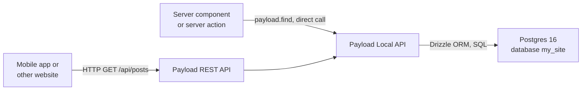

> **Gotcha:** The Local API **skips access control by default** (`overrideAccess: true`). That is convenient for trusted server code, but it means a careless query can return draft posts or private contact submissions. The `publishedOrLoggedIn` read rule you wrote for Posts in guide 1 protects the REST API, not the Local API. Always filter explicitly, for example `where: { status: { equals: 'published' } }`. If you want Payload to enforce the rules as if a specific user made the call, pass `overrideAccess: false` and `user`.

> **Interview tip:** Why use the Local API instead of `fetch('/api/posts')` from a server component? Calling your own HTTP API from the same server adds a network hop, JSON serialization and a URL that must be known at build time. The Local API is faster and fully typed.

### [Beginner] Step 7 — A Payload client helper and the data functions

**What we're doing:** Writing one file that gets the Payload instance, and one file with every query the website needs.

**Why:** If queries are scattered across pages, you will forget the "published only" filter somewhere and leak a draft. Keeping them in one file means one place to review, one place to fix.

**Do it:** Install `server-only`, a tiny package that makes the build fail if a file is ever imported into a client component by mistake:

```bash
npm install server-only
```

```ts
// src/utilities/payload.ts
import 'server-only'
import config from '@payload-config'
import { getPayload } from 'payload'

/**
 * Returns the Payload instance. getPayload caches it internally,
 * so calling this in many places is cheap.
 */
export async function getPayloadClient() {
  return getPayload({ config })
}
```

`@payload-config` is a path alias the Payload template adds to `tsconfig.json`. It points to `src/payload.config.ts`.

```ts
// src/utilities/queries.ts
import 'server-only'
import type { Where } from 'payload'
import { cache } from 'react'
import type { Page, Post } from '@/payload-types'
import { getPayloadClient } from './payload'

export const POSTS_PER_PAGE = 6

const publishedOnly: Where = { status: { equals: 'published' } }

/** One Page by slug, or null. cache() dedupes calls within one request. */
export const getPageBySlug = cache(async (slug: string): Promise<Page | null> => {
  const payload = await getPayloadClient()
  const result = await payload.find({
    collection: 'pages',
    where: { slug: { equals: slug } },
    limit: 1,
    depth: 1,
  })
  return result.docs[0] ?? null
})

/** All page slugs, for generateStaticParams and the sitemap. */
export async function getAllPages() {
  const payload = await getPayloadClient()
  const result = await payload.find({
    collection: 'pages',
    pagination: false,
    depth: 0,
    select: { slug: true, updatedAt: true },
  })
  return result.docs
}

/** One page of published posts, newest first. */
export async function getPublishedPosts(page: number, limit: number = POSTS_PER_PAGE) {
  const payload = await getPayloadClient()
  return payload.find({
    collection: 'posts',
    where: publishedOnly,
    sort: '-publishedAt',
    limit,
    page,
    depth: 1,
  })
}

/** One published post by slug. With includeDrafts: true, any status (preview only). */
export const getPostBySlug = cache(
  async (slug: string, includeDrafts: boolean = false): Promise<Post | null> => {
    const payload = await getPayloadClient()
    const where: Where = includeDrafts
      ? { slug: { equals: slug } }
      : { and: [{ slug: { equals: slug } }, publishedOnly] }

    const result = await payload.find({
      collection: 'posts',
      where,
      limit: 1,
      depth: 1,
    })
    return result.docs[0] ?? null
  },
)

/** All published post slugs, for generateStaticParams and the sitemap. */
export async function getAllPublishedPosts() {
  const payload = await getPayloadClient()
  const result = await payload.find({
    collection: 'posts',
    where: publishedOnly,
    pagination: false,
    depth: 0,
    select: { slug: true, updatedAt: true },
  })
  return result.docs
}
```

A few words you just used:

- `where` is Payload's filter object. `{ slug: { equals: 'about' } }` becomes `WHERE slug = 'about'` in SQL. `and` combines several conditions.
- `sort: '-publishedAt'` sorts by `publishedAt`, and the minus sign means descending (newest first).
- `depth: 1` tells Payload to replace relationship IDs with the related documents one level deep. With `depth: 0`, `post.coverImage` is just a number (the Media ID). With `depth: 1`, it is the full Media object with `url`, `alt`, `width` and `height`.
- `select` asks for only the listed fields, which keeps the query small.
- `pagination: false` returns every matching document instead of one page.
- `publishedOnly` is `{ status: { equals: 'published' } }`, the `status` select field from guide 1. Every public query includes it.

**Check it works:** `npx tsc --noEmit` prints nothing. We call these functions from pages next.

**What just happened:** You built a tiny **data access layer**. Pages never call `payload.find` directly; they call `getPublishedPosts(2)`. React's `cache()` wraps a function so that, within one server request, calling it twice with the same arguments only hits the database once. That matters because `generateMetadata` and the page component often need the same document.

> **Why:** `payload.find` always returns the same shape: `{ docs, totalDocs, totalPages, page, hasNextPage, hasPrevPage, ... }`. We will use those fields for pagination in Part 4.

### [Beginner] Step 8 — Images: the media URL helper and next/image

**What we're doing:** Writing a small `CmsImage` component that turns a Payload Media document into an optimized `next/image`.

**Why:** `next/image` resizes images, serves modern formats like WebP or AVIF, lazy-loads images below the fold and prevents layout jumps by reserving space. To do that it needs a `src`, a `width` and a `height`. Payload's Media documents have all three.

**Do it:** In development, Payload stores uploads on your disk and serves them at `/api/media/file/<filename>`. That is a **local** URL on our own site, which `next/image` can optimize with no extra config. One catch: if `serverURL` is set in `payload.config.ts`, Payload returns absolute URLs like `http://localhost:3000/api/media/file/cat.jpg`. The helper below turns those back into relative paths:

```ts
// src/utilities/media.ts
/**
 * Payload returns media URLs that are relative (/api/media/file/x.jpg) or,
 * when serverURL is set, absolute on our own domain. next/image treats our
 * own domain best as a relative path, so strip the origin when it matches.
 * URLs on other domains (S3, Vercel Blob in production) are returned unchanged.
 */
export function toImageSrc(url: string | null | undefined, serverUrl?: string): string | null {
  if (!url) return null
  if (serverUrl && url.startsWith(serverUrl)) {
    const path = url.slice(serverUrl.length)
    return path.startsWith('/') ? path : `/${path}`
  }
  return url
}
```

```tsx
// src/components/CmsImage.tsx
import Image from 'next/image'
import type { Media } from '@/payload-types'
import { toImageSrc } from '@/utilities/media'

// The image sizes defined on the Media collection in guide 1.
type MediaSizeName = 'thumbnail' | 'card' | 'hero'

type CmsImageProps = {
  media: Media | number | null | undefined
  sizes: string
  /** Which resized copy to start from. Falls back to the original upload. */
  variant?: MediaSizeName
  className?: string
  eager?: boolean
}

export function CmsImage({ media, sizes, variant, className, eager = false }: CmsImageProps) {
  // With depth: 0 a relationship is just an ID number. We need the full document.
  if (!media || typeof media !== 'object') return null

  // Prefer the resized copy (smaller file) when Payload generated it.
  const resized = variant ? media.sizes?.[variant] : undefined
  const useResized = Boolean(resized?.url && resized.width && resized.height)
  const url = useResized ? resized?.url : media.url
  const width = useResized ? resized?.width : media.width
  const height = useResized ? resized?.height : media.height

  const src = toImageSrc(url, process.env.NEXT_PUBLIC_SERVER_URL)
  if (!src || !width || !height) return null

  return (
    <Image
      src={src}
      alt={media.alt ?? ''}
      width={width}
      height={height}
      sizes={sizes}
      className={className}
      loading={eager ? 'eager' : 'lazy'}
      fetchPriority={eager ? 'high' : 'auto'}
    />
  )
}
```

Now open `next.config.mjs`. Keep the `withPayload` wrapper and any options the template put there, and add an `images` section. In production (guide 3) your media will live on S3 or Vercel Blob, which are **remote** domains, and `next/image` refuses to optimize remote images unless you list them in `remotePatterns`:

```js
// next.config.mjs
import { withPayload } from '@payloadcms/next/withPayload'

/** @type {import('next').NextConfig} */
const nextConfig = {
  images: {
    // Local media (/api/media/file/...) needs no entry here.
    // Remote media must be allowed explicitly. Guide 3 fills this in, for example:
    // { protocol: 'https', hostname: 'my-site-media.s3.eu-central-1.amazonaws.com', pathname: '/**' }
    remotePatterns: [],
  },
}

export default withPayload(nextConfig, { devBundleServerPackages: false })
```

If your template's file is `next.config.ts` instead, make the same change there.

**Check it works:** Restart `npm run dev`. Nothing renders images yet, but the server should start with no config errors. You can open a seeded image directly: in `/admin` go to **Media**, click an image, and copy its URL. Opening it shows the image:

```text
http://localhost:3000/api/media/file/my-photo.jpg   -> the image appears
```

**What just happened:** You separated two concerns. `toImageSrc` is a pure function (same input, same output, no side effects), which makes it easy to unit test in Part 8. `CmsImage` handles the "is this an ID or a document?" question that every Payload upload field raises. The `variant` prop uses the sizes from guide 1's Media collection: `thumbnail` (400 by 300), `card` (768 by 512) and `hero` (1600 wide). Payload stores each one under `media.sizes`. Starting `next/image` from the `card` copy instead of a 5000-pixel original makes the optimizer's job faster, and `next/image` still produces the exact widths the browser asks for.

> **Gotcha:** Next.js 16 refuses to optimize remote images whose hostname resolves to a private IP address such as `localhost`, to block server-side request forgery. If you ever see an error about a "private IP", make the URL relative (as our helper does) rather than adding `localhost` to `remotePatterns`. There is an escape hatch option, `images.dangerouslyAllowLocalIP`, but you should not need it.

> **Gotcha:** Next.js 16 also requires `images.localPatterns` to be configured if local image URLs contain a query string (`?v=123`). Our media URLs have none, so we skip it.

### [Beginner] Step 9 — Rendering rich text

**What we're doing:** Wrapping Payload's React rich text renderer in our own component with nice typography.

**Why:** Payload's Lexical editor saves rich text as a JSON tree (`root -> paragraph -> text`), not HTML. Something has to turn that tree into React elements. Payload ships a component for exactly that.

**Do it:** The rich text package is already installed from guide 1 (`@payloadcms/richtext-lexical`).

```tsx
// src/components/RichText.tsx
import type { SerializedEditorState } from '@payloadcms/richtext-lexical/lexical'
import { RichText as PayloadRichText } from '@payloadcms/richtext-lexical/react'
import { cn } from '@/utilities/cn'

type RichTextProps = {
  data: SerializedEditorState | null | undefined
  className?: string
}

export function RichText({ data, className }: RichTextProps) {
  if (!data) return null

  return (
    <div
      className={cn(
        'prose prose-slate max-w-none prose-headings:font-serif prose-a:text-brand-700',
        className,
      )}
    >
      <PayloadRichText data={data} />
    </div>
  )
}
```

**Check it works:** `npx tsc --noEmit` prints nothing.

**What just happened:** `RichText` from `@payloadcms/richtext-lexical/react` walks the JSON tree and outputs headings, paragraphs, lists, links and so on. It is a server-friendly component, so no JavaScript is shipped for it. The `prose` classes from the Typography plugin style everything inside it.

**If it breaks:**
- `Module not found: @payloadcms/richtext-lexical/react`: your Payload version uses a different export path. Check the Payload docs page "Converters" for your version. The component name is still `RichText`.
- TypeScript says the generated `content` type is not assignable to `SerializedEditorState`: pass `data={post.content as SerializedEditorState}`. The shapes match at runtime; the generated type is just looser.
- Images inside rich text do not render: uploads inside the editor need `depth` high enough to populate them (we use `depth: 1`) and, for custom styling, a custom converter. The Payload docs on "JSX converters" show how.

### [Beginner] Step 10 — The home page from Page slug "home"

**What we're doing:** Replacing the temporary home page with content from the Page whose slug is `home`, plus the three newest posts.

**Why:** Editors should be able to change the home page text without a developer. The "latest posts" strip shows how one page can combine several queries.

**Do it:** First a reusable card for posts. We will reuse it on the blog list:

```tsx
// src/components/PostCard.tsx
import Link from 'next/link'
import type { Post } from '@/payload-types'
import { formatDate } from '@/utilities/format-date'
import { CmsImage } from './CmsImage'

type PostCardProps = {
  post: Post
}

export function PostCard({ post }: PostCardProps) {
  return (
    <article className="group relative flex flex-col overflow-hidden rounded-lg border border-slate-200 bg-white">
      <CmsImage
        media={post.coverImage}
        variant="card"
        sizes="(min-width: 768px) 360px, 100vw"
        className="aspect-[16/9] w-full object-cover"
      />
      <div className="flex flex-1 flex-col gap-2 p-4">
        {post.publishedAt ? (
          <time dateTime={post.publishedAt} className="text-xs uppercase tracking-wide text-slate-500">
            {formatDate(post.publishedAt)}
          </time>
        ) : null}
        <h3 className="font-serif text-lg font-semibold">
          <Link href={`/blog/${post.slug}`} className="after:absolute after:inset-0 group-hover:underline">
            {post.title}
          </Link>
        </h3>
        {post.excerpt ? <p className="text-sm text-slate-600">{post.excerpt}</p> : null}
      </div>
    </article>
  )
}
```

The card uses `formatDate`, which we write properly in Part 4. Create it now so the import works:

```ts
// src/utilities/format-date.ts
const dateFormatter = new Intl.DateTimeFormat('en-US', {
  dateStyle: 'long',
  timeZone: 'UTC',
})

/** "2026-10-06T09:30:00.000Z" -> "October 6, 2026". Returns '' for missing or invalid input. */
export function formatDate(iso: string | null | undefined): string {
  if (!iso) return ''
  const date = new Date(iso)
  if (Number.isNaN(date.getTime())) return ''
  return dateFormatter.format(date)
}
```

> **Why:** The card link uses `after:absolute after:inset-0` to make the whole card clickable while keeping only one real link inside it (good for screen readers, which would otherwise announce the same link several times). The `relative` class on the `article` is what the stretched link fills.

Now the home page:

```tsx
// src/app/(frontend)/page.tsx
import type { Metadata } from 'next'
import Link from 'next/link'
import { notFound } from 'next/navigation'
import { Container } from '@/components/Container'
import { PostCard } from '@/components/PostCard'
import { RichText } from '@/components/RichText'
import { getPageBySlug, getPublishedPosts } from '@/utilities/queries'
import { siteConfig } from '@/utilities/site'

export async function generateMetadata(): Promise<Metadata> {
  const page = await getPageBySlug('home')
  return {
    // absolute: skip the "%s | My Site" template on the home page
    title: { absolute: page?.title ? `${page.title} | ${siteConfig.name}` : siteConfig.name },
    alternates: { canonical: '/' },
  }
}

export default async function HomePage() {
  const [page, latest] = await Promise.all([getPageBySlug('home'), getPublishedPosts(1, 3)])

  if (!page) notFound()

  return (
    <>
      <section className="border-b border-slate-200 bg-brand-50">
        <Container className="py-16 sm:py-24">
          <h1 className="font-serif text-4xl font-semibold tracking-tight text-brand-900 sm:text-5xl">
            {page.title}
          </h1>
          <RichText data={page.layout} className="mt-6 prose-lg" />
        </Container>
      </section>

      {latest.docs.length > 0 ? (
        <section aria-labelledby="latest-heading">
          <Container className="py-12">
            <div className="flex items-baseline justify-between">
              <h2 id="latest-heading" className="font-serif text-2xl font-semibold">
                Latest posts
              </h2>
              <Link href="/blog" className="text-sm font-medium text-brand-700 hover:underline">
                All posts
              </Link>
            </div>
            <div className="mt-6 grid gap-6 sm:grid-cols-2 md:grid-cols-3">
              {latest.docs.map((post) => (
                <PostCard key={post.id} post={post} />
              ))}
            </div>
          </Container>
        </section>
      ) : null}
    </>
  )
}
```

Because three cards sit side by side in the wide `max-w-3xl` container, they are small. That is fine for a first design. Change `max-w-3xl` in `Container` to `max-w-5xl` later if you want more room.

**Check it works:** Open `http://localhost:3000`.

```text
My Site                         Home  About  Blog  Contact
----------------------------------------------------------
Home                                  (title of the "home" Page)
Welcome to My Site. We help small businesses grow.
Read our blog for news and tips, or get in touch through the contact page.

Latest posts                                     All posts
OCTOBER 3, 2026                          [cover image]
Five tips for choosing the right service  OCTOBER 1, 2026
A short checklist to help you ...         Welcome to our new website
                                          We rebuilt our website ...
```

The newest post comes first because we sort by `-publishedAt`. Only the post where you attached a cover image shows a picture; `CmsImage` renders nothing when there is no image. Your `Draft idea` post must **not** appear. Feel free to rename the home Page's title in `/admin` to something more welcoming than "Home". Now go to `/admin`, edit the home Page text, save, and refresh the browser: the change appears immediately (development mode renders on every request).

**What just happened:** `HomePage` is an async server component. It awaited two queries in parallel with `Promise.all`, so the total wait is the slower of the two, not their sum. `notFound()` throws a special error that tells Next.js to render the nearest `not-found.tsx` and return HTTP 404. If an editor deletes the `home` page, visitors get a clean 404 instead of a crash.

**If it breaks:**
- Blank page with a 404: there is no Page with slug exactly `home`. Run `npm run seed` again or create it in `/admin`.
- Image missing on the post you edited: check that **Cover Image** is set on that post and saved. The seed itself adds no images.
- `Error: cannot connect to database`: Docker is not running. Run `docker compose up -d`.

### [Intermediate] Step 11 — Any other page at /[slug], with generateStaticParams, generateMetadata and notFound

**What we're doing:** One route file that renders every Page except `home`: `/about`, `/privacy`, and any page an editor creates later.

**Why:** You do not want a developer to create a new file every time the marketing team adds a page. A **dynamic segment** (`[slug]` in the folder name) matches any single URL segment and gives you its value.

**Do it:**

```tsx
// src/app/(frontend)/[slug]/page.tsx
import type { Metadata } from 'next'
import { notFound, permanentRedirect } from 'next/navigation'
import { Container } from '@/components/Container'
import { RichText } from '@/components/RichText'
import { getAllPages, getPageBySlug } from '@/utilities/queries'

type PageProps = {
  params: Promise<{ slug: string }>
}

/** Pre-render every page except home at build time. */
export async function generateStaticParams() {
  const pages = await getAllPages()
  return pages
    .map((page) => page.slug)
    .filter((slug): slug is string => typeof slug === 'string' && slug.length > 0 && slug !== 'home')
    .map((slug) => ({ slug }))
}

export async function generateMetadata({ params }: PageProps): Promise<Metadata> {
  const { slug } = await params
  const page = await getPageBySlug(slug)
  if (!page) return {}

  return {
    title: page.title,
    alternates: { canonical: `/${slug}` },
    openGraph: { title: page.title, url: `/${slug}` },
  }
}

export default async function CmsPage({ params }: PageProps) {
  const { slug } = await params

  // The home page lives at "/", never at "/home".
  if (slug === 'home') permanentRedirect('/')

  const page = await getPageBySlug(slug)
  if (!page) notFound()

  return (
    <Container className="py-12 sm:py-16">
      <h1 className="font-serif text-4xl font-semibold tracking-tight">{page.title}</h1>
      <RichText data={page.layout} className="mt-8" />
    </Container>
  )
}
```

The three special exports, in plain words:

- `generateStaticParams` runs at **build time**. It returns a list like `[{ slug: 'about' }]`. Next.js pre-renders one HTML file per item.
- `generateMetadata` returns the `<title>`, description, canonical URL and Open Graph tags for this page. It runs before the page renders.
- The default export is the page. `params` is a **Promise** in Next.js 15 and later, so you must `await` it.

What about a slug that was not known at build time, like a page created yesterday? By default (`dynamicParams = true`) Next.js renders it on the first request and then caches it. Unknown slugs that do not exist in the CMS hit `notFound()` and return a 404.

**Check it works:** Open `http://localhost:3000/about` (the page you created in Step 1): it renders and the browser tab says `About | My Site`. Open `/this-does-not-exist`:

```text
404 | This page could not be found.
```

(We design a nicer 404 in Part 7.) Open `/home`: the browser lands on `/`.

**What just happened:** You built a "catch-all for CMS pages" route. Static folders always win over dynamic ones, so `/blog` and `/contact` (which we create next) are matched before `[slug]`, and `/admin` lives in the `(payload)` group with its own static folder.

> **Gotcha:** Because static routes win, a Page with slug `blog`, `contact`, `admin` or `api` can never be shown at `/<slug>`. Add a validation in the Pages `slug` field in guide 1's collection that rejects these reserved words, or editors will be confused.

> **Outdated:** In Next.js 14 `params` was a plain object (`params.slug`). Since Next.js 15 it is a Promise. Next.js 16 removed the temporary synchronous fallback, so `params.slug` without `await` no longer works. Next.js 16 can also generate a global helper type, `PageProps<'/[slug]'>`, which you may see in newer code; our explicit type does the same job.

> **Interview tip:** `generateStaticParams` makes the build depend on the database. That means your CI or hosting platform needs `DATABASE_URI` at build time. Guide 3 deals with this.

## 4. The blog

The blog has two routes: a list at `/blog` with pages of six posts, and a detail page at `/blog/<slug>`. Only published posts are visible.

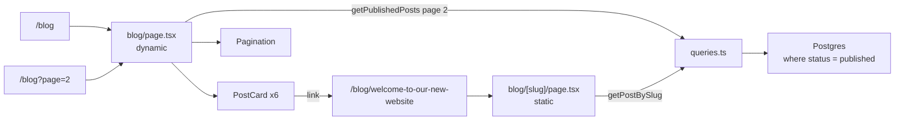

### [Beginner] Step 12 — Pure helpers: reading time, slugs, dates and page numbers

**What we're doing:** Writing three small helper files with no React and no database inside, next to guide 1's `slugify`.

**Why:** Pure functions are the easiest code in the world to test. Keeping logic like "how many minutes to read this?" out of components means you can unit test it in milliseconds (Part 8), and reuse it anywhere.

**Do it:** Reading time. Lexical rich text is a JSON tree, so first we collect all the text nodes, then count words. An average adult reads about 200 to 250 words per minute; we use 200.

```ts
// src/utilities/reading-time.ts
type LexicalLikeNode = {
  text?: unknown
  children?: unknown
}

/** Collect all text from a Lexical JSON value ({ root: { children: [...] } }). */
export function lexicalToPlainText(value: unknown): string {
  const parts: string[] = []

  const walk = (node: unknown): void => {
    if (!node || typeof node !== 'object') return
    const current = node as LexicalLikeNode
    if (typeof current.text === 'string') parts.push(current.text)
    if (Array.isArray(current.children)) current.children.forEach(walk)
  }

  if (value && typeof value === 'object' && 'root' in value) {
    walk((value as { root: unknown }).root)
  }

  return parts.join(' ').replace(/\s+/g, ' ').trim()
}

export function countWords(text: string): number {
  const trimmed = text.trim()
  return trimmed === '' ? 0 : trimmed.split(/\s+/).length
}

/** Minutes to read, rounded up, never less than 1. */
export function readingTimeMinutes(text: string, wordsPerMinute: number = 200): number {
  return Math.max(1, Math.ceil(countWords(text) / wordsPerMinute))
}

export function formatReadingTime(minutes: number): string {
  return `${minutes} min read`
}
```

Slugs. You already have this one: guide 1 wrote `src/utilities/slugify.ts`, and the shared `slugField` in `src/fields/slug.ts` runs it in a `beforeValidate` hook on every save. We do not rewrite it. We will add unit tests for it in Part 8, because every public URL on the site depends on it.

Page numbers. A query string value can be missing, a string, or an array (`?page=1&page=2`). Visitors can also type `?page=abc` or `?page=-5`. This function turns all of that into a safe positive integer:

```ts
// src/utilities/pagination.ts
/** Turn ?page=... into a positive integer. Anything invalid becomes 1. */
export function parsePageParam(value: string | string[] | undefined): number {
  const raw = Array.isArray(value) ? value[0] : value
  if (!raw || !/^\d+$/.test(raw)) return 1
  const page = Number.parseInt(raw, 10)
  return page >= 1 ? page : 1
}

/** Page 1 lives at the clean URL; other pages use ?page=N. */
export function pageHref(basePath: string, page: number): string {
  return page <= 1 ? basePath : `${basePath}?page=${page}`
}
```

Dates you already wrote in Step 10 (`src/utilities/format-date.ts`). Notice it sets `timeZone: 'UTC'`.

> **Gotcha:** Dates are a classic source of **hydration errors**. If a client component formats a date with the server's time zone (UTC on most hosts) and then again with the visitor's time zone in the browser, the text differs and React complains that the server HTML does not match. Formatting in server components with a fixed time zone avoids it. Our `formatDate` only runs on the server, and it pins UTC anyway.

**Check it works:** You can try the helpers right now with Node's built-in TypeScript type stripping (Node 22.18+ or 23+; on older Node, skip this and wait for the tests in Part 8):

```bash
node -e "import('./src/utilities/pagination.ts').then(m => console.log(m.parsePageParam('abc'), m.parsePageParam('3'), m.pageHref('/blog', 2)))"
```

```text
1 3 /blog?page=2
```

**What just happened:** You wrote code that is easy to reason about: no hidden inputs, no side effects. Each function does one thing. Part 8 tests all of them, including the nasty inputs.

### [Beginner] Step 13 — The Pagination component

**What we're doing:** Building "Previous / Page 2 of 4 / Next" links.

**Why:** We paginate with **links**, not buttons with JavaScript. Links work without JavaScript, can be opened in a new tab, can be bookmarked and shared, and search engines can follow them.

**Do it:**

```tsx
// src/components/Pagination.tsx
import Link from 'next/link'
import { pageHref } from '@/utilities/pagination'

type PaginationProps = {
  basePath: string
  currentPage: number
  totalPages: number
}

export function Pagination({ basePath, currentPage, totalPages }: PaginationProps) {
  if (totalPages <= 1) return null

  const hasPrev = currentPage > 1
  const hasNext = currentPage < totalPages
  const linkClass = 'rounded border border-slate-300 px-3 py-1.5 text-sm font-medium hover:bg-slate-50'
  const disabledClass = 'rounded border border-slate-200 px-3 py-1.5 text-sm text-slate-400'

  return (
    <nav aria-label="Pagination" className="mt-10 flex items-center justify-between">
      {hasPrev ? (
        <Link href={pageHref(basePath, currentPage - 1)} rel="prev" className={linkClass}>
          Previous
        </Link>
      ) : (
        <span aria-hidden="true" className={disabledClass}>
          Previous
        </span>
      )}

      <p className="text-sm text-slate-600">
        Page {currentPage} of {totalPages}
      </p>

      {hasNext ? (
        <Link href={pageHref(basePath, currentPage + 1)} rel="next" className={linkClass}>
          Next
        </Link>
      ) : (
        <span aria-hidden="true" className={disabledClass}>
          Next
        </span>
      )}
    </nav>
  )
}
```

**Check it works:** `npx tsc --noEmit` prints nothing.

**What just happened:** The component is a server component with no state. The "disabled" ends are plain `span`s hidden from screen readers, because a link that goes nowhere is confusing to announce.

### [Intermediate] Step 14 — The blog list page with ?page=N

**What we're doing:** Rendering six published posts per page, reading the page number from the URL.

**Why:** Putting the page number in the URL (instead of React state) means the back button, refresh and shared links all work.

**Do it:**

```tsx
// src/app/(frontend)/blog/page.tsx
import type { Metadata } from 'next'
import { notFound } from 'next/navigation'
import { Container } from '@/components/Container'
import { Pagination } from '@/components/Pagination'
import { PostCard } from '@/components/PostCard'
import { parsePageParam } from '@/utilities/pagination'
import { getPublishedPosts } from '@/utilities/queries'

export const metadata: Metadata = {
  title: 'Blog',
  description: 'Articles and notes.',
  alternates: { canonical: '/blog' },
}

type BlogPageProps = {
  searchParams: Promise<{ page?: string | string[] }>
}

export default async function BlogPage({ searchParams }: BlogPageProps) {
  const { page: pageParam } = await searchParams
  const page = parsePageParam(pageParam)
  const result = await getPublishedPosts(page)

  // ?page=99 when there are only 3 pages: a real 404 is more honest than an empty list.
  if (page > 1 && result.docs.length === 0) notFound()

  return (
    <Container className="py-12 sm:py-16">
      <h1 className="font-serif text-4xl font-semibold tracking-tight">Blog</h1>
      <p className="mt-2 text-slate-600">
        {result.totalDocs} {result.totalDocs === 1 ? 'post' : 'posts'}
      </p>

      {result.docs.length === 0 ? (
        <p className="mt-10 text-slate-600">No posts yet. Check back soon.</p>
      ) : (
        <div className="mt-8 grid gap-6 sm:grid-cols-2">
          {result.docs.map((post) => (
            <PostCard key={post.id} post={post} />
          ))}
        </div>
      )}

      <Pagination basePath="/blog" currentPage={result.page ?? page} totalPages={result.totalPages} />
    </Container>
  )
}
```

**Check it works:** Open `http://localhost:3000/blog`. You see the two seeded posts and the count. Your `Draft idea` post is missing. To see pagination without writing seven posts, temporarily change `POSTS_PER_PAGE` in `queries.ts` to `1`:

```text
Blog
2 posts
[card: Five tips for choosing the right service]
Previous        Page 1 of 2        Next
```

Click **Next**: the URL becomes `/blog?page=2`. Try `/blog?page=abc` (shows page 1) and `/blog?page=50` (404). Change `POSTS_PER_PAGE` back to `6`.

**What just happened:** Reading `searchParams` makes this route **dynamic**: it renders on every request. That is the honest choice here, because the result depends on the query string. Payload does the paging in SQL (`LIMIT 6 OFFSET 6` for page 2) and also returns `totalPages`, so we never load all posts into memory.

> **Interview tip:** An alternative design is path-based pagination, `/blog/page/2`, with `generateStaticParams` for every page number. That makes every list page static (faster, cheaper) at the cost of more pages to revalidate when a post is published. For a small blog, `?page=N` with dynamic rendering is simpler. For a large, high-traffic blog, static pages win.

> **Gotcha:** Offset pagination (page/limit) can show a post twice or skip one if a new post is published while someone is clicking through pages. For a blog that is acceptable. For feeds that change every second, use cursor pagination ("posts older than this date").

### [Intermediate] Step 15 — The post detail page

**What we're doing:** Rendering one post with its cover image, date, reading time and content, plus metadata for search engines and social sharing.

**Why:** This is the page people share. Good metadata decides what the link preview looks like on Slack, LinkedIn or X.

**Do it:**

```tsx
// src/app/(frontend)/blog/[slug]/page.tsx
import type { Metadata } from 'next'
import Link from 'next/link'
import { notFound } from 'next/navigation'
import { CmsImage } from '@/components/CmsImage'
import { Container } from '@/components/Container'
import { RichText } from '@/components/RichText'
import { formatDate } from '@/utilities/format-date'
import { toImageSrc } from '@/utilities/media'
import { getAllPublishedPosts, getPostBySlug } from '@/utilities/queries'
import { formatReadingTime, lexicalToPlainText, readingTimeMinutes } from '@/utilities/reading-time'

type PostPageProps = {
  params: Promise<{ slug: string }>
}

export async function generateStaticParams() {
  const posts = await getAllPublishedPosts()
  return posts
    .map((post) => post.slug)
    .filter((slug): slug is string => typeof slug === 'string' && slug.length > 0)
    .map((slug) => ({ slug }))
}

export async function generateMetadata({ params }: PostPageProps): Promise<Metadata> {
  const { slug } = await params
  const post = await getPostBySlug(slug)
  if (!post) return {}

  const cover = typeof post.coverImage === 'object' ? post.coverImage : null
  const coverSrc = toImageSrc(cover?.url, process.env.NEXT_PUBLIC_SERVER_URL)

  return {
    title: post.title,
    description: post.excerpt ?? undefined,
    alternates: { canonical: `/blog/${slug}` },
    openGraph: {
      type: 'article',
      title: post.title,
      description: post.excerpt ?? undefined,
      url: `/blog/${slug}`,
      publishedTime: post.publishedAt ?? undefined,
      images: coverSrc ? [{ url: coverSrc, alt: cover?.alt ?? '' }] : undefined,
    },
  }
}

export default async function PostPage({ params }: PostPageProps) {
  const { slug } = await params
  const post = await getPostBySlug(slug)
  if (!post) notFound()

  const minutes = readingTimeMinutes(lexicalToPlainText(post.content))

  return (
    <article>
      <Container className="py-12 sm:py-16">
        <p>
          <Link href="/blog" className="text-sm font-medium text-brand-700 hover:underline">
            Back to blog
          </Link>
        </p>
        <h1 className="mt-4 font-serif text-4xl font-semibold tracking-tight sm:text-5xl">
          {post.title}
        </h1>
        <p className="mt-4 flex gap-3 text-sm text-slate-500">
          {post.publishedAt ? <time dateTime={post.publishedAt}>{formatDate(post.publishedAt)}</time> : null}
          <span aria-hidden="true">·</span>
          <span>{formatReadingTime(minutes)}</span>
        </p>
        <CmsImage
          media={post.coverImage}
          variant="hero"
          sizes="(min-width: 768px) 720px, 100vw"
          className="mt-8 w-full rounded-lg object-cover"
          eager
        />
        <RichText data={post.content} className="mt-10" />
      </Container>
    </article>
  )
}
```

**Check it works:** From `/blog`, click the "Welcome to our new website" card. You land on `/blog/welcome-to-our-new-website`:

```text
Back to blog
Welcome to our new website
October 1, 2026 · 1 min read
[cover image, if you attached one in Step 1]
We are excited to share our new website with you.
You can now read our latest news on the blog and reach us through the contact form.
```

The seeded posts are short, so they show "1 min read". View the page source (right click, View Page Source) and search for `og:title`: you will find `<meta property="og:title" content="Welcome to our new website"/>` and, if the post has a cover, an `og:image` with an absolute URL. Now open `/blog/draft-idea` (the draft you created in Step 1) directly: it must return the 404 page.

**What just happened:** The cover image gets `eager` loading because it is the **Largest Contentful Paint** (LCP) element, the biggest thing visible on first load. Lighthouse measures how fast it appears. Everything else lazy-loads. `generateMetadata` and the page both call `getPostBySlug(slug)`, but React's `cache()` makes that a single database query per request. Because `metadataBase` is set in the layout, the relative `og:image` URL becomes absolute, which social networks require.

> **Gotcha:** `generateStaticParams` only lists **published** posts. A draft slug is not pre-rendered, and when requested, `getPostBySlug` (with the published filter) returns `null`, so the visitor gets a 404. Never rely on "nobody knows the URL" to hide drafts.

**If it breaks:**
- `Error: Route "/blog/[slug]" used params.slug. params should be awaited`: you forgot `await params`.
- Reading time always says "1 min read" even for a long post: `lexicalToPlainText` got `undefined`. Check you passed `post.content` (Posts use `content`; Pages use `layout`).

## 5. The contact form

So far data only flowed out of the database. Now a visitor sends data in. This is where most security bugs happen, so we go slowly.

### [Beginner] Concept — What is a server action?

A **server action** is an async function marked with `'use server'`. You can pass it to a `<form action={...}>`. When the form is submitted, the browser sends the form data to the server with a POST request, Next.js runs the function on the server, and the return value comes back to the page. You never write an API route or call `fetch` yourself.

Three important facts:

- A server action is a **public HTTP endpoint**. Anyone can call it with any data, not just your form. So you must validate everything on the server, even if the form has `required` attributes.
- It works even before JavaScript loads (**progressive enhancement**): the browser does a normal form POST.
- With React's `useActionState` hook, the client component gets the action's return value (success message, field errors) and an `isPending` flag.

**Zod** is a validation library. You describe the shape of valid data once, and `schema.safeParse(input)` returns either the clean data or a list of errors.

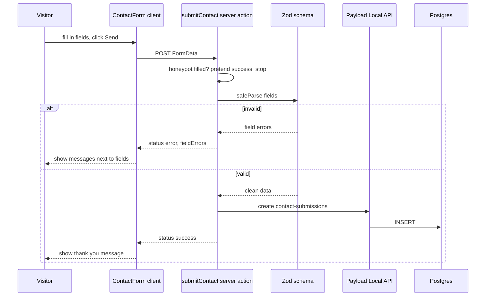

### [Beginner] Step 16 — The Zod schema

**What we're doing:** Describing what a valid contact message looks like.

**Why:** The schema is the single source of truth for validation. The server action uses it, and the tests in Part 8 test it directly.

**Do it:** Check whether Zod is installed (Payload does not require it):

```bash
npm ls zod || npm install zod
```

```ts
// src/utilities/contact-schema.ts
import { z } from 'zod'

export const contactSchema = z.object({
  name: z
    .string()
    .trim()
    .min(2, 'Please enter your name.')
    .max(100, 'Name must be 100 characters or fewer.'),
  email: z.string().trim().toLowerCase().pipe(z.email('Please enter a valid email address.')),
  message: z
    .string()
    .trim()
    .min(10, 'Message must be at least 10 characters.')
    .max(2000, 'Message must be 2000 characters or fewer.'),
  // Honeypot: a hidden field real people never fill in. Bots often do.
  website: z.string().optional(),
})

export type ContactInput = z.infer<typeof contactSchema>
```

**Check it works:** `npx tsc --noEmit` prints nothing.

Guide 1's `ContactSubmissions` collection already validates on the Payload side (name up to 100 characters, a valid email, message between 10 and 5000 characters). The Zod rules match it, except that the form allows at most 2000 characters, a deliberately stricter limit for a public form. Zod must never be looser than Payload, or visitors would pass the friendly check and then hit a confusing database error.

**What just happened:** `.trim()` cleans the value before the length checks, so `"   "` does not count as a name. `.pipe(z.email(...))` first trims and lowercases the string, then checks that the result is an email. `z.infer` creates a TypeScript type from the schema, so the type and the validation can never drift apart.

> **Outdated:** In Zod 3 you wrote `z.string().email()`. Zod 4 introduced top-level format schemas like `z.email()`. The old method still works in Zod 4 but is deprecated. Similarly `error.flatten()` became `z.flattenError(error)`.

### [Intermediate] Step 17 — The server action

**What we're doing:** Writing the function that runs on the server when the form is submitted.

**Why:** This is the trust boundary. Everything before it (the browser) is under the visitor's control. Everything after it (the database) must only receive clean data.

**Do it:** A file marked `'use server'` may only export async functions, so the state type and the initial state live in their own file:

```ts
// src/app/(frontend)/contact/contact-state.ts
export type ContactField = 'name' | 'email' | 'message'

export type ContactState = {
  status: 'idle' | 'success' | 'error'
  message: string
  fieldErrors: Partial<Record<ContactField, string[]>>
  values: Record<ContactField, string>
}

export const emptyValues: Record<ContactField, string> = { name: '', email: '', message: '' }

export const initialContactState: ContactState = {
  status: 'idle',
  message: '',
  fieldErrors: {},
  values: emptyValues,
}
```

```ts
// src/app/(frontend)/contact/actions.ts
'use server'

import { z } from 'zod'
import { contactSchema } from '@/utilities/contact-schema'
import { getPayloadClient } from '@/utilities/payload'
import { emptyValues, type ContactState } from './contact-state'

const SUCCESS_MESSAGE = "Thanks, your message was sent. We'll get back to you soon."

function readText(formData: FormData, key: string): string {
  const value = formData.get(key)
  return typeof value === 'string' ? value : ''
}

export async function submitContact(
  _previousState: ContactState,
  formData: FormData,
): Promise<ContactState> {
  const raw = {
    name: readText(formData, 'name'),
    email: readText(formData, 'email'),
    message: readText(formData, 'message'),
    website: readText(formData, 'website'),
  }
  const values = { name: raw.name, email: raw.email, message: raw.message }

  // 1. Honeypot. A bot filled the hidden field. Pretend it worked so it does not retry.
  if (raw.website.trim() !== '') {
    return { status: 'success', message: SUCCESS_MESSAGE, fieldErrors: {}, values: emptyValues }
  }

  // 2. Validate.
  const result = contactSchema.safeParse(raw)
  if (!result.success) {
    const { fieldErrors } = z.flattenError(result.error)
    return {
      status: 'error',
      message: 'Please fix the highlighted fields.',
      fieldErrors: {
        name: fieldErrors.name,
        email: fieldErrors.email,
        message: fieldErrors.message,
      },
      values,
    }
  }

  // 3. Save.
  try {
    const payload = await getPayloadClient()
    await payload.create({
      collection: 'contact-submissions',
      data: {
        name: result.data.name,
        email: result.data.email,
        message: result.data.message,
      },
    })
  } catch (error) {
    console.error('Failed to save contact submission', error)
    return {
      status: 'error',
      message: 'Sorry, something went wrong on our side. Please try again in a minute.',
      fieldErrors: {},
      values,
    }
  }

  return { status: 'success', message: SUCCESS_MESSAGE, fieldErrors: {}, values: emptyValues }
}
```

**Check it works:** `npx tsc --noEmit` prints nothing. If TypeScript complains that `data` is missing a field, your `ContactSubmissions` collection from guide 1 has another required field; give it a value here or make it optional with a `defaultValue`.

**What just happened:** The action has the signature `(previousState, formData)` because `useActionState` passes the previous state first. It returns a plain object, which React sends back to the browser. We return the visitor's `values` on error so the form can show what they typed instead of clearing it. We never return raw error objects or stack traces to the browser; we log them on the server.

> **Why:** `payload.create` here runs with the Local API's default `overrideAccess: true`, so the collection's access rules are not checked. That is fine because the server action itself is the gatekeeper: it validated the input and only writes the three allowed fields. A visitor cannot sneak in extra fields, because we build `data` ourselves instead of spreading the form data.

> **Gotcha:** A honeypot stops lazy bots only. For a real business site, add rate limiting (for example, at most 5 submissions per IP per hour) or a privacy-friendly CAPTCHA such as Cloudflare Turnstile. Guide 3 mentions where rate limiting fits in production.

### [Intermediate] Step 18 — The client form with useActionState

**What we're doing:** Building the form UI that shows pending, error and success states.

**Why:** Without feedback, visitors click Send three times and you get three submissions. A disabled button while pending and a clear message afterwards fix that.

**Do it:**

```tsx
// src/app/(frontend)/contact/ContactForm.tsx
'use client'

import { useActionState } from 'react'
import { cn } from '@/utilities/cn'
import { submitContact } from './actions'
import { initialContactState, type ContactField } from './contact-state'

const inputClass =
  'mt-1 block w-full rounded-md border border-slate-300 px-3 py-2 text-base shadow-sm focus:border-brand-600 focus:outline-none focus:ring-2 focus:ring-brand-100'

export function ContactForm() {
  const [state, formAction, isPending] = useActionState(submitContact, initialContactState)

  const errorFor = (field: ContactField) => state.fieldErrors[field]?.[0]

  return (
    <form action={formAction} noValidate className="mt-8 space-y-6">
      {state.status === 'success' ? (
        <p role="status" className="rounded-md border border-green-200 bg-green-50 p-4 text-green-800">
          {state.message}
        </p>
      ) : null}
      {state.status === 'error' ? (
        <p role="alert" className="rounded-md border border-red-200 bg-red-50 p-4 text-red-800">
          {state.message}
        </p>
      ) : null}

      <div>
        <label htmlFor="name" className="block text-sm font-medium">
          Name
        </label>
        <input
          id="name"
          name="name"
          type="text"
          autoComplete="name"
          required
          defaultValue={state.values.name}
          aria-invalid={errorFor('name') ? true : undefined}
          aria-describedby={errorFor('name') ? 'name-error' : undefined}
          className={cn(inputClass, errorFor('name') && 'border-red-500')}
        />
        {errorFor('name') ? (
          <p id="name-error" className="mt-1 text-sm text-red-700">
            {errorFor('name')}
          </p>
        ) : null}
      </div>

      <div>
        <label htmlFor="email" className="block text-sm font-medium">
          Email
        </label>
        <input
          id="email"
          name="email"
          type="email"
          autoComplete="email"
          required
          defaultValue={state.values.email}
          aria-invalid={errorFor('email') ? true : undefined}
          aria-describedby={errorFor('email') ? 'email-error' : undefined}
          className={cn(inputClass, errorFor('email') && 'border-red-500')}
        />
        {errorFor('email') ? (
          <p id="email-error" className="mt-1 text-sm text-red-700">
            {errorFor('email')}
          </p>
        ) : null}
      </div>

      <div>
        <label htmlFor="message" className="block text-sm font-medium">
          Message
        </label>
        <textarea
          id="message"
          name="message"
          rows={6}
          required
          defaultValue={state.values.message}
          aria-invalid={errorFor('message') ? true : undefined}
          aria-describedby={errorFor('message') ? 'message-error' : undefined}
          className={cn(inputClass, errorFor('message') && 'border-red-500')}
        />
        {errorFor('message') ? (
          <p id="message-error" className="mt-1 text-sm text-red-700">
            {errorFor('message')}
          </p>
        ) : null}
      </div>

      {/* Honeypot: visually hidden and skipped by keyboard and screen readers. */}
      <div aria-hidden="true" className="absolute -left-[10000px] h-px w-px overflow-hidden">
        <label htmlFor="website">Website</label>
        <input id="website" name="website" type="text" tabIndex={-1} autoComplete="off" />
      </div>

      <button
        type="submit"
        disabled={isPending}
        className="rounded-md bg-brand-600 px-5 py-2.5 font-medium text-white hover:bg-brand-700 disabled:cursor-not-allowed disabled:opacity-60"
      >
        {isPending ? 'Sending...' : 'Send message'}
      </button>
    </form>
  )
}
```

**Check it works:** We need a page to show it. Next step.

**What just happened:** `useActionState(submitContact, initialContactState)` returns three things: the latest state (initially `initialContactState`, then whatever the action returned), a wrapped `formAction` to give to the form, and `isPending`. `noValidate` turns off the browser's built-in validation bubbles so our server messages are the single, consistent source of errors (the `required` and `type="email"` attributes still help mobile keyboards and autofill). `aria-invalid` and `aria-describedby` connect each error message to its input for screen readers.

> **Gotcha:** React 19 resets an uncontrolled form after a form action finishes. That is why we pass `defaultValue={state.values.name}`: after an error, the reset puts the visitor's text back. After success, `values` is empty, so the form clears.

> **Outdated:** Before React 19, this hook was called `useFormState` and lived in `react-dom`. It is now `useActionState` from `react`, and it adds the `isPending` value.

### [Beginner] Step 19 — The contact page

**What we're doing:** A server component page that renders the client form.

**Why:** The page itself has no interactivity, so it stays a server component and is rendered statically. Only the form ships JavaScript.

**Do it:**

```tsx
// src/app/(frontend)/contact/page.tsx
import type { Metadata } from 'next'
import { Container } from '@/components/Container'
import { ContactForm } from './ContactForm'

export const metadata: Metadata = {
  title: 'Contact',
  description: 'Send us a message.',
  alternates: { canonical: '/contact' },
}

export default function ContactPage() {
  return (
    <Container className="py-12 sm:py-16">
      <h1 className="font-serif text-4xl font-semibold tracking-tight">Contact</h1>
      <p className="mt-2 text-slate-600">Questions, ideas, feedback? We read every message.</p>
      <ContactForm />
    </Container>
  )
}
```

**Check it works:** Open `http://localhost:3000/contact`.

1. Click **Send message** with empty fields:

```text
Please fix the highlighted fields.
Name     [            ]  Please enter your name.
Email    [            ]  Please enter a valid email address.
Message  [            ]  Message must be at least 10 characters.
```

2. Fill in `Ada`, `ada@example.com` and `Hello, I love the site!`, then submit. The button shows `Sending...` briefly, then:

```text
Thanks, your message was sent. We'll get back to you soon.
```

The fields are empty again.

**What just happened:** Your first full round trip: browser form, server action, validation, database insert, response, UI update. Open the browser DevTools Network tab and submit again: you will see one POST request to `/contact` with a `Next-Action` header. That header is how Next.js knows which server action to run.

### [Beginner] Step 20 — See submissions in /admin and confirm the public cannot read them

**What we're doing:** Checking that the message was saved, and that only logged-in admins can read it.

**Why:** Contact messages contain personal data (names, emails). Leaking them through the public API would be a privacy incident. In guide 1 you set `ContactSubmissions` access to "anyone can create, only logged-in users can read". Now we verify it.

**Do it:** Open `http://localhost:3000/admin/collections/contact-submissions`. You should see Ada's message with the time it arrived.

Now pretend to be an anonymous visitor and try the REST API:

```bash
curl -s http://localhost:3000/api/contact-submissions
```

**Check it works:**

```text
{"errors":[{"message":"You are not allowed to perform this action."}]}
```

(The exact wording can differ slightly between Payload versions. The important part is that no submissions are returned.)

For reference, the access rules from guide 1 look like this:

```ts
// src/collections/ContactSubmissions.ts (excerpt from guide 1)
access: {
  // Visitors may send a message.
  create: anyone,
  // Only admins may read or delete them.
  read: authenticated,
  delete: authenticated,
  // Nobody edits a customer's message after it was sent.
  update: () => false,
},
```

**What just happened:** The REST API enforces access control, so anonymous reads are blocked. Our server action used the Local API, which bypasses access control, but it only ever creates. You now have two layers of protection: the access rules for the public API, and careful code for the Local API.

> **Interview tip:** If asked "how would you secure a public form?", list the layers: server-side validation (Zod), never trusting client checks, access control on the stored data, spam protection (honeypot, rate limit, CAPTCHA), not leaking internal errors, and logging failures.

## 6. Keep it fresh

Static pages are fast, but they go stale. In this part an editor clicks **Save** in `/admin` and the public page updates within a second, without a rebuild.

### [Intermediate] Step 21 — See the stale content problem with a production build

**What we're doing:** Running the site like production does, and watching it serve old content.

**Why:** You cannot fix a bug you have never seen. Development mode hides caching completely.

**Do it:** Stop `npm run dev` (Ctrl+C), then:

```bash
npm run build
npm run start
```

`npm run build` compiles the site and pre-renders static pages. It needs the database running, because `generateStaticParams` and the static pages query it. At the end it prints a table of routes:

```text
Route (app)                         Size     First Load JS
┌ ○ /                               ...
├ ● /[slug]                         ...
│   └ /about
├ ƒ /blog                           ...
├ ● /blog/[slug]                    ...
│   ├ /blog/welcome-to-our-new-website
│   └ /blog/five-tips-for-choosing-the-right-service
├ ○ /contact                        ...
└ ƒ /admin/[[...segments]]          ...

○  (Static)   prerendered as static content
●  (SSG)      prerendered as static HTML (uses generateStaticParams)
ƒ  (Dynamic)  server-rendered on demand
```

This table confirms the plan from Part 1. Now:

1. Open `http://localhost:3000/about`.
2. In `/admin`, change the About page title to `About us`, and save.
3. Refresh `/about`.

**Check it works (the problem):**

```text
About                     <- still the old title
```

The page stays stale until the next build.

**What just happened:** `/about` was rendered once at build time and stored. Nothing told Next.js that the content changed. We need Payload to tell it.

### [Intermediate] Step 22 — A safe revalidate helper and afterChange hooks

**What we're doing:** Writing Payload **hooks** that call `revalidatePath` whenever a Page or Post is saved or deleted.

**Why:** A **hook** is a function Payload calls at a specific moment in a document's life, for example `beforeChange` (before saving, can modify data) or `afterChange` (after saving, good for side effects). Since Payload runs inside Next.js, an `afterChange` hook can call Next.js's `revalidatePath` directly. No webhook, no secret token, no extra HTTP call.

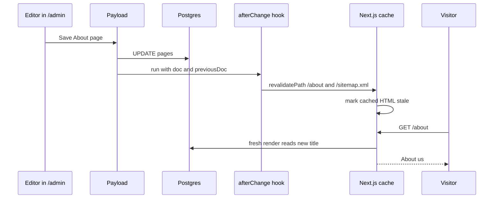

**Do it:** First, a helper. `revalidatePath` only works inside a running Next.js server. Our seed script (from guide 1) runs Payload outside Next.js, where `revalidatePath` throws an error. The helper catches that so seeding still works:

```ts
// src/utilities/revalidate.ts
import { revalidatePath } from 'next/cache'

type Log = (message: string) => void

/** Revalidate each path. Safe to call outside Next.js (seed scripts, migrations). */
export function safeRevalidate(paths: string[], log: Log = console.info): void {
  for (const path of new Set(paths)) {
    try {
      revalidatePath(path)
      log(`Revalidated ${path}`)
    } catch {
      log(`Skipped revalidating ${path} (not running inside Next.js)`)
    }
  }
}
```

Now the hooks for Pages:

```ts
// src/hooks/revalidatePage.ts
import type { CollectionAfterChangeHook, CollectionAfterDeleteHook } from 'payload'
import type { Page } from '@/payload-types'
import { safeRevalidate } from '@/utilities/revalidate'

function pathForPage(slug: string): string {
  return slug === 'home' ? '/' : `/${slug}`
}

export const revalidatePageAfterChange: CollectionAfterChangeHook<Page> = ({
  doc,
  previousDoc,
  req,
  context,
}) => {
  if (context.disableRevalidate) return doc

  const paths = ['/sitemap.xml']
  if (doc.slug) paths.push(pathForPage(doc.slug))
  // If the slug changed, the old URL must stop showing the old page.
  if (previousDoc?.slug && previousDoc.slug !== doc.slug) paths.push(pathForPage(previousDoc.slug))

  safeRevalidate(paths, (message) => req.payload.logger.info(message))
  return doc
}

export const revalidatePageAfterDelete: CollectionAfterDeleteHook<Page> = ({ doc, req, context }) => {
  if (context.disableRevalidate) return doc

  const paths = ['/sitemap.xml']
  if (doc?.slug) paths.push(pathForPage(doc.slug))

  safeRevalidate(paths, (message) => req.payload.logger.info(message))
  return doc
}
```

And for Posts. A post whose `status` is `draft` is invisible to visitors, so saving it should not touch the public site. We only revalidate when the post is published now, or was published before (switching it back to Draft must remove it from the site):

```ts
// src/hooks/revalidatePost.ts
import type { CollectionAfterChangeHook, CollectionAfterDeleteHook } from 'payload'
import type { Post } from '@/payload-types'
import { safeRevalidate } from '@/utilities/revalidate'

// The home page shows the latest posts, so it is affected too.
const LIST_PATHS = ['/', '/blog', '/sitemap.xml']

export const revalidatePostAfterChange: CollectionAfterChangeHook<Post> = ({
  doc,
  previousDoc,
  req,
  context,
}) => {
  if (context.disableRevalidate) return doc

  const isPublished = doc.status === 'published'
  const wasPublished = previousDoc?.status === 'published'
  if (!isPublished && !wasPublished) return doc // draft-only change, nothing public changed

  const paths = [...LIST_PATHS]
  if (doc.slug) paths.push(`/blog/${doc.slug}`)
  if (previousDoc?.slug && previousDoc.slug !== doc.slug) paths.push(`/blog/${previousDoc.slug}`)

  safeRevalidate(paths, (message) => req.payload.logger.info(message))
  return doc
}

export const revalidatePostAfterDelete: CollectionAfterDeleteHook<Post> = ({ doc, req, context }) => {
  if (context.disableRevalidate) return doc

  const paths = [...LIST_PATHS]
  if (doc?.slug) paths.push(`/blog/${doc.slug}`)

  safeRevalidate(paths, (message) => req.payload.logger.info(message))
  return doc
}
```

Register the hooks in the collections. Add the `hooks` key to the existing config objects from guide 1 (keep all your fields as they are):

```ts
// src/collections/Pages.ts (add the import and the hooks key)
import { revalidatePageAfterChange, revalidatePageAfterDelete } from '../hooks/revalidatePage'

export const Pages: CollectionConfig = {
  slug: 'pages',
  // ...access, admin and fields from guide 1 stay unchanged...
  hooks: {
    afterChange: [revalidatePageAfterChange],
    afterDelete: [revalidatePageAfterDelete],
  },
}
```

```ts
// src/collections/Posts.ts (add the import and extend the existing hooks key)
import { revalidatePostAfterChange, revalidatePostAfterDelete } from '../hooks/revalidatePost'

export const Posts: CollectionConfig = {
  slug: 'posts',
  // ...admin, access, defaultSort and fields from guide 1 stay unchanged...
  hooks: {
    beforeChange: [setPublishedAt], // already there from guide 1
    afterChange: [revalidatePostAfterChange],
    afterDelete: [revalidatePostAfterDelete],
  },
}
```

Posts already has a `hooks` key with `beforeChange: [setPublishedAt]`. Add the two new arrays inside it; do not create a second `hooks` key, or the second one silently replaces the first. (The slug formatting hook from `src/fields/slug.ts` is a **field** hook, so it is not affected.)

Finally, tell the seed script to skip revalidation. In guide 1's `src/seed.ts`, every `payload.create` call can take a `context` object. Add it to both calls (the home page and the posts loop):

```ts
// src/seed.ts (excerpt; the posts loop, with the new context line)
await payload.create({
  collection: 'posts',
  data: post,
  context: { disableRevalidate: true },
})
```

The `try/catch` in `safeRevalidate` already makes this safe, so this change is about clean logs, not correctness.

**Check it works:** Hooks are part of the server code, so rebuild and start again:

```bash
npm run build && npm run start
```

1. Open `/about`. Note the title.
2. In `/admin`, change the title and save.
3. In the terminal running `npm run start`, you see:

```text
INFO: Revalidated /sitemap.xml
INFO: Revalidated /about
```

4. Refresh `/about`: the new title appears.
5. Edit your `Draft idea` post with status still **Draft** and save: no "Revalidated" lines appear. Now set status to **Published** and save: you see `/`, `/blog`, `/blog/draft-idea` and `/sitemap.xml` revalidated, and the post appears on the home page and the blog. Set it back to **Draft** afterwards (that revalidates again, because it was published), so later checks still have a draft.

**What just happened:** You built **on-demand revalidation**. Pages stay static (fast, cheap) and only re-render when content actually changes. `context` is Payload's way of passing extra information through an operation to its hooks; `disableRevalidate` is just a name we chose.

> **Interview tip:** Compare the three freshness strategies: dynamic rendering (always fresh, costs a render per visit), time-based ISR with `revalidate = 60` (simple, but up to 60 seconds stale and re-renders even when nothing changed), and on-demand revalidation (fresh within a second, renders only on change, but you must list every affected path). Real projects often combine on-demand with a long time-based fallback, such as `export const revalidate = 3600`, as a safety net in case a path is missed.

> **Gotcha:** It is easy to forget a path. When a post changes, the home page (latest posts), the blog list, the post page and the sitemap all change. When you add a new place that shows posts (an RSS feed, a tag page), add its path to `LIST_PATHS`. An alternative is tag-based revalidation with `revalidateTag`, but it needs tagged cached data; the Payload Local API does not tag its queries for you. Path-based is the simpler place to start.

**If it breaks:**
- `Error: Invariant: static generation store missing in revalidatePath`: `revalidatePath` was called outside a request, which is what `safeRevalidate` catches. If you see it, a hook is calling `revalidatePath` directly.
- Changes show for `/about` but not `/`: the home Page has slug `home`, and `pathForPage` maps it to `/`. Check the slug is exactly `home`.

### [Advanced] Step 23 — Draft mode and live preview (optional)

**What we're doing:** Letting a logged-in editor see a post whose `status` is still `draft` on the real website before publishing, and refreshing that view every time they save in the admin.

**Why:** Editors want to see "how will this look?" without publishing. This is optional. Skip it on your first pass if you like; nothing later depends on it.

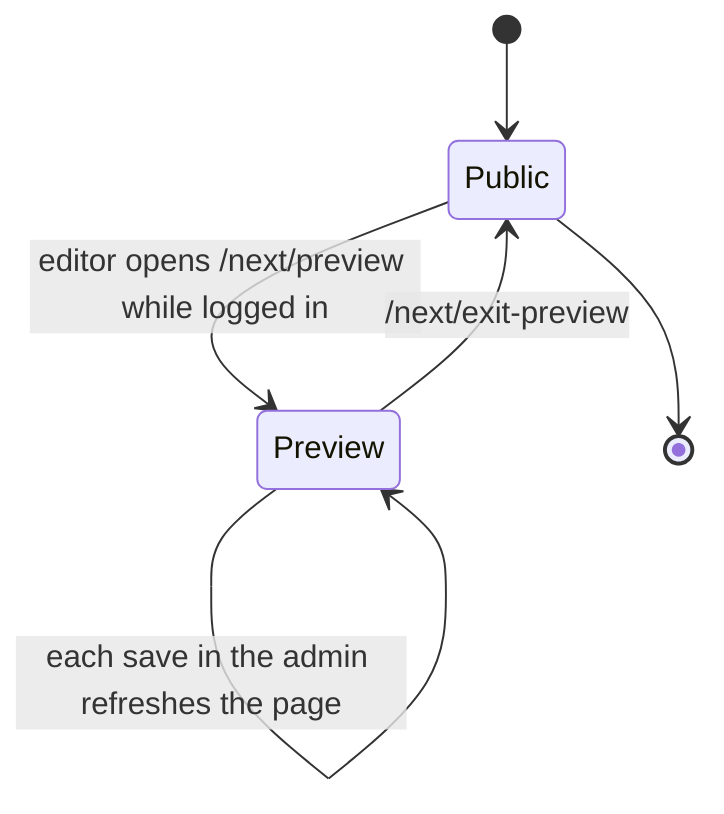

**Do it:** Next.js **draft mode** sets a special cookie. While it is set, pages render dynamically and our code can decide to include posts with status `draft`. Two route handlers turn it on and off. We put them under `/next/...` because `/api/...` belongs to Payload:

```ts
// src/app/(frontend)/next/preview/route.ts
import { draftMode, headers } from 'next/headers'
import { redirect } from 'next/navigation'
import { getPayloadClient } from '@/utilities/payload'

export async function GET(request: Request) {
  const path = new URL(request.url).searchParams.get('path') ?? '/'

  // Only allow redirects to our own site, never to another domain.
  if (!path.startsWith('/') || path.startsWith('//')) {
    return new Response('Invalid path', { status: 400 })
  }

  // Only logged-in Payload users may preview. Payload reads its auth cookie from the headers.
  const payload = await getPayloadClient()
  const { user } = await payload.auth({ headers: await headers() })
  if (!user) {
    return new Response('You must be logged in to preview drafts', { status: 403 })
  }

  const draft = await draftMode()
  draft.enable()
  redirect(path)
}
```

```ts
// src/app/(frontend)/next/exit-preview/route.ts
import { draftMode } from 'next/headers'
import { redirect } from 'next/navigation'

export async function GET() {
  const draft = await draftMode()
  draft.disable()
  redirect('/')
}
```

Install Payload's live preview helper for React (keep the version the same as your `payload` package):

```bash
npm install @payloadcms/live-preview-react
```

```tsx
// src/components/LivePreviewListener.tsx
'use client'

import { RefreshRouteOnSave } from '@payloadcms/live-preview-react'
import { useRouter } from 'next/navigation'

export function LivePreviewListener() {
  const router = useRouter()
  return (
    <RefreshRouteOnSave
      refresh={() => router.refresh()}
      serverURL={process.env.NEXT_PUBLIC_SERVER_URL ?? 'http://localhost:3000'}
    />
  )
}
```

Update the post page to include draft-status posts when draft mode is on. These are the only changes to `src/app/(frontend)/blog/[slug]/page.tsx`:

```tsx
// src/app/(frontend)/blog/[slug]/page.tsx (changes only)
import { draftMode } from 'next/headers'
import { LivePreviewListener } from '@/components/LivePreviewListener'

// inside PostPage, replace the two lines that load the post:
const { isEnabled: isDraft } = await draftMode()
const post = await getPostBySlug(slug, isDraft)
if (!post) notFound()

// and render the listener as the first child of <article>:
{isDraft ? <LivePreviewListener /> : null}
```

Finally, tell the Posts admin where the preview lives. Add this to the existing `admin` key of `Posts.ts`:

```ts
// src/collections/Posts.ts (inside the existing admin: { ... } object)
livePreview: {
  url: ({ data }) =>
    `${process.env.NEXT_PUBLIC_SERVER_URL}/next/preview?path=${encodeURIComponent(`/blog/${data?.slug ?? ''}`)}`,
},
preview: (data) =>
  `${process.env.NEXT_PUBLIC_SERVER_URL}/next/preview?path=${encodeURIComponent(`/blog/${data?.slug ?? ''}`)}`,
```

These are admin settings only, so no migration is needed.

**Check it works:** In `npm run dev`, open your `Draft idea` post in `/admin` and click the **Live Preview** button (an eye icon or a "Live Preview" tab at the top; the exact UI differs by version). The website appears in a side panel even though the post is a draft. Change the title and click **Save**: the preview refreshes with the new title. In a normal, logged-out browser window, `/blog/draft-idea` still returns 404. Visit `/next/exit-preview` to leave draft mode in your own browser.

**What just happened:** The preview route checks the Payload login cookie, enables Next.js draft mode, and redirects to the post. Because draft mode is on, the page calls `getPostBySlug(slug, true)`, which drops the `status = published` filter. `RefreshRouteOnSave` listens for "document saved" messages from the admin window and calls `router.refresh()`, which re-runs the server components and reads the saved post.

> **Interview tip:** Our posts use a plain `status` select, so a "draft" is just a normal saved document that public queries filter out. Preview is therefore simple: drop the filter for logged-in editors. Payload's built-in versions and drafts add version history and autosave (which lets live preview update as you type), at the cost of more tables and an extra concept to learn.

> **Gotcha:** Live preview loads your site in an iframe inside the admin. If you later add a strict `Content-Security-Policy` or `X-Frame-Options: DENY` header, the preview panel goes blank. Allow your own origin with `frame-ancestors 'self'`.

## 7. Polish

The site works. Now we make the unhappy paths pleasant (slow loads, errors, missing pages) and help search engines and social networks understand the site.

Next.js uses **special file names** for these. You do not import them; Next.js finds them by name and wraps your pages:

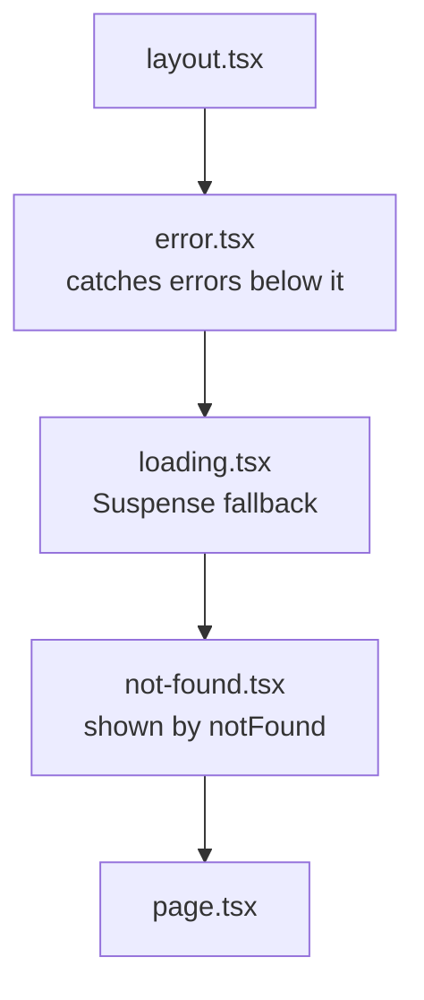

### [Beginner] Step 24 — loading.tsx for the blog list

**What we're doing:** Showing a skeleton while the dynamic blog list loads.

**Why:** `/blog` is rendered on every request. If the database is slow, the visitor stares at the old page after clicking. A `loading.tsx` file shows something instantly.

**Do it:**

```tsx
// src/app/(frontend)/blog/loading.tsx
import { Container } from '@/components/Container'

export default function BlogLoading() {
  return (
    <Container className="py-12 sm:py-16">
      <p className="sr-only" role="status">
        Loading posts
      </p>
      <div className="h-10 w-40 animate-pulse rounded bg-slate-200" />
      <div className="mt-8 grid gap-6 sm:grid-cols-2">
        {Array.from({ length: 4 }, (_, index) => (
          <div key={index} className="h-64 animate-pulse rounded-lg bg-slate-100" />
        ))}
      </div>
    </Container>
  )
}
```

**Check it works:** Hard to see on a fast laptop. To test, temporarily add `await new Promise((r) => setTimeout(r, 2000))` at the top of `BlogPage`, click **Blog** in the header, and watch the grey boxes appear for two seconds. Remove the delay afterwards.

**What just happened:** Next.js wraps `page.tsx` in a React `<Suspense>` boundary with `loading.tsx` as the fallback, and **streams** the page: the layout and skeleton are sent first, the real content follows when ready. We put it under `blog/` only. Static pages are already instant, so a root-level `loading.tsx` would add nothing there.

### [Beginner] Step 25 — error.tsx

**What we're doing:** Showing a friendly message, with a retry button, when something throws while rendering.

**Why:** Without it, an unexpected error (database down, a bug) shows Next.js's bare default error screen.

**Do it:** Error boundaries must be client components, because "try again" needs a click handler:

```tsx
// src/app/(frontend)/error.tsx
'use client'

import { useEffect } from 'react'
import { Container } from '@/components/Container'

type ErrorProps = {
  error: Error & { digest?: string }
  reset: () => void
}

export default function FrontendError({ error, reset }: ErrorProps) {
  useEffect(() => {
    // In guide 3 this is where an error tracker (Sentry and similar) would report it.
    console.error(error)
  }, [error])

  return (
    <Container className="py-24 text-center">
      <h1 className="font-serif text-3xl font-semibold">Something went wrong</h1>
      <p className="mt-4 text-slate-600">Sorry about that. Please try again.</p>
      {error.digest ? <p className="mt-2 text-xs text-slate-400">Error reference: {error.digest}</p> : null}
      <button
        type="button"
        onClick={() => reset()}
        className="mt-8 rounded-md bg-brand-600 px-5 py-2.5 font-medium text-white hover:bg-brand-700"
      >
        Try again
      </button>
    </Container>
  )
}
```

**Check it works:** Stop Postgres with `docker compose stop db`, then open `/blog` in `npm run dev`. In development Next.js shows its red error overlay first; close it, and you see "Something went wrong". In a production build you see only the friendly page. Start the database again with `docker compose start db` and click **Try again**.

**What just happened:** `error.tsx` catches errors in the pages and nested layouts **below** it, but not in the layout at the same level, because the boundary sits inside that layout. The `digest` is a hash Next.js attaches in production; the real error message is hidden from visitors (it could contain secrets) and the digest lets you find the matching server log line.

> **Gotcha:** To catch errors in the root layout itself you need `global-error.tsx`, which must render its own `<html>` and `<body>`. For this site, `error.tsx` is enough. Newer Next.js 16 releases may also pass an extra retry helper to error boundaries; `reset` still works.

### [Beginner] Step 26 — not-found.tsx

**What we're doing:** A designed 404 page.

**Why:** Every `notFound()` call in our pages renders this. A helpful 404 with links keeps visitors on the site.

**Do it:**

```tsx
// src/app/(frontend)/not-found.tsx
import Link from 'next/link'
import { Container } from '@/components/Container'

export default function NotFound() {
  return (
    <Container className="py-24 text-center">
      <p className="text-sm font-semibold uppercase tracking-wide text-brand-700">404</p>
      <h1 className="mt-2 font-serif text-4xl font-semibold">Page not found</h1>
      <p className="mt-4 text-slate-600">The page you are looking for does not exist or has moved.</p>
      <div className="mt-8 flex justify-center gap-4">
        <Link href="/" className="rounded-md bg-brand-600 px-5 py-2.5 font-medium text-white hover:bg-brand-700">
          Go home
        </Link>
        <Link href="/blog" className="rounded-md border border-slate-300 px-5 py-2.5 font-medium hover:bg-slate-50">
          Read the blog
        </Link>
      </div>
    </Container>
  )
}
```

**Check it works:** Open `/nope` and `/blog/nope`. Both show the designed page inside the normal header and footer, and DevTools Network shows status `404`.

**What just happened:** `not-found.tsx` renders inside the `(frontend)` layout, so the header and footer stay. The HTTP status is still 404, which matters for search engines: a "not found" page that returns 200 is called a **soft 404** and confuses crawlers.

> **Gotcha:** Because our app has two root layouts (`(frontend)` and `(payload)`) and no `src/app/layout.tsx`, a URL that matches **no route at all** (for example `/a/b/c`) shows Next.js's plain default 404, not ours. Single-segment URLs are fine because `[slug]` catches them and calls `notFound()`. Next.js has a `global-not-found.tsx` file for this case behind an experimental flag (`experimental.globalNotFound`); check the docs for your version if you need it.

### [Beginner] Step 27 — Metadata and a default Open Graph image

**What we're doing:** Reviewing how metadata flows, and generating a default share image.

**Why:** When someone shares your link, Slack or LinkedIn fetches the page and reads Open Graph tags (`og:title`, `og:image`) to build the preview card. Without an image, the card is a sad grey box.

**Do it:** You already have:

- Defaults in `(frontend)/layout.tsx`: `metadataBase`, a title template, description, `openGraph.siteName`.
- Per-page overrides in each `generateMetadata` or `metadata` export.
- Post pages use the cover image as `og:image`.

Next.js merges them: the deepest segment wins for each key. Add a generated default image for every page that does not set its own:

```tsx
// src/app/(frontend)/opengraph-image.tsx
import { ImageResponse } from 'next/og'
import { siteConfig } from '@/utilities/site'

export const alt = siteConfig.name
export const size = { width: 1200, height: 630 }
export const contentType = 'image/png'

export default function OpenGraphImage() {
  return new ImageResponse(
    (
      <div
        style={{
          width: '100%',
          height: '100%',
          display: 'flex',
          flexDirection: 'column',
          justifyContent: 'center',
          padding: 80,
          background: '#eef5ff',
          color: '#142a63',
        }}
      >
        <div style={{ fontSize: 80, fontWeight: 700 }}>{siteConfig.name}</div>
        <div style={{ fontSize: 36, marginTop: 24, color: '#1c44ab' }}>{siteConfig.description}</div>
      </div>
    ),
    size,
  )
}
```

**Check it works:** Open `http://localhost:3000/opengraph-image` (Next.js may add a short hash to the URL; view the home page source and copy the `og:image` URL). You see a 1200 by 630 PNG with the site name. View the home page source:

```text
<meta property="og:image" content="http://localhost:3000/opengraph-image?..."/>
<meta property="og:image:width" content="1200"/>
<meta property="og:image:height" content="630"/>
```

**What just happened:** `opengraph-image.tsx` is another special file. `ImageResponse` turns a small piece of JSX (with inline styles and flexbox only, no Tailwind) into a PNG at build time. Because it sits at the `(frontend)` root, every page inherits it unless it sets `openGraph.images` itself, as our post pages do.

> **Interview tip:** `title.template` (`'%s | My Site'`) plus `metadataBase` is the two-line answer to "how do you manage SEO metadata in the App Router?". Then mention `generateMetadata` for dynamic pages and `alternates.canonical` to avoid duplicate-content issues (for example `/blog?page=1` versus `/blog`).

### [Beginner] Step 28 — sitemap.ts and robots.ts

**What we're doing:** Generating `/sitemap.xml` (a list of all public URLs) and `/robots.txt` (rules for crawlers).

**Why:** A sitemap helps search engines find every page, including new posts, quickly. `robots.txt` tells them what not to crawl, like `/admin`.

**Do it:** These live at the very top of `src/app`, outside both route groups:

```ts
// src/app/sitemap.ts
import type { MetadataRoute } from 'next'
import { getAllPages, getAllPublishedPosts } from '@/utilities/queries'
import { siteConfig } from '@/utilities/site'

// Refreshed on demand by our hooks; this hourly fallback is a safety net.
export const revalidate = 3600

export default async function sitemap(): Promise<MetadataRoute.Sitemap> {
  const base = siteConfig.url
  const [pages, posts] = await Promise.all([getAllPages(), getAllPublishedPosts()])

  const pageEntries: MetadataRoute.Sitemap = pages
    .filter((page) => typeof page.slug === 'string' && page.slug.length > 0)
    .map((page) => ({
      url: page.slug === 'home' ? `${base}/` : `${base}/${page.slug}`,
      lastModified: page.updatedAt,
      changeFrequency: 'monthly',
      priority: page.slug === 'home' ? 1 : 0.7,
    }))

  const postEntries: MetadataRoute.Sitemap = posts
    .filter((post) => typeof post.slug === 'string' && post.slug.length > 0)
    .map((post) => ({
      url: `${base}/blog/${post.slug}`,
      lastModified: post.updatedAt,
      changeFrequency: 'weekly',
      priority: 0.6,
    }))

  return [
    ...pageEntries,
    { url: `${base}/blog`, changeFrequency: 'daily', priority: 0.8 },
    { url: `${base}/contact`, changeFrequency: 'yearly', priority: 0.3 },
    ...postEntries,
  ]
}
```

```ts
// src/app/robots.ts
import type { MetadataRoute } from 'next'
import { siteConfig } from '@/utilities/site'

export default function robots(): MetadataRoute.Robots {
  return {
    rules: [
      {
        userAgent: '*',
        allow: '/',
        disallow: ['/admin', '/api/', '/next/'],
      },
    ],
    sitemap: `${siteConfig.url}/sitemap.xml`,
  }
}
```

**Check it works:**

```bash
curl -s http://localhost:3000/robots.txt
curl -s http://localhost:3000/sitemap.xml | head -n 12
```

```text
User-Agent: *
Allow: /
Disallow: /admin
Disallow: /api/
Disallow: /next/

Sitemap: http://localhost:3000/sitemap.xml

<?xml version="1.0" encoding="UTF-8"?>
<urlset xmlns="http://www.sitemaps.org/schemas/sitemap/0.9">
<url>
<loc>http://localhost:3000/</loc>
<lastmod>2026-10-01T09:30:00.000Z</lastmod>
...
```

Your `Draft idea` post must not be in the sitemap.

**What just happened:** Both files are **metadata route handlers**: Next.js calls the function and serializes the result into XML or plain text. The sitemap uses the same data functions as the pages, so it automatically includes new published posts and skips drafts. Our hooks already revalidate `/sitemap.xml` on every content change.

> **Gotcha:** `robots.txt` is a polite request, not security. Bad bots ignore it. `/admin` is protected by Payload's login, not by robots rules. Also, `siteConfig.url` comes from `NEXT_PUBLIC_SERVER_URL`; in production it must be your real domain, or the sitemap will list `localhost` URLs. Guide 3 sets it.

### [Beginner] Step 29 — Accessibility checklist

**What we're doing:** Walking through the site with a short checklist.

**Why:** About one in six people lives with some form of disability. Accessible sites are also easier for everyone to use, rank better, and are a legal requirement in many places.

**Do it:** Go through this list. Each item tells you what to do and where we already handled it:

| Check | How to test | Where we handled it |
|---|---|---|
| Page language set | View source: `<html lang="en">` | `layout.tsx` |
| Skip link | Load a page, press Tab once | `layout.tsx` |
| One `h1` per page, headings in order | Browser extension "HeadingsMap" or DevTools Accessibility tree | every page |
| Visible keyboard focus | Tab through the whole page; you always see where you are | `:focus-visible` in `globals.css` |
| Current page announced | Screen reader says "current page" on the active nav link | `NavLink` `aria-current` |
| Images have alt text | Media `alt` field is required in Payload; decorative images get `alt=""` | `CmsImage` |
| Form labels | Click a label: its input gets focus | `ContactForm` |
| Errors linked to inputs | Errors use `aria-describedby`, invalid fields `aria-invalid` | `ContactForm` |
| Status messages announced | Success uses `role="status"`, errors `role="alert"` | `ContactForm` |
| Colour contrast at least 4.5:1 for text | Lighthouse or DevTools colour picker | brand colours chosen dark enough |
| Works at 200% zoom and on a phone | Ctrl and + twice; DevTools device toolbar at 375px wide | Tailwind responsive classes |
| Respects reduced motion | OS setting "reduce motion" | we only use `animate-pulse`; add `motion-reduce:animate-none` if you add more |

Try one real screen reader for five minutes: VoiceOver on macOS (Cmd + F5) or NVDA on Windows (free). Navigate the home page and submit the contact form with the keyboard only.

**Check it works:** You can complete the contact form, from the address bar to the success message, using only Tab, Shift+Tab, typing and Enter.

**What just happened:** Most accessibility comes from using the right HTML element (`button`, `a`, `label`, `nav`, `main`, `h1`) rather than `div`s with click handlers. ARIA attributes fill the few gaps HTML cannot express, such as "this is the current page".

### [Beginner] Step 30 — Run Lighthouse

**What we're doing:** Measuring performance, accessibility, best practices and SEO with Lighthouse.

**Why:** Lighthouse gives you numbers to compare before and after a change. Always measure a **production** build; development mode is deliberately unoptimized and scores badly.

**Do it:**

```bash
npm run build && npm run start
```

Open `http://localhost:3000` in Chrome, open DevTools (F12), choose the **Lighthouse** tab, select Mobile, tick all categories, and click **Analyze page load**. Use an Incognito window so browser extensions do not skew the results. Repeat for a blog post.

You can also run it from the terminal:

```bash
npx lighthouse http://localhost:3000/blog/welcome-to-our-new-website --view
```

**Check it works:** You should see scores in the 90s for Accessibility, Best Practices and SEO. Performance on a local machine varies; aim for 90+. Typical findings and fixes:

```text
Largest Contentful Paint image was lazily loaded   -> pass eager to that CmsImage
Image elements do not have explicit width/height   -> make sure Media has width/height
Links do not have descriptive text                 -> avoid "click here"
Background and foreground colors lack contrast     -> darken the text colour
```

**What just happened:** Lighthouse simulated a mid-range phone on a slow network and measured Core Web Vitals such as **LCP** (how fast the main content appears) and **CLS** (how much the layout jumps). Most of our good scores come from earlier decisions: static rendering, `next/image` with sizes, `next/font`, and very little client JavaScript.

> **Gotcha:** Lighthouse scores on `localhost` are only a rough guide. Real users on real networks matter more. Guide 3 shows how to look at field data after deployment.

## 8. Quality: linting, formatting and tests

A website that works today can break tomorrow when you change one line. Automated checks catch that before visitors do. Guide 3 runs all of these automatically on every push.

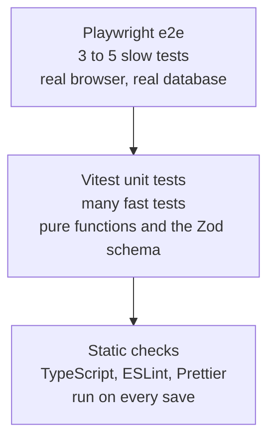

Read the pyramid from the bottom up: lots of cheap checks at the base, a few expensive ones at the top.

### [Beginner] Step 31 — ESLint and Prettier

**What we're doing:** Setting up **ESLint** (finds likely bugs and bad patterns) and **Prettier** (formats code consistently).

**Why:** ESLint catches things like a missing `key` in a list or a hook called conditionally. Prettier ends all arguments about tabs, quotes and line length. Together they make code reviews about logic, not style.

**Do it:** The Payload template already includes ESLint. Make sure the Next.js config and Prettier pieces are installed:

```bash
npm install -D eslint eslint-config-next prettier eslint-config-prettier
```

Keep `eslint-config-next` on the same major version as `next`. Replace the template's `eslint.config.mjs` with this **flat config** (the modern ESLint config format, an array of config objects):

```js
// eslint.config.mjs
import { defineConfig, globalIgnores } from 'eslint/config'
import nextVitals from 'eslint-config-next/core-web-vitals'
import nextTs from 'eslint-config-next/typescript'
import prettier from 'eslint-config-prettier/flat'

export default defineConfig([
  ...nextVitals,
  ...nextTs,
  prettier, // last: turns off ESLint rules that fight with Prettier
  globalIgnores([
    '.next/**',
    'node_modules/**',
    'src/migrations/**',
    'src/payload-types.ts',
    'src/app/(payload)/**',
    'playwright-report/**',
    'test-results/**',
  ]),
])
```

We ignore generated files (`payload-types.ts`, migrations, the `(payload)` folder that Payload generates) because you do not edit them by hand.

Now Prettier:

```json
// .prettierrc.json
{
  "semi": false,
  "singleQuote": true,
  "trailingComma": "all",
  "printWidth": 100
}
```

JSON files cannot contain comments, so do not copy the first line into the file; it only tells you the path. Then:

```text
# .prettierignore
.next
node_modules
src/migrations
src/payload-types.ts
src/app/(payload)
playwright-report
test-results
```

Guide 1 already added `"lint": "eslint ."` to `package.json`. Add the two Prettier scripts next to it (Step 35 shows the full scripts block):

```json
"format": "prettier --write .",
"format:check": "prettier --check ."
```

**Check it works:**

```bash
npm run lint
npm run format:check
```

```text
(lint prints nothing when there are no problems)
Checking formatting...
All matched files use Prettier code style!
```

If `format:check` lists files, run `npm run format` once to fix them all.

**What just happened:** ESLint now runs the Next.js rule sets: React hooks rules, `next/image` and `next/link` best practices, accessibility basics, and TypeScript rules. `eslint-config-prettier` disables every formatting rule, so ESLint judges code quality and Prettier owns formatting.

> **Outdated:** Next.js 16 removed the `next lint` command and the `eslint` option in `next.config`. Run the ESLint CLI directly (`eslint .`). Old `.eslintrc.json` files with `"extends": "next/core-web-vitals"` belong to the legacy config format.

### [Beginner] Step 32 — Vitest unit tests for the helpers

**What we're doing:** Testing the pure helpers from Part 4 with **Vitest**, a fast test runner with a Jest-compatible API.

**Why:** These functions decide what visitors see ("3 min read", "October 6, 2026", which page of posts). Tests pin down their behaviour, including weird inputs, so a future refactor cannot silently break them.

**Do it:** The Payload template may already include Vitest with a `vitest.config.mts` for integration tests. Either way, install what we need:

```bash
npm install -D vitest vite-tsconfig-paths
```

Replace (or create) the config:

```ts
// vitest.config.mts
import tsconfigPaths from 'vite-tsconfig-paths'
import { defineConfig } from 'vitest/config'

export default defineConfig({
  plugins: [tsconfigPaths()], // understands the @/ alias from tsconfig.json
  test: {
    environment: 'node',
    include: ['tests/unit/**/*.test.ts'],
  },
})
```

The `include` keeps Vitest away from the Playwright files in `tests/e2e`.

```ts
// tests/unit/slugify.test.ts
import { describe, expect, it } from 'vitest'
import { slugify } from '@/utilities/slugify'

describe('slugify', () => {
  it.each([
    ['Hello, World!', 'hello-world'],
    ['Café Déjà Vu', 'cafe-deja-vu'],
    // guide 1's slugify removes underscores instead of turning them into dashes.
    // This test documents that choice, so changing it is a deliberate decision.
    ['snake_case  me', 'snakecase-me'],
    ['  --Already--slugged--  ', 'already-slugged'],
    ['Next.js 16 & Payload 3', 'nextjs-16-payload-3'],
    ['', ''],
  ])('slugify(%j) returns %j', (input, expected) => {
    expect(slugify(input)).toBe(expected)
  })
})
```

```ts
// tests/unit/reading-time.test.ts
import { describe, expect, it } from 'vitest'
import {
  countWords,
  formatReadingTime,
  lexicalToPlainText,
  readingTimeMinutes,
} from '@/utilities/reading-time'

const lexicalDoc = {
  root: {
    type: 'root',
    children: [
      {
        type: 'heading',
        tag: 'h2',
        children: [{ type: 'text', text: 'Getting started' }],
      },
      {
        type: 'paragraph',
        children: [
          { type: 'text', text: 'Hello' },
          { type: 'text', text: 'world, this is Payload.' },
        ],
      },
    ],
  },
}

describe('lexicalToPlainText', () => {
  it('collects text from nested nodes in order', () => {
    expect(lexicalToPlainText(lexicalDoc)).toBe('Getting started Hello world, this is Payload.')
  })

  it('returns an empty string for missing or invalid values', () => {
    expect(lexicalToPlainText(null)).toBe('')
    expect(lexicalToPlainText(undefined)).toBe('')
    expect(lexicalToPlainText({})).toBe('')
    expect(lexicalToPlainText('not rich text')).toBe('')
  })
})

describe('countWords', () => {
  it('counts words separated by any whitespace', () => {
    expect(countWords('  one two\n\tthree  ')).toBe(3)
  })

  it('returns 0 for empty text', () => {
    expect(countWords('')).toBe(0)
    expect(countWords('   ')).toBe(0)
  })
})

describe('readingTimeMinutes', () => {
  const words = (n: number) => Array.from({ length: n }, () => 'word').join(' ')

  it('is at least 1 minute, even for empty text', () => {
    expect(readingTimeMinutes('')).toBe(1)
  })

  it('rounds up partial minutes at 200 words per minute', () => {
    expect(readingTimeMinutes(words(200))).toBe(1)
    expect(readingTimeMinutes(words(201))).toBe(2)
    expect(readingTimeMinutes(words(450))).toBe(3)
  })

  it('accepts a custom reading speed', () => {
    expect(readingTimeMinutes(words(250), 100)).toBe(3)
  })
})

describe('formatReadingTime', () => {
  it('formats minutes as a label', () => {
    expect(formatReadingTime(4)).toBe('4 min read')
  })
})
```

```ts
// tests/unit/format-date.test.ts
import { describe, expect, it } from 'vitest'
import { formatDate } from '@/utilities/format-date'

describe('formatDate', () => {
  it('formats an ISO date as a long US date', () => {
    expect(formatDate('2026-10-06T09:30:00.000Z')).toBe('October 6, 2026')
  })

  it('uses UTC, so late-evening UTC times do not shift the day', () => {
    expect(formatDate('2026-10-06T23:59:00.000Z')).toBe('October 6, 2026')
  })

  it('returns an empty string for missing or invalid input', () => {
    expect(formatDate(null)).toBe('')
    expect(formatDate(undefined)).toBe('')
    expect(formatDate('not a date')).toBe('')
  })
})
```

```ts
// tests/unit/pagination-and-media.test.ts
import { describe, expect, it } from 'vitest'
import { toImageSrc } from '@/utilities/media'
import { pageHref, parsePageParam } from '@/utilities/pagination'

describe('parsePageParam', () => {
  const cases: Array<[string | string[] | undefined, number]> = [
    [undefined, 1],
    ['3', 3],
    [['2', '5'], 2],
    ['abc', 1],
    ['-4', 1],
    ['0', 1],
    ['2.5', 1],
  ]

  it.each(cases)('parsePageParam(%j) returns %d', (input, expected) => {
    expect(parsePageParam(input)).toBe(expected)
  })
})

describe('pageHref', () => {
  it('uses the clean URL for page 1 and ?page=N after that', () => {
    expect(pageHref('/blog', 1)).toBe('/blog')
    expect(pageHref('/blog', 2)).toBe('/blog?page=2')
  })
})

describe('toImageSrc', () => {
  const server = 'http://localhost:3000'

  it('strips our own origin', () => {
    expect(toImageSrc(`${server}/api/media/file/cat.jpg`, server)).toBe('/api/media/file/cat.jpg')
  })

  it('keeps relative and remote URLs unchanged', () => {
    expect(toImageSrc('/api/media/file/cat.jpg', server)).toBe('/api/media/file/cat.jpg')
    expect(toImageSrc('https://bucket.s3.amazonaws.com/cat.jpg', server)).toBe(
      'https://bucket.s3.amazonaws.com/cat.jpg',
    )
  })

  it('returns null for a missing URL', () => {
    expect(toImageSrc(null, server)).toBeNull()
  })
})
```

Guide 1 already added `"test": "vitest run"`. Add a watch-mode script next to it:

```json
"test:watch": "vitest"
```

**Check it works:**

```bash
npm test
```

```text
 ✓ tests/unit/slugify.test.ts (6 tests)
 ✓ tests/unit/reading-time.test.ts (8 tests)
 ✓ tests/unit/format-date.test.ts (3 tests)
 ✓ tests/unit/pagination-and-media.test.ts (11 tests)

 Test Files  4 passed (4)
      Tests  28 passed (28)
```

(Exact counts and layout depend on your Vitest version.) Now break something on purpose: change `200` to `250` in `readingTimeMinutes`, run `npm test` again, and watch the reading time tests fail with a clear "expected 2, received 1" message. Change it back.

**What just happened:** `vitest run` runs every test once and exits with code 0 (pass) or 1 (fail), which is what CI needs. `vitest` without `run` watches files and re-runs affected tests as you save. `it.each` runs the same test with a table of inputs, a compact way to cover many edge cases.

**If it breaks:**
- `Failed to resolve import "@/utilities/slugify"`: the `tsconfigPaths()` plugin is missing from `vitest.config.mts`.
- Date test fails with a different format: your Node.js was built without full ICU data (rare; official Node 22 builds include it).

### [Beginner] Step 33 — Unit tests for the Zod schema

**What we're doing:** Testing the contact form's validation rules without a browser or a database.

**Why:** The schema is the security gate of the only public write path on the site. If someone loosens a rule by accident, a test should shout.

**Do it:**

```ts
// tests/unit/contact-schema.test.ts
import { describe, expect, it } from 'vitest'
import { z } from 'zod'
import { contactSchema } from '@/utilities/contact-schema'

const valid = {
  name: 'Ada Lovelace',
  email: 'ada@example.com',
  message: 'Hello, I would like to know more.',
}

function fieldErrors(input: unknown) {
  const result = contactSchema.safeParse(input)
  if (result.success) return {}
  return z.flattenError(result.error).fieldErrors
}

describe('contactSchema', () => {
  it('accepts a valid message', () => {
    expect(contactSchema.safeParse(valid).success).toBe(true)
  })

  it('trims all fields and lowercases the email', () => {
    const result = contactSchema.parse({
      name: '  Ada  ',
      email: '  Ada@Example.COM ',
      message: '  Hello, I would like to know more.  ',
    })
    expect(result).toEqual({
      name: 'Ada',
      email: 'ada@example.com',
      message: 'Hello, I would like to know more.',
    })
  })

  it('rejects a name that is only whitespace', () => {
    expect(fieldErrors({ ...valid, name: '     ' }).name).toEqual(['Please enter your name.'])
  })

  it('rejects an invalid email', () => {
    expect(fieldErrors({ ...valid, email: 'not-an-email' }).email).toEqual([
      'Please enter a valid email address.',
    ])
  })

  it('rejects a message that is too short or too long', () => {
    expect(fieldErrors({ ...valid, message: 'Hi' }).message).toEqual([
      'Message must be at least 10 characters.',
    ])
    expect(fieldErrors({ ...valid, message: 'a'.repeat(2001) }).message).toEqual([
      'Message must be 2000 characters or fewer.',
    ])
  })

  it('reports every invalid field at once', () => {
    const errors = fieldErrors({ name: '', email: '', message: '' })
    expect(Object.keys(errors).sort()).toEqual(['email', 'message', 'name'])
  })

  it('treats the honeypot field as optional', () => {
    expect(contactSchema.safeParse({ ...valid, website: '' }).success).toBe(true)
    expect(contactSchema.safeParse(valid).success).toBe(true)
  })
})
```

**Check it works:**

```bash
npm test -- contact-schema
```

```text
 ✓ tests/unit/contact-schema.test.ts (7 tests)

 Test Files  1 passed (1)
      Tests  7 passed (7)
```

**What just happened:** Passing a word after `--` filters tests by file name. We tested behaviour (what errors a visitor sees) rather than Zod's internals. The "every invalid field at once" test protects the user experience: visitors see all problems in one go instead of fixing them one by one.

> **Interview tip:** Why test the schema rather than the server action? The action depends on Payload and a database, which makes tests slow and fiddly. The schema holds the rules and is pure. Test the logic cheaply in unit tests, then cover the full wiring once with an end-to-end test.

### [Intermediate] Step 34 — Playwright end-to-end tests with the seeded database

**What we're doing:** Writing three **end-to-end (e2e)** tests that drive a real browser against the real app and database: the home page loads, a blog post opens, the contact form submits.

**Why:** Unit tests prove the pieces work. E2E tests prove the pieces work **together**: routing, database, rendering, server actions, hydration.

**Do it:** Install Playwright and a browser:

```bash
npm install -D @playwright/test
npx playwright install chromium
```

On Linux (and in CI), use `npx playwright install --with-deps chromium` to also install the system libraries the browser needs.

```ts
// playwright.config.ts
import { defineConfig, devices } from '@playwright/test'

const PORT = 3000
const baseURL = `http://localhost:${PORT}`

export default defineConfig({
  testDir: './tests/e2e',
  fullyParallel: true,
  forbidOnly: Boolean(process.env.CI),
  retries: process.env.CI ? 2 : 0,
  reporter: process.env.CI ? 'github' : 'list',
  use: {
    baseURL,
    trace: 'on-first-retry',
  },
  projects: [{ name: 'chromium', use: { ...devices['Desktop Chrome'] } }],
  webServer: {
    // A production build: realistic, and no slow first-time compilation during tests.
    command: 'npm run build && npm run start',
    url: baseURL,
    reuseExistingServer: !process.env.CI,
    timeout: 300_000,
  },
})
```

The tests depend on the seeded content, so they only check things the seed guarantees: a home page exists, at least one published post exists, and the contact form exists.

```ts
// tests/e2e/site.spec.ts
import { expect, test } from '@playwright/test'

test('home page loads with header, heading and latest posts', async ({ page }) => {
  const response = await page.goto('/')
  expect(response?.status()).toBe(200)

  await expect(page.getByRole('link', { name: 'My Site' })).toBeVisible()
  await expect(page.getByRole('heading', { level: 1 })).toBeVisible()
  await expect(page.getByRole('heading', { name: 'Latest posts' })).toBeVisible()
})

test('a blog post opens from the blog list', async ({ page }) => {
  await page.goto('/blog')

  const firstPostLink = page.getByRole('article').first().getByRole('link')
  const title = (await firstPostLink.textContent())?.trim() ?? ''
  expect(title).not.toBe('')

  await firstPostLink.click()

  await expect(page).toHaveURL(/\/blog\/[a-z0-9-]+$/)
  await expect(page.getByRole('heading', { level: 1, name: title })).toBeVisible()
  await expect(page.getByText(/\d+ min read/)).toBeVisible()
})

test('unknown pages return the designed 404', async ({ page }) => {
  const response = await page.goto('/this-page-does-not-exist')
  expect(response?.status()).toBe(404)
  await expect(page.getByRole('heading', { name: 'Page not found' })).toBeVisible()
})
```

```ts
// tests/e2e/contact.spec.ts
import { expect, test } from '@playwright/test'

test('shows validation errors for an empty form', async ({ page }) => {
  await page.goto('/contact')
  await page.getByRole('button', { name: 'Send message' }).click()

  await expect(page.getByText('Please fix the highlighted fields.')).toBeVisible()
  await expect(page.getByText('Please enter your name.')).toBeVisible()
  await expect(page.getByLabel('Name')).toHaveAttribute('aria-invalid', 'true')
})

test('submits the contact form', async ({ page }) => {
  await page.goto('/contact')

  await page.getByLabel('Name').fill('Playwright Test')
  await page.getByLabel('Email').fill('e2e@example.com')
  await page.getByLabel('Message').fill('This message was sent by an automated test.')
  await page.getByRole('button', { name: 'Send message' }).click()

  await expect(page.getByText("Thanks, your message was sent. We'll get back to you soon.")).toBeVisible()
  await expect(page.getByLabel('Name')).toHaveValue('')
})
```

Guide 1 already added the `"e2e": "playwright test"` script, so there is nothing to add to `package.json`. Ignore Playwright's output folders in `.gitignore`:

```text
# .gitignore (add these lines)
/test-results/
/playwright-report/
/playwright/.cache/
```

**Check it works:** Make sure Postgres is running and seeded, then run the tests. Stop any `npm run dev` first, or Playwright will reuse it (that also works, just slower on the first request):

```bash
docker compose up -d
npm run seed
npm run e2e
```

```text
Running 5 tests using 4 workers

  ✓  1 [chromium] › tests/e2e/site.spec.ts:3:5 › home page loads with header, heading and latest posts (1.2s)
  ✓  2 [chromium] › tests/e2e/site.spec.ts:13:5 › a blog post opens from the blog list (1.6s)
  ✓  3 [chromium] › tests/e2e/site.spec.ts:27:5 › unknown pages return the designed 404 (0.6s)
  ✓  4 [chromium] › tests/e2e/contact.spec.ts:3:5 › shows validation errors for an empty form (0.9s)
  ✓  5 [chromium] › tests/e2e/contact.spec.ts:12:5 › submits the contact form (1.1s)

  5 passed (1.1m)
```

Most of that minute is `npm run build`. Then open `/admin/collections/contact-submissions`: the "Playwright Test" message is there. To watch the browser, run `npx playwright test --ui`.

**What just happened:** Playwright started your app with `webServer`, waited until `http://localhost:3000` answered, then ran the tests in parallel headless Chromium browsers. We located elements by **role and accessible name** (`getByRole('button', { name: 'Send message' })`), the same way a screen reader user finds them. Those locators survive CSS refactors, and if they stop working it often means accessibility broke too.

> **Gotcha:** Do not use `getByRole('alert')` to find the form error. Next.js adds a hidden route announcer element with `role="alert"` to every page, so the locator matches two elements and Playwright's strict mode fails the test. Locating by text is clearer anyway.

> **Gotcha:** E2E tests that write data (the contact test) leave rows behind. That is fine locally. In CI (guide 3) each run starts with a fresh database, runs migrations and the seed, so tests always start from a known state.

**If it breaks:**
- `Timed out waiting 300000ms from config.webServer`: the build failed. Run `npm run build` yourself and read the error; usually the database is not running.
- `a blog post opens` fails because there are no articles: the seed has no published posts. Run `npm run seed`.
- `browserType.launch: Executable doesn't exist`: run `npx playwright install chromium`.

### [Beginner] Step 35 — The complete scripts block and one command to check everything

**What we're doing:** Collecting every script in `package.json` and adding a single `check` command.

**Why:** A newcomer (or the CI server in guide 3) should not need to remember eight commands.

**Do it:** This is guide 1's scripts block plus the four scripts this guide adds (`format`, `format:check`, `test:watch` and `check`):

```json
{
  "scripts": {
    "dev": "cross-env NODE_OPTIONS=--no-deprecation next dev",
    "build": "cross-env NODE_OPTIONS=--no-deprecation next build",
    "start": "cross-env NODE_OPTIONS=--no-deprecation next start",
    "lint": "eslint .",
    "format": "prettier --write .",
    "format:check": "prettier --check .",
    "typecheck": "tsc --noEmit",
    "test": "vitest run",
    "test:watch": "vitest",
    "e2e": "playwright test",
    "check": "npm run lint && npm run format:check && npm run typecheck && npm run test",
    "payload": "cross-env NODE_OPTIONS=--no-deprecation payload",
    "generate:types": "cross-env NODE_OPTIONS=--no-deprecation payload generate:types",
    "generate:importmap": "cross-env NODE_OPTIONS=--no-deprecation payload generate:importmap",
    "migrate:create": "cross-env NODE_OPTIONS=--no-deprecation payload migrate:create",
    "migrate": "cross-env NODE_OPTIONS=--no-deprecation payload migrate",
    "migrate:status": "cross-env NODE_OPTIONS=--no-deprecation payload migrate:status",
    "seed": "cross-env NODE_OPTIONS=--no-deprecation payload run src/seed.ts"
  }
}
```

Only the `scripts` object is shown. Keep the rest of `package.json` as it is.

**Check it works:**

```bash
npm run check
```

```text
> lint ... (no output)
> format:check ... All matched files use Prettier code style!
> typecheck ... (no output)
> test ... Test Files  5 passed (5)   Tests  35 passed (35)
```

Then commit your work:

```bash
git add .
git commit -m "Build the website: layout, CMS pages, blog, contact form, SEO and tests"
```

**What just happened:** `&&` runs each command only if the previous one succeeded, so `check` stops at the first failure. `e2e` is left out of `check` on purpose: it needs a database and a build, so it runs as a separate step. Guide 3 wires `check`, `build` and `e2e` into a CI pipeline.

Your finished project, at this milestone:

```text
my-site/
  docker-compose.yml  .env  .env.example  .gitignore
  eslint.config.mjs  .prettierrc.json  .prettierignore
  next.config.mjs  postcss.config.mjs  tsconfig.json  package.json
  vitest.config.mts  playwright.config.ts
  src/
    payload.config.ts  payload-types.ts  seed.ts
    access/       anyone.ts authenticated.ts                      (guide 1)
    fields/       slug.ts                                         (guide 1)
    collections/  Users.ts Media.ts Pages.ts Posts.ts ContactSubmissions.ts
    hooks/        revalidatePage.ts revalidatePost.ts
    migrations/   ...
    utilities/    slugify.ts (guide 1)
                  cn.ts site.ts payload.ts queries.ts media.ts revalidate.ts
                  reading-time.ts format-date.ts pagination.ts contact-schema.ts
    components/   Container Header NavLink Footer CmsImage RichText PostCard Pagination LivePreviewListener
    app/
      sitemap.ts  robots.ts
      (frontend)/ globals.css layout.tsx page.tsx not-found.tsx error.tsx opengraph-image.tsx
                  [slug]/page.tsx
                  blog/page.tsx blog/loading.tsx blog/[slug]/page.tsx
                  contact/page.tsx contact/ContactForm.tsx contact/actions.ts contact/contact-state.ts
                  next/preview/route.ts next/exit-preview/route.ts
      (payload)/  admin/ api/ ...
  tests/
    unit/  slugify reading-time format-date pagination-and-media contact-schema
    e2e/   site.spec.ts contact.spec.ts
```

## 9. Interview questions

#### Q: What is the difference between a server component and a client component, and how did you decide which to use?

A server component runs only on the server, can be async, can read the database directly, and ships no JavaScript to the browser. A client component (marked with `'use client'`) is also rendered to HTML on the server, but its code is sent to the browser and hydrated so it can use state, effects and event handlers. I default to server components and push `'use client'` down to the smallest interactive leaf. On this site only the active nav link (needs `usePathname`), the contact form (needs `useActionState`) and the error boundary (needs a click handler for retry) are client components. Props passed from server to client components must be serializable.

#### Q: Walk me through what happens when a visitor requests /blog/welcome-to-our-new-website.

Next.js matches the URL to `src/app/(frontend)/blog/[slug]/page.tsx` (the route group does not appear in the URL). Because the route uses `generateStaticParams`, the HTML was pre-rendered at build time, so if the cache entry is fresh it is returned immediately. If not (first request for a new slug, or after `revalidatePath`), Next.js runs the layout and page server components; the page calls the Payload Local API, which queries Postgres through Drizzle; React renders HTML plus the RSC payload; the result is cached and sent. The browser shows the HTML, then hydrates the few client components.

#### Q: How do you keep statically rendered CMS pages fresh?

With on-demand revalidation. Payload runs inside the Next.js app, so collection `afterChange` and `afterDelete` hooks call `revalidatePath` for every affected URL: the page itself, the old URL if the slug changed, list pages like `/` and `/blog`, and `/sitemap.xml`. For posts, which have a `status` select of draft or published, I only revalidate when the post is or was published. A seed script runs outside Next.js, so I pass `context: { disableRevalidate: true }` and wrap `revalidatePath` in a try/catch. As a safety net you can add a long time-based `revalidate`. The trade-off versus dynamic rendering is speed and cost versus the risk of forgetting a path.

#### Q: Why use Payload's Local API instead of fetching your own REST API from a server component, and what is the main risk?

The Local API is a direct function call in the same process: no HTTP hop, no JSON serialization, no base URL needed at build time, and full TypeScript types from `payload-types.ts`. The main risk is that it bypasses access control by default (`overrideAccess: true`). A query without an explicit `where: { status: { equals: 'published' } }` would happily return drafts. I mitigate it by putting every query in one data access file, and by passing `overrideAccess: false` with a `user` when I want Payload to enforce the collection rules.

#### Q: How did you build and secure the contact form?

A client component uses `useActionState` with a server action. The action reads `FormData`, checks a honeypot field (if filled, it pretends success and stops), validates with a Zod schema (trim, length limits, email format), and on success creates a `contact-submissions` document via the Local API, building the `data` object from the validated fields only. It returns a plain state object with a status, a message, field errors and the submitted values so the form can redisplay them. Errors are logged on the server, never sent raw to the browser. The collection's access control allows public create but only authenticated read, which I verified with an anonymous `curl` to the REST API. For production I would add rate limiting or a CAPTCHA.

#### Q: What does your test strategy look like for this site?

A pyramid. At the base, TypeScript, ESLint and Prettier on every save. Then fast Vitest unit tests for pure helpers (slugify, reading time, date formatting, page parsing, media URLs) and for the Zod schema, because they hold the logic and need no database. At the top, a few Playwright e2e tests against a production build and the seeded database: the home page loads, a blog post opens from the list, unknown pages return 404, and the contact form shows errors and submits. Locators use roles and accessible names, which doubles as an accessibility check. `npm run check` runs everything except e2e; CI runs e2e with a fresh, seeded database.

## Cheatsheet

**Rendering and routing**

| Task | Code |
|---|---|
| Read route params (Next.js 15+) | `const { slug } = await params` |
| Read the query string | `const { page } = await searchParams` (makes the route dynamic) |
| Pre-render dynamic routes | `export async function generateStaticParams() { return [{ slug: 'about' }] }` |
| Per-page metadata | `export async function generateMetadata({ params }): Promise<Metadata>` |
| 404 | `notFound()` from `next/navigation` plus `not-found.tsx` |
| Permanent redirect | `permanentRedirect('/')` |
| Time-based revalidation | `export const revalidate = 3600` |
| On-demand revalidation | `revalidatePath('/blog/welcome-to-our-new-website')` from `next/cache` |
| Draft mode | `(await draftMode()).enable()` / `.isEnabled` from `next/headers` |
| Dedupe a query per request | `export const getX = cache(async (...) => ...)` from `react` |

**Payload Local API**

```ts
const payload = await getPayload({ config }) // import config from '@payload-config'

await payload.find({
  collection: 'posts',
  where: { and: [{ slug: { equals: 'hello' } }, { status: { equals: 'published' } }] },
  sort: '-publishedAt', // minus = descending
  limit: 6,
  page: 2, // returns docs, totalDocs, totalPages, page, hasNextPage, hasPrevPage
  depth: 1, // populate relationships one level (coverImage becomes a Media object)
  select: { slug: true }, // only these fields
  pagination: false, // return everything
})

await payload.create({ collection: 'contact-submissions', data: { name, email, message } })
// Local API skips access control unless you pass overrideAccess: false and user
```

**Special files in the App Router**

| File | Purpose |
|---|---|
| `layout.tsx` | Shared frame; the root one renders `html` and `body` |
| `page.tsx` | The route's content |
| `loading.tsx` | Suspense fallback while the page streams |
| `error.tsx` | Client error boundary with `reset()` |
| `not-found.tsx` | Rendered by `notFound()`, status 404 |
| `opengraph-image.tsx` | Generated share image |
| `sitemap.ts`, `robots.ts` | `/sitemap.xml`, `/robots.txt` |
| `route.ts` | Route handler (GET, POST...) |

**Forms**

```tsx
// client
const [state, formAction, isPending] = useActionState(serverAction, initialState)
<form action={formAction}>...</form>

// server
'use server'
export async function serverAction(prev: State, formData: FormData): Promise<State> {
  const result = schema.safeParse({ name: formData.get('name') })
  if (!result.success) return { ...z.flattenError(result.error) }
  // save, then return a success state
}
```

**Images**

- Payload media in dev: `/api/media/file/<name>`, a local URL, no config needed.
- Remote media (S3, Blob): add to `images.remotePatterns` in `next.config.mjs`.
- Use `width`, `height`, `alt` from the Media doc; `sizes` for responsive images; eager loading only for the LCP image.

**Commands**

```bash
docker compose up -d          # start Postgres
npm run dev                   # dev server, no caching
npm run build && npm run start  # production mode, real caching
npm run generate:types        # refresh src/payload-types.ts after changing collections
npx payload migrate:create    # new migration after schema changes
npm run migrate               # apply migrations
npm run seed                  # example content
npm run check                 # lint + format + typecheck + unit tests
npm run e2e                   # Playwright (needs database, builds the app)
npx playwright test --ui      # watch e2e tests run
npx lighthouse http://localhost:3000 --view
```

**What's next**

You now have a complete website running on your laptop: CMS-driven pages, a blog with draft and published posts, a validated contact form, instant updates on publish, SEO metadata, and a test suite. But nobody else can see it yet.

In **Full-stack 3: Deploy**, you will put `my-site` on the internet. You will create a managed Postgres database, switch media to an S3-compatible or Vercel Blob storage adapter (because serverless platforms and containers have no persistent disk), set production environment variables (including a real `NEXT_PUBLIC_SERVER_URL` so the sitemap and Open Graph URLs are correct), run migrations automatically on each deploy, and build a CI pipeline that runs `npm run check`, the build and the Playwright tests on every push before deploying.
