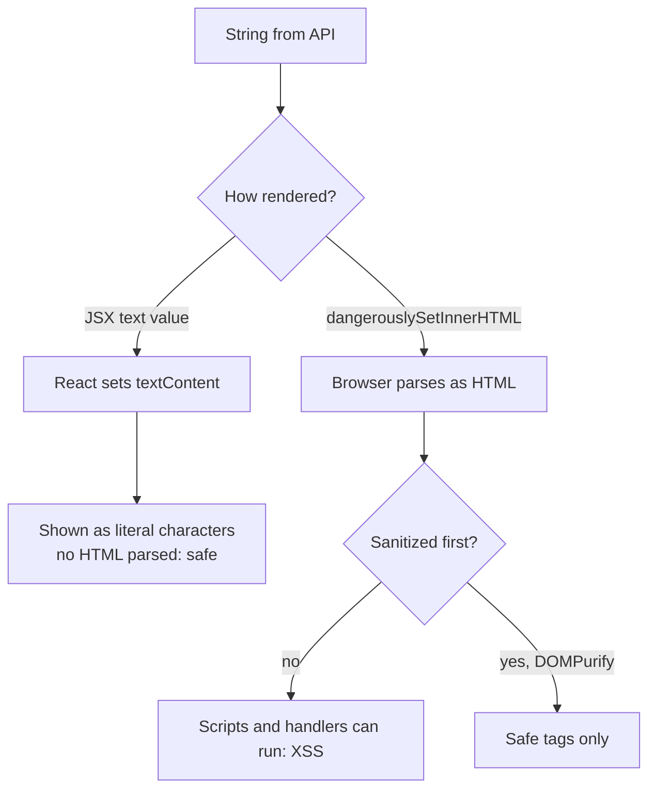
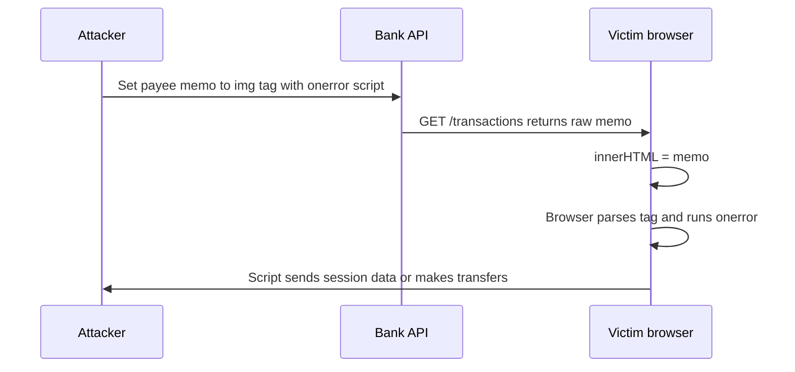

## 1. What it is

**`he` ("HTML entities") is a small, spec-compliant library that encodes text into HTML entities and decodes HTML entities back into plain text.**

Think of HTML entities as escape codes for a language that reserves some characters. In HTML, `<` means "a tag starts here". If you want to show a real less-than sign on screen, you write the code `&lt;` instead. `he` is a translator between "the characters you mean" and "the safe codes HTML needs", and it knows every one of the 2,000+ named entities in the HTML standard, including tricky edge cases like `&amp` without a semicolon.

The problem it solves: APIs, CMSs, and legacy backends often send text that is already entity-encoded (`AT&amp;T Savings &ndash; Q1`). If you render that in React you see the literal codes on screen. `he.decode` turns it back into `AT&T Savings – Q1`. Going the other way, `he.encode` produces safe text when you must build an HTML string by hand.

> **Outdated:** `he` 1.2.0 was released in 2018 and has not needed changes since. It is stable, not abandoned, but in a React app you rarely need it; the platform covers many cases.

## 2. Core concepts

### [Beginner] What an HTML entity is

```ts
// Character  Named entity   Decimal   Hex
//   <        &lt;           &#60;     &#x3C;
//   >        &gt;           &#62;     &#x3E;
//   &        &amp;          &#38;     &#x26;
//   "        &quot;         &#34;     &#x22;
//   '        &apos;         &#39;     &#x27;
//   €        &euro;         &#8364;   &#x20AC;
//   (nbsp)   &nbsp;         &#160;    &#xA0;
const htmlSource = 'Fee: 5&nbsp;&euro; &amp; tax &lt; 1%';
// Browser displays: Fee: 5 € & tax < 1%
```

> **Why:** HTML parsers treat `<`, `&`, and quotes inside attributes as syntax. Entities let you say "I mean the character, not the syntax". Numeric entities can represent any Unicode code point, which mattered when pages were not reliably UTF-8.

### [Beginner] he.decode and he.encode

```ts
import he from 'he';

he.decode('AT&amp;T Savings &ndash; Q1 &euro;500'); // 'AT&T Savings – Q1 €500'
he.decode('&#x20AC; &#36;10');                     // '€ $10' (numeric entities)

he.encode('Tom & Jerry <LLC>');                     // 'Tom &#x26; Jerry &#x3C;LLC&#x3E;'
he.encode('Café €5');                               // 'Caf&#xE9; &#x20AC;5' (non-ASCII encoded too)
```

> **Why:** By default `encode` turns every non-ASCII character and every HTML-special symbol into a hex escape. That guarantees the output is pure ASCII and safe in any encoding.

### [Intermediate] Encode options and he.escape

```ts
he.encode('Café & <b>', { useNamedReferences: true });  // 'Caf&eacute; &amp; &lt;b&gt;'
he.encode('Café & <b>', { decimal: true });             // 'Caf&#233; &#38; &#60;b&#62;'
he.encode('Café & <b>', { allowUnsafeSymbols: true });  // 'Caf&#xE9; & <b>' -- only non-ASCII encoded
he.encode('Café', { encodeEverything: true });          // every char encoded, even 'C'

// escape: only the minimal set for HTML text and attributes: & < > " ' `
he.escape('<a href="x">Q&A</a>'); // '&lt;a href=&quot;x&quot;&gt;Q&amp;A&lt;/a&gt;'

// decode options
he.decode('&amp', { strict: false }); // '&'  (lenient, like browsers)
he.decode('foo&ampbar', { isAttributeValue: true }); // follows attribute-value parsing rules
// strict: true throws on malformed entities -- useful for validating input
```

> **Gotcha:** `allowUnsafeSymbols: true` disables escaping of `<`, `>`, `&`, quotes. Never use it on user input that ends up in HTML.

### [Intermediate] Why React already escapes text

```tsx
const payeeName = '';

// Safe: React sets textContent, so this shows the literal characters on screen
<td>{payeeName}</td>
```



> **Why:** React creates DOM text nodes for `{value}`. A text node is never parsed as HTML, so `<script>` is just characters. This is why you do NOT call `he.encode` before rendering in JSX; doing so double-encodes and the user sees `&#x26;` on screen.

### [Intermediate] When you actually need he

```tsx
// 1. API returns entity-encoded text and you render it as text
interface Merchant { id: string; displayName: string } // 'Barnes &amp; Noble'
<span>{he.decode(merchant.displayName)}</span>          // 'Barnes & Noble'

// 2. Building an HTML string outside React (email template preview, print view, export)
const row = `<tr><td>${he.escape(txn.memo)}</td><td>${formatMoney(txn.amountCents)}</td></tr>`;

// 3. Writing values into an HTML attribute string manually
const html = `<a title="${he.escape(account.nickname)}">View</a>`;
```

> **Finance tip:** Bank memo fields, merchant names from card networks, and CMS-driven disclosure text commonly arrive with `&amp;`, `&#39;`, and `&nbsp;`. Decode at the API boundary (one mapper function), not scattered across components.

### [Advanced] XSS explained

Cross-Site Scripting (XSS) is when attacker-controlled text is interpreted as HTML or JavaScript inside your page, so it runs with your user's session.



```tsx
// VULNERABLE
<div dangerouslySetInnerHTML={{ __html: txn.memo }} />

// VULNERABLE: decoding turns harmless text into live HTML!
<div dangerouslySetInnerHTML={{ __html: he.decode('&lt;img src=x onerror=alert(1)&gt;') }} />

// SAFE: render as text
<div>{txn.memo}</div>
```

> **Why:** Decoding is the dangerous direction. `&lt;img&gt;` is inert text; `he.decode` turns it into ``, which becomes a real element if you then inject it as HTML. Decode only for text rendering.

### [Advanced] he is NOT a sanitizer

Escaping and sanitizing solve different problems:

- **Escaping** (`he.escape`): "Treat ALL of this as text." Nothing becomes HTML.
- **Sanitizing** (DOMPurify): "Allow SOME HTML (bold, links) but remove anything dangerous (scripts, `onerror`, `javascript:` URLs)."

```tsx
import DOMPurify from 'dompurify';

// Rich-text disclosure from a CMS that must keep <b>, <a>, <ul>
function Disclosure({ html }: { html: string }) {
  const clean = DOMPurify.sanitize(html, { USE_PROFILES: { html: true } });
  return <div dangerouslySetInnerHTML={{ __html: clean }} />;
}
```

> **Gotcha:** `he.encode` on an HTML string with legit formatting destroys the formatting (you see tags as text). Doing nothing executes scripts. Only a real HTML sanitizer keeps the safe tags and removes the dangerous ones. `he` also does nothing about `javascript:` URLs in `href`.

> **Interview tip:** "React escapes text by default; for HTML I sanitize with DOMPurify; I use an entity decoder only to display already-encoded text" is the three-part answer interviewers want.

## 3. Why it's used in this project

- **Merchant and payee names** from card processors arrive entity-encoded (`H&amp;M`) and must display correctly in the transactions table.
- **Legacy backend endpoints** HTML-encode all string fields; a single mapper decodes them so components stay simple.
- **CMS disclosures and fee schedules** contain `&nbsp;`, `&reg;`, `&ndash;` that must render correctly in text-only contexts like tooltips or `<title>`.
- **Exports and print views** (statement HTML, email previews) are built as strings outside React, where `he.escape` prevents user memos from breaking markup.

```ts
// API boundary mapper
function toTransaction(dto: TransactionDto): Transaction {
  return {
    id: dto.id,
    amountCents: dto.amount_cents,
    merchant: he.decode(dto.merchant_name),
    memo: he.decode(dto.memo ?? ''),
  };
}
```

## 4. Setup & configuration

```bash
npm install he
npm install -D @types/he
```

```ts
// src/lib/html.ts
import he from 'he';

// Global defaults (optional). These mutate he's shared options object.
he.encode.options.useNamedReferences = true; // prefer &amp; over &#x26; for readability
he.decode.options.strict = false;            // lenient decoding, matches browser behavior

export const decodeEntities = (s: string): string => he.decode(s);
export const escapeHtml = (s: string): string => he.escape(s);
```

> **Gotcha:** `he` is CommonJS and includes the full entity table (~30 KB minified, roughly ~10-15 KB gzip, approximate). It is not tree-shakeable. If you only need `escape`, a five-line function is smaller.

## 5. Key features we use

### [Beginner] Decode for display

```tsx
<td>{he.decode(txn.merchant)}</td>
```

### [Beginner] Escape for a hand-built HTML string

```ts
const html = `<p>Memo: ${he.escape(txn.memo)}</p>`;
```

### [Intermediate] Safe rich text

```tsx
<div dangerouslySetInnerHTML={{ __html: DOMPurify.sanitize(cmsHtml) }} />
```

### [Intermediate] Detect double-encoding

```ts
const looksEncoded = (s: string) => /&(?:[a-z]+|#\d+|#x[0-9a-f]+);/i.test(s);
if (looksEncoded(dto.memo)) logWarn('Memo arrived entity-encoded', { id: dto.id });
```

## 6. Interview questions

#### Q: Does React protect you from XSS? Where does the protection stop?

React escapes values rendered as JSX text and attribute values because it uses text nodes and DOM properties, so injected `<script>` is shown as characters. Protection stops at `dangerouslySetInnerHTML`, `href`/`src` with `javascript:` URLs, direct DOM APIs (`innerHTML`, `insertAdjacentHTML`), third-party libraries that write HTML, and server-rendered templates outside React.

#### Q: What is the difference between escaping, encoding, decoding, and sanitizing?

Encoding/escaping converts special characters to entities so the browser treats them as text. Decoding converts entities back to characters. Sanitizing parses HTML and removes dangerous parts while keeping allowed markup. `he` does encode/escape/decode; DOMPurify sanitizes.

#### Q: An API returns `Barnes &amp; Noble`. The UI shows the `&amp;`. How do you fix it, and is it safe?

Decode it at the API boundary with `he.decode` (or a DOMParser-based decode) and render the result as JSX text. It is safe because React escapes text output. It becomes unsafe only if you put the decoded string into `dangerouslySetInnerHTML`, because decoding can turn `&lt;script&gt;` into a real tag.

#### Q: Why should you not call he.encode before rendering in JSX?

React already escapes text. Encoding first produces double encoding: `&` becomes `&#x26;` in the string, and React then displays those literal characters. Encode only when you are building an HTML string yourself.

#### Q: How would you render CMS-provided HTML safely?

Run it through DOMPurify (configured with an allow-list profile), then pass the result to `dangerouslySetInnerHTML`. Optionally add a Content Security Policy that blocks inline scripts as defense in depth, and consider Trusted Types. Do not use `he` for this; escaping would show the tags as text, and decoding would make it worse.

## 7. Drawbacks & pain points

- Not tree-shakeable; carries the full entity table even if you only escape five characters.
- CommonJS only; fine in Vite/webpack, but not a native ES module.
- Easy to misuse as a "security" library; it is not a sanitizer.
- Global option mutation (`he.encode.options`) affects the whole app.
- No new releases since 2018 (fine for a stable spec, but no ESM build).

Gotchas that trip devs up:

```tsx
// 1. Double encoding in JSX
<td>{he.encode(name)}</td>                       // user sees 'Tom &#x26; Jerry'

// 2. Decoding then injecting HTML: creates XSS
<div dangerouslySetInnerHTML={{ __html: he.decode(memo) }} />

// 3. Thinking escape protects URLs
<a href={userUrl}>link</a>   // 'javascript:alert(1)' still runs on click; validate the scheme

// 4. Decoding twice: '&amp;lt;' -> '&lt;' -> '<'  (decode exactly once, at one boundary)
```

## 8. Better alternatives

The trend: render text with React and rely on its escaping, decode with the platform when possible, and use DOMPurify (plus CSP/Trusted Types) whenever HTML is involved.

- **DOMParser (native)**: decode entities with the browser's own parser.
- **textarea trick (native, older)**: set `innerHTML` on a detached `<textarea>` and read `value`.
- **entities** package: fast, actively maintained, ESM, used by cheerio/htmlparser2. Good for Node or both.
- **DOMPurify**: the standard HTML sanitizer for browsers (and Node with jsdom).
- **Tiny custom escape**: five replacements for `&<>"'` if that is all you need.

```ts
// DOMParser decode (browser only)
const decodeNative = (s: string): string =>
  new DOMParser().parseFromString(s, 'text/html').documentElement.textContent ?? '';

// textarea trick (browser only)
const decodeTextarea = (s: string): string => {
  const t = document.createElement('textarea');
  t.innerHTML = s;
  return t.value;
};

// entities package
import { decodeHTML, escapeUTF8 } from 'entities';
decodeHTML('AT&amp;T');   // 'AT&T'
escapeUTF8('<b>&</b>');   // '&lt;b&gt;&amp;&lt;/b&gt;'

// Minimal escape
const escapeHtml = (s: string) =>
  s.replace(/&/g, '&amp;').replace(/</g, '&lt;').replace(/>/g, '&gt;')
   .replace(/"/g, '&quot;').replace(/'/g, '&#39;');
```

> **Gotcha:** DOMParser with `text/html` does not run scripts, so it is safe for decoding, but it is browser-only (not in Node without jsdom) and slower than a lookup-table library for bulk data.

| Option | Bundle (gzip) | Decode | Encode/escape | Sanitize | Runs in Node | TypeScript | When it wins |
|---|---|---|---|---|---|---|---|
| he | ~10-15 KB | yes, spec-exact | yes | no | yes | @types/he | legacy code, exact spec behavior |
| entities | ~5-15 KB depending on imports | yes | yes | no | yes | built in | Node + browser, ESM, active |
| DOMParser | 0 KB | yes | no | no | no | built in | occasional decoding in browser |
| Custom escape | ~0.1 KB | no | yes, minimal | no | yes | yes | only need escape |
| DOMPurify | ~8 KB | n/a | n/a | yes | with jsdom | built in | any user/CMS HTML |

## 9. When NOT to use it

- Before rendering text in JSX: React already escapes.
- As protection for `dangerouslySetInnerHTML`: use DOMPurify.
- To validate or sanitize URLs: check the protocol (`https:`) explicitly.
- When only a few characters need escaping in a bundle-sensitive page.
- When the backend can be fixed to send plain UTF-8 text instead of pre-encoded strings; fix it at the source.

## Cheatsheet

| Task | Code |
|---|---|
| Decode entities | `he.decode('AT&amp;T')` |
| Escape minimal set | `he.escape('<a>&')` |
| Encode all non-ASCII | `he.encode('Café €')` |
| Named entities | `he.encode(s, { useNamedReferences: true })` |
| Decimal entities | `he.encode(s, { decimal: true })` |
| Strict decode | `he.decode(s, { strict: true })` |
| Native decode | `new DOMParser().parseFromString(s, 'text/html').documentElement.textContent` |
| Sanitize HTML | `DOMPurify.sanitize(html)` |

```tsx
import he from 'he';
import DOMPurify from 'dompurify';

<td>{txn.memo}</td>                                         // text: React escapes, nothing needed
<td>{he.decode(dto.merchant_name)}</td>                     // encoded API text -> decode once
const html = `<td>${he.escape(memo)}</td>`;                 // building HTML strings by hand
<div dangerouslySetInnerHTML={{ __html: DOMPurify.sanitize(cms) }} />  // real HTML -> sanitize
```
