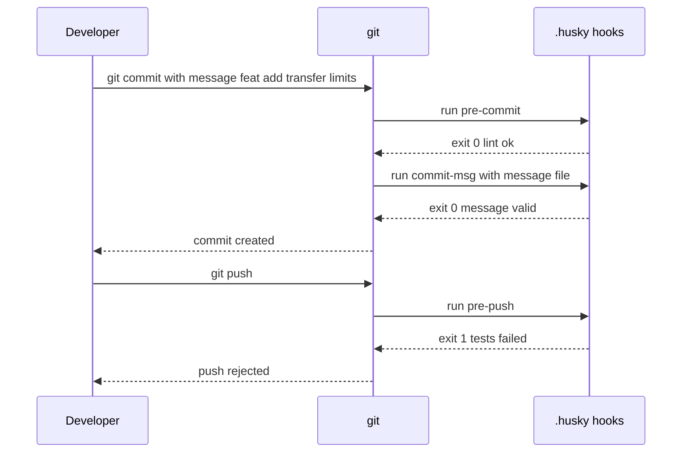
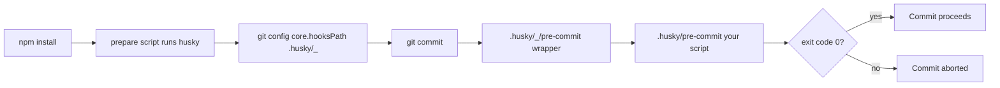

## 1. What it is

**Husky is a small package that installs and manages git hooks for a project, so every developer automatically runs the same checks (lint, format, tests, commit message rules) at commit and push time.**

Analogy: a bouncer at the door of the repository. Before your commit gets in, the bouncer checks it is formatted and linted. Before you push, the bouncer checks tests pass. Git always had space for a bouncer (hooks), but nobody shared the same one. Husky makes the whole team use the same bouncer.

The problem it solves: git hooks live in `.git/hooks`, which is not versioned, so they cannot be shared through the repo. Husky stores hooks in a committed `.husky/` folder and tells git to use it, so hooks are reviewed, versioned and installed automatically on `npm install`.

## 2. Core concepts

### [Beginner] What git hooks are

Git runs scripts at certain moments if they exist and are executable. A non-zero exit code from a "pre" hook aborts the action.

| Hook | When | Typical use |
| --- | --- | --- |
| `pre-commit` | before the commit is created | lint and format staged files |
| `commit-msg` | after message written, before commit | validate message format |
| `pre-push` | before pushing to remote | type-check, run tests |
| `post-merge` | after a merge or pull | reinstall deps if lockfile changed |

```bash
# A raw hook without Husky: .git/hooks/pre-commit (not shared with the team)
#!/bin/sh
npm run lint || exit 1
```



### [Beginner] How Husky v9 wires it up

Git has a setting `core.hooksPath`. Husky sets it to `.husky/_`, a generated folder of tiny wrapper scripts that call your committed scripts in `.husky/`.

```bash
git config core.hooksPath   # prints .husky/_ after husky runs
```



> **Why:** `.git/` is never committed, so hooks there cannot be shared. Pointing `core.hooksPath` at a committed folder makes hooks part of the codebase.

### [Intermediate] Hook files are plain shell scripts

In v9 a hook file is just commands. No shebang or sourcing boilerplate is needed.

```sh
# .husky/pre-commit
npx lint-staged
```

```sh
# .husky/pre-push
npm run typecheck
npm run test -- --run
```

Each line runs in order; any failure stops the hook (Husky runs it with `sh -e`).

> **Outdated:** Husky v4 configured hooks in `package.json` under `"husky": { "hooks": {...} }`. Husky v8 hook files started with `#!/usr/bin/env sh` and `. "$(dirname -- "$0")/_/husky.sh"`. In v9 that sourcing line is deprecated and should be removed.

### [Intermediate] commit-msg with commitlint

```sh
# .husky/commit-msg
npx --no -- commitlint --edit "$1"
```

`$1` is the path to the file holding the commit message (`.git/COMMIT_EDITMSG`). commitlint reads it and validates it against Conventional Commits.

```text
feat(transfers): add daily limit check        valid
fix(statements): correct FX rounding          valid
updated stuff                                 rejected: subject and type missing
```

### [Advanced] Skipping and CI behavior

```bash
git commit --no-verify -m "wip"   # skip pre-commit and commit-msg (escape hatch)
HUSKY=0 git push                  # disable Husky hooks for one command (v9)
```

```json
// package.json -- don't install hooks in CI or production installs
{
  "scripts": {
    "prepare": "husky || true"
  }
}
```

In CI there is usually no need for hooks: CI runs the same checks directly. `husky` exits quietly if it cannot find `.git` (for example inside a Docker build), and `|| true` guards installs where devDependencies are skipped.

## 3. Why it's used in this project

- **Nothing unformatted or unlinted reaches the repo**, so CI rarely fails on trivial issues.
- **Conventional commit messages** feed automated changelogs and release notes. In regulated finance, release notes support change management and audit ("which release changed fee calculation?").
- **Ticket references.** A commit-msg rule can require a Jira key (`PAY-1234`), linking every change to an approved ticket for compliance traceability.
- **Secret scanning.** A pre-commit step (gitleaks, secretlint) blocks accidentally committed API keys or test account numbers.
- **Faster feedback.** A failed type-check on pre-push takes seconds; a failed CI pipeline takes minutes.

> **Finance tip:** Hooks are a convenience, not a control. Anyone can `--no-verify`. Auditable controls must run in CI and in branch protection rules. Hooks just make passing CI the default.

## 4. Setup & configuration

```bash
npm i -D husky
npx husky init
# creates .husky/pre-commit (containing "npm test") and adds "prepare": "husky" to package.json
```

```json
// package.json
{
  "scripts": {
    "prepare": "husky",              // runs after npm install, sets core.hooksPath
    "typecheck": "tsc --noEmit",
    "test": "vitest"
  },
  "devDependencies": {
    "husky": "^9.1.0",
    "lint-staged": "^16.0.0",
    "@commitlint/cli": "^19.0.0",
    "@commitlint/config-conventional": "^19.0.0"
  }
}
```

```sh
# .husky/pre-commit -- fast checks on staged files only
npx lint-staged
```

```sh
# .husky/commit-msg -- validate message
npx --no -- commitlint --edit "$1"
```

```sh
# .husky/pre-push -- slower whole-project checks
npm run typecheck
npx vitest run --changed origin/main
```

```js
// commitlint.config.js
export default {
  extends: ['@commitlint/config-conventional'],
  rules: {
    'type-enum': [2, 'always', ['feat', 'fix', 'chore', 'docs', 'refactor', 'test', 'perf', 'ci', 'revert']],
    'subject-max-length': [2, 'always', 72],
    'scope-enum': [1, 'always', ['accounts', 'transfers', 'portfolio', 'statements', 'auth', 'ui']],
  },
};
```

```bash
# Yarn Berry / pnpm: same idea
yarn add -D husky && yarn husky init
# Yarn 2+ does not run the "prepare" lifecycle on install: use "postinstall": "husky" for private apps
# (for published packages, pair it with pinst so consumers do not run it)
```

> **Gotcha:** If `package.json` is not at the git root (monorepo subfolder), use `"prepare": "cd .. && husky frontend/.husky"` and write hooks that `cd frontend` first.

## 5. Key features we use

### [Beginner] Add a hook

```bash
echo "npx lint-staged" > .husky/pre-commit
git add .husky/pre-commit
```

On macOS/Linux, ensure the file is executable if git complains: `chmod +x .husky/pre-commit`.

### [Intermediate] Require a ticket ID in messages

```sh
# .husky/commit-msg
npx --no -- commitlint --edit "$1"
if ! grep -qE '[A-Z]+-[0-9]+' "$1"; then
  echo "Commit message must reference a ticket, e.g. PAY-1234"
  exit 1
fi
```

### [Intermediate] Reinstall after pulling a new lockfile

```sh
# .husky/post-merge
if git diff --name-only HEAD@{1} HEAD | grep -q 'package-lock.json'; then
  echo "Lockfile changed, running npm ci"
  npm ci
fi
```

### [Advanced] Node version managers and GUI clients

GUI git clients (VS Code, SourceTree) may not load your shell profile, so `npx` or `node` is "not found". Husky v9 sources `~/.config/husky/init.sh` before every hook:

```sh
# ~/.config/husky/init.sh
export NVM_DIR="$HOME/.nvm"
. "$NVM_DIR/nvm.sh"
```

## 6. Interview questions

#### Q: What problem does Husky solve that plain git hooks don't?

Plain hooks live in `.git/hooks`, which is not version-controlled, so each developer must install them manually and they drift. Husky keeps hooks in a committed `.husky/` folder and sets `core.hooksPath` automatically through the `prepare` script on install, so every developer gets the same, reviewed hooks.

#### Q: Which checks belong in pre-commit vs pre-push vs CI?

Pre-commit must be fast (seconds): format and lint only staged files via lint-staged, maybe secret scanning. Pre-push can be slower: type-check, tests related to changed files. CI runs everything (full lint, type-check, all tests, build) because hooks can be skipped with `--no-verify` and CI is the real gate.

#### Q: How does commit-msg validation work?

Git passes the path of the message file as the first argument to the `commit-msg` hook. The hook runs `commitlint --edit "$1"`, which reads that file and checks it against rules (for example Conventional Commits: `type(scope): subject`). A non-zero exit aborts the commit.

#### Q: Can hooks be bypassed? What does that mean for code quality?

Yes, with `git commit --no-verify`, `HUSKY=0`, or by never running install. So hooks are a developer convenience and fast feedback loop, not an enforcement mechanism. Enforcement belongs in CI with required status checks and branch protection.

#### Q: What changed in Husky v9?

Setup is `npx husky init`, the `prepare` script is just `husky`, hook files are plain commands without the shebang and `husky.sh` sourcing lines, `HUSKY=0` disables hooks, and an init file at `~/.config/husky/init.sh` handles environment setup. The package is tiny with no dependencies. v4's `package.json` config is long gone.

## 7. Drawbacks & pain points

- **Slow hooks annoy developers**, who then use `--no-verify` habitually. Keep pre-commit fast.
- **Environment issues.** GUI clients and Windows shells may not find `node`/`npx`.
- **Monorepo layout** requires custom paths when `package.json` is not at the git root.
- **Not a security control**; easily bypassed.
- **Install side effect.** `prepare` runs on every install, including in Docker builds, unless guarded.

Gotchas that trip devs up:

```sh
# 1. Old v8 boilerplate left in v9 hooks -> deprecation warnings
#!/usr/bin/env sh
. "$(dirname -- "$0")/_/husky.sh"   # remove these two lines in v9
npx lint-staged
```

```bash
# 2. Hooks do nothing after cloning: prepare never ran
git config core.hooksPath   # empty? run: npm install (or npx husky)
```

```sh
# 3. Running full test suite in pre-commit -> 2 minute commits -> everyone skips hooks
npm test        # avoid in pre-commit; move to pre-push or CI
```

## 8. Better alternatives

| Tool | Size | Config | Language | Parallel hooks | Popularity | When it wins |
| --- | --- | --- | --- | --- | --- | --- |
| Husky 9 | ~2 kB, no deps | shell files in `.husky/` | Node projects | no, manual | dominant in JS | simple JS repos |
| Lefthook | single Go binary | `lefthook.yml` | any | yes, built in | growing | monorepos, speed, polyglot repos |
| simple-git-hooks | tiny | `package.json` | Node | no | moderate | minimal setups |
| pre-commit (Python) | Python | `.pre-commit-config.yaml` | any, huge hook catalog | yes | high outside JS | polyglot repos, Python teams |
| Plain `core.hooksPath` | 0 | a folder + one git config | any | manual | rare | no-dependency purists |

> **Outdated:** Husky v4 (`"husky": { "hooks": ... }` in package.json) and its auto-install via a postinstall script are obsolete.

## 9. When NOT to use it

- **Non-Node repositories**: use pre-commit or Lefthook, which do not need npm.
- **Large monorepos needing parallel, per-package hooks**: Lefthook handles this natively.
- **As your only quality gate**: always back it with CI.
- **Heavy checks** (full test suite, e2e): those do not belong in local hooks at all.
- **Throwaway prototypes** where hooks add friction without benefit.

## Cheatsheet

| Task | Command / file |
| --- | --- |
| Install + init | `npm i -D husky && npx husky init` |
| prepare script | `"prepare": "husky"` |
| Pre-commit | `.husky/pre-commit` -> `npx lint-staged` |
| Commit message | `.husky/commit-msg` -> `npx --no -- commitlint --edit "$1"` |
| Pre-push | `.husky/pre-push` -> `npm run typecheck` |
| Skip once | `git commit --no-verify` |
| Disable env | `HUSKY=0` |
| Check wiring | `git config core.hooksPath` |
| Env setup | `~/.config/husky/init.sh` |

```sh
# .husky/pre-commit
npx lint-staged
# .husky/commit-msg
npx --no -- commitlint --edit "$1"
# .husky/pre-push
npm run typecheck && npx vitest run
```
