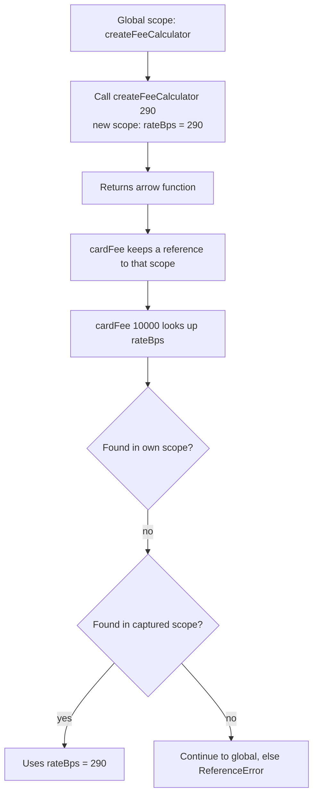
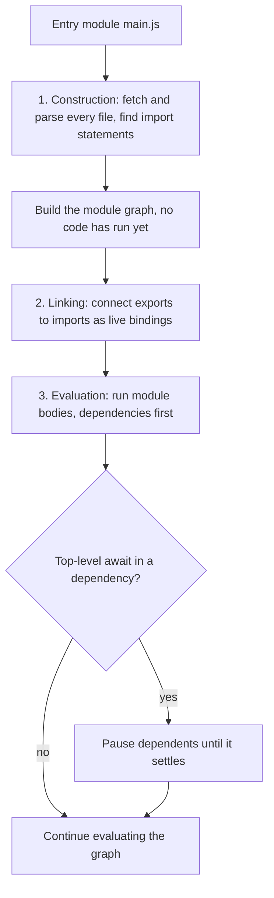
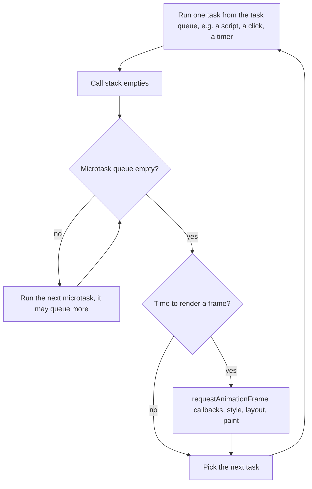
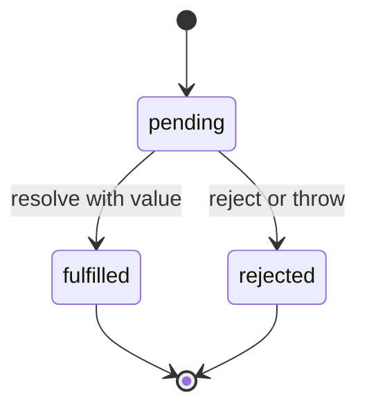
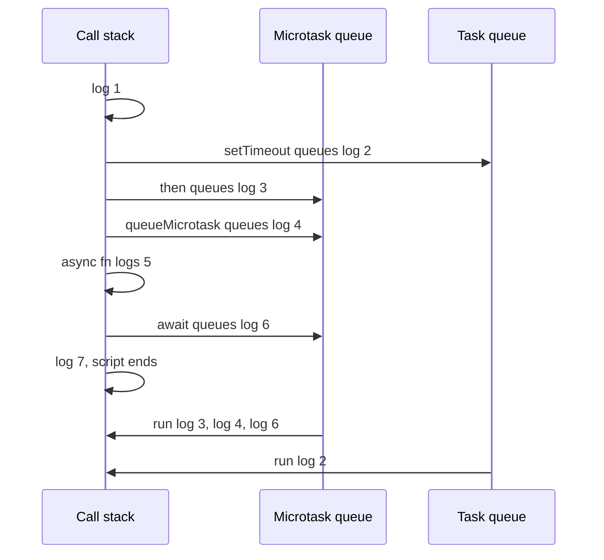

## 1. What it is

**JavaScript is a single-threaded, garbage-collected, dynamically typed language that runs in every browser and, through Node.js, on servers.**

Think of a JavaScript program as one cashier at a bank counter. There is only one cashier (one thread), so they serve one customer at a time. Slow jobs, like waiting for a wire confirmation, are handed to the back office (the browser or Node). When the back office finishes, it drops a note in a queue, and the cashier picks it up as soon as the current customer is done. That queue system is the event loop, and it explains most "why did this run in that order" questions.

The problem it solves: the web needed a language that could be shipped as text, run instantly on any device, and react to user events without freezing the page. JavaScript became the only language browsers run natively (WebAssembly aside), so React, TypeScript and every frontend tool compile down to it. Knowing its rules, not the framework's, is what lets you debug stale state, wrong `this`, out-of-order async code and money rounding errors.

## 2. Core concepts

### [Beginner] Values and types

JavaScript has seven primitive types and one object type. Primitives are immutable values. Everything else (arrays, functions, dates, maps) is an object.

```ts
typeof "USD";          // "string"
typeof 1250;           // "number"   (one type for ints and floats)
typeof 10n;            // "bigint"
typeof true;           // "boolean"
typeof undefined;      // "undefined"
typeof Symbol("id");   // "symbol"
typeof null;           // "object"   (a famous bug kept for compatibility)
typeof {};             // "object"
typeof [];             // "object"   use Array.isArray instead
typeof (() => {});     // "function" (functions are callable objects)
```

> **Why:** `typeof null === "object"` comes from the first implementation in 1995, where values carried a type tag and null's tag happened to equal the object tag. Fixing it would break existing websites, and the web's first rule is "do not break the web". Many JavaScript oddities exist for this reason.

### [Beginner] Scope, hoisting and the temporal dead zone

**Scope** is where a name is visible. `var` is scoped to the whole function. `let` and `const` are scoped to the nearest block `{ }`.

**Hoisting** means declarations are registered when a scope is created, before any line in it runs. What differs is the initial state:

| Declaration | Scope | Hoisted? | Value before the line runs |
| --- | --- | --- | --- |
| `var x` | Function | Yes | `undefined` |
| `let x` / `const x` | Block | Yes | Uninitialized: access throws (TDZ) |
| `function f() {}` | Function/block | Yes | The full function |
| `const f = () => {}` | Block | Yes, as a const | TDZ |
| `class C {}` | Block | Yes | TDZ |

```ts
console.log(feeVar);   // undefined: var is hoisted and initialized
var feeVar = 250;

console.log(feeLet);   // ReferenceError: Cannot access 'feeLet' before initialization
let feeLet = 250;

calculateFee(1000);    // works: function declarations are fully hoisted
function calculateFee(amountCents: number) { return Math.round(amountCents * 0.029); }

// Classic loop bug: one shared var, three closures
for (var i = 0; i < 3; i++) setTimeout(() => console.log(i)); // 3, 3, 3
// let creates a fresh binding per iteration
for (let j = 0; j < 3; j++) setTimeout(() => console.log(j)); // 0, 1, 2
```

> **Why:** The **temporal dead zone** (TDZ) is the time between entering a scope and reaching the `let`/`const` line. The name exists (so it shadows outer names) but reading it throws. This turns "used before assigned" bugs into loud errors instead of silent `undefined`.

> **Outdated:** Do not use `var` in new code. Use `const` by default and `let` only when you reassign.

### [Beginner] Reference vs value, and immutability

Primitives are copied. Objects are shared: a variable holds a **reference** to the object, and copying the variable copies the reference, not the object.

```ts
let a = 100;
let b = a;
b += 50;            // a is still 100

const account = { id: "acc_1", balanceCents: 100 };
const sameAccount = account;
sameAccount.balanceCents = 0;   // account.balanceCents is now 0 too

// const prevents reassignment, not mutation
const limits = { dailyCents: 500_000 };
limits.dailyCents = 0;          // allowed
// limits = {};                 // TypeError: Assignment to constant variable

// Shallow copies: top level is new, nested objects are shared
const portfolio = { id: "p1", holdings: [{ symbol: "VTI", units: 10 }] };
const copy = { ...portfolio };
copy.holdings[0].units = 0;     // also changes portfolio.holdings[0]

// Deep copy (structured clone algorithm)
const deep = structuredClone(portfolio);
deep.holdings[0].units = 99;    // original untouched

// Freeze is shallow and runtime-enforced
const frozen = Object.freeze({ currency: "USD", tiers: [1, 2] });
// frozen.currency = "EUR";     // ignored, or TypeError in strict mode
frozen.tiers.push(3);           // still works: nested array not frozen
```

> **Why:** React compares state with `Object.is`. If you mutate an object and pass the same reference to `setState`, React sees "same object" and skips the re-render. Immutable updates (`{ ...state, balanceCents: next }`) create a new reference, which is how React detects change cheaply without deep comparison.

```ts
// Immutable update of a nested transaction in a list
setTransactions((prev) =>
  prev.map((t) => (t.id === id ? { ...t, status: "reversed" } : t)),
);
```

### [Beginner] Equality and coercion

`===` (strict equality) compares without converting types. `==` (loose equality) converts types first, using rules few people remember.

```ts
0 === "0";            // false
0 == "0";             // true  (string converted to number)
"" == 0;              // true
"0" == false;         // true  (both become 0)
[] == false;          // true  ([] -> "" -> 0)
null == undefined;    // true  (special rule)
null == 0;            // false (null only loosely equals undefined)
NaN === NaN;          // false (NaN never equals anything)
Number.isNaN(NaN);    // true
Object.is(NaN, NaN);  // true
Object.is(0, -0);     // false, while 0 === -0 is true

// Coercion in operators
"5" + 1;              // "51" (+ with a string concatenates)
"5" - 1;              // 4    (- always converts to number)
+"";                  // 0
Number("12.50");      // 12.5
Number("1,234.50");   // NaN  (commas are not numeric)
Number("");           // 0    (dangerous for empty inputs)
parseFloat("12.5abc");// 12.5 (stops at the first invalid char)

// Truthiness: only these are falsy
// false, 0, -0, 0n, "", null, undefined, NaN
if (balanceCents) { /* skipped when the balance is 0! */ }
```

> **Gotcha:** A zero balance is falsy. `{account.balanceCents && <Balance />}` renders the number `0` in React instead of nothing. Use an explicit comparison: `account.balanceCents !== undefined`.

> **Finance tip:** `Number("")` is `0`, so an empty amount field silently becomes a zero-dollar transfer. Check for an empty string before converting, and validate with a schema.

### [Beginner] Numbers and floating point: why money uses integer cents

Every JavaScript `number` is an IEEE 754 double-precision float. It stores numbers in binary with 53 bits of precision. Many simple decimals, like 0.1, have no exact binary representation, the same way 1/3 has no exact decimal one (0.3333...). So tiny errors appear.

```ts
0.1 + 0.2;                 // 0.30000000000000004
0.1 + 0.2 === 0.3;         // false
1.005 * 100;               // 100.49999999999999
Math.round(1.005 * 100);   // 100, not 101: a cent lost
(1.005).toFixed(2);        // "1.00"
19.99 * 3;                 // 59.97000000000001

// Integers are exact up to 2^53 - 1
Number.MAX_SAFE_INTEGER;   // 9007199254740991 (about 90 trillion dollars in cents)
Number.isSafeInteger(12_550); // true

// Store and compute in integer minor units (cents)
const priceCents = 1999;
const totalCents = priceCents * 3;  // 5997, exact

// Parse user input as a string, never through float multiplication
function parseToCents(input: string): number {
  const match = /^(\d+)(?:\.(\d{1,2}))?$/.exec(input.trim());
  if (!match) throw new Error(`Invalid amount: ${input}`);
  const [, whole, frac = ""] = match;
  return Number(whole) * 100 + Number(frac.padEnd(2, "0"));
}
parseToCents("1.005");  // throws: too many decimals, ask the user
parseToCents("12.5");   // 1250

// Split $100 three ways without losing a cent (largest remainder)
function allocate(totalCents: number, parts: number): number[] {
  const base = Math.floor(totalCents / parts);
  const remainder = totalCents - base * parts;
  return Array.from({ length: parts }, (_, i) => base + (i < remainder ? 1 : 0));
}
allocate(10_000, 3); // [3334, 3333, 3333], sums to exactly 10000

// Beyond safe integers, or for exact decimal math (FX rates, interest), use BigInt or a decimal library
const hugeCents = 9_007_199_254_740_993n + 1n;  // BigInt is exact, but integer-only
```

> **Why:** Integers below 2^53 are represented exactly in binary, so adding and multiplying whole cents never drifts. Fractions are where binary floats fail. Interest rates, FX conversion and tax need fractional math with explicit rounding rules, which is what decimal libraries (decimal.js, big.js, Dinero.js) provide.

> **Finance tip:** Agree with the backend on the wire format: integer minor units (`amountCents: 1250`) or decimal strings (`"12.50"`). Never send floats like `12.5` for money. Remember that not every currency has 2 minor units: JPY has 0, KWD has 3.

> **Gotcha:** `Math.round` rounds .5 toward positive infinity: `Math.round(-2.5)` is `-2`. Banking often requires "round half to even" (banker's rounding) or "half away from zero". Decide explicitly and use a library that supports the mode.

### [Beginner] Intl.NumberFormat for currency display

`Intl.NumberFormat` is the built-in, locale-aware formatter. It knows currency symbols, grouping separators, decimal marks and minor units for every locale.

```ts
const usd = new Intl.NumberFormat("en-US", { style: "currency", currency: "USD" });
usd.format(1234.5);          // "$1,234.50"

new Intl.NumberFormat("de-DE", { style: "currency", currency: "EUR" }).format(1234.5);
// "1.234,50 €"

new Intl.NumberFormat("ja-JP", { style: "currency", currency: "JPY" }).format(1234);
// "￥1,234" (no decimals: JPY has 0 minor units)

// Accounting style: negatives in parentheses
new Intl.NumberFormat("en-US", { style: "currency", currency: "USD", currencySign: "accounting" })
  .format(-42.1);            // "($42.10)"

// Always show a sign for deltas
new Intl.NumberFormat("en-US", { style: "currency", currency: "USD", signDisplay: "exceptZero" })
  .format(12);               // "+$12.00"

// Compact for dashboards
new Intl.NumberFormat("en-US", { style: "currency", currency: "USD", notation: "compact" })
  .format(2_450_000);        // "$2.5M"

// Format from integer cents using the currency's own minor units
function formatCents(amountCents: number, currency: string, locale = "en-US"): string {
  const nf = new Intl.NumberFormat(locale, { style: "currency", currency });
  const digits = nf.resolvedOptions().maximumFractionDigits ?? 2;
  return nf.format(amountCents / 10 ** digits);
}

// Exact decimal strings and BigInt are accepted too (no float rounding)
usd.format("98765432109876.54"); // "$98,765,432,109,876.54"
usd.format(10n);                 // "$10.00"

// Parts, for styling the symbol separately
usd.formatToParts(1234.5);
// [{type:"currency",value:"$"},{type:"integer",value:"1"},{type:"group",value:","},...]
```

> **Gotcha:** Creating a formatter is relatively expensive. In a 10k-row table, create it once (module scope or `useMemo`) and reuse it, rather than calling `new Intl.NumberFormat` per cell. `toLocaleString()` creates one on every call.

### [Intermediate] Functions and closures

A **closure** is a function plus the variables it captured from the scope where it was created. The inner function keeps those variables alive even after the outer function returns.

```ts
function createFeeCalculator(rateBps: number) {
  // rateBps lives on because the returned function references it
  return (amountCents: number) => Math.round((amountCents * rateBps) / 10_000);
}
const cardFee = createFeeCalculator(290); // 2.90%
cardFee(10_000); // 290

// Private state through closure
function createAuditLog() {
  const entries: string[] = [];          // not reachable from outside
  return {
    record: (msg: string) => entries.push(`${new Date().toISOString()} ${msg}`),
    count: () => entries.length,
  };
}
```



**Stale closures in React hooks.** Every render is a new function call with its own props and state. A callback created during render 1 captures render 1's values forever. If it lives longer than that render (in an interval, an effect with missing deps, or a memoized callback), it sees old data.

```tsx
function PendingCounter({ accountId }: { accountId: string }) {
  const [count, setCount] = useState(0);

  useEffect(() => {
    const id = setInterval(() => {
      setCount(count + 1);        // BUG: count is always 0 from the first render
    }, 5_000);
    return () => clearInterval(id);
  }, []);                         // empty deps: the closure is never refreshed

  // Fix 1: functional update reads the latest state, no capture needed
  // setCount((c) => c + 1);

  // Fix 2: list every captured value in deps (the effect re-subscribes)
  // }, [count]);

  // Fix 3: a ref holds the latest value without re-running the effect
  // const latest = useRef(count); latest.current = count;
}
```

> **Why:** React does not "update" a closure. It creates a new closure each render. The old interval still holds the old one. The `react-hooks/exhaustive-deps` lint rule exists to catch this. React 19.2 added `useEffectEvent` for the case "read latest values inside an effect without making them dependencies".

### [Intermediate] this binding

`this` is not where a function is written. For normal functions it is decided **at call time**, by how the function is called. Arrow functions are the exception: they do not have their own `this` and use the one from the surrounding scope.

| How it is called | `this` is |
| --- | --- |
| `new Account()` | The newly created object |
| `fn.call(obj)`, `fn.apply(obj)`, `fn.bind(obj)` | `obj` (explicit) |
| `obj.method()` | `obj` (the thing left of the dot) |
| `fn()` plain call | `undefined` in strict mode and modules (`globalThis` in sloppy scripts) |
| Arrow function | Whatever `this` was where the arrow was defined |

```ts
class AccountService {
  baseUrl = "/api/accounts";

  fetchOne(id: string) {
    return fetch(`${this.baseUrl}/${id}`);
  }

  // Arrow class field: this is bound to the instance permanently
  fetchAll = () => fetch(this.baseUrl);
}

const svc = new AccountService();
svc.fetchOne("acc_1");              // this = svc

const detached = svc.fetchOne;
detached("acc_1");                  // TypeError: Cannot read properties of undefined (reading 'baseUrl')

["acc_1"].map(svc.fetchOne);        // same bug: passed as a plain function
["acc_1"].map((id) => svc.fetchOne(id)); // fix: call it with the dot
const bound = svc.fetchOne.bind(svc);    // fix: bind
const ok = svc.fetchAll;            // works: arrow field captured this
```

> **Why:** Methods live once on the prototype and are shared by all instances. `this` is the mechanism that tells the shared function which instance it is working on. Detach the function from the dot and that information is gone.

### [Intermediate] Prototypes, the prototype chain, and classes as sugar

Every object has a hidden link, `[[Prototype]]`, to another object. When you read a property that the object does not have, JavaScript follows the link and looks there, and so on until it reaches `null`. This is **prototypal inheritance**. Classes are syntax on top of this same mechanism.

```ts
class Account {
  #balanceCents: number;               // private field, truly hidden at runtime
  constructor(public id: string, balanceCents: number) {
    this.#balanceCents = balanceCents;
  }
  get balanceCents() { return this.#balanceCents; }
  deposit(cents: number) { this.#balanceCents += cents; }
}

class SavingsAccount extends Account {
  constructor(id: string, balanceCents: number, public rateBps: number) {
    super(id, balanceCents);
  }
  monthlyInterestCents() { return Math.round((this.balanceCents * this.rateBps) / 10_000 / 12); }
}

const s = new SavingsAccount("acc_9", 100_000, 425);

Object.getPrototypeOf(s) === SavingsAccount.prototype;                    // true
Object.getPrototypeOf(SavingsAccount.prototype) === Account.prototype;    // true
s.hasOwnProperty("deposit");   // false: deposit lives on Account.prototype
Object.hasOwn(s, "id");        // true: own property set in the constructor
s instanceof Account;          // true: Account.prototype is on the chain
typeof Account;                // "function": a class is a special function
```


Roughly what the class desugars to:

```ts
function LegacyAccount(this: any, id: string) { this.id = id; }
LegacyAccount.prototype.describe = function () { return `Account ${this.id}`; };
const legacy = new (LegacyAccount as any)("acc_1");
legacy.describe(); // found on LegacyAccount.prototype
```

> **Gotcha:** "Classes are just sugar" is mostly true, but not completely. Classes are always strict mode, cannot be called without `new`, are in the TDZ before their declaration, and `#private` fields have no prototype-based equivalent.

> **Gotcha:** Class instances lose their prototype when serialized. `JSON.parse(JSON.stringify(account))` and `structuredClone(account)` return plain objects without methods. Keep server and cache data as plain objects, and use functions instead of methods.

### [Intermediate] ES modules

ES modules (ESM) are the standard module system: `import` and `export`. Each file is its own scope, runs in strict mode, and is evaluated **once** no matter how many files import it.

```ts
// money.ts
export const DEFAULT_CURRENCY = "USD";
export function formatCents(cents: number) { /* ... */ }
export default class MoneyFormatter { /* ... */ }

// Elsewhere
import MoneyFormatter, { formatCents, DEFAULT_CURRENCY as CCY } from "./money";
import * as money from "./money";               // namespace object

// Dynamic import: loads on demand, returns a promise (how React.lazy code-splits)
const { exportToCsv } = await import("./reports/export");

// Metadata about the current module
console.log(import.meta.url);           // file or http URL of this module
console.log(import.meta.env.VITE_API_BASE_URL); // Vite-specific addition
```

**Static structure.** `import` and `export` must be at the top level with string literal paths. Tools can therefore see the whole dependency graph without running code, which enables **tree shaking** (dropping unused exports) and fast bundling.

**Live bindings.** An imported name is not a copy. It is a read-only view of the exporter's variable.

```ts
// session.ts
export let sessionExpiresAt = 0;
export function extendSession() { sessionExpiresAt = Date.now() + 15 * 60_000; }

// app.ts
import { sessionExpiresAt, extendSession } from "./session";
extendSession();
console.log(sessionExpiresAt);   // the new value: the binding is live
// sessionExpiresAt = 0;         // TypeError: assignment to an import is not allowed
```

**Top-level await.** In ESM you can `await` at the top level. The module and everything that imports it waits until the promise settles.

```ts
// config.ts
const res = await fetch("/config.json");
export const config = await res.json();
```

> **Gotcha:** Top-level await blocks every importer. Awaiting a slow request in a widely imported module delays the whole app's startup. Use it sparingly, mostly in entry files and scripts.

ESM loads in three phases, which is why imports are hoisted and cycles partially work:



### [Intermediate] ESM vs CommonJS

CommonJS (CJS) is Node's original module system, from before ESM existed. You will still see it in config files, older packages and Node scripts.

| | CommonJS | ES modules |
| --- | --- | --- |
| Syntax | `const x = require("x")`, `module.exports = ...` | `import x from "x"`, `export ...` |
| Loading | Synchronous, at the line where `require` runs | Asynchronous, graph resolved before running |
| Can be conditional | Yes, `require` is a normal function | Static `import` no; dynamic `import()` yes |
| Exports | A plain object, values copied on read | Live bindings |
| Top-level await | No | Yes |
| Strict mode | Opt-in | Always |
| `__dirname`, `__filename` | Available | Use `import.meta.dirname` / `import.meta.filename` (Node 20.11+) |
| Tree shaking | Hard | Designed for it |
| Browser support | Only through a bundler | Native |

```ts
// counter.cjs (CommonJS)
let count = 0;
module.exports = { count, increment: () => { count++; } };

// main.cjs
const counter = require("./counter.cjs");
counter.increment();
console.log(counter.count);    // 0: count was copied into the exports object
```

**How Node decides which system a file uses:**

- `.mjs` is always ESM. `.cjs` is always CommonJS.
- `.js` follows the nearest `package.json`: `"type": "module"` means ESM, otherwise CommonJS.
- Recent Node versions can also detect ESM syntax in ambiguous `.js` files, but being explicit is better.

**Interop:**

- ESM importing CJS: works. The default import is `module.exports`. Named imports work when Node can detect them statically.
- CJS requiring ESM: historically impossible (only `await import()`). Node 22.12+ and 20.19+ support `require()` of ESM as long as the ESM graph has no top-level await.
- Packages publish both through the `exports` field with `"import"` and `"require"` conditions. If both copies load, you get two separate module instances (the "dual package hazard"), for example two copies of a singleton.

```json
{
  "name": "@acme/money",
  "type": "module",
  "exports": {
    ".": {
      "types": "./dist/index.d.ts",
      "import": "./dist/index.js",
      "require": "./dist/index.cjs"
    }
  }
}
```

> **Outdated:** New code, configs and libraries should be ESM. Vite projects are ESM by default (`"type": "module"` in the template). ESLint 9+ flat config, Vitest and Vite config files are all ESM-first.

### [Intermediate] The event loop

JavaScript runs on one thread with one **call stack**. Long tasks block everything, including clicks and painting. Async work is handed to the host (browser or Node), and when it finishes a callback is put into a queue. The **event loop** moves callbacks from queues onto the stack when the stack is empty.

There are two kinds of queues that matter:

- **Microtask queue**: promise reactions (`.then`, `await` continuations), `queueMicrotask`, `MutationObserver`. Drained **completely** after every task, before anything else.
- **Task (macrotask) queue**: `setTimeout`, `setInterval`, DOM events, network callbacks, `MessageChannel`. One task per loop turn.



```ts
// A long synchronous loop freezes the UI: nothing else can run
function recalcAll(rows: Transaction[]) {
  for (const r of rows) heavyRiskScore(r); // 2 seconds of blocking
}

// Yield between chunks so clicks and paints can happen
async function recalcInChunks(rows: Transaction[], chunk = 500) {
  for (let i = 0; i < rows.length; i += chunk) {
    rows.slice(i, i + chunk).forEach(heavyRiskScore);
    await new Promise((r) => setTimeout(r, 0)); // a new task: the browser can paint in between
  }
}
```

> **Why:** Microtasks run before rendering, so an infinite chain of microtasks freezes the page just like a `while (true)` loop. A `setTimeout(fn, 0)` yields to the browser; a resolved promise does not. For truly heavy calculations (10k-row risk scoring), move work to a Web Worker.

### [Intermediate] Promises

A promise is an object representing a value that will exist later. It is in one of three states and settles **exactly once**.



```ts
function fetchBalance(accountId: string): Promise<number> {
  return fetch(`/api/accounts/${accountId}/balance`)
    .then((res) => {
      if (!res.ok) throw new Error(`HTTP ${res.status}`); // fetch does NOT reject on 404 or 500
      return res.json();
    })
    .then((body: { balanceCents: number }) => body.balanceCents);
}

fetchBalance("acc_1")
  .then((cents) => console.log(cents))
  .catch((err) => console.error("Balance failed", err))
  .finally(() => console.log("done"));    // runs either way

// Wrapping a callback API: the main legit use of new Promise
function delay(ms: number) {
  return new Promise<void>((resolve) => setTimeout(resolve, ms));
}

// ES2024: get resolve/reject outside the constructor
const { promise, resolve, reject } = Promise.withResolvers<string>();
```

Key rules:
- `.then` always returns a **new** promise. Returning a value fulfills it; throwing rejects it; returning a promise makes it follow that promise. That is what makes chaining work.
- `.then` callbacks always run asynchronously (as microtasks), even if the promise is already settled.
- A rejected promise with no handler triggers an `unhandledrejection` event. Always end chains with `.catch` or `await` inside `try`.

> **Gotcha:** `fetch` only rejects on network failure or abort. A `500 Internal Server Error` is a fulfilled promise with `res.ok === false`. Forgetting the `ok` check is one of the most common bugs in API code.

### [Intermediate] async/await and error handling

`async` functions always return a promise. `await` pauses the function (not the thread) until the promise settles, then resumes it as a microtask. It is syntax over promises, so `try/catch` works for rejections.

```ts
async function loadDashboard(accountId: string, signal?: AbortSignal) {
  try {
    const res = await fetch(`/api/accounts/${accountId}`, { signal });
    if (!res.ok) throw new Error(`Account load failed: ${res.status}`, { cause: res.status });
    return (await res.json()) as Account;
  } catch (err) {
    if (err instanceof DOMException && err.name === "AbortError") return null; // user navigated away
    throw err; // rethrow: let the caller or an error boundary decide
  } finally {
    // cleanup, e.g. stop a spinner
  }
}

// Sequential: total time = sum (only do this when B needs A's result)
const account = await getAccount(id);
const txs = await getTransactions(id);

// Parallel: total time = slowest
const [account2, txs2] = await Promise.all([getAccount(id), getTransactions(id)]);

// Cancellation with AbortController (also how React effects should clean up fetches)
const controller = new AbortController();
loadDashboard("acc_1", controller.signal);
controller.abort();
AbortSignal.timeout(10_000); // a signal that aborts itself after 10 seconds
```

> **Gotcha:** `array.forEach(async (x) => await save(x))` does not wait. `forEach` ignores returned promises, so the code after it runs immediately and errors become unhandled. Use `for...of` with `await` (sequential) or `await Promise.all(array.map(save))` (parallel).

> **Gotcha:** Inside `try`, write `return await promise`, not `return promise`. Without `await`, the function returns before the promise rejects, and the `catch` block never sees the error.

### [Intermediate] Promise.all, allSettled, race and any

| Method | Resolves when | Rejects when | Use it for |
| --- | --- | --- | --- |
| `Promise.all` | All fulfill (array of values, input order) | The first one rejects (fail fast) | Data you need all of: account plus transactions |
| `Promise.allSettled` | All settle (array of `{status, value or reason}`) | Never | Independent widgets: show what loaded, flag what failed |
| `Promise.race` | The first one settles, fulfilled or rejected | The first one settles with a rejection | Timeouts |
| `Promise.any` | The first one fulfills | All reject (`AggregateError`) | Redundant sources: first healthy FX-rate provider |

```ts
// allSettled: a dashboard where one failed widget should not blank the page
const results = await Promise.allSettled([getBalances(), getHoldings(), getAlerts()]);
for (const r of results) {
  if (r.status === "fulfilled") render(r.value);
  else reportError(r.reason);
}

// race: timeout (prefer AbortSignal.timeout for fetch, which also cancels the request)
const withTimeout = <T,>(p: Promise<T>, ms: number) =>
  Promise.race([p, new Promise<never>((_, rej) => setTimeout(() => rej(new Error("Timeout")), ms))]);

// any: first provider that answers successfully
const rate = await Promise.any([fetchRate("providerA"), fetchRate("providerB")]);
```

> **Gotcha:** `Promise.all` rejecting does not cancel the other promises. They keep running; their results are just ignored. Pass an `AbortSignal` if you need real cancellation.

### [Advanced] An event loop ordering puzzle

```ts
console.log("1");
setTimeout(() => console.log("2"), 0);
Promise.resolve().then(() => console.log("3"));
queueMicrotask(() => console.log("4"));
(async () => {
  console.log("5");
  await null;
  console.log("6");
})();
console.log("7");
// Output: 1 5 7 3 4 6 2
```

Step by step:

1. `1` logs. Synchronous.
2. `setTimeout` puts its callback in the **task** queue.
3. `.then` queues `3` as a **microtask**. `queueMicrotask` queues `4`.
4. The async function runs synchronously until its first `await`, so `5` logs. `await null` queues the rest (`6`) as a microtask.
5. `7` logs. The script (the current task) ends and the stack is empty.
6. Microtasks drain in FIFO order: `3`, `4`, `6`.
7. Next task: the timer callback logs `2`.



> **Interview tip:** Say the rule out loud: "Synchronous code first, then all microtasks until the queue is empty, then one macrotask, then microtasks again." Then mention that `await` splits an async function: everything before the first `await` is synchronous.

### [Advanced] Modern features worth knowing

```ts
// Optional chaining (ES2020): stop at null or undefined instead of throwing
const city = account.owner?.address?.city;      // undefined if any link is missing
const firstTxId = account.transactions?.[0]?.id;
onSubmit?.(values);                              // call only if defined

// Nullish coalescing (ES2020): default only for null or undefined
const limit = settings.dailyLimitCents ?? 500_000;  // keeps 0
const wrong = settings.dailyLimitCents || 500_000;  // BUG: replaces a 0 limit
filters.currency ??= "USD";                     // logical assignment (ES2021)

// Numeric separators (ES2021)
const ONE_MILLION_CENTS = 1_000_000;

// structuredClone (web platform, all modern browsers and Node 17+)
const draft = structuredClone(savedTransfer);   // deep copy: Dates, Maps, Sets survive
// Throws on functions and DOM nodes. Class instances come back as plain objects.

// at (ES2022): negative indexes
const latest = transactions.at(-1);

// findLast / findLastIndex (ES2023)
const lastDeposit = transactions.findLast((t) => t.amountCents > 0);

// Non-mutating array methods (ES2023): safe for React state
const byDate = transactions.toSorted((a, b) => a.postedAt.localeCompare(b.postedAt));
const newestFirst = transactions.toReversed();
const withoutSecond = transactions.toSpliced(1, 1);
const updated = transactions.with(0, { ...transactions[0], status: "posted" });
// Compare: sort, reverse and splice MUTATE the original array

// Object.groupBy / Map.groupBy (ES2024)
const byStatus = Object.groupBy(transactions, (t) => t.status);
// { pending: [...], posted: [...] } (a null-prototype object)
const byAccount = Map.groupBy(transactions, (t) => t.accountId);

// Object.hasOwn (ES2022) and Error cause (ES2022)
Object.hasOwn(payload, "amountCents");
throw new Error("Transfer failed", { cause: originalError });

// Set methods (ES2025)
const flagged = new Set(["acc_1", "acc_2"]);
const visible = new Set(["acc_2", "acc_3"]);
flagged.intersection(visible);  // Set { "acc_2" }
flagged.union(visible);         // Set { "acc_1", "acc_2", "acc_3" }
flagged.difference(visible);    // Set { "acc_1" }
```

> **Outdated:** `Date` is mutable, has 0-based months and poor time zone support. The `Temporal` API replaces it and has started shipping in browsers (Firefox first, Chromium-based browsers in 2026). Check support for your users and use a polyfill if needed. Until then, date-fns, Day.js or Luxon remain common.

> **Outdated:** `JSON.parse(JSON.stringify(obj))` as a deep clone breaks `Date` (becomes a string), `undefined` (dropped), `Map`/`Set` (become `{}`) and `BigInt` (throws). Use `structuredClone`.

## 3. Why it's used in this project

Every line of our React financial app becomes JavaScript, so its semantics show up in real bugs:

- **Money math.** Balances, fees and allocations are integer cents. `0.1 + 0.2` style errors would put wrong totals on statements, and auditors notice one-cent differences.
- **Currency display.** `Intl.NumberFormat` handles USD, EUR and JPY formats, accounting negatives and compact dashboard numbers without a library.
- **Async data.** Dashboards load balances, holdings and alerts in parallel. `Promise.allSettled` lets one failing widget degrade gracefully instead of blanking the page.
- **Session timeouts for compliance.** Idle timers (`setTimeout`), activity listeners, and Okta token renewals all rely on the event loop and on clearing timers correctly to avoid leaks and double logouts.
- **Large lists.** Rendering and sorting 10k transactions means knowing which array methods mutate (`sort`) and which do not (`toSorted`), and yielding to the event loop or using workers for heavy calculations.
- **Immutability for React and audit trails.** State updates must create new references so React re-renders, and audit snapshots must be deep copies so later edits do not rewrite history.
- **Correct stale closure handling.** Polling balances in effects and debounced search inputs are classic places for stale closures.
- **Cancellation.** `AbortController` cancels in-flight requests when users switch accounts, so an old account's data never renders under a new account's header.

> **Finance tip:** A race condition where account A's response arrives after account B was selected is a data-exposure bug, not just a UI glitch. Always abort or ignore stale responses.

## 4. Setup & configuration

JavaScript needs no install in the browser. What you configure is **which version of the language** you write, **which environments** you support, and **which module system** Node uses.

### [Beginner] package.json

Comments are not allowed in a real `package.json`; they are shown here for explanation.

```jsonc
{
  "name": "acme-banking-web",
  "private": true,                 // prevents accidental npm publish
  "type": "module",                // .js files are ES modules (use .cjs for CommonJS)
  "engines": { "node": ">=22.12" },// Node version for tooling; enables require() of ESM
  "scripts": {
    "dev": "vite",
    "build": "tsc -b && vite build",
    "lint": "eslint .",
    "test": "vitest"
  },
  "browserslist": ["defaults", "not dead"] // targets for tools like Autoprefixer
}
```

### [Beginner] .nvmrc

```text
22
```

Pins the Node major version for everyone on the team (`nvm use` reads it). Node 22 and 24 are the LTS lines in late 2026.

### [Intermediate] Language target in Vite

```ts
// vite.config.ts
import { defineConfig } from "vite";
import react from "@vitejs/plugin-react";

export default defineConfig({
  plugins: [react()],
  build: {
    // Syntax level of the output. Newer syntax above this is transpiled.
    // Vite's default is a "baseline widely available" browser set.
    target: "es2022",
    sourcemap: true,           // map minified code back to source for error tracking
  },
});
```

> **Gotcha:** Transpiling syntax is not polyfilling APIs. Setting `target: "es2015"` rewrites `?.` but does **not** add `Array.prototype.toSorted` or `Object.groupBy`. If you support older browsers, add polyfills for the APIs you use (for example via core-js) or avoid them.

### [Intermediate] ESLint flat config for JavaScript correctness

```js
// eslint.config.js (ESLint 9+ flat config; the old .eslintrc format is gone in ESLint 10)
import js from "@eslint/js";
import globals from "globals";

export default [
  js.configs.recommended,
  {
    languageOptions: {
      ecmaVersion: "latest",      // parse the newest syntax
      sourceType: "module",       // files are ES modules
      globals: globals.browser,   // window, document, fetch...
    },
    rules: {
      eqeqeq: ["error", "always", { null: "ignore" }], // force ===, allow x == null
      "no-var": "error",
      "prefer-const": "error",
      "no-implicit-coercion": "error",    // ban !!x, +x, "" + x tricks
      "no-promise-executor-return": "error",
      "require-atomic-updates": "warn",    // flag race conditions around await
      "no-restricted-syntax": [
        "error",
        { selector: "CallExpression[callee.property.name='toFixed']", message: "Use formatCents / Intl.NumberFormat for money." },
      ],
    },
  },
];
```

In TypeScript projects, add `typescript-eslint` with type-aware rules such as `@typescript-eslint/no-floating-promises` (unhandled promises) and `@typescript-eslint/no-misused-promises` (async handlers where a sync callback is expected).

## 5. Key features we use

### [Beginner] A cached money formatter

```ts
const formatterCache = new Map<string, Intl.NumberFormat>();

export function getCurrencyFormatter(currency: string, locale = navigator.language) {
  const key = `${locale}|${currency}`;
  let nf = formatterCache.get(key);
  if (!nf) {
    nf = new Intl.NumberFormat(locale, { style: "currency", currency });
    formatterCache.set(key, nf);
  }
  return nf;
}

export function formatCents(amountCents: number, currency: string) {
  const nf = getCurrencyFormatter(currency);
  const digits = nf.resolvedOptions().maximumFractionDigits ?? 2;
  return nf.format(amountCents / 10 ** digits);
}
```

### [Beginner] Immutable list operations for state

```ts
const sorted = transactions.toSorted((a, b) => b.amountCents - a.amountCents);
const pendingOnly = transactions.filter((t) => t.status === "pending");
const totalCents = transactions.reduce((sum, t) => sum + t.amountCents, 0);
const byId = new Map(transactions.map((t) => [t.id, t]));
const grouped = Object.groupBy(transactions, (t) => t.postedAt.slice(0, 7)); // by YYYY-MM
```

### [Intermediate] Cancelling stale requests in an effect

```tsx
useEffect(() => {
  const controller = new AbortController();
  fetch(`/api/accounts/${accountId}/transactions`, { signal: controller.signal })
    .then((res) => {
      if (!res.ok) throw new Error(`HTTP ${res.status}`);
      return res.json();
    })
    .then(setTransactions)
    .catch((err) => {
      if (err.name !== "AbortError") setError(err);
    });
  return () => controller.abort(); // account switched or component unmounted
}, [accountId]);
```

In real apps, TanStack Query handles this, but it uses the same `AbortSignal` mechanism underneath.

### [Intermediate] Session idle timer with correct cleanup

```ts
export function startIdleTimer(onTimeout: () => void, idleMs = 15 * 60_000) {
  let timerId: ReturnType<typeof setTimeout> | undefined;
  const reset = () => {
    clearTimeout(timerId);
    timerId = setTimeout(onTimeout, idleMs);
  };
  const events = ["pointerdown", "keydown", "scroll"] as const;
  events.forEach((e) => window.addEventListener(e, reset, { passive: true }));
  reset();
  return () => {                 // closure keeps timerId and reset for cleanup
    clearTimeout(timerId);
    events.forEach((e) => window.removeEventListener(e, reset));
  };
}
```

### [Intermediate] Debounce with a closure

```ts
export function debounce<A extends unknown[]>(fn: (...args: A) => void, waitMs: number) {
  let timer: ReturnType<typeof setTimeout> | undefined;
  return (...args: A) => {
    clearTimeout(timer);
    timer = setTimeout(() => fn(...args), waitMs);
  };
}
const searchPayees = debounce((q: string) => fetchPayees(q), 300);
```

### [Advanced] Retrying a request with backoff

```ts
export async function withRetry<T>(op: () => Promise<T>, attempts = 3, baseMs = 300): Promise<T> {
  let lastError: unknown;
  for (let i = 0; i < attempts; i++) {
    try {
      return await op();          // await inside try so rejections are caught
    } catch (err) {
      lastError = err;
      await new Promise((r) => setTimeout(r, baseMs * 2 ** i)); // 300, 600, 1200 ms
    }
  }
  throw new Error("All retries failed", { cause: lastError });
}
```

> **Finance tip:** Never blindly retry a `POST /transfers`. A retry after a timeout can create a duplicate payment. Retry only idempotent requests, or send an idempotency key the server uses to deduplicate.

## 6. Interview questions

#### Q: What does this print, and why? console.log("A"); setTimeout(() => console.log("B")); Promise.resolve().then(() => console.log("C")); console.log("D");

It prints `A D C B`.

- `A` and `D` are synchronous and run first.
- `.then` schedules `C` as a **microtask**.
- `setTimeout` schedules `B` as a **macrotask** (task), even with a 0 delay.
- After the current script (a task) finishes, the event loop drains the **entire** microtask queue (`C`), then takes the next task (`B`).

Extensions interviewers like: `await` splits an async function, and the part after it is a microtask. `queueMicrotask` behaves like `.then`. A microtask that keeps queueing microtasks starves rendering and timers forever.

#### Q: What is a closure, and how does it cause stale state bugs in React?

A closure is a function bundled with references to the variables in scope where it was created. It can read those variables even after the outer function has returned. That is how private state, factories, debounce and event handlers work.

In React, each render is a separate function call with its own `props` and `state` constants. A callback created in render N captures render N's values. If that callback outlives the render, it keeps using old values:

```tsx
useEffect(() => {
  const id = setInterval(() => setCount(count + 1), 1000); // count is frozen at its first value
  return () => clearInterval(id);
}, []);
```

Fixes: functional updates (`setCount(c => c + 1)`), correct dependency arrays (enforced by `react-hooks/exhaustive-deps`), a ref holding the latest value, or `useEffectEvent` (React 19.2) for reading latest values inside effects.

#### Q: What are the differences between ES modules and CommonJS?

- **Syntax:** `import`/`export` vs `require()`/`module.exports`.
- **Loading:** ESM builds the full dependency graph first (parse, link, evaluate) and can load asynchronously; CJS loads synchronously when `require` executes, so it can be conditional.
- **Bindings:** ESM imports are live, read-only bindings to the exporter's variables; CJS gives you whatever value was on `module.exports` when you read it.
- **Static analysis:** ESM is statically analyzable, which enables tree shaking. CJS is not reliably.
- **Features:** ESM has top-level await, `import.meta`, and is always strict mode. CJS has `__dirname` and `require.cache`.
- **Node selection:** `.mjs` is ESM, `.cjs` is CJS, `.js` follows `"type"` in `package.json`.
- **Interop:** ESM can import CJS (default export is `module.exports`). CJS could only use dynamic `import()` until Node 22.12 / 20.19 added `require()` of ESM without top-level await.

Industry direction: ESM everywhere. Vite, Vitest and ESLint flat config are ESM-first.

#### Q: How is "this" determined in JavaScript?

For regular functions, `this` is decided at **call time**, in this priority order:

1. Called with `new`: `this` is the new object.
2. Called with `call`, `apply` or a `bind`-produced function: `this` is the given object.
3. Called as a method, `obj.fn()`: `this` is `obj`.
4. Plain call `fn()`: `undefined` in strict mode and modules (the global object in sloppy scripts).

Arrow functions have no own `this`; they use the `this` of the enclosing scope, and `call`/`bind` cannot change it. The common bug is detaching a method: `button.addEventListener("click", service.submit)` loses `service`. Fix with an arrow wrapper, `bind`, or an arrow class field. This is one reason React moved from class components to function components and hooks, where `this` does not appear at all.

#### Q: Why does 0.1 + 0.2 not equal 0.3, and how do you handle money in JavaScript?

All JavaScript numbers are IEEE 754 double-precision binary floats. 0.1 and 0.2 cannot be represented exactly in binary (like 1/3 in decimal), so their sum is `0.30000000000000004`. These errors also break rounding: `Math.round(1.005 * 100)` is `100`.

For money:
- Store and compute in **integer minor units** (cents). Integer arithmetic is exact up to `Number.MAX_SAFE_INTEGER` (about 9 quadrillion cents).
- Respect each currency's minor units (JPY 0, USD 2, KWD 3).
- Parse user input from strings directly into cents; never `parseFloat(x) * 100`.
- For fractional math (interest, FX, tax) use a decimal library (decimal.js, big.js, Dinero.js) with an explicit rounding mode, or do it on the server.
- Use `BigInt` beyond safe integers.
- Format only at the edge with `Intl.NumberFormat`, which also accepts exact decimal strings.
- Allocate splits with a remainder algorithm so totals always add up.

#### Q: Compare Promise.all, Promise.allSettled, Promise.race and Promise.any.

- `Promise.all`: fulfills with all values in input order when every promise fulfills. Rejects as soon as **one** rejects. Use when you need everything (account plus its transactions).
- `Promise.allSettled`: waits for all, never rejects, returns `{ status: "fulfilled", value }` or `{ status: "rejected", reason }` per item. Use for independent dashboard widgets.
- `Promise.race`: settles like the **first** promise to settle, success or failure. Use for timeouts.
- `Promise.any`: fulfills with the **first success**; rejects with an `AggregateError` only if all reject. Use for redundant sources.

None of them cancel the losing promises. Use `AbortController` for that. All of them run the promises concurrently: the work started when you created the promises, not when you passed them in.

#### Q: What is the difference between == and ===, and when, if ever, would you use ==?

`===` compares value and type with no conversion (except that `NaN !== NaN` and `0 === -0`). `==` applies the abstract equality algorithm: it converts operands, so `"0" == 0`, `"" == 0`, `[] == false` and `null == undefined` are all true.

Use `===` everywhere. The one widely accepted exception is `x == null`, which is a short way to check `x === null || x === undefined`. ESLint's `eqeqeq` rule with `{ null: "ignore" }` allows exactly that. Also mention `Object.is`, which treats `NaN` as equal to itself and distinguishes `0` from `-0`. React uses `Object.is` to compare state and dependencies.

#### Q: Explain hoisting, the temporal dead zone, and the differences between var, let and const.

When a scope is created, JavaScript registers all its declarations before running any code. That is hoisting. The difference is initialization:

- `var`: function-scoped, initialized to `undefined` at the start. Reading it early gives `undefined`. It can be redeclared and leaks out of blocks (the classic `for (var i...)` with `setTimeout` prints the final value three times).
- `let`: block-scoped, hoisted but **uninitialized** until its line runs. Reading it earlier throws a `ReferenceError`. That window is the temporal dead zone.
- `const`: like `let`, but must be initialized and cannot be reassigned. The object it points to can still be mutated.
- Function declarations are hoisted with their body, so they can be called before their line. Function expressions and arrow functions follow the rules of the variable that holds them.

The TDZ exists so that use-before-initialization is a loud error instead of a silent `undefined`.

## 7. Drawbacks & pain points

- **One number type.** Binary floats make money math error-prone. BigInt exists but cannot mix with `number` (`1n + 1` throws).
- **Implicit coercion.** `==`, `+` with strings and truthiness checks produce surprising results.
- **Dynamic typing.** Typos and shape mismatches only fail at runtime, which is why TypeScript became the default.
- **Single thread.** CPU-heavy work blocks the UI. Workers help but require message passing.
- **Legacy baggage.** `var`, `typeof null`, `arguments`, `Date`, and sloppy mode remain for compatibility.
- **Module system split.** ESM vs CommonJS still causes config pain in Node tooling.
- **Async footguns.** Floating promises, `forEach` with `async`, missing `res.ok` checks.

Gotchas that trip devs up:

```ts
// 1. sort mutates and compares as strings by default
[10, 9, 100].sort();                  // [10, 100, 9]
[10, 9, 100].toSorted((a, b) => a - b); // [9, 10, 100], original untouched

// 2. Zero is falsy
const fee = 0;
const shown = fee || "N/A";           // "N/A" for a real zero fee. Use ?? instead

// 3. parseInt without care
parseInt("08");                       // 8 today, but always pass a radix: parseInt(x, 10)
["1", "2", "3"].map(parseInt);        // [1, NaN, NaN]: map passes the index as the radix

// 4. Dates are mutable and months start at 0
const d = new Date(2026, 0, 31);      // January 31
d.setMonth(1);                        // March 3 (February 31 overflows)

// 5. Floating point totals
[0.1, 0.2, 0.3].reduce((a, b) => a + b); // 0.6000000000000001

// 6. JSON loses types
JSON.parse(JSON.stringify({ at: new Date(), big: 1n })); // throws: BigInt is not serializable

// 7. Async in forEach
txs.forEach(async (t) => { await post(t); }); // nothing waits, errors unhandled

// 8. Object property order: integer-like keys are sorted first
Object.keys({ b: 1, 2: 1, a: 1, 1: 1 }); // ["1", "2", "b", "a"]
```

## 8. Better alternatives

You cannot replace JavaScript in the browser; you can only change what you write that compiles to it, or move heavy parts to WebAssembly. The industry has settled on **TypeScript on top of modern ESM JavaScript**.

Trends in 2026:
- **TypeScript by default** for team codebases, with Node, Deno and Bun able to run `.ts` files by stripping types.
- **ESM only.** New packages increasingly drop CommonJS builds since Node can `require()` ESM.
- **Temporal** replacing `Date`, rolling out in browsers.
- **Decimal libraries** for money, while a native `Decimal` proposal is still at an early TC39 stage.
- **WebAssembly** for heavy computation (risk models, large CSV parsing), usually written in Rust.

| Option | Runtime cost (~gzip) | Boilerplate | Devtools | Learning curve | TS support | Popularity | When it wins |
| --- | --- | --- | --- | --- | --- | --- | --- |
| Modern JavaScript (ESM) | 0 KB | Low | Excellent (browser devtools) | Low to start, deep to master | Via TS or JSDoc | Universal | Scripts, small apps, config files |
| TypeScript | 0 KB (erased) | Medium | Excellent | Medium | Native | Very high, industry default | Any team or long-lived app |
| JS + JSDoc types | 0 KB | High | Good | Medium | Checked by tsc | Niche | Libraries avoiding a build step |
| Rust to WebAssembly | ~tens of KB+ per module | High | Improving | Steep | Bindings generated | Niche on the web | CPU-heavy calculations |
| Elm / ReScript | ~small runtime | Medium | Good | Steep | Interop only | Low | Teams wanting sound types and no runtime errors |

For money specifically:

| Library | Size (~gzip) | Approach | When it wins |
| --- | --- | --- | --- |
| Integer cents + Intl | 0 KB | Plain numbers, format at the edge | Most UI display and simple sums |
| big.js | ~3 KB | Arbitrary-precision decimal | Small, simple decimal math |
| decimal.js | ~12 KB | Full decimal math with rounding modes | Interest, FX, financial calculations |
| Dinero.js | ~small, modular | Money objects with currency and allocation | Currency-aware app logic |

## 9. When NOT to use it

- **Plain JavaScript without types for a large, long-lived team app.** Use TypeScript.
- **Floating point for money.** Use integer cents or a decimal library.
- **The main thread for heavy computation.** Use a Web Worker or WebAssembly.
- **`Date` for complex time zone logic.** Use Temporal (with a polyfill if needed) or a date library.
- **Client-side JavaScript for security decisions.** Anything in the browser can be changed by the user. Authorization, limits and fraud checks belong on the server; the UI only mirrors them.
- **CommonJS for new code.** Use ES modules.
- **Client-side money calculations that the server will not re-verify.** The server is the source of truth for balances and fees.

## Cheatsheet

| Topic | Remember |
| --- | --- |
| Declarations | `const` by default, `let` if reassigned, never `var` |
| Equality | `===` always; `x == null` is the only accepted `==` |
| Falsy values | `false 0 -0 0n "" null undefined NaN` |
| Defaults | `??` keeps 0 and `""`; `\|\|` does not |
| Copy | spread is shallow; `structuredClone` is deep |
| Non-mutating arrays | `toSorted toReversed toSpliced with at findLast` |
| Grouping | `Object.groupBy(list, fn)`, `Map.groupBy(list, fn)` |
| this | `new` then `call/apply/bind` then `obj.fn()` then plain call; arrows inherit |
| Event loop order | sync code, all microtasks, render maybe, one task, repeat |
| Microtasks | `then`, `await` continuation, `queueMicrotask` |
| Tasks | `setTimeout`, `setInterval`, events, `MessageChannel` |
| Combinators | `all` fail-fast, `allSettled` never rejects, `race` first settled, `any` first success |
| fetch | rejects only on network errors; check `res.ok` |
| Money | integer cents, string parsing, decimal lib for fractions, Intl to format |
| Modules | `.mjs` ESM, `.cjs` CJS, `.js` follows `"type"` |

```ts
// Money
const nf = new Intl.NumberFormat("en-US", { style: "currency", currency: "USD" });
nf.format(cents / 100);                       // "$1,234.50"
Number.isSafeInteger(cents);                  // validate integer cents

// Async patterns
const [a, b] = await Promise.all([getA(), getB()]);       // parallel
for (const t of txs) await post(t);                        // sequential
const ctrl = new AbortController(); fetch(url, { signal: ctrl.signal }); ctrl.abort();
fetch(url, { signal: AbortSignal.timeout(10_000) });

// Modules
import { x } from "./x.js";  export const y = 1;  const m = await import("./heavy.js");
const cjs = require("./legacy.cjs");                        // CommonJS only

// Safe access and defaults
obj?.a?.[0]?.b;  value ?? fallback;  opts.currency ??= "USD";
```
