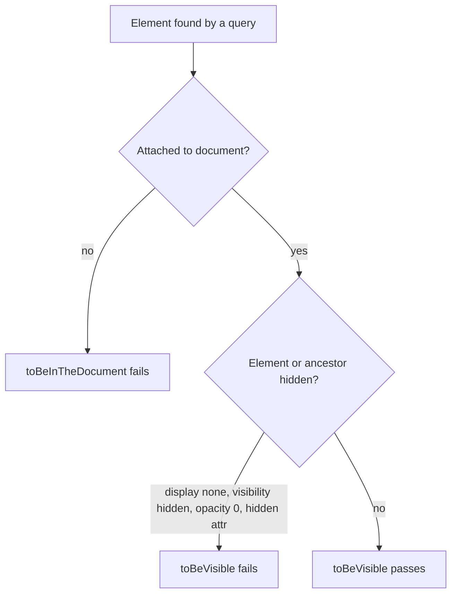
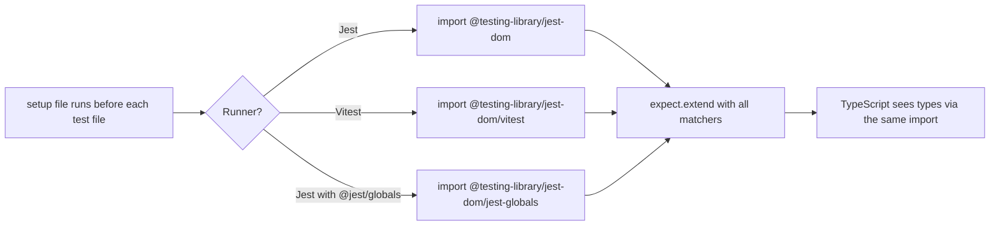

## 1. What it is

**jest-dom adds DOM-specific matchers to `expect`, such as `toBeInTheDocument()`, `toBeDisabled()` and `toHaveValue()`.**

Think of a building inspector with a checklist. Without the checklist, the inspector has to measure every wire by hand and compare numbers. With it, they just tick "fire exit is unlocked" or "smoke alarm works". jest-dom is that checklist for the DOM. Instead of digging through element properties, you state what should be true in words a reviewer understands.

The problem it solves: plain `expect` only knows about values (`toBe`, `toEqual`). To check a button is disabled you would write `expect(button.hasAttribute('disabled')).toBe(true)`, and when it fails the message is "expected false to be true", which tells you nothing. jest-dom matchers read better and fail with messages that print the element and what was wrong.

## 2. Core concepts

### [Beginner] Matchers are just functions added to `expect`

Jest and Vitest let libraries register new matchers with `expect.extend`. jest-dom calls that for you when you import it once in a setup file.

```ts
// Without jest-dom
expect(button.hasAttribute('disabled')).toBe(true);
// Fails with: expected false to be true   (useless)

// With jest-dom
expect(button).toBeDisabled();
// Fails with: Received element is not disabled: <button type="submit">Transfer</button>
```

> **Why:** Good failure messages save more time than any other test feature. A failing test that prints the element tells you the cause without opening a debugger.

### [Beginner] Presence and visibility

```tsx
import { render, screen } from '@testing-library/react';

render(<AccountSummary accountId="acc_1" />);

// In the document at all?
expect(screen.getByRole('heading', { name: /checking/i })).toBeInTheDocument();
expect(screen.queryByRole('alert')).not.toBeInTheDocument();

// Visible to the user?
expect(screen.getByText('Available balance')).toBeVisible();
```

`toBeInTheDocument` only checks that the node is attached to `document`. `toBeVisible` checks more: the element and all its ancestors have no `display: none`, no `visibility: hidden`, no `opacity: 0`, no `hidden` attribute, and are not inside a closed `<details>`.



> **Gotcha:** jsdom does not load your CSS files. If a CSS class from a stylesheet or Tailwind hides the element, `toBeVisible` still passes. It only sees inline styles, `<style>` tags injected at runtime (CSS-in-JS), and the `hidden` attribute. For true visual checks use a real browser.

### [Beginner] Text and values

```tsx
// Text content (includes descendants)
expect(screen.getByRole('status')).toHaveTextContent('Transfer scheduled');
expect(screen.getByTestId('balance')).toHaveTextContent(/^\$1,234\.56$/); // regex for exact

// Form values
expect(screen.getByLabelText(/amount/i)).toHaveValue('250.00');        // type="text"
expect(screen.getByLabelText(/quantity/i)).toHaveValue(10);            // type="number" gives a number
expect(screen.getByLabelText(/currency/i)).toHaveValue('EUR');         // <select>
expect(screen.getByLabelText(/memo/i)).toHaveValue('');                // empty text input

// What the user sees in the field (useful for selects showing labels)
expect(screen.getByLabelText(/currency/i)).toHaveDisplayValue('Euro (EUR)');
```

> **Gotcha:** `toHaveTextContent('100')` with a **string** is a substring match. It passes for `$1,100.00` and for `$100.00`. When the exact amount matters, use a regex with anchors: `toHaveTextContent(/^\$100\.00$/)`.

> **Gotcha:** `toHaveValue` returns a number for `type="number"` inputs and `null` when that input is empty. It does not work on checkboxes or radios. Use `toBeChecked` for those.

### [Intermediate] State: disabled, checked, required, invalid

```tsx
const submit = screen.getByRole('button', { name: /confirm transfer/i });
expect(submit).toBeDisabled();
expect(submit).not.toBeEnabled();

expect(screen.getByRole('checkbox', { name: /save payee/i })).toBeChecked();
expect(screen.getByRole('radio', { name: /one-time/i })).not.toBeChecked();
expect(screen.getByRole('checkbox', { name: /select all/i })).toBePartiallyChecked(); // indeterminate

expect(screen.getByLabelText(/routing number/i)).toBeRequired();
expect(screen.getByLabelText(/routing number/i)).toBeInvalid(); // aria-invalid or failed constraint
expect(screen.getByLabelText(/amount/i)).toHaveFocus();
```

> **Gotcha:** `toBeDisabled` checks the native `disabled` attribute (also inherited from a disabled `<fieldset>`). It ignores `aria-disabled="true"`. If your design system uses `aria-disabled` so the button stays focusable, assert `toHaveAttribute('aria-disabled', 'true')` instead.

### [Intermediate] Attributes, classes and styles

```tsx
const link = screen.getByRole('link', { name: /download statement/i });
expect(link).toHaveAttribute('href', '/statements/2026-09.pdf');
expect(link).toHaveAttribute('download');          // presence only, any value

const badge = screen.getByText('Overdue');
expect(badge).toHaveClass('badge', 'badge--danger'); // contains all of these
expect(badge).toHaveClass('badge badge--danger', { exact: true }); // exactly these, nothing else

expect(screen.getByRole('progressbar')).toHaveStyle({ width: '75%' });
```

> **Why be careful with toHaveClass:** class names are usually styling implementation details. Prefer asserting on meaning: text ("Overdue"), role, or an ARIA state. Use `toHaveClass` when the class *is* the contract, such as a design-system variant.

### [Intermediate] Accessibility matchers

```tsx
// Icon-only button: is it labelled for screen readers?
expect(screen.getByRole('button', { name: /hide balance/i })).toHaveAccessibleName('Hide balance');

// Hint text linked by aria-describedby
expect(screen.getByLabelText(/amount/i)).toHaveAccessibleDescription(/max \$10,000 per day/i);

// Error linked by aria-errormessage (element must also have aria-invalid="true")
expect(screen.getByLabelText(/amount/i)).toHaveAccessibleErrorMessage(/exceeds available balance/i);
```

> **Outdated:** `toHaveErrorMessage` is deprecated in favor of `toHaveAccessibleErrorMessage`. `toBeEmpty` was replaced by `toBeEmptyDOMElement`. `import '@testing-library/jest-dom/extend-expect'` was removed in v6; import the package root instead.

### [Advanced] `toHaveFormValues`: the whole form in one assertion

Called on a `<form>` or `<fieldset>`. It returns an object keyed by each control's `name` attribute.

```tsx
render(<PayeeForm defaultValues={payee} />);

expect(screen.getByRole('form', { name: /new payee/i })).toHaveFormValues({
  payeeName: 'City Water Utility',
  accountNumber: '000987654',
  currency: 'USD',          // <select>
  saveForLater: true,       // single checkbox -> boolean
  notifyBy: ['email'],      // checkboxes sharing a name -> array
  paymentType: 'recurring', // radio group -> selected value
});
```

> **Gotcha:** `getByRole('form')` only finds a `<form>` that has an accessible name (`aria-label` or `aria-labelledby`). An unnamed `<form>` has no `form` role in the accessibility tree.

> **Finance tip:** `toHaveFormValues` is great for "edit beneficiary" or "update address" screens that pre-fill from an API. One assertion proves every field loaded correctly, which matters when a wrong pre-filled routing number would send money to the wrong place.

### [Advanced] How the setup works for Jest vs Vitest



```ts
// The /vitest entry is roughly this:
import * as matchers from '@testing-library/jest-dom/matchers';
import { expect } from 'vitest';
expect.extend(matchers);
// plus a type augmentation of Vitest's Assertion interface
```

> **Why separate entry points?** Jest puts `expect` on the global object. Vitest's `expect` is imported from `vitest` and has its own TypeScript interface. Each entry extends the right `expect` and augments the right types.

## 3. Why it's used in this project

- **Money forms.** `toHaveValue`, `toBeDisabled`, `toBeInvalid` and `toHaveAccessibleErrorMessage` cover the core rules of transfer and payment forms: no double submit, clear errors, correct pre-filled values.
- **Exact amounts.** `toHaveTextContent(/^-\$1,200\.00$/)` pins the full formatted string so `$1,200.00` vs `-$1,200.00` (debit vs credit) cannot slip through.
- **Masked PII.** `expect(cell).toHaveTextContent('••••4821')` and `not.toHaveTextContent(/\d{9,}/)` guard against showing full account numbers.
- **Accessibility compliance.** Icon buttons ("show/hide balance", "download CSV") must have accessible names; `toHaveAccessibleName` proves it.
- **Readable failures in CI.** When a test on a 300-line statement page fails, the matcher prints the offending element, not "expected false to be true".

## 4. Setup & configuration

```bash
npm i -D @testing-library/jest-dom
```

**Vitest** (`src/test/setup.ts`, referenced from `test.setupFiles` in `vitest.config.ts`):

```ts
// Registers matchers on Vitest's expect AND adds TypeScript types
import '@testing-library/jest-dom/vitest';
```

**Jest** (`jest.config.ts`):

```ts
import type { Config } from 'jest';

const config: Config = {
  testEnvironment: 'jsdom',                            // needs jest-environment-jsdom installed
  setupFilesAfterEnv: ['<rootDir>/src/test/setup.ts'], // runs after the test framework is installed
};
export default config;
```

```ts
// src/test/setup.ts (Jest)
import '@testing-library/jest-dom';
```

**TypeScript.** Since v6 the types ship inside the package. The import in the setup file is enough, as long as TypeScript includes that file:

```json
{
  "compilerOptions": {
    "types": ["vitest/globals"]   // Jest: ["jest", "@testing-library/jest-dom"]
  },
  "include": ["src", "src/test/setup.ts"] // setup file must be part of the program
}
```

> **Outdated:** `@types/testing-library__jest-dom` is no longer needed with jest-dom v6. Remove it; mismatched versions cause "Property toBeInTheDocument does not exist" errors.

> **Gotcha:** If the editor shows `Property 'toBeInTheDocument' does not exist on type 'Assertion'` but tests run fine, TypeScript is not seeing the setup file. Add it to `include`, or add `/// <reference types="@testing-library/jest-dom/vitest" />` to a `.d.ts` file.

## 5. Key features we use

```tsx
// Submit stays disabled until the form is valid
expect(screen.getByRole('button', { name: /review transfer/i })).toBeDisabled();
await user.type(screen.getByLabelText(/amount/i), '50');
expect(screen.getByRole('button', { name: /review transfer/i })).toBeEnabled();

// Exact formatted balance
expect(screen.getByRole('status', { name: /available balance/i })).toHaveTextContent(/^\$2,500\.00$/);

// Error message wired up accessibly
const amount = screen.getByLabelText(/amount/i);
expect(amount).toHaveAttribute('aria-invalid', 'true');
expect(amount).toHaveAccessibleErrorMessage('Amount exceeds daily limit');

// Toggle balance visibility
await user.click(screen.getByRole('button', { name: /hide balance/i }));
expect(screen.getByRole('button', { name: /show balance/i })).toHaveAttribute('aria-pressed', 'false');
expect(screen.queryByText('$2,500.00')).not.toBeInTheDocument();

// Pre-filled edit form
expect(screen.getByRole('form', { name: /edit payee/i })).toHaveFormValues({
  payeeName: 'Landlord LLC',
  amount: '1200.00',
});
```

## 6. Interview questions

#### Q: What is the difference between toBeInTheDocument and toBeVisible?

`toBeInTheDocument` only checks that the element is attached to `document`. `toBeVisible` also checks that neither the element nor any ancestor is hidden by `display: none`, `visibility: hidden`, `opacity: 0`, the `hidden` attribute, or a closed `<details>`. In jsdom, external stylesheets are not loaded, so class-based hiding is not detected.

#### Q: Why use jest-dom matchers instead of plain expect checks?

Readability and failure messages. `expect(btn).toBeDisabled()` states intent; `expect(btn.hasAttribute('disabled')).toBe(true)` states mechanics. On failure jest-dom prints the element and the actual state, so you can diagnose without a debugger. Matchers also encode edge cases you would forget, like a button inside a disabled fieldset.

#### Q: How do you set up jest-dom with Vitest and TypeScript?

Install it, add a setup file listed in `test.setupFiles`, and put `import '@testing-library/jest-dom/vitest'` in it. That entry calls `expect.extend` on Vitest's `expect` and augments Vitest's `Assertion` types. Make sure the setup file is in the TypeScript program (`include`). No `@types` package is needed in v6.

#### Q: What is a pitfall of toHaveTextContent?

With a string argument it does a substring match after normalizing whitespace. `toHaveTextContent('100')` passes for `$1,100.00`. For exact values use an anchored regex like `/^\$100\.00$/`. It also includes text from all descendants, including visually hidden text such as screen-reader-only labels.

#### Q: How would you assert an accessible error message on a form field?

Set `aria-invalid="true"` on the input and point `aria-errormessage` (or `aria-describedby`) at the error element. Then `expect(input).toHaveAccessibleErrorMessage(/exceeds balance/i)` or `toHaveAccessibleDescription(...)`. This proves a screen-reader user hears the error, not just that red text exists somewhere.

## 7. Drawbacks & pain points

- **jsdom limits.** `toBeVisible` and `toHaveStyle` only see inline and runtime-injected styles. Tailwind or CSS-module classes are invisible to them.
- **Type setup friction.** Mixed `@types` packages and setup files outside `include` cause confusing TS errors.
- **Easy to over-assert on details.** `toHaveClass('text-red-500')` couples tests to styling.
- **Substring text matching** surprises people with money values.

Gotchas that trip devs up:

```tsx
// 1. Substring match passes on the wrong amount
expect(el).toHaveTextContent('100');          // passes for "$1,100.00"
expect(el).toHaveTextContent(/^\$100\.00$/);  // exact

// 2. aria-disabled is not "disabled"
<button aria-disabled="true">Pay</button>
expect(btn).toBeDisabled();                    // FAILS
expect(btn).toHaveAttribute('aria-disabled', 'true'); // passes

// 3. Number inputs
expect(screen.getByLabelText(/shares/i)).toHaveValue('10'); // FAILS: value is number 10

// 4. Asserting on null from getBy is impossible - getBy throws first
expect(screen.getByText('Error')).not.toBeInTheDocument();   // throws
expect(screen.queryByText('Error')).not.toBeInTheDocument(); // correct
```

## 8. Better alternatives

jest-dom remains the standard for jsdom-based tests. The newer pattern is **built-in, retrying matchers in real-browser runners**:

- **Vitest Browser Mode** ships `expect.element(locator)` with jest-dom-style matchers (`toBeVisible`, `toHaveTextContent`, `toBeDisabled`) that retry until they pass, in a real browser with real CSS.
- **Playwright** web-first assertions (`await expect(locator).toBeVisible()`) also retry automatically and understand real layout.
- **Plain `expect`** works for non-DOM code; no library needed.

| Option | Bundle/install | Boilerplate | Retries | Real CSS | TS support | Popularity | When it wins |
|---|---|---|---|---|---|---|---|
| jest-dom | ~small dev dep | one import | no | no | built in | very high | Jest/Vitest + jsdom component tests |
| Vitest Browser `expect.element` | part of Vitest browser | low | yes | yes | built in | growing | browser-mode component tests |
| Playwright assertions | part of Playwright | low | yes | yes | built in | very high | e2e and Playwright CT |
| Plain expect on properties | none | high | no | no | yes | n/a | trivial checks only |

## 9. When NOT to use it

- **Non-DOM code**: reducers, formatters, interest calculations. Use plain `toBe` / `toEqual`.
- **Visual correctness** (color of a negative amount, layout of a statement). Use screenshot or browser tests.
- **Real-browser runners** that already include equivalent matchers (Playwright, Vitest Browser Mode).
- **Class-name assertions as a habit.** If you reach for `toHaveClass` constantly, assert on roles, text and ARIA state instead.

## Cheatsheet

| Matcher | Checks | Example |
|---|---|---|
| `toBeInTheDocument()` | attached to document | `expect(el).toBeInTheDocument()` |
| `toBeVisible()` | not hidden by styles/attrs | `expect(el).toBeVisible()` |
| `toBeEmptyDOMElement()` | no child nodes | `expect(list).toBeEmptyDOMElement()` |
| `toHaveTextContent(t)` | text (substring if string) | `toHaveTextContent(/^\$5\.00$/)` |
| `toHaveValue(v)` | input/select/textarea value | `toHaveValue('EUR')`, `toHaveValue(10)` |
| `toHaveDisplayValue(v)` | displayed value | `toHaveDisplayValue('Euro (EUR)')` |
| `toBeDisabled()` / `toBeEnabled()` | native disabled | `expect(btn).toBeDisabled()` |
| `toBeChecked()` / `toBePartiallyChecked()` | checkbox/radio/switch | `expect(cb).toBeChecked()` |
| `toBeRequired()` / `toBeInvalid()` / `toBeValid()` | form validity | `expect(input).toBeInvalid()` |
| `toHaveFocus()` | is `document.activeElement` | `expect(input).toHaveFocus()` |
| `toHaveAttribute(a, v?)` | attribute present / equals | `toHaveAttribute('href', '/x')` |
| `toHaveClass(...c, { exact })` | classes | `toHaveClass('badge')` |
| `toHaveStyle(css)` | computed style (jsdom: inline and style tags only) | `toHaveStyle({ width: '50%' })` |
| `toHaveAccessibleName(n)` | computed accessible name | `toHaveAccessibleName('Hide balance')` |
| `toHaveAccessibleDescription(d)` | aria-describedby text | `toHaveAccessibleDescription(/limit/)` |
| `toHaveAccessibleErrorMessage(m)` | aria-errormessage text | `toHaveAccessibleErrorMessage(/required/)` |
| `toHaveFormValues(obj)` | all named controls in a form | `toHaveFormValues({ currency: 'USD' })` |
| `toContainElement(el)` | descendant check | `expect(table).toContainElement(row)` |

```ts
// Vitest setup:  import '@testing-library/jest-dom/vitest';
// Jest setup:    import '@testing-library/jest-dom';
// @jest/globals: import '@testing-library/jest-dom/jest-globals';
```
