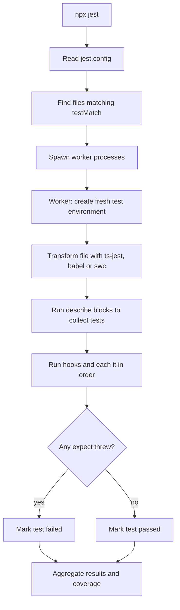
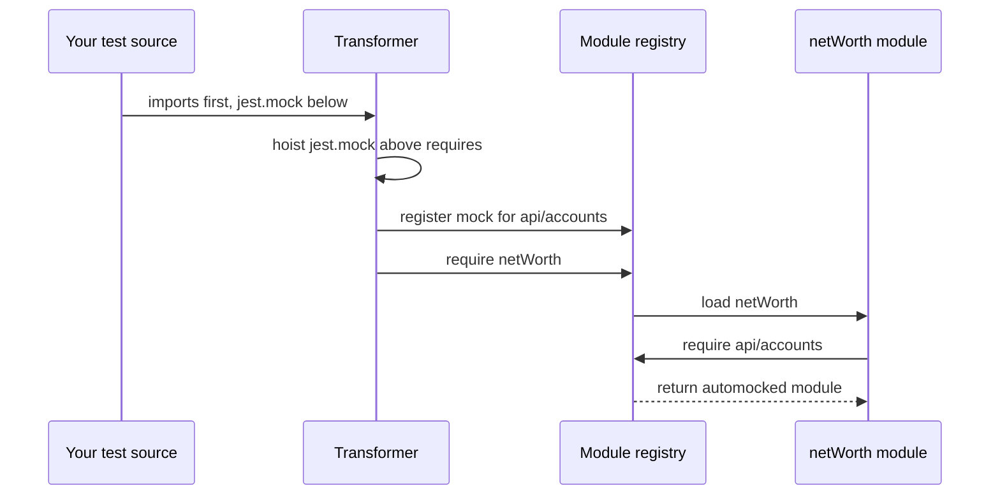
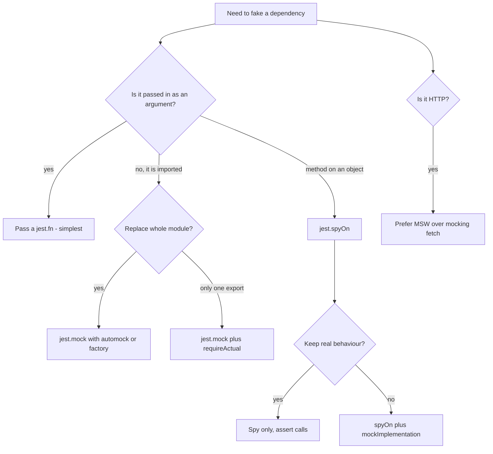
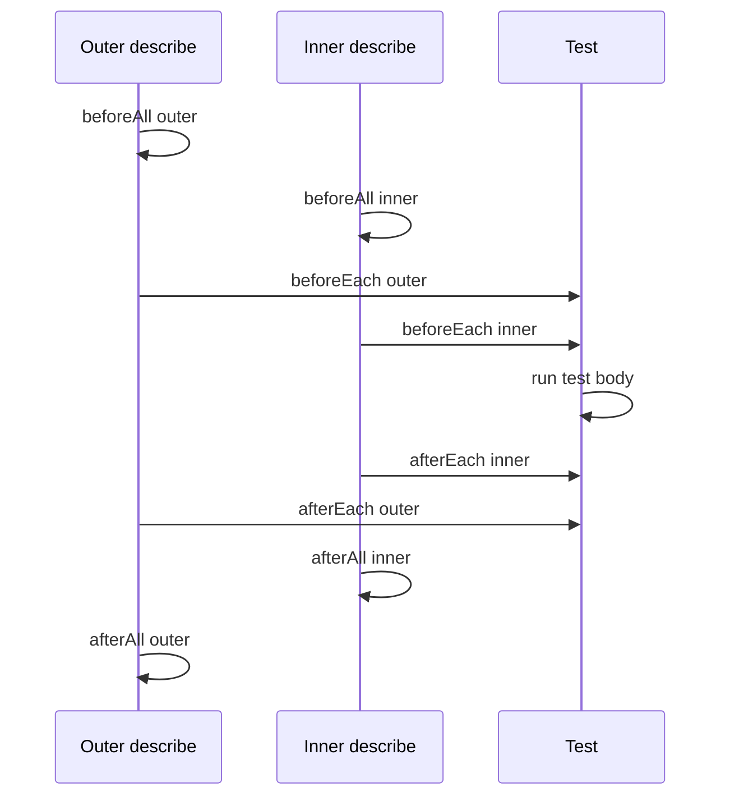
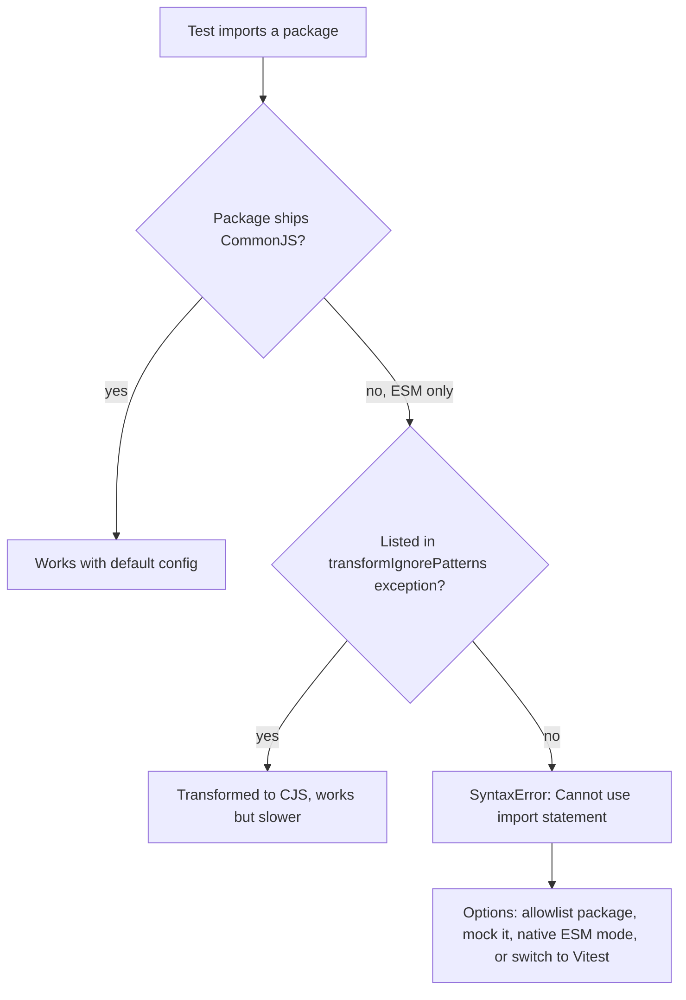
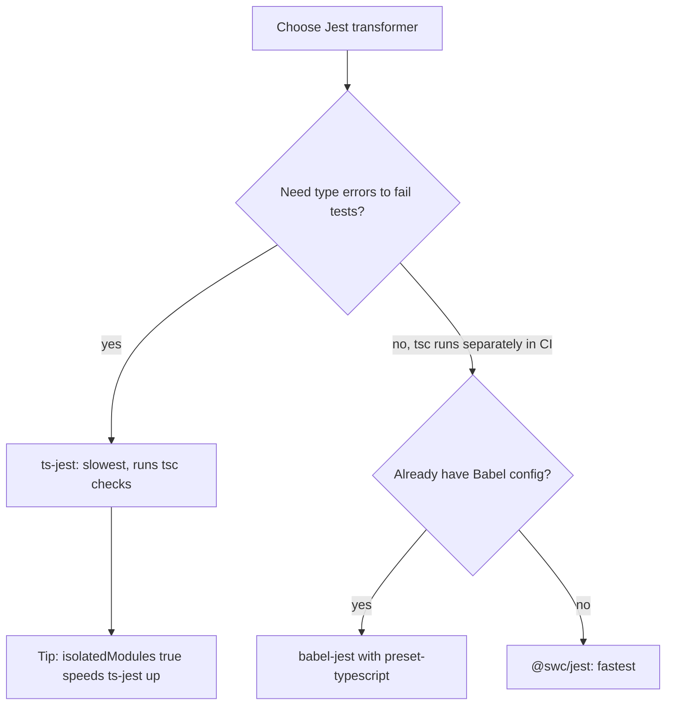

## 1. What it is

**Jest is a JavaScript test runner, assertion library, and mocking toolkit bundled into one package.**

Think of Jest as an exam proctor. You write the questions (tests) and the answer key (expectations). Jest gathers every exam paper in the building (finds `*.test.ts` files), hands each one to a separate room (worker process), watches the clock, swaps real tools for fake ones when you ask (mocks), and at the end posts a report of who passed and who failed.

The problem it solves: before Jest, a JavaScript test setup meant gluing together Mocha (runner), Chai (assertions), Sinon (mocks), Istanbul (coverage), and Karma (browser). Each had its own config and version conflicts. Jest ships all of that in one install with sensible defaults, so `npx jest` works on day one. That "zero config" promise is why it became the default for React projects for almost a decade.

## 2. Core concepts

### [Beginner] The anatomy of a test file

A test file is ordinary TypeScript that Jest executes. Three globals do most of the work:

- `describe(name, fn)` groups related tests. It is only for organisation and readable output.
- `it(name, fn)` (alias `test`) defines one test case. If the function throws, the test fails.
- `expect(value)` wraps a value and gives you matchers like `.toBe()`. A failed matcher throws an error.

```ts
// src/money/formatCents.ts
export function formatCents(amountCents: number, currency = 'USD'): string {
  return new Intl.NumberFormat('en-US', { style: 'currency', currency }).format(amountCents / 100);
}

// src/money/formatCents.test.ts
import { formatCents } from './formatCents';

describe('formatCents', () => {
  it('formats whole dollars', () => {
    expect(formatCents(150000)).toBe('$1,500.00');
  });

  it('formats negative amounts for refunds', () => {
    expect(formatCents(-2599)).toBe('-$25.99');
  });

  it('supports other currencies', () => {
    expect(formatCents(1000, 'EUR')).toBe('€10.00');
  });
});
```

> **Why:** A test "passes" simply because its function finished without throwing. `expect(...).toBe(...)` is nothing magic: it is a function that throws a nicely formatted error when the comparison fails. Once you know that, you understand why a test with no `expect` at all still passes, and why an async test that forgets to `await` can pass even though the assertion later fails.

The life of a test run looks like this:



> **Why:** Each test file runs in its own isolated module registry and environment. That is why a global you set in one file does not leak into another, and also why Jest can run files in parallel across CPU cores.

### [Beginner] toBe vs toEqual vs toStrictEqual

This is the single most asked Jest question. The difference is *how* equality is checked.

- `toBe` uses `Object.is`. It checks identity. Two different objects with the same content are **not** `toBe`-equal.
- `toEqual` recursively compares values. It ignores properties whose value is `undefined` and does not care about the class of an object.
- `toStrictEqual` is `toEqual` plus: `undefined` properties count, class types must match, and sparse array holes differ from `undefined`.

```ts
type Account = { id: string; balanceCents: number; nickname?: string };

class SavingsAccount {
  constructor(public id: string, public balanceCents: number) {}
}

it('shows how the three equality matchers differ', () => {
  const a: Account = { id: 'acc_1', balanceCents: 5000 };
  const b: Account = { id: 'acc_1', balanceCents: 5000, nickname: undefined };

  expect(a).not.toBe(b);          // different references
  expect(a).toEqual(b);           // undefined property ignored
  expect(a).not.toStrictEqual(b); // undefined property counts

  const plain = { id: 'acc_2', balanceCents: 100 };
  const instance = new SavingsAccount('acc_2', 100);
  expect(instance).toEqual(plain);           // class ignored
  expect(instance).not.toStrictEqual(plain); // class checked

  expect(0.1 + 0.2).not.toBe(0.3);           // floating point
  expect(0.1 + 0.2).toBeCloseTo(0.3, 5);     // use toBeCloseTo for floats
});
```

> **Finance tip:** `0.1 + 0.2 !== 0.3` is exactly why money should be stored as integer cents. If you see `toBeCloseTo` in a money test, ask whether the production code should be using cents instead.

> **Interview tip:** Say "toBe is reference identity via Object.is; toEqual is deep structural equality; toStrictEqual also checks undefined keys and prototypes. I default to toStrictEqual for API response shapes so a stray undefined field is caught."

### [Beginner] The everyday matchers

```ts
it('uses common matchers', () => {
  const tx = { id: 'tx_1', amountCents: -1200, tags: ['food', 'card'], note: null };

  expect(tx.amountCents).toBeLessThan(0);
  expect(tx.tags).toContain('food');
  expect(tx.tags).toHaveLength(2);
  expect(tx.note).toBeNull();
  expect(tx).toHaveProperty('id', 'tx_1');
  expect('ACC-00123').toMatch(/^ACC-\d{5}$/);
  expect(undefined).toBeUndefined();
  expect([]).toBeTruthy(); // careful: empty arrays are truthy
});
```

### [Beginner] Testing errors with toThrow

`toThrow` needs a **function**, not a value. Jest must call it inside a try/catch to observe the throw. If you call the function yourself, the error escapes before `expect` ever runs.

```ts
class InsufficientFundsError extends Error {
  constructor(public shortByCents: number) {
    super(`Insufficient funds: short by ${shortByCents} cents`);
    this.name = 'InsufficientFundsError';
  }
}

function withdraw(balanceCents: number, amountCents: number): number {
  if (amountCents <= 0) throw new RangeError('Amount must be positive');
  if (amountCents > balanceCents) throw new InsufficientFundsError(amountCents - balanceCents);
  return balanceCents - amountCents;
}

it('throws when overdrawing', () => {
  expect(() => withdraw(1000, 5000)).toThrow(InsufficientFundsError); // by class
  expect(() => withdraw(1000, 5000)).toThrow('short by 4000 cents');  // by substring
  expect(() => withdraw(1000, 0)).toThrow(/positive/);                 // by regex
});

// WRONG: withdraw runs before expect, the error fails the test as an uncaught error
// expect(withdraw(1000, 5000)).toThrow();

it('rejects async errors', async () => {
  const fetchBalance = async (): Promise<number> => {
    throw new Error('401 Unauthorized');
  };
  await expect(fetchBalance()).rejects.toThrow('401');
});
```

> **Gotcha:** For promises use `await expect(promise).rejects.toThrow()`. Forgetting the `await` means the test finishes before the promise settles, and the test passes no matter what.

### [Intermediate] toMatchObject and asymmetric matchers

Real objects contain IDs, timestamps, and generated values you cannot predict. You have two tools:

- `toMatchObject(subset)` passes if the received object contains at least the given properties (recursively). Extra properties are fine.
- **Asymmetric matchers** are placeholders that match a category of values: `expect.any(Number)`, `expect.anything()`, `expect.stringMatching(/re/)`, `expect.stringContaining('x')`, `expect.objectContaining({})`, `expect.arrayContaining([])`, `expect.closeTo(n, digits)`.

They are called asymmetric because `expect.any(String)` equals `'abc'`, but `'abc'` used as the matcher would not equal `expect.any(String)`. The comparison only works one way.

```ts
function createTransaction(accountId: string, amountCents: number) {
  return {
    id: crypto.randomUUID(),
    accountId,
    amountCents,
    status: 'pending' as const,
    createdAt: new Date().toISOString(),
    audit: { createdBy: 'system', version: 1 },
  };
}

it('creates a pending transaction', () => {
  const tx = createTransaction('acc_9', 2500);

  expect(tx).toMatchObject({ accountId: 'acc_9', amountCents: 2500, status: 'pending' });

  expect(tx).toStrictEqual({
    id: expect.stringMatching(/^[0-9a-f-]{36}$/),
    accountId: 'acc_9',
    amountCents: 2500,
    status: 'pending',
    createdAt: expect.any(String),
    audit: expect.objectContaining({ version: 1 }),
  });
});

it('asymmetric matchers work inside call assertions too', () => {
  const logAudit = jest.fn();
  logAudit({ action: 'TRANSFER', at: Date.now(), userId: 'u_1' });
  expect(logAudit).toHaveBeenCalledWith(
    expect.objectContaining({ action: 'TRANSFER', at: expect.any(Number) }),
  );
});
```

> **Why:** Using `toStrictEqual` with asymmetric matchers for the unpredictable fields gives you the best of both: the test fails if anyone adds or removes a field (strict shape), yet does not break on random IDs.

### [Intermediate] Mock functions with jest.fn

A mock function is a fake function that **records every call** and lets you **program its return value**. You use it to replace a dependency so the unit you test is isolated, and to assert "was this called, with what".

```ts
type Rates = Record<string, number>;
type RateClient = { getRates: (base: string) => Promise<Rates> };

async function convert(client: RateClient, amountCents: number, from: string, to: string) {
  const rates = await client.getRates(from);
  const rate = rates[to];
  if (rate === undefined) throw new Error(`No rate for ${to}`);
  return Math.round(amountCents * rate);
}

describe('convert', () => {
  it('multiplies by the rate', async () => {
    const getRates = jest.fn<Promise<Rates>, [string]>().mockResolvedValue({ EUR: 0.92 });

    await expect(convert({ getRates }, 10000, 'USD', 'EUR')).resolves.toBe(9200);

    expect(getRates).toHaveBeenCalledTimes(1);
    expect(getRates).toHaveBeenCalledWith('USD');
    expect(getRates.mock.calls[0][0]).toBe('USD'); // raw call log
  });

  it('can program different results per call', () => {
    const nextId = jest
      .fn<string, []>()
      .mockReturnValueOnce('tx_1')
      .mockReturnValueOnce('tx_2')
      .mockReturnValue('tx_default');

    expect([nextId(), nextId(), nextId()]).toEqual(['tx_1', 'tx_2', 'tx_default']);
  });

  it('can run custom logic with mockImplementation', () => {
    const fee = jest.fn((amountCents: number) => Math.max(50, Math.round(amountCents * 0.01)));
    expect(fee(1000)).toBe(50);
    expect(fee(100000)).toBe(1000);

    fee.mockImplementationOnce(() => 0); // promo: first transfer free
  });

  it('can simulate failures', async () => {
    const getRates = jest.fn().mockRejectedValue(new Error('Rate service down'));
    await expect(convert({ getRates }, 100, 'USD', 'EUR')).rejects.toThrow('down');
  });
});
```

| Method | What it does |
|---|---|
| `mockReturnValue(v)` | Always return `v` |
| `mockReturnValueOnce(v)` | Return `v` for the next call only (queue) |
| `mockResolvedValue(v)` | Shorthand for `mockImplementation(() => Promise.resolve(v))` |
| `mockRejectedValue(e)` | Shorthand for returning `Promise.reject(e)` |
| `mockImplementation(fn)` | Run `fn` for every call |
| `mockClear()` | Wipe recorded calls, keep implementation |
| `mockReset()` | Wipe calls and implementation |
| `mockRestore()` | Reset and, for spies, put the original back |

### [Intermediate] Module mocking with jest.mock and hoisting

`jest.mock('./path')` replaces an entire module **for every importer in that test file**. Your component imports `../api/accounts`, and Jest hands it the fake version instead.

```ts
// src/api/accounts.ts
export async function fetchAccounts(): Promise<{ id: string; balanceCents: number }[]> {
  const res = await fetch('/api/accounts');
  if (!res.ok) throw new Error(`HTTP ${res.status}`);
  return res.json();
}

// src/services/netWorth.ts
import { fetchAccounts } from '../api/accounts';
export async function getNetWorthCents() {
  const accounts = await fetchAccounts();
  return accounts.reduce((sum, a) => sum + a.balanceCents, 0);
}

// src/services/netWorth.test.ts
import { getNetWorthCents } from './netWorth';
import { fetchAccounts } from '../api/accounts';

jest.mock('../api/accounts'); // automock: every export becomes jest.fn()

const mockedFetchAccounts = jest.mocked(fetchAccounts); // typed as jest.MockedFunction

it('sums balances across accounts', async () => {
  mockedFetchAccounts.mockResolvedValue([
    { id: 'chk', balanceCents: 120000 },
    { id: 'sav', balanceCents: 880000 },
  ]);
  await expect(getNetWorthCents()).resolves.toBe(1000000);
});
```

Notice something strange: `jest.mock` is written **after** the imports, yet it still affects them. That is hoisting.

> **Why:** ES `import` statements are evaluated before any other code in a file. If `jest.mock` ran in normal order, `./netWorth` would already have loaded the real `../api/accounts`. So Jest's Babel plugin (`babel-plugin-jest-hoist`, also applied by ts-jest and `@swc/jest`) rewrites your file, moving `jest.mock(...)` calls to the very top, above the imports (which are compiled to `require` calls). The mock is registered before anything loads.



Hoisting has a consequence: the factory function runs before your variables exist. Jest therefore forbids referencing outer variables in a factory, **except** ones whose names start with `mock` (case-insensitive), which it trusts you to initialise lazily.

```ts
import { getNetWorthCents } from './netWorth';

const mockFetchAccounts = jest.fn(); // allowed: name starts with "mock"

jest.mock('../api/accounts', () => ({
  // Lazy arrow so mockFetchAccounts is read at call time, not at hoist time
  fetchAccounts: (...args: unknown[]) => mockFetchAccounts(...args),
}));

// Partial mock: keep real exports, replace one
jest.mock('../utils/money', () => ({
  ...jest.requireActual<typeof import('../utils/money')>('../utils/money'),
  getFxRate: jest.fn(() => 1.1),
}));

it('works with a factory mock', async () => {
  mockFetchAccounts.mockResolvedValue([{ id: 'a', balanceCents: 5 }]);
  await expect(getNetWorthCents()).resolves.toBe(5);
});
```

> **Gotcha:** Referencing a non-`mock` variable such as `const fakeAccounts = [...]` inside the factory throws "The module factory of jest.mock() is not allowed to reference any out-of-scope variables". Rename it `mockAccounts`, or define the data inside the factory.

### [Intermediate] jest.spyOn: watch or replace one method

`jest.mock` swaps a whole module. `jest.spyOn(object, 'method')` wraps a single method on an existing object. By default the spy **calls through** to the real method while recording calls. Add `.mockImplementation` to replace it. Call `mockRestore()` to put the original back.

```ts
import * as analytics from '../lib/analytics';

const auditLog = {
  write(event: { type: string; accountId: string }) {
    /* sends to server */
  },
};

function closeAccount(accountId: string) {
  auditLog.write({ type: 'ACCOUNT_CLOSED', accountId });
  return { accountId, status: 'closed' as const };
}

afterEach(() => jest.restoreAllMocks());

it('writes an audit event when closing an account', () => {
  const spy = jest.spyOn(auditLog, 'write').mockImplementation(() => {});
  closeAccount('acc_42');
  expect(spy).toHaveBeenCalledWith({ type: 'ACCOUNT_CLOSED', accountId: 'acc_42' });
});

it('silences expected console errors', () => {
  const errorSpy = jest.spyOn(console, 'error').mockImplementation(() => {});
  // ...render a component that logs a known error...
  expect(errorSpy).not.toHaveBeenCalledWith(expect.stringContaining('Unexpected'));
});

it('spies on Date.now', () => {
  jest.spyOn(Date, 'now').mockReturnValue(new Date('2026-01-31T00:00:00Z').getTime());
  expect(Date.now()).toBe(1769817600000);
});
```

> **Gotcha:** `jest.spyOn(analytics, 'track')` on an ES module namespace often fails with "Cannot redefine property" when the code is native ESM or compiled by some transformers, because ESM exports are read-only live bindings. With CommonJS output (ts-jest or babel default) it usually works. If it fails, use `jest.mock` instead.

Which tool to use:



### [Intermediate] Setup and teardown hooks

Hooks run code around tests. Their scope is the `describe` block they are declared in (or the whole file at top level).

- `beforeAll` / `afterAll`: once per block. Use for expensive shared setup (start an MSW server).
- `beforeEach` / `afterEach`: around every test. Use to reset state so tests do not depend on order.

```ts
import { setupServer } from 'msw/node';
import { http, HttpResponse } from 'msw';

const server = setupServer(
  http.get('/api/accounts', () => HttpResponse.json([{ id: 'chk', balanceCents: 100 }])),
);

beforeAll(() => server.listen({ onUnhandledRequest: 'error' }));
afterEach(() => server.resetHandlers()); // undo per-test overrides
afterAll(() => server.close());

describe('portfolio', () => {
  let portfolio: { holdings: string[] };

  beforeEach(() => {
    portfolio = { holdings: ['AAPL'] }; // fresh object each test
  });

  it('adds a holding', () => {
    portfolio.holdings.push('MSFT');
    expect(portfolio.holdings).toHaveLength(2);
  });

  it('is not affected by the previous test', () => {
    expect(portfolio.holdings).toEqual(['AAPL']);
  });
});
```

Order of execution for nested blocks:



> **Why:** Outer `beforeEach` runs before inner `beforeEach`, and `afterEach` runs in reverse. It is a stack: the outer context is set up first and torn down last, like nested try/finally blocks.

> **Gotcha:** Code written directly inside `describe` (not inside a hook or test) runs during the **collection phase**, before any test or hook. Never do setup work there.

### [Intermediate] Fake timers

Session timeouts, debounced search, polling of prices, toast auto-dismiss: all depend on `setTimeout` / `setInterval`. Waiting real seconds makes tests slow and flaky. Fake timers replace the global timer functions (and `Date`) with a controllable clock.

```ts
function startSessionTimer(onExpire: () => void, idleMs = 15 * 60_000) {
  let id = setTimeout(onExpire, idleMs);
  return {
    touch() {
      clearTimeout(id);
      id = setTimeout(onExpire, idleMs);
    },
  };
}

describe('session timeout', () => {
  beforeEach(() => {
    jest.useFakeTimers();
    jest.setSystemTime(new Date('2026-10-01T09:00:00Z'));
  });
  afterEach(() => jest.useRealTimers());

  it('expires after 15 idle minutes', () => {
    const onExpire = jest.fn();
    startSessionTimer(onExpire);

    jest.advanceTimersByTime(14 * 60_000);
    expect(onExpire).not.toHaveBeenCalled();

    jest.advanceTimersByTime(60_000);
    expect(onExpire).toHaveBeenCalledTimes(1);
  });

  it('activity resets the timer', () => {
    const onExpire = jest.fn();
    const session = startSessionTimer(onExpire);
    jest.advanceTimersByTime(10 * 60_000);
    session.touch();
    jest.advanceTimersByTime(10 * 60_000);
    expect(onExpire).not.toHaveBeenCalled();
  });

  it('handles timers mixed with promises', async () => {
    const poll = jest.fn().mockResolvedValue({ price: 101.5 });
    const loop = async () => {
      await poll();
      setTimeout(loop, 5000);
    };
    void loop();
    await jest.advanceTimersByTimeAsync(10_000); // flushes microtasks between timers
    expect(poll).toHaveBeenCalledTimes(3);
  });
});
```

> **Why:** Since Jest 27 the default "modern" fake timers come from `@sinonjs/fake-timers`, which also fakes `Date`. That is why `jest.setSystemTime` works and why `new Date()` returns your chosen time. The `...Async` variants (Jest 29.5+) exist because a timer callback that awaits a promise schedules more work in the microtask queue, which the synchronous `advanceTimersByTime` never drains.

> **Gotcha:** Testing Library's `userEvent` uses timers internally. With fake timers, create it as `userEvent.setup({ advanceTimers: jest.advanceTimersByTime })` or interactions hang.

### [Advanced] Snapshot testing

`toMatchSnapshot()` serialises a value (often a rendered component) to a `.snap` file on first run. Later runs compare against it. `toMatchInlineSnapshot()` writes the snapshot into the test file itself.

```tsx
import { render } from '@testing-library/react';
import { TransactionRow } from './TransactionRow';
import { formatStatementLine } from './formatStatementLine';
import { createTransaction } from './createTransaction';

it('renders a debit row', () => {
  const { container } = render(
    <TransactionRow tx={{ id: 'tx_1', description: 'Coffee', amountCents: -450, currency: 'USD' }} />,
  );
  expect(container.firstChild).toMatchSnapshot();
});

it('formats the statement line', () => {
  expect(formatStatementLine({ date: '2026-09-30', description: 'Rent', amountCents: -180000 }))
    .toMatchInlineSnapshot(`"2026-09-30  Rent                -$1,800.00"`);
});

it('ignores volatile fields with property matchers', () => {
  expect(createTransaction('acc_1', 100)).toMatchSnapshot({
    id: expect.any(String),
    createdAt: expect.any(String),
  });
});
```

Pros:
- Almost free to write; catches unintended changes in large output.
- Good for stable, serialisable output: formatted reports, CSV exports, error messages, config objects.

Cons:
- Large component snapshots are rubber-stamped. Developers press `u` to update without reading the diff.
- They test implementation (class names, wrapper divs), so harmless refactors fail them.
- They say nothing about intent. A reviewer cannot tell what "correct" is.

> **Interview tip:** A mature answer: "I use small inline snapshots for pure output like a formatted statement line or a serialized API payload. For components I prefer explicit Testing Library assertions on what the user sees, because big DOM snapshots get updated blindly."

### [Advanced] Mock state: clear, reset, restore

Mocks remember calls across tests in the same file unless you clean them. Three config flags automate cleanup between tests:

```ts
// jest.config.ts excerpt
const config = {
  clearMocks: true,   // mock.calls and mock.results wiped before each test
  resetMocks: false,  // also removes implementations - often too aggressive
  restoreMocks: true, // spies restored to originals before each test
};
export default config;
```

> **Gotcha:** `resetMocks: true` also wipes implementations you set inside `jest.mock` factories, so a mocked `fetchAccounts` suddenly returns `undefined`. Most teams use `clearMocks` plus `restoreMocks` and set implementations in `beforeEach`.

### [Advanced] ESM in Jest: why it hurts

Jest was built on CommonJS. It controls modules by intercepting `require`, which is synchronous and patchable. Native ES modules are loaded by Node's own loader, asynchronously, with read-only bindings. Jest cannot intercept that the same way.

What it means in practice:

1. Most setups **transpile your ESM to CommonJS** (ts-jest, babel-jest, `@swc/jest`). Your `import` statements become `require` calls and everything works.
2. But `node_modules` is **not transformed by default** (`transformIgnorePatterns`). Many packages are now ESM-only (for example `nanoid` 4+, `d3` 7, newer `uuid`, some `@faker-js/faker` versions). Jest then fails with `SyntaxError: Cannot use import statement outside a module`.
3. Native ESM mode exists but still needs `node --experimental-vm-modules`, and `jest.mock` does not hoist there. You must use `jest.unstable_mockModule` plus a dynamic `await import()`.

```ts
// Workaround 1: transform specific ESM packages in node_modules
// jest.config.ts
export default {
  transformIgnorePatterns: ['/node_modules/(?!(nanoid|d3-.*|@faker-js)/)'],
};

// Workaround 2: native ESM mode (package.json "type": "module")
// run: NODE_OPTIONS=--experimental-vm-modules npx jest
import { jest } from '@jest/globals';

jest.unstable_mockModule('../api/accounts', () => ({
  fetchAccounts: jest.fn(async () => [{ id: 'a', balanceCents: 1 }]),
}));

const { getNetWorthCents } = await import('../services/netWorth'); // must be dynamic, after the mock
```

> **Outdated:** `import.meta.env` (used by Vite apps) does not exist in Jest's CommonJS world. Vite projects tested with Jest need a babel plugin or a manual mock for it. This friction is the main reason Vite projects move to Vitest.



## 3. Why it's used in this project

Financial apps have a high cost of silent mistakes. A rounding bug that shows `$1,000.01` instead of `$1,000.00` destroys user trust and may break reconciliation. Jest gives fast, isolated unit tests for the logic that matters most:

- **Money math and formatting.** `formatCents`, FX conversion, fee calculation, interest accrual, and rounding rules (banker's rounding vs half-up) are pure functions. Jest tests them in milliseconds with table-driven `it.each`.
- **Transaction list logic.** Sorting, filtering by date range, grouping 10k transactions by month, running-balance calculation. Test the pure selectors without rendering anything.
- **Session timeouts for compliance.** Regulators and security teams often require auto-logout after idle time. Fake timers let you prove "logs out after exactly 15 minutes, resets on activity" without waiting.
- **Okta and auth flows.** `jest.mock('@okta/okta-react')` lets you render protected routes as an authenticated or anonymous user without a real identity provider.
- **Audit trails.** `jest.spyOn(auditLog, 'write')` proves that every sensitive action (transfer, close account, change payee) emits an audit event with the right payload.
- **PII masking.** Assert that account numbers render as `****1234` and that full numbers never reach `console` or analytics calls.
- **Legacy reality.** Many existing finance codebases started on Create React App, which shipped with Jest. You will likely inherit Jest config even if new projects use Vitest.

```ts
import { maskAccountNumber } from './mask';

describe('maskAccountNumber', () => {
  it.each([
    ['12345678', '****5678'],
    ['9876543210123', '****0123'],
    ['12', '****12'],
  ])('masks %s as %s', (input, expected) => {
    expect(maskAccountNumber(input)).toBe(expected);
  });
});
```

> **Finance tip:** Write a test that renders the account details page and asserts `screen.queryByText('12345678')` is `null`. It is a cheap guard against a future refactor accidentally leaking the full account number into the DOM.

## 4. Setup & configuration

### [Beginner] Install

```bash
# Core runner plus a TypeScript transformer and DOM environment
npm i -D jest @types/jest ts-jest jest-environment-jsdom

# React testing helpers
npm i -D @testing-library/react @testing-library/jest-dom @testing-library/user-event

# Generate a starter config
npx jest --init
```

> **Outdated:** Since Jest 28, `jsdom` is no longer bundled. If you set `testEnvironment: 'jsdom'` and forget `jest-environment-jsdom`, Jest errors out. Old tutorials skip this step.

### [Intermediate] jest.config.ts with every key option

```ts
// jest.config.ts  (TypeScript config needs ts-node installed, or use jest.config.js)
import type { Config } from 'jest';

const config: Config = {
  // Where tests run. 'node' (default) is faster; 'jsdom' gives document/window for React.
  testEnvironment: 'jsdom',

  // Which files are tests. Default already matches *.test.ts(x) and __tests__ folders.
  testMatch: ['<rootDir>/src/**/*.test.{ts,tsx}'],

  // Runs BEFORE the test framework is installed (no expect/jest hooks yet).
  // Use for polyfills like TextEncoder or env variables.
  setupFiles: ['<rootDir>/test/polyfills.ts'],

  // Runs AFTER the framework is installed, before each test file.
  // The correct name is setupFilesAfterEnv. "setupFilesAfterEach" does not exist.
  // Use for jest-dom matchers, MSW server, global afterEach cleanup.
  setupFilesAfterEnv: ['<rootDir>/test/setupTests.ts'],

  // How source is compiled. Pick ONE transformer.
  transform: {
    '^.+\\.(t|j)sx?$': ['ts-jest', { tsconfig: '<rootDir>/tsconfig.test.json' }],
    // Alternatives:
    // '^.+\\.(t|j)sx?$': 'babel-jest',      // uses babel.config.js, no type checking
    // '^.+\\.(t|j)sx?$': '@swc/jest',       // Rust-based, much faster, no type checking
  },

  // node_modules is skipped by transform. Allowlist ESM-only packages here.
  transformIgnorePatterns: ['/node_modules/(?!(nanoid|@faker-js)/)'],

  // Rewrite import paths. Jest does not read tsconfig "paths" or Vite aliases.
  moduleNameMapper: {
    '^@/(.*)$': '<rootDir>/src/$1',                           // path alias
    '\\.(css|scss|sass)$': 'identity-obj-proxy',             // CSS modules return class names
    '\\.(png|jpg|svg|woff2?)$': '<rootDir>/test/fileMock.ts', // static assets
  },

  // Mock hygiene between tests.
  clearMocks: true,
  restoreMocks: true,

  // Coverage.
  collectCoverageFrom: ['src/**/*.{ts,tsx}', '!src/**/*.stories.tsx', '!src/**/index.ts'],
  coverageProvider: 'v8', // 'babel' (default) instruments code; 'v8' uses the engine, faster
  coverageReporters: ['text', 'lcov'],
  coverageThreshold: {
    global: { branches: 80, functions: 80, lines: 85, statements: 85 },
    // Stricter bar for money logic
    './src/money/': { branches: 100, functions: 100, lines: 100, statements: 100 },
  },

  // Performance and output.
  maxWorkers: '50%',
  testTimeout: 10_000,
};

export default config;
```

### [Intermediate] Setup file

```ts
// test/setupTests.ts
import '@testing-library/jest-dom'; // adds toBeInTheDocument, toHaveTextContent, ...
import { server } from './mswServer';

beforeAll(() => server.listen({ onUnhandledRequest: 'error' }));
afterEach(() => server.resetHandlers());
afterAll(() => server.close());
```

### [Intermediate] Choosing a transformer



> **Why:** ts-jest type-checks each file, which is slow and duplicates what `tsc --noEmit` already does in CI. Babel and SWC just strip types. Most teams pick `@swc/jest` and run `tsc` as a separate CI step.

### [Beginner] package.json scripts

```json
{
  "scripts": {
    "test": "jest",
    "test:watch": "jest --watch",
    "test:ci": "jest --ci --coverage --maxWorkers=2"
  }
}
```

## 5. Key features we use

### [Beginner] Table-driven tests with it.each

```ts
import { calculateFeeCents } from './fees';

describe('calculateFeeCents', () => {
  it.each`
    amountCents | tier          | expected
    ${10_000}   | ${'standard'} | ${100}
    ${10_000}   | ${'premium'}  | ${0}
    ${100}      | ${'standard'} | ${50}
  `('charges $expected for $amountCents on $tier', ({ amountCents, tier, expected }) => {
    expect(calculateFeeCents(amountCents, tier)).toBe(expected);
  });
});
```

### [Beginner] Focus and skip

```ts
it.only('runs only this test in the file', () => {});
it.skip('temporarily disabled', () => {});
it.todo('handles leap-year interest accrual');
```

> **Gotcha:** A committed `it.only` silently skips the rest of the file in CI. Add an ESLint rule (`jest/no-focused-tests`) to block it.

### [Intermediate] Testing a React component with mocks

```tsx
import { render, screen } from '@testing-library/react';
import userEvent from '@testing-library/user-event';
import { TransferForm } from './TransferForm';
import { submitTransfer } from '../api/transfers';

jest.mock('../api/transfers');
const mockedSubmit = jest.mocked(submitTransfer);

it('submits the amount in cents', async () => {
  mockedSubmit.mockResolvedValue({ id: 'tr_1', status: 'queued' });
  const user = userEvent.setup();

  render(<TransferForm fromAccountId="chk_1" />);
  await user.type(screen.getByLabelText(/amount/i), '125.50');
  await user.click(screen.getByRole('button', { name: /send/i }));

  expect(mockedSubmit).toHaveBeenCalledWith({ fromAccountId: 'chk_1', amountCents: 12550 });
  expect(await screen.findByText(/queued/i)).toBeInTheDocument();
});
```

### [Intermediate] Mocking Okta auth

```tsx
jest.mock('@okta/okta-react', () => ({
  useOktaAuth: () => ({
    authState: { isAuthenticated: true, idToken: { claims: { email: 'jo@bank.test' } } },
    oktaAuth: { signOut: jest.fn() },
  }),
}));
```

### [Intermediate] Custom matchers

```ts
// test/matchers.ts
expect.extend({
  toBeWholeCents(received: number) {
    const pass = Number.isInteger(received);
    return {
      pass,
      message: () => `expected ${received} ${pass ? 'not ' : ''}to be an integer number of cents`,
    };
  },
});

declare module 'expect' {
  interface Matchers<R> {
    toBeWholeCents(): R;
  }
}

// usage
expect(calculateInterestCents(10_000, 0.035)).toBeWholeCents();
```

> **Gotcha:** Where you augment the type depends on which globals you use. With `@types/jest` augment `declare global { namespace jest { interface Matchers<R> { ... } } }`; with `@jest/globals` augment the `expect` module as above.

### [Intermediate] Useful CLI flags

```bash
npx jest src/money                 # only tests under a path
npx jest -t "session timeout"      # only tests whose name matches
npx jest --watch                   # rerun tests related to changed files (needs git)
npx jest --coverage                # coverage report
npx jest --runInBand               # single process, for debugging
npx jest -u                        # update snapshots (read the diff first)
```

## 6. Interview questions

#### Q: What is the difference between toBe, toEqual and toStrictEqual?

`toBe` uses `Object.is`, so it checks identity for objects and value for primitives. `toEqual` does a recursive structural comparison, ignoring properties with `undefined` values and ignoring the object's class. `toStrictEqual` is also structural but treats `{a: undefined}` and `{}` as different, checks that prototypes or classes match, and treats sparse array holes differently from `undefined`. Use `toBe` for primitives, `toStrictEqual` for data shapes such as API payloads.

#### Q: Why does jest.mock work even though it is written below the import statements?

Jest's transformer (`babel-plugin-jest-hoist`, also used inside ts-jest and `@swc/jest`) moves `jest.mock` calls to the top of the compiled file, above the `require` calls the imports become. The mock is registered in the module registry before any module loads, so every importer receives the fake. Because the factory runs before the rest of the file, it cannot reference outer variables, except ones prefixed with `mock`, which Jest allows on the assumption you only read them lazily at call time.

#### Q: When would you use jest.spyOn instead of jest.mock?

`jest.spyOn` targets one method on an existing object and, by default, keeps the real behaviour while recording calls. It is ideal for verifying side effects such as `auditLog.write` or `console.error`, or for stubbing `Date.now`, and it can be undone with `mockRestore`. `jest.mock` replaces an entire module for the whole test file, which suits network or SDK modules you never want to run. For HTTP, mocking at the network layer with MSW is usually better than either, because the real fetch code path is exercised.

#### Q: How do you test code that uses setTimeout, like an idle-session logout?

Call `jest.useFakeTimers()` in `beforeEach` and `jest.useRealTimers()` in `afterEach`. Then drive the clock with `jest.advanceTimersByTime(ms)`, `runOnlyPendingTimers`, or the `...Async` versions when promises are involved. Modern fake timers also fake `Date`, so `jest.setSystemTime` pins "now". Assert the callback was not called just before the threshold and was called exactly once at it. With `userEvent`, pass `advanceTimers: jest.advanceTimersByTime` to `userEvent.setup`.

#### Q: Why is ESM support painful in Jest and how do you work around it?

Jest's module system was built around intercepting synchronous CommonJS `require`. Native ESM is loaded asynchronously by Node with immutable bindings, so Jest's mocking and isolation do not map cleanly. Native ESM mode still needs `--experimental-vm-modules`, and `jest.mock` hoisting does not work there, so you use `jest.unstable_mockModule` with dynamic `import()`. The common workarounds are to transpile to CJS, allowlist ESM-only packages in `transformIgnorePatterns`, mock those packages, or move to Vitest, which is ESM-native.

> **Interview tip:** Mention that you would test behaviour, not implementation: assert on outputs and visible UI, mock only at boundaries (network, time, randomness), and keep money logic in pure functions with 100% branch coverage.

## 7. Drawbacks & pain points

- **ESM friction.** ESM-only dependencies and `import.meta` need workarounds. Native ESM mode is still flagged experimental.
- **Separate config from your bundler.** Vite or webpack aliases, env variables, SVG and CSS handling must be re-declared in `moduleNameMapper` and `transform`. The two drift apart.
- **Speed.** Each test file gets a fresh module registry and environment. With ts-jest and jsdom, a large suite can take minutes. SWC helps but does not remove the isolation cost.
- **Global magic.** `describe`, `it`, `jest` appear as globals. Type support depends on `@types/jest` being in `tsconfig` types, which conflicts with other test globals (Cypress, Mocha).
- **jsdom is not a browser.** No layout, no real CSS, no IntersectionObserver. Tests can pass while the real UI is broken.
- **Mock overuse.** `jest.mock` makes it easy to mock everything, producing tests that only verify your mocks.

Gotchas that trip devs up:

```ts
// 1. Forgetting await on async assertions: always passes
it('bad', () => {
  expect(fetchBalance()).resolves.toBe(100); // no await, no return
});

// 2. toThrow on a value instead of a function
expect(parseAmount('abc')).toThrow();        // error escapes, test crashes
expect(() => parseAmount('abc')).toThrow();  // correct

// 3. Mock state leaking between tests
const track = jest.fn();
it('a', () => { track('x'); expect(track).toHaveBeenCalledTimes(1); });
it('b', () => { track('y'); expect(track).toHaveBeenCalledTimes(1); }); // fails: 2, unless clearMocks

// 4. Spy on the wrong reference
import { getRate } from './fx';
jest.spyOn(fxModule, 'getRate'); // code that already destructured getRate keeps the original

// 5. Fake timers left on
it('uses fake timers', () => { jest.useFakeTimers(); /* ... */ }); // no useRealTimers: next tests hang on await
```

> **Gotcha:** `toBeTruthy()` on an empty array or `{}` passes. Prefer specific matchers like `toHaveLength(0)` or `toStrictEqual({})`.

> **Outdated:** Jest 30 (released mid 2025) removed long-deprecated alias matchers such as `toBeCalled`, `toBeCalledWith`, `toReturn`, and `toThrowError`. Use `toHaveBeenCalled`, `toHaveBeenCalledWith`, `toHaveReturned`, and `toThrow`. It also renamed the CLI flag `--testPathPattern` to `--testPathPatterns` and dropped older Node versions.

## 8. Better alternatives

The industry trend for Vite-based React apps is **Vitest**. It reuses the Vite config and transforms, is ESM-native, and has a Jest-compatible API, so migration is mostly find-and-replace. For component behaviour in a real browser, teams add **Vitest browser mode** or **Playwright component testing**. Node's built-in **`node:test`** is growing for back-end and library code with zero dependencies. Jest remains solid and widely deployed, especially in Next.js (with `next/jest`), React Native, and older CRA or webpack projects.

| Tool | Install size | Boilerplate | Devtools / UI | Learning curve | TypeScript support | Popularity | When it wins |
|---|---|---|---|---|---|---|---|
| Jest 30 | ~30 MB node_modules | Medium: transform plus mapper config | CLI watch, IDE plugins | Low | Via ts-jest, babel or swc | Very high, legacy default | React Native, existing CRA or webpack suites, huge ecosystem |
| Vitest 3/4 | ~15-20 MB node_modules | Low: reuses vite.config | Vitest UI, browser mode, IDE plugin | Low if you know Jest | Native via esbuild | High and rising fast | Vite projects, ESM-first code, fast watch |
| node:test | 0, built into Node | Low | Minimal | Low | Via Node type stripping or tsx | Growing | Libraries, back-end utils, zero deps |
| Playwright CT | ~browsers ~300 MB | Medium | Trace viewer, UI mode | Medium | Native | Medium | Components needing real layout and CSS |
| Mocha + Chai + Sinon | ~5 MB | High: assemble yourself | Minimal | Medium | Via ts-node | Declining | Legacy Node services |

Sizes are approximate and vary with dependencies.

## 9. When NOT to use it

- New Vite-based React apps: Vitest gives the same API with far less config and native ESM.
- Your codebase or dependencies are ESM-only and you rely heavily on module mocking.
- You need real layout, scrolling, or CSS behaviour (virtualized transaction tables, sticky headers, charts sized by `ResizeObserver`): use a real browser via Playwright or Vitest browser mode.
- End-to-end flows across pages, Okta redirects, and real network: use Playwright or Cypress.
- Tiny utility libraries where `node:test` with no dependencies is enough.
- Visual regressions (pixel diffs of a statement PDF or chart): use Playwright screenshots or a visual testing service, not DOM snapshots.

## Cheatsheet

| Need | API |
|---|---|
| Group / test | `describe('x', fn)`, `it('y', fn)`, `it.each(table)` |
| Identity / deep / strict | `toBe`, `toEqual`, `toStrictEqual` |
| Partial object | `toMatchObject({...})`, `expect.objectContaining({...})` |
| Placeholders | `expect.any(Number)`, `expect.anything()`, `expect.stringMatching(/re/)`, `expect.arrayContaining([])` |
| Numbers | `toBeGreaterThan`, `toBeLessThanOrEqual`, `toBeCloseTo(n, digits)` |
| Errors | `expect(() => fn()).toThrow(ErrClass)`, `await expect(p).rejects.toThrow('msg')` |
| Promises | `await expect(p).resolves.toBe(v)` |
| Mock fn | `jest.fn()`, `.mockReturnValue`, `.mockResolvedValue`, `.mockImplementation`, `...Once` |
| Call checks | `toHaveBeenCalled`, `toHaveBeenCalledTimes(n)`, `toHaveBeenCalledWith(...)`, `toHaveBeenLastCalledWith` |
| Module mock | `jest.mock('./m')`, `jest.mock('./m', () => ({...}))`, `jest.requireActual('./m')`, `jest.mocked(fn)` |
| Spy | `jest.spyOn(obj, 'method')`, `.mockRestore()`, `jest.restoreAllMocks()` |
| Timers | `jest.useFakeTimers()`, `jest.advanceTimersByTime(ms)`, `jest.advanceTimersByTimeAsync(ms)`, `jest.runAllTimers()`, `jest.setSystemTime(date)`, `jest.useRealTimers()` |
| Hooks | `beforeAll`, `beforeEach`, `afterEach`, `afterAll` |
| Snapshots | `toMatchSnapshot()`, `toMatchInlineSnapshot()`, `jest -u` |

```ts
// Minimal template
import { thing } from './thing';
import { dep } from './dep';

jest.mock('./dep');
const mockedDep = jest.mocked(dep);

describe('thing', () => {
  beforeEach(() => {
    jest.useFakeTimers();
    mockedDep.mockResolvedValue({ ok: true });
  });
  afterEach(() => jest.useRealTimers());

  it('does the thing', async () => {
    await expect(thing()).resolves.toStrictEqual({ ok: true, at: expect.any(Number) });
    expect(mockedDep).toHaveBeenCalledTimes(1);
  });
});
```
