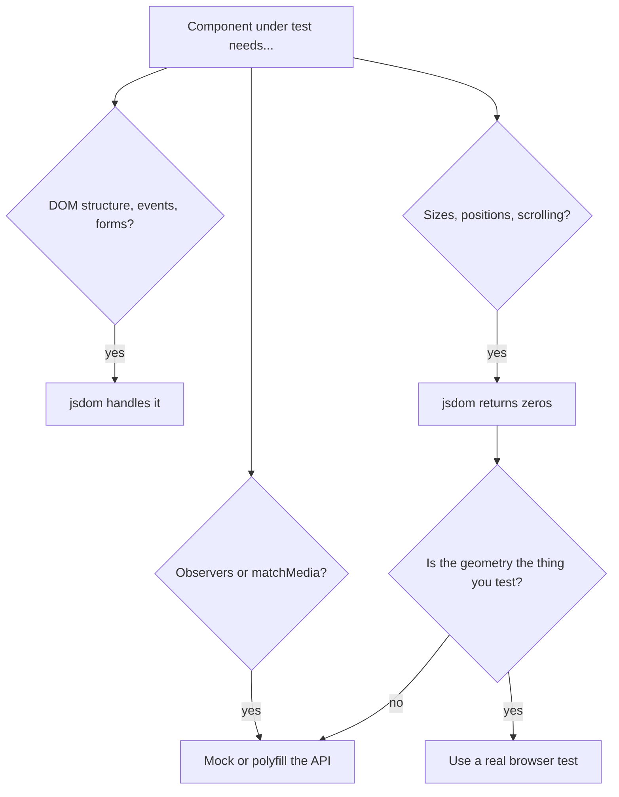
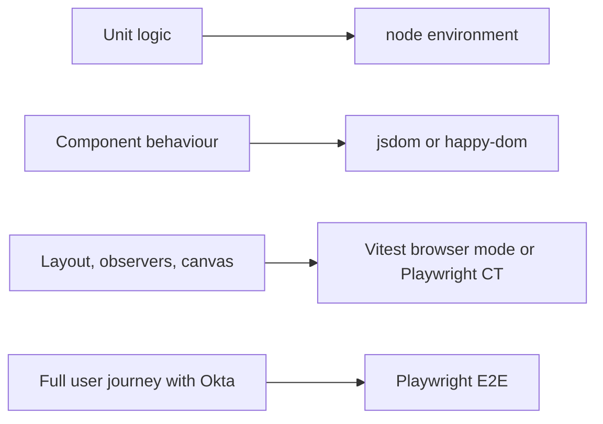

## 1. What it is

**jsdom is a pure-JavaScript implementation of the DOM and many web APIs that runs inside Node.js, with no real browser.**

Think of it as a flight simulator. The cockpit has every button and dial (`document`, `querySelector`, `click` events, forms), and they respond correctly. But there is no sky, no wind, no engine: nothing is actually drawn. You can practise procedures perfectly, but you cannot test how the plane handles turbulence.

The problem it solves: React component tests need `document.createElement`, event dispatch, and form behaviour, but launching a real browser for every test is slow and heavy. jsdom gives a DOM in milliseconds inside the same Node process that runs Jest or Vitest. The cost is that it does no rendering, so anything that depends on layout or real visual output is missing or faked.

## 2. Core concepts

### [Beginner] What jsdom simulates

jsdom implements the DOM tree, HTML parsing, CSS selectors, events and bubbling, forms and validation, `localStorage`, `URL`, timers, and basic `getComputedStyle` (cascaded values, not layout).

```ts
// @vitest-environment jsdom
import { it, expect, vi } from 'vitest';

it('builds and queries DOM like a browser', () => {
  document.body.innerHTML = `
    <form id="transfer">
      <input name="amount" required />
      <button type="submit">Send</button>
    </form>`;

  const form = document.querySelector<HTMLFormElement>('#transfer')!;
  const input = form.elements.namedItem('amount') as HTMLInputElement;
  const onSubmit = vi.fn((e: Event) => e.preventDefault());
  form.addEventListener('submit', onSubmit);

  expect(form.checkValidity()).toBe(false); // constraint validation works
  input.value = '125.50';
  form.requestSubmit();
  expect(onSubmit).toHaveBeenCalledOnce();

  localStorage.setItem('lastAccount', 'chk_1');
  expect(localStorage.getItem('lastAccount')).toBe('chk_1');
});
```

### [Beginner] What jsdom does NOT simulate

jsdom has **no layout engine**. It never calculates where boxes go or how big they are. Everything that depends on geometry returns zeros or is missing.

| API | In jsdom | Why it matters for us |
|---|---|---|
| `getBoundingClientRect()` | Returns all zeros | Tooltips, dropdown positioning, chart sizing |
| `offsetWidth`, `clientHeight`, `scrollHeight` | `0` | Virtualized lists think there is no room for rows |
| `IntersectionObserver` | Not defined | Infinite scroll on transaction history, lazy charts |
| `ResizeObserver` | Not defined | Responsive charts and tables |
| `window.matchMedia` | Not defined | Dark mode, responsive hooks |
| `window.scrollTo`, `element.scrollIntoView` | Not implemented (logs error or undefined) | Scroll to first form error |
| `HTMLCanvasElement.getContext` | Returns `null` with a "not implemented" message | Canvas-based charts |
| CSS media queries, animations, `:hover` | Not applied | Visual states |
| Navigation (`location.assign` to another page) | Not implemented | Okta redirects |



> **Why:** Layout requires a CSS engine, font metrics, and a rendering pipeline. Implementing that is essentially writing a browser. jsdom deliberately stops at the DOM and web-platform logic.

### [Intermediate] Polyfilling and mocking missing APIs

Put mocks in the setup file so every test gets them. Keep them minimal and controllable.

```ts
// test/setupTests.ts
import { vi } from 'vitest';

// matchMedia: default to "no match", tests can override
Object.defineProperty(window, 'matchMedia', {
  writable: true,
  value: vi.fn((query: string) => ({
    matches: false,
    media: query,
    onchange: null,
    addEventListener: vi.fn(),
    removeEventListener: vi.fn(),
    addListener: vi.fn(),    // deprecated, some libs still call it
    removeListener: vi.fn(),
    dispatchEvent: vi.fn(),
  })),
});

// ResizeObserver: no-op class
class ResizeObserverStub {
  observe = vi.fn();
  unobserve = vi.fn();
  disconnect = vi.fn();
}
vi.stubGlobal('ResizeObserver', ResizeObserverStub);

// IntersectionObserver: capture the callback so tests can trigger it
type IOCallback = IntersectionObserverCallback;
export const ioInstances: { cb: IOCallback; el?: Element }[] = [];
class IntersectionObserverStub {
  constructor(public cb: IOCallback) {
    ioInstances.push({ cb });
  }
  observe = vi.fn((el: Element) => {
    ioInstances[ioInstances.length - 1].el = el;
  });
  unobserve = vi.fn();
  disconnect = vi.fn();
  takeRecords = vi.fn(() => []);
  root = null;
  rootMargin = '';
  thresholds = [];
}
vi.stubGlobal('IntersectionObserver', IntersectionObserverStub);

// Scrolling
window.scrollTo = vi.fn() as unknown as typeof window.scrollTo;
Element.prototype.scrollIntoView = vi.fn();
```

Triggering the observer in a test, for example "load more transactions when the sentinel scrolls into view":

```tsx
import { act, render, screen } from '@testing-library/react';
import { it, expect } from 'vitest';
import { ioInstances } from '../test/setupTests';
import { TransactionHistory } from './TransactionHistory';

it('loads the next page when the sentinel becomes visible', async () => {
  render(<TransactionHistory accountId="chk_1" />);
  const { cb, el } = ioInstances.at(-1)!;

  act(() => {
    cb([{ isIntersecting: true, target: el! } as IntersectionObserverEntry], {} as IntersectionObserver);
  });

  expect(await screen.findByText(/page 2/i)).toBeInTheDocument();
});
```

Faking geometry when a library (for example a virtualized table) needs non-zero sizes:

```ts
import { beforeEach, vi } from 'vitest';

beforeEach(() => {
  vi.spyOn(HTMLElement.prototype, 'offsetHeight', 'get').mockReturnValue(600);
  vi.spyOn(HTMLElement.prototype, 'offsetWidth', 'get').mockReturnValue(1024);
  vi.spyOn(Element.prototype, 'getBoundingClientRect').mockReturnValue({
    x: 0, y: 0, top: 0, left: 0, bottom: 600, right: 1024, width: 1024, height: 600,
    toJSON: () => ({}),
  } as DOMRect);
});
```

> **Gotcha:** Faking geometry tells the component what you want to hear. The test proves your logic given those numbers, not that the real layout works. If a bug report is "rows overlap in Safari", jsdom cannot catch it.

### [Intermediate] Test environment setup

```ts
// Vitest: vite.config.ts
export default defineConfig({
  test: { environment: 'jsdom', setupFiles: ['./test/setupTests.ts'] },
});

// Jest: jest.config.ts (needs the separate jest-environment-jsdom package since Jest 28)
export default { testEnvironment: 'jsdom', setupFilesAfterEnv: ['<rootDir>/test/setupTests.ts'] };
```

Per-file override, so pure logic tests stay in fast `node`:

```ts
/**
 * @vitest-environment jsdom
 */
// Jest equivalent: @jest-environment jsdom
```

You can also pass jsdom options, such as the page URL (which drives `window.location` and `localStorage` origin):

```ts
test: {
  environment: 'jsdom',
  environmentOptions: { jsdom: { url: 'https://app.bank.test/accounts' } },
}
```

> **Gotcha:** In Jest's jsdom environment, Node globals such as `TextEncoder`, `structuredClone`, `fetch`, or `BroadcastChannel` may be missing because the environment exposes jsdom's window, not Node's globals. MSW v2 needs several of these. Polyfill them in `setupFiles`, or use Vitest, which generally keeps Node's globals available.

### [Advanced] The happy-dom alternative

happy-dom is another DOM implementation focused on speed. Switch with `environment: 'happy-dom'`.

- Usually faster to start and run.
- Implements less, and some behaviours differ (selectors, form validation edge cases, event details).
- Also has no real layout.

Rule of thumb: start with jsdom for correctness. Try happy-dom if suite time hurts, and run the suite to see what breaks.

### [Advanced] Real-browser testing

When the thing you test is layout, scrolling, real CSS, or browser APIs, use a real browser.



**Vitest browser mode** runs Vitest tests inside Chromium, Firefox, or WebKit via Playwright. Same `expect`, same config file.

**Playwright component testing** (`@playwright/experimental-ct-react`) mounts one component in a real browser page and drives it with Playwright locators. Still labelled experimental.

```tsx
// TransactionTable.ct.tsx  (Playwright component testing)
import { test, expect } from '@playwright/experimental-ct-react';
import { TransactionTable } from './TransactionTable';

test('sticky header stays visible while scrolling', async ({ mount, page }) => {
  const rows = Array.from({ length: 500 }, (_, i) => ({ id: `tx_${i}`, description: `Item ${i}`, amountCents: -i }));
  const component = await mount(<TransactionTable rows={rows} height={400} />);
  await component.locator('[data-testid="scroll-body"]').evaluate((el) => (el.scrollTop = 5000));
  await expect(component.getByRole('columnheader', { name: 'Amount' })).toBeInViewport();
});
```

## 3. Why it's used in this project

- **Most component tests.** Forms (transfer, payee, account settings), validation messages, error banners, and Okta-guarded routes are DOM-and-events problems. jsdom handles them quickly.
- **Money inputs.** Typing `1,234.5` into a currency input and checking the formatted value and emitted cents is pure DOM behaviour.
- **Known limits we mock.** Dashboard charts use `ResizeObserver`; transaction history uses `IntersectionObserver` for infinite scroll; theme hooks use `matchMedia`. We stub these once in the setup file.
- **What we do not trust jsdom for.** The virtualized 10k-row table, sticky report headers, and chart rendering get real-browser tests.

> **Finance tip:** PII masking tests (account number shows `****1234`) are perfect jsdom tests: fast, deterministic, and they check the DOM text the user would see.

## 4. Setup & configuration

```bash
# Vitest
npm i -D jsdom
# Jest
npm i -D jest-environment-jsdom
```

```ts
// vite.config.ts
export default defineConfig({
  test: {
    environment: 'jsdom',                    // provides window, document
    environmentOptions: {
      jsdom: { url: 'https://app.bank.test' }, // sets location and storage origin
    },
    setupFiles: ['./test/setupTests.ts'],     // polyfills for matchMedia and observers
  },
});
```

## 5. Key features we use

```ts
// Dispatching events directly (prefer user-event in component tests)
const input = document.createElement('input');
input.addEventListener('input', (e) => console.log((e.target as HTMLInputElement).value));
input.value = '50.00';
input.dispatchEvent(new Event('input', { bubbles: true }));

// Overriding matchMedia per test for a responsive layout
vi.mocked(window.matchMedia).mockImplementation((query: string) => ({
  matches: query.includes('max-width'), // pretend we are on a small screen
  media: query,
  onchange: null,
  addEventListener: vi.fn(),
  removeEventListener: vi.fn(),
  addListener: vi.fn(),
  removeListener: vi.fn(),
  dispatchEvent: vi.fn(),
}));

// Controlling URL for route-based components
window.history.pushState({}, '', '/accounts/chk_1/transactions?month=2026-09');
```

## 6. Interview questions

#### Q: Why does getBoundingClientRect return zeros in tests?

jsdom implements the DOM but has no layout engine, so it never computes positions or sizes. All geometry APIs return zero. If a component depends on sizes, either mock the values for logic tests or run that test in a real browser.

#### Q: How do you test a component that uses IntersectionObserver?

Stub `IntersectionObserver` globally in the setup file with a class that records its callback and observed element. In the test, call the callback with a fake entry `{ isIntersecting: true }` inside `act`, then assert the result, such as the next page of transactions appearing.

#### Q: What is the difference between jsdom and happy-dom?

Both are DOM implementations in JavaScript with no layout. jsdom is older, more complete, and spec-focused. happy-dom is lighter and generally faster but implements fewer APIs and differs in edge cases. jsdom is the safer default.

#### Q: When would you move a test out of jsdom into a real browser?

When the behaviour depends on layout, scrolling, CSS, canvas, or real browser APIs: virtualized lists, sticky headers, tooltips positioning, charts, focus management across iframes. Vitest browser mode or Playwright component testing run the same component in Chromium for real.

#### Q: Why might MSW fail in a Jest jsdom environment?

The Jest jsdom environment exposes jsdom's window as the global scope, which lacks some Node globals MSW relies on, such as `TextEncoder`, `fetch`-related classes, or `BroadcastChannel`. Fix with polyfills in `setupFiles` (or a custom environment), or use Vitest, which typically keeps Node's globals.

## 7. Drawbacks & pain points

- False confidence: tests pass while real layout is broken.
- Every missing API needs a stub, and stubs drift from real behaviour.
- Slower than the `node` environment; using jsdom for pure logic tests wastes time.
- `console.error: Not implemented: window.scrollTo` noise in test output.
- Navigation is not implemented, so redirect-based auth flows (Okta) cannot be tested end to end.

```ts
// Gotcha: stubbing with a plain object instead of a class
vi.stubGlobal('ResizeObserver', { observe: vi.fn() }); // "ResizeObserver is not a constructor"
vi.stubGlobal('ResizeObserver', class { observe() {} unobserve() {} disconnect() {} }); // correct
```

## 8. Better alternatives

The trend is a layered approach: `node` for logic, jsdom for most components, and real browsers for layout-sensitive parts, now that Vitest browser mode is stable.

| Option | Speed | Setup | Layout | TypeScript | Popularity | When it wins |
|---|---|---|---|---|---|---|
| jsdom | Medium | Low | None | Yes | Very high | Default component tests |
| happy-dom | Fast | Low | None | Yes | Medium | Large suites, simple DOM |
| Vitest browser mode | Slower, ~seconds startup | Medium, needs Playwright | Real | Yes | Rising | Layout, observers, canvas |
| Playwright CT | Slower | Medium | Real | Yes | Medium | Visual and interaction fidelity |
| Playwright E2E | Slowest | High | Real | Yes | High | Full journeys, Okta login |

## 9. When NOT to use it

- Pure functions (money math, selectors, date grouping): use the `node` environment.
- Testing layout, scrolling, sticky elements, or virtualization correctness.
- Canvas or WebGL charts.
- Full login flows with redirects to Okta and back.
- Visual regression of statements or dashboards.

## Cheatsheet

| Task | How |
|---|---|
| Enable | `test.environment: 'jsdom'` or `// @vitest-environment jsdom` |
| Set URL | `environmentOptions.jsdom.url` |
| matchMedia | `Object.defineProperty(window, 'matchMedia', { value: vi.fn(...) })` |
| ResizeObserver | `vi.stubGlobal('ResizeObserver', class { observe() {} unobserve() {} disconnect() {} })` |
| IntersectionObserver | Stub class that stores callback, trigger with `isIntersecting: true` |
| Scroll | `window.scrollTo = vi.fn()`, `Element.prototype.scrollIntoView = vi.fn()` |
| Geometry | `vi.spyOn(HTMLElement.prototype, 'offsetHeight', 'get').mockReturnValue(600)` |
| Faster DOM | `environment: 'happy-dom'` |
| Real browser | Vitest `browser.enabled: true` or Playwright CT |
