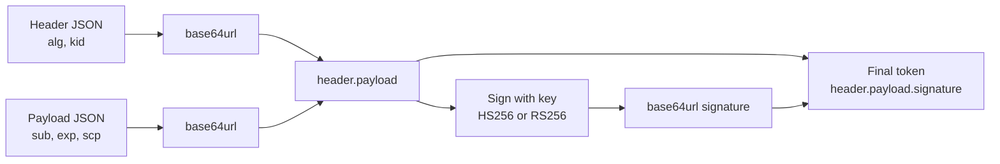
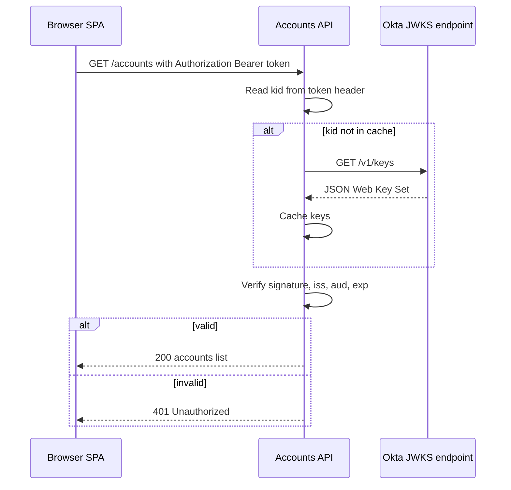
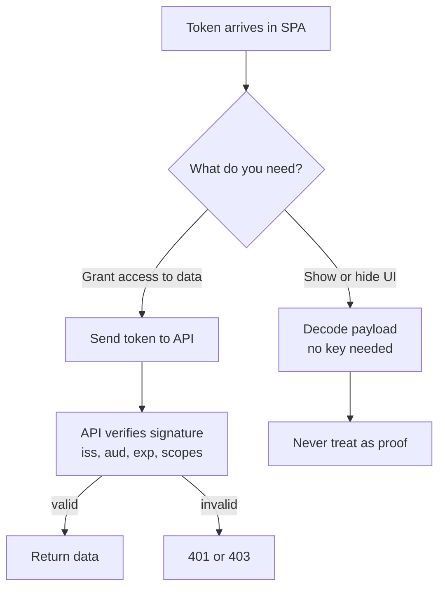
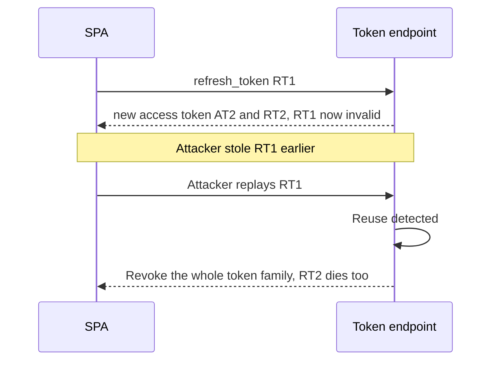

## 1. What it is

**A JSON Web Token (JWT) is a compact, URL-safe string that carries a set of claims (facts about a user or client) and a cryptographic signature that proves who issued it and that nobody changed it.**

Think of a JWT like a wristband at a festival. The ticket office (the identity provider) checks your ID once, then puts a tamper-evident wristband on you. Printed on the band: your name, which areas you can enter, and when it expires. Security guards at each stage (your APIs) do not phone the ticket office. They just look at the band, check that the seal is genuine and the date is valid, and let you in. Anyone can read the band. Nobody can change it without breaking the seal.

The problem it solves: in a system with many services, checking every request against a central session database is slow and couples everything together. A JWT lets each API verify identity and permissions locally, using only a public key. The cost is that a token, once issued, is hard to take back before it expires.

## 2. Core concepts

### [Beginner] The three parts: header.payload.signature

A JWT is three base64url strings joined by dots.

```ts
// A real-looking (shortened) access token
const token =
  "eyJhbGciOiJSUzI1NiIsImtpZCI6ImFiYzEyMyJ9" + // header
  "." +
  "eyJzdWIiOiIwMHU5OHh5eiIsInNjcCI6WyJhY2NvdW50czpyZWFkIl0sImV4cCI6MTc5MTAwMDAwMH0" + // payload
  "." +
  "Qk9HVVNfU0lHTkFUVVJFX0JZVEVT"; // signature

// header  -> { "alg": "RS256", "kid": "abc123" }
// payload -> { "sub": "00u98xyz", "scp": ["accounts:read"], "exp": 1791000000 }
// signature -> bytes produced by signing "header.payload" with the issuer's private key
```

- **Header**: which algorithm signed it (`alg`) and which key (`kid`).
- **Payload**: the claims.
- **Signature**: `sign(base64url(header) + "." + base64url(payload), key)`.

> **Why:** The signature covers the exact header and payload bytes. Change one character of the payload (say, `accounts:read` to `accounts:write`) and the signature no longer matches. That is the whole security model.



### [Beginner] base64url is encoding, not encryption

Base64url is plain base64 with `+` replaced by `-`, `/` replaced by `_`, and the trailing `=` padding removed, so the token is safe inside URLs and headers.

```ts
function base64UrlDecode(segment: string): string {
  // Convert back to standard base64, then restore padding
  const base64 = segment.replace(/-/g, "+").replace(/_/g, "/");
  const padded = base64.padEnd(base64.length + ((4 - (base64.length % 4)) % 4), "=");
  // atob gives a binary string; decode as UTF-8 to handle non-ASCII names
  const bytes = Uint8Array.from(atob(padded), (c) => c.charCodeAt(0));
  return new TextDecoder().decode(bytes);
}

const [, payloadPart] = token.split(".");
const claims = JSON.parse(base64UrlDecode(payloadPart));
console.log(claims.sub); // anyone can do this
```

> **Gotcha:** Anyone who holds the token can read the payload. Never put account numbers, balances, SSNs or other PII in a JWT. A JWT is signed (JWS), not encrypted. Encrypted tokens (JWE) exist but are rare in browser apps.

### [Beginner] Registered claims

RFC 7519 defines short standard claim names. They are all optional by the spec, but OAuth/OIDC providers set most of them.

```ts
interface RegisteredClaims {
  iss: string;          // Issuer: who created the token, e.g. "https://bank.okta.com/oauth2/default"
  sub: string;          // Subject: who the token is about (stable user id, not an email)
  aud: string | string[]; // Audience: who the token is FOR, e.g. "api://portfolio"
  exp: number;          // Expiration: seconds since epoch (NOT milliseconds)
  iat: number;          // Issued at: seconds since epoch
  nbf?: number;         // Not before: token invalid before this time
  jti?: string;         // JWT ID: unique id, useful for replay detection and denylists
}

const isExpired = (c: RegisteredClaims, skewSeconds = 60) =>
  Date.now() / 1000 > c.exp + skewSeconds; // allow small clock skew
```

> **Gotcha:** `exp` is in **seconds**. `Date.now()` is in **milliseconds**. Comparing them directly is the most common JWT bug in frontend code.

> **Why:** `aud` exists so a token minted for the "rewards" API cannot be replayed against the "payments" API. A resource server must reject tokens whose `aud` is not itself.

### [Beginner] Custom claims: scopes and groups

Providers add their own claims for authorization.

```ts
interface FinanceAccessClaims extends RegisteredClaims {
  cid: string;            // Okta: client id that requested the token
  uid: string;            // Okta: internal user id
  scp: string[];          // Okta: granted scopes, e.g. ["openid", "accounts:read"]
  groups?: string[];      // Custom claim configured in the auth server, e.g. ["Advisors"]
  tenantId?: string;      // Your own custom claim
}

function canViewPortfolio(c: FinanceAccessClaims): boolean {
  return c.scp.includes("portfolio:read");
}
```

- **Scopes** describe what the *client app* is allowed to do on the user's behalf (`transactions:read`).
- **Groups / roles** describe who the *user* is in the organisation (`Advisors`, `Ops`).
- Claim names vary: Okta uses `scp`, many others use a space-separated `scope` string.

> **Interview tip:** Say clearly that scopes on the frontend are only for UX (hide a button). The API must enforce them again, because the frontend can be modified by the user.

### [Intermediate] Signing: HS256 vs RS256

```ts
// HS256: one shared secret signs AND verifies (HMAC-SHA256)
import { SignJWT, jwtVerify } from "jose";

const secret = new TextEncoder().encode(process.env.JWT_SECRET!); // server only
const hsToken = await new SignJWT({ scp: ["accounts:read"] })
  .setProtectedHeader({ alg: "HS256" })
  .setSubject("user-42")
  .setIssuer("https://auth.example-bank.com")
  .setAudience("api://accounts")
  .setExpirationTime("10m")
  .sign(secret);

await jwtVerify(hsToken, secret, {
  issuer: "https://auth.example-bank.com",
  audience: "api://accounts",
});
```

| | HS256 (symmetric) | RS256 / ES256 (asymmetric) |
|---|---|---|
| Keys | One shared secret | Private key signs, public key verifies |
| Who can verify | Anyone with the secret, who can also forge tokens | Anyone with the public key, who cannot forge |
| Typical use | Single service that issues and checks its own tokens | Identity provider (Okta, Auth0) issuing for many APIs |

> **Why:** With HS256, every API that verifies also holds the power to mint tokens. One leaked secret compromises everything. With RS256, the private key never leaves the identity provider, so APIs only need the public key.

> **Gotcha:** Never verify with the `alg` taken from the token header without an allowlist. Old libraries accepted `alg: "none"` or let an attacker switch RS256 to HS256 and use the public key as the HMAC secret. Always pin the expected algorithms.

### [Intermediate] JWKS: how APIs find the public key

A JSON Web Key Set is a public URL listing the issuer's current public keys. The token header's `kid` picks the right one.

```ts
import { createRemoteJWKSet, jwtVerify } from "jose";

// Okta example: discovery doc at {issuer}/.well-known/openid-configuration points here
const JWKS = createRemoteJWKSet(
  new URL("https://bank.okta.com/oauth2/default/v1/keys")
);

export async function verifyAccessToken(token: string) {
  const { payload } = await jwtVerify(token, JWKS, {
    issuer: "https://bank.okta.com/oauth2/default",
    audience: "api://default",
    algorithms: ["RS256"], // pin the algorithm
    clockTolerance: 60,    // seconds of skew allowed
  });
  return payload; // signature, iss, aud, exp, nbf all checked
}
```



> **Why:** Key rotation. The issuer publishes a new key, starts signing with a new `kid`, and keeps the old key listed until old tokens expire. APIs pick up the new key automatically on cache miss.

### [Intermediate] Decode vs verify

```ts
import { jwtDecode } from "jwt-decode"; // v4 uses a named export

// DECODE: read the payload. No key, no security. Fine for UX.
const claims = jwtDecode<FinanceAccessClaims>(accessToken);
const showAdvisorMenu = claims.groups?.includes("Advisors") ?? false;

// VERIFY: check the signature with the issuer's key. Only meaningful on a server
// (or in a trusted SDK that also validated the token exchange).
```

> **Why the frontend never "trusts" a decoded token:** The browser is the attacker's computer. A user can open DevTools, edit a token in storage, or patch your JS so `canApprovePayment()` returns `true`. Even if you verified the signature in the browser, the attacker controls the code doing the verifying. So the frontend uses claims only to decide what to *show*. The API decides what is *allowed*, on every request.



### [Intermediate] ID token vs access token vs refresh token

```ts
interface OidcTokens {
  idToken: string;      // JWT. Audience = your SPA client id. "Who logged in."
  accessToken: string;  // Often a JWT (Okta custom auth server). Audience = your API. "What the app may call."
  refreshToken?: string; // Usually OPAQUE (not a JWT). Sent only to the token endpoint to get new tokens.
}

// Correct: API calls carry the access token
await fetch("/api/accounts", {
  headers: { Authorization: `Bearer ${tokens.accessToken}` },
});

// Wrong: do not send the ID token to your API as a bearer credential
```

| Token | Format | Audience | Lifetime (typical) | Purpose |
|---|---|---|---|---|
| ID token | Always JWT (OIDC) | The client app | 1 hour | Prove authentication to the app, show name/email |
| Access token | JWT or opaque | The resource API | 5 to 60 minutes | Authorize API calls |
| Refresh token | Usually opaque | The authorization server | Hours to days, rotated | Get new access tokens without user interaction |

> **Interview tip:** "The ID token is for the client, the access token is for the API" is the sentence interviewers want to hear. Treat access tokens as opaque on the client even if they happen to be JWTs, because the provider may change the format.

### [Intermediate] Where to store tokens: XSS vs CSRF

```ts
// Option 1: in memory (a module variable or React state). Lost on refresh.
let accessTokenInMemory: string | null = null;

// Option 2: localStorage. Survives reloads and is shared across tabs. Readable by ANY script on the origin.
localStorage.setItem("access_token", token);

// Option 3: HttpOnly cookie set by YOUR server (BFF). JS cannot read it.
// Set-Cookie: session=abc; HttpOnly; Secure; SameSite=Strict; Path=/
await fetch("/api/accounts", { credentials: "include" });
```

| Storage | XSS can steal token? | CSRF risk? | Survives reload? | Notes |
|---|---|---|---|---|
| Memory | Harder (not at rest), but XSS can still call APIs as the user | No | No, needs silent renew | Best for pure SPAs with refresh-token rotation |
| sessionStorage | Yes | No | Yes, per tab | Okta SDK default is localStorage |
| localStorage | Yes | No | Yes, all tabs | Simple, widely used, weakest against XSS |
| HttpOnly cookie | No | Yes, mitigate with SameSite + CSRF token | Yes | Needs a server (BFF). Current best practice for high-risk apps |

> **Why:** XSS means attacker script runs in your page. Anything JS can read, the attacker can read and send to their server. CSRF means another site makes the user's browser send a request to your site; cookies are attached automatically, bearer headers are not. Each storage choice trades one risk for the other.

> **Finance tip:** For banking and trading apps, the IETF "OAuth 2.0 for Browser-Based Applications" guidance favours a Backend-for-Frontend: the server holds tokens and the browser gets only an HttpOnly, SameSite session cookie. If your project stores tokens in localStorage, be ready to explain the compensating controls: strict CSP, short access token lifetime, refresh rotation, and idle timeout.

### [Advanced] Expiry and refresh token rotation

Short access tokens limit the damage of theft. Refresh tokens keep users logged in. Rotation makes refresh tokens single-use.

```ts
// Generic refresh with rotation (the Okta SDK does this for you)
async function refreshTokens(refreshToken: string) {
  const res = await fetch("https://bank.okta.com/oauth2/default/v1/token", {
    method: "POST",
    headers: { "Content-Type": "application/x-www-form-urlencoded" },
    body: new URLSearchParams({
      grant_type: "refresh_token",
      client_id: "0oaSPA123",
      refresh_token: refreshToken,
      scope: "openid profile offline_access accounts:read",
    }),
  });
  if (!res.ok) throw new Error("Refresh failed, user must sign in again");
  // Response contains a NEW refresh token. The old one is now invalid.
  return (await res.json()) as { access_token: string; refresh_token: string; expires_in: number };
}
```



> **Why:** If a refresh token is stolen and used, either the attacker or the real user will present an already-used token. The server sees reuse and kills the entire chain, forcing a fresh login. This is "reuse detection".

### [Advanced] The revocation problem

A self-contained JWT is valid until `exp`. The API never asks the issuer. So "log out" or "disable this user" does not instantly stop a stolen access token.

```ts
// Mitigation 1: short lifetimes (e.g. 5 to 15 minutes for payments APIs)
// Mitigation 2: denylist by jti, checked on sensitive endpoints
async function assertNotRevoked(payload: { jti?: string }, redis: { exists(k: string): Promise<number> }) {
  if (payload.jti && (await redis.exists(`revoked:${payload.jti}`))) {
    throw new Error("Token revoked");
  }
}
// Mitigation 3: token introspection (RFC 7662) - ask the issuer "is this still active?"
// Mitigation 4: revoke the REFRESH token at logout so no new access tokens can be minted
```

> **Why:** This is the core trade-off. Statelessness gives speed and decoupling; it takes away instant revocation. Every mitigation adds back a little state. Pick based on risk: a stale "view balance" token for 5 minutes is acceptable; a "transfer funds" token may need introspection.

## 3. Why it's used in this project

- **Okta issues JWT access tokens** from its custom authorization server. Our React app attaches them as `Authorization: Bearer` headers to the accounts, transactions and portfolio APIs.
- **Microservices verify locally**. The transactions API and the reports API each check the signature against Okta's JWKS. No shared session store is needed between teams.
- **Scopes drive UI**. Decoding the token (or reading Okta's `authState`) tells us whether to show "Approve payment" or "Export statement". The API still enforces it.
- **Audit trails** use `sub` (stable user id) and `jti` so every money movement can be traced to a user and a specific token.
- **Compliance-driven expiry**. Short access tokens plus idle timeout satisfy security reviews that ask "how long can a stolen token be used?"

> **Finance tip:** Never log full tokens. Log `jti`, `sub` and `exp` only. A logged access token is a live credential until it expires.

## 4. Setup & configuration

Most frontend apps never sign tokens. They receive them from Okta and maybe decode them. Servers verify.

```bash
npm install jwt-decode   # frontend: decode only (~1 KB)
npm install jose         # server (Node, edge, Deno): verify, sign, JWKS
```

```ts
// server/verifyToken.ts - Express middleware for an accounts API
import { createRemoteJWKSet, jwtVerify, type JWTPayload } from "jose";
import type { Request, Response, NextFunction } from "express";

const ISSUER = "https://bank.okta.com/oauth2/default";         // must match token "iss" exactly
const AUDIENCE = "api://accounts";                              // this API's identity
const JWKS = createRemoteJWKSet(new URL(`${ISSUER}/v1/keys`), {
  cooldownDuration: 30_000, // ms to wait before refetching keys after a miss
  cacheMaxAge: 600_000,     // ms to keep keys cached
});

export function requireScope(scope: string) {
  return async (req: Request, res: Response, next: NextFunction) => {
    const header = req.headers.authorization ?? "";
    const [scheme, token] = header.split(" ");
    if (scheme !== "Bearer" || !token) return res.status(401).end();
    try {
      const { payload } = await jwtVerify(token, JWKS, {
        issuer: ISSUER,
        audience: AUDIENCE,
        algorithms: ["RS256"], // never accept "none" or HS256 here
        clockTolerance: 60,    // seconds
      });
      const scopes = (payload as JWTPayload & { scp?: string[] }).scp ?? [];
      if (!scopes.includes(scope)) return res.status(403).end(); // authenticated but not allowed
      res.locals.userId = payload.sub;
      next();
    } catch {
      return res.status(401).end();
    }
  };
}
```

## 5. Key features we use

### [Beginner] Reading claims for UI

```tsx
import { jwtDecode } from "jwt-decode";

type Claims = { sub: string; scp: string[]; exp: number };

export function ExportButton({ accessToken }: { accessToken: string }) {
  const { scp } = jwtDecode<Claims>(accessToken);
  if (!scp.includes("statements:export")) return null; // UX only
  return <button>Export statement</button>;
}
```

### [Beginner] Time until expiry

```ts
export function secondsUntilExpiry(token: string): number {
  const { exp } = jwtDecode<{ exp: number }>(token);
  return Math.max(0, exp - Math.floor(Date.now() / 1000));
}
```

### [Intermediate] Handling 401 vs 403

```ts
import axios from "axios";

const api = axios.create({ baseURL: "/api" });

api.interceptors.response.use(undefined, async (error) => {
  const status = error.response?.status;
  if (status === 401) {
    // Token missing, expired or invalid: try renew once, else re-login
  }
  if (status === 403) {
    // Valid token but missing scope: show "You do not have access", do NOT re-login
  }
  return Promise.reject(error);
});
```

## 6. Interview questions

#### Q: What are the three parts of a JWT, and is the payload secret?

Header, payload, signature, each base64url-encoded and joined by dots. The header names the algorithm and key id. The payload holds claims. The signature is computed over `header.payload` with the issuer's key. The payload is **not** secret. Base64url is reversible encoding, so anyone holding the token can read it. Do not put PII or account data in it. Confidentiality needs JWE or simply not putting the data there.

#### Q: Why should the frontend not trust a decoded JWT?

Decoding does not check the signature. Even verification in the browser does not help, because the user controls the browser: they can edit storage, patch JavaScript, or call the API directly. The frontend uses claims only for UX decisions. The API must verify signature, `iss`, `aud`, `exp` and scopes on every request and is the only place authorization actually happens.

#### Q: Compare HS256 and RS256. Which would an identity provider use and why?

HS256 uses one shared secret for signing and verifying, so any verifier can also forge tokens. RS256 (or ES256) uses a private key to sign and a public key to verify. Identity providers use asymmetric algorithms so many APIs can verify via the public JWKS endpoint without being able to mint tokens. Key rotation is handled by publishing new keys with new `kid` values.

#### Q: Where would you store tokens in a financial SPA, and what are the trade-offs?

- localStorage/sessionStorage: simple, survives reloads, but readable by any XSS payload.
- Memory: not at rest, lost on reload, so you need silent renewal via refresh tokens.
- HttpOnly Secure SameSite cookie via a BFF: JS cannot read it, which defeats token theft by XSS. You must handle CSRF (SameSite=Strict/Lax plus CSRF tokens on state-changing requests).
For high-risk finance apps the current recommendation is a BFF with HttpOnly cookies. If tokens must live in the browser, combine strict CSP, short access token lifetimes and refresh token rotation.

#### Q: How do you "log out" a user with JWTs if tokens are stateless?

You cannot instantly invalidate a self-contained access token. Options: clear tokens client-side, revoke the refresh token at the authorization server so no new access tokens are issued, end the IdP session, keep access token lifetimes short, and for sensitive endpoints check a `jti` denylist or use token introspection. Explain it as a trade-off between statelessness and instant revocation.

## 7. Drawbacks & pain points

- **No instant revocation.** Stolen access tokens work until `exp`.
- **Size.** Tokens with many groups can exceed 4 KB, which breaks cookies and bloats every request header.
- **Stale claims.** A user removed from `Advisors` keeps the group claim until the token expires.
- **Algorithm confusion** in poorly configured libraries.
- **Clock skew** between servers causes random 401s right after issue (`nbf`, `iat`) or right before expiry.

Gotchas that trip devs up:

```ts
// 1. Seconds vs milliseconds
const expired = claims.exp < Date.now();          // WRONG: always false-ish
const expiredOk = claims.exp * 1000 < Date.now(); // correct

// 2. atob on a base64url segment with "-" or "_" throws or produces garbage
JSON.parse(atob(token.split(".")[1]));            // fragile, breaks on non-ASCII names too

// 3. Sending the ID token to the API
headers: { Authorization: `Bearer ${idToken}` }    // WRONG token type and audience

// 4. jwt-decode v4 changed to a named export
import jwtDecode from "jwt-decode";                // v3 style, fails on v4
import { jwtDecode } from "jwt-decode";            // v4
```

> **Gotcha:** "It works in dev" often means the dev API skips `aud` validation. Test against an environment that enforces audience.

## 8. Better alternatives

The industry is not abandoning JWTs, but it is moving **where they live**. The direction for browser apps is the BFF pattern: tokens stay on a server, the browser holds a session cookie. Other trends: sender-constrained tokens (DPoP, RFC 9449) that are useless if stolen without the private key, and opaque tokens plus introspection for high-value operations.

| Approach | Revocation | Server state | XSS token theft | Complexity | When it wins |
|---|---|---|---|---|---|
| JWT bearer in browser | Hard, wait for exp | None | Possible | Low | Simple SPAs, public data, low risk |
| Opaque token + introspection | Instant | IdP lookup per call or cached | Possible | Medium | Sensitive APIs needing instant revoke |
| BFF + HttpOnly session cookie | Instant, delete session | Session store | Not possible to steal token | Medium to high | Banking, trading, PII-heavy apps |
| DPoP-bound JWT | Hard, but stolen token useless | Minimal | Stolen token unusable alone | High | High-assurance APIs, open banking (FAPI) |
| PASETO | Same as JWT | None | Same as JWT | Low | Teams wanting no algorithm choice footguns, small ecosystem |

Library sizes: `jwt-decode` ~1 KB gzip, `jose` ~10 to 20 KB gzip for what you import (tree-shakable).

## 9. When NOT to use it

- As a server session replacement in a single monolith where a plain session cookie is simpler and revocable.
- When you need instant logout or permission changes across all requests and cannot add introspection.
- To carry sensitive data (balances, account numbers, PII). Use an API call instead.
- As a long-lived (days) access token stored in localStorage.
- For authorization decisions in the browser.

## Cheatsheet

| Thing | Value / rule |
|---|---|
| Format | `base64url(header).base64url(payload).base64url(signature)` |
| `iss` / `sub` / `aud` | issuer / user id / intended API |
| `exp` / `iat` / `nbf` | seconds since epoch |
| `jti` | unique token id for denylist and replay |
| HS256 | shared secret, single service |
| RS256 / ES256 | private signs, public verifies via JWKS `kid` |
| ID token | for the client, always JWT |
| Access token | for the API, treat as opaque in client |
| Refresh token | for the token endpoint only, rotate it |
| 401 | not authenticated, renew or re-login |
| 403 | authenticated but not allowed |

```ts
import { jwtDecode } from "jwt-decode";                 // client: decode for UX
const { sub, exp, scp } = jwtDecode<{ sub: string; exp: number; scp: string[] }>(at);
const msLeft = exp * 1000 - Date.now();

import { createRemoteJWKSet, jwtVerify } from "jose";   // server: verify
const JWKS = createRemoteJWKSet(new URL(`${ISSUER}/v1/keys`));
const { payload } = await jwtVerify(at, JWKS, { issuer: ISSUER, audience: AUD, algorithms: ["RS256"] });
```
