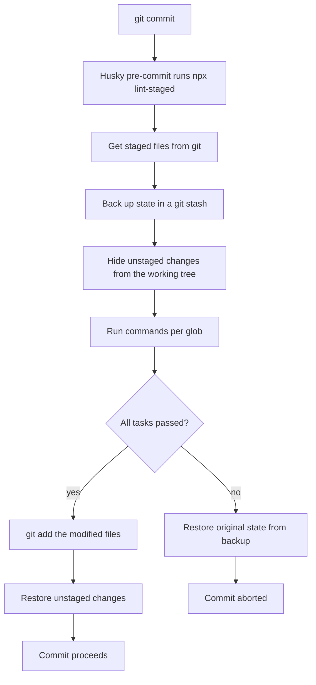
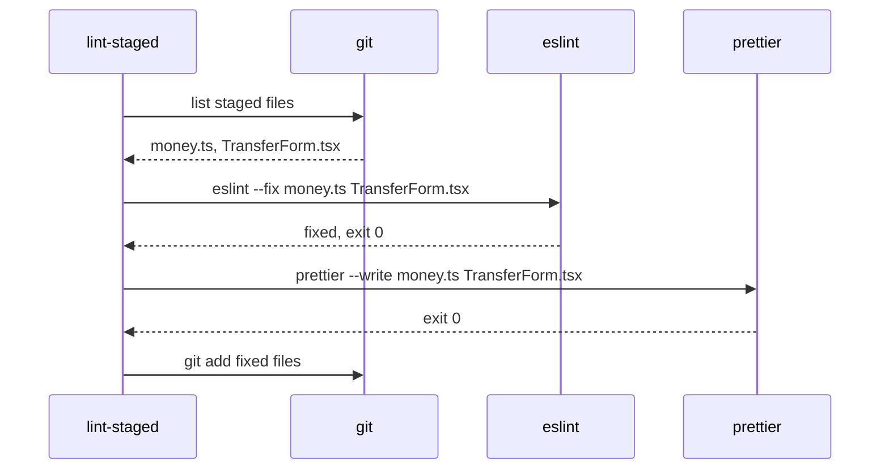

## 1. What it is

**lint-staged runs commands (ESLint, Prettier, tests) against only the files currently staged in git, then re-stages any fixes, typically from a pre-commit hook.**

Analogy: airport security that only scans the bags you are carrying on this flight, not every bag you own at home. Scanning everything in the repo on each commit is slow and pointless; only what you are about to commit can introduce new problems.

The problem it solves: running `eslint .` and `prettier --check .` on a large repo can take a minute, so developers start skipping hooks. Also, linting the whole repo fails your commit because of someone else's old warnings. lint-staged makes pre-commit checks fast and relevant: seconds, and only about your changes.

## 2. Core concepts

### [Beginner] Staged files

Git has three areas: working tree (your edits), index or staging area (`git add`), and commits. lint-staged asks git for the list of staged files and matches them against glob patterns.

```bash
git add src/features/transfers/TransferForm.tsx src/lib/money.ts
git diff --cached --name-only    # what lint-staged sees
# src/features/transfers/TransferForm.tsx
# src/lib/money.ts
```

### [Beginner] Globs map to commands

```json
// package.json
{
  "lint-staged": {
    "*.{ts,tsx}": ["eslint --fix --max-warnings 0", "prettier --write"],
    "*.{css,md,json,yml}": "prettier --write"
  }
}
```

lint-staged appends matching file paths to each command:

```bash
eslint --fix --max-warnings 0 /repo/src/features/transfers/TransferForm.tsx /repo/src/lib/money.ts
prettier --write /repo/src/features/transfers/TransferForm.tsx /repo/src/lib/money.ts
```

> **Why faster:** Cost scales with the size of your change, not the size of the repo. A 3-file commit lints 3 files.

### [Intermediate] What happens step by step



The backup stash means a crash or failure does not lose your work, and hiding unstaged changes means tools see exactly what will be committed.

### [Intermediate] Partial staging

You can stage only some hunks of a file (`git add -p`). lint-staged handles this: it hides unstaged hunks while tasks run, so the linter checks the staged version, then restores the unstaged hunks on top.

```bash
git add -p src/lib/money.ts   # stage only the rounding fix, not the debug log below it
git commit -m "fix(money): round half-even"
```

> **Gotcha:** If a formatter rewrites lines that overlap with your unstaged hunks, restoring them can conflict. lint-staged then keeps the formatted version and saves your unstaged changes in the backup stash, warning you. Check `git stash list` if edits seem to vanish.

### [Advanced] Function config for custom commands

Some tools should not receive file lists, like `tsc`, which checks a whole project and ignores `tsconfig.json` when given file paths.

```js
// lint-staged.config.js
export default {
  '*.{ts,tsx}': [
    'eslint --fix --max-warnings 0',
    'prettier --write',
    () => 'tsc --noEmit -p tsconfig.json', // function returning a command = run once, no file args
  ],
  // Run only tests related to changed files
  'src/**/*.{ts,tsx}': (files) => `vitest related --run ${files.join(' ')}`,
};
```



## 3. Why it's used in this project

- **Fast commits in a big monorepo.** Linting all apps and shared packages takes minutes; staged files take seconds, so nobody reaches for `--no-verify`.
- **Your commit, your responsibility.** Legacy warnings in old modules do not block a hotfix to the transfer limits.
- **Auto-fixed, consistently formatted code** goes into every commit, keeping diffs of sensitive money logic clean for review and audit.
- **Targeted tests.** `vitest related` runs tests touching changed files, catching a broken `formatCents` before it leaves your machine.
- **Secret scanning on changed files.** Running a secret scanner only on staged files is fast enough for every commit.

## 4. Setup & configuration

```bash
npm i -D lint-staged husky
npx husky init
echo "npx lint-staged" > .husky/pre-commit
```

```js
// lint-staged.config.js  (also supported: .lintstagedrc, .lintstagedrc.json, "lint-staged" key in package.json)
/** @type {import('lint-staged').Configuration} */
export default {
  // TS/TSX: lint with autofix, fail on any warning, then format
  '*.{ts,tsx}': ['eslint --fix --max-warnings 0 --no-warn-ignored', 'prettier --write'],

  // Other formats: just format
  '*.{js,cjs,mjs,json,css,md,yml,yaml}': 'prettier --write',

  // Lockfile change: no-op guard example (do not format lockfiles)
  // 'yarn.lock': () => 'echo lockfile changed',

  // Whole-project type-check once (no file args)
  '**/*.ts?(x)': () => 'tsc --noEmit',
};
```

```json
// package.json alternative
{
  "lint-staged": {
    "*.{ts,tsx}": ["eslint --fix", "prettier --write"]
  }
}
```

CLI flags you may use:

```bash
npx lint-staged --concurrent false   # run glob groups one after another (default: parallel)
npx lint-staged --relative           # pass relative paths instead of absolute
npx lint-staged --no-stash           # skip backup stash (faster, riskier with partial staging)
npx lint-staged --verbose            # show task output even on success
npx lint-staged --diff="origin/main...HEAD"  # run on files changed in a range (useful in CI)
```

> **Gotcha:** `--no-warn-ignored` (ESLint 9) stops ESLint warning about files you passed that are in `ignores`. Without it, staged ignored files produce warnings that `--max-warnings 0` turns into failures.

## 5. Key features we use

### [Beginner] Autofix and re-stage

Tasks like `eslint --fix` and `prettier --write` modify files. lint-staged automatically `git add`s them, so the fixes land in the same commit.

> **Outdated:** Older guides add `"git add"` as the last command in each list. Since lint-staged v10 that is unnecessary and prints a warning.

### [Intermediate] Monorepo: per-package configs

```text
apps/portfolio-web/.lintstagedrc.js
packages/money/.lintstagedrc.js
```

lint-staged (v12+) uses the config closest to each staged file, so each package can have its own rules and run commands from its own directory.

### [Intermediate] Ignore generated files

```js
export default {
  '*.{ts,tsx}': (files) => {
    const real = files.filter((f) => !f.includes('/src/generated/'));
    return real.length ? [`eslint --fix ${real.join(' ')}`, `prettier --write ${real.join(' ')}`] : [];
  },
};
```

### [Advanced] Windows command-line length

Thousands of staged files can exceed Windows' command-line limit. lint-staged chunks file lists automatically (`maxArgLength`). If you build commands in a function, you are responsible for chunking.

## 6. Interview questions

#### Q: Why use lint-staged instead of running ESLint on the whole repo in pre-commit?

Speed and relevance. Whole-repo linting scales with repo size and can take minutes, so people bypass the hook. lint-staged only checks staged files, so time scales with the size of the change. It also avoids failing a commit because of pre-existing issues in files you did not touch. CI still runs the full check.

#### Q: How does lint-staged handle partially staged files?

Before running tasks it creates a backup stash, then hides unstaged changes so tools only see the staged content. After tasks succeed it stages the modifications and re-applies the unstaged changes. If re-applying conflicts with formatter changes, it keeps the backup stash so nothing is lost. On failure it restores the original state.

#### Q: Why can't you just pass staged files to tsc?

`tsc file1.ts file2.ts` ignores `tsconfig.json`, so compiler options, path aliases and type declarations are missing, causing false errors. Type-checking also needs the whole program to be correct (a change in one file can break another). Use a function config that returns `tsc --noEmit` with no file arguments, or move type-checking to pre-push or CI.

#### Q: How do Husky and lint-staged work together?

Husky installs the git hook (`.husky/pre-commit`), and that hook runs `npx lint-staged`. Husky answers "when do we run checks", lint-staged answers "which files, and with which commands". lint-staged's non-zero exit makes the hook fail and aborts the commit.

#### Q: What are the risks of running lint-staged with autofix?

Autofix can change code you did not intend to change in the commit; review the final diff. Formatters can conflict with unstaged hunks during partial staging. A rule with an unsafe fix could alter behavior, so only auto-fixable, safe rules should be relied on. And because hooks can be skipped, CI must still verify.

## 7. Drawbacks & pain points

- **Cross-file problems are missed.** Changing a function signature in `money.ts` can break `ReportsPage.tsx`, which is not staged and not linted. Type-check and CI catch it.
- **Stash complexity.** Rare conflicts with partial staging confuse developers.
- **Type-aware ESLint is still slow**, even on a few files, because it builds a TS program.
- **Config format variety** (package.json key, rc files, JS config) leads to "which config is used?" confusion.
- **Debugging failures** inside hooks is harder; use `--verbose` or `--debug`.

Gotchas that trip devs up:

```json
// 1. Glob without a slash matches basename anywhere. With a slash, it is relative to config dir.
{ "*.ts": "eslint" }            // any .ts file in any folder
{ "src/*.ts": "eslint" }        // only direct children of src/, not src/lib/money.ts
{ "src/**/*.ts": "eslint" }     // all .ts under src/
```

```js
// 2. Shell syntax is not interpreted in string commands
'*.ts': 'eslint --fix && prettier --write'   // && is passed as an argument -> confusing errors
'*.ts': ['eslint --fix', 'prettier --write'] // use an array
```

```bash
# 3. Files deleted in the commit are not passed to tasks (good), but renamed files are
# passed with their new path only.
```

## 8. Better alternatives

| Tool | Speed | Config | Partial staging safety | Parallelism | Popularity | When it wins |
| --- | --- | --- | --- | --- | --- | --- |
| lint-staged | ~fast | JS/JSON globs | yes, backup stash | per glob, parallel | dominant in JS | with Husky in JS repos |
| Lefthook (`{staged_files}`) | very fast, Go | `lefthook.yml` | stash support | yes | growing | hooks + staged runs in one tool, monorepos |
| nano-staged | fast, tiny | similar to lint-staged | simpler | limited | niche | minimal setups |
| pre-commit (Python) | fast | YAML | yes | yes | high outside JS | polyglot repos |
| Biome `--staged` | very fast | built in | n/a, tool-native | n/a | growing | when Biome is your only linter/formatter |

## 9. When NOT to use it

- **As the only check**: it misses cross-file breakages; CI must run full lint, type-check and tests.
- **For whole-program tools** like `tsc` or a full test suite with file args; run those without file lists or elsewhere.
- **When the tool already supports staged mode** (Biome `--staged`, Lefthook's `{staged_files}`) and you want fewer dependencies.
- **Very slow tasks** (e2e tests, builds): keep pre-commit under a few seconds.

## Cheatsheet

| Item | Value |
| --- | --- |
| Install | `npm i -D lint-staged` |
| Hook | `.husky/pre-commit` -> `npx lint-staged` |
| Config files | `lint-staged.config.js`, `.lintstagedrc*`, `package.json` key |
| Glob -> command | `"*.{ts,tsx}": ["eslint --fix", "prettier --write"]` |
| Run once, no files | `() => 'tsc --noEmit'` |
| Custom file use | ``(files) => `cmd ${files.join(' ')}` `` |
| Sequential | `--concurrent false` |
| Verbose | `--verbose` / `--debug` |
| Skip stash | `--no-stash` |
| Range (CI) | `--diff="origin/main...HEAD"` |
| Re-stage fixes | automatic (no `git add` needed) |

```js
// lint-staged.config.js
export default {
  '*.{ts,tsx}': ['eslint --fix --max-warnings 0', 'prettier --write'],
  '*.{json,md,css,yml}': 'prettier --write',
  '**/*.{ts,tsx}': () => 'tsc --noEmit', // separate key: runs once, no file args
};
```
