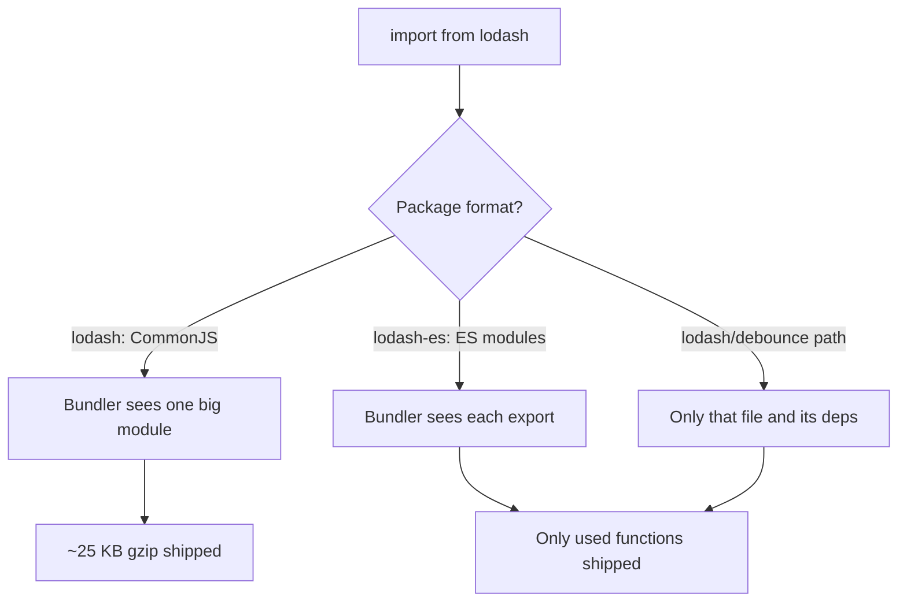
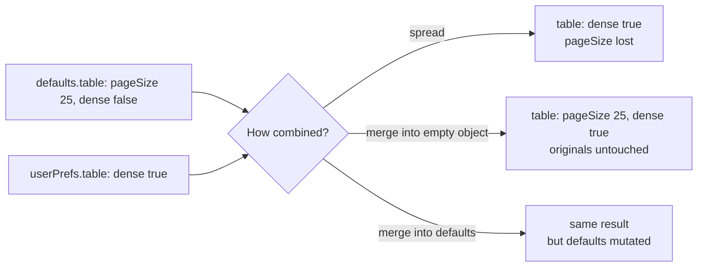
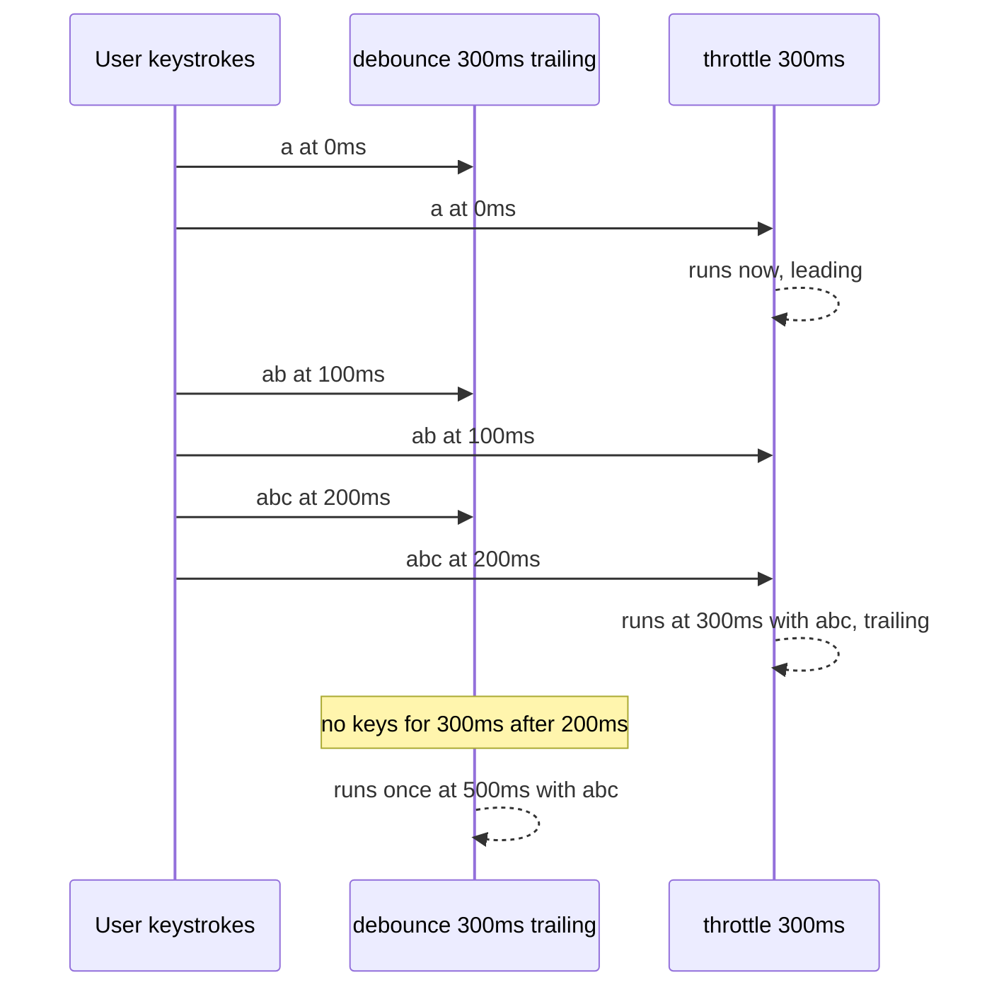
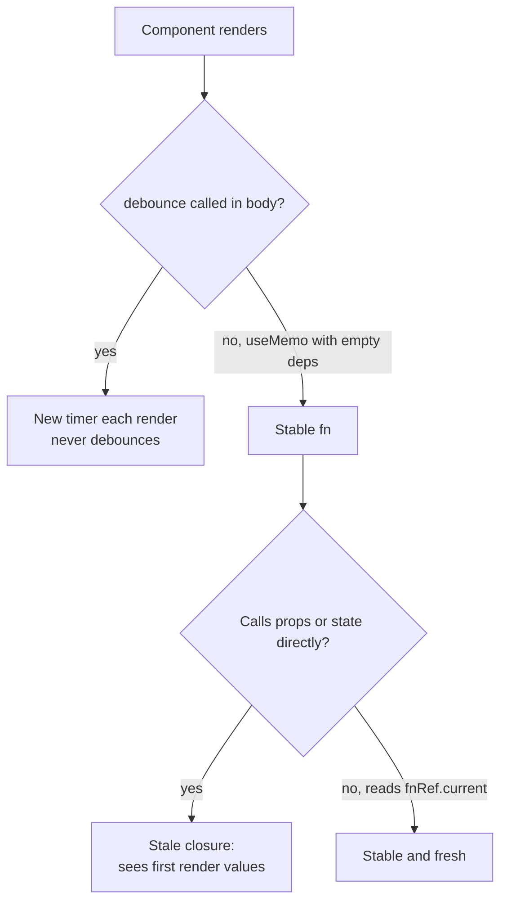

## 1. What it is

**Lodash is a utility library of about 300 small functions that make working with arrays, objects, strings and function timing safer and shorter.**

Think of Lodash as a kitchen drawer full of specialist tools: a garlic press, an apple corer, a zester. You could do every job with a plain knife (native JavaScript), but the specialist tool is faster, handles the awkward cases, and everyone in the kitchen knows how to use it.

The problem it solves: in 2012 JavaScript had almost no built-in helpers. There was no `Array.prototype.find`, no `Object.entries`, no optional chaining, no `structuredClone`. Lodash filled those gaps with consistent, null-safe, cross-browser functions. Today most of that gap is closed by the language itself, so the real remaining value is in a handful of functions: `debounce`, `throttle`, `cloneDeep`, `merge`, `isEqual`, `groupBy`/`orderBy` and friends.

> **Outdated:** Lodash 4.17.x has been the stable line since 2016. It still works and is still downloaded tens of millions of times a week, but new projects often reach for native JS first, and for es-toolkit or Remeda when a helper is still needed.

## 2. Core concepts

### [Beginner] Importing Lodash and why the import style matters

There are three ways to import. They look similar but ship very different amounts of code.

```ts
// 1. Whole library (CommonJS). Bundlers cannot tree-shake this well.
import _ from 'lodash';
_.debounce(fn, 300);

// 2. Named import from 'lodash' (CommonJS). Still pulls most of lodash in many setups.
import { debounce } from 'lodash';

// 3. ES module build: tree-shakeable. Only debounce and its internals are bundled.
import { debounce } from 'lodash-es';

// 4. Per-method path import from the CJS package: also small.
import debounce from 'lodash/debounce';
```

> **Why:** Tree-shaking works by statically analysing ES module `import`/`export` statements. The `lodash` package is published as CommonJS (`module.exports = ...`), which bundlers cannot reliably analyse, so the whole ~70 KB minified (~25 KB gzip) file can end up in your bundle. `lodash-es` re-publishes the same code as ES modules so unused functions are dropped.



### [Beginner] get: safe deep property access

`get(obj, path, default)` reads a nested property without throwing when something in the middle is `undefined`.

```ts
import { get } from 'lodash-es';

interface Account {
  id: string;
  owner?: { address?: { city?: string } };
}

const account: Account = { id: 'acc_1' };

get(account, 'owner.address.city', 'Unknown'); // 'Unknown'

// Native equivalent: optional chaining + nullish coalescing (ES2020)
account.owner?.address?.city ?? 'Unknown';     // 'Unknown'
```

> **Why:** Before ES2020, `account.owner.address.city` would throw `TypeError: Cannot read properties of undefined`. `get` was the fix. Optional chaining is now better: it is type-checked by TypeScript, while a string path like `'owner.adress.city'` (typo) silently returns the default.

### [Beginner] pick and omit: choose or drop keys

```ts
import { pick, omit } from 'lodash-es';

interface User {
  id: string;
  name: string;
  email: string;
  ssn: string;
}

const user: User = { id: 'u1', name: 'Ana', email: 'ana@x.com', ssn: '123-45-6789' };

const publicUser = pick(user, ['id', 'name']);   // { id, name }
const safeForLogs = omit(user, ['ssn']);          // everything except ssn

// Native equivalents
const { ssn, ...safeNative } = user;              // omit via rest destructuring
const pickedNative = Object.fromEntries(
  (['id', 'name'] as const).map((k) => [k, user[k]]),
);
```

> **Finance tip:** `omit` (or rest destructuring) is a common way to strip PII like SSN or full card numbers before sending objects to analytics or logs. Prefer an allow-list (`pick`) over a deny-list (`omit`) for anything leaving the app: a new sensitive field added later is excluded by default.

### [Beginner] groupBy, keyBy, uniqBy

```ts
import { groupBy, keyBy, uniqBy } from 'lodash-es';

interface Transaction {
  id: string;
  accountId: string;
  category: 'food' | 'rent' | 'salary';
  amountCents: number;
}

const txns: Transaction[] = [
  { id: 't1', accountId: 'a1', category: 'food', amountCents: -1250 },
  { id: 't2', accountId: 'a1', category: 'rent', amountCents: -150000 },
  { id: 't3', accountId: 'a2', category: 'food', amountCents: -899 },
  { id: 't3', accountId: 'a2', category: 'food', amountCents: -899 }, // duplicate from API
];

groupBy(txns, 'category');   // { food: [t1, t3, t3], rent: [t2] }
keyBy(txns, 'id');           // { t1: {...}, t2: {...}, t3: {...} }  last one wins
uniqBy(txns, 'id');          // [t1, t2, t3]

// Native equivalents
Object.groupBy(txns, (t) => t.category);                 // ES2024, null-prototype object
Map.groupBy(txns, (t) => t.accountId);                   // ES2024, returns a Map
Object.fromEntries(txns.map((t) => [t.id, t]));          // keyBy
[...new Map(txns.map((t) => [t.id, t])).values()];       // uniqBy (keeps last)
```

> **Gotcha:** Lodash `uniqBy` keeps the FIRST occurrence. The `Map` trick keeps the LAST. Usually harmless for exact duplicates, but matters if the duplicates differ.

### [Intermediate] sortBy vs orderBy

`sortBy` sorts ascending by one or more keys. `orderBy` lets you choose the direction per key. Both return a NEW array and are stable.

```ts
import { sortBy, orderBy } from 'lodash-es';

sortBy(txns, ['accountId', 'amountCents']);
orderBy(txns, ['accountId', 'amountCents'], ['asc', 'desc']);

// Native equivalent: toSorted (ES2023) does not mutate
txns.toSorted(
  (a, b) => a.accountId.localeCompare(b.accountId) || b.amountCents - a.amountCents,
);
```

> **Why:** `Array.prototype.sort` mutates the original array. If that array is React state, you have mutated state in place and React may not re-render. `toSorted`, `sortBy` and `orderBy` all return new arrays.

### [Intermediate] cloneDeep vs structuredClone vs spread

```ts
import { cloneDeep } from 'lodash-es';

interface Portfolio {
  id: string;
  holdings: { symbol: string; qty: number }[];
  openedAt: Date;
}

const p: Portfolio = { id: 'p1', holdings: [{ symbol: 'AAPL', qty: 10 }], openedAt: new Date() };

const shallow = { ...p };          // new top-level object, SAME holdings array
shallow.holdings[0].qty = 99;      // also changes p.holdings[0].qty !

const deep1 = cloneDeep(p);        // full copy, Date preserved
const deep2 = structuredClone(p);  // native full copy, Date preserved
```

| | `{...obj}` | `cloneDeep` | `structuredClone` |
|---|---|---|---|
| Depth | 1 level | all | all |
| Date, Map, Set | shared reference | copied | copied |
| Functions | shared reference | nested: shared reference, top-level: `{}` | throws `DataCloneError` |
| Class instances | prototype lost | prototype kept | prototype lost (plain object) |
| Circular refs | n/a | handled | handled |
| Cost | tiny | library code | built in |

> **Why:** A shallow copy copies references. Nested objects are still shared, so mutating them leaks into the original. Deep clones walk the whole tree. `structuredClone` uses the same algorithm the browser uses for `postMessage`, which is why it rejects functions and DOM nodes.

### [Intermediate] merge mutates; spread does not

```ts
import { merge } from 'lodash-es';

const defaults = { theme: 'light', table: { pageSize: 25, dense: false } };
const userPrefs = { table: { dense: true } };

// WRONG: merge mutates its first argument
const prefs = merge(defaults, userPrefs);
console.log(defaults.table.dense); // true  -- defaults were changed!

// RIGHT: merge into a fresh object
const prefs2 = merge({}, defaults, userPrefs);

// Spread is shallow: nested object is REPLACED, not merged
const prefs3 = { ...defaults, ...userPrefs };
// { theme: 'light', table: { dense: true } }  -- pageSize lost
```



> **Gotcha:** `merge` also merges arrays by index: `merge({ a: [1, 2, 3] }, { a: [9] })` gives `{ a: [9, 2, 3] }`, not `[9]`. Use `mergeWith` with a customizer if you want arrays replaced.

### [Intermediate] isEqual: deep equality

```ts
import { isEqual } from 'lodash-es';

const saved = { accountId: 'a1', limits: { dailyCents: 500000 } };
const form  = { accountId: 'a1', limits: { dailyCents: 500000 } };

saved === form;        // false: different objects in memory
isEqual(saved, form);  // true: same structure and values

// No exact native equivalent. JSON.stringify comparison breaks on key order,
// undefined values, Dates vs strings, NaN, Map/Set.
```

> **Why:** `===` on objects compares identity (are these the same memory address?), not content. `isEqual` recursively compares values. Common use: enabling a "Save" button only if the form differs from the saved record.

### [Intermediate] debounce vs throttle

Both control how often a function runs when events fire rapidly (typing, scrolling, resizing).

- **debounce**: wait until events STOP for `wait` ms, then run once. "Wait for a pause."
- **throttle**: run at most once every `wait` ms while events keep coming. "Run at a steady rate."



```ts
import { debounce, throttle } from 'lodash-es';

const search = debounce((q: string) => fetchAccounts(q), 300);
const onScroll = throttle(() => reportScrollDepth(), 200);

// Options
debounce(fn, 300, { leading: false, trailing: true });       // default
debounce(fn, 300, { leading: true, trailing: false });       // fire at start, ignore rest
debounce(fn, 300, { maxWait: 1000 });                        // never wait longer than 1s
throttle(fn, 200, { leading: true, trailing: true });        // default

// Control
search.cancel(); // drop any pending call
search.flush();  // run the pending call immediately
```

> **Why:** `leading` means "fire on the first event of a burst". `trailing` means "fire after the burst with the latest arguments". Lodash's `throttle` is literally implemented as `debounce` with `maxWait` equal to `wait` and `leading: true`.

### [Advanced] Debounce in React: the stable-function and stale-closure traps

Each render runs your component function again. If you call `debounce(...)` inside the body, you create a NEW debounced function every render, each with its own timer, so nothing is ever debounced.

```tsx
// BROKEN: new debounced fn every render
function AccountSearch() {
  const [q, setQ] = useState('');
  const search = debounce((v: string) => api.searchAccounts(v), 300); // recreated each keystroke
  return <input value={q} onChange={(e) => { setQ(e.target.value); search(e.target.value); }} />;
}
```

Fix 1: `useMemo` so the debounced function is created once.

```tsx
function AccountSearch({ onResults }: { onResults: (r: Account[]) => void }) {
  const [q, setQ] = useState('');

  const search = useMemo(
    () => debounce(async (v: string) => onResults(await api.searchAccounts(v)), 300),
    [], // created once -- but onResults is now captured from the FIRST render (stale closure)
  );

  useEffect(() => () => search.cancel(), [search]); // cancel on unmount

  return <input value={q} onChange={(e) => { setQ(e.target.value); search(e.target.value); }} />;
}
```

Fix 2: keep the latest callback in a ref so the stable debounced function always calls fresh code.

```tsx
function useDebouncedCallback<A extends unknown[]>(fn: (...args: A) => void, wait: number) {
  const fnRef = useRef(fn);
  useLayoutEffect(() => { fnRef.current = fn; }); // always point at latest render's fn

  const debounced = useMemo(
    () => debounce((...args: A) => fnRef.current(...args), wait),
    [wait],
  );

  useEffect(() => () => debounced.cancel(), [debounced]);
  return debounced;
}

// Usage
const search = useDebouncedCallback(async (v: string) => {
  onResults(await api.searchAccounts(v)); // always the current onResults
}, 300);
```



> **Why:** A closure captures variables from the render in which it was created. The memoized debounced function was created in render 1, so it sees render 1's props forever. A ref is a mutable box that survives renders; reading `ref.current` at call time gets the newest value.

> **Interview tip:** Mentioning both traps (recreated debouncer and stale closure) plus `cancel()` on unmount is what separates a strong answer from "I wrap it in useCallback".

### [Advanced] Chaining and why to avoid it

```ts
import _ from 'lodash';

// Chaining wraps values and pulls in the whole library
const totals = _.chain(txns)
  .filter((t) => t.amountCents < 0)
  .groupBy('category')
  .mapValues((list) => _.sumBy(list, 'amountCents'))
  .value();

// Same thing with tree-shakeable functions
import { groupBy, mapValues, sumBy } from 'lodash-es';
const totals2 = mapValues(groupBy(txns.filter((t) => t.amountCents < 0), 'category'),
  (list) => sumBy(list, 'amountCents'));
```

> **Gotcha:** `_.chain` defeats tree-shaking because the wrapper must support every method. Lodash's own `lodash/fp` `flow` or plain function composition avoids that.

## 3. Why it's used in this project

- **Search inputs on large account lists**: `debounce` stops a request firing on every keystroke when a user types a payee name, saving API calls and avoiding out-of-order results.
- **Scroll/resize on transaction tables**: `throttle` keeps virtualized 10k-row tables and sticky headers responsive.
- **Dashboard aggregation**: `groupBy` by category or month, `sumBy` on `amountCents`, `orderBy` by date desc then amount.
- **Lookups by id**: `keyBy(accounts, 'id')` turns an array into an O(1) map for joining transactions to accounts.
- **Dirty-form detection**: `isEqual(savedSettings, formValues)` controls the "Unsaved changes" banner and the Save button.
- **Config defaults**: `merge({}, defaultChartOptions, userOptions)` for chart libraries with deeply nested option objects.
- **Dedup of paginated API data**: `uniqBy(pages.flat(), 'id')` when infinite scroll pages overlap.
- **PII stripping**: `pick` allow-lists before logging or sending to analytics.

> **Finance tip:** Never `sumBy` floating-point dollar amounts. Sum integer `amountCents` and format at the edge. Lodash does not fix floating-point math: `0.1 + 0.2` is still `0.30000000000000004`.

## 4. Setup & configuration

```bash
# Tree-shakeable ESM build (recommended for Vite/webpack apps)
npm install lodash-es
npm install -D @types/lodash-es

# Classic CommonJS build (Node scripts, older setups)
npm install lodash
npm install -D @types/lodash
```

Optional: make `import { debounce } from 'lodash'` resolve to the ESM build so legacy imports still tree-shake.

```ts
// vite.config.ts
import { defineConfig } from 'vite';
import react from '@vitejs/plugin-react';

export default defineConfig({
  plugins: [react()],
  resolve: {
    alias: {
      // Redirect CommonJS lodash to the ES module build
      lodash: 'lodash-es',
    },
  },
});
```

Enforce good imports with ESLint (flat config):

```js
// eslint.config.js
export default [
  {
    rules: {
      // Block the whole-library import that kills tree-shaking
      'no-restricted-imports': ['error', {
        paths: [{ name: 'lodash', message: "Use 'lodash-es' or a native method." }],
      }],
    },
  },
];
```

Check what you ship:

```bash
npx vite-bundle-visualizer   # treemap of the production bundle
```

## 5. Key features we use

### [Beginner] Debounced search box

```tsx
function PayeeSearch() {
  const [results, setResults] = useState<Payee[]>([]);
  const search = useDebouncedCallback(async (q: string) => {
    if (q.length < 2) return setResults([]);
    setResults(await api.searchPayees(q));
  }, 300);

  return <input placeholder="Search payees" onChange={(e) => search(e.target.value)} />;
}
```

### [Beginner] Monthly spend by category

```ts
import { groupBy, mapValues, sumBy } from 'lodash-es';

const spendByCategory = mapValues(
  groupBy(txns.filter((t) => t.amountCents < 0), 'category'),
  (list) => sumBy(list, 'amountCents'),
); // { food: -2149, rent: -150000 }
```

### [Intermediate] Flush pending autosave before navigating away

```ts
const autosave = debounce((draft: TransferDraft) => api.saveDraft(draft), 1000);

window.addEventListener('beforeunload', () => autosave.flush()); // don't lose last edit
```

### [Intermediate] Unsaved-changes guard

```ts
const isDirty = !isEqual(savedLimits, formLimits);
```

### [Intermediate] Join transactions to accounts

```ts
const accountsById = keyBy(accounts, 'id');
const rows = txns.map((t) => ({ ...t, accountName: accountsById[t.accountId]?.name ?? '-' }));
```

## 6. Interview questions

#### Q: What is the difference between debounce and throttle? Give a use case for each.

Debounce delays execution until events have stopped for `wait` ms, then runs once with the latest arguments. Use it for search-as-you-type or autosave. Throttle runs at most once per `wait` ms while events keep firing. Use it for scroll, resize, or mouse-move tracking where you want regular updates during the activity. `leading` fires at the start of a burst; `trailing` fires at the end. `cancel()` drops a pending call; `flush()` runs it now.

#### Q: How do you correctly use a debounced function inside a React component?

Do not create it in the render body, because each render makes a new debouncer with its own timer. Create it once with `useMemo` (or `useRef`). Because that memoized function captures the first render's props and state (a stale closure), store the latest callback in a ref and have the debounced function call `ref.current`. Call `debounced.cancel()` in an effect cleanup so it does not fire after unmount and try to set state on an unmounted component or send a stale request.

#### Q: cloneDeep vs structuredClone vs spread: when do you use each?

Spread is a shallow copy: fine for flat objects or for immutable updates where you only change top-level keys. `structuredClone` is the native deep clone: handles Dates, Maps, Sets and circular references, but throws on functions and loses class prototypes. `cloneDeep` is similar but keeps prototypes and handles more types; use it when you need that or must support old runtimes. In React state updates you usually do not need a deep clone at all; copy only the path you change.

#### Q: Why does `import _ from 'lodash'` make the bundle bigger than `import { debounce } from 'lodash-es'`?

The `lodash` package is CommonJS. Bundlers tree-shake by statically analysing ES module exports, which CommonJS does not have, so the whole library (~25 KB gzip) tends to be included. `lodash-es` exposes each function as an ES module export, so only `debounce` and its internal helpers (~1-2 KB) are bundled. Per-method imports like `lodash/debounce` also stay small.

#### Q: Name three Lodash functions you would replace with native JS today, and one you would keep.

Replace: `get` with optional chaining `?.` and `??`; `groupBy` with `Object.groupBy`/`Map.groupBy`; `uniq` with `[...new Set(arr)]`; `cloneDeep` usually with `structuredClone`; `sortBy` with `toSorted`. Keep: `debounce`/`throttle` (correct `maxWait`, `cancel`, `flush` are fiddly to write) and `isEqual` (no native deep equality). Good answers mention that `merge` mutates and that native code is type-checked where string paths are not.

## 7. Drawbacks & pain points

- Whole-library imports silently add ~25 KB gzip.
- Many functions are now redundant with ES2020-ES2024 features.
- String paths (`get(obj, 'a.b.c')`, `sortBy(arr, 'amountCents')`) are weakly typed; typos are not caught.
- Lodash 4 is effectively in maintenance; the long-promised v5 never shipped as a stable release.
- `@types/lodash` types are community-maintained, sometimes looser than you expect.

Gotchas that trip devs up:

```ts
// 1. merge mutates the first argument
merge(defaults, overrides);          // defaults changed
merge({}, defaults, overrides);      // safe

// 2. merge merges arrays by index
merge({ ids: [1, 2, 3] }, { ids: [9] }); // { ids: [9, 2, 3] }

// 3. debounce recreated on every render: never fires as expected
const fn = debounce(save, 500); // inside component body

// 4. Debounced fn fires after unmount
useEffect(() => () => fn.cancel(), [fn]); // always clean up

// 5. isEqual compares Dates by time value but a Date vs its ISO string is NOT equal
isEqual(new Date('2026-01-01'), '2026-01-01T00:00:00.000Z'); // false

// 6. Throttled/debounced handlers with React synthetic events: read values first
onChange={(e) => search(e.target.value)} // pass the value, not the event
```

## 8. Better alternatives

The industry trend is "native first, small typed helper library second".

- **Native JS** covers most of Lodash today: `?.`, `??`, `Object.groupBy`, `toSorted`, `structuredClone`, `Array.prototype.at`, `Object.fromEntries`, `Set`.
- **es-toolkit**: modern ESM-only, TypeScript-first, very small, and ships an `es-toolkit/compat` layer that mimics Lodash's API for gradual migration. Fast-growing in 2025-2026.
- **Remeda**: TypeScript-first, data-first and data-last ("pipe") styles, excellent type inference.
- **radash**: modern helpers with a focus on async utilities (`retry`, `parallel`, `tryit`). Smaller community and less active than es-toolkit.
- **use-debounce** (React hook package) if debounce is the only reason you use Lodash.

| Option | Bundle (gzip, typical use) | Boilerplate | TypeScript | Learning curve | Popularity | When it wins |
|---|---|---|---|---|---|---|
| lodash (CJS) | ~25 KB whole | low | via @types, loose | low | huge, legacy | old codebases, Node scripts |
| lodash-es | ~1-5 KB per few fns | low | via @types | low | high | existing Lodash users who want tree-shaking |
| Native JS | 0 KB | low to medium | built in, strict | low | universal | most array/object work |
| es-toolkit | ~<1-3 KB | low | native, strong | low | rising fast | new projects, Lodash migration via compat |
| Remeda | ~1-3 KB | low | best inference | medium | moderate | heavy TS, pipe-style data transforms |
| radash | ~1-3 KB | low | native | low | smaller | async helpers |

### You might not need Lodash

| Lodash | Native |
|---|---|
| `_.get(o, 'a.b', d)` | `o.a?.b ?? d` |
| `_.pick(o, ['a','b'])` | `Object.fromEntries(['a','b'].map(k => [k, o[k]]))` |
| `_.omit(o, ['a'])` | `const { a, ...rest } = o` |
| `_.groupBy(arr, fn)` | `Object.groupBy(arr, fn)` |
| `_.keyBy(arr, 'id')` | `Object.fromEntries(arr.map(x => [x.id, x]))` |
| `_.uniq(arr)` | `[...new Set(arr)]` |
| `_.uniqBy(arr, 'id')` | `[...new Map(arr.map(x => [x.id, x])).values()]` |
| `_.sortBy(arr, 'x')` | `arr.toSorted((a, b) => a.x - b.x)` |
| `_.cloneDeep(o)` | `structuredClone(o)` |
| `_.flatten(arr)` | `arr.flat()` |
| `_.last(arr)` | `arr.at(-1)` |
| `_.isEmpty(obj)` | `Object.keys(obj).length === 0` |
| `_.sum(arr)` | `arr.reduce((a, b) => a + b, 0)` |
| `_.debounce` | no native; keep a library or small hook |
| `_.isEqual` | no native; keep a library |

## 9. When NOT to use it

- When a native method exists and your browser targets support it (`Object.groupBy` needs roughly 2024+ browsers).
- In a new project where es-toolkit or Remeda gives better types and smaller output.
- For one function only: write a 10-line helper or use a focused package.
- For money math: Lodash does not solve floating-point issues; use integer cents or a decimal library.
- For deep cloning React state on every update: copy only the changed path.
- Whole-library `import _ from 'lodash'` in any browser bundle.

## Cheatsheet

| Need | Lodash | Native |
|---|---|---|
| Wait for typing pause | `debounce(fn, 300)` | none |
| Rate-limit scroll | `throttle(fn, 200)` | none |
| Deep copy | `cloneDeep(o)` | `structuredClone(o)` |
| Deep merge, safe | `merge({}, a, b)` | none (spread is shallow) |
| Deep compare | `isEqual(a, b)` | none |
| Nested read | `get(o, 'a.b', d)` | `o.a?.b ?? d` |
| Group | `groupBy(arr, 'k')` | `Object.groupBy(arr, x => x.k)` |
| Index by id | `keyBy(arr, 'id')` | `Object.fromEntries(...)` |
| Sort multi-key | `orderBy(arr, ['a','b'], ['asc','desc'])` | `toSorted(cmp)` |
| Dedupe | `uniqBy(arr, 'id')` | `Map` trick |

```ts
import { debounce, throttle, cloneDeep, merge, isEqual, groupBy, keyBy, orderBy, uniqBy, pick, omit, get } from 'lodash-es';

const d = debounce(fn, 300, { leading: false, trailing: true, maxWait: 1000 });
d.cancel(); d.flush();

// React: stable + fresh
const ref = useRef(fn); useLayoutEffect(() => { ref.current = fn; });
const deb = useMemo(() => debounce((...a) => ref.current(...a), 300), []);
useEffect(() => () => deb.cancel(), [deb]);
```
