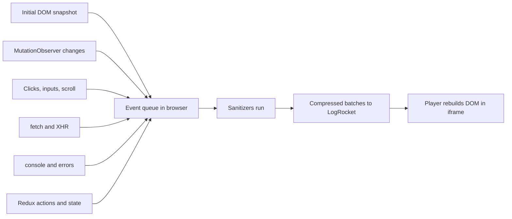
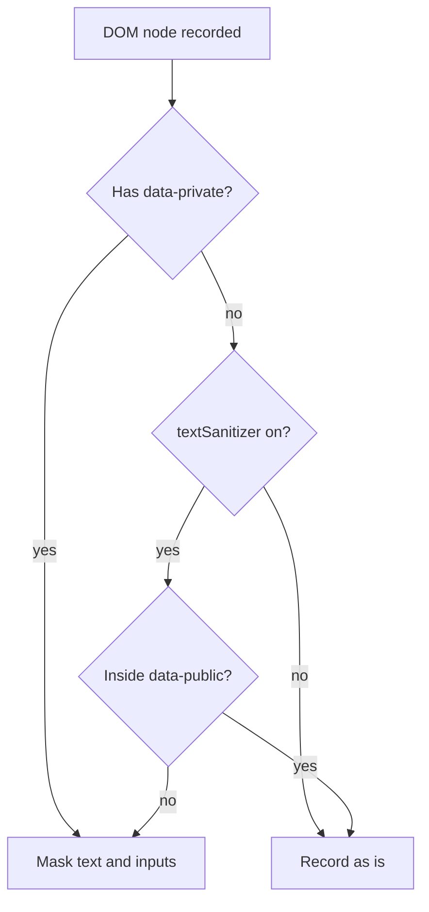
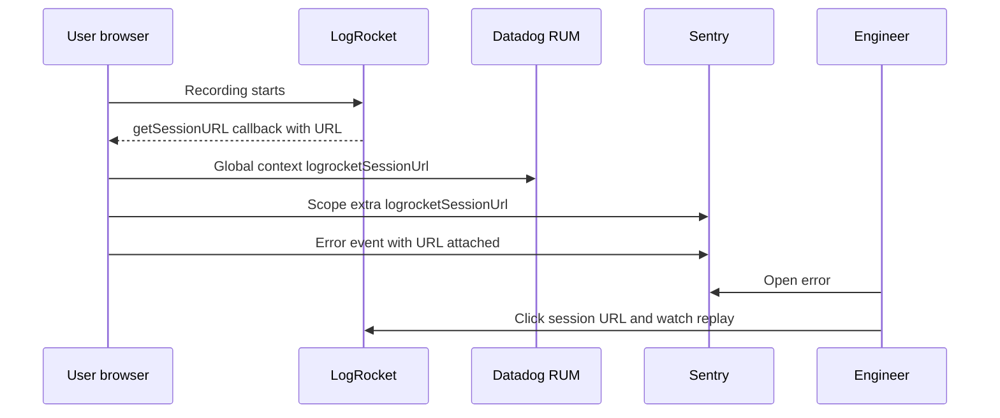

## 1. What it is

**LogRocket is a session replay and frontend monitoring service: its SDK records DOM changes, clicks, network requests, console logs and Redux actions in the browser, then lets you replay a user's session like a video alongside the technical data.**

Analogy: a flight data recorder for your web app. When a plane has a problem, investigators do not ask the pilot to remember; they play back the black box. When a customer says "the transfer button did nothing", you open their session and watch what they clicked, what the API returned, and what Redux state looked like at that moment.

The problem it solves: bug reports from users are vague and hard to reproduce. Stack traces show where code failed, not what the user did to get there. Session replay closes that gap, cutting time to reproduce from hours to minutes.

## 2. Core concepts

### [Beginner] How session replay works (it is not a video)

The SDK does not record pixels. It serialises the DOM once, then records **mutations** (nodes added, attributes changed, text updated) with timestamps, plus events like clicks, scrolls and input changes. The player rebuilds the DOM in an iframe and reapplies changes in order.

```ts
// Conceptually, the recorder does something like this
const observer = new MutationObserver((mutations) => {
  for (const m of mutations) {
    queueEvent({ type: "mutation", target: nodeId(m.target), kind: m.type, at: performance.now() });
  }
});
observer.observe(document, { subtree: true, childList: true, attributes: true, characterData: true });
// Plus listeners for click, input, scroll, resize, and patched fetch/XHR/console
```



> **Why:** DOM recording is far smaller than video, keeps text searchable, and allows privacy rules per element. The trade-off: things outside the DOM (canvas drawings, some cross-origin iframes, video content) may not replay exactly.

### [Beginner] LogRocket.init

```ts
import LogRocket from "logrocket";

LogRocket.init("bank-org/wealth-web", {
  release: "2026.10.1", // ties sessions to a deploy
});
```

The app id has the form `organisation/app`. Call `init` once, as early as possible, so the initial DOM snapshot and early errors are captured.

> **Gotcha:** Calling `init` twice, or inside a component, can start duplicate recordings. Initialise at module level in your entry file.

### [Beginner] identify and track

```ts
// After Okta login
LogRocket.identify("00u98xyz", {
  // traits shown in the LogRocket UI and searchable
  role: "advisor",
  region: "EMEA",
  // name and email are supported traits; in finance, consider omitting them
});

// Custom events for funnels and search
LogRocket.track("TransferSubmitted", {
  currency: "EUR",
  amountBucket: "1k-10k",
});
```

> **Why identify:** Without it, sessions are anonymous and support cannot find "the session where Ms Chen saw the error". With a stable id (Okta `sub`), you search by user and see all their sessions.

### [Intermediate] Redux middleware

```ts
import { configureStore } from "@reduxjs/toolkit";
import LogRocket from "logrocket";

export const store = configureStore({
  reducer: rootReducer,
  middleware: (getDefault) =>
    getDefault().concat(
      LogRocket.reduxMiddleware({
        // Return null to drop an action, or a cleaned copy
        actionSanitizer: (action) => {
          if (action.type === "auth/tokenReceived") return null;
          if (action.type === "payments/setCardDetails") {
            return { ...action, payload: { last4: action.payload.cardNumber.slice(-4) } };
          }
          return action;
        },
        // Return a cleaned copy of state (do NOT mutate the real state)
        stateSanitizer: (state) => ({
          ...state,
          auth: undefined,
          accounts: { ...state.accounts, balances: "[redacted]" },
        }),
      })
    ),
});
```

> **Gotcha:** `LogRocket.reduxMiddleware()` should be the **last** middleware, so it records actions after thunks and other middleware have transformed them.

> **Why sanitize state:** LogRocket records the full state after each action. Redux stores in finance apps often hold balances, account numbers and tokens. One unsanitized store is a data leak in every session.

### [Intermediate] Network sanitization

```ts
LogRocket.init("bank-org/wealth-web", {
  network: {
    requestSanitizer: (request) => {
      // Never record auth headers
      if (request.headers["Authorization"]) request.headers["Authorization"] = "[redacted]";
      // Drop bodies for sensitive endpoints entirely
      if (request.url.includes("/api/payments")) request.body = undefined;
      // Return null to ignore the request completely
      if (request.url.includes("/api/auth")) return null;
      return request;
    },
    responseSanitizer: (response) => {
      // response.url is not always present; match on what you have
      if (response.body && response.url?.includes("/api/accounts")) {
        response.body = undefined; // balances, account numbers
      }
      return response;
    },
  },
});
```

> **Finance tip:** Default to **deny**. Strip all request and response bodies except an explicit allowlist of safe endpoints. A new endpoint added next month should not start leaking because someone forgot to update a denylist.

### [Intermediate] DOM privacy: data-private, textSanitizer, inputSanitizer

```tsx
// Element-level: mark anything sensitive
<span data-private>{formatMoney(account.balanceCents, account.currency)}</span>
<div data-private className="account-number">{account.maskedNumber}</div>
```

```ts
// Global: mask all text and inputs, then opt in safe areas
LogRocket.init("bank-org/wealth-web", {
  dom: {
    textSanitizer: true,  // replace all text content with placeholders
    inputSanitizer: true, // mask all input values
  },
});
```

```tsx
// With textSanitizer on, mark safe UI as public to keep replays useful
<nav data-public>
  <a href="/accounts">Accounts</a>
  <a href="/transfers">Transfers</a>
</nav>
```



> **Why mask globally in finance:** Opt-out privacy (mark private elements) fails the first time a developer adds a new field and forgets the attribute. Opt-in (mask everything, mark public) fails safe. Password inputs are always masked regardless.

### [Advanced] Attaching the session URL to Datadog and Sentry

```ts
import LogRocket from "logrocket";
import { datadogRum } from "@datadog/browser-rum";
import * as Sentry from "@sentry/react";

LogRocket.getSessionURL((sessionURL) => {
  // Datadog: every RUM event carries the LogRocket link
  datadogRum.setGlobalContextProperty("logrocketSessionUrl", sessionURL);
  // Sentry: errors link to the replay
  Sentry.getCurrentScope().setExtra("logrocketSessionUrl", sessionURL);
});
```



> **Why a callback:** The session URL is only known after LogRocket's backend accepts the session. `getSessionURL` waits for that. Reading `LogRocket.sessionURL` too early returns `null`.

### [Advanced] Capturing errors and conditional recording

```ts
try {
  await approvePayment(paymentId);
} catch (err) {
  LogRocket.captureException(err as Error, {
    tags: { feature: "approvals" },
    extra: { paymentId },
  });
}

// Only record authenticated advisors, not anonymous marketing visitors
if (isInternalPortal) {
  LogRocket.init("bank-org/advisor-portal");
}
```

> **Why conditional init:** LogRocket bills per recorded session. Starting it only where replay is valuable (logged-in areas, or a sampled percentage) controls cost and reduces privacy exposure.

## 3. Why it's used in this project

- **Reproducing money-movement bugs.** "Transfer stuck on Processing" tickets come with a session URL. Engineers see the double click, the 504 from `/api/transfers` and the Redux state.
- **Support handoff.** Support searches by Okta user id and finds the session without asking customers for screenshots of their balances.
- **Redux debugging.** The time-travel view of actions and sanitized state shows how the transactions filter reached an invalid state.
- **Linking tools.** Datadog RUM events and Sentry errors carry the LogRocket URL, so any alert leads straight to a replay.
- **Privacy by default.** `textSanitizer`, `inputSanitizer`, network and Redux sanitizers keep account numbers, balances and tokens out of a third-party system, which compliance reviews require.

## 4. Setup & configuration

```bash
npm install logrocket
# optional: React component names in replays and search
npm install logrocket-react
```

```ts
// src/observability/logrocket.ts
import LogRocket from "logrocket";
import setupLogRocketReact from "logrocket-react";

const SAFE_BODY_ENDPOINTS = ["/api/feature-flags", "/api/reference/currencies"]; // allowlist

export function initLogRocket() {
  if (import.meta.env.MODE !== "production") return; // avoid dev noise and cost
  if (Math.random() > 0.25) return;                   // record ~25% of sessions

  LogRocket.init(import.meta.env.VITE_LOGROCKET_APP_ID, {
    release: import.meta.env.VITE_RELEASE,           // ties sessions to deploy, matches source maps
    shouldCaptureIP: false,                          // do not store user IP addresses
    console: {
      shouldAggregateConsoleErrors: true,            // treat console.error as issues
    },
    dom: {
      textSanitizer: true,                           // mask all text by default
      inputSanitizer: true,                          // mask all inputs by default
    },
    network: {
      requestSanitizer: (req) => {
        req.headers["Authorization"] = undefined;    // never store bearer tokens
        if (!SAFE_BODY_ENDPOINTS.some((p) => req.url.includes(p))) req.body = undefined;
        return req;
      },
      responseSanitizer: (res) => {
        if (!SAFE_BODY_ENDPOINTS.some((p) => res.url?.includes(p))) res.body = undefined;
        return res;
      },
    },
  });

  setupLogRocketReact(LogRocket); // call after init
}
```

> **Gotcha:** Check `logrocket-react` compatibility with your React major before adding it; it hooks into React internals.

Source maps: LogRocket can fetch public source maps or accept uploads via its CLI (`logrocket release` / upload commands). Upload in CI with the same `release` string as `init`, and keep maps off the public CDN.

## 5. Key features we use

### [Beginner] Identify after Okta login

```tsx
export function useLogRocketIdentity() {
  const { authState } = useOktaAuth();
  useEffect(() => {
    const sub = authState?.idToken?.claims.sub;
    if (authState?.isAuthenticated && sub) {
      LogRocket.identify(sub, { role: "advisor" });
    }
  }, [authState?.isAuthenticated]);
}
```

### [Beginner] Track a business event

```ts
LogRocket.track("StatementDownloaded", { format: "pdf", period: "2026-09" });
```

### [Intermediate] Session URL in a support form

```tsx
export function ReportProblemButton() {
  const [url, setUrl] = useState<string | null>(null);
  useEffect(() => LogRocket.getSessionURL(setUrl), []);
  return (
    <a href={`/support/new?session=${encodeURIComponent(url ?? "")}`}>Report a problem</a>
  );
}
```

### [Intermediate] Redact a component tree

```tsx
export function Private({ children }: { children: React.ReactNode }) {
  return <div data-private>{children}</div>;
}
// <Private><BalanceCard account={account} /></Private>
```

## 6. Interview questions

#### Q: How does session replay work without recording video?

The SDK captures a serialised snapshot of the DOM and then records DOM mutations (via MutationObserver), user events (clicks, input, scroll), network calls and console output with timestamps. The player recreates the DOM in a sandboxed iframe and replays the changes in order. This is much smaller than video, keeps text searchable, and allows per-element masking. Limits: canvas, some iframes and media may not replay faithfully, and external CSS must be reachable by the player.

#### Q: How would you stop LogRocket from capturing PII in a financial app?

Mask by default: `dom.textSanitizer: true` and `dom.inputSanitizer: true`, then mark safe UI `data-public`. Add `data-private` to sensitive elements as a second layer. Strip `Authorization` headers and all request/response bodies except an allowlist with `requestSanitizer` and `responseSanitizer`. Use `reduxMiddleware` with `actionSanitizer` and `stateSanitizer` to drop tokens and balances. Identify with an opaque id, set `shouldCaptureIP: false`, and get compliance sign-off.

#### Q: Where should LogRocket's Redux middleware go and why?

Last in the middleware chain. Middleware runs in order, so the last one sees the final action that reaches the reducer, after thunks or other middleware have dispatched or transformed it. It then records the action and the sanitized resulting state.

#### Q: How do you connect LogRocket to Datadog or Sentry?

Call `LogRocket.getSessionURL(callback)`. When the URL is available, set it as global context in Datadog (`datadogRum.setGlobalContextProperty`) and on the Sentry scope (`setExtra` or `setTag`). Every error or RUM event then carries a link to the replay. A callback is needed because the URL does not exist until the session is registered.

#### Q: What are the performance and cost considerations?

The SDK adds bundle weight and does work on the main thread for mutation observation and serialisation, which can hurt INP on pages with huge, rapidly changing DOMs like 10k-row live grids. Network capture copies bodies in memory. Billing is per session, so sample (conditional init), skip anonymous or low-value pages, and avoid recording in development. Measure Web Vitals with and without the SDK.

## 7. Drawbacks & pain points

- **Privacy risk** is the biggest one. Defaults record text and network bodies unless you configure sanitizers.
- **Performance overhead** on DOM-heavy pages (live price tickers, virtualised grids constantly mutating).
- **Cost** per session; finance teams often cannot justify 100% capture.
- **Ad blockers and CSP** can block the SDK; your CSP must allow LogRocket's script and ingest domains, which security teams scrutinise.
- **Replay fidelity**: canvas charts (common for portfolio charts) may show blank, and CSS from authenticated CDNs may not load in the player.
- **Yet another vendor** to assess for data residency and SOC 2.

Gotchas that trip devs up:

```ts
// 1. Mutating real state in stateSanitizer
stateSanitizer: (state) => { delete state.auth; return state; } // corrupts your Redux store

// 2. Reading sessionURL too early
console.log(LogRocket.sessionURL); // null right after init, use getSessionURL(cb)

// 3. Forgetting the Authorization header
requestSanitizer: (req) => req // bearer tokens recorded in every session

// 4. Middleware order
middleware: (gd) => [LogRocket.reduxMiddleware(), ...gd()] // should be last, not first
```

## 8. Better alternatives

The trend is consolidation: error tracking, performance and replay in one SDK, and open-source or self-hostable options for data residency. Many teams now use Sentry Session Replay or PostHog instead of a separate replay vendor.

| Tool | Bundle (gzip) | Privacy defaults | Self-host | Extras | Community | When it wins |
|---|---|---|---|---|---|---|
| LogRocket | ~50 KB+ | Configurable, opt-in masking | Enterprise on-prem option | Redux view, product analytics | Medium | Deep Redux and network debugging |
| Sentry Session Replay | ~30 to 50 KB with replay | Masks text and inputs by default | Yes (Sentry self-hosted) | Best-in-class errors, tracing | Large | Error-first teams wanting one tool |
| FullStory | ~50 KB+ | Configurable | No | Strong product analytics | Medium | Product and UX teams |
| PostHog | ~40 to 60 KB | Masks inputs by default | Yes | Analytics, flags, experiments | Large, fast-growing | Startups wanting all-in-one |
| OpenReplay | ~30 KB | Configurable | Yes, open source | Devtools-style replay | Small to medium | Strict data residency, self-host |
| Datadog Session Replay | ~30 to 50 KB | Masks by default | No | Linked to RUM and APM | Large | Already on Datadog |

> **Interview tip:** If asked "would you add LogRocket?", say what you would check first: does an existing tool (Datadog or Sentry) already offer replay, what do compliance and data residency require, what is the per-session cost, and what is the performance impact on your heaviest page.

## 9. When NOT to use it

- Screens showing full card numbers, CVVs, or authentication flows (do not record, or exclude entirely).
- When compliance forbids sending user-facing financial data to third parties, even masked.
- When you already pay for Datadog or Sentry replay.
- Performance-critical pages with very high DOM churn (real-time order books) unless measured.
- Local development and CI test runs.
- Apps where users have not been informed via privacy notice or consent, where required.

## Cheatsheet

| API | Purpose |
|---|---|
| `LogRocket.init(appId, options)` | Start recording once |
| `LogRocket.identify(uid, traits)` | Attach user |
| `LogRocket.track(name, props)` | Custom event |
| `LogRocket.captureException(err, { tags, extra })` | Report error |
| `LogRocket.captureMessage(msg)` | Report message |
| `LogRocket.getSessionURL(cb)` | Get replay link (async) |
| `LogRocket.reduxMiddleware({ actionSanitizer, stateSanitizer })` | Redux recording, last middleware |
| `network.requestSanitizer` / `responseSanitizer` | Scrub or drop network data, return null to drop request |
| `dom.textSanitizer` / `dom.inputSanitizer` | Mask all text / inputs |
| `data-private` / `data-public` | Per-element masking / unmasking |

```ts
LogRocket.init("org/app", {
  release: RELEASE,
  shouldCaptureIP: false,
  dom: { textSanitizer: true, inputSanitizer: true },
  network: {
    requestSanitizer: (r) => { r.headers["Authorization"] = undefined; r.body = undefined; return r; },
    responseSanitizer: (r) => { r.body = undefined; return r; },
  },
});
LogRocket.identify(oktaSub, { role: "advisor" });
LogRocket.getSessionURL((url) => datadogRum.setGlobalContextProperty("logrocketSessionUrl", url));
```
