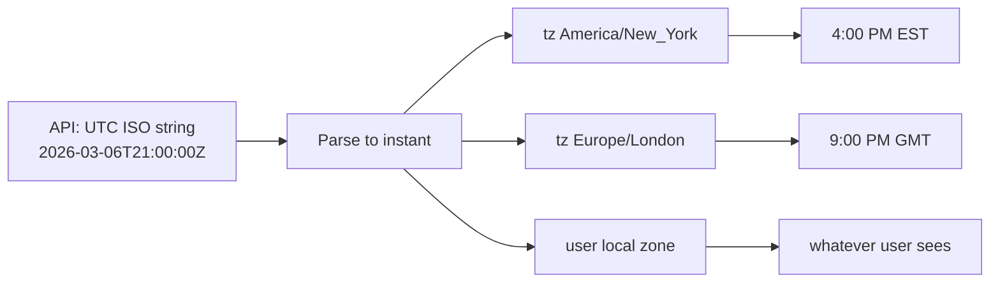
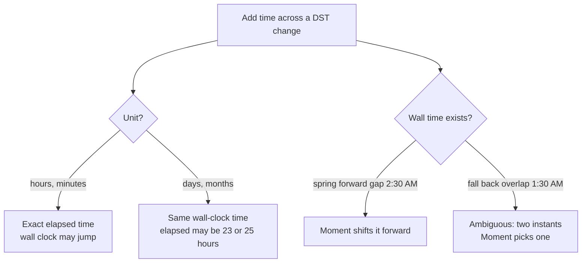
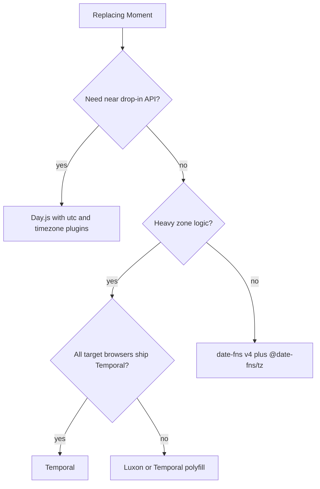

## 1. What it is

**Moment Timezone is an add-on for Moment.js that knows the rules of every IANA time zone (like `America/New_York`) so you can convert and format dates in any zone, including daylight saving changes.**

Think of a plain JavaScript `Date` as a stopwatch: it only knows "how many milliseconds since 1 January 1970 UTC". Moment is a friendly label printer for that stopwatch. Moment Timezone adds a world atlas of clocks, with every country's history of daylight saving switches, so the label printer can say "that instant was 4:00 PM in New York and 9:00 PM in London".

The problem it solves: the native `Date` can only work in UTC or in the user's own local zone. A financial app often needs a third zone, for example the exchange's zone, regardless of where the user sits. Moment Timezone made that possible years before `Intl` and Temporal could.

> **Outdated:** Moment has officially been in maintenance mode since September 2020. Its own docs recommend other libraries for new projects. Learn it to maintain existing code and to explain the migration in interviews.

## 2. Core concepts

### [Beginner] An instant vs a wall-clock time

```ts
// One instant in time...
const instantUtc = '2026-03-06T21:00:00Z';

// ...shown as different wall-clock times:
// New York: 2026-03-06 16:00 (EST, UTC-5)
// London:   2026-03-06 21:00 (GMT, UTC+0)
// Tokyo:    2026-03-07 06:00 (JST, UTC+9)  -- even a different DATE
```

> **Why:** An instant is a single point on the universal timeline. A wall-clock time is what a clock on the wall shows in a particular place. Time zones are the mapping between them, and that mapping changes over the year (DST) and over history (governments change rules). Most date bugs come from mixing these two ideas.



### [Beginner] Moment basics

```ts
import moment from 'moment';

const now = moment();                          // current time, local zone
const d = moment('2026-03-06T21:00:00Z');      // parse ISO 8601
d.format('YYYY-MM-DD HH:mm');                  // formatted in local zone
d.toISOString();                               // always UTC: '2026-03-06T21:00:00.000Z'
moment.utc('2026-03-06T21:00:00Z').format();   // work in UTC mode
d.add(1, 'day').startOf('day');                // arithmetic and rounding
moment('2026-03-31').diff(moment('2026-03-01'), 'days'); // 30
d.isBefore(moment());                          // comparisons
```

### [Beginner] The mutability problem

Moment objects are **mutable**: methods like `add`, `subtract`, `startOf` change the object in place AND return it.

```ts
const statementDate = moment('2026-03-31');
const dueDate = statementDate.add(25, 'days'); // looks like a new value...

statementDate.format('YYYY-MM-DD'); // '2026-04-25' -- original changed!
dueDate === statementDate;          // true: same object

// Fix: clone first
const dueDate2 = statementDate.clone().add(25, 'days');
```

> **Why:** Moment was designed in 2011 when chaining by mutation was common. Mutation is dangerous in React because a moment stored in state or props can be changed without a `setState`, so React does not re-render, and other components holding the same object see the change. Every modern date library (date-fns, Luxon, Day.js, Temporal) is immutable.

### [Intermediate] moment-timezone and the tz database

```ts
import moment from 'moment-timezone'; // same moment, extended with .tz

// Create a time AS IF on a wall clock in New York
const close = moment.tz('2026-03-06 16:00', 'America/New_York');
close.toISOString(); // '2026-03-06T21:00:00.000Z' (EST, UTC-5)

// Convert an existing instant into a zone for display
moment('2026-03-06T21:00:00Z').tz('Asia/Tokyo').format('YYYY-MM-DD HH:mm z'); // '2026-03-07 06:00 JST'

moment.tz.guess();        // user's zone, e.g. 'Europe/London' (uses Intl)
moment.tz.names();        // all known zone names
```

> **Why:** The IANA tz database (also called Olson or zoneinfo) is a public dataset of every region's offset and DST rules, back to the 1970s and earlier. moment-timezone ships a packed copy of it as JSON. That is why it is big: you carry the history of world time with your bundle.

> **Gotcha:** `moment.tz(str, zone)` interprets the string as wall-clock time IN that zone. `moment(str).tz(zone)` parses first (in local or the string's own offset), then converts. They give different instants for the same string without a `Z`.

### [Intermediate] Conversion between zones

```ts
// User in London schedules a transfer for 9:00 AM New York time
const scheduled = moment.tz('2026-07-01 09:00', 'America/New_York');

scheduled.toISOString();                       // store this: '2026-07-01T13:00:00.000Z' (EDT, UTC-4)
scheduled.clone().tz('Europe/London').format('HH:mm z'); // '14:00 BST' for the user's view
scheduled.utcOffset();                         // -240 minutes
```

### [Advanced] DST pitfalls



```ts
// US DST starts 2026-03-08 at 2:00 AM: clocks jump to 3:00 AM
const before = moment.tz('2026-03-07 09:30', 'America/New_York');

before.clone().add(1, 'day').format();    // '2026-03-08T09:30:00-04:00' same wall time
before.clone().add(24, 'hours').format(); // '2026-03-08T10:30:00-04:00' exact 24h later

// Non-existent time in the gap
moment.tz('2026-03-08 02:30', 'America/New_York').format(); // shifted to 03:30 -04:00

// Days between two dates across DST: use calendar diff, not ms/86400000
const a = moment.tz('2026-03-07', 'America/New_York');
const b = moment.tz('2026-03-09', 'America/New_York');
(b.valueOf() - a.valueOf()) / 86_400_000; // 1.9583... not 2
b.diff(a, 'days');                         // 2
```

> **Finance tip:** Interest accrual, "days until due", and SLA timers must decide explicitly: calendar days in a specific zone, or exact elapsed hours. Write that rule down and test it on DST weekends.

> **Gotcha:** US and EU switch DST on different dates. For about 2-3 weeks each spring and a week each autumn, New York to London is 4 hours instead of 5. Hard-coded offsets like `-05:00` break during those weeks.

### [Advanced] Storing UTC ISO strings

```ts
interface Transaction {
  id: string;
  amountCents: number;
  postedAt: string; // ALWAYS UTC ISO 8601: '2026-03-06T21:00:00.000Z'
}

// Write: convert to UTC at the boundary
const postedAt = moment.tz(input, 'America/New_York').toISOString();

// Read: parse UTC, convert only for display
const label = moment(txn.postedAt).tz(userZone).format('MMM D, YYYY h:mm A z');
```

> **Why:** UTC has no DST and no ambiguity, sorts correctly as a string, and every system understands ISO 8601. Store instants in UTC, store the zone name separately if the business rule depends on it, and convert only at the display edge.

## 3. Why it's used in this project

- **Market close times**: US equities close at 4:00 PM `America/New_York`. A London or Kathmandu user must see the right local time, and "market open?" checks must use New York time, not the browser's.
- **End-of-day statement cutoffs**: "transactions after 11:59 PM Eastern post next business day". The cutoff is a wall-clock time in a business zone.
- **Scheduled transfers**: users choose a date/time; the backend needs one UTC instant.
- **Audit trails**: timestamps are stored in UTC and shown in the viewer's zone with the zone abbreviation, so compliance reviewers in different offices agree on order.
- **Legacy**: the app predates date-fns v4 / Temporal, so many components already use Moment.

```ts
// Is the US market open right now?
function isUsMarketOpen(nowUtc = moment.utc()): boolean {
  const ny = nowUtc.clone().tz('America/New_York');
  const day = ny.isoWeekday(); // 1 = Mon ... 7 = Sun
  if (day > 5) return false;   // holidays need a separate calendar
  const open = ny.clone().set({ hour: 9, minute: 30, second: 0, millisecond: 0 });
  const close = ny.clone().set({ hour: 16, minute: 0, second: 0, millisecond: 0 });
  return ny.isSameOrAfter(open) && ny.isBefore(close);
}

// Statement cutoff: which business date does a transaction belong to?
function statementDate(postedAtUtc: string): string {
  return moment(postedAtUtc).tz('America/New_York').format('YYYY-MM-DD');
}
```

> **Finance tip:** The calendar date of a transaction depends on the zone. `2026-03-07T03:00:00Z` is March 6 in New York but March 7 in UTC. Always compute business dates in the business zone.

## 4. Setup & configuration

```bash
npm install moment moment-timezone
# moment ships its own types; moment-timezone ships types too in recent versions
```

```ts
// src/lib/time.ts -- one place to import from, so migration is easier later
import moment from 'moment-timezone';

// Optional: set a default zone for all moment() calls (affects everything -- use carefully)
// moment.tz.setDefault('America/New_York');

export const BUSINESS_TZ = 'America/New_York'; // exchange / bank zone
export { moment };
```

Reduce bundle size by loading only the data you need:

```ts
// Smaller prebuilt data ranges exist (file names vary by version; check node_modules/moment-timezone/builds)
import moment from 'moment-timezone/builds/moment-timezone-with-data-10-year-range';
```

Strip Moment locales (most of Moment's size) in Vite/webpack:

```ts
// webpack.config.js -- ignore all locale files except English (built in)
new webpack.IgnorePlugin({ resourceRegExp: /^\.\/locale$/, contextRegExp: /moment$/ });
```

> **Gotcha:** The tz data inside the package is a snapshot. When a country changes its DST rules, you only get the fix by upgrading `moment-timezone`. The browser's `Intl` data, used by modern libraries, updates with the browser.

## 5. Key features we use

### [Beginner] Display a UTC timestamp in the user's zone

```ts
moment(txn.postedAt).tz(moment.tz.guess()).format('MMM D, YYYY h:mm A z'); // 'Mar 6, 2026 4:00 PM EST'
```

### [Beginner] Parse a business-zone wall time to UTC

```ts
const cutoffUtc = moment.tz('2026-03-06 23:59:59', BUSINESS_TZ).toISOString();
```

### [Intermediate] Start and end of a business day for API filters

```ts
const day = moment.tz('2026-03-06', BUSINESS_TZ);
const from = day.clone().startOf('day').toISOString(); // '2026-03-06T05:00:00.000Z'
const to   = day.clone().endOf('day').toISOString();   // '2026-03-07T04:59:59.999Z'
```

### [Intermediate] Countdown to market close

```ts
const close = moment.tz(BUSINESS_TZ).set({ hour: 16, minute: 0, second: 0 });
const minsLeft = close.diff(moment(), 'minutes');
```

## 6. Interview questions

#### Q: Why is Moment.js considered legacy, and what would you use instead?

The maintainers put it in maintenance mode in 2020. It is mutable (methods change the object in place), not tree-shakeable (one big object with all methods, plus locales), and large (~70 KB gzip with locales and tz data combined, depending on build). Modern choices: date-fns (+ `@date-fns/tz` in v4) for functional, tree-shakeable helpers; Luxon for an immutable, zone-aware object API built on `Intl`; Day.js for a tiny Moment-like API; and the Temporal API where supported, with a polyfill elsewhere.

#### Q: What is the difference between `moment.tz(str, zone)` and `moment(str).tz(zone)`?

`moment.tz(str, zone)` parses the string as a wall-clock time in that zone: "4:00 PM in New York". `moment(str).tz(zone)` parses the string in local time (or by its own offset) to an instant, then changes the display zone. For strings without an offset they give different instants. Use the first when the user or business rule states a time in a specific zone.

#### Q: How should a financial app store and display timestamps?

Store instants as UTC ISO 8601 strings or epoch milliseconds. Store the relevant zone name (for example the account's or exchange's zone) separately when rules depend on it. Convert to a zone only for display or for computing business dates. Never store local times without zone info, and never hard-code offsets because DST changes them.

#### Q: Give an example of a DST bug and how to avoid it.

Calculating days between dates by dividing millisecond difference by 86,400,000: across the spring DST change one day is 23 hours, so you get 1.958 instead of 2 and rounding errors in interest or due-date logic. Avoid by using calendar-aware diffs in a specific zone (`diff(..., 'days')`, `differenceInCalendarDays`, Temporal `PlainDate.until`). Another: scheduling at 2:30 AM on spring-forward day, which does not exist.

#### Q: Why is mutability dangerous in React specifically?

React decides whether to re-render by comparing references. If you mutate a moment held in state (`date.add(1, 'day')`), the reference does not change, so React may skip the update, and any other component sharing that object silently sees the new value. Memoized selectors and `useMemo` dependencies also break. Immutable libraries return new objects, which fits React's model.

## 7. Drawbacks & pain points

- **Maintenance mode**: no new features; bug and tz data updates only.
- **Size**: moment ~20 KB gzip core, plus locales (can double it), plus tz data (all zones and full history is large, roughly 30+ KB gzip). Hard to shrink.
- **Not tree-shakeable**: every method lives on the prototype; you get all of them.
- **Mutable API**: the most common source of Moment bugs.
- **Bundled tz data** goes stale until you upgrade.
- **Lenient parsing**: non-ISO strings fall back to `new Date()` parsing with a deprecation warning.

Gotchas that trip devs up:

```ts
// 1. Mutation
const start = moment(); const end = start.add(7, 'days'); // start changed too

// 2. Months are 0-based in set/month()
moment().month(2); // March, not February

// 3. Non-ISO parse is browser-dependent
moment('03/06/2026'); // deprecation warning; use moment('03/06/2026', 'MM/DD/YYYY', true)

// 4. format('YYYY') vs 'yyyy' and 'DD' vs 'dd': case matters ('dd' is weekday name)

// 5. Equality
moment(a) === moment(a); // false; use isSame()

// 6. setDefault leaks into every moment() call in the app, including tests
```

## 8. Better alternatives

The industry has moved to immutable libraries that use the browser's built-in `Intl` time zone data, and is moving toward the native **Temporal** API.

**Temporal status (hedged, as of late 2026):** Temporal reached TC39 Stage 4 and is part of ES2026. It shipped in Firefox (from around version 139, 2025) and Chrome/Edge (from version 144, early 2026). Safari support has been in progress; check caniuse before relying on it without a polyfill. For production financial apps, most teams still pair Temporal with a polyfill (`@js-temporal/polyfill` or `temporal-polyfill`) or keep using date-fns/Luxon until their browser matrix fully supports it.

| Option | Bundle (gzip) | Immutable | Time zones | Tree-shakeable | TypeScript | Learning curve | When it wins |
|---|---|---|---|---|---|---|---|
| Moment + tz | ~40-70 KB | no | built-in data | no | ok | low | existing legacy code |
| date-fns v4 + @date-fns/tz | ~2-10 KB used | yes (plain Date) | via Intl | yes | excellent | low | functional style, small bundles |
| Luxon | ~20-25 KB | yes | via Intl | no | good | medium | zone-heavy apps, Moment-like objects |
| Day.js + utc/timezone plugins | ~3-7 KB | yes | via Intl plugin | partial | good | low | drop-in Moment API replacement |
| Temporal (native) | 0 KB native / ~20-50 KB polyfill | yes | built in | n/a | built in | medium | future standard, precise types |

> **Outdated:** `date-fns-tz` (the separate package with `formatInTimeZone`, `zonedTimeToUtc`/`fromZonedTime`) is still widely used with date-fns v2/v3. With date-fns v4, the official `@date-fns/tz` package adds a `TZDate` class and an `in` option. Both work; new code should prefer `@date-fns/tz`.

### Migration table

| Moment / moment-timezone | date-fns v4 + @date-fns/tz | Luxon | Day.js | Temporal |
|---|---|---|---|---|
| `moment()` | `new Date()` | `DateTime.now()` | `dayjs()` | `Temporal.Now.zonedDateTimeISO()` |
| `moment(iso)` | `parseISO(iso)` | `DateTime.fromISO(iso)` | `dayjs(iso)` | `Temporal.Instant.from(iso)` |
| `m.format('YYYY-MM-DD')` | `format(d, 'yyyy-MM-dd')` | `dt.toFormat('yyyy-MM-dd')` | `d.format('YYYY-MM-DD')` | `zdt.toPlainDate().toString()` |
| `m.add(1, 'day')` (mutates) | `addDays(d, 1)` | `dt.plus({ days: 1 })` | `d.add(1, 'day')` | `zdt.add({ days: 1 })` |
| `m.startOf('day')` | `startOfDay(d)` | `dt.startOf('day')` | `d.startOf('day')` | `zdt.startOfDay()` |
| `b.diff(a, 'days')` | `differenceInCalendarDays(b, a)` | `b.diff(a, 'days').days` | `b.diff(a, 'day')` | `a.until(b, { largestUnit: 'day' }).days` |
| `moment.tz(str, zone)` | `new TZDate(y, m, d, h, mi, zone)` | `DateTime.fromISO(str, { zone })` | `dayjs.tz(str, zone)` | `Temporal.PlainDateTime.from(str).toZonedDateTime(zone)` |
| `m.tz(zone)` | `new TZDate(d, zone)` or `format(d, fmt, { in: tz(zone) })` | `dt.setZone(zone)` | `d.tz(zone)` | `instant.toZonedDateTimeISO(zone)` |
| `moment.tz.guess()` | `Intl.DateTimeFormat().resolvedOptions().timeZone` | `DateTime.local().zoneName` | `dayjs.tz.guess()` | `Temporal.Now.timeZoneId()` |
| `m.toISOString()` | `d.toISOString()` | `dt.toUTC().toISO()` | `d.toISOString()` | `zdt.toInstant().toString()` |

```ts
// Market close in New York, the modern ways

// date-fns v4 + @date-fns/tz
import { TZDate } from '@date-fns/tz';
const closeFns = new TZDate(2026, 2, 6, 16, 0, 'America/New_York'); // month is 0-based
closeFns.toISOString(); // instant with -05:00 offset; new Date(closeFns).toISOString() for Z form

// Luxon
import { DateTime } from 'luxon';
const closeLx = DateTime.fromObject(
  { year: 2026, month: 3, day: 6, hour: 16 },
  { zone: 'America/New_York' },
);
closeLx.toUTC().toISO(); // '2026-03-06T21:00:00.000Z'

// Temporal
const closeT = Temporal.ZonedDateTime.from({
  year: 2026, month: 3, day: 6, hour: 16, timeZone: 'America/New_York',
});
closeT.toInstant().toString(); // '2026-03-06T21:00:00Z'
```



> **Interview tip:** Say you would migrate incrementally: wrap date logic in one module (`lib/time.ts`), add an ESLint `no-restricted-imports` rule for `moment` in new code, port functions one at a time with tests around DST dates, then remove Moment.

## 9. When NOT to use it

- Any new project: Moment's own docs advise against it.
- Bundle-sensitive pages (login, landing, mobile web).
- When you only need formatting: `Intl.DateTimeFormat` with `timeZone` does that natively.
- When you need exact, distinct types for date-only vs instant vs wall time (use Temporal or Luxon).
- Server-side batch jobs where rule updates must arrive with the OS/runtime rather than a package bump.

```ts
// Formatting in a zone with zero libraries
new Intl.DateTimeFormat('en-US', {
  timeZone: 'America/New_York', dateStyle: 'medium', timeStyle: 'short', timeZoneName: 'short',
}).format(new Date('2026-03-06T21:00:00Z')); // 'Mar 6, 2026, 4:00 PM EST'
```

## Cheatsheet

| Task | moment-timezone |
|---|---|
| Now in zone | `moment.tz('America/New_York')` |
| Wall time in zone to instant | `moment.tz('2026-03-06 16:00', zone)` |
| Instant to zone | `moment(iso).tz(zone)` |
| Store | `m.toISOString()` (UTC) |
| Safe arithmetic | `m.clone().add(1, 'day')` |
| Day bounds | `m.clone().startOf('day')`, `endOf('day')` |
| Calendar diff | `b.diff(a, 'days')` |
| User zone | `moment.tz.guess()` |
| Offset (min) | `m.utcOffset()` |
| Zone abbrev | `m.format('z')` |

```ts
import moment from 'moment-timezone';
const NY = 'America/New_York';
const closeUtc = moment.tz('2026-03-06 16:00', NY).toISOString();      // '...T21:00:00.000Z'
const show = moment(closeUtc).tz(moment.tz.guess()).format('h:mm A z');
const bizDate = moment(txn.postedAt).tz(NY).format('YYYY-MM-DD');      // statement date
const due = moment(stmt).clone().add(25, 'days');                      // always clone
```
