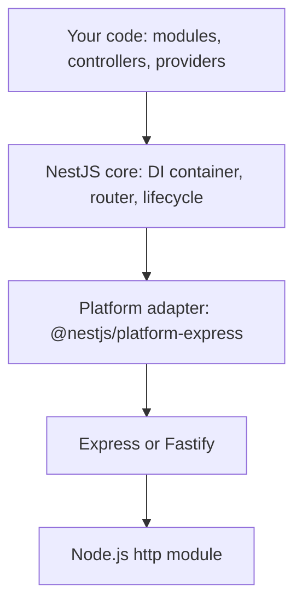
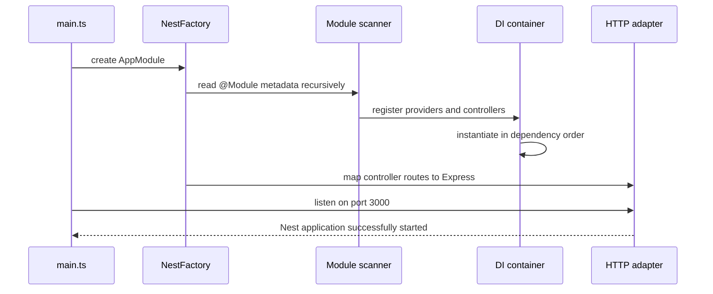
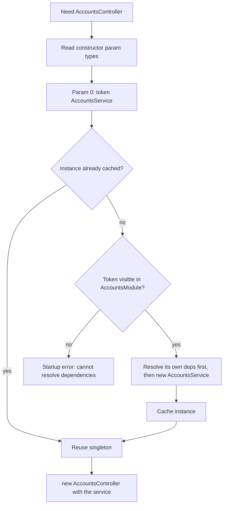
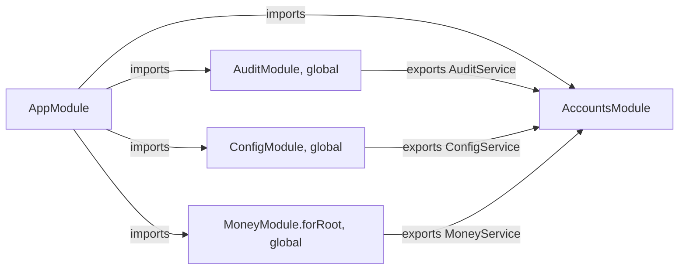
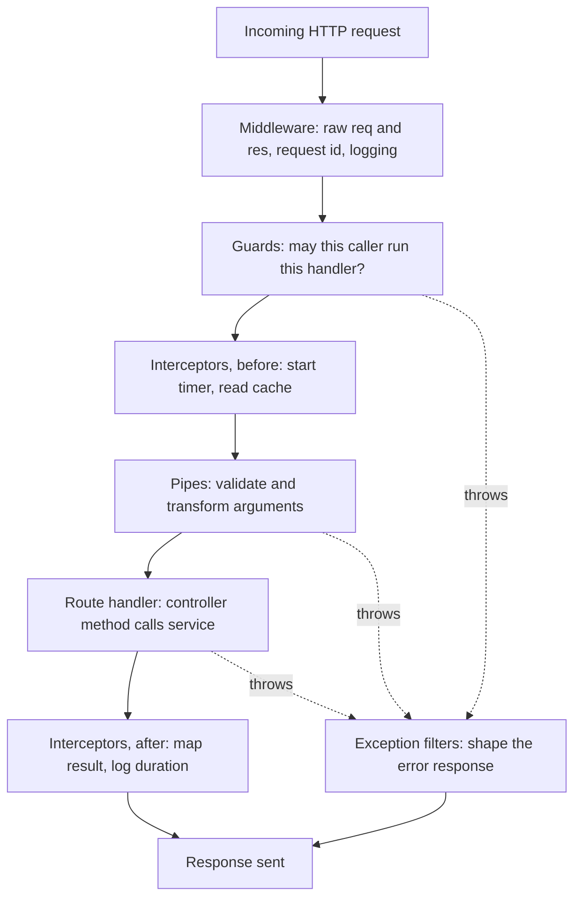
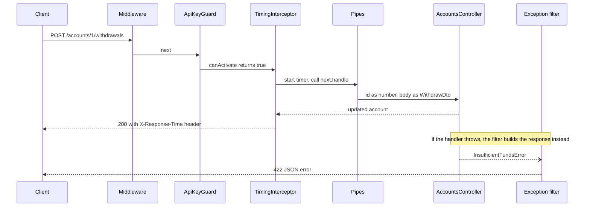
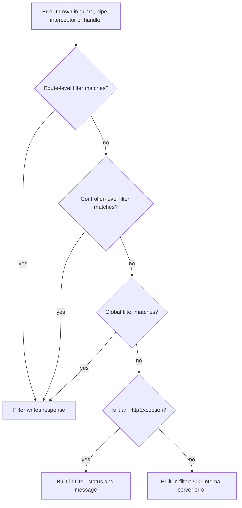
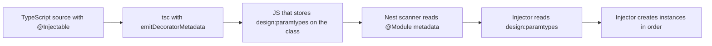

This guide builds one small project, `ledger-api`, step by step. It stores bank-style accounts in memory so you can focus on NestJS itself, not on a database. Every code block is a full file you can paste. Every command is something you can run.

You already know React and TypeScript. That helps a lot. Decorators will look like JSX props for classes, dependency injection will look like React Context done by a framework, and modules will look like feature folders with a public API.

## 1. What NestJS is and why

### [Beginner] Step 1 — See the problem NestJS solves

Node.js on its own gives you a raw HTTP server. Express adds routing and middleware on top. That is all Express does. It does not tell you where to put business logic, how to share a database client, how to validate input, or how to test a route without the network.

Here is a typical small Express app:

```ts
// express-example/server.ts (for reading only, do not create)
import express from 'express';

const app = express();
app.use(express.json());

const accounts: { id: number; name: string }[] = [];

app.get('/accounts/:id', (req, res) => {
  const id = Number(req.params.id);
  if (Number.isNaN(id)) return res.status(400).json({ message: 'id must be a number' });
  const account = accounts.find((a) => a.id === id);
  if (!account) return res.status(404).json({ message: 'Not found' });
  res.json(account);
});

app.listen(3000);
```

This is fine for 50 lines. At 50 files, every team invents its own answers:

- Where does validation go? Each handler does it by hand, slightly differently.
- How does a route get the database client? A global import, so tests must mock modules.
- Where do auth checks go? A middleware, but it cannot easily know which handler will run.
- How are errors shaped? Each handler builds its own JSON.

NestJS is a framework that sits **on top of** Express (or Fastify). It keeps the same HTTP engine but adds a fixed structure:

- **Modules** group related code and declare what they share.
- **Controllers** map HTTP routes to methods.
- **Providers** (services) hold business logic and are created by a **dependency injection (DI) container**.
- **Pipes, guards, interceptors and filters** are dedicated slots for validation, auth, cross-cutting logic and error shaping.



> **Why:** Nest trades some freedom for consistency. On a team, a new developer can open any Nest repo and know where the validation, auth and error handling live. That is the main reason companies pick it.

The DI system is inspired by Angular. If you have used React Context, the idea is similar: a component asks for a value and a provider higher up supplies it. In Nest, a class lists what it needs in its constructor, and the container builds and passes those objects in.

```ts
// for reading only
@Injectable()
export class AccountsService {
  // Nest sees "needs an AuditService" and passes one in. You never call `new`.
  constructor(private readonly audit: AuditService) {}
}
```

### [Beginner] Step 2 — Compare NestJS with Express, Fastify and Hono

| | Express | Fastify | Hono | NestJS |
|---|---|---|---|---|
| What it is | Minimal HTTP framework | Fast HTTP framework with schemas and plugins | Tiny framework built on Web standards (Request/Response) | Application framework on top of Express or Fastify |
| Structure | None, you decide | Plugins and encapsulation | None, you decide | Modules, controllers, providers enforced |
| Dependency injection | No | No (decorators on the instance) | No | Yes, built in |
| Validation | Bring your own | JSON Schema built in | Validator middleware (often zod) | Pipes, usually class-validator or zod |
| Runtimes | Node | Node | Node, Bun, Deno, Cloudflare Workers, edge | Node (Bun works for many apps, not officially the main target) |
| TypeScript | Types via `@types/express` | Good types | TypeScript first | TypeScript first, decorators everywhere |
| Learning curve | Low | Low to medium | Low | Medium to high |
| Good fit | Small services, full control | Raw throughput | Edge functions, small APIs | Large codebases, many developers, long life |

> **Interview tip:** Do not say "Nest is better than Express". Say "Nest is Express plus an architecture and a DI container. I would pick it for a large team and a long-lived service, and pick Express or Hono for a small function where the structure costs more than it saves."

> **Finance tip:** Financial backends live for years and pass audits. Clear module boundaries and one place for validation and error shaping make it much easier to show an auditor where every rule is enforced.

## 2. Setup

### [Beginner] Step 3 — Install Node and the Nest CLI

NestJS 11 needs Node 20 or newer. NestJS 10 supported Node 16 and up. Use the current LTS release (Node 22 or 24 at the time of writing).

```bash
node -v
npm -v
```

```text
v22.11.0
10.9.0
```

Your numbers may differ. Anything at 20 or higher is fine.

Install the CLI globally. The CLI generates projects and files and runs the build.

```bash
npm i -g @nestjs/cli
nest --version
```

```text
11.0.10
```

> **Gotcha:** If you would rather not install globally, every `nest` command in this guide also works as `npx @nestjs/cli <command>`.

### [Beginner] Step 4 — Create the project

```bash
nest new ledger-api --strict --package-manager npm
cd ledger-api
```

- `--strict` turns on TypeScript strict mode in the generated `tsconfig.json`. You want this. It catches `undefined` bugs the way it does in your React code.
- `--package-manager npm` skips the interactive question. Use `pnpm` or `yarn` if your team does.

The CLI copies a starter project and runs `npm install`. You get this tree:

```text
ledger-api/
  src/
    app.controller.spec.ts
    app.controller.ts
    app.module.ts
    app.service.ts
    main.ts
  test/
    app.e2e-spec.ts
    jest-e2e.json
  eslint.config.mjs        (older versions: .eslintrc.js)
  .prettierrc
  nest-cli.json
  package.json
  tsconfig.build.json
  tsconfig.json
  README.md
```

### [Beginner] Step 5 — Read `main.ts` line by line

`main.ts` is the entry point. It is the Nest version of `ReactDOM.createRoot(...).render(<App />)`.

```ts
// src/main.ts
import { NestFactory } from '@nestjs/core';
import { AppModule } from './app.module';

async function bootstrap() {
  const app = await NestFactory.create(AppModule);
  await app.listen(process.env.PORT ?? 3000);
}
bootstrap();
```

Line by line:

1. `NestFactory` is the class that builds an application from a root module.
2. `AppModule` is the root of your module tree, like `<App />` is the root of your component tree.
3. `bootstrap` is async because building the app and opening the port are both async.
4. `NestFactory.create(AppModule)` scans `AppModule` and every module it imports, reads their decorators, creates every provider in the right order, and wires up the routes. It uses Express by default.
5. `app.listen(...)` opens the HTTP port. `process.env.PORT ?? 3000` uses the `PORT` variable if set.
6. `bootstrap()` starts it. Some starter versions write `void bootstrap();` to tell the linter the floating promise is intended.



### [Beginner] Step 6 — Read the module, controller and service

```ts
// src/app.module.ts
import { Module } from '@nestjs/common';
import { AppController } from './app.controller';
import { AppService } from './app.service';

@Module({
  imports: [],
  controllers: [AppController],
  providers: [AppService],
})
export class AppModule {}
```

- `@Module({...})` is a decorator. It attaches metadata to the class. The class body is empty because the module is only a description.
- `imports` lists other modules whose exported providers this module wants to use.
- `controllers` lists classes that handle HTTP routes.
- `providers` lists classes (and values) the DI container should create for this module.

```ts
// src/app.controller.ts
import { Controller, Get } from '@nestjs/common';
import { AppService } from './app.service';

@Controller()
export class AppController {
  constructor(private readonly appService: AppService) {}

  @Get()
  getHello(): string {
    return this.appService.getHello();
  }
}
```

- `@Controller()` with no argument means the route prefix is `/`. `@Controller('accounts')` would mean `/accounts`.
- The constructor asks for an `AppService`. You never write `new AppService()`. Nest reads the parameter type and passes in the single shared instance.
- `private readonly appService` is TypeScript shorthand that declares and assigns a property in one go.
- `@Get()` maps `GET /` to `getHello`. Whatever the method returns becomes the response body. A string is sent as text, an object or array as JSON.

```ts
// src/app.service.ts
import { Injectable } from '@nestjs/common';

@Injectable()
export class AppService {
  getHello(): string {
    return 'Hello World!';
  }
}
```

- `@Injectable()` marks the class as something the container can create and inject. It also makes TypeScript emit type information about the constructor, which Part 6 explains.

> **Why:** The controller only translates HTTP into a method call. The service holds the logic. This split means you can unit test the service with no HTTP at all, and reuse it from a queue worker or a cron job later.

### [Beginner] Step 7 — Read `tsconfig.json` and `nest-cli.json`

The exact `tsconfig.json` differs slightly between starter versions. These are the options that matter:

```json
// tsconfig.json (key options, your file may contain a few more)
{
  "compilerOptions": {
    "module": "commonjs",
    "declaration": true,
    "removeComments": true,
    "emitDecoratorMetadata": true,
    "experimentalDecorators": true,
    "allowSyntheticDefaultImports": true,
    "target": "ES2023",
    "sourceMap": true,
    "outDir": "./dist",
    "baseUrl": "./",
    "incremental": true,
    "skipLibCheck": true,
    "strict": true
  }
}
```

- `experimentalDecorators` turns on the decorator syntax Nest uses (the older TypeScript decorator spec, not the newer TC39 one).
- `emitDecoratorMetadata` makes TypeScript write constructor parameter types into the compiled JavaScript. **Without it, DI breaks**, because Nest would not know what to inject.
- `outDir: ./dist` is where `nest build` puts compiled JavaScript.
- `strict: true` came from the `--strict` flag. Older starters set `strictNullChecks: false` and `noImplicitAny: false` instead.
- Newer NestJS 11 starters use `"module": "nodenext"` with `"moduleResolution": "nodenext"` and `"isolatedModules": true`. Both setups work for this guide.

> **Gotcha:** With `isolatedModules` and `emitDecoratorMetadata` both on, a type you use in a decorated constructor or method signature must be imported with `import type` if it is only a type (for example `Request` from `express`). Otherwise you get error TS1272. This guide always uses `import type` for Express types.

`tsconfig.build.json` extends `tsconfig.json` and excludes `test` and `*.spec.ts` from the production build.

```json
// nest-cli.json
{
  "$schema": "https://json.schemastore.org/nest-cli",
  "collection": "@nestjs/schematics",
  "sourceRoot": "src",
  "compilerOptions": {
    "deleteOutDir": true
  }
}
```

- `collection` tells `nest generate` which templates to use.
- `sourceRoot` is where generated files go.
- `deleteOutDir` cleans `dist` before each build so deleted files do not linger.

### [Beginner] Step 8 — Run in watch mode

```bash
npm run start:dev
```

`start:dev` runs `nest start --watch`. It compiles with `tsc`, starts Node, and restarts when you save a file. It is the Nest equivalent of `vite` dev mode, but it restarts the whole process instead of hot-swapping modules.

```text
[Nest] 41210  - 10/05/2026, 10:00:00 AM     LOG [NestFactory] Starting Nest application...
[Nest] 41210  - 10/05/2026, 10:00:00 AM     LOG [InstanceLoader] AppModule dependencies initialized +9ms
[Nest] 41210  - 10/05/2026, 10:00:00 AM     LOG [RoutesResolver] AppController {/}: +4ms
[Nest] 41210  - 10/05/2026, 10:00:00 AM     LOG [RouterExplorer] Mapped {/, GET} route +2ms
[Nest] 41210  - 10/05/2026, 10:00:00 AM     LOG [NestApplication] Nest application successfully started +1ms
```

Read those logs. They tell you which modules loaded and every route that was mapped. When a route returns 404 and you are sure it exists, check this list first.

**Check it works:**

```bash
curl -i http://localhost:3000/
```

```text
HTTP/1.1 200 OK
X-Powered-By: Express
Content-Type: text/html; charset=utf-8
Content-Length: 12

Hello World!
```

The `X-Powered-By: Express` header proves Express is running underneath.

Other scripts you will use:

| Script | What it does |
|---|---|
| `npm run build` | Compile to `dist/` |
| `npm run start:prod` | Run `node dist/main` (no watch, no TypeScript) |
| `npm run start:debug` | Watch mode plus the Node inspector for breakpoints |
| `npm test` | Unit tests with Jest |
| `npm run test:e2e` | End-to-end tests in `test/` |

## 3. Building blocks: modules, controllers, providers

### [Beginner] Step 9 — Generate a feature module

A **feature module** owns one area of the business, such as accounts, payments or users. Think of it as a feature folder in a React app, but with an explicit list of what it shares.

```bash
nest g module accounts
nest g controller accounts --no-spec
nest g service accounts --no-spec
```

```text
CREATE src/accounts/accounts.module.ts (86 bytes)
UPDATE src/app.module.ts (324 bytes)
CREATE src/accounts/accounts.controller.ts (107 bytes)
UPDATE src/accounts/accounts.module.ts (182 bytes)
CREATE src/accounts/accounts.service.ts (92 bytes)
UPDATE src/accounts/accounts.module.ts (265 bytes)
```

The CLI created the files **and** registered them. `AppModule` now imports `AccountsModule`, and `AccountsModule` lists the controller and service. `--no-spec` skips test files to keep this guide short. Leave it off in real work.

> **Gotcha:** If you create a controller or service by hand, nothing registers it. A controller that is not in any module's `controllers` array simply does not exist, and its routes return 404 with no error. Check the `Mapped {...} route` startup logs.

### [Beginner] Step 10 — Write a controller: routes, params, query, body, status codes, headers

First the data shapes. These are plain TypeScript, no Nest yet.

```ts
// src/accounts/account.model.ts
export const CURRENCIES = ['USD', 'EUR', 'GBP', 'NPR'] as const;
export type Currency = (typeof CURRENCIES)[number];

export interface Account {
  id: number;
  name: string;
  currency: Currency;
  /** Balance in minor units (cents, paisa). Never store money as a float. */
  balanceMinor: number;
  createdAt: string;
}
```

```ts
// src/accounts/insufficient-funds.error.ts
export class InsufficientFundsError extends Error {
  constructor(
    readonly accountId: number,
    readonly balanceMinor: number,
    readonly requestedMinor: number,
  ) {
    super(`Account ${accountId} has insufficient funds`);
    this.name = 'InsufficientFundsError';
  }
}
```

A **DTO** (data transfer object) describes the shape of a request body. It must be a **class**, not an interface, because classes still exist at runtime and Nest can inspect them. Part 4 adds validation to these classes.

```ts
// src/accounts/dto/create-account.dto.ts
import type { Currency } from '../account.model';

export class CreateAccountDto {
  name!: string;
  currency!: Currency;
  openingBalanceMinor!: number;
}
```

```ts
// src/accounts/dto/withdraw.dto.ts
export class WithdrawDto {
  amountMinor!: number;
}
```

The `!` tells strict TypeScript "this is assigned from outside" (by the request body), so it does not complain about a missing initializer.

> **Finance tip:** Store and send money as integers in minor units (`1050` means 10.50). `0.1 + 0.2` is `0.30000000000000004` in JavaScript. Floats in a ledger produce balances that are off by a cent, and that is an audit finding.

Now the service. It holds the data and the rules.

```ts
// src/accounts/accounts.service.ts
import { Injectable, NotFoundException } from '@nestjs/common';
import type { Account, Currency } from './account.model';
import { CreateAccountDto } from './dto/create-account.dto';
import { InsufficientFundsError } from './insufficient-funds.error';

@Injectable()
export class AccountsService {
  private readonly accounts: Account[] = [];
  private nextId = 1;

  findAll(currency?: Currency): Account[] {
    return currency ? this.accounts.filter((a) => a.currency === currency) : this.accounts;
  }

  findOne(id: number): Account {
    const account = this.accounts.find((a) => a.id === id);
    if (!account) {
      throw new NotFoundException(`Account ${id} not found`);
    }
    return account;
  }

  create(dto: CreateAccountDto): Account {
    const account: Account = {
      id: this.nextId++,
      name: dto.name,
      currency: dto.currency,
      balanceMinor: dto.openingBalanceMinor,
      createdAt: new Date().toISOString(),
    };
    this.accounts.push(account);
    return account;
  }

  withdraw(id: number, amountMinor: number): Account {
    const account = this.findOne(id);
    if (amountMinor > account.balanceMinor) {
      throw new InsufficientFundsError(id, account.balanceMinor, amountMinor);
    }
    account.balanceMinor -= amountMinor;
    return account;
  }

  remove(id: number): void {
    const index = this.accounts.findIndex((a) => a.id === id);
    if (index === -1) {
      throw new NotFoundException(`Account ${id} not found`);
    }
    this.accounts.splice(index, 1);
  }
}
```

`NotFoundException` is one of Nest's built-in HTTP exceptions. When it is thrown anywhere during a request, Nest turns it into a 404 JSON response. You do not need `res.status(404)`.

Now the controller. It only translates HTTP into service calls.

```ts
// src/accounts/accounts.controller.ts
import { Body, Controller, Delete, Get, Header, Headers, HttpCode, HttpStatus } from '@nestjs/common';
import { Param, Post, Query } from '@nestjs/common';
import type { Account, Currency } from './account.model';
import { AccountsService } from './accounts.service';
import { CreateAccountDto } from './dto/create-account.dto';
import { WithdrawDto } from './dto/withdraw.dto';

@Controller('accounts')
export class AccountsController {
  constructor(private readonly accountsService: AccountsService) {}

  // GET /accounts?currency=USD
  @Get()
  findAll(@Query('currency') currency?: Currency): Account[] {
    return this.accountsService.findAll(currency);
  }

  // GET /accounts/1
  @Get(':id')
  @Header('Cache-Control', 'no-store')
  findOne(@Param('id') id: string): Account {
    return this.accountsService.findOne(Number(id));
  }

  // POST /accounts  -> 201 Created by default
  @Post()
  create(@Body() dto: CreateAccountDto, @Headers('x-request-id') requestId?: string): Account {
    console.log('create account, request id:', requestId ?? 'none');
    return this.accountsService.create(dto);
  }

  // POST /accounts/1/withdrawals -> 200, because nothing new is created at a URL
  @Post(':id/withdrawals')
  @HttpCode(HttpStatus.OK)
  withdraw(@Param('id') id: string, @Body() dto: WithdrawDto): Account {
    return this.accountsService.withdraw(Number(id), dto.amountMinor);
  }

  // DELETE /accounts/1 -> 204 No Content
  @Delete(':id')
  @HttpCode(HttpStatus.NO_CONTENT)
  remove(@Param('id') id: string): void {
    this.accountsService.remove(Number(id));
  }
}
```

What each decorator does:

- `@Controller('accounts')` sets the prefix. Every route in this class starts with `/accounts`.
- `@Get(':id')` adds a route segment. `:id` is a path parameter, like `useParams()` in React Router.
- `@Param('id')` reads one path parameter. Path params are **always strings**. That is why we call `Number(id)`.
- `@Query('currency')` reads `?currency=...`. The `Currency` type here is a promise TypeScript cannot keep. A client can send `?currency=banana`. Part 4 fixes this with a pipe.
- `@Body()` reads the parsed JSON body. Nest enables JSON body parsing for you.
- `@Headers('x-request-id')` reads one request header (names are lowercase in Node).
- `@Header('Cache-Control', 'no-store')` sets a **response** header. Note the singular name.
- `@HttpCode(...)` changes the success status. Defaults: 200 for everything except `POST`, which is 201.

> **Gotcha:** You can inject the raw Express response with `@Res()`, but then Nest stops sending the response for you and interceptors cannot change it. If you need it, use `@Res({ passthrough: true })` so you can set cookies or headers and still return a value normally.

**Check it works:**

```bash
curl -s -X POST http://localhost:3000/accounts \
  -H 'Content-Type: application/json' \
  -d '{"name":"Savings","currency":"USD","openingBalanceMinor":10000}'
```

```text
{"id":1,"name":"Savings","currency":"USD","balanceMinor":10000,"createdAt":"2026-10-05T04:20:11.123Z"}
```

```bash
curl -i http://localhost:3000/accounts/1
curl -s http://localhost:3000/accounts/99
curl -s -X POST http://localhost:3000/accounts/1/withdrawals -H 'Content-Type: application/json' -d '{"amountMinor":2500}'
curl -s -X POST http://localhost:3000/accounts/1/withdrawals -H 'Content-Type: application/json' -d '{"amountMinor":999999}'
```

```text
HTTP/1.1 200 OK
Cache-Control: no-store
Content-Type: application/json; charset=utf-8
...
{"id":1,"name":"Savings","currency":"USD","balanceMinor":10000,"createdAt":"..."}

{"message":"Account 99 not found","error":"Not Found","statusCode":404}

{"id":1,"name":"Savings","currency":"USD","balanceMinor":7500,"createdAt":"..."}

{"statusCode":500,"message":"Internal server error"}
```

The last call returns 500. `InsufficientFundsError` is a plain `Error`, and Nest's built-in exception filter only knows how to turn `HttpException` subclasses into nice responses. Everything else becomes a generic 500 (and the stack trace is logged in your terminal). Step 21 fixes this the right way.

```text
src/
  accounts/
    dto/
      create-account.dto.ts
      withdraw.dto.ts
    account.model.ts
    accounts.controller.ts
    accounts.module.ts
    accounts.service.ts
    insufficient-funds.error.ts
  app.controller.ts
  app.module.ts
  app.service.ts
  main.ts
```

### [Beginner] Step 11 — Understand providers and the IoC container

A **provider** is anything the container can create and hand out. Usually it is a class marked `@Injectable()`, but it can also be a plain value or the result of a function (Step 14).

**Inversion of control (IoC)** means your class does not create its own dependencies. It declares them, and something else (the container) creates and passes them in. In React terms, a component does not import a global store, it calls `useContext(StoreContext)` and whatever provider wraps it decides what it gets.

What the container does at startup:

1. Walks the module tree from `AppModule`.
2. For each module, registers every provider under a **token**. For a class provider, the token is the class itself.
3. For each provider and controller, reads its constructor parameter types (from the metadata TypeScript emitted).
4. Resolves each parameter by token, creating dependencies first. If a token is not visible in that module, startup fails.
5. Caches each instance. By default every provider is a **singleton**: one instance shared by the whole app.



> **Why:** Because the controller never calls `new AccountsService()`, a test can give it a fake service with one line (`{ provide: AccountsService, useValue: fakeService }`). No module mocking, no `jest.mock` paths.

> **Interview tip:** "Singleton" in Nest means one instance per application, not a global variable. Two different Nest apps in the same process (two tests, for example) get separate instances.

### [Intermediate] Step 12 — Share providers: exports, imports and a global module

Providers are **private to their module** by default. To let another module use one, the owning module must list it in `exports`, and the consuming module must list the owning module in `imports`. This is like a package with a public `index.ts`: you choose what leaves the folder.

Create an audit log that the accounts feature will write to.

```bash
nest g module audit
nest g service audit --no-spec
nest g controller audit --no-spec
```

```ts
// src/audit/audit.service.ts
import { Injectable, Logger } from '@nestjs/common';

export interface AuditEvent {
  at: string;
  action: string;
  details: Record<string, unknown>;
}

@Injectable()
export class AuditService {
  private readonly logger = new Logger(AuditService.name);
  private readonly events: AuditEvent[] = [];

  record(action: string, details: Record<string, unknown>): void {
    const event: AuditEvent = { at: new Date().toISOString(), action, details };
    this.events.push(event);
    this.logger.log(`${action} ${JSON.stringify(details)}`);
  }

  list(): readonly AuditEvent[] {
    return this.events;
  }
}
```

```ts
// src/audit/audit.controller.ts
import { Controller, Get } from '@nestjs/common';
import { AuditService } from './audit.service';
import type { AuditEvent } from './audit.service';

@Controller('audit')
export class AuditController {
  constructor(private readonly audit: AuditService) {}

  @Get()
  list(): readonly AuditEvent[] {
    return this.audit.list();
  }
}
```

Now make `AccountsService` depend on it. Change only the top of the class:

```ts
// src/accounts/accounts.service.ts (add the import and a constructor, rest unchanged)
import { AuditService } from '../audit/audit.service';

  constructor(private readonly audit: AuditService) {}
```

Save. Watch mode restarts and **fails**:

```text
ERROR [ExceptionHandler] UnknownDependenciesException [Error]: Nest can't resolve dependencies of the AccountsService (?).
Please make sure that the argument AuditService at index [0] is available in the AccountsModule context.
```

This is the most common Nest error. Read it literally: inside `AccountsModule`, nothing provides `AuditService`. It lives in `AuditModule` and is not exported. You have two fixes.

**Fix A: export and import (the default choice).** Export from `AuditModule`, import `AuditModule` into `AccountsModule`.

**Fix B: make the module global.** Use this only for things nearly every module needs (config, logging, audit). Let's use Fix B here so you see it, and keep Fix A as the habit for normal features.

```ts
// src/audit/audit.module.ts
import { Global, Module } from '@nestjs/common';
import { AuditController } from './audit.controller';
import { AuditService } from './audit.service';

@Global()
@Module({
  controllers: [AuditController],
  providers: [AuditService],
  exports: [AuditService],
})
export class AuditModule {}
```

`@Global()` means "once this module is imported anywhere (usually in `AppModule`), its **exports** are visible in every module". You still need `exports`. Global does not mean "everything is public".

> **Gotcha:** Do not put a provider in two modules' `providers` arrays to "share" it. You get two separate instances with two separate states. Provide once, export, import.



That diagram is the module graph you will have by the end of this part.

Now use the audit in the service methods (full file in Step 14). For now, add this line at the end of `create`, before `return account;`:

```ts
    this.audit.record('account.created', { id: account.id, currency: account.currency });
```

**Check it works:**

```bash
curl -s -X POST http://localhost:3000/accounts -H 'Content-Type: application/json' \
  -d '{"name":"Checking","currency":"EUR","openingBalanceMinor":5000}'
curl -s http://localhost:3000/audit
```

```text
{"id":1,"name":"Checking","currency":"EUR","balanceMinor":5000,"createdAt":"..."}
[{"at":"2026-10-05T04:31:02.004Z","action":"account.created","details":{"id":1,"currency":"EUR"}}]
```

Watch mode restarted, so the in-memory data is gone and the new account is id 1 again. That is expected.

### [Intermediate] Step 13 — Dynamic modules: `ConfigModule.forRoot()` and your own `forRoot`

A normal module is fixed: its `@Module({...})` is the same every time. A **dynamic module** is created by a static method that takes options and returns a module definition. You have seen this shape in React libraries: `createTheme({...})` returns a configured object.

The most common one is `ConfigModule` from `@nestjs/config`.

```bash
npm i @nestjs/config
```

Create a `.env` file in the project root (not in `src`):

```bash
# .env
PORT=3000
API_KEY=dev-secret-key-change-me-please
CORS_ORIGIN=http://localhost:5173
MAX_WITHDRAWAL_MINOR=500000
```

> **Gotcha:** Make sure `.env` is in `.gitignore`. Commit a `.env.example` with fake values instead.

Now write your own dynamic module, so `forRoot` stops being magic. It formats money with options passed in by the root module.

```ts
// src/money/money.options.ts
import type { Currency } from '../accounts/account.model';

export interface MoneyModuleOptions {
  defaultCurrency: Currency;
  locale: string;
}

export const MONEY_OPTIONS = Symbol('MONEY_OPTIONS');
```

```ts
// src/money/money.service.ts
import { Inject, Injectable } from '@nestjs/common';
import type { Currency } from '../accounts/account.model';
import { MONEY_OPTIONS } from './money.options';
import type { MoneyModuleOptions } from './money.options';

@Injectable()
export class MoneyService {
  constructor(@Inject(MONEY_OPTIONS) private readonly options: MoneyModuleOptions) {}

  format(amountMinor: number, currency: Currency = this.options.defaultCurrency): string {
    return new Intl.NumberFormat(this.options.locale, { style: 'currency', currency }).format(
      amountMinor / 100,
    );
  }
}
```

```ts
// src/money/money.module.ts
import { DynamicModule, Module } from '@nestjs/common';
import { MONEY_OPTIONS } from './money.options';
import type { MoneyModuleOptions } from './money.options';
import { MoneyService } from './money.service';

@Module({})
export class MoneyModule {
  static forRoot(options: MoneyModuleOptions): DynamicModule {
    return {
      module: MoneyModule,
      global: true,
      providers: [{ provide: MONEY_OPTIONS, useValue: options }, MoneyService],
      exports: [MoneyService],
    };
  }
}
```

The returned object has the same keys as `@Module({...})`, plus `module` (which class this is) and optionally `global`. `forRoot` is only a naming convention: "configure once at the root". Libraries also use `forFeature` (configure per feature module) and `forRootAsync` (options computed from other providers, such as `ConfigService`).

> **Finance tip:** `amountMinor / 100` assumes two decimal places. That is true for USD, EUR, GBP and NPR, but not for JPY (zero) or KWD (three). A real ledger stores the exponent per currency.

Register both in the root module:

```ts
// src/app.module.ts
import { Module } from '@nestjs/common';
import { ConfigModule } from '@nestjs/config';
import { AccountsModule } from './accounts/accounts.module';
import { AppController } from './app.controller';
import { AppService } from './app.service';
import { AuditModule } from './audit/audit.module';
import { MoneyModule } from './money/money.module';

@Module({
  imports: [
    ConfigModule.forRoot({ isGlobal: true }),
    AuditModule,
    MoneyModule.forRoot({ defaultCurrency: 'USD', locale: 'en-US' }),
    AccountsModule,
  ],
  controllers: [AppController],
  providers: [AppService],
})
export class AppModule {}
```

- `ConfigModule.forRoot()` reads `.env`, merges it with the real environment variables, and provides `ConfigService`.
- `isGlobal: true` does the same job as `@Global()`: you can inject `ConfigService` anywhere without importing `ConfigModule` again.

> **Outdated:** Older tutorials call `dotenv.config()` at the top of `main.ts`. With `@nestjs/config` you do not need that. Part 5 adds validation so a missing variable stops the app at startup instead of at the first request.

### [Intermediate] Step 14 — Custom providers: `useValue`, `useClass`, `useFactory`, `useExisting` and tokens

So far you have written `providers: [AccountsService]`. That is shorthand for:

```ts
providers: [{ provide: AccountsService, useClass: AccountsService }]
```

`provide` is the **token** (the key in the container). The other field says how to make the value. There are four recipes:

| Recipe | Use it when | Example |
|---|---|---|
| `useClass` | You want a class, maybe a different one per environment | `{ provide: IdGenerator, useClass: SequentialIdGenerator }` |
| `useValue` | You already have the object or a constant | `{ provide: CLOCK, useValue: systemClock }` |
| `useFactory` | The value must be computed, maybe from other providers | `{ provide: ACCOUNT_LIMITS, useFactory: fn, inject: [ConfigService] }` |
| `useExisting` | You want a second token that points to the same instance | `{ provide: 'AliasedAudit', useExisting: AuditService }` |

A token can be a class, a string, or a symbol. **Interfaces cannot be tokens**, because they disappear when TypeScript compiles to JavaScript. When the type is an interface, you create a symbol token and use `@Inject(TOKEN)` on the parameter.

```ts
// src/common/clock.ts
export interface Clock {
  now(): Date;
}

export const CLOCK = Symbol('CLOCK');

export const systemClock: Clock = {
  now: () => new Date(),
};
```

```ts
// src/common/id-generator.ts
import { Injectable } from '@nestjs/common';

/** An abstract class works as a token AND as a type, so no @Inject() is needed. */
export abstract class IdGenerator {
  abstract next(): number;
}

@Injectable()
export class SequentialIdGenerator extends IdGenerator {
  private current = 0;

  next(): number {
    this.current += 1;
    return this.current;
  }
}
```

```ts
// src/accounts/account-limits.ts
export interface AccountLimits {
  maxWithdrawalMinor: number;
}

export const ACCOUNT_LIMITS = Symbol('ACCOUNT_LIMITS');
```

Register them in the feature module:

```ts
// src/accounts/accounts.module.ts
import { Module } from '@nestjs/common';
import { ConfigService } from '@nestjs/config';
import { CLOCK, systemClock } from '../common/clock';
import { IdGenerator, SequentialIdGenerator } from '../common/id-generator';
import { ACCOUNT_LIMITS } from './account-limits';
import type { AccountLimits } from './account-limits';
import { AccountsController } from './accounts.controller';
import { AccountsService } from './accounts.service';

@Module({
  controllers: [AccountsController],
  providers: [
    AccountsService,
    { provide: CLOCK, useValue: systemClock },
    { provide: IdGenerator, useClass: SequentialIdGenerator },
    {
      provide: ACCOUNT_LIMITS,
      inject: [ConfigService],
      useFactory: (config: ConfigService): AccountLimits => ({
        maxWithdrawalMinor: Number(config.get<string>('MAX_WITHDRAWAL_MINOR') ?? '1000000'),
      }),
    },
  ],
  exports: [AccountsService],
})
export class AccountsModule {}
```

`inject: [ConfigService]` lists the factory's arguments in order. The container resolves them first, then calls the factory. A factory may also be `async` (for example, to open a connection), and Nest waits for it before finishing startup.

Here is the full service using all of them:

```ts
// src/accounts/accounts.service.ts
import { BadRequestException, Inject, Injectable, NotFoundException } from '@nestjs/common';
import { AuditService } from '../audit/audit.service';
import { CLOCK } from '../common/clock';
import type { Clock } from '../common/clock';
import { IdGenerator } from '../common/id-generator';
import { MoneyService } from '../money/money.service';
import { ACCOUNT_LIMITS } from './account-limits';
import type { AccountLimits } from './account-limits';
import type { Account, Currency } from './account.model';
import { CreateAccountDto } from './dto/create-account.dto';
import { InsufficientFundsError } from './insufficient-funds.error';

@Injectable()
export class AccountsService {
  private readonly accounts: Account[] = [];

  constructor(
    private readonly audit: AuditService,
    private readonly money: MoneyService,
    private readonly ids: IdGenerator,
    @Inject(CLOCK) private readonly clock: Clock,
    @Inject(ACCOUNT_LIMITS) private readonly limits: AccountLimits,
  ) {}

  findAll(currency?: Currency): Account[] {
    return currency ? this.accounts.filter((a) => a.currency === currency) : this.accounts;
  }

  findOne(id: number): Account {
    const account = this.accounts.find((a) => a.id === id);
    if (!account) throw new NotFoundException(`Account ${id} not found`);
    return account;
  }

  formattedBalance(id: number): { balanceMinor: number; formatted: string } {
    const { balanceMinor, currency } = this.findOne(id);
    return { balanceMinor, formatted: this.money.format(balanceMinor, currency) };
  }

  create(dto: CreateAccountDto): Account {
    const account: Account = {
      id: this.ids.next(),
      name: dto.name,
      currency: dto.currency,
      balanceMinor: dto.openingBalanceMinor,
      createdAt: this.clock.now().toISOString(),
    };
    this.accounts.push(account);
    this.audit.record('account.created', { id: account.id, currency: account.currency });
    return account;
  }

  withdraw(id: number, amountMinor: number): Account {
    if (amountMinor > this.limits.maxWithdrawalMinor) {
      const limit = this.money.format(this.limits.maxWithdrawalMinor);
      throw new BadRequestException(`Withdrawals above ${limit} need manual approval`);
    }
    const account = this.findOne(id);
    if (amountMinor > account.balanceMinor) {
      throw new InsufficientFundsError(id, account.balanceMinor, amountMinor);
    }
    account.balanceMinor -= amountMinor;
    this.audit.record('account.withdrawal', { id, amountMinor });
    return account;
  }

  remove(id: number): void {
    const index = this.accounts.findIndex((a) => a.id === id);
    if (index === -1) throw new NotFoundException(`Account ${id} not found`);
    this.accounts.splice(index, 1);
    this.audit.record('account.deleted', { id });
  }
}
```

Add a route for the formatted balance to `AccountsController`, just below `findOne`:

```ts
  // GET /accounts/1/balance
  @Get(':id/balance')
  balance(@Param('id') id: string): { balanceMinor: number; formatted: string } {
    return this.accountsService.formattedBalance(Number(id));
  }
```

> **Why:** In a test you can now replace the clock with `{ provide: CLOCK, useValue: { now: () => new Date('2026-01-01T00:00:00Z') } }` and get a predictable `createdAt`. Time is the most common source of flaky tests in finance code (interest, cut-off times, statement dates).

**Check it works:**

```bash
curl -s -X POST http://localhost:3000/accounts -H 'Content-Type: application/json' \
  -d '{"name":"Main","currency":"GBP","openingBalanceMinor":123456}'
curl -s http://localhost:3000/accounts/1/balance
curl -s -X POST http://localhost:3000/accounts/1/withdrawals -H 'Content-Type: application/json' -d '{"amountMinor":600000}'
```

```text
{"id":1,"name":"Main","currency":"GBP","balanceMinor":123456,"createdAt":"..."}
{"balanceMinor":123456,"formatted":"£1,234.56"}
{"message":"Withdrawals above $5,000.00 need manual approval","error":"Bad Request","statusCode":400}
```

### [Advanced] Step 15 — Provider scopes

Every provider so far is a singleton. Nest has three scopes:

| Scope | One instance per | Typical use |
|---|---|---|
| `Scope.DEFAULT` | Application (singleton) | Almost everything: services, repositories, clients |
| `Scope.REQUEST` | Incoming request | Per-request data, such as the tenant or request id |
| `Scope.TRANSIENT` | Each class that injects it | Stateful helpers that must not be shared, such as a logger with a per-class context |

Try a request-scoped provider:

```ts
// src/common/request-context.service.ts
import { Inject, Injectable, Scope } from '@nestjs/common';
import { REQUEST } from '@nestjs/core';
import type { Request } from 'express';

@Injectable({ scope: Scope.REQUEST })
export class RequestContext {
  readonly createdAt = new Date().toISOString();

  constructor(@Inject(REQUEST) private readonly request: Request) {}

  get requestId(): string {
    const header = this.request.headers['x-request-id'];
    return typeof header === 'string' ? header : 'none';
  }
}
```

Add `RequestContext` to `providers` in `AppModule`, then add this to `AppController`:

```ts
// src/app.controller.ts
import { Controller, Get } from '@nestjs/common';
import { AppService } from './app.service';
import { RequestContext } from './common/request-context.service';

@Controller()
export class AppController {
  constructor(
    private readonly appService: AppService,
    private readonly ctx: RequestContext,
  ) {}

  @Get()
  getHello(): string {
    return this.appService.getHello();
  }

  @Get('context')
  context(): { requestId: string; createdAt: string } {
    return { requestId: this.ctx.requestId, createdAt: this.ctx.createdAt };
  }
}
```

**Check it works:**

```bash
curl -s http://localhost:3000/context -H 'x-request-id: abc'
curl -s http://localhost:3000/context -H 'x-request-id: def'
```

```text
{"requestId":"abc","createdAt":"2026-10-05T04:40:01.112Z"}
{"requestId":"def","createdAt":"2026-10-05T04:40:02.587Z"}
```

Each call got a fresh `RequestContext`. Notice something else: `AppController` itself is now created per request too. **Scope bubbles up the injection chain.** Anything that injects a request-scoped provider becomes request-scoped.

> **Gotcha:** Request scope has a real cost: Nest builds a fresh object graph for every request. In a hot path this shows up in latency. For per-request data like a request id or user, prefer passing values explicitly, or use `AsyncLocalStorage` (the `nestjs-cls` package wraps it nicely). Keep `RequestContext` only as a learning example, or remove it now.

## 4. The request lifecycle

### [Beginner] Step 16 — See the whole pipeline first

Every request passes through a fixed series of slots. Each slot has one job. Learn the order once and you will always know where a piece of logic belongs.



| Slot | Knows which handler will run? | Typical job | Says no by |
|---|---|---|---|
| Middleware | No | Request id, logging, raw body, helmet | Ending the response or calling `next(err)` |
| Guard | Yes, via `ExecutionContext` | Authentication, authorization, feature flags | Returning `false` (403) or throwing |
| Interceptor | Yes | Timing, response mapping, caching, timeouts | Throwing, or not calling `next.handle()` |
| Pipe | Knows the argument | Validation, type conversion | Throwing (usually 400) |
| Exception filter | Yes | Turning errors into HTTP responses | n/a, it is the error path |

> **Why:** Middleware is Express-level. It runs before Nest has picked a handler, so it cannot read decorators on that handler. Guards and interceptors run after routing, so they can read metadata like `@Public()` or `@Roles('admin')`. That is the main reason guards exist separately from middleware.



### [Beginner] Step 17 — Middleware: request id and request logging

```bash
mkdir -p src/common/middleware
```

```ts
// src/common/middleware/request-id.middleware.ts
import { Injectable, NestMiddleware } from '@nestjs/common';
import { randomUUID } from 'node:crypto';
import type { NextFunction, Request, Response } from 'express';

@Injectable()
export class RequestIdMiddleware implements NestMiddleware {
  use(req: Request, res: Response, next: NextFunction): void {
    const incoming = req.headers['x-request-id'];
    const requestId = typeof incoming === 'string' && incoming.length > 0 ? incoming : randomUUID();
    req.headers['x-request-id'] = requestId;
    res.setHeader('X-Request-Id', requestId);
    next();
  }
}
```

```ts
// src/common/middleware/request-logger.middleware.ts
import { Injectable, Logger, NestMiddleware } from '@nestjs/common';
import type { NextFunction, Request, Response } from 'express';

@Injectable()
export class RequestLoggerMiddleware implements NestMiddleware {
  private readonly logger = new Logger('HTTP');

  use(req: Request, res: Response, next: NextFunction): void {
    const started = Date.now();
    res.on('finish', () => {
      const ms = Date.now() - started;
      this.logger.log(
        `${req.method} ${req.originalUrl} ${res.statusCode} ${ms}ms id=${String(req.headers['x-request-id'])}`,
      );
    });
    next();
  }
}
```

The logger listens to the `finish` event so it can log the **final** status code, after guards, filters and everything else have run.

Middleware is not registered in `@Module({...})`. A module registers it in a `configure` method by implementing `NestModule`:

```ts
// src/app.module.ts
import { MiddlewareConsumer, Module, NestModule } from '@nestjs/common';
import { ConfigModule } from '@nestjs/config';
import { AccountsController } from './accounts/accounts.controller';
import { AccountsModule } from './accounts/accounts.module';
import { AppController } from './app.controller';
import { AppService } from './app.service';
import { AuditController } from './audit/audit.controller';
import { AuditModule } from './audit/audit.module';
import { RequestIdMiddleware } from './common/middleware/request-id.middleware';
import { RequestLoggerMiddleware } from './common/middleware/request-logger.middleware';
import { MoneyModule } from './money/money.module';

@Module({
  imports: [
    ConfigModule.forRoot({ isGlobal: true }),
    AuditModule,
    MoneyModule.forRoot({ defaultCurrency: 'USD', locale: 'en-US' }),
    AccountsModule,
  ],
  controllers: [AppController],
  providers: [AppService],
})
export class AppModule implements NestModule {
  configure(consumer: MiddlewareConsumer): void {
    consumer
      .apply(RequestIdMiddleware, RequestLoggerMiddleware)
      .forRoutes(AppController, AccountsController, AuditController);
  }
}
```

If you kept `RequestContext` from Step 15, keep it in `providers` too. Middleware in one `apply(...)` call runs in the order listed.

> **Gotcha:** You can also pass path strings to `forRoutes`. NestJS 11 moved to Express 5, which changed wildcard syntax (a bare `*` became a named wildcard such as `*splat` or `{*splat}`). Passing controller classes, as above, avoids that difference entirely. If you copy a `forRoutes('*')` snippet, check the NestJS 11 migration guide for the current form.

**Check it works:** make any request and watch the terminal.

```bash
curl -si http://localhost:3000/accounts | grep -i x-request-id
```

```text
X-Request-Id: 2b7f1d3e-8f9c-4a51-9b55-0c9a1e6f7d42
```

```text
[Nest] 41210  - 10/05/2026, 10:12:30 AM     LOG [HTTP] GET /accounts 200 3ms id=2b7f1d3e-8f9c-4a51-9b55-0c9a1e6f7d42
```

### [Intermediate] Step 18 — Guards: an API-key guard

A guard answers one question: **should this handler run for this caller?** It returns `true` to continue. Returning `false` makes Nest respond 403 Forbidden. Throwing lets you pick the status, usually 401.

First a small type for the authenticated caller, which Part 6 also uses:

```ts
// src/auth/auth-user.ts
import type { Request } from 'express';

export interface AuthUser {
  id: string;
  name: string;
}

export interface AuthedRequest extends Request {
  user?: AuthUser;
}
```

```ts
// src/auth/api-key.guard.ts
import { CanActivate, ExecutionContext, Injectable, UnauthorizedException } from '@nestjs/common';
import { ConfigService } from '@nestjs/config';
import { timingSafeEqual } from 'node:crypto';
import type { AuthedRequest } from './auth-user';

function safeEqual(a: string, b: string): boolean {
  const left = Buffer.from(a);
  const right = Buffer.from(b);
  return left.length === right.length && timingSafeEqual(left, right);
}

@Injectable()
export class ApiKeyGuard implements CanActivate {
  constructor(private readonly config: ConfigService) {}

  canActivate(context: ExecutionContext): boolean {
    const request = context.switchToHttp().getRequest<AuthedRequest>();
    const provided = request.headers['x-api-key'];
    const expected = this.config.getOrThrow<string>('API_KEY');

    if (typeof provided !== 'string' || !safeEqual(provided, expected)) {
      throw new UnauthorizedException('Missing or invalid API key');
    }

    request.user = { id: 'client-1', name: 'Demo API client' };
    return true;
  }
}
```

- `ExecutionContext` wraps the current call. `switchToHttp()` gives you the Express request and response. The same guard could work for WebSockets or microservices with `switchToWs()` or `switchToRpc()`.
- `context.getHandler()` and `context.getClass()` return the method and controller about to run. Part 6 uses them to read metadata.
- The guard is `@Injectable()`, so it can inject `ConfigService` like any provider.

> **Finance tip:** Comparing secrets with `===` can leak, through response timing, how many leading characters matched. `timingSafeEqual` takes the same time either way. It is a small thing, but security reviewers in fintech look for it.

Protect the write routes. Add `UseGuards` to the import list in `accounts.controller.ts` and put `@UseGuards(ApiKeyGuard)` on `create`, `withdraw` and `remove`. You will see the full controller in Step 20.

**Check it works:**

```bash
curl -s -X POST http://localhost:3000/accounts -H 'Content-Type: application/json' \
  -d '{"name":"A","currency":"USD","openingBalanceMinor":100}'
curl -s -X POST http://localhost:3000/accounts -H 'Content-Type: application/json' \
  -H 'x-api-key: dev-secret-key-change-me-please' \
  -d '{"name":"A","currency":"USD","openingBalanceMinor":100}'
```

```text
{"message":"Missing or invalid API key","error":"Unauthorized","statusCode":401}
{"id":1,"name":"A","currency":"USD","balanceMinor":100,"createdAt":"..."}
```

### [Intermediate] Step 19 — Interceptors: a timing interceptor

An interceptor wraps the handler. It runs code before, calls `next.handle()` to run the rest of the pipeline, and gets the result back as an RxJS `Observable`. You only need two RxJS operators to start: `tap` (look at the value without changing it) and `map` (change it).

```ts
// src/common/interceptors/timing.interceptor.ts
import { CallHandler, ExecutionContext, Injectable, Logger, NestInterceptor } from '@nestjs/common';
import type { Response } from 'express';
import { Observable, tap } from 'rxjs';

@Injectable()
export class TimingInterceptor implements NestInterceptor {
  private readonly logger = new Logger(TimingInterceptor.name);

  intercept(context: ExecutionContext, next: CallHandler): Observable<unknown> {
    const started = performance.now();
    const handlerName = `${context.getClass().name}.${context.getHandler().name}`;
    const response = context.switchToHttp().getResponse<Response>();

    return next.handle().pipe(
      tap(() => {
        const ms = (performance.now() - started).toFixed(1);
        response.setHeader('X-Response-Time', `${ms}ms`);
        this.logger.log(`${handlerName} took ${ms}ms`);
      }),
    );
  }
}
```

The code before `return` is the "before" half. The `tap` callback is the "after" half. Because `next.handle()` is lazy, nothing runs until Nest subscribes to it, which is how an interceptor could skip the handler entirely (for a cache hit) by returning `of(cachedValue)` instead.

> **Gotcha:** `tap` here only runs on success. If the handler throws, the error skips this `tap` and goes to the exception filters. To time failures too, use `tap({ next: ..., error: ... })` or `finalize(...)`.

You will bind it globally in `main.ts` in Step 21.

### [Beginner] Step 20 — Pipes: `ParseIntPipe`, `ValidationPipe` and a custom pipe

A pipe receives one argument value before the handler gets it. It either returns a (possibly converted) value or throws. Two jobs: **transformation** (string `"1"` to number `1`) and **validation** (reject bad input with 400).

**Built-in `ParseIntPipe`.** Replace `@Param('id') id: string` and `Number(id)` with:

```ts
findOne(@Param('id', ParseIntPipe) id: number): Account {
  return this.accountsService.findOne(id);
}
```

Now `/accounts/abc` fails before your code runs. Other built-ins: `ParseFloatPipe`, `ParseBoolPipe`, `ParseUUIDPipe`, `ParseEnumPipe`, `ParseArrayPipe`, `DefaultValuePipe`.

**`ValidationPipe` for bodies.** It uses the DTO class and decorators from `class-validator`.

```bash
npm i class-validator class-transformer
```

```ts
// src/accounts/dto/create-account.dto.ts
import { IsIn, IsInt, IsString, Length, Min } from 'class-validator';
import { CURRENCIES } from '../account.model';
import type { Currency } from '../account.model';

export class CreateAccountDto {
  @IsString()
  @Length(1, 60)
  name!: string;

  @IsIn(CURRENCIES)
  currency!: Currency;

  @IsInt()
  @Min(0)
  openingBalanceMinor!: number;
}
```

```ts
// src/accounts/dto/withdraw.dto.ts
import { IsInt, IsPositive } from 'class-validator';

export class WithdrawDto {
  @IsInt()
  @IsPositive()
  amountMinor!: number;
}
```

**A custom pipe.** The `currency` query parameter needs to be optional, case-insensitive and one of our currencies. That is too specific for a built-in, so write one. A pipe is a class implementing `PipeTransform`.

```ts
// src/common/pipes/parse-currency.pipe.ts
import { ArgumentMetadata, BadRequestException, Injectable, PipeTransform } from '@nestjs/common';
import { CURRENCIES } from '../../accounts/account.model';
import type { Currency } from '../../accounts/account.model';

function isCurrency(value: string): value is Currency {
  return (CURRENCIES as readonly string[]).includes(value);
}

@Injectable()
export class ParseCurrencyPipe implements PipeTransform<string | undefined, Currency | undefined> {
  transform(value: string | undefined, metadata: ArgumentMetadata): Currency | undefined {
    if (value === undefined || value === '') {
      return undefined;
    }
    const upper = value.toUpperCase();
    if (!isCurrency(upper)) {
      throw new BadRequestException(
        `${metadata.data ?? 'value'} must be one of: ${CURRENCIES.join(', ')}`,
      );
    }
    return upper;
  }
}
```

`metadata.data` is the name passed to the decorator (`'currency'`), and `metadata.type` is `'query'`, `'param'`, `'body'` or `'custom'`.

The full controller now:

```ts
// src/accounts/accounts.controller.ts
import {
  Body,
  Controller,
  Delete,
  Get,
  Header,
  HttpCode,
  HttpStatus,
  Param,
  ParseIntPipe,
  Post,
  Query,
  UseGuards,
} from '@nestjs/common';
import { ApiKeyGuard } from '../auth/api-key.guard';
import { ParseCurrencyPipe } from '../common/pipes/parse-currency.pipe';
import type { Account, Currency } from './account.model';
import { AccountsService } from './accounts.service';
import { CreateAccountDto } from './dto/create-account.dto';
import { WithdrawDto } from './dto/withdraw.dto';

@Controller('accounts')
export class AccountsController {
  constructor(private readonly accountsService: AccountsService) {}

  @Get()
  findAll(@Query('currency', ParseCurrencyPipe) currency?: Currency): Account[] {
    return this.accountsService.findAll(currency);
  }

  @Get(':id')
  @Header('Cache-Control', 'no-store')
  findOne(@Param('id', ParseIntPipe) id: number): Account {
    return this.accountsService.findOne(id);
  }

  @Get(':id/balance')
  balance(@Param('id', ParseIntPipe) id: number): { balanceMinor: number; formatted: string } {
    return this.accountsService.formattedBalance(id);
  }

  @Post()
  @UseGuards(ApiKeyGuard)
  create(@Body() dto: CreateAccountDto): Account {
    return this.accountsService.create(dto);
  }

  @Post(':id/withdrawals')
  @UseGuards(ApiKeyGuard)
  @HttpCode(HttpStatus.OK)
  withdraw(@Param('id', ParseIntPipe) id: number, @Body() dto: WithdrawDto): Account {
    return this.accountsService.withdraw(id, dto.amountMinor);
  }

  @Delete(':id')
  @UseGuards(ApiKeyGuard)
  @HttpCode(HttpStatus.NO_CONTENT)
  remove(@Param('id', ParseIntPipe) id: number): void {
    this.accountsService.remove(id);
  }
}
```

> **Gotcha:** `CreateAccountDto` is imported as a normal value import, **not** `import type`. `ValidationPipe` needs the real class at runtime to read its decorators. If you import a DTO with `import type`, the metadata becomes `Object` and validation silently does nothing.

### [Intermediate] Step 21 — Exception filters: `HttpException` and a custom filter

Built-in exceptions such as `NotFoundException`, `BadRequestException`, `UnauthorizedException`, `ForbiddenException`, `ConflictException` and `UnprocessableEntityException` all extend `HttpException`. You can also throw the base class directly:

```ts
throw new HttpException('Daily limit reached', HttpStatus.TOO_MANY_REQUESTS);
```

Nest's built-in filter turns any `HttpException` into JSON. Anything else becomes `500 Internal server error`. That is why `InsufficientFundsError` gave a 500 in Step 10.

Two filters fix this. The first gives **every** HTTP error the same shape, including the request id. The second maps the domain error to 422.

```ts
// src/common/filters/http-error.filter.ts
import { ArgumentsHost, Catch, ExceptionFilter, HttpException } from '@nestjs/common';
import type { Request, Response } from 'express';

@Catch(HttpException)
export class HttpErrorFilter implements ExceptionFilter {
  catch(exception: HttpException, host: ArgumentsHost): void {
    const ctx = host.switchToHttp();
    const response = ctx.getResponse<Response>();
    const request = ctx.getRequest<Request>();
    const status = exception.getStatus();
    const body = exception.getResponse();
    const message =
      typeof body === 'string' ? body : ((body as { message?: unknown }).message ?? exception.message);

    response.status(status).json({
      statusCode: status,
      message,
      path: request.originalUrl,
      requestId: request.headers['x-request-id'],
      timestamp: new Date().toISOString(),
    });
  }
}
```

```ts
// src/accounts/insufficient-funds.filter.ts
import { ArgumentsHost, Catch, ExceptionFilter, HttpStatus } from '@nestjs/common';
import type { Request, Response } from 'express';
import { InsufficientFundsError } from './insufficient-funds.error';

@Catch(InsufficientFundsError)
export class InsufficientFundsFilter implements ExceptionFilter {
  catch(exception: InsufficientFundsError, host: ArgumentsHost): void {
    const ctx = host.switchToHttp();
    const response = ctx.getResponse<Response>();
    const request = ctx.getRequest<Request>();

    response.status(HttpStatus.UNPROCESSABLE_ENTITY).json({
      statusCode: HttpStatus.UNPROCESSABLE_ENTITY,
      code: 'INSUFFICIENT_FUNDS',
      message: exception.message,
      accountId: exception.accountId,
      balanceMinor: exception.balanceMinor,
      requestedMinor: exception.requestedMinor,
      requestId: request.headers['x-request-id'],
    });
  }
}
```

`@Catch(X)` says which exception classes this filter handles. `@Catch()` with no arguments catches everything, which is how you build a catch-all filter that also reports to an error tracker.

> **Why:** The service throws a domain error that knows nothing about HTTP. The filter decides it means 422. If the same service is later called from a queue consumer, it still throws the same error, and that consumer decides what it means there. Keep HTTP out of your business logic.

Bind the global pieces in `main.ts`:

```ts
// src/main.ts
import { ValidationPipe } from '@nestjs/common';
import { NestFactory } from '@nestjs/core';
import { InsufficientFundsFilter } from './accounts/insufficient-funds.filter';
import { AppModule } from './app.module';
import { HttpErrorFilter } from './common/filters/http-error.filter';
import { TimingInterceptor } from './common/interceptors/timing.interceptor';

async function bootstrap() {
  const app = await NestFactory.create(AppModule);
  app.useGlobalPipes(new ValidationPipe({ whitelist: true, forbidNonWhitelisted: true, transform: true }));
  app.useGlobalInterceptors(new TimingInterceptor());
  app.useGlobalFilters(new HttpErrorFilter(), new InsufficientFundsFilter());
  await app.listen(process.env.PORT ?? 3000);
}
void bootstrap();
```

- `whitelist: true` strips properties that have no validation decorator.
- `forbidNonWhitelisted: true` rejects the request instead of stripping silently.
- `transform: true` turns the plain JSON into a real `CreateAccountDto` instance and converts primitive params.

> **Finance tip:** `forbidNonWhitelisted` matters for money. Without it, a client that sends `{"amountMinor": 100, "fee": 0}` might believe it waived a fee, while your server silently ignored the field. Rejecting unknown fields makes contract mismatches loud.

**Check it works:** run each and compare.

```bash
KEY='x-api-key: dev-secret-key-change-me-please'
curl -s http://localhost:3000/accounts/abc
curl -s 'http://localhost:3000/accounts?currency=banana'
curl -s -X POST http://localhost:3000/accounts -H "$KEY" -H 'Content-Type: application/json' \
  -d '{"name":"","currency":"XYZ","openingBalanceMinor":10.5,"admin":true}'
curl -s -X POST http://localhost:3000/accounts -H "$KEY" -H 'Content-Type: application/json' \
  -d '{"name":"Wallet","currency":"usd","openingBalanceMinor":1000}'
curl -s -X POST http://localhost:3000/accounts -H "$KEY" -H 'Content-Type: application/json' \
  -d '{"name":"Wallet","currency":"USD","openingBalanceMinor":1000}'
curl -s -X POST http://localhost:3000/accounts/1/withdrawals -H "$KEY" -H 'Content-Type: application/json' \
  -d '{"amountMinor":5000}'
```

```text
{"statusCode":400,"message":"Validation failed (numeric string is expected)","path":"/accounts/abc","requestId":"...","timestamp":"..."}
{"statusCode":400,"message":"currency must be one of: USD, EUR, GBP, NPR","path":"/accounts?currency=banana","requestId":"...","timestamp":"..."}
{"statusCode":400,"message":["property admin should not exist","name must be longer than or equal to 1 characters","currency must be one of the following values: USD, EUR, GBP, NPR","openingBalanceMinor must be an integer number"],"path":"/accounts","requestId":"...","timestamp":"..."}
{"statusCode":400,"message":["currency must be one of the following values: USD, EUR, GBP, NPR"],"path":"/accounts","requestId":"...","timestamp":"..."}
{"id":1,"name":"Wallet","currency":"USD","balanceMinor":1000,"createdAt":"..."}
{"statusCode":422,"code":"INSUFFICIENT_FUNDS","message":"Account 1 has insufficient funds","accountId":1,"balanceMinor":1000,"requestedMinor":5000,"requestId":"..."}
```

The order of messages in the validation array may differ. Notice that the query pipe accepts `usd` but the body validator does not. That is a deliberate difference you would normally make consistent, for example with a `@Transform` from `class-transformer` on the DTO.



### [Intermediate] Step 22 — Know where to bind each piece

Guards, interceptors, pipes and filters can be bound at three levels:

| Level | How | Can use DI? |
|---|---|---|
| Global, in `main.ts` | `app.useGlobalGuards(new X())` and friends | No, you call `new` yourself |
| Global, in a module | `{ provide: APP_GUARD, useClass: X }` (also `APP_INTERCEPTOR`, `APP_PIPE`, `APP_FILTER`) | Yes |
| Controller | `@UseGuards(X)` on the class | Yes, pass the class not an instance |
| Route | `@UseGuards(X)` on the method | Yes |
| Parameter (pipes only) | `@Param('id', ParseIntPipe)` | Yes |

Order within one slot:

- Guards, interceptors and pipes run **global, then controller, then route** (then parameter pipes last).
- Interceptors unwind in reverse on the way out, like nested function calls.
- Filters are searched from the **most specific** level outward: route, then controller, then global. The first match handles the error.

> **Gotcha:** `ApiKeyGuard` needs `ConfigService`. If you wanted it global, `app.useGlobalGuards(new ApiKeyGuard(???))` cannot get that service from DI. Use `APP_GUARD` in a module instead. Part 6 does exactly this.

## 5. Configuration, logging and CORS

### [Intermediate] Step 23 — Validate the environment at startup

Right now, if someone deletes `API_KEY` from `.env`, the app starts fine and then fails on the first write request with a 500. You want the opposite: **refuse to start** with a clear message. `ConfigModule.forRoot` accepts a `validate` function for exactly this. This guide uses `zod`, which you may already know from React forms. `Joi` (with the `validationSchema` option) and `class-validator` also work; the NestJS docs show both.

```bash
npm i zod
```

```ts
// src/config/env.validation.ts
import { z } from 'zod';

export const envSchema = z.object({
  NODE_ENV: z.enum(['development', 'test', 'production']).default('development'),
  PORT: z.coerce.number().int().positive().default(3000),
  API_KEY: z.string().min(16, 'API_KEY must be at least 16 characters'),
  CORS_ORIGIN: z.string().min(1),
  MAX_WITHDRAWAL_MINOR: z.coerce.number().int().positive().default(1_000_000),
  LOG_LEVEL: z.enum(['fatal', 'error', 'warn', 'log', 'debug', 'verbose']).default('log'),
});

export type Env = z.infer<typeof envSchema>;

export function validateEnv(config: Record<string, unknown>): Env {
  const result = envSchema.safeParse(config);
  if (!result.success) {
    const details = result.error.issues
      .map((issue) => `  ${issue.path.join('.')}: ${issue.message}`)
      .join('\n');
    throw new Error(`Invalid environment variables:\n${details}`);
  }
  return result.data;
}
```

- `z.coerce.number()` matters because every environment variable is a string. `"3000"` becomes `3000`.
- Whatever `validateEnv` returns replaces the raw values inside `ConfigService`, so you get the coerced numbers and the defaults.

Update the `ConfigModule` line in `AppModule`:

```ts
// src/app.module.ts (imports array, first entry)
ConfigModule.forRoot({ isGlobal: true, cache: true, validate: validateEnv }),
```

Also add `import { validateEnv } from './config/env.validation';` at the top. `cache: true` keeps parsed values in memory instead of reading `process.env` each time.

Now make config access typed. `ConfigService<Env, true>` tells TypeScript the shape, and `{ infer: true }` returns the exact type with no `undefined`:

```ts
// src/auth/api-key.guard.ts (changed lines only)
import type { Env } from '../config/env.validation';

  constructor(private readonly config: ConfigService<Env, true>) {}

    const expected = this.config.get('API_KEY', { infer: true }); // type: string
```

```ts
// src/accounts/accounts.module.ts (the factory provider)
    {
      provide: ACCOUNT_LIMITS,
      inject: [ConfigService],
      useFactory: (config: ConfigService<Env, true>): AccountLimits => ({
        maxWithdrawalMinor: config.get('MAX_WITHDRAWAL_MINOR', { infer: true }),
      }),
    },
```

Add `import type { Env } from '../config/env.validation';` to `accounts.module.ts` as well. The DI token is still the `ConfigService` class. The generic only exists for TypeScript.

**Check it works:** set a bad value in `.env` and save.

```bash
# .env
API_KEY=short
```

```text
Error: Invalid environment variables:
  API_KEY: API_KEY must be at least 16 characters
```

The process stops before any route is mapped. Put the long key back.

> **Finance tip:** In regulated environments, failing fast on config is a control, not a nicety. A service that starts with a missing fraud-check URL and quietly skips the check is far worse than one that refuses to start.

### [Beginner] Step 24 — Logging with the built-in `Logger`

You have already used `new Logger(SomeClass.name)`. The name becomes the bracketed context in each line, so you can tell where a log came from. The methods are `log`, `error`, `warn`, `debug`, `verbose` and `fatal`.

```ts
// for reading: inside any class
private readonly logger = new Logger(AccountsService.name);

this.logger.log('Account created');
this.logger.warn(`Large withdrawal on account ${id}`);
this.logger.error('Ledger write failed', err instanceof Error ? err.stack : undefined);
```

Control which levels print. Here is the final `main.ts` for this guide, with levels from config, CORS (next step) and the port from config:

```ts
// src/main.ts
import { ConsoleLogger, LogLevel, ValidationPipe } from '@nestjs/common';
import { ConfigService } from '@nestjs/config';
import { NestFactory } from '@nestjs/core';
import { InsufficientFundsFilter } from './accounts/insufficient-funds.filter';
import { AppModule } from './app.module';
import { HttpErrorFilter } from './common/filters/http-error.filter';
import { TimingInterceptor } from './common/interceptors/timing.interceptor';

const ALL_LEVELS: LogLevel[] = ['fatal', 'error', 'warn', 'log', 'debug', 'verbose'];

async function bootstrap() {
  const app = await NestFactory.create(AppModule, { bufferLogs: true });
  const config = app.get(ConfigService);

  const level = config.getOrThrow<LogLevel>('LOG_LEVEL');
  const logLevels = ALL_LEVELS.slice(0, ALL_LEVELS.indexOf(level) + 1);
  const isProd = config.getOrThrow<string>('NODE_ENV') === 'production';
  app.useLogger(new ConsoleLogger({ logLevels, json: isProd }));

  app.enableCors({
    origin: config.getOrThrow<string>('CORS_ORIGIN').split(','),
    methods: ['GET', 'POST', 'DELETE'],
    allowedHeaders: ['Content-Type', 'X-API-Key', 'X-Request-Id'],
    exposedHeaders: ['X-Request-Id', 'X-Response-Time'],
    credentials: true,
  });

  app.useGlobalPipes(
    new ValidationPipe({ whitelist: true, forbidNonWhitelisted: true, transform: true }),
  );
  app.useGlobalInterceptors(new TimingInterceptor());
  app.useGlobalFilters(new HttpErrorFilter(), new InsufficientFundsFilter());
  app.enableShutdownHooks();

  await app.listen(config.getOrThrow<number>('PORT'));
}
void bootstrap();
```

- `bufferLogs: true` holds early startup logs until `useLogger` installs your logger, so they all use the same format.
- `json: true` on `ConsoleLogger` prints one JSON object per line, which log tools such as Datadog or CloudWatch parse. The options-only constructor and `json` exist in NestJS 11. On NestJS 10, write `new ConsoleLogger('App', { logLevels })` and use a library such as `nestjs-pino` for JSON logs.
- `enableShutdownHooks()` lets providers run cleanup (`onModuleDestroy`) when the process gets `SIGTERM`, for example during a Kubernetes deploy.

> **Gotcha:** Never log full request bodies in a finance app. They contain account numbers, card data or personal details. Log ids and amounts, and mask anything sensitive.

**Check it works:** set `LOG_LEVEL=warn` in `.env`. The startup `LOG` lines and the `[HTTP]` lines disappear. Set it back to `log`.

### [Beginner] Step 25 — CORS for a React app on another port

Your React app runs on `http://localhost:5173` (Vite) and the API on `http://localhost:3000`. Different port means different **origin**, so the browser blocks the response unless the API says that origin is allowed. That permission is CORS. It is enforced by the **browser**, not by the server. `curl` ignores it completely.

For a request with a custom header like `X-API-Key` or a JSON body, the browser first sends a **preflight** `OPTIONS` request asking "may I?". `app.enableCors(...)` in the `main.ts` above answers it.

- `origin` is the allow list. Never use `'*'` together with `credentials: true`; browsers reject that combination.
- `allowedHeaders` lists the request headers the browser may send.
- `exposedHeaders` lists response headers your React code may read. Without it, `res.headers.get('X-Request-Id')` returns `null` even though the header was sent.

**Check it works:** simulate the browser's preflight.

```bash
curl -i -X OPTIONS http://localhost:3000/accounts \
  -H 'Origin: http://localhost:5173' \
  -H 'Access-Control-Request-Method: POST' \
  -H 'Access-Control-Request-Headers: content-type,x-api-key'
```

```text
HTTP/1.1 204 No Content
Access-Control-Allow-Origin: http://localhost:5173
Vary: Origin
Access-Control-Allow-Credentials: true
Access-Control-Allow-Methods: GET,POST,DELETE
Access-Control-Allow-Headers: Content-Type,X-API-Key,X-Request-Id
Access-Control-Expose-Headers: X-Request-Id,X-Response-Time
```

From the React side, a plain `fetch` now works:

```ts
// in your React app, for example src/api/accounts.ts
export async function createAccount(name: string): Promise<unknown> {
  const res = await fetch('http://localhost:3000/accounts', {
    method: 'POST',
    headers: { 'Content-Type': 'application/json', 'X-API-Key': 'dev-secret-key-change-me-please' },
    body: JSON.stringify({ name, currency: 'USD', openingBalanceMinor: 0 }),
  });
  console.log('request id', res.headers.get('X-Request-Id'));
  if (!res.ok) throw new Error(`API error ${res.status}`);
  return res.json();
}
```

> **Gotcha:** This API key is only for learning. Anything in a browser bundle is public. Real browser clients authenticate users with sessions or OAuth tokens (for example Okta), and API keys stay on servers.

> **Interview tip:** An alternative in development is Vite's `server.proxy`, which forwards `/api` to `localhost:3000`. The browser then sees a single origin and no CORS is needed. You still need correct CORS in production if the frontend and API live on different domains.

## 6. Decorators explained

### [Intermediate] Step 26 — What a decorator actually is

A decorator is just a **function that runs once, when the class is defined**, and receives the thing it decorates. It does not run per request. Nest's decorators mostly do one thing: store metadata ("this method handles `GET :id`") that Nest reads later at startup.

Create a scratch file to see this with no Nest involved:

```ts
// src/scratch/decorators-demo.ts
import 'reflect-metadata';

// 1. A method decorator that wraps the method
function LogCalls(label: string) {
  return function (_target: object, propertyKey: string | symbol, descriptor: PropertyDescriptor): void {
    const original = descriptor.value as (...args: unknown[]) => unknown;
    descriptor.value = function (this: unknown, ...args: unknown[]) {
      console.log(`[${label}] ${String(propertyKey)}(${args.map((a) => JSON.stringify(a)).join(', ')})`);
      return original.apply(this, args);
    };
  };
}

// 2. A class decorator that only stores metadata, like @Controller('accounts')
const PREFIX_KEY = 'demo:prefix';
function Controller(prefix: string): ClassDecorator {
  return (target) => {
    Reflect.defineMetadata(PREFIX_KEY, prefix, target);
  };
}

@Controller('accounts')
class DemoController {
  @LogCalls('demo')
  findOne(id: number): string {
    return `account ${id}`;
  }
}

console.log('prefix metadata:', Reflect.getMetadata(PREFIX_KEY, DemoController));
console.log(new DemoController().findOne(7));
```

```bash
npm run build && node dist/scratch/decorators-demo.js
```

```text
prefix metadata: accounts
[demo] findOne(7)
account 7
```

If your build output lands in `dist/src/...` instead, adjust the path. That happens when TypeScript files outside `src` are included in the build.

- `Reflect.defineMetadata(key, value, target)` attaches a hidden key-value pair to an object. `Reflect.getMetadata(key, target)` reads it back. The `reflect-metadata` package adds these functions, and it is already a dependency of every Nest project.
- `@Controller`, `@Get`, `@UseGuards`, `@HttpCode` in Nest work like the class decorator above. They write metadata. At startup, Nest's router reads it and registers Express routes.

> **Outdated:** TypeScript 5 also supports the newer standard (TC39) decorators. They have a different signature and **do not** support parameter decorators or `emitDecoratorMetadata`. NestJS relies on both, so it uses `experimentalDecorators`. Do not remove that flag.

### [Advanced] Step 27 — How `emitDecoratorMetadata` makes DI work

With `emitDecoratorMetadata: true`, TypeScript adds extra metadata to every **decorated** class: the types of its constructor parameters, under the key `design:paramtypes`. That is the entire trick behind Nest's DI. Add this to the scratch file:

```ts
// src/scratch/decorators-demo.ts (append at the bottom)
type Ctor<T = unknown> = new (...args: any[]) => T;

function Injectable(): ClassDecorator {
  return () => {
    // does nothing itself, but being a decorator makes TypeScript emit design:paramtypes
  };
}

class Database {
  query(sql: string): string {
    return `rows for ${sql}`;
  }
}

@Injectable()
class Repo {
  constructor(readonly db: Database) {}
}

@Injectable()
class ReportService {
  constructor(readonly repo: Repo) {}
}

console.log('ReportService needs:', Reflect.getMetadata('design:paramtypes', ReportService));

// A 12-line DI container
const instances = new Map<Ctor, unknown>();
function resolve<T>(target: Ctor<T>): T {
  const existing = instances.get(target);
  if (existing) return existing as T;
  const deps = (Reflect.getMetadata('design:paramtypes', target) ?? []) as Ctor[];
  const instance = new target(...deps.map((dep) => resolve(dep)));
  instances.set(target, instance);
  return instance;
}

const service = resolve(ReportService);
console.log(service.repo.db.query('SELECT 1'));
console.log('same Repo instance:', resolve(Repo) === service.repo);
```

```bash
npm run build && node dist/scratch/decorators-demo.js
```

```text
prefix metadata: accounts
[demo] findOne(7)
account 7
ReportService needs: [ [class Repo] ]
rows for SELECT 1
same Repo instance: true
```

That tiny `resolve` is the core idea of Nest's container. The real one adds modules (visibility rules), tokens other than classes, scopes, async factories, lifecycle hooks and good error messages.



This also explains three rules you met earlier:

1. **Interfaces cannot be tokens.** An interface type is emitted as `Object`, which tells the injector nothing. Hence `@Inject(CLOCK)`.
2. **The class must have a decorator.** No decorator, no `design:paramtypes`. A service without `@Injectable()` that has constructor dependencies cannot be resolved.
3. **Circular imports break DI.** If file A imports B and B imports A, one of the classes is still `undefined` when the metadata is written, so Nest sees `undefined` at that index. The fix is to remove the cycle, or use `forwardRef(() => OtherClass)` as a last resort.

Delete the scratch folder when you are done:

```bash
rm -rf src/scratch
```

### [Intermediate] Step 28 — Build a custom `@CurrentUser()` parameter decorator

`ApiKeyGuard` puts the caller on `request.user`. Handlers should not dig through the raw request to get it. A **parameter decorator** extracts it, just like `@Body()` or `@Param()` do. Nest gives you `createParamDecorator` for this.

```ts
// src/auth/current-user.decorator.ts
import { createParamDecorator, ExecutionContext, UnauthorizedException } from '@nestjs/common';
import type { AuthedRequest, AuthUser } from './auth-user';

export const CurrentUser = createParamDecorator(
  (field: keyof AuthUser | undefined, ctx: ExecutionContext): AuthUser | AuthUser[keyof AuthUser] => {
    const request = ctx.switchToHttp().getRequest<AuthedRequest>();
    const user = request.user;
    if (!user) {
      // Only reachable if the route is missing the guard. Fail loudly.
      throw new UnauthorizedException('No authenticated user on request');
    }
    return field ? user[field] : user;
  },
);
```

- The first argument (`field`) is whatever you pass in the parentheses: `@CurrentUser('id')` gives `'id'`.
- The second is the same `ExecutionContext` guards get.
- The return value becomes the parameter's value.

Use it in the controller. Change `create` and `withdraw`:

```ts
// src/accounts/accounts.controller.ts (changed methods and imports)
import { CurrentUser } from '../auth/current-user.decorator';
import type { AuthUser } from '../auth/auth-user';

  @Post()
  @UseGuards(ApiKeyGuard)
  create(@Body() dto: CreateAccountDto, @CurrentUser() user: AuthUser): Account {
    return this.accountsService.create(dto, user.id);
  }

  @Post(':id/withdrawals')
  @UseGuards(ApiKeyGuard)
  @HttpCode(HttpStatus.OK)
  withdraw(
    @Param('id', ParseIntPipe) id: number,
    @Body() dto: WithdrawDto,
    @CurrentUser('id') actorId: string,
  ): Account {
    return this.accountsService.withdraw(id, dto.amountMinor, actorId);
  }
```

And in the service, accept the actor and put it in the audit record:

```ts
// src/accounts/accounts.service.ts (changed signatures and audit lines)
  create(dto: CreateAccountDto, actorId: string): Account {
    // ...unchanged...
    this.audit.record('account.created', { id: account.id, currency: account.currency, actorId });
    return account;
  }

  withdraw(id: number, amountMinor: number, actorId: string): Account {
    // ...unchanged...
    this.audit.record('account.withdrawal', { id, amountMinor, actorId });
    return account;
  }
```

> **Gotcha:** A custom parameter decorator's value does **not** go through the global `ValidationPipe` by default. Since `@CurrentUser()` reads from the guard's output, that is fine. If you ever build a decorator that reads client input, set `validateCustomDecorators: true` on `ValidationPipe` or validate inside the decorator.

**Check it works:**

```bash
KEY='x-api-key: dev-secret-key-change-me-please'
curl -s -X POST http://localhost:3000/accounts -H "$KEY" -H 'Content-Type: application/json' \
  -d '{"name":"Ops","currency":"NPR","openingBalanceMinor":250000}'
curl -s http://localhost:3000/audit
```

```text
{"id":1,"name":"Ops","currency":"NPR","balanceMinor":250000,"createdAt":"..."}
[{"at":"...","action":"account.created","details":{"id":1,"currency":"NPR","actorId":"client-1"}}]
```

> **Finance tip:** "Who did it" on every money movement is a basic audit requirement. Getting the actor from a decorator means no handler can forget to pass it, and reviewers can grep for `@CurrentUser` to see every place it is used.

### [Intermediate] Step 29 — Metadata decorators: a global guard with `@Public()`

Putting `@UseGuards(ApiKeyGuard)` on every write route is easy to forget on a new route. Safer default: **protect everything, and opt out explicitly**. That needs a decorator that only stores metadata, plus a guard that reads it.

```ts
// src/auth/public.decorator.ts
import { SetMetadata } from '@nestjs/common';

export const IS_PUBLIC_KEY = 'isPublic';
export const Public = () => SetMetadata(IS_PUBLIC_KEY, true);
```

`SetMetadata(key, value)` returns a decorator that does `Reflect.defineMetadata` for you, exactly like the scratch `Controller` decorator in Step 26.

Update the guard to read it with `Reflector`:

```ts
// src/auth/api-key.guard.ts
import { CanActivate, ExecutionContext, Injectable, UnauthorizedException } from '@nestjs/common';
import { ConfigService } from '@nestjs/config';
import { Reflector } from '@nestjs/core';
import { timingSafeEqual } from 'node:crypto';
import type { Env } from '../config/env.validation';
import type { AuthedRequest } from './auth-user';
import { IS_PUBLIC_KEY } from './public.decorator';

function safeEqual(a: string, b: string): boolean {
  const left = Buffer.from(a);
  const right = Buffer.from(b);
  return left.length === right.length && timingSafeEqual(left, right);
}

@Injectable()
export class ApiKeyGuard implements CanActivate {
  constructor(
    private readonly config: ConfigService<Env, true>,
    private readonly reflector: Reflector,
  ) {}

  canActivate(context: ExecutionContext): boolean {
    const isPublic = this.reflector.getAllAndOverride<boolean>(IS_PUBLIC_KEY, [
      context.getHandler(),
      context.getClass(),
    ]);
    if (isPublic) {
      return true;
    }

    const request = context.switchToHttp().getRequest<AuthedRequest>();
    const provided = request.headers['x-api-key'];
    const expected = this.config.get('API_KEY', { infer: true });

    if (typeof provided !== 'string' || !safeEqual(provided, expected)) {
      throw new UnauthorizedException('Missing or invalid API key');
    }

    request.user = { id: 'client-1', name: 'Demo API client' };
    return true;
  }
}
```

`getAllAndOverride` checks the method first, then the class, and returns the first value found. So `@Public()` works on a single route or on a whole controller.

Register it globally through DI, in `AppModule`:

```ts
// src/app.module.ts (providers array)
import { APP_GUARD } from '@nestjs/core';
import { ApiKeyGuard } from './auth/api-key.guard';

  providers: [AppService, { provide: APP_GUARD, useClass: ApiKeyGuard }],
```

Then remove every `@UseGuards(ApiKeyGuard)` from `AccountsController` (and the now-unused `UseGuards` and `ApiKeyGuard` imports), put `@Public()` on `findAll`, `findOne` and `balance`, and put `@Public()` on the `AppController` class. `GET /audit` stays protected because nobody marked it public.

**Check it works:**

```bash
curl -s -o /dev/null -w '%{http_code}\n' http://localhost:3000/
curl -s -o /dev/null -w '%{http_code}\n' http://localhost:3000/accounts
curl -s -o /dev/null -w '%{http_code}\n' http://localhost:3000/audit
curl -s -o /dev/null -w '%{http_code}\n' -H 'x-api-key: dev-secret-key-change-me-please' http://localhost:3000/audit
```

```text
200
200
401
200
```

Two more tools for your own decorators:

- `applyDecorators(...)` combines several decorators into one, for example `export const AdminOnly = () => applyDecorators(SetMetadata('roles', ['admin']), UseGuards(RolesGuard));`.
- `Reflector.createDecorator<T>()` (NestJS 10.2 and later) creates a typed metadata decorator and key in one call: `export const Roles = Reflector.createDecorator<string[]>();`, then `this.reflector.get(Roles, context.getHandler())`.

> **Interview tip:** If asked "how would you add role-based access control in Nest", the answer is this step: a metadata decorator (`@Roles('admin')`), a guard that reads it with `Reflector`, and the guard registered with `APP_GUARD` so new routes are protected by default.

Final project tree:

```text
src/
  accounts/
    dto/create-account.dto.ts
    dto/withdraw.dto.ts
    account-limits.ts
    account.model.ts
    accounts.controller.ts
    accounts.module.ts
    accounts.service.ts
    insufficient-funds.error.ts
    insufficient-funds.filter.ts
  audit/
    audit.controller.ts
    audit.module.ts
    audit.service.ts
  auth/
    api-key.guard.ts
    auth-user.ts
    current-user.decorator.ts
    public.decorator.ts
  common/
    filters/http-error.filter.ts
    interceptors/timing.interceptor.ts
    middleware/request-id.middleware.ts
    middleware/request-logger.middleware.ts
    pipes/parse-currency.pipe.ts
    clock.ts
    id-generator.ts
    request-context.service.ts
  config/
    env.validation.ts
  money/
    money.module.ts
    money.options.ts
    money.service.ts
  app.controller.ts
  app.module.ts
  app.service.ts
  main.ts
```

## 7. Interview questions

#### Q: What does NestJS add on top of Express, and when would you not use it?

Nest keeps Express (or Fastify) as the HTTP engine and adds an architecture: modules for boundaries, controllers for routing, providers for logic, a DI container that creates and wires everything, and fixed slots in the request pipeline for validation (pipes), authorization (guards), cross-cutting logic (interceptors) and error mapping (filters). The benefit is consistency and testability across a large team. The cost is more concepts, more boilerplate and a slower start. For a single small function, an edge worker, or a prototype, plain Express, Fastify or Hono is often the better trade.

#### Q: How does dependency injection work in Nest, and why can't you inject an interface directly?

Each provider is registered under a token, usually its class. With `emitDecoratorMetadata`, TypeScript stores each decorated class's constructor parameter types as `design:paramtypes`. At startup the injector reads those types, looks each one up as a token in the module's visible providers, creates dependencies first, and caches the instances (singletons by default). Interfaces do not exist at runtime, so they are emitted as `Object` and give the injector nothing to look up. You create a string or symbol token, provide a value under it, and inject with `@Inject(TOKEN)`. An abstract class works as both type and token, so it avoids `@Inject`.

#### Q: Explain the order of middleware, guards, interceptors, pipes and filters. Where would you put authentication?

Middleware runs first, then guards, then interceptors (before part), then pipes, then the handler, then interceptors (after part). Exception filters handle anything thrown along the way. Middleware runs before routing, so it does not know which handler will run and cannot read handler metadata. Guards do know, through `ExecutionContext`, which is why authentication and authorization go in guards: a guard can read `@Public()` or `@Roles('admin')` from the handler with `Reflector`. Middleware is better for things that apply to every request regardless of route, such as request ids, logging or security headers.

#### Q: You see "Nest can't resolve dependencies of X (?)". What does it mean and how do you fix it?

The injector could not find a provider for the parameter at the reported index in X's module. Common causes: the provider lives in another module that does not export it, or the consuming module does not import that module; the type is an interface or type alias with no `@Inject(token)`; the dependency class is missing `@Injectable()`; a DTO or service was imported with `import type`; or a circular import made the type `undefined` at decoration time. Fix by exporting and importing correctly, adding a token, or breaking the cycle. `forwardRef(() => OtherModule)` exists for genuine cycles but is usually a sign the boundaries are wrong.

#### Q: What are provider scopes, and what is the risk of request scope?

`DEFAULT` gives one instance per app, `REQUEST` one per incoming request, `TRANSIENT` one per consumer. Request scope bubbles up: any provider or controller that injects a request-scoped provider also becomes request-scoped, so a single request-scoped dependency deep in the graph can make a large part of the app rebuild its objects on every request, which costs latency and memory. For per-request data such as a user or tenant, many teams prefer `AsyncLocalStorage` (for example `nestjs-cls`) or passing values explicitly.

#### Q: What is a dynamic module? Explain `forRoot`, `forFeature` and `forRootAsync`.

A dynamic module is returned from a static method as a `DynamicModule` object, so it can be configured with options at import time. By convention, `forRoot(options)` configures a module once at the application root (database connection, config), `forFeature(...)` registers feature-specific pieces inside a feature module (for example, which entities a module uses), and `forRootAsync({ useFactory, inject })` computes the options from other providers, typically `ConfigService`. Internally a `forRoot` usually registers the options under a token with `useValue` and exports the services that depend on it.

#### Q: How would you validate configuration and request input in a Nest app for a financial product?

Configuration: pass a `validate` function (zod, Joi or class-validator) to `ConfigModule.forRoot` so the app refuses to start with missing or malformed variables, and use `ConfigService<Env, true>` for typed access. Input: a global `ValidationPipe` with `whitelist`, `forbidNonWhitelisted` and `transform`, DTO classes with `class-validator` decorators, built-in parse pipes for params, and custom pipes for domain formats such as currency codes. Represent money as integers in minor units, reject unknown fields so contract mismatches are loud, and map domain errors (like insufficient funds) to clear status codes in an exception filter, not inside the service.

#### Q: How do custom decorators work in Nest? Give an example of each kind.

Decorators are functions that run once when the class is defined. Most Nest decorators only store metadata with `reflect-metadata`, which Nest or your own guards read later. A **metadata decorator** is made with `SetMetadata` or `Reflector.createDecorator`, for example `@Public()`, and read in a guard with `reflector.getAllAndOverride`. A **parameter decorator** is made with `createParamDecorator`, for example `@CurrentUser()` that returns `request.user` set by a guard. A **composed decorator** uses `applyDecorators` to bundle several, for example `@AdminOnly()` that sets roles metadata and applies a guard.

## Cheatsheet

**CLI**

| Command | Creates |
|---|---|
| `nest new my-api --strict` | New project with strict TypeScript |
| `nest g module accounts` | `accounts/accounts.module.ts`, imported into `AppModule` |
| `nest g controller accounts` | Controller, registered in the nearest module |
| `nest g service accounts` | Provider, registered in the nearest module |
| `nest g resource accounts` | Module, controller, service, DTOs and entity in one go (asks REST or GraphQL) |
| `nest g guard auth/api-key` | `CanActivate` guard |
| `nest g interceptor common/timing` | `NestInterceptor` |
| `nest g pipe common/parse-currency` | `PipeTransform` |
| `nest g filter common/http-error` | `ExceptionFilter` |
| `nest g middleware common/request-id` | `NestMiddleware` |
| `nest g decorator auth/current-user` | Custom decorator file |
| `nest g class accounts/dto/create-account.dto --flat` | Plain class |
| Flags | `--no-spec` skip tests, `--flat` no subfolder, `--dry-run` (or `-d`) preview only |
| `npm run start:dev` | Watch mode |
| `npm run build` then `npm run start:prod` | Compile and run from `dist` |

**Decorators**

| Decorator | Package | Where | What it does |
|---|---|---|---|
| `@Module({ imports, controllers, providers, exports })` | `@nestjs/common` | Class | Declares a module |
| `@Global()` | `@nestjs/common` | Module class | Exports visible everywhere |
| `@Controller('path')` | `@nestjs/common` | Class | Route prefix |
| `@Get()` `@Post()` `@Put()` `@Patch()` `@Delete()` | `@nestjs/common` | Method | HTTP method and sub-path |
| `@Param('id')` `@Query('q')` `@Body()` `@Headers('h')` | `@nestjs/common` | Parameter | Read part of the request |
| `@Req()` `@Res({ passthrough: true })` | `@nestjs/common` | Parameter | Raw Express request and response |
| `@HttpCode(204)` | `@nestjs/common` | Method | Success status |
| `@Header('Cache-Control', 'no-store')` | `@nestjs/common` | Method | Response header |
| `@Injectable({ scope })` | `@nestjs/common` | Class | Provider, optional scope |
| `@Inject(TOKEN)` | `@nestjs/common` | Constructor param | Inject by non-class token |
| `@Optional()` | `@nestjs/common` | Constructor param | Inject `undefined` if missing |
| `@UseGuards()` `@UseInterceptors()` `@UsePipes()` `@UseFilters()` | `@nestjs/common` | Class or method | Bind enhancers |
| `@Catch(ErrorClass)` | `@nestjs/common` | Filter class | Which errors a filter handles |
| `SetMetadata(key, value)` | `@nestjs/common` | Factory | Build a metadata decorator |
| `createParamDecorator(fn)` | `@nestjs/common` | Factory | Build a parameter decorator |
| `applyDecorators(...)` | `@nestjs/common` | Factory | Combine decorators |
| `@IsString()` `@IsInt()` `@Min()` `@IsIn()` `@Length()` | `class-validator` | DTO property | Validation rules |

**Lifecycle in one line:** middleware, guards, interceptors (before), pipes, handler, interceptors (after), with exception filters catching anything thrown.

**Global enhancers with DI:** `{ provide: APP_GUARD | APP_INTERCEPTOR | APP_PIPE | APP_FILTER, useClass: X }` from `@nestjs/core`.

**Custom providers:** `useClass`, `useValue`, `useFactory` + `inject`, `useExisting`. Tokens: class, string or symbol. Interfaces need `@Inject(TOKEN)`.
