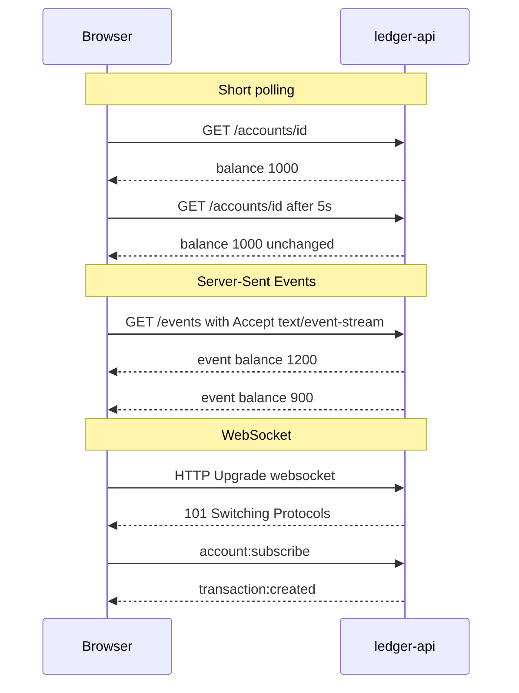
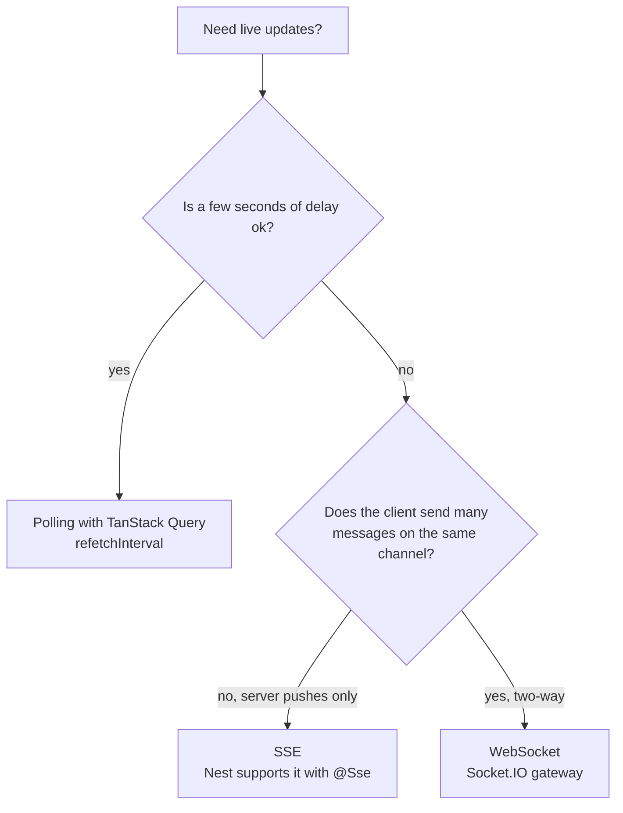
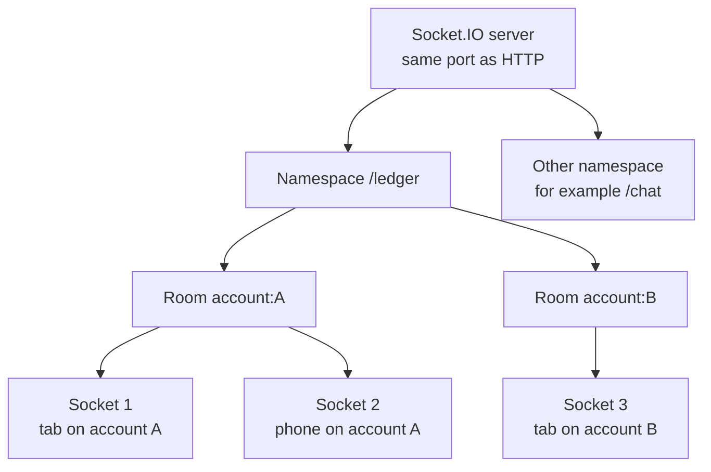
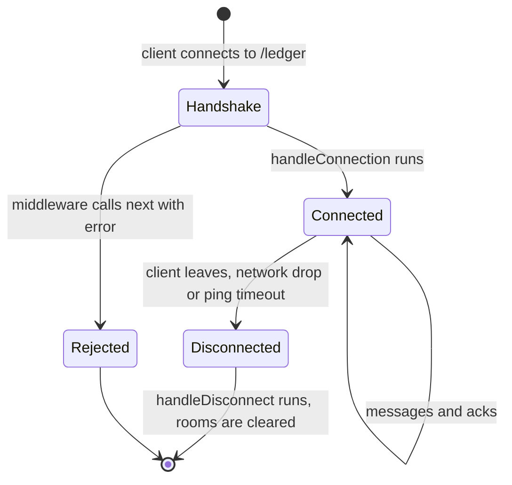
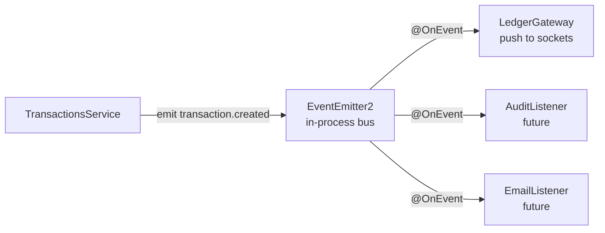
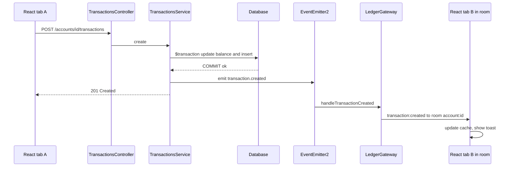
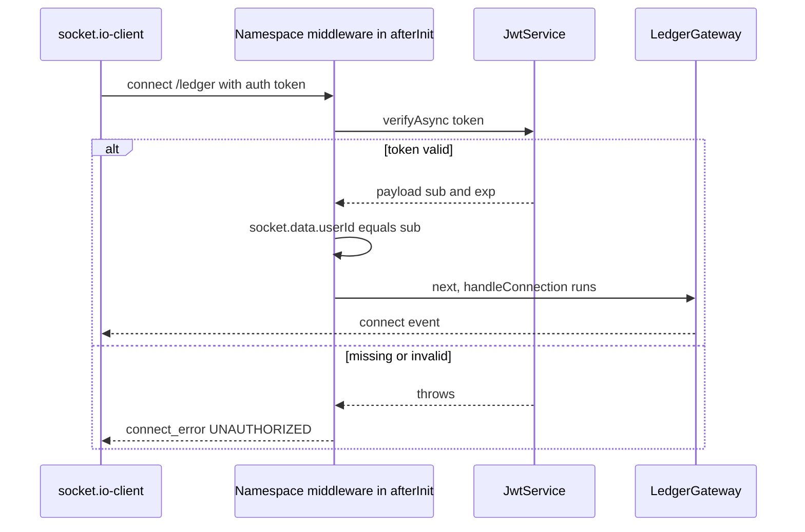
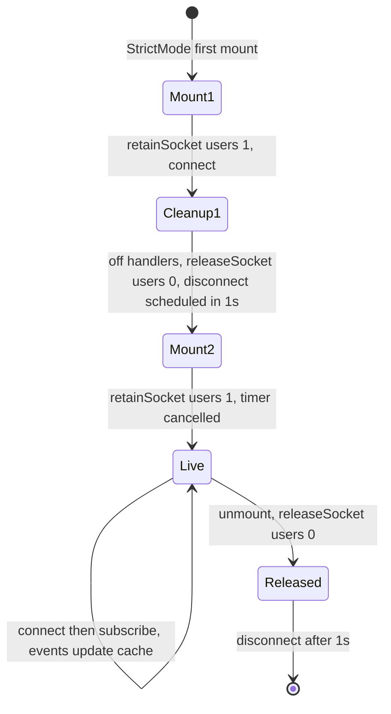
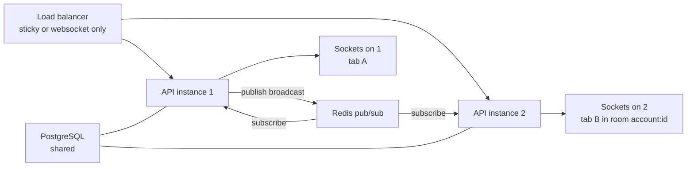

## 1. Why real-time, and how Socket.IO thinks

This guide continues the `ledger-api` project from "NestJS CRUD API Step by Step". You need its end state: accounts and transactions working, the e2e tests passing, and the **optional JWT step (Step 31) done**, because sockets reuse `AuthModule`, `JwtPayload` and the React `getAccessToken()` helper. Step numbers restart at 1 here.

The goal: when a transaction is created for an account (from any browser tab, a mobile app or a background job), every screen showing that account updates its balance within milliseconds, without a refresh.

### [Beginner] Step 1 — Polling vs Server-Sent Events vs WebSockets

HTTP is **request/response**: the client asks, the server answers, done. The server cannot speak first. There are three common ways around that:

| Technique | How it works | Direction | Good for | Costs |
|---|---|---|---|---|
| Short polling | `GET /accounts/:id` every N seconds | client asks | low-frequency dashboards, simplest | wasted requests, up to N seconds stale |
| Long polling | request hangs until there is news, then reconnect | server to client (simulated) | fallback when nothing else works | one hanging request per client, reconnect churn |
| Server-Sent Events (SSE) | one long HTTP response streaming `text/event-stream` | server to client only | live feeds, notifications, AI token streaming | one-way; client sends via normal HTTP |
| WebSocket | HTTP request upgraded to a persistent two-way TCP channel | both ways | chat, trading screens, collaboration, presence | stateful connections, harder to scale and load-balance |



How to choose:



> **Why:** For a ledger, SSE would honestly be enough: the server pushes, the client writes with normal `POST`s. We use Socket.IO because it is what most Nest teams use for real-time, it gives you rooms, acknowledgements and reconnection for free, and interviews ask about it. Mentioning that SSE is a valid simpler choice is a strong signal in an interview.

> **Gotcha:** Polling is not a failure. `useQuery({ refetchInterval: 10_000 })` is one line, works through every proxy and scales like normal HTTP. Pick WebSockets when you need low latency or two-way traffic, not by default.

### [Beginner] Step 2 — Socket.IO concepts: namespaces, rooms, events, acks, reconnection

**Socket.IO is not plain WebSocket.** It is a library with its own protocol on top of WebSocket (with HTTP long-polling as a fallback). A browser's native `new WebSocket(url)` cannot talk to a Socket.IO server; you need `socket.io-client`. In return you get:

- **Events**: named messages instead of raw strings. `socket.emit('account:subscribe', { accountId })` on one side, a handler for `'account:subscribe'` on the other. Payloads are JSON-serialized for you.
- **Acknowledgements (acks)**: request/response on top of events. The sender passes a callback (or uses `emitWithAck`), the receiver's return value comes back. Use them when the client needs to know "did that work?".
- **Namespaces**: separate channels over one connection, identified by a path such as `/ledger`. Each namespace has its own handlers and middleware. Use them to split features (`/ledger`, `/chat`, `/admin`).
- **Rooms**: server-side groups of sockets inside a namespace. A socket can join many rooms. `server.to('account:42').emit(...)` reaches only sockets in that room. The client cannot see or list rooms; only the server can join a socket to a room.
- **Reconnection**: the client automatically reconnects with exponential backoff after network drops. A reconnected socket is a **new** server-side socket with a new id, so it is **no longer in any room**. The client must subscribe again.
- **Heartbeats**: the server pings every `pingInterval` (25 seconds by default) and drops clients that do not answer within `pingTimeout` (20 seconds by default). This detects dead connections that TCP alone would not notice for minutes.



Our event names follow a `noun:verb` convention:

| Event | Direction | Payload | Ack |
|---|---|---|---|
| `account:subscribe` | client to server | `{ accountId }` | `{ ok: true, room }` or `{ ok: false, error }` |
| `account:unsubscribe` | client to server | `{ accountId }` | none |
| `transaction:created` | server to client | `{ accountId, balanceCents, transaction }` | none |
| `exception` | server to client | `{ status: 'error', message, errors? }` | none (sent by Nest on `WsException`) |

> **Interview tip:** "Rooms are server-side only" is a key security point. A client asks to join (`account:subscribe`), and the server decides. Never let a client name an arbitrary room and join it without an authorization check.

## 2. Add a gateway

### [Beginner] Step 3 — Install the packages

In `ledger-api/`:

```bash
npm i @nestjs/websockets @nestjs/platform-socket.io @nestjs/event-emitter
npm i -D socket.io-client
```

- `@nestjs/websockets`: the decorators (`@WebSocketGateway`, `@SubscribeMessage`...) and the gateway lifecycle.
- `@nestjs/platform-socket.io`: the Socket.IO adapter. It brings `socket.io` itself as a dependency.
- `@nestjs/event-emitter`: in-process events, used in Part 3.
- `socket.io-client` as a dev dependency: for a smoke-test script and the e2e test.

Keep all `@nestjs/*` packages on the same major version as `@nestjs/core` (check with `npm ls @nestjs/core`). Mixing 10 and 11 causes confusing "Nest can't resolve dependencies" errors.

New files you will create in this guide:

```text
ledger-api/
  scripts/
    ws-smoke.mjs
  src/
    ledger/
      ledger.events.ts          shared event and payload types (copied to web/)
      ledger-socket.types.ts    typed Namespace and Socket aliases
      ledger.gateway.ts
      ledger.gateway.spec.ts
      ledger.module.ts
      dto/
        subscribe-account.dto.ts
      ws-validation.pipe.ts
      ws-auth.guard.ts
      socket-rate-limit.ts
      ledger-io.adapter.ts
      setup-websockets.ts
    transactions/
      events/
        transaction-created.event.ts
  test/
    ledger.e2e-spec.ts
web/src/
  api/ledger-events.ts          copy of ledger.events.ts
  realtime/
    socket.ts
    recent.ts
    useLedgerSocket.ts
    ConnectionBadge.tsx
```

### [Beginner] Step 4 — Define the event contract first

Before writing a handler, write down the messages. One file holds every event name and payload type. It has **no imports**, so you can copy it into the React app unchanged (or move it into a shared package in a monorepo).

```ts
// src/ledger/ledger.events.ts
// Shared by ledger-api and web. Keep this file free of imports.

export type TransactionType = 'CREDIT' | 'DEBIT';

export interface TransactionPayload {
  id: string;
  accountId: string;
  amountCents: number;
  type: TransactionType;
  description: string | null;
  createdAt: string; // ISO 8601
}

export interface TransactionCreatedPayload {
  accountId: string;
  balanceCents: number;
  transaction: TransactionPayload;
}

export type SubscribeAck =
  | { ok: true; room: string }
  | { ok: false; error: 'NOT_FOUND' | 'FORBIDDEN' };

export interface WsErrorPayload {
  status: 'error';
  message: string;
  errors?: { field: string; constraints: Record<string, string> }[];
}

export interface ServerToClientEvents {
  'transaction:created': (payload: TransactionCreatedPayload) => void;
  exception: (error: WsErrorPayload) => void;
}

export interface ClientToServerEvents {
  'account:subscribe': (body: { accountId: string }, ack: (result: SubscribeAck) => void) => void;
  'account:unsubscribe': (body: { accountId: string }) => void;
}

export interface SocketData {
  userId: string;
  tokenExpiresAt: number; // epoch milliseconds
}

export const accountRoom = (accountId: string): string => `account:${accountId}`;
```

Socket.IO's TypeScript types are generic over these maps, so `server.emit('transaction:created', wrongShape)` becomes a compile error on the server, and `socket.on('transaction:created', (p) => ...)` gives `p` the right type in React.

```ts
// src/ledger/ledger-socket.types.ts
import type { Namespace, Socket } from 'socket.io';
import type { ClientToServerEvents, ServerToClientEvents, SocketData } from './ledger.events';

type ServerSideEvents = Record<string, never>;

export type LedgerNamespace = Namespace<
  ClientToServerEvents,
  ServerToClientEvents,
  ServerSideEvents,
  SocketData
>;

export type LedgerSocket = Socket<
  ClientToServerEvents,
  ServerToClientEvents,
  ServerSideEvents,
  SocketData
>;
```

On the server the generic order is `<events it listens to, events it emits>`, so `ClientToServerEvents` comes first. On the client it is the reverse.

> **Why:** `createdAt` is a `string` in the payload, not a `Date`. JSON has no date type. Making the wire format explicit avoids the classic bug where server code passes a `Date`, it arrives as a string, and `payload.createdAt.getTime()` crashes in React.

### [Intermediate] Step 5 — The LedgerGateway and its lifecycle hooks

A **gateway** is to sockets what a controller is to HTTP: a class whose methods handle incoming messages. It is also a normal provider, so it can inject services.

```ts
// src/ledger/ledger.gateway.ts
import { Logger } from '@nestjs/common';
import {
  ConnectedSocket,
  MessageBody,
  OnGatewayConnection,
  OnGatewayDisconnect,
  OnGatewayInit,
  SubscribeMessage,
  WebSocketGateway,
  WebSocketServer,
} from '@nestjs/websockets';
import { PrismaService } from '../prisma/prisma.service';
import { accountRoom, type SubscribeAck } from './ledger.events';
import type { LedgerNamespace, LedgerSocket } from './ledger-socket.types';

@WebSocketGateway({
  namespace: '/ledger',
  cors: { origin: process.env.CORS_ORIGIN ?? 'http://localhost:5173' },
})
export class LedgerGateway implements OnGatewayInit, OnGatewayConnection, OnGatewayDisconnect {
  private readonly logger = new Logger(LedgerGateway.name);

  @WebSocketServer()
  server!: LedgerNamespace;

  constructor(private readonly prisma: PrismaService) {}

  afterInit(): void {
    this.logger.log('Ledger gateway ready on namespace /ledger');
  }

  handleConnection(client: LedgerSocket): void {
    this.logger.log(`connected ${client.id}`);
  }

  handleDisconnect(client: LedgerSocket): void {
    this.logger.log(`disconnected ${client.id}`);
  }

  @SubscribeMessage('account:subscribe')
  async subscribe(
    @ConnectedSocket() client: LedgerSocket,
    @MessageBody() body: { accountId: string },
  ): Promise<SubscribeAck> {
    const account = await this.prisma.account.findUnique({
      where: { id: body.accountId },
      select: { id: true },
    });
    if (!account) return { ok: false, error: 'NOT_FOUND' };

    const room = accountRoom(body.accountId);
    await client.join(room);
    return { ok: true, room };
  }

  @SubscribeMessage('account:unsubscribe')
  async unsubscribe(
    @ConnectedSocket() client: LedgerSocket,
    @MessageBody() body: { accountId: string },
  ): Promise<void> {
    await client.leave(accountRoom(body.accountId));
  }
}
```

The pieces:

- `@WebSocketGateway({ namespace: '/ledger', cors })`: without a `port` option the gateway shares the HTTP server's port (3000). Socket.IO lives under the path `/socket.io/`; the namespace is chosen by the client URL `http://localhost:3000/ledger`.
- `@WebSocketServer() server`: Nest injects the Socket.IO object. With a `namespace` option it is that **Namespace**, not the root server. You use it to emit to rooms in Part 3.
- `afterInit`, `handleConnection`, `handleDisconnect`: lifecycle hooks from the three interfaces. `afterInit` runs once when the server is ready (Part 4 adds auth middleware there). The other two run for every socket.
- `@SubscribeMessage('account:subscribe')`: routes that event to the method. `@MessageBody()` is the payload, `@ConnectedSocket()` is the sender's socket.
- **Returning a value sends the ack.** If the client called `emitWithAck`, it receives `{ ok: true, room }`. Do not return an object with an `event` property: Nest treats `{ event, data }` as "emit this event back" instead of an ack.



> **Gotcha:** Decorator arguments are evaluated when the file is **imported**, before `ConfigModule` has loaded `.env`. So `process.env.CORS_ORIGIN` may still be `undefined` here, and the fallback is what you actually get in development. Step 18 moves the CORS setting into a custom adapter that reads `ConfigService` properly.

> **Gotcha:** The gateway name says "subscribe", but nothing checks **who** is subscribing yet. Anyone could join any account's room. Part 4 fixes that. Never ship Step 5 alone.

### [Beginner] Step 6 — Register the gateway and smoke-test it

```ts
// src/ledger/ledger.module.ts
import { Module } from '@nestjs/common';
import { LedgerGateway } from './ledger.gateway';

@Module({
  providers: [LedgerGateway],
})
export class LedgerModule {}
```

Gateways go in `providers`, not `controllers`. Add `LedgerModule` to `AppModule.imports`.

Now a tiny Node script that behaves like a client. Plain `.mjs` so it runs without compiling:

```js
// scripts/ws-smoke.mjs
import { io } from 'socket.io-client';

const [accountId, token] = process.argv.slice(2);
const socket = io('http://localhost:3000/ledger', { auth: { token }, transports: ['websocket'] });

socket.on('connect', async () => {
  console.log('connected', socket.id);
  try {
    const ack = await socket.timeout(3000).emitWithAck('account:subscribe', { accountId });
    console.log('subscribe ack', ack);
  } catch {
    console.log('subscribe ack timed out');
  }
});
socket.on('transaction:created', (payload) => console.log('transaction:created', payload));
socket.on('exception', (error) => console.log('exception', error));
socket.on('connect_error', (error) => console.log('connect_error', error.message));
socket.on('disconnect', (reason) => console.log('disconnect', reason));
```

**Check it works:** with `npm run start:dev` running, use an existing account id (`curl -s http://localhost:3000/accounts -H "Authorization: Bearer $TOKEN"` lists them):

```bash
node scripts/ws-smoke.mjs 6f1c2a4e-1b7d-4a53-9a0e-2a9e8f5d3c11
```

```text
connected b7XzK2v1QeAAAB
subscribe ack { ok: true, room: 'account:6f1c2a4e-1b7d-4a53-9a0e-2a9e8f5d3c11' }
```

The API log shows `[LedgerGateway] connected b7XzK2v1QeAAAB`. Try a random UUID: the ack is `{ ok: false, error: 'NOT_FOUND' }`. Press Ctrl+C and the log shows `disconnected ...`.

## 3. Emitting from CRUD

### [Beginner] Step 7 — Why the service should not call the gateway directly

The obvious approach is to inject `LedgerGateway` into `TransactionsService` and call `gateway.broadcast(...)` after saving. It works, but it couples the **domain** (money moved) to one **delivery mechanism** (Socket.IO). Next month you also want an email for large debits, an audit log entry and a webhook. Each one would be another dependency in `TransactionsService`, and its unit tests would need mocks for all of them.

Instead, the service announces a **domain event**, "a transaction was created", and does not care who listens. That is the observer pattern, and `@nestjs/event-emitter` gives it to you inside one process:



Register the module once in `AppModule`:

```ts
// src/app.module.ts
import { Module } from '@nestjs/common';
import { ConfigModule } from '@nestjs/config';
import { EventEmitterModule } from '@nestjs/event-emitter';
import { validateEnv } from './config/env.validation';
import { PrismaModule } from './prisma/prisma.module';
import { AuthModule } from './auth/auth.module';
import { AccountsModule } from './accounts/accounts.module';
import { TransactionsModule } from './transactions/transactions.module';
import { LedgerModule } from './ledger/ledger.module';

@Module({
  imports: [
    ConfigModule.forRoot({ isGlobal: true, validate: validateEnv }),
    EventEmitterModule.forRoot(),
    PrismaModule,
    AuthModule,
    AccountsModule,
    TransactionsModule,
    LedgerModule,
  ],
})
export class AppModule {}
```

> **Gotcha:** `@nestjs/event-emitter` is **in-memory and in-process**. If the process crashes right after the commit, the event is lost, and with several API instances only the instance that handled the `POST` sees it. That is fine for "refresh the screen" notifications, because the client can always refetch. For events that must never be lost (send money to a partner bank), use the **transactional outbox** pattern: write an `outbox` row in the same database transaction, and a worker publishes it to a durable queue.

### [Intermediate] Step 8 — Emit transaction.created after the commit

First the event class. A class (not an interface) gives listeners a real type to receive, and the constant avoids typos in the event name:

```ts
// src/transactions/events/transaction-created.event.ts
import type { Transaction } from '@prisma/client';

export const TRANSACTION_CREATED = 'transaction.created';

export class TransactionCreatedEvent {
  constructor(
    public readonly transaction: Transaction,
    public readonly balanceCents: number,
  ) {}
}
```

Now update `TransactionsService`. Three changes: inject `EventEmitter2`, read the new balance inside the database transaction, and emit **after** `$transaction` resolves. The overdraft logic is unchanged.

```ts
// src/transactions/transactions.service.ts
import { ConflictException, Injectable, NotFoundException } from '@nestjs/common';
import { EventEmitter2 } from '@nestjs/event-emitter';
import type { Prisma, Transaction } from '@prisma/client';
import { PrismaService } from '../prisma/prisma.service';
import type { Paginated } from '../common/dto/paginated';
import { PaginationQueryDto } from '../common/dto/pagination-query.dto';
import { CreateTransactionDto } from './dto/create-transaction.dto';
import { TRANSACTION_CREATED, TransactionCreatedEvent } from './events/transaction-created.event';

@Injectable()
export class TransactionsService {
  constructor(
    private readonly prisma: PrismaService,
    private readonly events: EventEmitter2,
  ) {}

  async create(
    accountId: string,
    dto: CreateTransactionDto,
    idempotencyKey?: string,
  ): Promise<Transaction> {
    if (idempotencyKey) {
      const existing = await this.prisma.transaction.findUnique({ where: { idempotencyKey } });
      if (existing) {
        if (existing.accountId !== accountId) {
          throw new ConflictException('Idempotency-Key was already used for another account');
        }
        return existing; // a replay: no new money moved, so no new event
      }
    }

    const delta = dto.type === 'CREDIT' ? dto.amountCents : -dto.amountCents;

    const result = await this.prisma.$transaction(async (db) => {
      const where: Prisma.AccountWhereInput =
        dto.type === 'DEBIT'
          ? { id: accountId, balanceCents: { gte: dto.amountCents } }
          : { id: accountId };

      const { count } = await db.account.updateMany({
        where,
        data: { balanceCents: { increment: delta } },
      });

      if (count === 0) {
        const exists = await db.account.findUnique({
          where: { id: accountId },
          select: { id: true },
        });
        if (!exists) throw new NotFoundException(`Account ${accountId} not found`);
        throw new ConflictException('Insufficient funds');
      }

      const transaction = await db.transaction.create({
        data: {
          accountId,
          amountCents: dto.amountCents,
          type: dto.type,
          description: dto.description ?? null,
          idempotencyKey: idempotencyKey ?? null,
        },
      });
      const { balanceCents } = await db.account.findUniqueOrThrow({
        where: { id: accountId },
        select: { balanceCents: true },
      });
      return { transaction, balanceCents };
    });

    // Only reached after COMMIT. Listeners never see rolled-back data.
    this.events.emit(TRANSACTION_CREATED, new TransactionCreatedEvent(result.transaction, result.balanceCents));
    return result.transaction;
  }

  // findAllForAccount unchanged from the CRUD guide
}
```

> **Why:** Emitting **inside** the `$transaction` callback would be a bug. If a later statement failed and rolled back, clients would already have been told about money that never moved. "Publish after commit" is the rule.

> **Finance tip:** The event carries the balance **as read inside the same transaction**. Clients can show it directly instead of adding `amountCents` to whatever balance they had, which drifts if they missed an event.

Update the unit test from the CRUD guide: provide a mock emitter and the extra read.

```ts
// src/transactions/transactions.service.spec.ts (changed parts)
import { EventEmitter2 } from '@nestjs/event-emitter';
import { TRANSACTION_CREATED } from './events/transaction-created.event';

  const db = {
    account: { updateMany: jest.fn(), findUnique: jest.fn(), findUniqueOrThrow: jest.fn() },
    transaction: { create: jest.fn() },
  };
  const events = { emit: jest.fn() };

  // in beforeEach
  db.account.findUniqueOrThrow.mockResolvedValue({ balanceCents: 500 });
  const moduleRef = await Test.createTestingModule({
    providers: [
      TransactionsService,
      { provide: PrismaService, useValue: prisma },
      { provide: EventEmitter2, useValue: events },
    ],
  }).compile();

  it('emits transaction.created after a successful commit', async () => {
    db.account.updateMany.mockResolvedValue({ count: 1 });
    db.transaction.create.mockResolvedValue({ id: 't1', accountId: 'a1' });

    await service.create('a1', { amountCents: 500, type: 'CREDIT' });

    expect(events.emit).toHaveBeenCalledWith(
      TRANSACTION_CREATED,
      expect.objectContaining({ balanceCents: 500 }),
    );
  });

  // and in the insufficient-funds and idempotent-replay tests:
  expect(events.emit).not.toHaveBeenCalled();
```

### [Intermediate] Step 9 — Listen with @OnEvent and broadcast to the room

Add one method to the gateway:

```ts
// src/ledger/ledger.gateway.ts (added)
import { OnEvent } from '@nestjs/event-emitter';
import { accountRoom, type SubscribeAck, type TransactionType } from './ledger.events';
import {
  TRANSACTION_CREATED,
  TransactionCreatedEvent,
} from '../transactions/events/transaction-created.event';

  // inside the LedgerGateway class
  @OnEvent(TRANSACTION_CREATED, { async: true })
  handleTransactionCreated(event: TransactionCreatedEvent): void {
    const { transaction, balanceCents } = event;
    this.server.to(accountRoom(transaction.accountId)).emit('transaction:created', {
      accountId: transaction.accountId,
      balanceCents,
      transaction: {
        id: transaction.id,
        accountId: transaction.accountId,
        amountCents: transaction.amountCents,
        type: transaction.type as TransactionType,
        description: transaction.description,
        createdAt: transaction.createdAt.toISOString(),
      },
    });
  }
```

- `@OnEvent` works on any provider, and a gateway is a provider. Nest discovers it at startup.
- `{ async: true }` asks the underlying `eventemitter2` to call the listener asynchronously, so a slow or failing listener does not delay or break the HTTP response that already committed.
- `this.server.to(room).emit(...)` sends to every socket in that room, on this instance. Part 6 makes it work across instances.
- The mapping is explicit: Prisma's `Transaction` (with a `Date` and an `idempotencyKey`) becomes the public `TransactionPayload`. Never broadcast database rows as-is; they may contain fields clients should not see.
- `transaction.type as TransactionType`: the column is a `String` in SQLite, but the DTO only ever lets `CREDIT` or `DEBIT` in, so the cast is safe here.



**Check it works:** start the smoke script in one terminal, then post a credit in another:

```bash
node scripts/ws-smoke.mjs $ACC
```

```bash
curl -s -X POST http://localhost:3000/accounts/$ACC/transactions \
  -H "Authorization: Bearer $TOKEN" -H 'Content-Type: application/json' \
  -d '{"amountCents":2500,"type":"CREDIT","description":"Refund"}'
```

The smoke script prints:

```text
transaction:created {
  accountId: '6f1c2a4e-...',
  balanceCents: 3500,
  transaction: { id: '...', amountCents: 2500, type: 'CREDIT', description: 'Refund', createdAt: '2026-10-05T12:30:00.000Z', ... }
}
```

Repeat the `curl` with an `Idempotency-Key` header twice: only the first prints an event.

## 4. Validation and auth on sockets

### [Intermediate] Step 10 — Validate message payloads and use WsException

Right now `@MessageBody() body: { accountId: string }` trusts the client. Send `{ accountId: 42 }` and Prisma throws, which the client sees as a vague error. Use a DTO, exactly as for HTTP:

```ts
// src/ledger/dto/subscribe-account.dto.ts
import { IsUUID } from 'class-validator';

export class SubscribeAccountDto {
  @IsUUID()
  accountId!: string;
}
```

There is a catch. The global `ValidationPipe` from `configureApp` **does not apply to gateways**: `useGlobalPipes` and `useGlobalFilters` only cover HTTP. And even if it ran, it throws `BadRequestException`, an HTTP exception. Nest's WebSocket exception filter only understands `WsException`; anything else reaches the client as `{ status: 'error', message: 'Internal server error' }`. So create a pipe for sockets that throws the right type:

```ts
// src/ledger/ws-validation.pipe.ts
import { ValidationPipe } from '@nestjs/common';
import { WsException } from '@nestjs/websockets';
import type { WsErrorPayload } from './ledger.events';

export const wsValidationPipe = new ValidationPipe({
  whitelist: true,
  forbidNonWhitelisted: true,
  transform: true,
  exceptionFactory: (errors) => {
    const payload: WsErrorPayload = {
      status: 'error',
      message: 'Validation failed',
      errors: errors.map((error) => ({
        field: error.property,
        constraints: error.constraints ?? {},
      })),
    };
    return new WsException(payload);
  },
});
```

When a handler throws `WsException(payload)`, Nest's built-in `BaseWsExceptionFilter` emits an `exception` event to **that client only**, with the object you passed (a string argument becomes `{ status: 'error', message }`). It does **not** call the ack callback, so a client using `emitWithAck` should always set a timeout.

You apply the pipe with `@UsePipes(wsValidationPipe)` on the gateway class and change the handler parameter to `@MessageBody() body: SubscribeAccountDto`. The full file is in Step 12.

Two ways to report a problem to a socket client, and when to use each:

| Situation | Use | Why |
|---|---|---|
| Malformed message, unauthorized, rate limited | `throw new WsException(...)` | a client bug or abuse; generic `exception` event is fine |
| Expected business outcome ("account not found", "forbidden") | return an ack `{ ok: false, error }` | the caller is waiting for an answer and should branch on it |

> **Gotcha:** Throwing `NotFoundException` (or any `HttpException`) inside a gateway does not produce a 404. Sockets have no status codes. Translate to `WsException` or an ack result at the gateway boundary, the same way the HTTP filter translated Prisma errors.

**Check it works:** run the smoke script with a bad id:

```bash
node scripts/ws-smoke.mjs not-a-uuid "$TOKEN"
```

```text
connected 9QpXc1...
exception {
  status: 'error',
  message: 'Validation failed',
  errors: [ { field: 'accountId', constraints: { isUuid: 'accountId must be a UUID' } } ]
}
subscribe ack timed out
```

(This works once Step 12 is in place. The token argument is required from Step 11 on.)

### [Advanced] Step 11 — Authenticate the handshake with JWT middleware

HTTP requests carry a token on **every** request, and the `JwtAuthGuard` checks each one. A socket authenticates **once**, during the handshake, and then stays open for hours. The right place to check is Socket.IO **middleware**, which runs before the connection is accepted:



The client sends the token in the `auth` option, not in the URL. Query strings end up in proxy logs:

```ts
io('http://localhost:3000/ledger', { auth: { token } });
```

Server side, register the middleware on the namespace in `afterInit`. `LedgerModule` must import `AuthModule` so `JwtService` can be injected:

```ts
// src/ledger/ledger.module.ts
import { Module } from '@nestjs/common';
import { AuthModule } from '../auth/auth.module';
import { LedgerGateway } from './ledger.gateway';

@Module({
  imports: [AuthModule],
  providers: [LedgerGateway],
})
export class LedgerModule {}
```

```ts
// src/ledger/ledger.gateway.ts (afterInit replaced)
  afterInit(server: LedgerNamespace): void {
    server.use((socket, next) => {
      const token: unknown = socket.handshake.auth.token;
      if (typeof token !== 'string' || token.length === 0) {
        next(new Error('UNAUTHORIZED'));
        return;
      }
      this.jwt
        .verifyAsync<JwtPayload & { exp: number }>(token)
        .then((payload) => {
          socket.data.userId = payload.sub;
          socket.data.tokenExpiresAt = payload.exp * 1000;
          next();
        })
        .catch(() => next(new Error('UNAUTHORIZED')));
    });
    this.logger.log('Ledger gateway ready on namespace /ledger');
  }
```

- `socket.handshake.auth` is the object the client passed as `auth`.
- `next(new Error('UNAUTHORIZED'))` rejects the connection. The client gets a `connect_error` whose `message` is `'UNAUTHORIZED'`. `handleConnection` never runs.
- `socket.data` is per-socket storage typed by `SocketData`. Handlers read `client.data.userId` later.

> **Why:** Nest guards on a gateway (`@UseGuards`) run per **message**, not at connection time. A guard alone would let unauthenticated sockets connect, hold resources and receive any broadcast to rooms they somehow joined. Middleware closes the door before the socket exists.

> **Gotcha:** The token was valid at handshake, but the connection can outlive it. That is why we store `tokenExpiresAt`. The guard in Step 12 rejects messages after expiry, and the client reconnects with a fresh token (Step 14 uses an `auth` **function** so each reconnect reads the current token).

### [Advanced] Step 12 — A per-message guard and the complete gateway

```ts
// src/ledger/ws-auth.guard.ts
import { CanActivate, ExecutionContext, Injectable } from '@nestjs/common';
import { WsException } from '@nestjs/websockets';
import type { WsErrorPayload } from './ledger.events';
import type { LedgerSocket } from './ledger-socket.types';

@Injectable()
export class WsAuthGuard implements CanActivate {
  canActivate(context: ExecutionContext): boolean {
    const client = context.switchToWs().getClient<LedgerSocket>();
    if (!client.data.userId || Date.now() >= client.data.tokenExpiresAt) {
      const error: WsErrorPayload = { status: 'error', message: 'UNAUTHORIZED' };
      client.emit('exception', error);
      client.disconnect(true);
      return false;
    }
    return true;
  }
}
```

`context.switchToWs()` is the socket counterpart of `switchToHttp()`. `getClient()` returns the sender's socket and `getData()` the message body. On expiry the guard tells the client why and disconnects it; the client's reconnection picks up a new token.

The finished gateway:

```ts
// src/ledger/ledger.gateway.ts
import { Logger, UseGuards, UsePipes } from '@nestjs/common';
import { OnEvent } from '@nestjs/event-emitter';
import { JwtService } from '@nestjs/jwt';
import {
  ConnectedSocket,
  MessageBody,
  OnGatewayConnection,
  OnGatewayDisconnect,
  OnGatewayInit,
  SubscribeMessage,
  WebSocketGateway,
  WebSocketServer,
} from '@nestjs/websockets';
import type { JwtPayload } from '../auth/jwt-payload';
import { PrismaService } from '../prisma/prisma.service';
import {
  TRANSACTION_CREATED,
  TransactionCreatedEvent,
} from '../transactions/events/transaction-created.event';
import { SubscribeAccountDto } from './dto/subscribe-account.dto';
import { accountRoom, type SubscribeAck, type TransactionType } from './ledger.events';
import type { LedgerNamespace, LedgerSocket } from './ledger-socket.types';
import { WsAuthGuard } from './ws-auth.guard';
import { wsValidationPipe } from './ws-validation.pipe';

@WebSocketGateway({
  namespace: '/ledger',
  cors: { origin: process.env.CORS_ORIGIN ?? 'http://localhost:5173' },
})
@UseGuards(WsAuthGuard)
@UsePipes(wsValidationPipe)
export class LedgerGateway implements OnGatewayInit, OnGatewayConnection, OnGatewayDisconnect {
  private readonly logger = new Logger(LedgerGateway.name);

  @WebSocketServer()
  server!: LedgerNamespace;

  constructor(
    private readonly prisma: PrismaService,
    private readonly jwt: JwtService,
  ) {}

  afterInit(server: LedgerNamespace): void {
    server.use((socket, next) => {
      const token: unknown = socket.handshake.auth.token;
      if (typeof token !== 'string' || token.length === 0) {
        next(new Error('UNAUTHORIZED'));
        return;
      }
      this.jwt
        .verifyAsync<JwtPayload & { exp: number }>(token)
        .then((payload) => {
          socket.data.userId = payload.sub;
          socket.data.tokenExpiresAt = payload.exp * 1000;
          next();
        })
        .catch(() => next(new Error('UNAUTHORIZED')));
    });
    this.logger.log('Ledger gateway ready on namespace /ledger');
  }

  handleConnection(client: LedgerSocket): void {
    this.logger.log(`connected ${client.id} user=${client.data.userId}`);
  }

  handleDisconnect(client: LedgerSocket): void {
    this.logger.log(`disconnected ${client.id}`);
  }

  @SubscribeMessage('account:subscribe')
  async subscribe(
    @ConnectedSocket() client: LedgerSocket,
    @MessageBody() body: SubscribeAccountDto,
  ): Promise<SubscribeAck> {
    // Real app: where: { id: body.accountId, ownerId: client.data.userId }
    const account = await this.prisma.account.findUnique({
      where: { id: body.accountId },
      select: { id: true },
    });
    if (!account) return { ok: false, error: 'NOT_FOUND' };

    const room = accountRoom(body.accountId);
    await client.join(room);
    return { ok: true, room };
  }

  @SubscribeMessage('account:unsubscribe')
  async unsubscribe(
    @ConnectedSocket() client: LedgerSocket,
    @MessageBody() body: SubscribeAccountDto,
  ): Promise<void> {
    await client.leave(accountRoom(body.accountId));
  }

  @OnEvent(TRANSACTION_CREATED, { async: true })
  handleTransactionCreated(event: TransactionCreatedEvent): void {
    const { transaction, balanceCents } = event;
    this.server.to(accountRoom(transaction.accountId)).emit('transaction:created', {
      accountId: transaction.accountId,
      balanceCents,
      transaction: {
        id: transaction.id,
        accountId: transaction.accountId,
        amountCents: transaction.amountCents,
        type: transaction.type as TransactionType,
        description: transaction.description,
        createdAt: transaction.createdAt.toISOString(),
      },
    });
  }
}
```

> **Finance tip:** The `ownerId` comment is not optional in a real ledger. Without it, any logged-in user who learns an account UUID can watch its transactions live. Return `NOT_FOUND` (not `FORBIDDEN`) for accounts the user does not own, so attackers cannot probe which ids exist.

**Check it works:**

```bash
node scripts/ws-smoke.mjs $ACC
node scripts/ws-smoke.mjs $ACC "$TOKEN"
```

```text
connect_error UNAUTHORIZED
---
connected Zt3m...
subscribe ack { ok: true, room: 'account:6f1c2a4e-...' }
```

## 5. React client

### [Beginner] Step 13 — Install the client and share the types

In `web/`:

```bash
npm i socket.io-client sonner
```

`sonner` is a small toast library. Copy the contract file unchanged:

```bash
cp ../ledger-api/src/ledger/ledger.events.ts src/api/ledger-events.ts
```

> **Gotcha:** A copied file can drift. Add a CI step that diffs the two files, or move the file into a shared workspace package (`packages/ledger-contract`) once you have a monorepo. The important part is that both sides compile against the **same** event map.

### [Intermediate] Step 14 — A socket.io-client singleton

One browser tab should open **one** connection, no matter how many components care about live data. Create the socket once, at module level, and never in a component body:

```ts
// web/src/realtime/socket.ts
import { io, type Socket } from 'socket.io-client';
import { getAccessToken } from '../api/client';
import type { ClientToServerEvents, ServerToClientEvents } from '../api/ledger-events';

export type LedgerSocket = Socket<ServerToClientEvents, ClientToServerEvents>;

const API_URL = import.meta.env.VITE_API_URL ?? 'http://localhost:3000';

let socket: LedgerSocket | null = null;
let users = 0;
let disconnectTimer: ReturnType<typeof setTimeout> | undefined;

function getSocket(): LedgerSocket {
  if (!socket) {
    socket = io(`${API_URL}/ledger`, {
      autoConnect: false,
      transports: ['websocket'],
      // A function, so every reconnect reads the current token
      auth: (cb) => cb({ token: getAccessToken() }),
    });
  }
  return socket;
}

/** Call on mount. Connects when the first user appears. */
export function retainSocket(): LedgerSocket {
  const s = getSocket();
  clearTimeout(disconnectTimer);
  users += 1;
  if (!s.connected && !s.active) s.connect();
  return s;
}

/** Call on unmount. Disconnects shortly after the last user leaves. */
export function releaseSocket(): void {
  users = Math.max(0, users - 1);
  if (users === 0) {
    disconnectTimer = setTimeout(() => socket?.disconnect(), 1000);
  }
}
```

- `autoConnect: false`: creating the object does not open a connection. `retainSocket` does, when the first component needs it.
- `transports: ['websocket']`: skip the HTTP long-polling phase. This avoids the need for sticky sessions (Step 19) at the cost of no fallback for networks that block WebSockets, which is rare today.
- `auth` as a **function**: after a token refresh, the next reconnect automatically sends the new token.
- `s.active` is `true` while the socket is connected or trying to reconnect, so you do not call `connect()` twice.
- The 1-second delayed disconnect is for React StrictMode, explained next.

### [Intermediate] Step 15 — The useLedgerSocket hook (subscribe, cleanup, StrictMode)

The hook connects, subscribes to one account, listens for events and cleans up on unmount. It returns the connection status for the UI.

```ts
// web/src/realtime/useLedgerSocket.ts
import { useEffect, useState } from 'react';
import { useQueryClient } from '@tanstack/react-query';
import { toast } from 'sonner';
import { ledgerKeys } from '../api/ledger';
import type { TransactionCreatedPayload } from '../api/ledger-events';
import type { Account } from '../api/types';
import { formatMoney } from '../money';
import { wasCreatedHere } from './recent';
import { releaseSocket, retainSocket } from './socket';

export type ConnectionStatus = 'connecting' | 'connected' | 'disconnected' | 'unauthorized';

export function useLedgerSocket(accountId: string): ConnectionStatus {
  const queryClient = useQueryClient();
  const [status, setStatus] = useState<ConnectionStatus>('connecting');

  useEffect(() => {
    const socket = retainSocket();

    const subscribe = async () => {
      try {
        const ack = await socket.timeout(5000).emitWithAck('account:subscribe', { accountId });
        if (!ack.ok) console.warn(`subscribe failed: ${ack.error}`);
      } catch {
        console.warn('subscribe timed out');
      }
    };

    // Runs on the first connect AND on every reconnect: rooms do not survive reconnection
    const onConnect = () => {
      setStatus('connected');
      void subscribe();
    };
    const onDisconnect = () => setStatus('disconnected');
    const onConnectError = (error: Error) => {
      setStatus(error.message === 'UNAUTHORIZED' ? 'unauthorized' : 'disconnected');
    };

    const onTransaction = (payload: TransactionCreatedPayload) => {
      if (payload.accountId !== accountId) return;

      // 1. The balance in the event is authoritative: write it straight into the cache
      queryClient.setQueryData<Account>(ledgerKeys.detail(accountId), (old) =>
        old ? { ...old, balanceCents: payload.balanceCents } : old,
      );
      // 2. Lists are harder to patch correctly (sorting, paging): just refetch them
      void queryClient.invalidateQueries({ queryKey: ledgerKeys.transactions(accountId) });
      void queryClient.invalidateQueries({ queryKey: ['accounts', 'list'] });

      // 3. Tell the user, unless this tab made the transaction itself
      if (!wasCreatedHere(payload.transaction.id)) {
        const currency = queryClient.getQueryData<Account>(ledgerKeys.detail(accountId))?.currency ?? 'USD';
        const sign = payload.transaction.type === 'CREDIT' ? '+' : '-';
        toast(`${sign}${formatMoney(payload.transaction.amountCents, currency)}`, {
          description: payload.transaction.description ?? 'New transaction',
        });
      }
    };

    socket.on('connect', onConnect);
    socket.on('disconnect', onDisconnect);
    socket.on('connect_error', onConnectError);
    socket.on('transaction:created', onTransaction);
    if (socket.connected) onConnect();

    return () => {
      socket.off('connect', onConnect);
      socket.off('disconnect', onDisconnect);
      socket.off('connect_error', onConnectError);
      socket.off('transaction:created', onTransaction);
      if (socket.connected) socket.emit('account:unsubscribe', { accountId });
      releaseSocket();
    };
  }, [accountId, queryClient]);

  return status;
}
```

**Why each cleanup line matters:**

- `socket.off(event, handler)` removes **this** handler only. Calling `socket.off('transaction:created')` without a handler would remove every component's listener.
- Without cleanup, each re-render with a new `accountId` would add another listener, and you would see one toast per stale listener.
- `account:unsubscribe` leaves the room so the server stops sending events this screen no longer shows.

**React StrictMode.** In development, React 18 and 19 mount every component, immediately run the effect cleanup, then mount again. This is deliberate: it exposes effects that do not clean up. Here is what happens with our code:



Without the reference count and the short delay, StrictMode would open, close and reopen the connection on every page load, and a naive version (creating `io()` inside `useEffect` without cleanup) would leave **two** live connections and show every toast twice.

> **Gotcha:** The reference count is per socket, not per account. If two mounted components watch the **same** account and one unmounts, its `account:unsubscribe` removes the room for both. If that can happen in your app, count subscribers per `accountId` inside the module and only emit `unsubscribe` when the count for that account reaches zero.

The "created here" helper avoids a toast for your own action (the mutation already showed feedback):

```ts
// web/src/realtime/recent.ts
const recent = new Set<string>();

export function markCreatedHere(transactionId: string): void {
  recent.add(transactionId);
  setTimeout(() => recent.delete(transactionId), 60_000);
}

export function wasCreatedHere(transactionId: string): boolean {
  return recent.has(transactionId);
}
```

Call it from the mutation in `web/src/api/ledger.ts`:

```ts
// web/src/api/ledger.ts (useCreateTransaction, onSuccess changed)
import { markCreatedHere } from '../realtime/recent';

    onSuccess: (transaction) => {
      markCreatedHere(transaction.id);
      return queryClient.invalidateQueries({ queryKey: ledgerKeys.all });
    },
```

> **Gotcha:** The event can arrive **before** the `POST` response, because the server emits right after commit and the two travel on different connections. Then `wasCreatedHere` is still false and you get one extra toast. Acceptable here; if not, have the client send its own `clientRequestId` in the body and echo it in the event.

### [Intermediate] Step 16 — setQueryData or invalidateQueries?

| Approach | What it does | Use when |
|---|---|---|
| `setQueryData(key, updater)` | writes new data into the cache, no request | the event contains the complete new value (our `balanceCents`) |
| `invalidateQueries({ queryKey })` | marks data stale, active queries refetch | the change affects sorting, paging or derived data you cannot rebuild safely |

The hook uses both: the balance is patched instantly from the event, the transaction list is refetched. Patching a paginated list by hand (insert at the top, drop the last item, fix `total`) is possible but easy to get wrong.

> **Finance tip:** Events can arrive out of order or be missed while offline. Never compute a balance on the client as "old balance + event amount". Use the server's `balanceCents` and refetch on reconnect. A production ledger also sends a monotonically increasing `version` per account so the client can ignore an older event that arrives after a newer one.

> **Interview tip:** A good answer to "how do WebSockets and React Query work together?" is: the socket is a **signal**, the HTTP API stays the **source of truth**. Events either patch the cache with authoritative values or invalidate it so the normal query refetches. You keep caching, retries and loading states from React Query instead of building a second state system for socket data.

### [Beginner] Step 17 — A connection status indicator and wiring it up

```tsx
// web/src/realtime/ConnectionBadge.tsx
import type { ConnectionStatus } from './useLedgerSocket';

const LABELS: Record<ConnectionStatus, string> = {
  connecting: 'Connecting...',
  connected: 'Live',
  disconnected: 'Offline, retrying',
  unauthorized: 'Signed out',
};

export function ConnectionBadge({ status }: { status: ConnectionStatus }) {
  return (
    <span role="status" aria-live="polite" data-status={status}>
      {LABELS[status]}
    </span>
  );
}
```

Use the hook in the account detail screen and render the badge:

```tsx
// web/src/AccountDetail.tsx (changed lines)
import { useLedgerSocket } from './realtime/useLedgerSocket';
import { ConnectionBadge } from './realtime/ConnectionBadge';

export function AccountDetail({ accountId }: { accountId: string }) {
  const account = useAccount(accountId);
  const transactions = useTransactions(accountId);
  const status = useLedgerSocket(accountId);
  // ...loading and error branches unchanged
  return (
    <section>
      <ConnectionBadge status={status} />
      {/* heading, form and list unchanged */}
    </section>
  );
}
```

And mount the toaster once in `App.tsx`:

```tsx
// web/src/App.tsx (changed lines)
import { Toaster } from 'sonner';
// ...inside the returned <main>
      <Toaster position="top-right" />
```

When the status is `disconnected`, the data on screen may be stale. A good pattern is to refetch on reconnect: TanStack Query does this for window focus by default, and the `onConnect` handler already resubscribes. You can also call `queryClient.invalidateQueries({ queryKey: ledgerKeys.all })` inside `onConnect` when it is a **re**connect.

> **Gotcha:** A `connect_error` caused by **server middleware** (our `UNAUTHORIZED`) does not trigger automatic reconnection; `socket.active` becomes `false`. After you obtain a new token, call `socket.connect()` yourself. Network errors, by contrast, are retried automatically with backoff.

**Check it works:** open `http://localhost:5173` in two browser windows on the same account. Both show "Live". Add a credit in window A: window B updates the balance and shows a toast within a few milliseconds; window A updates without a toast. Stop the API: both badges switch to "Offline, retrying". Start it again: both return to "Live" and keep receiving events, which proves the resubscribe on reconnect works. In DevTools, Network, filter "WS": there is exactly **one** socket per tab, even in StrictMode.

## 6. Production concerns

### [Advanced] Step 18 — Scale horizontally with @socket.io/redis-adapter

With one API process, `server.to(room).emit()` reaches everyone. Run two instances behind a load balancer and it breaks: the `POST` lands on instance 1, the event fires on instance 1, but the user's other tab is connected to instance 2. Instance 1 does not know instance 2's sockets exist.

The **Redis adapter** fixes this. Every instance publishes its broadcasts to Redis pub/sub and receives the others', then delivers to its own local sockets:



```bash
npm i @socket.io/redis-adapter redis
```

Nest lets you replace how the Socket.IO server is created with a custom **adapter class**. This is also the right place for CORS and heartbeat options, because it can read `ConfigService` at runtime (fixing the decorator gotcha from Step 5):

```ts
// src/ledger/ledger-io.adapter.ts
import { INestApplication } from '@nestjs/common';
import { IoAdapter } from '@nestjs/platform-socket.io';
import { createAdapter } from '@socket.io/redis-adapter';
import { createClient } from 'redis';
import type { Server, ServerOptions } from 'socket.io';

export class LedgerIoAdapter extends IoAdapter {
  private adapterConstructor: ReturnType<typeof createAdapter> | undefined;

  constructor(
    app: INestApplication,
    private readonly corsOrigin: string,
  ) {
    super(app);
  }

  async connectToRedis(url: string): Promise<void> {
    const pubClient = createClient({ url });
    const subClient = pubClient.duplicate();
    await Promise.all([pubClient.connect(), subClient.connect()]);
    this.adapterConstructor = createAdapter(pubClient, subClient);
  }

  createIOServer(port: number, options?: Partial<ServerOptions>): Server {
    const server: Server = super.createIOServer(port, {
      ...options,
      cors: { origin: this.corsOrigin },
      pingInterval: 25_000,
      pingTimeout: 20_000,
      maxHttpBufferSize: 100_000, // bytes per incoming message
    } as ServerOptions);
    if (this.adapterConstructor) server.adapter(this.adapterConstructor);
    return server;
  }
}
```

```ts
// src/ledger/setup-websockets.ts
import { INestApplication } from '@nestjs/common';
import { ConfigService } from '@nestjs/config';
import { LedgerIoAdapter } from './ledger-io.adapter';

export async function configureWebSockets(app: INestApplication): Promise<void> {
  const config = app.get(ConfigService);
  const adapter = new LedgerIoAdapter(app, config.getOrThrow<string>('CORS_ORIGIN'));
  const redisUrl = config.get<string>('REDIS_URL');
  if (redisUrl) await adapter.connectToRedis(redisUrl);
  app.useWebSocketAdapter(adapter);
}
```

```ts
// src/main.ts (changed lines)
import { configureWebSockets } from './ledger/setup-websockets';
// ...
  configureApp(app);
  await configureWebSockets(app);
  setupSwagger(app);
```

Add the optional variable to `src/config/env.validation.ts`: `REDIS_URL?: string` in the `Env` interface and `REDIS_URL: typeof config.REDIS_URL === 'string' ? config.REDIS_URL : undefined` in the returned object. Without `REDIS_URL` the app runs single-instance exactly as before. Add Redis to `docker-compose.yml` and set `REDIS_URL=redis://localhost:6379` when you want to try two instances:

```yaml
# docker-compose.yml (add under services)
  redis:
    image: redis:7
    ports:
      - "6379:6379"
```

**Check it works:** start Redis, then run two instances on different ports (`PORT=3000 npm run start` and `PORT=3001 npm run start` after `npm run build`). Point the smoke script at port 3001 (edit its URL), and `POST` a transaction to port 3000. The script on 3001 still prints `transaction:created`.

> **Gotcha:** The Redis adapter forwards **broadcasts**. It does not share sockets, so `server.fetchSockets()` and room membership checks across instances become network calls. The in-process `EventEmitter2` still only fires on the instance that handled the `POST`; that is fine, because that instance's broadcast is what goes through Redis.

### [Advanced] Step 19 — Sticky sessions, proxies and heartbeats

Socket.IO's default connection starts with **HTTP long-polling** and then upgrades to WebSocket. Polling means several separate HTTP requests that must all reach the **same** instance, because the session lives in that process's memory. Behind a round-robin load balancer they do not, and you see `400 Session ID unknown` errors.

Two fixes:

1. **WebSocket only** (what the React client does): `transports: ['websocket']`. One TCP connection, so nothing to keep sticky.
2. **Sticky sessions** at the load balancer, by cookie or client IP. With nginx:

```nginx
# nginx.conf (excerpt)
upstream ledger_api {
  ip_hash;                  # same client IP -> same instance
  server api1:3000;
  server api2:3000;
}

server {
  location /socket.io/ {
    proxy_pass http://ledger_api;
    proxy_http_version 1.1;
    proxy_set_header Upgrade $http_upgrade;
    proxy_set_header Connection "upgrade";
    proxy_set_header Host $host;
    proxy_read_timeout 75s;
  }
}
```

The `Upgrade` and `Connection` headers are what turn the HTTP request into a WebSocket. Forgetting them is the most common "works locally, fails behind nginx" bug. On AWS, an Application Load Balancer supports WebSockets natively and offers cookie stickiness on the target group.

**Heartbeats.** The server pings every `pingInterval` (25 s) and closes the socket if no pong arrives within `pingTimeout` (20 s). The client detects a dead server the same way and starts reconnecting. Two rules:

- Proxy and load-balancer **idle timeouts must be longer than `pingInterval`**, otherwise the proxy cuts quiet connections (nginx `proxy_read_timeout` defaults to 60 s; ALB idle timeout defaults to 60 s).
- Do not lower the intervals aggressively. A ping every 2 seconds for 50,000 clients is 25,000 packets per second of pure overhead and drains phone batteries.

> **Gotcha:** Deploys disconnect every socket on the instance being replaced. Clients reconnect with backoff, so add jitter to the reconnection settings (`randomizationFactor`, default 0.5) and make sure your app can absorb a reconnect storm. This is another reason to resubscribe and refetch on `connect`.

### [Advanced] Step 20 — Backpressure and rate limiting events

**Backpressure** is what happens when you produce messages faster than a consumer can take them. Socket.IO keeps unsent packets for a slow client in server memory; thousands of slow phones on 3G can grow that buffer a lot. Defensive habits:

- Keep payloads small: ids, amounts and the new balance, not full account histories. Let clients fetch details over HTTP.
- For updates that are fine to drop (a live price tick, a typing indicator), use `this.server.volatile.to(room).emit(...)`. A volatile packet is discarded if the client is not ready to receive it. Do **not** use it for transactions.
- Coalesce bursts: if one account gets 100 transactions in a second, send one "account changed" event after a short debounce instead of 100.
- `maxHttpBufferSize` (set to 100 KB in the adapter) rejects oversized incoming messages. The default is 1 MB.

**Rate limiting.** HTTP rate limiting (for example `@nestjs/throttler`) does not see socket messages, and one socket can send thousands of events per second over a single connection. A per-socket token bucket in Socket.IO middleware is simple and effective:

```ts
// src/ledger/socket-rate-limit.ts
import type { LedgerSocket } from './ledger-socket.types';

/** Allow `perSecond` events per second per socket, with bursts up to the same number. */
export function attachRateLimit(socket: LedgerSocket, perSecond = 10): void {
  let tokens = perSecond;
  let last = Date.now();

  socket.use((_packet, next) => {
    const now = Date.now();
    tokens = Math.min(perSecond, tokens + ((now - last) / 1000) * perSecond);
    last = now;
    if (tokens < 1) {
      next(new Error('RATE_LIMITED'));
      return;
    }
    tokens -= 1;
    next();
  });

  socket.on('error', (error) => {
    if (error.message === 'RATE_LIMITED') {
      socket.emit('exception', { status: 'error', message: 'RATE_LIMITED' });
    }
  });
}
```

Call it for every new socket:

```ts
// src/ledger/ledger.gateway.ts (handleConnection changed)
import { attachRateLimit } from './socket-rate-limit';

  handleConnection(client: LedgerSocket): void {
    attachRateLimit(client, 10);
    this.logger.log(`connected ${client.id} user=${client.data.userId}`);
  }
```

`socket.use` is **per-socket** middleware that runs for each incoming packet (unlike `server.use`, which runs once per connection). Calling `next(error)` drops the packet and raises an `error` event on the server-side socket. For repeat offenders, `socket.disconnect(true)` and log the user id. With several instances, a shared limit needs Redis (for example a counter with expiry per user).

### [Intermediate] Step 21 — Unit test the gateway

A gateway is a class. You can construct it with fake dependencies and call its methods directly; no network involved.

```ts
// src/ledger/ledger.gateway.spec.ts
import type { JwtService } from '@nestjs/jwt';
import type { PrismaService } from '../prisma/prisma.service';
import { TransactionCreatedEvent } from '../transactions/events/transaction-created.event';
import { LedgerGateway } from './ledger.gateway';
import type { LedgerNamespace, LedgerSocket } from './ledger-socket.types';

const ACC = '6f1c2a4e-1b7d-4a53-9a0e-2a9e8f5d3c11';

describe('LedgerGateway', () => {
  const prisma = { account: { findUnique: jest.fn() } };
  const jwt = { verifyAsync: jest.fn() };
  let gateway: LedgerGateway;

  beforeEach(() => {
    jest.clearAllMocks();
    gateway = new LedgerGateway(prisma as unknown as PrismaService, jwt as unknown as JwtService);
  });

  it('joins the account room and acks ok', async () => {
    prisma.account.findUnique.mockResolvedValue({ id: ACC });
    const client = { join: jest.fn(), data: { userId: 'u1' } };

    const ack = await gateway.subscribe(client as unknown as LedgerSocket, { accountId: ACC });

    expect(client.join).toHaveBeenCalledWith(`account:${ACC}`);
    expect(ack).toEqual({ ok: true, room: `account:${ACC}` });
  });

  it('acks NOT_FOUND and joins nothing for an unknown account', async () => {
    prisma.account.findUnique.mockResolvedValue(null);
    const client = { join: jest.fn(), data: { userId: 'u1' } };

    const ack = await gateway.subscribe(client as unknown as LedgerSocket, { accountId: ACC });

    expect(ack).toEqual({ ok: false, error: 'NOT_FOUND' });
    expect(client.join).not.toHaveBeenCalled();
  });

  it('broadcasts transaction.created to the account room as a public payload', () => {
    const emit = jest.fn();
    const to = jest.fn(() => ({ emit }));
    gateway.server = { to } as unknown as LedgerNamespace;
    const createdAt = new Date('2026-10-05T12:00:00.000Z');

    gateway.handleTransactionCreated(
      new TransactionCreatedEvent(
        {
          id: 't1',
          accountId: ACC,
          amountCents: 500,
          type: 'CREDIT',
          description: null,
          idempotencyKey: 'secret-key',
          createdAt,
        },
        1500,
      ),
    );

    expect(to).toHaveBeenCalledWith(`account:${ACC}`);
    const [eventName, payload] = emit.mock.calls[0];
    expect(eventName).toBe('transaction:created');
    expect(payload).toEqual({
      accountId: ACC,
      balanceCents: 1500,
      transaction: {
        id: 't1',
        accountId: ACC,
        amountCents: 500,
        type: 'CREDIT',
        description: null,
        createdAt: '2026-10-05T12:00:00.000Z',
      },
    });
  });
});
```

The last test also proves that `idempotencyKey` is **not** leaked to clients. Unit tests call `subscribe` directly, so the pipe and guard do not run here; the e2e test covers them.

### [Advanced] Step 22 — E2E test with a real socket.io-client

The e2e test boots the app on a random port, connects real clients and checks the whole path: handshake auth, validation, room join, HTTP `POST`, event, broadcast.

```ts
// test/ledger.e2e-spec.ts
import type { AddressInfo } from 'node:net';
import { INestApplication } from '@nestjs/common';
import { JwtService } from '@nestjs/jwt';
import { Test } from '@nestjs/testing';
import { io, type Socket } from 'socket.io-client';
import request from 'supertest';
import { AppModule } from '../src/app.module';
import type {
  ClientToServerEvents,
  ServerToClientEvents,
  TransactionCreatedPayload,
  WsErrorPayload,
} from '../src/ledger/ledger.events';
import { configureWebSockets } from '../src/ledger/setup-websockets';
import { configureApp } from '../src/setup-app';

type ClientSocket = Socket<ServerToClientEvents, ClientToServerEvents>;

describe('Ledger gateway (e2e)', () => {
  let app: INestApplication;
  let baseUrl: string;
  let token: string;
  const sockets: ClientSocket[] = [];

  beforeAll(async () => {
    const moduleRef = await Test.createTestingModule({ imports: [AppModule] }).compile();
    app = moduleRef.createNestApplication();
    configureApp(app);
    await configureWebSockets(app);
    await app.listen(0); // random free port
    const { port } = app.getHttpServer().address() as AddressInfo;
    baseUrl = `http://localhost:${port}`;
    token = await app.get(JwtService).signAsync({ sub: 'e2e-user' });
  });

  afterEach(() => {
    sockets.splice(0).forEach((socket) => socket.close());
  });

  afterAll(async () => {
    await app.close();
  });

  function connect(auth: Record<string, unknown>): Promise<ClientSocket> {
    return new Promise((resolve, reject) => {
      const socket: ClientSocket = io(`${baseUrl}/ledger`, {
        auth,
        transports: ['websocket'],
        reconnection: false,
      });
      sockets.push(socket);
      socket.once('connect', () => resolve(socket));
      socket.once('connect_error', reject);
    });
  }

  async function createAccount(): Promise<string> {
    const res = await request(app.getHttpServer())
      .post('/accounts')
      .set('Authorization', `Bearer ${token}`)
      .send({ name: 'Socket wallet', currency: 'USD' })
      .expect(201);
    return res.body.id as string;
  }

  it('rejects a connection without a token', async () => {
    await expect(connect({})).rejects.toThrow('UNAUTHORIZED');
  });

  it('emits exception for an invalid subscribe payload', async () => {
    const socket = await connect({ token });
    const error = new Promise<WsErrorPayload>((resolve) => socket.once('exception', resolve));

    socket.emit('account:subscribe', { accountId: 'not-a-uuid' }, () => undefined);

    await expect(error).resolves.toMatchObject({ message: 'Validation failed' });
  });

  it('pushes transaction:created to subscribers of the account', async () => {
    const accountId = await createAccount();
    const socket = await connect({ token });

    const ack = await socket.timeout(2000).emitWithAck('account:subscribe', { accountId });
    expect(ack).toEqual({ ok: true, room: `account:${accountId}` });

    const received = new Promise<TransactionCreatedPayload>((resolve) =>
      socket.once('transaction:created', resolve),
    );

    await request(app.getHttpServer())
      .post(`/accounts/${accountId}/transactions`)
      .set('Authorization', `Bearer ${token}`)
      .send({ amountCents: 1500, type: 'CREDIT', description: 'Live test' })
      .expect(201);

    const payload = await received;
    expect(payload.balanceCents).toBe(1500);
    expect(payload.transaction.description).toBe('Live test');
  });

  it('does not push to sockets subscribed to another account', async () => {
    const watched = await createAccount();
    const other = await createAccount();
    const socket = await connect({ token });
    await socket.timeout(2000).emitWithAck('account:subscribe', { accountId: watched });

    const onEvent = jest.fn();
    socket.on('transaction:created', onEvent);

    await request(app.getHttpServer())
      .post(`/accounts/${other}/transactions`)
      .set('Authorization', `Bearer ${token}`)
      .send({ amountCents: 100, type: 'CREDIT' })
      .expect(201);
    await new Promise((resolve) => setTimeout(resolve, 200));

    expect(onEvent).not.toHaveBeenCalled();
  });
});
```

- `app.listen(0)` asks the OS for a free port, so tests never clash with your dev server.
- `reconnection: false` makes failures fail fast instead of retrying forever.
- Closing every socket in `afterEach` prevents the classic "Jest did not exit one second after the test run" warning.
- The negative test (other account) waits 200 ms. Proving that something did **not** happen always needs a bounded wait; keep it short.

**Check it works:** make sure `REDIS_URL` is not set for tests (or Redis is running), then:

```bash
npm run test:e2e
```

```text
PASS  test/app.e2e-spec.ts
PASS  test/ledger.e2e-spec.ts
  Ledger gateway (e2e)
    ✓ rejects a connection without a token
    ✓ emits exception for an invalid subscribe payload
    ✓ pushes transaction:created to subscribers of the account
    ✓ does not push to sockets subscribed to another account

Tests:       7 passed, 7 total
```

## 7. Interview questions

#### Q: When would you choose WebSockets over polling or Server-Sent Events?

Polling is simplest and scales like normal HTTP; use it when a few seconds of staleness is fine. SSE is a single long HTTP response for **server-to-client** streams; it reconnects automatically, works through most proxies and fits notifications or live feeds where the client writes through normal HTTP. WebSockets give a persistent **two-way** channel with low latency per message; choose them for chat, collaborative editing, trading screens, presence or many small client messages. The costs are stateful connections, load-balancer configuration, horizontal-scaling infrastructure (a pub/sub adapter) and separate auth and rate limiting.

#### Q: Explain namespaces, rooms and acknowledgements in Socket.IO.

A **namespace** (`/ledger`) is a logical channel with its own handlers and middleware, multiplexed over one connection. A **room** is a server-side group of sockets within a namespace, used for targeted broadcasts (`to('account:42').emit(...)`); clients cannot join rooms themselves, the server decides, which is where authorization belongs. An **acknowledgement** is a callback attached to an emit so the receiver can reply, turning an event into request/response; in Nest, the value returned from a `@SubscribeMessage` handler becomes the ack. Rooms are lost on reconnect, so clients must resubscribe in their `connect` handler.

#### Q: How do you authenticate WebSocket connections in NestJS?

Send the token in the handshake (`io(url, { auth: { token } })`, not the query string) and verify it in Socket.IO middleware registered in `afterInit` with `server.use(...)`. Call `next(new Error('UNAUTHORIZED'))` to reject; store the user on `socket.data`. Guards on gateways run per message, so they complement middleware (for expiry or role checks) but cannot stop the connection itself. Because connections are long-lived, handle token expiry: check `exp` per message or disconnect at expiry, and use an `auth` callback on the client so reconnects send a fresh token. Then authorize every room join against ownership.

#### Q: Why emit a domain event from the service instead of calling the gateway directly?

It decouples business logic from delivery. `TransactionsService` says "a transaction was created" via `EventEmitter2`, and any number of listeners (gateway, audit log, email) react with `@OnEvent`. The service stays testable with one emitter mock and does not import Socket.IO. Emit **after** the database transaction commits, never inside it, so listeners never see rolled-back data. The in-process emitter is not durable; for must-not-lose events use a transactional outbox and a message broker.

#### Q: How do you scale a Socket.IO server across several instances?

Use an adapter such as `@socket.io/redis-adapter` so a broadcast on one instance is published through Redis pub/sub and delivered by every instance to its local sockets. Configure the load balancer for WebSocket upgrades (`Upgrade`/`Connection` headers), and either enable sticky sessions (needed for the HTTP long-polling transport) or force `transports: ['websocket']` on clients. Keep proxy idle timeouts above the ping interval, expect reconnect storms on deploys, and remember per-instance state (rate limits, presence) must move to Redis to be global.

#### Q: How do you integrate real-time events with TanStack Query in React?

Keep the HTTP API as the source of truth and treat socket events as signals. On an event, either `setQueryData` with authoritative values from the payload (the new balance) or `invalidateQueries` for data that is hard to patch (paginated lists). Create the socket once as a module-level singleton, subscribe in a `useEffect`, remove exactly your handlers with `socket.off(event, handler)` in cleanup, resubscribe on every `connect`, and handle StrictMode's double mount with reference counting or an idempotent setup. Show connection status so users know when data may be stale.

#### Q: How would you test a NestJS gateway?

Unit tests construct the gateway with mocked dependencies and call handlers directly: check that `subscribe` joins the right room and returns the right ack, and that the event handler emits the correct public payload to `server.to(room)` (mock `to` and `emit`). E2E tests start the app with `app.listen(0)`, connect real `socket.io-client` instances with `reconnection: false`, use `emitWithAck` with timeouts, trigger HTTP requests with supertest and await the pushed event. Include negative cases: no token, invalid payload, and no event for unrelated rooms. Close all sockets after each test.

## Cheatsheet

```bash
# server
npm i @nestjs/websockets @nestjs/platform-socket.io @nestjs/event-emitter
npm i @socket.io/redis-adapter redis          # scaling
npm i -D socket.io-client                     # smoke script and e2e

# client
npm i socket.io-client sonner
```

| Need | Use |
|---|---|
| Declare a gateway | `@WebSocketGateway({ namespace: '/ledger', cors })` in a module's `providers` |
| Get the server or namespace | `@WebSocketServer() server!: LedgerNamespace` |
| Lifecycle | `afterInit(server)`, `handleConnection(client)`, `handleDisconnect(client)` |
| Handle an event | `@SubscribeMessage('account:subscribe')` + `@MessageBody()` + `@ConnectedSocket()` |
| Reply (ack) | `return { ok: true, room }` from the handler (no `event` key) |
| Join or leave a room | `await client.join(room)`, `await client.leave(room)` |
| Broadcast to a room | `this.server.to(room).emit('transaction:created', payload)` |
| Droppable broadcast | `this.server.volatile.to(room).emit(...)` |
| Errors to the client | `throw new WsException(payload)` (client gets `exception` event) |
| Validate messages | `@UsePipes(new ValidationPipe({ exceptionFactory: (e) => new WsException(...) }))` |
| Handshake auth | `server.use((socket, next) => ...)` in `afterInit`, token from `socket.handshake.auth` |
| Per-message checks | `@UseGuards(WsAuthGuard)`, `context.switchToWs().getClient()` |
| Per-socket middleware | `socket.use((packet, next) => ...)` (rate limiting) |
| Domain event | `events.emit('transaction.created', new TransactionCreatedEvent(...))` after commit |
| Listen | `@OnEvent('transaction.created', { async: true })` |
| Typed events | `Namespace<ClientToServer, ServerToClient, ServerSide, SocketData>` / client `Socket<ServerToClient, ClientToServer>` |
| Multi-instance | custom `IoAdapter` + `createAdapter(pub, sub)` from `@socket.io/redis-adapter` |
| Client singleton | `io(url, { autoConnect: false, transports: ['websocket'], auth: (cb) => cb({ token }) })` |
| Ack with timeout | `await socket.timeout(5000).emitWithAck('account:subscribe', body)` |
| Remove a listener | `socket.off('transaction:created', handler)` (always pass the handler) |
| Update cache | `setQueryData` for authoritative values, `invalidateQueries` for lists |

Rules to remember:

- Rooms are server-side and lost on reconnect: resubscribe in the `connect` handler.
- Global pipes and filters do not cover gateways; HTTP exceptions become "Internal server error".
- Authenticate in handshake middleware, authorize every room join.
- Emit domain events after commit; map database rows to public payloads.
- The socket is a signal, HTTP is the source of truth; trust the server's balance.
- Behind a proxy: `Upgrade` headers, idle timeout above `pingInterval`, sticky sessions or WebSocket-only.
