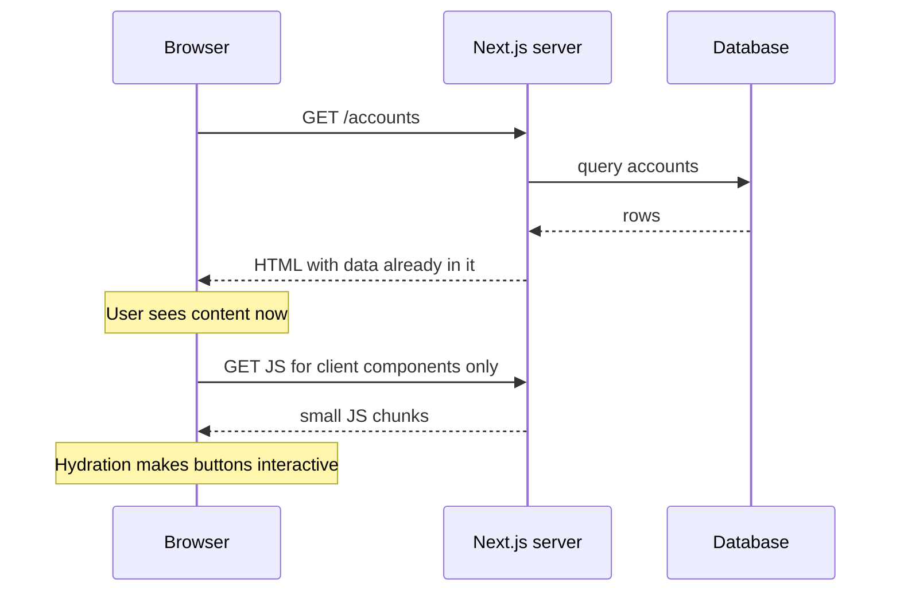
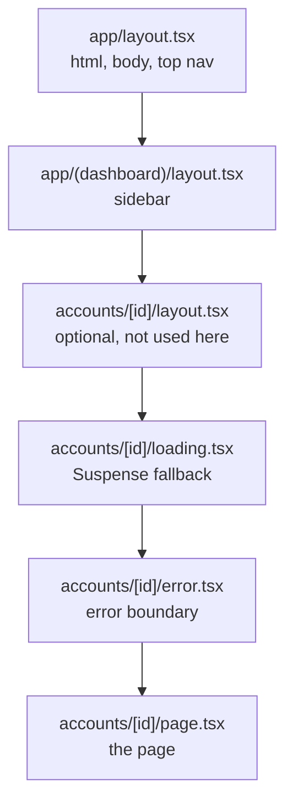
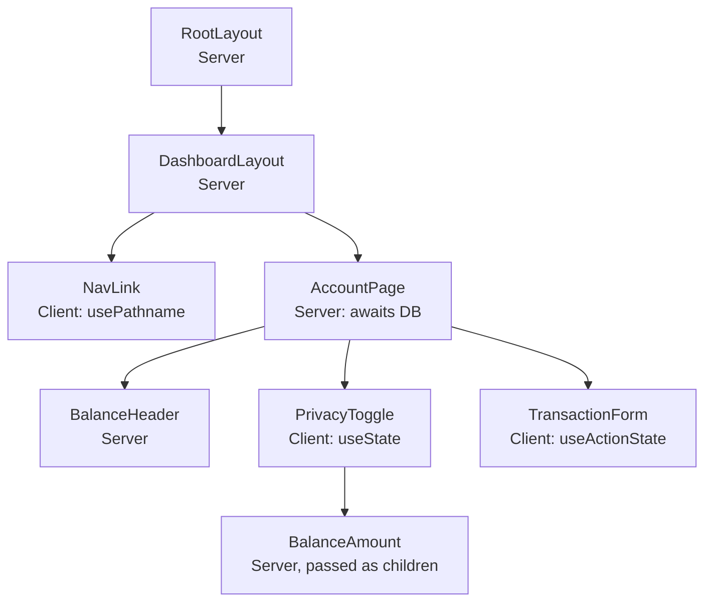
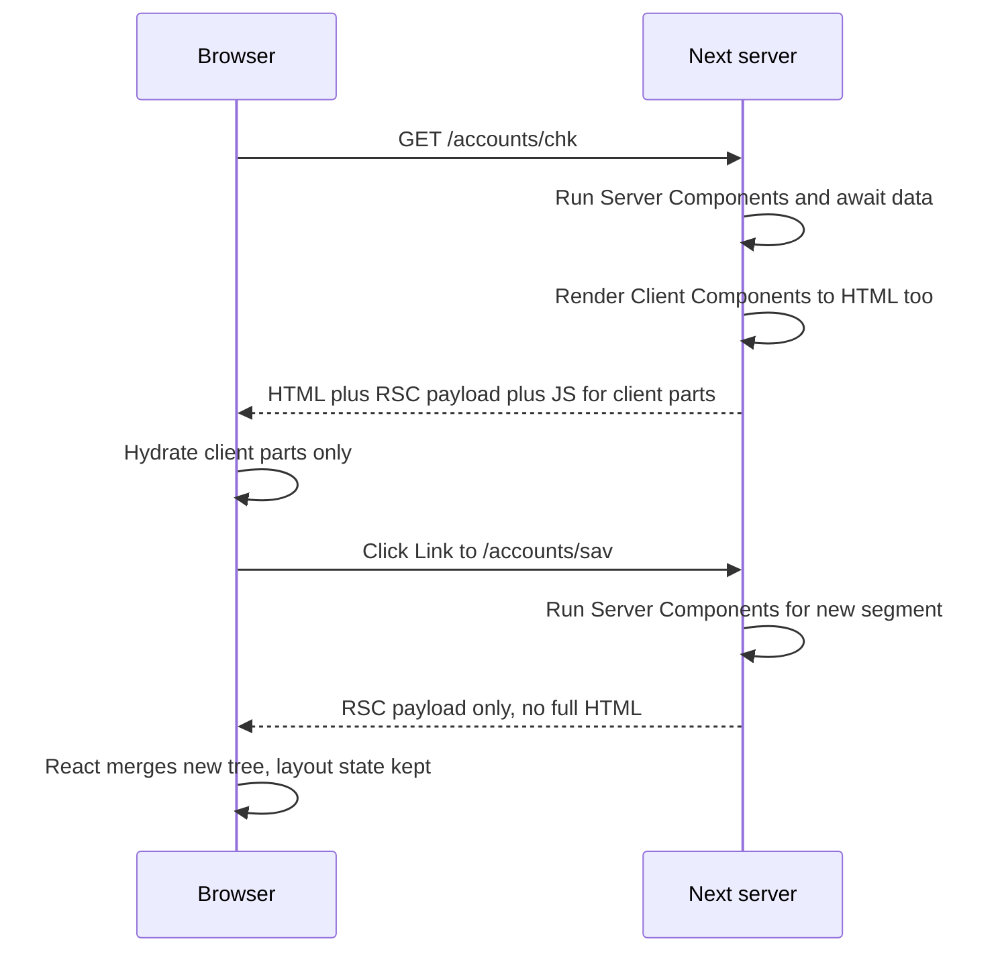
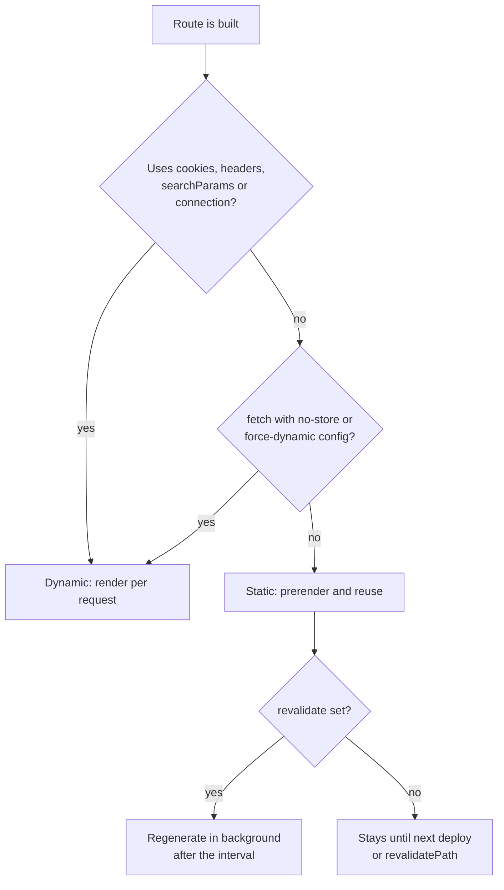
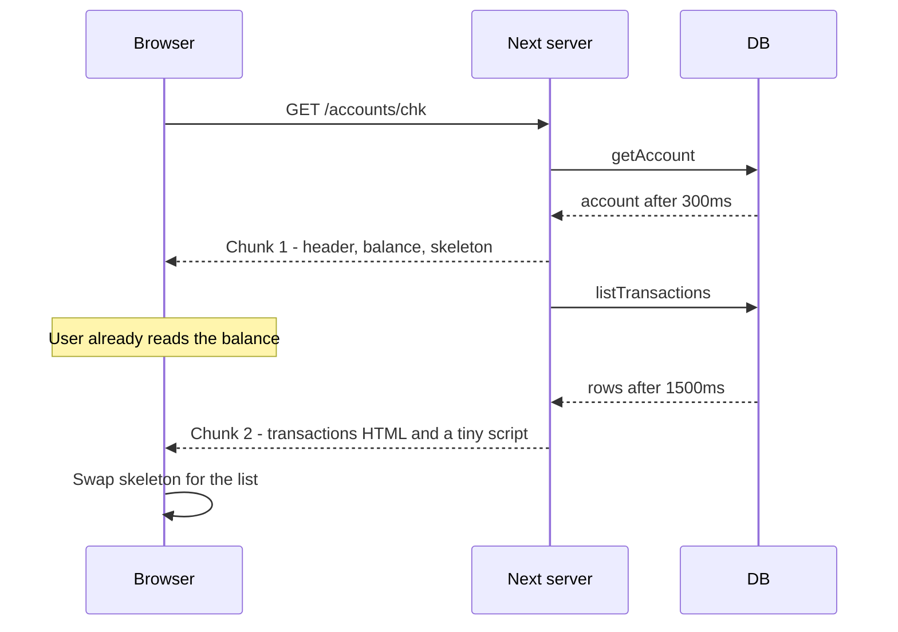
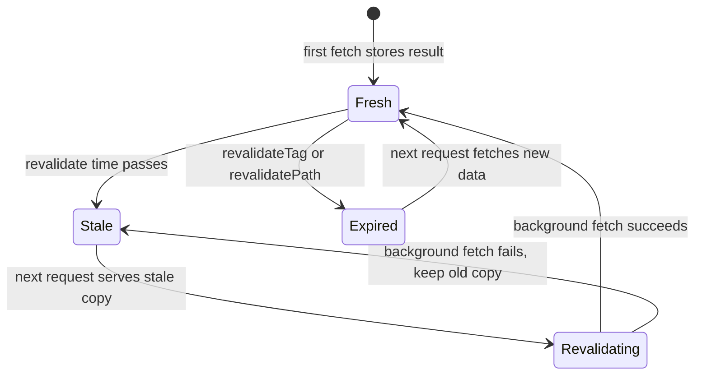
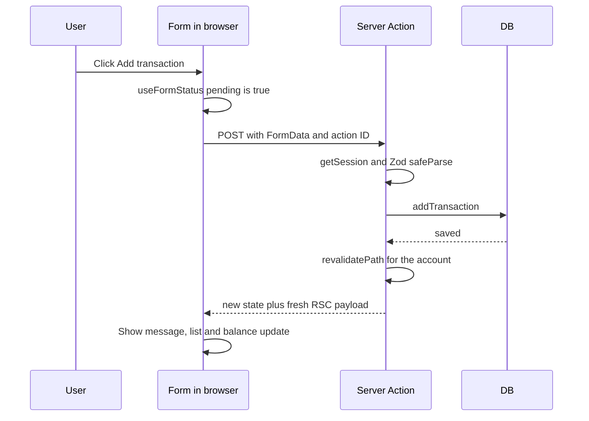
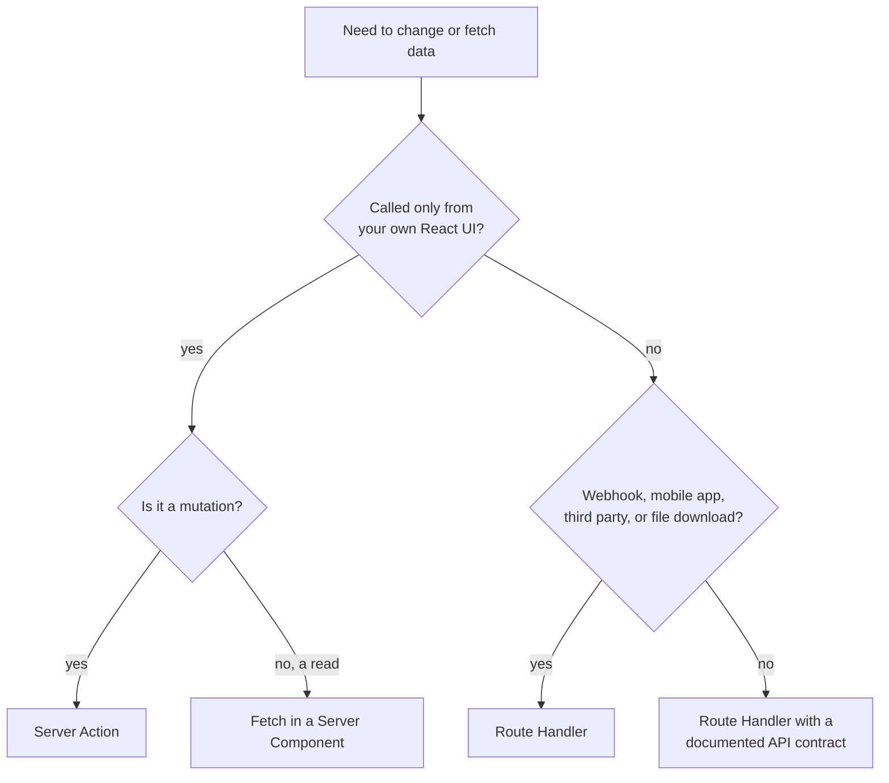
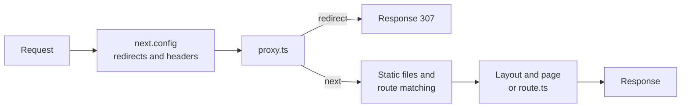

> **Version note:** This guide targets Next.js 16 (released October 2025; 16.3 is the latest minor as of October 2026). Next 16 made request APIs async-only, made Turbopack the default bundler, renamed `middleware.ts` to `proxy.ts`, and added the opt-in Cache Components model (`"use cache"`). Minor releases keep adding to Cache Components, so check the release notes for your exact minor before relying on a fine detail.

## 1. What Next.js is and why

### [Beginner] Step 1 — Understand what problem Next.js solves

You already know React. React is a library for building UI out of components. It does not decide:

- how URLs map to screens (routing),
- where code runs (browser only, or also on a server),
- how files are bundled, split and served,
- how data is fetched, cached and refreshed,
- how HTML gets to search engines and slow phones quickly.

In a typical Vite + React app (a Single Page Application, SPA), the server sends an almost empty `index.html` plus a big JavaScript bundle. The browser downloads the bundle, runs React, then fetches data from an API, then finally shows something useful.

Next.js is a **React framework**. It makes those decisions for you:

| Concern | What Next.js gives you |
| --- | --- |
| Routing | File-system routing in the `app/` folder: folders are URL segments, `page.tsx` is a screen |
| Rendering | Server rendering, static prerendering and streaming, per route or per component |
| Server code | React Server Components, Server Actions and Route Handlers, so you can read a database without writing a separate API |
| Bundling | Turbopack (default in 16) with automatic code splitting per route |
| Data | Built-in caching and revalidation for fetched data |
| Assets | `next/image`, `next/font`, metadata APIs for SEO |

> **Why:** The core idea is to move work to the server when the server is better at it (data access, secrets, heavy libraries, first HTML), and keep only the interactive parts in the browser.

Here is what the first page load looks like in Next.js compared to an SPA:



In an SPA the order is reversed: JS first, then a data request, then content. On a slow mobile network that difference is seconds.

### [Beginner] Step 2 — Compare Next.js with the alternatives

| | Next.js (App Router) | Vite + React SPA | React Router v7 (framework mode) | Astro |
| --- | --- | --- | --- | --- |
| What it is | Full-stack React framework | Build tool plus client-side React | Full-stack React framework (the successor to Remix) | Content-first site framework, multi-UI |
| Default rendering | Server Components, static or dynamic per route | Client-side only | Server rendering with loaders and actions | Static HTML, zero JS by default ("islands") |
| Data loading | `async` Server Components, `fetch`, direct DB calls | `useEffect`, TanStack Query, your API | `loader` functions per route | Frontmatter scripts at build or request time |
| Mutations | Server Actions, Route Handlers | Calls to a separate API | `action` functions, `<Form>` | API endpoints, Astro Actions |
| React Server Components | Yes, core model | No | Supported in newer releases, not the default model (check docs) | No (uses islands instead) |
| Hosting | Node server, Vercel, other adapters, static export (limited) | Any static host or CDN | Node, serverless, edge adapters | Static host or SSR adapters |
| Learning curve | Highest: server/client split and caching rules | Lowest | Medium: web-standards based | Low for content sites |
| Best for | Product apps that need SEO, fast first load, and server logic in one repo | Internal tools, dashboards behind login, apps that already have an API | Teams who like explicit loaders/actions and web standards | Blogs, docs, marketing sites |

**When an SPA is still the better choice:**

- The app is fully behind a login and SEO does not matter (many internal finance back-office tools).
- You already have a mature backend API (Java, .NET, NestJS) owned by another team, and Next.js would only proxy it.
- You want to deploy to a plain CDN or S3 bucket with no server to run or patch.
- The UI is extremely interactive (a trading blotter, a spreadsheet, a chart editor) and almost everything is client state anyway.
- Your team is small and the server/client mental model would slow them down more than it helps.

> **Interview tip:** Do not say "Next.js is always better". Say what you would gain (first load, SEO, server-only secrets, one deployable) and what you would pay (a server to run, a more complex mental model, caching rules). Interviewers like trade-offs.

> **Finance tip:** For a customer-facing banking or investing site, server rendering helps with first paint on cheap phones and keeps API keys and internal service URLs off the client. For a back-office reconciliation tool, an SPA talking to an existing API is often simpler and just as good.

## 2. Setup with create-next-app

### [Beginner] Step 3 — Create the project

You need Node.js 20.9 or newer (Next 16 dropped Node 18).

```bash
node -v
npx create-next-app@latest ledger --ts --tailwind --eslint --app --src-dir --import-alias "@/*" --use-npm
cd ledger
```

What each flag means:

| Flag | Meaning |
| --- | --- |
| `--ts` | TypeScript, with a `tsconfig.json` that has `strict: true` |
| `--tailwind` | Tailwind CSS v4 wired through PostCSS |
| `--eslint` | ESLint with a flat config (`eslint.config.mjs`) |
| `--app` | App Router (the `app/` folder), not the older Pages Router |
| `--src-dir` | Put `app/` inside `src/` so config files and source are separated |
| `--import-alias "@/*"` | Lets you write `import x from "@/lib/x"` instead of `../../lib/x` |

> **Gotcha:** The interactive prompts change between versions (Next 16 asks whether you want "recommended defaults" first). The flags above skip the prompts. If a flag is rejected, run `npx create-next-app@latest --help` to see the current list.

Install the two extra packages this guide uses:

```bash
npm install zod server-only
```

Start the dev server:

```bash
npm run dev
```

```text
   ▲ Next.js 16.x (Turbopack)
   - Local:        http://localhost:3000

 ✓ Starting...
 ✓ Ready in 900ms
```

**Check it works:**

```bash
curl -s http://localhost:3000 | grep -o "<title>[^<]*</title>"
```

```text
<title>Create Next App</title>
```

> **Outdated:** In Next 13 to 15 you passed `--turbopack` or `--turbo` to `next dev`. In Next 16 Turbopack is the default for both `next dev` and `next build`. Use `--webpack` only if you have a custom webpack config.

> **Outdated:** `next lint` was removed in Next 16, and `next build` no longer runs the linter. The `lint` script now calls `eslint` directly.

### [Beginner] Step 4 — Take the file tour

```text
ledger/
├── public/                 static files served as-is at /
│   └── *.svg
├── src/
│   └── app/
│       ├── favicon.ico     becomes the site icon automatically
│       ├── globals.css     Tailwind import and CSS variables
│       ├── layout.tsx      root layout: <html> and <body>
│       └── page.tsx        the "/" route
├── eslint.config.mjs       ESLint flat config
├── next-env.d.ts           generated types, do not edit
├── next.config.ts          Next.js configuration
├── package.json
├── postcss.config.mjs      loads @tailwindcss/postcss
└── tsconfig.json           strict TypeScript, "@/*" alias
```

What matters most:

- `src/app/layout.tsx` is the **root layout**. It must render `<html>` and `<body>`. It wraps every page.
- `src/app/page.tsx` is the page for `/`. A folder only becomes a route when it has a `page.tsx` (or a `route.ts`).
- `globals.css` starts with `@import "tailwindcss";` (Tailwind v4 style, no `tailwind.config.js` needed).
- `next.config.ts` is TypeScript. You will add image domains and flags here.

The `package.json` scripts are `dev` (`next dev`), `build` (`next build`), `start` (`next start`) and `lint` (`eslint`).

> **Why:** `next build` produces an optimized build and tells you, per route, whether it is static or dynamic. `next start` runs that build. Always test caching behavior with `build` plus `start`, because `next dev` re-renders on every request.

### [Beginner] Step 5 — Add a fake data layer

We will build "Ledger", a tiny accounts dashboard. To keep the focus on Next.js, the "database" is an in-memory module. Money is stored in integer cents, never floats.

```ts
// src/lib/types.ts
export type Currency = "USD" | "EUR" | "GBP";

export type Account = {
  id: string;
  name: string;
  currency: Currency;
  balanceCents: number;
};

export type Transaction = {
  id: string;
  accountId: string;
  amountCents: number;
  memo: string;
  createdAt: string; // ISO string, safe to send to the browser
};
```

```ts
// src/lib/db.ts
import "server-only";
import type { Account, Transaction } from "./types";

type Store = { accounts: Account[]; transactions: Transaction[] };

// Keep one store across hot reloads in dev.
const globalForStore = globalThis as unknown as { __ledgerStore?: Store };

const store: Store = globalForStore.__ledgerStore ?? {
  accounts: [
    { id: "chk", name: "Everyday Checking", currency: "USD", balanceCents: 254_310 },
    { id: "sav", name: "Rainy Day Savings", currency: "USD", balanceCents: 1_200_000 },
    { id: "eur", name: "Euro Wallet", currency: "EUR", balanceCents: 48_250 },
  ],
  transactions: [
    { id: "t1", accountId: "chk", amountCents: -4_599, memo: "Groceries", createdAt: "2026-10-01T09:12:00.000Z" },
    { id: "t2", accountId: "chk", amountCents: 320_000, memo: "Salary", createdAt: "2026-09-30T08:00:00.000Z" },
    { id: "t3", accountId: "sav", amountCents: 50_000, memo: "Monthly transfer", createdAt: "2026-09-30T08:05:00.000Z" },
  ],
};
globalForStore.__ledgerStore = store;

const delay = (ms: number) => new Promise<void>((resolve) => setTimeout(resolve, ms));

export async function listAccounts(): Promise<Account[]> {
  await delay(300);
  return structuredClone(store.accounts);
}

export async function getAccount(id: string): Promise<Account | undefined> {
  await delay(300);
  const found = store.accounts.find((a) => a.id === id);
  return found ? structuredClone(found) : undefined;
}

export async function listTransactions(accountId: string): Promise<Transaction[]> {
  await delay(1500); // deliberately slow so we can see streaming
  return structuredClone(
    store.transactions
      .filter((t) => t.accountId === accountId)
      .sort((a, b) => b.createdAt.localeCompare(a.createdAt)),
  );
}

export async function addTransaction(input: {
  accountId: string;
  amountCents: number;
  memo: string;
}): Promise<Transaction> {
  await delay(500);
  const account = store.accounts.find((a) => a.id === input.accountId);
  if (!account) throw new Error("Account not found");
  const tx: Transaction = {
    id: crypto.randomUUID(),
    accountId: input.accountId,
    amountCents: input.amountCents,
    memo: input.memo,
    createdAt: new Date().toISOString(),
  };
  store.transactions.push(tx);
  account.balanceCents += input.amountCents;
  return structuredClone(tx);
}
```

```ts
// src/lib/money.ts
import type { Currency } from "./types";

export function formatCents(cents: number, currency: Currency): string {
  return new Intl.NumberFormat("en-US", { style: "currency", currency }).format(cents / 100);
}
```

> **Why:** `import "server-only"` makes the build fail if any Client Component imports this file. That is your seatbelt: database code and secrets can never be bundled into browser JavaScript by accident.

> **Finance tip:** Integer cents (or a decimal library) avoid `0.1 + 0.2 === 0.30000000000000004` bugs. Convert to a display string only at the edge, with `Intl.NumberFormat`.

> **Gotcha:** The in-memory store resets when the server restarts, and in serverless hosting every instance has its own copy. It is only for learning. Swap it for Prisma, Drizzle or an API client later; the Next.js code stays the same.

## 3. Routing

### [Beginner] Step 6 — Learn the file conventions

In the App Router, **folders define URL segments** and **special files define UI for that segment**.

| File | Purpose |
| --- | --- |
| `page.tsx` | The UI for a route. Makes the folder publicly reachable |
| `layout.tsx` | UI that wraps a segment and all its children. Keeps state across navigation |
| `loading.tsx` | Instant loading UI, shown while the page streams in (wraps the page in Suspense) |
| `error.tsx` | Error boundary for the segment. Must be a Client Component |
| `not-found.tsx` | UI shown when `notFound()` is called, or for unmatched URLs at the root |
| `route.ts` | An HTTP endpoint (Route Handler). Cannot live next to a `page.tsx` in the same folder |
| `template.tsx` | Like a layout but remounts on every navigation (rarely needed) |
| `default.tsx` | Fallback for parallel route slots (required for every slot in Next 16) |

| Folder pattern | Example | Matches |
| --- | --- | --- |
| `accounts` | `app/accounts/page.tsx` | `/accounts` |
| `[id]` | `app/accounts/[id]/page.tsx` | `/accounts/chk` |
| `[...slug]` | `app/docs/[...slug]/page.tsx` | `/docs/a`, `/docs/a/b` (not `/docs`) |
| `[[...slug]]` | `app/help/[[...slug]]/page.tsx` | `/help`, `/help/a`, `/help/a/b` |
| `(group)` | `app/(dashboard)/accounts` | `/accounts` (group name is not in the URL) |
| `_folder` | `app/_components` | Nothing. Private folder, never a route |
| `@slot` | `app/(dashboard)/@alerts` | Not a URL. A named slot passed to the parent layout |

How layouts nest for `/accounts/chk`:



> **Why:** Layouts do not re-render when you navigate between their children. The sidebar keeps its scroll position and state; only the page part changes. In an SPA you get this with nested `<Outlet />` in React Router. Here it is the folder structure.

### [Beginner] Step 7 — Build the root layout and home page

Replace the generated files.

```tsx
// src/app/layout.tsx
import type { Metadata } from "next";
import Link from "next/link";
import "./globals.css";

export const metadata: Metadata = {
  title: { default: "Ledger", template: "%s | Ledger" },
  description: "A tiny accounts dashboard built with the Next.js App Router.",
};

export default function RootLayout({ children }: { children: React.ReactNode }) {
  return (
    <html lang="en">
      <body className="min-h-screen bg-slate-50 text-slate-900">
        <header className="border-b bg-white">
          <nav className="mx-auto flex max-w-5xl items-center gap-6 px-4 py-3">
            <Link href="/" className="font-semibold">
              Ledger
            </Link>
            <Link href="/accounts">Accounts</Link>
            <Link href="/docs/getting-started">Docs</Link>
          </nav>
        </header>
        <main className="mx-auto max-w-5xl px-4 py-8">{children}</main>
      </body>
    </html>
  );
}
```

```tsx
// src/app/page.tsx
import Link from "next/link";

export default function HomePage() {
  return (
    <section className="space-y-4">
      <h1 className="text-3xl font-bold">Welcome to Ledger</h1>
      <p>This page is a Server Component. It ships no JavaScript of its own.</p>
      <Link href="/accounts" className="text-blue-700 underline">
        View accounts
      </Link>
    </section>
  );
}
```

> **Gotcha:** `React.ReactNode` works without importing React because the Next.js TypeScript setup includes the React types globally. If your editor complains, add `import type { ReactNode } from "react";` and use `ReactNode`.

### [Beginner] Step 8 — Add a route group with a shared layout

The `(dashboard)` group lets several routes share a sidebar layout without adding `/dashboard` to the URL.

```tsx
// src/app/(dashboard)/layout.tsx
import { NavLink } from "@/components/nav-link";

export default function DashboardLayout({ children }: { children: React.ReactNode }) {
  return (
    <div className="grid gap-8 md:grid-cols-[200px_1fr]">
      <aside className="space-y-2">
        <p className="text-xs font-semibold uppercase text-slate-500">Dashboard</p>
        <NavLink href="/accounts">All accounts</NavLink>
        <NavLink href="/accounts/chk">Checking</NavLink>
        <NavLink href="/accounts/sav">Savings</NavLink>
      </aside>
      <div>{children}</div>
    </div>
  );
}
```

`NavLink` needs to know the current URL, which only the browser knows during client navigation. So it is a Client Component (more on this in Part 4).

```tsx
// src/components/nav-link.tsx
"use client";

import Link from "next/link";
import { usePathname } from "next/navigation";

export function NavLink({ href, children }: { href: string; children: React.ReactNode }) {
  const pathname = usePathname();
  const active = pathname === href;
  return (
    <Link
      href={href}
      aria-current={active ? "page" : undefined}
      className={active ? "block font-semibold text-blue-700" : "block text-slate-700"}
    >
      {children}
    </Link>
  );
}
```

```tsx
// src/app/(dashboard)/accounts/page.tsx
import Link from "next/link";
import type { Metadata } from "next";
import { listAccounts } from "@/lib/db";
import { formatCents } from "@/lib/money";

export const metadata: Metadata = { title: "Accounts" };

export default async function AccountsPage() {
  const accounts = await listAccounts();
  return (
    <section className="space-y-4">
      <h1 className="text-2xl font-bold">Accounts</h1>
      <ul className="divide-y rounded border bg-white">
        {accounts.map((a) => (
          <li key={a.id} className="flex justify-between p-4">
            <Link href={`/accounts/${a.id}`} className="text-blue-700 underline">
              {a.name}
            </Link>
            <span className="tabular-nums">{formatCents(a.balanceCents, a.currency)}</span>
          </li>
        ))}
      </ul>
    </section>
  );
}
```

Notice: the page is an `async` function that awaits data directly. No `useEffect`, no loading state, no API route.

**Check it works:**

```bash
curl -s http://localhost:3000/accounts | grep -o "Rainy Day Savings"
```

```text
Rainy Day Savings
```

The account names are in the HTML the server sent. An SPA would return an empty `<div id="root">`.

### [Beginner] Step 9 — Add a dynamic route with not-found

```tsx
// src/app/(dashboard)/accounts/[id]/page.tsx
import { notFound } from "next/navigation";
import { getAccount } from "@/lib/db";
import { formatCents } from "@/lib/money";

type Props = { params: Promise<{ id: string }> };

export default async function AccountPage({ params }: Props) {
  const { id } = await params;
  const account = await getAccount(id);
  if (!account) notFound();

  return (
    <section className="space-y-2">
      <h1 className="text-2xl font-bold">{account.name}</h1>
      <p className="text-3xl tabular-nums">{formatCents(account.balanceCents, account.currency)}</p>
    </section>
  );
}
```

```tsx
// src/app/(dashboard)/accounts/[id]/not-found.tsx
import Link from "next/link";

export default function AccountNotFound() {
  return (
    <div className="space-y-2">
      <h2 className="text-xl font-semibold">Account not found</h2>
      <Link href="/accounts" className="text-blue-700 underline">
        Back to accounts
      </Link>
    </div>
  );
}
```

> **Why:** `params` is a Promise. Next 15 made it async so Next can start rendering before it knows every dynamic value. Next 15 still allowed sync access with a warning. Next 16 removed sync access completely, so you must `await params` (or `use(params)` in a Client Component).

> **Gotcha:** `notFound()` throws a special error, so code after it never runs. TypeScript knows this (it returns `never`), which is why `account` is no longer `undefined` after the `if`.

> **Interview tip:** Next 15.5+ also generates global helper types such as `PageProps<"/accounts/[id]">` and `LayoutProps<...>` so you do not hand-write the `params` type. Writing the type yourself, as above, always works.

**Check it works:**

```bash
curl -s -o /dev/null -w "%{http_code}\n" http://localhost:3000/accounts/chk
curl -s -o /dev/null -w "%{http_code}\n" http://localhost:3000/accounts/nope
```

```text
200
404
```

### [Beginner] Step 10 — Add loading and error UI

```tsx
// src/app/(dashboard)/accounts/[id]/loading.tsx
export default function Loading() {
  return <div className="h-24 animate-pulse rounded bg-slate-200" aria-busy="true" />;
}
```

```tsx
// src/app/(dashboard)/accounts/[id]/error.tsx
"use client";

import { useEffect } from "react";

export default function AccountError({
  error,
  reset,
}: {
  error: Error & { digest?: string };
  reset: () => void;
}) {
  useEffect(() => {
    console.error(error); // send to your logger or RUM tool here
  }, [error]);

  return (
    <div role="alert" className="space-y-2 rounded border border-red-300 bg-red-50 p-4">
      <p className="font-semibold">Could not load this account.</p>
      <p className="text-sm text-slate-600">Reference: {error.digest ?? "n/a"}</p>
      <button type="button" onClick={reset} className="rounded bg-red-600 px-3 py-1 text-white">
        Try again
      </button>
    </div>
  );
}
```

> **Why:** `error.tsx` must be a Client Component because error boundaries are a browser-side React feature and it needs an `onClick`. In production, the real error message from a Server Component is hidden from the browser; you only get a `digest` you can match against server logs. That protects internal details.

> **Gotcha:** `error.tsx` catches errors from the page and nested segments, not from the `layout.tsx` in the same folder. For errors in the root layout use `app/global-error.tsx`, which must render its own `<html>` and `<body>`.

### [Beginner] Step 11 — Add a catch-all docs route

```tsx
// src/app/docs/[...slug]/page.tsx
type Props = { params: Promise<{ slug: string[] }> };

// Optional: prerender these paths at build time. Others still render on demand.
export function generateStaticParams(): { slug: string[] }[] {
  return [{ slug: ["getting-started"] }, { slug: ["getting-started", "install"] }];
}

export default async function DocsPage({ params }: Props) {
  const { slug } = await params;
  return (
    <article className="space-y-2">
      <h1 className="text-2xl font-bold">Docs</h1>
      <p>Path segments: {slug.join(" / ")}</p>
    </article>
  );
}
```

`/docs/getting-started/install` gives `slug = ["getting-started", "install"]`. `/docs` alone is a 404 here. Rename the folder to `[[...slug]]` to also match `/docs`, and then `slug` is `string[] | undefined`.

Add `export const dynamicParams = false;` to return 404 for any slug not listed in `generateStaticParams`.

### [Intermediate] Step 12 — Navigate with Link and the router

| Tool | Where | Use it for |
| --- | --- | --- |
| `<Link href>` from `next/link` | Server or Client Components | Normal navigation. Prefetches the route when the link is visible |
| `useRouter()` from `next/navigation` | Client Components | `router.push`, `router.replace`, `router.back`, `router.refresh` after an event |
| `usePathname()`, `useSearchParams()`, `useParams()` | Client Components | Reading the current URL |
| `redirect()` from `next/navigation` | Server Components, Server Actions, Route Handlers | Server-side redirect (throws, like `notFound()`) |
| `permanentRedirect()` | Same as `redirect` | 308 redirects for moved content |

> **Outdated:** `useRouter` from `next/router` belongs to the old Pages Router. In the App Router, always import from `next/navigation`. The App Router `useRouter` has no `query` or `pathname`; use `useSearchParams` and `usePathname`.

> **Gotcha:** A client-side navigation does not reload the page. Next fetches a compact description of the new Server Component tree (the RSC payload) and React merges it in. Layouts that did not change are not refetched; Next 16 also deduplicates shared layouts across prefetches.

### [Advanced] Step 13 — Know parallel and intercepting routes (brief)

**Parallel routes** render several independent pages in one layout at the same time. Each `@slot` folder becomes a prop on the parent layout.

```text
app/(dashboard)/
├── @alerts/
│   ├── default.tsx      required in Next 16
│   └── page.tsx
├── layout.tsx           receives { children, alerts }
└── accounts/...
```

Each slot can have its own `loading.tsx` and `error.tsx`, so a slow alerts feed does not block the main page.

**Intercepting routes** show a different route inside the current layout during client navigation, typically as a modal, while a hard refresh shows the full page. Folder prefixes: `(.)` same level, `(..)` one level up, `(...)` from the app root. Example: clicking a transaction opens `/transactions/t1` in a modal over the list, but sharing that URL opens the full transaction page.

> **Gotcha:** In Next 16 every parallel slot needs a `default.tsx`, or the build fails. Return `null` or call `notFound()` in it to keep the old behavior.

> **Interview tip:** If asked "how would you build a modal with a shareable URL", answer: parallel route slot (`@modal`) plus an intercepting route (`(.)photo/[id]`), with a `default.tsx` that returns `null`.

## 4. Server Components vs Client Components

### [Beginner] Step 14 — Build the mental model

Every component in the `app/` folder is a **Server Component** by default. You opt into a **Client Component** with the `"use client"` directive at the top of a file.

| | Server Component | Client Component |
| --- | --- | --- |
| Where it runs | On the server only (at build time or per request) | On the server for the first HTML, then in the browser |
| Ships its code to the browser | No | Yes |
| Can be `async` and `await` data | Yes | No (use `use()` with a promise, or a client data library) |
| Can read secrets, DB, file system | Yes | No |
| `useState`, `useEffect`, event handlers | No | Yes |
| Browser APIs (`window`, `localStorage`) | No | Yes, inside effects or handlers |
| Context (`createContext` providers) | Cannot provide or consume | Yes |

> **Gotcha:** "Client Component" does not mean "client-side only". Client Components are still rendered to HTML on the server for the first load, then **hydrated** in the browser. That is why `window` is undefined during the first render even in a `"use client"` file.

Think of the page as a tree. Server Components form the trunk. `"use client"` marks the point where a branch becomes interactive.



What happens on a request:



The **RSC payload** is a serialized description of the rendered Server Component tree: plain elements, text, the props for each Client Component, and references to the client JS chunks. The browser never receives the Server Component code itself.

### [Beginner] Step 15 — Understand the serialization boundary

When a Server Component renders a Client Component, the props cross the network. They must be **serializable by React**.

| Can cross the boundary | Cannot cross |
| --- | --- |
| Strings, numbers, booleans, `null`, `undefined` | Regular functions such as `onClick={() => ...}` from a server file |
| Plain objects and arrays of the above | Class instances (a Prisma `Decimal`, a custom `Money` class) |
| `Date`, `Map`, `Set`, `BigInt`, typed arrays | Symbols that are not globally registered |
| JSX elements (including Server Components as `children`) | Database connections, request objects |
| Promises (unwrap with `use()` on the client) | |
| Server Actions (functions marked `"use server"`) | |

> **Finance tip:** ORMs often return decimal columns as library objects (for example `Prisma.Decimal`). Convert them to strings or integer cents on the server before passing them to a Client Component, or you will get a "Only plain objects can be passed to Client Components" error.

### [Intermediate] Step 16 — See how "use client" propagates

`"use client"` marks a **module boundary**, not one component. Everything that file imports also becomes client code and is bundled for the browser.

```text
transaction-form.tsx  "use client"
 ├── imports ./amount-input.tsx      becomes client code (no directive needed)
 ├── imports @/lib/money.ts          becomes client code (fine, it is pure)
 └── imports @/lib/db.ts             build error, thanks to "server-only"
```

Rules of thumb:

1. Put `"use client"` on the **leaves**: the smallest component that needs state or events.
2. Do not put `"use client"` on a layout or page just because one button needs `onClick`. Extract the button.
3. You only need the directive at the entry file of a client subtree. Files it imports are already client.

### [Intermediate] Step 17 — Pass Server Components into Client Components as children

A Client Component cannot `import` a Server Component (the import would turn it into client code). It **can** receive one as `children` or any other JSX prop, because the server renders it first and only the result crosses over.

Let us build a privacy toggle that hides balances, a common feature in banking apps.

```tsx
// src/components/privacy-toggle.tsx
"use client";

import { useState } from "react";

export function PrivacyToggle({ children }: { children: React.ReactNode }) {
  const [hidden, setHidden] = useState(false);
  return (
    <div className="flex items-center gap-4">
      <div className={hidden ? "select-none blur-sm" : undefined} aria-hidden={hidden}>
        {children}
      </div>
      <button type="button" onClick={() => setHidden((h) => !h)} className="text-sm underline">
        {hidden ? "Show balance" : "Hide balance"}
      </button>
    </div>
  );
}
```

Update the account page so the balance (server-rendered) is passed in as children:

```tsx
// src/app/(dashboard)/accounts/[id]/page.tsx (JSX change, plus import { PrivacyToggle } from "@/components/privacy-toggle")
<PrivacyToggle>
  <p className="text-3xl tabular-nums">{formatCents(account.balanceCents, account.currency)}</p>
</PrivacyToggle>
```

> **Why:** This "donut" pattern keeps the data fetching and formatting on the server while the toggle state lives in the browser. The same pattern is how you wrap the app in context providers: a `"use client"` `Providers` component that takes `children`, used inside the server `layout.tsx`.

**Check it works:** open `http://localhost:3000/accounts/chk`, click "Hide balance", then click "Savings" in the sidebar. The sidebar does not reload. The toggle resets because it is part of the page, not the layout.

### [Intermediate] Step 18 — Avoid the common mistakes

| Mistake | Symptom | Fix |
| --- | --- | --- |
| Using `useState` in a file without `"use client"` | Build error: "You're importing a component that needs useState" | Add `"use client"` to that leaf, or move the state into a child |
| `"use client"` on the root layout | Everything ships to the browser, no async data in layouts | Keep layouts server; extract small client pieces |
| Importing a DB or secret module in a client file | Secret ends up in the bundle, or a `server-only` build error | Fetch on the server and pass data as props |
| Passing a function prop from server to client | "Functions cannot be passed directly to Client Components" | Define the handler inside the Client Component, or pass a Server Action |
| Passing class instances (Decimal, custom Money) | "Only plain objects can be passed" | Convert to strings or numbers first |
| Reading `window` during render | `ReferenceError: window is not defined` on the server | Read it in `useEffect` or an event handler |
| Making a Client Component `async` | Error or infinite suspense | Fetch in a Server Component parent, or use `use(promise)` |
| Fetching your own Route Handler from a Server Component | Extra network hop, fails at build time | Call the data function directly |
| Different output on server and client (dates, random IDs) | Hydration mismatch warning | Format dates on the server, use `useId` for IDs |

> **Interview tip:** A crisp answer to "Server vs Client Components" is: Server Components run only on the server, can be async, can touch secrets, and send zero JS. Client Components are for interactivity and browser APIs, are rendered on the server for the first HTML and then hydrated. The `"use client"` directive marks a module boundary, and props across it must be serializable.

## 5. Rendering and data

### [Beginner] Step 19 — Tell static from dynamic rendering

Next decides, per route, **when** the HTML is produced:

- **Static (prerendered):** rendered once at `next build` (or on the first request) and reused for everyone. Fastest, cheapest.
- **Dynamic:** rendered on every request, because the output depends on that request.

A route becomes dynamic when it uses request-specific data:

- `await cookies()`, `await headers()`, `await draftMode()`
- `searchParams` in a page
- `await connection()` from `next/server` (an explicit "this must run per request")
- `fetch(url, { cache: "no-store" })`
- route config `export const dynamic = "force-dynamic"`



Run a production build to see the decision:

```bash
npm run build
```

```text
Route (app)
┌ ○ /
├ ○ /_not-found
├ ○ /accounts
├ ƒ /accounts/[id]
└ ● /docs/[...slug]
    ├ /docs/getting-started
    └ /docs/getting-started/install

○  (Static)   prerendered as static content
●  (SSG)      prerendered as static HTML (uses generateStaticParams)
ƒ  (Dynamic)  server-rendered on demand
```

Your exact list and symbols can differ slightly by version.

> **Gotcha:** `/accounts` is static. Our in-memory "DB" call is not a `fetch`, so Next just runs it at build time and bakes the result into HTML. If a new transaction changes a balance, production will keep showing the old number until you revalidate. This surprises everyone once. We fix it in Part 6 with `revalidatePath`.

> **Finance tip:** Anything user-specific (balances, statements, KYC status) must be dynamic or cached per user. Never let a page that reads one user's data be prerendered and served to everyone. Reading the session with `await cookies()` forces dynamic rendering, which is the safe default.

### [Intermediate] Step 20 — Stream slow data with Suspense

The transactions query takes 1.5 seconds. Without streaming, the whole page waits for the slowest query. With `<Suspense>`, Next sends the fast parts immediately and streams the slow part when it is ready, over the same HTTP response.

```tsx
// src/app/(dashboard)/accounts/[id]/transactions.tsx
import { listTransactions } from "@/lib/db";
import { formatCents } from "@/lib/money";
import type { Currency } from "@/lib/types";

export async function Transactions({ accountId, currency }: { accountId: string; currency: Currency }) {
  const transactions = await listTransactions(accountId);
  if (transactions.length === 0) return <p className="text-slate-500">No transactions yet.</p>;

  return (
    <ul className="divide-y rounded border bg-white">
      {transactions.map((t) => (
        <li key={t.id} className="flex justify-between p-3">
          <span>
            {t.memo}
            <span className="ml-2 text-xs text-slate-500">{t.createdAt.slice(0, 10)}</span>
          </span>
          <span className={t.amountCents < 0 ? "tabular-nums text-red-700" : "tabular-nums text-green-700"}>
            {formatCents(t.amountCents, currency)}
          </span>
        </li>
      ))}
    </ul>
  );
}
```

```tsx
// src/app/(dashboard)/accounts/[id]/page.tsx
import { Suspense } from "react";
import { notFound } from "next/navigation";
import { getAccount } from "@/lib/db";
import { formatCents } from "@/lib/money";
import { PrivacyToggle } from "@/components/privacy-toggle";
import { Transactions } from "./transactions";

type Props = { params: Promise<{ id: string }> };

export default async function AccountPage({ params }: Props) {
  const { id } = await params;
  const account = await getAccount(id);
  if (!account) notFound();

  return (
    <section className="space-y-6">
      <h1 className="text-2xl font-bold">{account.name}</h1>
      <PrivacyToggle>
        <p className="text-3xl tabular-nums">{formatCents(account.balanceCents, account.currency)}</p>
      </PrivacyToggle>
      <h2 className="text-lg font-semibold">Recent transactions</h2>
      <Suspense fallback={<div className="h-32 animate-pulse rounded bg-slate-200" />}>
        <Transactions accountId={account.id} currency={account.currency} />
      </Suspense>
    </section>
  );
}
```



**Check it works:** stream the raw response and watch it arrive in two parts.

```bash
curl -N -s http://localhost:3000/accounts/chk | grep -o -E "animate-pulse|Groceries"
```

```text
animate-pulse
Groceries
```

You should see `animate-pulse` print first, then about 1.5 seconds later `Groceries`. Exact output depends on how chunks and lines are buffered; the Network tab in browser DevTools shows the same thing as a long-running document request that renders early.

> **Why:** `loading.tsx` is just an automatic `<Suspense>` around the whole page. Explicit `<Suspense>` boundaries give finer control: each slow widget gets its own skeleton.

> **Gotcha:** Two `await`s in a row are sequential. If two queries do not depend on each other, start both first: `const [a, b] = await Promise.all([getAccount(id), getLimits(id)]);` or put each in its own Suspense boundary.

### [Intermediate] Step 21 — Cache fetch results and revalidate

Add a widget showing indicative FX rates from a public API (Frankfurter is used here as an example; any JSON API works).

```tsx
// src/components/fx-rates.tsx
type FxResponse = { base: string; date: string; rates: Record<string, number> };

export async function FxRates() {
  let data: FxResponse | null = null;
  try {
    const res = await fetch("https://api.frankfurter.dev/v1/latest?base=USD&symbols=EUR,GBP", {
      next: { revalidate: 3600, tags: ["fx-rates"] },
    });
    if (res.ok) data = (await res.json()) as FxResponse;
  } catch {
    data = null;
  }

  if (!data) return <p className="text-sm text-slate-500">FX rates unavailable.</p>;

  return (
    <div className="rounded border bg-white p-3 text-sm">
      <p className="font-semibold">USD rates (as of {data.date})</p>
      <ul>
        {Object.entries(data.rates).map(([code, rate]) => (
          <li key={code} className="tabular-nums">
            1 USD = {rate.toFixed(4)} {code}
          </li>
        ))}
      </ul>
    </div>
  );
}
```

Render `<FxRates />` on the home page. What the options mean:

| Option | Effect |
| --- | --- |
| `cache: "force-cache"` | Store the response in the Data Cache and reuse it |
| `cache: "no-store"` | Never cache; makes the route dynamic |
| `next: { revalidate: 3600 }` | Cache, but treat as stale after 3600 seconds and refetch in the background |
| `next: { tags: ["fx-rates"] }` | Label the entry so `revalidateTag("fx-rates", ...)` can expire it on demand |
| no option (Next 15 and 16) | Not cached by the Data Cache, but if the route is otherwise static the result is baked in at build time |

You can also set a default for the whole route segment:

```ts
export const revalidate = 60; // seconds, regenerate this route at most once a minute
export const dynamic = "force-dynamic"; // or force every request to render fresh
```

The life of a cached entry with `revalidate` (stale-while-revalidate):



> **Finance tip:** Always show the "as of" timestamp next to cached market data and label it indicative. Never use a cached rate to price an actual trade or transfer; fetch a live, uncached quote inside the mutation itself.

> **Gotcha:** `fetch` requests with the same URL and options in one render pass are **memoized**: three components calling the same `fetch` produce one network request. This is React request memoization, separate from the Data Cache. For non-fetch functions (DB queries), wrap them in React's `cache()` to get the same per-request deduplication.

### [Intermediate] Step 22 — Revalidate on demand

Time-based revalidation is a guess. After a mutation you know exactly what changed, so expire it directly. All of these come from `next/cache`:

| API | Where | What it does |
| --- | --- | --- |
| `revalidatePath("/accounts")` | Server Actions, Route Handlers | Marks everything for that path stale; next visit re-renders. Pass `"layout"` as the 2nd arg with a dynamic pattern to include nested routes |
| `revalidateTag("fx-rates", "max")` | Server Actions, Route Handlers | Marks tagged entries stale with stale-while-revalidate. Next 16 expects the 2nd argument (a `cacheLife` profile or `{ expire: seconds }`) |
| `updateTag("account-chk")` | Server Actions only (Next 16) | Expires and refetches in the same request, so the user reads their own write immediately |
| `refresh()` | Server Actions only (Next 16) | Re-renders uncached data on the current page without touching the cache |
| `router.refresh()` | Client Components | Refetches the current route's Server Components from the client |

A webhook-style Route Handler that expires FX rates when a provider pings you:

```ts
// src/app/api/revalidate-fx/route.ts
import { revalidateTag } from "next/cache";

export async function POST(request: Request) {
  const secret = request.headers.get("x-revalidate-secret");
  if (!process.env.REVALIDATE_SECRET || secret !== process.env.REVALIDATE_SECRET) {
    return Response.json({ ok: false }, { status: 401 });
  }
  revalidateTag("fx-rates", "max");
  return Response.json({ ok: true, revalidated: "fx-rates" });
}
```

**Check it works:** add `REVALIDATE_SECRET=dev-secret` to `.env.local`, restart, then:

```bash
curl -s -X POST -H "x-revalidate-secret: dev-secret" http://localhost:3000/api/revalidate-fx
curl -s -X POST http://localhost:3000/api/revalidate-fx
```

```text
{"ok":true,"revalidated":"fx-rates"}
{"ok":false}
```

> **Outdated:** In Next 14 and 15, `revalidateTag(tag)` took one argument. In Next 16 the one-argument form is deprecated. Use `revalidateTag(tag, "max")` for background refresh, or `updateTag(tag)` in a Server Action when the user must see the change right away.

### [Advanced] Step 23 — Know how caching changed across versions

The App Router has four caching layers. Their defaults changed a lot, which is why old blog posts conflict.

| Layer | What it stores | Where |
| --- | --- | --- |
| Request memoization | Identical `fetch` calls during one render | Server, per request |
| Data Cache | `fetch` responses across requests and deploys | Server |
| Full Route Cache | Rendered HTML and RSC payload of static routes | Server |
| Router Cache | RSC payloads of visited and prefetched routes | Browser memory |

| Behavior | Next 13 and 14 | Next 15 | Next 16 |
| --- | --- | --- | --- |
| `fetch` default | Cached (`force-cache`) | Not cached by default | Not cached by default |
| `GET` Route Handlers | Cached by default if static | Not cached by default | Not cached by default |
| Router Cache for page segments | Reused for 30 s (dynamic) or 5 min | `staleTime` 0 for pages; layouts and `loading` still reused | Navigation and prefetch rewritten with layout deduplication and incremental prefetching |
| `cookies()`, `headers()`, `params` | Synchronous | Async, sync access still worked with a warning | Async only, sync access removed |
| Opt-in explicit caching | `unstable_cache` | `"use cache"` experimental (`dynamicIO` flag) | `"use cache"` with `cacheComponents: true` (stable flag, still opt-in) |
| Partial Prerendering | Experimental | Experimental (`experimental.ppr`) | Folded into Cache Components; old `ppr` flags removed |
| `revalidateTag` | `revalidateTag(tag)` | `revalidateTag(tag)` | `revalidateTag(tag, profile)`, plus `updateTag` and `refresh` |

> **Interview tip:** The one-line story: Next 14 cached aggressively by default and people were surprised by stale data; Next 15 flipped to "not cached unless you ask"; Next 16 adds an explicit, opt-in model where you mark what to cache with `"use cache"`.

### [Advanced] Step 24 — Try Cache Components and "use cache"

With Cache Components on, the model becomes: **everything is dynamic unless you mark it cached**, and Next prerenders a static shell around your Suspense boundaries (this is Partial Prerendering).

```ts
// next.config.ts
import type { NextConfig } from "next";

const nextConfig: NextConfig = {
  cacheComponents: true,
};

export default nextConfig;
```

Mark a function, component or whole file as cached:

```ts
// src/lib/fx.ts
import { cacheLife, cacheTag } from "next/cache";

export async function getUsdRates(): Promise<Record<string, number>> {
  "use cache";
  cacheLife("hours");
  cacheTag("fx-rates");
  const res = await fetch("https://api.frankfurter.dev/v1/latest?base=USD&symbols=EUR,GBP");
  if (!res.ok) return {};
  const data = (await res.json()) as { rates: Record<string, number> };
  return data.rates;
}
```

How it behaves:

- The function's arguments and closed-over values become part of the cache key automatically (the compiler generates it).
- `cacheLife` picks a profile (`"seconds"`, `"minutes"`, `"hours"`, `"days"`, `"weeks"`, `"max"`) or custom values.
- `cacheTag` labels the entry for `revalidateTag` and `updateTag`.
- Uncached data that is read during render, such as `await cookies()` or an uncached DB call, must be inside a `<Suspense>` boundary. Otherwise the build fails with an error telling you to add one. This forces you to decide, for every piece of data, "cached" or "streamed".

> **Gotcha:** Turning on `cacheComponents` changes the rules for the whole app. Route segment options like `export const dynamic`, `export const revalidate` and `fetchCache` do not apply in this mode (Next reports them as errors or ignores them; check the docs for your minor). Try it on a branch, and do not mix tutorials written for the two models.

> **Gotcha:** You cannot call `cookies()` or `headers()` inside a `"use cache"` scope, because the result would be shared across users. Read them outside and pass the values you need in as arguments, so they become part of the key.

> **Outdated:** In Next 15 these were `unstable_cacheLife` and `unstable_cacheTag` behind `experimental.dynamicIO`. `unstable_cache` still exists but `"use cache"` is the intended replacement.

For the rest of this guide, leave `cacheComponents` off (the default) so the route segment examples keep working.

## 6. Mutations: Server Actions and Route Handlers

### [Beginner] Step 25 — Add a demo session

Real apps use Auth.js, Clerk, or your company's SSO. For learning, a cookie with a role is enough.

```ts
// src/lib/session.ts
import "server-only";
import { cookies } from "next/headers";

export type Session = { userId: string; role: "viewer" | "editor" };

export async function getSession(): Promise<Session | null> {
  const store = await cookies();
  const value = store.get("demo_session")?.value;
  if (value === "editor") return { userId: "u_1", role: "editor" };
  if (value === "viewer") return { userId: "u_2", role: "viewer" };
  return null;
}
```

```ts
// src/app/api/demo-login/route.ts
import { NextResponse, type NextRequest } from "next/server";

export async function GET(request: NextRequest) {
  const role = request.nextUrl.searchParams.get("role") === "editor" ? "editor" : "viewer";
  const next = request.nextUrl.searchParams.get("next") ?? "/accounts";
  const safeNext = next.startsWith("/") && !next.startsWith("//") ? next : "/accounts";
  const response = NextResponse.redirect(new URL(safeNext, request.url));
  response.cookies.set("demo_session", role, { httpOnly: true, sameSite: "lax", path: "/" });
  return response;
}
```

> **Finance tip:** Only accept relative `next` URLs. An open redirect (`?next=https://evil.example`) is a classic phishing aid and shows up in bank pen tests.

### [Intermediate] Step 26 — Write a Server Action with Zod validation

A **Server Action** is an async function marked `"use server"`. You can pass it to a `<form action>` or call it from a Client Component. Next turns it into a POST endpoint with a hidden ID, and React handles the request for you.

```ts
// src/lib/tx-form.ts
export type TxFormState = {
  ok: boolean;
  message: string;
  fieldErrors?: { amount?: string[]; memo?: string[] };
  values?: { amount: string; memo: string };
};

export const initialTxFormState: TxFormState = { ok: false, message: "" };

// "12.34" -> 1234, "-5" -> -500. String math avoids float rounding.
export function toCents(input: string): number {
  const negative = input.startsWith("-");
  const [whole, frac = ""] = input.replace("-", "").split(".");
  const cents = Number(whole) * 100 + Number(frac.padEnd(2, "0"));
  return negative ? -cents : cents;
}
```

```ts
// src/app/(dashboard)/accounts/[id]/actions.ts
"use server";

import { z } from "zod";
import { revalidatePath } from "next/cache";
import { addTransaction, getAccount } from "@/lib/db";
import { getSession } from "@/lib/session";
import { toCents, type TxFormState } from "@/lib/tx-form";

const TxSchema = z.object({
  accountId: z.string().min(1),
  amount: z
    .string()
    .regex(/^-?\d{1,7}(\.\d{1,2})?$/, "Use a number with at most 2 decimals")
    .refine((v) => toCents(v) !== 0, "Amount cannot be zero"),
  memo: z.string().trim().min(1, "Memo is required").max(80, "Keep it under 80 characters"),
});

export async function createTransaction(_prev: TxFormState, formData: FormData): Promise<TxFormState> {
  // 1. Authenticate and authorize INSIDE the action. Every time.
  const session = await getSession();
  if (!session || session.role !== "editor") {
    return { ok: false, message: "You are not allowed to add transactions." };
  }

  // 2. Validate. FormData values are untrusted strings (or Files).
  const raw = {
    accountId: formData.get("accountId"),
    amount: formData.get("amount"),
    memo: formData.get("memo"),
  };
  const parsed = TxSchema.safeParse(raw);
  const values = {
    amount: typeof raw.amount === "string" ? raw.amount : "",
    memo: typeof raw.memo === "string" ? raw.memo : "",
  };
  if (!parsed.success) {
    const { fieldErrors } = z.flattenError(parsed.error);
    return {
      ok: false,
      message: "Please fix the highlighted fields.",
      fieldErrors: { amount: fieldErrors.amount, memo: fieldErrors.memo },
      values,
    };
  }

  // 3. Check the resource exists (and, in a real app, belongs to this user).
  const account = await getAccount(parsed.data.accountId);
  if (!account) return { ok: false, message: "Account not found.", values };

  // 4. Mutate, then revalidate what changed.
  await addTransaction({
    accountId: account.id,
    amountCents: toCents(parsed.data.amount),
    memo: parsed.data.memo,
  });
  revalidatePath(`/accounts/${account.id}`);
  revalidatePath("/accounts");

  return { ok: true, message: "Transaction added." };
}
```

> **Why:** A Server Action is a **public HTTP endpoint**. Anyone can call it with any payload, even if your UI hides the form for viewers. Hiding a button is UX, not security. Re-check the session, the role and resource ownership inside every action.

> **Gotcha:** Files marked `"use server"` may only export async functions. Keep types, constants and helpers in a normal module (here `tx-form.ts`). Type-only exports are erased at compile time, but a `const` export would fail.

> **Outdated:** `z.flattenError(error)` is the Zod 4 API. In Zod 3 you wrote `parsed.error.flatten().fieldErrors`.

### [Intermediate] Step 27 — Build the form with useActionState and useFormStatus

```tsx
// src/app/(dashboard)/accounts/[id]/transaction-form.tsx
"use client";

import { useActionState } from "react";
import { useFormStatus } from "react-dom";
import { createTransaction } from "./actions";
import { initialTxFormState } from "@/lib/tx-form";

function SubmitButton() {
  const { pending } = useFormStatus(); // reads the status of the parent <form>
  return (
    <button type="submit" disabled={pending} className="rounded bg-blue-700 px-3 py-1 text-white disabled:opacity-50">
      {pending ? "Saving..." : "Add transaction"}
    </button>
  );
}

export function TransactionForm({ accountId }: { accountId: string }) {
  const [state, formAction, isPending] = useActionState(createTransaction, initialTxFormState);

  return (
    <form action={formAction} aria-busy={isPending} className="space-y-3 rounded border bg-white p-4">
      <input type="hidden" name="accountId" value={accountId} />
      <label className="block">
        <span className="text-sm">Amount (negative for a debit)</span>
        <input name="amount" inputMode="decimal" defaultValue={state.values?.amount} className="block w-full rounded border p-1" />
        {state.fieldErrors?.amount?.map((e) => (
          <span key={e} className="block text-sm text-red-700">{e}</span>
        ))}
      </label>
      <label className="block">
        <span className="text-sm">Memo</span>
        <input name="memo" defaultValue={state.values?.memo} className="block w-full rounded border p-1" />
        {state.fieldErrors?.memo?.map((e) => (
          <span key={e} className="block text-sm text-red-700">{e}</span>
        ))}
      </label>
      <SubmitButton />
      <p aria-live="polite" className={state.ok ? "text-green-700" : "text-red-700"}>{state.message}</p>
    </form>
  );
}
```

Render it from the account page only for editors:

```tsx
// add to src/app/(dashboard)/accounts/[id]/page.tsx
import { getSession } from "@/lib/session";
import { TransactionForm } from "./transaction-form";

// inside AccountPage, after loading the account:
const session = await getSession();
// in the JSX, above the transactions list:
{session?.role === "editor" ? <TransactionForm accountId={account.id} /> : null}
```

What happens on submit:



> **Why:** The form works **before JavaScript loads** (progressive enhancement), because it is a real HTML form posting to the server. With JS loaded, React intercepts it and avoids a full page reload.

> **Gotcha:** React 19 resets uncontrolled form fields after an action finishes, including on validation errors. That is why the action returns the submitted `values` and the inputs use `defaultValue`.

**Check it works:** visit `http://localhost:3000/api/demo-login?role=editor`, open Checking, submit `abc` as the amount (you see the regex error), then `-12.50` with memo `Coffee beans`. The balance drops by $12.50 and the list updates without a reload. Log in with `?role=viewer` and the form disappears.

### [Advanced] Step 28 — Make it feel instant with useOptimistic

`useOptimistic` shows the expected result immediately and rolls back automatically if the action fails, because the optimistic value only lives until the surrounding transition ends.

```tsx
// src/app/(dashboard)/accounts/[id]/optimistic-list.tsx
"use client";

import { useOptimistic } from "react";
import { createTransaction } from "./actions";
import { initialTxFormState, toCents } from "@/lib/tx-form";
import { formatCents } from "@/lib/money";
import type { Currency, Transaction } from "@/lib/types";

type Row = Transaction & { pending?: boolean };

export function OptimisticList({
  accountId,
  currency,
  transactions,
}: {
  accountId: string;
  currency: Currency;
  transactions: Transaction[];
}) {
  const [rows, addRow] = useOptimistic<Row[], Row>(transactions, (current, row) => [row, ...current]);

  async function action(formData: FormData) {
    const amount = String(formData.get("amount") ?? "");
    if (/^-?\d{1,7}(\.\d{1,2})?$/.test(amount)) {
      addRow({
        id: `temp-${crypto.randomUUID()}`,
        accountId,
        amountCents: toCents(amount),
        memo: String(formData.get("memo") ?? ""),
        createdAt: new Date().toISOString(),
        pending: true,
      });
    }
    await createTransaction(initialTxFormState, formData);
  }

  return (
    <div className="space-y-3">
      <form action={action} className="flex gap-2">
        <input type="hidden" name="accountId" value={accountId} />
        <input name="amount" placeholder="-4.20" className="w-28 rounded border p-1" />
        <input name="memo" placeholder="Memo" className="flex-1 rounded border p-1" />
        <button type="submit" className="rounded bg-blue-700 px-3 text-white">Add</button>
      </form>
      <ul className="divide-y rounded border bg-white">
        {rows.map((t) => (
          <li key={t.id} className={t.pending ? "flex justify-between p-3 opacity-50" : "flex justify-between p-3"}>
            <span>{t.memo}</span>
            <span className="tabular-nums">{formatCents(t.amountCents, currency)}</span>
          </li>
        ))}
      </ul>
    </div>
  );
}
```

To use it, have the `Transactions` Server Component return `<OptimisticList accountId={accountId} currency={currency} transactions={transactions} />` instead of the `<ul>`.

> **Gotcha:** `addRow` must run inside an action or transition. Functions passed to `<form action>` run inside a transition automatically. In an `onClick`, wrap the call in `startTransition`.

> **Finance tip:** Use optimistic UI for low-risk actions (memos, tags, favorites). For money movement, show a clear pending state and the confirmed server result, not a guess. Users must never see a transfer as done when it was rejected.

### [Intermediate] Step 29 — Add a Route Handler and choose between the two

A **Route Handler** is a `route.ts` file that exports functions named after HTTP methods. It uses the standard Web `Request` and `Response`.

```ts
// src/app/api/accounts/route.ts
import { listAccounts } from "@/lib/db";
import { getSession } from "@/lib/session";

export async function GET() {
  const session = await getSession();
  if (!session) return Response.json({ error: "Unauthorized" }, { status: 401 });
  const accounts = await listAccounts();
  return Response.json({ accounts });
}
```

**Check it works:**

```bash
curl -s http://localhost:3000/api/accounts
curl -s -b "demo_session=viewer" http://localhost:3000/api/accounts | head -c 80
```

```text
{"error":"Unauthorized"}
{"accounts":[{"id":"chk","name":"Everyday Checking","currency":"USD","balanceCe
```



| | Server Action | Route Handler |
| --- | --- | --- |
| Caller | Your React components | Anything that speaks HTTP |
| HTTP method | Always POST | Any: GET, POST, PUT, PATCH, DELETE |
| URL | Generated, not stable | Stable, you choose it |
| Typing | Shared TS types end to end | You define the contract (OpenAPI, Zod) |
| Revalidation and redirect | Built in, returns the fresh UI in the same round trip | Possible, but the client must refetch |
| Good for | Forms, buttons, in-app mutations | Webhooks, public or mobile APIs, streaming, CSV or PDF downloads, OAuth callbacks |

> **Gotcha:** Do not use Server Actions for reads. They are POST-only, run one at a time per client, and are not cached. Read data in Server Components.

## 7. Proxy, env vars, images, fonts and metadata

### [Intermediate] Step 30 — Guard routes with proxy.ts

`proxy.ts` runs **before** a request reaches your routes. Use it for redirects, rewrites, headers and cheap checks. Put it next to `app/` (here, `src/proxy.ts`).

```ts
// src/proxy.ts
import { NextResponse, type NextRequest } from "next/server";

export function proxy(request: NextRequest) {
  const hasSession = request.cookies.has("demo_session");
  if (!hasSession) {
    const url = new URL("/api/demo-login", request.url);
    url.searchParams.set("role", "viewer");
    url.searchParams.set("next", request.nextUrl.pathname);
    return NextResponse.redirect(url);
  }
  const response = NextResponse.next();
  response.headers.set("x-request-id", crypto.randomUUID());
  return response;
}

export const config = {
  matcher: ["/accounts/:path*"],
};
```



**Check it works:**

```bash
curl -s -o /dev/null -w "%{http_code} %{redirect_url}\n" http://localhost:3000/accounts
curl -s -o /dev/null -w "%{http_code}\n" -b "demo_session=viewer" http://localhost:3000/accounts
```

```text
307 http://localhost:3000/api/demo-login?role=viewer&next=%2Faccounts
200
```

> **Outdated:** Before Next 16 this file was `middleware.ts` exporting `middleware`, and it ran on the Edge runtime. In Next 16 rename it to `proxy.ts` and the function to `proxy` (a codemod exists). `proxy.ts` runs on the Node.js runtime. `middleware.ts` still works for Edge use cases but is deprecated.

> **Gotcha:** Proxy is not your security layer. In March 2025 a vulnerability (CVE-2025-29927) let attackers skip middleware entirely with a crafted header on unpatched versions. Keep proxy for optimistic redirects and always re-check auth in pages, Server Actions and Route Handlers, close to the data.

### [Beginner] Step 31 — Use environment variables safely

```bash
# .env.local  (git-ignored by the template)
DATABASE_URL=postgres://localhost/ledger
REVALIDATE_SECRET=dev-secret
NEXT_PUBLIC_SUPPORT_EMAIL=support@example.com
```

| Variable | Visible where | When the value is read |
| --- | --- | --- |
| `DATABASE_URL` | Server code only | At runtime |
| `NEXT_PUBLIC_SUPPORT_EMAIL` | Server and browser | **Inlined into the JS bundle at build time** |

> **Gotcha:** `NEXT_PUBLIC_` values are baked in at `next build`. Changing them on the server later does nothing until you rebuild, and one Docker image cannot carry different public values per environment. For per-environment public config, read a server variable in a Server Component and pass it down as a prop.

> **Gotcha:** Never prefix a secret with `NEXT_PUBLIC_`. Anyone can read it in the browser bundle. Load order is `.env.$(NODE_ENV).local`, `.env.local`, `.env.$(NODE_ENV)`, `.env`; the first one that defines a variable wins.

### [Beginner] Step 32 — Optimize images and fonts

```tsx
// src/components/bank-logo.tsx
import Image from "next/image";

export function BankLogo() {
  return <Image src="/next.svg" alt="Ledger" width={120} height={24} />;
}
```

`next/image` resizes, serves modern formats, lazy-loads by default and reserves space so the layout does not jump. Remote images must be allowed in config:

```ts
// next.config.ts
import type { NextConfig } from "next";

const nextConfig: NextConfig = {
  images: {
    remotePatterns: [{ protocol: "https", hostname: "images.example.com", pathname: "/logos/**" }],
  },
};

export default nextConfig;
```

> **Outdated:** `images.domains` is deprecated in Next 16; use `remotePatterns`. Next 16 also changed defaults (for example `minimumCacheTTL` is now 4 hours and `qualities` defaults to `[75]`). For above-the-fold hero images, check your version's docs for the current "load eagerly" prop (`priority` in older versions).

Fonts are self-hosted at build time, so there is no request to Google from the user's browser:

```tsx
// src/app/layout.tsx (font additions)
import { Inter } from "next/font/google";

const inter = Inter({ subsets: ["latin"], display: "swap", variable: "--font-inter" });

// then: <html lang="en" className={inter.variable}> and use the variable in CSS
```

> **Finance tip:** Self-hosted fonts mean no third-party request carrying the user's IP, which simplifies privacy reviews. Use `tabular-nums` (as in this guide) so digits line up in money columns.

### [Intermediate] Step 33 — Add metadata for SEO

Static metadata is an exported object (you did this in the root layout). Dynamic metadata uses `generateMetadata`:

```tsx
// add to src/app/(dashboard)/accounts/[id]/page.tsx
import type { Metadata } from "next";

export async function generateMetadata({ params }: Props): Promise<Metadata> {
  const { id } = await params;
  const account = await getAccount(id);
  return {
    title: account ? account.name : "Account not found",
    robots: { index: false, follow: false }, // private pages should not be indexed
  };
}
```

The root `title.template` turns `"Everyday Checking"` into `"Everyday Checking | Ledger"`. Next deduplicates the `getAccount` call only if it is a `fetch` or wrapped in React `cache()`; wrap DB helpers in `cache()` when both metadata and the page need them.

File-based metadata conventions:

| File in `app/` | Produces |
| --- | --- |
| `robots.ts` | `/robots.txt` |
| `sitemap.ts` | `/sitemap.xml` |
| `opengraph-image.tsx` | Generated Open Graph image for that segment |
| `icon.png`, `favicon.ico` | Site icons |

```ts
// src/app/robots.ts
import type { MetadataRoute } from "next";

export default function robots(): MetadataRoute.Robots {
  return { rules: [{ userAgent: "*", allow: "/", disallow: ["/accounts", "/api"] }] };
}
```

**Check it works:**

```bash
curl -s http://localhost:3000/robots.txt
curl -s -b "demo_session=viewer" http://localhost:3000/accounts/chk | grep -o "<title>[^<]*</title>"
```

```text
User-Agent: *
Allow: /
Disallow: /accounts
Disallow: /api

<title>Everyday Checking | Ledger</title>
```

Final folder tree:

```text
src/
├── app/
│   ├── (dashboard)/
│   │   ├── accounts/
│   │   │   ├── [id]/
│   │   │   │   ├── actions.ts
│   │   │   │   ├── error.tsx
│   │   │   │   ├── loading.tsx
│   │   │   │   ├── not-found.tsx
│   │   │   │   ├── optimistic-list.tsx
│   │   │   │   ├── page.tsx
│   │   │   │   ├── transaction-form.tsx
│   │   │   │   └── transactions.tsx
│   │   │   └── page.tsx
│   │   └── layout.tsx
│   ├── api/
│   │   ├── accounts/route.ts
│   │   ├── demo-login/route.ts
│   │   └── revalidate-fx/route.ts
│   ├── docs/[...slug]/page.tsx
│   ├── globals.css
│   ├── layout.tsx
│   ├── page.tsx
│   └── robots.ts
├── components/
│   ├── bank-logo.tsx
│   ├── fx-rates.tsx
│   ├── nav-link.tsx
│   └── privacy-toggle.tsx
├── lib/
│   ├── db.ts
│   ├── money.ts
│   ├── session.ts
│   ├── tx-form.ts
│   └── types.ts
└── proxy.ts
```

## 8. Interview questions

#### Q: What is the difference between a Server Component and a Client Component?

A Server Component runs only on the server, can be `async`, can access databases and secrets, and sends no JavaScript to the browser. A Client Component is marked with `"use client"`, can use state, effects, event handlers and browser APIs, is rendered to HTML on the server for the first load and then hydrated. Server Components are the default; you push `"use client"` down to the interactive leaves.

#### Q: What does "use client" actually do, and can a Client Component render a Server Component?

It marks a module boundary: that file and everything it imports are bundled for the browser. A Client Component cannot import a Server Component, but it can receive one as `children` or another JSX prop, because the server renders it first and only the result crosses the boundary. Props crossing the boundary must be serializable: plain data, Dates, Promises, JSX and Server Actions, but not ordinary functions or class instances.

#### Q: How does Next.js decide whether a route is static or dynamic?

By default it tries to prerender. Using request-time APIs (`cookies()`, `headers()`, `searchParams`, `connection()`), `fetch` with `cache: "no-store"`, or `dynamic = "force-dynamic"` makes the route dynamic. `next build` prints the result per route. With Cache Components enabled the default flips: everything is dynamic unless marked with `"use cache"`, and a static shell is prerendered around Suspense boundaries.

#### Q: How did caching defaults change from Next 14 to 16?

Next 14 cached `fetch` and static GET Route Handlers by default and kept page segments in the client Router Cache for 30 seconds or more. Next 15 made `fetch` and GET handlers uncached by default, set the client page `staleTime` to 0, and made request APIs async. Next 16 removed sync access to request APIs, requires a profile argument for `revalidateTag`, adds `updateTag` and `refresh`, and introduces opt-in Cache Components with `"use cache"`, `cacheLife` and `cacheTag`.

#### Q: What is streaming, and how do you use it?

Streaming sends HTML in chunks over one response. Wrap a slow async component in `<Suspense fallback={...}>` (or add `loading.tsx` for the whole segment). The server sends the shell and fallback immediately, then the resolved content with a small inline script that swaps it in. It improves time to first content and avoids one slow query blocking the whole page.

#### Q: When would you use a Server Action versus a Route Handler?

Server Actions are for mutations triggered from your own React UI: forms and buttons, with progressive enhancement, shared types and built-in revalidation in one round trip. Route Handlers are for anything else that speaks HTTP: webhooks, mobile or third-party clients, file downloads, OAuth callbacks, or when you need a stable URL or a method other than POST. Reads belong in Server Components, not actions.

#### Q: How do you secure a Server Action?

Treat it as a public POST endpoint. Inside the action: authenticate the session, check authorization and ownership of the resource, validate all input with a schema such as Zod, and only then mutate. Do not rely on hidden UI, client checks or proxy. Return safe error messages, and avoid closing over sensitive values, because arguments and closures are sent to and from the client.

#### Q: What replaced middleware in Next 16, and what should you put in it?

`middleware.ts` was renamed to `proxy.ts`, exporting a `proxy` function and running on the Node.js runtime (`middleware.ts` remains, deprecated, for Edge). Use it for redirects, rewrites, headers, locale detection and optimistic auth redirects. Do not make it the only auth check; the 2025 middleware-bypass CVE showed why authorization must also live next to the data.

## Cheatsheet

**File conventions**

| File | Role |
| --- | --- |
| `page.tsx` | Route UI, makes the segment public |
| `layout.tsx` | Persistent wrapper; root one renders `<html>` and `<body>` |
| `loading.tsx` | Automatic Suspense fallback |
| `error.tsx` | Client error boundary (`error`, `reset`) |
| `not-found.tsx` | UI for `notFound()` |
| `route.ts` | HTTP handler: `export async function GET(req: Request)` |
| `default.tsx` | Required fallback for each `@slot` in Next 16 |
| `src/proxy.ts` | Request interception (was `middleware.ts`) |

**Folders:** `[id]` dynamic, `[...slug]` catch-all, `[[...slug]]` optional catch-all, `(group)` no URL segment, `_private` not a route, `@slot` parallel route, `(.)x` intercepting route.

**Imports**

| Need | Import |
| --- | --- |
| `Link` | `next/link` |
| `useRouter`, `usePathname`, `useSearchParams`, `useParams` | `next/navigation` (client) |
| `redirect`, `notFound`, `permanentRedirect` | `next/navigation` (server) |
| `cookies`, `headers`, `draftMode` | `next/headers` (always `await`) |
| `NextResponse`, `NextRequest`, `connection` | `next/server` |
| `revalidatePath`, `revalidateTag`, `updateTag`, `refresh`, `cacheLife`, `cacheTag` | `next/cache` |
| `useActionState`, `useOptimistic`, `use`, `Suspense`, `cache` | `react` |
| `useFormStatus` | `react-dom` |
| `Image` / fonts | `next/image` / `next/font/google`, `next/font/local` |
| `Metadata`, `MetadataRoute`, `NextConfig` | `next` (types) |

**Data and caching (default mode, Next 15 and 16)**

```ts
await fetch(url);                                         // not cached; baked in if route is static
await fetch(url, { cache: "force-cache" });               // cached
await fetch(url, { next: { revalidate: 60, tags: ["x"] } }); // cached, SWR after 60 s
await fetch(url, { cache: "no-store" });                  // dynamic route
export const revalidate = 60;                             // route-level ISR
export const dynamic = "force-dynamic";                   // always render per request
revalidatePath("/accounts");
revalidateTag("x", "max");                                // Next 16 form
updateTag("x");                                           // Server Actions only, read-your-writes
```

**Cache Components (opt-in, `cacheComponents: true`)**

```ts
async function getData() {
  "use cache";
  cacheLife("hours");
  cacheTag("data");
  return load();
}
// Uncached reads (cookies, uncached DB) must sit inside <Suspense>.
```

**Server Action skeleton**

```ts
"use server";
export async function action(prev: State, formData: FormData): Promise<State> {
  const session = await getSession();          // 1. auth
  if (!session) return { ok: false, message: "Unauthorized" };
  const parsed = Schema.safeParse(Object.fromEntries(formData)); // 2. validate
  if (!parsed.success) return { ok: false, message: "Invalid" };
  await mutate(parsed.data);                   // 3. ownership check, then mutate
  revalidatePath("/somewhere");                // 4. revalidate
  return { ok: true, message: "Done" };
}
```

**Version gotchas (Next 16)**

- Node 20.9+, TypeScript 5.1+.
- `await params`, `await searchParams`, `await cookies()`, `await headers()`; sync access removed.
- Turbopack is the default for dev and build; `--webpack` to opt out.
- `next lint` removed; run `eslint` directly.
- `middleware.ts` deprecated in favor of `proxy.ts` (Node.js runtime).
- `revalidateTag(tag, profile)`; single-argument form deprecated.
- Every parallel route slot needs `default.tsx`.
- `images.domains` deprecated; use `images.remotePatterns`.
- `NEXT_PUBLIC_` variables are inlined at build time.

