## 1. Component design for scale

### Single responsibility and composition

**What it is:** Each component does one job (fetch, lay out, display, or interact), and bigger UIs are built by putting small components together, not by adding props and `if` branches to one big component. Think of LEGO bricks instead of one carved block of wood.

**Why it's used:** A `TransactionsPage` that fetches, filters, sorts, formats money, renders a chart and opens three modals becomes 900 lines that nobody wants to touch. Splitting by responsibility gives each piece a clear name, a small surface to test, and a clear owner.

**How it works:** Ask "what are the reasons this component would change?" Each separate reason (data shape, layout, a single widget's behaviour) is a candidate for its own component. Prefer passing components as `children` over adding configuration props.

```tsx
// Bad: one component, many reasons to change
<Card title="Balance" showChart showMenu menuItems={items} chartType="line" footerText="Updated now" />

// Good: composition. Card only does layout. Each child owns its own job.
<Card>
  <Card.Header>
    <Card.Title>Balance</Card.Title>
    <AccountMenu accountId={id} />
  </Card.Header>
  <BalanceChart accountId={id} />
  <Card.Footer>Updated now</Card.Footer>
</Card>
```

**Pros:**
- Smaller files, easier code review, easier tests.
- New use cases are new compositions, not new props.
- Pieces can be server or client components independently.

**Cons / limits:**
- Too many tiny components hurts readability ("where is the logic?").
- Prop drilling appears if you split without thinking about data flow.

**Use it when / avoid when:**
- Use it as the default. Split when a component has two unrelated reasons to change, or crosses ~200–300 lines.
- Avoid splitting a component that is only ever used once and is simple to read; premature splitting is noise.

> **Interview tip:** Say "props explosion is the smell; composition is the fix". A component with `showX`, `hideY`, `variantZ` booleans is asking to be split into slots.

### Container/presentational, and its modern form: server fetches, client interacts

**What it is:** The classic pattern splits a "container" (gets data, holds state) from a "presentational" component (receives props, renders UI). In the App Router this maps naturally: a **server component** fetches data and passes plain props to a small **client component** that handles clicks, inputs and local state.

**Why it's used:** Data fetching on the server is faster (close to the database, no client waterfall) and ships no fetching code to the browser. Interactivity still needs client code, but only the interactive leaf pays that cost.

**How it works:**

```tsx
// app/(app)/accounts/[id]/page.tsx  (server component, default)
import { getAccountSummary } from '@/features/accounts/data';
import { FavoriteButton } from '@/features/accounts/components/favorite-button';

export default async function AccountPage({ params }: { params: Promise<{ id: string }> }) {
  const { id } = await params; // params is a Promise in Next.js 15+
  const account = await getAccountSummary(id); // returns a DTO, not a DB row

  return (
    <section>
      <h1>{account.name}</h1>
      <p>{account.balanceFormatted}</p>
      <FavoriteButton accountId={account.id} initialFavorite={account.isFavorite} />
    </section>
  );
}
```

```tsx
// features/accounts/components/favorite-button.tsx
'use client';
import { useOptimistic, useTransition } from 'react';
import { toggleFavorite } from '../actions';

export function FavoriteButton({ accountId, initialFavorite }: { accountId: string; initialFavorite: boolean }) {
  const [isPending, startTransition] = useTransition();
  const [fav, setFav] = useOptimistic(initialFavorite);

  return (
    <button
      aria-pressed={fav}
      disabled={isPending}
      onClick={() =>
        startTransition(async () => {
          setFav(!fav);
          await toggleFavorite(accountId);
        })
      }
    >
      {fav ? 'Unfavorite' : 'Favorite'}
    </button>
  );
}
```

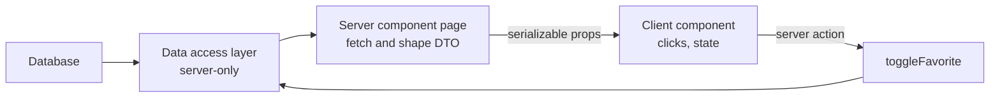

**Pros:**
- Less JavaScript in the browser, no loading spinners for initial data.
- Clear rule: "data on the server, interaction on the client".

**Cons / limits:**
- Props crossing the boundary must be serializable: no functions (except server actions), no class instances, `Date` is fine but `Map`, `Decimal` from Prisma and similar need conversion.
- Hooks-based containers (`useQuery` inside a client container) are still valid when data must refresh live on the client.

**Use it when / avoid when:**
- Use it for almost every page in the App Router.
- Avoid forcing it on heavily interactive widgets (a live trading ticket); there a client container with TanStack Query is often cleaner.

### Compound components

**What it is:** A group of components that work together and share hidden state through context, like `<select>` and `<option>`. The parent owns state; the children read it. The user arranges the pieces freely.

**Why it's used:** A `Tabs` component with props like `tabs={[{label, content, icon, badge}]}` breaks every time a team needs something new in a tab. Compound components let teams arrange and decorate parts without new props.

**How it works:**

```tsx
'use client';
import { createContext, useContext, useState, type ReactNode } from 'react';

const TabsContext = createContext<{ value: string; setValue: (v: string) => void } | null>(null);
const useTabs = () => {
  const ctx = useContext(TabsContext);
  if (!ctx) throw new Error('Tabs parts must be used inside <Tabs>');
  return ctx;
};

export function Tabs({ defaultValue, children }: { defaultValue: string; children: ReactNode }) {
  const [value, setValue] = useState(defaultValue);
  return <TabsContext.Provider value={{ value, setValue }}>{children}</TabsContext.Provider>;
}
export const TabsList = ({ children }: { children: ReactNode }) => <div role="tablist">{children}</div>;
export function TabsTrigger({ value, children }: { value: string; children: ReactNode }) {
  const t = useTabs();
  return <button role="tab" aria-selected={t.value === value} onClick={() => t.setValue(value)}>{children}</button>;
}
export function TabsPanel({ value, children }: { value: string; children: ReactNode }) {
  return useTabs().value === value ? <div role="tabpanel">{children}</div> : null;
}
// usage: <Tabs defaultValue="activity"><TabsList><TabsTrigger value="activity">Activity</TabsTrigger>...</TabsList>
//        <TabsPanel value="activity"><ActivityFeed /></TabsPanel></Tabs>
```

**Pros:**
- Flexible layout with no prop explosion. Reads like HTML.
- State and accessibility wiring live in one place.

**Cons / limits:**
- Context means the parent must be a client component. Server components can still be passed in as `children` of the panels.
- Dot syntax (`Tabs.Trigger`) on a client component can break when used from a server component, because a client module reference is not a plain object; export named parts (`TabsTrigger`) as shadcn/ui does.
- Real keyboard support (arrow keys, roving tabindex) is a lot of work; use Radix for production.

**Use it when / avoid when:**
- Use it for UI with several coordinated parts: tabs, accordions, menus, steppers, cards.
- Avoid it for a simple leaf (a badge) where two props are enough.

### Headless components and hooks

**What it is:** A library that gives you behaviour, state and accessibility, but no styles or markup opinions. You bring the HTML and CSS. Radix Primitives (and Base UI) give unstyled components; TanStack Table gives table logic with no table markup; Downshift pioneered hooks like `useCombobox` that return prop getters.

**Why it's used:** Behaviour (focus traps, ARIA, keyboard navigation, sorting, pagination) is hard and the same everywhere. Looks differ per brand. Headless separates the two, so your design system owns the look while the library owns correctness.

**How it works:** The "prop getter" idea: the hook returns functions that produce the props you spread on your own elements.

```tsx
'use client';
import { useReactTable, getCoreRowModel, getSortedRowModel, flexRender, type ColumnDef, type SortingState } from '@tanstack/react-table';
import { useState } from 'react';

type Txn = { id: string; date: string; description: string; amountCents: number };

const columns: ColumnDef<Txn>[] = [
  { accessorKey: 'date', header: 'Date' },
  { accessorKey: 'description', header: 'Description' },
  { accessorKey: 'amountCents', header: 'Amount', cell: (c) => formatMoney(c.getValue<number>()) },
];

export function TxnTable({ data }: { data: Txn[] }) {
  const [sorting, setSorting] = useState<SortingState>([]);
  const table = useReactTable({ data, columns, state: { sorting }, onSortingChange: setSorting,
    getCoreRowModel: getCoreRowModel(), getSortedRowModel: getSortedRowModel() });

  // You own the markup: plain <table>, a div grid, or a virtualized list
  return (
    <table className="w-full text-sm">
      <thead>{table.getHeaderGroups().map((hg) => (
        <tr key={hg.id}>{hg.headers.map((h) => (
          <th key={h.id} onClick={h.column.getToggleSortingHandler()}>{flexRender(h.column.columnDef.header, h.getContext())}</th>
        ))}</tr>
      ))}</thead>
      <tbody>{table.getRowModel().rows.map((r) => (
        <tr key={r.id}>{r.getVisibleCells().map((c) => <td key={c.id}>{flexRender(c.column.columnDef.cell, c.getContext())}</td>)}</tr>
      ))}</tbody>
    </table>
  );
}
// formatMoney(cents) = Intl.NumberFormat currency formatting of cents / 100
```

**Pros:**
- Accessibility and edge cases solved by specialists.
- Full control over markup and styling; fits any design system.

**Cons / limits:**
- More code to write than a styled kit. Someone must build the styled layer.
- You can still break accessibility by spreading props on the wrong element.

**Use it when / avoid when:**
- Use it when you own a design system or have strong brand requirements.
- Avoid it for an internal tool where a styled kit (or shadcn/ui, which is a styled layer over headless primitives) is enough.

### Slots and children-as-props

**What it is:** Instead of one `children`, a component takes several named "holes" as props: `header`, `actions`, `empty`, `footer`. Each slot accepts any `ReactNode`. Next.js layouts use the same idea with parallel routes (`@modal`, `@sidebar`), which arrive as props on the layout.

**Why it's used:** The component keeps control of layout and spacing while callers decide what goes in each region. It is also the main trick for mixing server and client components: a client component can render server components passed in as props.

**How it works:**

```tsx
// A client shell that needs state (collapsible), but its content stays server-rendered
'use client';
import { useState, type ReactNode } from 'react';

export function Panel({ title, actions, children }: { title: ReactNode; actions?: ReactNode; children: ReactNode }) {
  const [open, setOpen] = useState(true);
  return (
    <section className="rounded border">
      <header className="flex items-center justify-between p-3">
        <button onClick={() => setOpen((o) => !o)} aria-expanded={open}>{title}</button>
        {actions}
      </header>
      {open && <div className="p-3">{children}</div>}
    </section>
  );
}

// page.tsx (server)
<Panel title="Recent payments" actions={<ExportButton />}>
  <RecentPayments /> {/* async server component, rendered on the server */}
</Panel>
```

**Pros:**
- Layout consistency with caller flexibility.
- Lets server components live inside client shells.

**Cons / limits:**
- Too many slots becomes a configuration object again.
- Slots cannot easily receive state from the parent; use render props or context for that.

**Use it when / avoid when:**
- Use it for layout components (page headers, cards, dialogs, empty states).
- Avoid it when the content needs the parent's internal state; use compound components instead.

### Render props (when still useful)

**What it is:** A prop that is a function returning UI: the component calls it with some internal state. `children` can be that function too.

**Why it's used:** Before hooks, it was the main way to share logic. Today hooks replace most uses, but render props are still the right tool when a component must hand per-item or measured state to caller-defined markup: virtualized lists (`renderRow`), form field wrappers, `react-hook-form`'s `<Controller render={...}>`, headless comboboxes.

**How it works:**

```tsx
type ListProps<T> = { items: T[]; renderItem: (item: T, index: number) => React.ReactNode; empty?: React.ReactNode };

export function List<T>({ items, renderItem, empty = 'Nothing here' }: ListProps<T>) {
  if (items.length === 0) return <p>{empty}</p>;
  return <ul>{items.map((it, i) => <li key={i}>{renderItem(it, i)}</li>)}</ul>;
}

<List items={payments} renderItem={(p) => <PaymentRow payment={p} />} />
```

**Pros:**
- Caller controls markup while the component controls behaviour and iteration.
- Works with generics for type-safe items.

**Cons / limits:**
- Functions cannot cross from server to client components as props, so the parent and the component must both be client side (or both server).
- Deep nesting of render props becomes hard to read.

**Use it when / avoid when:**
- Use it for per-item rendering and when the component owns state the markup needs.
- Avoid it for sharing logic only; write a custom hook.

### Custom hooks as a pattern

**What it is:** A function starting with `use` that bundles state, effects and other hooks into one reusable unit of behaviour. It is the main way React shares logic.

**Why it's used:** A client component with three `useEffect`s, two `useState`s and a debounce is hard to read. Moving that into `useDebouncedSearch()` gives it a name, a test, and reuse.

**How it works:**

```ts
'use client';
import { useEffect, useState } from 'react';

export function useDebouncedValue<T>(value: T, delayMs = 300): T {
  const [debounced, setDebounced] = useState(value);
  useEffect(() => {
    const t = setTimeout(() => setDebounced(value), delayMs);
    return () => clearTimeout(t);
  }, [value, delayMs]);
  return debounced;
}

// Feature hook: composes library hooks into a domain API
export function usePayeeSearch(term: string) {
  const q = useDebouncedValue(term, 250);
  return useQuery({
    queryKey: ['payees', q],
    queryFn: ({ signal }) => fetch(`/api/payees?q=${encodeURIComponent(q)}`, { signal }).then((r) => r.json()),
    enabled: q.length >= 2,
  });
}
```

**Pros:**
- Components become mostly markup. Logic is testable with `renderHook`.
- Domain hooks (`usePayeeSearch`) hide which library you use.

**Cons / limits:**
- Only usable in client components.
- A hook that returns 15 values is a god object; split it.

**Use it when / avoid when:**
- Use it whenever logic repeats or a component's top half is all hooks.
- Avoid wrapping a single `useState` in a hook just for the sake of it.

### Controlled vs uncontrolled, and the state reducer pattern

**What it is:** A **controlled** component gets its value from props and reports changes (`value` + `onChange`); the parent owns the state. An **uncontrolled** component keeps its own state (`defaultValue`); the parent reads it when needed (refs, `FormData`). The **state reducer** pattern lets a caller intercept and change every internal state transition without taking full control.

**Why it's used:** A good reusable component supports both: easy uncontrolled use for 90% of callers, controlled use when a parent must sync state (URL, form library). State reducer handles the rare case "keep the menu open after selecting an item" without adding a `keepOpenOnSelect` prop.

**How it works:**

```ts
'use client';
import { useCallback, useState } from 'react';

// Supports both controlled and uncontrolled usage
export function useControllableState<T>({ value, defaultValue, onChange }: { value?: T; defaultValue: T; onChange?: (v: T) => void }) {
  const [internal, setInternal] = useState(defaultValue);
  const isControlled = value !== undefined;
  const current = isControlled ? value : internal;
  const setValue = useCallback((next: T) => {
    if (!isControlled) setInternal(next);
    onChange?.(next);
  }, [isControlled, onChange]);
  return [current, setValue] as const;
}

// State reducer: caller can override transitions
type MenuState = { open: boolean };
type MenuAction = { type: 'toggle' } | { type: 'close' } | { type: 'select'; id: string };
export const menuReducer = (s: MenuState, a: MenuAction): MenuState =>
  a.type === 'toggle' ? { open: !s.open } : { open: false };

export function useMenu({ stateReducer = menuReducer } = {}) {
  const [state, setState] = useState<MenuState>({ open: false });
  return { ...state, dispatch: (a: MenuAction) => setState((s) => stateReducer(s, a)) };
}
// Caller keeps the menu open on select, default behaviour otherwise
useMenu({ stateReducer: (s, a) => (a.type === 'select' ? s : menuReducer(s, a)) });
```

**Pros:**
- One component serves simple and advanced callers.
- State reducer gives "escape hatches" without prop explosion.

**Cons / limits:**
- Switching between controlled and uncontrolled during a component's life causes bugs (React warns for inputs).
- State reducer is advanced; document it or most teams will not discover it.

**Use it when / avoid when:**
- Use controllable state for every reusable input, select, dialog `open`, tabs `value`.
- Avoid state reducer in app-level components; it belongs in shared libraries.

> **Gotcha:** For money inputs, keep the canonical value as integer `amountCents` in state and format only for display. Controlled inputs that store formatted strings lose the cursor position and introduce rounding bugs.

### Polymorphic `as` and `asChild`

**What it is:** Ways to let a component render as a different element. `as="a"` swaps the tag (`<Button as="a" href="...">`). `asChild` (Radix's `Slot`) merges the component's props and behaviour onto its single child: `<Button asChild><Link href="/pay">Pay</Link></Button>`.

**Why it's used:** A design system button must sometimes be a link (navigation) and sometimes a button (action). Semantics matter for accessibility: a link that looks like a button is still a link.

**How it works:**

```tsx
import { Slot } from '@radix-ui/react-slot';
import Link from 'next/link';
import { forwardRef, type ButtonHTMLAttributes } from 'react';

type ButtonProps = ButtonHTMLAttributes<HTMLButtonElement> & { asChild?: boolean };

export const Button = forwardRef<HTMLButtonElement, ButtonProps>(({ asChild, className, ...props }, ref) => {
  const Comp = asChild ? Slot : 'button';
  return <Comp ref={ref} className={cn('inline-flex items-center rounded px-3 py-2', className)} {...props} />;
});
Button.displayName = 'Button';
// usage: <Button asChild><Link href="/payments/new">New payment</Link></Button>
```

**Pros:**
- `asChild` keeps types simple (no generic gymnastics) and composes with any component, including Next.js `Link`.
- Correct semantics with consistent styling.

**Cons / limits:**
- `as` with full type safety requires complex generics and slows the TypeScript compiler on big unions.
- `asChild` requires exactly one child that forwards refs and spreads props.
- In React 19, `ref` is a regular prop for function components, so `forwardRef` is no longer required in new code; existing libraries still use it.

**Use it when / avoid when:**
- Use `asChild` in design-system primitives (Button, Tooltip trigger, Dialog trigger).
- Avoid polymorphism on app-level components; just render the right element.

### Provider pattern

**What it is:** A component that puts a value into React context so any descendant can read it without prop drilling: theme, current user, feature flags, query client, toasts.

**Why it's used:** Some values are truly app-wide. Passing `user` through ten layers is noise and couples every layer.

**How it works:** In the App Router, providers are client components. Create one `Providers` file and render it in the root layout, wrapping `children`. Server components inside still render on the server; the provider only wraps them.

```tsx
// app/providers.tsx
'use client';
import { QueryClient, QueryClientProvider } from '@tanstack/react-query';
import { NuqsAdapter } from 'nuqs/adapters/next/app';
import { useState, type ReactNode } from 'react';

export function Providers({ children }: { children: ReactNode }) {
  const [queryClient] = useState(() => new QueryClient({ defaultOptions: { queries: { staleTime: 30_000 } } }));
  return (
    <QueryClientProvider client={queryClient}>
      <NuqsAdapter>{children}</NuqsAdapter>
    </QueryClientProvider>
  );
}
// app/layout.tsx (server) renders: <html lang="en"><body><Providers>{children}</Providers></body></html>
```

**Pros:**
- No prop drilling for cross-cutting values.
- Easy to swap in tests (wrap with a test provider).

**Cons / limits:**
- Every consumer re-renders when the context value changes. Put fast-changing state in Zustand or split contexts.
- Provider pyramids in the root layout hide dependencies. Keep providers as low in the tree as possible.
- Server components cannot read context. Pass server data as props or read it again on the server (cached).

**Use it when / avoid when:**
- Use it for stable, cross-cutting values (theme, session, query client, i18n).
- Avoid it for frequently changing state or data that only one subtree uses.

### Higher-order components (legacy)

**What it is:** A function that takes a component and returns a new one with extra behaviour: `withAuth(Dashboard)`, Redux's old `connect()`.

**Why it's used:** Before hooks it was the main reuse tool. You will still meet it in older codebases and in a few libraries.

**How it works:** `const withFeature = (flag, C) => (props) => (useFlag(flag) ? <C {...props} /> : null);` The wrapper reads something (a flag, the store) and injects props or blocks rendering.

**Pros:**
- Wraps components you do not own without editing them.

**Cons / limits:**
- Hidden props, name collisions, "wrapper hell" in DevTools, hard typing.
- Auth via HOC on the client is not security; the server must check too.

**Use it when / avoid when:**
- Use it rarely: wrapping third-party components, or migration shims.
- Avoid it for new code: use hooks, server checks in layouts/DAL, or composition.

> **Outdated:** `withAuth(Page)` client HOCs from the Pages Router era. In the App Router, check the session on the server in the data access layer and in the layout or page, and redirect there.

### Variants with cva and tailwind-merge

**What it is:** `class-variance-authority` (cva) defines a component's visual variants (intent, size, state) as a typed map of Tailwind classes. `tailwind-merge` resolves conflicts when callers pass extra classes (`px-2` plus `px-4` becomes `px-4`). Together with `clsx` they form the `cn()` helper shadcn/ui popularised.

**Why it's used:** Without it, buttons accumulate string concatenation and ternaries, and a caller's `className="px-6"` silently loses to the component's `px-3` because of CSS order, not intent.

**How it works:**

```ts
// lib/cn.ts
import { clsx, type ClassValue } from 'clsx';
import { twMerge } from 'tailwind-merge';
export const cn = (...inputs: ClassValue[]) => twMerge(clsx(inputs));
```

```tsx
import { cva, type VariantProps } from 'class-variance-authority';

export const buttonVariants = cva(
  'inline-flex items-center justify-center rounded-md font-medium focus-visible:outline-2 disabled:opacity-50',
  {
    variants: {
      intent: { primary: 'bg-primary text-primary-foreground', danger: 'bg-red-600 text-white', ghost: 'bg-transparent' },
      size: { sm: 'h-8 px-3 text-sm', md: 'h-10 px-4', lg: 'h-12 px-6 text-lg' },
    },
    compoundVariants: [{ intent: 'danger', size: 'lg', className: 'font-semibold' }],
    defaultVariants: { intent: 'primary', size: 'md' },
  },
);

type Props = React.ButtonHTMLAttributes<HTMLButtonElement> & VariantProps<typeof buttonVariants>;
export function Button({ intent, size, className, ...rest }: Props) {
  return <button className={cn(buttonVariants({ intent, size }), className)} {...rest} />;
}
```

**Pros:**
- Variants are typed: `intent="dangerous"` is a compile error.
- Callers can override safely; conflicts resolve predictably.

**Cons / limits:**
- `tailwind-merge` has a runtime cost (small, cached) and must match your Tailwind version (v3 for Tailwind v4).
- Custom classes from a Tailwind config may need `extendTailwindMerge` to be recognised.

**Use it when / avoid when:**
- Use it for every design-system component with more than one look.
- Avoid letting feature code invent ad-hoc variants; add them to the cva map.

### Design-system layering: primitives, components, features, pages

**What it is:** A rule for where code lives and what it may import. **Primitives** (Radix wrappers, Button, Input, tokens) know nothing about the business. **Components** compose primitives into generic UI (DataTable, DateRangePicker, MoneyInput). **Features** combine components with domain logic and data (PaymentForm, AccountSwitcher). **Pages/routes** assemble features. Imports only point downwards.

**Why it's used:** Without layers, a Button imports the user session "just for this one case" and the whole design system becomes impossible to reuse in the second app.

**How it works:**

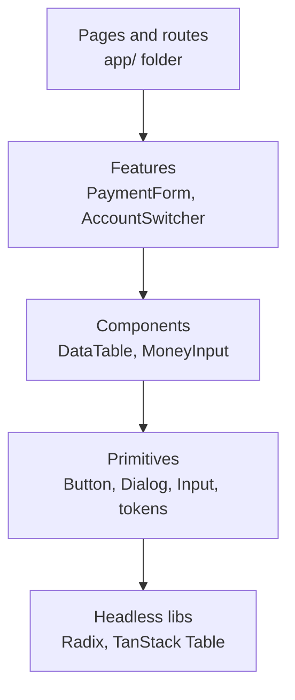

Enforce it with tooling, not hope: separate packages in a monorepo (`@acme/ui`, `@acme/features-payments`), or ESLint rules (`eslint-plugin-boundaries`, `import/no-restricted-paths`) that forbid `components/` importing from `features/`.

**Pros:**
- Primitives and components are reusable across apps and teams.
- Clear ownership: design-system team owns the bottom two layers.

**Cons / limits:**
- Needs discipline and lint rules; the pressure to "just import it" is constant.
- Over-abstraction in the components layer (a DataTable with 80 props) is the opposite failure.

**Use it when / avoid when:**
- Use it once you have more than one app or more than one team.
- Avoid heavy layering in a prototype; a single `components/` folder is fine at first.

#### Q: [Senior] You inherit a 900-line `Dashboard.tsx` with 14 `useState`s, 6 `useEffect`s and three fetches. Nobody wants to touch it. What is your refactor plan?

**Short answer:** I would not rewrite it in one go. First I add tests and measurements around current behaviour, then extract in small, safe steps: pure helpers, then custom hooks, then presentational pieces, then move data fetching to server components so most of the file disappears. Each step is a separate, reviewable PR that ships.

**Clarify first:** Is it Pages Router or App Router? Which parts change most often (git log tells me)? Are there tests? Which bugs are open against it? Is there a deadline pushing new features into it right now? Who owns it?

**Diagnose:**
- `git log --follow -p Dashboard.tsx` and blame: which sections churn most. Refactor those first; leave stable parts alone.
- Map the state: list every `useState` and which JSX reads it. Usually you find clusters (filters, chart, modal state) that never interact.
- Find derived state stored as state (`const [total, setTotal]` updated in an effect from `transactions`); those are bugs waiting to happen.
- React DevTools Profiler: does every keystroke in the filter input re-render the chart? That tells you which splits also buy performance.

**Solution:**

##### Step 0: safety net
Write a few Testing Library tests for the user-visible behaviour (filters change the list, the modal opens, totals show). Add a Playwright smoke test. These must stay green through every step.

##### Step 1: delete derived state and extract pure functions
```ts
// before: const [total, setTotal] = useState(0); useEffect(() => setTotal(sum(txns)), [txns]);
const total = sumCents(txns); // after: derive during render, pure and testable
```

##### Step 2: group state into hooks by concern
`useDashboardFilters()` (move filters into the URL with nuqs so they are shareable), `useTransferModal()`, `useChartRange()`.

##### Step 3: extract presentational components
`<KpiRow>`, `<SpendingChart>`, `<RecentTransactions>`, each receiving props. The dashboard becomes a composition.

##### Step 4: move fetching to the server
Each widget becomes an async server component wrapped in its own `<Suspense>` and error boundary, so one slow API does not block the page.

```tsx
// app/(app)/dashboard/page.tsx
export default async function DashboardPage({ searchParams }: { searchParams: Promise<Record<string, string | string[] | undefined>> }) {
  const filters = dashboardFiltersCache.parse(await searchParams); // nuqs server cache
  return (
    <DashboardLayout filters={<DashboardFilters />}>
      <Suspense fallback={<KpiSkeleton />}><KpiRow filters={filters} /></Suspense>
      <Suspense fallback={<ChartSkeleton />}><SpendingChart filters={filters} /></Suspense>
      <Suspense fallback={<TableSkeleton />}><RecentTransactions filters={filters} /></Suspense>
    </DashboardLayout>
  );
}
```

**Trade-offs:** Incremental refactors take longer in calendar time than a rewrite looks like it will, but each step ships and can be reverted. A rewrite freezes features and usually loses undocumented behaviour. Moving filters to the URL changes behaviour (back button now works differently); confirm with product.

**What interviewers listen for:**
- Tests before refactoring, and small reversible steps.
- Using churn data to prioritise, not refactoring for beauty.
- Recognising derived state and "state that belongs in the URL or server".
- Red flag: "I'd rewrite it from scratch in a week."

#### Q: [Staff] Twelve product teams each built their own data table. You are asked to design one reusable `DataTable`. How do you design its API so it does not become an 80-prop monster?

**Short answer:** Build it in layers: TanStack Table (headless logic) at the bottom, a styled, composable `DataTable` in the design system, and thin feature-specific wrappers per team. Expose a small opinionated API for the common case, and escape hatches (column defs, render functions, controlled state) for the rest. Server-side pagination, sorting and filtering are first-class, because real tables are big.

**Clarify first:** What do the 12 tables have in common (sorting, pagination, selection, export)? Data sizes: hundreds or 200k rows? Server-side or client-side operations? Is there a design system already? Who will maintain it, and how will teams contribute? Accessibility requirements?

**Diagnose:** Audit the existing tables. Make a spreadsheet: features each uses, row counts, server vs client operations, custom cells. Usually 80% need the same five features, and 3 tables have truly special needs (inline editing, grouping, virtualisation).

**Solution:**

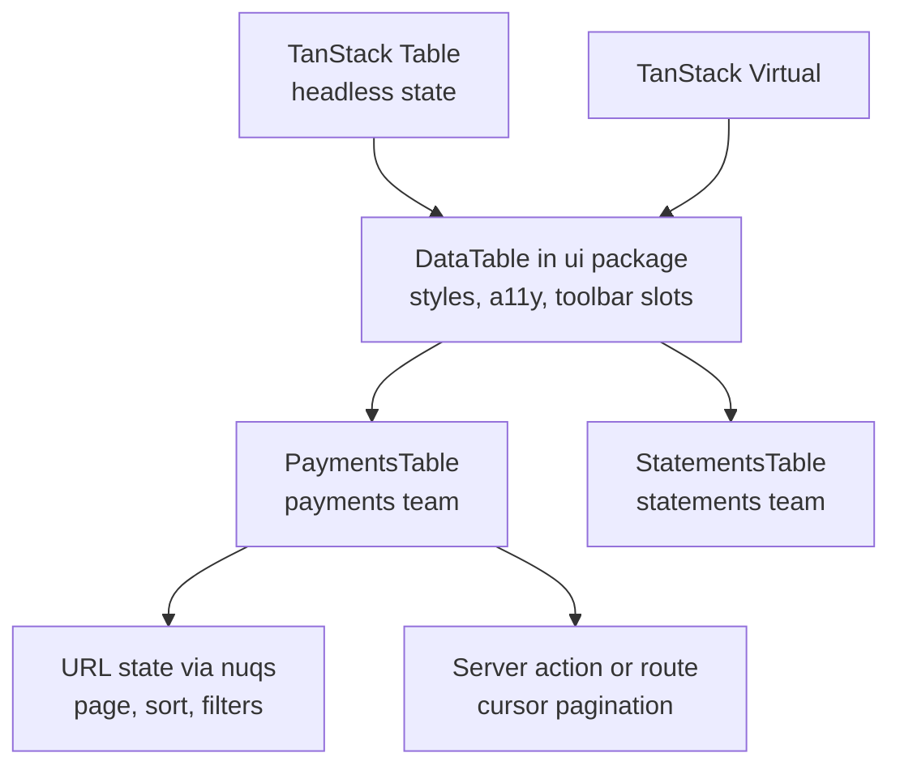

```tsx
'use client';
import type { ColumnDef, SortingState, PaginationState, RowSelectionState, OnChangeFn } from '@tanstack/react-table';

export type DataTableProps<TData> = {
  columns: ColumnDef<TData, unknown>[];
  data: TData[];
  getRowId: (row: TData) => string;
  // controlled server-side state; omit for client-side mode
  rowCount?: number;
  sorting?: SortingState;
  onSortingChange?: OnChangeFn<SortingState>;
  pagination?: PaginationState;
  onPaginationChange?: OnChangeFn<PaginationState>;
  rowSelection?: RowSelectionState;
  onRowSelectionChange?: OnChangeFn<RowSelectionState>;
  // slots
  toolbar?: React.ReactNode;
  emptyState?: React.ReactNode;
  isLoading?: boolean;
};
```

Usage as composition, not props:

```tsx
<DataTable
  columns={paymentColumns}
  data={page.items}
  getRowId={(p) => p.id}
  rowCount={page.total}
  sorting={sorting} onSortingChange={setSorting}
  pagination={pagination} onPaginationChange={setPagination}
  toolbar={<DataTableToolbar><SearchInput /><StatusFilter /><ExportButton /></DataTableToolbar>}
  emptyState={<EmptyPayments />}
/>
```

Rules that keep it healthy:
- Column definitions are the extension point. New cell types go into a shared `cells/` library (MoneyCell, DateCell, StatusBadgeCell), not new props.
- If a feature is needed by only one team, they compose it outside via slots or column defs. It enters the core only when 3+ teams need it.
- Ship a Storybook with every mode and a visual regression test.
- Version it in the monorepo, with codemods for breaking changes.

**Trade-offs:** A thin wrapper over TanStack Table means teams must learn its column API (a real learning curve). A fully abstracted table is easier to start with but blocks every unusual need. Supporting both client and server modes doubles the testing matrix.

**What interviewers listen for:**
- Audit first, design from real usage.
- Headless core, controlled state, slots, column defs as extension points.
- Governance: contribution model, "rule of three" for adding to core, versioning.
- Red flag: one config object with every possible option.

#### Q: [Senior] The same Next.js app must be sold white-label to three banks, each with its own colours, logo, fonts and a few different features. How do you structure theming?

**Short answer:** Put brand differences in data, not code: design tokens as CSS variables resolved per tenant on the server, a tenant config (logo, fonts, feature toggles) loaded by host name, and components that only reference tokens. Avoid `if (tenant === 'bankA')` in components.

**Clarify first:** How many tenants now and later? Are differences only visual or also behavioural? Separate domains per bank? Must each bank pass its own accessibility audit (contrast)? Static build per tenant or one deployment for all?

**Diagnose:** Grep for hardcoded colours (`#`, `bg-blue-600`) and tenant checks. Count how many components hardcode brand values. That is your migration list.

**Solution:**

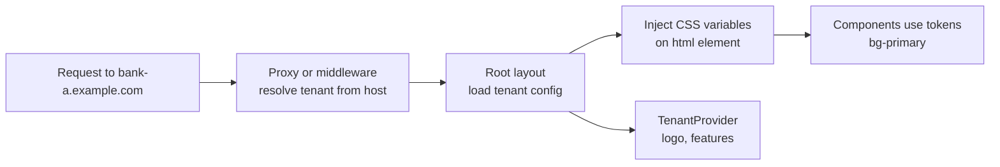

```tsx
// app/layout.tsx
import { headers } from 'next/headers';
import { getTenantByHost } from '@/server/tenants';

export default async function RootLayout({ children }: { children: React.ReactNode }) {
  const host = (await headers()).get('host') ?? '';
  const tenant = await getTenantByHost(host); // cached lookup
  const style = { '--primary': tenant.tokens.primary, '--radius': tenant.tokens.radius } as React.CSSProperties;

  return (
    <html lang={tenant.locale} style={style} data-tenant={tenant.slug}>
      <body className={tenant.fontClassName}>
        <TenantProvider value={{ slug: tenant.slug, logoUrl: tenant.logoUrl, features: tenant.features }}>
          {children}
        </TenantProvider>
      </body>
    </html>
  );
}
```

With Tailwind v4, map tokens once in CSS (`@theme inline { --color-primary: hsl(var(--primary)); }`) so `bg-primary` reads the variable. Behaviour differences go through feature flags keyed by tenant, not branches in components. Validate each tenant's token set for WCAG contrast in CI.

**Trade-offs:** Runtime tokens via `headers()` make the layout dynamic (no full static rendering); if tenants are few, building per tenant or using a route segment like `/[tenant]` with static params keeps pages static. Per-tenant builds multiply CI time.

**What interviewers listen for:**
- Tokens and configuration instead of conditionals.
- Server-side resolution to avoid a flash of the wrong brand.
- Contrast checks per tenant, fonts loaded with `next/font`.
- Red flag: copying the codebase per customer.

## 2. Next.js app architecture

### Feature-based folders and colocation

**What it is:** Group code by business feature (`features/payments`, `features/accounts`) instead of by technical type (`components/`, `hooks/`, `utils/` at the root). Keep the `app/` folder thin: routes import from features. Colocate files that change together (component, test, story, schema) in the same folder.

**Why it's used:** In a type-based layout, a change to "payments" touches six folders. Feature folders make ownership obvious, make deletion safe ("delete the folder"), and map to teams.

**How it works:**

```text
src/
  app/                         # routing only: layouts, pages, route handlers
    (marketing)/page.tsx
    (app)/payments/page.tsx    # imports from features/payments
    api/webhooks/stripe/route.ts
  features/
    payments/
      components/              # PaymentForm, PaymentsTable
      actions.ts               # 'use server' entry points
      data.ts                  # read queries (server-only)
      service.ts               # business rules
      repository.ts            # DB access
      schemas.ts               # Zod schemas shared by form and action
      index.ts                 # public API of the feature
  components/ui/               # design-system primitives (shadcn)
  lib/                         # cn, formatters, env
  server/                      # db client, auth, logger (server-only)
```

Colocation rules: private folders (`_components`) and route groups (`(app)`) inside `app/` are allowed and do not create URLs. A file used by one route lives next to it; it moves up to `features/` when a second route needs it, and to `components/ui` when a second feature needs it.

**Pros:**
- Ownership, easy navigation, safe deletion.
- Features expose a small `index.ts`; internals stay private (enforce with lint rules).

**Cons / limits:**
- Shared concepts (a `Money` type) need a clear home (`lib/` or a `shared` package) or they get duplicated.
- Barrel files (`index.ts` re-exporting everything) can hurt tree-shaking and accidentally pull server code into client bundles; keep separate entry points for client and server exports.

**Use it when / avoid when:**
- Use it from the start for any app with more than a handful of routes.
- Avoid deep nesting (`features/payments/components/form/fields/amount/...`); two or three levels is enough.

### Server/client boundary placement: push `'use client'` to the leaves

**What it is:** `'use client'` marks a module as an entry into the client bundle: it and everything it imports become client code. Placing it at the top of a page makes the whole page client-rendered JavaScript. Placing it on small interactive leaves keeps the rest on the server.

**Why it's used:** Less JavaScript shipped, faster hydration, secrets and heavy libraries (markdown parsers, date libraries used only for formatting) stay on the server.

**How it works:**

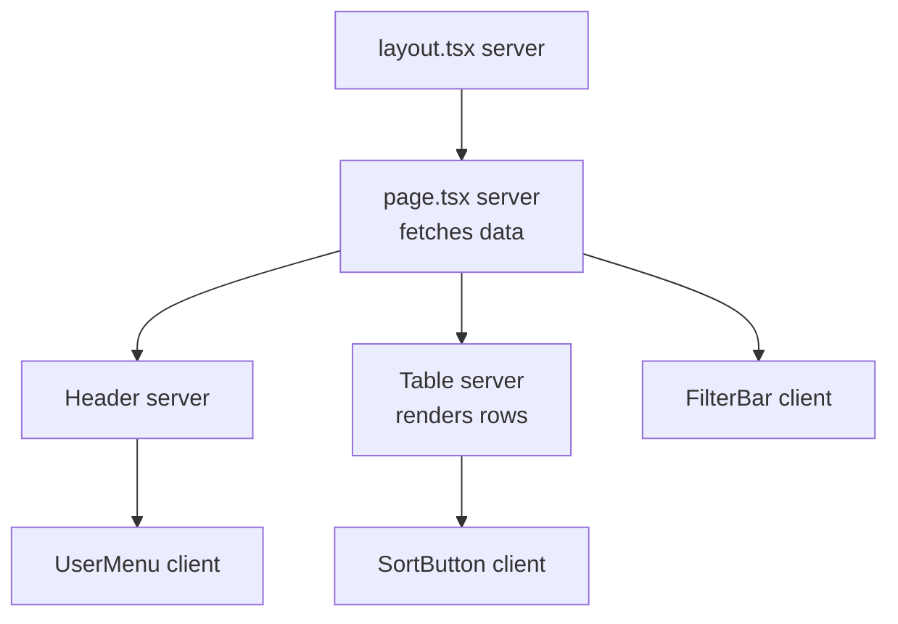

- Server components can import client components. Client components cannot import server components, but can receive them as `children` or other props.
- Mark server-only modules with `import 'server-only'` so an accidental client import fails the build.
- Props from server to client must be serializable.

**Pros:**
- Smaller bundles, data fetching close to the database, safer secrets.

**Cons / limits:**
- Thinking about the boundary is a new skill; mistakes show as build errors or surprising bundle size.
- Context providers and many libraries (charts, forms) are client-only, so their wrappers are client components.

**Use it when / avoid when:**
- Use it always: default to server, opt into client per interactive leaf.
- Avoid adding `'use client'` to a file just because an error mentioned hooks; find the smallest piece that needs them.

### Data access layer, service layer and repository

**What it is:** Three server-side layers. The **repository** talks to the database (Prisma/Drizzle queries) and nothing else. The **service** holds business rules (limits, state transitions, permissions that depend on data). The **data access layer (DAL)** is the entry point that pages and actions call: it checks the session and authorisation, calls services or repositories, and returns DTOs. Next.js's own security guidance recommends a DAL for App Router apps.

**Why it's used:** Without it, Prisma calls are scattered in pages, actions and route handlers, each with its own (or missing) auth check. With it, there is one place to check "can this user see this account?" and one place to change a query.

**How it works:**

```ts
// server/dal/session.ts
import 'server-only';
import { cache } from 'react';
import { redirect } from 'next/navigation';
import { auth } from '@/server/auth';

export const requireUser = cache(async () => {
  const session = await auth();
  if (!session?.user) redirect('/login');
  return { id: session.user.id, tenantId: session.user.tenantId, role: session.user.role };
});
```

```ts
// features/accounts/repository.ts
import 'server-only';
import { db } from '@/server/db';

export const accountRepo = {
  findByIdForTenant: (id: string, tenantId: string) =>
    db.account.findFirst({ where: { id, tenantId }, include: { owner: true } }),
};
```

```ts
// features/accounts/data.ts  (DAL entry point used by pages)
import 'server-only';
import { notFound } from 'next/navigation';
import { requireUser } from '@/server/dal/session';
import { accountRepo } from './repository';
import { toAccountSummaryDTO } from './dto';

export async function getAccountSummary(id: string) {
  const user = await requireUser();
  const account = await accountRepo.findByIdForTenant(id, user.tenantId);
  if (!account || (account.ownerId !== user.id && user.role !== 'admin')) notFound();
  return toAccountSummaryDTO(account);
}
```

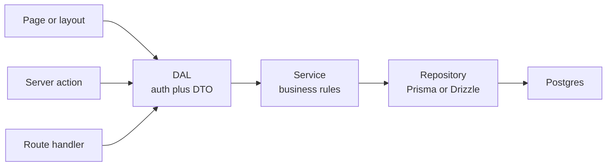

**Pros:**
- One place for auth, one for queries, one for rules. Easy to test services with fake repositories.
- `cache()` from React dedupes calls within one request (calling `requireUser()` in layout and page hits auth once).

**Cons / limits:**
- More files for simple CRUD. For a tiny app, the DAL and repository can be the same file.
- Layouts do not re-render on every navigation, so an auth check only in a layout is not enough; check in the DAL that every page and action uses.

**Use it when / avoid when:**
- Use it in any app with authentication and more than one developer.
- Avoid adding a generic `BaseRepository<T>` abstraction over the ORM; it hides the ORM's useful features and adds nothing.

### DTOs: never leak database models

**What it is:** A Data Transfer Object is a plain object shaped for the consumer. The DAL converts DB rows into DTOs before they reach components, removing secret or internal fields and converting types.

**Why it's used:** Passing a Prisma `user` row to a client component sends every field (password hash, internal flags, `ssnLast4`) to the browser in the RSC payload, even if the component does not render it. DTOs make what leaves the server explicit.

**How it works:**

```ts
// features/accounts/dto.ts
import 'server-only';
import type { Account, User } from '@prisma/client';

export type AccountSummaryDTO = {
  id: string;
  name: string;
  balanceCents: number;
  balanceFormatted: string;
  ownerName: string;
  isFavorite: boolean;
};

export function toAccountSummaryDTO(a: Account & { owner: User }): AccountSummaryDTO {
  return {
    id: a.id,
    name: a.nickname ?? a.productName,
    balanceCents: Number(a.balanceCents), // BigInt is not JSON-safe; check range or use string
    balanceFormatted: new Intl.NumberFormat('en-US', { style: 'currency', currency: a.currency }).format(Number(a.balanceCents) / 100),
    ownerName: a.owner.displayName,
    isFavorite: a.isFavorite,
  };
}
```

**Pros:**
- No accidental data leaks. Stable contracts even when the schema changes.
- Serializable by construction.

**Cons / limits:**
- Mapping code to maintain. Use Prisma `select` or Drizzle column selection to fetch only needed fields as a first line of defence.

**Use it when / avoid when:**
- Use it for every value that crosses into a client component or an API response.
- Avoid it only for internal server-to-server calls where the full model is genuinely needed.

> **Gotcha:** React has experimental taint APIs (`experimental_taintObjectReference`, `experimental_taintUniqueValue`) that throw if a marked object reaches a client component. They are a safety net, not a replacement for DTOs.

### Server actions vs route handlers vs a separate backend (BFF)

**What it is:** Three ways to run server code. **Server actions** (`'use server'` functions) are called from your own React components, mainly for mutations; under the hood they are POST requests to the page. **Route handlers** (`app/api/.../route.ts`) are normal HTTP endpoints with `GET`, `POST` and so on. A **separate backend** (NestJS, Go, Java) runs as its own service; Next.js then acts as a **Backend for Frontend**, calling it from server components and actions.

**Why it's used:** Each fits different callers. Actions give type-safe, form-friendly mutations with almost no boilerplate. Route handlers serve anyone who speaks HTTP: webhooks, mobile apps, third parties, file downloads. A separate backend serves many clients, long-running work, and teams that do not use Next.js.

**How it works:**

| Need | Server action | Route handler | Separate backend |
|---|---|---|---|
| Mutation from your own Next.js UI | Best fit | Works | Via BFF |
| Called by mobile app or partner | No (not a stable public API) | Good | Best fit |
| Webhooks (Stripe, Okta) | No | Best fit | Good |
| Streaming files, CSV export, custom headers | Awkward | Best fit | Good |
| Progressive enhancement (works before JS loads) | Yes with `<form action>` | No | No |
| Long-running jobs, WebSockets | No | Limited on serverless | Best fit |
| Shared by several frontends | No | Possible | Best fit |

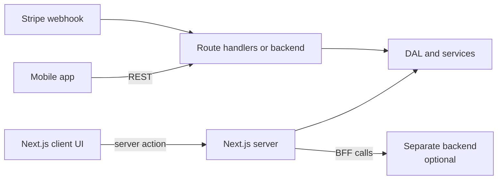

**Pros:** Actions: least code, integrated with `useActionState`, revalidation and redirects. Route handlers: standard HTTP, cacheable GETs. Backend: independent scaling and deploys.

**Cons / limits:** Actions are public POST endpoints: anyone can call them with any arguments, so validate input and check auth inside every action. Actions run one at a time per client (queued), so they are a poor fit for data fetching. A separate backend adds a network hop and another deploy.

**Use it when / avoid when:**
- Use actions for mutations from your own UI; route handlers for external callers; a backend when several clients or heavy processing exist.
- Avoid using server actions to fetch data for client components; use server components, or a route handler with TanStack Query.

### Caching strategy layers

**What it is:** A Next.js app has several caches, each with a different scope: the browser (HTTP cache, TanStack Query cache), the client router cache (visited segments during navigation), the server render and data caches (with `'use cache'`, `fetch` cache options, or `unstable_cache` in older code), request memoisation (`React.cache`, deduped `fetch` within one render), a CDN, and your own data store (Redis, database).

**Why it's used:** Caching is the biggest performance lever, and the biggest source of "why is the data stale?" bugs. Knowing which layer holds what lets you choose freshness per piece of data.

**How it works:**

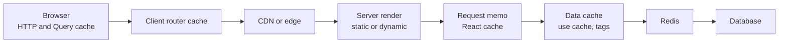

Next.js caching changed across versions, so state the version in interviews. In Next.js 15, `fetch` and GET route handlers are no longer cached by default. Next.js 16 introduced Cache Components (enabled with the `cacheComponents` config): you opt into caching explicitly with the `'use cache'` directive, `cacheLife()` for duration and `cacheTag()` for invalidation, and invalidate with `revalidateTag` / `updateTag` / `revalidatePath`. Check the docs for your exact version; signatures moved between releases.

```ts
// features/rates/data.ts (Next.js 16 with cacheComponents enabled)
import { cacheLife, cacheTag } from 'next/cache';

export async function getFxRates(base: string) {
  'use cache';
  cacheLife('minutes');
  cacheTag('fx-rates');
  const res = await fetch(`https://rates.example.com/latest?base=${base}`);
  return (await res.json()) as Record<string, number>;
}
```

A practical policy for a financial app: public marketing pages static; reference data (FX rates, product catalogue) cached for minutes with tags; per-user balances and transactions never shared-cached, fetched per request and deduped with `React.cache`.

**Pros:** Huge latency and cost savings when used per data type.

**Cons / limits:** Hard to reason about across layers. User-specific data in a shared cache is a data leak. Invalidation must be designed, not added later.

**Use it when / avoid when:**
- Cache public and slow-changing data with explicit tags.
- Avoid caching anything user-specific in shared caches, and avoid caching without an invalidation story.

### Error boundary layout

**What it is:** The App Router turns special files into boundaries: `loading.tsx` (Suspense fallback), `error.tsx` (error boundary, must be a client component), `not-found.tsx` (rendered by `notFound()`), and `global-error.tsx` (catches errors in the root layout). Each applies to its route segment and below.

**Why it's used:** One broken widget should not blank the whole app. Placing boundaries per segment and per widget keeps the shell (navigation, sidebar) usable and lets users retry.

**How it works:**

Typical placement: `app/global-error.tsx` as last resort; `app/(app)/error.tsx` so the shell (nav, sidebar in `(app)/layout.tsx`) survives page errors; `payments/error.tsx` and `payments/loading.tsx` for a feature-specific message and skeleton; `payments/[id]/not-found.tsx` for missing records.


```tsx
// app/(app)/payments/error.tsx
'use client';
export default function PaymentsError({ error, reset }: { error: Error & { digest?: string }; reset: () => void }) {
  return (
    <div role="alert">
      <p>We could not load payments. Reference: {error.digest}</p>
      <button onClick={() => reset()}>Try again</button>
    </div>
  );
}
```

An `error.tsx` does not catch errors in the `layout.tsx` of the same segment; the parent's boundary does. For widget-level isolation inside a page, wrap each widget in `react-error-boundary` plus `<Suspense>`. In production, server error messages are hidden from the client and replaced with a `digest` you can match in logs.

**Pros:** Resilient UI, natural retry, shell stays alive.

**Cons / limits:** Expected errors (validation, "insufficient funds") should not throw; return them as values from actions. Boundaries are for unexpected failures.

**Use it when / avoid when:**
- Use a boundary per major segment and per independently failing widget.
- Avoid one global boundary only; avoid throwing for business errors.

### Monorepo with Turborepo: web, api and shared packages

**What it is:** One repository with several apps (`apps/web` Next.js, `apps/api` NestJS or a worker, `apps/admin`) and shared packages (`packages/ui`, `packages/db`, `packages/validators`, `packages/config`). Turborepo runs tasks in dependency order and caches results locally and remotely.

**Why it's used:** Share types, Zod schemas and UI between the web app, the admin app and the API without publishing npm packages. Change a schema once, and the type checker shows every broken caller in one PR.

**How it works:**

```json
// turbo.json (Turborepo 2.x uses "tasks")
{
  "$schema": "https://turborepo.com/schema.json",
  "tasks": {
    "build": { "dependsOn": ["^build"], "outputs": [".next/**", "!.next/cache/**", "dist/**"] },
    "lint": {},
    "typecheck": { "dependsOn": ["^typecheck"] },
    "dev": { "cache": false, "persistent": true }
  }
}
```

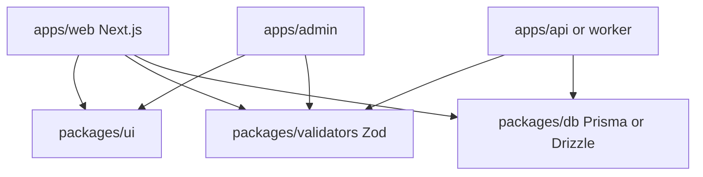

**Pros:** Atomic cross-app changes, shared types, cached CI (only rebuild what changed).

**Cons / limits:** Tooling setup (TypeScript project references or `transpilePackages`, package exports), and one bad shared package can break everyone. Needs ownership rules (CODEOWNERS).

**Use it when / avoid when:**
- Use it when two or more apps share code, or web and API are written in TypeScript by the same org.
- Avoid it for a single app; a well-structured single repo is enough.

#### Q: [Mid] A teammate asks: "Should this 'update profile' feature be a server action or an API route?" How do you decide?

**Short answer:** If only our own Next.js UI calls it, a server action is the default: less code, type-safe, works with forms and revalidation. If a mobile app, a partner, a webhook, or a non-React client must call it, or it needs custom HTTP semantics (caching headers, streaming a file), make it a route handler or a backend endpoint. Either way, the business logic lives in a service both can call.

**Clarify first:** Who calls it now and in a year (mobile app planned)? Does it upload files? Does it need to work without JavaScript? Is there an existing backend that owns this data?

**Solution:**

```ts
// features/profile/actions.ts
'use server';
import { revalidatePath } from 'next/cache';
import { requireUser } from '@/server/dal/session';
import { profileSchema } from './schemas';
import { profileService } from './service';

export type ActionState = { ok: boolean; errors?: Record<string, string[]>; message?: string };

export async function updateProfile(_prev: ActionState, formData: FormData): Promise<ActionState> {
  const user = await requireUser();                       // auth inside the action
  const parsed = profileSchema.safeParse(Object.fromEntries(formData));
  if (!parsed.success) return { ok: false, errors: parsed.error.flatten().fieldErrors };
  await profileService.update(user.id, parsed.data);      // same service a route handler would use
  revalidatePath('/settings/profile');
  return { ok: true, message: 'Saved' };
}
```

If a mobile app arrives later, add `app/api/v1/profile/route.ts` that calls the same `profileService.update`. Nothing is rewritten.

**Trade-offs:** Server actions have unstable, framework-generated endpoints (fine for your UI, wrong for public APIs). Route handlers need manual typing between client and server (or tRPC / OpenAPI). Two entry points mean two places to check auth, which is why the check lives in the DAL/service.

**What interviewers listen for:**
- "Who is the caller?" as the deciding question.
- Business logic in a service, not inside the action or handler.
- Knowing actions are public POST endpoints that need validation and auth.
- Red flag: using server actions for reads from client components.

#### Q: [Mid] The build fails with an error about `fs` or a database driver in the client bundle. A client component imported the Prisma client by accident. How do you fix it and prevent it?

**Short answer:** Find the import chain from the `'use client'` file to the database module, break it by moving the data access behind a server component or server action, and mark server modules with `import 'server-only'` so this fails loudly at build time with a clear message next time.

**Clarify first:** Is the import direct or through a barrel file? Does the client component actually need the data, or only a type?

**Diagnose:**
- The build error shows the import trace. Read it bottom to top: usually `ClientThing.tsx -> features/accounts/index.ts -> repository.ts -> db.ts`.
- Barrel files are the classic cause: the client imported a formatter from `features/accounts` and got the repository too.
- If only a type is needed, `import type { Account } from ...` is erased at compile time and is safe.

**Solution:**

```ts
// server/db.ts
import 'server-only';
import { PrismaClient } from '@prisma/client';
export const db = new PrismaClient();
```

```ts
// features/accounts/index.ts      shared, client-safe exports only
export { formatAccountNumber } from './format';
export type { AccountSummaryDTO } from './types';

// features/accounts/server.ts     server-only entry point
import 'server-only';
export { getAccountSummary } from './data';
```

Then: data comes in as props from a server parent, or through a server action the client calls. Add an ESLint `no-restricted-imports` rule forbidding `@/server/*` and `*/repository` from files containing `'use client'` (or from `components/`), and a CI check on bundle size.

**Trade-offs:** Separate client and server entry points per feature add a file but remove a whole class of bugs. Lint rules have false positives in shared folders; scope them carefully.

**What interviewers listen for:**
- Reading the import trace, recognising barrel files.
- `server-only` as a guard; `import type` for types.
- Prevention through tooling, not code review alone.
- Red flag: "add a webpack fallback for `fs`" (hides the real leak, and may ship secrets).

#### Q: [Senior] Product wants a transaction details modal that opens over the list, but the URL must be shareable: opening the link directly shows a full page, and the back button closes the modal. How do you build it in the App Router?

**Short answer:** Use a parallel route slot (`@modal`) combined with an intercepting route (`(.)transactions/[id]`). On client-side navigation from the list, the intercepted route renders inside the modal slot over the list. On a hard load or refresh, the normal `transactions/[id]/page.tsx` renders as a full page. Closing the modal is `router.back()`.

**Clarify first:** Should the list keep its scroll and filters behind the modal? Is the details view the same component in both cases? Mobile behaviour (sheet vs full page)?

**Solution:**

```text
app/(app)/
  layout.tsx                         # renders {children} and {modal}
  @modal/
    default.tsx                      # returns null when no modal is active
    (.)transactions/[id]/page.tsx    # intercepted: modal version
  transactions/
    page.tsx                         # list
    [id]/page.tsx                    # full page version
```

```tsx
// app/(app)/layout.tsx
export default function AppLayout({ children, modal }: { children: React.ReactNode; modal: React.ReactNode }) {
  return <>{children}{modal}</>;
}
```

```tsx
// app/(app)/@modal/(.)transactions/[id]/page.tsx
import { TransactionDetails } from '@/features/transactions/components/transaction-details';
import { RouteModal } from '@/components/route-modal';
import { getTransaction } from '@/features/transactions/server';

export default async function TxnModal({ params }: { params: Promise<{ id: string }> }) {
  const { id } = await params;
  const txn = await getTransaction(id);
  return <RouteModal title="Transaction"><TransactionDetails txn={txn} /></RouteModal>;
}
```

```tsx
// components/route-modal.tsx
'use client';
import { useRouter } from 'next/navigation';
import * as Dialog from '@radix-ui/react-dialog';

export function RouteModal({ title, children }: { title: string; children: React.ReactNode }) {
  const router = useRouter();
  return (
    <Dialog.Root open onOpenChange={(open) => { if (!open) router.back(); }}>
      <Dialog.Portal>
        <Dialog.Overlay className="fixed inset-0 bg-black/40" />
        <Dialog.Content className="fixed left-1/2 top-1/2 w-full max-w-lg -translate-x-1/2 -translate-y-1/2 rounded bg-background p-6">
          <Dialog.Title>{title}</Dialog.Title>
          {children}
        </Dialog.Content>
      </Dialog.Portal>
    </Dialog.Root>
  );
}
```

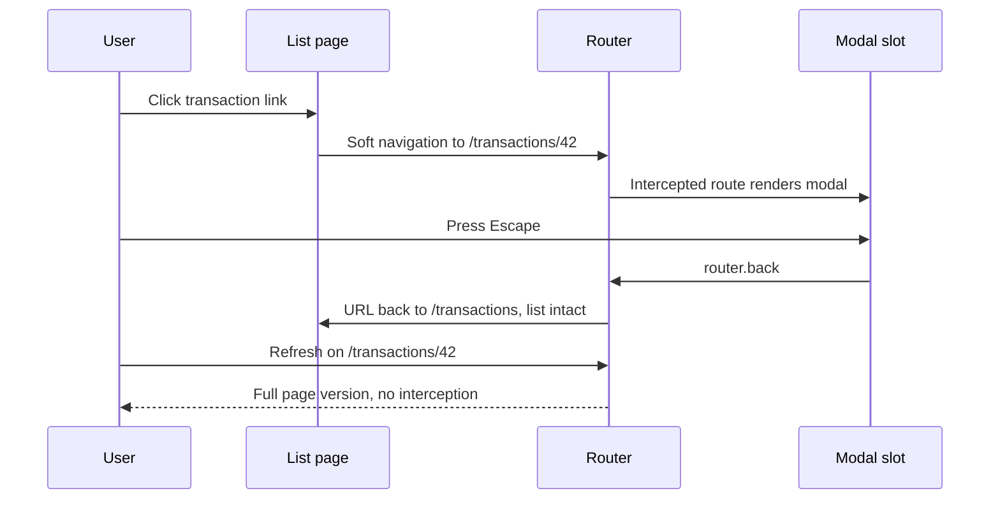

**Trade-offs:** The folder conventions are subtle; `default.tsx` is required for unmatched slots or hard navigation to other routes may 404. Two pages (modal and full) must share one details component. An alternative is a `?txn=42` search param with nuqs: simpler, but the "full page on refresh" behaviour needs custom logic.

**What interviewers listen for:**
- Parallel plus intercepting routes, and why `default.tsx` exists.
- Accessibility: focus trap, Escape, title (Radix Dialog gives this).
- Mentioning the search-param alternative and when it is enough.

#### Q: [Staff] You must migrate a large Pages Router app (120 pages, `getServerSideProps` everywhere, Redux, a custom `_app`) to the App Router without a feature freeze. What is the plan?

**Short answer:** Both routers run side by side in one Next.js app, so migrate route by route, starting with low-risk leaf pages, behind a shared layout and shared design system. First upgrade Next.js and React while staying on Pages, then build the App Router root layout and providers, then move routes in order of value and risk, converting `getServerSideProps` into server components that call a new data access layer.

**Clarify first:** Which pages carry most traffic and revenue? How is auth done (Okta, NextAuth, custom cookies)? How much of Redux is server cache vs real client state? Are there custom `_document` tricks, i18n routing, or a custom server? Deadline and team size?

**Diagnose:** Inventory: list pages with their data function, auth requirement, and libraries that touch `next/router`. Find code that assumes `window` at import time. Measure baseline Web Vitals per route so you can prove improvement.

**Solution:**

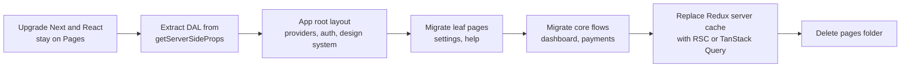

- A route must exist in only one of `pages/` or `app/`; moving a URL is a single PR, easy to roll back.
- Navigation between the two routers is a hard navigation (full page load). Migrate tightly linked routes together, or accept the reload for a while.
- `next/router` becomes `next/navigation` (`useRouter`, `usePathname`, `useSearchParams`). Write a small adapter hook so shared components work in both during the transition.
- `getServerSideProps` logic moves into DAL functions first (usable from both routers), then pages become async server components calling them.
- Redux: most slices are cached server data. Replace those with server components or TanStack Query; keep a small Zustand or Redux store for real client state.
- Track progress on a dashboard: routes migrated, bundle size, LCP and INP per route.

**Trade-offs:** Running two routers means two layout systems and duplicate providers for months. Hard navigations between routers temporarily hurt UX. A big-bang migration is faster on paper but risky and blocks features.

**What interviewers listen for:**
- Incremental, route-by-route, reversible.
- Extracting a data layer first so logic is shared.
- Awareness of the hard-navigation boundary and the router hook change.
- Measuring before and after.

## 3. Backend architecture patterns inside a Next.js full stack

### Layered: controller, service, repository

**What it is:** Server code split into three roles. The **controller** (a server action or route handler) parses input, checks auth and returns a response. The **service** applies business rules. The **repository** reads and writes data. Each calls only the layer below.

**Why it's used:** It keeps HTTP and framework details out of business logic, so the same `transferService.create()` serves a server action, a REST route and a background job.

**How it works:** A route handler as a thin controller:

```ts
// app/api/v1/transfers/route.ts
import { NextResponse } from 'next/server';
import { transferSchema } from '@/features/transfers/schemas';
import { transferService } from '@/features/transfers/service';
import { requireApiUser } from '@/server/dal/api-auth';

export async function POST(req: Request) {
  const user = await requireApiUser(req);
  const parsed = transferSchema.safeParse(await req.json());
  if (!parsed.success) return NextResponse.json({ errors: parsed.error.flatten() }, { status: 422 });
  const result = await transferService.create(user, parsed.data);
  return NextResponse.json(result, { status: 201 });
}
```

**Pros:** Familiar, easy to test services. **Cons / limits:** Services often end up importing the ORM directly, coupling rules to the database.

**Use it when / avoid when:** Use it as the default inside each feature. Avoid adding layers that only pass data through unchanged.

### Hexagonal architecture (ports and adapters)

**What it is:** The core business logic defines **ports** (TypeScript interfaces) for what it needs: `PaymentGateway`, `AccountStore`, `Clock`. **Adapters** implement them: `StripeGateway`, `PrismaAccountStore`, `FakeGateway` for tests. The core never imports Prisma, Stripe or Next.js.

**Why it's used:** Swapping a payment provider, or testing transfer rules without a database, becomes easy. The core is plain TypeScript.

**How it works:**

```ts
// core/ports.ts
export interface AccountStore {
  get(id: string): Promise<{ id: string; balanceCents: number; tenantId: string } | null>;
  applyTransfer(fromId: string, toId: string, amountCents: number, idempotencyKey: string): Promise<{ transferId: string }>;
}
export interface Clock { now(): Date }

// core/transfer.ts  (no framework imports)
export function makeTransfer(deps: { accounts: AccountStore; clock: Clock }) {
  return async (input: { fromId: string; toId: string; amountCents: number; key: string }) => {
    const from = await deps.accounts.get(input.fromId);
    if (!from) throw new DomainError('ACCOUNT_NOT_FOUND');
    if (from.balanceCents < input.amountCents) throw new DomainError('INSUFFICIENT_FUNDS');
    return deps.accounts.applyTransfer(input.fromId, input.toId, input.amountCents, input.key);
  };
}
export class DomainError extends Error { constructor(public code: string) { super(code); } }
```

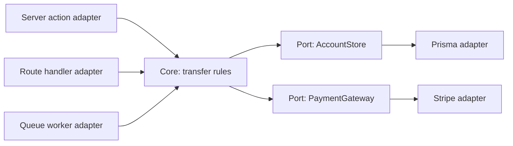

**Pros:** Testable, framework-independent core; easy provider swaps. **Cons / limits:** More interfaces and wiring; overkill for CRUD screens.

**Use it when / avoid when:** Use it for the money-moving, rule-heavy core. Avoid it for simple settings pages.

### Dependency injection without a framework

**What it is:** Passing dependencies in (as function arguments or constructor parameters) instead of importing them directly inside the logic. A small **composition root** file wires real implementations once.

**Why it's used:** Tests can pass fakes; production wires real adapters. No decorators or container library needed (NestJS has one, Next.js does not).

**How it works:**

```ts
// server/container.ts  (composition root)
import 'server-only';
import { makeTransfer } from '@/core/transfer';
import { prismaAccountStore } from '@/server/adapters/prisma-account-store';

export const transfer = makeTransfer({ accounts: prismaAccountStore, clock: { now: () => new Date() } });

// test
const transferUnderTest = makeTransfer({ accounts: fakeStore({ a: 1000, b: 0 }), clock: { now: () => new Date('2026-01-01') } });
```

**Pros:** Simple, explicit, type-checked. **Cons / limits:** Manual wiring grows with the app; keep factories small.

**Use it when / avoid when:** Use factories for anything with side effects (DB, email, clock, payment APIs). Avoid DI containers in a Next.js app unless the team already knows one well.

### CQRS-lite: separate reads from commands

**What it is:** Command Query Responsibility Segregation, the light version: **commands** (create transfer, approve payment) go through services with full validation and rules; **queries** (list transactions, dashboard totals) are separate read functions optimised for screens, often raw SQL or views, and may read from a replica. No separate databases needed.

**Why it's used:** Read screens want joins, aggregates and pagination; commands want invariants. Forcing both through the same domain model makes reads slow and commands bloated. In Next.js it maps neatly: queries feed server components; commands are server actions.

**How it works:**

```ts
// features/transactions/queries.ts  (read side, shaped for the UI)
export async function listTransactions(tenantId: string, accountId: string, cursor?: string) {
  return db.$queryRaw<TxnRow[]>`
    SELECT id, posted_at, description, amount_cents, category
    FROM transactions
    WHERE tenant_id = ${tenantId} AND account_id = ${accountId}
      AND (${cursor}::text IS NULL OR id < ${cursor})
    ORDER BY id DESC LIMIT 50`;
}
// features/transactions/commands.ts  (write side, rules and events)
export async function categorizeTransaction(user: User, id: string, category: string) { /* validate, check owner, update, emit event */ }
```

**Pros:** Fast reads, clean commands, natural fit for RSC plus actions. **Cons / limits:** Two code paths to keep consistent; reads from a replica can lag behind a just-made write (read your own writes from the primary).

**Use it when / avoid when:** Use it when dashboards and lists get slow or complex. Avoid full CQRS with event-sourced read models unless you truly need it.

### Domain events and the outbox pattern

**What it is:** A **domain event** records that something happened (`TransferCompleted`). The **outbox** pattern stores the event in an `outbox` table in the same database transaction as the business change; a separate relay process reads the table and publishes events to a queue.

**Why it's used:** "Update the DB, then send to the queue" fails halfway: the DB commits but the process dies before publishing, so the email or ledger sync never happens. The outbox makes the change and the event atomic.

**How it works:**

```ts
await db.$transaction(async (tx) => {
  const t = await tx.transfer.create({ data: { fromId, toId, amountCents, status: 'COMPLETED' } });
  await tx.outbox.create({ data: { type: 'TransferCompleted', payload: { transferId: t.id, amountCents }, }, });
});
// A relay (cron worker, or CDC like Debezium) polls unpublished outbox rows, publishes, marks them sent.
```

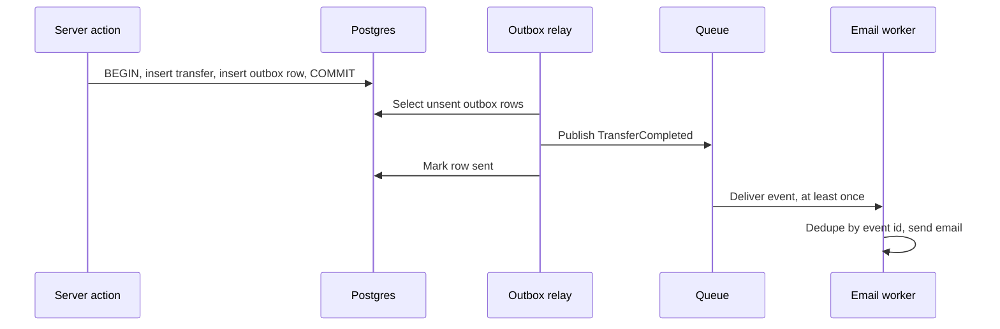

**Pros:** No lost events; consumers decoupled. **Cons / limits:** Delivery is at least once, so consumers must be idempotent; one more process to run.

**Use it when / avoid when:** Use it when a DB change must reliably trigger other work. Avoid it when a failed side effect is harmless (analytics pings).

### Background jobs: queues outside serverless

**What it is:** Moving slow or retryable work (PDF statements, emails, CSV imports, webhooks to partners) out of the request into a queue processed by workers. On serverless platforms the function may stop after the response, so long work needs a durable queue: managed options like Inngest, Trigger.dev, Upstash QStash, AWS SQS with Lambda, or BullMQ with Redis on a long-running worker.

**Why it's used:** Requests stay fast, failures retry automatically, and work survives deploys and crashes.

**How it works:** For tiny post-response work (logging, analytics), Next.js `after()` from `next/server` runs code after the response is sent, but it is not durable: no retries, lost if the instance dies. For anything that matters, enqueue.

```ts
// features/statements/actions.ts
'use server';
import { queue } from '@/server/queue'; // adapter over SQS, QStash, Inngest...
export async function requestStatement(accountId: string, month: string) {
  const user = await requireUser();
  const jobId = await queue.enqueue('statement.generate', { userId: user.id, accountId, month }, { dedupeKey: `${accountId}:${month}` });
  return { jobId }; // UI polls or subscribes for status
}
```

**Pros:** Resilience, retries, smooth spikes. **Cons / limits:** Eventual completion means UI needs a status model (queued, running, done, failed); another service to monitor.

**Use it when / avoid when:** Use it for anything over a couple of seconds, anything calling flaky third parties, anything that must not be lost. Avoid it for work the user must see completed in the same response.

### Idempotency

**What it is:** An operation is idempotent when doing it twice has the same effect as doing it once. For APIs: the client sends an `Idempotency-Key`; the server stores the key with the result and returns the stored result on retries.

**Why it's used:** Double clicks, network retries, and queue redeliveries all repeat requests. For payments, a repeat means charging twice.

**How it works:** A unique constraint is the real guard; UI disabling is only a convenience.

```ts
// table: idempotency_keys(key text, user_id text, response jsonb, created_at, PRIMARY KEY (user_id, key))
export async function withIdempotency<T>(userId: string, key: string, run: () => Promise<T>): Promise<T> {
  const existing = await db.idempotencyKey.findUnique({ where: { userId_key: { userId, key } } });
  if (existing?.response) return existing.response as T;
  try {
    await db.idempotencyKey.create({ data: { userId, key } }); // unique insert = lock
  } catch {
    throw new ConflictError('REQUEST_IN_PROGRESS'); // a concurrent duplicate; client retries later
  }
  const result = await run();
  await db.idempotencyKey.update({ where: { userId_key: { userId, key } }, data: { response: result as object } });
  return result;
}
```

**Pros:** Safe retries everywhere. **Cons / limits:** Storage and expiry of keys; handling a crash between insert and completion needs a timeout or status column. Ideally the business write and the key update share one transaction.

**Use it when / avoid when:** Use it for every money movement and every non-idempotent POST that clients may retry. Not needed for GET, PUT-with-full-replacement, or DELETE by id.

### Multi-tenancy

**What it is:** One deployment serving many customer organisations (tenants) with isolated data. Models: **shared tables with `tenant_id`** (cheapest), **schema per tenant**, or **database per tenant** (strongest isolation, highest cost).

**Why it's used:** SaaS economics. The challenge is that one missing `WHERE tenant_id = ?` leaks one bank's data to another.

**How it works:** Resolve the tenant once per request (subdomain, path, or session claim), carry it in the session, and enforce it in layers: repository functions require `tenantId`, and Postgres row-level security (RLS) enforces it in the database too.

```sql
ALTER TABLE accounts ENABLE ROW LEVEL SECURITY;
CREATE POLICY tenant_isolation ON accounts
  USING (tenant_id = current_setting('app.tenant_id')::uuid);
-- per request, inside a transaction: SELECT set_config('app.tenant_id', $1, true);
```

| Model | Isolation | Cost and ops | Good for |
|---|---|---|---|
| Shared tables plus tenant_id plus RLS | Logical | Lowest | Many small tenants |
| Schema per tenant | Better | Migrations per schema | Tens to hundreds of tenants |
| Database per tenant | Strongest | Highest | Few large, regulated tenants |

**Pros:** Economies of scale; one codebase. **Cons / limits:** Noisy neighbours, per-tenant backups and data residency get harder in shared models. RLS needs care with connection pooling (set the tenant per transaction).

**Use it when / avoid when:** Use shared tables with RLS by default; move big or regulated tenants to dedicated databases. Avoid relying on application code alone for isolation in regulated domains.

#### Q: [Senior] Users report being charged twice for one payment. Logs show two identical POSTs 400 ms apart. How do you fix it end to end?

**Short answer:** Make the payment command idempotent on the server with a client-generated idempotency key and a unique constraint, pass the same key to the payment provider, and add UI protection (disable while pending) as a second line. Then refund affected users and add an alert for duplicate charges.

**Clarify first:** Is the duplicate from a double click, a client retry, a proxy retry, or a queue redelivery? Does the provider (Stripe, Adyen) support idempotency keys? How many users were affected?

**Diagnose:** Correlate the two requests: same user agent and session within 400 ms suggests a double click or a retry library. Check whether the form is a server action without a pending state, or a `fetch` with automatic retries. Query for payments with the same user, amount and payee within a short window to size the impact.

**Solution:**

```tsx
'use client';
import { useActionState, useState } from 'react';
import { createPayment, type PaymentState } from '../actions';

export function PaymentForm() {
  const [idempotencyKey] = useState(() => crypto.randomUUID()); // one key per form instance
  const [state, formAction, isPending] = useActionState<PaymentState, FormData>(createPayment, { ok: false });
  return (
    <form action={formAction}>
      <input type="hidden" name="idempotencyKey" value={idempotencyKey} />
      {/* amount, payee fields */}
      <button type="submit" disabled={isPending}>{isPending ? 'Sending…' : 'Pay'}</button>
      {state.message && <p role="status">{state.message}</p>}
    </form>
  );
}
```

On the server, wrap the command in `withIdempotency(user.id, key, ...)`, and pass the same key to the provider (`stripe.paymentIntents.create(params, { idempotencyKey: key })`). Add a unique index on `(user_id, idempotency_key)` in the payments table so even a bug in the helper cannot create two rows.

**Trade-offs:** Key storage and cleanup (expire after 24 hours, for example). A new key per form instance means a user who deliberately pays twice must reload; that is usually the desired behaviour for payments.

**What interviewers listen for:**
- Server-side guarantee, not only a disabled button.
- Key passed through to the provider.
- Database unique constraint as the final guard.
- Remediation (refunds, monitoring), not only the code fix.

#### Q: [Mid] After sign-up we send a welcome email and create a CRM contact inside the server action. Sometimes sign-up takes 6 seconds, and sometimes the email never arrives. What would you change?

**Short answer:** Keep only the essential write (create the user) in the request, and move email and CRM calls to a durable background job triggered via an outbox row or a queue. The user gets a fast response, and the side effects retry on failure.

**Clarify first:** Which platform (serverless or long-running server)? Is a queue service already available? Must the email arrive before the user can log in (verification email) or is it nice-to-have?

**Diagnose:** Trace the action (OpenTelemetry or APM): the 6 seconds is usually the CRM API. Missing emails: errors swallowed in a `try/catch`, or a promise not awaited and cut off when the serverless function ended.

**Solution:**

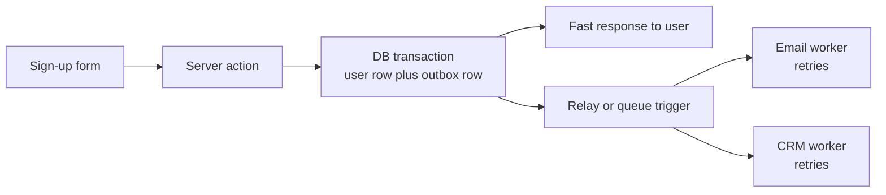

Write `UserSignedUp` to the outbox in the same transaction as the user. A worker (Inngest function, SQS consumer, BullMQ worker) sends the email and creates the CRM contact with retries and dedupe by event id. Use `after()` only for non-critical logging.

**Trade-offs:** More moving parts; the email arrives a few seconds later; need monitoring for a stuck queue.

**What interviewers listen for:**
- "Do the minimum in the request."
- Knowing that unawaited promises in serverless functions can be cut off.
- Retries plus idempotent consumers.

## 4. State and data patterns

### Server state: RSC first, TanStack Query when the client must refetch

**What it is:** Data owned by the server (accounts, transactions) that the UI shows a copy of. In the App Router, server components fetch it directly. TanStack Query manages it on the client when you need polling, infinite scroll, optimistic updates or refetch on focus.

**Why it's used:** Server state has problems client state does not: staleness, caching, deduplication, retries. Storing it in Redux or `useState` means rebuilding all of that by hand.

**How it works:** Prefetch on the server, hydrate on the client, so the first paint has data and later refetches happen in the browser.

```tsx
// page.tsx (server)
import { dehydrate, HydrationBoundary, QueryClient } from '@tanstack/react-query';
export default async function Page() {
  const qc = new QueryClient();
  await qc.prefetchQuery({ queryKey: ['positions'], queryFn: getPositions });
  return <HydrationBoundary state={dehydrate(qc)}><LivePositions /></HydrationBoundary>;
}
// LivePositions is a client component using useQuery({ queryKey: ['positions'], queryFn, refetchInterval: 10_000 })
```

**Pros / Cons / limits:** RSC is simplest and ships no JS; TanStack Query adds client power but also a cache to keep consistent with server revalidation.

**Use it when / avoid when:** RSC for read-mostly pages; TanStack Query for live or highly interactive data. Avoid copying server data into Zustand.

### URL state: searchParams and nuqs

**What it is:** State that lives in the query string: filters, sort, page, selected tab, open drawer id. `nuqs` gives a typed `useState`-like hook (`useQueryState`) over search params, plus a server-side parser cache.

**Why it's used:** Shareable links, working back button, state that survives refresh, and server components can read it to fetch the right data.

**How it works:**

```ts
// features/transactions/search-params.ts
import { createSearchParamsCache, parseAsInteger, parseAsString, parseAsStringLiteral } from 'nuqs/server';
export const txnParsers = {
  q: parseAsString.withDefault(''),
  page: parseAsInteger.withDefault(1),
  sort: parseAsStringLiteral(['date', 'amount'] as const).withDefault('date'),
};
export const txnSearchCache = createSearchParamsCache(txnParsers);

// client filter bar
const [q, setQ] = useQueryState('q', txnParsers.q.withOptions({ shallow: false, throttleMs: 300 }));
```

`shallow: false` tells nuqs to trigger a server re-render so server components refetch with the new params.

**Pros:** Shareable, bookmarkable, server-readable. **Cons / limits:** Only for small, serializable values; every change creates history entries unless you use `history: 'replace'` (the nuqs default).

**Use it when / avoid when:** Use it for anything a user would expect to share or keep on refresh. Avoid it for secrets and large objects.

### Form state: react-hook-form plus Zod, or useActionState

**What it is:** Two approaches. **react-hook-form** (RHF) keeps field state in refs (few re-renders), validates with a Zod schema via `@hookform/resolvers`, and suits complex client forms. **`useActionState`** with a server action and native form fields suits simpler forms and works before JavaScript loads.

**Why it's used:** Forms are the main write path. Sharing one Zod schema between client validation and server action validation means rules are written once.

**How it works:**

```ts
// schemas.ts (shared)
export const paymentSchema = z.object({
  payeeId: z.string().uuid(),
  amountCents: z.coerce.number().int().positive().max(1_000_000_00),
  memo: z.string().max(140).optional(),
});
// client: useForm({ resolver: zodResolver(paymentSchema) })
// server action: paymentSchema.safeParse(input) again, always
```

**Pros / Cons / limits:** RHF: great UX for big dynamic forms (field arrays, wizards) but client-only. `useActionState`: minimal code, progressive enhancement, but weaker live validation.

**Use it when / avoid when:** RHF for complex, dynamic forms; `useActionState` for short forms. Never skip server-side validation.

### Client global state: Zustand

**What it is:** A tiny store library: create a store with state and actions, subscribe with selectors so components re-render only when their slice changes.

**Why it's used:** For real client state shared across distant components: a UI layout (sidebar collapsed), a multi-step draft, a selection basket. Not for server data.

**How it works:** In Next.js, avoid a module-level global store when it holds user data, because on the server a module is shared across requests. Create the store per request inside a provider.

```tsx
'use client';
import { createStore, useStore } from 'zustand';
import { createContext, useContext, useState } from 'react';

type Draft = { step: number; data: Partial<OnboardingData>; next: (d: Partial<OnboardingData>) => void };
const makeStore = () => createStore<Draft>()((set) => ({
  step: 0, data: {},
  next: (d) => set((s) => ({ step: s.step + 1, data: { ...s.data, ...d } })),
}));
const Ctx = createContext<ReturnType<typeof makeStore> | null>(null);
export function DraftProvider({ children }: { children: React.ReactNode }) {
  const [store] = useState(makeStore);
  return <Ctx.Provider value={store}>{children}</Ctx.Provider>;
}
export const useDraft = <T,>(sel: (s: Draft) => T) => useStore(useContext(Ctx)!, sel);
```

**Pros:** Tiny API, selectors, middleware (`persist`, `devtools`). **Cons / limits:** Easy to misuse as a dumping ground for server data.

**Use it when / avoid when:** Use it for cross-component client state. Avoid it when URL, form or server state fits.

### Real-time state

**What it is:** Data pushed from the server: prices, payment status, notifications, collaborative edits. Transports: Server-Sent Events (one-way, simple), WebSockets (two-way), or managed services (Pusher, Ably, Supabase Realtime, Liveblocks).

**Why it's used:** Polling every second wastes requests and still lags. Push gives instant updates.

**How it works:** Serverless functions are a poor host for long-lived WebSocket connections, so use a managed service or a separate long-running server. On the client, apply pushed events into the TanStack Query cache so there is one source of truth.

```ts
useEffect(() => {
  const es = new EventSource('/api/payments/stream');
  es.onmessage = (e) => {
    const evt = JSON.parse(e.data) as { id: string; status: string };
    queryClient.setQueryData<Payment[]>(['payments'], (old) => old?.map((p) => (p.id === evt.id ? { ...p, status: evt.status } : p)));
  };
  return () => es.close();
}, [queryClient]);
```

**Pros / Cons / limits:** Instant UX, but reconnection, ordering and missed messages must be handled (refetch on reconnect).

**Use it when / avoid when:** Use push for truly live data. Avoid it when a 30-second `refetchInterval` is good enough.

### Decision table: where does this state live?

| State | Example | Home |
|---|---|---|
| Server data, read on page load | Account summary | Server component |
| Server data, live or refetched on client | Positions, payment status | TanStack Query (plus push) |
| Shareable view settings | Filters, sort, page, tab | URL via nuqs |
| Form inputs being edited | Payment form | RHF or native form plus useActionState |
| Cross-component client UI | Sidebar, wizard draft, selection | Zustand (per-request store) |
| One component's UI | Dropdown open | useState |
| Derived values | Totals, filtered list | Compute during render |

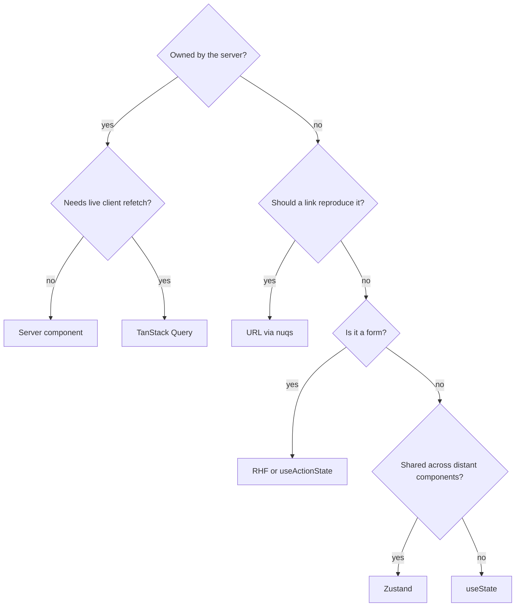

#### Q: [Senior] Design a five-step business onboarding flow (company details, owners, documents, bank account, review). Users drop off and come back days later. How do you manage state?

**Short answer:** Persist the draft on the server after each step, because the user returns days later on maybe another device. Each step is its own route (`/onboarding/[step]`) with its own Zod schema and form; the server is the source of truth for progress, and the final submit validates the whole draft again.

**Clarify first:** Can steps be skipped or reordered? File sizes for documents? Compliance needs (audit trail of changes)? Multiple people from the same company editing?

**Solution:**

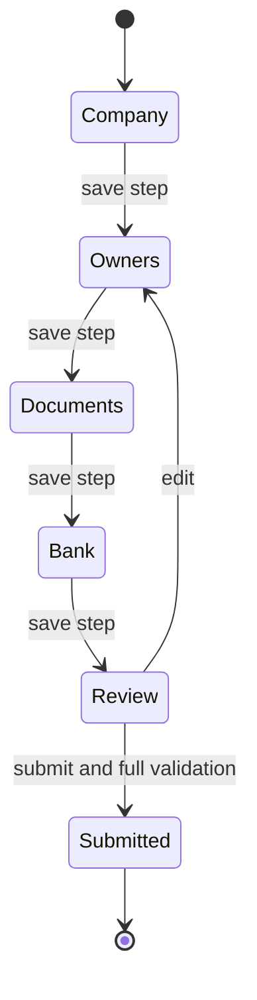

- Route per step: back button, deep links, and analytics per step for free.
- Each step: RHF with that step's schema; on submit, a server action saves the partial draft (`onboarding_drafts` table, jsonb plus `completedSteps`).
- Layout reads the draft on the server and redirects to the first incomplete step, so users cannot jump ahead.
- Documents: upload directly to object storage with presigned URLs; store only keys in the draft.
- Final submit: `fullOnboardingSchema.parse(draft)`, then a command that creates records and emits `OnboardingSubmitted` for KYC checks via a background job.

**Trade-offs:** Server drafts cost a write per step but survive devices; a Zustand plus `localStorage` draft is simpler but lost across devices and risky for personal data on shared machines.

**What interviewers listen for:** Server-side draft, step-level validation plus full re-validation, URL per step, sensitive data not in local storage.

#### Q: [Mid] A transactions page keeps its filters in `useState`. Support wants to send users a link to "the filtered view". What do you change?

**Short answer:** Move the filters into the URL with nuqs, read them on the server with a search-params cache, and fetch the filtered page in a server component. The link then reproduces the view, and the back button works.

**Solution:** Replace `useState` calls with `useQueryState` using shared parsers (shown above), set `shallow: false` so the server component re-renders, and wrap the table in `<Suspense key={JSON.stringify(filters)}>` so a loading state appears on change. Validate parsed values (unknown sort columns fall back to the default).

**Trade-offs:** Every filter change is a server round trip; for small client-side datasets, keep `shallow: true` and filter on the client.

**What interviewers listen for:** URL as state for shareable views, typed parsing, not trusting raw query strings.

## 5. Libraries, and how they handle things better

### shadcn/ui and Radix

**What it is:** Radix Primitives are headless, accessible components (Dialog, Popover, Select, DropdownMenu). shadcn/ui is not an npm dependency but a CLI that copies styled components (Radix or, in newer versions, Base UI underneath, plus Tailwind and cva) into your repo.

**Why it's used:** You own the code: change anything, no fighting a library's theme API. Accessibility comes from the primitives.

**Pros:** Ownership, accessibility, Tailwind-native. **Cons / limits:** Upgrades are manual (you re-run the CLI or diff); you maintain the copies.

**Use it when / avoid when:** Use it to start a design system fast. Avoid it if you want a fully managed, versioned component library (MUI, Mantine, Chakra).

### Data, forms, validation and state libraries

**What it is:** The small libraries that each own one kind of state or one boundary. **Why it's used:** each replaces code teams keep rewriting badly (caches, validation, URL parsing, action boilerplate). **How it works:** see the table, and the next-safe-action sketch below.

| Library | Handles better than hand-rolled | Watch out for |
|---|---|---|
| TanStack Query | Caching, dedupe, retries, stale-while-revalidate, optimistic updates | Duplicating RSC data; key design |
| Zustand | Minimal global client state with selectors | Module-level stores on the server |
| react-hook-form | Few re-renders, field arrays, resolver validation | Client-only; controlled third-party inputs need `Controller` |
| Zod | One schema for types, client and server validation | Zod 4 changed some APIs (error formatting); check versions |
| nuqs | Typed URL state, throttling, server parsing | Keep values small |
| next-safe-action | Typed server actions with schema validation, middleware for auth and logging | Another abstraction over actions; API changed between major versions |

```ts
// next-safe-action: auth middleware once, then typed actions (v8 style; check your version's docs)
import { createSafeActionClient } from 'next-safe-action';
export const authAction = createSafeActionClient().use(async ({ next }) => {
  const user = await requireUser();
  return next({ ctx: { user } });
});
export const renameAccount = authAction
  .inputSchema(z.object({ id: z.string().uuid(), name: z.string().min(1).max(40) }))
  .action(async ({ parsedInput, ctx }) => accountService.rename(ctx.user, parsedInput.id, parsedInput.name));
```

### API style: tRPC vs REST vs GraphQL

**What it is:** Three ways for clients to call your server: typed procedure calls (tRPC), resource URLs over HTTP (REST), or one endpoint with a typed query language (GraphQL). **Why it's used:** the choice decides who can call you and how types and caching work.

| | tRPC | REST (route handlers or backend) | GraphQL |
|---|---|---|---|
| Type safety | End to end, inferred, no codegen | Via OpenAPI codegen or shared Zod | Via codegen from schema |
| Clients | TypeScript clients in the same monorepo | Any language, partners, mobile | Any, with a GraphQL client |
| Caching | TanStack Query integration | HTTP and CDN caching built in | Client caches (Apollo, urql); HTTP caching harder |
| Best fit | Internal TS full stack | Public APIs, webhooks, many consumers | Many varied clients and nested data |

**Use it when / avoid when:** tRPC for a TypeScript-only monorepo; REST for anything external; GraphQL when many clients need different shapes of deeply related data. Inside a pure Next.js app, server components plus actions often remove the need for any of them.

### ORM: Prisma vs Drizzle

**What it is:** The two most common TypeScript database layers. **Why it's used:** typed queries and migrations instead of hand-written SQL strings everywhere.

| | Prisma | Drizzle |
|---|---|---|
| Model | Schema file, generated client, high-level API | Schema in TypeScript, SQL-like query builder |
| Strengths | Great DX, migrations, relations, Studio | Thin, close to SQL, small runtime, serverless and edge friendly |
| Limits | Generated client, some queries need raw SQL; newer versions removed the Rust engine to cut size (verify for your version) | Less hand-holding; you need to know SQL |
| Pick when | Team prefers abstraction and fast CRUD | Team knows SQL, wants control and small bundles |

**Use it when / avoid when:** Either is fine behind a repository layer; avoid mixing both in one codebase.

### Auth: Auth.js vs Clerk vs custom (or Okta)

**What it is:** Options for sign-in and sessions. **Why it's used:** auth is security-critical and full of edge cases (token refresh, MFA, session revocation), so few teams should hand-roll it.

| | Auth.js (NextAuth v5) | Clerk | Custom or enterprise IdP |
|---|---|---|---|
| What | Open-source library, you host sessions and DB | Hosted service with UI components, orgs, MFA | Your own sessions, or OIDC with Okta, Entra ID, Auth0 |
| Strengths | Free, many OAuth providers, data in your DB | Fastest to ship, B2B orgs, user management UI | Full control, compliance, corporate SSO |
| Limits | You build MFA, org management; maintenance is now led by the Better Auth team (check status) | Per-user pricing, vendor lock-in, data outside your DB | Most work and most security risk if hand-rolled |
| Pick when | Consumer app, budget-conscious | Startup needing orgs and MFA now | Bank or enterprise with an existing IdP |

Whatever you pick, the server checks the session in the DAL; middleware or `proxy.ts` (the Next.js 16 name for middleware) is only an optimistic first filter.

#### Q: [Senior] You are starting a new full-stack fintech dashboard in Next.js with a team of five. Which libraries do you pick and why?

**Short answer:** Boring, well-supported defaults with clear jobs: shadcn/ui on Radix plus Tailwind for UI, server components for reads, server actions through next-safe-action for mutations, Zod schemas shared across client and server, react-hook-form for complex forms, nuqs for URL state, TanStack Query only for live data, Drizzle or Prisma depending on SQL comfort, and the company's IdP (Okta) via OIDC for auth. A Turborepo only if there is a second app.

**Clarify first:** Existing backend or greenfield? Mobile app planned (affects REST vs tRPC)? Compliance (SOC 2, PCI scope)? Team experience with SQL? Hosting (Vercel, AWS)?

**Solution:** Write the choices in a short ADR per decision with the alternative rejected. For each library ask: does it solve a real problem we have, is it maintained, can we replace it behind our own wrapper (domain hooks, repository), and does it work with RSC?

**Trade-offs:** Each library is a dependency to upgrade; fewer libraries mean more hand-rolled code. Favour platform features (forms, `useActionState`, `fetch`) until they hurt.

**What interviewers listen for:** Reasons tied to requirements, ADRs, wrapping libraries at seams, not chasing hype.

#### Q: [Senior] We use tRPC between our Next.js app and its API. Now a native mobile team and two partners need access. Do we replace tRPC?

**Short answer:** No need to rip it out. Keep tRPC for the internal web app, and expose a versioned REST API (with an OpenAPI spec) for mobile and partners, both calling the same services. Partners need stable, documented, language-neutral contracts that tRPC does not give.

**Solution:** Move business logic out of tRPC procedures into services if it is not already there. Add `app/api/v1/*` route handlers or a separate API app, generate OpenAPI from Zod schemas, add API keys or OAuth client credentials for partners, rate limits and idempotency keys.

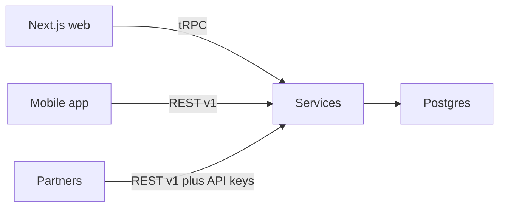

**Trade-offs:** Two API surfaces to maintain; mitigated by thin adapters over shared services and schemas.

**What interviewers listen for:** Separating transport from logic, versioning for external consumers, not rewriting working internal code.

## 6. Real-world scenarios

#### Q: [Staff] Product wants feature flags and A/B tests that work across server components, client components and server actions, without layout flicker. How do you design it?

**Short answer:** Evaluate flags on the server once per request from a flag provider, using a stable user or anonymous id cookie, then pass the evaluated values down as props or through a small client provider. Never decide variants only on the client (that causes flicker), and check flags again in server actions so a hidden feature cannot be called.

**Clarify first:** Provider (LaunchDarkly, Statsig, GrowthBook, PostHog, Vercel Flags SDK)? Need static pages per variant? Who analyses experiments, and where do exposure events go?

**Solution:**

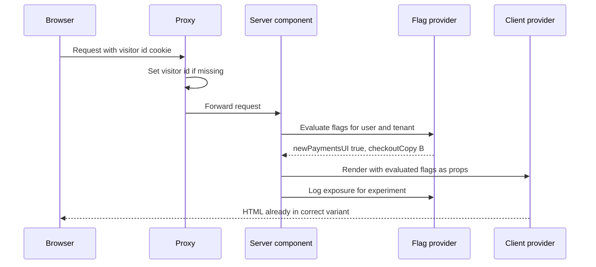

- One server function `getFlags()` wrapped in `React.cache` per request; flags are typed in one file.
- Server actions call `getFlags()` and refuse if the feature is off.
- For static pages, precompute variants (the Vercel Flags SDK supports this pattern) or keep experiments on dynamic pages.
- Clean up: every flag has an owner and an expiry date; a lint or dashboard lists stale flags.

**Trade-offs:** Server evaluation makes pages dynamic unless precomputed; client-side SDKs are easier but flicker and leak upcoming features in the bundle.

**What interviewers listen for:** Server-side evaluation, consistent bucketing, enforcement in actions, exposure logging, flag lifecycle.

#### Q: [Senior] Design permissions: viewers, approvers and admins per account, enforced in both the UI and the server.

**Short answer:** Define permissions once as data (role to permission map plus resource rules), enforce on the server in the DAL and every action, and use the same `can()` function on the server to compute what the UI shows. The UI hides and disables; the server decides.

**Solution:**

```ts
// lib/permissions.ts (shared, pure)
export type Permission = 'account:view' | 'payment:create' | 'payment:approve' | 'user:manage';
const rolePerms: Record<Role, Permission[]> = {
  viewer: ['account:view'],
  approver: ['account:view', 'payment:approve'],
  admin: ['account:view', 'payment:create', 'payment:approve', 'user:manage'],
};
export function can(user: { roles: Record<string, Role> }, perm: Permission, accountId: string) {
  const role = user.roles[accountId];
  return !!role && rolePerms[role].includes(perm);
}
// server action: if (!can(user, 'payment:approve', payment.accountId)) throw new ForbiddenError();
// also: an approver cannot approve their own payment (resource rule in the service)
// server component: <ApproveButton enabled={can(user, 'payment:approve', id)} />
```

**Trade-offs:** Role maps are simple but rigid; resource rules (four-eyes approval, amount limits) belong in services. For complex policies, consider a policy engine (Cerbos, OpenFGA, Oso).

**What interviewers listen for:** Server enforcement everywhere, one source of truth, resource-level rules, audit logging of denied attempts.

#### Q: [Staff] A SaaS bank platform stores all tenants in one Postgres. An audit asks how you guarantee one tenant can never see another's data. What do you put in place?

**Short answer:** Defence in depth: tenant resolved from the authenticated session (never from user input), repositories that require `tenantId`, Postgres row-level security as a database-level backstop, tenant-scoped cache keys, and automated tests that try cross-tenant access.

**Solution:**
- Session carries `tenantId`; the DAL sets `app.tenant_id` per transaction for RLS.
- Lint or type rule: repository functions take a branded `TenantId` type, so forgetting it fails to compile.
- Caches and object storage keys prefixed by tenant; no shared cache of tenant data without the tenant in the key.
- Background jobs carry `tenantId` in the payload and set it before any query.
- Integration tests: user A requests tenant B's account id and must get 404.
- Large regulated tenants can move to a dedicated database behind the same repository interface.

**Trade-offs:** RLS adds query overhead and complicates pooling; per-tenant databases cost more but simplify audits and data residency.

**What interviewers listen for:** Multiple independent layers, tenant from session only, tests that prove isolation, a path to stronger isolation.

#### Q: [Mid] A page in the App Router feels slow. The server component awaits user, then accounts, then transactions, one after another. How do you speed it up?

**Short answer:** That is a server-side waterfall. Start independent requests in parallel with `Promise.all`, and split slow parts into separate async components inside `<Suspense>` so the shell streams first.

**Solution:**

```tsx
export default async function Page() {
  const user = await requireUser();                 // needed by both
  const [accounts, txns] = await Promise.all([getAccounts(user), getRecentTransactions(user)]);
  return <Overview accounts={accounts} txns={txns} />;
}
// Better for slow widgets: <Suspense fallback={<TxnSkeleton />}><RecentTransactions /></Suspense>
```

**Trade-offs:** `Promise.all` fails fast if one rejects (use `allSettled` for optional widgets); Suspense boundaries add skeleton states to design.

**What interviewers listen for:** Recognising waterfalls, parallel fetching, streaming with Suspense, measuring with server timing or traces.

