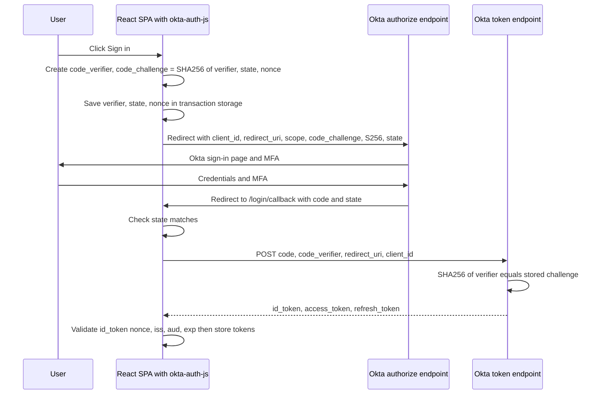
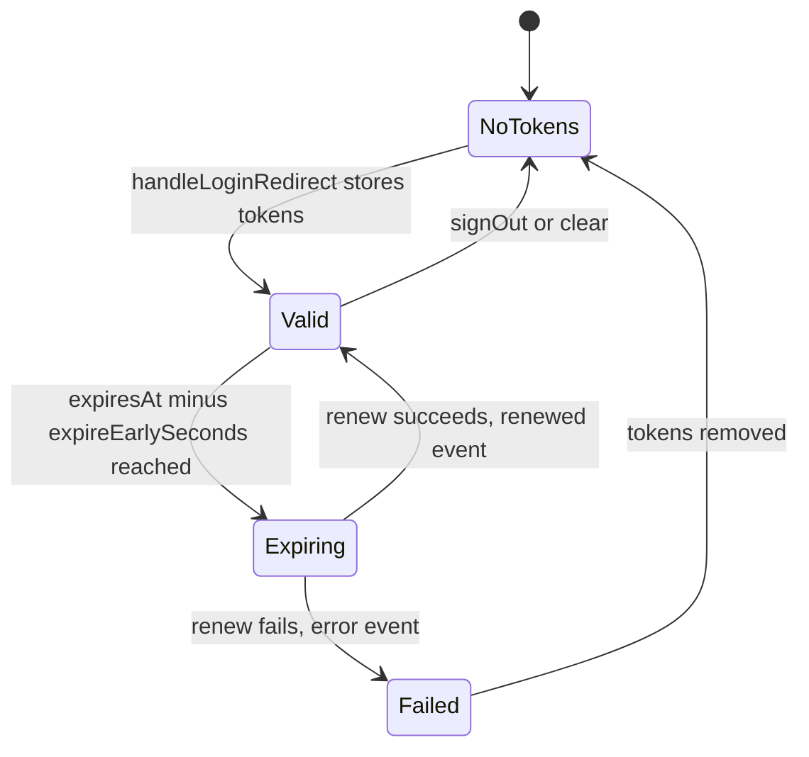
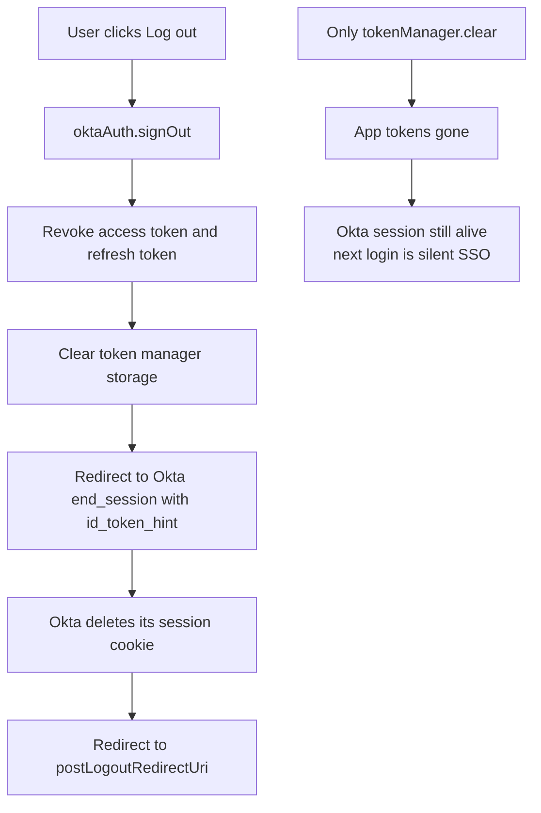

## 1. What it is

**`@okta/okta-auth-js` is Okta's framework-agnostic JavaScript SDK that runs the OAuth 2.0 / OpenID Connect login flow in the browser, stores the resulting tokens, renews them, and tells your app whether the user is authenticated.**

Analogy: imagine a hotel. Okta is the front desk, which checks your passport. Okta Auth JS is the concierge who walks you to the desk, waits while you prove who you are, brings back your room key cards (tokens), keeps them in a safe, swaps them for fresh ones before they stop working, and tells the rest of the staff "this guest is checked in".

The problem it solves: OAuth and OIDC are full of details that are easy to get wrong: generating PKCE secrets, validating `state` and `nonce`, exchanging codes, verifying ID tokens, timing renewals, syncing tabs. Getting any of them wrong creates a security hole. The SDK implements them once, correctly, so your React code just calls `signInWithRedirect()` and reads `authState`.

## 2. Core concepts

### [Beginner] OAuth 2.0 vs OpenID Connect

- **OAuth 2.0** is about **authorization**: letting an app call an API on a user's behalf. Output: an **access token**.
- **OpenID Connect (OIDC)** sits on top of OAuth and adds **authentication**: who the user is. Output: an **ID token** (always a JWT) and a `/userinfo` endpoint.

```ts
// The scopes you request decide what you get back
const scopes = [
  "openid",          // required for OIDC: you get an ID token
  "profile",         // name, preferred_username claims
  "email",           // email claim
  "offline_access",  // ask for a refresh token (must be enabled on the Okta app)
  "accounts:read",   // custom scope defined on your Okta authorization server
];
```

Key roles:
- **Resource owner**: the user.
- **Client**: your React SPA (a "public client": it cannot keep a secret).
- **Authorization server**: Okta (`issuer` URL).
- **Resource server**: your accounts/transactions API.

> **Why:** People say "OAuth login" but OAuth alone never told the app who the user is. OIDC fixed that with a standard, signed ID token.

### [Beginner] The issuer and discovery

Everything starts from the `issuer` URL. Okta publishes a discovery document there.

```ts
// GET {issuer}/.well-known/openid-configuration
const issuer = "https://bank.okta.com/oauth2/default";
const discovery = await fetch(`${issuer}/.well-known/openid-configuration`).then((r) => r.json());
// discovery.authorization_endpoint -> .../v1/authorize
// discovery.token_endpoint         -> .../v1/token
// discovery.jwks_uri               -> .../v1/keys
// discovery.end_session_endpoint   -> .../v1/logout
```

> **Gotcha:** `https://bank.okta.com` (the org authorization server) and `https://bank.okta.com/oauth2/default` (a custom authorization server) are different issuers. Org server access tokens are meant for Okta's own APIs and your API cannot validate them. For your own APIs, use a custom authorization server issuer.

### [Intermediate] Authorization Code + PKCE, step by step

PKCE (Proof Key for Code Exchange, RFC 7636, pronounced "pixy") lets a public client prove that the app redeeming a code is the same app that started the login.

```ts
// What the SDK does internally (simplified, do not hand-roll this in production)
function randomString(len = 64): string {
  const bytes = crypto.getRandomValues(new Uint8Array(len));
  return btoa(String.fromCharCode(...bytes)).replace(/[+/=]/g, "").slice(0, len);
}

async function createPkcePair() {
  const codeVerifier = randomString(64); // secret, kept in browser storage
  const digest = await crypto.subtle.digest("SHA-256", new TextEncoder().encode(codeVerifier));
  const codeChallenge = btoa(String.fromCharCode(...new Uint8Array(digest)))
    .replace(/\+/g, "-").replace(/\//g, "_").replace(/=+$/, ""); // base64url
  return { codeVerifier, codeChallenge }; // challenge goes in the URL, verifier stays home
}
```



> **Why PKCE for SPAs:** An SPA cannot hold a client secret, because anything in your JS bundle is public. Without a secret, a stolen authorization code (from browser history, a malicious extension, logs, or a referrer header) could be swapped for tokens by anyone. PKCE replaces the static secret with a one-time secret created per login. The `code_challenge` (a hash) travels through the browser URL. The `code_verifier` (the original) is sent only in the back-channel POST. An attacker who intercepts the code does not have the verifier, so the code is useless.

> **Outdated:** The Implicit flow (`response_type=token`, tokens in the URL fragment) was the SPA standard before 2019. The OAuth 2.0 Security Best Current Practice (RFC 9700, 2025) and the OAuth 2.1 draft say do not use it. In okta-auth-js, `pkce: true` is the default.

### [Intermediate] The OktaAuth instance

You create exactly one instance per app and share it.

```ts
import { OktaAuth } from "@okta/okta-auth-js";

export const oktaAuth = new OktaAuth({
  issuer: "https://bank.okta.com/oauth2/default",
  clientId: "0oaSPA123",
  redirectUri: `${window.location.origin}/login/callback`,
  scopes: ["openid", "profile", "email", "offline_access"],
  pkce: true,
});
```

> **Gotcha:** Creating `new OktaAuth()` inside a React component body makes a new instance on every render, losing listeners and causing loops. Create it at module level.

### [Intermediate] Redirect login: signInWithRedirect and handleLoginRedirect

```ts
// 1. Start login. originalUri is where to return the user afterwards.
await oktaAuth.signInWithRedirect({ originalUri: "/portfolio/123" });

// 2. On the /login/callback route
if (oktaAuth.isLoginRedirect()) {
  // Parses code from URL, exchanges it (PKCE), stores tokens,
  // then calls restoreOriginalUri (if configured) or navigates to originalUri
  await oktaAuth.handleLoginRedirect();
}
```

`handleLoginRedirect()` is the high-level helper. It combines `token.parseFromUrl()` (exchange the code), `tokenManager.setTokens()` (store them) and the original-URI restore. In React, `<LoginCallback />` from `@okta/okta-react` calls it for you.

### [Intermediate] The token manager

The token manager stores tokens under keys `idToken`, `accessToken` and `refreshToken`, and emits events.

```ts
const { accessToken, idToken, refreshToken } = await oktaAuth.tokenManager.getTokens();
console.log(accessToken?.accessToken);      // the raw string
console.log(accessToken?.expiresAt);        // seconds since epoch
console.log(accessToken?.scopes);           // string[]

// Shortcut helpers return the raw strings (or undefined)
const at = oktaAuth.getAccessToken();
const it = oktaAuth.getIdToken();

// Manually renew one token
const fresh = await oktaAuth.tokenManager.renew("accessToken");

// Events
oktaAuth.tokenManager.on("expired", (key, token) => {
  console.info(`${key} expired`);           // fires before autoRenew kicks in
});
oktaAuth.tokenManager.on("renewed", (key, newToken, oldToken) => {
  console.info(`${key} renewed`);
});
oktaAuth.tokenManager.on("error", (err) => {
  // e.g. AuthSdkError: renew failed, user session gone. Consider signOut.
  console.error(err);
});
```



### [Intermediate] How renewal actually works

- **With a refresh token** (`offline_access` scope and refresh token grant enabled on the Okta app): the SDK POSTs `grant_type=refresh_token` to `/v1/token`. No iframe, no cookies needed. Works with third-party cookie blocking. Rotation is configured in Okta.
- **Without a refresh token**: the SDK runs a hidden iframe to `/v1/authorize?prompt=none`, relying on the Okta session cookie. Safari ITP and Chrome third-party cookie restrictions often break this when your app and Okta are on different sites.

```ts
// Detect which path you are on
const tokens = await oktaAuth.tokenManager.getTokens();
const usesRefreshTokens = Boolean(tokens.refreshToken);
```

> **Finance tip:** Use refresh tokens with rotation enabled in the Okta admin console, and set a short refresh token idle lifetime. This gives silent renewal that does not depend on third-party cookies, while limiting how long a stolen refresh token stays useful.

### [Intermediate] authState and authStateManager

`authState` is the SDK's single answer to "is the user logged in, and with which tokens?".

```ts
import type { AuthState } from "@okta/okta-auth-js";

// Shape (simplified)
// { isAuthenticated: boolean, accessToken?: AccessToken, idToken?: IDToken, refreshToken?: RefreshToken, error?: Error }

const handler = (state: AuthState) => {
  console.log("authenticated?", state.isAuthenticated);
};
oktaAuth.authStateManager.subscribe(handler);
oktaAuth.authStateManager.updateAuthState(); // compute from current tokens and emit

const current = oktaAuth.authStateManager.getAuthState(); // may be null before first evaluation
oktaAuth.authStateManager.unsubscribe(handler);
```

By default `isAuthenticated` is true when a valid (non-expired) access token **and** ID token exist. You can override it:

```ts
const oktaAuth2 = new OktaAuth({
  issuer, clientId, redirectUri,
  transformAuthState: async (auth, authState) => {
    if (!authState.isAuthenticated) return authState;
    // Example: also require the custom "advisor" scope for this app
    const scopes = authState.accessToken?.scopes ?? [];
    return { ...authState, isAuthenticated: scopes.includes("portfolio:read") };
  },
});
```

`oktaAuth.isAuthenticated()` returns a `Promise<boolean>`. It checks current tokens and may try to renew expired ones depending on options, so prefer reading `authState` in UI code.

> **Gotcha:** `getAuthState()` can be `null` early in startup. In React, `authState` from `useOktaAuth()` is also `null` until the first evaluation. Treat `null` as "loading", not "logged out", or you will flash the login page.

### [Advanced] Services: autoRenew, autoRemove, syncStorage and start()

In v6 and v7 the SDK has a **service manager**. Background behaviours only run after `start()`.

```ts
const oktaAuth = new OktaAuth({
  issuer, clientId, redirectUri,
  services: {
    autoRenew: true,   // renew tokens shortly before they expire
    autoRemove: true,  // remove expired tokens if renew is off or fails
    syncStorage: true, // keep tokens in sync across browser tabs
  },
});

await oktaAuth.start(); // starts token manager timers and services
// ...
await oktaAuth.stop();  // e.g. in tests or on unmount
```

With several tabs open, the SDK uses leader election (via BroadcastChannel) so only one tab performs autoRenew and others receive updated tokens through storage sync. There is no service worker involved: everything runs in the page.

> **Gotcha:** If you use `@okta/okta-react`, the `<Security>` component calls `start()` for you in recent 6.x versions. If you use the SDK alone and forget `start()`, autoRenew silently never runs and users get logged out when the access token expires. Check the version notes for your exact release.

### [Advanced] Session vs tokens

Two different things are called "logged in":

```ts
// 1. The Okta session: a cookie on the Okta domain (e.g. bank.okta.com)
const hasOktaSession = await oktaAuth.session.exists(); // uses a cross-site request, may fail with 3rd-party cookie blocking

// 2. Your app's tokens: stored by the token manager on YOUR origin
const hasTokens = (await oktaAuth.tokenManager.getTokens()).accessToken !== undefined;
```

| | Okta session | Tokens in your app |
|---|---|---|
| Lives on | Okta domain cookie | Your origin storage (local/session/memory/cookie) |
| Lifetime set by | Okta sign-on policy | Authorization server access policy |
| Used for | SSO across apps, iframe renew | Calling your APIs |
| Cleared by | `signOut()` redirect to `/v1/logout`, or `closeSession()` | `tokenManager.clear()` or `signOut()` |



> **Why:** If you only clear local tokens, the Okta session cookie survives. Clicking "Sign in" again logs the user straight back in without a password. On a shared computer in a branch office, that is a real compliance issue.

### [Advanced] signOut

```ts
await oktaAuth.signOut({
  postLogoutRedirectUri: `${window.location.origin}/signed-out`, // must be allowlisted in Okta
  revokeAccessToken: true,   // default true
  revokeRefreshToken: true,  // default true
  clearTokensBeforeRedirect: true, // wipe local tokens even if redirect is slow
});
```

`signOut()` revokes tokens, then redirects to Okta's logout endpoint with the ID token as a hint. Without an ID token, it cannot end the Okta session via redirect; it falls back to `closeSession()` (an XHR that needs third-party cookies) and then redirects.

## 3. Why it's used in this project

- **Okta is the bank's identity provider**, with MFA, password policies and SSO across internal tools. The SDK is the officially supported browser client.
- **PKCE without a backend secret** fits our static SPA hosted on a CDN.
- **autoRenew + refresh rotation** keeps advisors logged in during a long trading day without re-entering MFA every hour, while access tokens stay short-lived.
- **Custom scopes** (`accounts:read`, `payments:write`) and the `groups` claim drive which dashboards and actions appear.
- **Compliance logout**: idle timeout triggers `signOut()`, which revokes tokens and ends the Okta session, giving auditors a clear answer to "what happens on an unattended screen".
- **Multi-tab sync**: users open several account tabs. `syncStorage` keeps them consistent, and logging out in one tab logs out all.

## 4. Setup & configuration

```bash
npm install @okta/okta-auth-js
```

```ts
// src/auth/oktaAuth.ts
import { OktaAuth, type OktaAuthOptions } from "@okta/okta-auth-js";

const config: OktaAuthOptions = {
  // Custom authorization server. Must match the "iss" claim exactly.
  issuer: import.meta.env.VITE_OKTA_ISSUER,           // "https://bank.okta.com/oauth2/default"
  // Public client id of the SPA app integration in Okta
  clientId: import.meta.env.VITE_OKTA_CLIENT_ID,      // "0oaSPA123"
  // Must be listed under "Sign-in redirect URIs" in Okta
  redirectUri: `${window.location.origin}/login/callback`,
  // Must be listed under "Sign-out redirect URIs"
  postLogoutRedirectUri: `${window.location.origin}/signed-out`,
  // openid is required. offline_access requests a refresh token.
  scopes: ["openid", "profile", "email", "offline_access", "accounts:read"],
  // Authorization Code + PKCE. Default is true. Never turn off for an SPA.
  pkce: true,
  tokenManager: {
    // Where tokens live: "localStorage" (default), "sessionStorage", "memory", "cookie"
    storage: "sessionStorage",
    // Renew this many seconds before real expiry. Default 30.
    expireEarlySeconds: 30,
    // Legacy location for autoRenew. Prefer services.autoRenew in v7.
    // autoRenew: true,
  },
  services: {
    autoRenew: true,   // renew before expiry (refresh token if present, else iframe)
    autoRemove: true,  // drop expired tokens if renew fails
    syncStorage: true, // cross-tab token sync
  },
  // Optional: make "authenticated" stricter
  transformAuthState: async (_auth, state) => state,
  // Where to send the user after login when not using okta-react's restoreOriginalUri
  // restoreOriginalUri: async (oktaAuth, originalUri) => { window.location.replace(originalUri ?? "/") },
  devMode: import.meta.env.DEV, // verbose console logging in development
};

export const oktaAuth = new OktaAuth(config);
```

Okta admin console checklist:
- App type: **Single-Page Application**, grant types: Authorization Code, Refresh Token.
- Refresh token behaviour: **Rotate token after every use**, with a grace period for multi-tab races.
- Trusted Origins: add your app origin for CORS (and Redirect if using the session API).
- Access policy on the authorization server: access token lifetime (e.g. 5 to 15 min), refresh token idle lifetime.

> **Gotcha:** `expireEarlySeconds` is only honoured in dev mode in some versions; in production the SDK may clamp it. Do not rely on a large value for business logic.

## 5. Key features we use

### [Beginner] Login button

```ts
export async function login(returnTo = window.location.pathname) {
  await oktaAuth.signInWithRedirect({ originalUri: returnTo });
}
```

### [Beginner] Getting the current user's claims

```ts
const user = await oktaAuth.getUser(); // calls /v1/userinfo with the access token
console.log(user.name, user.email, user.sub);

// Or read ID token claims without a network call
const idToken = await oktaAuth.tokenManager.get("idToken");
const name = idToken && "claims" in idToken ? idToken.claims.name : undefined;
```

### [Intermediate] Attaching the token with fetch

```ts
export async function getAccounts(): Promise<Array<{ accountId: string; balanceCents: number; currency: string }>> {
  const accessToken = oktaAuth.getAccessToken();
  if (!accessToken) throw new Error("Not authenticated");
  const res = await fetch("/api/accounts", { headers: { Authorization: `Bearer ${accessToken}` } });
  if (res.status === 401) {
    await oktaAuth.tokenManager.renew("accessToken").catch(() => oktaAuth.signInWithRedirect());
  }
  return res.json();
}
```

### [Intermediate] Reacting to renewal failure

```ts
oktaAuth.tokenManager.on("error", async (err) => {
  // Most common cause: refresh token expired or revoked, or Okta session ended
  console.warn("Token renew failed", err);
  await oktaAuth.signOut({ postLogoutRedirectUri: `${location.origin}/session-expired` });
});
```

### [Advanced] Auth state subscription without React

```ts
oktaAuth.authStateManager.subscribe((state) => {
  document.body.dataset.auth = state.isAuthenticated ? "in" : "out";
});
await oktaAuth.start();
oktaAuth.authStateManager.updateAuthState();
```

## 6. Interview questions

#### Q: Why do SPAs use Authorization Code with PKCE instead of the Implicit flow?

The Implicit flow returned tokens directly in the URL fragment, exposing them to browser history, referrers and extensions, and it could not issue refresh tokens safely. Authorization Code returns a short-lived code instead, exchanged in a back-channel POST. Since an SPA cannot keep a client secret, PKCE adds a per-login secret: the app sends `code_challenge = BASE64URL(SHA256(code_verifier))` in the authorize request and the original `code_verifier` in the token request. An intercepted code is useless without the verifier. Current best practice (RFC 9700, OAuth 2.1 draft) requires PKCE for all clients.

#### Q: What is the difference between `state`, `nonce` and `code_verifier`?

- `state`: random value sent to `/authorize` and echoed back. The client checks it matches, which prevents CSRF on the redirect (an attacker injecting their own code).
- `nonce`: random value embedded in the ID token. The client checks it, which prevents ID token replay.
- `code_verifier`: PKCE secret proving the token request comes from the same client that started the flow.
The SDK generates, stores and validates all three.

#### Q: How does okta-auth-js keep a user logged in, and what can break it?

With `services.autoRenew`, the SDK schedules renewal shortly before the access token's `expiresAt`. If a refresh token exists, it calls the token endpoint with `grant_type=refresh_token`. Otherwise it uses a hidden iframe with `prompt=none`, relying on the Okta session cookie. Breakers: third-party cookie blocking (iframe path), refresh token expiry or revocation, Okta session lifetime policy, forgetting `oktaAuth.start()` when not using okta-react, and multi-tab races with refresh rotation (mitigated by leader election and a rotation grace period).

#### Q: What does `signOut()` do, and why is clearing localStorage not enough?

It revokes the access and refresh tokens at Okta, clears the token manager, then redirects to Okta's `/v1/logout` with `id_token_hint` so Okta ends its own session cookie, and finally returns to `postLogoutRedirectUri`. Clearing localStorage only removes your app's copy. The Okta session survives, so the next sign-in is a silent SSO, and unrevoked refresh tokens could still be used if they were copied.

#### Q: What is `authState` and why can it be `null`?

`authState` is the SDK's computed view: `isAuthenticated`, the current tokens and any error. `authStateManager` recalculates it whenever tokens are added, renewed or removed and notifies subscribers. Before the first calculation finishes, the value is `null`, which means "unknown". UI should show a loading state for `null`, the app for `isAuthenticated: true`, and trigger login for `false`. `transformAuthState` lets you add custom rules, such as requiring a scope.

## 7. Drawbacks & pain points

- **Large bundle** for an auth client (roughly ~50 KB+ gzip depending on imports), because it includes IDX/authn APIs, crypto helpers and polyfills.
- **Tokens in browser storage** by default (localStorage), which is exposed to XSS.
- **Third-party cookie dependence** for iframe renewal and `session.exists()`.
- **Many overlapping APIs** across versions (`token.getWithRedirect`, `signInWithRedirect`, `handleLoginRedirect`, `parseFromUrl`). Old blog posts mix them.
- **Major version churn**: v5 to v6 moved to `authStateManager` and services, v7 changed build outputs and Node requirements. Pin versions and read migration guides.

Gotchas that trip devs up:

```ts
// 1. Comparing expiresAt (seconds) with Date.now() (ms)
if (accessToken.expiresAt < Date.now()) { /* always true */ }

// 2. Redirect URI mismatch: trailing slash or http vs https matters
redirectUri: "http://localhost:5173/login/callback/" // Okta has it without the slash -> 400 error

// 3. Requesting offline_access but not enabling Refresh Token grant on the Okta app
// -> no refreshToken returned, silent renew falls back to iframe and fails in Safari

// 4. Rendering the app while authState is null, then redirecting to login
if (!authState?.isAuthenticated) oktaAuth.signInWithRedirect(); // loops on first render
```

## 8. Better alternatives

The industry trend for high-security browser apps is the **Backend-for-Frontend (BFF)** pattern: a small server performs the code exchange as a confidential client and gives the browser only an HttpOnly session cookie. Tokens never touch JavaScript. For pure SPAs, standard-based generic OIDC clients are popular because they avoid vendor lock-in.

| Option | Bundle (gzip) | Boilerplate | Vendor lock-in | TypeScript | Community | When it wins |
|---|---|---|---|---|---|---|
| @okta/okta-auth-js | ~50 KB+ | Medium | Okta only | Good | Medium | Already on Okta, need official support |
| oidc-client-ts + react-oidc-context | ~20 KB | Medium | None, any OIDC IdP | Good | Medium | Multi-IdP or planned migration |
| @auth0/auth0-spa-js | ~15 KB | Low | Auth0 | Good | Large | Auth0 tenants |
| @azure/msal-browser | ~70 KB+ | Medium | Entra ID | Good | Large | Microsoft identity |
| BFF (server session, e.g. Next.js + Auth.js, or a .NET/Node proxy) | ~0 KB auth on client | Higher, needs server | None | Good | Large | Banking, PII, strict security reviews |

## 9. When NOT to use it

- Your app has a server that can act as a confidential client and hold tokens (use a BFF instead).
- Your identity provider is not Okta, or you expect to switch IdPs soon.
- Server-side rendered apps where auth should happen on the server (Next.js, Remix with server sessions).
- You need the embedded sign-in widget without redirects and have not reviewed the extra security implications; prefer the hosted Okta login page.
- Machine-to-machine calls (use Client Credentials on a server, never in a browser).

## Cheatsheet

| Task | API |
|---|---|
| Create | `new OktaAuth({ issuer, clientId, redirectUri, scopes, pkce: true })` |
| Start services | `await oktaAuth.start()` / `stop()` |
| Login | `oktaAuth.signInWithRedirect({ originalUri })` |
| Callback | `oktaAuth.isLoginRedirect()`, `await oktaAuth.handleLoginRedirect()` |
| Tokens | `tokenManager.getTokens()`, `get("accessToken")`, `getAccessToken()`, `getIdToken()` |
| Renew | `tokenManager.renew("accessToken")` |
| Events | `tokenManager.on("expired" / "renewed" / "error" / "added" / "removed", fn)` |
| Auth state | `authStateManager.subscribe(fn)`, `getAuthState()`, `updateAuthState()` |
| Check | `await oktaAuth.isAuthenticated()` |
| User | `await oktaAuth.getUser()` |
| Logout | `oktaAuth.signOut({ postLogoutRedirectUri })` |
| Okta session | `session.exists()`, `closeSession()` |

```ts
const oktaAuth = new OktaAuth({
  issuer: "https://bank.okta.com/oauth2/default",
  clientId: "0oaSPA123",
  redirectUri: `${location.origin}/login/callback`,
  scopes: ["openid", "profile", "email", "offline_access"],
  tokenManager: { storage: "sessionStorage" },
  services: { autoRenew: true, autoRemove: true, syncStorage: true },
});
await oktaAuth.start();
if (oktaAuth.isLoginRedirect()) await oktaAuth.handleLoginRedirect();
oktaAuth.tokenManager.on("error", () => oktaAuth.signOut());
const at = oktaAuth.getAccessToken(); // "Authorization: Bearer " + at
```
