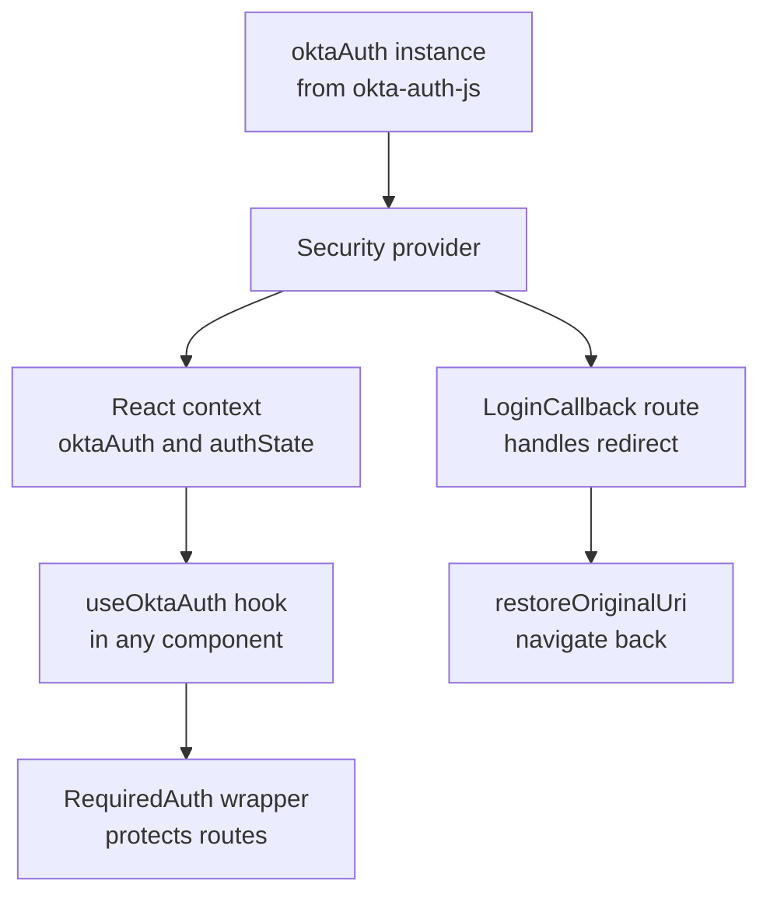
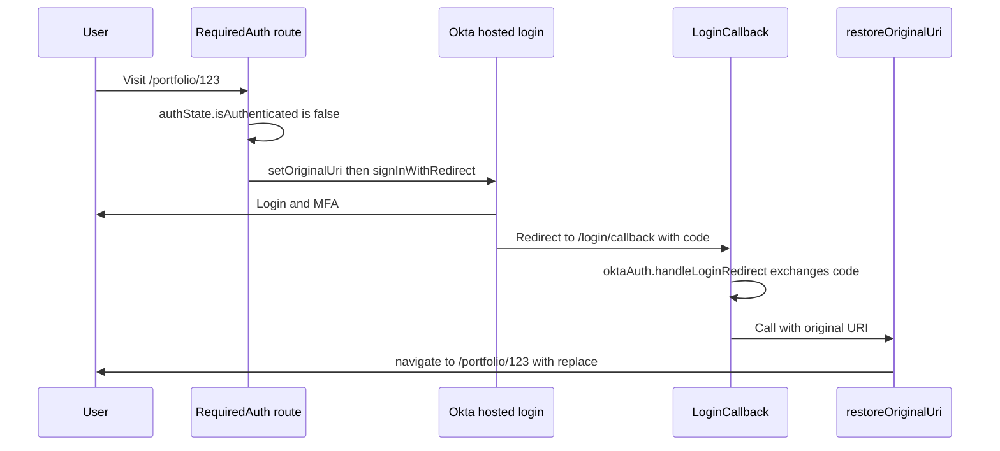
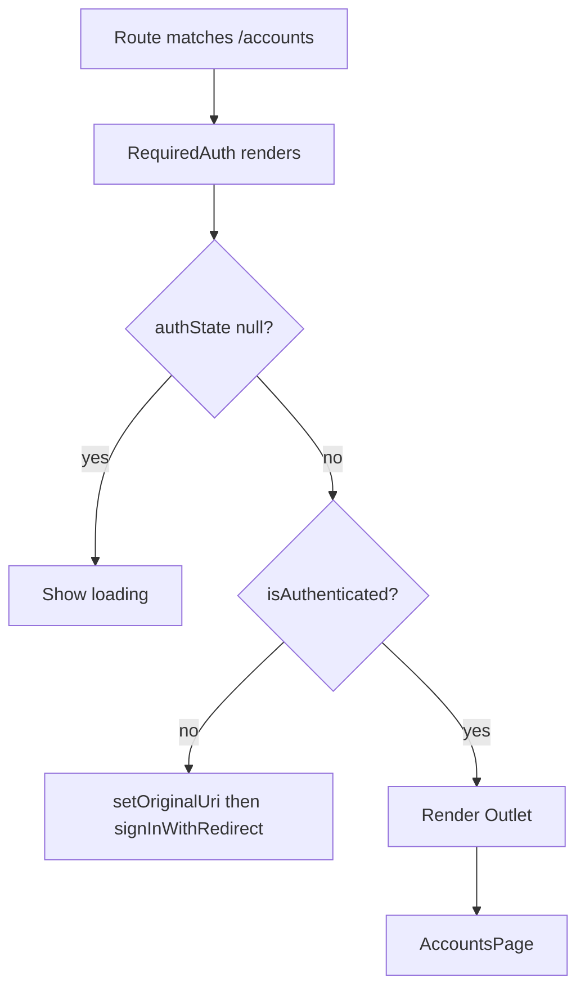

## 1. What it is

**`@okta/okta-react` is a thin React layer over `@okta/okta-auth-js`: a `<Security>` provider, a `useOktaAuth()` hook, a `<LoginCallback>` route component, and (for React Router v5 only) a `<SecureRoute>`.**

Analogy: Okta Auth JS is the building's security system. Okta React is the intercom wired into every room. Any room (component) can press a button and ask "who is at the door, and are they allowed in?" without knowing how the security system is built.

The problem it solves: React components need to re-render when login state changes, and routing needs to send users back to the page they wanted after the Okta redirect. Wiring `authStateManager.subscribe` into React state, handling the callback route, and restoring the original URL by hand is repetitive and easy to get wrong. Okta React does it once.

## 2. Core concepts

### [Beginner] The pieces and how they relate

```tsx
import { Security, useOktaAuth, LoginCallback } from "@okta/okta-react";
// SecureRoute also exists, but only works with react-router-dom v5
```



> **Why:** All real work (PKCE, token storage, renewal) stays in `okta-auth-js`. Okta React only translates it into React concepts: context, re-renders and route components. That is why you always install both packages.

### [Beginner] `<Security>` with oktaAuth and restoreOriginalUri

`<Security>` must sit inside your router (it needs navigation) and above everything that uses auth.

```tsx
// src/App.tsx (React Router v6/v7)
import { Security } from "@okta/okta-react";
import { toRelativeUrl, type OktaAuth } from "@okta/okta-auth-js";
import { useNavigate } from "react-router-dom";
import { oktaAuth } from "./auth/oktaAuth";
import { AppRoutes } from "./AppRoutes";

export function App() {
  const navigate = useNavigate();

  const restoreOriginalUri = async (_oktaAuth: OktaAuth, originalUri: string) => {
    // originalUri is absolute, e.g. "https://app.bank.com/portfolio/123?tab=holdings"
    navigate(toRelativeUrl(originalUri || "/", window.location.origin), { replace: true });
  };

  return (
    <Security oktaAuth={oktaAuth} restoreOriginalUri={restoreOriginalUri}>
      <AppRoutes />
    </Security>
  );
}
```

> **Why `restoreOriginalUri`:** After login, the browser lands on `/login/callback`. Without this hook, the SDK would do a full `window.location` change, reloading the whole SPA. Passing your router's `navigate` keeps it a client-side transition. `replace: true` removes the callback URL from history so "Back" does not re-run the code exchange.

> **Gotcha:** `restoreOriginalUri` is required in okta-react 6.x. Omitting it logs an error. Do not recreate the function in a way that changes identity every render if your version warns about it; wrap it in `useCallback` if needed.

### [Beginner] `useOktaAuth()`

```tsx
import { useOktaAuth } from "@okta/okta-react";

export function Header() {
  const { oktaAuth, authState } = useOktaAuth();

  if (!authState) return <div>Checking session...</div>; // null = still loading
  if (!authState.isAuthenticated) {
    return <button onClick={() => oktaAuth.signInWithRedirect()}>Sign in</button>;
  }
  const name = authState.idToken?.claims.name;
  return (
    <header>
      <span>Welcome, {name}</span>
      <button onClick={() => oktaAuth.signOut()}>Sign out</button>
    </header>
  );
}
```

The hook returns the same `oktaAuth` instance you passed to `<Security>` plus a reactive `authState` that re-renders the component whenever tokens change.

> **Gotcha:** Three states, not two. `authState === null` means "unknown". Treating it as "logged out" causes a redirect to Okta on every page load, then a bounce back.

### [Beginner] `<LoginCallback>`

Mount it at the path that matches your `redirectUri`.

```tsx
import { Routes, Route } from "react-router-dom";
import { LoginCallback } from "@okta/okta-react";

export function AppRoutes() {
  return (
    <Routes>
      <Route path="/login/callback" element={<LoginCallback loadingElement={<FullPageSpinner />} errorComponent={AuthError} />} />
      {/* ... */}
    </Routes>
  );
}

function AuthError({ error }: { error: Error }) {
  return <p role="alert">Sign-in failed: {error.message}</p>;
}
function FullPageSpinner() {
  return <div aria-busy="true">Signing you in...</div>;
}
```



### [Intermediate] `SecureRoute` is React Router v5 only

```tsx
// React Router v5 ONLY
import { Route, Switch } from "react-router-dom"; // v5
import { SecureRoute, LoginCallback } from "@okta/okta-react";

<Switch>
  <Route path="/login/callback" component={LoginCallback} />
  <SecureRoute path="/accounts" component={AccountsPage} />
  <Route path="/" exact component={Home} />
</Switch>;
```

> **Outdated:** `SecureRoute` is built on v5's `<Route>` render props. React Router v6 removed that API (routes must be `<Route element>` and only `<Route>` or `<Fragment>` can be children of `<Routes>`), so `SecureRoute` does not work there. React Router v7 (2024+) keeps the v6 model. Okta's own samples now show a custom wrapper.

### [Intermediate] The v6/v7 pattern: RequiredAuth with `<Outlet>`

```tsx
// src/auth/RequiredAuth.tsx
import { useEffect } from "react";
import { Outlet } from "react-router-dom";
import { useOktaAuth } from "@okta/okta-react";
import { toRelativeUrl } from "@okta/okta-auth-js";

export function RequiredAuth() {
  const { oktaAuth, authState } = useOktaAuth();

  useEffect(() => {
    if (!authState) return;                 // still loading
    if (!authState.isAuthenticated) {
      const originalUri = toRelativeUrl(window.location.href, window.location.origin);
      oktaAuth.setOriginalUri(originalUri); // remember where to come back to
      oktaAuth.signInWithRedirect();
    }
  }, [oktaAuth, authState?.isAuthenticated]); // depend on the boolean, not the object

  if (!authState || !authState.isAuthenticated) {
    return <div aria-busy="true">Loading...</div>;
  }
  return <Outlet />; // render the matched child route
}
```

```tsx
// src/AppRoutes.tsx
<Routes>
  <Route path="/" element={<Home />} />
  <Route path="/login/callback" element={<LoginCallback />} />
  <Route element={<RequiredAuth />}>               {/* layout route, no path */}
    <Route path="/accounts" element={<AccountsPage />} />
    <Route path="/portfolio/:portfolioId" element={<PortfolioPage />} />
    <Route path="/transactions" element={<TransactionsPage />} />
  </Route>
</Routes>
```



> **Why a layout route:** One wrapper protects many children. `<Outlet />` is React Router's slot for "whatever child route matched". This is the standard v6/v7 pattern for any guard: auth, feature flags, permissions.

> **Gotcha:** Depending on the whole `authState` object in `useEffect` can trigger repeated redirects because a new object arrives after every token renewal. Depend on `authState?.isAuthenticated`.

### [Intermediate] Scope or group based guards

```tsx
export function RequireScope({ scope }: { scope: string }) {
  const { authState } = useOktaAuth();
  const scopes = authState?.accessToken?.scopes ?? [];
  if (!scopes.includes(scope)) return <p>You do not have access to this area.</p>;
  return <Outlet />;
}

// <Route element={<RequiredAuth />}>
//   <Route element={<RequireScope scope="payments:write" />}>
//     <Route path="/payments/new" element={<NewPaymentPage />} />
//   </Route>
// </Route>
```

> **Interview tip:** Mention that this is UX only. The payments API must check the `payments:write` scope itself.

### [Advanced] Attaching the access token to Axios

```ts
// src/api/client.ts
import axios, { AxiosError } from "axios";
import { oktaAuth } from "../auth/oktaAuth";

export const api = axios.create({ baseURL: import.meta.env.VITE_API_BASE_URL });

api.interceptors.request.use((config) => {
  const accessToken = oktaAuth.getAccessToken(); // always the latest (after autoRenew)
  if (accessToken) {
    config.headers.Authorization = `Bearer ${accessToken}`;
  }
  return config;
});

let renewing: Promise<unknown> | null = null;

api.interceptors.response.use(undefined, async (error: AxiosError) => {
  const original = error.config as (typeof error.config & { _retried?: boolean }) | undefined;
  if (error.response?.status === 401 && original && !original._retried) {
    original._retried = true;
    try {
      // De-duplicate: ten parallel 401s should cause one renew
      renewing ??= oktaAuth.tokenManager.renew("accessToken").finally(() => (renewing = null));
      await renewing;
      return api(original); // retry once with the new token
    } catch {
      await oktaAuth.signOut();
    }
  }
  return Promise.reject(error);
});
```

> **Why read the token in the interceptor, not once at startup:** autoRenew replaces the access token every few minutes. Capturing it in a closure at app start means you keep sending an expired token.

> **Gotcha:** Only attach the token to your own API origin. If the same Axios instance calls a third-party URL, you leak the user's bearer token. Use a dedicated instance or check `config.baseURL`.

### [Advanced] Logout

```tsx
export function LogoutButton() {
  const { oktaAuth } = useOktaAuth();
  const queryClient = useQueryClient(); // TanStack Query, if used

  const logout = async () => {
    queryClient.clear(); // drop cached balances and transactions from memory
    await oktaAuth.signOut({ postLogoutRedirectUri: `${window.location.origin}/signed-out` });
  };
  return <button onClick={logout}>Sign out</button>;
}
```

> **Finance tip:** Clear every client cache that holds financial data (React Query, Redux, Zustand) before redirecting. Otherwise the next person on a shared device might glimpse the previous user's balances via the back button or a cached render.

## 3. Why it's used in this project

- **Every route except the landing page is protected.** The `RequiredAuth` layout route guards accounts, portfolios and transactions in one place.
- **Deep links survive login.** An advisor clicking `/portfolio/abc?tab=risk` from an email lands there after MFA, thanks to `setOriginalUri` and `restoreOriginalUri`.
- **One Axios client** attaches the Okta access token to all calls to the accounts, payments and reports APIs.
- **Role-based UI.** Scopes and the `groups` claim (from `authState`) decide whether to show approval queues or export buttons.
- **Compliance logout.** The idle timer calls `oktaAuth.signOut()` from the same context, which revokes tokens and ends the Okta session.

## 4. Setup & configuration

```bash
npm install @okta/okta-react @okta/okta-auth-js react-router-dom
```

```ts
// src/auth/oktaAuth.ts
import { OktaAuth } from "@okta/okta-auth-js";

export const oktaAuth = new OktaAuth({
  issuer: import.meta.env.VITE_OKTA_ISSUER,             // custom auth server URL
  clientId: import.meta.env.VITE_OKTA_CLIENT_ID,        // SPA client id
  redirectUri: `${window.location.origin}/login/callback`, // must match the LoginCallback route
  postLogoutRedirectUri: `${window.location.origin}/signed-out`,
  scopes: ["openid", "profile", "email", "offline_access"], // offline_access = refresh token
  pkce: true,                                           // default, keep it
  tokenManager: { storage: "sessionStorage" },          // per-tab storage
  services: { autoRenew: true, autoRemove: true, syncStorage: true },
});
```

```tsx
// src/main.tsx
import React from "react";
import ReactDOM from "react-dom/client";
import { BrowserRouter } from "react-router-dom";
import { App } from "./App";

ReactDOM.createRoot(document.getElementById("root")!).render(
  <React.StrictMode>
    <BrowserRouter>        {/* Router must wrap Security so navigate() works */}
      <App />              {/* App renders <Security oktaAuth restoreOriginalUri> */}
    </BrowserRouter>
  </React.StrictMode>
);
```

Optional `<Security>` props:

```tsx
<Security
  oktaAuth={oktaAuth}
  restoreOriginalUri={restoreOriginalUri}
  // Called by SecureRoute (v5) when auth is required. With RequiredAuth you control this yourself.
  onAuthRequired={() => navigate("/login")}
>
```

> **Gotcha:** React 18/19 StrictMode mounts effects twice in development. `<LoginCallback>` guards against double code exchange in recent versions, but if you hand-roll a callback, make sure `handleLoginRedirect()` runs only once, or the second exchange fails with "invalid_grant" because the code is single-use.

> **Gotcha:** Check the okta-react changelog for the React and React Router versions officially supported by your release. Support for new React majors has historically lagged by a few months.

## 5. Key features we use

### [Beginner] Display the user

```tsx
export function UserBadge() {
  const { authState } = useOktaAuth();
  const claims = authState?.idToken?.claims;
  return claims ? <span title={claims.email}>{claims.name}</span> : null;
}
```

### [Beginner] Fetch userinfo

```tsx
export function useOktaUser() {
  const { oktaAuth, authState } = useOktaAuth();
  const [user, setUser] = useState<Awaited<ReturnType<typeof oktaAuth.getUser>> | null>(null);
  useEffect(() => {
    if (authState?.isAuthenticated) oktaAuth.getUser().then(setUser);
    else setUser(null);
  }, [oktaAuth, authState?.isAuthenticated]);
  return user;
}
```

### [Intermediate] Group check hook

```ts
export function useHasGroup(group: string): boolean {
  const { authState } = useOktaAuth();
  const groups = (authState?.accessToken?.claims as { groups?: string[] } | undefined)?.groups ?? [];
  return groups.includes(group);
}
// const isAdvisor = useHasGroup("Advisors");
```

### [Intermediate] Testing components that use useOktaAuth

```tsx
import { vi } from "vitest";
vi.mock("@okta/okta-react", () => ({
  useOktaAuth: () => ({
    oktaAuth: { signInWithRedirect: vi.fn(), signOut: vi.fn(), getAccessToken: () => "test-token" },
    authState: { isAuthenticated: true, idToken: { claims: { name: "Ada Lovelace" } } },
  }),
}));
```

## 6. Interview questions

#### Q: What does `<Security>` do, and why must it be inside the router?

It puts the `oktaAuth` instance and a reactive `authState` into React context, subscribes to `authStateManager` so consumers re-render on token changes, and (in recent versions) starts the SDK services. It needs to be inside the router because `restoreOriginalUri` usually calls the router's `navigate`, which only works inside a router context.

#### Q: How do you protect routes with React Router v6 or v7, given that SecureRoute does not work?

Create a layout route component, e.g. `RequiredAuth`, that reads `authState` from `useOktaAuth()`. If `authState` is `null`, show a loader. If not authenticated, call `oktaAuth.setOriginalUri(currentPath)` and `signInWithRedirect()` in an effect. If authenticated, render `<Outlet />`. Nest protected routes under `<Route element={<RequiredAuth />}>`. `SecureRoute` relied on v5's `<Route>` render API, which v6 removed.

#### Q: What happens on `/login/callback`?

`<LoginCallback>` calls `oktaAuth.handleLoginRedirect()`. It reads the `code` and `state` from the URL, validates `state`, exchanges the code with the PKCE `code_verifier` at the token endpoint, validates the ID token, stores tokens, then calls your `restoreOriginalUri` with the saved original URI. On error it renders `errorComponent`.

#### Q: How do you attach the access token to API requests safely?

Use an Axios request interceptor that calls `oktaAuth.getAccessToken()` on every request, so you always send the latest renewed token. Only attach it for your own API base URL. Add a response interceptor that, on 401, renews once (de-duplicated across concurrent requests) and retries, and signs out if renewal fails. Treat 403 as "not allowed", not "log in again".

#### Q: Why is `authState` null initially, and how should components handle it?

The SDK must read storage, check expiry and possibly renew before it knows the answer. Until then `authState` is `null`. Components should render a loading state, not redirect to login. Redirecting on `null` causes login loops and flicker.

## 7. Drawbacks & pain points

- **`SecureRoute` is legacy**, so every v6/v7 app writes its own guard, and many tutorials online are wrong for current routers.
- **Two packages to keep in sync** (`okta-react` peer-depends on specific `okta-auth-js` ranges).
- **Tokens are readable by JS** (default storage), so XSS exposure is the same as the core SDK.
- **Client-only.** It does not help with SSR frameworks (Next.js, React Router framework mode) where auth should be server-side.
- **Lagging support** for new React and router majors.

Gotchas that trip devs up:

```tsx
// 1. Security outside the Router
<Security oktaAuth={oktaAuth} restoreOriginalUri={r}><BrowserRouter>...</BrowserRouter></Security>
// useNavigate() in restoreOriginalUri throws: must be used within a Router

// 2. Redirecting when authState is null
if (!authState?.isAuthenticated) oktaAuth.signInWithRedirect(); // fires during loading

// 3. Capturing the token once
const token = oktaAuth.getAccessToken();
api.defaults.headers.common.Authorization = `Bearer ${token}`; // stale after renewal

// 4. LoginCallback path not matching redirectUri exactly -> callback never handled
```

## 8. Better alternatives

For pure SPAs that may change identity provider, standards-based libraries reduce lock-in. For high-security apps, the industry is moving auth to the server (BFF or SSR framework sessions) so React only sees "logged in or not" and never touches tokens.

| Option | Bundle (gzip) | Boilerplate | Router support | TypeScript | Community | When it wins |
|---|---|---|---|---|---|---|
| @okta/okta-react | ~5 KB plus okta-auth-js ~50 KB+ | Medium, custom guard needed | v5 built in, v6/v7 manual | Good | Medium | Existing Okta SPA |
| react-oidc-context (oidc-client-ts) | ~20 KB total | Medium | Manual guard | Good | Medium | Any OIDC IdP, Okta included |
| @auth0/auth0-react | ~15 KB | Low, withAuthenticationRequired | Router-agnostic | Good | Large | Auth0 |
| Auth.js / NextAuth (server sessions) | ~0 KB token code on client | Medium | Framework-native | Good | Large | Next.js apps, BFF style |
| Custom BFF + HttpOnly cookie | Minimal | Higher | Any | Any | n/a | Banking-grade security reviews |

## 9. When NOT to use it

- Server-rendered React (Next.js App Router, React Router framework mode) where you can use server sessions.
- Apps that are not on Okta, or plan to move off it.
- When the security team requires tokens never be accessible to JavaScript (use a BFF).
- Tiny internal tools where the core `okta-auth-js` plus a single hook is simpler.
- React Router v6/v7 apps expecting `SecureRoute` to just work.

## Cheatsheet

| Need | Code |
|---|---|
| Provider | `<Security oktaAuth={oktaAuth} restoreOriginalUri={fn}>` |
| Restore URL | `navigate(toRelativeUrl(uri ?? "/", location.origin), { replace: true })` |
| Hook | `const { oktaAuth, authState } = useOktaAuth()` |
| Loading | `authState === null` |
| Logged in | `authState?.isAuthenticated` |
| Claims | `authState?.idToken?.claims.name` |
| Scopes | `authState?.accessToken?.scopes` |
| Callback | `<Route path="/login/callback" element={<LoginCallback />} />` |
| Guard v5 | `<SecureRoute path="/x" component={X} />` |
| Guard v6/v7 | `<Route element={<RequiredAuth />}>...children</Route>` |
| Token | `oktaAuth.getAccessToken()` |
| Logout | `oktaAuth.signOut()` |

```tsx
function RequiredAuth() {
  const { oktaAuth, authState } = useOktaAuth();
  useEffect(() => {
    if (authState && !authState.isAuthenticated) {
      oktaAuth.setOriginalUri(toRelativeUrl(location.href, location.origin));
      oktaAuth.signInWithRedirect();
    }
  }, [oktaAuth, authState?.isAuthenticated]);
  return authState?.isAuthenticated ? <Outlet /> : <Spinner />;
}

api.interceptors.request.use((c) => {
  const t = oktaAuth.getAccessToken();
  if (t) c.headers.Authorization = `Bearer ${t}`;
  return c;
});
```
