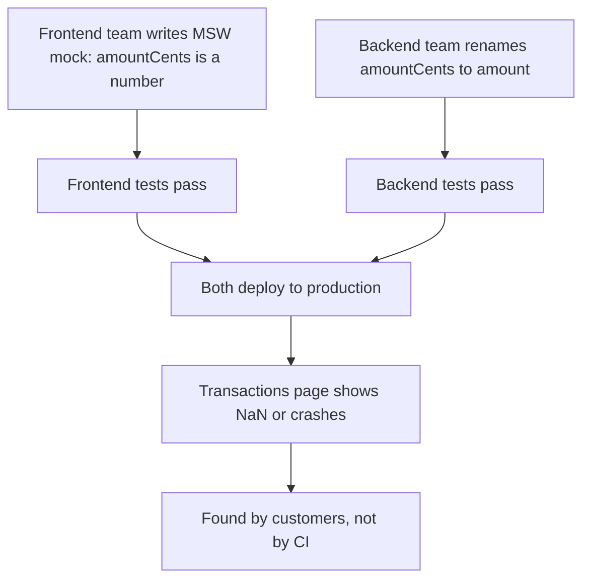
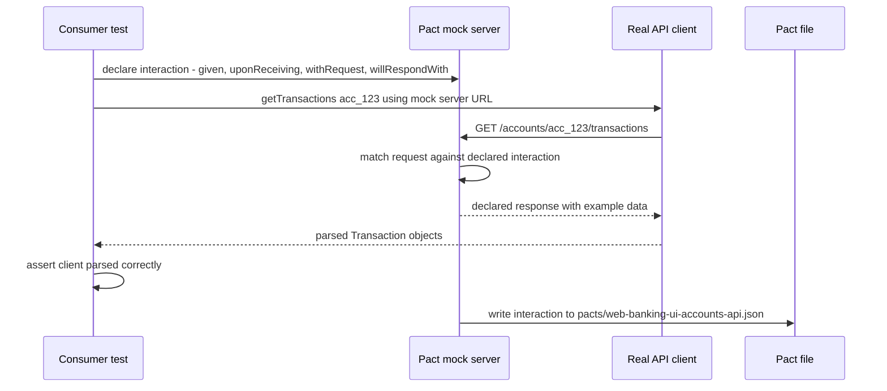
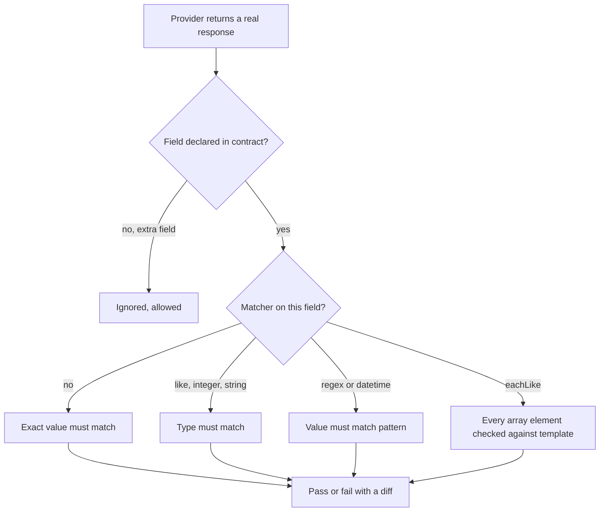
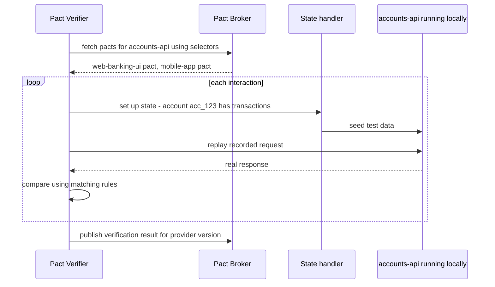
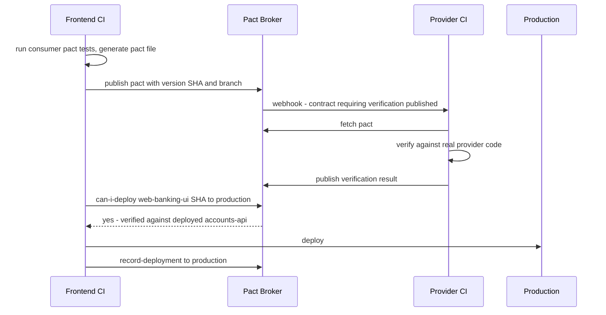
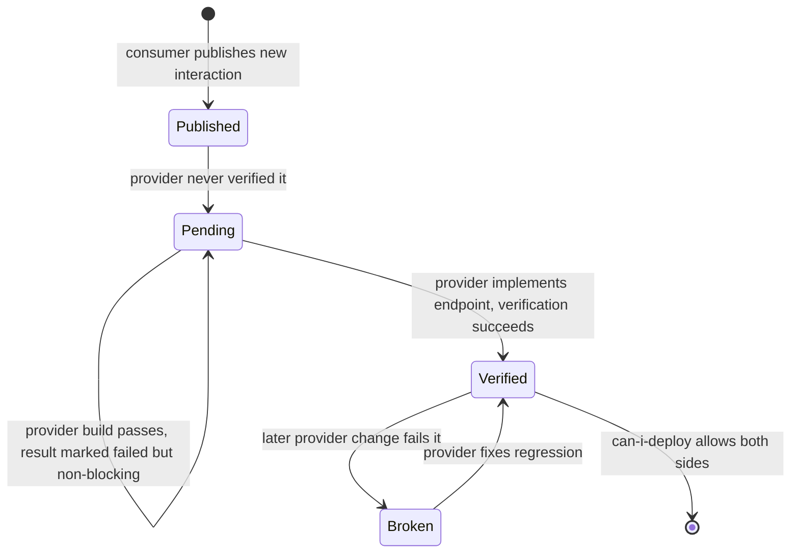
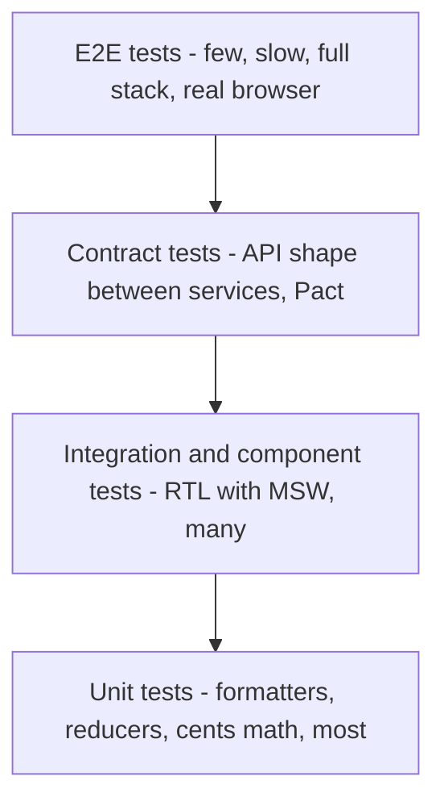
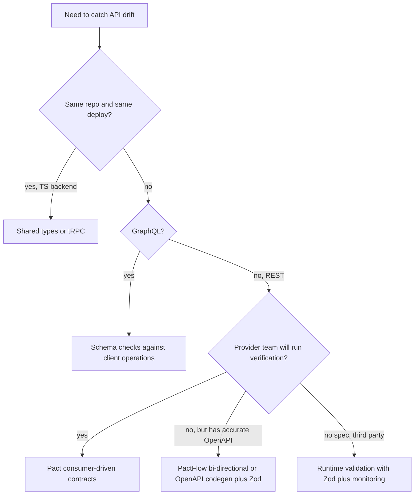

## 1. What it is

**Pact is a consumer-driven contract testing tool: the API client (consumer) records the requests it makes and the responses it needs, and the API (provider) replays those recordings against its real code to prove it still satisfies them.**

Think of a restaurant and a food supplier. The restaurant writes a purchase order: "every Monday, 10 kg of tomatoes, ripe, in crates of 5 kg". The supplier checks each new delivery process against that order before changing anything. If the supplier wants to switch to 10 kg sacks, the order immediately says "no, this customer needs crates". Nobody has to cook a full dinner (an end-to-end test) to discover the problem. The purchase order is the contract.

The problem it solves: the frontend and backend are built and deployed by different teams on different schedules. The frontend mocks the API (with MSW or fixtures). The backend renames `amountCents` to `amount` or makes `currency` optional. Both test suites stay green, because each tests against its own assumptions. Production breaks. Pact turns the frontend's assumptions into an executable file that the backend's CI must pass before it can deploy.

## 2. Core concepts

### [Beginner] Integration drift: why mocks alone are not enough



Each side tests in isolation against **its own idea** of the API. Nothing connects the two ideas. The traditional fix is an end-to-end test environment with everything deployed together. That works, but it is slow, flaky, expensive, and finds the problem late (after both sides merged).

> **Why:** A mock is a claim about another system. A claim that is never checked against the real system drifts over time. Contract testing is a way to *check the claim* continuously, cheaply, and on each side's own CI.

### [Beginner] Vocabulary

- **Consumer** — the side that calls the API. Here: the React web app (or its API client module).
- **Provider** — the side that serves the API. Here: for example `accounts-api`.
- **Interaction** — one request and its expected response, plus a description and an optional provider state.
- **Pact file (the contract)** — a JSON file listing all interactions between one consumer and one provider.
- **Provider state** — a named precondition, such as "account acc_123 has 2 transactions", that the provider sets up before replaying an interaction.
- **Pact Broker** — a server that stores pact files and verification results, versioned by git commit, branch and environment. **PactFlow** is the commercial hosted version (from SmartBear) with extra features.
- **Verification** — the provider replaying each interaction against its real running code and comparing responses.
- **can-i-deploy** — a CLI query to the broker: "is this version compatible with everything already in production?"

### [Beginner] Consumer-driven: who writes the contract and why

In **consumer-driven contracts**, the consumer writes the contract, because only the consumer knows which fields it actually uses.

```ts
// The backend returns 25 fields per transaction.
// Our TransactionRow component uses only these 5. The contract lists only these 5.
interface TransactionDto {
  id: string;
  description: string;
  amountCents: number;
  currency: string;     // ISO 4217
  postedAt: string;     // ISO 8601
}
```

This follows the robustness principle: the consumer is strict about the fields it needs and ignores everything else. The provider is then free to add fields, remove fields no consumer uses, or refactor internals. It only breaks the build when it would break a real consumer.

> **Why consumer-driven and not provider-driven?** A provider-written spec (like OpenAPI) says what the provider *offers*. It cannot tell the provider which parts are safe to change. A consumer-written contract says what is *used*, so the provider knows exactly what it must keep.

> **Interview tip:** The key phrase is "a contract test checks that both sides agree on the shape of the messages, not that the provider's business logic is correct". Pact is not a functional test of the backend.

### [Intermediate] The consumer test: Pact as a smart mock server

On the consumer side, Pact starts a local mock server. Your test declares the interaction, then calls your **real API client** against that mock server. If the client sends the declared request, Pact replies with the declared response and records the interaction into a pact file. If the client sends something different, the test fails.



The API client under test:

```ts
// src/api/accountsClient.ts
export interface Transaction {
  id: string;
  description: string;
  amountCents: number;
  currency: string;
  postedAt: Date;
}

export function createAccountsClient(baseUrl: string, getToken: () => string) {
  return {
    async getTransactions(accountId: string, page = 1): Promise<Transaction[]> {
      const res = await fetch(`${baseUrl}/accounts/${accountId}/transactions?page=${page}`, {
        headers: { Accept: 'application/json', Authorization: `Bearer ${getToken()}` },
      });
      if (!res.ok) throw new Error(`Failed to load transactions: ${res.status}`);
      const body = (await res.json()) as { items: Array<Omit<Transaction, 'postedAt'> & { postedAt: string }> };
      return body.items.map((t) => ({ ...t, postedAt: new Date(t.postedAt) }));
    },
  };
}
```

### [Intermediate] Writing a consumer test with PactV3

```ts
// src/api/accountsClient.pact.test.ts
import path from 'node:path';
import { describe, it, expect } from 'vitest';
import { PactV3, MatchersV3 } from '@pact-foundation/pact';
import { createAccountsClient } from './accountsClient';

const { like, eachLike, integer, string, regex, datetime } = MatchersV3;

const provider = new PactV3({
  consumer: 'web-banking-ui',               // must match the name used in the broker
  provider: 'accounts-api',
  dir: path.resolve(process.cwd(), 'pacts'), // where the pact JSON is written
  logLevel: 'warn',
});

describe('accounts-api contract', () => {
  it('returns transactions for an account', () => {
    provider
      .given('account acc_123 has transactions')                 // provider state
      .uponReceiving('a request for page 1 of acc_123 transactions') // unique description
      .withRequest({
        method: 'GET',
        path: '/accounts/acc_123/transactions',
        query: { page: '1' },
        headers: {
          Accept: 'application/json',
          Authorization: like('Bearer some-token'),               // any string, example shown
        },
      })
      .willRespondWith({
        status: 200,
        headers: { 'Content-Type': regex('application/json.*', 'application/json') },
        body: {
          items: eachLike({                                        // array of at least 1 like this
            id: string('tx_1'),
            description: string('Payroll deposit'),
            amountCents: integer(250000),                          // must be an integer, not 2500.00
            currency: regex('^[A-Z]{3}$', 'USD'),                  // ISO 4217 code
            postedAt: datetime("yyyy-MM-dd'T'HH:mm:ss'Z'", '2026-09-01T10:00:00Z'),
          }),
        },
      });

    return provider.executeTest(async (mockServer) => {
      const client = createAccountsClient(mockServer.url, () => 'some-token');
      const transactions = await client.getTransactions('acc_123', 1);

      expect(transactions[0]).toEqual({
        id: 'tx_1',
        description: 'Payroll deposit',
        amountCents: 250000,
        currency: 'USD',
        postedAt: new Date('2026-09-01T10:00:00Z'),
      });
    });
  });
});
```

Reading the builder chain:

| Step | Meaning |
|---|---|
| `given(state, params?)` | precondition the provider must set up before replay |
| `uponReceiving(description)` | human-readable unique name of the interaction |
| `withRequest({...})` | what the consumer will send: method, path, query, headers, body |
| `willRespondWith({...})` | what the consumer needs back: status, headers, body |
| `executeTest(fn)` | starts the mock server, runs your code, verifies, writes the pact |

> **Gotcha:** `executeTest` fails if your code did **not** make the declared request, or made extra unexpected ones. Pact checks both directions on the consumer side: you used what you declared, and you declared what you used.

> **Gotcha:** Test your **API client function**, not a React component. Rendering components in a pact test adds noise and makes the contract depend on UI behavior. The contract is between the HTTP layer and the server.

### [Intermediate] Matchers: contracts about shape, not exact values

Without matchers, the provider would have to return *exactly* `tx_1` and `250000`, which is impossible with real data. Matchers say "any value like this".

```ts
import { MatchersV3 } from '@pact-foundation/pact';
const {
  like,          // same type as the example (string, number, object - recursively)
  eachLike,      // array where every element matches the template, min length 1 by default
  atLeastOneLike,// same idea, explicit minimum
  integer,       // integer number
  decimal,       // number with a fractional part
  number,        // any number
  string,        // any string
  boolean,       // any boolean
  regex,         // string matching a pattern: regex(pattern, example)
  datetime,      // string matching a date format: datetime(format, example)
  uuid,          // UUID string
  nullValue,     // explicitly null
} = MatchersV3;

const accountBody = {
  id: uuid('3f2b8c4e-9a1d-4c7e-8f20-5b6a7c8d9e01'),
  type: regex('^(CHECKING|SAVINGS|BROKERAGE)$', 'CHECKING'), // closed set of values
  maskedNumber: regex('^••••\\d{4}$', '••••4821'),           // never the full number
  balance: {
    amountCents: integer(1234567),
    currency: regex('^[A-Z]{3}$', 'USD'),
  },
  owners: eachLike({ name: string('Ada Lovelace') }, 1),
  closedAt: nullValue(),
};
```

How matching works during verification:



> **Finance tip:** Use `integer()` for `amountCents`. If the backend ever switches to a float like `12345.67`, verification fails. That is exactly the kind of silent change that causes rounding bugs in balances. Use `regex` for currency codes and enums like transaction status, so a new status value the UI cannot render is caught.

> **Gotcha:** Overusing `like()` on a whole body makes the contract too loose. `like({ status: 'POSTED' })` accepts `status: 'ANYTHING'`. If the UI switches on the value, pin it with `regex` or an exact value.

> **Gotcha:** Exact values in **requests** are fine and often right (paths, query params you control). Matchers in requests are for values you do not control, like auth tokens or generated IDs.

### [Intermediate] The same test with PactV4

`PactV4` uses a fluent builder per interaction and supports newer spec features (multiple interaction types in one pact, plugins). The matchers are the same `MatchersV3`. For new code, PactV4 is the recommended API in recent Pact JS versions; PactV3 remains supported.

```ts
import path from 'node:path';
import { PactV4, MatchersV3 } from '@pact-foundation/pact';
import { createPaymentsClient } from './paymentsClient';

const { integer, regex, string, uuid } = MatchersV3;

const pact = new PactV4({
  consumer: 'web-banking-ui',
  provider: 'payments-api',
  dir: path.resolve(process.cwd(), 'pacts'),
});

it('creates a payment', async () => {
  await pact
    .addInteraction()
    .given('account acc_123 has sufficient funds')
    .uponReceiving('a request to create a bill payment')
    .withRequest('POST', '/payments', (builder) => {
      builder
        .headers({
          'Content-Type': 'application/json',
          'Idempotency-Key': uuid('8a9b0c1d-2e3f-4a5b-8c6d-7e8f9a0b1c2d'),
        })
        .jsonBody({
          fromAccountId: 'acc_123',
          payeeId: 'payee_water',
          amountCents: 4200,
          currency: 'USD',
        });
    })
    .willRespondWith(201, (builder) => {
      builder.jsonBody({
        id: string('pay_1'),
        status: regex('^(PENDING|SCHEDULED)$', 'PENDING'),
        amountCents: integer(4200),
      });
    })
    .executeTest(async (mockServer) => {
      const client = createPaymentsClient(mockServer.url);
      const payment = await client.createPayment({
        fromAccountId: 'acc_123',
        payeeId: 'payee_water',
        amountCents: 4200,
        currency: 'USD',
      });
      expect(payment.status).toBe('PENDING');
    });
});
```

### [Intermediate] Error and edge-case interactions

Contracts should cover the responses the UI handles, not just the happy path.

```ts
it('returns 404 for an unknown account', () => {
  provider
    .given('account acc_missing does not exist')
    .uponReceiving('a request for a non-existent account')
    .withRequest({ method: 'GET', path: '/accounts/acc_missing' })
    .willRespondWith({
      status: 404,
      body: { code: 'ACCOUNT_NOT_FOUND', message: like('Account not found') },
    });

  return provider.executeTest(async (mockServer) => {
    const client = createAccountsClient(mockServer.url, () => 't');
    await expect(client.getAccount('acc_missing')).rejects.toThrow(/not found/i);
  });
});
```

> **Gotcha:** Do not encode business rules ("transfers above 10,000 return 422 with LIMIT_EXCEEDED for retail customers") as dozens of contract cases. Pick one interaction per response **shape** the UI handles. Business rules belong in the provider's own functional tests.

### [Intermediate] The pact file

After a passing consumer run, Pact writes a JSON file. This file is the contract.

```json
{
  "consumer": { "name": "web-banking-ui" },
  "provider": { "name": "accounts-api" },
  "interactions": [
    {
      "description": "a request for page 1 of acc_123 transactions",
      "providerStates": [{ "name": "account acc_123 has transactions" }],
      "request": {
        "method": "GET",
        "path": "/accounts/acc_123/transactions",
        "query": { "page": ["1"] },
        "headers": { "Accept": "application/json", "Authorization": "Bearer some-token" },
        "matchingRules": { "header": { "Authorization": { "combine": "AND", "matchers": [{ "match": "type" }] } } }
      },
      "response": {
        "status": 200,
        "body": { "items": [{ "id": "tx_1", "amountCents": 250000, "currency": "USD" }] },
        "matchingRules": {
          "body": {
            "$.items": { "combine": "AND", "matchers": [{ "match": "type", "min": 1 }] },
            "$.items[*].amountCents": { "combine": "AND", "matchers": [{ "match": "integer" }] },
            "$.items[*].currency": { "combine": "AND", "matchers": [{ "match": "regex", "regex": "^[A-Z]{3}$" }] }
          }
        }
      }
    }
  ],
  "metadata": { "pactSpecification": { "version": "3.0.0" } }
}
```

(Trimmed for readability. Real files contain every field and rule.)

> **Why JSON and not code?** The provider may be written in Java, Kotlin, Go, .NET or Python. A language-neutral file lets any Pact implementation verify it. The matching engine itself is a shared Rust core used by most Pact libraries.

### [Advanced] Provider verification and provider states

On the provider side, the team runs its real service (usually with a test database or stubbed downstream dependencies) and runs the Pact **Verifier**. It fetches pacts from the broker, and for each interaction:

1. Calls the provider-state handler (seed data for "account acc_123 has transactions").
2. Sends the recorded request to the running provider.
3. Compares the real response with the contract using the matching rules.
4. Publishes the result to the broker.



Provider verification in a Node provider (JVM, Go and .NET providers have equivalents, for example `@State` methods in pact-jvm):

```ts
// accounts-api/test/pact.verify.test.ts  (provider repo)
import { Verifier } from '@pact-foundation/pact';
import { startServer } from '../src/server';
import { db } from '../src/db';

it('satisfies all consumer contracts', async () => {
  const server = await startServer({ port: 8081 });

  await new Verifier({
    provider: 'accounts-api',
    providerBaseUrl: 'http://localhost:8081',

    // Where pacts come from
    pactBrokerUrl: process.env.PACT_BROKER_BASE_URL,
    pactBrokerToken: process.env.PACT_BROKER_TOKEN,
    consumerVersionSelectors: [
      { mainBranch: true },          // latest pact from each consumer's main branch
      { deployedOrReleased: true },  // versions currently in any environment
      { matchingBranch: true },      // consumer branch with the same name as this provider branch
    ],
    enablePending: true,             // new, never-verified pacts do not fail the provider build
    includeWipPactsSince: '2026-01-01',

    // Who is verifying
    providerVersion: process.env.GIT_SHA,
    providerVersionBranch: process.env.GIT_BRANCH,
    publishVerificationResult: process.env.CI === 'true', // only CI publishes, never laptops

    // Provider states: map names from given() to setup code
    stateHandlers: {
      'account acc_123 has transactions': async () => {
        await db.reset();
        await db.accounts.insert({ id: 'acc_123', currency: 'USD' });
        await db.transactions.insert([
          { id: 'tx_9', accountId: 'acc_123', description: 'Rent', amountCents: -120000, currency: 'USD' },
        ]);
      },
      'account acc_missing does not exist': async () => {
        await db.reset();
      },
    },

    // Auth: the contract uses a fake token, so inject a valid one
    requestFilter: (req, _res, next) => {
      req.headers.authorization = `Bearer ${process.env.TEST_SERVICE_TOKEN}`;
      next();
    },
  }).verifyProvider();

  await server.close();
});
```

> **Why provider states?** The consumer's example says `acc_123`. The provider's test database does not magically contain it. A state name is a promise: "before replaying, put the world in this shape". It keeps contracts independent of whatever data happens to exist.

> **Gotcha:** State names are matched as exact strings. A typo between `given('account acc_123 has transactions')` and the handler key means the handler never runs, and verification fails with a confusing 404. Agree on state names with the provider team before writing tests.

> **Finance tip:** Okta-protected APIs need a valid token for verification. Use `requestFilter` to swap the contract's placeholder token with a test token, or run the provider with auth middleware stubbed. Never put a real token in a pact file; pact files are stored in the broker and visible to many teams.

### [Advanced] Pact Broker, versions, and can-i-deploy

The broker turns contracts into a **compatibility matrix**: which consumer versions were verified against which provider versions, and which versions are deployed where.

```bash
# 1. Consumer CI: publish the pact, tagged with the git SHA and branch
npx pact-broker publish ./pacts \
  --consumer-app-version "$GIT_SHA" \
  --branch "$GIT_BRANCH" \
  --broker-base-url "$PACT_BROKER_BASE_URL" \
  --broker-token "$PACT_BROKER_TOKEN"

# 2. Before deploying anything: ask the matrix
npx pact-broker can-i-deploy \
  --pacticipant web-banking-ui \
  --version "$GIT_SHA" \
  --to-environment production \
  --retry-while-unknown 10 --retry-interval 30   # wait for provider verification to finish

# 3. After a successful deploy: tell the broker what is live
npx pact-broker record-deployment \
  --pacticipant web-banking-ui \
  --version "$GIT_SHA" \
  --environment production
```

The full workflow across both teams:



The same check protects the provider: before `accounts-api` deploys, `can-i-deploy --pacticipant accounts-api` checks it against every consumer version currently in production. If the web app in production still needs `amountCents`, the backend cannot deploy the rename.

> **Why versions are git SHAs:** A contract is only meaningful for a specific build. Using SHAs (not "latest") lets the broker answer "this exact frontend build with that exact backend build", which is what deployment needs.

> **Outdated:** Older guides use **tags** (`--tag main`, `--tag prod`) and `create-version-tag`. Since 2021 the recommended model is **branches** plus **environments** with `record-deployment` / `record-release`. Tags still work but are legacy.

> **Gotcha:** The `pact-broker` CLI is distributed separately from the Pact JS library (npm `@pact-foundation/pact-cli`, a Docker image `pactfoundation/pact-cli`, or standalone binaries). Check which one your CI uses; flag names are the same.

### [Advanced] Pending pacts, WIP pacts, and the chicken-and-egg problem

When the frontend adds a new interaction for an endpoint that does not exist yet, the provider build would fail immediately. Pact solves this:

- **Pending pacts** (`enablePending: true`): a pact that the provider has never successfully verified does not fail the provider build. Results are still published, so the consumer's `can-i-deploy` says no until the provider implements it.
- **WIP pacts** (`includeWipPactsSince`): the provider also verifies pacts from feature branches it was not explicitly asked about, as pending, so teams see upcoming changes early.



### [Advanced] Bi-directional contract testing (PactFlow)

Some providers cannot run Pact verification (third-party APIs, teams unwilling to adopt it). PactFlow offers **bi-directional contract testing**: the provider uploads its **OpenAPI spec** plus evidence it tested against it (for example a Schemathesis or Dredd run). PactFlow statically compares the consumer pact to the spec. It is weaker than replaying requests against real code, but much easier to adopt.

```bash
# Provider publishes its OpenAPI spec as the provider contract (PactFlow only)
npx pactflow publish-provider-contract openapi.yaml \
  --provider accounts-api \
  --provider-app-version "$GIT_SHA" \
  --branch "$GIT_BRANCH" \
  --content-type application/yaml \
  --verification-exit-code 0 \
  --verification-results ./schemathesis-report.txt \
  --verification-results-content-type text/plain \
  --verifier schemathesis
```

> **Gotcha:** An OpenAPI spec says what the provider *claims*, and the comparison is only as good as the spec's accuracy. Bi-directional is "trust but verify the documentation", not "verify the code".

## 3. Why it's used in this project

Financial frontends depend on many backend services: accounts, transactions, payments, market data, statements, user profile. Each is owned by a different team with its own release schedule.

- **Money fields cannot drift.** A provider switching `amountCents: 123456` to `amount: "1234.56"` (string) or `amount: 1234.56` (float) causes wrong balances, not just a crash. Contracts with `integer()` on cent fields make that change impossible to deploy while the UI depends on it.
- **Enum safety.** Transaction status (`PENDING`, `POSTED`, `REVERSED`) and account type drive UI badges and allowed actions. A `regex` matcher on these catches a new value the UI cannot handle.
- **PII contracts.** A matcher like `regex('^••••\\d{4}$', '••••4821')` on `maskedNumber` documents and enforces that the API sends masked account numbers to the browser, never the full value.
- **Independent deploys.** Regulated orgs often have strict change windows. `can-i-deploy` lets the frontend ship on its own schedule with evidence that it works with what is in production, without a shared staging slot.
- **Audit evidence.** The broker keeps a history of which versions were verified together. That record helps with change-management questions ("how do you know this release is compatible?").
- **Fewer flaky e2e tests.** E2E suites against shared environments with seeded bank data are slow and fragile. Contracts take over the "does the API shape match?" job, so e2e can shrink to a few critical journeys (login, transfer, statement download).

> **Finance tip:** Start with the endpoints where a wrong shape costs money or trust: balances, transactions, payments, transfers. Leave low-risk endpoints (feature flags, UI preferences) for later or never.

## 4. Setup & configuration

Consumer (frontend) install:

```bash
npm i -D @pact-foundation/pact      # includes a native Rust core; needs a supported OS/arch
npm i -D @pact-foundation/pact-cli  # pact-broker CLI for publish and can-i-deploy (or use Docker)
```

Keep pact tests separate from fast unit tests, because they start mock servers and write files:

```ts
// vitest.pact.config.ts
import { defineConfig } from 'vitest/config';

export default defineConfig({
  test: {
    include: ['src/**/*.pact.test.ts'], // only contract tests
    environment: 'node',                // API clients do not need jsdom
    pool: 'forks',                      // native core plays best with process isolation
    fileParallelism: false,             // avoid concurrent writes to the same pact file
    testTimeout: 30_000,                // mock server startup can be slow on CI
  },
});
```

`package.json` scripts:

```json
{
  "scripts": {
    "test:pact": "rimraf pacts && vitest run --config vitest.pact.config.ts",
    "pact:publish": "pact-broker publish ./pacts --consumer-app-version $GIT_SHA --branch $GIT_BRANCH",
    "pact:can-i-deploy": "pact-broker can-i-deploy --pacticipant web-banking-ui --version $GIT_SHA --to-environment production",
    "pact:record": "pact-broker record-deployment --pacticipant web-banking-ui --version $GIT_SHA --environment production"
  }
}
```

Environment variables read by the CLI and Verifier:

```bash
PACT_BROKER_BASE_URL=https://pact-broker.internal.example.com  # or https://<org>.pactflow.io
PACT_BROKER_TOKEN=***            # PactFlow / token auth. Self-hosted may use username/password instead
GIT_SHA=$(git rev-parse HEAD)    # version of this build
GIT_BRANCH=$(git rev-parse --abbrev-ref HEAD)
```

CI pipeline sketch (GitHub Actions style):

```yaml
jobs:
  contract:
    steps:
      - run: npm ci
      - run: npm run test:pact             # generate pacts
      - run: npm run pact:publish          # upload to broker
  deploy:
    needs: contract
    steps:
      - run: npm run pact:can-i-deploy     # gate: blocks if incompatible with production
      - run: ./deploy.sh production
      - run: npm run pact:record           # tell broker what is live
```

Self-hosting the broker (open source) is a Docker image `pactfoundation/pact-broker` backed by PostgreSQL. PactFlow is the SaaS option with SSO, teams, and bi-directional testing.

> **Gotcha:** Pact JS wraps a native Rust library. Unusual CI images (Alpine with musl, some ARM runners) have historically needed extra setup. Check the Pact JS README for supported platforms before choosing a base image.

## 5. Key features we use

### [Beginner] One pact test per client function

```ts
describe('accountsClient contract', () => {
  it('getAccount returns account summary', () => { /* given/uponReceiving/... */ });
  it('getTransactions returns a page of transactions', () => { /* ... */ });
  it('getAccount handles 404', () => { /* ... */ });
});
```

### [Intermediate] Provider state with parameters

```ts
provider
  .given('account exists', { accountId: 'acc_123', currency: 'EUR' })
  .uponReceiving('a request for a EUR account')
  .withRequest({ method: 'GET', path: '/accounts/acc_123' })
  .willRespondWith({
    status: 200,
    body: { id: 'acc_123', balance: { amountCents: integer(500000), currency: 'EUR' } },
  });

// Provider side
stateHandlers: {
  'account exists': async (params) => {
    const { accountId, currency } = params as { accountId: string; currency: string };
    await db.accounts.insert({ id: accountId, currency });
  },
},
```

### [Intermediate] Reusable response fragments

```ts
// src/api/pact/fragments.ts
import { MatchersV3 } from '@pact-foundation/pact';
const { integer, regex } = MatchersV3;

export const money = (amountCents: number, currency = 'USD') => ({
  amountCents: integer(amountCents),
  currency: regex('^[A-Z]{3}$', currency),
});

export const transactionStatus = regex('^(PENDING|POSTED|REVERSED)$', 'POSTED');
```

### [Advanced] Generating pacts from MSW handlers

If the team already has MSW mocks, `@pactflow/pact-msw-adapter` can record MSW-intercepted traffic into pact files. It is quicker to adopt, but you lose explicit matchers and provider states unless you add them, so contracts tend to be stricter (exact values) or need post-processing. Treat it as a migration aid; check that the adapter supports your MSW major version.

### [Advanced] Gate deployment in both directions

```bash
# Frontend deploy gate
pact-broker can-i-deploy --pacticipant web-banking-ui --version "$GIT_SHA" --to-environment production

# Backend deploy gate (run by the provider team)
pact-broker can-i-deploy --pacticipant accounts-api --version "$GIT_SHA" --to-environment production
```

## 6. Interview questions

#### Q: What problem does contract testing solve that unit tests with mocks do not?

Mocks encode one side's assumptions about another system, and nothing checks those assumptions against the real system. When the provider changes its API, both test suites stay green and production breaks. Contract testing records the consumer's expectations as a contract and makes the provider verify its real code against it on every build, so drift is caught on CI before deploy, without a full integrated environment.

#### Q: What does "consumer-driven" mean, and why is it useful?

The consumer writes the contract based on what it actually uses: which requests it sends and which response fields it reads. The provider must satisfy all consumer contracts. This tells the provider exactly which parts of its API are in use, so it can safely add fields, remove unused ones, or refactor. A provider-written spec only says what is offered, not what is depended on.

#### Q: Walk through the Pact workflow from a frontend change to production.

1. The consumer test declares interactions (`given`, `uponReceiving`, `withRequest`, `willRespondWith`) and runs the real API client against Pact's mock server, which writes a pact file.
2. CI publishes the pact to the broker with the git SHA and branch.
3. A broker webhook triggers provider verification: the provider runs its real service, state handlers seed data, the verifier replays each request and compares responses using matchers, then publishes results.
4. Before deploying, the consumer runs `can-i-deploy --to-environment production`, which checks the matrix against the provider version in production.
5. After deploy, `record-deployment` tells the broker what is live. The provider runs the same gate before its own deploys.

#### Q: What are provider states and why are they needed?

A provider state is a named precondition attached to an interaction with `given()`, like "account acc_123 has transactions". During verification, the provider runs a handler for that name to set up the data before replaying the request. Without states, the contract would depend on whatever data happens to exist in the provider's test database, making verification non-deterministic. State names must match exactly on both sides.

#### Q: When would you choose Pact over e2e tests or MSW mocks?

MSW mocks are for fast, isolated UI tests; they do not prove the API matches. E2E tests prove full journeys work but are slow, flaky, and need a shared environment. Pact sits between: it verifies the API shape between independently deployed services quickly on each side's CI. Use Pact when consumer and provider are separate deployables owned by different teams. Keep MSW for UI behavior and a small number of e2e tests for critical journeys.

## 7. Drawbacks & pain points

- **Two-team buy-in.** Consumer tests alone give nothing; the provider must verify. Organizational adoption is the hardest part.
- **Infrastructure.** A broker (self-hosted or PactFlow), webhooks, CI tokens, environments.
- **Provider state maintenance.** State handlers that seed databases become a second fixture system that drifts.
- **Over-specification.** Teams put business scenarios and exact values into contracts. Every harmless provider change then breaks verification, and people start ignoring failures.
- **Not for public APIs.** If you do not know your consumers, they cannot write contracts.
- **Async and streaming.** Message pacts exist for queues and events, but WebSockets and server-sent events are awkward.
- **Native binary.** Platform quirks on unusual CI images.

Gotchas that trip devs up:

```ts
// 1. Exact values where shape was meant: provider data never matches
willRespondWith({ status: 200, body: { id: 'tx_1', amountCents: 250000 } });
// Fix: { id: string('tx_1'), amountCents: integer(250000) }

// 2. Too-loose like() on enums the UI switches on
body: like({ status: 'POSTED' })  // accepts 'BANANA'
// Fix: status: regex('^(PENDING|POSTED|REVERSED)$', 'POSTED')

// 3. Declaring an interaction your client never calls -> executeTest fails
//    "Pact verification failed - expected requests were not received"

// 4. State name typo between consumer and provider
given('account acc_123 has transactions')         // consumer
stateHandlers: { 'account acc123 has transactions': ... } // provider - never runs

// 5. Publishing from laptops pollutes the broker
publishVerificationResult: true                   // only when process.env.CI === 'true'

// 6. Stale pacts: always clean the pacts dir before running consumer tests,
//    or deleted interactions stay in the file and get published again.
```

> **Interview tip:** Mentioning "keep contracts minimal, test shape not behavior, and use pending pacts so the consumer can lead" shows real-world experience.

## 8. Better alternatives

Pact remains the most widely used consumer-driven contract tool. Alternatives depend on your architecture and how much provider-team buy-in you can get.

- **PactFlow bi-directional** — provider publishes OpenAPI, no provider replay. Easier adoption, weaker guarantee.
- **OpenAPI-first with schema validation** — generate the TypeScript client from the spec (openapi-typescript, Orval, Hey API) and validate responses at runtime with Zod. Catches drift at build time if the spec is kept accurate.
- **Shared types in a monorepo / tRPC** — when one team owns frontend and backend in the same repo, the compiler is the contract. No separate tool needed.
- **GraphQL schema checks** — Apollo GraphOS or GraphQL Inspector check schema changes against real client operations, similar to consumer-driven contracts.
- **Spring Cloud Contract** — provider-driven contracts in the JVM world.
- **E2E tests (Playwright)** — still needed for a few critical journeys, but a poor primary tool for API compatibility.

| Approach | Setup cost | Boilerplate | Devtools | Learning curve | TS support | Popularity | Guarantee | When it wins |
|---|---|---|---|---|---|---|---|---|
| Pact (consumer-driven) | high: broker, both teams | medium | Broker UI, matrix | medium-high | good | highest among CDC tools | real provider code verified | many services, separate teams and deploys |
| PactFlow bi-directional | medium | low-medium | PactFlow UI | medium | good | growing | consumer vs spec only | provider cannot run Pact |
| OpenAPI codegen + Zod | low-medium | low | spec viewers | low-medium | excellent | very high | as good as the spec | spec-first orgs |
| Monorepo shared types / tRPC | low | very low | IDE | low | excellent | high in TS stacks | compile-time | one team, one repo, TS backend |
| GraphQL schema checks | medium | low | GraphOS, Inspector | medium | excellent | high for GraphQL | operations vs schema | GraphQL APIs |
| E2E tests | high: environments | high | trace viewers | medium | excellent | very high | full journey works | critical paths only |
| MSW mocks only | low | low | browser devtools | low | excellent | very high | none against real API | UI behavior tests |

Where contract tests sit in the test pyramid:



Choosing a tool for "does the frontend still work with the API?":



## 9. When NOT to use it

- **Frontend and backend live in one repo and deploy together.** Shared types or tRPC give the same safety for free.
- **Public or third-party APIs** (Plaid, Stripe, a market-data vendor). They will not verify your pact. Validate responses at runtime with Zod and monitor errors.
- **Only one consumer and one small team** with a stable API. The broker and process cost more than the drift risk.
- **Testing business rules** ("fee is 1.5% above $10,000"). That is the provider's functional test job.
- **Testing UI behavior.** Use RTL with MSW. Pact tests target the API client layer only.
- **No buy-in from the provider team.** Consumer-only pact tests are just a slower mock. Start with bi-directional or OpenAPI validation instead.

## Cheatsheet

| Concept | Command / API |
|---|---|
| Consumer setup | `new PactV3({ consumer, provider, dir })` or `new PactV4({...})` |
| Interaction (V3) | `.given().uponReceiving().withRequest({...}).willRespondWith({...})` |
| Run (V3) | `return provider.executeTest(async (mock) => client(mock.url)...)` |
| Interaction (V4) | `pact.addInteraction().given().uponReceiving().withRequest('GET', path, b => ...).willRespondWith(200, b => b.jsonBody(...)).executeTest(...)` |
| Type match | `like(example)`, `string()`, `integer()`, `decimal()`, `boolean()` |
| Arrays | `eachLike(template, min?)`, `atLeastOneLike(template, min)` |
| Formats | `regex(pattern, example)`, `datetime(format, example)`, `uuid(example)` |
| Provider verify | `new Verifier({ provider, providerBaseUrl, pactBrokerUrl, stateHandlers, consumerVersionSelectors }).verifyProvider()` |
| Selectors | `{ mainBranch: true }`, `{ deployedOrReleased: true }`, `{ matchingBranch: true }` |
| Pending / WIP | `enablePending: true`, `includeWipPactsSince: 'YYYY-MM-DD'` |
| Publish | `pact-broker publish ./pacts --consumer-app-version SHA --branch BRANCH` |
| Deploy gate | `pact-broker can-i-deploy --pacticipant NAME --version SHA --to-environment production` |
| Record deploy | `pact-broker record-deployment --pacticipant NAME --version SHA --environment production` |

```ts
import { PactV3, MatchersV3 } from '@pact-foundation/pact';
const { eachLike, integer, string, regex } = MatchersV3;

const provider = new PactV3({ consumer: 'web-banking-ui', provider: 'accounts-api', dir: 'pacts' });

it('GET transactions', () => {
  provider
    .given('account acc_123 has transactions')
    .uponReceiving('a request for acc_123 transactions')
    .withRequest({ method: 'GET', path: '/accounts/acc_123/transactions', query: { page: '1' } })
    .willRespondWith({
      status: 200,
      body: { items: eachLike({ id: string('tx_1'), amountCents: integer(-4500), currency: regex('^[A-Z]{3}$', 'USD') }) },
    });

  return provider.executeTest(async (mock) => {
    const txs = await createAccountsClient(mock.url, () => 't').getTransactions('acc_123');
    expect(txs[0].amountCents).toBe(-4500);
  });
});
```
