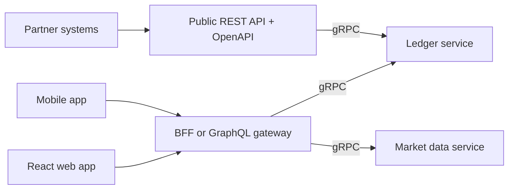
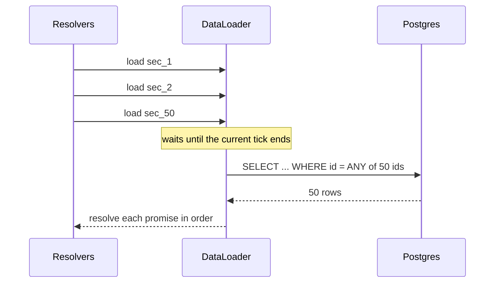
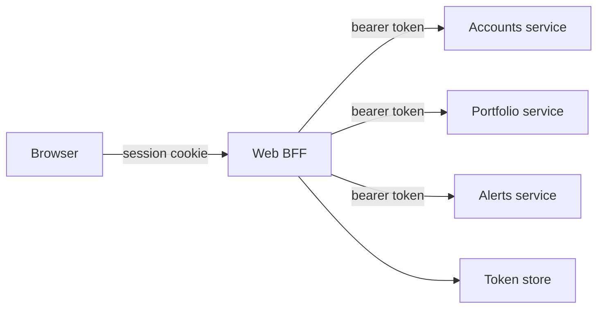
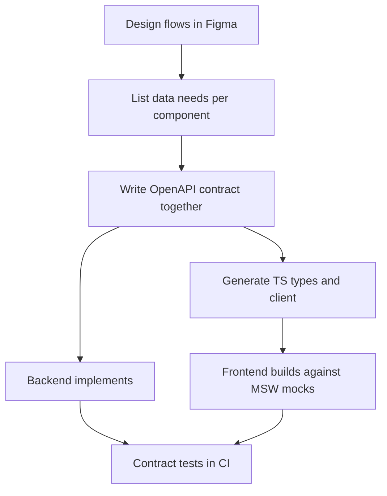
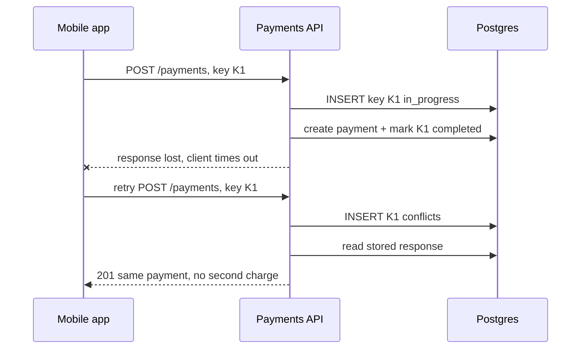
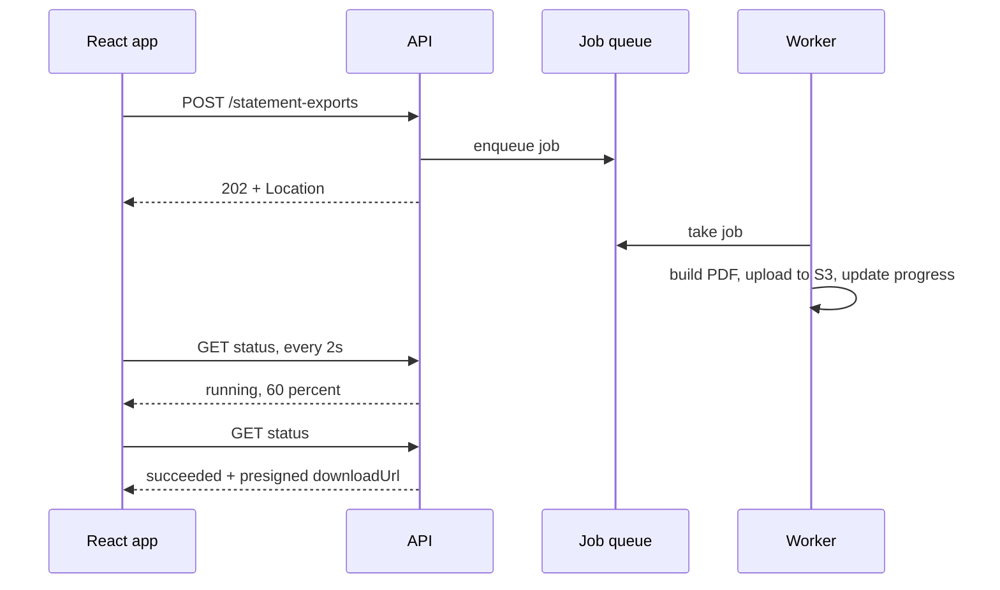
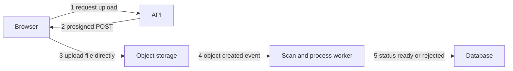
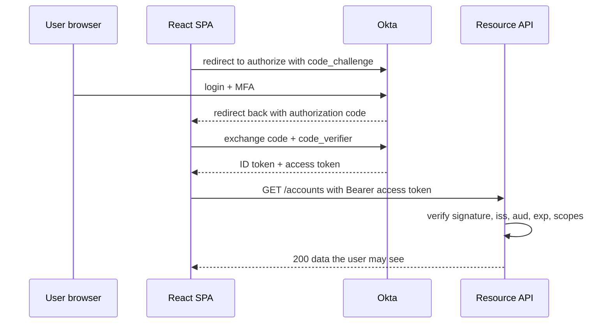
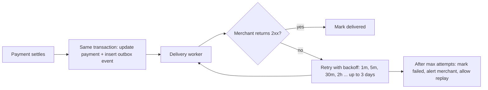

## 1. Resource Design & the HTTP Contract

#### Q: [Mid] Design the REST endpoints for a banking app with accounts, transactions and transfers. Walk me through your URLs and methods.

**Short answer:** I model nouns as resources and use HTTP methods for the verbs: `GET /accounts`, `GET /accounts/{id}`, `GET /accounts/{id}/transactions`, and `POST /transfers` to create a transfer. Actions that do not map cleanly to CRUD become resources of their own (a transfer, a statement export) instead of verbs in the URL. Responses use consistent shapes, ids are opaque strings, and money is integer minor units plus a currency.

**Clarify first:**
- Who consumes it: our own React app only, mobile too, or third parties? Public APIs need stricter versioning and docs.
- Can a user have many accounts? Joint accounts? That decides whether `/me/accounts` or `/accounts?ownerId=` makes sense.
- Is a transfer instant or does it go through states (pending, settled, failed)? That changes whether `POST /transfers` returns `201` or `202`.
- What volume per account? It decides pagination style from day one.

**Diagnose:** When reviewing an existing API, look for these smells:
- Verbs in paths: `/getAccounts`, `/doTransfer`, `/accounts/123/delete`.
- `POST` used for reads, or `GET` with side effects (a crawler or prefetch can trigger them).
- Different error shapes per endpoint, so the frontend has `if (err.message || err.error || err.errors[0])` code.
- Floats for money (`"amount": 10.1`).
- Deeply nested URLs like `/users/1/accounts/2/transactions/3/notes/4`. Nest at most one level; after that, use top-level resources with filters.

**Solution:**

```text
GET    /v1/accounts                         list my accounts
GET    /v1/accounts/{accountId}             one account
GET    /v1/accounts/{accountId}/transactions?status=posted&limit=50&cursor=...
GET    /v1/transactions/{transactionId}     a transaction has a global id, so no nesting needed
POST   /v1/transfers                        create a transfer (Idempotency-Key header required)
GET    /v1/transfers/{transferId}           poll transfer status
POST   /v1/transfers/{transferId}/cancel    state transition as a sub-resource action
POST   /v1/statements/exports               start a statement export (returns 202)
PATCH  /v1/accounts/{accountId}             change nickname only (partial update)
```

A response body that the frontend can rely on:

```ts
// Shared contract types (often generated from OpenAPI)
type Money = {
  amountCents: number; // integer minor units; use string if values can exceed 2^53
  currency: 'USD' | 'EUR' | 'GBP';
};

type Transaction = {
  id: string;            // opaque, e.g. "txn_01J9Z..." — never expose auto-increment ids
  accountId: string;
  type: 'debit' | 'credit';
  status: 'pending' | 'posted' | 'reversed';
  amount: Money;
  description: string;
  postedAt: string | null; // ISO 8601 UTC, e.g. "2026-10-02T09:30:00Z"
  createdAt: string;
};

type Page<T> = {
  data: T[];
  nextCursor: string | null;
};
```

Method semantics you should state precisely:

| Method | Safe | Idempotent | Typical success |
|---|---|---|---|
| GET | yes | yes | 200 |
| PUT (full replace) | no | yes | 200 or 204 |
| PATCH (partial) | no | not by default | 200 |
| DELETE | no | yes | 204 |
| POST (create / action) | no | no, unless you add an idempotency key | 201 + Location, or 202 |

> **Finance tip:** Never send money as a float. `0.1 + 0.2 !== 0.3` in JavaScript. Use integer cents, or a decimal string like `"1234.56"` when you need more than 15 significant digits or fractional cents (FX rates, crypto).

> **Why:** Opaque, prefixed ids (`acct_`, `txn_`) prevent enumeration attacks, hide your row counts from competitors, and make logs readable because you can tell what an id refers to.

**Trade-offs:**
- Strict REST purity (no action endpoints) leads to awkward modeling like `PATCH /transfers/1 { status: "cancelled" }`. A small `POST /transfers/{id}/cancel` is clearer and lets you enforce allowed transitions.
- Nesting (`/accounts/{id}/transactions`) expresses ownership and makes authorization obvious, but deep nesting makes URLs brittle. One level is the sweet spot.
- `PUT` vs `PATCH`: `PUT` is simpler to reason about (idempotent) but forces the client to send the whole object, which causes lost updates if two tabs edit at once.

**What interviewers listen for:**
- You mention money representation, opaque ids and timestamps in UTC without being asked.
- You know which methods are safe and idempotent and why that matters for retries.
- You treat state changes (cancel, approve) as explicit, validated transitions.
- Red flag: verbs in URLs, `GET` with side effects, or "I'd just return whatever the database has".

#### Q: [Mid] Your frontend has five different ways of parsing errors because every endpoint returns a different shape. How would you standardize HTTP status codes and error responses?

**Short answer:** Pick a small, consistent set of status codes and one error body for the whole API. The standard is RFC 9457 "Problem Details for HTTP APIs" (it replaced RFC 7807): a JSON object with `type`, `title`, `status`, `detail`, `instance`, plus your own extension fields such as `errors` for field validation and a `traceId`. The frontend then needs exactly one error parser.

**Clarify first:**
- Do clients need machine-readable error codes for branching ("insufficient funds" shows a specific dialog)?
- Are messages shown to end users directly, or does the frontend own the copy and translations?
- Is there a gateway or proxy that also produces errors (502/504 HTML pages) that the client must survive?

**Diagnose:** Grep the frontend for error handling (`err.response.data.message`, `error.errors`, `e.msg`). List every shape. In the backend, look for handlers that `res.status(200).json({ success: false })` — that breaks caching, monitoring and retries because everything looks successful.

**Solution:** The status codes worth knowing cold:

| Code | When |
|---|---|
| 200 / 201 / 204 | OK / created (with `Location`) / no body |
| 202 | Accepted for async processing |
| 400 | Malformed request (bad JSON, wrong types) |
| 401 | Not authenticated (missing or invalid token) |
| 403 | Authenticated but not allowed |
| 404 | Not found, or hidden because the user may not know it exists |
| 409 | Conflict with current state (duplicate, idempotency key reused with a different body, version mismatch) |
| 412 | Precondition failed (`If-Match` ETag mismatch) |
| 422 | Well-formed but semantically invalid (business rule failed). RFC 9110 calls it "Unprocessable Content" |
| 429 | Rate limited, with `Retry-After` |
| 500 / 502 / 503 / 504 | Bug / bad upstream / temporarily unavailable / upstream timeout |

An RFC 9457 error body, served with `Content-Type: application/problem+json`:

```json
{
  "type": "https://api.example.com/problems/insufficient-funds",
  "title": "Insufficient funds",
  "status": 422,
  "detail": "Account acct_123 has 1500 cents available, transfer needs 2500.",
  "instance": "/v1/transfers",
  "code": "INSUFFICIENT_FUNDS",
  "traceId": "4bf92f3577b34da6a3ce929d0e0e4736",
  "errors": [
    { "pointer": "/amount/amountCents", "message": "Exceeds available balance" }
  ]
}
```

A central Express error handler so no route invents its own shape:

```ts
import type { ErrorRequestHandler } from 'express';
import { ZodError } from 'zod';

export class ProblemError extends Error {
  constructor(
    public status: number,
    public code: string,
    public title: string,
    public detail?: string,
    public extra: Record<string, unknown> = {},
  ) {
    super(detail ?? title);
  }
}

export const problemHandler: ErrorRequestHandler = (err, req, res, _next) => {
  const traceId = req.header('x-request-id') ?? res.locals.requestId;

  let problem;
  if (err instanceof ZodError) {
    problem = {
      type: 'https://api.example.com/problems/validation',
      title: 'Validation failed',
      status: 400,
      code: 'VALIDATION_FAILED',
      errors: err.issues.map((i) => ({
        pointer: '/' + i.path.join('/'),
        message: i.message,
      })),
    };
  } else if (err instanceof ProblemError) {
    problem = {
      type: `https://api.example.com/problems/${err.code.toLowerCase().replace(/_/g, '-')}`,
      title: err.title,
      status: err.status,
      detail: err.detail,
      code: err.code,
      ...err.extra,
    };
  } else {
    req.log?.error({ err }, 'unhandled error'); // log the stack, never return it
    problem = {
      type: 'about:blank',
      title: 'Internal Server Error',
      status: 500,
      code: 'INTERNAL',
    };
  }

  res
    .status(problem.status)
    .type('application/problem+json')
    .json({ ...problem, instance: req.originalUrl, traceId });
};
```

The frontend now has one parser:

```ts
export type Problem = {
  type: string; title: string; status: number; detail?: string;
  code?: string; traceId?: string;
  errors?: { pointer: string; message: string }[];
};

export async function parseProblem(res: Response): Promise<Problem> {
  const ct = res.headers.get('content-type') ?? '';
  if (ct.includes('json')) return res.json();
  // a proxy returned HTML or plain text: normalize it
  return { type: 'about:blank', title: res.statusText || 'Request failed', status: res.status };
}
```

> **Gotcha:** 401 vs 403 is a classic question. 401 means "I don't know who you are" (the frontend should refresh the token or redirect to login). 403 means "I know who you are and the answer is no" (show a permission message, do not log out).

> **Interview tip:** Say "the `code` field is the contract, `title` and `detail` are for humans". The frontend branches on `code`, never on message text, so the backend can reword messages freely.

**Trade-offs:**
- 400 vs 422 for validation: teams disagree. What matters is consistency. A common split: 400 for schema/shape errors, 422 for business rules.
- Returning 404 instead of 403 for resources the user cannot access hides their existence (good for privacy) but makes debugging harder. Usually worth it for financial data.
- Detailed `detail` messages help users but can leak internals. Never include stack traces, SQL, or other customers' data.

**What interviewers listen for:**
- You name RFC 9457 (or 7807) and explain machine-readable `code` vs human text.
- You include a trace or request id so support can find the logs.
- You know 401 vs 403, 409 vs 422, and when 429 and 503 should carry `Retry-After`.
- Red flag: `200 OK` with `{ "success": false }`.

#### Q: [Senior] An account has 2 million transactions. The UI needs infinite scroll, filters by status/date/amount, and sorting. Design the list endpoint. Offset or cursor pagination?

**Short answer:** Cursor (keyset) pagination. Offset pagination with `OFFSET 1900000` forces the database to read and throw away 1.9 million rows, and it shows duplicates or skips rows when new transactions arrive while the user scrolls. A cursor encodes the last row's sort key plus a unique tiebreaker, and the query uses `WHERE (posted_at, id) < (...)` against a matching index, so every page costs the same.

**Clarify first:**
- Does the UI need "jump to page 37" with a total count, or only next/previous? Jumping needs offsets; infinite scroll does not.
- Which sort orders are required? Every sort column needs its own index and cursor format.
- Do filters combine freely? That affects indexing strategy.
- Is the data append-only (transactions usually are) or edited in place?

**Diagnose:** Run `EXPLAIN (ANALYZE, BUFFERS)` on the current query at a deep offset. You will see the row count read grow linearly with offset and timing go from milliseconds to seconds. In APM, latency per page gets worse the deeper a user scrolls — a signature of offset pagination.

**Solution:** API surface:

```text
GET /v1/accounts/acct_123/transactions
    ?status=posted,pending
    &postedFrom=2026-01-01&postedTo=2026-09-30
    &minAmountCents=1000
    &sort=-postedAt              (minus = descending; allow-listed values only)
    &limit=50                    (default 50, max 200)
    &cursor=eyJwIjoiMjAyNi0wOS0zMFQxMDowMDowMFoiLCJpIjoidHhuXzk5In0

200 OK
{
  "data": [ ...50 transactions... ],
  "nextCursor": "eyJwIjoi...",   // null when no more rows
  "hasMore": true
}
```

Server implementation with Zod validation, allow-listed sorts and an opaque cursor:

```ts
import { z } from 'zod';

const ListQuery = z.object({
  status: z
    .string()
    .transform((s) => s.split(','))
    .pipe(z.array(z.enum(['pending', 'posted', 'reversed'])))
    .optional(),
  postedFrom: z.iso.datetime().optional(), // Zod 4; in Zod 3 use z.string().datetime()
  postedTo: z.iso.datetime().optional(),
  minAmountCents: z.coerce.number().int().optional(),
  sort: z.enum(['-postedAt', 'postedAt']).default('-postedAt'),
  limit: z.coerce.number().int().min(1).max(200).default(50),
  cursor: z.string().optional(),
});

type Cursor = { p: string; i: string }; // postedAt + id tiebreaker

const encodeCursor = (c: Cursor) => Buffer.from(JSON.stringify(c)).toString('base64url');
const decodeCursor = (s: string): Cursor => JSON.parse(Buffer.from(s, 'base64url').toString());

export async function listTransactions(accountId: string, raw: unknown) {
  const q = ListQuery.parse(raw);
  const desc = q.sort === '-postedAt';
  const params: unknown[] = [accountId];
  const where = ['account_id = $1'];

  if (q.status) { params.push(q.status); where.push(`status = ANY($${params.length})`); }
  if (q.postedFrom) { params.push(q.postedFrom); where.push(`posted_at >= $${params.length}`); }
  if (q.postedTo) { params.push(q.postedTo); where.push(`posted_at < $${params.length}`); }
  if (q.minAmountCents !== undefined) {
    params.push(q.minAmountCents); where.push(`amount_cents >= $${params.length}`);
  }
  if (q.cursor) {
    const c = decodeCursor(q.cursor);
    params.push(c.p, c.i);
    // row-value comparison: correct ordering across ties on posted_at
    where.push(`(posted_at, id) ${desc ? '<' : '>'} ($${params.length - 1}, $${params.length})`);
  }

  params.push(q.limit + 1); // fetch one extra to know if there is more
  const dir = desc ? 'DESC' : 'ASC';
  const { rows } = await db.query(
    `SELECT id, account_id, type, status, amount_cents, currency, description, posted_at, created_at
       FROM transactions
      WHERE ${where.join(' AND ')}
      ORDER BY posted_at ${dir}, id ${dir}
      LIMIT $${params.length}`,
    params,
  );

  const hasMore = rows.length > q.limit;
  const page = rows.slice(0, q.limit);
  const last = page.at(-1);
  return {
    data: page.map(toTransactionDto),
    hasMore,
    nextCursor: hasMore && last ? encodeCursor({ p: last.posted_at.toISOString(), i: last.id }) : null,
  };
}
```

The index that makes it fast:

```sql
CREATE INDEX CONCURRENTLY idx_txn_account_posted
  ON transactions (account_id, posted_at DESC, id DESC);
```


> **Gotcha:** A cursor on `posted_at` alone is wrong. Many transactions share a timestamp, so rows at the page boundary are skipped or repeated. Always add a unique tiebreaker (`id`) to both the `ORDER BY` and the cursor.

> **Gotcha:** Never interpolate `sort` into SQL directly. Map an allow-list of API values to SQL fragments. Otherwise `?sort=posted_at;DROP TABLE` style injection becomes possible.

> **Why:** Make the cursor opaque (base64url). Clients must not build cursors themselves, so you can change the encoding later. If tampering matters, sign it with an HMAC.

**Trade-offs:**
- Offset: simple, supports page numbers and "page 5 of 40". Slow at depth and unstable under inserts. Fine for small admin tables.
- Cursor: constant cost and stable, but no random page jumps, and every sort option needs its own index and cursor shape.
- Total counts: `COUNT(*)` over 2 million filtered rows is expensive. Return `hasMore`, or an approximate count, or compute counts asynchronously.
- Fetch `limit + 1` instead of a second count query to compute `hasMore`.

**What interviewers listen for:**
- You explain why offset is slow (rows read and discarded) and unstable (inserts shift pages).
- Tiebreaker column, matching composite index, `limit` cap, allow-listed sorts.
- You connect it to the frontend: TanStack Query `useInfiniteQuery` with `getNextPageParam: (last) => last.nextCursor`.
- Red flag: "just add `LIMIT` and `OFFSET`" with no mention of scale.

#### Q: [Staff] You need to rename a field and change the shape of the transfer response, but mobile apps from two years ago still call the API. How do you version the API?

**Short answer:** First avoid breaking changes: additive changes (new optional fields, new endpoints) don't need a new version. When a break is unavoidable, I version explicitly — URL path (`/v2/...`) for coarse-grained public APIs, or a date-based header (Stripe style) for fine-grained evolution — and run old and new side by side with a deprecation timeline, `Deprecation`/`Sunset` headers, and usage metrics per version so we know when it's safe to remove.

**Clarify first:**
- Who are the consumers? Our web app (deploys with the backend), mobile apps (users don't update), or external partners (contracts)?
- How long must old versions live? App store adoption curves and partner contracts decide this.
- Is the change in shape, in semantics, or both? Semantic changes (amount now includes fees) are more dangerous than renames.

**Diagnose:** Before deciding, measure: log `User-Agent`, app version and API version per request. A dashboard showing "3% of traffic still uses v1, all from app versions below 4.2" turns a debate into a decision.

**Solution:** What counts as breaking:

| Non-breaking (ship anytime) | Breaking (needs a version) |
|---|---|
| Add an optional request field | Remove or rename a field |
| Add a response field | Change a type (number to string) |
| Add a new endpoint | Change meaning (amount now includes fees) |
| Add an enum value (only if clients handle unknowns) | Make an optional field required |
| Loosen validation | Tighten validation, change error codes |

Strategies:

| Strategy | Example | Good for |
|---|---|---|
| URL path | `/v1/transfers`, `/v2/transfers` | Public APIs, easy routing and caching, visible in logs |
| Header / date version | `Api-Version: 2026-09-01` | Fine-grained evolution with per-account pinning (Stripe popularized this) |
| Media type | `Accept: application/vnd.bank.v2+json` | Purist REST, rarely worth the complexity |
| No versioning, evolve only | GraphQL with `@deprecated` | Clients select fields, so removal is the only break |

Implementation idea that keeps one core and thin adapters, instead of two codebases:

```ts
// Core domain always returns the newest internal shape
type TransferV2 = { id: string; amount: { amountCents: number; currency: string }; fee: { amountCents: number } };

// v1 adapter translates for old clients
function toV1(t: TransferV2) {
  return {
    id: t.id,
    amount: t.amount.amountCents / 100, // old clients expected a decimal number
    currency: t.amount.currency,
  };
}

app.get('/v1/transfers/:id', async (req, res) => {
  const t = await transfers.get(req.params.id, req.user);
  res.set('Deprecation', '@1767225600');   // RFC 9745 structured date (epoch seconds)
  res.set('Sunset', 'Wed, 30 Jun 2027 00:00:00 GMT'); // RFC 8594
  res.set('Link', '<https://docs.example.com/migrate-v2>; rel="deprecation"');
  res.json(toV1(t));
});

app.get('/v2/transfers/:id', async (req, res) => {
  res.json(await transfers.get(req.params.id, req.user));
});
```

> **Gotcha:** Adding an enum value is breaking for clients that use exhaustive `switch` statements with no default. Document "clients must ignore unknown enum values and unknown fields" from day one (tolerant reader principle) and make the frontend do it.

> **Interview tip:** For our own web app, the best "versioning" is often not versioning: deploy backend changes in an expand/contract sequence. Add the new field, ship the frontend that reads it, then remove the old field once no client reads it.

**Trade-offs:**
- URL versions are explicit and simple but encourage big-bang rewrites and duplicate docs.
- Date-based header versions allow small, frequent changes, but require a transformation layer and strong testing of each version path.
- Every live version is a cost: tests, security patches, mental load. Set sunset dates and enforce them.

**What interviewers listen for:**
- You prefer additive change and expand/contract before reaching for v2.
- You can list what is and isn't breaking, including enum additions.
- You measure version usage and communicate deprecations via headers and docs.
- Red flag: "we'll just change it and tell the mobile team".

## 2. Choosing an API Style and Shaping It for the Frontend

#### Q: [Staff] We are starting a new product: a web dashboard, a mobile app, and later partner integrations. The team is debating REST, GraphQL, gRPC and tRPC. How do you decide?

**Short answer:** It depends on who the clients are and who owns them. tRPC is great when one TypeScript team owns both a web client and its server in a monorepo. GraphQL shines when many clients need different slices of a rich, connected data graph. gRPC is best for internal service-to-service calls with strict contracts and high throughput. REST with OpenAPI is the safest default for public and partner APIs because every language and tool understands it. Many real systems mix them: REST for partners, GraphQL or a BFF for the UI, gRPC between services.

**Clarify first:**
- Are clients all TypeScript? Is there a monorepo? (tRPC requires TS on both ends to get its benefit.)
- Will external developers use it? (They expect REST/OpenAPI or sometimes GraphQL, almost never tRPC.)
- How varied are the screens' data needs? Dashboards that combine accounts, positions, prices and news favour GraphQL or a BFF.
- What is the team's experience? GraphQL adds real operational complexity (query cost, caching, auth per field).
- Do we need HTTP caching at the CDN level? REST GETs cache easily; GraphQL POSTs do not by default.

**Diagnose:** Look at the actual pain. Over-fetching and five round trips per screen point to GraphQL or a BFF. Contract drift between frontend and backend points to codegen (OpenAPI, GraphQL codegen) or tRPC. Slow internal JSON calls between services point to gRPC.

**Solution:**

| | REST + OpenAPI | GraphQL | gRPC | tRPC |
|---|---|---|---|---|
| Contract | OpenAPI spec | Schema (SDL) | Protobuf `.proto` | TypeScript types inferred from router |
| Transport | HTTP/1.1 or 2, JSON | Usually HTTP POST, JSON | HTTP/2, binary | HTTP, JSON |
| Browser support | Native | Native | Needs gRPC-Web or Connect proxy | Native |
| Over/under-fetching | Common | Client picks fields | Fixed messages | Fixed procedures |
| HTTP caching | Easy (GET, ETag, CDN) | Hard (needs persisted queries + GET) | No | Limited |
| Public partner API | Best | Good | Rare | No |
| Typical pain | Many endpoints, versioning | N+1, query cost limits, field auth | Tooling, debugging binary | Couples client to server code |

A tRPC router, to show what "types without codegen" means:

```ts
// server/router.ts
import { initTRPC, TRPCError } from '@trpc/server';
import { z } from 'zod';

const t = initTRPC.context<{ userId: string | null }>().create();
const authed = t.procedure.use(({ ctx, next }) => {
  if (!ctx.userId) throw new TRPCError({ code: 'UNAUTHORIZED' });
  return next({ ctx: { userId: ctx.userId } });
});

export const appRouter = t.router({
  accountById: authed
    .input(z.object({ id: z.string() }))
    .query(({ input, ctx }) => accounts.getForUser(input.id, ctx.userId)),
});
export type AppRouter = typeof appRouter; // the client imports only this TYPE
```

The same contract in protobuf for gRPC:

```proto
syntax = "proto3";
service Ledger {
  rpc GetBalance (GetBalanceRequest) returns (Balance);
}
message GetBalanceRequest { string account_id = 1; }
message Balance { int64 available_cents = 1; string currency = 2; }
```



> **Interview tip:** Don't pick a winner in the abstract. Say "for this product I'd choose X because of Y, and I'd revisit if Z changes". That is what staff-level answers sound like.

**Trade-offs:**
- GraphQL moves complexity from the client to the server: you must handle query depth and cost limits, per-field authorization, and DataLoader batching.
- tRPC gives the best developer experience but ties the client to the server's TypeScript code. It is not a public contract.
- gRPC is fast and strongly typed but harder to debug (binary payloads) and needs a proxy for browsers.
- REST needs discipline (consistent conventions, codegen) to avoid contract drift.

**What interviewers listen for:**
- You decide based on consumers, team skills and caching needs, not hype.
- You mention mixing styles at different boundaries.
- You know GraphQL's real costs (N+1, cost limits, caching) and gRPC's browser limitation.
- Red flag: "GraphQL is always better because no over-fetching".

#### Q: [Senior] Our GraphQL portfolio page is slow. A query for 50 holdings causes 101 database queries. What is happening and how do you fix it?

**Short answer:** Classic N+1. The `holdings` resolver runs one query, then the `security` field resolver runs once per holding, and maybe a `price` resolver does too: 1 + 50 + 50 queries. The fix is DataLoader: collect all keys requested in one tick of the event loop, load them in one batched query (`WHERE id = ANY($1)`), and cache per request.

**Clarify first:**
- Is the slowness database time or upstream service calls (price API)? DataLoader helps both.
- Is the query shape fixed (our own UI) or arbitrary (public schema)? Arbitrary queries also need depth/cost limits.

**Diagnose:**
- Enable query logging or use APM tracing (OpenTelemetry GraphQL instrumentation). You'll see a waterfall of identical `SELECT ... WHERE id = $1` spans.
- Count queries per request in a test: assert `queryCount <= 3` for the portfolio query so regressions fail CI.

**Solution:**

```ts
import DataLoader from 'dataloader';

type Security = { id: string; symbol: string; name: string };

// Create loaders PER REQUEST, never globally — the cache must not leak between users.
export function createLoaders(db: Db) {
  return {
    securityById: new DataLoader<string, Security | null>(async (ids) => {
      const { rows } = await db.query<Security>(
        'SELECT id, symbol, name FROM securities WHERE id = ANY($1)',
        [ids as string[]],
      );
      const byId = new Map(rows.map((r) => [r.id, r]));
      // MUST return results in the same order and length as `ids`
      return ids.map((id) => byId.get(id) ?? null);
    }),
    latestPriceBySecurityId: new DataLoader<string, number | null>(async (ids) => {
      const prices = await marketData.getLatestPrices(ids as string[]); // one upstream call
      return ids.map((id) => prices[id] ?? null);
    }),
  };
}

// context factory, e.g. Apollo Server or GraphQL Yoga
const context = ({ req }: { req: Request }) => ({ user: req.user, loaders: createLoaders(db) });

const resolvers = {
  Query: {
    holdings: (_: unknown, __: unknown, ctx: Ctx) =>
      db.query('SELECT * FROM holdings WHERE portfolio_id = $1', [ctx.user.portfolioId]).then((r) => r.rows),
  },
  Holding: {
    security: (h: { security_id: string }, _: unknown, ctx: Ctx) => ctx.loaders.securityById.load(h.security_id),
    price: (h: { security_id: string }, _: unknown, ctx: Ctx) =>
      ctx.loaders.latestPriceBySecurityId.load(h.security_id),
  },
};
```



Total: 1 holdings query + 1 securities query + 1 price call.

> **Gotcha:** The batch function must return an array of exactly the same length and order as the keys. Database results come back in arbitrary order and missing ids are omitted, so always map through a `Map` like above.

> **Gotcha:** A global DataLoader caches across users and requests: stale prices, and possibly data from one user served to another. Always create loaders per request.

Also protect a public schema from expensive queries: depth limits, query cost analysis, pagination on every list field (`first: Int!` with a max), and persisted queries so only known queries run in production.

**Trade-offs:**
- DataLoader adds a tiny delay (one tick) and some code per relation, but turns N+1 into constant query counts.
- A single big SQL join in the parent resolver is faster for a fixed shape but wastes work when the client didn't ask for those fields. Some libraries look at the query's selection set to decide joins; that is more complex.
- Per-request caching does not help across requests. Use Redis for that, with its own invalidation problems.

**What interviewers listen for:**
- You name N+1 and DataLoader immediately and know it batches within a tick.
- Per-request loader instances, order-preserving batch functions.
- You add query cost and depth limits for public schemas.
- Red flag: "add an index" — indexes make each query faster, but 101 round trips remain.

#### Q: [Senior] The React dashboard calls seven microservices on load and handles token refresh, retries and data merging in the browser. A teammate proposes a BFF. What is it and when is it worth it?

**Short answer:** A Backend-for-Frontend is a thin server owned by the frontend team, built for one client type. It aggregates calls to internal services, shapes responses exactly for each screen, and keeps secrets and tokens on the server (often with an HTTP-only session cookie instead of tokens in the browser). It's worth it when the UI talks to many services, when you need a different shape for web vs mobile, or when you want tokens out of JavaScript.

**Clarify first:**
- How many services does a screen need? Two calls don't justify a new deployable.
- Who will own and operate it? A BFF the frontend team can't deploy becomes a bottleneck.
- Are there security requirements (no tokens in `localStorage`, PCI scope)?
- Is it web-only or web plus mobile? Separate BFFs per client type is the classic pattern.

**Diagnose:** In the Network tab, look at the request waterfall on dashboard load: seven requests, some waiting on others, each with its own auth header and retry logic, and response bodies far larger than what's rendered. Compare total bytes downloaded to bytes actually used.

**Solution:**

```ts
// BFF route: one call per screen, parallel fan-out, partial failure handled server-side
app.get('/bff/dashboard', requireSession, async (req, res) => {
  const token = await tokenStore.getAccessToken(req.session.id); // tokens live server-side

  const call = <T>(url: string) =>
    fetch(url, {
      headers: { authorization: `Bearer ${token}`, 'x-request-id': res.locals.requestId },
      signal: AbortSignal.timeout(2000), // never let one slow service hang the page
    }).then((r) => {
      if (!r.ok) throw new Error(`${url} ${r.status}`);
      return r.json() as Promise<T>;
    });

  const [accounts, positions, alerts] = await Promise.allSettled([
    call<Account[]>(`${ACCOUNTS_URL}/accounts`),
    call<Position[]>(`${PORTFOLIO_URL}/positions`),
    call<Alert[]>(`${ALERTS_URL}/alerts?unread=true`),
  ]);

  res.json({
    accounts: accounts.status === 'fulfilled' ? accounts.value.map(toAccountCard) : null,
    portfolio: positions.status === 'fulfilled' ? summarize(positions.value) : null,
    alerts: alerts.status === 'fulfilled' ? alerts.value.slice(0, 5) : [],
    degraded: [accounts, positions, alerts].some((r) => r.status === 'rejected'),
  });
});
```



> **Why:** Keeping tokens in the BFF (the "token handler" pattern) means XSS in the browser cannot steal a bearer token, because JavaScript never sees one. The browser only holds an `HttpOnly`, `Secure`, `SameSite` cookie.

> **Gotcha:** A BFF must not grow business logic. Rules like "can this user transfer $10k" belong in the domain service, otherwise web and mobile BFFs drift and enforce different rules.

**Trade-offs:**
- An extra network hop and service to deploy, monitor and scale.
- Duplication across web and mobile BFFs if they're split.
- Cookie sessions bring CSRF concerns back (mitigate with `SameSite=Lax` or `Strict` plus CSRF tokens for state-changing requests).
- In return: fewer round trips, smaller payloads, simpler frontend, safer tokens, and one place to handle partial failure.

**What interviewers listen for:**
- You frame BFF as owned by the frontend team and shaped per client.
- Security angle: tokens out of the browser.
- Timeouts and partial failure handling (`Promise.allSettled`, `degraded` flag) instead of failing the whole page.
- Red flag: a BFF that becomes a second monolith with business rules.

#### Q: [Senior] You're the frontend lead and the backend team asks "what API do you need for the new statements page?" How do you design the API together so it fits the UI?

**Short answer:** Start from the screens and user flows, not from the database tables. I list what each view shows, what actions it triggers, its loading/empty/error states and its scale, then we write the contract first (OpenAPI or GraphQL schema), generate types and a mock server from it, and both teams build in parallel. The contract covers pagination, error codes, and async states, not only the happy path.

**Clarify first:**
- How many statements per account? Years of history? Determines pagination and filtering.
- Do users download PDFs? Generating them may take seconds, which means async export.
- Which filters and sorts does design actually show?
- Real-time needs: should a new statement appear without refresh?
- Who are the other consumers (mobile, partners)? Avoid an API so screen-specific that mobile can't use it — or accept a BFF.

**Diagnose:** Pain signs in an existing API that wasn't designed with the UI: the frontend calls `GET /statements` then `GET /statements/{id}` for every row to show a total (N+1 over HTTP); it computes totals client-side from raw transactions; it guesses error meanings from status codes.

**Solution:** A practical contract-first process:
1. Walk through the Figma flows. For each component, write the fields it needs.
2. Write the OpenAPI spec together. Include examples for success, empty and each error `code`.
3. Generate TypeScript types and a client (for example `openapi-typescript` or Orval) and mock with MSW so the UI is built before the backend is done.
4. Add a contract test (for example Pact, or schema validation of real responses in CI) so neither side drifts.

```yaml
# openapi.yaml (excerpt)
paths:
  /v1/accounts/{accountId}/statements:
    get:
      parameters:
        - { name: year, in: query, schema: { type: integer } }
        - { name: cursor, in: query, schema: { type: string } }
        - { name: limit, in: query, schema: { type: integer, maximum: 100, default: 24 } }
      responses:
        '200':
          content:
            application/json:
              schema:
                type: object
                required: [data, nextCursor]
                properties:
                  data: { type: array, items: { $ref: '#/components/schemas/StatementSummary' } }
                  nextCursor: { type: string, nullable: true }
        '404': { $ref: '#/components/responses/Problem' }
  /v1/statements/{statementId}/pdf-exports:
    post:
      responses:
        '202':
          headers: { Location: { schema: { type: string } } }
components:
  schemas:
    StatementSummary:
      type: object
      required: [id, periodStart, periodEnd, closingBalance, status]
      properties:
        id: { type: string }
        periodStart: { type: string, format: date }
        periodEnd: { type: string, format: date }
        closingBalance: { $ref: '#/components/schemas/Money' }
        status: { type: string, enum: [ready, generating] }
```

Frontend-driven requirements worth pushing for:
- Summaries in list responses (closing balance per statement) so the list doesn't need N detail calls.
- Server-computed totals, so rounding and currency logic exist in one place.
- Stable ids and `updatedAt` for caching and optimistic UI.
- Explicit states (`generating`, `ready`, `failed`) rather than nullable fields the UI must interpret.
- Field-level validation errors with JSON pointers so forms can highlight inputs.



> **Interview tip:** Saying "I write the error and empty states into the contract" signals you've been burned by integrating against happy-path-only APIs.

**Trade-offs:**
- Screen-shaped APIs are fast for the UI but couple backend to design changes. A BFF absorbs that coupling.
- Contract-first adds upfront meetings but removes weeks of integration surprises.
- Generated clients are less flexible than hand-written ones but eliminate type drift.

**What interviewers listen for:**
- You start from user flows and states, then data, then endpoints.
- Contract-first with codegen, mocks, and contract tests.
- You raise async generation, pagination and error codes proactively.
- Red flag: "the backend gives us whatever and we transform it in the component".

## 3. Correctness: Idempotency, Validation and Long-Running Work

#### Q: [Staff] A user taps "Pay" on a flaky mobile connection. The request times out, the app retries, and the customer is charged twice. Design idempotency for the payments API.

**Short answer:** The client generates a unique `Idempotency-Key` (a UUID) once per user intent and sends it on every retry. The server stores the key in a table with a unique constraint, inside the same transaction as the payment. The first request wins and its response is saved; retries with the same key get the saved response; the same key with a different body gets `409`/`422`; a retry while the first is still running gets `409` with "in progress". This turns an unsafe `POST` into a safe-to-retry operation.

**Clarify first:**
- Scope of the key: per user or per merchant? (Unique on `(user_id, key)` so one user can't collide with another.)
- How long to keep keys? Stripe documents 24 hours; pick a window longer than any client retry policy.
- Does the payment call an external provider? Then the provider call also needs its own idempotency key.

**Diagnose:** Find duplicates: `SELECT user_id, amount_cents, merchant_id, count(*) FROM payments WHERE created_at > now() - interval '1 day' GROUP BY 1,2,3 HAVING count(*) > 1`. Check logs for two requests with the same body seconds apart, the second following a client timeout. That confirms retry-caused duplication, not a UI double click (which you'd also fix with a disabled button, but that's never enough).

**Solution:**

```sql
CREATE TABLE idempotency_keys (
  user_id        text        NOT NULL,
  key            text        NOT NULL,
  request_hash   text        NOT NULL,      -- sha256 of method + path + body
  status         text        NOT NULL CHECK (status IN ('in_progress', 'completed')),
  response_code  int,
  response_body  jsonb,
  created_at     timestamptz NOT NULL DEFAULT now(),
  PRIMARY KEY (user_id, key)                -- the unique constraint does the real work
);
```

```ts
import { createHash } from 'node:crypto';

app.post('/v1/payments', requireAuth, async (req, res, next) => {
  const key = req.header('Idempotency-Key');
  if (!key || key.length > 255) {
    return next(new ProblemError(400, 'IDEMPOTENCY_KEY_REQUIRED', 'Idempotency-Key header required'));
  }
  const userId = req.user.id;
  const hash = createHash('sha256').update(`POST /v1/payments ${JSON.stringify(req.body)}`).digest('hex');

  // Step 1: claim the key. The primary key makes concurrent claims safe.
  const claim = await db.query(
    `INSERT INTO idempotency_keys (user_id, key, request_hash, status)
     VALUES ($1, $2, $3, 'in_progress')
     ON CONFLICT (user_id, key) DO NOTHING
     RETURNING key`,
    [userId, key, hash],
  );

  if (claim.rowCount === 0) {
    const { rows: [existing] } = await db.query(
      'SELECT request_hash, status, response_code, response_body FROM idempotency_keys WHERE user_id = $1 AND key = $2',
      [userId, key],
    );
    if (existing.request_hash !== hash) {
      return next(new ProblemError(422, 'IDEMPOTENCY_KEY_REUSED', 'Key was used with a different request'));
    }
    if (existing.status === 'in_progress') {
      res.set('Retry-After', '1');
      return next(new ProblemError(409, 'REQUEST_IN_PROGRESS', 'Original request still processing'));
    }
    return res.status(existing.response_code).json(existing.response_body); // replay
  }

  // Step 2: do the work and record the result atomically.
  const client = await db.connect();
  try {
    await client.query('BEGIN');
    const payment = await createPayment(client, userId, PaymentInput.parse(req.body), { idempotencyKey: key });
    const body = toPaymentDto(payment);
    await client.query(
      `UPDATE idempotency_keys SET status = 'completed', response_code = 201, response_body = $3
       WHERE user_id = $1 AND key = $2`,
      [userId, key, body],
    );
    await client.query('COMMIT');
    res.status(201).json(body);
  } catch (err) {
    await client.query('ROLLBACK');
    // release the claim so the client can retry after a transient failure
    await db.query('DELETE FROM idempotency_keys WHERE user_id = $1 AND key = $2 AND status = $3',
      [userId, key, 'in_progress']);
    next(err);
  } finally {
    client.release();
  }
});
```



Client side, the key must be created once per intent, not per attempt:

```ts
const key = useRef(crypto.randomUUID()); // regenerate only after success or when the form changes
await fetchWithRetry('/v1/payments', { method: 'POST', headers: { 'Idempotency-Key': key.current }, body });
```

> **Gotcha:** If the payment calls an external provider and your process crashes after the provider charged but before your commit, you have a charge with no record. Pass your own key to the provider (most payment providers accept one) and reconcile `in_progress` keys older than a few minutes with a background job that asks the provider what happened.

> **Why:** "Check then insert" (SELECT, then INSERT if missing) has a race: two concurrent requests both see nothing. Only a unique constraint enforced by the database is safe under concurrency.

> **Outdated:** There is an IETF draft standardizing the `Idempotency-Key` header. It has been in draft for years; treat the name as a strong convention rather than a finished RFC.

**Trade-offs:**
- Storing responses costs storage; purge rows older than the retention window with a scheduled job.
- Holding the key `in_progress` during a slow provider call means retries get `409` until it completes. That's correct behaviour, but the client must handle it (back off and retry).
- Hashing the body requires a stable serialization. If clients may reorder keys, canonicalize before hashing.

**What interviewers listen for:**
- Client-generated key per intent, unique constraint, atomic write of result, replay of stored response.
- Handling of concurrent duplicates (in progress) and key reuse with a different body.
- Downstream idempotency with the provider and reconciliation for crashes.
- Red flag: "disable the button" as the whole answer, or "check if a similar payment exists in the last minute".

#### Q: [Mid] Why validate requests on the server with something like Zod when the React form already validates? Where exactly should validation happen?

**Short answer:** Client validation is for user experience; server validation is for correctness and security, because anyone can call the API with curl. Validate at every trust boundary: incoming HTTP requests, messages from queues, webhook payloads, environment config, and responses from third-party APIs. Zod lets you parse unknown input into typed data once, at the edge, and share the same schema with the frontend.

**Clarify first:** Is there a monorepo where schemas can be shared? Are there rules that only the server can check (balance, limits, uniqueness)?

**Diagnose:** Signs of missing boundary validation: `TypeError: cannot read properties of undefined` deep in service code, negative amounts in the database, strings stored where numbers were expected, 500s where 400s belong.

**Solution:**

```ts
// packages/contracts/transfer.ts — shared by React form and API
import { z } from 'zod';

export const CreateTransfer = z.object({
  fromAccountId: z.string().startsWith('acct_'),
  toAccountId: z.string().startsWith('acct_'),
  amountCents: z.number().int().positive().max(100_000_00), // max $100,000
  currency: z.enum(['USD', 'EUR']),
  memo: z.string().trim().max(140).optional(),
}).refine((t) => t.fromAccountId !== t.toAccountId, {
  message: 'Cannot transfer to the same account',
  path: ['toAccountId'],
});
export type CreateTransfer = z.infer<typeof CreateTransfer>;
```

```ts
// generic Express middleware: parse, don't just validate
import type { RequestHandler } from 'express';
import type { ZodType } from 'zod';

export const body = <T>(schema: ZodType<T>): RequestHandler => (req, _res, next) => {
  const result = schema.safeParse(req.body);
  if (!result.success) return next(result.error); // the problem handler turns it into 400
  req.body = result.data; // now typed and stripped of unknown keys
  next();
};

app.post('/v1/transfers', requireAuth, body(CreateTransfer), async (req, res) => {
  const input = req.body as CreateTransfer;
  // business rules that need the database still happen here: ownership, balance, daily limits
  const transfer = await transfers.create(req.user, input);
  res.status(201).location(`/v1/transfers/${transfer.id}`).json(transfer);
});

// boundary #2: config at startup — crash early instead of failing at 3am
export const env = z.object({
  DATABASE_URL: z.string().url(),
  PORT: z.coerce.number().default(3000),
  WEBHOOK_SECRET: z.string().min(32),
}).parse(process.env);
```

> **Gotcha:** `z.object` strips unknown keys by default, which protects against mass assignment (`{ "role": "admin" }` sneaking into an update). Use `.strict()` if you'd rather reject unknown keys with an error.

> **Why:** "Parse, don't validate": after the boundary, the rest of the code receives a typed value and never needs to re-check. TypeScript types alone vanish at runtime and prove nothing about network input.

**Trade-offs:** Shared schemas couple frontend and backend releases; keep them in a versioned contracts package. Zod parsing costs a little CPU on very hot paths, usually negligible next to I/O. Some validation (uniqueness, balance) can never live in the schema.

**What interviewers listen for:**
- "The client is untrusted" and a list of boundaries beyond HTTP bodies (queues, webhooks, env, third-party responses).
- Schema validation vs business rule validation as two layers.
- Red flag: "TypeScript already checks the types".

#### Q: [Senior] Generating a 7-year statement export takes up to 3 minutes. The current endpoint blocks and times out at the load balancer after 60 seconds. How do you redesign it?

**Short answer:** Make it asynchronous. `POST /v1/statement-exports` validates the request, enqueues a job, and immediately returns `202 Accepted` with a `Location` header pointing to a status resource. The client polls `GET /v1/statement-exports/{id}` (or receives a push via WebSocket/SSE/webhook) until the status is `succeeded`, then downloads the file from a short-lived presigned URL.

**Clarify first:** How often is it requested? Can the same export be reused (same account and date range)? Must the user stay on the page, or can we email/notify them? How long should the file be kept?

**Diagnose:** Load balancer logs show `504` at exactly 60s. Server logs show the work continued after the client gave up, so retries started duplicate exports and made the overload worse.

**Solution:**

```ts
app.post('/v1/statement-exports', requireAuth, body(ExportRequest), async (req, res) => {
  const exp = await db.one(
    `INSERT INTO statement_exports (id, user_id, account_id, from_date, to_date, status)
     VALUES ($1, $2, $3, $4, $5, 'queued') RETURNING *`,
    [newId('exp'), req.user.id, req.body.accountId, req.body.from, req.body.to],
  );
  await exportQueue.add('generate', { exportId: exp.id }, { jobId: exp.id }); // jobId dedupes
  res.status(202).location(`/v1/statement-exports/${exp.id}`).json(toDto(exp));
});

app.get('/v1/statement-exports/:id', requireAuth, async (req, res) => {
  const exp = await exports.getForUser(req.params.id, req.user.id); // 404 if not theirs
  if (exp.status !== 'succeeded') res.set('Retry-After', '3');
  res.json({
    id: exp.id,
    status: exp.status,                 // queued | running | succeeded | failed
    progress: exp.progress,             // 0..100, updated by the worker
    downloadUrl: exp.status === 'succeeded' ? await presignDownload(exp.fileKey, 300) : null,
    error: exp.status === 'failed' ? { code: exp.errorCode } : null,
  });
});
```

Frontend polling with TanStack Query:

```ts
const { data } = useQuery({
  queryKey: ['statement-export', exportId],
  queryFn: () => api.getExport(exportId),
  refetchInterval: (q) => (['succeeded', 'failed'].includes(q.state.data?.status ?? '') ? false : 2000),
});
```



> **Interview tip:** Mention that the long-running operation is a resource with its own lifecycle. That framing (Google's API design guide calls these "long-running operations") makes cancel (`POST .../cancel`), retry and listing past exports natural.

**Trade-offs:** Polling is simple and works through every proxy but wastes some requests; SSE or WebSockets are more efficient but need connection infrastructure. Caching identical exports saves compute but needs a key on `(account, range, data version)`. Async adds a queue, workers and failure states the UI must design for.

**What interviewers listen for:**
- `202` + `Location` + status resource with explicit states and progress.
- Deduplication of repeated requests, and a presigned URL for the result.
- Red flag: "increase the load balancer timeout to 5 minutes".

#### Q: [Senior] Users must upload ID documents and bank statements up to 50 MB. Uploads go through our Node API today and memory spikes. How should uploads work?

**Short answer:** Don't stream big files through the API. The API authorizes the upload and returns a presigned URL (S3, GCS or Azure equivalent) scoped to one object key, content type and size, valid for a few minutes. The browser uploads directly to storage. Storage then notifies the backend (or the client calls "complete"), and a worker scans and processes the file before it's marked usable.

**Clarify first:** File types allowed? Max size? Is malware scanning required (for user documents, yes)? Retention and encryption rules (KYC data is sensitive)? Do we need resumable uploads for mobile?

**Diagnose:** Memory graphs jump per upload because a middleware buffers the whole body (for example `multer` with memory storage). Event loop lag rises and other requests slow down. Large bodies also hit proxy body-size limits (`413`).

**Solution:**

```ts
import { S3Client } from '@aws-sdk/client-s3';
import { createPresignedPost } from '@aws-sdk/s3-presigned-post';

const s3 = new S3Client({ region: 'us-east-1' });

app.post('/v1/documents/uploads', requireAuth, body(UploadRequest), async (req, res) => {
  const { fileName, contentType, sizeBytes } = req.body; // Zod: contentType enum, size <= 50MB
  const docId = newId('doc');
  const key = `uploads/${req.user.id}/${docId}`; // never trust the client's file name as a key

  await db.query(
    `INSERT INTO documents (id, user_id, s3_key, original_name, status) VALUES ($1, $2, $3, $4, 'pending_upload')`,
    [docId, req.user.id, key, fileName],
  );

  // Presigned POST lets S3 itself enforce the size range and content type
  const { url, fields } = await createPresignedPost(s3, {
    Bucket: process.env.UPLOAD_BUCKET!,
    Key: key,
    Conditions: [
      ['content-length-range', 1, 50 * 1024 * 1024],
      ['eq', '$Content-Type', contentType],
    ],
    Fields: { 'Content-Type': contentType },
    Expires: 300, // seconds
  });

  res.status(201).json({ documentId: docId, upload: { url, fields } });
});
```

```ts
// browser
const { documentId, upload } = await api.createUpload({ fileName: file.name, contentType: file.type, sizeBytes: file.size });
const form = new FormData();
Object.entries(upload.fields).forEach(([k, v]) => form.append(k, v as string));
form.append('file', file); // must be the last field
await fetch(upload.url, { method: 'POST', body: form });
```



> **Gotcha:** The bucket needs a CORS configuration allowing your web origin, or the browser upload fails with a CORS error even though the presigned URL is valid.

> **Gotcha:** Never trust `file.type` from the browser. After upload, the worker should check the actual bytes (magic numbers), run malware scanning, and only then set `status = 'ready'`.

**Trade-offs:** A presigned `PUT` URL (`getSignedUrl` with `PutObjectCommand`) is simpler but cannot enforce a size range the way presigned POST conditions can. Multipart uploads add resumability for very large files at the cost of more client code. Direct upload adds a "pending" state the UI must show.

**What interviewers listen for:**
- Direct-to-storage via presigned URLs, short expiry, server-chosen keys.
- Size and type limits enforced by storage, plus post-upload scanning.
- Red flag: buffering 50 MB files in Node memory.

## 4. Authentication, Authorization and CORS

#### Q: [Mid] Explain authentication vs authorization, and how OAuth 2.0 and OpenID Connect fit into an app that logs in with Okta.

**Short answer:** Authentication (authN) proves who you are; authorization (authZ) decides what you may do. OAuth 2.0 is a delegation protocol that issues access tokens so a client can call an API on a user's behalf. OpenID Connect (OIDC) is a layer on top of OAuth 2.0 that adds identity: an ID token (a JWT) describing the user. With Okta, the SPA uses Authorization Code flow with PKCE, gets an ID token (for the UI) and an access token (for the API), and the API validates the access token and then runs its own authorization checks.

**Clarify first:** Is the client a public SPA, a mobile app, or a server-side BFF (a confidential client)? Who issues tokens? Which scopes and claims does the API need?

**Diagnose:** Common bugs: the API accepts the ID token instead of the access token; it checks the signature but not `aud` or `iss`; it trusts a `role` claim the client could influence; tokens sit in `localStorage` and are exposed to XSS.

**Solution:**



Validating an access token in Node with `jose`:

```ts
import { createRemoteJWKSet, jwtVerify } from 'jose';

const JWKS = createRemoteJWKSet(new URL('https://example.okta.com/oauth2/default/v1/keys'));

export const requireAuth: RequestHandler = async (req, _res, next) => {
  const token = req.header('authorization')?.replace(/^Bearer /, '');
  if (!token) return next(new ProblemError(401, 'UNAUTHENTICATED', 'Missing token'));
  try {
    const { payload } = await jwtVerify(token, JWKS, {
      issuer: 'https://example.okta.com/oauth2/default',
      audience: 'api://banking',          // reject tokens minted for other APIs
    });
    req.user = { id: payload.sub!, scopes: String(payload.scp ?? payload.scope ?? '').split(' ') };
    next();
  } catch {
    next(new ProblemError(401, 'INVALID_TOKEN', 'Token invalid or expired'));
  }
};
```

> **Gotcha:** The ID token is for the client to know who logged in. APIs must accept access tokens with their own audience. Using ID tokens as API credentials is a common and serious mistake.

> **Outdated:** The OAuth Implicit flow (tokens returned in the URL fragment) is no longer recommended for SPAs. Use Authorization Code with PKCE. The OAuth 2.1 draft removes Implicit entirely.

**Trade-offs:** Tokens in the SPA are simple but exposed to XSS; a BFF holding tokens server-side is safer but adds a service and CSRF handling. Short access token lifetimes limit damage but require refresh logic (refresh token rotation).

**What interviewers listen for:** AuthN vs authZ in one sentence each; OIDC = identity on top of OAuth; Code + PKCE for SPAs; validating `iss`, `aud`, `exp` and signature; authorization still happens in the API. Red flag: "OAuth is an authentication protocol".

#### Q: [Senior] Should our API use server-side sessions or JWTs? A security review asks how we'd log out a user immediately after their account is compromised.

**Short answer:** Sessions store state on the server and give the browser an opaque id in an `HttpOnly` cookie; revoking is instant (delete the session row). Stateless JWTs are verified without a lookup, which scales easily across services, but can't be revoked before they expire. For a financial web app I prefer sessions (or a BFF that holds tokens) for the browser, and short-lived JWT access tokens (5 to 15 minutes) between services, with refresh token rotation and a revocation path for emergencies.

**Clarify first:** How many services must verify identity? Is there a gateway? What is the acceptable window between "revoke" and "enforced"? Browser only, or mobile and partners too?

**Diagnose:** Check current token lifetime (`exp - iat`), where tokens are stored in the browser, and whether there's any denylist. A 24-hour JWT in `localStorage` with no revocation is a finding in any security review.

**Solution:**

| | Server session | JWT access token |
|---|---|---|
| Revocation | Instant | Only at expiry, unless you add a denylist |
| Lookup per request | Yes (Redis, fast) | No (signature check) |
| Cross-service | Needs shared store or gateway | Easy, any service with the public key |
| Size | Small cookie | Can be large |
| Browser storage | `HttpOnly` cookie | Ideally not in JS-accessible storage |

Emergency revocation with JWTs: keep lifetimes short and check a small denylist keyed by `jti` or a per-user "tokens valid after" timestamp:

```ts
// on compromise: everything issued before now is invalid
await redis.set(`user:${userId}:revokedBefore`, Math.floor(Date.now() / 1000));

// in auth middleware, after jwtVerify
const revokedBefore = Number(await redis.get(`user:${payload.sub}:revokedBefore`) ?? 0);
if ((payload.iat ?? 0) <= revokedBefore) throw new ProblemError(401, 'TOKEN_REVOKED', 'Session revoked');
```

Session cookie settings that matter:

```ts
res.cookie('sid', sessionId, {
  httpOnly: true,     // JS cannot read it, XSS cannot steal it
  secure: true,       // HTTPS only
  sameSite: 'lax',    // blocks most cross-site POSTs (CSRF); use 'strict' if UX allows
  maxAge: 30 * 60 * 1000,
  path: '/',
});
```

> **Gotcha:** The moment you add a denylist lookup per request, JWTs are no longer stateless. That's fine, but say it out loud; it shows you understand the trade-off rather than the slogan.

**Trade-offs:** Sessions need a shared store and CSRF protection. JWTs need key rotation, short lifetimes, refresh flows, and accept a revocation delay. Hybrid (session at the edge, JWT inside) is common.

**What interviewers listen for:** Clear revocation story, short lifetimes, refresh rotation, cookie flags, awareness that "stateless" JWTs often end up with state. Red flag: long-lived JWT in `localStorage`.

#### Q: [Senior] Advisors can view client portfolios, but only for clients assigned to them, only during business hours for some regions, and trades above $50k need a supervisor. How do you model authorization?

**Short answer:** Plain RBAC (roles to permissions) handles "advisors can view portfolios". The rest depends on attributes of the user, the resource and the context, which is ABAC (or relationship-based, ReBAC, for "assigned to them"). I put all checks in one policy layer that every endpoint calls with `(user, action, resource)`, enforce it on the server, and expose the evaluated permissions to the UI only to hide buttons, never as the security boundary.

**Clarify first:** How often do rules change, and who changes them (engineers or compliance)? How many resources must be filtered in lists (authorization in SQL `WHERE` clauses, not just per-item checks)? Audit requirements?

**Diagnose:** Look for scattered checks like `if (user.role === 'admin')` across handlers, and endpoints that load a resource by id without checking ownership (IDOR: `GET /portfolios/123` returns anyone's portfolio). Test by calling endpoints with another user's ids.

**Solution:**

```ts
type User = { id: string; roles: ('advisor' | 'supervisor' | 'client')[]; region: string };
type Action = 'portfolio:view' | 'trade:place';
type Ctx = { now: Date };

const policies: Record<Action, (u: User, r: any, c: Ctx) => boolean> = {
  'portfolio:view': (u, p: { clientId: string; advisorIds: string[] }) =>
    (u.roles.includes('client') && p.clientId === u.id) ||
    (u.roles.includes('advisor') && p.advisorIds.includes(u.id)),           // relationship
  'trade:place': (u, t: { amountCents: number; advisorIds: string[] }, c) =>
    u.roles.includes('advisor') &&
    t.advisorIds.includes(u.id) &&
    isBusinessHours(u.region, c.now) &&                                    // context attribute
    (t.amountCents <= 50_000_00 || u.roles.includes('supervisor')),       // resource attribute
};

export function authorize(u: User, action: Action, resource: unknown, ctx: Ctx = { now: new Date() }) {
  if (!policies[action](u, resource, ctx)) {
    audit.log({ userId: u.id, action, allowed: false });
    throw new ProblemError(403, 'FORBIDDEN', 'Not allowed');
  }
}
```

For lists, push the rule into the query so you never load rows the user can't see:

```sql
SELECT p.* FROM portfolios p
JOIN advisor_assignments a ON a.client_id = p.client_id
WHERE a.advisor_id = $1;
```

> **Why:** Centralizing policy makes it testable (unit-test every rule), auditable, and replaceable by a policy engine (OPA, Cedar, OpenFGA) later without touching handlers.

**Trade-offs:** RBAC is simple but explodes into many roles when context matters. ABAC is expressive but harder to reason about and audit. External policy engines decouple rules from code but add latency and another system.

**What interviewers listen for:** RBAC vs ABAC vs ReBAC with an example each; one enforcement point; authorization in list queries; IDOR awareness; UI permission flags as UX only. Red flag: hiding a button as the security control.

#### Q: [Mid] The React app on `app.bank.com` gets "blocked by CORS policy" calling `api.bank.com`. A teammate wants to set `Access-Control-Allow-Origin: *`. What do you do?

**Short answer:** CORS is enforced by the browser and configured by the server: the API must say which origins may read its responses. With cookies or credentials you cannot use `*`; you must echo an allow-listed origin, set `Access-Control-Allow-Credentials: true`, and add `Vary: Origin`. Non-simple requests (JSON bodies, `Authorization` header, `PUT`/`DELETE`) trigger a preflight `OPTIONS` request the server must answer.

**Clarify first:** Are credentials (cookies) involved? Which origins (prod, staging, localhost)? Is there a proxy or CDN that strips headers or caches responses without `Vary`?

**Diagnose:** In the Network tab, find the `OPTIONS` preflight. Check its status (it must be 2xx) and response headers. Often the preflight hits auth middleware and gets `401`, or the error response from the real request lacks CORS headers, so the browser hides the actual error.

**Solution:**

```ts
import cors from 'cors';

const allowed = new Set(['https://app.bank.com', 'https://staging.app.bank.com']);

app.use(
  cors({
    origin: (origin, cb) => cb(null, !origin || allowed.has(origin)), // no origin = curl/server-to-server
    credentials: true,
    methods: ['GET', 'POST', 'PATCH', 'DELETE'],
    allowedHeaders: ['Content-Type', 'Authorization', 'Idempotency-Key', 'X-Request-Id'],
    exposedHeaders: ['Location', 'Retry-After', 'X-Request-Id'], // readable by JS
    maxAge: 600, // browsers cache the preflight (they may cap this value)
  }),
);
// register cors BEFORE auth so OPTIONS preflights are not rejected with 401
```

> **Gotcha:** CORS is not a security control for your API. It only stops other websites' JavaScript from reading responses in a browser. Curl, servers and attackers ignore it. Authentication, authorization and CSRF protection still do the real work.

> **Gotcha:** Response headers like `Location` or `Retry-After` are invisible to `fetch` in cross-origin calls unless listed in `Access-Control-Expose-Headers`.

**Trade-offs:** A same-origin setup (serve the API under `app.bank.com/api` via a reverse proxy or BFF) avoids CORS entirely and simplifies cookies. `*` is fine only for truly public, credential-free data such as public market data.

**What interviewers listen for:** The browser enforces, the server configures; preflight; no `*` with credentials; `Vary: Origin`; expose headers; CORS order before auth. Red flag: "CORS protects our API".

## 5. Traffic Control and Integrations

#### Q: [Senior] A partner's buggy script sends 5,000 requests per second to our quotes endpoint and degrades it for everyone. Design rate limiting.

**Short answer:** Rate limit per client identity (API key or user id, falling back to IP) with a token bucket stored in Redis so all API instances share counts. Each client has a bucket with capacity B (burst) refilled at R tokens per second; each request takes a token or gets `429 Too Many Requests` with `Retry-After`. Put coarse limits at the edge (CDN/WAF/gateway) and finer, per-endpoint limits in the app.

**Clarify first:** What identity do we limit on? Different tiers per plan? Which endpoints are expensive (exports, search) and need tighter limits? Is it abuse (block at the edge) or a legitimate burst (allow bursts, smooth the average)?

**Diagnose:** Group request logs by API key and endpoint per second. One key at 5,000 rps against a normal 20 rps confirms a single noisy neighbour. Check whether the slowdown is CPU, database connections or an upstream quotes provider; the protection must sit in front of the bottleneck.

**Solution:**

| Algorithm | Behaviour | Notes |
|---|---|---|
| Fixed window | N per minute, resets on the minute | Simple; allows 2N bursts at window edges |
| Sliding window | Smooths edges | More memory or approximation |
| Token bucket | Burst up to B, average R/s | Most common for APIs |
| Leaky bucket | Constant output rate | Good for shaping outbound calls |

Token bucket as an atomic Redis Lua script (atomic so concurrent instances can't race):

```ts
const TOKEN_BUCKET = `
local key = KEYS[1]
local capacity = tonumber(ARGV[1])
local refillPerSec = tonumber(ARGV[2])
local now = tonumber(ARGV[3])
local data = redis.call('HMGET', key, 'tokens', 'ts')
local tokens = tonumber(data[1]) or capacity
local ts = tonumber(data[2]) or now
tokens = math.min(capacity, tokens + (now - ts) / 1000 * refillPerSec)
local allowed = 0
if tokens >= 1 then tokens = tokens - 1 allowed = 1 end
redis.call('HSET', key, 'tokens', tokens, 'ts', now)
redis.call('PEXPIRE', key, math.ceil(capacity / refillPerSec * 1000) + 1000)
return { allowed, tostring(tokens) }
`;

export function rateLimit(opts: { capacity: number; refillPerSec: number }): RequestHandler {
  return async (req, res, next) => {
    const id = req.apiKey?.id ?? req.user?.id ?? req.ip;
    const [allowed, tokensStr] = (await redis.eval(TOKEN_BUCKET, {
      keys: [`rl:${req.route?.path ?? req.path}:${id}`],
      arguments: [String(opts.capacity), String(opts.refillPerSec), String(Date.now())],
    })) as [number, string];
    const tokens = Number(tokensStr);
    res.set('RateLimit-Limit', String(opts.capacity));     // draft IETF header names; conventions vary
    res.set('RateLimit-Remaining', String(Math.floor(tokens)));
    if (allowed === 1) return next();
    const retryAfterSec = Math.ceil((1 - tokens) / opts.refillPerSec);
    res.set('Retry-After', String(retryAfterSec));
    next(new ProblemError(429, 'RATE_LIMITED', 'Too many requests'));
  };
}

app.get('/v1/quotes', rateLimit({ capacity: 40, refillPerSec: 20 }), quotesHandler);
```

(The `redis.eval(script, { keys, arguments })` form is node-redis v4+; ioredis uses `redis.eval(script, numKeys, ...keysAndArgs)`.)

> **Gotcha:** Clients that retry immediately on `429` make things worse. Document that clients must honour `Retry-After` and use exponential backoff with jitter. Do the same in your own frontend.

> **Outdated:** `X-RateLimit-*` headers are a widespread convention, not a standard. The IETF has a draft for `RateLimit` / `RateLimit-Policy` fields; its exact syntax has changed across drafts, so check before relying on it.

**Trade-offs:** Redis adds a network hop per request (usually under 1 ms) and a dependency: decide whether to fail open (allow if Redis is down, protecting availability) or fail closed (protecting the backend). Per-IP limits punish users behind shared NATs. Edge limits are cheap but coarse.

**What interviewers listen for:** Token bucket explained with burst vs average; shared store and atomicity; identity choice; `429` + `Retry-After`; fail-open vs fail-closed decision; layered limits. Red flag: an in-memory counter per instance behind a load balancer.

#### Q: [Staff] We need to notify merchants via webhooks when payments settle, and we also consume webhooks from our payment provider. Design both sides.

**Short answer:** Sending: write an event to an outbox in the same transaction as the state change, deliver it from a worker with an HMAC signature over a timestamp and the raw body, retry with exponential backoff for days, and give merchants a way to see and replay deliveries. Receiving: verify the signature on the raw body, reject old timestamps, store the event id with a unique constraint so duplicates are ignored, return `2xx` fast, and process asynchronously. Delivery is at-least-once, so consumers must be idempotent.

**Clarify first:** Volume and latency expectations? Ordering guarantees needed (usually no; include a timestamp or version so consumers can ignore stale events)? Retry window? Thin events (id only, consumer fetches latest) or full payloads?

**Diagnose:** Typical failures: events lost when the process crashes between DB commit and HTTP send; duplicate processing of provider retries; signature checks failing because a JSON body parser re-serialized the body; slow handlers causing provider timeouts and retry storms.

**Solution:**



Sending with a signature:

```ts
import { createHmac, timingSafeEqual } from 'node:crypto';

function sign(secret: string, id: string, timestamp: number, rawBody: string) {
  return createHmac('sha256', secret).update(`${id}.${timestamp}.${rawBody}`).digest('base64');
}

async function deliver(endpoint: { url: string; secret: string }, event: { id: string; type: string; data: unknown }) {
  const body = JSON.stringify(event);
  const ts = Math.floor(Date.now() / 1000);
  const res = await fetch(endpoint.url, {
    method: 'POST',
    headers: {
      'content-type': 'application/json',
      'webhook-id': event.id,
      'webhook-timestamp': String(ts),
      'webhook-signature': `v1,${sign(endpoint.secret, event.id, ts, body)}`,
    },
    body,
    signal: AbortSignal.timeout(10_000),
  });
  if (!res.ok) throw new Error(`webhook ${res.status}`); // the queue retries with backoff
}
```

Receiving, verifying the raw bytes and deduplicating:

```ts
app.post('/webhooks/provider', express.raw({ type: 'application/json' }), async (req, res) => {
  const id = req.header('webhook-id')!;
  const ts = Number(req.header('webhook-timestamp'));
  const raw = (req.body as Buffer).toString('utf8');

  if (Math.abs(Date.now() / 1000 - ts) > 300) return res.sendStatus(400); // replay protection
  const expected = Buffer.from(sign(PROVIDER_SECRET, id, ts, raw));
  const given = Buffer.from((req.header('webhook-signature') ?? '').replace(/^v1,/, ''));
  if (expected.length !== given.length || !timingSafeEqual(expected, given)) return res.sendStatus(401);

  const inserted = await db.query(
    `INSERT INTO inbound_events (id, source, payload) VALUES ($1, 'provider', $2)
     ON CONFLICT (id) DO NOTHING RETURNING id`,
    [id, raw],
  );
  if (inserted.rowCount === 1) await eventsQueue.add('provider-event', { id }); // process async
  res.sendStatus(200); // ack fast, even for duplicates
});
```

> **Gotcha:** Register the raw body parser for webhook routes before any global `express.json()`. A parsed and re-serialized body differs byte for byte (key order, whitespace), so the HMAC never matches.

> **Why:** `timingSafeEqual` prevents timing attacks where an attacker guesses a signature byte by byte by measuring response time. It throws if lengths differ, hence the length check first.

> **Interview tip:** Mention the Standard Webhooks spec (the `webhook-id`, `webhook-timestamp`, `webhook-signature` headers used above) as a reasonable convention, and that each provider (for example Stripe) documents its own header names and signing scheme. Always follow the provider's docs when consuming.

**Trade-offs:** Thin events are always fresh and avoid leaking data but cost an extra API call per event. Full payloads are convenient but may arrive out of order. Long retry windows improve delivery but require durable storage and per-endpoint circuit breaking so one dead merchant doesn't clog the queue. Secret rotation needs a period where two secrets are valid.

**What interviewers listen for:**
- Outbox for reliable sending, signed payloads with timestamp, backoff retries, replay tooling.
- Raw-body verification, constant-time comparison, deduplication by event id, fast ack plus async processing.
- At-least-once delivery means idempotent consumers; no ordering assumptions.
- Red flag: doing slow business logic inside the webhook handler, or trusting unsigned webhooks.
