## 1. Caching and Scaling

#### Q: [Mid] The portfolio overview endpoint takes 800 ms and is called on every dashboard load. Where could you add caching, and what goes in each layer?

**Short answer:** There are several layers, from closest to the user to closest to the data: browser cache (HTTP headers), CDN or edge cache, a shared cache like Redis next to the service, an in-process memory cache inside each Node instance, and finally the database's own buffers. Public, identical data (market reference data, fund descriptions) can be cached at the CDN. Per-user data (balances, positions) is cached in Redis keyed by user, or not at all if it must be exact. The right layer depends on who shares the data and how stale it may be.

**Clarify first:**
- How fresh must it be? Balances shown before a transfer must be exact; a 7-day performance chart can be minutes old.
- Is the data per user or shared by everyone?
- Read-to-write ratio? Caching data that changes on every read is pointless.
- Where is the 800 ms going? Caching a slow query hides a missing index.

**Diagnose:** Open the trace for the endpoint in your APM. Break the 800 ms down: e.g. 50 ms auth, 600 ms in a price service call, 150 ms in Postgres. The cache belongs in front of the slowest part that is safe to reuse. Check the hit ratio you could expect: how many requests share the same key within the TTL?

**Solution:**

| Layer | Example | Good for | Invalidation |
|---|---|---|---|
| Browser | `Cache-Control: private, max-age=30` | Per-user data seen repeatedly | TTL only, or ETag revalidation |
| CDN / edge | `Cache-Control: public, s-maxage=60, stale-while-revalidate=300` | Public data, static assets | TTL, purge API |
| Shared (Redis) | `portfolio:{userId}:summary` | Expensive per-user or shared computations | TTL + delete on write |
| In-process | `lru-cache` in Node | Tiny hot data (feature flags, FX rate table) | Short TTL; each instance differs |
| Database | Buffer cache, materialized views | Repeated query plans and pages | Managed by the DB / `REFRESH` |

Cache-aside with Redis, the most common pattern:

```ts
async function getPortfolioSummary(userId: string): Promise<PortfolioSummary> {
  const key = `portfolio:v3:${userId}:summary`; // version prefix lets you invalidate by deploy
  const hit = await redis.get(key);
  if (hit) return JSON.parse(hit);

  const summary = await computeSummary(userId); // the slow part
  await redis.set(key, JSON.stringify(summary), { EX: 30 }); // node-redis v4 syntax
  return summary;
}
```

Public reference data at the CDN:

```ts
app.get('/v1/securities/:id', async (req, res) => {
  const sec = await securities.get(req.params.id);
  res.set('Cache-Control', 'public, max-age=60, s-maxage=3600, stale-while-revalidate=86400');
  res.set('ETag', `"${sec.version}"`);
  res.json(sec);
});
```

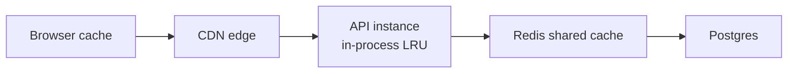

> **Gotcha:** Never cache per-user responses at a shared CDN unless the cache key includes the user and the CDN is configured for it. A `public` header on `/me/accounts` can serve one customer's balance to another. Use `Cache-Control: private` or `no-store` for personal financial data.

> **Finance tip:** Show freshness in the UI ("Prices as of 10:42:15") whenever a cached value could be mistaken for live. Regulators and users care more about honesty than about zero latency.

**Trade-offs:**
- Every layer adds staleness and an invalidation problem.
- In-process caches are the fastest (no network) but each instance has its own copy, so users can see values flip between requests hitting different pods.
- Redis is shared and fast (sub-millisecond on a local network) but is another dependency that can fail; code must fall back to the source.
- CDN caching gives the biggest win for public data but purges take time to propagate.

**What interviewers listen for:**
- You ask about freshness and sharing before picking a layer.
- You measure first and avoid caching to hide a missing index.
- You know `private` vs `public`, `s-maxage`, `stale-while-revalidate`.
- Red flag: caching balances at the CDN, or "just add Redis" with no TTL or invalidation story.

#### Q: [Senior] After a deploy, the cache for the "market movers" list expires every 60 seconds and each time the database CPU spikes to 100%. Explain what's happening and how you'd fix invalidation and the spike.

**Short answer:** That's a cache stampede (thundering herd): when a hot key expires, thousands of concurrent requests miss at the same moment and all recompute the same expensive query. Fixes: only one request recomputes (a lock or in-flight promise coalescing) while others wait or get the stale value; serve stale while refreshing in the background; add jitter to TTLs; or refresh hot keys proactively before they expire. For invalidation, prefer deleting keys on write plus a TTL safety net, and version keys so a deploy can switch to a fresh namespace without a mass expiry.

**Clarify first:** How many requests per second hit this key? How long does recomputation take? Is a 60-second-old list acceptable for a few extra seconds? Is there one hot key or many?

**Diagnose:**
- Plot cache hit ratio and DB CPU on the same timeline. Periodic dips in hit ratio aligned with CPU spikes every 60 s confirm it.
- Count identical queries in `pg_stat_statements` or slow query logs at the spike moments: hundreds of the same query within one second.

**Solution:** Layered fixes, simplest first.

1. Coalesce in-flight requests inside each instance:

```ts
const inflight = new Map<string, Promise<unknown>>();

async function getOrCompute<T>(key: string, ttlSec: number, compute: () => Promise<T>): Promise<T> {
  const hit = await redis.get(key);
  if (hit) return JSON.parse(hit) as T;

  const existing = inflight.get(key);
  if (existing) return existing as Promise<T>; // reuse the same pending computation

  const p = (async () => {
    try {
      const value = await compute();
      const jitter = Math.floor(Math.random() * ttlSec * 0.1); // spread expiries
      await redis.set(key, JSON.stringify(value), { EX: ttlSec + jitter });
      return value;
    } finally {
      inflight.delete(key);
    }
  })();
  inflight.set(key, p);
  return p;
}
```

2. Across instances, serve stale data and let one instance refresh, guarded by a short Redis lock (`SET NX PX`):

```ts
type Entry<T> = { value: T; freshUntil: number };

async function getStaleWhileRevalidate<T>(key: string, freshMs: number, compute: () => Promise<T>) {
  const raw = await redis.get(key);
  const entry = raw ? (JSON.parse(raw) as Entry<T>) : null;

  if (entry && Date.now() < entry.freshUntil) return entry.value;

  const gotLock = await redis.set(`lock:${key}`, '1', { NX: true, PX: 10_000 });
  if (gotLock) {
    const refresh = compute()
      .then((value) =>
        // keep the entry around much longer than its fresh window so stale reads are possible
        redis.set(key, JSON.stringify({ value, freshUntil: Date.now() + freshMs }), { PX: freshMs * 10 }),
      )
      .finally(() => redis.del(`lock:${key}`));
    if (!entry) { await refresh; return getStaleWhileRevalidate(key, freshMs, compute); }
    refresh.catch((err) => logger.warn({ err, key }, 'background refresh failed'));
  }
  if (entry) return entry.value; // stale but instant
  await new Promise((r) => setTimeout(r, 100)); // someone else is computing a cold key
  return getStaleWhileRevalidate(key, freshMs, compute);
}
```

3. For a few very hot keys, refresh on a schedule (a job every 30 s writes the list) so user requests never compute it.

Invalidation strategies:

| Strategy | How | Risk |
|---|---|---|
| TTL only | Expire after N seconds | Stale up to N, stampedes at expiry |
| Delete on write | After commit, `DEL portfolio:{userId}` | Race: a reader may repopulate old data between the read and delete |
| Write-through | Write DB and cache together | Cache holds data nobody reads |
| Versioned keys | `movers:v{dataVersion}` | Old keys linger until TTL |
| Event-driven | Consume change events and delete or update keys | More infrastructure |

> **Gotcha:** Delete the cache key after the database commit, not before. If you delete before, a concurrent reader can reload the old row and re-cache it right before your write lands. Even after commit there is a small race, which is why a TTL safety net always stays.

> **Why:** "There are only two hard things in computer science: cache invalidation and naming things" is a cliché because it's true. The interviewer wants to see that you plan for staleness instead of assuming perfect invalidation.

**Trade-offs:**
- Locks add complexity and a lock TTL that must exceed compute time.
- Stale-while-revalidate means some users see slightly old data; fine for "market movers", not for balances.
- Scheduled refresh wastes compute when nobody is reading.
- Jitter is nearly free and should almost always be on.

**What interviewers listen for:**
- You name the stampede and explain it with the timeline.
- Request coalescing, locks, stale-while-revalidate, jitter, proactive refresh.
- Delete after commit, TTL as a safety net.
- Red flag: "increase the TTL" as the only fix — it just makes the spike less frequent.

#### Q: [Mid] We run one big Node server. Product expects 10x users next year. What does "scale horizontally" mean, and what must change in the code to make it work?

**Short answer:** Horizontal scaling means running many identical instances behind a load balancer instead of buying a bigger machine (vertical scaling). It only works if instances are stateless: any instance can serve any request, so nothing important lives in a single process's memory or disk. Sessions, caches, uploaded files, rate-limit counters, scheduled jobs and WebSocket subscriptions must move to shared systems (Redis, the database, object storage, a queue).

**Clarify first:** Where is the bottleneck today, CPU, memory, database or an upstream? (If it's the database, adding app servers makes it worse.) Do we use WebSockets? Any in-memory state like `setInterval` jobs?

**Diagnose:** Audit for hidden state:
- `express-session` with the default `MemoryStore`.
- `const cache = new Map()` used as a source of truth.
- Files written to local disk (`/tmp/uploads`).
- `node-cron` jobs that would run N times with N instances.
- WebSocket rooms tracked in memory.

Then load test (k6, Artillery) with two instances and look for users being logged out, missing uploads, or duplicated emails.

**Solution:**

| State | Single-instance version | Horizontal version |
|---|---|---|
| Sessions | MemoryStore | Redis session store, or stateless tokens |
| Files | Local disk | S3/GCS, presigned URLs |
| Cache | `Map` | Redis (in-process only as a disposable layer) |
| Rate limits | In-memory counter | Redis token bucket |
| Cron jobs | `setInterval` in the web process | One scheduler (queue repeatable jobs, k8s CronJob) |
| WebSockets | Rooms in memory | Redis pub/sub or a managed broker to fan out across instances |

```ts
// Sessions in Redis so any instance can read them
import session from 'express-session';
import { RedisStore } from 'connect-redis'; // named export in connect-redis v8+; older versions differ
import { createClient } from 'redis';

const redisClient = createClient({ url: process.env.REDIS_URL });
await redisClient.connect();

app.use(session({
  store: new RedisStore({ client: redisClient, prefix: 'sess:' }),
  secret: env.SESSION_SECRET,
  resave: false,
  saveUninitialized: false,
  cookie: { httpOnly: true, secure: true, sameSite: 'lax', maxAge: 30 * 60 * 1000 },
}));
```

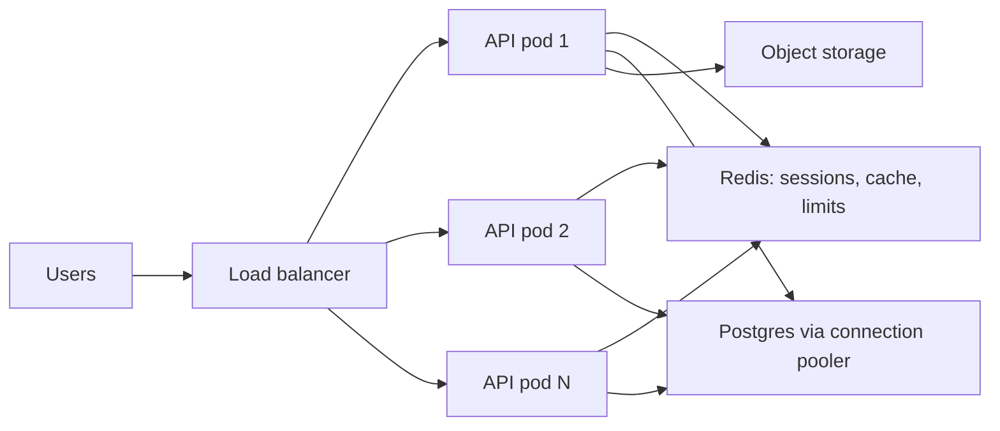

> **Gotcha:** Each Node instance opens its own database pool. 30 pods with a pool of 20 is 600 connections, which can exceed Postgres `max_connections`. Use a pooler such as PgBouncer (or your cloud's equivalent) and size pools deliberately.

> **Why:** Node runs your JavaScript on one thread per process. On a 4-core machine, you scale on the box by running several processes (cluster module, or more containers), then across machines. Either way the same statelessness rules apply.

**Trade-offs:**
- Sticky sessions (load balancer pins a user to one instance) are a shortcut that hides state, but break on deploys and uneven load. Use them only as a temporary measure, or for WebSockets with a proper fallback.
- Shared systems add latency and become critical dependencies.
- Horizontal scaling of the app tier doesn't scale the database; read replicas, caching and query work are separate efforts.

**What interviewers listen for:** Statelessness as the key requirement; a concrete list of hidden state; connection pool math; awareness that the database is often the real limit. Red flag: "just add more servers" without checking where state lives.

#### Q: [Staff] Our trading app gets 20x normal traffic in the first 5 minutes after market open at 9:30. Last month the order API fell over. How do you prepare the system for this predictable spike?

**Short answer:** Predictable spikes are a capacity planning and load-shaping problem. I'd pre-scale before 9:30 instead of relying on reactive autoscaling (which is too slow for a 5-minute spike), move non-critical work off the hot path, cache or push shared data (quotes) instead of having every client poll, protect the critical path (order placement) with priority and load shedding for less important endpoints, queue orders durably so bursts are absorbed, and rehearse with load tests that replay last month's traffic shape.

**Clarify first:**
- Which flows are critical (place order, view positions) vs nice-to-have (news, charts history)?
- Where did it fall over: API CPU, database connections, the broker/exchange gateway, or Redis?
- Is the spike reads (everyone refreshes quotes) or writes (orders), or both?
- Hard limits downstream: the exchange gateway may accept only N orders per second.

**Diagnose:** Rebuild last month's incident from metrics: requests per second by endpoint, p99 latency, error rates, DB connections, CPU per pod, autoscaler events. Often you find autoscaling started at 9:31 and new pods were ready at 9:34, after the damage; or the quotes endpoint (reads) starved the order endpoint (writes) of database connections.

**Solution:**

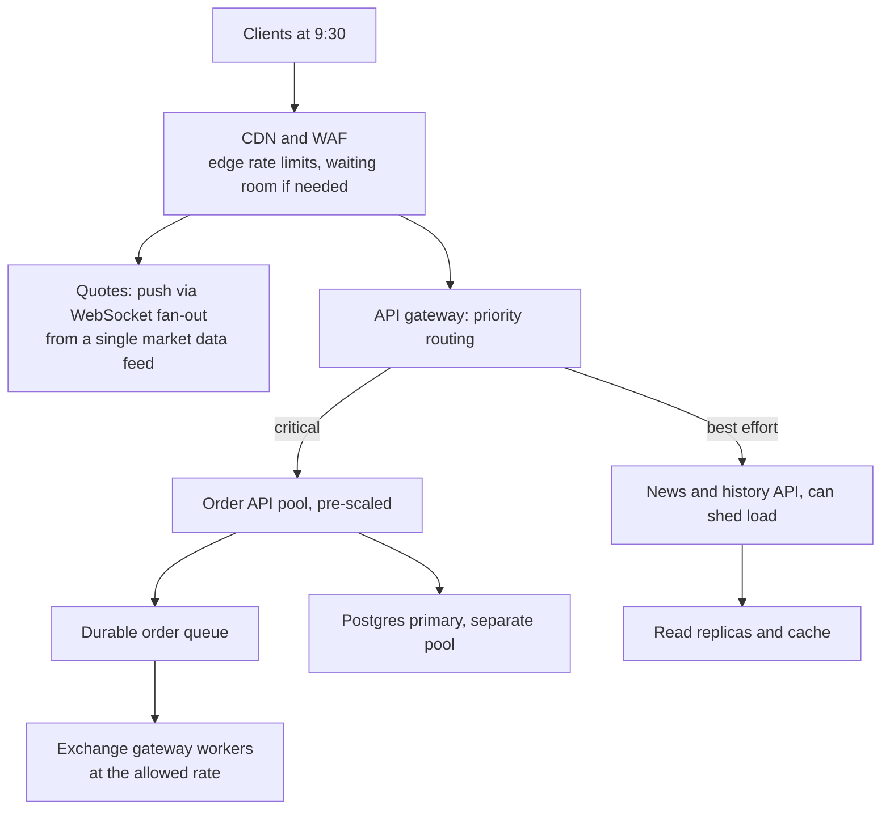

Concrete steps:
1. **Pre-scale on a schedule.** Scale API and worker pools up at 9:15 and down after 10:00 (scheduled scaling in your platform, or a k8s CronJob that patches replicas / HPA `minReplicas`). Warm caches before open.
2. **Reduce read amplification.** Instead of 100k clients polling `/quotes` every second, publish quotes once into a fan-out layer (WebSockets/SSE backed by pub/sub) and cache snapshots at the edge with short TTLs.
3. **Isolate critical paths (bulkheads).** Separate deployments and DB connection pools for order placement vs browsing, so a flood of history requests can't take the order path's connections.
4. **Absorb bursts with a queue.** Accept the order, persist it, return `202` with an order id, and let workers submit to the exchange at its allowed rate. The UI shows "Order received, submitting".
5. **Shed load gracefully.** When latency or queue depth crosses a threshold, return `503` with `Retry-After` for low-priority endpoints first, and the frontend hides or delays non-critical widgets.
6. **Rehearse.** Load test with the real traffic shape (a ramp to 20x within 60 seconds), not a gentle ramp.

```ts
// Simple load shedding for low-priority routes based on event loop delay
import { monitorEventLoopDelay } from 'node:perf_hooks';
const h = monitorEventLoopDelay({ resolution: 20 });
h.enable();

export const shedIfOverloaded: RequestHandler = (_req, res, next) => {
  const p99ms = h.percentile(99) / 1e6; // nanoseconds to ms
  if (p99ms > 200) {
    res.set('Retry-After', '5');
    return res.status(503).type('application/problem+json')
      .json({ type: 'about:blank', title: 'Temporarily overloaded', status: 503, code: 'OVERLOADED' });
  }
  next();
};
setInterval(() => h.reset(), 10_000).unref();

app.get('/v1/news', shedIfOverloaded, newsHandler);   // shed first
app.post('/v1/orders', placeOrderHandler);            // protected
```

> **Finance tip:** Never silently drop orders. Everything accepted must be durably recorded before you acknowledge it, and the UI must show an honest status (received, submitted, filled, rejected) instead of a spinner that might hide a lost order.

> **Interview tip:** Say "reactive autoscaling can't catch a 5-minute spike, so for predictable peaks I scale on a schedule and use autoscaling only as a backstop". It shows you understand autoscaler lag (metrics delay, pod startup, readiness).

**Trade-offs:**
- Pre-scaling costs money for idle capacity around the peak; cheap compared to an outage at open.
- Queuing orders adds latency and a "pending" state that product and compliance must accept.
- Load shedding means some users see degraded features; that must be a product decision made before the incident.
- WebSocket fan-out adds connection management infrastructure.

**What interviewers listen for:**
- Treats it as predictable: schedule-based scaling and rehearsal.
- Separates critical and non-critical paths (bulkheads, priority, shedding).
- Reduces load at the source (push instead of poll, edge caching).
- Knows downstream limits and uses queues to smooth bursts.
- Red flag: "autoscaling will handle it".

## 2. Queues, Background Jobs and Bulk Processing

#### Q: [Mid] Sending the "transfer confirmed" email and generating a PDF receipt makes the transfer endpoint take 4 seconds. How would you use a queue, and how do BullMQ and SQS compare?

**Short answer:** Keep the request path to what the user must wait for (validate, write the transfer, commit) and push side effects (email, PDF, analytics) to a queue processed by background workers. The API responds in milliseconds, and workers retry failures independently. BullMQ is a Node library on top of Redis, great for Node-only teams that want delays, priorities, repeatable jobs and a dashboard. SQS is a fully managed AWS queue with very high durability and no servers to run, but fewer features (no built-in priorities, basic delays, at-least-once by default).

**Clarify first:** Does the user need the PDF immediately on the confirmation screen? (Then show "Receipt generating" and update later.) Volume? Which cloud are we on? Is Redis already operated reliably (with persistence)?

**Diagnose:** A trace of the endpoint shows the time split: 60 ms DB work, 1.5 s SMTP call, 2.4 s PDF rendering. Anything the response doesn't depend on is a candidate to move.

**Solution:**

```ts
// queue.ts
import { Queue, Worker } from 'bullmq';
const connection = { host: process.env.REDIS_HOST!, port: 6379 };

export const notifications = new Queue('notifications', {
  connection,
  defaultJobOptions: {
    attempts: 5,
    backoff: { type: 'exponential', delay: 2000 }, // 2s, 4s, 8s, 16s...
    removeOnComplete: { age: 24 * 3600 },
    removeOnFail: false, // keep failed jobs for inspection
  },
});

// in the API handler, after the transaction commits
await notifications.add('transfer-confirmed', { transferId: t.id }, { jobId: `transfer-confirmed:${t.id}` });

// worker.ts — a separate process, scaled independently
new Worker(
  'notifications',
  async (job) => {
    const transfer = await transfers.getById(job.data.transferId); // load fresh data, not a stale copy
    await job.updateProgress(10);
    const pdfKey = await receipts.render(transfer);
    await job.updateProgress(70);
    await email.send({ to: transfer.userEmail, template: 'transfer-confirmed', attachments: [pdfKey] });
  },
  { connection, concurrency: 10 },
);
```

| | BullMQ (Redis) | Amazon SQS |
|---|---|---|
| Ops | You run Redis (or a managed Redis) | Fully managed |
| Delivery | At-least-once (job can rerun after a stalled worker) | At-least-once (standard) or exactly-once processing within a dedup window (FIFO) |
| Features | Delays, priorities, repeatable/cron jobs, rate limiting, parent/child flows, progress | Delay up to 15 min, visibility timeout, DLQ via redrive policy |
| Throughput | Bounded by Redis | Very high (standard queues) |
| Language | Node-first (Python port exists) | Any |
| Failed jobs | Kept in a "failed" set | Moved to a DLQ after `maxReceiveCount` |

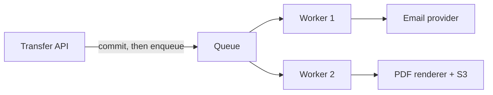

> **Gotcha:** Enqueue only after the database transaction commits. If you enqueue first and the transaction rolls back, the worker emails a confirmation for a transfer that doesn't exist. If you commit first and the process crashes before enqueueing, the email is lost. The full fix is the transactional outbox (covered later).

> **Why:** Pass ids, not whole objects, in job payloads. The worker loads current data, payloads stay small, and you avoid putting personal data into queue storage.

**Trade-offs:** Queues add eventual consistency (the email arrives seconds later), new infrastructure, and failure modes the UI must reflect. Redis-backed queues need Redis persistence and memory planning, or jobs can be lost on restart. SQS has less flexibility but nearly zero operations work.

**What interviewers listen for:** Move non-essential work off the request path; ids in payloads; enqueue after commit; retries with backoff; picking a queue based on team and platform. Red flag: `setTimeout` or fire-and-forget promises in the web process for important work.

#### Q: [Senior] A worker calls a partner API that fails 2% of the time and is sometimes down for 10 minutes. Jobs either retry forever or get dropped. Design retries, backoff and dead-letter handling.

**Short answer:** Classify errors first: retry only transient ones (timeouts, `429`, `5xx`, connection resets), fail fast on permanent ones (`400`, validation, "account closed"). Retry with exponential backoff, a cap, and random jitter so retries don't arrive in synchronized waves. After a maximum number of attempts, move the job to a dead-letter queue (DLQ) with its error and context, alert on DLQ depth, and give operators a way to inspect and replay. Every job must be idempotent, because retries mean it can run more than once.

**Clarify first:** How long may a job be delayed before it no longer matters (an OTP email is useless after 5 minutes; a statement can wait hours)? Does the partner support idempotency keys? Rate limits?

**Diagnose:** Look at the failure mix in logs: group by status code and error type. If 90% of failures are `503` bunched in 10-minute windows, you need longer backoff and a circuit breaker, not more attempts per second. Check if the same job ran successfully twice (duplicate side effects), which proves missing idempotency.

**Solution:**

```ts
class PermanentError extends Error {}

async function callPartner(payload: unknown, idempotencyKey: string) {
  const res = await fetch(PARTNER_URL, {
    method: 'POST',
    headers: { 'content-type': 'application/json', 'Idempotency-Key': idempotencyKey },
    body: JSON.stringify(payload),
    signal: AbortSignal.timeout(5000),
  });
  if (res.ok) return res.json();
  if (res.status === 429 || res.status >= 500) throw new Error(`transient ${res.status}`);
  throw new PermanentError(`permanent ${res.status}`); // 400, 401, 404, 422: retrying will not help
}

// "full jitter" backoff: random between 0 and min(cap, base * 2^attempt)
export function backoffMs(attempt: number, baseMs = 1000, capMs = 5 * 60_000) {
  return Math.floor(Math.random() * Math.min(capMs, baseMs * 2 ** attempt));
}
```

With BullMQ, custom backoff and permanent failures:

```ts
import { Worker, UnrecoverableError } from 'bullmq';

const worker = new Worker(
  'partner-sync',
  async (job) => {
    try {
      await callPartner(job.data.payload, `partner-sync:${job.id}`);
    } catch (err) {
      if (err instanceof PermanentError) throw new UnrecoverableError(err.message); // no more retries
      throw err; // retried according to attempts/backoff
    }
  },
  {
    connection,
    settings: { backoffStrategy: (attemptsMade: number) => backoffMs(attemptsMade) },
  },
);

// jobs are added with { attempts: 12, backoff: { type: 'custom' } }
worker.on('failed', async (job, err) => {
  if (job && job.attemptsMade >= (job.opts.attempts ?? 1)) {
    await deadLetters.add('partner-sync-dead', { original: job.data, error: err.message, jobId: job.id });
    metrics.increment('dlq.partner_sync');
  }
});
```

With SQS, the same idea is configuration: set a visibility timeout longer than processing time, and a redrive policy that moves a message to a DLQ after `maxReceiveCount` receives.

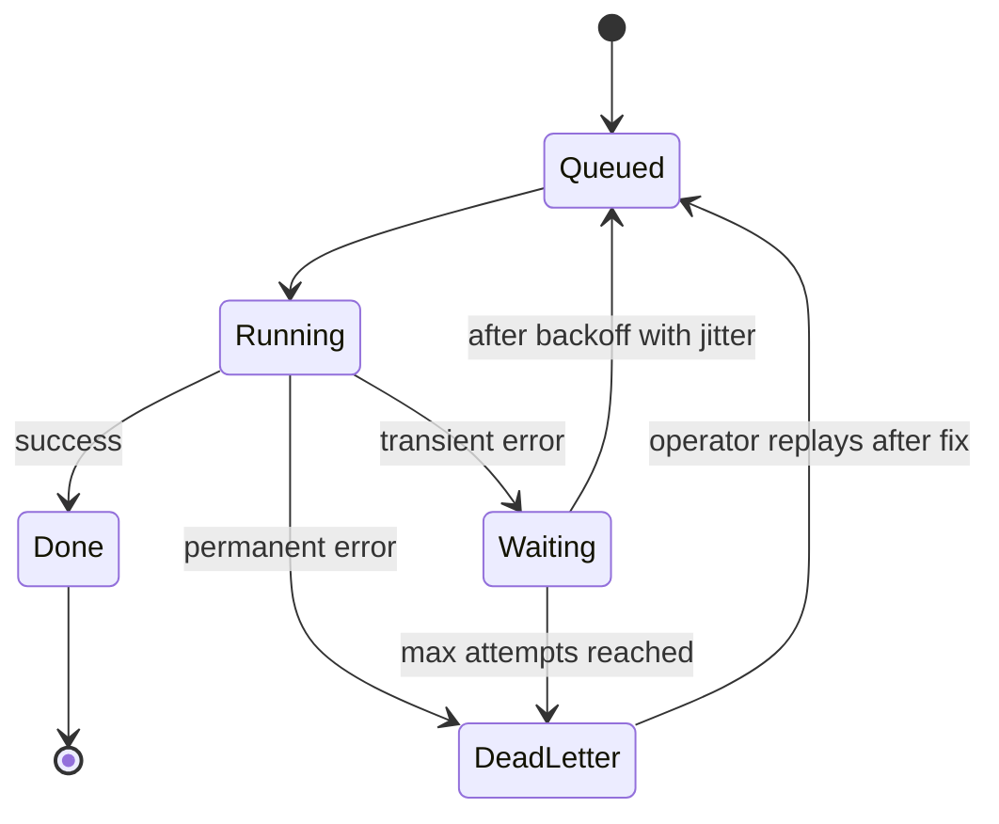

> **Why:** Without jitter, 10,000 jobs that failed during the same outage all retry at exactly +2s, +4s, +8s, hammering the partner the moment it recovers. Jitter spreads them out. AWS's architecture blog popularized "full jitter" for this reason.

> **Gotcha:** A DLQ nobody watches is a silent data loss bucket. Alert on DLQ size greater than zero for financial flows, and document the replay procedure in a runbook.

**Trade-offs:** More attempts improve eventual success but delay the moment you notice a real problem. Long backoff caps keep pressure off the partner but make the queue drain slowly after recovery. Retrying in the worker is fine for jobs; for synchronous user requests, keep retries very limited (one quick retry at most) because the user is waiting.

**What interviewers listen for:** Transient vs permanent classification; exponential backoff with cap and jitter; idempotency with retries; DLQ with alerting and replay. Red flag: `while (true) retry()` or retrying `400`s.

#### Q: [Senior] Operations wants to upload a 5 GB CSV of 30 million historical transactions through the admin UI. The current endpoint reads the file into memory and crashes. Design the import.

**Short answer:** Never hold the file in memory. Upload it directly to object storage with a presigned multipart upload, then run the import as a background job that streams the object, parses rows one at a time, validates each row, and writes in batches (or Postgres `COPY`) into a staging table. Track progress and per-row errors in an `imports` table that the UI polls. Finally, validate and merge staging into the real table in one controlled step, so a half-finished import never pollutes production data.

**Clarify first:** Is it insert-only or upserts? What's the uniqueness rule (external transaction id)? Must the import be all-or-nothing, or can good rows go in while bad rows are reported? How fast must it finish? Is this a one-off or recurring?

**Diagnose:** Heap snapshots or memory metrics show the process growing to the file size and dying with "JavaScript heap out of memory". Even if memory were enough, inserting row by row with one `INSERT` per row would take hours: measure rows per second on a sample of 100k rows to estimate.

**Solution:**

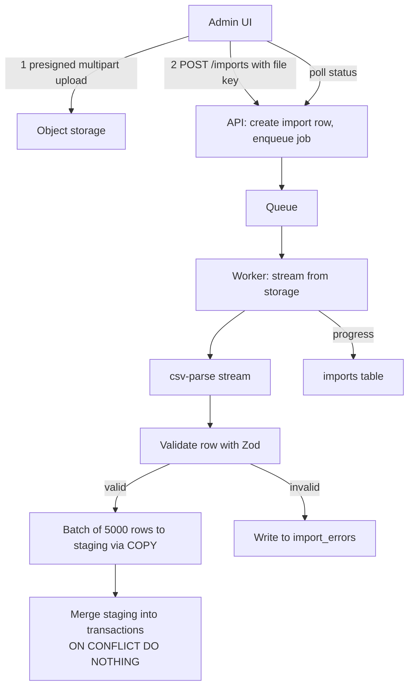

Streaming worker with backpressure:

```ts
import { GetObjectCommand } from '@aws-sdk/client-s3';
import { parse } from 'csv-parse';
import { Readable } from 'node:stream';
import { z } from 'zod';

const Row = z.object({
  external_id: z.string().min(1),
  account_id: z.string().startsWith('acct_'),
  amount_cents: z.coerce.number().int(),
  currency: z.enum(['USD', 'EUR']),
  posted_at: z.iso.datetime(),
});

export async function runImport(importId: string, fileKey: string, totalBytes: number) {
  const obj = await s3.send(new GetObjectCommand({ Bucket: BUCKET, Key: fileKey }));
  const source = obj.Body as Readable;
  let bytesRead = 0;
  source.on('data', (chunk: Buffer) => { bytesRead += chunk.length; });

  const parser = source.pipe(parse({ columns: true, skip_empty_lines: true, trim: true }));

  let batch: z.infer<typeof Row>[] = [];
  let line = 1; // header
  let ok = 0, failed = 0;

  for await (const record of parser) { // for-await respects backpressure: parsing pauses while we write
    line++;
    const r = Row.safeParse(record);
    if (!r.success) {
      failed++;
      if (failed <= 10_000) await saveRowError(importId, line, r.error.issues[0]?.message ?? 'invalid');
      continue;
    }
    batch.push(r.data);
    if (batch.length === 5000) {
      await copyIntoStaging(importId, batch); // COPY or multi-row INSERT
      ok += batch.length;
      batch = [];
      await db.query('UPDATE imports SET rows_ok = $2, rows_failed = $3, progress = $4 WHERE id = $1',
        [importId, ok, failed, Math.round((bytesRead / totalBytes) * 100)]);
      if (await isCancelled(importId)) return markCancelled(importId);
    }
  }
  if (batch.length) { await copyIntoStaging(importId, batch); ok += batch.length; }

  await mergeStaging(importId); // one SQL statement, see below
  await db.query(`UPDATE imports SET status = 'succeeded', rows_ok = $2, rows_failed = $3, progress = 100 WHERE id = $1`,
    [importId, ok, failed]);
}
```

Merge in the database, where set-based work is fast:

```sql
INSERT INTO transactions (external_id, account_id, amount_cents, currency, posted_at)
SELECT external_id, account_id, amount_cents, currency, posted_at
  FROM import_staging
 WHERE import_id = $1
ON CONFLICT (external_id) DO NOTHING;   -- re-running the import is safe

DELETE FROM import_staging WHERE import_id = $1;
```

> **Why:** Batching matters more than anything else for speed. One round trip per row at 1 ms each is over 8 hours for 30 million rows. Batches of thousands of rows, or `COPY` (for example via the `pg-copy-streams` package), are typically orders of magnitude faster.

> **Gotcha:** For a 30-million-row merge into a hot table, a single giant `INSERT ... SELECT` can hold locks and generate huge WAL. Merge in chunks (by id range) and consider running it off-peak. Check with the DBA or your own `EXPLAIN` first.

> **Interview tip:** Mention resumability: store the last committed line or byte offset, so a worker crash at 80% resumes instead of starting over. Combined with `ON CONFLICT DO NOTHING`, even a full restart is safe.

**Trade-offs:** A staging table costs disk and an extra step but gives all-or-nothing control and easy validation queries. Streaming row by row is memory-safe but CPU-bound on parsing; for recurring huge imports, a dedicated ETL tool or the database's bulk loader may be better. Partial imports (good rows in, bad rows reported) are friendlier but must be explicitly agreed with the business.

**What interviewers listen for:** Direct upload to storage; streaming with backpressure; validation per row with an error report; batching or `COPY`; staging and idempotent merge; progress, cancellation and resumability. Red flag: `fs.readFileSync` or `await file.text()` on 5 GB.

## 3. Concurrency, Consistency and Distributed Transactions

#### Q: [Staff] Two withdrawal requests for $80 arrive at the same millisecond on an account with $100. Both succeed and the balance becomes -$60. Explain why and show three ways to prevent it.

**Short answer:** It's a race condition: both requests read the balance (100), both check `100 >= 80`, both write. Under Postgres's default Read Committed isolation, nothing stops this read-check-write pattern. Fixes: (1) make the check and the write a single atomic conditional `UPDATE`; (2) pessimistic locking with `SELECT ... FOR UPDATE` so the second request waits; (3) optimistic locking with a `version` column, where the loser detects a conflict and retries. Alternatively, run the transaction at `SERIALIZABLE` and retry on serialization failures. A database `CHECK (balance_cents >= 0)` constraint is the last line of defence.

**Clarify first:** Is the balance a stored column or computed from a ledger of entries? How contended is a single account (a personal account rarely; a merchant settlement account constantly)? Do we need an audit trail of every movement (yes, in finance: a ledger)?

**Diagnose:** Reproduce it in a test: fire two concurrent requests with `Promise.all` against a real Postgres and assert the final balance. Look at the code for the pattern `SELECT balance` then `if` in JavaScript then `UPDATE SET balance = $newValue`. Writing an absolute value computed in application code is the giveaway.

**Solution:**

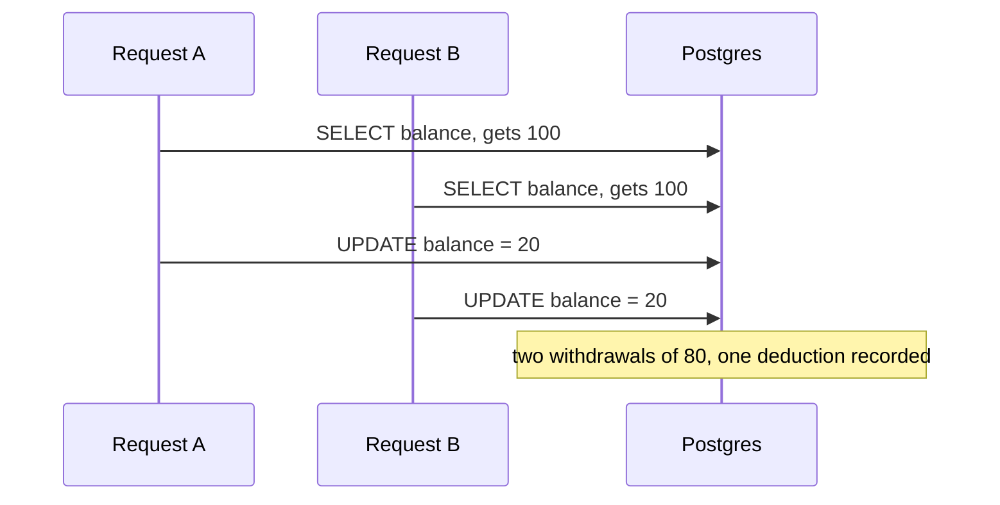

(The `UPDATE balance = balance - 80` form instead yields -60, the bug in the question. Either way, money is wrong.)

Option 1, atomic conditional update (simplest, best for a single row):

```ts
const { rowCount } = await client.query(
  `UPDATE accounts
      SET balance_cents = balance_cents - $1
    WHERE id = $2 AND balance_cents >= $1`,
  [amountCents, accountId],
);
if (rowCount === 0) throw new ProblemError(422, 'INSUFFICIENT_FUNDS', 'Insufficient funds');
```

The row is locked during the `UPDATE`, and the second transaction re-evaluates the `WHERE` against the updated row after the first commits, so only one succeeds.

Option 2, pessimistic lock when the decision needs several reads (limits, holds, rules):

```ts
await client.query('BEGIN');
const { rows: [acct] } = await client.query(
  'SELECT balance_cents, daily_limit_cents, status FROM accounts WHERE id = $1 FOR UPDATE',
  [accountId],
); // a second transaction blocks here until the first commits or rolls back
if (acct.status !== 'active') throw new ProblemError(422, 'ACCOUNT_INACTIVE', 'Account inactive');
if (acct.balance_cents < amountCents) throw new ProblemError(422, 'INSUFFICIENT_FUNDS', 'Insufficient funds');
await client.query('UPDATE accounts SET balance_cents = balance_cents - $1 WHERE id = $2', [amountCents, accountId]);
await client.query(
  'INSERT INTO ledger_entries (account_id, amount_cents, kind, transfer_id) VALUES ($1, $2, $3, $4)',
  [accountId, -amountCents, 'withdrawal', transferId],
);
await client.query('COMMIT');
```

Option 3, optimistic locking with a version column (good when conflicts are rare and you don't want to hold locks, for example across a user's edit form):

```ts
async function withdrawOptimistic(accountId: string, amountCents: number, maxRetries = 3) {
  for (let i = 0; i < maxRetries; i++) {
    const { rows: [a] } = await db.query('SELECT balance_cents, version FROM accounts WHERE id = $1', [accountId]);
    if (a.balance_cents < amountCents) throw new ProblemError(422, 'INSUFFICIENT_FUNDS', 'Insufficient funds');
    const { rowCount } = await db.query(
      `UPDATE accounts SET balance_cents = $1, version = version + 1
        WHERE id = $2 AND version = $3`,
      [a.balance_cents - amountCents, accountId, a.version],
    );
    if (rowCount === 1) return;           // we won
    await sleep(backoffMs(i, 20, 200));   // someone else changed it: re-read and retry
  }
  throw new ProblemError(409, 'CONCURRENT_UPDATE', 'Please retry');
}
```

Option 4, serializable isolation with retries:

```ts
async function inSerializable<T>(fn: (c: PoolClient) => Promise<T>, retries = 5): Promise<T> {
  for (let i = 0; ; i++) {
    const c = await db.connect();
    try {
      await c.query('BEGIN ISOLATION LEVEL SERIALIZABLE');
      const out = await fn(c);
      await c.query('COMMIT');
      return out;
    } catch (e: any) {
      await c.query('ROLLBACK');
      if (e.code === '40001' && i < retries) continue; // serialization_failure: safe to retry
      throw e;
    } finally {
      c.release();
    }
  }
}
```

And the safety net:

```sql
ALTER TABLE accounts ADD CONSTRAINT balance_non_negative CHECK (balance_cents >= 0);
```

> **Finance tip:** Real ledgers don't just overwrite a balance. They append immutable double-entry rows (a debit and a credit that sum to zero) and keep the balance as a derived or cached value updated in the same transaction. The audit trail is the source of truth.

> **Gotcha:** Locking two accounts in a transfer can deadlock if request A locks X then Y while request B locks Y then X. Always lock rows in a consistent order (for example sorted by account id). Postgres detects deadlocks and aborts one transaction, which you should retry.

**Trade-offs:**
- Atomic `UPDATE`: fastest and simplest, but only works when the rule fits in one statement.
- `FOR UPDATE`: flexible, but holds locks; hot accounts become a bottleneck and you must avoid deadlocks.
- Optimistic: no locks held, great for low contention and long user think time; poor under high contention (many retries).
- Serializable: the database catches all anomalies for you, but every transaction must be retryable and throughput drops under contention.

**What interviewers listen for:**
- You explain the race precisely (read-check-write) and why Read Committed allows it.
- At least two correct fixes with when to use each, plus a database constraint.
- Deadlock ordering, retries on `40001`, ledger thinking.
- Red flag: "use a mutex in Node" — it doesn't work across instances, or "check the balance in the frontend".

#### Q: [Staff] A transfer to an external bank involves our ledger service, a fraud check service and the payment provider. You can't wrap them in one database transaction. How do you keep them consistent?

**Short answer:** Use a saga: break the operation into local transactions, each with a compensating action that undoes it semantically (release a hold, reverse a ledger entry). An orchestrator (a state machine persisted in a database) drives the steps and compensations, retrying idempotent steps. To reliably publish events between steps without losing them, use the transactional outbox: write the state change and the outgoing message in the same local transaction, and a relay publishes the message afterwards. Two-phase commit (2PC) exists but is rarely used across services because it blocks and couples availability.

**Clarify first:** Which steps can be undone and which can't (money sent by the provider usually can't be "un-sent", only refunded or reversed)? Ordering of steps (do irreversible steps last)? Required latency: synchronous to the user or async with status?

**Diagnose:** Look for code that calls service A, then B, then C in sequence with no persisted state. If the process crashes after B, nobody knows to undo A or finish C. Search for "stuck" records: holds older than a day with no transfer outcome, or ledger debits with no matching provider payment.

**Solution:**

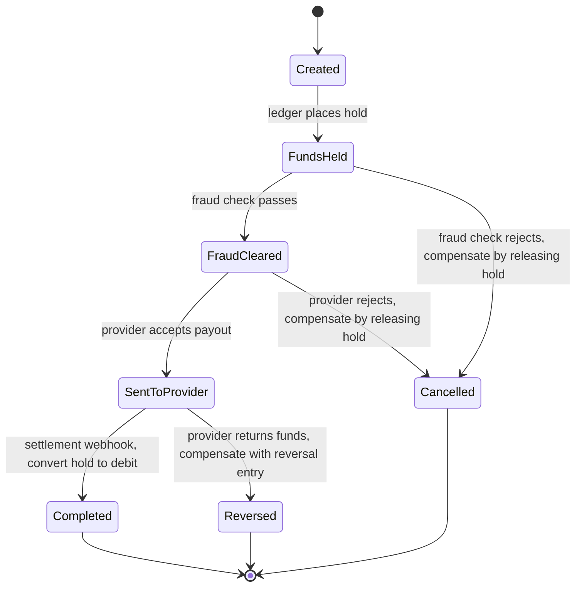

An orchestrator persisted in a table, advanced by idempotent steps:

```ts
type SagaState = 'created' | 'funds_held' | 'fraud_cleared' | 'sent_to_provider' | 'completed' | 'cancelled' | 'reversed';

async function advance(transferId: string) {
  const t = await transfers.get(transferId);
  switch (t.state as SagaState) {
    case 'created':
      await ledger.placeHold({ holdId: `hold:${t.id}`, accountId: t.fromAccountId, amountCents: t.amountCents });
      return transfers.transition(t.id, 'created', 'funds_held');   // UPDATE ... WHERE state = 'created'
    case 'funds_held': {
      const verdict = await fraud.check(t);
      if (verdict === 'reject') {
        await ledger.releaseHold(`hold:${t.id}`);                     // compensation
        return transfers.transition(t.id, 'funds_held', 'cancelled');
      }
      return transfers.transition(t.id, 'funds_held', 'fraud_cleared');
    }
    case 'fraud_cleared':
      await provider.createPayout({ idempotencyKey: `payout:${t.id}`, amountCents: t.amountCents, to: t.destination });
      return transfers.transition(t.id, 'fraud_cleared', 'sent_to_provider');
    default:
      return; // waiting for a webhook, or terminal
  }
}
```

Each step uses a deterministic id (`hold:{id}`, `payout:{id}`) so retrying after a crash doesn't double-apply. `transition` uses a conditional update (`WHERE state = $from`) so two workers can't advance the same saga twice.

The transactional outbox, so "state changed" and "event published" can't diverge:

```ts
await client.query('BEGIN');
await client.query(`UPDATE transfers SET state = 'completed' WHERE id = $1 AND state = 'sent_to_provider'`, [id]);
await client.query(
  `INSERT INTO outbox (id, topic, payload) VALUES ($1, 'transfer.completed', $2)`,
  [newId('evt'), { transferId: id }],
);
await client.query('COMMIT');

// relay: a loop or job that publishes and marks rows; safe with multiple relays
const { rows } = await db.query(
  `UPDATE outbox SET published_at = now()
    WHERE id IN (SELECT id FROM outbox WHERE published_at IS NULL
                  ORDER BY created_at LIMIT 100 FOR UPDATE SKIP LOCKED)
    RETURNING *`,
);
for (const evt of rows) await broker.publish(evt.topic, evt.payload, { messageId: evt.id });
```

(If the publish fails after marking, a crash could lose events. A stricter variant selects with `FOR UPDATE SKIP LOCKED` inside a transaction, publishes, then marks and commits, accepting that a crash may publish twice. Consumers deduplicate by `messageId`, so at-least-once is the goal. Change data capture tools like Debezium can replace the polling relay.)

> **Why:** You cannot atomically "commit to Postgres and publish to Kafka". The outbox turns that into one local commit plus an at-least-once relay. That pattern plus idempotent consumers is the backbone of most reliable event-driven systems.

> **Interview tip:** Contrast orchestration (one coordinator owns the state machine, easy to reason about and monitor) with choreography (services react to each other's events, less coupling but the flow is spread across services and harder to debug). For money flows, most teams prefer orchestration. Durable workflow engines such as Temporal implement this pattern for you.

**Trade-offs:** Sagas give up isolation: other readers can see intermediate states (funds held but not sent), so the UI and other services must understand those states. Compensations must be designed per step, and some actions can't be compensated (an email already sent). 2PC gives atomicity but blocks on coordinator failure and few modern services/brokers support it.

**What interviewers listen for:**
- Saga with explicit compensations, irreversible steps last, persisted state machine.
- Idempotent steps with deterministic keys, conditional state transitions.
- Transactional outbox, at-least-once relay, deduplicating consumers.
- Red flag: "wrap it all in a try/catch and call the undo endpoints in the catch".

#### Q: [Mid] After a user submits a transfer, the account page still shows the old balance for a few seconds because the read side updates asynchronously. How should the backend and the UI handle eventual consistency?

**Short answer:** Make the delay visible and harmless instead of hiding it. The backend returns the created resource with its status (`pending`) and a version or timestamp, so the UI can show it immediately. The UI updates optimistically from the response, labels it "Pending", and refetches or subscribes until the server confirms. Where users must see their own writes, the backend provides read-your-writes: read from the primary database for that user for a short window, or let the client pass the version it needs.

**Clarify first:** Where does the delay come from: a read replica lag, a cache, a separate read model (CQRS) fed by events, or a downstream system (card network)? How long is it typically and at worst? Which screens must be exact?

**Diagnose:** Compare timestamps: transfer committed at T, balance projection updated at T+2.4 s (from logs or a `projection_lag_seconds` metric). Check whether reads go to a replica (`pg_stat_replication` shows replay lag) or a cache with a TTL.

**Solution:** Backend options:
- Return the authoritative new state in the write response (`{ transfer, account: { availableBalanceCents, version } }`) so the client doesn't need to read immediately.
- Read-your-writes: after a write, route that user's reads to the primary for a few seconds (store "last write at" in the session).
- Expose versions (`ETag` or `version`) so the client can ask "give me at least version 42" or detect stale data.
- Push an event (SSE/WebSocket) when the projection catches up.

UI with TanStack Query:

```ts
const transfer = useMutation({
  mutationFn: api.createTransfer,
  onSuccess: (res) => {
    // use the server's authoritative numbers right away
    queryClient.setQueryData(['account', res.account.id], (old: Account | undefined) =>
      old && old.version > res.account.version ? old : { ...old, ...res.account },
    );
    queryClient.setQueryData(['transactions', res.account.id], (old: Page<Transaction> | undefined) =>
      old ? { ...old, data: [res.transfer.debitTransaction, ...old.data] } : old,
    );
  },
  onSettled: (_d, _e, vars) => {
    // reconcile shortly after, when projections have caught up
    setTimeout(() => queryClient.invalidateQueries({ queryKey: ['account', vars.fromAccountId] }), 3000);
  },
});
```

Show the state honestly: "Transfer pending. Available balance updated, posted balance may take a minute."

> **Finance tip:** Banks already distinguish "available" and "posted/ledger" balances. Using those two concepts in the API and UI makes eventual consistency feel normal instead of buggy.

**Trade-offs:** Optimistic UI feels fast but must handle rollback when the server rejects. Reading from the primary removes lag but adds load to the primary. Version checks add complexity to every endpoint that uses them.

**What interviewers listen for:** You find the source of the lag; return state from writes; read-your-writes; explicit pending states; versions to avoid overwriting newer data with older. Red flag: "add a `setTimeout(2000)` before refetching" as the whole fix.

## 4. Resilience and Failure Handling

#### Q: [Senior] The payment provider sometimes takes 30 seconds to respond instead of 300 ms. When it does, our transfer API stops answering every request, including the balance endpoint that never calls the provider. Why, and how do you contain it?

**Short answer:** Slow dependencies are worse than dead ones. Without a timeout, every request to the provider holds a connection, a socket and memory while it waits; requests pile up until the process runs out of database connections, HTTP agent sockets or event-loop headroom, and then unrelated endpoints fail too. The fix is layered: a strict timeout on every outbound call, a circuit breaker that stops calling a failing dependency for a while, and bulkheads (separate concurrency limits or pools) so one dependency can only consume its own share of resources.

**Clarify first:** What is the provider's normal p99 and its documented SLA? Is the call on the user's request path or can it move to a queue? Does the provider support idempotency keys, so a timed-out call can be retried safely? How many instances do we run and how many concurrent provider calls does each make at peak?

**Diagnose:**
- APM traces: the slow requests show one long span on `POST provider/charges`. Look at how many requests are in flight per instance during the incident.
- Check what got exhausted: the database pool (`pool.waitingCount` growing), the HTTP agent (`maxSockets` reached), or memory from buffered requests. Node's single thread usually is not blocked by waiting I/O; what blocks is a shared, limited resource.
- A common hidden cause: the handler opens a database transaction, then calls the provider inside it. Each slow provider call now holds a database connection for 30 seconds, and the balance endpoint can't get one.

**Solution:**

1. Timeouts on everything. Set the budget from the caller's need, not the dependency's worst case.

```ts
const res = await fetch(`${PROVIDER_URL}/charges`, {
  method: 'POST',
  headers: { 'content-type': 'application/json', 'Idempotency-Key': transferId },
  body: JSON.stringify(body),
  signal: AbortSignal.timeout(3000), // fail after 3 s instead of 30 s
});
```

2. Never hold a database transaction or row lock across a network call. Commit `status = 'pending_provider'`, call the provider, then update in a second short transaction.

3. A circuit breaker. After too many failures in a window it "opens" and fails immediately for a cool-down period, then lets a few trial calls through ("half-open").

```ts
type State = 'closed' | 'open' | 'half_open';

export class CircuitBreaker {
  private state: State = 'closed';
  private failures = 0;
  private openedAt = 0;

  constructor(
    private readonly failureThreshold = 5,
    private readonly coolDownMs = 30_000,
  ) {}

  async call<T>(fn: () => Promise<T>): Promise<T> {
    if (this.state === 'open') {
      if (Date.now() - this.openedAt < this.coolDownMs) throw new Error('circuit_open');
      this.state = 'half_open'; // let one trial request through
    }
    try {
      const result = await fn();
      this.failures = 0;
      this.state = 'closed';
      return result;
    } catch (err) {
      this.failures += 1;
      if (this.state === 'half_open' || this.failures >= this.failureThreshold) {
        this.state = 'open';
        this.openedAt = Date.now();
      }
      throw err;
    }
  }
}
```

This sketch counts consecutive failures and lets every concurrent caller through in half-open. In production, use a library such as `opossum` (Node), which tracks error percentage over a rolling window, supports a `volumeThreshold` so 2 failures out of 3 calls don't open the circuit, and emits `open`/`halfOpen`/`close` events you can turn into metrics.

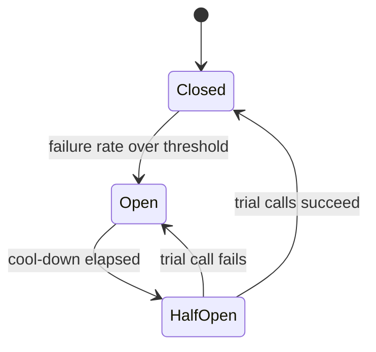

4. Bulkheads: cap concurrent calls to each dependency, so a slow provider can use at most, say, 50 of the instance's capacity.

```ts
import pLimit from 'p-limit';

const providerLimit = pLimit(50); // at most 50 in-flight provider calls per instance

export function chargeWithLimits(body: ChargeBody, transferId: string) {
  if (providerLimit.pendingCount > 200) throw new Error('provider_overloaded'); // shed load, don't queue forever
  return providerLimit(() => breaker.call(() => charge(body, transferId)));
}
```

5. Decide what the user sees when the breaker is open: "Card payments are delayed, your transfer is queued" (accept and process later) or a clear `503` with `Retry-After`. Retries with backoff and a dead-letter queue (covered in theme 2) handle the queued work.

> **Gotcha:** A timeout on a payment call does not mean the payment failed. The provider may have charged the card and you just didn't hear back. Treat timeouts as "unknown outcome": retry with the same idempotency key or query the provider's status before telling the user anything.

> **Why:** Retries without a breaker amplify an outage. If 1,000 requests per second each retry 3 times, a struggling provider suddenly gets 4,000 requests per second. The breaker gives it room to recover.

**Trade-offs:** Tight timeouts cut off legitimately slow calls (large batch requests), so set them per endpoint. A breaker that opens too eagerly rejects traffic during small blips; one that opens too late doesn't protect you. Per-instance breakers react independently and inconsistently; a shared breaker state (Redis) is consistent but adds a dependency. Bulkhead limits need tuning from real concurrency data.

**What interviewers listen for:**
- "A slow dependency is worse than a dead one" and why resources get exhausted.
- Timeouts everywhere, chosen from the caller's latency budget.
- No transactions or locks held across network calls.
- Circuit breaker states explained, plus bulkheads and load shedding.
- Timeout means unknown outcome for money movement.
- Red flags: no timeouts, "just increase the timeout to 60 s", retries without limits.

#### Q: [Staff] Our only card payment provider has a 2-hour outage during a busy Saturday. Design the system so we keep taking orders safely and nothing is lost or charged twice.

**Short answer:** Design for degraded operation, not perfect uptime. Detect the outage quickly (breaker plus synthetic checks), switch to a degraded mode chosen by the business: accept and queue payments to retry later, route to a secondary provider, or offer other payment methods. Every payment attempt is a persisted state machine with an idempotency key, so retries and failover can't double-charge. Ambiguous "timed out" payments are resolved by querying the provider and by daily reconciliation against provider reports.

**Clarify first:**
- Can we deliver value before payment is confirmed (ship later, credit risk) or must we block? This is a business risk decision, not only a technical one.
- Do we have, or can we justify, a second provider? Card tokens are often provider-specific, so failover needs network tokens or a vault that works with both.
- Regulatory rules: some flows require authorization before releasing goods or funds.
- What's the maximum amount we're willing to accept on "pay later" per user (risk cap)?

**Diagnose:** Know it's the provider and not us: provider status page, error rates by provider endpoint, synthetic "$0 auth" checks every minute, and the breaker's `open` events. Alert the on-call and switch modes with a feature flag, not a redeploy.

**Solution:**

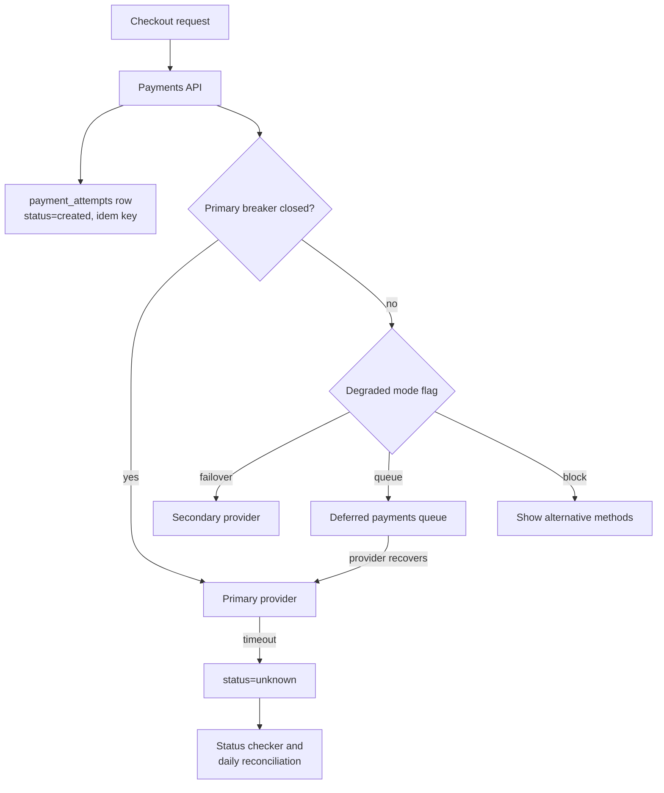

The payment attempt state machine is the core:

```sql
CREATE TABLE payment_attempts (
  id               UUID PRIMARY KEY,
  order_id         UUID NOT NULL,
  provider         TEXT NOT NULL,              -- 'primary' or 'secondary'
  idempotency_key  TEXT NOT NULL UNIQUE,       -- sent to the provider
  amount_cents     BIGINT NOT NULL CHECK (amount_cents > 0),
  currency         CHAR(3) NOT NULL,
  status           TEXT NOT NULL,              -- created, deferred, sent, succeeded, failed, unknown
  provider_ref     TEXT,
  updated_at       TIMESTAMPTZ NOT NULL DEFAULT now()
);
-- at most one live attempt per order, so failover cannot charge twice
CREATE UNIQUE INDEX one_live_attempt ON payment_attempts (order_id)
  WHERE status IN ('created', 'deferred', 'sent', 'unknown', 'succeeded');
```

Failover rule: only move an order to the secondary provider when the primary attempt is definitely `failed` (for example, connection refused before sending, or a clear decline). If it is `unknown`, first resolve it with the primary (query by idempotency key once it's back). Otherwise you risk charging the customer on both providers.

```ts
async function resolveUnknown(attempt: PaymentAttempt) {
  const remote = await primary.findPaymentByIdempotencyKey(attempt.idempotencyKey); // provider-specific lookup
  if (!remote) return markFailed(attempt.id, 'not_found_at_provider');
  if (remote.status === 'succeeded') return markSucceeded(attempt.id, remote.id);
  if (remote.status === 'failed') return markFailed(attempt.id, remote.failureCode);
  // still processing: check again later
}
```

Lookup by idempotency key is provider-specific; some providers only support listing by metadata or your own reference, so store your attempt id in the provider's metadata field.

Degraded-mode options:
- **Queue and retry later:** accept the order as "payment pending", authorize when the provider recovers, cancel and notify if authorization later fails. Works when you can afford short credit risk; cap per-user exposure.
- **Secondary provider:** best availability, but doubles integration, reconciliation and compliance work.
- **Other methods:** bank transfer, wallet, gift balance.
- **Honest blocking:** a clear banner beats a spinning button that eventually times out and gets clicked again.

Reconciliation closes the loop: every day, compare your `payment_attempts` with the provider's settlement report. Any mismatch (they have a charge you think failed) creates a ticket or an automatic refund.

> **Finance tip:** Settlement reports are the source of truth for what money actually moved. Your database is your intent; reconciliation proves they match.

> **Interview tip:** Say out loud that "keep taking orders" is a business trade-off between lost revenue and risk of unpaid orders, and propose giving product and risk teams the switch.

**Trade-offs:** Queuing payments increases conversion during outages but creates unpaid orders and customer confusion if they fail later. A second provider costs money and engineering time every month to save a few hours a year; justify it with outage history and revenue at risk. Automatic failover is fast but dangerous with unknown outcomes; manual switch is slower but safer.

**What interviewers listen for:**
- Business-chosen degraded modes behind a flag.
- Persisted payment state machine with idempotency keys and a partial unique index.
- "Unknown" as a first-class state, resolved before failover.
- Reconciliation with settlement reports.
- Red flags: "retry until it works", failover on timeout without checking, no plan for customers who clicked pay twice.

#### Q: [Mid] On Kubernetes, when the database had a 1-minute hiccup, all our API pods were restarted in a loop and the outage lasted 15 minutes. The liveness probe calls `/health`, which checks the database. What's wrong?

**Short answer:** Liveness and readiness answer different questions. Liveness asks "is this process broken beyond repair, should I kill it?"; readiness asks "should this pod receive traffic right now?". Checking the database in liveness means a database problem kills every healthy pod, and restarting them (cold starts, connection storms) makes the recovery slower. Liveness should only check the process itself; dependency checks belong in readiness, and often not even there.

**Clarify first:** What does `/health` check today? How long do pods take to start? Are there startup tasks (migrations, cache warm-up)? Which dependencies are truly required to serve any request?

**Diagnose:** `kubectl describe pod` shows `Liveness probe failed` and restart counts climbing. Events line up with the database incident. Logs show each new pod opening a full connection pool at once, adding load to a recovering database.

**Solution:**

```ts
let shuttingDown = false;

// liveness: is the event loop responsive? No dependency checks.
app.get('/livez', (_req, res) => res.status(200).send('ok'));

// readiness: can this instance usefully serve traffic?
app.get('/readyz', async (_req, res) => {
  if (shuttingDown) return res.status(503).send('shutting down');
  try {
    await withTimeout(db.query('SELECT 1'), 500);
    res.status(200).send('ready');
  } catch {
    res.status(503).send('db unavailable');
  }
});
```

```yaml
startupProbe:            # gives slow starts time before liveness kicks in
  httpGet: { path: /livez, port: 8080 }
  periodSeconds: 5
  failureThreshold: 24   # up to 2 minutes to start
livenessProbe:
  httpGet: { path: /livez, port: 8080 }
  periodSeconds: 10
  failureThreshold: 3
readinessProbe:
  httpGet: { path: /readyz, port: 8080 }
  periodSeconds: 5
  failureThreshold: 2
```

Be careful even with readiness: if every pod depends on the same database and all become unready, the load balancer has nowhere to send traffic and users get a generic error instead of your nice "we're having trouble" response. Some teams therefore keep readiness for local conditions only (started, not shutting down, not overloaded) and handle dependency failures in the request path with timeouts and breakers.

| Probe | Question | Failure action | Should check |
|---|---|---|---|
| Startup | Has it finished starting? | Keep waiting, then restart | Same as liveness |
| Liveness | Is the process stuck? | Restart container | Process only |
| Readiness | Should it get traffic? | Remove from load balancer | Local state, maybe critical deps |

> **Gotcha:** A heavy health check (a big query, calling three downstream services) run every 5 seconds by every pod becomes its own load problem. Keep probes cheap and with short timeouts.

**Trade-offs:** Shallow probes may report "healthy" while the pod can't do useful work; deep probes cause cascading restarts. A separate, deeper `/status` endpoint for dashboards and synthetic monitoring gives visibility without hooking it to restarts.

**What interviewers listen for:** Clear liveness vs readiness vs startup distinction; never dependency checks in liveness; awareness that restarts can worsen an outage; cheap probes. Red flag: one `/health` endpoint used for everything.

#### Q: [Mid] Every deploy causes a burst of 502 errors and a few transfer jobs are left half-processed. How do you implement graceful shutdown in a Node service?

**Short answer:** When Kubernetes (or any orchestrator) stops a pod it sends `SIGTERM`, waits a grace period (30 seconds by default), then sends `SIGKILL`. A graceful service catches `SIGTERM`, stops being ready so no new traffic arrives, stops accepting new connections, finishes in-flight requests and jobs, closes database and queue connections, and exits before the grace period ends. The 502s usually come from the load balancer still sending requests for a few seconds after shutdown started.

**Clarify first:** What runs in the process: HTTP only, workers, or both? How long does the longest request or job take? Do jobs have idempotency so a killed job can be safely retried?

**Diagnose:** Correlate 502 timestamps with pod termination events. Check logs: does the app log anything on `SIGTERM`? If the process is started via `npm start`, `npm` may not forward signals to Node; check that PID 1 in the container is Node (or use an init like `tini`).

**Solution:**

```ts
import http from 'node:http';

const server = http.createServer(app);
server.listen(8080);

async function shutdown(signal: string) {
  logger.info({ signal }, 'shutdown started');
  shuttingDown = true;                 // readiness now returns 503

  await sleep(5000);                   // let the load balancer notice and stop routing to us

  const httpClosed = new Promise<void>((resolve) => server.close(() => resolve())); // stop new connections, wait for in-flight
  server.closeIdleConnections();       // drop idle keep-alive sockets (Node 18.2+)

  await Promise.all([
    httpClosed,
    worker.close(),                    // BullMQ: waits for active jobs to finish
  ]);
  await db.end();                      // close the pool last
  logger.info('shutdown complete');
  process.exit(0);
}

process.once('SIGTERM', () => void shutdown('SIGTERM'));
process.once('SIGINT', () => void shutdown('SIGINT'));

// safety net: never exceed the grace period
process.once('SIGTERM', () => setTimeout(() => process.exit(1), 25_000).unref());
```

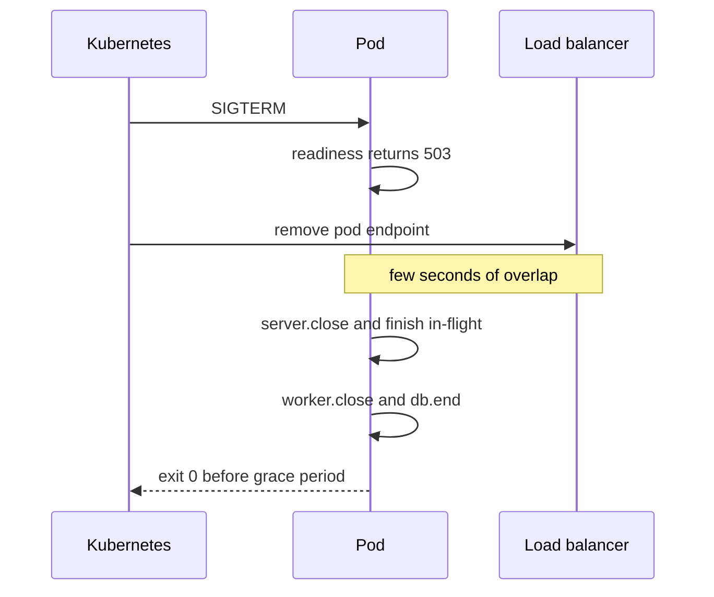

Jobs that take longer than the grace period should be designed to be interrupted: checkpoint progress, release the job back to the queue, and rely on idempotency when another worker picks it up.

> **Why:** Endpoint removal and `SIGTERM` happen in parallel, not in order. The short sleep (or a `preStop` hook; newer Kubernetes versions also support a built-in `sleep` action there) covers that race.

> **Gotcha:** Long-lived connections (WebSockets, SSE) never finish by themselves. Send clients a "reconnect" message and close them, so they reconnect to a new pod with backoff.

**Trade-offs:** A longer grace period lets more work finish but slows deploys and scale-down. Waiting for jobs makes shutdown predictable only if jobs are short; otherwise checkpointing is required.

**What interviewers listen for:** `SIGTERM` handling, readiness flip, the endpoint-removal race, draining HTTP and workers, a hard deadline, signals reaching Node as PID 1, and idempotent jobs as the backstop. Red flag: `process.exit()` immediately on `SIGTERM`.

## 5. Observability and SLOs

#### Q: [Senior] A user reports "the transfer button spun for 20 seconds and then failed." You have logs in three services and the database, but nothing ties them together. How do you set up logs, metrics and traces so you can follow one click from the React app to the SQL query?

**Short answer:** Use the three signals for different jobs: metrics tell you *that* something is wrong (rates, errors, latency percentiles), traces tell you *where* in the request path the time went, and logs tell you *why* for a specific event. Tie them together with one trace id generated at the edge (ideally in the browser) and propagated through every hop using the W3C `traceparent` header. OpenTelemetry gives vendor-neutral SDKs for the browser and Node, auto-instruments HTTP, Express, `pg` and Redis, and lets you inject the trace id into every structured log line.

**Clarify first:** Which backend do we send telemetry to (Datadog, Grafana Tempo/Loki, Honeycomb, New Relic)? Can we add headers to cross-origin API calls (CORS)? Sampling budget: tracing every request may be too expensive at high volume. PII rules: what must never appear in logs or span attributes?

**Diagnose:** Today, can you answer "show me everything that happened for this user's request at 14:03"? If you have to grep by timestamp and guess, you need correlation. Check whether services already forward any request id header and whether logs are structured JSON or free text.

**Solution:**

Browser: instrument `fetch` so every API call carries `traceparent`.

```ts
import { WebTracerProvider, BatchSpanProcessor } from '@opentelemetry/sdk-trace-web';
import { OTLPTraceExporter } from '@opentelemetry/exporter-trace-otlp-http';
import { registerInstrumentations } from '@opentelemetry/instrumentation';
import { FetchInstrumentation } from '@opentelemetry/instrumentation-fetch';

const provider = new WebTracerProvider({
  spanProcessors: [new BatchSpanProcessor(new OTLPTraceExporter({ url: '/otel/v1/traces' }))],
});
provider.register();

registerInstrumentations({
  instrumentations: [
    new FetchInstrumentation({
      propagateTraceHeaderCorsUrls: [/^https:\/\/api\.example\.com/], // only our own APIs
    }),
  ],
});
```

The API must allow `traceparent` in CORS `Access-Control-Allow-Headers`. Constructor options changed between OpenTelemetry JS SDK 1.x and 2.x (`spanProcessors` in the constructor replaced `addSpanProcessor`), so check the version you install.

Node services: start the SDK before anything else is imported.

```ts
// tracing.ts, loaded with: node --import ./tracing.js server.js
import { NodeSDK } from '@opentelemetry/sdk-node';
import { getNodeAutoInstrumentations } from '@opentelemetry/auto-instrumentations-node';
import { OTLPTraceExporter } from '@opentelemetry/exporter-trace-otlp-http';

new NodeSDK({
  traceExporter: new OTLPTraceExporter(),          // endpoint from OTEL_EXPORTER_OTLP_ENDPOINT
  instrumentations: [getNodeAutoInstrumentations()], // http, express, pg, ioredis, ...
}).start();
// service name from OTEL_SERVICE_NAME=transfer-api
```

Logs: structured JSON with the trace id on every line, so you can jump from a trace to its logs.

```ts
import pino from 'pino';
import { trace } from '@opentelemetry/api';

export const logger = pino({
  mixin() {
    const ctx = trace.getActiveSpan()?.spanContext();
    return ctx ? { trace_id: ctx.traceId, span_id: ctx.spanId } : {};
  },
  redact: ['req.headers.authorization', '*.accountNumber', '*.cardNumber'],
});

logger.info({ transferId, amountCents, fromAccountId }, 'transfer created');
```

(`@opentelemetry/instrumentation-pino` can inject these fields automatically.) Add business attributes to spans where they help search: `span.setAttribute('transfer.id', transferId)`. Return the trace id to the client in an error response or a header so support can ask the user for it ("error reference abc123").

Database: the `pg` instrumentation creates a span per query with the statement. To see trace ids inside the database itself (for example, in `pg_stat_activity` or slow query logs), add the trace context as a SQL comment (the sqlcommenter format; some OpenTelemetry `pg` instrumentation versions offer this as an option).

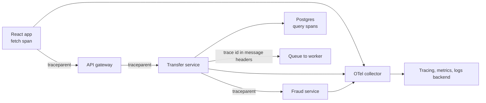

For queues, put the trace context in message headers or attributes so the worker's span links back to the original request.

Metrics: record RED metrics per endpoint (Rate, Errors, Duration as a histogram), plus saturation (pool usage, queue depth). Use low-cardinality labels: route template `/accounts/:id`, never the raw URL or user id.

> **Gotcha:** High-cardinality metric labels (user id, transfer id) explode metric storage costs. Put ids on traces and logs, not on metrics.

> **Finance tip:** Never put full account numbers, card numbers or tokens in logs or span attributes. Use redaction at the logger and at the collector (attribute processors), because one forgotten debug line is enough to break PCI rules.

**Trade-offs:** Tracing everything is expensive; head sampling (keep 10%) is cheap but may drop the one failing request; tail sampling in the collector (keep all errors and slow traces, sample the rest) is better but needs a stateful collector tier. Browser tracing adds a small script and some network traffic, and requires CORS changes.

**What interviewers listen for:**
- Metrics, traces and logs each with a purpose.
- One trace id from browser to DB via `traceparent`, including through queues.
- Structured logs with trace ids and redaction.
- Sampling and cardinality awareness.
- Red flags: "we'll add more `console.log`", logging whole request bodies with PII.

#### Q: [Senior] The VP asks "how reliable is the transfer API?" and the team says "it's up." Define SLIs, SLOs and an error budget for it, and explain how they change day-to-day decisions.

**Short answer:** An SLI is a measured ratio of good events to total events from the user's point of view, such as "transfer requests that succeed in under 1 second." An SLO is the target for that ratio over a window, such as 99.9% over 30 days. The error budget is what's left (0.1%, about 43 minutes of full outage per 30 days, or 1 in 1,000 requests). When the budget is healthy, ship faster; when it's burning, slow down and fix reliability. Alerts fire on budget burn rate, not on every CPU spike.

**Clarify first:** What do users actually care about: that the transfer is accepted, that it's fast, that the balance is correct? Which measurement point: the load balancer (sees our failures), or the client (also sees network issues)? Are there contractual SLAs with partners (an SLA should be looser than the internal SLO)?

**Diagnose:** Collect a baseline before picking targets: last 90 days of success rate and latency percentiles. Setting a 99.99% SLO on a service that has delivered 99.7% just guarantees constant alarms.

**Solution:**

Example for `POST /transfers`:

| SLI | Good event | SLO (30 days) |
|---|---|---|
| Availability | Response is not 5xx (4xx validation errors count as good, they are the user's fault) | 99.9% |
| Latency | Response in under 1 s | 99% |
| Correctness | Ledger reconciliation finds no mismatch | 100% target, alert on any |

Error budget math: 99.9% of 30 days leaves 0.1% x 43,200 minutes = 43.2 minutes. With 5 million transfer requests per month, it's 5,000 failed requests.

PromQL for the availability SLI (metric names depend on your instrumentation; OpenTelemetry's `http.server.request.duration` histogram usually appears as `http_server_request_duration_seconds` in Prometheus):

```text
sum(rate(http_server_request_duration_seconds_count{route="/transfers", http_response_status_code!~"5.."}[30d]))
/
sum(rate(http_server_request_duration_seconds_count{route="/transfers"}[30d]))
```

Burn-rate alerting (from the Google SRE workbook): a burn rate of 1 uses exactly the budget over 30 days. Page when it burns fast, open a ticket when it burns slowly.

```text
Page:   burn rate > 14.4 over 1h AND over 5m   (2% of the monthly budget gone in 1 hour)
Page:   burn rate > 6 over 6h AND over 30m     (5% gone in 6 hours)
Ticket: burn rate > 1 over 3 days
```

The short window confirms it's still happening, so alerts stop soon after recovery.

How it changes decisions:
- Budget mostly left: ship features, run experiments, do risky migrations.
- Budget exhausted: freeze non-critical launches, prioritize the top causes of budget burn (from incident reviews), add tests and safeguards.
- Product and engineering agree on this policy in advance, so it isn't a debate during an incident.

> **Interview tip:** Define the SLI from the user's view ("transfer accepted within 1 s") rather than from the server's view ("CPU under 70%"). CPU is a cause; users feel symptoms.

> **Gotcha:** 100% is the wrong target for availability. It's impossible, it forbids all change, and the users' own networks are less reliable than that anyway. Correctness of money is the exception, where you alert on any mismatch.

**Trade-offs:** Tighter SLOs cost much more (redundancy, on-call load, slower releases); each extra nine is roughly 10x harder. Measuring at the client is closest to the user experience but noisy; measuring at the load balancer is clean but misses client-side failures. Too many SLOs dilute attention; start with 2–3 per critical user journey.

**What interviewers listen for:** Correct definitions; user-centric SLIs; budget math; burn-rate multi-window alerts; error budget policy that changes priorities; SLA looser than SLO. Red flags: "uptime 100%", alerting on CPU instead of symptoms.

#### Q: [Staff] At 14:00 the portfolio page's p99 latency jumped from 300 ms to 2.5 s. p50 barely changed. The page calls a BFF, which calls the positions, prices and FX services. Walk me through how you find the cause.

**Short answer:** A jump in p99 with a flat p50 means a subset of requests got slow, not everything, so look for what those requests have in common: an instance, a customer segment, a dependency, a code path. Start from the symptom metric, narrow the time and scope, compare slow traces with fast ones to find which span grew, then confirm the cause with that component's own metrics and the change log (deploys, config flags, traffic, data growth). Mitigate first (roll back, flip a flag, scale) and do deep analysis after users are safe.

**Clarify first:** Is it all users or some (big portfolios, a region, a client version)? Did anything change at 14:00: deploy, feature flag, cron job, market event, traffic spike? Is the error rate also up, or only latency? Is the SLO burning (does it need an incident now)?

**Diagnose:** A structured path instead of guessing:

1. **Confirm and scope.** Dashboard: BFF latency by route, by instance, by region. If one pod is slow, it's that pod (noisy neighbor, GC, bad node). If all pods are slow on one route, it's that code path or a dependency.
2. **Check changes.** Overlay deploy and flag-change markers on the latency graph. Most incidents follow a change.
3. **Traces.** Query traces for the route with duration over 2 s in the last 30 minutes, and compare their span breakdown with fast traces. Look for which span grew, and whether calls are sequential that should be parallel.
4. **Drill into the slow component.** Suppose the prices service span went from 40 ms to 2 s for some traces. Check its RED metrics, its own dependencies (Redis hit rate, database), and its saturation: CPU, event-loop lag, pool wait time, GC pauses.
5. **Find the shared attribute.** Group slow traces by attributes: `portfolio.positions_count`, `client.version`, `region`. Here, say, slow traces all have more than 500 positions.
6. **Database.** For the slow query, run `EXPLAIN (ANALYZE, BUFFERS)` with a large portfolio's parameters. Look for a plan change, a sequential scan, or lock waits (`pg_stat_activity` with `wait_event_type = 'Lock'`).

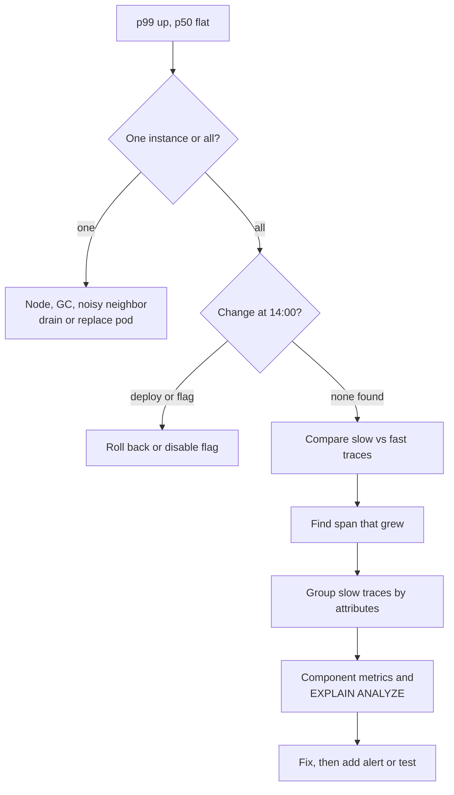

**Solution:** Typical root causes and fixes for this exact pattern:
- **New N+1 for large portfolios:** a deploy made the prices service fetch FX rates per position. 500 positions means 500 sequential Redis calls. Fix with batching (`MGET` or one query with `= ANY($1)`).
- **Cache expiry:** a cache key TTL aligned with a cron at 14:00, causing a stampede (see theme 1).
- **Connection pool saturation:** a new batch job shares the pool, so some requests wait for a connection. The trace shows time before the query span starts. Fix with separate pools or limits.
- **Query plan change:** table stats changed after a large import; Postgres picked a worse plan. `ANALYZE` the table and review the index.
- **Fan-out amplification:** the BFF waits for the slowest of N parallel calls. With many calls, the chance that at least one hits its own tail goes up. Fixes: fewer calls, timeouts with partial responses, or hedged requests for idempotent reads.

Code fix for the N+1 example:

```ts
// before: one call per position
for (const p of positions) p.fxRate = await fx.getRate(p.currency, baseCurrency);

// after: one batched call for unique currencies
const currencies = [...new Set(positions.map((p) => p.currency))];
const rates = await fx.getRates(currencies, baseCurrency); // Map<currency, rate>
for (const p of positions) p.fxRate = rates.get(p.currency)!;
```

After the fix: add a latency alert per route on p99 (or a latency SLO burn alert), a test with a large fixture portfolio, and a trace-based check in staging.

> **Why:** Averages and p50 hide tail problems. The users with the biggest portfolios, often your most valuable customers, live in the p99.

> **Interview tip:** Say "mitigate first, then investigate." If a deploy at 13:58 correlates, rolling back is a valid first step even before you know the exact cause.

**Trade-offs:** Rolling back immediately is safe but may lose a needed fix; investigating first prolongs user pain. Hedged requests cut tail latency but add load. Partial responses ("prices delayed") keep the page fast but the UI must handle missing data.

**What interviewers listen for:**
- Reading p50 vs p99 correctly.
- A systematic narrowing approach: scope, changes, traces, component, attribute, query.
- Comparing slow and fast traces.
- Mitigation before root cause; follow-up actions (alert, test).
- Red flags: "add more servers" without evidence, jumping straight to a guess, only looking at averages.

