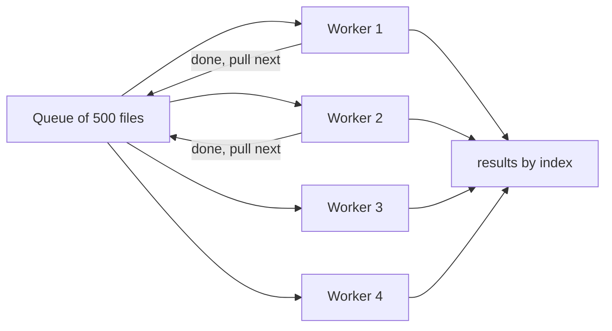
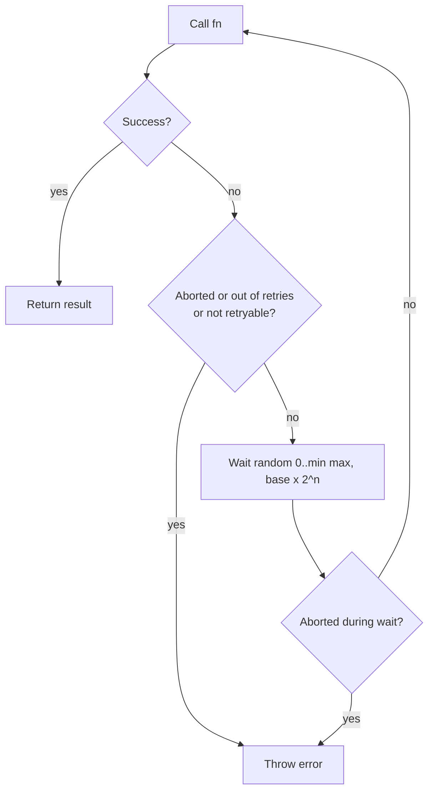
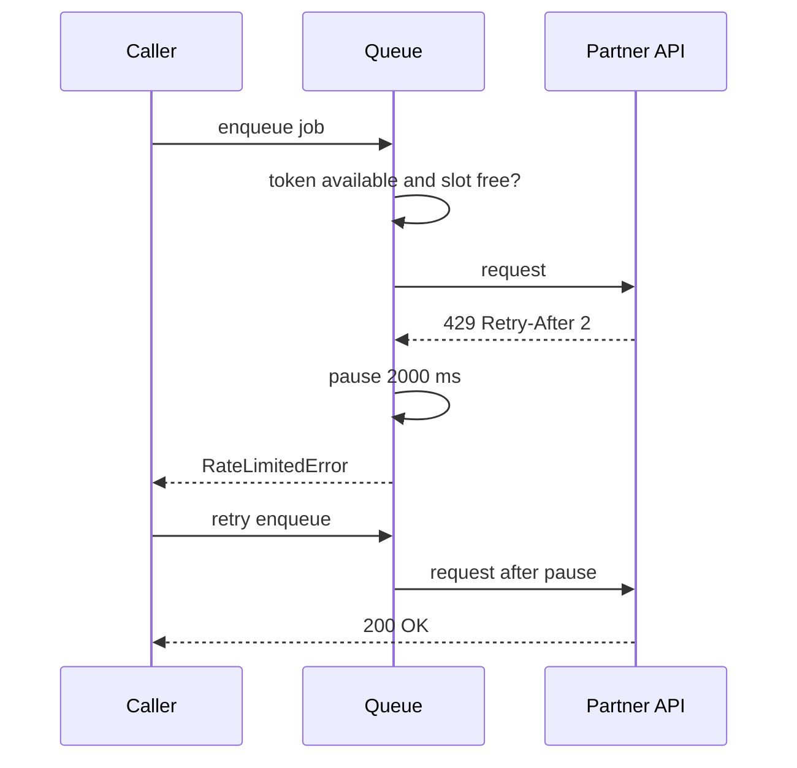
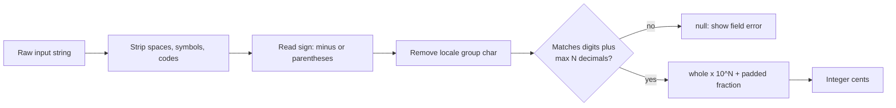
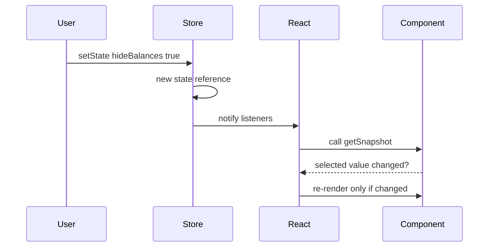
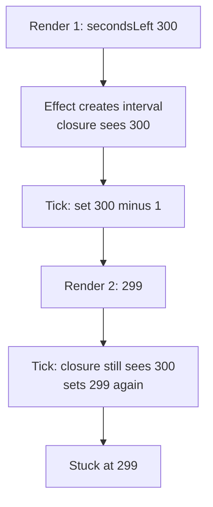
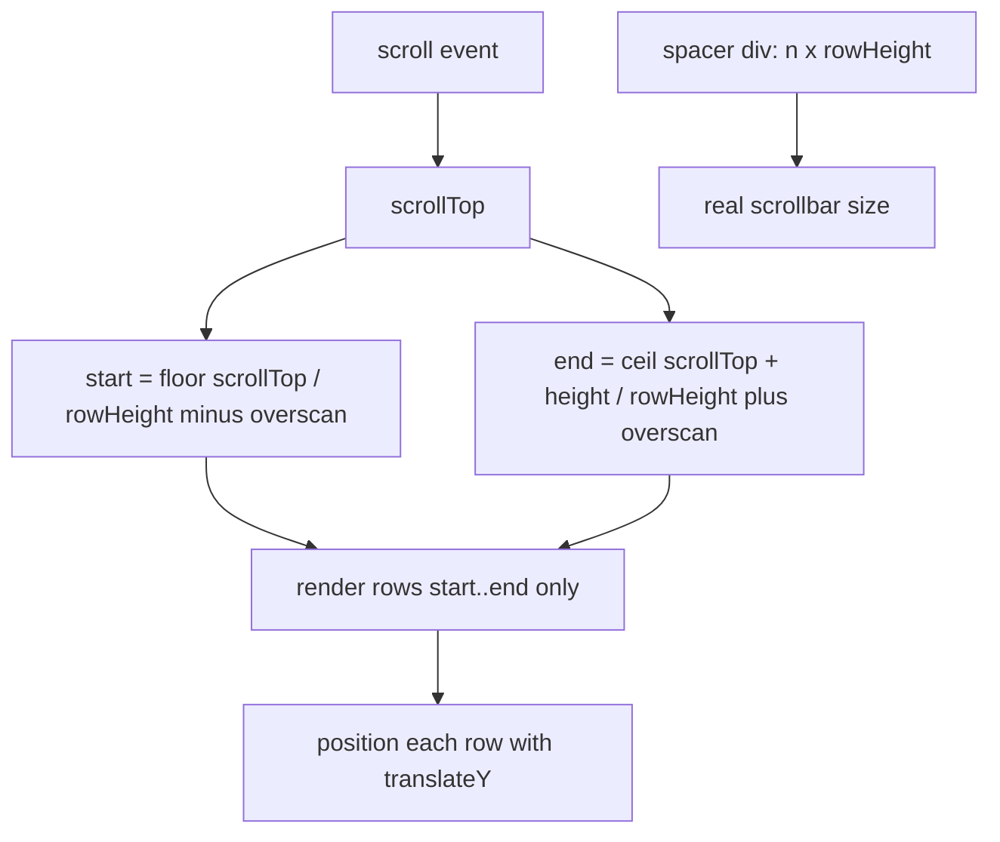
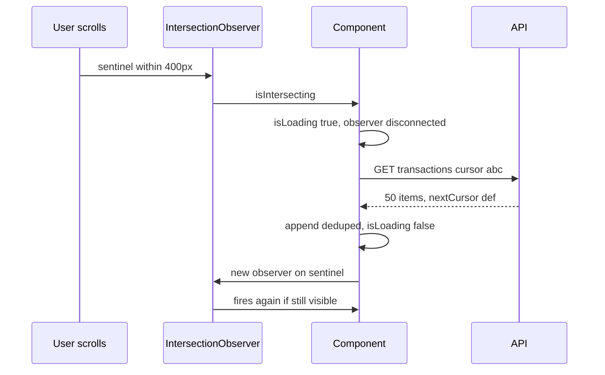

## 1. Timing and async control

#### Q: [Mid] Implement `debounce` for a transaction search box. It must support `leading`, `cancel()` and `flush()`.

**Short answer:** Debounce delays a call until calls stop for `wait` ms. I keep one timer and the latest arguments; each call resets the timer. `leading` fires on the first call of a burst, `cancel` drops the pending call, and `flush` runs it now.

**Clarify first:**
- Trailing only, leading only, or both? If both, should a single call fire twice? (Answer: no.)
- Should the debounced function return a value? (Usually the last result, since the real call is async in time.)
- Do we need `maxWait` (fire at least every N ms during a long burst)? That is lodash behaviour; I'd mention it and skip it unless asked.
- Must `this` be preserved? In class code yes; in React usually not, but it is cheap to support.

**Solution:**

```ts
type AnyFn = (...args: any[]) => any;

export interface DebounceOptions {
  leading?: boolean;
  trailing?: boolean;
}

export interface Debounced<F extends AnyFn> {
  (this: unknown, ...args: Parameters<F>): void;
  cancel(): void;
  flush(): ReturnType<F> | undefined;
  pending(): boolean;
}

export function debounce<F extends AnyFn>(
  fn: F,
  waitMs: number,
  { leading = false, trailing = true }: DebounceOptions = {},
): Debounced<F> {
  let timer: ReturnType<typeof setTimeout> | undefined;
  let lastArgs: Parameters<F> | undefined;
  let lastThis: unknown;
  let result: ReturnType<F> | undefined;

  function invoke(): ReturnType<F> | undefined {
    const args = lastArgs!;
    const ctx = lastThis;
    lastArgs = undefined; // consumed: prevents a second trailing call
    lastThis = undefined;
    result = fn.apply(ctx, args);
    return result;
  }

  function onTimeout() {
    timer = undefined;
    if (trailing && lastArgs) invoke();
  }

  const debounced = function (this: unknown, ...args: Parameters<F>) {
    const isIdle = timer === undefined;
    lastArgs = args;
    lastThis = this;
    if (timer !== undefined) clearTimeout(timer);
    timer = setTimeout(onTimeout, waitMs);
    if (leading && isIdle) invoke();
  } as Debounced<F>;

  debounced.cancel = () => {
    if (timer !== undefined) clearTimeout(timer);
    timer = undefined;
    lastArgs = undefined;
    lastThis = undefined;
  };

  debounced.flush = () => {
    if (timer === undefined) return result;
    clearTimeout(timer);
    timer = undefined;
    return lastArgs ? invoke() : result;
  };

  debounced.pending = () => timer !== undefined;

  return debounced;
}
```

Tests with fake timers:

```ts
import { debounce } from './debounce';

beforeEach(() => jest.useFakeTimers());
afterEach(() => jest.useRealTimers());

test('trailing: only the last call runs', () => {
  const spy = jest.fn();
  const d = debounce(spy, 300);
  d('a'); d('ab'); d('abc');
  jest.advanceTimersByTime(299);
  expect(spy).not.toHaveBeenCalled();
  jest.advanceTimersByTime(1);
  expect(spy).toHaveBeenCalledTimes(1);
  expect(spy).toHaveBeenCalledWith('abc');
});

test('leading + trailing: a single call fires once', () => {
  const spy = jest.fn();
  const d = debounce(spy, 300, { leading: true });
  d('x');
  jest.runAllTimers();
  expect(spy).toHaveBeenCalledTimes(1);
});

test('cancel drops, flush runs now', () => {
  const spy = jest.fn((q: string) => q.length);
  const d = debounce(spy, 300);
  d('abc');
  expect(d.flush()).toBe(3);
  d('zz');
  d.cancel();
  jest.runAllTimers();
  expect(spy).toHaveBeenCalledTimes(1);
});
```

**Edge cases:**
- `leading: true` and one call: must not fire twice. Clearing `lastArgs` inside `invoke` handles it.
- `waitMs = 0` still defers to a macrotask. That is correct.
- Unmount in React: call `cancel()` in the effect cleanup, or a stale call can update an unmounted tree or fire a request.
- Debouncing does not cancel an in-flight request. Out-of-order responses still need an `AbortController` or a request id check.

**Trade-offs:** Hand-written is fine for interviews and small apps. In production, `lodash.debounce` handles `maxWait` and edge timing. For search, debounce plus abort is better than debounce alone. For scroll or resize, throttle or `requestAnimationFrame` is usually the better tool.

**What interviewers listen for:**
- You ask "leading or trailing?" before writing code.
- You explain why `lastArgs` is cleared after use.
- You mention cleanup on unmount and that debounce does not fix response races.
- Red flag: creating a new debounced function on every render in React, which resets the timer each time and debounces nothing.

#### Q: [Mid] Now implement `throttle` for a scroll handler that updates a "sticky balance header". What is the difference from debounce?

**Short answer:** Throttle runs at most once per interval while calls keep coming. Debounce waits until calls stop. I run immediately on the first call, then schedule one trailing call with the latest arguments so the final position is never lost.

**Clarify first:**
- Leading, trailing or both? For scroll, both: react immediately and catch the final position.
- Is this visual work tied to frames? Then `requestAnimationFrame` throttling is better than a millisecond timer.

**Solution:**

```ts
export function throttle<A extends unknown[]>(fn: (...args: A) => void, intervalMs: number) {
  let last = -Infinity;
  let timer: ReturnType<typeof setTimeout> | undefined;
  let pendingArgs: A | undefined;

  const run = (args: A) => {
    last = Date.now();
    fn(...args);
  };

  const throttled = (...args: A) => {
    const remaining = intervalMs - (Date.now() - last);
    if (remaining <= 0) {
      if (timer !== undefined) {
        clearTimeout(timer);
        timer = undefined;
      }
      pendingArgs = undefined;
      run(args);
    } else {
      pendingArgs = args; // keep the latest, not the first
      timer ??= setTimeout(() => {
        timer = undefined;
        if (pendingArgs) {
          const a = pendingArgs;
          pendingArgs = undefined;
          run(a);
        }
      }, remaining);
    }
  };

  throttled.cancel = () => {
    if (timer !== undefined) clearTimeout(timer);
    timer = undefined;
    pendingArgs = undefined;
  };

  return throttled;
}

// Frame-based variant for visual updates
export function rafThrottle<A extends unknown[]>(fn: (...args: A) => void) {
  let frame: number | null = null;
  let latest: A;
  const throttled = (...args: A) => {
    latest = args;
    if (frame === null) {
      frame = requestAnimationFrame(() => {
        frame = null;
        fn(...latest);
      });
    }
  };
  throttled.cancel = () => {
    if (frame !== null) cancelAnimationFrame(frame);
    frame = null;
  };
  return throttled;
}
```

Test: call at t=0, t=10, t=20 with interval 50. Expect a call at 0 with the first args and one at 50 with the args from t=20.

**Edge cases:**
- `last = -Infinity` guarantees the first call runs, even under fake timers that start `Date.now()` at 0.
- `Date.now()` can jump if the system clock changes. `performance.now()` is monotonic; use it if that matters.
- For scroll position, a passive listener (`{ passive: true }`) matters as much as throttling.

**Trade-offs:** Timer throttle is generic. rAF throttle aligns with paint and pauses in background tabs. Often the best answer is neither: `IntersectionObserver` or CSS `position: sticky` removes the scroll handler entirely.

**What interviewers listen for:**
- A crisp one-line difference: debounce waits for quiet, throttle limits rate.
- Keeping the latest args for the trailing call.
- Suggesting a platform API (`position: sticky`, `IntersectionObserver`) instead of JavaScript when possible.

#### Q: [Senior] Implement `Promise.all`, `Promise.allSettled` and `Promise.any` from scratch. When would you use each on a portfolio dashboard?

**Short answer:** All three wrap the inputs with `Promise.resolve`, store results by index, and count completions. `all` rejects on the first failure. `allSettled` never rejects. `any` resolves on the first success and rejects with an `AggregateError` only when every input fails.

**Clarify first:**
- Must non-promise values work? (Yes: the spec accepts any iterable of values or thenables.)
- Do we need exact tuple typing (`[A, B]` in, `[A, B]` out)? The built-in lib types do this with a mapped type. I'll use a simpler array type and mention it.

**Solution:**

```ts
export function promiseAll<T>(values: Iterable<T | PromiseLike<T>>): Promise<Awaited<T>[]> {
  return new Promise((resolve, reject) => {
    const items = Array.from(values);
    const results = new Array<Awaited<T>>(items.length);
    let remaining = items.length;
    if (remaining === 0) {
      resolve(results); // empty input resolves immediately
      return;
    }
    items.forEach((item, i) => {
      Promise.resolve(item).then((v) => {
        results[i] = v as Awaited<T>; // by index, not push: order is preserved
        if (--remaining === 0) resolve(results);
      }, reject); // first rejection wins; later ones are ignored
    });
  });
}

export function promiseAllSettled<T>(
  values: Iterable<T | PromiseLike<T>>,
): Promise<PromiseSettledResult<Awaited<T>>[]> {
  return promiseAll(
    Array.from(values, (item) =>
      Promise.resolve(item).then(
        (value): PromiseSettledResult<Awaited<T>> => ({ status: 'fulfilled', value: value as Awaited<T> }),
        (reason: unknown): PromiseSettledResult<Awaited<T>> => ({ status: 'rejected', reason }),
      ),
    ),
  );
}

export function promiseAny<T>(values: Iterable<T | PromiseLike<T>>): Promise<Awaited<T>> {
  return new Promise((resolve, reject) => {
    const items = Array.from(values);
    const errors: unknown[] = new Array(items.length);
    let remaining = items.length;
    if (remaining === 0) {
      reject(new AggregateError([], 'All promises were rejected'));
      return;
    }
    items.forEach((item, i) => {
      Promise.resolve(item).then(
        (v) => resolve(v as Awaited<T>),
        (err: unknown) => {
          errors[i] = err;
          if (--remaining === 0) reject(new AggregateError(errors, 'All promises were rejected'));
        },
      );
    });
  });
}
```

Dashboard usage:

```ts
// Must-have data: one failure means the page cannot render correctly
const [accounts, positions] = await Promise.all([fetchAccounts(), fetchPositions()]);

// Independent widgets: show what loaded, render an error tile for the rest
const results = await Promise.allSettled([fetchNews(), fetchFxRates(), fetchAlerts()]);
const failed = results.filter((r) => r.status === 'rejected');

// Redundant sources: first healthy price feed wins
const quote = await Promise.any([primaryQuote(symbol), backupQuote(symbol)]);
```

**Edge cases:**
- Empty input: `all` and `allSettled` resolve `[]`; `any` rejects.
- `Promise.all` does not cancel the other promises on failure. They keep running. Pass an `AbortSignal` if you need to stop them.
- Results must be placed by index. Using `push` returns them in completion order, which is a classic bug.
- `AggregateError` needs ES2021. Check your `lib` setting.

**Trade-offs:** `all` gives the simplest code but makes one flaky widget take down the page. `allSettled` needs per-item error UI. `any` hides failures, so log the ones you ignore.

**What interviewers listen for:**
- Index-based result storage and a counter, not `results.length === n`.
- Knowing `all` is fail-fast but not cancel-fast.
- Picking the combinator by product behaviour: "Can this page render without this data?"

#### Q: [Senior] You need to upload 500 statement PDFs, but the API allows 4 concurrent requests. Write a promise pool and a reusable concurrency limiter.

**Short answer:** Start N workers. Each worker pulls the next index from a shared cursor until the list is empty. Because JavaScript is single-threaded, `cursor++` is safe. For reuse across the app, a limiter function queues tasks and starts one whenever a slot frees up.

**Clarify first:**
- Fail fast or collect all results? For uploads, collect all and report failures.
- Is order of results important? (Usually yes: index-aligned results.)
- Should failed items retry? Combine with the retry helper below.
- Is there also a requests-per-second limit? Concurrency and rate are different limits.

**Solution:**

```ts
// 1. Pool over a known list
export async function promisePool<T, R>(
  items: readonly T[],
  concurrency: number,
  worker: (item: T, index: number) => Promise<R>,
): Promise<R[]> {
  if (!Number.isInteger(concurrency) || concurrency < 1) {
    throw new RangeError('concurrency must be a positive integer');
  }
  const results = new Array<R>(items.length);
  let cursor = 0;

  async function runner() {
    while (cursor < items.length) {
      const i = cursor++; // claim an index synchronously, before any await
      results[i] = await worker(items[i], i);
    }
  }

  await Promise.all(Array.from({ length: Math.min(concurrency, items.length) }, runner));
  return results;
}

// 2. Reusable limiter, like p-limit
export function createLimiter(concurrency: number) {
  let active = 0;
  const queue: Array<() => void> = [];

  const next = () => {
    if (active >= concurrency) return;
    const job = queue.shift();
    job?.();
  };

  return function limit<R>(task: () => Promise<R>): Promise<R> {
    return new Promise<R>((resolve, reject) => {
      queue.push(() => {
        active++;
        // Promise.resolve().then(task) also catches a task that throws synchronously
        Promise.resolve()
          .then(task)
          .then(resolve, reject)
          .finally(() => {
            active--;
            next();
          });
      });
      next();
    });
  };
}
```

Collect-all usage:

```ts
const results = await promisePool(files, 4, async (file) => {
  try {
    return { ok: true as const, id: await uploadStatement(file) };
  } catch (error) {
    return { ok: false as const, file: file.name, error };
  }
});
const failures = results.filter((r) => !r.ok);
```

Test: track `active` inside the worker and assert the maximum never exceeds the limit, and that results come back in input order even when later items finish first.



**Edge cases:**
- In `promisePool`, one rejection rejects the outer promise, but other runners keep working. Wrap the worker (as above) when you want all results.
- `concurrency` greater than `items.length`: only start as many runners as items.
- Do not chunk into batches of 4 with `Promise.all` per batch. One slow file then blocks the next three slots.

**Trade-offs:** The pool is simplest for a fixed list. The limiter is better when tasks arrive over time from many places. Libraries such as `p-limit` and `p-queue` add priorities, timeouts and pause. Chunked batching is easier to read but slower.

**What interviewers listen for:**
- Claiming the index before `await`.
- Explaining why batching wastes throughput.
- Separating "concurrent requests" from "requests per second".
- Red flag: `items.map(upload)` then `Promise.all`, which starts all 500 at once.

#### Q: [Senior] Write `retry` with exponential backoff, jitter and abort support for fetching account balances. Which errors should not be retried?

**Short answer:** Loop: try the call, and on a retryable error wait `random(0, min(max, base * 2^attempt))`, then try again. Abort stops both the request and the wait. Retry network errors, 408, 429 and 5xx. Do not retry other 4xx errors, and never retry a non-idempotent POST without an idempotency key.

**Clarify first:**
- Is the operation idempotent? A GET is. A "send payment" POST is only safe with an `Idempotency-Key` the server honours.
- Total time budget? The user should not wait 30 seconds for a spinner.
- Does the server send `Retry-After`? Respect it.

**Solution:**

```ts
function sleep(ms: number, signal?: AbortSignal): Promise<void> {
  return new Promise((resolve, reject) => {
    if (signal?.aborted) {
      reject(signal.reason);
      return;
    }
    const onAbort = () => {
      clearTimeout(timer);
      reject(signal!.reason);
    };
    const timer = setTimeout(() => {
      signal?.removeEventListener('abort', onAbort);
      resolve();
    }, ms);
    signal?.addEventListener('abort', onAbort, { once: true });
  });
}

export interface RetryOptions {
  retries?: number;       // extra attempts after the first
  baseDelayMs?: number;
  maxDelayMs?: number;
  signal?: AbortSignal;
  shouldRetry?: (error: unknown, attempt: number) => boolean;
  onRetry?: (error: unknown, attempt: number, delayMs: number) => void;
}

export async function retry<T>(
  fn: (attempt: number, signal?: AbortSignal) => Promise<T>,
  {
    retries = 3,
    baseDelayMs = 300,
    maxDelayMs = 10_000,
    signal,
    shouldRetry = () => true,
    onRetry,
  }: RetryOptions = {},
): Promise<T> {
  for (let attempt = 0; ; attempt++) {
    signal?.throwIfAborted();
    try {
      return await fn(attempt, signal);
    } catch (error) {
      if (signal?.aborted || attempt >= retries || !shouldRetry(error, attempt)) throw error;
      const cap = Math.min(maxDelayMs, baseDelayMs * 2 ** attempt);
      const delayMs = Math.round(Math.random() * cap); // "full jitter"
      onRetry?.(error, attempt, delayMs);
      await sleep(delayMs, signal);
    }
  }
}
```

Usage with an HTTP-aware rule:

```ts
class HttpError extends Error {
  constructor(public status: number, public retryAfterMs?: number) {
    super(`HTTP ${status}`);
  }
}

const isRetryable = (e: unknown) =>
  e instanceof TypeError || // fetch network failure
  (e instanceof HttpError && (e.status === 408 || e.status === 429 || e.status >= 500));

const controller = new AbortController();
const balance = await retry(
  async (_attempt, signal) => {
    const res = await fetch('/api/accounts/acc_1/balance', { signal });
    if (!res.ok) throw new HttpError(res.status);
    return (await res.json()) as { availableCents: number };
  },
  { signal: controller.signal, shouldRetry: isRetryable },
);
```



Tests: a function that fails twice then succeeds resolves with 3 calls. A 400 error is thrown after 1 call. Aborting during the sleep rejects with the abort reason and makes no more calls. Mock `Math.random` to make delays deterministic.

**Edge cases:**
- `throwIfAborted` is in all modern browsers and Node 17.3+. In old environments check `signal.aborted` manually.
- Remove the abort listener when the sleep finishes, or long-lived signals collect listeners.
- Respect `Retry-After` (seconds or an HTTP date) when present, instead of your computed delay.
- Without jitter, thousands of clients retry at the same moment after an outage and knock the server over again.

**Trade-offs:** More retries improve success on flaky networks but delay the error the user needs to see. Libraries like TanStack Query already retry queries (3 times by default) and do not retry mutations by default, which is the right default for payments.

> **Finance tip:** A retried "create payment" without an idempotency key is how customers get charged twice. Generate the key once per user intent (when the form is submitted), not per attempt.

**What interviewers listen for:**
- Retryable versus non-retryable errors, and the idempotency point.
- Jitter, a cap and a total budget.
- Abort that cancels the wait, not only the request.

#### Q: [Staff] Build an API client queue for a partner API that allows 10 requests per second (burst of 2) and 3 concurrent requests, and returns 429 with `Retry-After` when exceeded.

**Short answer:** A token bucket controls rate, a counter controls concurrency, and a `pausedUntil` timestamp handles 429. One `drain` function starts jobs while there are tokens and free slots, and schedules itself for when the next token arrives. Queued jobs can be aborted before they start.

**Clarify first:**
- Is the limit per user, per API key or global? A browser queue only protects one tab. A real global limit lives on the server.
- Priorities? (A user-initiated balance refresh should jump ahead of background prefetch.)
- Should 429 responses retry automatically, and how many times?

**Solution:**

```ts
interface QueueOptions {
  ratePerSec: number;
  burst: number;
  concurrency: number;
}

interface Job<T> {
  run: () => Promise<T>;
  resolve: (value: T) => void;
  reject: (reason: unknown) => void;
}

export class RateLimitedQueue {
  private tokens: number;
  private lastRefill = Date.now();
  private active = 0;
  private pausedUntil = 0;
  private timer: ReturnType<typeof setTimeout> | undefined;
  private readonly queue: Job<any>[] = [];
  private readonly opts: QueueOptions;

  constructor(opts: QueueOptions) {
    this.opts = opts;
    this.tokens = opts.burst;
  }

  enqueue<T>(run: () => Promise<T>, signal?: AbortSignal): Promise<T> {
    return new Promise<T>((resolve, reject) => {
      if (signal?.aborted) {
        reject(signal.reason);
        return;
      }
      const job: Job<T> = { run, resolve, reject };
      signal?.addEventListener(
        'abort',
        () => {
          const i = this.queue.indexOf(job);
          if (i !== -1) {
            this.queue.splice(i, 1); // not started yet: remove and reject
            reject(signal.reason);
          }
        },
        { once: true },
      );
      this.queue.push(job);
      this.drain();
    });
  }

  pause(ms: number): void {
    this.pausedUntil = Math.max(this.pausedUntil, Date.now() + ms);
    this.schedule(ms);
  }

  get size(): number {
    return this.queue.length;
  }

  private refill(now: number): void {
    const elapsedSec = (now - this.lastRefill) / 1000;
    this.tokens = Math.min(this.opts.burst, this.tokens + elapsedSec * this.opts.ratePerSec);
    this.lastRefill = now;
  }

  private drain = (): void => {
    if (this.timer !== undefined) {
      clearTimeout(this.timer);
      this.timer = undefined;
    }
    const now = Date.now();
    if (now < this.pausedUntil) {
      this.schedule(this.pausedUntil - now);
      return;
    }
    this.refill(now);
    while (this.queue.length > 0 && this.active < this.opts.concurrency && this.tokens >= 1) {
      const job = this.queue.shift()!;
      this.tokens -= 1;
      this.active++;
      Promise.resolve()
        .then(job.run)
        .then(job.resolve, job.reject)
        .finally(() => {
          this.active--;
          this.drain();
        });
    }
    // Slots free but no tokens: wake up when the next token arrives
    if (this.queue.length > 0 && this.active < this.opts.concurrency) {
      this.schedule(((1 - this.tokens) / this.opts.ratePerSec) * 1000);
    }
  };

  private schedule(ms: number): void {
    if (this.timer !== undefined) return;
    this.timer = setTimeout(this.drain, Math.max(0, Math.ceil(ms)));
  }
}
```

The client wraps `fetch`, turns 429 into a pause, and retries:

```ts
const partnerQueue = new RateLimitedQueue({ ratePerSec: 10, burst: 2, concurrency: 3 });

class RateLimitedError extends Error {}

function parseRetryAfter(header: string | null): number {
  if (!header) return 1000;
  const seconds = Number(header);
  if (Number.isFinite(seconds)) return seconds * 1000;
  const date = Date.parse(header);
  return Number.isNaN(date) ? 1000 : Math.max(0, date - Date.now());
}

export function partnerFetch(url: string, init: RequestInit = {}): Promise<Response> {
  const signal = init.signal ?? undefined;
  return retry(
    () =>
      partnerQueue.enqueue(async () => {
        const res = await fetch(url, init);
        if (res.status === 429) {
          partnerQueue.pause(parseRetryAfter(res.headers.get('Retry-After')));
          throw new RateLimitedError('429');
        }
        return res;
      }, signal),
    { retries: 3, signal, shouldRetry: (e) => e instanceof RateLimitedError, baseDelayMs: 50 },
  );
}
```



**Edge cases:**
- Abort after a job starts does not remove it; the `fetch` itself must receive the signal (it does, via `init`).
- `drain` clears any pending timer first so you never have two wake-ups racing.
- Background tabs throttle timers. The queue still works; it just drains later.
- Multiple tabs each have their own queue. If that matters, coordinate with a `BroadcastChannel` or `navigator.locks`, or move the limit to a backend proxy.

**Trade-offs:** Client-side limiting is a courtesy that reduces 429s. It is not enforcement. A backend-for-frontend that owns the partner key is safer (the key never ships to the browser) and can limit globally. `p-queue` provides `intervalCap` and `interval` options for a similar result without custom code.

**What interviewers listen for:**
- Naming the token bucket and separating rate from concurrency.
- Treating 429 as a signal to slow everyone down, not just retry one request.
- Pointing out that the partner API key should not be in the browser at all.
- Red flag: `setInterval` firing a request every 100 ms regardless of queue state.

## 2. Data utilities

#### Q: [Senior] Write `memoize` with a custom cache key, then back it with an LRU cache of 500 entries. Use it for an FX conversion function.

**Short answer:** Memoize stores results by a key derived from the arguments. An unbounded cache is a memory leak, so I bound it with an LRU. A JavaScript `Map` keeps insertion order, so "touch" is delete plus set, and the oldest key is `map.keys().next().value`. All operations are O(1).

**Clarify first:**
- Are arguments primitives or objects? `JSON.stringify` breaks on cycles, ignores key order differences only by luck, and is slow for big objects.
- Can results go stale (FX rates change)? Then we need a TTL, not only a size bound.
- Is the function async? Then cache the promise and evict it if it rejects.

**Solution:**

```ts
export class LRUCache<K, V> {
  private readonly map = new Map<K, V>();
  private readonly max: number;

  constructor(max: number) {
    if (!Number.isInteger(max) || max < 1) throw new RangeError('max must be >= 1');
    this.max = max;
  }

  get(key: K): V | undefined {
    if (!this.map.has(key)) return undefined;
    const value = this.map.get(key) as V;
    this.map.delete(key); // move to most-recent position
    this.map.set(key, value);
    return value;
  }

  has(key: K): boolean {
    return this.map.has(key);
  }

  set(key: K, value: V): this {
    this.map.delete(key);
    this.map.set(key, value);
    if (this.map.size > this.max) {
      const oldest = this.map.keys().next().value as K;
      this.map.delete(oldest);
    }
    return this;
  }

  delete(key: K): boolean {
    return this.map.delete(key);
  }

  clear(): void {
    this.map.clear();
  }

  get size(): number {
    return this.map.size;
  }
}

export function memoize<A extends unknown[], R>(
  fn: (...args: A) => R,
  { key = (...args: A) => JSON.stringify(args), max = 500 }: { key?: (...args: A) => string; max?: number } = {},
) {
  const cache = new LRUCache<string, R>(max);
  const memoized = (...args: A): R => {
    const k = key(...args);
    if (cache.has(k)) return cache.get(k) as R; // has() first: undefined can be a valid result
    const value = fn(...args);
    cache.set(k, value);
    if (value instanceof Promise) {
      value.catch(() => cache.delete(k)); // never cache a failure
    }
    return value;
  };
  memoized.clear = () => cache.clear();
  return memoized;
}
```

Usage:

```ts
const convert = memoize(
  (amountCents: number, from: string, to: string, rate: number) => Math.round(amountCents * rate),
  { key: (amount, from, to, rate) => `${amount}|${from}|${to}|${rate}` },
);
```

Tests: call twice with the same args and assert the inner function ran once. Fill 3 entries in an LRU of size 2, `get` the first, add a third, and assert the second was evicted.

**Edge cases:**
- `undefined` as a valid cached value: check `has`, not truthiness of `get`.
- Object arguments by identity: use a `WeakMap` keyed on the object so entries die with the object.
- Including the rate in the key means a new rate never returns a stale result.
- `JSON.stringify({a:1,b:2})` and `{b:2,a:1}` produce different keys. That is a cache miss, not a bug, but it hurts hit rate.

**Trade-offs:** A custom key is fast and explicit but is a place for bugs (forgetting an argument returns wrong results). LRU adds bookkeeping but bounds memory. TTL handles staleness. In React, `useMemo` caches one value per component and is usually what you want instead.

**What interviewers listen for:**
- Knowing `Map` preserves insertion order and using it for O(1) LRU.
- Raising memory growth and staleness unprompted.
- Evicting rejected promises.
- Red flag: memoizing impure functions (anything reading `Date.now()` or global state).

#### Q: [Senior] Implement `deepClone` that handles cycles, `Date`, `Map` and `Set`, and `deepEqual` for comparing a draft form state with the saved one.

**Short answer:** Both recurse through the structure and use a `WeakMap` of already-visited objects to survive cycles. Clone registers the new copy before recursing so a self-reference points to the copy. Equal compares primitives with `===` plus a NaN check, then same prototype, then type-specific rules, then own keys. In real code, `structuredClone` does the clone.

**Clarify first:**
- Which types matter? Class instances, functions, symbols, getters?
- Should `deepEqual` treat `{a: undefined}` and `{}` as equal? (Lodash says no. Many form libraries want yes.)
- Is `0` equal to `-0`? I treat them as equal, like lodash `isEqual`.

**Solution:**

```ts
export function deepClone<T>(value: T, seen = new WeakMap<object, unknown>()): T {
  if (value === null || typeof value !== 'object') return value; // primitives and functions
  if (seen.has(value)) return seen.get(value) as T;               // cycle: return the copy

  if (value instanceof Date) return new Date(value.getTime()) as T;
  if (value instanceof RegExp) return new RegExp(value.source, value.flags) as T;

  if (value instanceof Map) {
    const out = new Map();
    seen.set(value, out);
    value.forEach((v, k) => out.set(deepClone(k, seen), deepClone(v, seen)));
    return out as T;
  }
  if (value instanceof Set) {
    const out = new Set();
    seen.set(value, out);
    value.forEach((v) => out.add(deepClone(v, seen)));
    return out as T;
  }
  if (Array.isArray(value)) {
    const out: unknown[] = [];
    seen.set(value, out);
    value.forEach((v, i) => {
      out[i] = deepClone(v, seen);
    });
    return out as T;
  }

  const out = Object.create(Object.getPrototypeOf(value)) as Record<PropertyKey, unknown>;
  seen.set(value, out); // register BEFORE recursing
  for (const key of Reflect.ownKeys(value)) { // includes symbol keys
    if (!Object.prototype.propertyIsEnumerable.call(value, key)) continue;
    out[key] = deepClone((value as Record<PropertyKey, unknown>)[key], seen);
  }
  return out as T;
}

export function deepEqual(a: unknown, b: unknown, seen = new WeakMap<object, object>()): boolean {
  if (a === b || (a !== a && b !== b)) return true; // NaN equals NaN; 0 equals -0
  if (typeof a !== 'object' || typeof b !== 'object' || a === null || b === null) return false;
  if (Object.getPrototypeOf(a) !== Object.getPrototypeOf(b)) return false;
  if (seen.get(a) === b) return true; // already comparing this pair: assume equal
  seen.set(a, b);

  if (a instanceof Date) return a.getTime() === (b as Date).getTime();
  if (a instanceof RegExp) return a.source === (b as RegExp).source && a.flags === (b as RegExp).flags;

  if (a instanceof Map) {
    const bm = b as Map<unknown, unknown>;
    if (a.size !== bm.size) return false;
    for (const [k, v] of a) if (!bm.has(k) || !deepEqual(v, bm.get(k), seen)) return false;
    return true;
  }
  if (a instanceof Set) {
    const bs = b as Set<unknown>;
    if (a.size !== bs.size) return false;
    for (const v of a) if (!bs.has(v)) return false; // members compared by identity
    return true;
  }
  if (Array.isArray(a)) {
    const bb = b as unknown[];
    if (a.length !== bb.length) return false;
    for (let i = 0; i < a.length; i++) if (!deepEqual(a[i], bb[i], seen)) return false;
    return true;
  }

  const ka = Object.keys(a);
  const kb = Object.keys(b);
  if (ka.length !== kb.length) return false;
  for (const k of ka) {
    if (!Object.hasOwn(b, k)) return false;
    if (!deepEqual((a as Record<string, unknown>)[k], (b as Record<string, unknown>)[k], seen)) return false;
  }
  return true;
}
```

Tests:

```ts
test('clone keeps cycles and types', () => {
  const draft: any = { payee: { name: 'Rent' }, when: new Date(0), tags: new Set(['home']) };
  draft.self = draft;
  const copy = deepClone(draft);
  expect(copy).not.toBe(draft);
  expect(copy.self).toBe(copy);
  expect(copy.when).toBeInstanceOf(Date);
  expect(copy.payee).not.toBe(draft.payee);
  expect(deepEqual(copy, draft)).toBe(true);
});

test('equal edge cases', () => {
  expect(deepEqual(NaN, NaN)).toBe(true);
  expect(deepEqual({ a: undefined }, { b: undefined })).toBe(false);
  expect(deepEqual([1], { 0: 1, length: 1 })).toBe(false); // different prototypes
});
```

**Edge cases:**
- Sets of objects: `has` compares by identity, so two sets of equal-looking objects are "not equal" here. A full solution is O(n squared) matching; mention it, do not write it unless asked.
- Typed arrays, `ArrayBuffer`, `Error`, DOM nodes, class instances with private fields (`#x`) are not handled. Private fields cannot be copied from outside.
- Recursion depth: a 100k-deep linked list overflows the stack. An explicit stack fixes it.

**Trade-offs:** `structuredClone` (all modern browsers, Node 17+) handles cycles, Date, Map, Set, typed arrays and more, but throws on functions and DOM nodes and drops prototypes. For form dirty-checking, comparing normalized values (for example amounts as cents, dates as ISO strings) is cheaper and more correct than a generic deep equal. Immutable updates often remove the need to clone at all.

**What interviewers listen for:**
- The `WeakMap` for cycles, and registering before recursing.
- Mentioning `structuredClone` and its limits.
- Stating the policy decisions (`undefined` keys, `-0`, Set members) instead of pretending there is one true answer.

#### Q: [Mid] Implement a typed event emitter with `on`, `once`, `off` and `emit`. A payment widget and a session-timeout banner will use it.

**Short answer:** A `Map` from event name to a `Set` of listeners. `on` returns an unsubscribe function. `emit` iterates over a copy so listeners can unsubscribe during emit. A generic event map type makes payloads type-safe.

**Clarify first:**
- Synchronous or async delivery? (Synchronous is standard.)
- What happens if a listener throws? Should others still run?
- Wildcard events? Usually not needed.

**Solution:**

```ts
type Listener<P> = (payload: P) => void;

export class Emitter<Events extends Record<string, unknown>> {
  private listeners = new Map<keyof Events, Set<Listener<any>>>();

  on<K extends keyof Events>(event: K, fn: Listener<Events[K]>): () => void {
    let set = this.listeners.get(event);
    if (!set) {
      set = new Set();
      this.listeners.set(event, set);
    }
    set.add(fn);
    return () => this.off(event, fn);
  }

  once<K extends keyof Events>(event: K, fn: Listener<Events[K]>): () => void {
    const off = this.on(event, (payload) => {
      off();
      fn(payload);
    });
    return off;
  }

  off<K extends keyof Events>(event: K, fn: Listener<Events[K]>): void {
    const set = this.listeners.get(event);
    if (!set) return;
    set.delete(fn);
    if (set.size === 0) this.listeners.delete(event);
  }

  emit<K extends keyof Events>(event: K, payload: Events[K]): void {
    const set = this.listeners.get(event);
    if (!set) return;
    for (const fn of [...set]) { // copy: safe if a listener unsubscribes
      try {
        fn(payload);
      } catch (err) {
        queueMicrotask(() => { throw err; }); // report without stopping other listeners
      }
    }
  }
}

type AppEvents = {
  'payment:submitted': { paymentId: string; amountCents: number };
  'session:expired': undefined;
};

export const bus = new Emitter<AppEvents>();

// In React
useEffect(() => bus.on('session:expired', () => setShowBanner(true)), []);
```

> **Gotcha:** Declare the event map with `type`, not `interface`. An interface has no implicit index signature, so it does not satisfy `Record<string, unknown>` and you get a confusing error.

Tests: `once` fires once. Unsubscribing inside a listener does not skip the next listener. A throwing listener does not stop others.

**Edge cases:**
- `off(event, originalFn)` will not remove a `once` listener, because the stored function is the wrapper. Use the returned unsubscribe.
- A `Set` ignores adding the same function twice. Node's `EventEmitter` allows duplicates. Say which you chose.
- Leaks: every `on` in a component needs cleanup. Returning the unsubscribe from `useEffect` does that in one line.

**Trade-offs:** An app-wide bus is easy but hides data flow; nobody can tell who listens. Prefer props, context or a store for state. Use a bus for fire-and-forget signals (session expired, toast). The browser's `EventTarget` with `CustomEvent` is a built-in alternative with weaker typing.

**What interviewers listen for:**
- Unsubscribe returned from `on`, and iteration over a copy.
- Type-safe payload per event.
- Knowing when an event bus is the wrong tool.

#### Q: [Mid] Write `flatten` for nested arrays, `flattenObject` to dot-path keys, `get(obj, path)` with a default, and `groupBy` for transactions by category.

**Short answer:** These are small recursive or loop utilities. The interviewer checks for depth control, null-safety on paths, and not mutating input. For `groupBy`, use a null-prototype object or a `Map` so a key like `"__proto__"` cannot break it. Modern runtimes ship `Array.prototype.flat` and `Object.groupBy`.

**Clarify first:**
- Flatten depth: one level or infinite?
- Path syntax: dots only, or also `items[0].amount`?
- Should `get` return the default for `null` values, or only `undefined`? (Lodash: only `undefined`.)

**Solution:**

```ts
export function flatten<T>(input: readonly unknown[], depth = Infinity): T[] {
  const out: T[] = [];
  const walk = (arr: readonly unknown[], d: number) => {
    for (const item of arr) {
      if (Array.isArray(item) && d > 0) walk(item, d - 1);
      else out.push(item as T);
    }
  };
  walk(input, depth);
  return out;
}
// flatten([1, [2, [3, [4]]]], 1) -> [1, 2, [3, [4]]]

export function flattenObject(
  obj: Record<string, unknown>,
  prefix = '',
  out: Record<string, unknown> = {},
): Record<string, unknown> {
  for (const [key, value] of Object.entries(obj)) {
    const path = prefix ? `${prefix}.${key}` : key;
    const isPlainNested =
      value !== null && typeof value === 'object' && !(value instanceof Date) && Object.keys(value).length > 0;
    if (isPlainNested) flattenObject(value as Record<string, unknown>, path, out);
    else out[path] = value;
  }
  return out;
}
// flattenObject({ payee: { name: 'Rent', iban: 'X' }, tags: ['a'] })
// -> { 'payee.name': 'Rent', 'payee.iban': 'X', 'tags.0': 'a' }

export function get<T = unknown>(obj: unknown, path: string | readonly PropertyKey[], fallback?: T): T | undefined {
  const keys =
    typeof path === 'string'
      ? path.replace(/\[(\w+)\]/g, '.$1').split('.').filter(Boolean) // a.b[0].c -> a.b.0.c
      : path;
  let cur: unknown = obj;
  for (const key of keys) {
    if (cur === null || cur === undefined) return fallback;
    cur = (cur as Record<PropertyKey, unknown>)[key];
  }
  return cur === undefined ? fallback : (cur as T);
}
// get(order, 'lines[0].amountCents', 0)

export function groupBy<T, K extends PropertyKey>(
  items: Iterable<T>,
  keyFn: (item: T, index: number) => K,
): Partial<Record<K, T[]>> {
  const out = Object.create(null) as Partial<Record<K, T[]>>; // no prototype keys to collide with
  let i = 0;
  for (const item of items) {
    const key = keyFn(item, i++);
    (out[key] ??= []).push(item);
  }
  return out;
}

// Built-ins (ES2024, available in current browsers and Node 21+):
// Object.groupBy(txns, (t) => t.category)  -> null-prototype object
// Map.groupBy(txns, (t) => t.accountId)     -> Map, keys can be any value
```

Tests: `get({ a: 0 }, 'a', 9)` returns `0` (not the fallback). `get({ a: null }, 'a.b', 'x')` returns `'x'`. `groupBy` with a `'__proto__'` key returns a real group. `flatten` with depth 0 returns a shallow copy.

**Edge cases:**
- `get` must use `=== undefined` for the fallback check, or `0`, `''` and `false` become the default. This is the most common bug.
- `flattenObject` with empty objects or arrays: keep them as values, or they disappear.
- Very deep arrays overflow the stack with recursion; use an explicit stack if input is untrusted.
- With a plain `{}`, `out['__proto__'] ??= []` reads `Object.prototype`, which is not nullish, and then `.push` throws.

**Trade-offs:** Typed path strings (template literal types that check `'lines.0.amountCents'` at compile time) are possible but slow the compiler and are rarely worth it outside form libraries. `Map.groupBy` is better when keys are not strings or when order of insertion matters for display.

**What interviewers listen for:**
- The `0` versus `undefined` trap in `get`.
- Prototype pollution awareness in `groupBy`.
- Knowing the built-ins and saying when you'd use them.

#### Q: [Mid] Implement `curry`, `compose` and `pipe`, with types. Show a realistic use in a fee calculation.

**Short answer:** `curry` collects arguments until it has `fn.length` of them, then calls `fn`. `pipe` runs functions left to right, passing each result to the next; `compose` is the same right to left. Types use a recursive conditional type for `curry` and overloads for `pipe`.

**Clarify first:**
- Must curry accept several arguments at once (`f(a, b)(c)`) or exactly one per call?
- Async steps in the pipe?

**Solution:**

```ts
// Types model one-argument-at-a-time; the runtime also accepts several at once.
type Curry<A extends unknown[], R> = A extends [infer H, ...infer T]
  ? (arg: H) => T extends [] ? R : Curry<T, R>
  : R;

export function curry<A extends unknown[], R>(fn: (...args: A) => R): Curry<A, R> {
  const arity = fn.length;
  function curried(...args: unknown[]): unknown {
    if (args.length >= arity) return fn(...(args as A));
    return (...more: unknown[]) => curried(...args, ...more);
  }
  return curried as Curry<A, R>;
}

export function pipe<A extends unknown[], B>(ab: (...a: A) => B): (...a: A) => B;
export function pipe<A extends unknown[], B, C>(ab: (...a: A) => B, bc: (b: B) => C): (...a: A) => C;
export function pipe<A extends unknown[], B, C, D>(
  ab: (...a: A) => B, bc: (b: B) => C, cd: (c: C) => D,
): (...a: A) => D;
export function pipe<A extends unknown[], B, C, D, E>(
  ab: (...a: A) => B, bc: (b: B) => C, cd: (c: C) => D, de: (d: D) => E,
): (...a: A) => E;
export function pipe(first: (...args: unknown[]) => unknown, ...rest: Array<(x: unknown) => unknown>) {
  return (...args: unknown[]) => rest.reduce((acc, fn) => fn(acc), first(...args));
}

export const compose =
  <T>(...fns: Array<(x: T) => T>) =>
  (x: T): T =>
    fns.reduceRight((acc, fn) => fn(acc), x);

// Fee: rate in basis points with a minimum charge
const fee = curry((rateBps: number, minCents: number, amountCents: number) =>
  Math.max(minCents, Math.round((amountCents * rateBps) / 10_000)),
);
const cardFee = fee(250)(50); // 2.5 percent, min 50 cents
cardFee(10_000); // 250
cardFee(100);    // 50

const totalWithFee = pipe(
  (amountCents: number) => ({ amountCents, feeCents: cardFee(amountCents) }),
  (x) => ({ ...x, totalCents: x.amountCents + x.feeCents }),
);
```

**Edge cases:**
- `fn.length` ignores parameters with defaults and rest parameters. `curry((a, b = 1) => ...)` has arity 1. Accept an explicit arity parameter if needed.
- Calling a curried function with extra arguments passes them through to `fn`; the type will not allow it.
- `pipe` with async steps needs an async version: `rest.reduce(async (acc, fn) => fn(await acc), first(...args))`.

**Trade-offs:** Curry and pipe make small, testable steps, but heavy point-free code is hard for a team to read and debug (stack traces show anonymous functions). Use them where they clarify, such as a pricing pipeline, and plain functions elsewhere.

**What interviewers listen for:**
- Knowing the `fn.length` caveat.
- Honest typing limits (overloads cap at N functions; the cast is deliberate).
- Readability judgment, not functional-programming showing off.

#### Q: [Senior] Write `formatCents` for display and `parseMoneyToCents` for a payment amount input. It must handle `$1,234.56`, `1.234,56 €`, negatives, and reject `12.345`.

**Short answer:** Store money as integer minor units (cents). Format with `Intl.NumberFormat` and the currency's own number of fraction digits. Parse with string logic only, never `parseFloat` then multiply, because `0.1 + 0.2` problems and `19.99 * 100 = 1998.9999999999998` cause off-by-one-cent bugs. Detect the locale's group and decimal characters with `formatToParts`.

**Clarify first:**
- Which locales and currencies? JPY has 0 decimals, BHD and KWD have 3.
- Are negatives allowed in this field? (A refund, yes. A transfer amount, no.)
- What is the max amount, and does it exceed `Number.MAX_SAFE_INTEGER` cents? (Around 90 trillion dollars, so rarely, but `bigint` exists if needed.)
- Should we parse on every keystroke, or on blur and submit? (Keep the raw string while typing, parse on blur and submit.)

**Solution:**

```ts
const formatterCache = new Map<string, Intl.NumberFormat>();

function currencyFormatter(currency: string, locale: string, accounting: boolean) {
  const key = `${locale}|${currency}|${accounting}`;
  let fmt = formatterCache.get(key);
  if (!fmt) {
    fmt = new Intl.NumberFormat(locale, {
      style: 'currency',
      currency,
      currencySign: accounting ? 'accounting' : 'standard', // accounting: ($12.50)
    });
    formatterCache.set(key, fmt);
  }
  return fmt;
}

export function formatCents(
  amountMinor: number,
  currency = 'USD',
  locale = 'en-US',
  { accounting = false } = {},
): string {
  const fmt = currencyFormatter(currency, locale, accounting);
  const digits = fmt.resolvedOptions().maximumFractionDigits ?? 2;
  return fmt.format(amountMinor / 10 ** digits);
}
// formatCents(123456)                    -> "$1,234.56"
// formatCents(123456, 'EUR', 'de-DE')    -> "1.234,56 €"
// formatCents(1234, 'JPY', 'ja-JP')      -> "￥1,234"
// formatCents(-1250, 'USD', 'en-US', { accounting: true }) -> "($12.50)"

const escapeRegExp = (s: string) => s.replace(/[.*+?^${}()|[\]\\]/g, '\\$&');

export function parseMoneyToCents(input: string, locale = 'en-US', fractionDigits = 2): number | null {
  const parts = new Intl.NumberFormat(locale).formatToParts(12345.6);
  const group = parts.find((p) => p.type === 'group')?.value ?? ',';
  const decimal = parts.find((p) => p.type === 'decimal')?.value ?? '.';

  let s = input.replace(/\s/g, ''); // also removes NBSP and narrow NBSP used by fr-FR
  let negative = false;

  if (s.startsWith('(') && s.endsWith(')')) { // accounting negative
    negative = true;
    s = s.slice(1, -1);
  }
  s = s.replace(/\p{Sc}/gu, '').replace(/^[A-Z]{3}|[A-Z]{3}$/g, ''); // $, €, or "USD"

  const minus = s.match(/[-−]/g) ?? [];
  if (minus.length > 1) return null;
  if (minus.length === 1) {
    if (!/^[-−]/.test(s)) return null; // "12-3" is not a number
    negative = !negative;
    s = s.slice(1);
  }

  if (!/\s/.test(group)) s = s.split(group).join('');
  if (group === '’') s = s.split("'").join(''); // de-CH: users type a plain apostrophe

  const re = new RegExp(`^(\\d*)(?:${escapeRegExp(decimal)}(\\d{0,${fractionDigits}}))?$`);
  const m = re.exec(s);
  if (!m || (!m[1] && !m[2])) return null;

  const frac = (m[2] ?? '').padEnd(fractionDigits, '0');
  const cents = Number(m[1] || '0') * 10 ** fractionDigits + Number(frac || '0');
  if (!Number.isSafeInteger(cents)) return null;
  return negative && cents !== 0 ? -cents : cents; // avoid -0
}
```

Table test:

```ts
test.each([
  ['$1,234.56', 'en-US', 123456],
  ['1234.5', 'en-US', 123450],
  ['.5', 'en-US', 50],
  ['-$12.50', 'en-US', -1250],
  ['($12.50)', 'en-US', -1250],
  ['1.234,56 €', 'de-DE', 123456],
  ['1 234,56', 'fr-FR', 123456],
  ["1'234.50", 'de-CH', 123450],
  ['12.345', 'en-US', null], // too many decimals: reject, never round silently
  ['1e5', 'en-US', null],
  ['12-3', 'en-US', null],
  ['', 'en-US', null],
  ['-0', 'en-US', 0],
])('parse %s (%s)', (input, locale, expected) => {
  expect(parseMoneyToCents(input, locale)).toBe(expected);
});
```



**Edge cases:**
- Ambiguity: `1,234` is 1234 in en-US and 1.234 in de-DE. Parsing must use the user's locale, and the UI should show the formatted result back on blur so the user can confirm.
- Group characters vary by locale and possibly by ICU version, which is why we read them from `formatToParts` instead of hardcoding.
- `formatCents` divides by a power of ten for display only. Never do arithmetic on that float.
- Currency digits differ from locale defaults in rare cases; for payments, the backend's currency table is the source of truth.

**Trade-offs:** Parsing on blur gives a forgiving typing experience; masking on each keystroke (as some currency input libraries do) fights the cursor and breaks paste. `bigint` cents remove the safe-integer limit, but JSON and most APIs send numbers or strings, so you convert at the boundary. A decimal library (for example `decimal.js` or `dinero.js`) is better when you multiply by rates, split bills or apply interest with explicit rounding rules.

> **Finance tip:** Rejecting `12.345` is safer than rounding it. Silent rounding changes what the user meant to send.

**What interviewers listen for:**
- Integer minor units and no float multiplication.
- Locale-aware separators and currency-specific decimals (JPY 0).
- A test table with real formats, and rejection over silent rounding.

#### Q: [Senior] Diff two arrays of transactions (yesterday's snapshot and today's) into added, removed and changed, and explain how you would reconcile bank rows that have no shared id.

**Short answer:** With ids, index the old list in a `Map`, walk the new list once, and compare chosen fields. That is O(n + m) instead of O(n times m). Without ids, build a composite key (date, amount, normalized description) and match with counts, because two identical coffees on the same day are both real.

**Clarify first:**
- Is `id` stable and unique? Duplicates in input should be an error, not silently merged.
- Which fields count as a change? `status` and `amountCents` yes; `updatedAt` usually no.
- How big are the lists? (Size decides if this runs in a Web Worker.)

**Solution:**

```ts
export interface Txn {
  id: string;
  postedOn: string; // ISO date
  amountCents: number;
  status: 'pending' | 'posted' | 'reversed';
  description: string;
}

export interface Diff<T> {
  added: T[];
  removed: T[];
  changed: Array<{ before: T; after: T; fields: Array<keyof T> }>;
  unchangedCount: number;
}

export function diffById<T extends { id: string }>(
  prev: readonly T[],
  next: readonly T[],
  fields: ReadonlyArray<keyof T>,
): Diff<T> {
  const prevById = new Map<string, T>();
  for (const t of prev) {
    if (prevById.has(t.id)) throw new Error(`Duplicate id in prev: ${t.id}`);
    prevById.set(t.id, t);
  }

  const added: T[] = [];
  const changed: Diff<T>['changed'] = [];
  const seen = new Set<string>();
  let unchangedCount = 0;

  for (const after of next) {
    if (seen.has(after.id)) throw new Error(`Duplicate id in next: ${after.id}`);
    seen.add(after.id);
    const before = prevById.get(after.id);
    if (!before) {
      added.push(after);
      continue;
    }
    const diffFields = fields.filter((f) => !Object.is(before[f], after[f]));
    if (diffFields.length > 0) changed.push({ before, after, fields: diffFields });
    else unchangedCount++;
  }

  const removed = prev.filter((t) => !seen.has(t.id));
  return { added, removed, changed, unchangedCount };
}

// No shared ids: match bank rows to ledger rows by a composite key, with counts
type BankRow = Omit<Txn, 'id' | 'status'>;

const normalize = (s: string) => s.toUpperCase().replace(/[^A-Z0-9]/g, '');
const keyOf = (r: BankRow) => `${r.postedOn}|${r.amountCents}|${normalize(r.description)}`;

export function reconcile(bank: readonly BankRow[], ledger: readonly BankRow[]) {
  const pool = new Map<string, BankRow[]>();
  for (const row of ledger) {
    const k = keyOf(row);
    const list = pool.get(k);
    if (list) list.push(row);
    else pool.set(k, [row]);
  }
  const matched: Array<[BankRow, BankRow]> = [];
  const unmatchedBank: BankRow[] = [];
  for (const row of bank) {
    const candidate = pool.get(keyOf(row))?.pop(); // consume one match per row
    if (candidate) matched.push([row, candidate]);
    else unmatchedBank.push(row);
  }
  const unmatchedLedger = [...pool.values()].flat();
  return { matched, unmatchedBank, unmatchedLedger };
}
```

Tests: an item only in `next` is added; only in `prev` is removed; a status change from `pending` to `posted` reports `fields: ['status']`. For reconcile, two identical rows on each side produce two matches, and three bank rows against two ledger rows leave one unmatched.

**Edge cases:**
- A pending card transaction often gets a new id when it posts. Treat "removed pending plus added posted with same amount and merchant" as a likely update, and show it that way in the UI.
- Comparing objects by field with `Object.is` is shallow. Nested fields need `deepEqual`.
- Amounts with different signs per source (bank sends debits as positive): normalize before keying.
- Date mismatches of a day (bank posts T+1) need a fuzzy second pass, which belongs on the backend.

**Trade-offs:** The `Map` approach costs O(n) memory and is the right default. Sorting both lists and walking with two pointers uses less memory but costs O(n log n) and mutates order. For 100k+ rows, run it in a Web Worker so the UI stays responsive. Real reconciliation (fuzzy matches, manual review) is a backend job; the frontend shows the result.

**What interviewers listen for:**
- O(n + m) with a hash map, stated without prompting.
- Explicit handling of duplicates.
- Domain knowledge: pending-to-posted id changes, sign conventions, T+1 posting.

## 3. React hooks and state

#### Q: [Staff] Build a tiny global store (like a mini Zustand) for "hide balances" and "display currency" that React components subscribe to with selectors. Use `useSyncExternalStore`.

**Short answer:** The store is a closure with `getState`, `setState` and `subscribe`. React's `useSyncExternalStore(subscribe, getSnapshot)` re-renders a component when the snapshot it reads changes, and it is safe with concurrent rendering (no tearing). The main trap: `getSnapshot` must return a cached value, or a selector that builds a new object causes an infinite render loop.

**Clarify first:**
- Is this client UI state only? Server data belongs in a query cache, not here.
- Server rendering? Then `getServerSnapshot` is required.
- Persist to storage? That is a separate middleware concern.

**Solution:**

```ts
import { useRef, useSyncExternalStore } from 'react';

export interface Store<S> {
  getState: () => S;
  setState: (update: Partial<S> | ((prev: S) => Partial<S>)) => void;
  subscribe: (listener: () => void) => () => void;
}

export function createStore<S extends object>(initial: S): Store<S> {
  let state = initial;
  const listeners = new Set<() => void>();
  return {
    getState: () => state,
    setState(update) {
      const patch = typeof update === 'function' ? update(state) : update;
      const next = { ...state, ...patch };
      if (Object.keys(patch).every((k) => Object.is(state[k as keyof S], next[k as keyof S]))) return;
      state = next; // new reference: snapshot comparisons see the change
      listeners.forEach((l) => l());
    },
    subscribe(listener) {
      listeners.add(listener);
      return () => {
        listeners.delete(listener);
      };
    },
  };
}

export function useStore<S, T>(
  store: Store<S>,
  selector: (state: S) => T,
  isEqual: (a: T, b: T) => boolean = Object.is,
): T {
  const cache = useRef<{ state: S; selector: (s: S) => T; value: T } | null>(null);

  const getSnapshot = (): T => {
    const state = store.getState();
    const c = cache.current;
    if (c && c.state === state && c.selector === selector) return c.value;
    const value = selector(state);
    if (c && isEqual(c.value, value)) {
      cache.current = { state, selector, value: c.value }; // keep the old reference
      return c.value;
    }
    cache.current = { state, selector, value };
    return value;
  };

  return useSyncExternalStore(store.subscribe, getSnapshot, getSnapshot);
}

// Usage
type Prefs = { hideBalances: boolean; displayCurrency: 'USD' | 'EUR' | 'GBP' };
export const prefsStore = createStore<Prefs>({ hideBalances: false, displayCurrency: 'USD' });

function BalanceToggle() {
  const hidden = useStore(prefsStore, (s) => s.hideBalances);
  return (
    <button type="button" aria-pressed={hidden}
      onClick={() => prefsStore.setState((s) => ({ hideBalances: !s.hideBalances }))}>
      {hidden ? 'Show balances' : 'Hide balances'}
    </button>
  );
}
```



Tests: render two components selecting different slices; update one slice and assert only that component re-rendered (count renders with a ref or a spy). Assert a selector returning `{ a, b }` with a shallow `isEqual` does not loop.

**Edge cases:**
- `useStore(store, (s) => ({ a: s.a, b: s.b }))` with the default `Object.is` returns a new object each time the state changes; the cache prevents a loop, but the component re-renders on every change. Pass a shallow-equal function.
- `subscribe` must be stable. Defining it inline in the hook would resubscribe every render.
- The official `use-sync-external-store/with-selector` package provides `useSyncExternalStoreWithSelector`, which does this caching for you. Zustand uses it.

**Trade-offs:** Context re-renders every consumer on any change; a store with selectors re-renders only what changed. The custom store is about 40 lines, but Zustand adds devtools, middleware and well-tested edge cases for about 1 KB. Write your own to understand it; ship the library unless you have a reason.

**What interviewers listen for:**
- Why `useSyncExternalStore` exists (tearing in concurrent rendering).
- The cached snapshot requirement and the infinite-loop symptom.
- Classifying state: this is for client UI state, not server data.

#### Q: [Mid] Write `useDebouncedValue`, `usePrevious` and `useInterval`. Explain the stale closure bug that `useInterval` fixes.

**Short answer:** `useDebouncedValue` sets a timeout in an effect and clears it on change. `usePrevious` remembers the last value. `useInterval` stores the latest callback in a ref so the interval never calls an old closure, and it only restarts when the delay changes.

**Clarify first:**
- Debounce a value (for a query key) or a callback (for an event handler)? Different hooks.
- `usePrevious`: the value from the last render, or the last different value?
- Should `useInterval` pause when `delay` is `null`? (Common and handy.)

**Solution:**

```ts
import { useEffect, useLayoutEffect, useMemo, useRef, useState } from 'react';
import { debounce } from './debounce';

export function useDebouncedValue<T>(value: T, delayMs: number): T {
  const [debounced, setDebounced] = useState(value);
  useEffect(() => {
    const id = setTimeout(() => setDebounced(value), delayMs);
    return () => clearTimeout(id); // a new keystroke cancels the old timer
  }, [value, delayMs]);
  return debounced;
}

export function useDebouncedCallback<A extends unknown[]>(fn: (...args: A) => void, delayMs: number) {
  const fnRef = useRef(fn);
  useLayoutEffect(() => {
    fnRef.current = fn; // always call the latest fn, without recreating the debouncer
  });
  const debounced = useMemo(() => debounce((...args: A) => fnRef.current(...args), delayMs), [delayMs]);
  useEffect(() => () => debounced.cancel(), [debounced]);
  return debounced;
}

// Previous DISTINCT value, using the "adjust state during render" pattern.
// Avoids reading a ref during render, which React's rules discourage.
export function usePrevious<T>(value: T): T | undefined {
  const [state, setState] = useState<{ current: T; previous: T | undefined }>({
    current: value,
    previous: undefined,
  });
  if (!Object.is(state.current, value)) {
    setState({ current: value, previous: state.current });
    return state.current; // this render is discarded and re-run immediately
  }
  return state.previous;
}

export function useInterval(callback: () => void, delayMs: number | null) {
  const saved = useRef(callback);
  useLayoutEffect(() => {
    saved.current = callback;
  }, [callback]);
  useEffect(() => {
    if (delayMs === null) return; // paused
    const id = setInterval(() => saved.current(), delayMs);
    return () => clearInterval(id);
  }, [delayMs]);
}
```

The stale closure bug:

```tsx
function SessionCountdown() {
  const [secondsLeft, setSecondsLeft] = useState(300);
  useEffect(() => {
    const id = setInterval(() => {
      setSecondsLeft(secondsLeft - 1); // BUG: secondsLeft is always 300 here
    }, 1000);
    return () => clearInterval(id);
  }, []); // effect ran once, captured the first render's secondsLeft
  return <p>{secondsLeft}s</p>; // stuck at 299
}
```

The callback captured `secondsLeft` from the first render. Fixes: use the updater form `setSecondsLeft((s) => s - 1)`, or use `useInterval`, whose ref always holds the newest callback. React 19.2 added `useEffectEvent` (stable as far as I know) for exactly this "latest value inside an effect" need.



Tests (React Testing Library + fake timers): type into an input and advance by less than the delay, assert the debounced value is unchanged; advance past it, assert it updated. For `useInterval`, change the callback between ticks and assert the new one runs.

**Edge cases:**
- `useInterval` with a callback that takes longer than the delay can overlap. For polling an API, chain `setTimeout` after each response instead.
- Background tabs throttle timers to once per second or less. Do not compute countdowns by counting ticks; compute from a deadline timestamp.
- `useDebouncedCallback` must cancel on unmount.

**Trade-offs:** Refs for "latest callback" are a well-known pattern but hide data flow. `useEffectEvent` makes the intent explicit where available. For a session timeout in a banking app, compute remaining time from `expiresAt - Date.now()` on each tick so drift and sleep do not matter.

**What interviewers listen for:**
- A clear explanation of closures capturing render-time values.
- The functional updater as the simplest fix.
- Deadline-based timing for anything security-related.

#### Q: [Senior] Write `useFetch` with abort, `useLocalStorage` that syncs across tabs, and `useOnClickOutside` for a dropdown. What would you use instead of `useFetch` in production?

**Short answer:** `useFetch` creates an `AbortController` per effect run and aborts in cleanup, which also prevents race conditions when the URL changes fast. `useLocalStorage` reads through `useSyncExternalStore` and listens to the `storage` event (other tabs) plus a custom event (same tab). `useOnClickOutside` listens to `pointerdown` on the document and checks `composedPath()`. In production I'd use TanStack Query for fetching.

**Clarify first:**
- For fetching: caching, retries, refetch on focus, pagination? If yes, this is a query library's job.
- For storage: SSR? Sensitive data? (Never tokens or account numbers in localStorage.)
- For click outside: does the dropdown render in a portal?

**Solution:**

```ts
import { useCallback, useEffect, useLayoutEffect, useMemo, useRef, useState, useSyncExternalStore } from 'react';
import type { RefObject } from 'react';

export class HttpError extends Error {
  constructor(public status: number) {
    super(`HTTP ${status}`);
  }
}

type FetchState<T> =
  | { status: 'idle'; data?: undefined; error?: undefined }
  | { status: 'loading'; data?: T; error?: undefined }
  | { status: 'success'; data: T; error?: undefined }
  | { status: 'error'; data?: T; error: Error };

export function useFetch<T>(url: string | null, parse?: (json: unknown) => T) {
  const [state, setState] = useState<FetchState<T>>({ status: 'idle' });
  const [nonce, setNonce] = useState(0);
  const parseRef = useRef(parse);
  useLayoutEffect(() => {
    parseRef.current = parse;
  });

  useEffect(() => {
    if (!url) return;
    const controller = new AbortController();
    setState((s) => ({ status: 'loading', data: s.data })); // keep old data visible
    (async () => {
      try {
        const res = await fetch(url, { signal: controller.signal, headers: { Accept: 'application/json' } });
        if (!res.ok) throw new HttpError(res.status);
        const json: unknown = await res.json();
        const data = parseRef.current ? parseRef.current(json) : (json as T);
        if (!controller.signal.aborted) setState({ status: 'success', data });
      } catch (err) {
        if (controller.signal.aborted) return; // superseded or unmounted: ignore
        setState((s) => ({ status: 'error', data: s.data, error: err instanceof Error ? err : new Error(String(err)) }));
      }
    })();
    return () => controller.abort(); // URL changed or unmounted
  }, [url, nonce]);

  const refetch = useCallback(() => setNonce((n) => n + 1), []);
  return { ...state, refetch };
}

// ---------- useLocalStorage ----------
const LOCAL_EVENT = 'app:local-storage';

function readStorage(key: string): string | null {
  try {
    return window.localStorage.getItem(key);
  } catch {
    return null; // Safari private mode, disabled storage, sandboxed iframe
  }
}

export function useLocalStorage<T>(key: string, fallback: T) {
  const fallbackRef = useRef(fallback);
  useLayoutEffect(() => {
    fallbackRef.current = fallback;
  });

  const subscribe = useCallback(
    (onChange: () => void) => {
      const onStorage = (e: StorageEvent) => {
        if (e.key === null || e.key === key) onChange(); // other tabs; null means clear()
      };
      const onLocal = (e: Event) => {
        if ((e as CustomEvent<string>).detail === key) onChange(); // this tab
      };
      window.addEventListener('storage', onStorage);
      window.addEventListener(LOCAL_EVENT, onLocal);
      return () => {
        window.removeEventListener('storage', onStorage);
        window.removeEventListener(LOCAL_EVENT, onLocal);
      };
    },
    [key],
  );

  // Snapshot is the raw string: strings compare by value, so no render loop
  const raw = useSyncExternalStore(subscribe, () => readStorage(key), () => null);

  const value = useMemo<T>(() => {
    if (raw === null) return fallbackRef.current;
    try {
      return JSON.parse(raw) as T;
    } catch {
      return fallbackRef.current; // corrupted or old-format value
    }
  }, [raw]);

  const setValue = useCallback(
    (next: T | ((prev: T) => T)) => {
      const currentRaw = readStorage(key);
      let prev = fallbackRef.current;
      if (currentRaw !== null) {
        try {
          prev = JSON.parse(currentRaw) as T;
        } catch {
          /* keep fallback */
        }
      }
      const resolved = typeof next === 'function' ? (next as (p: T) => T)(prev) : next;
      try {
        window.localStorage.setItem(key, JSON.stringify(resolved));
      } catch (err) {
        console.warn('localStorage write failed', err); // quota exceeded
      }
      window.dispatchEvent(new CustomEvent(LOCAL_EVENT, { detail: key }));
    },
    [key],
  );

  return [value, setValue] as const;
}

// ---------- useOnClickOutside ----------
export function useOnClickOutside(
  refs: ReadonlyArray<RefObject<HTMLElement | null>>,
  handler: (event: PointerEvent) => void,
  enabled = true,
) {
  const handlerRef = useRef(handler);
  useLayoutEffect(() => {
    handlerRef.current = handler;
  });

  useEffect(() => {
    if (!enabled) return;
    const onPointerDown = (event: PointerEvent) => {
      const path = event.composedPath(); // works across shadow DOM
      const inside = refs.some((r) => r.current && path.includes(r.current));
      if (!inside) handlerRef.current(event);
    };
    document.addEventListener('pointerdown', onPointerDown, true); // capture: runs even if a child stops propagation
    return () => document.removeEventListener('pointerdown', onPointerDown, true);
  }, [refs, enabled]);
}
```

Usage of the click-outside hook with a portaled menu:

```tsx
const triggerRef = useRef<HTMLButtonElement>(null);
const menuRef = useRef<HTMLDivElement>(null);
const refs = useMemo(() => [triggerRef, menuRef], []); // stable array
useOnClickOutside(refs, () => setOpen(false), open);
// Also close on Escape and return focus to the trigger.
```

**Edge cases:**
- `useFetch` without abort shows the response for the old account if requests return out of order. The abort plus `aborted` check fixes that.
- React 18/19 Strict Mode runs effects twice in development. Abort in cleanup makes that harmless.
- `useLocalStorage`: the `storage` event does not fire in the tab that wrote, which is why the custom event exists.
- A portaled menu is outside the trigger in the DOM. Pass both refs, or every click in the menu closes it.
- Newer `eslint-plugin-react-hooks` versions may warn about `setState` called directly in an effect; the loading update here is a deliberate sync with an external system.

**Trade-offs:** `useFetch` lacks caching, dedupe, retries, focus refetch and garbage collection. TanStack Query or SWR give those and handle abort through the `signal` they pass to your query function. `useLocalStorage` is fine for preferences; for anything sensitive use memory only or server-side settings.

> **Finance tip:** Any script on the page can read localStorage, including a compromised third-party one. Keep tokens, account numbers and balances out of it.

**What interviewers listen for:**
- Abort as a race-condition fix, not only a cleanup nicety.
- Same-tab versus cross-tab storage events, and try/catch around storage.
- Portals and Escape key for click-outside.
- Saying "in production I'd use a query library" and knowing why.

## 4. Components from scratch

#### Q: [Staff] Build a virtualized list from scratch for 200,000 transactions with fixed row height. Then explain how you would support variable row heights.

**Short answer:** Render only the rows in the viewport plus a small overscan. A tall spacer div gives the scrollbar the full height. From `scrollTop` and the row height, compute the start and end indexes and position each visible row with `transform`. For variable heights, keep a prefix-sum array of offsets and binary search it, measuring rows with `ResizeObserver`.

**Clarify first:**
- Fixed or variable row heights? Expandable rows?
- Does it scroll inside a container or with the window?
- Keyboard navigation and screen reader needs? (Virtualization removes rows from the DOM, which affects find-in-page and assistive tech.)
- Is 200k rows really needed in the browser, or should the server paginate and aggregate?

**Solution:**

```tsx
import { useState } from 'react';
import type { Key, ReactNode, UIEvent } from 'react';

interface VirtualListProps<T> {
  items: readonly T[];
  rowHeight: number;
  height: number;
  overscan?: number;
  getKey: (item: T, index: number) => Key;
  renderRow: (item: T, index: number) => ReactNode;
  ariaLabel: string;
}

export function VirtualList<T>({
  items, rowHeight, height, overscan = 6, getKey, renderRow, ariaLabel,
}: VirtualListProps<T>) {
  const [scrollTop, setScrollTop] = useState(0);

  const totalHeight = items.length * rowHeight;
  const start = Math.max(0, Math.floor(scrollTop / rowHeight) - overscan);
  const end = Math.min(items.length, Math.ceil((scrollTop + height) / rowHeight) + overscan);

  const rows: ReactNode[] = [];
  for (let i = start; i < end; i++) {
    rows.push(
      <div
        key={getKey(items[i], i)}
        role="listitem"
        aria-setsize={items.length}
        aria-posinset={i + 1}
        style={{
          position: 'absolute',
          top: 0,
          left: 0,
          right: 0,
          height: rowHeight,
          transform: `translateY(${i * rowHeight}px)`,
        }}
      >
        {renderRow(items[i], i)}
      </div>,
    );
  }

  return (
    <div
      role="list"
      aria-label={ariaLabel}
      tabIndex={0}
      style={{ height, overflowY: 'auto', position: 'relative', contain: 'strict' }}
      onScroll={(e: UIEvent<HTMLDivElement>) => setScrollTop(e.currentTarget.scrollTop)}
    >
      <div style={{ height: totalHeight, position: 'relative' }}>{rows}</div>
    </div>
  );
}

// <VirtualList items={txns} rowHeight={40} height={600} ariaLabel="Transactions"
//   getKey={(t) => t.id} renderRow={(t) => <TxnRow txn={t} />} />
```

Variable heights: estimated sizes, measured on mount, offsets by prefix sum, lookup by binary search.

```ts
// offsets[i] = top of row i; offsets[n] = total height
export function buildOffsets(heights: readonly number[]): number[] {
  const offsets = new Array<number>(heights.length + 1);
  offsets[0] = 0;
  for (let i = 0; i < heights.length; i++) offsets[i + 1] = offsets[i] + heights[i];
  return offsets;
}

// Index of the row containing pixel y: largest i with offsets[i] <= y
export function findRowAt(offsets: readonly number[], y: number): number {
  let lo = 0;
  let hi = offsets.length - 2; // last row index
  while (lo < hi) {
    const mid = (lo + hi + 1) >> 1;
    if (offsets[mid] <= y) lo = mid;
    else hi = mid - 1;
  }
  return Math.max(0, lo);
}
// Each rendered row gets a ResizeObserver; when its real height differs from the
// estimate, update heights[i] and rebuild offsets from i onward.
```



Tests: with 200k items, assert the DOM contains about `height / rowHeight + 2 * overscan` rows. Simulate a scroll to `scrollTop = 40_000` (rowHeight 40) and assert row 1000 is rendered and row 0 is not. Profile in Chrome Performance: scroll should stay under 16 ms per frame.

**Edge cases:**
- Browsers cap element height (in the millions of pixels, different per browser). 200k rows at 40px is 8M px, which works in current browsers but is close to limits in some; beyond that, scale the scroll position.
- Ctrl+F only finds rendered rows. Provide an in-app search.
- Keep row components memoized and `getKey` stable, or every scroll re-renders every visible row.
- Sticky headers and table semantics: for a grid, use `role="grid"` with `aria-rowcount` and `aria-rowindex`, or a real `<table>` with virtualized body rows.

**Trade-offs:** From scratch is good for understanding and for a simple fixed-height list. TanStack Virtual or react-window handle measurement, scroll-to-index, horizontal and window scrolling, and are well tested. CSS `content-visibility: auto` is a cheap middle ground for a few thousand rows, but it still creates all DOM nodes. Often the senior answer is to not send 200k rows: paginate on the server and aggregate.

**What interviewers listen for:**
- The math for start and end, and the spacer for scrollbar height.
- Overscan, stable keys, memoized rows.
- Accessibility costs of virtualization.
- Questioning whether the data size is necessary at all.

#### Q: [Senior] Build accessible Tabs for an account page (Overview, Transactions, Statements), then an Accordion for FAQ. What do keyboard users and screen readers need?

**Short answer:** Follow the WAI-ARIA Authoring Practices patterns. Tabs: a `tablist` of `tab` buttons with `aria-selected` and `aria-controls`, `tabpanel`s with `aria-labelledby`, roving `tabIndex` so Tab enters the list once, and arrow keys, Home and End to move. Accordion: a button inside a heading with `aria-expanded` and `aria-controls`; the native `<details>` element is often enough.

**Clarify first:**
- Should arrow keys activate a tab immediately (automatic) or only move focus (manual, then Enter or Space)? Automatic is fine when panels load fast.
- Should the selected tab live in the URL? For an account page, yes: `?tab=statements` is shareable and survives refresh.
- Horizontal or vertical tabs? (Vertical uses Up and Down, and `aria-orientation="vertical"`.)

**Solution:**

```tsx
import { useId, useRef, useState } from 'react';
import type { KeyboardEvent, ReactNode } from 'react';

interface TabItem {
  id: string;
  label: string;
  content: ReactNode;
}

export function Tabs({ tabs, label, initialIndex = 0 }: { tabs: TabItem[]; label: string; initialIndex?: number }) {
  const [selected, setSelected] = useState(initialIndex);
  const baseId = useId();
  const tabRefs = useRef<Array<HTMLButtonElement | null>>([]);

  const select = (i: number) => {
    setSelected(i);
    tabRefs.current[i]?.focus();
  };

  const onKeyDown = (e: KeyboardEvent<HTMLButtonElement>, i: number) => {
    const last = tabs.length - 1;
    let next: number | null = null;
    switch (e.key) {
      case 'ArrowRight': next = i === last ? 0 : i + 1; break;
      case 'ArrowLeft': next = i === 0 ? last : i - 1; break;
      case 'Home': next = 0; break;
      case 'End': next = last; break;
    }
    if (next !== null) {
      e.preventDefault();
      select(next);
    }
  };

  return (
    <div>
      <div role="tablist" aria-label={label}>
        {tabs.map((t, i) => (
          <button
            key={t.id}
            ref={(el) => {
              tabRefs.current[i] = el;
            }}
            type="button"
            role="tab"
            id={`${baseId}-tab-${t.id}`}
            aria-selected={i === selected}
            aria-controls={`${baseId}-panel-${t.id}`}
            tabIndex={i === selected ? 0 : -1} // roving tabindex
            onClick={() => setSelected(i)}
            onKeyDown={(e) => onKeyDown(e, i)}
          >
            {t.label}
          </button>
        ))}
      </div>
      {tabs.map((t, i) => (
        <div
          key={t.id}
          role="tabpanel"
          id={`${baseId}-panel-${t.id}`}
          aria-labelledby={`${baseId}-tab-${t.id}`}
          hidden={i !== selected}
          tabIndex={0}
        >
          {i === selected ? t.content : null}
        </div>
      ))}
    </div>
  );
}

export function AccordionItem({ title, children, headingLevel = 3 }: {
  title: string; children: ReactNode; headingLevel?: 2 | 3 | 4;
}) {
  const [open, setOpen] = useState(false);
  const id = useId();
  const Heading = `h${headingLevel}` as 'h2' | 'h3' | 'h4';
  return (
    <div>
      <Heading>
        <button
          type="button"
          id={`${id}-button`}
          aria-expanded={open}
          aria-controls={`${id}-panel`}
          onClick={() => setOpen((o) => !o)}
        >
          {title}
        </button>
      </Heading>
      <div id={`${id}-panel`} role="region" aria-labelledby={`${id}-button`} hidden={!open}>
        {children}
      </div>
    </div>
  );
}

// Often enough, with zero JavaScript:
// <details><summary>How long do transfers take?</summary><p>Usually one business day.</p></details>
```

Tests with Testing Library (query by role, like a screen reader would):

```tsx
test('arrow keys move selection and focus', async () => {
  const user = userEvent.setup();
  render(<Tabs label="Account" tabs={[
    { id: 'o', label: 'Overview', content: 'O' },
    { id: 't', label: 'Transactions', content: 'T' },
  ]} />);
  await user.tab();
  expect(screen.getByRole('tab', { name: 'Overview' })).toHaveFocus();
  await user.keyboard('{ArrowRight}');
  const txTab = screen.getByRole('tab', { name: 'Transactions' });
  expect(txTab).toHaveFocus();
  expect(txTab).toHaveAttribute('aria-selected', 'true');
  expect(screen.getByRole('tabpanel')).toHaveTextContent('T');
});
```

**Edge cases:**
- Only one tab should be in the Tab order (`tabIndex={0}`); others get `-1`. Otherwise keyboard users tab through every tab.
- Unmounting hidden panels loses their state (a half-typed filter). Keep them mounted with `hidden` if state matters.
- `role="region"` on many accordion panels creates landmark noise; use it when there are few panels (APG suggests avoiding it for more than about six).
- Always `type="button"` inside forms, or the button submits the form.

**Trade-offs:** Hand-rolled gives full control but each widget needs careful testing with a screen reader. Headless libraries (Radix UI, React Aria, Headless UI) give tested behaviour and you own the styling. Native `<details>` is the most robust accordion but harder to animate and to control from state.

**What interviewers listen for:**
- Roving tabindex and the exact key bindings.
- Correct ARIA relationships (`aria-controls`, `aria-labelledby`), and preferring native HTML first.
- Testing by role, and mentioning a real screen reader check (VoiceOver, NVDA).
- Red flag: `div` with `onClick` as a tab.

#### Q: [Senior] Implement infinite scroll for the transaction history with `IntersectionObserver` and a cursor-based API. How do you avoid duplicate and skipped rows?

**Short answer:** Place a sentinel element after the last row and observe it with a `rootMargin` so loading starts before the user hits the bottom. Load the next page with the server's cursor, not an offset. Re-create the observer when loading finishes so a still-visible sentinel triggers again. Dedupe by id as a safety net.

**Clarify first:**
- Does the API return a cursor? Offset pagination skips or duplicates rows when new transactions arrive at the top.
- Will the list get long enough to need virtualization too? (After 5,000+ rows, yes.)
- Must users reach the footer or jump to a date? Infinite scroll makes both hard; maybe a "Load more" button is better.

**Solution:**

```tsx
import { useEffect, useLayoutEffect, useRef, useState } from 'react';

export function useInfiniteScroll({
  hasMore, isLoading, onLoadMore, rootMargin = '400px',
}: { hasMore: boolean; isLoading: boolean; onLoadMore: () => void; rootMargin?: string }) {
  const [sentinel, setSentinel] = useState<HTMLElement | null>(null); // callback ref
  const loadRef = useRef(onLoadMore);
  useLayoutEffect(() => {
    loadRef.current = onLoadMore;
  });

  useEffect(() => {
    if (!sentinel || !hasMore || isLoading) return;
    const io = new IntersectionObserver(
      (entries) => {
        if (entries.some((e) => e.isIntersecting)) loadRef.current();
      },
      { rootMargin },
    );
    io.observe(sentinel); // fires once on observe: handles "page too short to scroll"
    return () => io.disconnect();
  }, [sentinel, hasMore, isLoading, rootMargin]);

  return setSentinel;
}

interface Page {
  items: Array<{ id: string; description: string; amountCents: number }>;
  nextCursor: string | null;
}

export function TransactionHistory({ accountId }: { accountId: string }) {
  const [items, setItems] = useState<Page['items']>([]);
  const [cursor, setCursor] = useState<string | null>(null);
  const [hasMore, setHasMore] = useState(true);
  const [isLoading, setLoading] = useState(false);
  const [error, setError] = useState<Error | null>(null);

  const loadMore = async () => {
    setLoading(true);
    setError(null);
    try {
      const qs = new URLSearchParams({ limit: '50', ...(cursor ? { cursor } : {}) });
      const res = await fetch(`/api/accounts/${accountId}/transactions?${qs}`);
      if (!res.ok) throw new Error(`HTTP ${res.status}`);
      const page = (await res.json()) as Page;
      setItems((prev) => {
        const seen = new Set(prev.map((t) => t.id));
        return [...prev, ...page.items.filter((t) => !seen.has(t.id))]; // dedupe
      });
      setCursor(page.nextCursor);
      setHasMore(page.nextCursor !== null);
    } catch (e) {
      setError(e instanceof Error ? e : new Error(String(e)));
    } finally {
      setLoading(false);
    }
  };

  // Stop auto-loading after an error so we do not hammer a failing API
  const sentinelRef = useInfiniteScroll({ hasMore: hasMore && !error, isLoading, onLoadMore: loadMore });

  return (
    <section aria-label="Transaction history">
      <ul>{items.map((t) => <li key={t.id}>{t.description}</li>)}</ul>
      <div ref={sentinelRef} aria-hidden="true" />
      <p role="status" aria-live="polite">
        {isLoading ? 'Loading more transactions' : !hasMore ? 'No more transactions' : ''}
      </p>
      {error && <button type="button" onClick={loadMore}>Retry loading</button>}
      {hasMore && !isLoading && !error && (
        <button type="button" onClick={loadMore}>Load more</button> // keyboard and AT fallback
      )}
    </section>
  );
}
```

In a real app, `useInfiniteQuery` from TanStack Query replaces the manual state and also resets on `accountId` change; this version needs `key={accountId}` on the component to reset.



**Edge cases:**
- Fast scroll can fire twice before state updates; the `isLoading` guard plus observer disconnect prevents double loads.
- A tall screen showing all 50 rows: re-observing after load fires again until the viewport is filled.
- Account switch: reset items and cursor, and ignore responses for the old account (abort or key the component).
- Back button: users expect to return to the same scroll position. Cache pages and restore scroll, or this feature feels broken.

**Trade-offs:** Infinite scroll suits feeds and history. Paginated tables are better when users compare, export or need "page 7". Without virtualization, DOM size grows forever. A "Load more" button is simpler and more accessible, and many finance apps prefer it.

**What interviewers listen for:**
- Cursor over offset, with the reason (new rows shift offsets).
- The re-observe trick and the loading guard.
- Error state that stops auto-loading, and an accessible fallback.
- Scroll restoration and when not to use infinite scroll.

#### Q: [Mid] Write the logic for a pagination component: given current page and total pages, return items like `1 … 4 5 6 … 20`. Keep it UI-free and testable.

**Short answer:** A pure function returns an array of page numbers and ellipsis markers. Always show the first and last `boundaries` pages and `siblings` around the current page. When the total fits in the available slots, show every page. Fixed slot count means the control does not change width as you click.

**Clarify first:**
- How many siblings and boundary pages?
- 1-based or 0-based pages? (1-based in URLs and UI.)
- Is the total known? Cursor APIs often do not know the total, so "Prev / Next" is the only honest UI.

**Solution:**

```ts
export type PageItem = number | 'start-ellipsis' | 'end-ellipsis';

const range = (a: number, b: number) => Array.from({ length: Math.max(0, b - a + 1) }, (_, i) => a + i);

export function getPageItems({
  page, totalPages, siblings = 1, boundaries = 1,
}: { page: number; totalPages: number; siblings?: number; boundaries?: number }): PageItem[] {
  if (totalPages <= 0) return [];
  const p = Math.min(Math.max(page, 1), totalPages); // clamp bad input
  const totalSlots = boundaries * 2 + siblings * 2 + 3; // boundaries, siblings, current, two ellipses
  if (totalPages <= totalSlots) return range(1, totalPages);

  const siblingsStart = Math.max(
    Math.min(p - siblings, totalPages - boundaries - siblings * 2 - 1),
    boundaries + 2,
  );
  const siblingsEnd = Math.min(
    Math.max(p + siblings, boundaries + siblings * 2 + 2),
    totalPages - boundaries - 1,
  );

  return [
    ...range(1, boundaries),
    siblingsStart > boundaries + 2 ? 'start-ellipsis' : boundaries + 1,
    ...range(siblingsStart, siblingsEnd),
    siblingsEnd < totalPages - boundaries - 1 ? 'end-ellipsis' : totalPages - boundaries,
    ...range(totalPages - boundaries + 1, totalPages),
  ];
}
```

The rendering layer stays thin:

```tsx
function Pagination({ page, totalPages, onChange }: { page: number; totalPages: number; onChange: (p: number) => void }) {
  return (
    <nav aria-label="Transactions pages">
      <button type="button" disabled={page <= 1} onClick={() => onChange(page - 1)}>Previous</button>
      {getPageItems({ page, totalPages }).map((item) =>
        typeof item === 'number' ? (
          <button key={item} type="button" aria-current={item === page ? 'page' : undefined}
            onClick={() => onChange(item)}>{item}</button>
        ) : (
          <span key={item} aria-hidden="true">…</span>
        ),
      )}
      <button type="button" disabled={page >= totalPages} onClick={() => onChange(page + 1)}>Next</button>
    </nav>
  );
}
```

Tests:

```ts
test.each([
  [1, '1 2 3 4 5 … 10'],
  [5, '1 … 4 5 6 … 10'],
  [7, '1 … 6 7 8 9 10'],
  [10, '1 … 6 7 8 9 10'],
])('page %i of 10', (page, expected) => {
  const out = getPageItems({ page, totalPages: 10 })
    .map((x) => (typeof x === 'number' ? x : '…'))
    .join(' ');
  expect(out).toBe(expected);
});

test('small totals show all pages', () => {
  expect(getPageItems({ page: 1, totalPages: 7 })).toEqual([1, 2, 3, 4, 5, 6, 7]);
});
```

**Edge cases:**
- Page beyond total after a filter change (page 12 of a now 3-page result): clamp, and update the URL.
- Never show an ellipsis that hides exactly one page; showing the page number is better. The `boundaries + 1` branch does that.
- Distinct keys for the two ellipses, which is why they are different markers.

**Trade-offs:** Offset pagination with totals needs a `COUNT(*)` on the server, which is slow on big tables; cursor pagination is faster but cannot jump to page N. Keep page in the URL (`?page=5`) so links and back button work.

**What interviewers listen for:**
- Separating pure logic from rendering, and table-driven tests.
- Clamping and URL state.
- `aria-current="page"` and a labelled `nav`.
- Awareness of offset versus cursor cost on the backend.
