## 1. Slow Queries and Indexes

#### Q: [Senior] The transactions page used to load in 200 ms. Now the API call behind it takes 6 seconds. The table has grown to 40 million rows. How do you find out why, and how do you fix it?

**Short answer:** I find the exact SQL the endpoint runs, run it with `EXPLAIN (ANALYZE, BUFFERS)` on production-like data, and read the plan to see where the time goes. Almost always it is a sequential scan or a big sort that worked at 1M rows and does not at 40M. The usual fix is a composite index that matches the `WHERE` and `ORDER BY`, plus pagination that does not use a large `OFFSET`.

**Clarify first:**
- Did it get slow suddenly (deploy, new filter, stats issue, lock) or gradually (data growth)?
- Is it slow for every user, or only for big accounts? A user with 2M transactions is a different problem from one with 200.
- What is the exact query? ORMs often generate something different from what you imagine.
- Is the database itself slow (CPU at 100%, I/O saturated) or just this query?
- What does the UI need: first page of 50 rows sorted by date? A total count? Filters?

**Diagnose:**
1. Start from the trace, not a guess. An APM trace (Datadog, New Relic, OpenTelemetry) shows the HTTP span and the DB span under it. If the DB span is 5.8 s of the 6 s, it is the query. If the DB span is 50 ms but there are 300 of them, it is N+1 (see later question).
2. Get the real SQL. Turn on ORM query logging, or look in `pg_stat_statements`, which aggregates queries by shape:

```sql
-- Top queries by total time. Needs the pg_stat_statements extension.
SELECT query, calls, mean_exec_time, total_exec_time, rows
FROM pg_stat_statements
ORDER BY total_exec_time DESC
LIMIT 10;
```

3. Run the plan with real parameters (a big account, not a test account):

```sql
EXPLAIN (ANALYZE, BUFFERS)
SELECT id, account_id, amount_cents, description, created_at
FROM transactions
WHERE account_id = '7f3c...'
  AND status = 'posted'
ORDER BY created_at DESC
LIMIT 50 OFFSET 0;
```

`ANALYZE` actually runs the query, so on a write statement wrap it in `BEGIN; ... ROLLBACK;`. `BUFFERS` shows how many 8 KB pages were read from cache (`shared hit`) vs disk (`read`). In recent PostgreSQL versions (18+) `BUFFERS` is included by default with `ANALYZE`; on older ones you add it.

4. Read the plan bottom-up (innermost node first). Look for:
   - `Seq Scan on transactions` with `Rows Removed by Filter: 39,000,000`. Postgres read the whole table to find a few rows.
   - `Sort` with `Sort Method: external merge Disk: 900MB`. It sorted more rows than fit in `work_mem` and spilled to disk.
   - Estimated rows vs actual rows far apart (`rows=10` estimated, `actual rows=2000000`). The planner has bad statistics and picked a bad plan.
   - Time split per node: `actual time=0.02..5800.11`. The second number is when that node finished.

A typical "before" plan:

```
Limit  (actual time=5812.3..5812.4 rows=50 loops=1)
  ->  Sort  (actual time=5812.3..5812.3 rows=50 loops=1)
        Sort Key: created_at DESC
        Sort Method: top-N heapsort  Memory: 40kB
        ->  Seq Scan on transactions  (actual time=0.03..5601.2 rows=1840000 loops=1)
              Filter: ((account_id = '7f3c...') AND (status = 'posted'))
              Rows Removed by Filter: 38160000
              Buffers: shared hit=12000 read=890000
```

It read 890k pages from disk to return 50 rows.

**Solution:**
1. Add an index that matches the filter and the sort, so Postgres can walk the index in order and stop after 50 rows:

```sql
CREATE INDEX CONCURRENTLY idx_tx_account_status_created
  ON transactions (account_id, status, created_at DESC);
```

The "after" plan:

```
Limit  (actual time=0.05..0.31 rows=50 loops=1)
  ->  Index Scan using idx_tx_account_status_created on transactions
        Index Cond: ((account_id = '7f3c...') AND (status = 'posted'))
        Buffers: shared hit=54
```

2. Replace deep `OFFSET` with keyset pagination (page 2000 with `OFFSET 100000` still reads and throws away 100k rows).
3. Remove or replace an exact `COUNT(*)` over millions of rows. Show "1,000+ results", use an estimate, or cache the count.
4. If statistics are stale (estimates are wildly off), run `ANALYZE transactions;` and check autovacuum is keeping up.
5. Only select columns you need. A wide `description` or JSON column makes every row fetch more expensive.

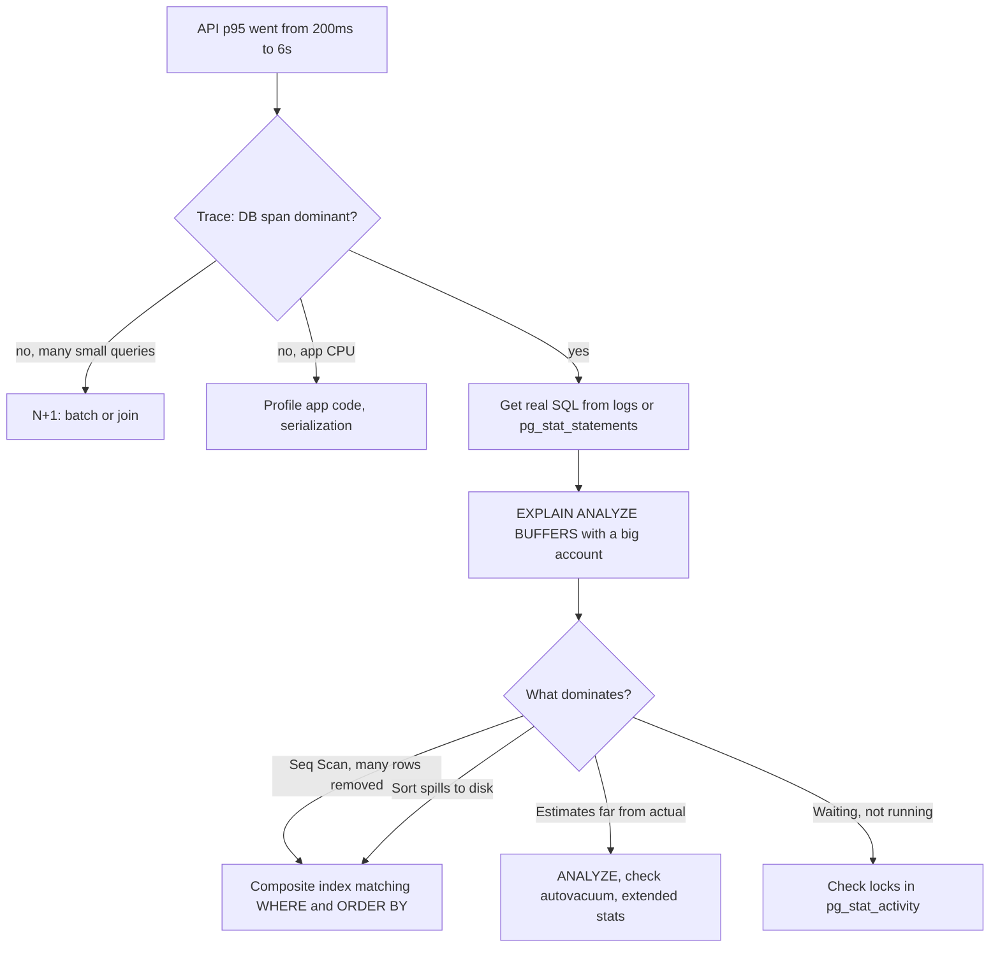

**Trade-offs:**
- Every index slows down writes (each `INSERT` updates every index) and uses disk. A ledger table with 10 indexes pays for that on every payment.
- Indexes built for one screen's filter may not help another. Look at the top queries as a set, not one at a time.
- Keyset pagination cannot jump to "page 37". Most transaction lists do not need it.

**What interviewers listen for:**
- You measure first: trace, then real SQL, then plan with realistic parameters.
- You can read a plan: seq scan vs index scan, rows removed by filter, estimated vs actual, buffers.
- You know `CREATE INDEX CONCURRENTLY` for a live table.
- You connect the DB fix back to the UI: pagination, count, columns selected.
- Red flag: "add an index on every column", or testing the plan on a dev database with 1,000 rows.

> **Gotcha:** The plan on your laptop with 5,000 rows is useless. Postgres picks a seq scan for small tables because it is genuinely faster. Test with production-sized data or a sanitized copy.

#### Q: [Mid] Explain the main index types in PostgreSQL. For a composite index, how do you decide the column order?

**Short answer:** The default B-tree index handles equality, ranges and sorting and covers most needs. GIN is for "contains" queries on arrays, JSONB and full-text; GiST and BRIN cover geometric or very large append-only data. For a composite B-tree, put equality columns first, then the range or sort column, because the index is sorted by the first column, then the second within it, and so on.

**Clarify first:** Which queries will use this index? What are the filters (equality vs range), and what is the sort?

**Diagnose:** Collect the top queries for the table from `pg_stat_statements` and check which ones already have index support with `EXPLAIN`.

**Solution:**

Index types you should know:

| Type | Good for | Example |
|---|---|---|
| B-tree (default) | `=`, `<`, `>`, `BETWEEN`, `ORDER BY`, prefix `LIKE 'abc%'` | `(account_id, created_at)` |
| Hash | Only `=` | Rarely better than B-tree |
| GIN | Arrays, JSONB containment `@>`, full-text `@@`, trigram | `tags`, `metadata`, `search_vector` |
| GiST | Ranges, geometry, nearest-neighbor, exclusion constraints | Booking time ranges that must not overlap |
| BRIN | Huge tables where values correlate with physical order | `created_at` on an append-only event log |

How a composite B-tree works: think of a phone book sorted by last name, then first name. You can find all "Smith" quickly, and all "Smith, John" quickly. You cannot quickly find everyone named "John" — they are scattered.

```sql
CREATE INDEX idx_tx_account_created ON transactions (account_id, created_at);
```

This index helps:

```sql
-- Equality on first column
WHERE account_id = $1
-- Equality on first, range on second
WHERE account_id = $1 AND created_at >= $2 AND created_at < $3
-- Equality on first, sort by second (no Sort node needed)
WHERE account_id = $1 ORDER BY created_at DESC LIMIT 50
```

It does not help much with:

```sql
WHERE created_at >= $1   -- skips the leading column
```

(PostgreSQL 18 added "skip scan" for B-trees, which can sometimes use an index without the leading column when that column has few distinct values. Do not design around it; treat it as a bonus.)

Rules for column order:
1. Equality columns first (`account_id = $1`, `status = 'posted'`).
2. Then the column you range-filter or sort on (`created_at`).
3. Columns after a range condition are much less useful for narrowing. In `(account_id, created_at, status)` with `created_at > $2`, the `status` check happens on every index entry in that range rather than jumping to it.
4. Among equality columns, order matters less for that query, but pick the order that lets the index serve other queries too. `(account_id, status)` also serves `WHERE account_id = $1` alone.

> **Gotcha:** "Put the most selective column first" is a common half-truth. For equality-only lookups it barely matters. What matters is equality before range, and matching the queries you actually run.

**Trade-offs:** More columns make the index bigger and slower to update. One well-chosen composite index often replaces two or three single-column ones.

**What interviewers listen for:**
- The phone-book mental model and "equality, then range/sort".
- Knowing GIN exists for JSONB and full-text, BRIN for huge time-ordered tables.
- Red flag: creating separate single-column indexes on `account_id` and `created_at` and expecting them to serve `WHERE account_id = $1 ORDER BY created_at` well. Postgres can combine indexes with a bitmap, but it cannot return rows in index order that way, so it still sorts.

#### Q: [Senior] What are covering indexes and partial indexes? Give a real case where each one is the right tool.

**Short answer:** A covering index contains every column the query needs, so Postgres can answer from the index alone with an index-only scan and never touch the table. A partial index only indexes rows that match a `WHERE` condition, which keeps it small and fast when queries always target a subset, like `status = 'pending'`.

**Clarify first:** How often does the query run? Which columns does it return? What fraction of rows match the subset?

**Diagnose:** In `EXPLAIN ANALYZE`, an `Index Scan` followed by many heap fetches is a hint that a covering index could help. Look for `Index Only Scan` and `Heap Fetches: 0` after the change.

**Solution:**

Covering index with `INCLUDE` (PostgreSQL 11+). The dashboard shows a balance sparkline from `(created_at, amount_cents)` per account:

```sql
CREATE INDEX CONCURRENTLY idx_tx_account_created_cover
  ON transactions (account_id, created_at)
  INCLUDE (amount_cents);

-- Can be served by an Index Only Scan:
SELECT created_at, amount_cents
FROM transactions
WHERE account_id = $1
  AND created_at >= now() - interval '90 days'
ORDER BY created_at;
```

`INCLUDE` columns are stored in the index leaf pages but are not part of the sort key. Use it for columns you return but do not filter or sort by.

> **Gotcha:** Index-only scans depend on the visibility map. If the table has many recently changed pages that vacuum has not processed, Postgres still has to check the heap (`Heap Fetches` will be high). Healthy autovacuum matters.

Partial index. A payments worker polls for pending payments. 99.9% of rows are `settled`:

```sql
CREATE INDEX CONCURRENTLY idx_payments_pending
  ON payments (created_at)
  WHERE status = 'pending';

-- Uses the partial index because the WHERE matches:
SELECT id FROM payments
WHERE status = 'pending'
ORDER BY created_at
LIMIT 100
FOR UPDATE SKIP LOCKED;
```

The index holds only thousands of rows instead of hundreds of millions.

Partial unique index for business rules:

```sql
-- Only one active default card per user; old or deleted cards do not count.
CREATE UNIQUE INDEX uniq_default_card
  ON cards (user_id)
  WHERE is_default AND deleted_at IS NULL;
```

**Trade-offs:**
- Covering indexes are bigger. Adding a wide text column to `INCLUDE` can make the index nearly as big as the table.
- A partial index is only used when the planner can prove the query's `WHERE` implies the index condition. `WHERE status = $1` with a parameter may not match at plan time with generic plans. Write the literal condition in the query.

**What interviewers listen for:**
- Index-only scan, `INCLUDE`, and the visibility map caveat.
- Partial indexes for queues and soft-deleted data (`WHERE deleted_at IS NULL`).
- Partial unique indexes to enforce rules in the database, not only in app code.

#### Q: [Senior] You added an index, but EXPLAIN still shows a sequential scan. What are the possible reasons?

**Short answer:** Either the planner thinks the seq scan is cheaper (many rows match, small table, bad statistics), or the query is written in a way the index cannot serve (function on the column, type mismatch, leading wildcard, wrong column order, `OR`). I check each in turn, starting with estimated vs actual row counts.

**Clarify first:** How many rows does the query return relative to the table? Is the index valid (a failed `CONCURRENTLY` build leaves an invalid index)? Is this a prepared statement?

**Diagnose:** Run `EXPLAIN ANALYZE`, compare estimates to actuals, then test whether the index can be used at all:

```sql
-- For diagnosis only, in a session. Never set this in production config.
SET enable_seqscan = off;
EXPLAIN ANALYZE SELECT ...;
RESET enable_seqscan;
```

If the plan still does not use the index, the query shape is the problem. If it does use it but is slower, the planner was right.

**Solution:** The common causes and their fixes:

1. Many rows match. If a query returns 30% of the table, a seq scan is genuinely faster than jumping around via the index. Fix: narrow the query or accept it.
2. Function or expression on the column:

```sql
-- Index on (email) is not used:
WHERE lower(email) = 'a@b.com'
-- Fix: expression index
CREATE INDEX idx_users_email_lower ON users (lower(email));

-- Index on (created_at) is not used well:
WHERE date(created_at) = '2026-09-30'
-- Fix: rewrite as a range
WHERE created_at >= '2026-09-30' AND created_at < '2026-10-01'
```

3. Type mismatch. Comparing a `bigint` column to a `numeric` parameter, or a `text` column to an integer, can force a cast on the column side. Make the parameter type match the column.
4. Leading wildcard: `WHERE description ILIKE '%coffee%'` cannot use a B-tree. Use a trigram GIN index (`pg_trgm`) or full-text search.
5. Wrong column order: index on `(created_at, account_id)` with `WHERE account_id = $1`.
6. `OR` across different columns: `WHERE account_id = $1 OR counterparty_id = $1`. Postgres may do a BitmapOr of two indexes if both exist; otherwise rewrite as `UNION ALL` of two indexed queries.
7. Stale statistics: estimates are far off. Run `ANALYZE`, and for correlated columns consider extended statistics (`CREATE STATISTICS ... (dependencies) ON col_a, col_b FROM t`).
8. Invalid index:

```sql
SELECT indexrelid::regclass, indisvalid
FROM pg_index WHERE NOT indisvalid;
```

9. Generic plan for prepared statements: after several executions, Postgres may switch to a generic plan that ignores the specific parameter value. A skewed column (one huge account) suffers. You can test with `SET plan_cache_mode = force_custom_plan;`.

**Trade-offs:** Expression indexes only help queries that use the exact same expression. Extended statistics add planning cost. Forcing plans with settings is a diagnostic tool, not a fix.

**What interviewers listen for:**
- "The planner may be right" — knowing seq scans are not always bad.
- Concrete patterns: functions on columns, type casts, leading wildcards, `OR`.
- Using `enable_seqscan = off` only to test.
- Red flag: "Postgres is broken, let's add an index hint." Postgres has no built-in hints (the `pg_hint_plan` extension exists but is a last resort).

#### Q: [Mid] The portfolio API returns 50 holdings, and the trace shows 51 database queries. What is happening and how do you fix it?

**Short answer:** That is the N+1 problem: one query loads the list, then the code (usually an ORM lazy-loading a relation) runs one more query per row. The fix is to load the related data in one or two queries using a join, an `IN (...)` batch, the ORM's eager-loading option, or a DataLoader in GraphQL.

**Clarify first:** Is it an ORM (Prisma, TypeORM, Sequelize, Drizzle) or hand-written SQL? REST or GraphQL? How many rows can the list have?

**Diagnose:**
- APM trace shows a waterfall of identical small queries.
- ORM query log shows the same SQL with different IDs.
- In tests, assert query counts for critical endpoints so N+1 cannot come back silently.

**Solution:**

The bug, in TypeScript with Prisma:

```ts
// 1 query for holdings + 1 query per holding for the instrument = N+1
const holdings = await prisma.holding.findMany({ where: { portfolioId } });
const result = await Promise.all(
  holdings.map(async (h) => ({
    ...h,
    instrument: await prisma.instrument.findUnique({ where: { id: h.instrumentId } }),
  })),
);
```

Fix 1, eager loading. The ORM fetches the relation in batch:

```ts
const holdings = await prisma.holding.findMany({
  where: { portfolioId },
  include: { instrument: true },
});
```

Fix 2, batch by IDs yourself:

```ts
const holdings = await db.query<Holding>(
  'SELECT * FROM holdings WHERE portfolio_id = $1',
  [portfolioId],
);
const ids = [...new Set(holdings.rows.map((h) => h.instrument_id))];
const instruments = await db.query<Instrument>(
  'SELECT * FROM instruments WHERE id = ANY($1)',
  [ids],
);
const byId = new Map(instruments.rows.map((i) => [i.id, i]));
const result = holdings.rows.map((h) => ({ ...h, instrument: byId.get(h.instrument_id) }));
```

Fix 3, a single join when you need a flat shape:

```sql
SELECT h.id, h.quantity, i.symbol, i.name
FROM holdings h
JOIN instruments i ON i.id = h.instrument_id
WHERE h.portfolio_id = $1;
```

Fix 4, GraphQL resolvers. Each `Holding.instrument` resolver runs separately, so use DataLoader, which collects all IDs requested in one tick and calls a batch function once:

```ts
import DataLoader from 'dataloader';

// Create per request so the cache does not leak between users.
const instrumentLoader = new DataLoader<string, Instrument | undefined>(async (ids) => {
  const rows = await db.query<Instrument>(
    'SELECT * FROM instruments WHERE id = ANY($1)',
    [ids as string[]],
  );
  const byId = new Map(rows.rows.map((r) => [r.id, r]));
  return ids.map((id) => byId.get(id)); // must return in the same order as ids
});
```

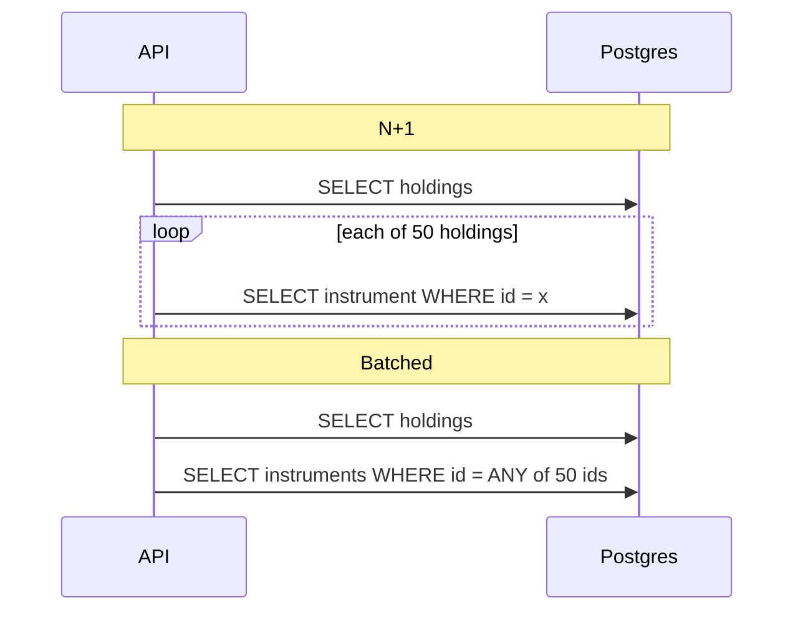

**Trade-offs:**
- Joins can duplicate parent rows when the child side has many rows (one-to-many), increasing payload. Two batched queries are often cleaner.
- Eager-loading everything "just in case" over-fetches. Load what the screen needs.
- `ANY($1)` with 50,000 IDs is still one query but a heavy one. Paginate the parent list.

**What interviewers listen for:**
- You recognize N+1 from the trace shape, not from guessing.
- You know it is the same problem as a React component that fetches per row in a list.
- DataLoader per request, and that the batch function must return results in input order.

> **Interview tip:** Relate it to the frontend: "It is like each `<Row>` calling `useQuery` for its own detail. You fix it the same way — fetch in bulk at the list level."

## 2. Data Modeling for Money and History

#### Q: [Mid] When do you normalize and when do you denormalize? Give an example from a financial app.

**Short answer:** Normalize by default so each fact lives in one place and cannot become inconsistent. Denormalize deliberately when a read path is hot and the join or aggregation is too expensive, and only with a clear plan to keep the copy correct (same transaction, trigger, or an async rebuild with known lag).

**Clarify first:** What is the read/write ratio? Can the copy be slightly stale? Who owns updating it?

**Diagnose:** Is the slow read caused by joins, or by aggregating many rows (e.g., summing 2M transactions for a balance)? `EXPLAIN ANALYZE` tells you.

**Solution:**

Normalized (third normal form, roughly "every non-key column depends on the key, the whole key, and nothing but the key"):

```sql
CREATE TABLE accounts (
  id          uuid PRIMARY KEY,
  customer_id uuid NOT NULL REFERENCES customers(id),
  currency    char(3) NOT NULL
);

CREATE TABLE transactions (
  id            uuid PRIMARY KEY,
  account_id    uuid NOT NULL REFERENCES accounts(id),
  amount_cents  bigint NOT NULL,
  created_at    timestamptz NOT NULL DEFAULT now()
);
```

The balance is `SUM(amount_cents)`. Correct by construction, but slow for a big account on every page view.

Denormalization options:
1. Stored balance updated in the same transaction as the insert. Strong consistency:

```sql
BEGIN;
INSERT INTO transactions (id, account_id, amount_cents) VALUES ($1, $2, $3);
UPDATE accounts SET balance_cents = balance_cents + $3 WHERE id = $2;
COMMIT;
```

2. Snapshot table: daily `account_balances(account_id, as_of_date, balance_cents)`. Today's balance = latest snapshot + sum of transactions since. Bounded work.
3. Materialized view for reports, refreshed on a schedule (`REFRESH MATERIALIZED VIEW CONCURRENTLY`, which needs a unique index on the view).
4. Copying display fields, e.g., storing `merchant_name` on the transaction. That is often correct, not just a performance trick: the statement should show the merchant name as it was at the time.

**Trade-offs:**
- Stored balance: every write updates the same account row, which becomes a hot row under heavy concurrency (lock contention).
- Snapshots and materialized views: stale until refreshed. Fine for analytics, not for "can I spend this money?".
- Every copy is a place for bugs. You need a reconciliation job that recomputes and compares.

**What interviewers listen for:**
- Default to normalized; denormalize with a stated consistency strategy.
- Distinguish "historical fact" copies (price at time of order) from "cache" copies.
- Mention reconciliation for money.

> **Finance tip:** Ledgers are usually append-only. You never edit a posted transaction; you add a reversing entry. That makes stored balances auditable: the balance must always equal the sum of entries.

#### Q: [Mid] How should you store money in the database, and what goes wrong if you use a float?

**Short answer:** Store money as an exact type: either `NUMERIC(p, s)` or an integer count of minor units (`amount_cents bigint`), always together with a currency code. Floats are binary approximations, so `0.1 + 0.2` is not `0.3`, and rounding errors add up across millions of rows and break reconciliation.

**Clarify first:** Which currencies? Some have 0 decimals (JPY), some 3 (KWD, BHD). Do you need sub-cent precision (FX rates, interest accrual, unit prices of funds)?

**Solution:**

The float problem in one line:

```ts
0.1 + 0.2; // 0.30000000000000004
```

Option A, integer minor units:

```sql
CREATE TABLE payments (
  id            uuid PRIMARY KEY,
  amount_minor  bigint  NOT NULL CHECK (amount_minor > 0),
  currency      char(3) NOT NULL,     -- ISO 4217: 'USD', 'JPY'
  created_at    timestamptz NOT NULL DEFAULT now()
);
```

Store a per-currency exponent (USD 2, JPY 0, KWD 3) in a currency table or library. Never assume 2.

Option B, `NUMERIC`:

```sql
amount numeric(19, 4) NOT NULL
```

Exact decimal arithmetic. Good when you need extra precision for rates or intermediate values. It is slower than integers, but rarely enough to matter.

Do not use:
- `real` / `double precision`: inexact.
- Postgres `money` type: formatting depends on the `lc_monetary` setting and it has no currency column. Most teams avoid it.

The JavaScript side matters too:
- `node-postgres` returns `bigint` (int8) and `numeric` as strings by default, precisely because JS `number` cannot hold all of them exactly. Keep them as strings, or parse `bigint` to `BigInt`, or to `number` only if you are sure values stay below `Number.MAX_SAFE_INTEGER` (about 9 quadrillion — fine for cents of a retail account, not fine as a blanket assumption).
- In JSON APIs, send amounts as strings (`"amount": "1234.50"`) or as integer minor units with the currency.
- Do calculations with integers or a decimal library (`decimal.js`, `big.js`, `dinero.js`), and only format at the edge with `Intl.NumberFormat`.

```ts
function formatMinor(amountMinor: bigint, currency: string, exponent: number, locale = 'en-US') {
  // Split into whole and fraction using BigInt to avoid float rounding.
  const negative = amountMinor < 0n;
  const abs = negative ? -amountMinor : amountMinor;
  const base = 10n ** BigInt(exponent);
  const whole = abs / base;
  const fraction = (abs % base).toString().padStart(exponent, '0');
  const decimalString = `${negative ? '-' : ''}${whole}${exponent ? '.' + fraction : ''}`;
  // Intl accepts numeric strings in modern engines and keeps precision for formatting.
  // The cast is only because older TypeScript lib typings declare number | bigint.
  return new Intl.NumberFormat(locale, { style: 'currency', currency }).format(
    decimalString as unknown as number,
  );
}
```

> **Gotcha:** `Intl.NumberFormat.prototype.format` accepting a string with full precision is part of the newer Intl.NumberFormat v3 behavior shipped in modern browsers and Node. On older runtimes the string is converted to a number first. If you support old environments, format the decimal string yourself.

Rounding rules: decide them explicitly (banker's rounding vs half-up), and decide where rounding happens. Splitting $100 across 3 people gives 33.33 + 33.33 + 33.34 — allocate the remainder, do not lose a cent.

**Trade-offs:**
- Minor units: fast and simple, but every reader must know the exponent; mistakes show up as amounts 100x off.
- `NUMERIC`: self-describing and precise, a bit slower, and still needs care in JS.

**What interviewers listen for:**
- Exact types plus a currency column. Not assuming 2 decimals.
- Awareness that the driver returns strings and why.
- Explicit rounding and remainder allocation.
- Red flag: `parseFloat(amount) * 100`.

#### Q: [Senior] A product manager asks for "delete" on payees. Compliance says nothing may ever be lost. Do you use soft delete, hard delete, or something else?

**Short answer:** It depends on why data is kept. Soft delete (`deleted_at` column) is simple and reversible, but every query must remember to filter it and it complicates unique constraints. Hard delete plus a separate audit/history table keeps the live table clean while preserving what happened. For regulated money data I usually combine: soft delete or archive for user-facing "delete", an append-only audit log for compliance, and real hard deletion only through a defined retention or privacy-erasure process.

**Clarify first:**
- Is "never lost" a legal retention rule (e.g., keep payment records for N years) or a product wish (undo)?
- Do privacy rules (GDPR right to erasure) require actually removing personal data?
- Do other rows reference this one (past payments to a deleted payee)?
- Can a user re-create a payee with the same account number after deleting?

**Solution:**

Soft delete:

```sql
ALTER TABLE payees ADD COLUMN deleted_at timestamptz;

-- Unique only among live rows, so re-creating after delete works.
CREATE UNIQUE INDEX uniq_payee_live
  ON payees (user_id, account_number)
  WHERE deleted_at IS NULL;

-- Most queries:
SELECT * FROM payees WHERE user_id = $1 AND deleted_at IS NULL;
```

Make the filter hard to forget: a view (`CREATE VIEW live_payees AS ... WHERE deleted_at IS NULL`), an ORM default scope, or row-level security.

Hard delete plus history table:

```sql
CREATE TABLE payees_history (
  history_id  bigserial PRIMARY KEY,
  payee_id    uuid NOT NULL,
  operation   text NOT NULL CHECK (operation IN ('INSERT','UPDATE','DELETE')),
  row_data    jsonb NOT NULL,
  changed_by  uuid,
  changed_at  timestamptz NOT NULL DEFAULT now()
);
```

Filled by a trigger or by the application in the same transaction (see the audit trail question).

Foreign keys: past payments reference the payee. With hard delete you need `ON DELETE RESTRICT` (block), or copy the payee details onto the payment row at payment time (often correct anyway: the payment went to the details as they were).

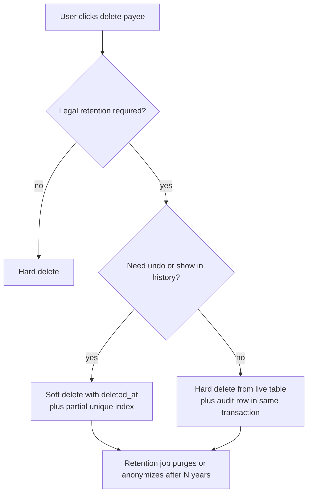

**Trade-offs:**
- Soft delete: forgotten filters leak "deleted" data into UI and reports; tables grow; unique constraints need partial indexes; the GDPR story is weak because data is still there.
- Hard delete + history: live table stays clean, but restore is a manual job, and the history table needs its own retention and access control.
- Archive table (move row to `payees_archive`): clean live table and easy restore, but two schemas to keep in sync.

**What interviewers listen for:**
- Asking what "never lost" means legally, and noting privacy erasure can conflict with retention.
- Partial unique index for soft-deleted rows.
- Snapshotting details onto financial records.
- Red flag: soft delete on everything by default with no plan for filtering or retention.

#### Q: [Staff] Design an audit trail for changes to accounts, limits and payment instructions. Auditors need to know who changed what, when, from which value to which, and it must be tamper-evident.

**Short answer:** An append-only audit table written in the same transaction as the change, recording actor, action, entity, before and after values, a request/correlation ID and a timestamp. The app role can insert but never update or delete it. For tamper evidence, chain each row with a hash of the previous one or ship the log to write-once storage. Capture business intent at the application layer; use triggers or CDC as a safety net.

**Clarify first:**
- Which entities, and do reads also need auditing (who viewed a statement)?
- Retention period and who can query the audit log?
- Is "who" the end user, an admin impersonating a user, or a background job? All three must be distinguishable.
- Volume: thousands per day or millions?

**Solution:**

Schema:

```sql
CREATE TABLE audit_events (
  id              bigserial PRIMARY KEY,
  occurred_at     timestamptz NOT NULL DEFAULT now(),
  actor_type      text NOT NULL CHECK (actor_type IN ('user','admin','system')),
  actor_id        text NOT NULL,
  on_behalf_of    text,                 -- set when an admin acts for a customer
  action          text NOT NULL,        -- 'payment_limit.updated'
  entity_type     text NOT NULL,        -- 'account'
  entity_id       text NOT NULL,
  before          jsonb,
  after           jsonb,
  request_id      text,                 -- ties to logs and traces
  ip              inet,
  prev_hash       bytea,
  row_hash        bytea
);

CREATE INDEX idx_audit_entity ON audit_events (entity_type, entity_id, occurred_at DESC);

-- Append-only for the application role.
REVOKE UPDATE, DELETE, TRUNCATE ON audit_events FROM app_user;
GRANT INSERT, SELECT ON audit_events TO app_user;
```

Write it in the same transaction as the change, so you never have a change without its audit row or vice versa:

```ts
await db.tx(async (t) => {
  const before = await t.one(
    'SELECT daily_limit_cents FROM accounts WHERE id = $1 FOR UPDATE',
    [accountId],
  );
  await t.none('UPDATE accounts SET daily_limit_cents = $1 WHERE id = $2', [newLimit, accountId]);
  await t.none(
    `INSERT INTO audit_events
       (actor_type, actor_id, action, entity_type, entity_id, before, after, request_id)
     VALUES ('user', $1, 'payment_limit.updated', 'account', $2, $3, $4, $5)`,
    [userId, accountId, before, { daily_limit_cents: newLimit }, requestId],
  );
});
```

(`db.tx`, `t.one`, `t.none` are pg-promise style helpers; any driver with transactions works the same way.)

Application-level vs trigger-level:
- App-level knows intent ("limit raised by support after KYC review") and actor. Risk: a developer forgets it on a new code path.
- Trigger-level catches every change, including manual SQL fixes, but only knows the DB user. Pass the actor with `SET LOCAL app.actor_id = '...'` at the start of the transaction and read it in the trigger with `current_setting('app.actor_id', true)`.
- Many teams do both: app events for meaning, triggers or CDC (logical replication, Debezium) as a completeness check.

Tamper evidence: hash chaining. Each row stores `row_hash = sha256(prev_hash || canonical_row_content)`. A verifier recomputes the chain; any edited or deleted row breaks it. Concurrent inserts make strict chaining harder (you need serialization, e.g., a single writer or a lock), so many teams instead stream audit events to write-once storage (object storage with object lock / WORM retention) and keep the DB copy for querying.

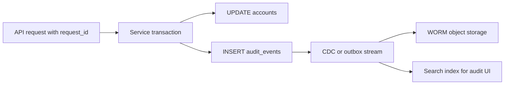

**Trade-offs:**
- Storing full before/after JSON is simple and query-friendly but grows fast; storing only changed fields is smaller but harder to read.
- Same-transaction writes add latency to every change; async (outbox) is faster but must be reliable.
- Personal data inside audit rows conflicts with erasure requests. Store references or pseudonymized values where possible.

**What interviewers listen for:**
- Same transaction, append-only permissions, actor plus impersonation, correlation ID.
- Clear view of app-level vs trigger/CDC capture.
- A practical take on tamper evidence (hash chain or WORM) and on PII.
- Red flag: "we log it to console and Datadog" as the audit trail.

## 3. Transactions and Concurrency

#### Q: [Senior] Explain transaction isolation levels with real anomalies. Two withdrawals hit the same account at the same moment — what can go wrong under the default level?

**Short answer:** Isolation levels define which effects of concurrent transactions you can see. PostgreSQL's default is Read Committed: each statement sees data committed before it started, so a read-then-write pattern ("check balance, then debit") can let two withdrawals both pass the check and overdraw the account. Fix it with an atomic conditional update, a row lock (`SELECT ... FOR UPDATE`), or Serializable isolation with retries.

**Clarify first:** Is the invariant on one row (account balance) or across rows (sum of balances, "at least one on-call doctor")? What throughput do you need on the hot rows?

**Solution:**

The anomalies, in plain terms:

| Anomaly | What happens | Example |
|---|---|---|
| Dirty read | You see another transaction's uncommitted change | Postgres never allows this |
| Non-repeatable read | Same row read twice gives different values | Balance is 100, then 40 in the same transaction |
| Phantom read | Same query returns new rows the second time | Count of today's payments changes mid-report |
| Lost update | Two read-modify-write cycles; one overwrites the other | Both read 100, both write 100 - 70 = 30 |
| Write skew | Two transactions read overlapping data, write different rows, together break a rule | Two joint-account holders each withdraw against the shared limit from different rows |

Levels in PostgreSQL:

| Level | Behavior in Postgres |
|---|---|
| Read Uncommitted | Accepted, but behaves exactly like Read Committed |
| Read Committed (default) | Each statement gets a fresh snapshot. Non-repeatable reads, phantoms and lost updates in read-then-write code are possible |
| Repeatable Read | One snapshot for the whole transaction (snapshot isolation). If you update a row someone else changed since your snapshot, you get a serialization error. Write skew still possible |
| Serializable | Serializable Snapshot Isolation: detects dangerous patterns and aborts one transaction with SQLSTATE `40001`. You must retry |

The race under Read Committed:

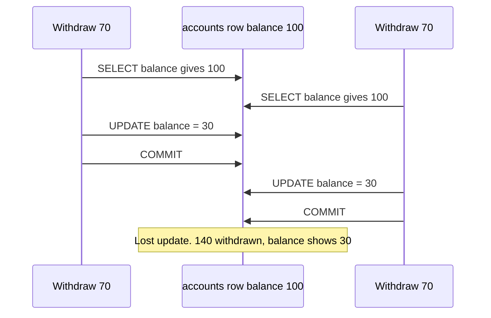

Fix 1, atomic conditional update. The check and the write are one statement, and the row lock taken by `UPDATE` serializes the two:

```sql
UPDATE accounts
SET balance_cents = balance_cents - $1
WHERE id = $2 AND balance_cents >= $1
RETURNING balance_cents;
-- 0 rows returned means insufficient funds.
```

Under Read Committed, the second `UPDATE` waits for the first to commit, then re-checks the `WHERE` against the new row version. So it sees 30, fails the condition and updates 0 rows.

Fix 2, explicit lock when logic is more complex:

```sql
BEGIN;
SELECT balance_cents, daily_limit_cents FROM accounts WHERE id = $1 FOR UPDATE;
-- app checks limits, fraud rules, etc.
INSERT INTO ledger_entries (...) VALUES (...);
UPDATE accounts SET balance_cents = balance_cents - $2 WHERE id = $1;
COMMIT;
```

Fix 3, Serializable with a retry loop, for cross-row invariants that are hard to lock:

```ts
async function withSerializableRetry<T>(fn: (c: PoolClient) => Promise<T>, attempts = 3): Promise<T> {
  for (let i = 1; ; i++) {
    const client = await pool.connect();
    try {
      await client.query('BEGIN ISOLATION LEVEL SERIALIZABLE');
      const result = await fn(client);
      await client.query('COMMIT');
      return result;
    } catch (err: any) {
      await client.query('ROLLBACK');
      const retryable = err.code === '40001' || err.code === '40P01';
      if (!retryable || i >= attempts) throw err;
      await new Promise((r) => setTimeout(r, 20 * i + Math.random() * 20)); // backoff with jitter
    } finally {
      client.release();
    }
  }
}
```

**Trade-offs:**
- Atomic update: fastest, but only works when the rule fits in one statement.
- `FOR UPDATE`: simple and explicit, but holds locks; a slow external call inside the transaction blocks every other payment on that account.
- Serializable: correct for complex invariants, but you must retry and expect more aborts under contention.

**What interviewers listen for:**
- Naming the default (Read Committed) and the read-then-write race.
- The atomic `UPDATE ... WHERE balance >= x` pattern.
- Knowing Serializable needs retries, and that retried work must be idempotent.
- Red flag: "we check the balance in the frontend before submitting."

> **Interview tip:** Pair this with idempotency. A retried payment request (client timeout, double click) must not debit twice. Use an idempotency key with a unique constraint, so a duplicate insert fails instead of creating a second payment.

#### Q: [Senior] Production logs show "deadlock detected" a few times an hour on the transfers endpoint. What is a deadlock, and how do you get rid of it?

**Short answer:** A deadlock is when transaction A holds a lock B needs, and B holds a lock A needs, so neither can proceed. Postgres detects the cycle (after `deadlock_timeout`, 1 second by default) and aborts one with SQLSTATE `40P01`. The main fix is to always acquire locks in a consistent order, keep transactions short, and retry the aborted one.

**Clarify first:** Which statements are involved? Is it transfers between two accounts, batch jobs updating many rows, or foreign-key checks?

**Diagnose:**
- The Postgres log for a deadlock prints both processes and the statements they were running. Turn on `log_lock_waits = on` to also log waits longer than `deadlock_timeout`.
- Live view of who is blocking whom:

```sql
SELECT pid, pg_blocking_pids(pid) AS blocked_by, state, wait_event_type, query
FROM pg_stat_activity
WHERE cardinality(pg_blocking_pids(pid)) > 0;
```

**Solution:**

The classic transfer deadlock:

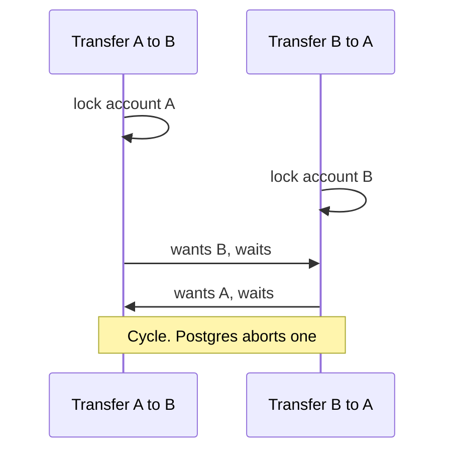

Fix 1, lock rows in a deterministic order:

```ts
async function transfer(fromId: string, toId: string, amountCents: bigint) {
  const [first, second] = [fromId, toId].sort(); // same order for every transfer
  await db.tx(async (t) => {
    await t.any('SELECT id FROM accounts WHERE id IN ($1, $2) ORDER BY id FOR UPDATE', [first, second]);
    await t.none('UPDATE accounts SET balance_cents = balance_cents - $1 WHERE id = $2', [amountCents, fromId]);
    await t.none('UPDATE accounts SET balance_cents = balance_cents + $1 WHERE id = $2', [amountCents, toId]);
  });
}
```

`SELECT ... ORDER BY id FOR UPDATE` locks rows in id order, so two transfers between the same pair always queue instead of crossing.

Fix 2, batch jobs: update rows in a stable order (`ORDER BY id`) and in small chunks, not one giant transaction touching 100k rows.

Fix 3, keep transactions short. Never call a payment provider or send an email while holding row locks. Do the external call outside, then record the result.

Fix 4, retry on `40P01` (same loop as for serialization errors).

Fix 5, for queue-style workers, use `FOR UPDATE SKIP LOCKED` so workers grab different rows instead of waiting on each other.

**Trade-offs:** Ordering locks is cheap but requires discipline across all code paths. Shorter transactions may need an outbox or saga pattern for multi-step work. Retries hide deadlocks; still track the rate.

**What interviewers listen for:**
- Lock ordering as the root fix; retries as the safety net.
- No network calls inside a transaction.
- Knowing `SKIP LOCKED` for job queues.
- Red flag: "increase the timeout."

## 4. Changing and Scaling Big Tables

#### Q: [Staff] You need to add a NOT NULL column `settlement_currency` to a 500-million-row `transactions` table with zero downtime. Walk me through it.

**Short answer:** Use expand/contract. Add the column in a way that does not rewrite the table, deploy code that writes it, backfill old rows in small batches, then enforce NOT NULL using a `CHECK ... NOT VALID` constraint that you validate separately. Every DDL step runs with a short `lock_timeout` so it never queues behind long queries and blocks the whole table.

**Clarify first:**
- Is there a sensible default for old rows, or must it be computed per row?
- Postgres version (behavior changed in 11 and 12)?
- Deploy model: can old and new app versions run at the same time? (Yes, during any rolling deploy.)
- Replication: how much write load can the replicas absorb during backfill?

**Diagnose / understand the locks:**
- Most `ALTER TABLE` forms take an `ACCESS EXCLUSIVE` lock, which blocks reads and writes. Holding it is fine for milliseconds, deadly for minutes.
- A subtle trap: the `ALTER` waits for existing long queries to finish, and while it waits, every new query queues behind it. A 2-minute report query turns into a 2-minute outage. Hence `lock_timeout`.

**Solution:**

Step 1, expand. Add the column as nullable, or with a constant default:

```sql
SET lock_timeout = '3s';
ALTER TABLE transactions ADD COLUMN settlement_currency char(3);
-- Since PostgreSQL 11, a constant (non-volatile) DEFAULT is also metadata-only:
-- ALTER TABLE transactions ADD COLUMN settlement_currency char(3) DEFAULT 'USD';
```

Both are instant: no table rewrite. Retry if the lock times out.

Step 2, deploy app code that writes `settlement_currency` on every new insert and update. Old code ignoring the column is fine because it is nullable.

Step 3, backfill in batches, throttled, idempotent and resumable:

```ts
const BATCH = 5000;
let lastId = 0n;
for (;;) {
  const { rows } = await pool.query<{ id: string }>(
    `WITH batch AS (
       SELECT id FROM transactions
       WHERE id > $1 AND settlement_currency IS NULL
       ORDER BY id
       LIMIT $2
     )
     UPDATE transactions t
     SET settlement_currency = a.currency
     FROM batch, accounts a
     WHERE t.id = batch.id AND a.id = t.account_id
     RETURNING t.id`,
    [lastId.toString(), BATCH],
  );
  if (rows.length === 0) break;
  lastId = rows.reduce((max, r) => (BigInt(r.id) > max ? BigInt(r.id) : max), lastId);
  await sleep(50); // let replicas and autovacuum keep up; watch replica lag
}
```

(Assumes a `bigint` id. With UUIDs, iterate on a time-ordered column or a UUIDv7 key instead.)

Each batch is its own short transaction, so locks are brief and progress survives a crash.

Step 4, enforce NOT NULL without a long lock:

```sql
SET lock_timeout = '3s';
ALTER TABLE transactions
  ADD CONSTRAINT tx_settlement_currency_nn
  CHECK (settlement_currency IS NOT NULL) NOT VALID;   -- instant, applies to new writes

ALTER TABLE transactions VALIDATE CONSTRAINT tx_settlement_currency_nn;
-- Scans the table but only takes SHARE UPDATE EXCLUSIVE: reads and writes continue.

ALTER TABLE transactions ALTER COLUMN settlement_currency SET NOT NULL;
-- PostgreSQL 12+ sees the valid CHECK and skips the full scan.

ALTER TABLE transactions DROP CONSTRAINT tx_settlement_currency_nn;
```

(PostgreSQL 18 also lets you add a NOT NULL constraint as `NOT VALID` directly; check your version's docs. The CHECK route works on 12+.)

Step 5, contract: remove any fallback code that handled nulls.

Adding an index on the same table:

```sql
CREATE INDEX CONCURRENTLY idx_tx_settlement_currency ON transactions (settlement_currency);
```

`CONCURRENTLY` does not block writes but takes longer, cannot run inside a transaction block (many migration tools wrap each migration in one — disable that for this migration), and if it fails it leaves an `INVALID` index you must drop and recreate.

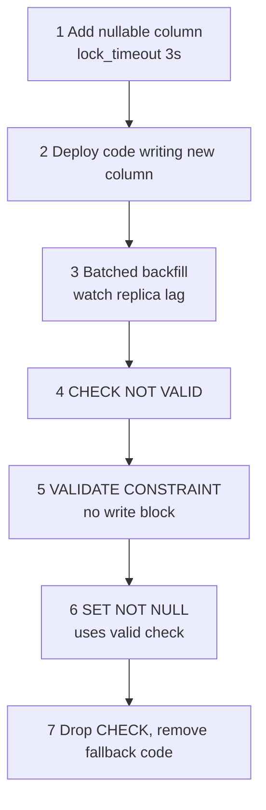

Renames follow the same idea: add new column, dual-write, backfill, switch reads, stop writing old, drop old. Never rename in place while old code is running.

**Trade-offs:**
- More steps and deploys, but each one is reversible and low-risk.
- Backfill generates a lot of WAL and dead tuples. Throttle it and let autovacuum run.
- Tools like `pgroll`, `reshape` or Rails/Django safe-migration linters can automate parts of this; know the manual steps anyway.

**What interviewers listen for:**
- Expand/contract, and the fact that old and new code run together during deploy.
- `lock_timeout` and the lock-queue trap.
- `NOT VALID` then `VALIDATE`, and `CREATE INDEX CONCURRENTLY` limitations.
- Batched, resumable backfill with lag monitoring.
- Red flag: `ALTER TABLE ... ADD COLUMN x NOT NULL DEFAULT gen_random_uuid()` on a huge table. A volatile default forces a full rewrite under an exclusive lock.

#### Q: [Mid] The transactions list uses `LIMIT 50 OFFSET 200000` and deep pages are slow. Show me keyset pagination in SQL and how the frontend uses it.

**Short answer:** `OFFSET` makes the database read and discard every skipped row, so page 4,000 costs 200,000 row reads. Keyset (cursor) pagination remembers the last row's sort key and asks for "rows after this one", which uses the index and costs the same on every page. The sort must be on a unique, stable key, so you add `id` as a tiebreaker.

**Clarify first:** Do users need to jump to an arbitrary page number, or only next/previous and infinite scroll? What sort orders must be supported?

**Solution:**

Index matching the filter and sort:

```sql
CREATE INDEX CONCURRENTLY idx_tx_account_created_id
  ON transactions (account_id, created_at DESC, id DESC);
```

First page:

```sql
SELECT id, created_at, amount_cents, description
FROM transactions
WHERE account_id = $1
ORDER BY created_at DESC, id DESC
LIMIT 51;  -- fetch one extra to know if there is a next page
```

Next page, using a row-value comparison:

```sql
SELECT id, created_at, amount_cents, description
FROM transactions
WHERE account_id = $1
  AND (created_at, id) < ($2, $3)   -- last row of the previous page
ORDER BY created_at DESC, id DESC
LIMIT 51;
```

`(a, b) < (x, y)` means `a < x OR (a = x AND b < y)`, and Postgres can use the composite index for it. Both sort columns must go in the same direction for this simple form.

API returns an opaque cursor:

```ts
type Cursor = { createdAt: string; id: string };

const encodeCursor = (c: Cursor) => Buffer.from(JSON.stringify(c)).toString('base64url');
const decodeCursor = (s: string): Cursor => JSON.parse(Buffer.from(s, 'base64url').toString());

async function listTransactions(accountId: string, cursor?: string, limit = 50) {
  const c = cursor ? decodeCursor(cursor) : null;
  const { rows } = await pool.query(
    c
      ? `SELECT id, created_at::text AS created_at, amount_cents FROM transactions
         WHERE account_id = $1 AND (created_at, id) < ($2::timestamptz, $3)
         ORDER BY created_at DESC, id DESC LIMIT $4`
      : `SELECT id, created_at::text AS created_at, amount_cents FROM transactions
         WHERE account_id = $1
         ORDER BY created_at DESC, id DESC LIMIT $2`,
    c ? [accountId, c.createdAt, c.id, limit + 1] : [accountId, limit + 1],
  );
  const hasMore = rows.length > limit;
  const page = rows.slice(0, limit);
  const last = page[page.length - 1];
  return {
    items: page,
    nextCursor: hasMore && last
      ? encodeCursor({ createdAt: last.created_at, id: last.id }) // full microsecond text
      : null,
  };
}
```

> **Gotcha:** `timestamptz` has microsecond precision, but a JS `Date` only has milliseconds. If you round-trip the cursor through `Date`, you can skip rows that share the same millisecond. That is why the code above selects `created_at::text` and keeps the full-precision string in the cursor.

Frontend with TanStack Query v5:

```ts
const query = useInfiniteQuery({
  queryKey: ['transactions', accountId],
  queryFn: ({ pageParam }) => fetchTransactions(accountId, pageParam),
  initialPageParam: undefined as string | undefined,
  getNextPageParam: (lastPage) => lastPage.nextCursor ?? undefined,
});
```

**Trade-offs:**
- No "jump to page 37" and no cheap total page count. Usually fine for transaction feeds.
- Each supported sort order needs its own index and cursor shape.
- Stable under inserts: new transactions at the top do not shift later pages, unlike `OFFSET`, which shows duplicates when rows are inserted.

**What interviewers listen for:**
- Why `OFFSET` is O(offset), the unique tiebreaker, and the matching index.
- Fetching `limit + 1` to detect the next page.
- Opaque cursors so clients cannot depend on the internals.

#### Q: [Staff] The transactions table is 3 TB and growing 100 GB a month. Queries mostly hit the last 90 days, and data older than 7 years must be deleted. Would you partition it, and how?

**Short answer:** Yes, this is the textbook case for range partitioning by date: monthly partitions, so recent queries only touch a few small partitions (partition pruning), and retention becomes `DROP` or `DETACH` of an old partition instead of a giant `DELETE`. The cost is that the partition key must be in every primary key and unique constraint, and queries without a date filter scan every partition.

**Clarify first:**
- Do almost all queries filter by date? Account-only lookups with no date range would scan all partitions.
- Uniqueness needs: is `id` unique on its own, or is `(id, created_at)` acceptable?
- Is the real pain query speed, vacuum/maintenance time, or retention deletes?

**Solution:**

```sql
CREATE TABLE transactions (
  id            bigint GENERATED ALWAYS AS IDENTITY,
  account_id    uuid NOT NULL,
  amount_cents  bigint NOT NULL,
  created_at    timestamptz NOT NULL,
  PRIMARY KEY (id, created_at)          -- must include the partition key
) PARTITION BY RANGE (created_at);

CREATE TABLE transactions_2026_09 PARTITION OF transactions
  FOR VALUES FROM ('2026-09-01') TO ('2026-10-01');
CREATE TABLE transactions_2026_10 PARTITION OF transactions
  FOR VALUES FROM ('2026-10-01') TO ('2026-11-01');

-- Index on the parent is created on every partition.
CREATE INDEX ON transactions (account_id, created_at DESC);
```

Partition pruning in action:

```sql
EXPLAIN SELECT * FROM transactions
WHERE account_id = $1 AND created_at >= now() - interval '90 days';
-- Plan touches only the last ~4 partitions.
```

Retention:

```sql
ALTER TABLE transactions DETACH PARTITION transactions_2019_09 CONCURRENTLY;
-- Archive it to cold storage if required, then:
DROP TABLE transactions_2019_09;
```

`DETACH ... CONCURRENTLY` (PostgreSQL 14+) avoids blocking queries on the parent. Compare with `DELETE FROM transactions WHERE created_at < ...` on billions of rows: hours of I/O, huge WAL and bloat.

Operations:
- Create future partitions ahead of time (cron or the `pg_partman` extension). A missing partition makes inserts fail; a `DEFAULT` partition catches stragglers but makes later attaches slower.
- Migrating an existing 3 TB table: create the partitioned table, dual-write or use logical replication, backfill by month, then swap names in a short maintenance step.

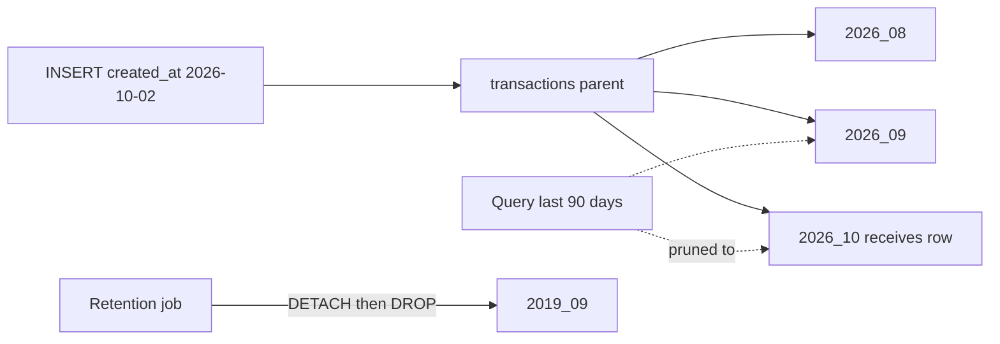

**Trade-offs:**
- Global uniqueness on `id` alone is not enforceable across partitions. Use `(id, created_at)` or a separately generated unique ID (UUIDv7) with app-level guarantees.
- Too many partitions (thousands) slow planning. Monthly or weekly is typical, not daily, unless volume is extreme.
- Queries without a partition-key filter get slower, not faster.
- Partitioning is not sharding: it is still one server. If you need horizontal write scaling, that is Citus or app-level sharding.

**What interviewers listen for:**
- Partition pruning, retention by dropping partitions, and the PK constraint.
- Checking the query patterns before deciding.
- Pre-creating partitions, and a migration plan for the existing table.
- Red flag: partitioning a 5 GB table "for performance."

#### Q: [Senior] Users want to search transactions by description and merchant, with typo tolerance. Do you use Postgres full-text search or Elasticsearch/OpenSearch?

**Short answer:** Start with Postgres: full-text search with a `tsvector` column and GIN index for word search, plus `pg_trgm` for fuzzy and partial matching. It keeps data in one place with no sync lag, and it is enough for searching within one customer's transactions. Move to Elasticsearch or OpenSearch when you need relevance tuning, heavy faceting, many languages, typo tolerance at scale, or search across huge volumes that would hurt the primary database.

**Clarify first:** Search scope (one account vs whole platform for support agents)? Data volume? Required features: prefix, typos, synonyms, facets, highlighting? Can results lag a few seconds behind writes?

**Solution:**

Postgres full-text search:

```sql
ALTER TABLE transactions
  ADD COLUMN search_vector tsvector
  GENERATED ALWAYS AS (
    setweight(to_tsvector('simple', coalesce(merchant_name, '')), 'A') ||
    setweight(to_tsvector('simple', coalesce(description, '')), 'B')
  ) STORED;

CREATE INDEX CONCURRENTLY idx_tx_search ON transactions USING gin (search_vector);

SELECT id, merchant_name, amount_cents
FROM transactions
WHERE account_id = $1
  AND search_vector @@ websearch_to_tsquery('simple', $2)
ORDER BY created_at DESC
LIMIT 50;
```

(On a huge table, adding a stored generated column rewrites the table. Use a normal column filled by the app or a trigger plus a batched backfill instead.)

The `'simple'` config does no stemming, which suits merchant names. `'english'` stems "payments" to "payment" — good for prose, odd for names.

Fuzzy and substring with trigrams:

```sql
CREATE EXTENSION IF NOT EXISTS pg_trgm;
CREATE INDEX CONCURRENTLY idx_tx_merchant_trgm ON transactions USING gin (merchant_name gin_trgm_ops);

SELECT merchant_name, similarity(merchant_name, $1) AS score
FROM transactions
WHERE account_id = $1
  AND merchant_name % $2          -- similarity above pg_trgm.similarity_threshold (default 0.3)
ORDER BY score DESC
LIMIT 20;
-- The same index also speeds up ILIKE '%starbuc%'.
```

Elasticsearch/OpenSearch architecture:

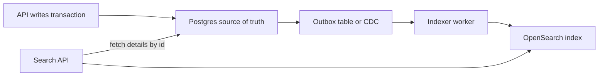

Postgres stays the source of truth. The search index is a derived, rebuildable copy, updated via an outbox or CDC (Debezium), and you need a full reindex job for mapping changes.

Frontend side: debounce input (about 300 ms), cancel stale requests with `AbortController`, and show "results may take a few seconds to include new transactions" if you use an async index.

**Trade-offs:**

| | Postgres FTS + trigram | Elasticsearch / OpenSearch |
|---|---|---|
| Ops | No new system | Cluster to run, monitor, upgrade |
| Consistency | Same transaction, instant | Eventually consistent, seconds of lag |
| Relevance, typos, synonyms | Basic | Rich (analyzers, fuzziness, boosting) |
| Facets and aggregations at scale | Limited | Strong |
| Load | Shares primary DB resources | Isolated |

**What interviewers listen for:**
- Starting with the simpler tool and naming the trigger for switching.
- Treating the search engine as a derived index, not a source of truth, with a sync and reindex strategy.
- Tenant filtering in every search query (support agents excepted, with audit).

## 5. Operations, Architecture and Data Safety

#### Q: [Senior] After a user edits a payee and saves, the list sometimes still shows the old name for a second or two. The backend uses read replicas. What is going on and how do you fix it?

**Short answer:** Replica lag. Writes go to the primary and stream asynchronously to replicas, which are usually milliseconds behind but can be seconds behind under load. The refetch after save hit a replica that had not applied the write yet. Fix it with read-your-writes: route that user's reads to the primary for a short window after a write, return the updated entity from the write call, or have the replica wait until it has caught up to the write's position.

**Clarify first:** Is replication async (normal) or synchronous? Which reads go to replicas? How much lag do dashboards show at peak?

**Diagnose:**

```sql
-- On a replica: how far behind in time?
SELECT now() - pg_last_xact_replay_timestamp() AS replica_delay;

-- On the primary: per replica lag
SELECT application_name, write_lag, flush_lag, replay_lag FROM pg_stat_replication;
```

(The first query reports misleadingly large values when the primary is idle, because no new transactions are being replayed.)

**Solution:**

1. Return the saved entity from the mutation and update the cache directly, instead of refetching:

```ts
const mutation = useMutation({
  mutationFn: updatePayee,
  onSuccess: (saved) => {
    queryClient.setQueryData<Payee[]>(['payees'], (old) =>
      old?.map((p) => (p.id === saved.id ? saved : p)),
    );
  },
});
```

2. Sticky primary after write. The API marks the user (session or a short-lived cookie) for, say, 5 seconds after a write and routes their reads to the primary.
3. LSN-based consistency. After a write, the API reads `pg_current_wal_lsn()` on the primary and returns it as a token. Later reads compare it with `pg_last_wal_replay_lsn()` on the replica and fall back to the primary if the replica is behind.
4. Critical reads always on the primary: balances before a payment, authorization checks, anything followed by a decision.

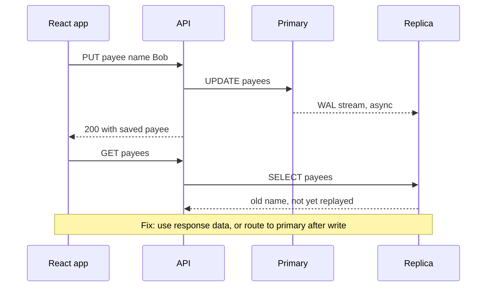

**Trade-offs:** Routing more reads to the primary reduces the benefit of replicas. Synchronous replication removes lag for committed data but adds latency to every commit and can block writes if a replica is down. Optimistic cache updates can show data that the server later rejects; roll back on error.

**What interviewers listen for:**
- Naming replica lag and read-your-writes consistency.
- Fixing it on both sides: API routing and frontend cache updates.
- Keeping money decisions on the primary.

#### Q: [Mid] What is connection pooling and why do Postgres apps need it, especially with serverless functions?

**Short answer:** Each Postgres connection is a separate server process with its own memory, so a database comfortably handles hundreds of connections, not tens of thousands. A pool keeps a small set of open connections and lends them to requests. With serverless functions or many app replicas, each instance opening its own connections can exhaust `max_connections`, so you put an external pooler like PgBouncer (or a managed proxy like RDS Proxy) in front.

**Clarify first:** How many app instances? Serverless or long-running? What is `max_connections`? Does the app use session features (prepared statements, `SET`, advisory locks, `LISTEN`)?

**Diagnose:** Errors like `sorry, too many clients already` or `remaining connection slots are reserved`. Count connections by state:

```sql
SELECT state, count(*) FROM pg_stat_activity GROUP BY state;
-- Many 'idle in transaction' rows mean code is holding transactions open.
```

**Solution:**

In-app pool with `node-postgres`:

```ts
import { Pool } from 'pg';

export const pool = new Pool({
  connectionString: process.env.DATABASE_URL,
  max: 10,                       // per process
  idleTimeoutMillis: 30_000,
  connectionTimeoutMillis: 2_000, // fail fast instead of hanging
});

// Always release, even on error.
const client = await pool.connect();
try {
  await client.query('BEGIN');
  // ...
  await client.query('COMMIT');
} catch (e) {
  await client.query('ROLLBACK');
  throw e;
} finally {
  client.release();
}
```

Budget: 20 pods x 10 connections = 200. Add replicas or autoscaling and you exceed the limit quickly.

External pooler modes (PgBouncer):
- Session: a server connection per client session. Safe, but saves little.
- Transaction: a server connection only for the duration of a transaction. Huge savings. But session state does not survive between transactions: `SET` (use `SET LOCAL` inside the transaction), session advisory locks, `LISTEN/NOTIFY`, temp tables. Protocol-level prepared statements needed special handling; PgBouncer 1.21+ can track them with `max_prepared_statements`.
- Statement: rarely used.

Pool sizing: more connections is not faster. A small multiple of CPU cores on the DB server is a common starting point; beyond that, connections fight for CPU and locks.

**Trade-offs:** An external pooler is another hop and another component. Transaction mode breaks session-level features. Too small a pool causes request queuing; too big overwhelms the DB.

**What interviewers listen for:**
- Process-per-connection model and the serverless multiplication problem.
- Transaction pooling and its caveats.
- Always releasing connections and avoiding idle-in-transaction.

#### Q: [Mid] When would you pick a SQL database and when a NoSQL one? Our team wants to store user dashboard layouts and also payment records.

**Short answer:** Payments go in a relational database: you need transactions, constraints, joins and exact consistency. Dashboard layouts are a document per user that is read and written as a whole, so a JSONB column in Postgres is usually enough; a document store like DynamoDB or MongoDB makes sense when you need massive scale with simple key-based access patterns, or a flexible schema at very high write volume.

**Clarify first:** Access patterns (by key only, or ad-hoc queries and reports)? Consistency needs? Scale (writes per second, data size)? Team experience and existing infra?

**Solution:**

| Need | Relational (Postgres) | Document / key-value (MongoDB, DynamoDB) |
|---|---|---|
| Multi-row transactions, constraints | Core strength | Limited or more complex (supported in some, with caveats) |
| Ad-hoc queries, reporting, joins | Excellent | Weak; design around known access patterns |
| Horizontal write scaling | Harder (Citus, sharding) | Built in (DynamoDB partitions) |
| Schema evolution | Migrations | Flexible, but schema moves into app code |
| Single-item reads by key at huge scale | Good | Excellent, predictable latency |

Postgres can cover the dashboard case without a new system:

```sql
CREATE TABLE dashboard_layouts (
  user_id     uuid PRIMARY KEY REFERENCES users(id),
  layout      jsonb NOT NULL,
  version     int NOT NULL DEFAULT 1,
  updated_at  timestamptz NOT NULL DEFAULT now()
);

-- Optimistic concurrency so two tabs do not overwrite each other silently:
UPDATE dashboard_layouts
SET layout = $2, version = version + 1, updated_at = now()
WHERE user_id = $1 AND version = $3;
-- 0 rows updated means someone else saved first. Return 409 Conflict.
```

Validate the JSON shape in the API (for example with Zod) since the DB will accept any JSON.

**Trade-offs:** "Schemaless" does not remove the schema; it moves it into every reader. DynamoDB requires designing keys around queries up front; adding a new query pattern later can mean a new index or a data migration. Running two databases doubles ops work.

**What interviewers listen for:**
- Deciding by access patterns and consistency, not hype.
- Knowing JSONB exists, and its limits.
- Red flag: "NoSQL because it's faster" or putting a ledger in an eventually consistent store without discussing it.

#### Q: [Staff] We are building a B2B treasury platform. Each corporate client must never see another client's data. Compare database-per-tenant, schema-per-tenant and shared tables with row-level security.

**Short answer:** It is a spectrum of isolation vs cost. Database-per-tenant gives the strongest isolation and easy per-tenant backup and restore but is expensive to run at scale. Schema-per-tenant is a middle ground that gets painful with migrations across thousands of schemas. Shared tables with a `tenant_id` column are cheapest and simplest to operate, and Postgres row-level security (RLS) adds a database-enforced safety net so a missing `WHERE tenant_id = ...` cannot leak data. I default to shared tables with RLS, and offer dedicated databases for a few large or regulated tenants.

**Clarify first:**
- Number of tenants (10 vs 10,000) and size skew (one tenant 50% of data?).
- Contractual requirements: data residency, dedicated infrastructure, customer-managed keys.
- Do tenants need per-tenant restore ("roll back our data to yesterday")?
- Cross-tenant analytics needs.

**Solution:**

| | DB per tenant | Schema per tenant | Shared tables + RLS |
|---|---|---|---|
| Isolation | Strongest | Medium | Logical, DB-enforced |
| Noisy neighbor | Isolated | Shared server | Shared |
| Migrations | Run N times | Run N times, catalog bloat at thousands | Once |
| Per-tenant restore | Easy | Possible | Hard |
| Cost | High | Medium | Low |
| Connection pooling | One pool per DB | `search_path` per request | Simple |

Shared tables with RLS:

```sql
ALTER TABLE payments ADD COLUMN tenant_id uuid NOT NULL;
CREATE INDEX ON payments (tenant_id, created_at DESC);

ALTER TABLE payments ENABLE ROW LEVEL SECURITY;
ALTER TABLE payments FORCE ROW LEVEL SECURITY;  -- apply to the table owner too

CREATE POLICY tenant_isolation ON payments
  USING (tenant_id = current_setting('app.tenant_id')::uuid)
  WITH CHECK (tenant_id = current_setting('app.tenant_id')::uuid);
```

Set the tenant per transaction (works with PgBouncer transaction mode because `SET LOCAL` ends with the transaction):

```ts
async function withTenant<T>(tenantId: string, fn: (c: PoolClient) => Promise<T>): Promise<T> {
  const client = await pool.connect();
  try {
    await client.query('BEGIN');
    // set_config with is_local = true is the parameterized form of SET LOCAL.
    await client.query("SELECT set_config('app.tenant_id', $1, true)", [tenantId]);
    const result = await fn(client);
    await client.query('COMMIT');
    return result;
  } catch (e) {
    await client.query('ROLLBACK');
    throw e;
  } finally {
    client.release();
  }
}
```

The tenant ID must come from the verified auth token (for example an Okta claim mapped to the tenant), never from a request body or header the client controls.

> **Gotcha:** Superusers and roles with `BYPASSRLS` ignore policies, and the table owner does too unless you use `FORCE ROW LEVEL SECURITY`. Run the app as a dedicated non-owner role. If `app.tenant_id` is unset, `current_setting('app.tenant_id')` raises an error, which is the safe failure. Using `current_setting(..., true)` returns NULL instead, which matches no rows — also safe, but harder to notice.

Hybrid: a tenant registry maps each tenant to a database ("cell"). Most tenants share a cell; a large bank gets its own. The app looks up the connection per request.

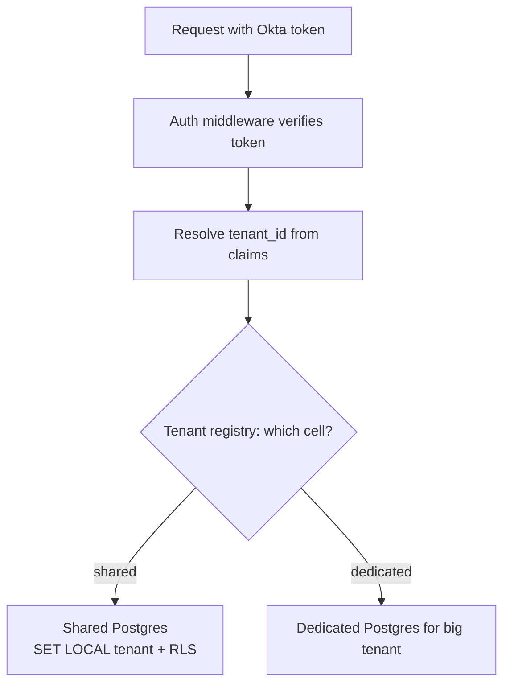

**Trade-offs:** RLS adds a small per-query cost and makes debugging slightly harder (queries "return nothing" when the setting is wrong). Shared tables need `tenant_id` leading most indexes. Dedicated databases multiply ops and migration effort.

**What interviewers listen for:**
- A clear comparison table and a default with reasons.
- RLS details: `FORCE`, non-owner role, `SET LOCAL` with pooling, tenant from the verified token.
- Tests that prove isolation (log in as tenant A, try to read tenant B's IDs, expect 404).
- Red flag: relying only on "every developer remembers the WHERE clause."

#### Q: [Senior] Someone ran an UPDATE without a WHERE clause on the payees table at 14:32. How do backups and point-in-time recovery help, and how would you design them?

**Short answer:** Point-in-time recovery (PITR) restores a base backup and replays the write-ahead log (WAL) up to a chosen moment, say 14:31:59, giving you the database exactly as it was before the mistake. You restore into a new instance, extract the correct payee rows, and repair production, rather than rolling back the whole database and losing every other write since 14:32. A backup you have never restored is not a backup, so restores must be tested regularly.

**Clarify first:** What are the RPO (how much data can we lose) and RTO (how long can we be down)? Managed (RDS, Cloud SQL, Azure) or self-hosted? Retention requirements?

**Solution:**

How it works:
- Base backup: a full physical copy (managed snapshots, `pg_basebackup`, pgBackRest, Barman).
- Continuous WAL archiving: every change is in the WAL; archived WAL segments let you replay to any moment between backups.
- Managed services do this for you. AWS RDS, for example, offers PITR within the configured backup retention window (up to 35 days for automated backups).

Recovery for the bad UPDATE:

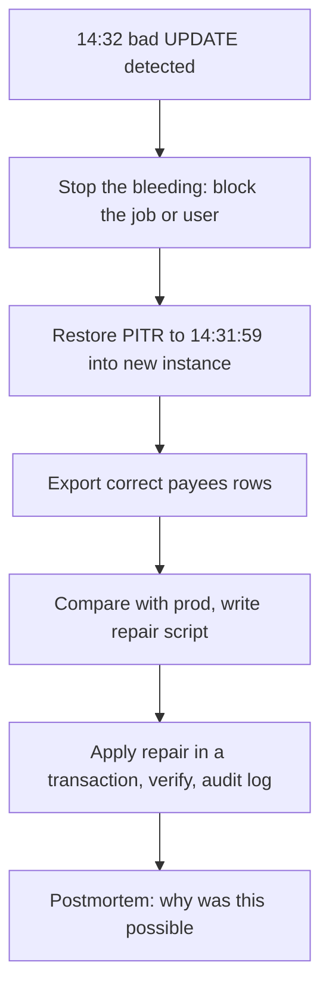

Repair from the restored copy, for example with `postgres_fdw` or a CSV export:

```sql
-- On production, after loading restored rows into payees_restored:
BEGIN;
UPDATE payees p
SET name = r.name, account_number = r.account_number
FROM payees_restored r
WHERE p.id = r.id
  AND p.updated_at >= '2026-10-02 14:32:00+00';  -- only rows touched by the mistake
-- check the row count matches expectations before committing
COMMIT;
```

Design checklist:
- Backups in a different account/region from the database, with deletion protection (ransomware and "oops" both delete backups).
- Encryption at rest, access limited and audited.
- Automated restore tests (weekly restore to a scratch instance, run sanity queries, record timing to verify RTO).
- Logical dumps (`pg_dump`) for long-term archives or single-table restores, alongside physical backups for PITR.
- Replicas are not backups: a bad `UPDATE` replicates in milliseconds. Delayed replicas (`recovery_min_apply_delay`) can be a fast undo window.

Prevention: run ad-hoc production SQL only via reviewed scripts in a transaction, with `statement_timeout`, read-only roles by default, and tools that warn on `UPDATE`/`DELETE` without `WHERE`.

**Trade-offs:** Longer retention costs storage. Restoring a multi-TB database takes hours, so RTO drives choices like more frequent snapshots or delayed replicas. Partial repair is safer for the business than full rollback but takes careful work.

**What interviewers listen for:**
- Base backup plus WAL, RPO/RTO, restoring to a new instance and repairing selectively.
- "Replicas are not backups" and "untested backups do not count."
- Prevention and a blameless postmortem rather than blame.
