## 1. CI/CD Pipelines and Team Workflow

#### Q: [Senior] Design the CI/CD pipeline for our React + TypeScript banking dashboard. Twelve developers merge about 20 PRs a day. What runs where, and how do you keep it fast?

**Short answer:** On every PR: install with a lockfile, then lint, type-check, unit tests and build in parallel, then deploy a preview environment and run a small set of end-to-end smoke tests against it. On merge to main: build once, store the artifact, deploy it to staging, run smoke tests, then promote the same artifact to production with a canary or manual approval. Keep it under about 10 minutes with caching, parallel jobs and only running what changed.

**Clarify first:**
- Monorepo or single app? Shared component library?
- Hosting: static CDN (S3 + CloudFront, Netlify, Vercel) or containers?
- Compliance: do production deploys need an approval record (common in finance)?
- Current pain: slow pipeline, flaky tests, or broken deploys?

**Diagnose:** If the pipeline is slow today, look at the CI timing per step. Usual culprits: no dependency cache, tests running serially, E2E suite running on every commit, building twice (once for test, once for deploy).

**Solution:**

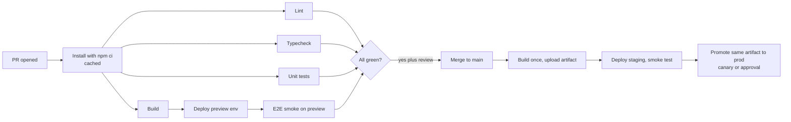

A GitHub Actions example for the PR stage:

```yaml
# .github/workflows/ci.yml
name: ci
on:
  pull_request:
  push:
    branches: [main]

concurrency:
  group: ci-${{ github.ref }}
  cancel-in-progress: true   # a new push cancels the old run for the same branch

permissions:
  contents: read

jobs:
  checks:
    runs-on: ubuntu-latest
    strategy:
      matrix:
        task: [lint, typecheck, test]
    steps:
      - uses: actions/checkout@v4
      - uses: actions/setup-node@v4
        with:
          node-version-file: .nvmrc
          cache: npm
      - run: npm ci
      - run: npm run ${{ matrix.task }}

  build:
    runs-on: ubuntu-latest
    steps:
      - uses: actions/checkout@v4
      - uses: actions/setup-node@v4
        with:
          node-version-file: .nvmrc
          cache: npm
      - run: npm ci
      - run: npm run build
      - uses: actions/upload-artifact@v4
        with:
          name: web-dist
          path: dist
```

(Action major versions move on; use the current majors your org approves, and consider pinning third-party actions to a commit SHA.)

`package.json` scripts it relies on:

```json
{
  "scripts": {
    "lint": "eslint . --max-warnings 0",
    "typecheck": "tsc --noEmit",
    "test": "vitest run --coverage",
    "build": "vite build",
    "e2e": "playwright test"
  }
}
```

Keeping it fast:
- Cache dependencies (`cache: npm`) and, in monorepos, use a task runner with remote caching (Nx, Turborepo) so unchanged packages are not rebuilt or retested.
- Parallelize: matrix jobs, test sharding (`vitest --shard=1/4`, `playwright test --shard=1/4`).
- Tiered tests: fast unit and component tests on every PR, a small E2E smoke set on preview, the full E2E suite nightly or before release.
- Build once, deploy many. The artifact tested in staging is byte-for-byte what goes to production. This is why runtime config matters (see later question).

Quality gates worth adding: bundle size budget (fail if the main chunk grows over a threshold), `npm audit` or a dependency scanner, accessibility checks in component tests, and Lighthouse CI on the preview for key pages.

**Trade-offs:**
- More gates mean slower feedback. Put cheap, high-signal checks first and expensive ones later or nightly.
- E2E tests catch real breakage but are flaky if they depend on shared test data. Seed data per run or use mocked APIs (MSW) for most flows.
- Required approvals on prod deploys slow releases but are often a regulatory requirement. Make them a one-click step with the change summary attached.

**What interviewers listen for:**
- Build once, promote the same artifact.
- Parallelism, caching, test tiers, and a target time.
- Concrete gates (types, lint, tests, bundle budget, security scan).
- Red flag: "we run the full Cypress suite on every commit and it takes 45 minutes."

> **Interview tip:** Mention the developer experience: a fast pipeline is what keeps people from batching changes into giant risky PRs.

#### Q: [Mid] What are preview environments, and how would you set them up for a frontend app that calls a backend API?

**Short answer:** A preview environment is a temporary deployment of a PR's build at its own URL, so reviewers, designers and QA can click through the change before merge. For a SPA it is cheap: upload the build to a unique path or subdomain. The hard part is the backend: point previews at a shared staging API, a mocked API, or a per-PR backend for full-stack changes.

**Clarify first:** Does the PR change only the frontend, or the API too? Can staging data be shared safely? Do previews need auth (Okta redirect URIs)?

**Solution:**

Options for hosting:
- Managed platforms (Vercel, Netlify, Cloudflare Pages, AWS Amplify) create preview URLs per PR automatically.
- DIY: upload `dist/` to `s3://previews/pr-123/` behind a CDN with a wildcard subdomain (`pr-123.preview.example.com`) and a small edge function or rewrite to serve `index.html` for client-side routes.

Options for the backend:
1. Shared staging API. Simplest. Breaks when the PR depends on an unreleased API change.
2. Mock Service Worker (MSW) in a "demo mode" build. Fully isolated, great for UI review, but does not test real integration.
3. Ephemeral full stack per PR (Kubernetes namespace or a cloud environment per PR) with a seeded database. Most realistic and most expensive.

Auth gotchas: Okta (and most OIDC providers) require registered redirect URIs. Wildcards are restricted or discouraged, so teams use a fixed preview login callback domain, a dedicated preview app registration, or a stub auth mode on previews. Never point previews at production auth or production data.

Lifecycle: post the URL as a PR comment, protect previews behind SSO or basic auth so unreleased features are not public, and delete them when the PR closes (a workflow on `pull_request: types: [closed]`).

**Trade-offs:** Per-PR backends cost money and take minutes to spin up. Shared staging is cheap but creates "staging is broken again" contention. Mocks drift from the real API unless generated from the same OpenAPI contract.

**What interviewers listen for:**
- Clear separation of frontend preview (easy) and backend dependency (hard).
- Auth redirect URI awareness for Okta/OIDC.
- Cleanup and access control.

#### Q: [Mid] Our app has 1,400 npm dependencies and they are two years out of date. How do you automate dependency updates without breaking things every week?

**Short answer:** Use Dependabot or Renovate to open update PRs automatically, grouped and scheduled so the team gets a few manageable PRs a week instead of fifty. Auto-merge low-risk patch and minor updates when CI passes, and handle major versions as planned work. For a two-year backlog, first catch up deliberately, one major framework at a time.

**Clarify first:** How good is test coverage? Which dependencies are critical (React, router, auth SDK, form library)? Any security policy on how fast vulnerabilities must be patched?

**Solution:**

Dependabot config with grouping:

```yaml
# .github/dependabot.yml
version: 2
updates:
  - package-ecosystem: npm
    directory: /
    schedule:
      interval: weekly
    open-pull-requests-limit: 10
    groups:
      dev-tooling:
        dependency-type: development
        update-types: [minor, patch]
      runtime-minor:
        dependency-type: production
        update-types: [minor, patch]
  - package-ecosystem: github-actions
    directory: /
    schedule:
      interval: monthly
```

Renovate offers more control (schedules, auto-merge rules per package, a dependency dashboard issue, monorepo-aware grouping):

```json
{
  "extends": ["config:recommended"],
  "schedule": ["before 6am on monday"],
  "packageRules": [
    { "matchUpdateTypes": ["patch", "minor"], "matchDepTypes": ["devDependencies"], "automerge": true },
    { "matchPackageNames": ["react", "react-dom", "@types/react", "@types/react-dom"], "groupName": "react" },
    { "matchUpdateTypes": ["major"], "dependencyDashboardApproval": true }
  ]
}
```

(Check the Renovate docs for exact option names in your version; they evolve.)

Catching up a big backlog:
1. Update tooling first (TypeScript, ESLint, test runner) so later steps have good feedback.
2. One major at a time: React, then router, then data fetching, each in its own PR, reading the migration guide and codemods.
3. Remove unused dependencies (`npx depcheck` or `knip`) before upgrading them.
4. Keep the lockfile committed and use `npm ci` in CI so builds are reproducible.

Supply-chain safety: review new transitive dependencies on big updates, enable `npm audit` / GitHub security alerts, and consider a minimum release age (do not take a version published an hour ago; malicious package releases are often caught within days).

**Trade-offs:** Auto-merge needs trustworthy tests. Grouping reduces PR noise but makes it harder to find which package broke something. Waiting too long makes every upgrade a migration project.

**What interviewers listen for:**
- Automation plus grouping plus auto-merge policy tied to test confidence.
- A pragmatic plan for the backlog.
- Supply-chain awareness.

#### Q: [Senior] Should our team use trunk-based development or Git Flow? We release the web app several times a day.

**Short answer:** With multiple releases a day, trunk-based development fits: everyone merges small, short-lived branches into `main` at least daily, `main` is always deployable, and unfinished features hide behind feature flags. Git Flow, with long-lived `develop` and `release` branches, was designed for scheduled versioned releases and adds merge pain without benefit for continuous web deploys.

**Clarify first:** Do you ship installable software with multiple supported versions (mobile apps, SDKs, on-prem)? How strong are CI and tests? Is there a regulatory release-approval process?

**Solution:**

Trunk-based:

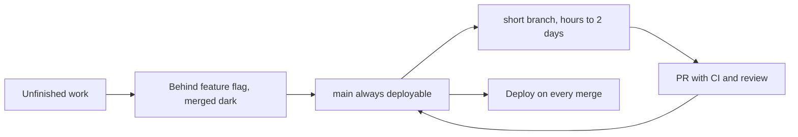

Git Flow:

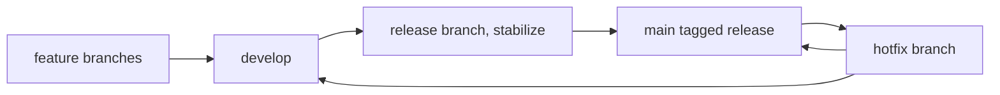

What trunk-based requires:
- Fast, reliable CI (the pipeline is the gatekeeper).
- Feature flags for incomplete work.
- Small PRs, and the habit of splitting work (backend first, UI behind a flag).
- Branch protection on `main`: required checks and review.

Where release branches still make sense: mobile apps waiting on store review, libraries maintaining v2 and v3, or customer-installed software. Even then, many teams do trunk-based plus a short-lived release branch cut from `main` and only hotfixes cherry-picked into it.

**Trade-offs:**
- Trunk-based: needs discipline and flags; a bad merge reaches production quickly (mitigated by canary and fast rollback).
- Git Flow: clear release stages, but long-lived branches diverge, merges are painful, and "integration" happens late, which is where bugs hide.

**What interviewers listen for:**
- Matching the branching model to the release model.
- Feature flags as the enabler of trunk-based.
- Knowing DORA-style findings that small, frequent changes correlate with fewer failures (state it as a general industry finding, not a precise statistic).

#### Q: [Mid] How do you version releases and produce changelogs for a web app and for a shared component library?

**Short answer:** For a shared library, use Semantic Versioning (`MAJOR.MINOR.PATCH`) because consumers need to know when a change breaks them, and generate changelogs from structured input such as Changesets or Conventional Commits. For a continuously deployed web app, SemVer matters less; tag each deploy with a build identifier (date plus commit SHA) and keep human-readable release notes for stakeholders.

**Clarify first:** Who consumes the version: other teams (library) or end users (app)? Is there a monorepo? Does compliance need a record of what changed in each production release?

**Solution:**

SemVer rules: MAJOR for breaking changes, MINOR for new backward-compatible features, PATCH for fixes. For a component library, "breaking" includes removed props, changed defaults, and visual changes that break layouts.

Changesets (popular in monorepos): each PR adds a small markdown file declaring the bump and a summary.

```md
---
"@acme/ui": minor
---

Add `CurrencyInput` `allowNegative` prop.
```

A release workflow runs `changeset version` (bumps versions, writes `CHANGELOG.md`) and `changeset publish`.

Conventional Commits plus semantic-release: commit messages like `feat(table): add column pinning` or `fix: correct rounding in totals` and `BREAKING CHANGE:` footers drive the version bump and changelog automatically.

Web app releases:
- Tag images or artifacts with `2026.10.02-3f9c2ab` style identifiers.
- Expose the version in the app (a `/version.json` or a footer string) and attach it to error reports (Sentry/Datadog release tags), so you can tell which release an error came from and use source maps for that build.
- Release notes generated from merged PR titles since the last tag, edited for humans.

**Trade-offs:** Changesets add a small step to each PR but produce good changelogs. Commit-message-driven tools depend on everyone writing messages correctly (enforce with commitlint). Over-engineering versioning for an internal web app wastes time.

**What interviewers listen for:**
- SemVer where consumers depend on it, build IDs where you deploy continuously.
- Linking releases to monitoring (release tags, source maps).
- Knowing at least one tool (Changesets, semantic-release).

## 2. Build, Configuration and Packaging

#### Q: [Senior] Our Vite app reads `import.meta.env.VITE_API_URL`. To deploy to staging and production we rebuild the app twice. Why is that a problem, and how do you do runtime configuration for a SPA?

**Short answer:** `import.meta.env.VITE_*` values are replaced with literal strings at build time, so each environment gets a different bundle. That breaks "build once, deploy many": the thing you tested in staging is not the thing you ship. Instead, build one environment-neutral bundle and load config at runtime, for example from a `/config.json` served per environment, or a small script that sets `window.__APP_CONFIG__`, injected by the server or container at startup.

**Clarify first:** What actually differs per environment: API URLs, Okta issuer and client ID, feature flags, analytics keys? Is anything secret? (Nothing in a SPA can be secret.)

**Solution:**

Build-time (what most apps start with):

```ts
// Replaced at build time with a string literal.
const apiUrl = import.meta.env.VITE_API_URL;
```

Runtime option 1, fetch a config file before rendering:

```ts
// src/config.ts
import { z } from 'zod';

const ConfigSchema = z.object({
  apiUrl: z.string().url(),
  oktaIssuer: z.string().url(),
  oktaClientId: z.string().min(1),
  environment: z.enum(['dev', 'staging', 'prod']),
});
export type AppConfig = z.infer<typeof ConfigSchema>;

let config: AppConfig | undefined;

export async function loadConfig(): Promise<AppConfig> {
  const res = await fetch('/config.json', { cache: 'no-store' });
  if (!res.ok) throw new Error(`Config load failed: ${res.status}`);
  config = ConfigSchema.parse(await res.json());
  return config;
}

export function getConfig(): AppConfig {
  if (!config) throw new Error('Config not loaded yet');
  return config;
}
```

```tsx
// src/main.tsx
import { createRoot } from 'react-dom/client';
import { loadConfig } from './config';
import { App } from './App';

loadConfig()
  .then(() => createRoot(document.getElementById('root')!).render(<App />))
  .catch((err) => {
    document.getElementById('root')!.textContent = 'The app could not start. Please refresh.';
    console.error(err);
  });
```

Runtime option 2, inline config with no extra request. The nginx official image processes `/etc/nginx/templates/*.template` with `envsubst` at container start, so you can template a small JS file:

```js
// public/config.js.template  (copied into the image, rendered at startup)
window.__APP_CONFIG__ = {
  apiUrl: "${API_URL}",
  oktaIssuer: "${OKTA_ISSUER}",
  oktaClientId: "${OKTA_CLIENT_ID}",
  environment: "${APP_ENV}"
};
```

```html
<!-- index.html, before the app bundle -->
<script src="/config.js"></script>
```

(You can set `NGINX_ENVSUBST_OUTPUT_DIR` to make the template render into the web root instead of `/etc/nginx/conf.d`. Check the image docs for your version. Alternatively, run `envsubst` in a custom entrypoint script.)

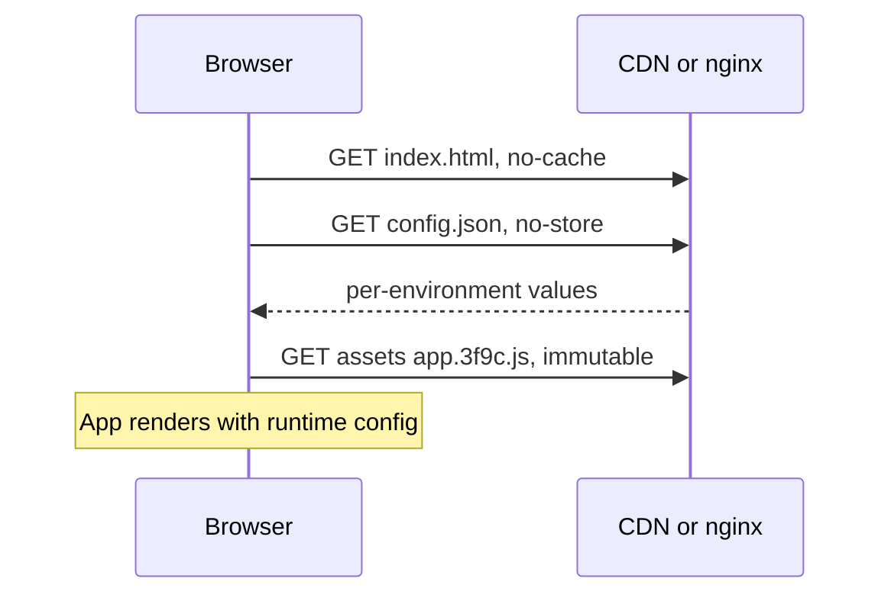

Keep build-time variables for things that truly are build properties: version string, commit SHA, and dead-code elimination of dev-only code.

**Trade-offs:**
- `config.json`: one extra request before render (small, cacheable with revalidation); must handle failure.
- Inline script: no extra round trip, but requires a server or container step at startup.
- Pure static hosting (S3 + CDN) needs a per-environment `config.json` uploaded during deploy, which is fine.

**What interviewers listen for:**
- Understanding that Vite/CRA env vars are inlined at build time.
- Build once, promote the same artifact.
- Validating config at startup and failing clearly.
- "There are no secrets in a frontend bundle." Anything in `config.json` is public.

> **Gotcha:** Do not put the config file under a long cache. If `config.json` is cached for a year, switching an API URL becomes impossible without changing its name.

#### Q: [Mid] Write a production Dockerfile for a React SPA and explain each part.

**Short answer:** A multi-stage build: the first stage uses a Node image to install dependencies and run the build; the final stage copies only the static `dist/` output into a small nginx image. The final image has no Node, no source code and no `node_modules`, so it is small and has less attack surface. nginx is configured to serve `index.html` for client-side routes and to set cache headers.

**Clarify first:** Do you even need a container? If you host on S3 + CDN, upload `dist/` directly. Containers make sense when the platform is Kubernetes or ECS, or you need runtime config templating.

**Solution:**

```dockerfile
# syntax=docker/dockerfile:1

# ---- Build stage ----
FROM node:22-alpine AS build
WORKDIR /app

# Copy only manifests first so the dependency layer is cached
# when only source files change.
COPY package.json package-lock.json ./
RUN npm ci

COPY . .
RUN npm run build

# ---- Runtime stage ----
FROM nginx:1.27-alpine AS runtime
# Pin image versions your org supports; update them via your dependency bot.

COPY nginx.conf /etc/nginx/conf.d/default.conf
COPY --from=build /app/dist /usr/share/nginx/html

EXPOSE 8080
# No CMD needed: the nginx base image already starts nginx in the foreground.
```

`nginx.conf`:

```nginx
server {
  listen 8080;
  root /usr/share/nginx/html;

  # Hashed build assets: cache forever.
  location /assets/ {
    add_header Cache-Control "public, max-age=31536000, immutable";
    try_files $uri =404;
  }

  # Runtime config: never cache.
  location = /config.json {
    add_header Cache-Control "no-store";
  }

  # SPA fallback: unknown paths return index.html so React Router handles them.
  location / {
    add_header Cache-Control "no-cache";
    try_files $uri $uri/ /index.html;
  }

  gzip on;
  gzip_types text/css application/javascript application/json image/svg+xml;
}
```

`.dockerignore` (keeps the build context small and avoids leaking local files):

```
node_modules
dist
.git
.env*
coverage
```

Explanation points:
- Layer caching: copying `package*.json` before the source means `npm ci` only reruns when dependencies change.
- `npm ci` installs exactly what the lockfile says.
- Port 8080 instead of 80 makes it easier to run nginx as a non-root user (ports below 1024 need privileges). The `nginxinc/nginx-unprivileged` image is built for that.
- `assets/` is Vite's default output folder for hashed files.

**Trade-offs:** nginx is simple and fast; a Node server (Express) is only worth it if you need SSR or server logic. Alpine images are small, but use musl libc, which occasionally affects native modules in the build stage.

**What interviewers listen for:**
- Multi-stage build, layer ordering, `.dockerignore`.
- SPA fallback with `try_files`.
- Cache headers per file type.
- Red flag: shipping `node_modules` and running `npm start` (the dev server) in production.

#### Q: [Senior] After a deploy, some users see a blank screen and the console shows "Failed to fetch dynamically imported module". Others get the new version only after a hard refresh. What is wrong with your caching, and what headers should you use?

**Short answer:** `index.html` is being cached, or old hashed chunks were deleted. The right setup is: hashed assets (`app.3f9c2ab.js`) get `Cache-Control: public, max-age=31536000, immutable` because their name changes when content changes; `index.html` gets `no-cache` so the browser revalidates it every time; and old assets stay available for a while after a deploy so users with an old `index.html` open can still load their lazy chunks.

**Clarify first:** Where is caching happening: browser, CDN, a corporate proxy, or a service worker? Do you delete the old build on deploy? Do you use code splitting (`React.lazy`)?

**Diagnose:**
- In the Network tab, check the `index.html` response: `Cache-Control`, `Age` (time it sat in the CDN cache), and whether it came "from disk cache".
- Check the CDN's cache policy: some CDNs apply a default TTL when the origin sends no header.
- Check if a service worker is serving a cached shell (Application tab).
- Reproduce: open the app, deploy, then navigate to a lazy route without reloading.

**Solution:**

Header policy:

| File | Cache-Control | Why |
|---|---|---|
| `/assets/*.[hash].js`, `.css`, fonts | `public, max-age=31536000, immutable` | Name changes with content, so safe forever |
| `/index.html` and SPA routes | `no-cache` | Always revalidate; ETag makes it a cheap 304 |
| `/config.json` | `no-store` or `no-cache` | Per-environment, must change without rename |
| Unhashed images in `/public` | Short max-age, for example `max-age=3600` | Names do not change with content |

`no-cache` does not mean "do not cache". It means "store it, but check with the server before using it". `no-store` means do not store at all.

Deploy order for static hosting:
1. Upload new hashed assets first (they do not collide with old ones).
2. Upload the new `index.html` last.
3. Invalidate `index.html` on the CDN (for example a CloudFront invalidation for `/index.html` and `/`).
4. Do not delete old assets right away. Keep the last few releases' assets (or expire them after days) so open tabs keep working.

Handle the chunk error in the app anyway, because a user can keep a tab open for a week:

```ts
// Retry once with a full reload when a lazy chunk fails to load.
export function lazyWithReload<T extends React.ComponentType<any>>(
  factory: () => Promise<{ default: T }>,
) {
  return React.lazy(async () => {
    try {
      return await factory();
    } catch (err) {
      const key = 'chunk-reload-attempted';
      if (!sessionStorage.getItem(key)) {
        sessionStorage.setItem(key, '1');
        window.location.reload();
        return new Promise<never>(() => {}); // wait for the reload
      }
      throw err; // let the error boundary show a "new version available" message
    }
  });
}
```

Clear the `chunk-reload-attempted` flag after a successful app start so a later deploy can trigger it again. Vite also emits a `vite:preloadError` event on `window` that you can listen to for the same purpose.

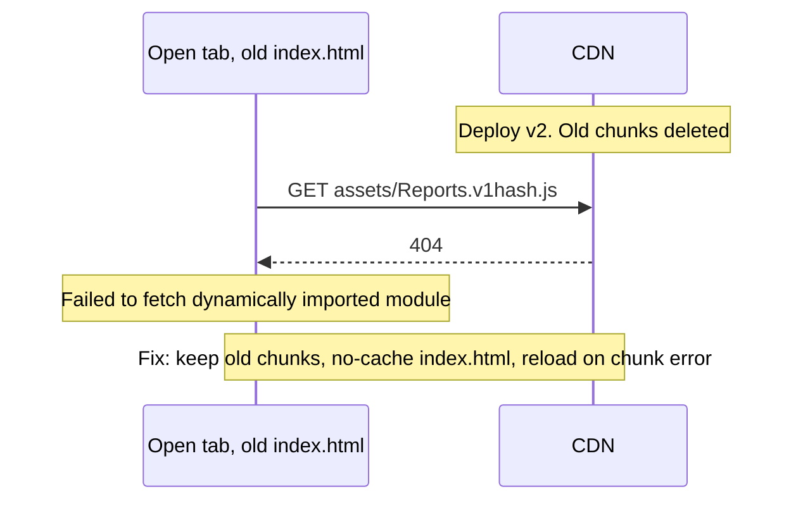

**Trade-offs:** Keeping old assets costs a little storage. `no-cache` on `index.html` adds a revalidation request per visit (usually a fast 304). Aggressive "new version available" prompts annoy users; reload silently on navigation instead when possible.

**What interviewers listen for:**
- Hashed = immutable, HTML = revalidate, and the difference between `no-cache` and `no-store`.
- Deploy ordering and not deleting old chunks.
- A client-side fallback for stale tabs.

> **Finance tip:** On money forms, never auto-reload in the middle of a payment flow. Show a non-blocking banner and reload at the next safe navigation.

#### Q: [Senior] Where do secrets live in our system, and how do CI and the running services get them without leaking?

**Short answer:** Secrets live in a dedicated secret manager (AWS Secrets Manager, GCP Secret Manager, Azure Key Vault, HashiCorp Vault), never in the repo, Docker images or the frontend bundle. Services fetch them at runtime with an identity-based role. CI authenticates to the cloud with short-lived OIDC tokens instead of long-lived access keys. The frontend has no secrets at all: anything shipped to the browser is public.

**Clarify first:** What counts as a secret here: DB passwords, API keys for payment providers, signing keys, Okta client secrets for backend apps? Who needs access? Rotation requirements?

**Solution:**

Rules:
1. Nothing secret in git. Use pre-commit and CI secret scanning (GitHub secret scanning with push protection, gitleaks). If a secret is committed, rotate it; deleting the commit is not enough.
2. Nothing secret in the SPA. An Okta SPA uses Authorization Code with PKCE precisely because it cannot keep a client secret. API keys that must stay private go behind your backend (a BFF or proxy).
3. Services get secrets at runtime via their identity (IAM role for the pod/task), and cache them in memory. Avoid writing them to logs or error messages.
4. Short-lived over long-lived. Prefer dynamic DB credentials (Vault) or IAM database auth where available.
5. Rotation is routine and tested, not an emergency procedure.

CI with OIDC instead of stored keys (GitHub Actions to AWS):

```yaml
permissions:
  id-token: write   # allow requesting the OIDC token
  contents: read

jobs:
  deploy:
    runs-on: ubuntu-latest
    environment: production   # environment protection rules and approvals
    steps:
      - uses: actions/checkout@v4
      - uses: aws-actions/configure-aws-credentials@v4
        with:
          role-to-assume: arn:aws:iam::123456789012:role/web-deploy
          aws-region: eu-west-1
      - run: aws s3 sync dist/ s3://web-prod-bucket/ --delete
```

The IAM role's trust policy only accepts tokens for this repository and branch or environment, so a fork or another repo cannot assume it.

(The example uses `--delete` for brevity. Per the caching question, you may want to keep old hashed assets instead.)

Kubernetes: Kubernetes `Secret` objects are only base64-encoded by default. Enable encryption at rest for etcd, restrict RBAC, and prefer syncing from a secret manager (External Secrets Operator, CSI Secrets Store driver).

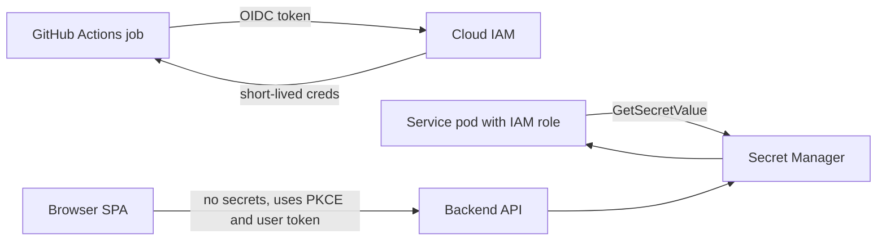

**Trade-offs:** Secret managers cost money and add a startup dependency (cache and handle outages). OIDC setup is more work than pasting a key into CI settings, but removes the biggest leak risk. Over-restrictive access slows incident response; use break-glass procedures with audit.

**What interviewers listen for:**
- "No secrets in the frontend" stated clearly, with PKCE as the reason SPAs do not need one.
- OIDC federation for CI, runtime retrieval for services, rotation after leaks.
- Secret scanning.
- Red flag: `.env.production` committed with a payment provider key and `VITE_` prefix.

## 3. Releasing Safely

#### Q: [Senior] Compare rolling, blue/green and canary deployments. Which would you use for the payments API and which for the web app?

**Short answer:** Rolling replaces instances gradually and is the default on Kubernetes. Blue/green runs two full environments and switches traffic at once, giving instant rollback by switching back. Canary sends a small percentage of real traffic to the new version, watches metrics, and increases gradually, which limits blast radius. For a payments API I want canary with automated metric checks. For a static web app, the "deploy" is swapping `index.html`, so it is essentially blue/green, and I use feature flags for gradual exposure of risky features.

**Clarify first:** What is the blast radius of a bad release? Can two versions run side by side (API and DB compatibility)? Do you have per-version metrics?

**Solution:**

| Strategy | How | Rollback | Cost | Risk |
|---|---|---|---|---|
| Recreate | Stop old, start new | Redeploy old | Low | Downtime |
| Rolling | Replace pods a few at a time | Roll forward or back gradually | Low | Mixed versions during rollout |
| Blue/green | Two environments, switch router | Instant switch back | 2x capacity during deploy | All users hit at once |
| Canary | 1% then 10% then 50% then 100% | Shift traffic back | Needs traffic splitting and metrics | Small blast radius |

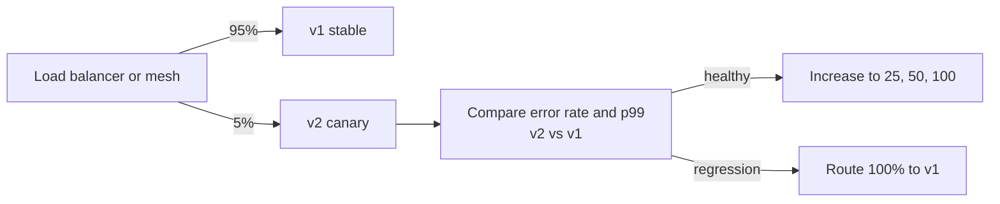

Kubernetes rolling update settings:

```yaml
spec:
  replicas: 6
  strategy:
    type: RollingUpdate
    rollingUpdate:
      maxSurge: 1        # at most 1 extra pod during rollout
      maxUnavailable: 0  # never drop below 6 ready pods
```

Readiness probes decide when a new pod gets traffic, so a pod that fails to start never receives requests.

Canary tooling: Argo Rollouts or Flagger on Kubernetes, weighted target groups on AWS load balancers, or CodeDeploy for ECS/Lambda. The important part is automated analysis: compare the canary's error rate and latency to the baseline and abort automatically.

Web app specifics:
- Static assets are versioned by hash, so "both versions at once" is natural; the switch is the new `index.html`.
- You can canary at the CDN edge (route a percentage of users to the new `index.html` with a sticky cookie), but feature flags are usually simpler and more targeted.
- Watch frontend metrics after a release: JS error rate (Sentry, Datadog RUM), Core Web Vitals, API error rate from the browser.

**Trade-offs:** Canary needs good per-version metrics and enough traffic for statistics; at 3 a.m. with 10 users, 5% is meaningless. Blue/green doubles infrastructure during the switch and does not limit blast radius. Every strategy that runs two versions together requires backward-compatible APIs and DB schemas.

**What interviewers listen for:**
- Matching the strategy to risk and traffic.
- Automated canary analysis, not "someone watches a dashboard."
- Version compatibility (expand/contract migrations, API versioning) as the hidden requirement.

#### Q: [Senior] How do you use feature flags safely in a React app? What goes wrong with them over time?

**Short answer:** Feature flags separate deploy from release: code ships dark, and you turn it on for internal users, then a percentage, then everyone, without a deploy. Evaluate flags in one place, give them owners and expiry dates, default to the safe value if the flag service is down, and delete them after rollout. The usual failure is flag debt: hundreds of stale flags, untested combinations and confusing code.

**Clarify first:** What kinds of flags: release toggles (temporary), experiments, ops kill switches (long-lived), entitlements (per-plan, really config)? Server-side or client-side evaluation? Which vendor or in-house?

**Solution:**

A typed wrapper so the rest of the app never talks to the vendor SDK directly:

```ts
// flags.ts
export type FlagKey = 'newTransfersFlow' | 'portfolioChartV2' | 'disableCardFreeze';

const defaults: Record<FlagKey, boolean> = {
  newTransfersFlow: false,
  portfolioChartV2: false,
  disableCardFreeze: false, // kill switch: false = feature works normally
};

export interface FlagClient {
  isEnabled(key: FlagKey, fallback: boolean): boolean;
}
```

```tsx
// FlagsProvider.tsx
import { createContext, useContext } from 'react';
import { type FlagClient, type FlagKey, defaults } from './flags';

const FlagsContext = createContext<FlagClient | null>(null);

export const FlagsProvider = FlagsContext.Provider;

export function useFlag(key: FlagKey): boolean {
  const client = useContext(FlagsContext);
  // If the provider is missing or the service is down, fall back to the safe default.
  return client ? client.isEnabled(key, defaults[key]) : defaults[key];
}
```

(Export `defaults` from `flags.ts` for this to compile.)

```tsx
function TransfersPage() {
  const newFlow = useFlag('newTransfersFlow');
  return newFlow ? <TransfersV2 /> : <TransfersV1 />;
}
```

Good practices:
- Use OpenFeature (a vendor-neutral standard with SDKs for web and Node) or a thin wrapper like above so you can switch vendors.
- Evaluate on the server for anything security-relevant. A client-side flag only hides UI; the API must enforce access too.
- Avoid flicker: bootstrap flag values with the initial page or config load, so the UI does not render v1 then jump to v2.
- Target by stable user ID for percentage rollouts so a user does not flip between versions.
- Each flag has an owner, a ticket to remove it, and an expiry. A lint rule or dashboard lists stale flags.
- Test both paths of active flags in CI (at least the critical ones).
- Log flag evaluations with errors so you can tell whether a bug only happens with the flag on.

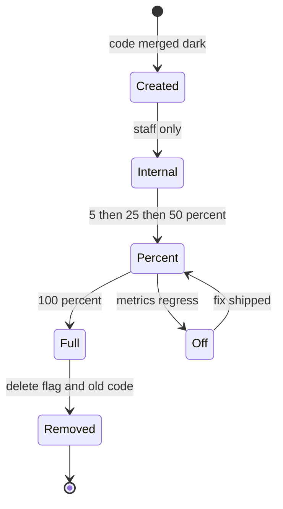

**Trade-offs:** Flags add branches and testing surface. Vendor SDKs add bundle weight and a network dependency. Long-lived ops flags (kill switches) are valuable but should be few and documented.

**What interviewers listen for:**
- Deploy vs release distinction.
- Safe defaults, server-side enforcement, no flicker, cleanup process.
- Red flag: using client-side flags to hide features from users who are not allowed to use them, with no server check.

#### Q: [Staff] A release went out 20 minutes ago. Payment submissions are failing for 8% of users. Walk me through your rollback strategy, including the cases where rollback is not simple.

**Short answer:** First mitigate, then investigate. If a feature flag guards the change, turn it off. Otherwise roll back to the previous known-good artifact, which should be one command because we keep previous builds and deploy immutable artifacts. Rollback gets hard when the release included a database migration, a changed API contract, or data written in a new format, which is why migrations are expand/contract and backward-compatible, so the previous app version still works on the new schema.

**Clarify first:** What changed in this release (app code only, migration, config, dependency)? Is the failure in the frontend, the API or a third party that coincidentally broke? Are failed payments retried safely (idempotency), or could rollback cause duplicates?

**Diagnose (in parallel with mitigation, minutes not hours):**
- Correlate the error spike with the deploy time on the dashboard (release markers).
- Filter errors by release version and by endpoint.
- Check whether 8% maps to something: a browser, a region, a feature flag cohort, a card type.

**Solution:**

Decision flow:

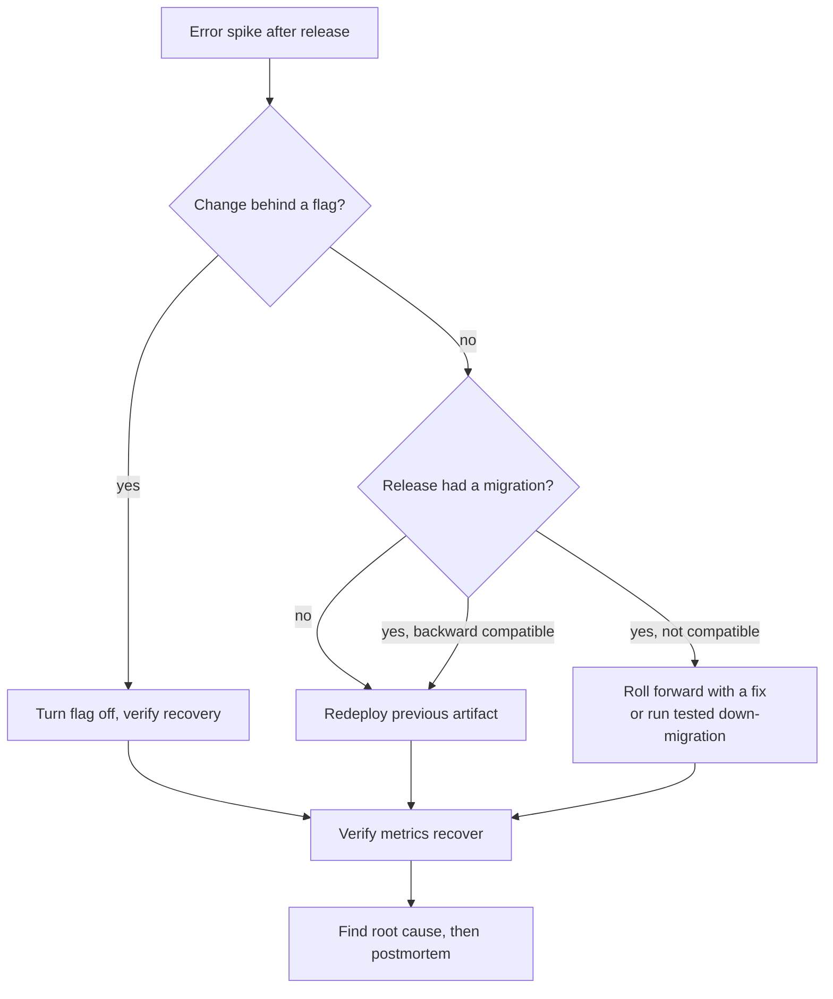

Make rollback boring ahead of time:
- Immutable, versioned artifacts (container image tag or `dist/` per release). Rollback = point to the previous version; no rebuild.
- For static sites: keep previous releases in versioned folders (`/releases/2026.10.02-3f9c2ab/`) and switch which `index.html` is served.
- Database: expand/contract. A release only adds columns or tables; dropping or renaming happens in a later release once nothing reads the old shape. Then any app version from the last two releases works with the current schema.
- API contracts: additive changes only; old clients (including browser tabs open for days) must keep working.
- Data written by the new version: if v2 writes a new enum value, v1 must not crash on it. Make readers tolerant of unknown values.
- Practice rollbacks; a rollback path never exercised is a guess.

Payment-specific concerns:
- Failed submissions should not have charged anyone. Check the payment provider dashboard and reconcile.
- Users who retry after rollback must not be double charged: idempotency keys on payment creation.
- Communicate: status page, support team, and possibly notify affected users.

Roll forward vs roll back: roll forward (ship a fix) when the fix is tiny, well understood and the pipeline is fast, or when rollback is unsafe due to data changes. Otherwise roll back first and debug calmly.

**Trade-offs:** Expand/contract makes every schema change take two or more releases. Keeping old versions around costs storage. Flags for every change add complexity; use them for risky changes.

**What interviewers listen for:**
- Mitigate first, root cause later.
- Concrete prerequisites that make rollback safe: immutable artifacts, backward-compatible migrations and APIs.
- Recognizing data and side effects (charges, emails) that a rollback does not undo.
- Red flag: "we revert the commit and wait for the 30-minute pipeline" as the only option.

## 4. Monitoring, Incidents and Infrastructure

#### Q: [Senior] Our on-call engineer gets 60 alerts a week and ignores most of them. Last month a real outage of the transfers API went unnoticed for 40 minutes. What should we alert on, and how do you fix alert fatigue?

**Short answer:** Alert on symptoms users feel, not on every cause. Page a human only when users are hurt now or soon will be: error rate, latency and availability of key user journeys, measured against SLOs. Everything else (high CPU, one pod restarting, a disk at 70%) goes to a dashboard or a ticket, not a page. Then prune: every page must be actionable, and any alert that fired without needing action gets fixed or deleted.

**Clarify first:** Which journeys matter most (login, view balance, submit transfer)? Do we have SLOs, or only infrastructure metrics? Who is on call, and what is the expected response time? What did the 40-minute outage look like in metrics: was there a signal we simply did not alert on, or was it buried in noise?

**Diagnose:**
- Export last quarter's alerts. For each, record: did it page, did anyone act, was it a real user impact? Most teams find a handful of alerts produce most of the noise.
- For the missed outage, find the first metric that moved (for example 5xx rate on `POST /transfers`). That is the alert you were missing.
- Check for duplicate alerts: one database blip often triggers ten alerts from ten services.

**Solution:**

Pick signals per service. The "golden signals" are latency, traffic, errors and saturation. For user-facing paths, define SLIs and SLOs:

| Journey | SLI | SLO |
|---|---|---|
| Submit transfer | Share of `POST /transfers` returning non-5xx within 2s | 99.9% over 30 days |
| Dashboard load | Share of page loads with LCP under 2.5s (RUM) | 95% over 30 days |
| Login | Share of Okta callback flows that complete | 99.5% over 30 days |

Alert on burn rate, not on single spikes. A burn rate says how fast you are using up the error budget. A common pattern is multi-window: page when the budget burns fast over both a long and a short window, which filters out one-minute blips but still catches real incidents quickly.

```yaml
# Prometheus-style rule (illustrative). Error ratio for transfers over two windows.
- alert: TransfersErrorBudgetFastBurn
  expr: |
    (
      sum(rate(http_requests_total{route="/transfers",code=~"5.."}[1h]))
      / sum(rate(http_requests_total{route="/transfers"}[1h]))
    ) > (14.4 * 0.001)
    and
    (
      sum(rate(http_requests_total{route="/transfers",code=~"5.."}[5m]))
      / sum(rate(http_requests_total{route="/transfers"}[5m]))
    ) > (14.4 * 0.001)
  labels:
    severity: page
  annotations:
    summary: "Transfers failing above SLO burn rate"
    runbook: "https://runbooks.example.com/transfers-errors"
```

Three tiers of response:
- **Page:** user impact now. Must have a runbook link. Wakes someone up.
- **Ticket:** needs action this week (certificate expires in 14 days, disk trending to full in 5 days).
- **Dashboard only:** useful when debugging, no action on its own.

Add synthetic checks for critical journeys so you get a signal even at 3am when real traffic is low: a scripted login and a read-only balance check every minute from two regions.

Alert hygiene process:
- Weekly on-call handoff reviews every page: actionable or not.
- Group and deduplicate related alerts (Alertmanager grouping, PagerDuty event rules).
- Every alert has an owner. No owner means delete.

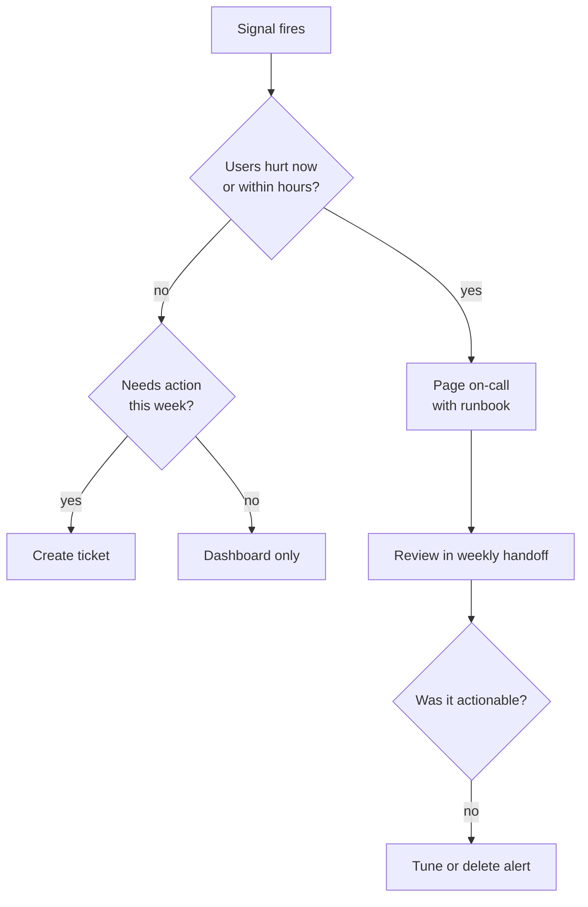

**Trade-offs:** Symptom-based alerts catch outages but tell you less about the cause, so you still need good dashboards and traces. Burn-rate alerts are slower to fire on tiny incidents by design. Synthetic checks cost money and need maintenance when the UI changes.

**What interviewers listen for:**
- "Alert on symptoms, investigate with causes."
- SLOs and error budgets, and that every page is actionable with a runbook.
- A process for pruning alerts, not just adding more.
- Red flag: answering the missed outage with "add more alerts" while the existing ones are already ignored.

> **Interview tip:** Mention the frontend too. A backend can be green while the SPA throws on load. RUM error rate and a synthetic login check catch that.

#### Q: [Senior] A production incident is happening right now: users cannot log in. Five engineers jump into the same Slack channel and all start changing things. How should incident response work, and what happens afterwards?

**Short answer:** Name an incident commander immediately. The commander coordinates and does not debug. Other roles: one or more people investigating and fixing, one person handling communication (status page, support, stakeholders), and someone keeping a timeline. Changes to production are announced in the channel before they are made. After the incident, write a blameless postmortem that focuses on how the system and process allowed the failure, with owned action items.

**Clarify first:** What is our severity scale, and what makes this a SEV1? Do we have a status page and a support escalation path? Is there a regulatory reporting requirement for outages (common in finance)?

**Diagnose:** The commander's first questions: What is the impact (all users, one region, one IdP)? When did it start? What changed around then (deploys, config, certificate rotation, third-party status pages like Okta's)? Who is working on what?

**Solution:**

Roles:

| Role | Does | Does not |
|---|---|---|
| Incident commander | Sets priorities, assigns work, decides on mitigations, calls for help | Debug in a terminal |
| Operations / responders | Investigate, propose and apply changes | Change prod without announcing it |
| Communications lead | Status page, support, leadership updates on a fixed cadence | Speculate about root cause publicly |
| Scribe | Timeline with timestamps of findings and actions | |

On a small team, one person may hold two roles, but the commander should still not be the main debugger.

Flow:

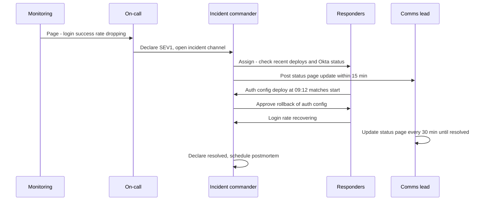

Rules during the incident:
- Mitigate first: rollback, flag off, failover. Root cause can wait.
- One change at a time, announced: "I am rolling back auth-config to v41 now."
- Regular updates even if nothing changed: "Still investigating, next update 10:30."

Blameless postmortem, within a few days:
- Summary, impact (users affected, duration, money or transactions affected), timeline.
- Contributing factors. Ask "why did the system allow this?" not "who did this?". Usually there are several: a config change without validation, no canary for config, an alert that fired late.
- What went well, what went badly, where we got lucky.
- Action items with owners and due dates, tracked like normal work. Prefer fixes that remove a class of problem (validate config in CI) over "be more careful".

**Trade-offs:** Formal roles feel heavy for small incidents; use severity levels so a SEV3 is just a ticket. Postmortems take time; skip them for low severity but always do them for user-facing outages.

**What interviewers listen for:**
- The commander coordinates and does not debug.
- Mitigate before root cause, and announce changes.
- Communication cadence to users and support.
- Blameless means focusing on systems, not that nobody is accountable for action items.
- Red flag: "we find who pushed the bad change."

> **Finance tip:** Regulated firms may have to report significant outages to regulators or clients within a fixed time. Know who decides that and include them in the comms plan.

#### Q: [Mid] What is infrastructure as code? Show a small Terraform example and explain how a team works with it safely.

**Short answer:** Infrastructure as code means describing servers, buckets, CDNs, DNS and permissions in versioned files instead of clicking in a console. Terraform reads those files, compares them with its recorded state and the real cloud, and produces a plan of changes. The team reviews the plan in a PR and applies it from CI, so every infra change is reviewed, repeatable and reversible.

**Clarify first:** Which cloud? Is there existing infra created by hand that needs importing? Where is Terraform state stored, and who can apply to production?

**Solution:**

A static site bucket plus a CDN, simplified (AWS provider; check attribute names against the provider version you use):

```hcl
terraform {
  required_providers {
    aws = { source = "hashicorp/aws", version = "~> 5.0" }
  }
  backend "s3" {
    bucket         = "acme-terraform-state"
    key            = "web/prod.tfstate"
    region         = "eu-west-1"
    dynamodb_table = "terraform-locks" # state locking
    encrypt        = true
  }
}

variable "env" {
  type = string
}

resource "aws_s3_bucket" "web" {
  bucket = "acme-web-${var.env}"
}

resource "aws_s3_bucket_public_access_block" "web" {
  bucket                  = aws_s3_bucket.web.id
  block_public_acls       = true
  block_public_policy     = true
  ignore_public_acls      = true
  restrict_public_buckets = true
}

output "bucket_name" {
  value = aws_s3_bucket.web.bucket
}
```

The CDN distribution would point at the bucket with origin access control, so only the CDN can read it.

Core ideas:
- **State:** Terraform's record of what it manages. Store it remotely with locking (S3 plus a lock table, Terraform Cloud, GCS). Never commit it: it can contain secrets.
- **Plan and apply:** `terraform plan` shows the diff; `terraform apply` executes it. Apply the exact plan that was reviewed.
- **Modules:** reusable building blocks (for example a `static-site` module used by staging and prod with different variables).
- **Environments:** separate state per environment (separate directories or workspaces), so a staging change cannot touch prod.
- **Drift:** someone changed something by hand. A scheduled `terraform plan` in CI detects it.

Workflow:

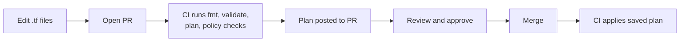

Tools like Atlantis or Terraform Cloud automate this. Policy checks (OPA/Conftest, Checkov, tfsec-style scanners) catch things like public buckets before apply.

**Trade-offs:** IaC is slower for a one-off experiment than clicking. Terraform state is a sensitive, shared resource that can be corrupted if two applies race (hence locking). Alternatives: Pulumi or AWS CDK let you write infra in TypeScript, which frontend teams may like; CloudFormation is AWS-native. OpenTofu is the open-source fork of Terraform after the 2023 licence change.

**What interviewers listen for:**
- Plan reviewed in a PR, applied from CI, not from laptops.
- Remote state with locking, separate state per environment.
- Awareness of drift and of `destroy` risks (use `prevent_destroy` lifecycle on critical resources).
- Red flag: "I make changes in the console and update the Terraform later."

> **Gotcha:** Renaming a resource in Terraform can mean destroy-and-recreate. Read the plan. Use a `moved` block to tell Terraform it is the same resource.

#### Q: [Mid] Our backend runs on Kubernetes. As a frontend-leaning engineer, explain pods, deployments, services, ingress and autoscaling well enough to debug "the API is returning 503".

**Short answer:** A pod is one or more containers running together; it is the unit that gets scheduled and it is disposable. A deployment keeps a desired number of identical pods running and rolls out new versions. A service gives those pods one stable internal address and load-balances across the ready ones. An ingress (or the newer Gateway API) routes external HTTP traffic to services by host and path. A Horizontal Pod Autoscaler (HPA) changes the number of replicas based on metrics like CPU. A 503 often means the service has no ready pods behind it.

**Clarify first:** Is the 503 from the ingress/load balancer or from the app? All requests or some? Did it start with a deploy or a traffic spike?

**Diagnose:**

```bash
kubectl get pods -n payments -l app=transfers-api        # Running? Ready 0/1? CrashLoopBackOff?
kubectl describe pod <pod> -n payments                    # events: OOMKilled, failed probes, image pull errors
kubectl logs <pod> -n payments --previous                 # logs from the crashed container
kubectl get endpoints transfers-api -n payments           # empty = no ready pods behind the service
kubectl rollout status deployment/transfers-api -n payments
kubectl get hpa -n payments                               # at max replicas?
```

Common causes of a 503:
- **Readiness probe failing:** pods run but are not marked ready, so the service has no endpoints. Often the app's `/ready` checks a dependency that is down.
- **CrashLoopBackOff:** bad config, missing secret, or app crashes on start.
- **OOMKilled:** memory limit too low.
- **Bad rollout:** new pods never become ready. With a sensible rolling update strategy, old pods stay up; with a bad one, capacity drops.
- **HPA at max:** traffic grew beyond the max replicas; pods are saturated.

**Solution:** The concepts in a picture:

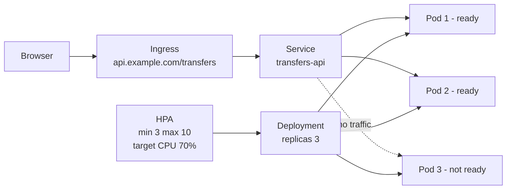

A minimal deployment with probes and resources:

```yaml
apiVersion: apps/v1
kind: Deployment
metadata:
  name: transfers-api
spec:
  replicas: 3
  selector:
    matchLabels: { app: transfers-api }
  template:
    metadata:
      labels: { app: transfers-api }
    spec:
      containers:
        - name: api
          image: registry.example.com/transfers-api:2026.10.02-3f9c2ab
          ports: [{ containerPort: 8080 }]
          readinessProbe:
            httpGet: { path: /ready, port: 8080 }
            periodSeconds: 5
          livenessProbe:
            httpGet: { path: /live, port: 8080 }
            periodSeconds: 10
          resources:
            requests: { cpu: "250m", memory: "256Mi" }
            limits: { memory: "512Mi" }
```

Readiness means "send me traffic". Liveness means "restart me if this fails". Keep liveness simple (is the process alive), or a downstream outage will restart every pod in a loop.

Other terms you may hear: ConfigMap and Secret (configuration injected as env vars or files), namespace (a logical partition), node (a machine running pods), PodDisruptionBudget (how many pods can be down during maintenance).

**Trade-offs:** Kubernetes gives self-healing, rolling deploys and autoscaling, but it is a lot of operational complexity. For a static React app it is usually overkill: object storage plus a CDN is simpler and cheaper. For a few small services, managed platforms (Cloud Run, ECS Fargate, App Service) are often enough.

**What interviewers listen for:**
- Correct one-line definitions and how they connect.
- Readiness vs liveness, and why a liveness probe should not check dependencies.
- A systematic `kubectl` debugging order.
- Knowing when Kubernetes is not worth it.

#### Q: [Staff] Finance asks why our cloud bill went up 40% in six months. You own the web platform. How do you find where the money goes and reduce it without hurting reliability?

**Short answer:** First make cost visible: tag every resource by team, service and environment, and look at the bill broken down by those tags. Then attack the biggest items in order. The usual culprits are idle non-production environments, oversized compute, data transfer and CDN egress, log and metrics volume, and forgotten resources. Make cost a metric teams see every week, not a surprise once a quarter.

**Clarify first:** Did traffic or users also grow 40%? Then cost per user may be flat, which is a different conversation. Which line items grew? Are there commitments (reserved instances, savings plans) already in place? What are the reliability requirements we must not trade away?

**Diagnose:**
- Use the cloud's cost explorer grouped by service, then by tag. Untagged spend is itself a finding.
- Compare month-over-month per service. Look for step changes and link them to events (a new preview environment per PR, a logging change, a new region).
- Look at unit cost: cost per 1,000 active users, or per transaction. This tells you whether efficiency got worse.

**Solution:** Common wins, roughly from easiest:

| Area | Typical waste | Fix |
|---|---|---|
| Preview and dev environments | Run 24/7, never torn down | Auto-delete on PR close, scale to zero at night and weekends |
| Compute | Requests and instance sizes set once and never revisited | Right-size from real usage, autoscale, use spot for CI runners and batch jobs |
| Logs and metrics | Debug logs in production, high-cardinality metrics (user ID as a label) | Log levels, sampling, shorter retention, drop noisy fields |
| Data transfer | Cross-region or cross-AZ traffic, serving large assets uncompressed | Keep chatty services in one zone where safe, compress, cache at the CDN |
| CDN and frontend | Low cache hit ratio, large bundles, unoptimized images | Correct cache headers, image formats like AVIF or WebP, smaller bundles |
| Storage | Old build artifacts, snapshots, unattached volumes | Lifecycle rules, scheduled cleanup |
| Commitments | All on-demand pricing for steady load | Savings plans or reserved capacity for the baseline |

Make it stick:
- Tagging policy enforced in Terraform (fail the plan if tags are missing).
- Budgets and anomaly alerts per team.
- A cost line in the weekly service review, next to latency and errors.
- Cost estimates on infra PRs (tools such as Infracost show the monthly delta from a Terraform plan).

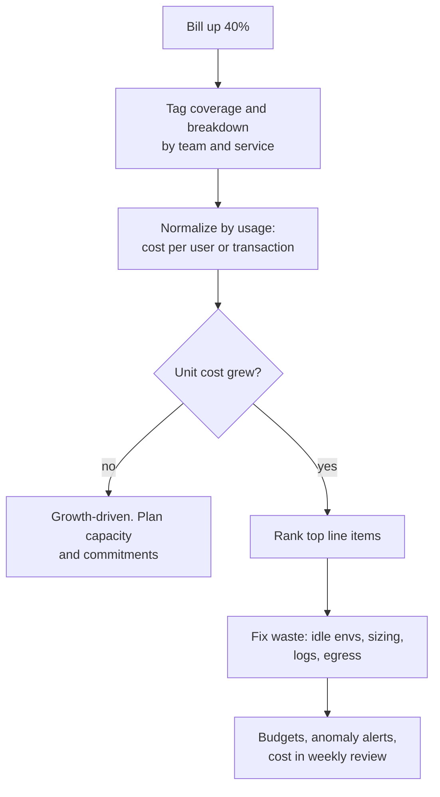

**Trade-offs:** Spot instances can be reclaimed, so use them only for interruptible work. Commitments save money but lock you in for one to three years. Cutting log retention saves money but can conflict with audit requirements, which in finance are often strict. Removing redundancy (fewer zones, fewer replicas) saves money and directly costs reliability; do it only with eyes open.

**What interviewers listen for:**
- Measure before cutting, and normalize by usage.
- Concrete, ranked levers rather than "use smaller servers".
- Guarding reliability and compliance while cutting.
- Making cost an ongoing, owned metric.
- Red flag: cutting replicas of the payments service to save money.

> **Finance tip:** Audit and transaction logs often have legally required retention. Reduce debug and access log volume, not the audit trail.
