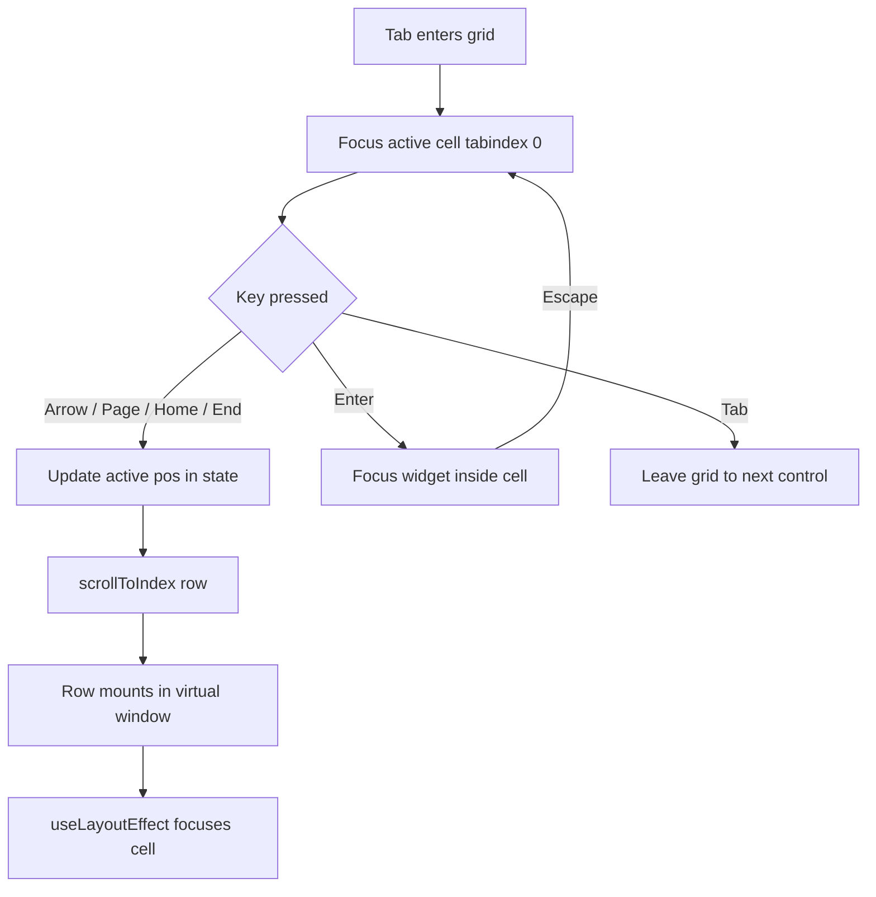
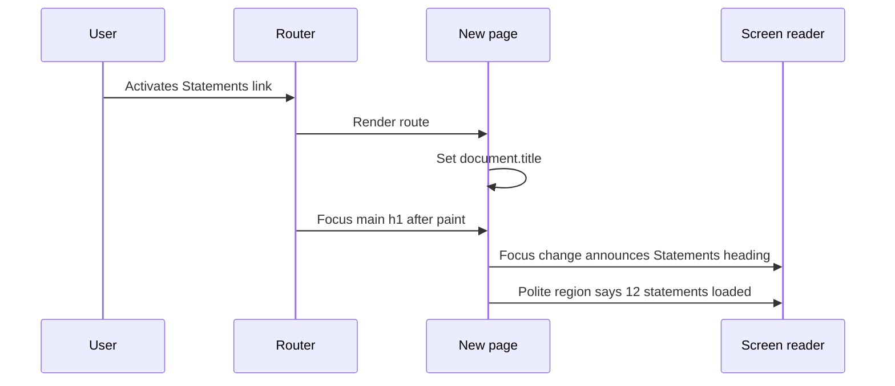
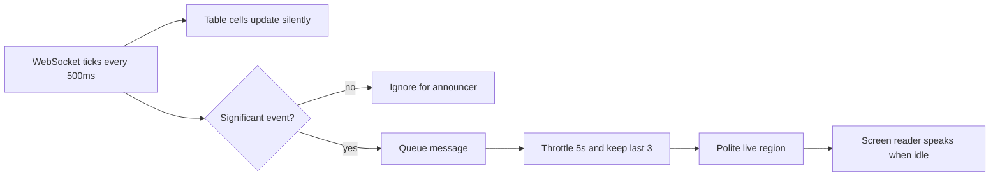
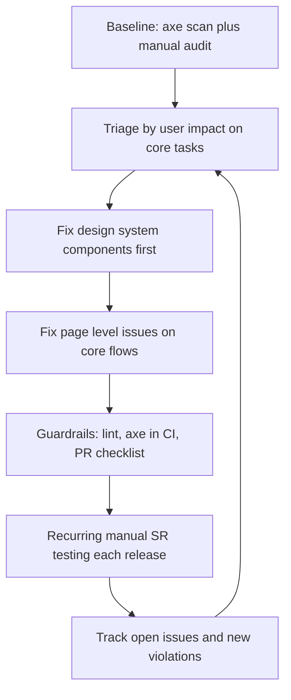
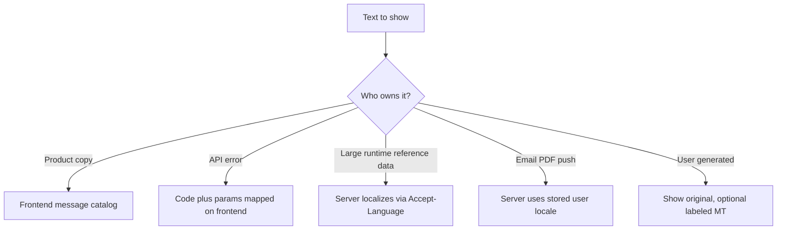
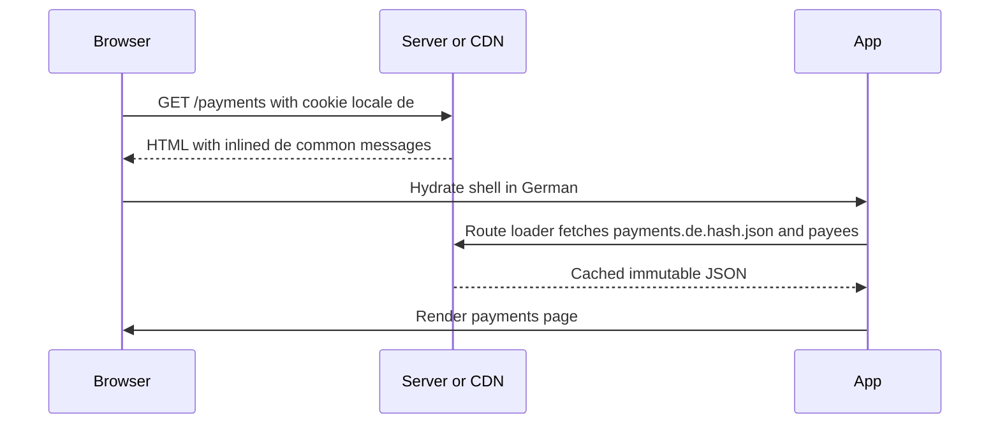
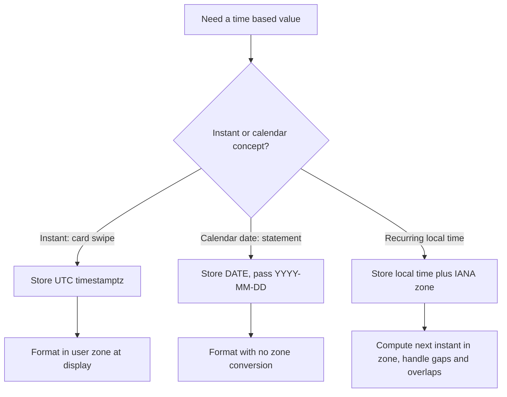
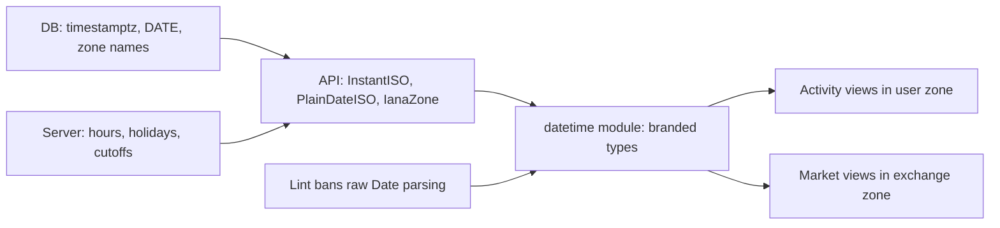

## 1. Keyboard Navigation and Focus

#### Q: [Senior] Our transactions grid shows 50k rows with virtualization. A keyboard user reports they cannot move between cells, and the screen reader says "row 12 of 40". How would you make it accessible?

**Short answer:** Implement the ARIA grid pattern: one tab stop into the grid, arrow keys move between cells using a roving tabindex, and every row carries `aria-rowindex` while the grid carries `aria-rowcount` set to the real total. With virtualization the DOM only holds about 40 rows, so without those attributes the screen reader counts what it sees, which is exactly the "row 12 of 40" bug.

**Clarify first:**
- Is it a read-only table or an interactive grid (editable cells, row actions, selection)? A read-only table with no in-cell widgets can stay a plain `<table>` and needs far less work.
- Which actions live in cells: links, checkboxes, menus? These decide how Enter and Tab behave inside a cell.
- Is the total count known up front (server returns `total`) or is it infinite scroll with an unknown end?
- Which screen readers must we support? NVDA and JAWS on Windows, VoiceOver on macOS cover most enterprise users.

**Diagnose:**
1. Unplug the mouse. Press Tab from the address bar and count how many stops it takes to get past the grid. If every row has a button, 50k rows means hundreds of tab stops in the rendered window alone.
2. Open the Accessibility pane in Chrome DevTools (Elements panel, Accessibility tab) on a row. Check the computed role and whether `aria-rowindex` exists.
3. Run axe DevTools on the page. It catches missing roles and invalid ARIA parents, but it cannot judge whether keyboard behavior is right.
4. Test with NVDA plus Chrome: enter the grid, press arrow keys, listen for row and column position.

**Solution:**

Option 1, the simplest: if the grid is read-only, use a semantic `<table>` and let the screen reader's own table navigation work (Ctrl+Alt+arrows in NVDA, VO+arrows in VoiceOver). Only add `aria-rowcount` and `aria-rowindex` for virtualization.

Option 2, interactive grid with roving tabindex. Exactly one cell has `tabIndex={0}`; all others have `tabIndex={-1}`. Arrow keys move the active cell and call `.focus()` on it.

```tsx
type Pos = { row: number; col: number }; // row is the data index, 0-based

function TransactionsGrid({ rows, columns, totalCount }: Props) {
  const [active, setActive] = useState<Pos>({ row: 0, col: 0 });
  const parentRef = useRef<HTMLDivElement>(null);
  const virtualizer = useVirtualizer({
    count: rows.length,
    getScrollElement: () => parentRef.current,
    estimateSize: () => 36,
  });
  const pendingFocus = useRef(false);

  function move(next: Pos) {
    const row = Math.max(0, Math.min(rows.length - 1, next.row));
    const col = Math.max(0, Math.min(columns.length - 1, next.col));
    pendingFocus.current = true;
    setActive({ row, col });
    virtualizer.scrollToIndex(row, { align: "auto" });
  }

  function onKeyDown(e: React.KeyboardEvent) {
    const page = 10;
    const map: Record<string, Pos> = {
      ArrowDown: { row: active.row + 1, col: active.col },
      ArrowUp: { row: active.row - 1, col: active.col },
      ArrowRight: { row: active.row, col: active.col + 1 },
      ArrowLeft: { row: active.row, col: active.col - 1 },
      PageDown: { row: active.row + page, col: active.col },
      PageUp: { row: active.row - page, col: active.col },
      Home: e.ctrlKey ? { row: 0, col: 0 } : { row: active.row, col: 0 },
      End: e.ctrlKey
        ? { row: rows.length - 1, col: columns.length - 1 }
        : { row: active.row, col: columns.length - 1 },
    };
    const next = map[e.key];
    if (next) {
      e.preventDefault(); // stop the page from scrolling
      move(next);
    }
  }

  // After the virtualizer renders the target row, focus the cell.
  useLayoutEffect(() => {
    if (!pendingFocus.current) return;
    const el = parentRef.current?.querySelector<HTMLElement>(
      `[data-cell="${active.row}-${active.col}"]`
    );
    if (el) {
      el.focus({ preventScroll: true });
      pendingFocus.current = false;
    }
  });

  return (
    <div
      ref={parentRef}
      role="grid"
      aria-label="Transactions"
      aria-rowcount={totalCount + 1 /* + header row */}
      aria-colcount={columns.length}
      onKeyDown={onKeyDown}
      style={{ height: 600, overflow: "auto" }}
    >
      <div role="row" aria-rowindex={1}>
        {columns.map((c, ci) => (
          <div role="columnheader" aria-colindex={ci + 1} key={c.id}>
            {c.label}
          </div>
        ))}
      </div>
      <div style={{ height: virtualizer.getTotalSize(), position: "relative" }}>
        {virtualizer.getVirtualItems().map((v) => (
          <div
            role="row"
            key={v.key}
            aria-rowindex={v.index + 2 /* 1-based, header is 1 */}
            style={{ position: "absolute", top: 0, transform: `translateY(${v.start}px)` }}
          >
            {columns.map((c, ci) => {
              const isActive = active.row === v.index && active.col === ci;
              return (
                <div
                  role="gridcell"
                  key={c.id}
                  aria-colindex={ci + 1}
                  data-cell={`${v.index}-${ci}`}
                  tabIndex={isActive ? 0 : -1}
                  onClick={() => setActive({ row: v.index, col: ci })}
                >
                  {c.render(rows[v.index])}
                </div>
              );
            })}
          </div>
        ))}
      </div>
    </div>
  );
}
```

Key details:
- `aria-rowindex` is 1-based and counts the header row. If the total is unknown, set `aria-rowcount={-1}`.
- The active position lives in React state, not in the DOM. When the focused row scrolls out of the window it unmounts, and focus would fall to `<body>`. Keeping the position in state lets you restore focus when the row comes back.
- Widgets inside cells (a "Dispute" button) get `tabIndex={-1}` too. Pressing Enter on the cell moves focus into the widget; Escape returns to the cell. That keeps the grid as one tab stop.

Option 3, `aria-activedescendant`: focus stays on the grid container, and the container points at the active cell's id. It avoids moving DOM focus, which helps with virtualization, but screen reader support for activedescendant in grids is less consistent than roving tabindex. Test before choosing it.

Option 4: use a library that already implements the pattern (AG Grid, React Aria's `useGrid`/table hooks, MUI X Data Grid). TanStack Table is headless, so you still own the keyboard model.



**Trade-offs:**
- Roving tabindex is reliable with screen readers but needs the focus-restore dance with virtualization.
- `aria-activedescendant` is simpler with virtualization but has weaker support in some screen reader and browser pairs.
- A full grid pattern is real work. If users only read rows and click one action, a `<table>` with one link per row plus good filters may serve them better.
- Ctrl+F (find in page) does not see virtualized rows. Offer a search box that filters the data.

**What interviewers listen for:**
- You know virtualization breaks the screen reader's sense of position and fix it with `aria-rowcount`/`aria-rowindex`.
- One tab stop for the whole grid, not one per cell or per row button.
- You keep focus position in state so it survives unmounting.
- You ask whether a grid is needed at all, or whether a table would do.
- Red flag: "add `tabIndex={0}` to every cell" or "add `role="grid"`" with no keyboard handling. ARIA roles promise behavior; they do not provide it.

> **Gotcha:** `role="grid"` switches NVDA and JAWS into focus mode, so their own table shortcuts stop working. If you add the role, you must implement the arrow keys yourself.

#### Q: [Mid] How do you handle focus when a "Confirm payment" modal opens and closes?

**Short answer:** On open, move focus into the dialog (to the first useful control or the heading). While open, keep Tab inside it and make the background inert. On close, return focus to the button that opened it. The native `<dialog>` element with `showModal()` gives you most of this for free.

**Clarify first:**
- Is it a true modal (blocks the page) or a non-modal panel? Only modals trap focus.
- What should get focus first? For a destructive action like "Send $5,000", focus Cancel or the heading, not Confirm, so an accidental Enter does not send money.
- Can it be dismissed with Escape, or must the user choose?

**Diagnose:** Open the modal by keyboard. Check `document.activeElement` in the console. Press Tab 20 times: does focus escape to the page behind? Close it: where is focus now? If it is `<body>`, a keyboard user must start again from the top of the page.

**Solution:**

Option 1, native `<dialog>`:

```tsx
function ConfirmPaymentDialog({ open, onClose, amount }: Props) {
  const ref = useRef<HTMLDialogElement>(null);

  useEffect(() => {
    const dialog = ref.current;
    if (!dialog) return;
    if (open && !dialog.open) dialog.showModal();
    if (!open && dialog.open) dialog.close();
  }, [open]);

  return (
    <dialog
      ref={ref}
      aria-labelledby="confirm-title"
      onClose={onClose} // fires on Escape and on dialog.close()
    >
      <h2 id="confirm-title" tabIndex={-1}>Confirm payment</h2>
      <p>Send {amount} to Acme Corp?</p>
      <button autoFocus onClick={onClose}>Cancel</button>
      <button onClick={handleConfirm}>Send payment</button>
    </dialog>
  );
}
```

`showModal()` makes the rest of the page inert, renders in the top layer (no z-index fights), and closes on Escape. Current browsers restore focus to the previously focused element on close, but verify this in the browsers you support; restoring it yourself is cheap insurance.

Option 2, a custom modal (when design needs it): render in a portal, set the `inert` attribute on the app root, trap Tab, and restore focus manually.

```tsx
useEffect(() => {
  if (!open) return;
  const opener = document.activeElement as HTMLElement | null;
  const appRoot = document.getElementById("root")!;
  appRoot.inert = true;
  firstFocusableRef.current?.focus();
  return () => {
    appRoot.inert = false;
    opener?.focus(); // return focus to the trigger
  };
}, [open]);
```

`inert` removes the background from both the tab order and the accessibility tree, which is better than a JavaScript Tab trap alone, because screen reader virtual cursors ignore Tab traps.

Option 3: use a tested primitive (Radix Dialog, React Aria `useDialog`, Headless UI). They handle edge cases such as nested dialogs and scroll locking.

**Trade-offs:** Native `<dialog>` has the least code but styling the backdrop and animating close needs care. Libraries add bundle size but cover edge cases. Hand-rolled traps are where most bugs live.

**What interviewers listen for:**
- The three steps: move focus in, contain it, return it.
- Background made inert, not just visually covered.
- Safe default focus for destructive financial actions.
- Red flag: only an `aria-modal="true"` attribute with no focus handling.

> **Finance tip:** If the opener no longer exists after close (the "Delete payee" row is gone), send focus somewhere logical, such as the list heading or the next row. Never leave it on `<body>`.

#### Q: [Senior] After a client-side route change in our React SPA, screen reader users say "nothing happened". What is going on and how do you fix it?

**Short answer:** In a multi-page site, a full page load resets focus and the screen reader announces the new page title. A SPA swaps the DOM without either, so the user's focus stays on the link they clicked, which might not even exist anymore. Fix it by moving focus to the new page's main heading (or a skip target) and updating `document.title` on every navigation; optionally also announce the title through a live region.

**Clarify first:**
- Which router? Next.js includes a route announcer. React Router and TanStack Router leave this to you.
- Are some navigations "in-page" (changing a tab, a filter in the URL)? Those should not steal focus.
- Do we restore scroll position on Back? Focus and scroll should agree.

**Diagnose:** Use VoiceOver or NVDA, click a nav link, and listen. Check `document.activeElement` after navigation. Check that `document.title` changes per route; many SPAs leave it as "App" forever.

**Solution:**

```tsx
// RouteFocus.tsx, rendered once inside the router
import { useLocation } from "react-router-dom";

export function RouteFocus() {
  const { pathname } = useLocation(); // pathname only: ignore ?sort= changes
  const first = useRef(true);

  useEffect(() => {
    if (first.current) { first.current = false; return; } // not on initial load
    // Wait a frame so the new route's DOM is painted.
    requestAnimationFrame(() => {
      const h1 = document.querySelector<HTMLElement>("main h1");
      if (h1) {
        h1.tabIndex = -1;       // focusable by script, not in tab order
        h1.focus();
      }
    });
  }, [pathname]);

  return null;
}

// In each page
function usePageTitle(title: string) {
  useEffect(() => { document.title = `${title} | Acme Wealth`; }, [title]);
}
```

Add `h1:focus { outline: none; }` only if your design team insists, and only for elements with `tabindex="-1"`. Interactive elements must keep a visible focus ring (WCAG 2.4.7).

For pages that load data after navigation, focus the heading immediately (it should render before data) and announce "Loading statements" via a polite live region, then the result.



**Trade-offs:** Focusing the heading is predictable and well supported. Focusing a "skip to content" link at the top instead lets users re-orient but adds a step. Announcing only via live region keeps focus where it was, which confuses keyboard users because their Tab position is now on an old element.

**What interviewers listen for:**
- You explain why: no page load means no focus reset and no title announcement.
- You distinguish route changes from in-page state changes.
- You mention `document.title`.
- Red flag: "screen readers handle SPAs automatically".

#### Q: [Senior] Design wants a custom account picker dropdown with search, icons and balances. How do you build it so it is accessible?

**Short answer:** First, push back gently: a native `<select>` is accessible by default and should be the choice unless we need search or rich options. If we do, implement the ARIA 1.2 combobox pattern (input with `role="combobox"`, a `listbox` popup, `aria-activedescendant` for the highlighted option), or better, use a library that already does: React Aria, Downshift, Headless UI, Radix, or the react-select we already have.

**Clarify first:**
- How many options? 8 accounts is a select; 2,000 payees needs search and maybe virtualization.
- Single or multi select? Free text allowed (combobox) or only listed values (select-only)?
- Must it work on mobile, where native pickers are much better?

**Diagnose:** For an existing custom dropdown, check: can you open it with Enter, Space, Alt+ArrowDown? Do arrow keys move a highlight that the screen reader reads? Does Escape close it and keep focus on the input? Is the selected value announced after choosing? Run axe and then test with VoiceOver on Safari, which is the strictest pairing for combobox.

**Solution:**

The minimal correct markup and behavior:

```tsx
function AccountCombobox({ accounts, value, onChange }: Props) {
  const [open, setOpen] = useState(false);
  const [query, setQuery] = useState("");
  const [highlight, setHighlight] = useState(0);
  const listId = useId();
  const filtered = accounts.filter((a) =>
    a.name.toLowerCase().includes(query.toLowerCase())
  );
  const optionId = (i: number) => `${listId}-opt-${i}`;

  function onKeyDown(e: React.KeyboardEvent<HTMLInputElement>) {
    if (e.key === "ArrowDown") {
      e.preventDefault();
      if (!open) setOpen(true);
      else setHighlight((h) => Math.min(h + 1, filtered.length - 1));
    } else if (e.key === "ArrowUp") {
      e.preventDefault();
      setHighlight((h) => Math.max(h - 1, 0));
    } else if (e.key === "Enter" && open && filtered[highlight]) {
      e.preventDefault();
      onChange(filtered[highlight].id);
      setQuery(filtered[highlight].name);
      setOpen(false);
    } else if (e.key === "Escape") {
      setOpen(false);
    }
  }

  return (
    <div>
      <label htmlFor={`${listId}-input`}>From account</label>
      <input
        id={`${listId}-input`}
        role="combobox"
        aria-expanded={open}
        aria-controls={listId}
        aria-autocomplete="list"
        aria-activedescendant={open && filtered[highlight] ? optionId(highlight) : undefined}
        value={query}
        onChange={(e) => { setQuery(e.target.value); setOpen(true); setHighlight(0); }}
        onKeyDown={onKeyDown}
        onBlur={() => setOpen(false)}
      />
      {open && (
        <ul role="listbox" id={listId} aria-label="Accounts">
          {filtered.map((a, i) => (
            <li
              key={a.id}
              id={optionId(i)}
              role="option"
              aria-selected={a.id === value}
              data-highlighted={i === highlight}
              onMouseDown={(e) => e.preventDefault()} // keep focus in input
              onClick={() => { onChange(a.id); setQuery(a.name); setOpen(false); }}
            >
              <span aria-hidden="true">{a.icon}</span>
              {a.name} <span>ending {a.last4}</span>{" "}
              <span>{formatMoney(a.balanceMinor, a.currency)}</span>
            </li>
          ))}
        </ul>
      )}
      <div role="status" className="sr-only">
        {open ? `${filtered.length} accounts found` : ""}
      </div>
    </div>
  );
}
```

That is around 70 lines and still misses: scrolling the highlighted option into view, Home/End, typeahead, mobile behavior, and the many bugs that come with `onBlur` timing. This is the argument for a library.

> **Outdated:** Older guidance used ARIA 1.1 where the wrapper `div` had `role="combobox"` and contained the textbox. ARIA 1.2 puts `role="combobox"` on the input itself. Copying old Stack Overflow answers gives you the 1.1 pattern.

Newer browsers are also adding a customizable native select (`appearance: base-select` in CSS, starting in Chromium). It may remove the need for custom selects in future, but at the time of writing support is not universal, so treat it as progressive enhancement.

**Trade-offs:**
- Native select: free accessibility and great mobile UX, limited styling, no search.
- Library combobox: accessible and tested, adds dependency and styling work.
- Hand-rolled: full control, high bug risk, usually fails screen reader testing the first three times.

**What interviewers listen for:**
- "Native first" instinct, and a reason to leave it.
- Correct roles: `combobox`, `listbox`, `option`, `aria-expanded`, `aria-activedescendant`.
- Icons marked `aria-hidden`, account names that are distinguishable when read aloud (two "Checking" accounts need the last 4 digits).
- Red flag: a `div` with `onClick` that opens a list of `div`s.

## 2. Perceivable Updates, Color and Auditing

#### Q: [Senior] Our portfolio page streams price updates over WebSocket every 500ms for 30 holdings. How do you make changes perceivable to screen reader users without flooding them?

**Short answer:** Do not make the price table a live region. Sixty announcements a second would make the screen reader unusable. Instead, keep one small polite live region that announces only meaningful, summarized events (a price alert triggered, a large move, an order filled), throttle it, and let users read current prices on demand by navigating to the cell.

**Clarify first:**
- What actually matters to the user in real time? Usually: order fills, alerts they configured, the total portfolio value. Not every tick.
- Is there a regulatory need to show "last updated" times? Many trading UIs must show quote freshness.
- Can users pause live updates? WCAG 2.2.2 (Pause, Stop, Hide) applies to auto-updating content.

**Diagnose:** Turn on NVDA, open the page, and wait. If it chatters constantly or cuts off your reading, someone put `aria-live` on a container that updates. Search the code for `aria-live`, `role="status"`, `role="alert"`, `role="log"`.

**Solution:**

1. Prices update silently in the table (no live region). Use visual flash plus a text change, and keep cells reachable by keyboard.
2. A single announcer, mounted once at app start (live regions must exist in the DOM before content changes, or many screen readers miss the first message).
3. Throttle and coalesce messages.

```tsx
// Announcer.tsx, mounted once in App
const listeners = new Set<(msg: string) => void>();
export function announce(msg: string) { listeners.forEach((l) => l(msg)); }

export function Announcer() {
  const [msg, setMsg] = useState("");
  useEffect(() => {
    let queue: string[] = [];
    let timer: ReturnType<typeof setTimeout> | null = null;
    const flush = () => {
      // Coalesce: say at most one combined message every 5 seconds.
      setMsg(queue.slice(-3).join(". "));
      queue = [];
      timer = null;
    };
    const l = (m: string) => {
      queue.push(m);
      if (!timer) timer = setTimeout(flush, 5000);
    };
    listeners.add(l);
    return () => { listeners.delete(l); if (timer) clearTimeout(timer); };
  }, []);
  return (
    <div role="status" aria-live="polite" aria-atomic="true" className="sr-only">
      {msg}
    </div>
  );
}

// Only significant events call announce
socket.on("alert", (a: PriceAlert) => {
  announce(`${a.symbol} crossed ${formatMoney(a.thresholdMinor, a.currency)}`);
});
socket.on("orderFilled", (o: Fill) => {
  announce(`Order filled: bought ${o.qty} ${o.symbol}`);
});
```

4. Give a "Pause live prices" toggle and an optional "Announce price changes for watched symbols" setting for users who want more.
5. Use `role="alert"` (assertive) only for things that must interrupt, such as "Session expires in 60 seconds" or "Order rejected".

`.sr-only` is the usual visually-hidden class (clip, 1px size, overflow hidden). Never use `display: none` for a live region; hidden content is not announced.



**Trade-offs:** Throttling means a slight delay before announcements. Fewer announcements mean users may miss small moves, which is why on-demand reading and user settings matter. Assertive messages are powerful but interrupt whatever the user is reading.

**What interviewers listen for:**
- You refuse to put `aria-live` on the table.
- Live region mounted before updates, polite by default, assertive rarely.
- Pause control for auto-updating content.
- Red flag: "add `aria-live="assertive"` to each price cell".

> **Gotcha:** Changing text to the same string is often not announced. If you need to repeat "Order filled" twice, clear the region first, then set the message on the next tick.

#### Q: [Mid] Our P&L column uses red for losses and green for gains, nothing else. What is wrong with that?

**Short answer:** Color alone carries the meaning, which fails WCAG 1.4.1 (Use of Color). Users with red-green color vision deficiency (roughly 1 in 12 men of Northern European descent), screen reader users, and anyone printing in grayscale cannot tell gains from losses. Add a non-color cue: a sign, an arrow icon, or the word "loss", and check contrast.

**Clarify first:** Does the number already include a sign? Is it a chart, a badge, or text? Are we serving markets where red means up (mainland China, Japan, Korea commonly use red for rising prices)?

**Diagnose:** Chrome DevTools Rendering tab has "Emulate vision deficiencies" (deuteranopia, protanopia). Toggle it and look at the P&L column. Use the contrast checker in the color picker: text needs 4.5:1 (3:1 for large text), and non-text UI such as icons and chart lines need 3:1 (WCAG 1.4.11). Pure green `#00ff00` on white fails badly.

**Solution:**

```tsx
function PnL({ valueMinor, currency }: { valueMinor: number; currency: string }) {
  const dir = valueMinor > 0 ? "gain" : valueMinor < 0 ? "loss" : "flat";
  const text = new Intl.NumberFormat(undefined, {
    style: "currency",
    currency,
    signDisplay: "exceptZero", // +$12.50, -$3.10, $0.00
  }).format(valueMinor / 100); // assumes 2 minor digits, see section 3
  return (
    <span className={`pnl pnl-${dir}`}>
      <span aria-hidden="true">{dir === "gain" ? "▲" : dir === "loss" ? "▼" : ""}</span>
      {text}
      <span className="sr-only">{dir === "flat" ? "" : ` ${dir}`}</span>
    </span>
  );
}
```

For charts: use different line styles or direct labels, not just two colors. For status badges ("Failed", "Pending", "Settled") always include the word.

Make the gain/loss colors design tokens (`--color-gain`, `--color-loss`) so they can be swapped per locale or by a user preference.

**Trade-offs:** Extra glyphs add visual noise in dense tables; designers may resist. A sign plus color is usually the cleanest compromise. Swapping colors by locale needs a settings decision: by UI locale, by market, or by user choice.

**What interviewers listen for:**
- Cites "color alone" as the issue, not just contrast.
- Knows both contrast ratios (4.5:1 text, 3:1 non-text).
- Mentions the red-up convention in East Asian markets.
- Red flag: "colorblind users are a small group, we can skip it".

#### Q: [Staff] Leadership asks you to make our banking web app WCAG 2.2 AA compliant within two quarters. How do you approach the audit and make it stick?

**Short answer:** Start with a baseline: automated scans across key flows plus a manual expert audit and real screen reader testing on the top tasks (log in, view balance, pay, transfer, download statement). Fix by user impact, not by issue count. Then prevent regressions with design system fixes, lint rules, automated axe checks in CI, and an a11y step in the definition of done. Automation catches only a fraction of issues, so manual testing must be part of the process, not a one-time event.

**Clarify first:**
- Is this driven by law or contract? The European Accessibility Act has applied to many banking services in the EU since June 2025; US banks face ADA lawsuits; public sector work may require Section 508. The legal driver sets the target and documentation needs (for example an accessibility statement or a VPAT).
- Do we have a shared design system? If yes, most fixes go there and spread to every screen.
- Is there budget for an external audit firm or for testing with disabled users?

**Diagnose:**
1. Automated: run `@axe-core/playwright` over the top 30 routes in each important state (empty, loaded, error, modal open). Lighthouse gives a quick score but checks fewer rules.
2. Manual keyboard pass on each core flow: tab order, visible focus, no traps, everything operable.
3. Screen reader pass: NVDA plus Chrome or Firefox, JAWS plus Chrome (common in enterprise), VoiceOver plus Safari on macOS and iOS, TalkBack on Android if there is a mobile web audience.
4. Zoom to 200% and 400% (reflow, WCAG 1.4.10), and check text spacing overrides.
5. Check the new 2.2 criteria: focus not obscured by sticky headers (2.4.11), target size at least 24 by 24 CSS pixels (2.5.8), no drag-only interactions (2.5.7), accessible authentication without cognitive tests (3.3.8). For Okta login, allowing paste into password fields and password managers matters for 3.3.8.

```ts
// e2e/a11y.spec.ts
import { test, expect } from "@playwright/test";
import AxeBuilder from "@axe-core/playwright";

const routes = ["/dashboard", "/accounts", "/transactions", "/payments/new", "/statements"];

for (const route of routes) {
  test(`no serious a11y violations on ${route}`, async ({ page }) => {
    await page.goto(route);
    await page.getByRole("main").waitFor();
    const results = await new AxeBuilder({ page })
      .withTags(["wcag2a", "wcag2aa", "wcag21aa", "wcag22aa"])
      .analyze();
    const serious = results.violations.filter(
      (v) => v.impact === "serious" || v.impact === "critical"
    );
    expect(serious, JSON.stringify(serious, null, 2)).toEqual([]);
  });
}
```

For component tests, `jest-axe` or `vitest-axe` give a `toHaveNoViolations` matcher. Note that jsdom does no layout, so color contrast checks do not work there; run those in a real browser.

**Solution (the program):**



- Prioritize: anything that blocks a core task for a keyboard or screen reader user is P0 (cannot submit a payment). Cosmetic issues on rarely used admin pages are later.
- Fix the components: Button, Input with label and error, Modal, Combobox, Table, Tabs, Toast. One fix in a shared `TextField` fixes 200 forms.
- Guardrails: `eslint-plugin-jsx-a11y` in lint, axe checks in CI that fail on new serious violations (start with a baseline allowlist so CI is not red on day one), and a PR template item "keyboard and screen reader checked".
- Training: a one-hour session on the five ARIA patterns we use, and a short "how to test with VoiceOver" guide.
- Ownership: an accessibility champion per team; an issue label; a dashboard of open issues by severity.

**Trade-offs:** External audits are expensive but credible for legal purposes. Automated tests are cheap and fast but catch only part of the problems; vendors estimate somewhere between a third and a half of WCAG issues, so treat any precise percentage with caution. Strict CI gating can block releases; a ratchet (no new violations) is the usual middle ground.

**What interviewers listen for:**
- "Automated tools are necessary but not sufficient."
- Fix at the design system level for leverage.
- Prioritize by blocked user tasks.
- Knows a few WCAG 2.2 additions and the legal context.
- Red flag: "install an accessibility overlay widget". Overlays do not fix the underlying code and have drawn criticism and lawsuits.

> **Interview tip:** Say which screen reader and browser pairs you test with. "I test with NVDA on Chrome and VoiceOver on Safari" sounds like someone who has actually done it.

## 3. Numbers, Money and Languages

#### Q: [Senior] We are launching in Germany, Japan and Switzerland. Our amounts are stored as `amountCents` integers and rendered with `"$" + (cents / 100).toFixed(2)`. What breaks and how do you fix it?

**Short answer:** Almost everything: the symbol position, the decimal and grouping separators, the number of minor digits (JPY has zero, some currencies have three), and the negative format. Store amounts as integer minor units plus an ISO 4217 currency code, and format with `Intl.NumberFormat` using the user's locale and the amount's currency. Locale (how to write it) and currency (what money it is) are separate inputs.

**Clarify first:**
- Is the display locale the user's browser locale, a profile setting, or the market's locale? A German user viewing a USD account should see `1.234,56 $`, not `$1,234.56`.
- Do we need accounting format (parentheses for negatives) in statements?
- Max amount size? Beyond about 2^53 minor units (about 90 trillion dollars in cents) a JS number loses precision; institutional systems sometimes use strings or `bigint`.
- Do we parse user input too, or only display?

**Diagnose:** Grep for `toFixed`, `toLocaleString()` with no arguments, string concatenation with `$`, and hard-coded `/ 100`. Each is a bug candidate. Switch the browser language to `de-DE` and `ja-JP` and look at the dashboard.

**Solution:**

```ts
// money.ts
export type Money = { amountMinor: number; currency: string }; // currency: ISO 4217, e.g. "JPY"

const fmtCache = new Map<string, Intl.NumberFormat>();

function getFormatter(locale: string, currency: string, opts: Intl.NumberFormatOptions = {}) {
  const key = `${locale}|${currency}|${JSON.stringify(opts)}`;
  let f = fmtCache.get(key);
  if (!f) {
    f = new Intl.NumberFormat(locale, { style: "currency", currency, ...opts });
    fmtCache.set(key, f); // constructing formatters is costly in big tables
  }
  return f;
}

// Minor digits come from the currency itself: USD 2, JPY 0, KWD 3.
export function minorDigits(currency: string): number {
  return new Intl.NumberFormat("en", { style: "currency", currency })
    .resolvedOptions().maximumFractionDigits ?? 2;
}

export function formatMoney(
  { amountMinor, currency }: Money,
  locale: string,
  opts?: Intl.NumberFormatOptions
): string {
  const digits = minorDigits(currency);
  const major = amountMinor / 10 ** digits;
  return getFormatter(locale, currency, opts).format(major);
}
```

Results (exact spacing characters vary by browser and ICU version; some locales use a non-breaking or narrow no-break space):

```ts
formatMoney({ amountMinor: -123456, currency: "EUR" }, "de-DE"); // "-1.234,56 €"
formatMoney({ amountMinor: 123456, currency: "JPY" }, "ja-JP");  // "￥123,456"
formatMoney({ amountMinor: 123456, currency: "CHF" }, "de-CH");  // "CHF 1’234.56"
formatMoney({ amountMinor: 123456789, currency: "INR" }, "en-IN"); // "₹12,34,567.89"
formatMoney({ amountMinor: -5000, currency: "USD" }, "en-US", { currencySign: "accounting" }); // "($50.00)"
```

Useful options:
- `currencySign: "accounting"` gives parentheses for negatives where the locale defines them.
- `signDisplay: "exceptZero"` shows `+` on gains, nothing on zero.
- `currencyDisplay: "code"` shows "USD 1,234.56", which avoids "$" ambiguity between USD, CAD, AUD on multi-currency screens.
- `formatToParts()` returns typed pieces (`currency`, `integer`, `group`, `decimal`, `fraction`, `minusSign`) so you can style the symbol smaller or align decimals in a table.

Precision note: dividing an integer by 100 to get a float is fine for display of normal amounts because the formatter rounds to the currency's digits. For very large values, newer engines accept a decimal string in `format()` (part of Intl.NumberFormat v3) and `bigint` is accepted too, which avoids float conversion entirely. Never do arithmetic on the float; do it on integers.

```ts
// Exact for huge values: build a decimal string from bigint minor units.
function toDecimalString(minor: bigint, digits: number): string {
  const neg = minor < 0n;
  const abs = (neg ? -minor : minor).toString().padStart(digits + 1, "0");
  const s = digits ? `${abs.slice(0, -digits)}.${abs.slice(-digits)}` : abs;
  return neg ? `-${s}` : s;
}
// formatter.format(toDecimalString(123456789012345678n, 2) as unknown as number)
// TypeScript's lib types may not yet accept strings here, hence the cast.
```

Parsing input: there is no `Intl` parser. Read the locale's separators from `formatToParts` and normalize.

```ts
export function parseAmount(input: string, locale: string, currency: string): number | null {
  const parts = new Intl.NumberFormat(locale).formatToParts(12345.6);
  const group = parts.find((p) => p.type === "group")?.value ?? ",";
  const decimal = parts.find((p) => p.type === "decimal")?.value ?? ".";
  const cleaned = input
    .replace(/\s| | /g, "")
    .split(group).join("")
    .replace(decimal, ".")
    .replace(/[^\d.-]/g, "");
  if (!/^-?\d+(\.\d+)?$/.test(cleaned)) return null;
  const digits = minorDigits(currency);
  const [int, frac = ""] = cleaned.replace("-", "").split(".");
  if (frac.length > digits) return null; // reject 10.555 for USD instead of guessing
  const minor = Number(int) * 10 ** digits + Number(frac.padEnd(digits, "0") || 0);
  return cleaned.startsWith("-") ? -minor : minor;
}
```

> **Finance tip:** Keep the currency code next to every amount, all the way from the API to the component. "Amount without currency" is how a JPY balance gets shown as ¥1,234.56 after someone divides by 100.

**Trade-offs:** `Intl` is built in and correct for display, but output strings differ slightly across browsers (space characters, symbol choices), so snapshot tests comparing exact strings break across Node versions. Use `currencyDisplay: "code"` where ambiguity matters even if it is less pretty. Caching formatters adds a little code but matters when formatting 10k cells.

**What interviewers listen for:**
- Separates locale from currency.
- Knows minor units vary (JPY 0, KWD 3) and gets them from data or `Intl`, not a hard-coded 100.
- Integer minor units for math, formatting only at the edge.
- Mentions accounting negatives and `formatToParts`.
- Red flag: storing amounts as floats, or formatting with string concatenation.

> **Gotcha:** Tests that assert `"€1,234.56"` will fail on CI machines with different ICU data or when the output contains a narrow no-break space (U+202F). Normalize whitespace in assertions or assert on `formatToParts`.

#### Q: [Mid] How do you translate "You have 1 pending payment" / "You have 5 pending payments" correctly across languages?

**Short answer:** Use ICU MessageFormat plural rules, not `count === 1 ? "payment" : "payments"`. English has two plural forms, but Polish and Russian have more, and Arabic has six categories. The message carries every form and the library picks one using `Intl.PluralRules` for the locale.

**Clarify first:** Which i18n library? react-intl (FormatJS) and Lingui support ICU natively; i18next uses its own suffix-based plurals by default and supports ICU with a plugin. Who writes translations, and does our translation tool (TMS) understand ICU syntax?

**Diagnose:** Grep for `=== 1 ?` and for string concatenation with translated pieces: `t("you_have") + count + t("payments")`. Both break in other languages because word order and grammar differ.

**Solution:**

```json
// en.json
{
  "payments.pending": "{count, plural, =0 {No pending payments} one {You have # pending payment} other {You have # pending payments}}"
}
```

```json
// pl.json, Polish uses one, few, many, other
{
  "payments.pending": "{count, plural, =0 {Brak oczekujących płatności} one {Masz # oczekującą płatność} few {Masz # oczekujące płatności} many {Masz # oczekujących płatności} other {Masz # oczekującej płatności}}"
}
```

```tsx
import { FormattedMessage, useIntl } from "react-intl";

<FormattedMessage id="payments.pending" values={{ count: pending.length }} />

// or in code
const intl = useIntl();
intl.formatMessage({ id: "payments.pending" }, { count: 3 });
```

`#` is replaced with the locale-formatted number, so 1500 becomes "1,500" in English and "1 500" in Polish.

Other ICU tools:
- `select` for gender or type: `{payeeType, select, business {...} person {...} other {...}}`.
- `selectordinal` for "1st, 2nd, 3rd".
- Embedded number and date formats: `{amount, number, ::currency/EUR}` (skeleton syntax supported by FormatJS).

Under the hood:

```ts
new Intl.PluralRules("en").select(1);  // "one"
new Intl.PluralRules("pl").select(3);  // "few"
new Intl.PluralRules("ar").select(0);  // "zero"
```

**Trade-offs:** ICU strings are harder for translators to read; a TMS with ICU support and translator previews helps. Shipping a runtime ICU parser costs bundle size; FormatJS can precompile messages at build time to avoid shipping the parser.

**What interviewers listen for:**
- Never concatenate translated fragments.
- Knows languages have more than two plural forms.
- Uses `=0` for a special zero message rather than relying on a "zero" category English does not have.
- Red flag: `count > 1 ? "s" : ""`.

#### Q: [Mid] We need to support Arabic and Hebrew. What changes in the frontend for right-to-left layouts?

**Short answer:** Set `dir="rtl"` and `lang` on `<html>`, replace physical CSS properties (`margin-left`, `left`, `text-align: left`) with logical ones (`margin-inline-start`, `inset-inline-start`, `text-align: start`), mirror directional icons, and isolate mixed-direction content such as numbers, IBANs and English product names. Numbers themselves stay left-to-right.

**Clarify first:** Which screens? Does the design team have RTL mockups? Do charts mirror (time axis from right to left) or not? Users and designers often prefer charts and number tables to keep left-to-right time axes, so ask instead of guessing.

**Diagnose:** Set `document.documentElement.dir = "rtl"` in the console and click through the app. Look for: icons pointing the wrong way, padding on the wrong side, absolutely positioned dropdowns opening off-screen, and text like "-500 USD" turning into "USD 500-".

**Solution:**

```tsx
// Root
<html lang={locale} dir={isRtl(locale) ? "rtl" : "ltr"}>

function isRtl(locale: string) {
  // Intl.Locale textInfo / getTextInfo() is not available in every engine yet,
  // so keep a fallback list.
  const lang = new Intl.Locale(locale).language;
  return ["ar", "he", "fa", "ur"].includes(lang);
}
```

```css
/* Before */
.row-actions { margin-left: auto; padding-right: 12px; text-align: right; }
.chevron { transform: rotate(0deg); }

/* After: logical properties flip automatically */
.row-actions { margin-inline-start: auto; padding-inline-end: 12px; text-align: end; }
[dir="rtl"] .chevron-forward { transform: scaleX(-1); }
```

Tailwind has logical utilities (`ms-*`, `me-*`, `ps-*`, `pe-*`, `start-*`, `end-*`) and `rtl:` / `ltr:` variants. A lint rule or stylelint plugin can ban physical properties in new code.

Mixed content: wrap values that have their own direction.

```tsx
<p>
  {t("transfer.to")} <bdi>{payee.name}</bdi> — <span dir="ltr">{iban}</span>
</p>
<input dir="auto" value={memo} onChange={...} /> {/* user may type either direction */}
```

`<bdi>` isolates text of unknown direction (user names). `dir="ltr"` on account numbers, IBANs and phone numbers keeps their digit order intact.

What not to mirror: numbers, clocks, media play buttons, logos, checkmarks. What to mirror: back/forward arrows, progress direction, breadcrumbs, sidebars.

**Trade-offs:** Migrating a large CSS codebase to logical properties is mechanical but wide; codemods help. Third-party components may not support RTL at all. Testing doubles because every layout needs an RTL check; visual regression snapshots in RTL catch most issues.

**What interviewers listen for:**
- Logical properties, not a second stylesheet.
- Bidi isolation for numbers and names.
- Knows not everything mirrors.
- Red flag: "just add `direction: rtl` to body".

#### Q: [Senior] Error messages, transaction categories and notification texts come from the backend in English. How do you get them translated?

**Short answer:** Stop sending display strings from the API. Send stable codes and parameters (`{ code: "INSUFFICIENT_FUNDS", params: { availableMinor: 1200, currency: "USD" } }`) and let the frontend map codes to translated messages. For content that must be rendered server-side (emails, PDFs, push notifications), the server translates using the user's stored locale. User-generated content (memos, payee nicknames) is never translated by default.

**Clarify first:**
- Which content is product copy (we control it), reference data (category names, country names), or user content (memos)?
- Where is it rendered: browser, email, PDF statement, SMS?
- Is the locale stored on the user profile, so that a scheduled email at 3 AM knows the language?

**Diagnose:** Switch to a pseudo-locale (every string wrapped like `[!! Ŧŕåñšƒéŕ !!]`). Anything that still shows plain English is hard-coded or comes from the server. That gives a list in minutes. Pseudo-localization also shows truncation, since it lengthens text; German is often 30% longer than English.

**Solution:**

```ts
// API error contract
type ApiError = {
  code: "INSUFFICIENT_FUNDS" | "DAILY_LIMIT_EXCEEDED" | "PAYEE_BLOCKED" | string;
  params?: Record<string, string | number>;
  message: string; // English, for logs and as last resort only
  traceId: string;
};

function errorText(intl: IntlShape, err: ApiError): string {
  const id = `errors.${err.code}`;
  if (intl.messages[id]) {
    return intl.formatMessage({ id }, formatParams(intl, err.params));
  }
  // Unknown code: generic translated message plus the trace id for support.
  return intl.formatMessage({ id: "errors.generic" }, { traceId: err.traceId });
}
```

```json
{
  "errors.INSUFFICIENT_FUNDS": "Not enough funds. Available: {available}.",
  "errors.generic": "Something went wrong. Reference: {traceId}."
}
```

Reference data (categories, merchant types): either the API returns `categoryCode` and the frontend has translations, or the API accepts `Accept-Language` and returns localized labels. Pick one per dataset. Rule of thumb: if the list is small and changes with releases, translate on the frontend; if it is large and changes at runtime (thousands of merchant categories managed by ops), translate on the server with a database of labels per locale.

Server-rendered content: store `preferredLocale` and `timeZone` on the user. The email worker formats amounts and dates with those, not with the server's defaults.

User content: show as typed. If you add machine translation, label it ("Translated from Spanish") and keep the original available.



**Trade-offs:** Codes need a contract and coordination between teams, and a new backend code shows the generic message until the frontend ships a translation. Server-side localization keeps the frontend thin but needs the translation pipeline on the backend too. Both need one source of truth for keys.

**What interviewers listen for:**
- Codes plus params as an API design principle.
- Pseudo-localization to find untranslated strings.
- Stored user locale for offline rendering.
- User content left alone.
- Red flag: running the API's English messages through a translation API at runtime.

#### Q: [Staff] Our app ships all translations for 12 languages in the main bundle (900 KB). Design the i18n loading architecture.

**Short answer:** Split messages by locale and by namespace (feature or route), load only the active locale's core namespace at startup, and lazy-load feature namespaces with their routes. Precompile ICU messages at build time, use content-hashed file names so they cache forever, decide the locale before first render to avoid a flash of the wrong language, and fall back to a base locale for missing keys.

**Clarify first:**
- SSR or client-only? With SSR, the server must know the locale and inline the needed messages.
- How do translators deliver strings (TMS such as Crowdin, Phrase, Lokalise)? Do we need translations updated without a deploy?
- How is the locale chosen: user profile, URL (`/de/...`), cookie, `Accept-Language`? The precedence must be defined.

**Diagnose:** Run a bundle analyzer (`rollup-plugin-visualizer` for Vite or `webpack-bundle-analyzer`) and confirm the JSON is in the main chunk. Check the Network tab on first load. Check whether the ICU parser is also shipped (`@formatjs/icu-messageformat-parser`).

**Solution:**

```
locales/
  en/common.json  en/payments.json  en/statements.json
  de/common.json  de/payments.json  ...
```

```ts
// i18n/load.ts
const loaders = import.meta.glob("../locales/*/*.json"); // Vite: each file becomes a lazy chunk

const cache = new Map<string, Record<string, string>>();

export async function loadNamespace(locale: string, ns: string) {
  const key = `${locale}/${ns}`;
  if (cache.has(key)) return cache.get(key)!;
  const load = loaders[`../locales/${key}.json`] ?? loaders[`../locales/en/${ns}.json`];
  const mod = (await load()) as { default: Record<string, string> };
  cache.set(key, mod.default);
  return mod.default;
}

// Route loader: fetch messages in parallel with data, before rendering.
export const paymentsRoute = {
  path: "/payments",
  loader: async () => {
    const locale = getActiveLocale();
    const [messages, payees] = await Promise.all([
      loadNamespace(locale, "payments"),
      fetchPayees(),
    ]);
    return { messages, payees };
  },
};
```

- Startup: resolve locale (profile setting, then URL, then cookie, then `navigator.languages`, then default), then load `common` before rendering the shell. For SSR, inline `common` into the HTML.
- Fallback chain: `de-AT` to `de` to `en`. Missing keys fall back silently in production and log a warning in development.
- Precompile: `formatjs compile --ast` turns messages into ASTs so the runtime parser is not needed. Lingui compiles messages to functions.
- Caching: emit hashed filenames (`payments.de.3fa1c.json`) with `Cache-Control: immutable`.
- Hot updates without deploy: optionally load from a CDN populated by the TMS, with a version manifest. That adds risk (a bad translation breaks a page), so validate ICU syntax in the pipeline.
- CI checks: missing keys per locale, unused keys, ICU syntax validity, and that placeholders match the source (`{amount}` cannot be dropped by a translator).



`Intl` itself needs no polyfills in modern browsers for the common APIs; only add polyfills for specific features you use that a target browser lacks (check with feature detection).

**Trade-offs:** More chunks mean more requests and a small delay on first visit to a feature; preloading on link hover hides most of it. Runtime CDN translations decouple from deploys but bypass code review. Namespace boundaries need discipline or every page ends up loading every namespace.

**What interviewers listen for:**
- Split by locale and namespace, load with the route.
- Locale resolved before render, no flash of English.
- Precompiled messages, hashed caching.
- CI validation of keys and placeholders.
- Red flag: one giant JSON per language fetched at startup, or fetching messages in `useEffect` after the page renders in English.

## 4. Dates, Timezones and DST

#### Q: [Senior] A user in Sydney says the transaction they made Monday 9:30 AM shows as Sunday. Walk me through how you would store and display timestamps.

**Short answer:** Store every instant as UTC (an ISO string with `Z` or offset, or `timestamptz` in Postgres), transmit it as ISO 8601, and convert to a time zone only at display time using an explicit IANA zone. The bug here is that something displayed the time in the server's zone or in UTC instead of the user's zone: 9:30 AM Monday in Sydney is Sunday evening in UTC.

**Clarify first:**
- Which zone should the UI show: the browser's zone, a zone set in the user's profile, or the account's home zone? For a travelling user these differ.
- Is this an instant (a card swipe) or a calendar date (a statement date)? They need different types; see the next question.
- Where was the wrong value produced: API, database query, frontend formatting, or a CSV export?

**Diagnose:**
1. Look at the raw API response. Is it `"2026-03-01T22:30:00Z"` (correct instant) or `"2026-03-01 22:30:00"` with no zone (ambiguous, a bug)?
2. Check the frontend formatter: `toLocaleString()` without `timeZone` uses the browser zone, which is right for most users. A server-rendered page uses the server's zone, which is wrong.
3. Check the database: Postgres `timestamp without time zone` stores wall time with no zone. If data was written in one zone and read in another, values shift.
4. Reproduce by running the app with `TZ=Australia/Sydney` (Node respects the `TZ` environment variable) or by changing the zone in Chrome DevTools Sensors panel (location and timezone override).

**Solution:**

```sql
-- Store instants as timestamptz. Postgres stores UTC internally and converts on output
-- using the session TimeZone setting.
CREATE TABLE transactions (
  id uuid PRIMARY KEY,
  account_id uuid NOT NULL,
  amount_minor bigint NOT NULL,
  currency char(3) NOT NULL,
  occurred_at timestamptz NOT NULL
);
```

```ts
// API returns ISO strings with Z. Frontend formats with an explicit zone.
const fmtCache = new Map<string, Intl.DateTimeFormat>();

export function formatInstant(iso: string, locale: string, timeZone: string) {
  const key = `${locale}|${timeZone}`;
  let f = fmtCache.get(key);
  if (!f) {
    f = new Intl.DateTimeFormat(locale, {
      dateStyle: "medium",
      timeStyle: "short",
      timeZone, // IANA name like "Australia/Sydney"
    });
    fmtCache.set(key, f);
  }
  return f.format(new Date(iso));
}

const userZone =
  profile.timeZone ?? Intl.DateTimeFormat().resolvedOptions().timeZone;
```

Three zones show up in finance apps:
- UTC: storage and transport.
- User zone: "when did I make this payment".
- Market or business zone: the trading day for NYSE is defined in `America/New_York`; a bank's "same-day cutoff 5 PM ET" is in its own zone. "Today's P&L" or "payments submitted after cutoff settle next business day" must use the business zone, not the user's.

```ts
// Is it past the 5 PM New York cutoff right now?
function isAfterCutoff(now = new Date()) {
  const parts = new Intl.DateTimeFormat("en-US", {
    timeZone: "America/New_York",
    hour: "numeric",
    hourCycle: "h23",
  }).formatToParts(now);
  const hour = Number(parts.find((p) => p.type === "hour")!.value);
  return hour >= 17;
}
```

Better still, the server decides cutoffs and returns `expectedSettlementDate`; the client just displays it. Business rules about time should not depend on the user's laptop clock.

Store the IANA zone name (`Europe/Berlin`), never a fixed offset (`+01:00`), when you need to reproduce local time later, because offsets change with DST and with law changes.

> **Outdated:** moment and moment-timezone are in maintenance mode. For new code use `Intl` directly, date-fns with `@date-fns/tz`, Luxon, or the `Temporal` API. Temporal has started shipping in some browsers (Firefox, then Chromium) but check current support, including Safari, and use a polyfill where needed.

**Trade-offs:** Showing the user's zone is intuitive but makes support calls harder ("which time?"); show the zone abbreviation on detail screens (`timeZoneName: "short"`). Using the business zone for cutoffs is correct but confuses users abroad, so label it: "Cutoff 5:00 PM ET".

**What interviewers listen for:**
- UTC instants in storage and transport, conversion at the edge.
- Explicit IANA zone in formatting.
- Distinguishes user zone from business zone.
- Server owns business-time rules.
- Red flag: storing local times without a zone, or "we store everything in server local time".

#### Q: [Mid] Statements show "Statement date: March 30" but the PDF says March 31. Users in California see this; users in London do not. Why?

**Short answer:** A date-only value (`"2026-03-31"`) was parsed with `new Date("2026-03-31")`, which JavaScript treats as midnight UTC. Displayed in California (UTC-7 in March), midnight UTC is 5 PM on March 30. A statement date is a calendar date, not an instant, so it must never pass through a time zone conversion.

**Clarify first:** Is the field a true date (statement date, due date, date of birth, trade date) or an instant? Does the API send `"2026-03-31"` or `"2026-03-31T00:00:00Z"`? The second is already wrong at the source.

**Diagnose:**

```ts
new Date("2026-03-31");        // date-only ISO form: parsed as UTC midnight
new Date("2026-03-31T00:00");  // date-time without offset: parsed as LOCAL midnight
// Same-looking strings, different meaning. This inconsistency is in the spec.

new Date("2026-03-31").toLocaleDateString("en-US", { timeZone: "America/Los_Angeles" });
// "3/30/2026"
```

Grep for `new Date(` applied to fields named `*Date`, `dueDate`, `statementDate`, `dob`. Check date pickers: many return a `Date` at local midnight, and `toISOString()` on that shifts it to the previous day for users east of UTC (local midnight in Tokyo is 15:00 the day before in UTC).

**Solution:**

- Database: use `DATE`, not `timestamptz`, for calendar dates.
- API: send plain `"YYYY-MM-DD"` strings.
- Frontend: keep them as strings or as a plain-date type. Only format them; never convert zones.

```ts
// Format a date-only string safely: build it in UTC and format in UTC.
export function formatPlainDate(isoDate: string, locale: string) {
  const [y, m, d] = isoDate.split("-").map(Number);
  return new Intl.DateTimeFormat(locale, { dateStyle: "long", timeZone: "UTC" })
    .format(new Date(Date.UTC(y, m - 1, d)));
}

formatPlainDate("2026-03-31", "en-US"); // "March 31, 2026" in every zone

// From a date picker's local Date back to a plain date string, without toISOString():
export function toPlainDate(d: Date): string {
  const y = d.getFullYear();
  const m = String(d.getMonth() + 1).padStart(2, "0");
  const day = String(d.getDate()).padStart(2, "0");
  return `${y}-${m}-${day}`;
}
```

With Temporal: `Temporal.PlainDate.from("2026-03-31")` has no time and no zone, so this class of bug cannot happen.

Comparisons: compare plain-date strings lexically (`"2026-03-31" < "2026-04-01"` works for ISO format), or as PlainDate objects.

**Trade-offs:** Strings are safe but have no date math; use a library or Temporal for "add 30 days". Formatting with `timeZone: "UTC"` is a small trick that must be documented, or someone will "fix" it.

**What interviewers listen for:**
- Names the distinction: instant vs calendar date.
- Knows the `new Date("YYYY-MM-DD")` UTC parsing rule.
- Fixes the type at the source (DB `DATE`, API string), not with offsets added in the UI.
- Red flag: "add the timezone offset to the date to fix it".

> **Finance tip:** Trade date, settlement date, value date, statement date and due date are all calendar dates in a specific market or bank's calendar. A "due date" of March 31 means March 31 for the bank, wherever the customer is.

#### Q: [Senior] Our daily balance chart shows a missing bar in March and a double bar in November, and a recurring payment ran an hour early. What is happening and how do you fix it?

**Short answer:** Daylight saving time. On the spring transition a local day has 23 hours and on the fall transition it has 25, so code that steps through days by adding `24 * 60 * 60 * 1000` milliseconds drifts across midnight and skips or repeats a day. The early payment is a schedule stored in UTC (or as a fixed offset) for something the user meant in local time. Fix it by doing calendar math in calendar units in an explicit zone, and storing schedules as local time plus IANA zone.

**Clarify first:**
- Which zone defines "a day" for the chart: user zone or market zone?
- Is the schedule "every month on the 1st at 9 AM my time" or "every 24 hours"? These are different products.
- What happens when the local time does not exist (2:30 AM on the spring-forward day) or happens twice (1:30 AM on the fall-back day)?

**Diagnose:** Find loops like `for (t = start; t < end; t += DAY_MS)` and `date.getTime() + 86400000`. Write tests around the transitions. In 2026 the US changes on March 8 and November 1; the EU on March 29 and October 25. Run tests with `TZ=America/New_York` and `TZ=Europe/London`, plus a southern hemisphere zone such as `Australia/Sydney`, where DST runs the other way.

```ts
// Reproduce: 24h steps across the US spring transition
process.env.TZ = "America/New_York"; // set before the test process starts, e.g. in the npm script
let t = new Date(2026, 2, 7).getTime(); // local midnight, March 7
for (let i = 0; i < 3; i++) {
  console.log(new Date(t).toString());
  t += 24 * 60 * 60 * 1000;
}
// Mar 07 00:00, Mar 08 00:00, Mar 09 01:00  <- drifted an hour; later bucketing goes wrong
```

**Solution:**

1. Step by calendar days, not by milliseconds.

```ts
// Local-zone calendar stepping with Date: setDate handles DST in the runtime's zone.
function eachLocalDay(start: Date, days: number): Date[] {
  const out: Date[] = [];
  for (let i = 0; i < days; i++) {
    out.push(new Date(start.getFullYear(), start.getMonth(), start.getDate() + i));
  }
  return out;
}
```

That only works for the browser's own zone. For an explicit zone (user profile or market zone), use a zone-aware library or Temporal:

```ts
// Temporal (native or polyfill)
const start = Temporal.PlainDate.from("2026-03-07");
const days = Array.from({ length: 3 }, (_, i) => start.add({ days: i }));
const bucketsUtc = days.map((d) => ({
  date: d.toString(),
  from: d.toZonedDateTime({ timeZone: "America/New_York" }).toInstant(),
  to: d.add({ days: 1 }).toZonedDateTime({ timeZone: "America/New_York" }).toInstant(),
}));
// March 8 bucket spans 23 hours. Correct.
```

2. Better: aggregate on the server, grouping by day in the right zone.

```sql
SELECT (occurred_at AT TIME ZONE 'America/New_York')::date AS local_day,
       sum(amount_minor) AS total_minor
FROM transactions
WHERE account_id = $1
  AND occurred_at >= $2 AND occurred_at < $3
GROUP BY local_day
ORDER BY local_day;
```

3. Recurring schedules: store the rule in local terms and compute each next run in the zone.

```ts
type Schedule = {
  rule: "MONTHLY";
  dayOfMonth: number;   // 1
  localTime: string;    // "09:00"
  timeZone: string;     // "America/Los_Angeles"
};
// The scheduler computes the next instant from these each time it runs,
// so 9:00 stays 9:00 local across DST changes.
```

For non-existent or repeated local times, choose a rule and document it. Temporal's `disambiguation` option (`"compatible"`, `"earlier"`, `"later"`, `"reject"`) makes the choice explicit. Payment systems often move a non-existent 2:30 AM run forward to 3:00 AM.



**Trade-offs:** Server-side bucketing is correct and fast but ties the chart to one zone per request (pass the zone as a parameter). Temporal is the cleanest API but may need a polyfill (tens of KB). Using UTC days everywhere is simplest but users see "yesterday's" transactions in today's bar.

**What interviewers listen for:**
- Knows days are not always 24 hours.
- Calendar arithmetic in an explicit zone, not millisecond arithmetic.
- Local time plus zone for schedules, and a rule for gaps and overlaps.
- Tests pinned to real transition dates and multiple zones, including southern hemisphere.
- Red flag: "we avoid DST bugs by using UTC everywhere" for user-facing schedules.

> **Gotcha:** CI runners usually run in UTC, where DST does not exist, so these bugs never show up in CI. Set `TZ` explicitly in the test script (`"test": "TZ=America/New_York vitest"`) and add a second CI job with another zone for date-heavy modules.

#### Q: [Staff] Design date and time handling for a portfolio app used by investors in 20 countries trading on US, UK and Japanese exchanges. What are the rules you would set for the team?

**Short answer:** Write a short set of team rules backed by types: instants are UTC everywhere except at render; calendar dates are their own type and never become `Date`; every "day" has an owning zone (user, exchange, or bank) that is passed explicitly; business-time rules live on the server; all formatting goes through one module that takes locale and zone. Then enforce the rules with types, lint, and tests that run in several zones.

**Clarify first:**
- Which views are user-centric (activity feed) and which are market-centric (trading day P&L, market hours)?
- Do we show exchange local time ("Opens 9:30 AM ET") or user time ("Opens 10:30 PM your time")? Usually both, with labels.
- Holiday calendars: who owns them? Market holidays decide "next trading day" and settlement dates (T+1 in the US since May 2024).

**Diagnose (for an existing app):** Inventory every time-related field in the API: name, type, meaning, zone. You usually find the same concept typed three ways. Grep frontend code for `new Date(`, `getTimezoneOffset`, `moment(`, `toISOString().slice(0, 10)` (a classic off-by-one generator).

**Solution:**

Types that make the wrong thing hard:

```ts
// Branded types: a string, but not interchangeable.
type Brand<T, B extends string> = T & { readonly __brand: B };
export type InstantISO = Brand<string, "InstantISO">;   // "2026-03-08T14:30:00Z"
export type PlainDateISO = Brand<string, "PlainDate">;  // "2026-03-08"
export type IanaZone = Brand<string, "IanaZone">;       // "Asia/Tokyo"

export interface Holding {
  symbol: string;
  exchange: "XNYS" | "XLON" | "XTKS"; // ISO 10383 MIC codes
  lastTradeAt: InstantISO;
  tradeDate: PlainDateISO;            // in the exchange's calendar
}

export const EXCHANGE_ZONE: Record<Holding["exchange"], IanaZone> = {
  XNYS: "America/New_York" as IanaZone,
  XLON: "Europe/London" as IanaZone,
  XTKS: "Asia/Tokyo" as IanaZone,
};
```

Team rules:
1. Storage and API: instants as UTC ISO with `Z`; calendar dates as `YYYY-MM-DD`; zones as IANA names. No naive local timestamps.
2. Every daily aggregate states its zone in the API: `{ day: "2026-03-08", zone: "America/New_York", pnlMinor: 12345 }`.
3. Server owns: market hours, holidays, cutoffs, settlement dates, "today" for P&L. The client never computes "is the market open" from its own clock.
4. One `datetime` module for formatting, with `formatInstant(instant, locale, zone)` and `formatPlainDate(date, locale)`. A lint rule (`no-restricted-syntax` or `no-restricted-globals` style rule) bans `toLocaleString`, `toISOString().slice`, and `new Date(string)` outside that module.
5. Display labels: exchange times show the exchange zone abbreviation; activity times show the user's zone; detail views show both when they differ.
6. Tests: the date module runs its tests under at least `UTC`, `America/New_York`, `Asia/Tokyo`, `Australia/Sydney`, using fixed clock values at DST transitions.

```ts
// Vitest: freeze "now" at a DST edge
beforeEach(() => {
  vi.useFakeTimers();
  vi.setSystemTime(new Date("2026-03-08T06:59:00Z")); // 1:59 AM New York, before spring forward
});
afterEach(() => vi.useRealTimers());
```



**Trade-offs:** Branded types add friction at API boundaries (you must validate or cast once at parse time, ideally with a schema library such as zod). Server-owned business time means more API fields. Multi-zone test runs add CI time, but only for the date module.

**What interviewers listen for:**
- Separate types for instant, calendar date and zone.
- Every "day" has an explicit owner zone.
- Business-time rules on the server, with holiday calendars.
- Enforcement through types, lint and multi-zone tests, not a wiki page.
- Red flag: "we use moment everywhere so it is handled".

> **Interview tip:** When asked any date question, start by asking "is this an instant or a calendar date, and whose time zone defines the day?" That one sentence shows most of the seniority the question is testing.
