## 1. Codebase Structure & Layering

#### Q: [Senior] You join a team with a 300k-line React app organized as `components/`, `containers/`, `utils/`, `redux/`. Every feature change touches 6 folders. How would you restructure it?

**Short answer:** I would move to a feature-based structure, where everything one business capability needs (UI, hooks, API calls, types, tests) lives together, plus a small shared layer for truly generic code. I would add lint rules for import boundaries so the structure stays in place, and migrate one feature at a time, never in one big-bang PR.

**Clarify first:**
- How many teams work in the codebase, and do they own features or layers?
- Is there a monorepo, or one app package?
- What hurts most today: merge conflicts, slow onboarding, circular imports, accidental coupling, slow builds?
- Is there test coverage good enough to support moving files?
- Are there release freezes or a big feature launch I should not block?

**Diagnose:**
- Map the real dependencies before drawing new boxes. Run `npx madge --circular --extensions ts,tsx src/` to find cycles and `npx dependency-cruiser` to graph who imports whom.
- Use `git log --name-only` on the last 3 months of PRs to see which files change together. Files that always change together belong together. This is "change coupling", and it tells you the real feature boundaries better than any whiteboard.
- Count "god" modules: a `utils/index.ts` imported by 400 files, or a `types.ts` with 2,000 lines, are warning signs.

**Solution:**

Layer by type (what you have) groups code by what it *is*. Layer by feature groups code by what it *does* for the business. At scale, the second one wins because change usually happens per feature.

A practical target layout, close to Feature-Sliced Design but simpler:

```
src/
  app/                  # bootstrap: providers, router, store setup, global styles
  pages/                # route-level composition only, thin
    accounts/
    payments/
  features/             # business capabilities, each self-contained
    transactions/
      api/              # query hooks, request functions, DTO mapping
      model/            # types, pure domain logic, state slices
      ui/               # components that only this feature uses
      index.ts          # PUBLIC API of the feature
    transfers/
    statements/
  entities/             # shared business objects: Account, Money, User
    account/
    money/
  shared/               # no business knowledge at all
    ui/                 # design system components or re-exports
    lib/                # date, formatting, fetch client
    config/
```

The dependency rule is one direction only: `app -> pages -> features -> entities -> shared`. A feature never imports another feature's internals. If two features need the same thing, it moves down to `entities` or `shared`.

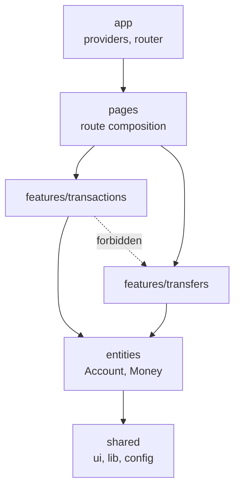

The public API file is what makes it work:

```ts
// features/transactions/index.ts
export { TransactionsTable } from "./ui/TransactionsTable";
export { useTransactions } from "./api/useTransactions";
export type { Transaction, TransactionFilter } from "./model/types";
// Everything else in this folder is private.
```

Enforce it with lint, or it decays within a quarter:

```js
// eslint.config.js (flat config) - using eslint-plugin-boundaries
import boundaries from "eslint-plugin-boundaries";

export default [
  {
    plugins: { boundaries },
    settings: {
      "boundaries/elements": [
        { type: "app", pattern: "src/app/*" },
        { type: "pages", pattern: "src/pages/*" },
        { type: "features", pattern: "src/features/*" },
        { type: "entities", pattern: "src/entities/*" },
        { type: "shared", pattern: "src/shared/*" },
      ],
    },
    rules: {
      "boundaries/element-types": [
        "error",
        {
          default: "disallow",
          rules: [
            { from: "app", allow: ["pages", "features", "entities", "shared"] },
            { from: "pages", allow: ["features", "entities", "shared"] },
            { from: "features", allow: ["entities", "shared"] },
            { from: "entities", allow: ["shared"] },
            { from: "shared", allow: ["shared"] },
          ],
        },
      ],
    },
  },
];
```

Also block deep imports, for example with `no-restricted-imports` patterns like `@/features/*/ui/*`, so other code must go through `index.ts`.

Migration plan:
1. Agree the target layout and the dependency rule in an ADR.
2. Add the lint rule in warning mode, and record the current violation count.
3. Move one feature per PR, starting with the one changing most often. Use your IDE's "move file" refactor or `ts-morph` scripts so imports update automatically.
4. Make the rule an error for migrated folders, and make the violation count only go down in CI.

> **Gotcha:** Barrel files (`index.ts` that re-export everything) can hurt tree-shaking and slow down dev servers and Jest, because importing one thing loads the whole folder. Keep feature barrels small and explicit, and never create one giant `shared/index.ts`.

**Trade-offs:**
- Feature folders make "where does this go?" a real question. Some code is honestly shared, and teams argue about it. A simple rule helps: code moves down to `shared` only when a second feature needs it.
- Strict layers add friction for small apps. Under ~30k lines, a flat `features/` folder is often enough.
- A big move ruins `git blame` for a while. `git log --follow` and a `.git-blame-ignore-revs` file for pure-move commits reduce the pain.

**What interviewers listen for:**
- You measure coupling (change history, dependency graphs) before redesigning.
- You define a public API per feature and enforce boundaries with tooling, not wiki pages.
- You migrate incrementally with a ratchet, not a freeze-the-world rewrite.
- Red flag: "I'd create a better folder structure" with no dependency rule and no enforcement.

#### Q: [Mid] How do you split a React feature into layers? Where does the `fetch` call go, and where does formatting `amountCents` go?

**Short answer:** I use four thin layers: UI components render, hooks connect UI to data and state, services or domain functions hold pure business logic, and one API client handles HTTP. The `fetch` lives only in the API client. Formatting money is pure domain or shared logic, called from the UI, never inside the API client.

**Clarify first:**
- Is there already a data-fetching library (TanStack Query, RTK Query, SWR)? That library is the "hooks" layer for server state.
- Is the API shape stable, or do we need a mapping layer between the backend's DTOs and our UI models?

**Diagnose:** Signs the layering is wrong:
- Components with `fetch` or `axios` inside `useEffect`.
- The same date or money formatting copied in 20 files.
- Tests that need to mock `window.fetch` just to check a sorting function.

**Solution:**

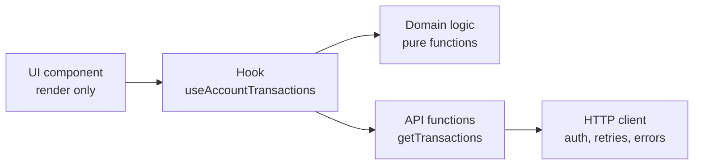

```ts
// shared/lib/http.ts - the ONLY place that knows about fetch, base URL and auth
export class HttpError extends Error {
  constructor(public status: number, public body: unknown) {
    super(`HTTP ${status}`);
  }
}

export async function http<T>(path: string, init: RequestInit = {}): Promise<T> {
  const token = await getAccessToken(); // from the auth module
  const res = await fetch(`${import.meta.env.VITE_API_URL}${path}`, {
    ...init,
    headers: {
      "Content-Type": "application/json",
      Authorization: `Bearer ${token}`,
      ...init.headers,
    },
  });
  if (!res.ok) throw new HttpError(res.status, await res.json().catch(() => null));
  return res.json() as Promise<T>;
}
```

```ts
// features/transactions/api/transactions.api.ts - knows endpoints and DTOs
import { http } from "@/shared/lib/http";
import type { TransactionDto } from "./dto";
import type { Transaction } from "../model/types";

export async function getTransactions(accountId: string): Promise<Transaction[]> {
  const dtos = await http<TransactionDto[]>(`/accounts/${accountId}/transactions`);
  return dtos.map(toTransaction); // map snake_case DTO -> UI model once, here
}

function toTransaction(dto: TransactionDto): Transaction {
  return {
    id: dto.id,
    amountCents: dto.amount_cents,
    currency: dto.currency,
    postedAt: new Date(dto.posted_at),
    description: dto.description ?? "",
  };
}
```

```ts
// entities/money/format.ts - pure, trivially testable
export function formatMoney(amountCents: number, currency: string, locale = "en-US") {
  return new Intl.NumberFormat(locale, { style: "currency", currency }).format(amountCents / 100);
}
```

```tsx
// features/transactions/api/useTransactions.ts - the hook layer
import { useQuery } from "@tanstack/react-query";

export function useTransactions(accountId: string) {
  return useQuery({
    queryKey: ["accounts", accountId, "transactions"],
    queryFn: () => getTransactions(accountId),
    staleTime: 30_000,
  });
}

// features/transactions/ui/TransactionList.tsx - render only
export function TransactionList({ accountId }: { accountId: string }) {
  const { data, isPending, error } = useTransactions(accountId);
  if (isPending) return <Spinner />;
  if (error) return <ErrorState error={error} />;
  return (
    <ul>
      {data.map((t) => (
        <li key={t.id}>
          {t.description} {formatMoney(t.amountCents, t.currency)}
        </li>
      ))}
    </ul>
  );
}
```

> **Finance tip:** `amountCents / 100` is fine for display of currencies with 2 minor units. JPY has 0 and some (KWD, BHD) have 3. If you support many currencies, get the minor unit count from the API or from `new Intl.NumberFormat(locale, { style: "currency", currency }).resolvedOptions().maximumFractionDigits`.

**Trade-offs:**
- Mapping DTOs to UI models costs a little code but isolates you from backend renames. Skip it only if you generate types from the API contract and accept those shapes everywhere.
- Too many layers ("repository", "service", "use case", "adapter") for a CRUD screen is overengineering. Four is plenty for most frontends.

**What interviewers listen for:**
- One HTTP client with auth and error handling in one place.
- Business logic as pure functions you can unit test without React.
- Knowing that server state is owned by a cache library, not by `useEffect` + `useState`.
- Red flag: fetching in components, or putting formatting in the API layer so the cache holds strings instead of numbers.

#### Q: [Senior] The app keeps everything in Redux: API responses, form values, modal open flags, the selected table row. It is slow and hard to change. How do you decide where each piece of state should live?

**Short answer:** I classify state by its owner and lifetime: server state goes to a server cache (TanStack Query or RTK Query), URL state goes in the URL, form state goes in a form library, local UI state stays in components, and only truly global client state (auth session, theme, feature flags) stays in a global store. Most of the Redux store disappears when you do this.

**Clarify first:**
- What actually needs to be shared across distant components?
- Which state must survive a page refresh or be shareable by link (filters, sort, pagination)?
- Is there offline or optimistic-update behavior that needs a client-side source of truth?

**Diagnose:**
- Open Redux DevTools and list every top-level slice. Tag each one: server data, URL-ish, form, UI, global client.
- Use React DevTools Profiler with "Highlight updates" on. A keystroke in a form that re-renders the whole page usually means form state is global.
- Search for `useSelector(state => state)` or selectors returning new objects. They cause re-renders on every store change.

**Solution:**

| State type | Example | Home |
|---|---|---|
| Server state | transactions, account balances | TanStack Query / RTK Query |
| URL state | filters, sort, page, selected tab | `useSearchParams` / router |
| Form state | transfer form values, validation | React Final Form / React Hook Form |
| Local UI state | modal open, hover, accordion | `useState` in the component |
| Shared client state | session, theme, current portfolio id | Context, Zustand or a small Redux slice |

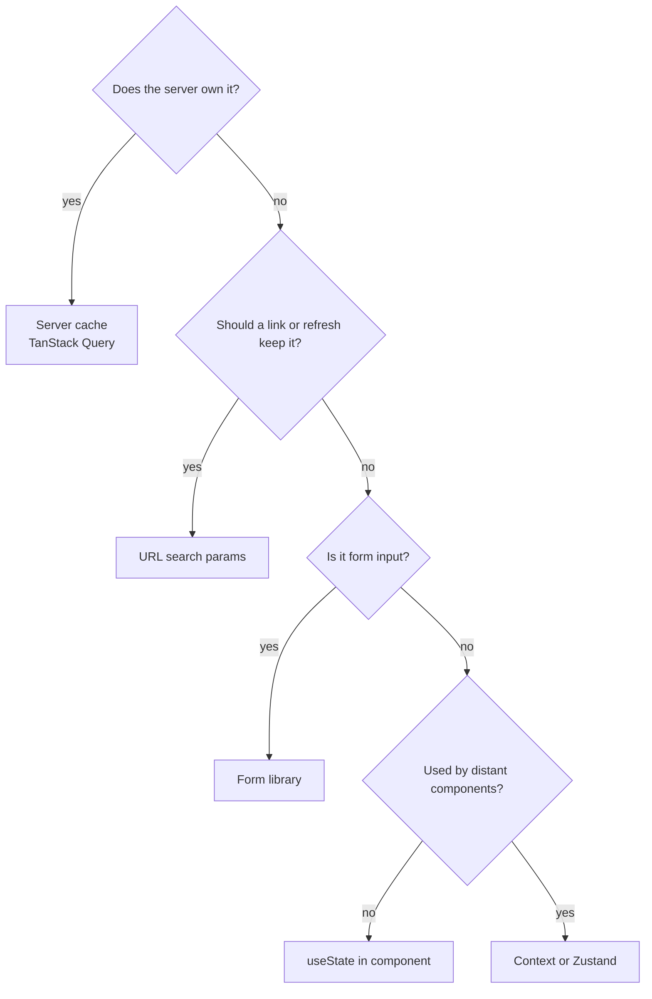

URL state example, which also fixes "I sent my colleague a link and the filters were lost":

```tsx
import { useSearchParams } from "react-router-dom";

export function useTransactionFilters() {
  const [params, setParams] = useSearchParams();
  const filters = {
    status: params.get("status") ?? "all",
    from: params.get("from") ?? undefined,
    sort: params.get("sort") ?? "-postedAt",
  };
  function update(next: Partial<typeof filters>) {
    setParams((prev) => {
      const p = new URLSearchParams(prev);
      for (const [k, v] of Object.entries(next)) {
        if (v == null || v === "") p.delete(k);
        else p.set(k, String(v));
      }
      return p;
    }, { replace: true });
  }
  return { filters, update };
}
```

Then the query key includes the filters, so the cache handles each combination:

```ts
useQuery({
  queryKey: ["transactions", accountId, filters],
  queryFn: () => getTransactions(accountId, filters),
});
```

> **Why:** Server data copied into Redux is a cache you wrote by hand, without staleness, deduplication, retries or garbage collection. A server-state library gives you all of these and removes the "data in Redux is stale after a mutation" class of bugs.

**Trade-offs:**
- More tools means more concepts for new joiners. Write the table above into your docs so the decision is mechanical.
- URL state is public and limited in size. Do not put PII (account numbers, emails) in query strings, because they end up in logs, history and Referer headers.
- Keeping some Redux is fine. The goal is the right owner, not zero Redux.

**What interviewers listen for:**
- "Server state vs client state" as the first split.
- URL as a state container for anything shareable.
- Awareness of re-render cost and selector stability.
- Red flag: "I'd move everything from Redux to Context." Context has no selectors, so one big context re-renders all consumers on every change.

#### Q: [Senior] The backend team changes field names without telling you, and the frontend breaks in production twice a month. How do you build a typed API layer that catches this early?

**Short answer:** I would make the API contract a single source of truth, usually an OpenAPI spec owned by the backend, and generate TypeScript types and a client from it in CI. Then a renamed field becomes a compile error in a PR, not a production incident. For extra safety I add runtime validation at the boundary for critical responses and contract tests between the two services.

**Clarify first:**
- Does the backend already publish an OpenAPI or GraphQL schema? Is it generated from code (reliable) or hand-written (often drifts)?
- Are frontend and backend in the same repo, or released separately?
- Do multiple clients (web, mobile) consume the same API?

**Diagnose:**
- Look at the last incidents: was it a rename, a type change (`string` to `number`), a nullable field, or an enum value the UI did not know?
- Check if the spec matches reality: call a few endpoints and compare to the spec. If the spec lies, codegen gives you false confidence.

**Solution:**

Option 1, generate types only with `openapi-typescript` and use the small typed `openapi-fetch` client:

```bash
npx openapi-typescript https://api.example.com/openapi.json -o src/shared/api/schema.d.ts
```

```ts
// shared/api/client.ts
import createClient from "openapi-fetch";
import type { paths, components } from "./schema";

export const api = createClient<paths>({ baseUrl: import.meta.env.VITE_API_URL });

export type AccountDto = components["schemas"]["Account"];

// Usage: path, params and response are all typed from the spec.
const { data, error } = await api.GET("/accounts/{accountId}", {
  params: { path: { accountId: "acc_123" } },
});
```

If the backend renames `balanceCents` to `availableBalanceCents`, regenerating the schema makes every usage of `data.balanceCents` a type error.

Option 2, generate full query hooks with a tool like Orval or Hey API, which can output TanStack Query hooks and even mock handlers. This is more code generated for you, but you depend more on the generator's conventions.

Wire it into CI so drift is detected:

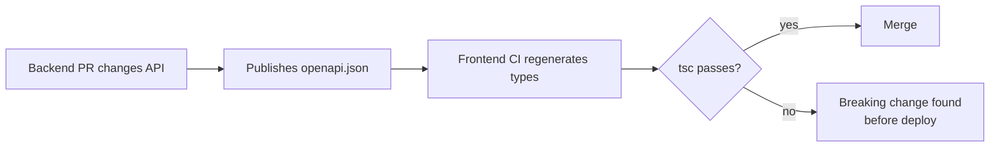

Runtime validation at the boundary for critical data, because types disappear at runtime:

```ts
import { z } from "zod";

const PaymentSchema = z.object({
  id: z.string(),
  amountCents: z.number().int(),
  currency: z.string().length(3),
  status: z.enum(["pending", "settled", "failed"]),
});

export async function getPayment(id: string) {
  const { data, error } = await api.GET("/payments/{id}", { params: { path: { id } } });
  if (error) throw error;
  const parsed = PaymentSchema.safeParse(data);
  if (!parsed.success) {
    reportContractViolation("/payments/{id}", parsed.error); // send to logs/RUM
    throw new Error("Unexpected payment response");
  }
  return parsed.data;
}
```

Add consumer-driven contract tests (Pact) when frontend and backend deploy independently: the frontend publishes what it expects, and the backend's CI verifies it before it can deploy.

**Trade-offs:**
- Codegen only works if the spec is accurate. A hand-written spec that drifts is worse than none.
- Runtime validation costs CPU on large payloads. Validate critical, small responses (payments, balances), not a 50k-row export.
- Contract tests need a broker and buy-in from backend teams. They pay off when there are many consumers.

**What interviewers listen for:**
- One source of truth for the contract and automated drift detection.
- Knowing TypeScript types are compile-time only, so runtime validation matters at trust boundaries.
- Handling unknown enum values gracefully (a default branch, not a crash).
- Red flag: hand-writing interfaces for 200 endpoints and "being careful".

## 2. Design Systems & Component API Design

#### Q: [Staff] Three product teams each built their own Button, Modal and Table. Leadership asks you to create a design system. How do you approach it?

**Short answer:** I treat it as a product with users (developers and designers), not a folder of components. I start with design tokens and the 10 to 15 most used primitives, build accessibility in from day one, publish it as a versioned package with docs and visual tests, and drive adoption by migrating one real screen with each team. Success is measured by adoption and fewer one-off components, not by component count.

**Clarify first:**
- Is there a design partner, and is Figma the source of truth for tokens?
- Should we build on headless primitives (Radix, React Aria, Base UI) or from scratch?
- How many apps and frameworks consume it? All React?
- What accessibility standard is required (WCAG 2.2 AA is common for finance)?
- Who will own and maintain it after launch, and how much time do they get?

**Diagnose:**
- Inventory: grep for `function Button`, `styled.button`, `<Modal` across repos. Count variants and usages. This gives you priorities and a migration list.
- Run an axe or Lighthouse accessibility audit on key screens. The baseline makes the value of a shared system visible.
- Interview 3 to 5 developers: what do they rebuild most, and what stops them from reusing?

**Solution:**

Build in layers:

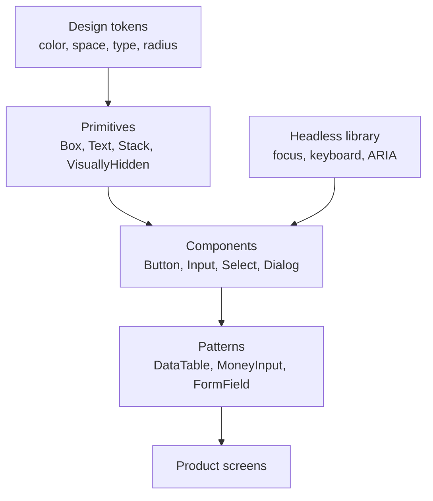

1. **Tokens first.** Define them once, for example in JSON, and generate CSS variables and TypeScript constants with a tool like Style Dictionary. Use semantic names (`color.text.danger`) on top of raw palette values (`red.600`), so themes can change mappings without touching components.

```css
:root {
  --color-bg-surface: #ffffff;
  --color-text-primary: #111827;
  --color-text-danger: #b91c1c;
  --color-action-primary: #1d4ed8;
  --space-2: 8px;
  --radius-md: 6px;
}
[data-theme="dark"] {
  --color-bg-surface: #0b1220;
  --color-text-primary: #e5e7eb;
}
```

2. **Use a headless library for hard behavior.** Focus trapping in a dialog, combobox keyboard handling and ARIA wiring are hard to get right. Wrapping Radix or React Aria lets your team focus on styling and API.

3. **Docs and tests are part of the component.** Storybook stories for every state, interaction tests, visual regression (Chromatic or Playwright screenshots), and axe checks in CI.

4. **Versioning and releases.** Semantic versioning with Changesets, a changelog, and codemods for breaking changes.

5. **Adoption.** Pair with each team on one real screen. Add a lint rule that warns on raw `<button>` in product code. Track adoption with a script that counts design-system imports versus local components.

> **Interview tip:** Mention a contribution model. Teams will need components the system lacks. A clear path ("build it locally, propose it, we promote it if two teams need it") prevents both bottlenecks and forks.

**Trade-offs:**
- Building from scratch gives full control but costs months on accessibility details. Headless libraries save that time but add a dependency and its upgrade path.
- A central team becomes a bottleneck if it must approve everything. A federated model (contributors from product teams) scales better but needs strong review standards.
- Too flexible components (20 props, `className` everywhere) lose consistency. Too strict ones get forked. Aim for strict defaults with explicit escape hatches.

**What interviewers listen for:**
- Tokens, accessibility and documentation treated as first-class.
- An adoption and migration plan with metrics.
- Governance and versioning thought through.
- Red flag: "I'd build 60 components and then announce it."

#### Q: [Mid] Your `Card` component has grown to 25 props: `title`, `subtitle`, `showHeaderIcon`, `footerButtons`, `footerAlign`... How would you redesign its API?

**Short answer:** I would switch from configuration props to composition: small sub-components (`Card.Header`, `Card.Body`, `Card.Footer`) that the caller arranges, with `children` instead of a prop for every slot. This removes most boolean props and lets callers handle new layouts without changing the component.

**Clarify first:**
- How many call sites exist, and can we migrate them with a codemod?
- Do the sub-components need shared state (like an `id` for ARIA), or are they purely visual?

**Diagnose:** A prop explosion usually shows up as boolean props that only make sense together (`showFooter` + `footerAlign`), props that pass through to deep children, and frequent PRs that add "one more prop".

**Solution:**

Before:

```tsx
<Card
  title="Checking account"
  subtitle="•••• 4821"
  showHeaderIcon
  headerIcon={<BankIcon />}
  footerButtons={[{ label: "Transfer", onClick: openTransfer }]}
  footerAlign="right"
/>
```

After, with compound components:

```tsx
<Card>
  <Card.Header>
    <BankIcon aria-hidden />
    <Card.Title>Checking account</Card.Title>
    <Card.Subtitle>•••• 4821</Card.Subtitle>
  </Card.Header>
  <Card.Body>
    <Balance amountCents={152034} currency="USD" />
  </Card.Body>
  <Card.Footer align="end">
    <Button onClick={openTransfer}>Transfer</Button>
  </Card.Footer>
</Card>
```

When sub-components need shared state, use context. Example: an accordion-like `Disclosure` that wires ARIA ids:

```tsx
import { createContext, useContext, useId, useState, type ReactNode } from "react";

type Ctx = { open: boolean; toggle: () => void; panelId: string };
const DisclosureCtx = createContext<Ctx | null>(null);

function useDisclosure() {
  const ctx = useContext(DisclosureCtx);
  if (!ctx) throw new Error("Disclosure.* must be used inside <Disclosure>");
  return ctx;
}

export function Disclosure({ children, defaultOpen = false }: { children: ReactNode; defaultOpen?: boolean }) {
  const [open, setOpen] = useState(defaultOpen);
  const panelId = useId();
  return (
    <DisclosureCtx.Provider value={{ open, toggle: () => setOpen((o) => !o), panelId }}>
      {children}
    </DisclosureCtx.Provider>
  );
}

Disclosure.Trigger = function Trigger({ children }: { children: ReactNode }) {
  const { open, toggle, panelId } = useDisclosure();
  return (
    <button type="button" aria-expanded={open} aria-controls={panelId} onClick={toggle}>
      {children}
    </button>
  );
};

Disclosure.Panel = function Panel({ children }: { children: ReactNode }) {
  const { open, panelId } = useDisclosure();
  return <div id={panelId} hidden={!open}>{children}</div>;
};
```

**Trade-offs:**
- Composition is more flexible but less consistent: callers can arrange things in odd ways. Give good defaults and document the intended structure.
- Simple, fixed components (a `Badge`) are fine with props. Use composition when there are slots and layouts.
- Static properties like `Card.Header` can be awkward with some tree-shaking setups and server component boundaries. Named exports (`CardHeader`) are a fine alternative.

**What interviewers listen for:**
- Naming "compound components" and "composition over configuration".
- A guard that throws a clear error when a sub-component is used outside its parent.
- Thinking about accessibility wiring, not only layout.
- Red flag: adding a `renderFooter` prop and a `footerProps` prop and calling it done.

#### Q: [Senior] Design the API of a design-system `Button` that must render as a `<button>`, a router `<Link>`, or an `<a>`, with full type safety. Also, should your `Select` be controlled or uncontrolled?

**Short answer:** For element flexibility I would use either a typed polymorphic `as` prop or the `asChild` slot pattern popularized by Radix. For state I would support both controlled and uncontrolled modes, following the same convention as native inputs: `value` + `onChange` for controlled, `defaultValue` for uncontrolled, implemented with one small `useControllableState` hook.

**Clarify first:**
- Which router? Its `Link` props must be type-checked.
- How important is bundle and type-check performance? Polymorphic types can slow `tsc` in large codebases.

**Diagnose:** Typical problems with a naive implementation: `<Button as="a">` accepts `href` but also `type="submit"`; refs are typed wrong; a `Button` rendered as a `div` loses keyboard access.

**Solution:**

Option 1, a typed polymorphic `as` prop:

```tsx
import { forwardRef, type ComponentPropsWithRef, type ElementType, type ReactNode } from "react";

type ButtonOwnProps<E extends ElementType> = {
  as?: E;
  variant?: "primary" | "secondary" | "danger";
  className?: string;
  children: ReactNode;
};

export type ButtonProps<E extends ElementType = "button"> = ButtonOwnProps<E> &
  Omit<ComponentPropsWithRef<E>, keyof ButtonOwnProps<E>>;

export function Button<E extends ElementType = "button">({
  as,
  variant = "primary",
  className,
  ...rest
}: ButtonProps<E>) {
  const Comp = as ?? "button";
  return <Comp className={cx("btn", `btn-${variant}`, className)} {...rest} />;
}

// <Button onClick={save}>Save</Button>
// <Button as="a" href="/statements">Statements</Button>
// <Button as={Link} to="/accounts/123">Open</Button>   // `to` is type-checked
```

In React 19, `ref` is a normal prop for function components, so `ComponentPropsWithRef<E>` passes it through without `forwardRef`. In React 18 you need `forwardRef`, and its typing with generics is awkward, which is one reason teams prefer option 2.

Option 2, `asChild` with a Slot, which merges your props into the single child:

```tsx
import { Slot } from "@radix-ui/react-slot";

type Props = React.ButtonHTMLAttributes<HTMLButtonElement> & { asChild?: boolean; variant?: string };

export function Button({ asChild, variant = "primary", className, ...rest }: Props) {
  const Comp = asChild ? Slot : "button";
  return <Comp className={cx("btn", `btn-${variant}`, className)} {...rest} />;
}

// <Button asChild><Link to="/accounts/123">Open</Link></Button>
```

The child keeps its own types, and your component types stay simple.

Controlled and uncontrolled support:

```ts
import { useCallback, useRef, useState } from "react";

export function useControllableState<T>({
  value,
  defaultValue,
  onChange,
}: {
  value?: T;
  defaultValue: T;
  onChange?: (next: T) => void;
}) {
  const [internal, setInternal] = useState(defaultValue);
  const isControlled = value !== undefined;
  const wasControlled = useRef(isControlled);

  if (import.meta.env.DEV && wasControlled.current !== isControlled) {
    console.warn("Component switched between controlled and uncontrolled.");
  }

  const current = isControlled ? (value as T) : internal;
  const setValue = useCallback(
    (next: T) => {
      if (!isControlled) setInternal(next);
      onChange?.(next);
    },
    [isControlled, onChange],
  );
  return [current, setValue] as const;
}
```

```tsx
// Uncontrolled: <AccountSelect defaultValue="acc_1" />
// Controlled:   <AccountSelect value={accountId} onChange={setAccountId} />
```

> **Gotcha:** Using `undefined` to mean "uncontrolled" means a controlled `Select` cannot represent "nothing selected" with `undefined`. Use `null` for the empty value in controlled mode, and document it.

**Trade-offs:**
- `as` prop: one component, nice call sites, but complex generics and slower type-checking. `asChild`: simple types, but the single-child rule can surprise people, and prop merging (event handlers, refs) needs a well-tested Slot.
- Controlled components give the parent full power (validation, syncing with URL) but re-render the parent on every change. Uncontrolled is simpler and faster for forms that only read values on submit.

**What interviewers listen for:**
- Keeping semantics right: a link that navigates is an `<a>`, an action is a `<button>`.
- Knowing the React 19 `ref` change.
- Following native conventions (`value`/`defaultValue`/`onChange`) so the API is predictable.
- Red flag: `<div onClick>` styled as a button.

#### Q: [Senior] Your product will be white-labeled for 12 banks, each with its own colors, logo, fonts and some feature differences. How do you architect theming?

**Short answer:** I would separate tenant configuration from code: a tenant config (tokens, assets, copy overrides, feature toggles) loaded at startup, applied through CSS custom properties, and read by components only through semantic tokens. One build serves all tenants, so a new bank is a config change, not a code fork.

**Clarify first:**
- One deployment for all tenants (detect tenant by domain) or one deployment per tenant?
- How deep do differences go: colors only, or different flows and legal text?
- Do tenants need to self-serve brand changes, or does our team apply them?
- Accessibility: who checks that a bank's brand color has enough contrast?

**Diagnose:** In an existing app, search for hard-coded hex colors and `if (tenant === "bankA")` checks. Both are the main sources of white-label pain.

**Solution:**

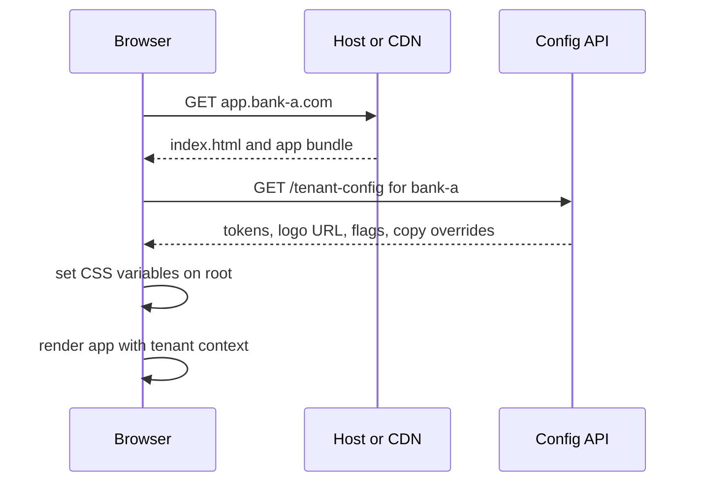

```ts
// tenant/types.ts
export type TenantConfig = {
  id: string;
  name: string;
  tokens: Record<`--${string}`, string>; // semantic CSS variables only
  logoUrl: string;
  fontCssUrl?: string;
  features: { cryptoTrading: boolean; wireTransfers: boolean };
  copy?: Partial<Record<string, string>>; // i18n key overrides
};
```

```tsx
// tenant/TenantProvider.tsx
export function TenantProvider({ config, children }: { config: TenantConfig; children: React.ReactNode }) {
  useLayoutEffect(() => {
    const root = document.documentElement;
    for (const [name, value] of Object.entries(config.tokens)) root.style.setProperty(name, value);
    root.dataset.tenant = config.id;
  }, [config]);
  return <TenantContext.Provider value={config}>{children}</TenantContext.Provider>;
}
```

Rules that keep it maintainable:
- Components use only semantic tokens (`var(--color-action-primary)`), never palette or hex values. A lint rule (stylelint `color-no-hex` in component styles) helps.
- Behavior differences go through the feature flag system, not `tenant.id` checks.
- Copy differences go through i18n key overrides.
- Validate each tenant config in CI: schema check plus contrast check for text/background token pairs.

> **Gotcha:** Loading the config after the first paint causes a "flash" of the default brand. Inline critical tokens into the HTML at the edge (server or CDN function picks them by host), or show a neutral splash until config arrives.

**Trade-offs:**
- Runtime theming (CSS variables) is flexible and needs one build. Build-time theming (one bundle per tenant) gives no flash and smaller CSS, but multiplies builds and deployments.
- Allowing tenants to inject custom CSS is tempting and dangerous: it breaks on every refactor and can be a security risk. Offer tokens and slots only.

**What interviewers listen for:**
- Semantic tokens as the contract between brand and components.
- Config over code forks, with CI validation.
- Thinking about first-paint flash and accessibility contrast.
- Red flag: `if (tenant === "bankA")` scattered through components.

## 3. Monorepos & Micro-Frontends

#### Q: [Senior] Your company has a customer web app, an internal admin app and a design system, in three repos. Shared code is copy-pasted. Would you move to a monorepo, and how would you structure it?

**Short answer:** Usually yes, if the same teams change the code together. I would use pnpm workspaces with a task runner like Turborepo or Nx, put apps in `apps/` and shared code in `packages/`, and use caching so CI only builds and tests what changed. The key is clear package boundaries and ownership, not just putting folders together.

**Clarify first:**
- Do the apps release together or independently?
- How big is CI today, and is anyone worried about build times?
- Do other companies or external teams consume the design system? Then it still needs proper versioned releases.
- Do teams have different tech stacks that a single toolchain would force together?

**Diagnose:** Count how often a change in shared code needs coordinated PRs across repos, and how long version-bump cycles take. If "update the shared lib" takes days of `npm link` and publishing, the monorepo pays off fast.

**Solution:**

```
repo/
  apps/
    web/               # customer app (Vite + React)
    admin/             # internal tool
  packages/
    ui/                # design system
    api-client/        # generated OpenAPI client
    money/             # formatting, rounding, currency helpers
    config-eslint/
    config-ts/
  pnpm-workspace.yaml
  turbo.json
```

```yaml
# pnpm-workspace.yaml
packages:
  - "apps/*"
  - "packages/*"
```

```json
// apps/web/package.json (excerpt)
{
  "dependencies": {
    "@acme/ui": "workspace:*",
    "@acme/money": "workspace:*"
  }
}
```

```json
// turbo.json (Turborepo 2.x uses "tasks")
{
  "$schema": "https://turbo.build/schema.json",
  "tasks": {
    "build": { "dependsOn": ["^build"], "outputs": ["dist/**"] },
    "test": { "dependsOn": ["^build"] },
    "lint": {},
    "typecheck": { "dependsOn": ["^build"] }
  }
}
```

In CI, `turbo run build test --filter=...[origin/main]` runs tasks only for packages changed since `main` and their dependents. Remote caching shares results between developers and CI.

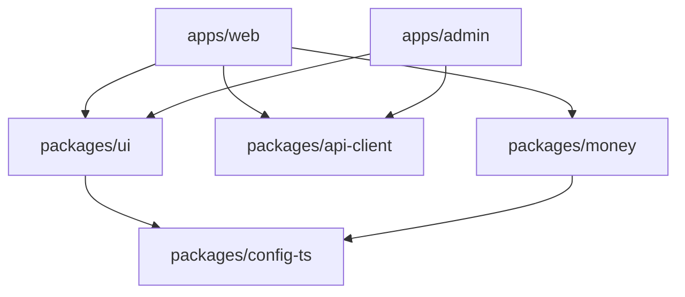

Important decisions:
- **Internal packages:** for code only used inside the repo, you can point `exports` at TypeScript source and let the app's bundler compile it. No build step, fast feedback.
- **Published packages:** if external consumers use `@acme/ui`, build it and release with Changesets so semver still means something.
- **Boundaries:** apps never import other apps. Packages never import apps. Nx `enforce-module-boundaries` or eslint rules enforce this.
- **Ownership:** a `CODEOWNERS` file per package, so the design system team reviews `packages/ui` changes.

**Trade-offs:**
- A monorepo makes atomic cross-package changes easy, but a breaking change in `packages/ui` now breaks every app in the same PR. That is often good (you see it) but needs fast CI.
- Tooling cost: cache config, CI filtering, IDE performance on big repos.
- Single-version policy (one React version for all) simplifies things but forces all apps to upgrade together.

**What interviewers listen for:**
- Affected-only builds and caching, otherwise CI time explodes.
- Internal vs published packages distinction.
- Ownership and boundary enforcement.
- Red flag: "Monorepo means one big app."

#### Q: [Staff] A VP wants micro-frontends so that 8 teams can deploy independently. The app is one React SPA with 40 routes. Would you do it, and how?

**Short answer:** Only if the main pain is organizational, meaning teams are blocked by each other's releases, and cheaper fixes have failed. Micro-frontends add runtime complexity, duplicate dependencies and design drift. If we do it, I would split by route or business domain, use a thin shell, share only a few singletons (React, design system, auth) through Module Federation or import maps, and keep strict contracts between the shell and remotes.

**Clarify first:**
- What exactly hurts: release coordination, slow CI, merge conflicts, or team autonomy?
- Have we tried a modular monolith first (feature boundaries, CODEOWNERS, fast affected-only CI, trunk-based deploys with feature flags)?
- Do teams need different frameworks or React versions? If yes, cost goes up a lot.
- Performance budget: what is the acceptable bundle and load time?

**Diagnose:** Measure the current delivery: lead time from merge to production, how often releases are blocked by another team, and CI duration. If CI takes 50 minutes and that is the blocker, fix CI. If the release train is weekly and teams wait on each other, independent deploys may be the real need.

**Solution:**

Cheaper options first:
1. Modular monolith with enforced boundaries and per-team ownership.
2. Continuous deployment of the monolith multiple times a day, with feature flags to decouple deploy from release.
3. Split by route at the server or CDN (different apps on `/payments/*` and `/portfolio/*`), with full page loads between them. Very simple and robust.

If runtime composition is needed, use Module Federation:

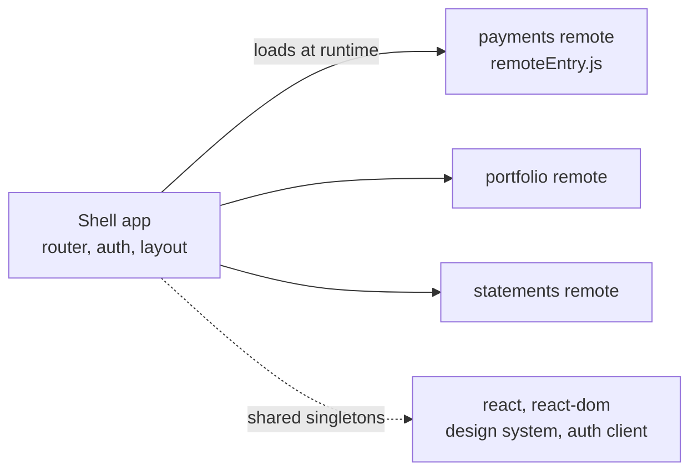

```ts
// shell: webpack.config.ts (webpack 5 built-in ModuleFederationPlugin)
import { container } from "webpack";

new container.ModuleFederationPlugin({
  name: "shell",
  remotes: {
    payments: "payments@https://cdn.example.com/payments/remoteEntry.js",
  },
  shared: {
    react: { singleton: true, requiredVersion: "^18.3.0" },
    "react-dom": { singleton: true, requiredVersion: "^18.3.0" },
    "@acme/ui": { singleton: true },
  },
});
```

```tsx
// shell: lazy-load the remote route with an error boundary around it
const PaymentsApp = lazy(() => import("payments/App"));

<Route
  path="/payments/*"
  element={
    <ErrorBoundary FallbackComponent={RemoteDownFallback}>
      <Suspense fallback={<PageSkeleton />}>
        <PaymentsApp basePath="/payments" />
      </Suspense>
    </ErrorBoundary>
  }
/>
```

For Vite or Rspack setups, the Module Federation 2.0 runtime (`@module-federation/enhanced` and related plugins) supports similar config; check current docs because these plugins move fast.

Contracts to define:
- The props a remote receives (base path, user session, feature flags), versioned like an API.
- Shared dependency versions, with CI checks that remotes match the shell's singleton ranges.
- Communication: URL and a few typed custom events, not shared global stores.
- Design: everyone uses the same design system package and tokens.
- Ownership: each remote has its own error boundary, monitoring tags and on-call owner.

> **Gotcha:** If a remote is deployed with a breaking change to its props, the shell breaks in production without any build failing. Treat the shell-remote interface like a public API: version it and test it with contract or integration tests against the deployed remote.

**Trade-offs:**
- Gains: independent deploys, smaller blast radius per team, gradual tech migration.
- Costs: more network requests, risk of duplicate React or library copies, harder local development, version skew bugs, inconsistent UX, more complex monitoring. Debugging spans multiple repos.
- Route-level splits are much cheaper than component-level composition. Component-level micro-frontends (a remote widget inside another team's page) are rarely worth it.

**What interviewers listen for:**
- Naming micro-frontends as an organizational solution with a technical cost.
- Proposing cheaper alternatives first, with metrics to decide.
- Singletons, error isolation and interface contracts if you do it.
- Red flag: "Micro-frontends are best practice for large apps."

## 4. Cross-Cutting Concerns

#### Q: [Senior] Product wants to ship features behind flags, run gradual rollouts to 5% of users, and turn off a broken feature in seconds. How do you architect feature flags in the frontend?

**Short answer:** I would put a flag provider behind a small internal interface, evaluate flags with user context (id, tenant, role), load them before rendering flagged UI, and use them through a typed hook. The vendor (LaunchDarkly, Unleash, a homegrown service) sits behind the interface, ideally the OpenFeature standard. Every flag gets an owner and an expiry, because old flags are tech debt.

**Clarify first:**
- Release flags (temporary), ops kill switches (long-lived), experiments (A/B), or permission-like entitlements? They have different lifecycles. Entitlements belong in the authorization system, not flags.
- Must flags be consistent between frontend and backend for the same user?
- Is flag evaluation allowed client-side? Client-side rules and flag names are visible to anyone who opens DevTools.

**Diagnose:** In existing code, count flags and find stale ones: flags at 100% for months, or flags no code reads any more. Look for flicker: UI that renders the old version and then switches when flags load.

**Solution:**

```ts
// flags/flags.ts - typed registry, one place to see every flag
export const FLAGS = {
  newTransferFlow: { default: false, owner: "payments-team", expires: "2026-12-31" },
  statementsV2: { default: false, owner: "statements-team", expires: "2027-01-31" },
  killSwitchCryptoQuotes: { default: false, owner: "trading-team", expires: null },
} as const;

export type FlagKey = keyof typeof FLAGS;
```

```tsx
// flags/FlagProvider.tsx
type FlagValues = Record<FlagKey, boolean>;
const FlagContext = createContext<FlagValues | null>(null);

export function FlagProvider({ user, children }: { user: User; children: React.ReactNode }) {
  const { data } = useQuery({
    queryKey: ["flags", user.id],
    queryFn: () => flagClient.evaluateAll({ userId: user.id, tenant: user.tenantId, role: user.role }),
    staleTime: 60_000,
  });
  if (!data) return <AppSkeleton />; // avoid flicker: do not render flagged UI with defaults
  return <FlagContext.Provider value={data}>{children}</FlagContext.Provider>;
}

export function useFlag(key: FlagKey): boolean {
  const flags = useContext(FlagContext);
  return flags?.[key] ?? FLAGS[key].default;
}
```

```tsx
// usage at a boundary, not deep in leaf components
function TransferPage() {
  const newFlow = useFlag("newTransferFlow");
  return newFlow ? <TransferWizard /> : <LegacyTransferForm />;
}
```

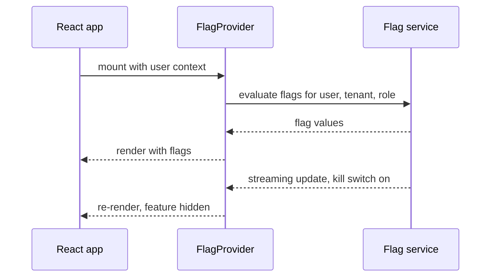

Practices that matter:
- Branch at the highest sensible level (page or route), so the old and new paths are easy to delete.
- Code-split flagged features with `lazy()`, so users without the flag do not download them.
- Add flag values to error reports and RUM sessions, so you can tell if errors only happen with a flag on.
- Clean up: a CI script lists flags past their expiry date and opens a ticket.
- Server enforces anything important. Hiding a button with a flag does not block the API.

**Trade-offs:**
- Blocking render until flags load costs some milliseconds of startup. Bootstrapping flags into the HTML or caching the last values in storage reduces it.
- Every flag doubles a code path for testing. Test both paths for risky flags; for small ones, test the new path and delete the flag fast.
- Vendor SDKs give targeting and streaming updates but cost money and add a third-party script.

**What interviewers listen for:**
- Flag types and lifecycles, with cleanup.
- Avoiding flicker and keeping flagged code splittable.
- Knowing client flags are not security.
- Red flag: hundreds of permanent flags nobody owns.

#### Q: [Mid] One widget on the dashboard throws an error and the whole app shows a white screen. What is your error boundary strategy?

**Short answer:** I place error boundaries at several levels: one at the root as a last resort, one per route, and one around independent widgets, so a broken portfolio chart does not take down the transactions table. Each boundary reports the error with context and offers a retry. Errors from event handlers and async code do not reach boundaries, so those need explicit handling.

**Clarify first:**
- Do we have error reporting (Sentry, Datadog RUM, LogRocket) to send errors to?
- Which parts of the page are independent and which are critical (a payment confirmation must not silently disappear)?

**Diagnose:** Reproduce with React DevTools open. In production, check RUM or error tracking for the component stack. React 19 also lets you hook `onUncaughtError` and `onCaughtError` in `createRoot` to report errors centrally.

**Solution:**

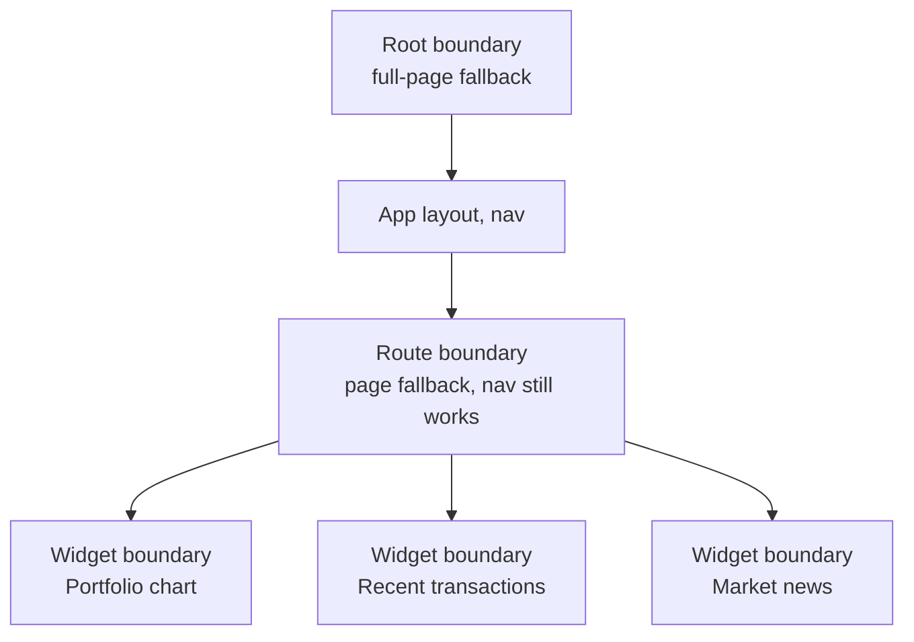

Using the `react-error-boundary` package:

```tsx
import { ErrorBoundary, type FallbackProps } from "react-error-boundary";
import { useQueryErrorResetBoundary } from "@tanstack/react-query";

function WidgetFallback({ error, resetErrorBoundary }: FallbackProps) {
  return (
    <div role="alert" className="widget-error">
      <p>This section could not load.</p>
      <button onClick={resetErrorBoundary}>Try again</button>
    </div>
  );
}

export function WidgetBoundary({ name, children }: { name: string; children: React.ReactNode }) {
  const { reset } = useQueryErrorResetBoundary(); // lets retry re-run failed queries
  return (
    <ErrorBoundary
      FallbackComponent={WidgetFallback}
      onReset={reset}
      onError={(error, info) => reportError(error, { widget: name, componentStack: info.componentStack })}
    >
      {children}
    </ErrorBoundary>
  );
}
```

Route boundaries should reset when the location changes, so navigating away clears the error:

```tsx
const location = useLocation();
<ErrorBoundary FallbackComponent={PageError} resetKeys={[location.pathname]}>
  <Outlet />
</ErrorBoundary>
```

Error boundaries do not catch: event handlers, `setTimeout`, promises outside rendering, and errors in the boundary itself. For event handlers, use `try/catch` and show a toast, or use `useErrorBoundary().showBoundary(error)` from the same library to push an async error into the nearest boundary.

> **Finance tip:** For a failed mutation (a payment submit), never show a generic "something went wrong" and let the user click again blindly. Show whether the payment status is unknown, check status by idempotency key, and only then allow a retry.

**Trade-offs:**
- Too many boundaries hide real problems (lots of small "could not load" boxes). Too few make the app fragile. Put them around units that make sense alone.
- Retrying a render that fails deterministically just fails again. Retry is useful for data errors, not code bugs.

**What interviewers listen for:**
- Layered boundaries and knowing what they do not catch.
- Reporting with context and reset behavior.
- Red flag: one root boundary that shows "Oops" for everything.

#### Q: [Senior] The app must launch in English, Spanish and Arabic next quarter, and money, dates and plurals must be correct. How do you architect i18n?

**Short answer:** I would use a mature library (react-i18next or FormatJS/react-intl) with ICU message syntax, keep translation keys in per-feature namespaces loaded lazily, and use the built-in `Intl` APIs for numbers, currency and dates. For Arabic I would set `dir="rtl"` and switch CSS to logical properties. Translations come from a translation management system, never hand-edited JSON in PRs.

**Clarify first:**
- Is locale per user profile, per browser, or per tenant?
- Is the language different from the formatting region (Spanish in the US vs in Spain)?
- Who translates, and how fast? Do we need to ship before translations are ready (fallback language)?
- Is server-generated text (emails, PDFs, error messages) also in scope?

**Diagnose:** Find hard-coded strings with a lint rule like `i18next/no-literal-string` or `formatjs/no-literal-string-in-jsx`. Find string concatenation of sentences (`"You have " + n + " payments"`), which is impossible to translate correctly. Find manual date formatting with `moment` patterns.

**Solution:**

```ts
// i18n/setup.ts with i18next
import i18n from "i18next";
import { initReactI18next } from "react-i18next";
import resourcesToBackend from "i18next-resources-to-backend";

i18n
  .use(initReactI18next)
  .use(resourcesToBackend((lng: string, ns: string) => import(`./locales/${lng}/${ns}.json`)))
  .init({
    fallbackLng: "en",
    ns: ["common"],
    defaultNS: "common",
    interpolation: { escapeValue: false }, // React already escapes
  });
```

```json
// locales/en/payments.json
{
  "scheduledCount_one": "You have {{count}} scheduled payment",
  "scheduledCount_other": "You have {{count}} scheduled payments"
}
```

i18next uses suffixes based on `Intl.PluralRules`. Arabic has six plural forms (`zero`, `one`, `two`, `few`, `many`, `other`), so translators must provide those keys. That is why you never build plurals with `count === 1 ? ... : ...`.

```tsx
function ScheduledPayments({ count }: { count: number }) {
  const { t } = useTranslation("payments"); // loads the namespace lazily
  return <p>{t("scheduledCount", { count })}</p>;
}
```

Formatting with `Intl`, cached because creating formatters is not free:

```ts
const cache = new Map<string, Intl.NumberFormat>();

export function formatCurrency(amountCents: number, currency: string, locale: string) {
  const key = `${locale}|${currency}`;
  let fmt = cache.get(key);
  if (!fmt) {
    fmt = new Intl.NumberFormat(locale, { style: "currency", currency });
    cache.set(key, fmt);
  }
  const digits = fmt.resolvedOptions().maximumFractionDigits ?? 2;
  return fmt.format(amountCents / 10 ** digits);
}

// formatCurrency(123456, "EUR", "de-DE") -> "1.234,56 €"
// formatCurrency(123456, "USD", "ar-EG") -> Arabic digits and RTL-friendly output
```

RTL support:

```tsx
useEffect(() => {
  document.documentElement.lang = locale;
  document.documentElement.dir = i18n.dir(locale); // "rtl" for Arabic
}, [locale]);
```

```css
/* logical properties flip automatically in RTL */
.card { padding-inline-start: 16px; margin-inline-end: 8px; border-inline-start: 3px solid var(--color-accent); }
```

> **Gotcha:** Numbers like account numbers and IBANs should stay left-to-right inside RTL text. Wrap them in `<bdi>` or set `dir="ltr"` on that element, or digits may appear in a confusing order.

**Trade-offs:**
- Lazy namespaces keep bundles small but add a loading state per namespace. Preload namespaces for the route on navigation.
- Keys like `payments.scheduledCount` are stable but meaningless to translators without context. Add descriptions in the translation system.
- Pseudo-localization (a fake locale with longer, accented strings) finds layout bugs early at almost no cost.

**What interviewers listen for:**
- ICU or plural rules instead of string concatenation.
- `Intl` for numbers, money and dates, and the minor-units nuance.
- RTL with logical CSS properties.
- A translation workflow, not just a library choice.
- Red flag: "We'll translate the JSON files with Google Translate before launch."

#### Q: [Mid] Admins, advisors and read-only auditors use the same app with different permissions. How do you structure role-based UI?

**Short answer:** I model permissions, not roles, in the UI: the backend sends a list of what the current user can do (`payments:approve`, `accounts:view`), and components check a permission through one hook or `<Can>` component. The UI hides or disables actions for a good experience, but the server always enforces permissions, because anything in the browser can be bypassed.

**Clarify first:**
- Are permissions global, or per resource (can approve payments for account A but not B)?
- Do permissions change during a session (role change by an admin)?
- Should hidden actions be invisible or disabled with an explanation?

**Diagnose:** Look for `user.role === "admin"` checks spread across components. When a new role is added, every one of those checks must change, which is where bugs come from.

**Solution:**

```ts
// auth/permissions.ts
export type Permission =
  | "accounts:view"
  | "payments:create"
  | "payments:approve"
  | "users:manage";

export function usePermissions() {
  const { data } = useQuery({
    queryKey: ["me", "permissions"],
    queryFn: () => http<Permission[]>("/me/permissions"),
    staleTime: 5 * 60_000,
  });
  const set = useMemo(() => new Set(data ?? []), [data]);
  return { can: (p: Permission) => set.has(p), loaded: data !== undefined };
}
```

```tsx
export function Can({ perform, children, fallback = null }: {
  perform: Permission;
  children: React.ReactNode;
  fallback?: React.ReactNode;
}) {
  const { can } = usePermissions();
  return <>{can(perform) ? children : fallback}</>;
}

// usage
<Can perform="payments:approve" fallback={<DisabledHint text="Ask an approver" />}>
  <Button onClick={approve}>Approve payment</Button>
</Can>
```

Route guards for whole pages:

```tsx
function RequirePermission({ perform, children }: { perform: Permission; children: React.ReactNode }) {
  const { can, loaded } = usePermissions();
  if (!loaded) return <PageSkeleton />;
  return can(perform) ? <>{children}</> : <Navigate to="/forbidden" replace />;
}
```

For per-resource rules, have the API return allowed actions with the resource, for example `payment.allowedActions: ["approve", "cancel"]`. The server already knows the rules, so the UI does not duplicate them.

**Trade-offs:**
- A central permission list is simple. Per-resource `allowedActions` is more accurate but makes payloads bigger.
- Hiding versus disabling: hiding is cleaner, disabling with a reason reduces support tickets ("where did the button go?").

**What interviewers listen for:**
- Permissions over roles, one central check.
- Server is the real enforcement. UI checks are for UX.
- Handling the loading state so the UI does not flash forbidden content.
- Red flag: role string comparisons in 80 components.

## 5. Evolving Legacy Code & Making Decisions

#### Q: [Staff] You inherit a 5-year-old app: Create React App, JavaScript, Redux with hand-written reducers, React Query v3, and many class components. The team wants a rewrite. What do you propose?

**Short answer:** I would push back on a full rewrite and propose an incremental migration with the strangler fig pattern: new code follows the new standards, old code is migrated when touched or in planned slices, and every step ships to production. I would order the work by risk and value: first the build tool (CRA to Vite) because it unblocks everything else, then TypeScript at the edges, then state and data libraries, and class components last because they still work.

**Clarify first:**
- What business problem drives this: slow builds, hiring, security patches, bugs, performance?
- How much time can the team spend: 20% per sprint, or a dedicated squad?
- Which areas change most often? Those are the best migration targets.
- What is the test coverage? Low coverage means we first add tests around critical flows.

**Diagnose:**
- Measure dev server start, HMR time, CI build time and bundle size. These numbers justify the build migration.
- Run `npm outdated` and `npm audit` to see how far behind dependencies are.
- Use git history to find hot files, and coverage reports to find unprotected areas.

**Solution:**

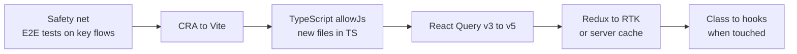

Step 0, safety net: Playwright tests for login, view balance, make a transfer, download statement. These catch regressions across all later steps.

Step 1, CRA to Vite. CRA was officially deprecated in early 2025, so this is also a maintenance need. Main changes:

```ts
// vite.config.ts
import { defineConfig } from "vite";
import react from "@vitejs/plugin-react";
import svgr from "vite-plugin-svgr";

export default defineConfig({
  plugins: [react(), svgr()],
  server: { port: 3000 },
  build: { outDir: "build", sourcemap: true },
});
```

- Move `public/index.html` to the project root and add `<script type="module" src="/src/index.jsx"></script>`.
- Replace `process.env.REACT_APP_X` with `import.meta.env.VITE_X` (a codemod or search-and-replace).
- Vite expects JSX in `.jsx`/`.tsx` files by default; rename `.js` files that contain JSX, or configure the plugin to handle them.
- SVG imports as components need `vite-plugin-svgr` and usually a `?react` suffix in imports, depending on the plugin version.
- Tests: keep Jest with a Babel or SWC transform for now, or move to Vitest, which shares the Vite config. Do not do both migrations in one PR.

Step 2 onward is covered in the next questions. The general rules:
- One migration per PR series. Never mix "move to Vite" with "upgrade React".
- Old and new can live side by side. Measure progress (number of `.js` files, number of class components) on a dashboard so the effort stays visible.
- Stop the bleeding first: a lint rule that blocks new class components or new `.js` files.

> **Why:** Rewrites usually take 2 to 3 times longer than planned, and the old app keeps getting features in the meantime, so the rewrite chases a moving target. Incremental migration delivers value every sprint and can stop at any point without waste.

**Trade-offs:**
- Incremental work means living with two styles for months, which confuses new joiners. Document "the new way" clearly.
- A rewrite can make sense when the old app is small, frozen, or the platform changes (web to native). Say when you would choose it.
- Each migration step has a cost. Some things (working class components) may never be worth migrating.

**What interviewers listen for:**
- Business justification and metrics, not "new is better".
- Strangler pattern, safety net first, one migration at a time.
- Ratchets that stop new legacy code.
- Red flag: "Let's freeze features for 6 months and rewrite in Next.js."

#### Q: [Senior] Walk me through migrating React Query v3 to TanStack Query v5, and hand-written Redux to Redux Toolkit or Zustand, without breaking production.

**Short answer:** For React Query I would go v3 to v4 to v5 in steps, using the official codemods and migration guides, because each version has breaking changes (package rename, object-only signature, removed query callbacks, renamed `cacheTime` and loading states). For Redux, I first move server data out of Redux into the query cache, then convert the remaining slices to RTK `createSlice` one at a time inside the same store. Zustand only makes sense if what is left is small and simple.

**Clarify first:**
- What React version are we on? TanStack Query v5 requires React 18 or newer.
- How many `useQuery` call sites? Hundreds means codemods matter.
- How much of the Redux store is server data versus true client state?

**Diagnose:**
- `grep -r "from 'react-query'" src | wc -l` to size the job.
- List usages of `onSuccess`/`onError` on `useQuery`; they need manual changes for v5.
- List Redux slices and tag each as server data or client state.

**Solution:**

React Query changes you must know:

| v3 | v5 |
|---|---|
| `import { useQuery } from "react-query"` | `import { useQuery } from "@tanstack/react-query"` (renamed in v4) |
| `useQuery(key, fn, options)` | `useQuery({ queryKey, queryFn, ...options })` only |
| `cacheTime` | `gcTime` |
| `status === "loading"`, `isLoading` | `status === "pending"`, `isPending` (`isLoading` now means pending and fetching) |
| `keepPreviousData: true` | `placeholderData: keepPreviousData` |
| `onSuccess`/`onError` on `useQuery` | removed; use `useEffect`, the `QueryCache` callbacks, or put logic in `queryFn` |
| `useErrorBoundary` option | `throwOnError` |
| infinite queries | require `initialPageParam` |

Before and after:

```ts
// v3
const { data, isLoading } = useQuery(["account", id], () => getAccount(id), {
  cacheTime: 10 * 60_000,
  keepPreviousData: true,
  onError: (e) => toast.error("Could not load account"),
});

// v5
import { useQuery, keepPreviousData } from "@tanstack/react-query";

const { data, isPending } = useQuery({
  queryKey: ["account", id],
  queryFn: () => getAccount(id),
  gcTime: 10 * 60_000,
  placeholderData: keepPreviousData,
});
```

Global error toasts move to the cache, which also removes duplicate toasts when several components use the same query:

```ts
const queryClient = new QueryClient({
  queryCache: new QueryCache({
    onError: (error, query) => {
      if (query.meta?.errorMessage) toast.error(String(query.meta.errorMessage));
    },
  }),
});
```

> **Gotcha:** In v4+, `isLoading` is `true` only while the first fetch is running. A disabled query (`enabled: false`) with no data is `isPending` but not `isLoading`. Code like `if (isLoading) return <Spinner/>` followed by `data.map` can crash on disabled queries after the upgrade. Check `isPending` or guard `data`.

Redux migration, in order:
1. Move server data to TanStack Query or RTK Query. This usually deletes most reducers, thunks and loading flags.
2. Wrap the existing root reducer with `configureStore`. Old reducers keep working and you get DevTools and middleware checks for free.

```ts
import { configureStore } from "@reduxjs/toolkit";
import { legacyRootReducer } from "./legacy/rootReducer";

export const store = configureStore({ reducer: legacyRootReducer });
// configureStore enables immutability and serializability checks in development.
// They may reveal existing bugs, like mutating state in a reducer. Fix or temporarily disable per check.
```

3. Convert one slice at a time with `createSlice`, keeping the same action type strings if other code listens for them.
4. If only a little client state remains (UI preferences, current portfolio), Zustand is a lighter option. Move it slice by slice behind a hook so components do not care where state lives:

```ts
import { create } from "zustand";

type UiState = { selectedPortfolioId: string | null; selectPortfolio: (id: string) => void };

export const useUiStore = create<UiState>()((set) => ({
  selectedPortfolioId: null,
  selectPortfolio: (id) => set({ selectedPortfolioId: id }),
}));

// components read a small slice so they only re-render when it changes
const selectedId = useUiStore((s) => s.selectedPortfolioId);
```

Class components to hooks: only when you touch the file anyway, or when a class blocks something (like using a hook-only library). Classes are still supported. Watch out for lifecycle semantics: `componentDidUpdate` comparisons become effect dependencies, and instance fields become `useRef`.

**Trade-offs:**
- Going version by version is slower but each step is smaller and easier to roll back.
- RTK keeps the Redux mental model, which is good for a large team already using Redux. Zustand is simpler but has fewer conventions, so large teams need their own patterns.

**What interviewers listen for:**
- Specific breaking changes, not "just update the package".
- Moving server state out of Redux before converting reducers.
- Facades (hooks) so the store implementation can change without touching components.
- Red flag: upgrading React, React Query and Redux in one PR.

#### Q: [Mid] How would you migrate a large JavaScript React codebase to TypeScript without stopping feature work?

**Short answer:** I would enable TypeScript with `allowJs` so JS and TS live together, require new files to be TypeScript, and convert existing files from the leaves inward: shared utilities and API types first, then components. Strictness goes up gradually, ideally reaching `strict: true` early for new code.

**Clarify first:**
- How many files, and how many developers know TypeScript?
- Is there an API spec to generate types from? That gives most of the value early.

**Diagnose:** Count `.js` files over time to track progress. Find the most imported modules with madge; typing them helps every file that uses them.

**Solution:**

```json
// tsconfig.json
{
  "compilerOptions": {
    "target": "ES2022",
    "module": "ESNext",
    "moduleResolution": "Bundler",
    "jsx": "react-jsx",
    "allowJs": true,
    "checkJs": false,
    "strict": true,
    "noEmit": true,
    "skipLibCheck": true,
    "baseUrl": ".",
    "paths": { "@/*": ["src/*"] }
  },
  "include": ["src"]
}
```

With `strict: true` from the start, converted files are fully strict. JS files are not checked because `checkJs` is off. This avoids a later "turn on strict" project that touches every file.

Order:
1. Generated API types (OpenAPI) and domain types (`Money`, `Account`).
2. Shared utilities and hooks: highly imported, small, easy to type.
3. Components, starting with the most changed ones.
4. Add `typecheck` (`tsc --noEmit`) to CI.

Ratchets:
- ESLint or a CI script that fails when a new `.js` file is added.
- Track `any` count with `@typescript-eslint/no-explicit-any` as a warning, and do not allow the count to grow.

For files you cannot convert yet but must use from TS, add a local declaration:

```ts
// src/legacy/chartUtils.d.ts
export function buildSeries(points: Array<{ t: number; v: number }>): unknown[];
```

> **Gotcha:** Converting a file by renaming it and adding `any` everywhere gives you a `.ts` file with JavaScript safety. Prefer `unknown` plus narrowing, and leave a `// TODO(ts)` only where truly needed.

**Trade-offs:**
- Strict early is harder per file but avoids a second migration.
- `checkJs: true` with JSDoc types is a softer option for teams not ready for TS syntax, but it is slower and less expressive.

**What interviewers listen for:**
- `allowJs` coexistence, leaves first, and ratchets.
- Starting with API and domain types for maximum value.
- Red flag: a long-lived "typescript" branch that never merges.

#### Q: [Senior] The backend will rename `amount` to `amountCents`, change `status` values, and remove an endpoint next month. Mobile and web clients both use it. How do you handle the breaking change safely?

**Short answer:** I would ask for an expand-and-contract rollout: the backend adds the new fields alongside the old ones, clients switch to the new fields, and the old fields are removed only after monitoring shows no client uses them. On the frontend I isolate the change in the API mapping layer, write the UI to tolerate unknown enum values, and ship the switch behind a flag if timing is risky.

**Clarify first:**
- Can the API be versioned (`/v2/...`) or support both shapes for a while?
- How long do old clients live? Web refreshes quickly, but mobile apps and open browser tabs can run old code for weeks.
- Is there a deadline (regulatory, partner) that forces a hard cutover?

**Diagnose:** Find every usage: generated types make this a compile-time search. Check RUM or API logs for which client versions call the endpoint, so the backend knows when removal is safe.

**Solution:**

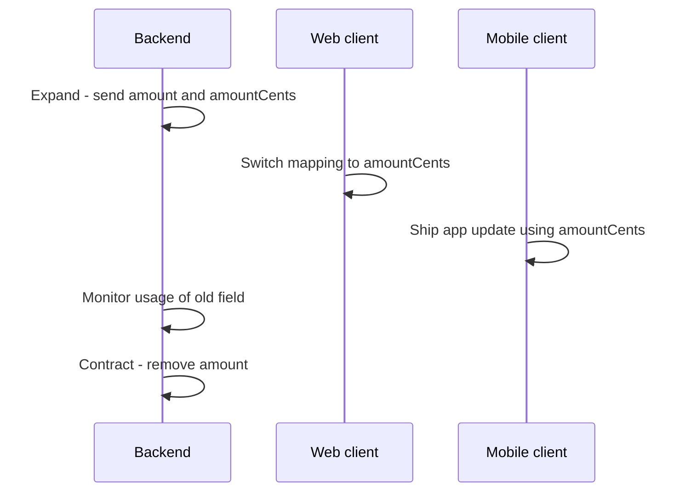

The mapping layer absorbs the change during the transition:

```ts
type PaymentDto = {
  id: string;
  amount?: number;       // deprecated, dollars as float
  amountCents?: number;  // new, integer cents
  status: string;
};

export function toPayment(dto: PaymentDto): Payment {
  const amountCents =
    dto.amountCents ?? (dto.amount != null ? Math.round(dto.amount * 100) : undefined);
  if (amountCents == null) throw new Error(`Payment ${dto.id} has no amount`);
  return { id: dto.id, amountCents, status: toStatus(dto.status) };
}
```

Tolerant reader for enums, so a new backend status does not crash the UI:

```ts
const KNOWN = ["pending", "settled", "failed", "reversed"] as const;
type PaymentStatus = (typeof KNOWN)[number] | "unknown";

function toStatus(raw: string): PaymentStatus {
  if ((KNOWN as readonly string[]).includes(raw)) return raw as PaymentStatus;
  reportContractViolation("payment.status", raw);
  return "unknown"; // UI shows a neutral badge instead of crashing
}
```

Also: deploy-skew. After a web deploy, users with old tabs still run the old bundle. If old JS calls a removed endpoint, it fails. Keep old endpoints until the old bundle's lifetime passes, and consider a "new version available, refresh" prompt by checking a version file.

**Trade-offs:**
- Expand-and-contract takes longer and the backend carries both shapes for a while. A hard cutover is faster but needs coordinated deploys and breaks old clients.
- Fallback logic in mappers is temporary code. Put a removal date on it.

**What interviewers listen for:**
- Expand-and-contract, deploy skew and old clients.
- A mapping layer that isolates contract changes.
- Tolerant reading of enums and monitoring of contract violations.
- Red flag: "We'll deploy frontend and backend at the same time."

#### Q: [Staff] Two senior engineers disagree strongly: one wants Next.js with server components, the other wants to stay with a Vite SPA. How do you make and record the decision?

**Short answer:** I turn the opinion fight into criteria: what problem are we solving, what are the options, and how does each score on requirements we agree on first. I time-box a spike on the riskiest unknown, then write an Architecture Decision Record with context, options, decision and consequences, so the reasoning survives after people leave.

**Clarify first:**
- What triggered the discussion? SEO, initial load time, team skills, hosting costs?
- What are the hard constraints: an authenticated dashboard (SEO does not matter), compliance on where code runs, existing Node infrastructure?
- Who decides in the end, and by when?

**Diagnose:** Gather facts, not opinions:
- Real user metrics today (LCP, INP from RUM) on key pages. If they are already good, the motivation is weaker.
- A spike: build one representative page (the portfolio dashboard with auth) in both, and measure load time, complexity and developer experience.
- Ask operations: can we run and monitor Node servers, or are we static-hosting only?

**Solution:**

A decision matrix agreed before scoring:

| Criterion (weight) | Vite SPA | Next.js App Router |
|---|---|---|
| Initial load on authenticated dashboard (3) | OK with code splitting | Better with streaming SSR |
| SEO needs (1, app is behind login) | Not needed | Strong |
| Ops complexity (3) | Static CDN only | Node runtime or vendor hosting |
| Team experience (2) | High | Low to medium |
| Migration cost (3) | None | High |

Then the ADR, kept in the repo next to the code:

```md
# ADR-014: Keep Vite SPA for the authenticated app

Status: Accepted (2026-10-02)

## Context
The customer app is fully behind login. RUM shows p75 LCP 1.9s and INP 120ms.
The marketing site needs SEO but is a separate project.
We have no on-call experience running Node servers for the frontend.

## Options
1. Keep Vite SPA, invest in code splitting and caching.
2. Migrate to Next.js App Router with server components.
3. Use Next.js only for the public marketing site.

## Decision
Option 1 for the app, option 3 for marketing.

## Consequences
- No server runtime to operate for the app.
- We accept slower first load on cold cache. We will track p75 LCP and revisit if it passes 2.5s.
- Revisit if we add public, SEO-relevant pages to the app.
```

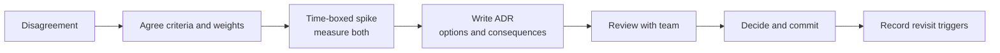

> **Interview tip:** Mention "disagree and commit". After the decision, the engineer whose option lost should still be able to support it, because their concerns are recorded and there is a clear trigger to revisit.

**Trade-offs:**
- ADRs cost time to write. Use them for decisions that are expensive to reverse (framework, state library, monorepo), not for every library choice.
- Spikes can turn into prototypes that people want to ship. Time-box them and throw the code away.

**What interviewers listen for:**
- Criteria and evidence before opinions.
- Reversibility as a factor: cheap-to-reverse decisions can be made fast.
- Recording context and revisit triggers.
- Red flag: deciding by seniority or hype, or not writing anything down.
