## 1. Request lifecycle and correctness

#### Q: [Senior] A transaction search box fires a request on every keystroke. Users type "amazon" and sometimes see results for "amaz". What is going on and how do you fix it properly?

**Short answer:** This is a race condition. Responses come back out of order, so the slow response for "amaz" lands after the fast one for "amazon" and overwrites it. The fix is to make sure only the latest request can update the UI: cancel stale requests with `AbortController`, ignore stale responses by request id, or let a query library key the cache by the search term so each result is stored under its own key.

**Clarify first:**
- Is the search server-side (API call) or client-side over data already loaded?
- How big is the result set and how slow is the endpoint (p50, p95)?
- Do we need to keep previous results visible while loading, or show a spinner?
- Is the search term in the URL (shareable, back button)?

**Diagnose:**
1. Open the Network tab, throttle to "Slow 4G", type quickly. You will see several requests in flight at once.
2. Look at the response order in the waterfall. If request 4 finishes before request 3, request 3 will win the `setState` if nothing guards it.
3. Add a temporary log in the response handler with the term and a timestamp. The last log line is what the user sees. If it does not match the input, you have the race.

> **Why:** The network does not guarantee order. Different requests can hit different servers, caches or DB plans. "amaz" can match more rows and be slower than "amazon".

**Solution:**

Option 1: abort the previous request. Each new keystroke cancels the old fetch. The aborted promise rejects with an `AbortError`, which you ignore.

```tsx
function useTransactionSearch(term: string) {
  const [results, setResults] = useState<Transaction[]>([]);
  const [error, setError] = useState<Error | null>(null);

  useEffect(() => {
    if (term.trim().length < 2) {
      setResults([]);
      return;
    }
    const controller = new AbortController();

    fetch(`/api/transactions?q=${encodeURIComponent(term)}`, { signal: controller.signal })
      .then((res) => {
        if (!res.ok) throw new Error(`HTTP ${res.status}`);
        return res.json() as Promise<Transaction[]>;
      })
      .then(setResults)
      .catch((err: unknown) => {
        if (err instanceof DOMException && err.name === 'AbortError') return; // expected
        setError(err as Error);
      });

    // Cleanup runs before the next effect and on unmount.
    return () => controller.abort();
  }, [term]);

  return { results, error };
}
```

Option 2: request id guard. Useful when you cannot abort (a third-party SDK that returns a promise only). Abort also saves bandwidth; an id guard only protects the UI.

```ts
let latestId = 0;

async function search(term: string, onResult: (r: Transaction[]) => void) {
  const id = ++latestId;
  const data = await api.searchTransactions(term);
  if (id !== latestId) return; // a newer search started, drop this one
  onResult(data);
}
```

Option 3: query keys (what I would ship). TanStack Query stores each response under its key, so a late "amaz" response is written to the `["transactions", "amaz"]` entry, not the one the UI is showing. It also passes an `AbortSignal` you can forward, and it cancels queries that no observer uses any more if you consume the signal.

```tsx
import { useQuery, keepPreviousData } from '@tanstack/react-query';

function useTransactionSearch(rawTerm: string) {
  const term = useDebouncedValue(rawTerm.trim(), 300);

  return useQuery({
    queryKey: ['transactions', 'search', term],
    queryFn: async ({ signal }) => {
      const res = await fetch(`/api/transactions?q=${encodeURIComponent(term)}`, { signal });
      if (!res.ok) throw new Error(`HTTP ${res.status}`);
      return (await res.json()) as Transaction[];
    },
    enabled: term.length >= 2,
    placeholderData: keepPreviousData, // keep old rows while new ones load, no flicker
    staleTime: 30_000,
  });
}
```

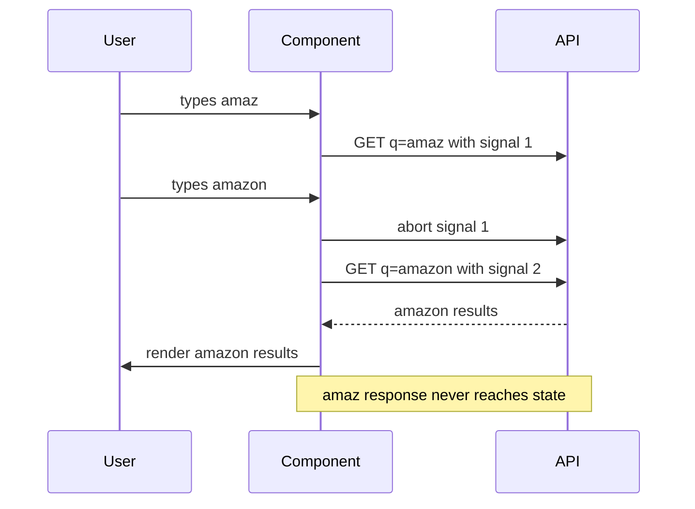

Combine with debouncing (next question) so you send fewer requests in the first place.

**Trade-offs:**
- Abort: saves bandwidth and server work on the client side, but the server may still finish the query. Needs cleanup discipline in every effect.
- Request id: simplest, works with any promise, but wastes the request.
- Query library: solves the race, caching and dedupe together, at the cost of a dependency and learning its cache rules.

**What interviewers listen for:**
- You name it as a race condition and explain why order is not guaranteed.
- You know `AbortController` and that aborted fetches reject with `AbortError`, which must not be shown as an error.
- You mention debouncing as a separate concern (load) from correctness (ordering).
- Red flag: "just add a debounce". Debounce reduces the chance but does not remove the race.
- Red flag: forgetting the effect cleanup, or storing results in a global without keys.

> **Gotcha:** In React 18+ Strict Mode in development, effects run twice. With abort in cleanup you will see one cancelled request in the Network tab. That is expected and proves your cleanup works.

#### Q: [Mid] What is the difference between debouncing and throttling? Give one place in a trading dashboard where you would use each.

**Short answer:** Debounce waits until events stop for N ms, then runs once. Throttle runs at most once every N ms while events keep coming. Use debounce for search input (run after the user pauses). Use throttle for scroll, resize or a live chart crosshair (run regularly during continuous activity).

**Clarify first:**
- Do we need the first event immediately (leading edge) or only the final value (trailing edge)?
- Is the cost on the client (rendering) or on the server (requests)?

**Diagnose:** If you see a request per keystroke in the Network tab, or a long list of `scroll` handler tasks in the Performance panel, you need one of these.

**Solution:**

```ts
export function debounce<A extends unknown[]>(fn: (...args: A) => void, wait: number) {
  let timer: ReturnType<typeof setTimeout> | undefined;
  const debounced = (...args: A) => {
    clearTimeout(timer);
    timer = setTimeout(() => fn(...args), wait);
  };
  debounced.cancel = () => clearTimeout(timer);
  return debounced;
}

export function throttle<A extends unknown[]>(fn: (...args: A) => void, wait: number) {
  let last = 0;
  let trailing: ReturnType<typeof setTimeout> | undefined;
  return (...args: A) => {
    const now = Date.now();
    const remaining = wait - (now - last);
    if (remaining <= 0) {
      clearTimeout(trailing);
      last = now;
      fn(...args);
    } else {
      // make sure the final position is not lost
      clearTimeout(trailing);
      trailing = setTimeout(() => {
        last = Date.now();
        fn(...args);
      }, remaining);
    }
  };
}
```

In React, debounce the value rather than the handler. This avoids recreating the debounced function every render.

```ts
export function useDebouncedValue<T>(value: T, delay = 300): T {
  const [debounced, setDebounced] = useState(value);
  useEffect(() => {
    const id = setTimeout(() => setDebounced(value), delay);
    return () => clearTimeout(id);
  }, [value, delay]);
  return debounced;
}
```

| Use case | Choice | Why |
|---|---|---|
| Search transactions | Debounce 250–400 ms | Only the final term matters |
| Autosave a draft | Debounce ~1 s plus max wait | Save after pauses, but not never |
| Scroll position for infinite list | Throttle ~100 ms or IntersectionObserver | Need regular updates |
| Chart crosshair on mousemove | `requestAnimationFrame` | Sync with paint, max once per frame |
| Window resize relayout | Debounce or ResizeObserver | Only final size matters |

**Trade-offs:** Debounce adds latency equal to the wait. Throttle can drop the final event unless you add a trailing call. For visual updates, `requestAnimationFrame` is usually better than a fixed throttle because it matches the display refresh rate.

**What interviewers listen for:**
- Clear one-line definitions and the leading/trailing edge idea.
- Knowing `lodash.debounce` has a `maxWait` option, which turns it into a hybrid.
- Knowing that a debounced function created inside a component body is recreated on every render unless memoized.
- Red flag: using debounce to "fix" a race condition.

#### Q: [Senior] Our dashboard has 12 widgets. On load, the Network tab shows `/api/me` called 9 times and `/api/accounts` 6 times. How do you fix it, and how do you stop it coming back?

**Short answer:** Each widget fetches its own data, so the same request runs in parallel many times. The fix is request deduplication: concurrent callers for the same resource share one in-flight promise, and later callers read from a cache. A query library like TanStack Query does this by query key. Without a library, a small in-flight promise map does it.

**Clarify first:**
- Are these identical URLs and params, or slightly different (e.g. `?include=balances`)?
- Do widgets need exactly the same shape, or does each need a subset?
- How fresh does each widget need the data to be?

**Diagnose:**
1. Network tab, filter by `/api/me`, check the Initiator column to see which components trigger it.
2. Compare query strings. Often the duplication is `?page=1` vs no param, or a different param order, which defeats caching.
3. In TanStack Query Devtools, look for several keys that should be one, like `['me']` and `['user', 'me']`.

**Solution:**

Option 1: lift the fetch to a parent and pass data down. Fine for small trees, but it couples widgets to the page.

Option 2: in-flight promise map. Simple and library-free.

```ts
const inflight = new Map<string, Promise<unknown>>();

export function dedupedGet<T>(url: string): Promise<T> {
  const existing = inflight.get(url);
  if (existing) return existing as Promise<T>;

  const p = fetch(url, { credentials: 'include' })
    .then((r) => {
      if (!r.ok) throw new Error(`HTTP ${r.status}`);
      return r.json() as Promise<T>;
    })
    .finally(() => inflight.delete(url)); // only dedupe while in flight

  inflight.set(url, p);
  return p;
}
```

Option 3: shared query hooks with a key factory. Each widget calls `useMe()`. TanStack Query sends one request and all observers subscribe to the same cache entry.

```ts
export const qk = {
  me: () => ['me'] as const,
  accounts: () => ['accounts'] as const,
  account: (id: string) => ['accounts', id] as const,
  transactions: (accountId: string, filters: TxFilters) =>
    ['accounts', accountId, 'transactions', filters] as const,
};

export function useMe() {
  return useQuery({ queryKey: qk.me(), queryFn: api.getMe, staleTime: 5 * 60_000 });
}

// Need just one field? Use select. Re-renders only when that field changes.
export function useMyCurrency() {
  return useQuery({ queryKey: qk.me(), queryFn: api.getMe, select: (me) => me.baseCurrency });
}
```

Option 4: for a page that always needs the same 5 resources, a BFF endpoint `/api/dashboard-bootstrap` returns them in one round trip, then you seed the cache with `queryClient.setQueryData`.

**Trade-offs:**
- In-flight map: no cache after resolution, no invalidation, you write it yourself.
- Query library: dedupe plus cache plus refetch rules, but you must design keys carefully. Object keys are hashed deterministically, so property order in a filter object does not matter in TanStack Query.
- BFF bootstrap: fewest round trips, but couples the backend to one screen.

**What interviewers listen for:**
- Distinguishing in-flight dedupe from caching.
- A key factory so keys are consistent across the codebase, and `select` to subscribe to slices.
- `staleTime` reasoning: with the default `staleTime: 0`, a widget that mounts later will trigger a background refetch even though data exists.
- Prevention: an ESLint rule or code review norm that components never call `fetch` directly, only domain hooks.
- Red flag: "put it all in Redux" without addressing loading, staleness and dedupe.

> **Gotcha:** Dedupe only works if the key is identical. `['transactions', { page: 1 }]` and `['transactions', { page: 1, sort: undefined }]` can still produce the same hash in TanStack Query because undefined values are dropped in its hashing, but `'1'` vs `1` will not match. Normalize params in the key factory.

#### Q: [Mid] How would you make opening an account detail page feel instant when the user comes from the accounts list?

**Short answer:** Prefetch on intent. When the user hovers or focuses a row for ~100 ms, start fetching the detail data into the cache. By the time they click, the data is there or nearly there. Also seed the detail cache from the list row so the header renders immediately.

**Clarify first:** How expensive is the detail endpoint? How many rows will users hover over on their way to the one they want? Is this desktop (hover exists) or mobile (no hover)?

**Diagnose:** Measure click-to-content with the Performance panel or a RUM metric (for example a custom `performance.mark` on click and on render). If most of the time is network, prefetching helps. If most is rendering, it will not.

**Solution:**

```tsx
function AccountRow({ account }: { account: AccountSummary }) {
  const queryClient = useQueryClient();
  const timer = useRef<ReturnType<typeof setTimeout>>();

  const prefetch = () => {
    timer.current = setTimeout(() => {
      queryClient.prefetchQuery({
        queryKey: qk.account(account.id),
        queryFn: () => api.getAccount(account.id),
        staleTime: 60_000, // do not refetch if prefetched data is under a minute old
      });
    }, 100); // small delay avoids prefetching every row the mouse passes over
  };
  const cancel = () => clearTimeout(timer.current);

  return (
    <Link
      to={`/accounts/${account.id}`}
      onMouseEnter={prefetch}
      onFocus={prefetch}
      onMouseLeave={cancel}
      onBlur={cancel}
    >
      {account.name}
    </Link>
  );
}

// On the detail page, show list data at once while the full detail loads.
function useAccount(id: string) {
  const queryClient = useQueryClient();
  return useQuery({
    queryKey: qk.account(id),
    queryFn: () => api.getAccount(id),
    placeholderData: () =>
      queryClient
        .getQueryData<AccountSummary[]>(qk.accounts())
        ?.find((a) => a.id === id) as AccountDetail | undefined,
  });
}
```

Other levers: route loaders in React Router data routers start fetching at navigation instead of after render, which removes the render-then-fetch waterfall. Code-split chunks can be prefetched the same way with a dynamic `import()` on hover.

**Trade-offs:** Prefetching wastes requests when users do not click. Keep it cheap endpoints only, add a delay, and skip it on metered connections if you want to be careful (`navigator.connection.saveData` exists in Chromium but is not universal). Placeholder data must be clearly partial, so do not show a balance from a stale list as if it were live.

**What interviewers listen for:**
- Intent signals (hover, focus, viewport visibility) and a small delay.
- Knowing prefetch fills the cache and `staleTime` stops an immediate refetch.
- Thinking about mobile, where there is no hover.
- Red flag: prefetching every row on page load.

#### Q: [Mid] A page loads in 3.2 seconds even though every API call is under 300 ms. The Network tab shows requests starting one after another. What is happening?

**Short answer:** It is a request waterfall. Each component fetches only after its parent has rendered with data, so latencies add up instead of overlapping. The fix is to start independent requests in parallel, as early as possible: hoist them to the route level, use route loaders, or fetch in parallel with `Promise.all` or `useQueries`.

**Clarify first:** Which requests truly depend on each other (you need `accountId` before transactions) and which are independent?

**Diagnose:** In the Network tab waterfall, look for a staircase pattern. Hover each request's Initiator to find the component. In React DevTools Profiler, you will see the tree rendering in several commits as each level gets its data.

**Solution:**

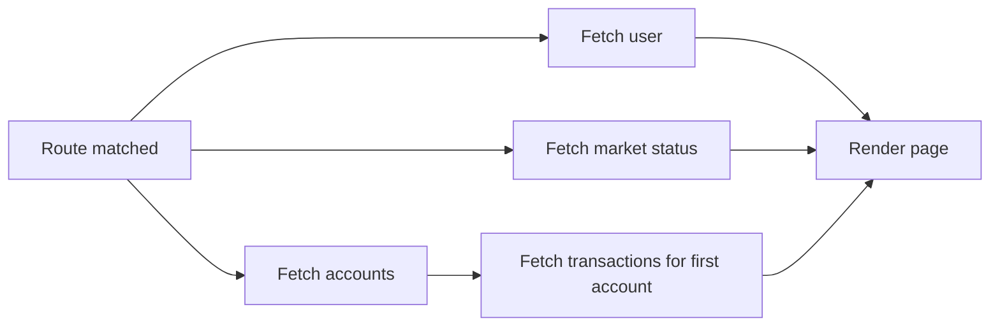

```ts
// React Router data router loader: starts at navigation, in parallel.
export async function dashboardLoader({ request }: { request: Request }) {
  const signal = request.signal;
  const [me, accounts] = await Promise.all([
    queryClient.ensureQueryData({ queryKey: qk.me(), queryFn: () => api.getMe({ signal }) }),
    queryClient.ensureQueryData({ queryKey: qk.accounts(), queryFn: () => api.getAccounts({ signal }) }),
  ]);
  // dependent request starts as soon as its input exists
  void queryClient.prefetchQuery({
    queryKey: qk.transactions(accounts[0].id, defaultFilters),
    queryFn: () => api.getTransactions(accounts[0].id, defaultFilters),
  });
  return { me, accounts };
}
```

If a dependency chain is unavoidable, move it to the server: one BFF call that does both lookups next to the database, where latency is ~1 ms instead of ~100 ms.

**Trade-offs:** Loaders couple data needs to routes instead of components. Hoisting fetches can over-fetch for widgets that are collapsed. BFF endpoints add backend work.

**What interviewers listen for:** Recognising the staircase, separating true dependencies from accidental ones, and knowing "fetch-on-render" vs "render-as-you-fetch". Red flag: trying to fix it with caching only, which helps the second visit but not the first.

## 2. Caching and mutations

#### Q: [Mid] Explain stale-while-revalidate. What do `staleTime` and `gcTime` mean in TanStack Query, and what values would you pick for a user profile vs an account balance?

**Short answer:** Stale-while-revalidate means: show the cached copy immediately, even if it may be out of date, and fetch a fresh copy in the background, then swap it in. The user never waits for data they have seen before. `staleTime` is how long data counts as fresh (no background refetch). `gcTime` is how long unused data stays in memory before it is garbage collected.

**Clarify first:** How costly is wrong data? A stale display name is harmless. A stale available balance before a transfer is not.

**Diagnose:** In TanStack Query Devtools each query shows fresh, stale, fetching, paused or inactive. If you see refetches on every tab focus, `staleTime` is probably 0 (the default).

**Solution:**

The term comes from the HTTP header `Cache-Control: max-age=60, stale-while-revalidate=300`. The browser serves the cached response for 60 s, then for the next 300 s it serves stale and revalidates in the background. Libraries like TanStack Query and SWR apply the same idea in memory.

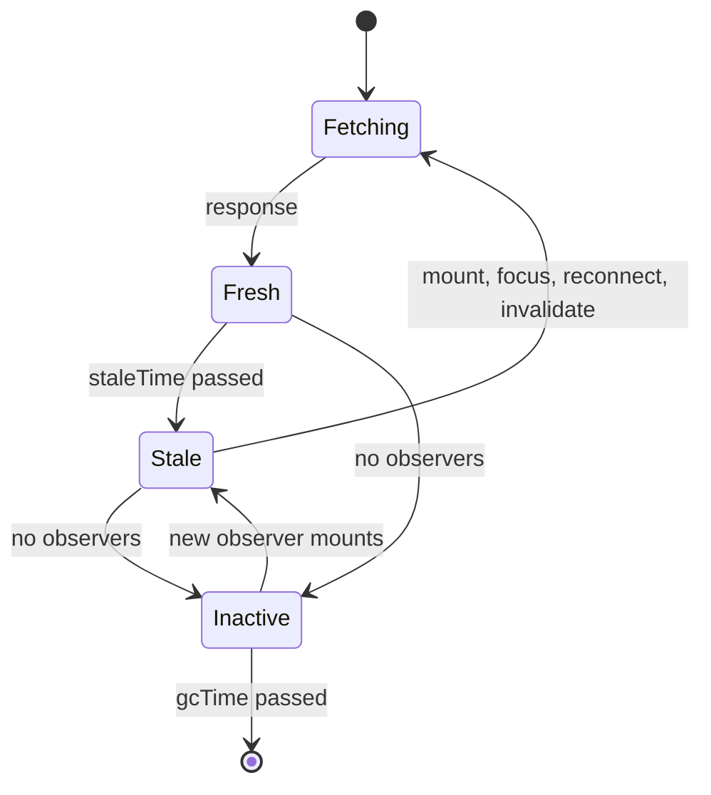

```ts
const queryClient = new QueryClient({
  defaultOptions: {
    queries: { staleTime: 30_000, gcTime: 5 * 60_000, refetchOnWindowFocus: true },
  },
});

// Profile: rarely changes
useQuery({ queryKey: qk.me(), queryFn: api.getMe, staleTime: 10 * 60_000 });

// Balance: show cache but always revalidate on mount and focus
useQuery({ queryKey: ['balance', accountId], queryFn: () => api.getBalance(accountId), staleTime: 0 });
```

| Data | staleTime | Reason |
|---|---|---|
| Reference data, currencies list | Hours or `Infinity` | Changes with deploys only |
| User profile, permissions | 5–10 min | Rare changes; invalidate on edit |
| Transactions list | 30 s | Users expect new items soon |
| Balance, positions | 0 plus refetch on focus, or live updates | Must be current |

> **Finance tip:** For anything you act on with money (available balance before a transfer), show the cached value but refetch or re-check on the server at submit time. The server is the source of truth; the UI value is a hint.

**Trade-offs:** Longer `staleTime` means fewer requests but more chance of stale UI. Very short `gcTime` frees memory but loses the instant back-navigation experience.

**What interviewers listen for:**
- Fresh vs stale vs inactive. Many candidates mix up `staleTime` and `gcTime`.
- Knowing `cacheTime` was renamed `gcTime` in TanStack Query v5.
- Picking values by business impact, not one global number.

> **Outdated:** In React Query v3 and v4, `gcTime` was called `cacheTime`, and `keepPreviousData: true` was an option. In v5 you use `placeholderData: keepPreviousData`.

#### Q: [Senior] After a user creates a payment, the payments list, the account balance and the "recent activity" widget are all stale. What is your cache invalidation strategy?

**Short answer:** After a mutation succeeds, invalidate every query whose data the mutation can change, using hierarchical query keys so one prefix call covers a family. For the item you just created, write the server response straight into the cache to avoid an extra round trip. For data changed by other users or background jobs, rely on `staleTime`, refetch on focus, or push events.

**Clarify first:**
- Does the server return the created entity, or the updated balance too?
- Is the payment processed synchronously or does it go to "pending" and settle later?
- Can other users or systems change the same data (shared accounts, scheduled payments)?

**Diagnose:** List what the mutation touches on the server. A payment changes: payments list, account balance, available balance, recent activity, maybe limits remaining. Then grep your key factory for each of these. Missing invalidations show up as "it only updates after refresh" bugs.

**Solution:**

Design keys hierarchically so related data shares a prefix:

```ts
export const qk = {
  account: (id: string) => ['accounts', id] as const,
  balance: (id: string) => ['accounts', id, 'balance'] as const,
  payments: (id: string, f: PaymentFilters) => ['accounts', id, 'payments', f] as const,
  activity: () => ['activity'] as const,
};

export function useCreatePayment(accountId: string) {
  const queryClient = useQueryClient();
  return useMutation({
    mutationFn: (input: NewPayment) => api.createPayment(accountId, input),
    onSuccess: async (payment) => {
      // 1. Write what we know for sure.
      queryClient.setQueryData(['payments', payment.id], payment);
      // 2. Invalidate families. Prefix match: covers every filter combo and the balance.
      await Promise.all([
        queryClient.invalidateQueries({ queryKey: qk.account(accountId) }),
        queryClient.invalidateQueries({ queryKey: qk.activity() }),
      ]);
    },
  });
}
```

`invalidateQueries` marks matching queries stale and refetches only those currently on screen (active). Inactive ones refetch when next used. Returning or awaiting the promise keeps `isPending` true until fresh data arrives, which avoids a flash of old balance.

Strategies, simplest first:
1. Invalidate broad prefixes. Correct, slightly more requests.
2. Update the cache from the mutation response (`setQueryData`). No round trip, but you must replicate server logic, which is risky for computed values like balances.
3. Server returns all affected resources in the response, and you write each.
4. Server pushes change events (WebSocket/SSE) and the client invalidates matching keys. Needed when other actors change data.

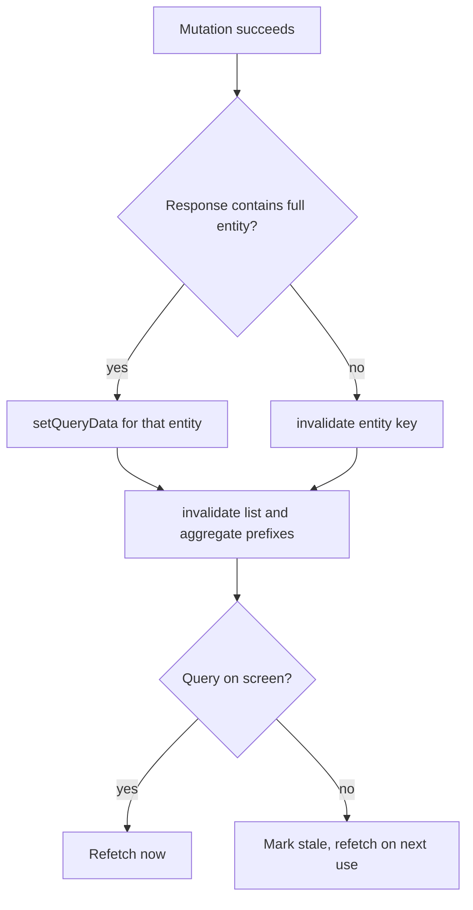

**Trade-offs:** Broad invalidation is simple and correct but can trigger a burst of requests. Manual cache writes are fast but duplicate business rules and drift over time. Push invalidation is the most accurate but needs infrastructure.

**What interviewers listen for:**
- "Invalidate by prefix" with a key hierarchy designed for it.
- Not recomputing balances on the client. Let the server compute money.
- Awareness of the async case: a payment is "pending", so the balance may not change yet. Show pending state rather than faking the final number.
- Red flag: `window.location.reload()` or `refetch()` on every query in the app.

> **Interview tip:** Say "There are only two hard things in computer science..." only if you then give a concrete strategy. Interviewers have heard the joke.

#### Q: [Staff] Product wants the "Transfer funds" action to feel instant using optimistic updates. Walk me through how you would implement it, including rollback, and tell me where you would refuse to be optimistic.

**Short answer:** Optimistic updates show the expected result before the server confirms, then roll back if it fails. For money I would be optimistic about the *presentation* (show the transfer as "Pending" in the list right away) but never about the *outcome* (never show the new balance or "Success" before the server confirms). Every transfer carries an idempotency key, so retries cannot double-move money.

**Clarify first:**
- Is the transfer synchronous (ledger updated in the request) or async (queued, may fail on fraud or limit checks later)?
- What is the p95 latency? If it is 400 ms, a good pending state may be enough without optimism.
- Can the user leave the page while it is in flight? What do they see when they come back?
- Are there regulatory rules on what you may display (for example "funds sent" before settlement)?

**Diagnose:** Measure where the "slow" feeling comes from. If the button shows nothing for 2 s, the fix is immediate feedback (disable, spinner, "Sending..."), not optimism. Check server-side failure rate for transfers: if 3% fail on limit checks, optimistic success messages would lie to 3 users in 100.

**Solution:**

Optimistic pattern with snapshot and rollback (TanStack Query v5):

```ts
type Transfer = {
  id: string;
  fromAccountId: string;
  toAccountId: string;
  amountCents: number;
  status: 'pending' | 'completed' | 'failed';
};

export function useTransfer(fromAccountId: string) {
  const queryClient = useQueryClient();
  const listKey = ['accounts', fromAccountId, 'transfers'] as const;

  return useMutation({
    mutationFn: (input: { toAccountId: string; amountCents: number; idempotencyKey: string }) =>
      api.createTransfer(fromAccountId, input, { headers: { 'Idempotency-Key': input.idempotencyKey } }),

    onMutate: async (input) => {
      // Stop in-flight refetches overwriting our optimistic row.
      await queryClient.cancelQueries({ queryKey: listKey });
      const previous = queryClient.getQueryData<Transfer[]>(listKey);

      const optimistic: Transfer = {
        id: `temp-${input.idempotencyKey}`,
        fromAccountId,
        toAccountId: input.toAccountId,
        amountCents: input.amountCents,
        status: 'pending', // honest: we show it as pending, not completed
      };
      queryClient.setQueryData<Transfer[]>(listKey, (old = []) => [optimistic, ...old]);
      return { previous };
    },

    onError: (_err, _input, context) => {
      // Roll back to the snapshot.
      if (context?.previous) queryClient.setQueryData(listKey, context.previous);
      toast.error('Transfer failed. No money was moved.');
    },

    onSettled: () => {
      // Always resync with the server, success or failure.
      return queryClient.invalidateQueries({ queryKey: ['accounts', fromAccountId] });
    },
  });
}
```

Generate the idempotency key once per user intent (when the confirm dialog opens), not per click, so a double click or a retry sends the same key.

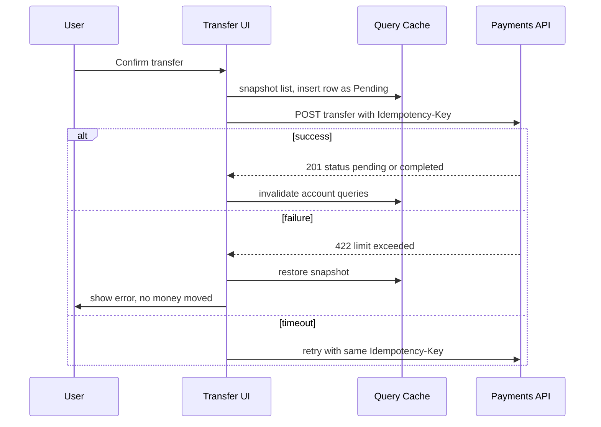

Where I would NOT be optimistic:
- **Balances.** Do not subtract the amount from the displayed balance before confirmation. Fees, FX rates and holds are computed server-side.
- **Success confirmation.** No "Money sent" screen, receipt or reference number until the server returns it.
- **Irreversible or external effects:** card payments, trades at market price, withdrawals to external banks.
- **High failure-rate operations:** anything with fraud, KYC or limit checks.

Where optimism is fine: renaming an account nickname, starring a payee, toggling a notification setting, reordering a watchlist. Cheap, reversible, almost never fails.

On timeout: the request may have succeeded. Do not roll back and say "failed". Show "We are checking the status", retry with the same idempotency key, or query the transfer by key.

**Trade-offs:**
- Optimistic UI feels fast but can show things that never happen. Rollbacks after a user has moved on are confusing.
- Pending-state UI is honest and still feels responsive, at the cost of a less "instant" demo.
- Idempotency keys need server support (storing key, request hash and response for a window such as 24 hours).

**What interviewers listen for:**
- The separation between optimistic *display* and confirmed *outcome*.
- `cancelQueries` before writing, snapshot in `onMutate`, rollback in `onError`, invalidate in `onSettled`.
- Handling the timeout case as "unknown", not "failed".
- Idempotency key per intent.
- Red flag: optimistically updating the balance, or showing "Success" before the 2xx.

> **Finance tip:** "Unknown" is a real state for payments. Design a UI for it. Users who see "failed" and then find the money gone will call support or, worse, send it again.

#### Q: [Senior] Our API returns portfolios with nested accounts, and each account has nested holdings with nested instrument objects. The same instrument appears in 40 places. When a price updates, half the screens show the old price. How do you fix the data model on the client?

**Short answer:** Normalize. Store each entity once, keyed by id, and reference it by id everywhere else. Then a price update touches one record and every view that reads it updates. Either use a normalized store (Redux Toolkit `createEntityAdapter`, or a normalized GraphQL cache like Apollo), or keep the query cache denormalized but keep fast-changing fields like prices in a separate keyed store.

**Clarify first:**
- What changes often (prices) vs rarely (instrument name, ISIN)?
- How many entities in total? 500 instruments or 500k?
- Is the API REST or GraphQL? Can we change the API?

**Diagnose:** Search for places that copy nested objects into local state or separate caches. With React DevTools, find components that show the old price and check which prop or cache entry they read. You will usually find several copies of the same instrument.

**Solution:**

Option 1: normalize on read with a small function. For REST payloads with clear shapes this is often enough.

```ts
type Instrument = { id: string; symbol: string; name: string; priceMinor: number; currency: string };
type Holding = { id: string; instrumentId: string; quantity: string }; // quantity as decimal string
type Account = { id: string; name: string; holdingIds: string[] };

type ApiAccount = { id: string; name: string; holdings: { id: string; quantity: string; instrument: Instrument }[] };

export function normalizePortfolio(accounts: ApiAccount[]) {
  const instruments: Record<string, Instrument> = {};
  const holdings: Record<string, Holding> = {};
  const accountsById: Record<string, Account> = {};

  for (const a of accounts) {
    accountsById[a.id] = { id: a.id, name: a.name, holdingIds: a.holdings.map((h) => h.id) };
    for (const h of a.holdings) {
      instruments[h.instrument.id] = h.instrument;
      holdings[h.id] = { id: h.id, instrumentId: h.instrument.id, quantity: h.quantity };
    }
  }
  return { instruments, holdings, accounts: accountsById };
}
```

Option 2: Redux Toolkit entity adapter for entities with frequent updates.

```ts
import { createEntityAdapter, createSlice, PayloadAction } from '@reduxjs/toolkit';

const instrumentsAdapter = createEntityAdapter<Instrument>();

const instrumentsSlice = createSlice({
  name: 'instruments',
  initialState: instrumentsAdapter.getInitialState(),
  reducers: {
    instrumentsReceived: instrumentsAdapter.upsertMany,
    pricesUpdated(state, action: PayloadAction<{ id: string; priceMinor: number }[]>) {
      instrumentsAdapter.updateMany(
        state,
        action.payload.map((p) => ({ id: p.id, changes: { priceMinor: p.priceMinor } })),
      );
    },
  },
});

export const instrumentSelectors = instrumentsAdapter.getSelectors(
  (s: RootState) => s.instruments,
);
// A row subscribes to one instrument only:
// const instrument = useSelector((s) => instrumentSelectors.selectById(s, id));
```

Option 3 (often best): split by change rate. Keep the portfolio structure in TanStack Query (changes rarely) and keep live prices in a small external store keyed by instrument id, read with `useSyncExternalStore`. A price tick then re-renders only the cells showing that instrument. See the WebSocket question in section 4.

**Trade-offs:**
- Normalized stores remove duplication but add mapping code and selectors to rebuild nested views.
- Denormalized query caches are simpler and match the API, but updates must touch every copy.
- `normalizr` solved this for years but is largely unmaintained now; a hand-written normalizer or RTK adapter is usually clearer.

**What interviewers listen for:**
- "Single source of truth per entity", ids as references.
- Separating fast-changing from slow-changing data.
- Selectors that subscribe narrowly so one price change does not re-render the whole portfolio.
- Red flag: deep-cloning and walking the whole tree on every tick.

## 3. Pagination and large lists

#### Q: [Mid] Offset pagination or cursor pagination for a transactions list where new transactions arrive constantly? Why?

**Short answer:** Cursor pagination. With offset (`?page=3&size=50`), a new transaction at the top shifts everything down, so page 3 repeats an item from page 2 or skips one. A cursor (`?after=<last id or timestamp>`) anchors on a specific row, so pages stay stable. Cursors are also faster on large tables because the database can seek with an index instead of scanning and discarding `OFFSET` rows.

**Clarify first:** Do users need to jump to "page 47" or see a total count? Is the list sorted by a stable, unique key?

**Diagnose:** Duplicate React keys warnings or "I saw this transaction twice" reports point to offset drift. On the backend, `EXPLAIN ANALYZE` on a query with `OFFSET 100000` will show it reading 100k rows to throw them away.

**Solution:**

```sql
-- Offset: cost grows with page number
SELECT id, posted_at, amount_cents, description
FROM transactions
WHERE account_id = $1
ORDER BY posted_at DESC, id DESC
LIMIT 50 OFFSET 5000;

-- Keyset / cursor: uses index on (account_id, posted_at DESC, id DESC)
SELECT id, posted_at, amount_cents, description
FROM transactions
WHERE account_id = $1
  AND (posted_at, id) < ($2, $3)   -- values from the last row of the previous page
ORDER BY posted_at DESC, id DESC
LIMIT 50;
```

The `id` tiebreaker matters: many transactions share the same `posted_at`. Without it, rows at the page boundary can be lost.

The API returns an opaque cursor, usually base64 of the sort values, so clients do not depend on its format:

```ts
type Page<T> = { items: T[]; nextCursor: string | null };
```

| | Offset | Cursor |
|---|---|---|
| Jump to page N | Yes | No (only next/prev) |
| Total count | Easy (but `COUNT(*)` can be slow) | Usually omitted or approximate |
| Stable under inserts | No | Yes |
| Deep page performance | Degrades | Constant |
| Good for | Admin tables, small sets | Feeds, infinite scroll, ledgers |

**Trade-offs:** Cursors cannot jump to arbitrary pages and make "page 12 of 40" UIs hard. Offset is fine for small, slowly changing data like a list of 300 payees.

**What interviewers listen for:** The drift explanation, the tiebreaker column, and the index that supports the cursor query. Red flag: "cursor is just the page number encoded".

#### Q: [Senior] Build infinite scroll for a statement history with up to 100k transactions. What does the implementation look like and what breaks at scale?

**Short answer:** Cursor-paginated fetching with `useInfiniteQuery`, a sentinel element watched by `IntersectionObserver` (or the virtualizer's range) to load the next page, and list virtualization so only visible rows are in the DOM. At scale, the things that break are DOM size, memory from keeping every page, scroll position on back navigation, and accessibility.

**Clarify first:**
- Do users need search, filter, or "jump to date"? Those often matter more than scrolling.
- Do they need to export or select all? That should be a server operation, not loading 100k rows.
- Fixed or variable row heights?

**Diagnose:** In the Performance panel, long tasks during scroll and a rising DOM node count (Performance monitor shows "DOM Nodes") mean you are not virtualizing. In the Memory panel, take heap snapshots after loading 50 pages to see retained page data.

**Solution:**

```tsx
import { useInfiniteQuery } from '@tanstack/react-query';
import { useVirtualizer } from '@tanstack/react-virtual';

function StatementList({ accountId }: { accountId: string }) {
  const query = useInfiniteQuery({
    queryKey: ['accounts', accountId, 'statement'],
    queryFn: ({ pageParam, signal }) => api.getStatement(accountId, { cursor: pageParam, limit: 100, signal }),
    initialPageParam: null as string | null,
    getNextPageParam: (last) => last.nextCursor, // null means no more pages
    maxPages: 20, // v5 option: keep at most 20 pages in memory
  });

  const rows = useMemo(() => query.data?.pages.flatMap((p) => p.items) ?? [], [query.data]);
  const parentRef = useRef<HTMLDivElement>(null);

  const virtualizer = useVirtualizer({
    count: query.hasNextPage ? rows.length + 1 : rows.length, // +1 for loader row
    getScrollElement: () => parentRef.current,
    estimateSize: () => 48,
    overscan: 10,
  });

  const items = virtualizer.getVirtualItems();

  useEffect(() => {
    const last = items[items.length - 1];
    if (!last) return;
    if (last.index >= rows.length - 1 && query.hasNextPage && !query.isFetchingNextPage) {
      void query.fetchNextPage();
    }
  }, [items, rows.length, query.hasNextPage, query.isFetchingNextPage, query.fetchNextPage]);

  return (
    <div ref={parentRef} style={{ height: 600, overflow: 'auto' }}>
      <div style={{ height: virtualizer.getTotalSize(), position: 'relative' }}>
        {items.map((v) => {
          const tx = rows[v.index];
          return (
            <div
              key={tx?.id ?? 'loader'}
              style={{ position: 'absolute', top: 0, left: 0, right: 0, transform: `translateY(${v.start}px)`, height: v.size }}
            >
              {tx ? <TransactionRow tx={tx} /> : 'Loading more...'}
            </div>
          );
        })}
      </div>
    </div>
  );
}
```

> **Gotcha:** `maxPages` drops pages from the start when you scroll down, so scrolling back up needs `getPreviousPageParam` too, otherwise the data is gone. Only use it if your API supports both directions.

What breaks at scale and fixes:
- **DOM size:** virtualize. 100k rows of 10 cells is 1M nodes without it.
- **Memory:** cap pages (`maxPages`) or accept it; 100k small objects are often only tens of MB, so measure first.
- **Back navigation:** store scroll offset and loaded page count, or keep the cache alive with `gcTime` so the list restores. Virtualizers accept `initialOffset`.
- **Find in page:** Ctrl+F cannot find unrendered rows. Provide a server search.
- **Accessibility:** screen readers cannot know the total size. Use `role="feed"` or table semantics with `aria-rowcount` and `aria-rowindex`, and consider a "Load more" button, which is more accessible than auto-loading.
- **Footer unreachable:** infinite scroll hides the footer. Put important links elsewhere.

**Trade-offs:** Infinite scroll is good for browsing, bad for finding and returning. Statements usually benefit more from date filters plus a "Load more" button. Virtualization breaks native find, print and some screen reader behaviour.

**What interviewers listen for:** Cursor pagination plus virtualization plus a loading trigger; memory and back-button thinking; the accessibility caveat; pushing exports and select-all to the server. Red flag: rendering all rows and adding `React.memo` to rows.

## 4. Real-time data

#### Q: [Staff] We need live prices on a watchlist of up to 200 instruments, plus balance updates when payments settle. Polling, Server-Sent Events, or WebSockets? Defend your choice.

**Short answer:** It depends on update rate and direction. For balance and payment status (rare, server-to-client), polling with a sensible interval or SSE is enough. For live prices (many updates per second, plus the client changing subscriptions as the watchlist changes), WebSockets fit best because they are bidirectional and low overhead per message. I would not pick one technology for everything.

**Clarify first:**
- How fresh must prices be? Every tick, or once a second is fine? Are these indicative or tradeable prices?
- How many concurrent users? What does the infrastructure (load balancers, proxies, corporate firewalls) support?
- Does the client need to send messages (subscribe/unsubscribe), or only receive?
- Auth model: cookies or bearer tokens? That affects SSE, because `EventSource` cannot set custom headers.

**Diagnose:** Before choosing, check the cost of the current approach. If you poll every 2 s with 10k users, that is 5k requests per second mostly returning "no change". Look at APM traces for that endpoint and at the share of responses that are identical to the previous one.

**Solution:**

| | Short polling | Long polling | SSE | WebSocket |
|---|---|---|---|---|
| Direction | Client pulls | Client pulls, server holds | Server to client | Both ways |
| Transport | Plain HTTP | Plain HTTP | HTTP, `text/event-stream` | Upgraded TCP connection |
| Reconnect | N/A | Manual | Built in, with `Last-Event-ID` | Manual |
| Auth headers | Yes | Yes | No with `EventSource` (cookies only) | Not on browser handshake; use cookie or token in first message |
| Infra friendliness | Best | Good | Good (watch proxy buffering) | Needs LB/proxy support, sticky or pub/sub fan-out |
| Best for | Rare changes, simplest | Legacy | Notifications, status, feeds | High-rate, interactive |

Recommended split:
- **Payment status, balance changes:** SSE `/api/events` that sends "balance-changed" events; the client invalidates the matching query keys. Or poll every 30–60 s with `refetchInterval` and refetch on focus, which is often good enough.
- **Prices:** one WebSocket per tab. Client sends `subscribe` with the visible symbols; server sends compact price messages.

```ts
// SSE as an invalidation channel
useEffect(() => {
  const es = new EventSource('/api/events', { withCredentials: true });
  es.addEventListener('balance-changed', (e) => {
    const { accountId } = JSON.parse((e as MessageEvent).data) as { accountId: string };
    void queryClient.invalidateQueries({ queryKey: ['accounts', accountId] });
  });
  es.onerror = () => {
    // EventSource reconnects automatically. Log, and fall back to polling if it keeps failing.
  };
  return () => es.close();
}, [queryClient]);
```

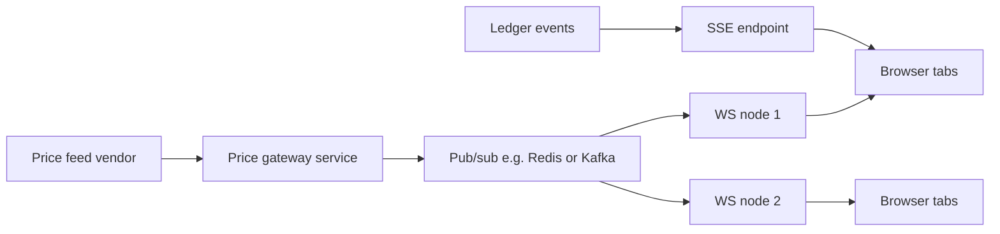

> **Gotcha:** Over HTTP/1.1 browsers allow about 6 connections per origin. Each SSE stream holds one open, so several tabs can starve normal requests. HTTP/2 multiplexes streams over one connection and mostly removes this. Also make sure proxies do not buffer `text/event-stream` responses.

Also consider many tabs: a `BroadcastChannel` or `SharedWorker` can share one connection across tabs. Shared workers have patchy support on some mobile browsers, so treat it as an optimisation.

**Trade-offs:**
- Polling: trivial, cacheable, works everywhere, but wasteful and laggy.
- SSE: simple, auto-reconnect, but one-way, text-only, and header limitations.
- WebSocket: most capable, but you own reconnection, heartbeats, backpressure, auth refresh and scaling of stateful connections.

**What interviewers listen for:**
- Picking per use case, with numbers (update rate, users, cost).
- Knowing SSE auto-reconnects and WebSockets do not.
- The `EventSource` header limitation and how to handle auth.
- Fan-out architecture: stateless WS nodes behind pub/sub.
- Red flag: "WebSockets are always better" or polling every 500 ms "because it is simple".

#### Q: [Senior] Implement a robust WebSocket client for live prices. It should reconnect, detect dead connections, resubscribe, and not freeze the UI when 500 updates arrive per second.

**Short answer:** Wrap the socket in a small client class outside React. Reconnect with exponential backoff and jitter, send an application-level heartbeat and treat missing pongs as a dead connection, resend subscriptions after reconnect, and buffer incoming ticks, flushing them once per animation frame into a store that components read with `useSyncExternalStore`. Components subscribe per symbol so a tick re-renders only one cell.

**Clarify first:** Message format and rate? Does the server send snapshots on subscribe, or only deltas? Do we need every tick (for a chart) or only the latest (for a price cell)?

**Diagnose:** In the Performance panel, record 10 s of live data. If you see a long chain of small tasks each doing a React commit, you are calling `setState` per message. React DevTools Profiler with "Highlight updates" shows the whole table flashing on each tick if subscriptions are too broad.

**Solution:**

```ts
type Tick = { s: string; p: number; t: number }; // symbol, price in minor units, server time
type Listener = () => void;

export class PriceSocket {
  private ws?: WebSocket;
  private attempt = 0;
  private heartbeat?: ReturnType<typeof setInterval>;
  private lastPong = 0;
  private subs = new Set<string>();
  private pending = new Map<string, Tick>(); // latest tick per symbol since last frame
  private prices = new Map<string, Tick>();
  private listeners = new Map<string, Set<Listener>>();
  private frame = 0;
  private closedByUser = false;

  constructor(private url: string) {}

  connect() {
    this.closedByUser = false;
    const ws = new WebSocket(this.url);
    this.ws = ws;

    ws.onopen = () => {
      this.attempt = 0;
      this.lastPong = Date.now();
      if (this.subs.size) ws.send(JSON.stringify({ type: 'subscribe', symbols: [...this.subs] }));
      this.heartbeat = setInterval(() => {
        if (Date.now() - this.lastPong > 20_000) {
          ws.close(4000, 'heartbeat timeout'); // triggers onclose -> reconnect
          return;
        }
        ws.send(JSON.stringify({ type: 'ping' }));
      }, 10_000);
    };

    ws.onmessage = (ev) => {
      const msg = JSON.parse(ev.data as string) as { type: 'pong' } | { type: 'ticks'; data: Tick[] };
      if (msg.type === 'pong') {
        this.lastPong = Date.now();
        return;
      }
      this.lastPong = Date.now(); // any traffic proves liveness
      for (const t of msg.data) this.pending.set(t.s, t); // coalesce: keep latest only
      if (!this.frame) this.frame = requestAnimationFrame(this.flush);
    };

    ws.onclose = () => {
      clearInterval(this.heartbeat);
      if (!this.closedByUser) this.scheduleReconnect();
    };
  }

  private scheduleReconnect() {
    const base = 500;
    const cap = 30_000;
    const delay = Math.random() * Math.min(cap, base * 2 ** this.attempt); // full jitter
    this.attempt++;
    setTimeout(() => this.connect(), delay);
  }

  private flush = () => {
    this.frame = 0;
    for (const [symbol, tick] of this.pending) {
      this.prices.set(symbol, tick);
      this.listeners.get(symbol)?.forEach((l) => l());
    }
    this.pending.clear();
  };

  subscribe(symbol: string, listener: Listener) {
    let set = this.listeners.get(symbol);
    if (!set) {
      set = new Set();
      this.listeners.set(symbol, set);
      this.subs.add(symbol);
      if (this.ws?.readyState === WebSocket.OPEN) {
        this.ws.send(JSON.stringify({ type: 'subscribe', symbols: [symbol] }));
      }
    }
    set.add(listener);
    return () => {
      set!.delete(listener);
      if (set!.size === 0) {
        this.listeners.delete(symbol);
        this.subs.delete(symbol);
        if (this.ws?.readyState === WebSocket.OPEN) {
          this.ws.send(JSON.stringify({ type: 'unsubscribe', symbols: [symbol] }));
        }
      }
    };
  }

  getPrice(symbol: string) {
    return this.prices.get(symbol);
  }

  close() {
    this.closedByUser = true;
    clearInterval(this.heartbeat);
    this.ws?.close(1000);
  }
}

export const priceSocket = new PriceSocket('wss://prices.example.com/v1/stream');

export function usePrice(symbol: string) {
  // Stable subscribe function, otherwise React resubscribes on every render.
  const subscribe = useCallback((cb: () => void) => priceSocket.subscribe(symbol, cb), [symbol]);
  return useSyncExternalStore(
    subscribe,
    () => priceSocket.getPrice(symbol), // must return the same reference if unchanged: it does
  );
}
```

Key points:
- **Heartbeat:** browsers cannot send WebSocket ping frames from JavaScript, and a dead TCP connection (laptop sleep, Wi-Fi change) can look open for minutes. An app-level ping/pong with a timeout detects it.
- **Backoff with jitter:** without jitter, a server restart makes 50k clients reconnect at the same instant (thundering herd).
- **Resubscribe on open:** the server forgets subscriptions when the connection drops.
- **Coalescing per frame:** 500 messages per second become at most ~60 flushes per second, and each symbol updates once per frame with its latest price.
- **Gap handling:** after reconnect, prices may have moved. Ask the server for a snapshot on subscribe, or refetch REST snapshots, and mark prices as stale while disconnected.
- **Visibility:** on `document.visibilitychange` to hidden, you can unsubscribe or reduce rate, then resubscribe when visible.

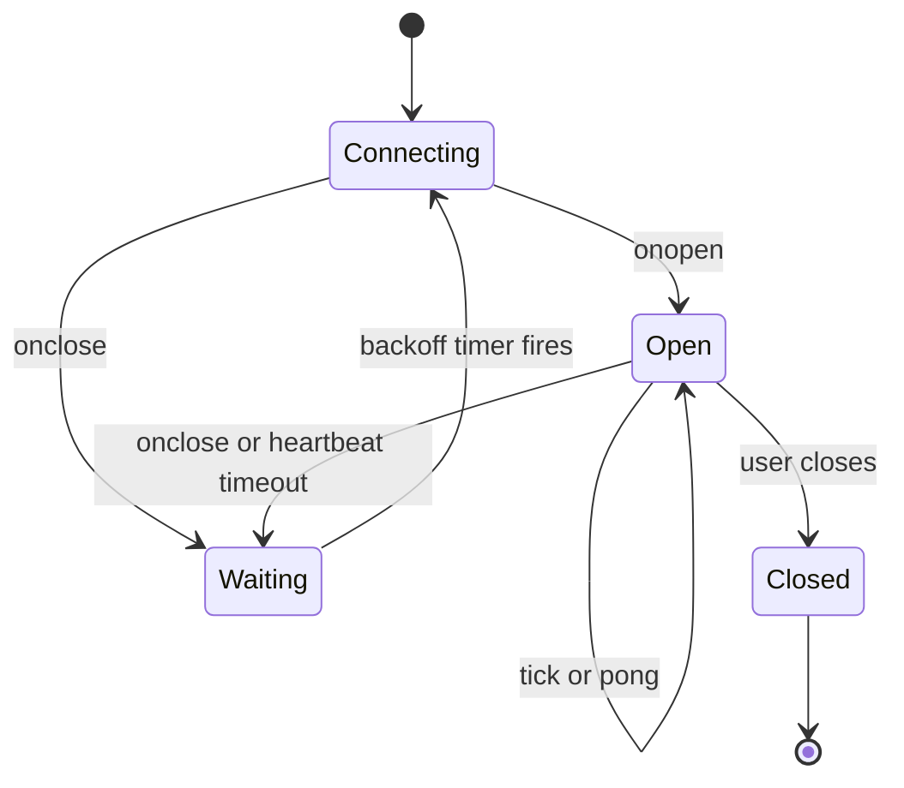

> **Finance tip:** Show connection state in the UI ("Live", "Reconnecting", "Delayed"). Users must not trade on prices they think are live but are 2 minutes old. Grey out or timestamp stale prices.

**Trade-offs:** Coalescing loses intermediate ticks, which is fine for a price cell but wrong for a tick chart or a trade blotter. For those, buffer all ticks and append in batches. Moving parsing into a Web Worker helps when message volume is high enough for `JSON.parse` to show up in profiles.

**What interviewers listen for:**
- State outside React, narrow subscriptions, `useSyncExternalStore`.
- Heartbeat because TCP can silently die; backoff with jitter; resubscribe.
- Batching per animation frame, and knowing when coalescing is wrong.
- Stale-price UX.
- Red flag: `setPrices({...prices, [s]: p})` in `onmessage` on a top-level component.

## 5. Failures and resilience

#### Q: [Senior] Design the retry policy for our API client. Which errors do you retry, how many times, and how do you avoid making an outage worse?

**Short answer:** Retry only transient failures on requests that are safe to repeat: network errors, timeouts, 408, 429, 502, 503, 504, and sometimes 500. Never retry 400, 401, 403, 404, 409 or 422, because the same request will fail the same way. Use exponential backoff with jitter, a small max (2–3 attempts for user-facing calls), respect `Retry-After`, and only retry non-idempotent requests like POST when they carry an idempotency key.

**Clarify first:** Which calls are user-blocking vs background? Does the backend support idempotency keys? Is there a gateway that already retries (retries at two layers multiply)?

**Diagnose:** In APM or logs, look at error codes per endpoint. If 503s spike during deploys, retries help. If 500s are deterministic bugs for certain inputs, retries only triple the load. Check whether a retry storm happened in past incidents: request rate rising while success rate falls is the signature.

**Solution:**

```ts
const RETRYABLE_STATUS = new Set([408, 429, 502, 503, 504]);
const SAFE_METHODS = new Set(['GET', 'HEAD', 'OPTIONS', 'PUT', 'DELETE']); // idempotent by HTTP semantics

type RetryOpts = { retries?: number; baseMs?: number; capMs?: number };

export async function fetchWithRetry(input: string, init: RequestInit = {}, opts: RetryOpts = {}) {
  const { retries = 3, baseMs = 300, capMs = 5_000 } = opts;
  const method = (init.method ?? 'GET').toUpperCase();
  const headers = new Headers(init.headers);
  const canRetry = SAFE_METHODS.has(method) || headers.has('Idempotency-Key');

  for (let attempt = 0; ; attempt++) {
    try {
      const res = await fetch(input, { ...init, headers });
      if (!RETRYABLE_STATUS.has(res.status) || !canRetry || attempt >= retries) return res;

      const retryAfter = res.headers.get('Retry-After');
      const serverDelay = retryAfter ? Number(retryAfter) * 1000 : NaN; // seconds form only; HTTP-date form ignored here
      await sleep(Number.isFinite(serverDelay) ? serverDelay : backoff(attempt, baseMs, capMs), init.signal);
    } catch (err) {
      if (init.signal?.aborted) throw err; // user cancelled, never retry
      if (!canRetry || attempt >= retries) throw err; // network error after last attempt
      await sleep(backoff(attempt, baseMs, capMs), init.signal);
    }
  }
}

function backoff(attempt: number, base: number, cap: number) {
  return Math.random() * Math.min(cap, base * 2 ** attempt); // "full jitter"
}

function sleep(ms: number, signal?: AbortSignal | null) {
  return new Promise<void>((resolve, reject) => {
    const id = setTimeout(resolve, ms);
    signal?.addEventListener('abort', () => {
      clearTimeout(id);
      reject(signal.reason);
    }, { once: true });
  });
}
```

With TanStack Query, configure it centrally instead of hand-rolling:

```ts
new QueryClient({
  defaultOptions: {
    queries: {
      retry: (failureCount, error) => {
        const status = (error as { status?: number }).status;
        if (status && status < 500 && status !== 408 && status !== 429) return false;
        return failureCount < 2;
      },
      retryDelay: (attempt) => Math.random() * Math.min(10_000, 500 * 2 ** attempt),
    },
    mutations: { retry: 0 }, // opt in per mutation, only with idempotency keys
  },
});
```

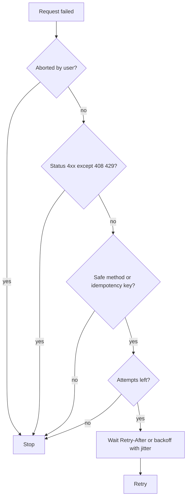

Protect the backend during outages: retry budgets (for example, retries may add at most 10% extra traffic), a client-side circuit breaker that stops calling an endpoint after repeated failures for 30 s, and showing the user a clear error with a manual "Try again" instead of retrying forever.

**Trade-offs:** More retries improve success under brief blips but increase latency for the user and load during real outages. Retrying 500 helps flaky infrastructure but hides bugs. Jitter makes timing less predictable for tests; inject the random function.

**What interviewers listen for:**
- The retryable vs non-retryable split, with reasons.
- Idempotency as the precondition for retrying writes.
- Jitter and `Retry-After`. Awareness of retry amplification across layers.
- Never retrying aborted requests.
- Red flag: `retry: 10` on everything, or retrying a payment POST without a key.

#### Q: [Senior] Users get logged out randomly. Logs show that when an access token expires, 5 parallel requests all get 401, all try to refresh, and the refresh token is rotated so 4 of them fail. How do you fix it?

**Short answer:** Make refresh single-flight. The first 401 starts a refresh and stores its promise; every other request that gets a 401 while refresh is in progress waits for that same promise, then retries once with the new token. If refresh fails, log out once. Also refresh proactively shortly before expiry so most requests never see a 401.

**Clarify first:**
- Who owns tokens: an SDK like Okta Auth JS with its token manager, or our own code?
- Is the refresh token rotating (one-time use)? Rotation is what turns parallel refreshes into logouts.
- Are there several tabs? They can race each other too.

**Diagnose:** In the Network tab, filter by the token endpoint. Several refresh calls within milliseconds confirm the race. Server logs will show "refresh token reuse detected", which in many identity providers revokes the whole session as a security measure.

**Solution:**

```ts
import axios, { AxiosError, InternalAxiosRequestConfig } from 'axios';

const api = axios.create({ baseURL: '/api' });
let refreshPromise: Promise<string> | null = null;

function refreshOnce(): Promise<string> {
  if (!refreshPromise) {
    refreshPromise = auth
      .refreshAccessToken() // your SDK or token endpoint call
      .finally(() => {
        refreshPromise = null;
      });
  }
  return refreshPromise;
}

api.interceptors.request.use((config) => {
  const token = auth.getAccessToken();
  if (token) config.headers.set('Authorization', `Bearer ${token}`);
  return config;
});

api.interceptors.response.use(undefined, async (error: AxiosError) => {
  const original = error.config as (InternalAxiosRequestConfig & { _retried?: boolean }) | undefined;
  if (error.response?.status !== 401 || !original || original._retried) throw error;

  original._retried = true; // retry each request at most once
  try {
    const token = await refreshOnce();
    original.headers.set('Authorization', `Bearer ${token}`);
    return api(original);
  } catch {
    auth.signOut({ reason: 'session_expired' }); // make signOut idempotent
    throw error;
  }
});
```

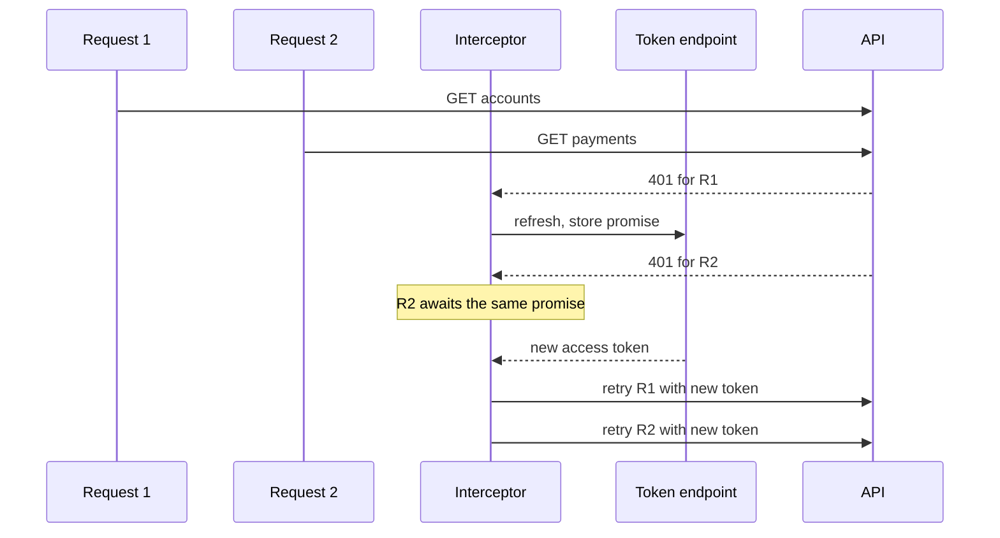

Other layers:
- **Proactive refresh:** schedule renewal at ~80% of token lifetime, or use the SDK's auto-renew (Okta Auth JS has a token manager with auto-renew; check your version's options).
- **Multi-tab:** use the Web Locks API (`navigator.locks.request('token-refresh', ...)`) or a `BroadcastChannel` so only one tab refreshes and the others pick up the new token from shared storage.
- **Do not retry non-idempotent requests blindly.** A 401 means the server rejected the request before processing it, so retrying a POST after 401 is usually safe, but confirm your gateway behaves that way.
- **Streams and WebSockets:** on token refresh, reauthenticate the socket (send a new token message) or reconnect.

**Trade-offs:** Queueing adds latency to requests that hit the expiry window. Proactive refresh can refresh tokens for idle tabs, so pair it with idle timeout logic. Storing tokens in memory is safer against XSS than `localStorage`, but makes multi-tab sharing harder.

**What interviewers listen for:**
- Single-flight promise, retry once, logout once.
- Recognising refresh token rotation and reuse detection as the root cause.
- Multi-tab awareness. Proactive refresh.
- Red flag: a `isRefreshing` boolean with a busy-wait loop, or retrying in a loop until it works.

#### Q: [Senior] The portfolio dashboard has 14 widgets fed by 9 services. When the FX service is down, the whole page shows an error screen. How should it behave, and how do you build it?

**Short answer:** Fail per widget, not per page. Each widget owns its own query, loading state and error boundary, so one failure shows a small "Couldn't load FX rates, retry" card while the other 13 render. Decide which data is critical (the page cannot work without it, like the user or account list) and which is optional. If a BFF aggregates calls, it should return partial results with per-section status instead of a 500.

**Clarify first:** Which widgets are essential? Do some widgets depend on others (portfolio value in base currency needs FX)? What should derived values show if an input is missing?

**Diagnose:** Find where the error escapes. Usually one of: a single `Promise.all` that rejects on the first failure; a page-level `if (isError) return <ErrorPage/>`; a render error thrown deep in one widget with only a root error boundary; or a BFF that returns 500 when any upstream fails.

**Solution:**

```tsx
import { ErrorBoundary } from 'react-error-boundary';
import { QueryErrorResetBoundary } from '@tanstack/react-query';

function Widget({ title, children }: { title: string; children: React.ReactNode }) {
  return (
    <QueryErrorResetBoundary>
      {({ reset }) => (
        <ErrorBoundary
          onReset={reset}
          fallbackRender={({ resetErrorBoundary }) => (
            <WidgetCard title={title}>
              <p role="alert">Could not load {title.toLowerCase()}.</p>
              <button onClick={resetErrorBoundary}>Retry</button>
            </WidgetCard>
          )}
        >
          <Suspense fallback={<WidgetSkeleton title={title} />}>{children}</Suspense>
        </ErrorBoundary>
      )}
    </QueryErrorResetBoundary>
  );
}

// Inside a widget: let errors reach the nearest boundary
function FxRatesWidget() {
  const { data } = useSuspenseQuery({ queryKey: ['fx', 'rates'], queryFn: api.getFxRates });
  return <FxTable rates={data} />;
}
```

Without Suspense, use `useQuery` and handle `isError` inside each widget. When you do need several requests together, use `Promise.allSettled` instead of `Promise.all`:

```ts
const [positions, fx] = await Promise.allSettled([api.getPositions(), api.getFxRates()]);
const total =
  positions.status === 'fulfilled' && fx.status === 'fulfilled'
    ? computeTotalInBase(positions.value, fx.value)
    : null; // show "Unavailable", never a wrong number
```

BFF contract for partial results:

```ts
type Section<T> = { status: 'ok'; data: T } | { status: 'error'; code: string; retryable: boolean };
type DashboardResponse = {
  positions: Section<Position[]>;
  fxRates: Section<FxRate[]>;
  news: Section<NewsItem[]>;
};
```

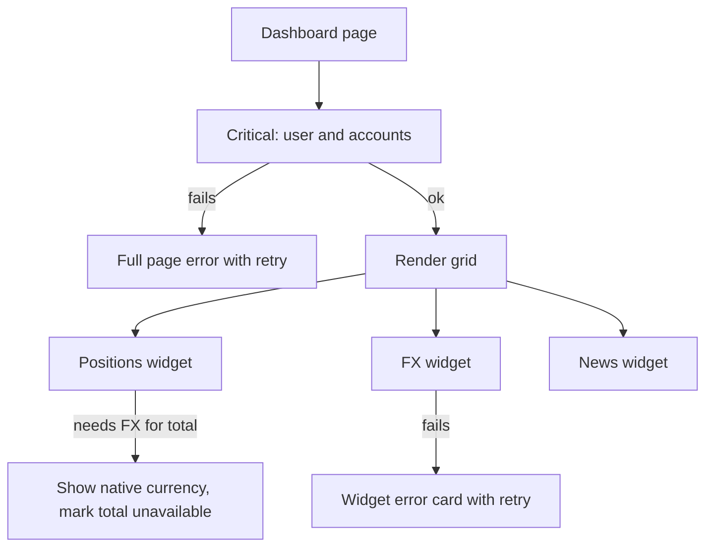

Also: per-widget timeouts so one slow service does not hold a skeleton forever, and RUM tracking of widget error rates per service.

> **Finance tip:** A missing number is better than a wrong number. If FX is down, do not show a portfolio total computed with yesterday's rate unless you label it ("Rates as of 09:14").

**Trade-offs:** More boundaries mean more UI states to design and test. Partial BFF responses make clients handle unions everywhere. Too many independent spinners can feel chaotic; group skeletons by row or reveal in a stable order.

**What interviewers listen for:**
- Critical vs optional data classification.
- Error boundaries per widget plus query reset, `allSettled` vs `all`.
- Derived values with missing inputs: show unavailable, not wrong.
- A BFF that degrades gracefully.
- Red flag: one global `isError` for the page, or catching and showing `0`.

#### Q: [Staff] Field advisors use our app on tablets with poor connectivity. They need to view client portfolios and draft orders offline, then sync. How would you design offline support and handle sync conflicts?

**Short answer:** Make reads offline-capable by caching app shell and data locally (service worker for assets, IndexedDB for data), and make writes an outbox: queue intents locally with ids and the version they were based on, replay them when online, and let the server detect conflicts with version checks. Conflicts are resolved by explicit rules per entity, and anything money-related needs human confirmation, not silent last-write-wins.

**Clarify first:**
- Which actions must work offline? Viewing is common; submitting a trade offline is usually not allowed, only drafting.
- How long offline? Minutes (tunnel) or days (field trip)? That decides storage size and staleness rules.
- Security: is caching client portfolio data on a device allowed? Encryption, wipe on logout, device management?
- Can two people edit the same record?

**Diagnose:** Map each screen to "read offline", "write offline (queued)", or "online only". Then test with DevTools Network "Offline" and with flaky throttling. `navigator.onLine` only tells you there is a network interface, not that the API is reachable, so real detection is "requests fail with network errors".

**Solution:**

Reads:
- Service worker (for example via Workbox) precaches the app shell; data requests use network-first with cache fallback.
- Persist the query cache to IndexedDB with TanStack Query's persister plugins (`persistQueryClient`), with a `maxAge` and a cache buster per app version.
- Show "Offline, data as of 14:02" banners.

Writes as an outbox:

```ts
type OutboxItem = {
  id: string;                 // client-generated UUID, doubles as idempotency key
  type: 'saveOrderDraft';
  entityId: string;
  baseVersion: number;        // version of the record the edit was based on
  payload: OrderDraftPatch;
  createdAt: string;
  attempts: number;
};

async function enqueue(item: Omit<OutboxItem, 'attempts'>) {
  await db.outbox.add({ ...item, attempts: 0 }); // e.g. Dexie over IndexedDB
  void flushOutbox();
}

async function flushOutbox() {
  const items = await db.outbox.orderBy('createdAt').toArray();
  for (const item of items) {
    try {
      const res = await fetch(`/api/order-drafts/${item.entityId}`, {
        method: 'PATCH',
        headers: {
          'Content-Type': 'application/json',
          'Idempotency-Key': item.id,
          'If-Match': `"${item.baseVersion}"`,
        },
        body: JSON.stringify(item.payload),
      });
      if (res.status === 412) {
        await db.conflicts.add({ item, server: await fetchLatest(item.entityId) });
        await db.outbox.delete(item.id);
        continue;
      }
      if (!res.ok) throw new Error(`HTTP ${res.status}`);
      await db.outbox.delete(item.id);
    } catch {
      await db.outbox.update(item.id, { attempts: item.attempts + 1 });
      break; // keep order; try again on next online event or timer
    }
  }
}

window.addEventListener('online', () => void flushOutbox());
```

TanStack Query also supports paused mutations: with the default `networkMode: 'online'`, mutations pause while offline and can resume after a reload if you persist them and set mutation defaults with `mutationFn` for each `mutationKey`, then call `queryClient.resumePausedMutations()`. That is fine for simple cases; an explicit outbox gives more control over ordering and conflicts.

Conflict strategies:

| Strategy | Use for | Risk |
|---|---|---|
| Last write wins | Preferences, UI settings | Silent data loss |
| Field-level merge | Profile forms where users edit different fields | Two edits to same field still conflict |
| Server rejects, user resolves | Order drafts, client details | Needs a resolution UI |
| Operation-based (append-only events) | Notes, activity logs | Order must be defined |
| CRDTs | Collaborative text, rich docs | Complexity, not for money |

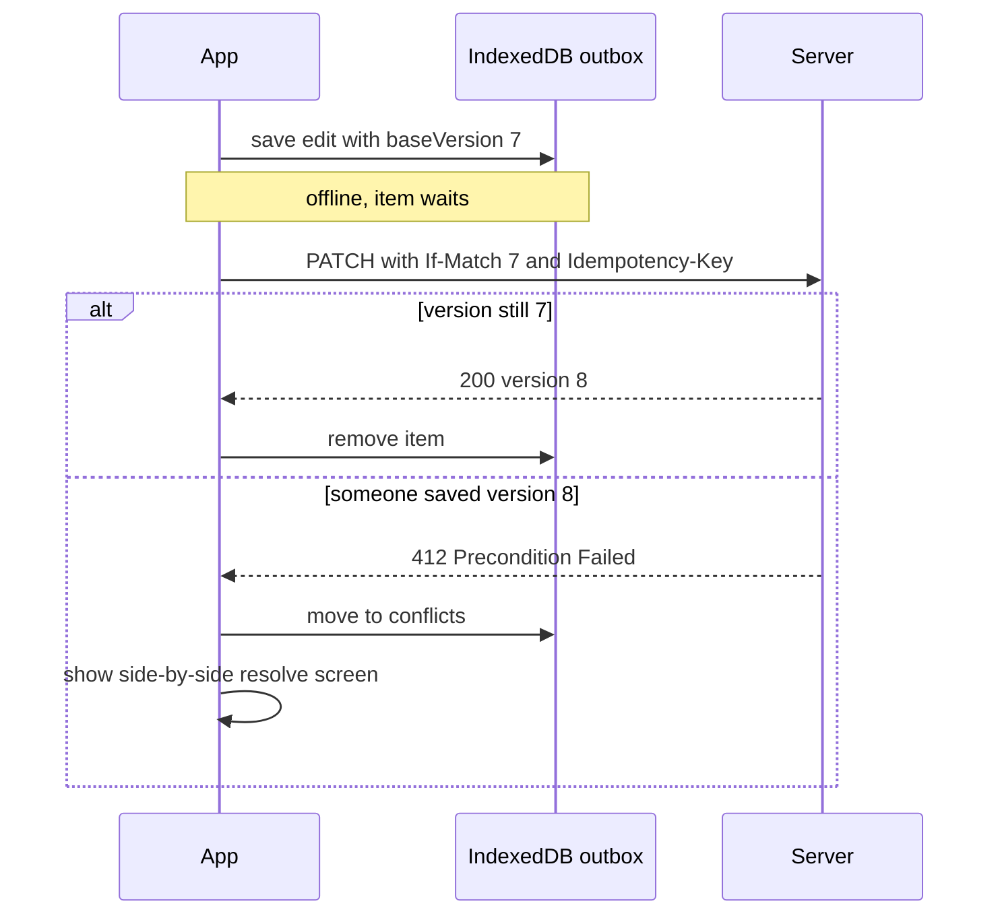

Background Sync API lets a service worker retry when connectivity returns even if the tab is closed, but it is Chromium-only as far as I know, so treat it as an enhancement.

> **Finance tip:** Never auto-submit a queued trade or payment after reconnect. Prices and balances have changed. Convert the queued item to a draft and ask for re-confirmation with current values.

**Trade-offs:** Offline adds a second source of truth, schema migrations for local storage, storage quotas (browsers may evict data; `navigator.storage.persist()` requests persistence), security exposure of data at rest, and a lot of test cases. Scope it to the flows that need it.

**What interviewers listen for:**
- Read caching vs write queueing as separate problems.
- Optimistic concurrency with versions/ETags and 412.
- Per-entity conflict policy, and refusing silent merges for money.
- `navigator.onLine` caveat, storage eviction, data-at-rest security.
- Red flag: "store everything in localStorage and post it when online".

## 6. Heavy data transfer

#### Q: [Staff] Users export 2 years of transactions as CSV (about 3 million rows). The current button builds the CSV in the browser and the tab crashes. How do you redesign it?

**Short answer:** Move export generation to the server. For small exports, stream the CSV directly from the server so the browser downloads it to disk without holding it in memory. For large ones, start a background job, return a job id, poll or push its status, and when done give the user a short-lived signed URL. Never build multi-megabyte files from JSON in JavaScript memory.

**Clarify first:**
- Typical and maximum export size? Formats (CSV, XLSX, PDF statements)?
- Must it be consistent to a point in time (statement as of month end)?
- Are there audit or data-retention rules for generated files?
- How many users export at once (month end spikes)?

**Diagnose:** Memory panel: the heap grows by gigabytes as the client fetches pages and concatenates strings, then a `Blob` duplicates it. Performance panel: one long task during CSV building, freezing the UI. Server logs: dozens of paginated requests per export.

**Solution:**

Option 1: server-streamed download (up to a few hundred MB, generated within an HTTP timeout).

```ts
// Node/Express: stream rows from a DB cursor, never load them all
import { pipeline } from 'node:stream/promises';
import { Transform } from 'node:stream';

app.get('/api/accounts/:id/transactions.csv', requireAuth, async (req, res) => {
  res.setHeader('Content-Type', 'text/csv; charset=utf-8');
  res.setHeader('Content-Disposition', `attachment; filename="transactions-${req.params.id}.csv"`);
  res.write('date,description,amount,currency\n');

  const rows = db.streamTransactions(req.params.id, { from: req.query.from, to: req.query.to }); // Readable in object mode
  const toCsv = new Transform({
    objectMode: true,
    transform(tx: TxRow, _enc, cb) {
      cb(null, `${tx.postedAt},${csvEscape(tx.description)},${formatMinor(tx.amountCents)},${tx.currency}\n`);
    },
  });
  await pipeline(rows, toCsv, res); // handles backpressure and client disconnects
});

function csvEscape(value: string) {
  // Quote, double quotes, and neutralise spreadsheet formulas (CSV injection)
  const safe = /^[=+\-@\t\r]/.test(value) ? `'${value}` : value;
  return `"${safe.replace(/"/g, '""')}"`;
}
```

On the client, a plain link (or `window.location.assign(url)`) lets the browser stream to disk:

```tsx
<a href={`/api/accounts/${id}/transactions.csv?from=${from}&to=${to}`} download>
  Download CSV
</a>
```

With cookie auth this just works. With bearer tokens, a link cannot send the header, so fetch a short-lived signed download URL first.

Option 2: background job (millions of rows, PDFs, anything slow).

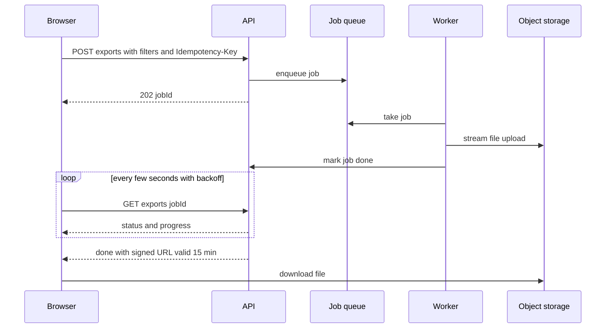

```ts
function useExportJob(jobId: string | null) {
  return useQuery({
    queryKey: ['exports', jobId],
    queryFn: () => api.getExportJob(jobId!),
    enabled: !!jobId,
    refetchInterval: (query) => {
      const status = query.state.data?.status;
      return status === 'done' || status === 'failed' ? false : 3_000; // stop when finished
    },
  });
}
```

Also: let users leave the page (notify by in-app notification or email when ready), deduplicate identical export requests, and list recent exports so they can download again.

Option 3, if it must be client-side (offline, data already local): generate in a Web Worker in chunks and write with the File System Access API (`showSaveFilePicker` and a writable stream). This is Chromium-only, so you need a fallback.

> **Gotcha:** Building a CSV with `rows.map(...).join('\n')` and `new Blob([csv])` holds the data at least twice in memory, plus the JSON it came from. A 3M-row export can easily need several GB.

**Trade-offs:** Streaming is simple but tied to one HTTP request, so timeouts and dropped connections restart from zero. Background jobs add queue, storage, cleanup and notification work, but scale and survive navigation. Signed URLs must be short-lived and scoped to the user.

**What interviewers listen for:**
- Moving heavy work to the server, streaming with backpressure.
- The async job pattern with 202, polling that stops, and signed URLs.
- CSV injection escaping, point-in-time consistency, audit.
- Red flag: "paginate in the browser and concatenate".
