## 1. Deploys, Builds and Environments

#### Q: [Senior] Right after a deploy, some users see a white screen. Others are fine. Error tracking shows `ChunkLoadError: Loading chunk 412 failed`. What happened and how do you fix it for good?

**Short answer:** Users who had the old version open still have the old `index.html` and old JS in memory. When they navigate to a lazy route, the old code asks for an old chunk file, like `Statements-a1b2.js`, that the new deploy deleted. The request 404s, the dynamic import rejects, and with no error boundary the whole app unmounts. The fix has three parts: keep old assets for a while, cache `index.html` correctly, and catch chunk failures with a retry or a reload.

**Clarify first:**
- Does it only affect users with a tab open across the deploy, or also fresh loads? (Fresh loads failing points to a CDN or caching bug, not version skew.)
- Does the deploy delete old files from the bucket or CDN?
- What headers does `index.html` get? Is there a service worker?
- Is there an error boundary around lazy routes?

**Diagnose:**
1. In the error tracker, group the `ChunkLoadError` events by release and by time since deploy. A spike right after each deploy that fades within hours confirms version skew.
2. Check the failing URL. Fetch it with curl. A 404 means the file was removed. A 200 that returns HTML means your server's SPA fallback is serving `index.html` for missing JS files, which fails with "Unexpected token <".
3. Check headers on `index.html`:

```bash
curl -sI https://app.example.com/ | grep -i -E 'cache-control|etag|age'
# Bad:  cache-control: public, max-age=86400   (users can keep old HTML for a day)
# Good: cache-control: no-cache                 (always revalidate)
```

4. Different bundlers show different messages for the same problem. webpack throws an error with `name === 'ChunkLoadError'`. Native dynamic imports (Vite) fail with a `TypeError` whose text differs by browser: "Failed to fetch dynamically imported module" in Chrome, "Importing a module script failed" in Safari. Search for all of them.

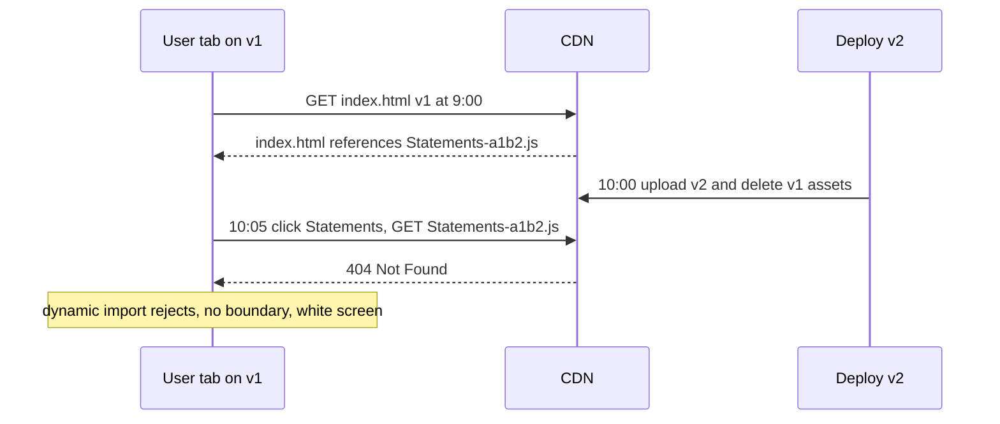

**Solution:**

Fix 1, deployment. Do not delete old hashed assets on deploy. Keep at least the previous few releases (or 7+ days). Hashed filenames never collide, so this is safe.

Fix 2, caching headers.

```nginx
location = /index.html {
  add_header Cache-Control "no-cache";
}
location /assets/ {
  add_header Cache-Control "public, max-age=31536000, immutable";
  try_files $uri =404;   # never fall back to index.html for missing assets
}
```

Fix 3, retry the import, then reload once.

```ts
// lazyWithRetry.ts
import { lazy, type ComponentType } from 'react';

const RELOAD_KEY = 'chunk-reload-at';

function isChunkError(err: unknown) {
  const msg = err instanceof Error ? `${err.name} ${err.message}` : String(err);
  return /ChunkLoadError|Loading chunk|dynamically imported module|Importing a module script failed/i.test(msg);
}

export function lazyWithRetry<T extends ComponentType<any>>(factory: () => Promise<{ default: T }>) {
  return lazy(async () => {
    try {
      return await factory();
    } catch (err) {
      if (!isChunkError(err)) throw err;
      // One quick retry covers a flaky network.
      try {
        await new Promise((r) => setTimeout(r, 500));
        return await factory();
      } catch {
        // Probably a new version. Reload once, guarded against loops.
        const last = Number(sessionStorage.getItem(RELOAD_KEY) ?? 0);
        if (Date.now() - last > 60_000) {
          sessionStorage.setItem(RELOAD_KEY, String(Date.now()));
          window.location.reload();
          return new Promise<never>(() => {}); // keep Suspense showing until reload
        }
        throw err; // let the error boundary show "please refresh"
      }
    }
  });
}

const Statements = lazyWithRetry(() => import('./routes/Statements'));
```

Note: the browser caches a failed module import for that URL in some engines, so a plain retry of the same URL may fail again. That is why the reload fallback matters.

Vite also fires an event you can use globally:

```ts
window.addEventListener('vite:preloadError', (event) => {
  event.preventDefault(); // stop the error being thrown
  window.location.reload();
});
```

Fix 4, an error boundary around routes so a failure shows "A new version is available. Refresh" instead of a white screen.

Fix 5, proactive version check. Poll a `/version.json` every few minutes (or on route change) and show a "New version available" banner, so users reload at a safe moment instead of mid-flow.

**Trade-offs:**
- Keeping old assets costs storage, which is cheap.
- Auto-reload can lose unsaved form data. In a payment flow, show a banner instead of reloading.
- A service worker that precaches assets can make skew worse if it serves old HTML. If you have one, make sure it updates and calls `skipWaiting` deliberately.

**What interviewers listen for:**
- You explain version skew, not "the CDN was down."
- Correct cache headers for HTML vs hashed assets.
- Reload loop protection.
- The SPA fallback serving HTML for missing JS gotcha.
- Red flag: "tell users to clear their cache."

> **Gotcha:** A white screen with no error in your tracker often means the error happened before the tracker loaded. Load the error SDK early in the entry, or add a tiny inline `window.onerror` in `index.html` that reports to a beacon endpoint.

#### Q: [Mid] It works locally but breaks in production. What are the usual suspects and how do you check each?

**Short answer:** The production build is a different program from the dev server. Code is minified, environment variables are baked in at build time, it runs on a different origin with different headers, and it talks to different APIs. I compare the two environments systematically instead of guessing.

**Clarify first:** What exactly breaks: a crash, wrong data, a blank area? All users or some? Does a local production build (`vite build && vite preview`) reproduce it?

**Diagnose:** Run the production build locally first. That splits "build problem" from "environment problem."

| Suspect | How it shows up | How to check |
| --- | --- | --- |
| Env vars | API calls go to `undefined/api/...` or localhost | Search the built JS for the value. In Vite only `VITE_` prefixed vars are exposed, and they are replaced at build time, not read at runtime |
| Minification | Code relying on `fn.name` or `constructor.name` breaks | Errors like `e is not a function` in a minified stack. Use source maps |
| Dead code / tree-shaking | A module with side effects (polyfill, CSS, registration) is removed | Check `sideEffects` in package.json |
| Case-sensitive paths | `import './Button'` but file is `button.tsx` works on macOS, fails on Linux CI | Build fails or import resolves wrongly in CI |
| Origin and CORS | API works through the dev proxy, fails in prod | Dev server proxies avoid CORS. Check prod response headers |
| CSP | Inline scripts, `eval`, third-party domains blocked | Console shows "Refused to load ... Content Security Policy" |
| HTTPS-only APIs | Clipboard, crypto.subtle, service workers need a secure context | Usually works on localhost because localhost counts as secure |
| Base path | App deployed under `/portal/` but built for `/` | 404s for assets. Check `base` in Vite or `publicPath` in webpack |
| Dev-only behavior | StrictMode double effects, dev warnings, mock service worker | Code that depended on a mock |
| Data | Prod has real data shapes: nulls, long names, 0 accounts, other currencies | Check the failing user's actual API response |

```ts
// A runtime config pattern so one build works in every environment:
// index.html loads /config.js, generated per environment at deploy time.
declare global {
  interface Window { __APP_CONFIG__: { apiBaseUrl: string; oktaIssuer: string } }
}
export const config = window.__APP_CONFIG__;
```

**Solution:** Fix the specific cause, then add the guardrail: a production-build smoke test in CI (build, preview, run a Playwright check), validation of required env vars at build time, and source maps uploaded to your error tracker.

```ts
// vite.config.ts - fail the build if a required var is missing
const required = ['VITE_API_BASE_URL', 'VITE_OKTA_ISSUER'];
for (const key of required) {
  if (!process.env[key]) throw new Error(`Missing env var ${key}`);
}
```

Note that `process.env` in the config file only sees variables from the shell. Use Vite's `loadEnv` if your values live in `.env` files.

**Trade-offs:** Runtime config adds a request before the app starts. Build-time config means one build per environment, which breaks "build once, promote everywhere."

**What interviewers listen for:** "Reproduce with a local production build first." Knowing env vars are compile-time in SPAs. Dev proxy hiding CORS. Real prod data shapes.

#### Q: [Mid] You get this from the error tracker: `TypeError: Cannot read properties of undefined (reading 'amountCents') at t.render (main.8f3a.js:1:48213)`. How do you get from this to a fix?

**Short answer:** First make the stack readable with source maps so I know the file and line. Then use the context the tracker gives (release, route, browser, breadcrumbs, user actions) to form a hypothesis about which data was undefined and why. Then reproduce it with that exact data, write a failing test, and fix the root cause, not just add `?.`.

**Clarify first:** How many users and since which release? One route or many? Is there a session replay attached?

**Diagnose:**
1. Source maps. Generate them in the build but do not serve them publicly. Upload them to the tracker tagged with the release.

```ts
// vite.config.ts
export default defineConfig({
  build: { sourcemap: 'hidden' }, // .map files written, no sourceMappingURL comment in JS
});
```

```bash
# Upload in CI, then delete .map files from the deploy artifact.
# Sentry:  sentry-cli sourcemaps upload --release "$RELEASE" ./dist
# Datadog: datadog-ci sourcemaps upload ./dist --service web --release-version "$RELEASE" --minified-path-prefix https://app.example.com/
```

Now the frame reads `TransactionRow.tsx:42 row.pending.amountCents`.

2. Read the breadcrumbs: the last API calls, clicks and route changes before the error. Look at the response of the API call right before.
3. Check the first-seen release. If it started in release 4.12, diff 4.12 against 4.11 for that component and its data hook.
4. Look for patterns in tags: one browser, one account type, one feature flag variant.
5. Reproduce. Use the tracker's request data (with PII removed) or a replay. Mock that exact response with MSW or a fixture and load the page.

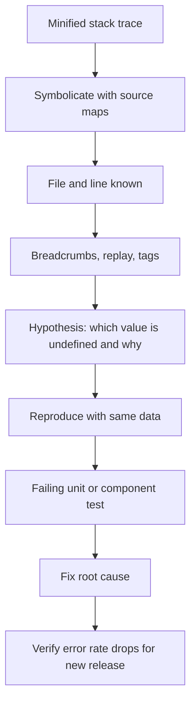

**Solution:** In this example, suppose pending transactions from a new backend version have no `pending` object. Options:
- Fix the type and data contract. If `pending` can be absent, the TypeScript type must say `pending?: PendingInfo`, and the UI must handle it.
- Validate API responses at the boundary (Zod) so bad shapes fail in one known place with a clear message, instead of deep in render.

```ts
import { z } from 'zod';

const Txn = z.object({
  id: z.string(),
  amountCents: z.number().int(),
  pending: z.object({ amountCents: z.number().int() }).optional(),
});
export type Txn = z.infer<typeof Txn>;

export async function getTxns(accountId: string): Promise<Txn[]> {
  const res = await api.get(`/accounts/${accountId}/transactions`);
  return z.array(Txn).parse(res.data);
}
```

- Add a consumer contract test (for example Pact) so the backend cannot drop the field without a failing build.

**Trade-offs:** Runtime validation costs CPU on big payloads. Validate at the edge, consider `safeParse` and logging instead of crashing for non-critical fields.

**What interviewers listen for:**
- Hidden source maps, uploaded per release.
- Using breadcrumbs and release diff, not reading code at random.
- A failing test before the fix.
- Root cause (contract) instead of sprinkling optional chaining.
- Red flag: publishing source maps publicly without thinking about it, or "I would add `?.` and close the ticket."

## 2. Leaks, Loops and Race Conditions

#### Q: [Senior] Support says the app "gets slower the longer I use it" and Chrome eventually shows "Aw, Snap! Out of memory." How do you find the leak?

**Short answer:** I reproduce the growth with a repeated action, take heap snapshots, and compare them to find object types that grow with each repetition. Then I read the retainer chain to find who still holds a reference. In React SPAs the cause is almost always something not cleaned up on unmount: an interval, a global listener, a subscription, an imperative library instance, or a module-level cache.

**Clarify first:** Which screens do they use most? Does memory drop if they navigate to a simple page? Is it per route change or over time on one screen?

**Diagnose:**
1. Find the action that leaks. Open Performance monitor and watch "JS heap size" and "DOM Nodes" while you switch between two routes 20 times. If the DOM node count keeps rising after you leave a route, that route leaks DOM.
2. Heap snapshots:
   - Snapshot A after warming up.
   - Do the action 10 times. Click the trash-can icon (collect garbage). Snapshot B.
   - Select B, view "Comparison" with A. Sort by "# New" or "Size Delta."
3. Type "Detached" in the class filter. Detached `HTMLDivElement` trees that grow with every route change are the clearest leak signal.
4. Select one detached node and read "Retainers." Example chain:

```text
HTMLDivElement (detached)
  <- chartContainer in Context (closure)
  <- onResize in system / Context
  <- [listeners] in Window
```

That says: a `resize` listener closure on `window` still references the chart container, so the whole chart subtree cannot be freed.

5. For JS objects without DOM, look for growing `Array`, `Map`, or `(closure)` counts and follow retainers the same way.

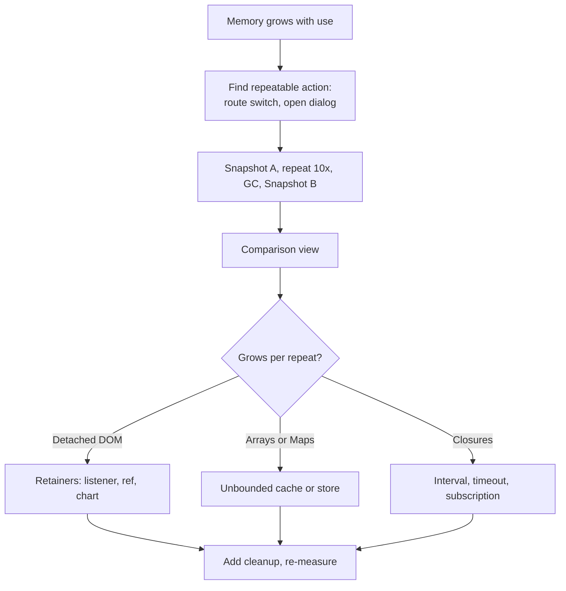

**Solution:** Every effect that starts something must stop it.

```tsx
function PriceTicker({ symbol }: { symbol: string }) {
  const [price, setPrice] = useState<number | null>(null);

  useEffect(() => {
    const controller = new AbortController();
    const unsubscribe = priceFeed.subscribe(symbol, setPrice);
    const id = setInterval(() => {
      fetch(`/api/quotes/${symbol}`, { signal: controller.signal })
        .then((r) => r.json())
        .then((q) => setPrice(q.price))
        .catch((e) => {
          if (e.name !== 'AbortError') report(e);
        });
    }, 10_000);

    // A listener added with the same signal is removed on abort.
    document.addEventListener('visibilitychange', onVisibility, { signal: controller.signal });

    return () => {
      controller.abort();
      clearInterval(id);
      unsubscribe();
    };
  }, [symbol]);

  return <span>{price ?? '...'}</span>;
}
```

Other leak sources to check:
- Third-party widgets (charts, maps, editors, date pickers) that need `.destroy()`.
- Event emitters or Redux middleware that register listeners per component mount.
- Module-level caches (`const cache = new Map()`) that grow forever. Bound them or use `WeakMap`.
- Session replay, logging and analytics tools buffering data. Check their limits.
- `console.log` of large objects in production. DevTools keeps logged objects alive while it is open.

Verify the fix with the same snapshot procedure. The detached count should stay flat.

**Trade-offs:** Fixing leaks is cheap per leak but finding them is slow. Add a cheap regression check: a Playwright test that switches routes 50 times and asserts DOM node count (via `document.getElementsByTagName('*').length`) stays within a band.

**What interviewers listen for:**
- Repeatable action plus snapshot comparison, not "look at the memory tab."
- Detached DOM and reading retainers.
- `AbortController` as a single cleanup handle for fetches and listeners.
- Red flag: "React cleans up everything automatically on unmount." React removes its own DOM, not your listeners and timers.

> **Outdated:** The React 17 warning "Can't perform a React state update on an unmounted component" was removed in React 18, because it was often a false alarm. A late `setState` is not a leak by itself. A subscription that is never removed is.

#### Q: [Mid] The page freezes and the console says "Maximum update depth exceeded." How do you find and fix an infinite re-render loop?

**Short answer:** Something sets state during every render or every effect run, and that state change triggers another render. The two common forms: calling a setter directly in render, and a `useEffect` whose dependency is a new object or function each render and that sets state. The stack trace in the console usually points at the component.

**Clarify first:** Which message exactly? "Too many re-renders" means state was set during render. "Maximum update depth exceeded" usually means an effect or a `componentDidUpdate` keeps setting state.

**Diagnose:**
1. Read the component stack in the error. React prints which component was updating.
2. If the tab is frozen, use DevTools "Pause script execution" and look at the call stack.
3. Add a temporary render counter to suspects:

```tsx
const renders = useRef(0);
renders.current++;
if (renders.current > 50) console.trace('render loop', renders.current);
```

4. Check each `useEffect` that calls a setter. Log its dependencies to see which one is "new" every time:

```tsx
useEffect(() => {
  console.log('deps', filters, onChange); // compare identity across logs
}, [filters, onChange]);
```

**Solution:** The usual patterns and fixes.

```tsx
// 1. Setting state in render
// Bad:   <button onClick={setOpen(true)}>      calls setOpen during render
// Good:  <button onClick={() => setOpen(true)}>

// 2. Effect depends on a new object every render
function Statements({ accountId }: { accountId: string }) {
  const filters = { accountId, status: 'posted' }; // new object each render
  const [rows, setRows] = useState<Txn[]>([]);
  useEffect(() => {
    fetchTxns(filters).then(setRows); // setRows -> render -> new filters -> effect again
  }, [filters]);
}
// Fix: depend on primitives, or useMemo the object.
useEffect(() => {
  fetchTxns({ accountId, status: 'posted' }).then(setRows);
}, [accountId]);

// 3. Syncing derived state with an effect
// Bad:
useEffect(() => setTotal(rows.reduce((s, r) => s + r.amountCents, 0)), [rows]);
// Good: compute during render, no state at all.
const totalCents = useMemo(() => rows.reduce((s, r) => s + r.amountCents, 0), [rows]);

// 4. Two-way sync between parent and child state
// Child calls onChange(value) in an effect, parent sets new value prop, child effect runs again.
// Fix: one source of truth. Make the child controlled, or only call onChange from event handlers.
```

With data fetching, a library like React Query removes most of these effects entirely, because the query key is compared by value, not reference.

**Trade-offs:** `useMemo` to stabilize dependencies works but is fragile. Restructuring (derive instead of sync, primitives in deps) is more robust.

**What interviewers listen for:** The two error messages and what each means, reference vs value equality in dependency arrays, "derive, do not sync," and the `eslint-plugin-react-hooks` exhaustive-deps rule as a guard (not something to silence).

#### Q: [Senior] Occasionally, switching quickly between accounts shows Account A's transactions under Account B's header. It happens maybe once a week for a user and you cannot reproduce it. How do you approach this?

**Short answer:** "Intermittent" plus "fast switching" almost always means a race condition: two requests in flight, and the slower, older one finishes last and overwrites the newer state. I would prove it by making the network slow and uneven on purpose, then fix it by ignoring or cancelling stale responses, or by keying cached data by account id so a response can only land in its own slot.

**Clarify first:** How is the data fetched (raw `useEffect` with `fetch`, Redux thunk, React Query)? Is there a websocket that can push updates for the previous account? Does the bug survive a refresh?

**Diagnose:**
1. Make it reproducible by controlling timing.
   - DevTools Network throttling, "Slow 4G."
   - Better: add artificial random latency with MSW in a dev build, so request order changes.

```ts
// msw handler for dev reproduction only
http.get('/api/accounts/:id/transactions', async ({ params }) => {
  await delay(params.id === 'acc_A' ? 2000 : 200); // A is slow, B is fast
  return HttpResponse.json(fixtures[params.id as string]);
});
```

   Click A, then quickly B. If A's data appears under B after two seconds, you have it.

2. Look at code for this shape:

```tsx
useEffect(() => {
  fetchTxns(accountId).then(setTxns); // no cancellation, no check
}, [accountId]);
```

3. In production telemetry, log the account id of the request and the account id currently selected when a response is applied. A mismatch counter confirms it in the field.

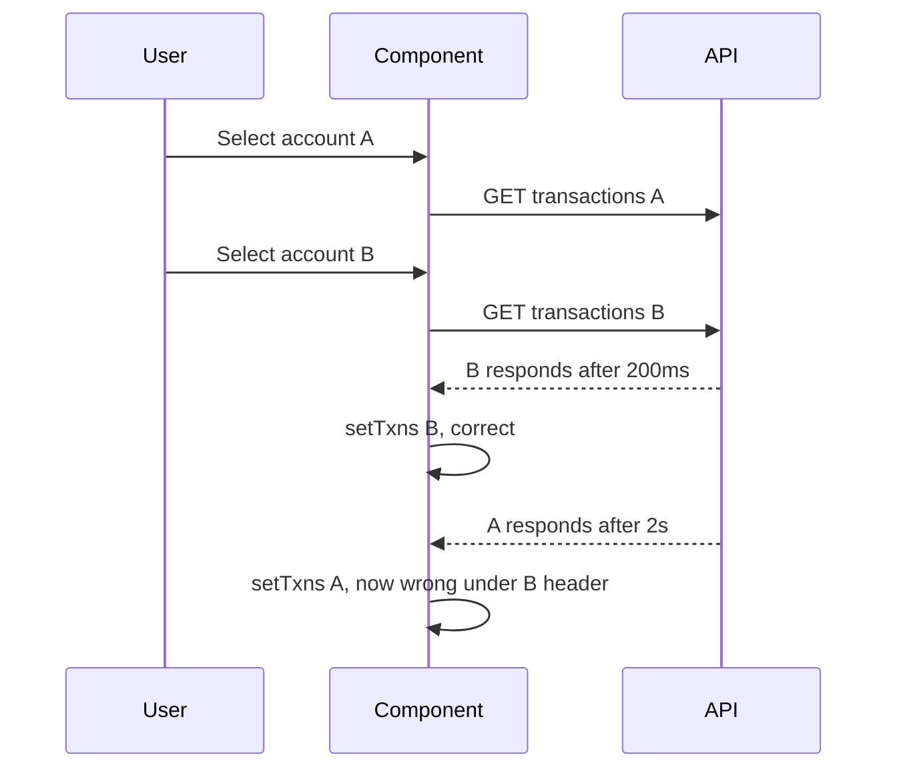

**Solution:**

Option 1, cancel or ignore stale requests in the effect.

```tsx
useEffect(() => {
  const controller = new AbortController();
  fetchTxns(accountId, { signal: controller.signal })
    .then(setTxns)
    .catch((e) => {
      if (e.name !== 'AbortError') setError(e);
    });
  return () => controller.abort(); // runs when accountId changes
}, [accountId]);
```

Option 2, use a cache keyed by the input. With React Query, data for A can only be written to `['txns', 'acc_A']`, and the component reads the key for the current account. The race cannot happen by construction.

```tsx
const { data, isPending } = useQuery({
  queryKey: ['txns', accountId],
  queryFn: ({ signal }) => fetchTxns(accountId, { signal }),
});
```

Option 3, for websocket pushes, include the account id in each message and drop messages that do not match the current subscription.

Option 4, for mutations (like two quick "save" clicks), use a sequence number or version so the server rejects older writes, and an idempotency key so retries do not double-apply.

Also show the data's own identity in the UI logic: render the header from the same object as the rows (`data.accountName`), not from a separate piece of state. Then even a bug cannot mix them.

**Trade-offs:** Aborting saves bandwidth but the server may still process the request. Ignoring stale responses is simpler where abort is not supported (some SDKs). Caching by key uses more memory but removes the class of bug.

**What interviewers listen for:**
- Naming it a race and explaining out-of-order responses.
- A way to reproduce deterministically (inject latency).
- Cancellation via effect cleanup, and keyed caches as the structural fix.
- Red flag: "add a debounce" (narrows the window but does not close it) or "add a `setTimeout`."

> **Finance tip:** Showing one customer's data under another's account header is a data exposure incident, not a cosmetic bug, if the accounts belong to different people (for example a delegated-access user). Treat it with security severity.

## 3. Network, Data and Browser Differences

#### Q: [Mid] The console shows "Access to fetch at 'https://api.example.com/accounts' from origin 'https://app.example.com' has been blocked by CORS policy." Explain what is happening and how to fix it properly.

**Short answer:** CORS is a browser rule that lets a server say which other origins may read its responses. The browser blocked our JavaScript from reading the response because the API did not send the right `Access-Control-Allow-*` headers. The fix is on the server (or a proxy), not in the frontend. CORS is not a security feature for the server. It protects users by stopping random sites from reading responses with their cookies.

**Clarify first:** Is this a new environment, a new header, or a new endpoint? Does it use cookies or a bearer token? Did it work through the dev server proxy?

**Diagnose:**
1. Network tab. Look for an `OPTIONS` request (the preflight) before the real request. A preflight happens when the request is not "simple," for example:
   - Method other than GET, HEAD, POST.
   - Custom headers like `Authorization` or `X-Request-Id`.
   - `Content-Type: application/json`.
2. Check the preflight response. It needs:
   - `Access-Control-Allow-Origin: https://app.example.com` (exact origin, or `*` only without credentials).
   - `Access-Control-Allow-Methods` including your method.
   - `Access-Control-Allow-Headers` including `Authorization`, `Content-Type`, and any custom header.
   - `Access-Control-Allow-Credentials: true` if you send cookies (`credentials: 'include'`).
3. Check the actual response too. It also needs `Access-Control-Allow-Origin`.
4. Check the status. A 500 or 401 from a gateway that does not add CORS headers appears to JS as a CORS error. The real problem may be the error, not CORS.

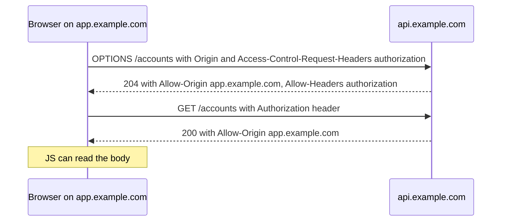

**Solution:**

```ts
// Express API with the cors package
import cors from 'cors';

const allowed = new Set(['https://app.example.com', 'https://staging.app.example.com']);

app.use(
  cors({
    origin: (origin, cb) => cb(null, !origin || allowed.has(origin)), // reflect only allowed origins
    credentials: true,
    allowedHeaders: ['Authorization', 'Content-Type', 'X-Request-Id', 'Idempotency-Key'],
    methods: ['GET', 'POST', 'PUT', 'PATCH', 'DELETE'],
    maxAge: 600, // cache preflight for 10 minutes
  }),
);
```

Alternatives: serve the API from the same origin through a reverse proxy (`app.example.com/api` to the API), which removes CORS entirely. Or a BFF.

What does not fix it: `mode: 'no-cors'` in fetch. That gives an opaque response you cannot read, so the app still breaks. Browser extensions that disable CORS only hide the issue on your machine.

**Trade-offs:** Reflecting any origin with credentials is a real vulnerability (any site could read user data). Same-origin proxying is simplest for the browser but adds a hop. Long `maxAge` reduces preflights but delays config changes.

**What interviewers listen for:**
- CORS is enforced by the browser and fixed on the server.
- Preflight triggers, credentials rule (no `*` with cookies).
- Error responses without CORS headers looking like CORS errors.
- Red flag: `no-cors`, or `Access-Control-Allow-Origin: *` plus credentials.

> **Gotcha:** Postman and curl never show CORS errors, because CORS is only enforced in browsers. "It works in Postman" proves nothing about CORS.

#### Q: [Senior] Some users report the "Submit payment" button spins forever. No error is shown. How do you debug a hanging request?

**Short answer:** A spinner that never stops means a promise that never settles, or a request that is stuck somewhere: queued in the browser, stalled on a connection, waiting on a slow server, or blocked behind a token refresh. I find which by looking at the request's timing breakdown and the client logic around it. Then I add timeouts, so nothing in the UI can wait forever, and make the payment safe to retry with an idempotency key.

**Clarify first:** Does the payment actually go through on the server? (Check backend logs by user and time.) Is it all users or some networks? Is there a retry or token refresh interceptor?

**Diagnose:**
1. Network tab, click the request, "Timing" tab:
   - **Queueing / Stalled** for a long time: the browser is waiting for a connection. On HTTP/1.1, Chrome allows about 6 connections per host. Long-polling or many parallel downloads can starve the payment call.
   - **Waiting for server response** is long: backend is slow. Check APM traces with the request id.
   - **(pending)** with no timing at all: maybe never sent, or blocked by a service worker.
2. If no request appears at all, the hang is in client code before the request: an awaited promise that never resolves.
3. Check auth interceptors. A common bug: on 401, the interceptor waits for a token refresh, the refresh itself gets a 401, and it waits for itself.

```ts
// Deadlock shape: refresh request goes through the same interceptor and waits on itself
let refreshing: Promise<string> | null = null;
api.interceptors.response.use(undefined, async (error) => {
  if (error.response?.status === 401) {
    refreshing ??= refreshToken(); // if refreshToken uses `api`, its 401 waits on `refreshing`
    const token = await refreshing;
    // ...
  }
});
```

4. Check the frontend RUM resource timings for that endpoint: p99 duration, and how many never complete.
5. Correlate with backend: send an `X-Request-Id` from the client, log it on both sides.

**Solution:**

1. Timeouts on every request.

```ts
export async function apiFetch(url: string, init: RequestInit & { timeoutMs?: number } = {}) {
  const { timeoutMs = 15_000, signal, ...rest } = init;
  const timeoutSignal = AbortSignal.timeout(timeoutMs);
  const combined = signal ? AbortSignal.any([signal, timeoutSignal]) : timeoutSignal;
  const res = await fetch(url, { ...rest, signal: combined });
  if (!res.ok) throw new HttpError(res.status, await res.text());
  return res;
}
```

`fetch` has no default timeout. With axios, set `timeout` on the instance. `AbortSignal.timeout` throws a `TimeoutError` DOMException, so you can tell timeouts from user cancels. Check browser support for `AbortSignal.any` if you support older browsers.

2. Idempotent payment submission, so a timeout can be retried safely.

```ts
async function submitPayment(p: PaymentDraft) {
  const idempotencyKey = p.idempotencyKey; // created once when the form opens, not per click
  const res = await apiFetch('/api/payments', {
    method: 'POST',
    headers: { 'Content-Type': 'application/json', 'Idempotency-Key': idempotencyKey },
    body: JSON.stringify({ toAccountId: p.to, amountCents: p.amountCents }),
    timeoutMs: 20_000,
  });
  return res.json();
}
```

3. After a timeout on a money movement, do not say "failed." Say "We are checking the status" and query the payment status by idempotency key. The server may have processed it.

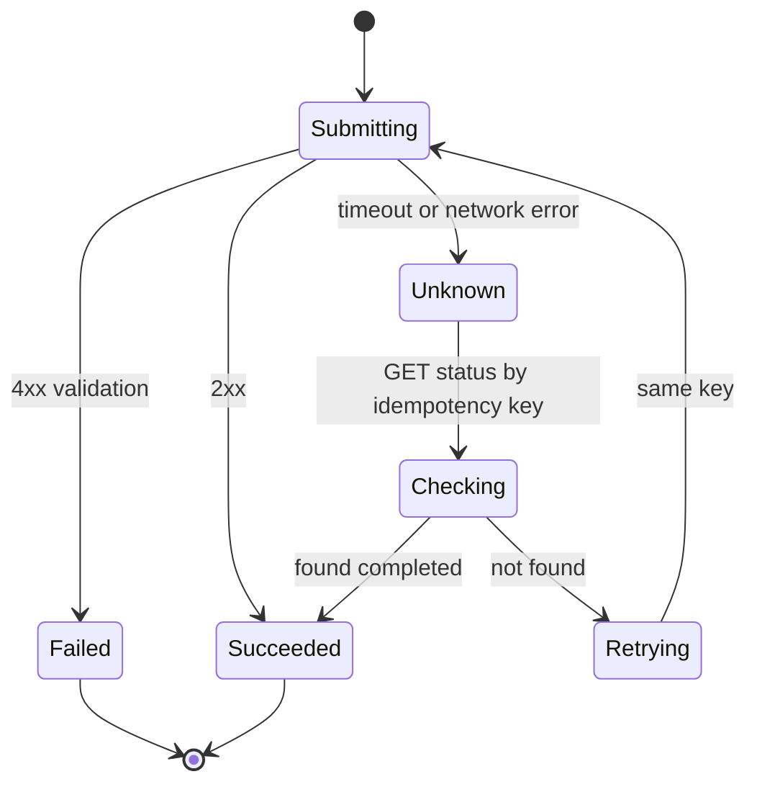

4. Fix the root cause: refresh tokens with a separate client without the interceptor, move long-polling to a websocket or SSE, enable HTTP/2 on the API, fix the slow backend query.

**Trade-offs:** Too-short timeouts cause false failures on slow mobile networks. Retrying non-idempotent calls risks double payments. The "unknown" state adds UI work but is the honest answer.

**What interviewers listen for:**
- Using the Timing breakdown to locate the hang.
- Knowing fetch has no default timeout.
- The interceptor refresh deadlock.
- Idempotency keys and an "unknown" state for money movement.
- Red flag: "add a retry" without idempotency.

#### Q: [Senior] A customer says the dashboard shows the wrong balance. Support has a screenshot. Where do you start?

**Short answer:** First establish facts: what was shown, what the correct value is, when, and on which account. Then walk the data path from database to pixel, checking each hop: API response, client cache, transformation, and formatting. The usual frontend causes are stale cached data, timezone errors that pick the wrong day's balance, and floating-point math on money.

**Clarify first:**
- Wrong by how much? A round amount (a pending transaction), a tiny amount (rounding), or a whole day's activity (date boundary)?
- Wrong compared to what? The statement, the mobile app, the transactions list?
- When was the screenshot taken and in which timezone is the user?
- Does it fix itself after a refresh?

**Diagnose:** Walk the pipeline.

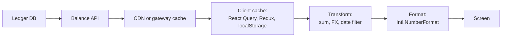

1. **API:** Query the API for that account as of that time (backend logs, or the request recorded by RUM or replay). If the API was wrong, it is a backend issue.
2. **Caching:** Check `Cache-Control` on the balance endpoint. A balance should not be cached at the CDN. Check the client: React Query `staleTime` set to 30 minutes, or a balance persisted in `localStorage` and shown before refetch, without "as of" time. Check whether a mutation (a payment) invalidates the balance query.

```ts
const pay = useMutation({
  mutationFn: submitPayment,
  onSuccess: (_, vars) => {
    queryClient.invalidateQueries({ queryKey: ['balance', vars.fromAccountId] });
    queryClient.invalidateQueries({ queryKey: ['txns', vars.fromAccountId] });
  },
});
```

3. **Timezone:** A date-only string is parsed as UTC midnight.

```ts
new Date('2026-10-01'); // 2026-10-01T00:00:00Z
// In New York (UTC-4) this displays as Sep 30, 8:00 PM.
// A "balance as of Oct 1" filter can include or exclude a whole day.
```

Treat business dates as plain `YYYY-MM-DD` strings, not `Date` objects. Do date math on the server in the account's business timezone, or with an explicit timezone library on the client.

4. **Float math:** Summing decimal amounts in JavaScript numbers.

```ts
0.1 + 0.2; // 0.30000000000000004
[19.99, 0.01, 5.1].reduce((a, b) => a + b, 0); // 25.099999999999998
```

Use integer minor units (`amountCents`) end to end, or a decimal library for currencies and FX. For very large values beyond `Number.MAX_SAFE_INTEGER` cents, use strings from the API and `BigInt` or a decimal library.

```ts
const totalCents = txns.reduce((sum, t) => sum + t.amountCents, 0);
const fmt = new Intl.NumberFormat('en-US', { style: 'currency', currency: 'USD' });
fmt.format(totalCents / 100); // division only at display time
```

5. **Definition mismatch:** "Available balance" vs "ledger balance" vs "balance including pending." Often the screen is "right" but labeled ambiguously.

**Solution:** Fix the specific hop. Then add safeguards: show "as of 10:42 AM" next to balances, never CDN-cache balance endpoints, invalidate on mutations, ban float math on money with lint rules or a `Money` type, and test date boundaries in multiple timezones in CI (run Jest with `TZ=America/New_York` and `TZ=Asia/Kathmandu`).

**Trade-offs:** Short `staleTime` means more requests. Showing a cached balance instantly with a refetch indicator is good UX if labeled with its time.

**What interviewers listen for:**
- Facts first, then a systematic walk of the data path.
- Cache layers named explicitly.
- Date-only parsing as UTC, and float math, with correct fixes.
- Treating it as a potential customer-trust incident with comms to support.
- Red flag: `toFixed(2)` as the fix for float sums. It hides the error and rounds inconsistently.

> **Finance tip:** Never "fix" a displayed balance by recalculating it on the client from transactions. The ledger is the source of truth. The client only displays it.

## 4. Incidents and Observability

#### Q: [Senior] Our error tracker shows 3,000 issues and the team has stopped looking at it. We also just got RUM and session replay. Design a triage workflow that actually finds the bugs hurting users.

**Short answer:** Rank issues by user impact, not by event count: users affected, whether it is on a critical journey (login, transfer, payment), and whether it is new or regressed in the latest release. Filter out noise (browser extensions, bots, aborted requests) at the SDK level. Then for each top issue, use the replay and RUM data to see what the user did and what they saw, reproduce, and assign an owner. Run this as a short, regular ritual with clear rotation, not as a heroic cleanup.

**Clarify first:** Which journeys matter most to the business? Do issues have owners (code owners per route or package)? Are releases tagged in the tracker? What privacy rules apply to replay?

**Diagnose:** Look at where the 3,000 come from. Usually:
- A few issues produce most events (one loop error firing 50 times per page).
- Many are noise: `ResizeObserver loop completed with undelivered notifications`, errors from `chrome-extension://` frames, `Script error.` from cross-origin scripts without CORS headers, network aborts when users navigate away.
- Some are real but on rarely used pages.

**Solution:**

1. Cut the noise at the source:

```ts
import * as Sentry from '@sentry/react';

Sentry.init({
  dsn: import.meta.env.VITE_SENTRY_DSN,
  release: __RELEASE__,
  environment: __ENV__,
  allowUrls: [/https:\/\/app\.example\.com/], // only our own scripts
  ignoreErrors: [
    'ResizeObserver loop completed with undelivered notifications',
    /^AbortError/,
  ],
  sampleRate: 1.0,
  tracesSampleRate: 0.1,
});
```

2. Tag everything that helps grouping and ownership: route, feature, flag variants, account type (not the account number).

3. Define a priority rule the team agrees on:

| Priority | Rule | Response |
|---|---|---|
| P1 | Critical journey broken, or more than 1% of sessions affected | Now, may become an incident |
| P2 | New or regressed in latest release, affects real users | This sprint |
| P3 | Old, low volume, non-critical | Backlog or ignore with a reason |

4. Weekly 30-minute triage, rotating owner. Look at: new issues this release, regressions, and top 10 by users affected. Each gets: assign, ignore with reason, or merge duplicates. Set alerts for "new issue in the latest release with more than N users".

5. For each top issue, use RUM and replay together:
- RUM tells you the shape: which browsers, routes, countries, and how it correlates with slow API calls or Web Vitals.
- Replay shows the steps: what was clicked, what was on screen, the console and network around the error. Many "errors" turn out to be harmless; many real problems (dead clicks, rage clicks, a spinner that never ends) throw no error at all.

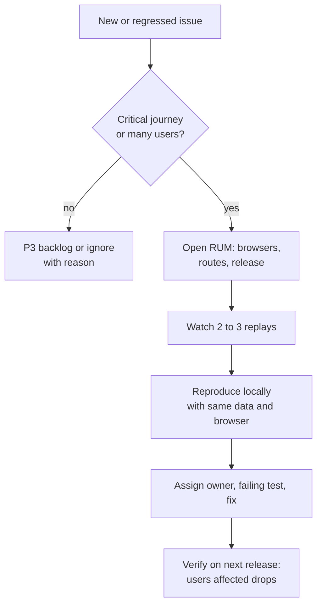

6. Also look for user pain without errors: RUM rage-click and dead-click reports, long tasks, and slow LCP on key pages.

**Trade-offs:** Replays cost money and raise privacy concerns, so sample them (for example a small share of normal sessions and a larger share of sessions with errors). Aggressive ignore rules can hide a real problem; review them occasionally.

**What interviewers listen for:**
- Ranking by users affected and journey criticality, not raw counts.
- Noise reduction at the SDK and release tagging.
- A recurring process with ownership.
- Using replay to find silent failures, not only exceptions.
- Red flag: "we do a big cleanup sprint once a year."

> **Interview tip:** Mention "Script error." with no details: it means a cross-origin script threw. Serve scripts with CORS headers and add `crossorigin="anonymous"` to the script tag to get real messages.

#### Q: [Mid] We upload source maps in CI, but stack traces in the error tracker are still minified for some releases. What could be wrong?

**Short answer:** The tracker cannot match the error to the uploaded map. The usual reasons are a release name mismatch between the SDK and the upload, a wrong URL prefix so the file paths do not line up, maps generated for a different build than the one deployed, or maps uploaded after the errors arrived. Debug IDs, which embed a unique ID into both the bundle and its map, remove most of these matching problems.

**Clarify first:** Which releases fail: all, or only some (for example hotfixes built by a different job)? Which tool (Sentry, Datadog, Bugsnag)? Are files served from a CDN path different from the build path?

**Diagnose:** Check each link in the chain.
1. **Release name.** The SDK's `release` value must equal the one used in the upload. Print both. A common bug: the SDK uses the git SHA and the upload uses `package.json` version.
2. **Paths.** The error frame says `https://cdn.example.com/assets/main.8f3a.js`. The uploaded artifact must be registered under a matching name (for example `~/assets/main.8f3a.js` in Sentry, or `--minified-path-prefix` in Datadog).
3. **Same build.** If the deploy job rebuilds instead of reusing the CI artifact, hashes differ and maps do not match. Build once, upload maps from that build, deploy that same build.
4. **Timing.** Errors processed before the upload finished stay minified. Upload before deploying.
5. **The map itself.** Open it and check `sources` and `sourcesContent`. Some tools need `sourcesContent` to show code.
6. Use the tool's own validator if it has one (Sentry shows "source map errors" on the event, and `sentry-cli sourcemaps explain` exists for this).

**Solution:** Use one release value everywhere and debug IDs:

```bash
# CI, after build, before deploy (Sentry example)
export RELEASE="web@$(git rev-parse --short HEAD)"
sentry-cli sourcemaps inject ./dist          # writes debug IDs into JS and maps
sentry-cli sourcemaps upload --release "$RELEASE" ./dist
find ./dist -name '*.map' -delete            # do not ship maps publicly
# deploy ./dist (the same files, with injected IDs)
```

```ts
// vite.config.ts
export default defineConfig({
  define: { __RELEASE__: JSON.stringify(process.env.RELEASE) },
  build: { sourcemap: 'hidden' },
});
```

Vendor bundler plugins (for example `@sentry/vite-plugin`) can do injection and upload during the build so you do not wire it by hand.

**Trade-offs:** Uploading in the build adds a network step and a secret (auth token) to CI. Hidden maps keep code private but mean you cannot debug minified code in the browser for production; you can still load maps locally in DevTools if needed.

**What interviewers listen for:**
- Release and path matching as the two most common causes.
- "Build once, deploy the same artifact."
- Deleting maps from the public deploy.

> **Gotcha:** If the deploy step runs your own post-processing on JS after the map was generated (for example a second minifier or string replace for config), the map no longer matches. Do runtime config differently.

#### Q: [Senior] A bug only happens in Safari, mostly on iPhones: the statement date picker shows "Invalid Date" and some users get logged out every few days. How do you investigate Safari-only bugs?

**Short answer:** Get a real Safari to reproduce it, because Chrome's device emulation is still Chrome. Use a Mac with Safari's Web Inspector connected to an iPhone, or a cloud device service. Then check the known areas where WebKit behaves differently: date string parsing, storage and cookie policies (Intelligent Tracking Prevention), viewport units, and newer JavaScript or CSS features. Use the error tracker to confirm the exact Safari and iOS versions affected.

**Clarify first:** Which iOS and Safari versions? Is it Safari itself, or an in-app browser (WKWebView inside another app), which has different storage rules? Private browsing or normal? Did it start with a release?

**Diagnose:**
- Filter errors and RUM sessions by browser and OS version. A cliff at one version suggests a missing feature.
- Remote debug: enable Web Inspector on the iPhone (Settings, Safari, Advanced), connect to a Mac, and use Safari's Develop menu. You get console, network, storage and breakpoints.
- Without a Mac, use a cloud device farm (BrowserStack, Sauce Labs, LambdaTest) or run Playwright's WebKit build in CI as a first filter. Playwright WebKit is close to Safari but not identical.

**Solution:** Common Safari differences, matched to the symptoms.

Date parsing. The only format the spec guarantees is the ISO format. Non-ISO strings like `"2026-10-01 14:30"` (space instead of `T`) or `"10/01/2026"` are implementation-defined; Safari has historically returned `Invalid Date` for some that Chrome accepts.

```ts
// Fragile: depends on the engine
new Date('2026-10-01 14:30');

// Safe: parse the parts yourself, or use ISO with an explicit offset from the API
function parseLocalDateTime(s: string): Date {
  const m = /^(\d{4})-(\d{2})-(\d{2})[ T](\d{2}):(\d{2})$/.exec(s);
  if (!m) throw new Error(`Bad datetime: ${s}`);
  const [, y, mo, d, h, mi] = m.map(Number);
  return new Date(y, mo - 1, d, h, mi); // local time, explicit
}
```

Better: have the API send ISO 8601 with offset (`2026-10-01T14:30:00Z`), and keep business dates as `YYYY-MM-DD` strings.

Unexpected logouts. Safari's ITP blocks third-party cookies and caps the lifetime of storage written by script on some sites (a 7-day cap on script-writable storage has been documented by WebKit; check current WebKit policy). Effects:
- Silent token renewal in a hidden iframe to the IdP fails because the IdP cookie is third-party. Okta and other IdPs recommend refresh tokens (with rotation) or a custom domain for the IdP on your own site so cookies are first-party.
- Tokens in `localStorage` may be cleared after days without user interaction.
- A backend-for-frontend with an `HttpOnly`, `Secure`, `SameSite` first-party session cookie avoids most of this.

Other frequent ones:
- `100vh` includes the area under Safari's toolbar; use `100dvh` or `svh` units.
- Newer JS APIs used without checking support. Check your browserslist target and the actual Safari versions in RUM. Polyfill or feature-detect.
- Input quirks: iOS zooms into inputs with font size below 16px; `<input type="date">` returns `YYYY-MM-DD` but displays differently.
- Private browsing historically had storage limits; wrap storage access in try/catch.

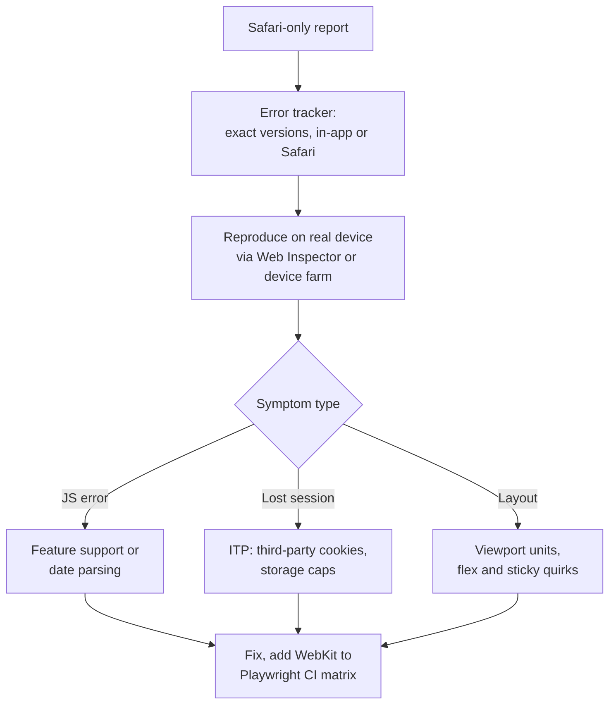

Prevent repeats: run the E2E smoke suite on WebKit in CI, set the browserslist target from real RUM data, and add a lint rule or test that forbids `new Date(someNonIsoString)`.

**Trade-offs:** Real device testing is slower and costs money; use Playwright WebKit for every PR and real devices for releases or Safari-specific fixes. Moving auth to a backend-for-frontend fixes ITP problems but adds a server component.

**What interviewers listen for:**
- Real Safari, not Chrome emulation.
- Knowing date parsing and ITP as top Safari causes.
- Separating WKWebView in-app browsers from Safari.
- Adding WebKit to CI so it does not regress.
- Red flag: "Safari is broken, we tell users to use Chrome."

#### Q: [Staff] At 9:05 on a Monday, the error rate on the payment confirmation page jumps from 0.1% to 15% right after a frontend release. You are the senior engineer on call. Walk me through the next hour.

**Short answer:** Declare an incident, take or assign the commander role, and mitigate first: turn off the feature flag if the change is behind one, otherwise roll back to the previous frontend build. Communicate early to support and stakeholders. Confirm recovery with metrics, then find the root cause calmly, check for side effects like double payments, and run a blameless postmortem with action items that prevent the class of bug.

**Clarify first (quickly, in the first minutes):** Is the spike only on the new release? Are payments failing, or only the confirmation page rendering? Did the backend change at the same time? What does 15% map to: a browser, a flag cohort, a region?

**Diagnose:** In parallel with mitigation, not before.
- Error tracker: filter by release. If the new release owns almost all the errors, the deploy is the cause.
- Release markers on the RUM dashboard; compare the conversion of "submit payment" to "confirmation shown".
- Check the backend: did payment creation succeed for these users? This decides whether customers were charged without seeing a confirmation.

**Solution:**

Minute-by-minute:

| Time | Action |
|---|---|
| 0 to 5 | Acknowledge page. Open incident channel. Declare severity. Name commander and comms lead. |
| 5 to 10 | Mitigate: flag off, or roll back to previous immutable build (switch `index.html` to previous release, invalidate CDN). |
| 10 to 15 | First status update to support: what users see, what to tell them, next update time. |
| 15 to 30 | Verify recovery: error rate back to baseline for new sessions. Note that open tabs may still run the bad version; consider a forced refresh on next navigation. |
| 30 to 60 | Assess impact: list affected sessions, check payments created without confirmation shown, check duplicates from users who retried. Hand data to operations for customer follow-up. |
| After | Root cause, fix with a test, re-release behind a flag with a canary. Postmortem within days. |

A kill switch the app checks at runtime, so you do not need a deploy to turn a feature off:

```ts
// Flags fetched at startup and refreshed periodically, defaulting to OFF on failure.
export function useFlag(name: string): boolean {
  const { data } = useQuery({
    queryKey: ['flags'],
    queryFn: fetchFlags,
    staleTime: 60_000,
    refetchInterval: 60_000,
  });
  return data?.[name] ?? false; // fail closed
}

function ConfirmationPage() {
  const newSummary = useFlag('payments.newConfirmationSummary');
  return newSummary ? <NewSummary /> : <LegacySummary />;
}
```

Rollback for a static frontend should be a pointer switch, not a rebuild:

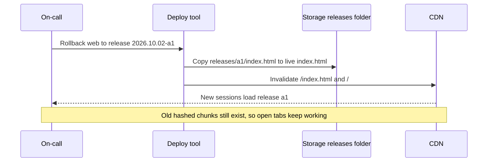

Communication: short, factual, regular. "Some users see an error after paying. Payments may have gone through. Do not ask customers to retry. Next update 9:45." That one sentence about retrying can prevent duplicate charges.

Postmortem questions: Why did tests and the canary not catch it? Was the change behind a flag? Did alerts fire fast enough? Could the confirmation page fail more gracefully (show a reference number from the payment response even if the summary component crashes)?

**Trade-offs:** Rolling back immediately might revert unrelated good changes; acceptable during an incident. A forced refresh for open tabs can interrupt users mid-flow; prefer reload at the next navigation. Flags for every change add complexity; use them for risky paths like payments.

**What interviewers listen for:**
- Mitigate within minutes, root cause after.
- Rollback as a fast pointer switch, and flags as a kill switch that fails closed.
- Checking money side effects: charged but not confirmed, duplicates on retry.
- Clear, early comms with guidance for support.
- Blameless postmortem with systemic fixes.
- Red flag: debugging in production for 40 minutes before mitigating.

> **Finance tip:** A confirmation page should never be the only place a user learns a payment succeeded. Send a confirmation email or in-app notification from the backend, and make the transactions list show the payment, so a broken page does not cause retries.

#### Q: [Senior] How would you design error boundaries and error reporting for a large React dashboard so one broken widget does not take down the whole app, and the team actually hears about it?

**Short answer:** Place boundaries at three levels: one at the root as a last resort, one per route so navigation still works, and one around each independent widget so a crashing chart shows "This section could not load" while the rest of the dashboard works. Each boundary reports to the error tracker with context (route, widget name, release) and offers a retry. Remember that boundaries only catch errors during rendering and lifecycle methods, so async errors in event handlers and promises need separate handling.

**Clarify first:** Which parts are independent (portfolio chart, recent transactions, alerts) and which are critical (balance)? What should a user see if the balance fails: a placeholder, or a full-page error? Which error tracker?

**Diagnose:** Find out what currently happens: throw an error in one widget in a dev build. If the whole page goes white, there is no boundary or only a root one.

**Solution:**

A reusable boundary with reset, using the `react-error-boundary` package:

```tsx
import { ErrorBoundary, type FallbackProps } from 'react-error-boundary';
import * as Sentry from '@sentry/react';
import { useQueryErrorResetBoundary } from '@tanstack/react-query';

function WidgetFallback({ error, resetErrorBoundary }: FallbackProps) {
  return (
    <div role="alert" className="widget-error">
      <p>This section could not load.</p>
      <button onClick={resetErrorBoundary}>Try again</button>
    </div>
  );
}

export function WidgetBoundary({ name, children }: { name: string; children: React.ReactNode }) {
  const { reset } = useQueryErrorResetBoundary(); // lets React Query refetch on retry
  return (
    <ErrorBoundary
      FallbackComponent={WidgetFallback}
      onReset={reset}
      onError={(error, info) => {
        Sentry.withScope((scope) => {
          scope.setTag('widget', name);
          scope.setContext('react', { componentStack: info.componentStack });
          Sentry.captureException(error);
        });
      }}
    >
      {children}
    </ErrorBoundary>
  );
}

// Usage
<WidgetBoundary name="portfolio-chart"><PortfolioChart /></WidgetBoundary>
<WidgetBoundary name="recent-transactions"><RecentTransactions /></WidgetBoundary>
```

Error boundaries do not catch:
- Event handlers: wrap critical handlers and report, or let a global handler catch.
- Async code and promises: handle in the data layer (React Query `onError`, or `throwOnError` to send query errors to the nearest boundary).
- Errors outside React: use `window.addEventListener('error', ...)` and `'unhandledrejection'`. Most SDKs install these for you.

React 19 also lets you hook into errors at the root with `createRoot(el, { onCaughtError, onUncaughtError, onRecoverableError })`, which is a single place to report.

Layout:

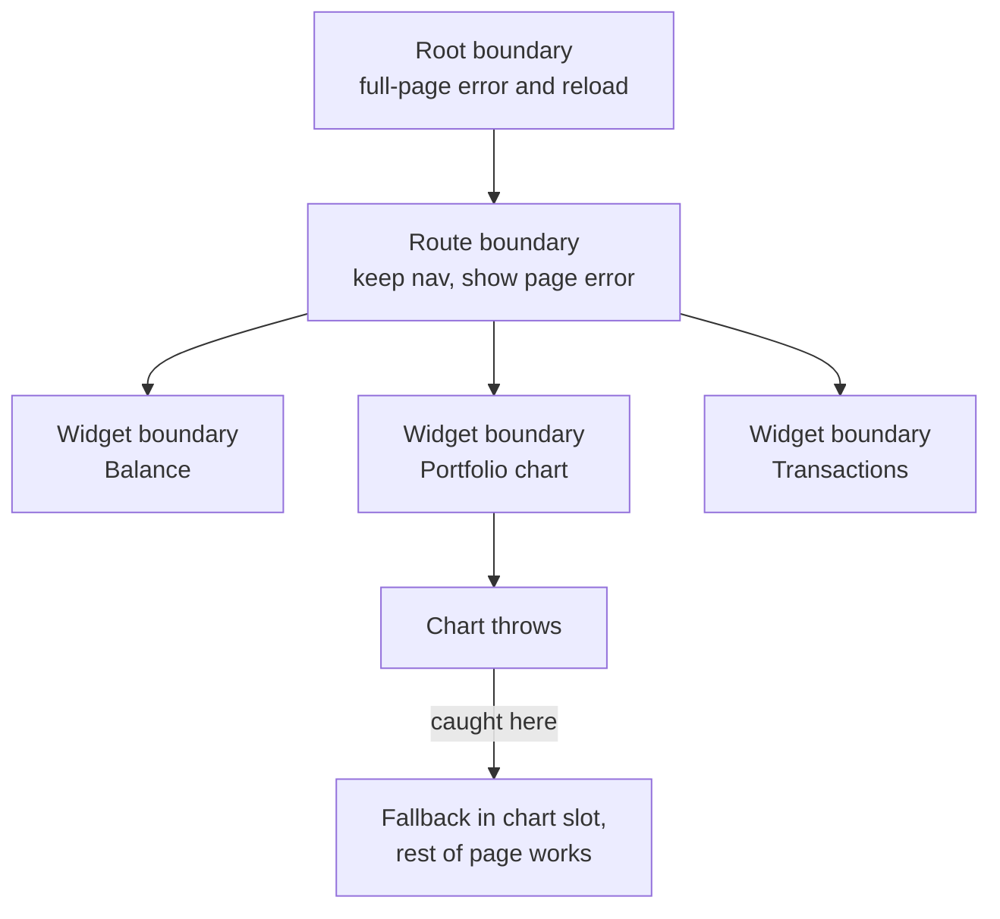

Reporting strategy:
- Tag with `widget`, `route`, `release`, flag variants. Set a user ID (internal, not email) for counting affected users.
- Alert on new issues in the latest release and on boundary activations for critical widgets.
- Track the fallback rate per widget as a metric. A widget that shows its fallback for 2% of users is broken even if nobody complains.

**Trade-offs:** Too many boundaries add noise and can hide problems (a fallback looks "fine" to users so nobody reports it), which is why fallback rates must be monitored. Too few boundaries means one bug blanks the page. For critical data like the balance, a quiet fallback might be wrong; showing a clear error with retry is better than showing nothing.

**What interviewers listen for:**
- Layered boundaries matched to independence of UI regions.
- Knowing what boundaries do not catch.
- Retry that also resets the data layer.
- Context-rich reporting and monitoring fallback rates.
- Red flag: one boundary at the root and calling it done.

#### Q: [Mid] We want detailed frontend logs and session replays to debug issues, but compliance says we must not leak PII or account data. How do you log usefully and safely?

**Short answer:** Decide what you never collect (names, emails, full account and card numbers, addresses, auth tokens, free-text inputs) and enforce it in code, not by convention. Use internal IDs instead of personal data, mask all inputs and sensitive text in replays by default, scrub events before they leave the browser with a `beforeSend` hook, and strip tokens and query strings from URLs. Then verify with tests and periodic audits of what actually arrives in the tools.

**Clarify first:** Which regulations and internal policies apply (GDPR, PCI DSS for card data, local banking secrecy)? Where are the tools hosted and for how long is data retained? Who can access replays?

**Diagnose:** Audit what you send today. Look at a sample of events in the tracker: URLs with `?email=`, breadcrumbs containing request bodies, console logs printing whole API responses, user context set to an email address. Search replays for visible account numbers.

**Solution:**

1. Structured logging with an allowlist, so only known safe fields go out:

```ts
type LogFields = {
  event: string;
  route?: string;
  accountId?: string;   // internal opaque ID, not the account number
  durationMs?: number;
  status?: number;
  errorCode?: string;
};

export function log(level: 'info' | 'warn' | 'error', fields: LogFields) {
  // Only the typed fields are sent. No arbitrary objects, no API bodies.
  sendToCollector({ level, ts: Date.now(), release: __RELEASE__, ...fields });
}

log('error', { event: 'payment_submit_failed', route: '/pay', status: 502, errorCode: 'UPSTREAM_TIMEOUT' });
```

2. Scrub in the error SDK before sending:

```ts
const SENSITIVE_KEYS = /^(authorization|cookie|password|token|iban|accountNumber|cardNumber|email)$/i;

function scrub(obj: unknown): unknown {
  if (Array.isArray(obj)) return obj.map(scrub);
  if (obj && typeof obj === 'object') {
    return Object.fromEntries(
      Object.entries(obj).map(([k, v]) => [k, SENSITIVE_KEYS.test(k) ? '[redacted]' : scrub(v)]),
    );
  }
  return obj;
}

function stripQuery(url?: string) {
  return url ? url.split('?')[0] : url;
}

Sentry.init({
  dsn: import.meta.env.VITE_SENTRY_DSN,
  sendDefaultPii: false,
  beforeSend(event) {
    if (event.request) event.request.url = stripQuery(event.request.url);
    event.extra = scrub(event.extra) as typeof event.extra;
    return event;
  },
  beforeBreadcrumb(crumb) {
    if (crumb.category === 'console') return null; // console logs may hold API data
    if (crumb.data?.url) crumb.data.url = stripQuery(crumb.data.url);
    return crumb;
  },
});

Sentry.setUser({ id: user.internalId }); // no email or name
```

3. Replay privacy: mask by default, unmask only what is known safe.

```ts
Sentry.replayIntegration({ maskAllText: true, maskAllInputs: true, blockAllMedia: true });
// Datadog RUM equivalent: datadogRum.init({ ..., defaultPrivacyLevel: 'mask' })
```

Mark especially sensitive areas (statement tables, account details) with the tool's block class or attribute so they are not recorded at all.

4. Keep secrets out of URLs: never put tokens, emails or account numbers in query strings or paths. They end up in logs, analytics, referrer headers and browser history.

5. Verify: a unit test that runs `beforeSend` on a sample event with fake PII and asserts it is redacted; a periodic manual audit of real events; short retention; restricted access to replay.

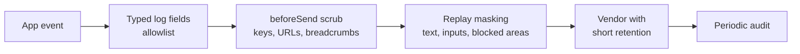

**Trade-offs:** Masking everything makes replays harder to understand; selectively unmask static labels and buttons. Allowlists need updating when you want new fields, which is the point. Scrubbing by key name misses PII in free-text values, so avoid sending free text at all.

**What interviewers listen for:**
- Allowlist over denylist, and enforcement in code.
- Internal IDs instead of personal data, no PII in URLs.
- Replay masking by default.
- Testing the scrubbing and auditing real data.
- Red flag: `console.log(response.data)` in production with console breadcrumbs enabled.

> **Finance tip:** Card numbers fall under PCI DSS. If a full card number ever reaches your logging vendor, that vendor and its data are in PCI scope. Keep card entry inside the payment provider's hosted fields so your app never sees the number.
