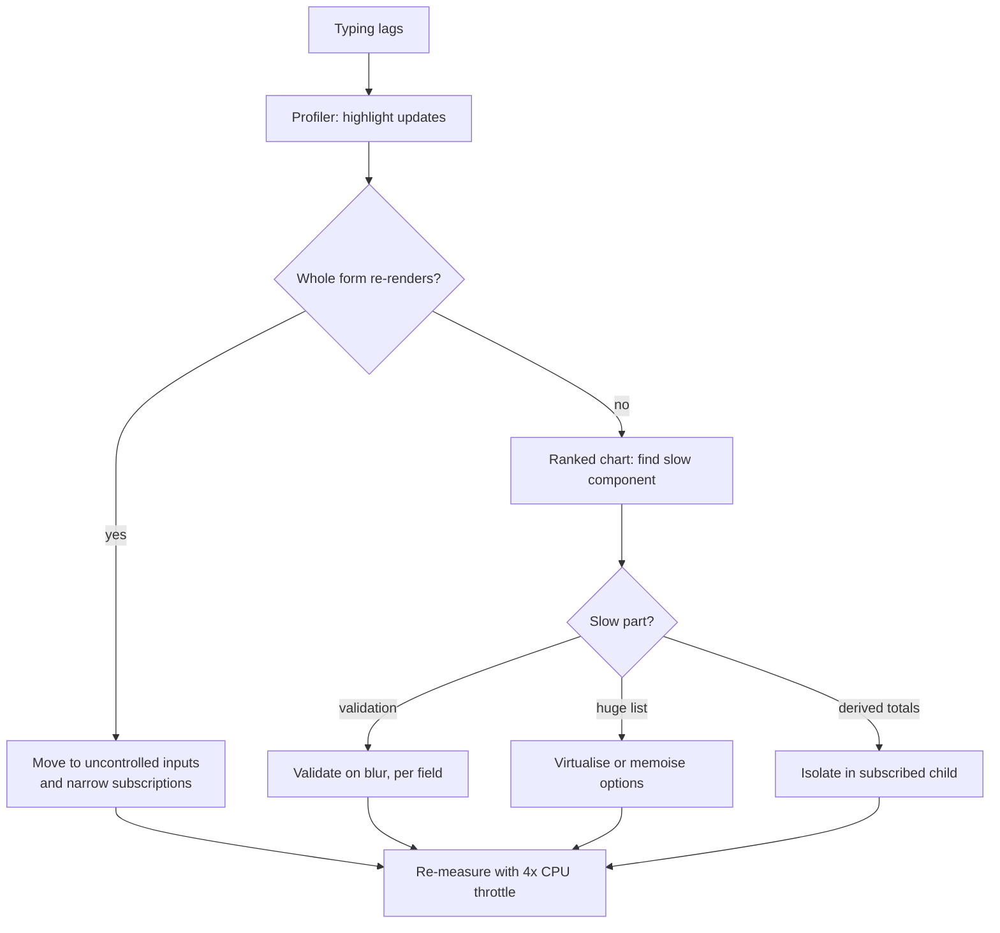
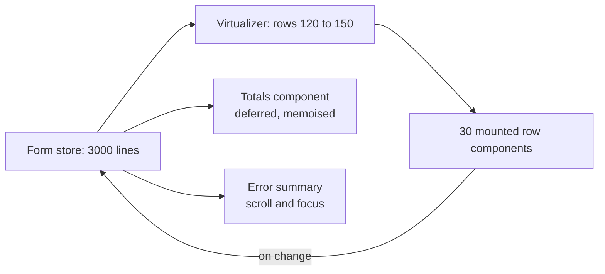
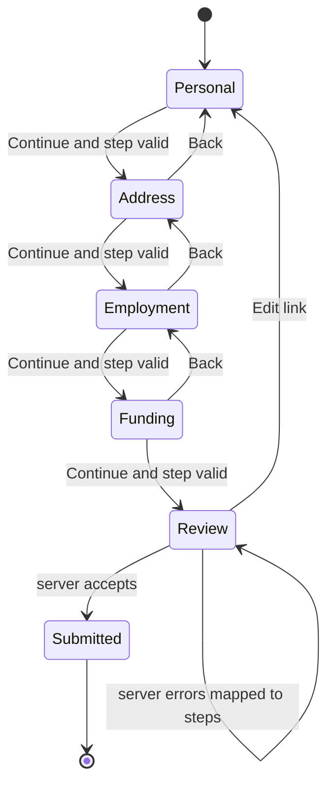
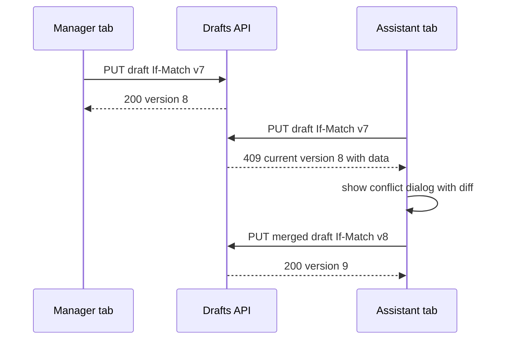
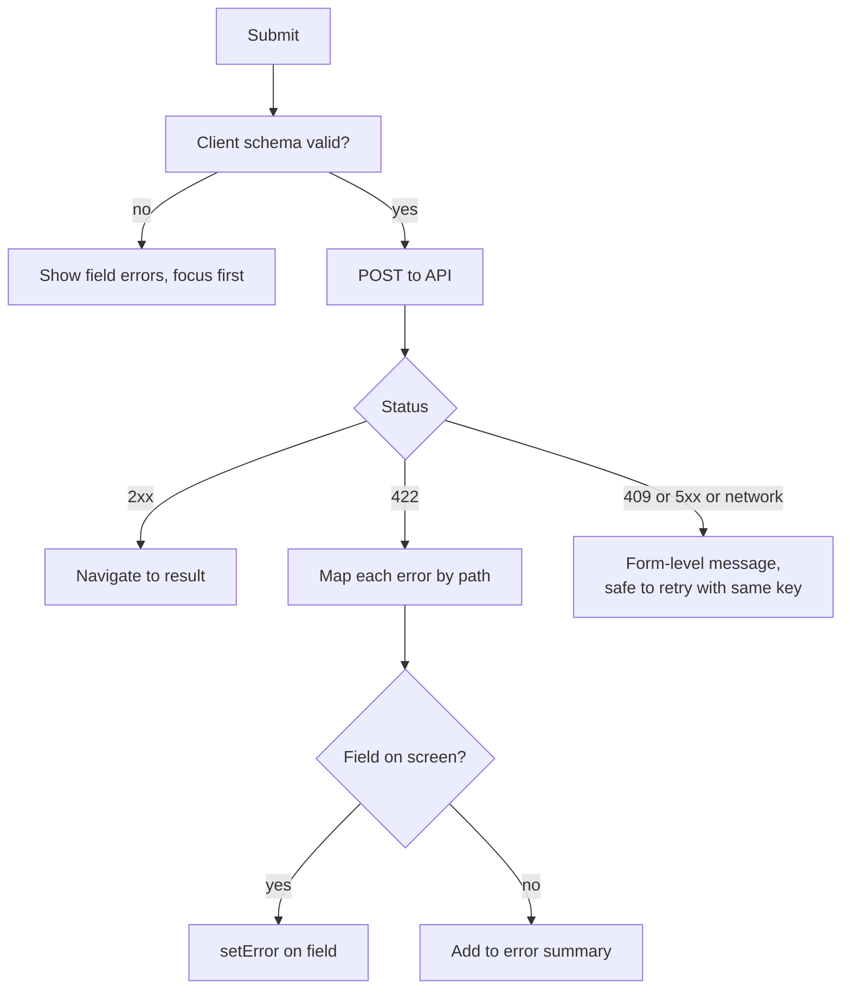
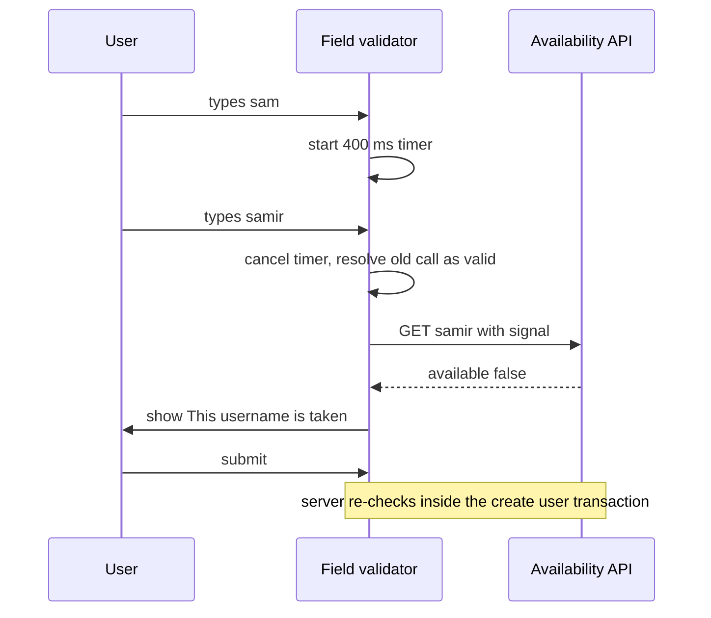
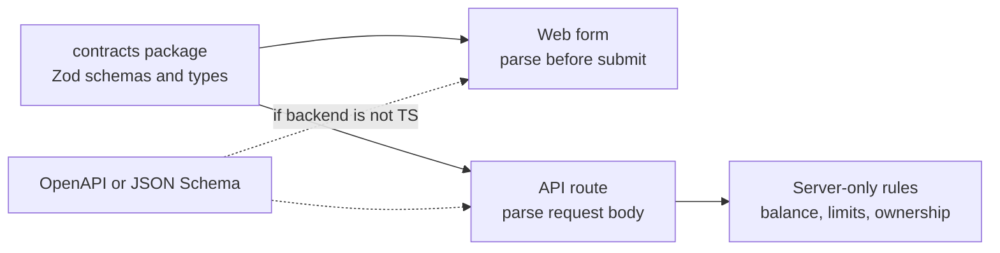
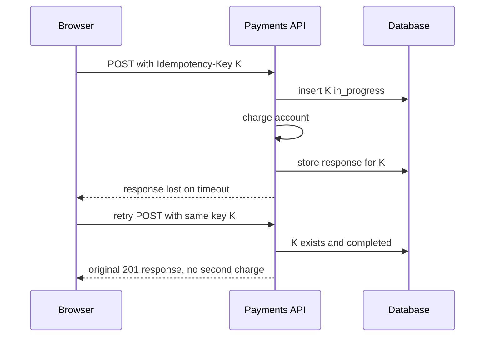
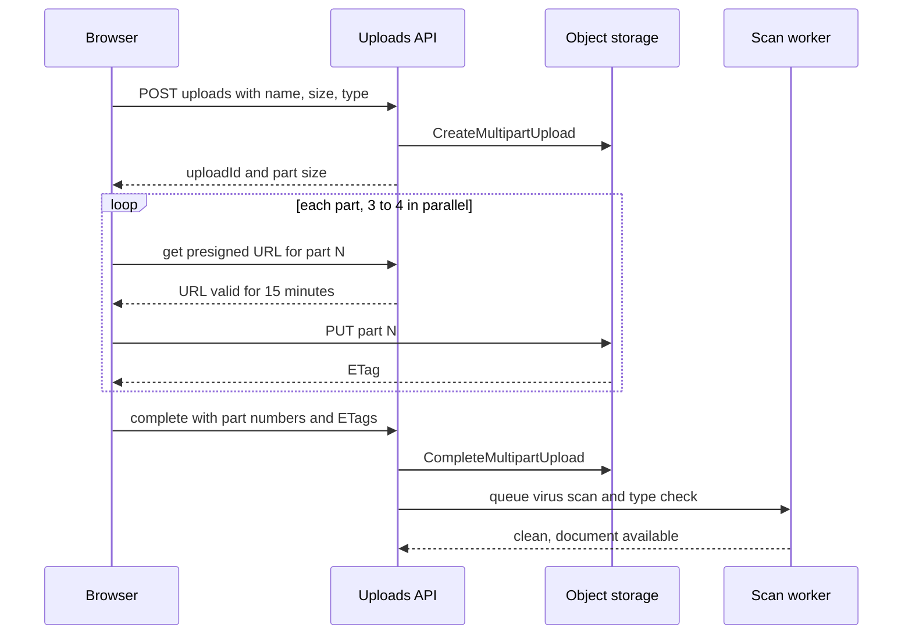
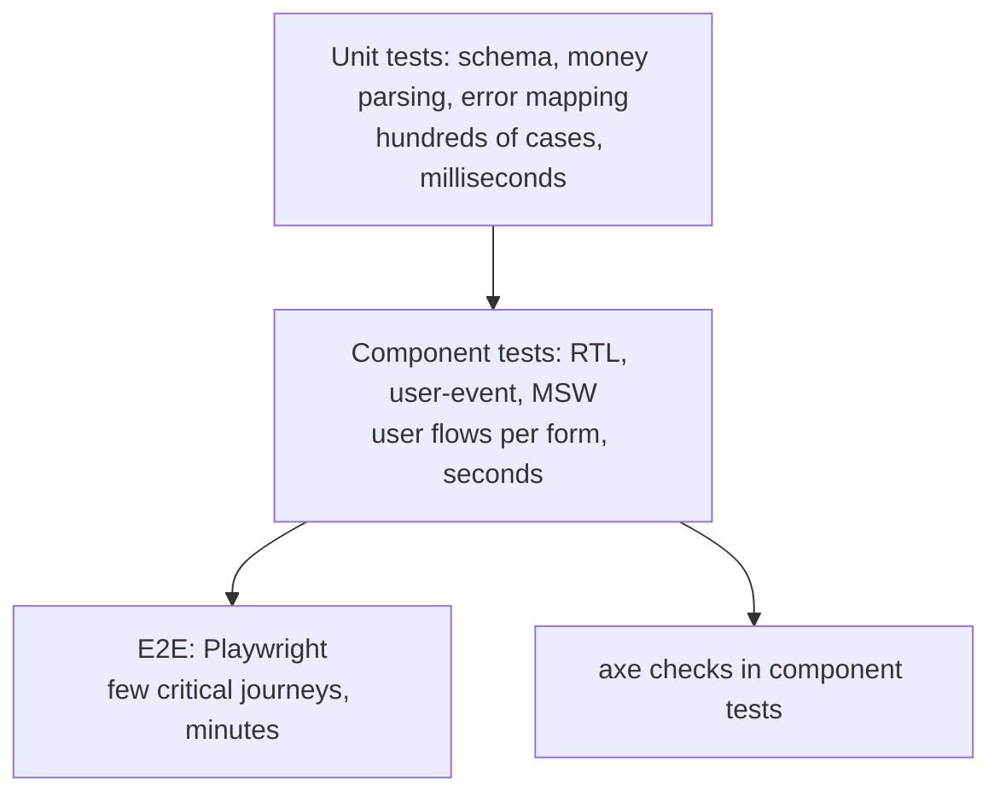

## 1. Form performance and architecture

#### Q: [Senior] Our loan application form has about 220 fields. Typing in any input lags by 200–300 ms on a mid-range laptop. How do you find the cause and fix it?

**Short answer:** Almost always, every keystroke re-renders the whole form, because the form state lives in one big `useState` (or a Formik-style context) at the top and every field reads from it. I would confirm that with the React DevTools Profiler, then change the architecture so a keystroke only re-renders the field being typed in: uncontrolled inputs with react-hook-form, narrow subscriptions (`useWatch`, `useFormState`), and memoised sections. Expensive derived work (totals, validation of the whole schema) moves off the keystroke path.

**Clarify first:**
- Is the lag on every field, or only some (a date picker, a select with 5,000 options, a rich text field)?
- What library holds the state today: plain `useState`, Formik, Redux, react-hook-form?
- When does validation run: on change, on blur, on submit? Against the whole schema or one field?
- Are there computed fields (totals, eligibility, DTI ratio) that recalculate on every change?
- What devices do real users have? Field staff on old Windows laptops change the budget.

**Diagnose:**
1. React DevTools, Settings, turn on "Highlight updates when components render". Type in one field. If the whole page flashes, the whole tree re-renders per keystroke.
2. Profiler tab, enable "Record why each component rendered while profiling". Record while typing five characters. Look at the flame chart for one commit: how many components rendered, and which took the longest. "Why did this render?" will say things like "Props changed: values" or "Context changed".
3. Ranked chart: find the top self-time components. Typical offenders are a summary panel recomputing totals, a big `<select>` re-rendering 5,000 `<option>` elements, or a schema validation over all 220 fields.
4. Chrome Performance panel with 4x CPU throttling. Record typing. Look for long tasks (over 50 ms) per `input` event. Expand them to see whether time is in React render, in your validation function, or in layout/style recalculation.
5. Check the INP field metric if you have RUM data. A form that lags is an INP problem, and INP is what users feel.

> **Why:** A controlled input calls `setState` on every keystroke. If that state is at the form root, React re-renders every child unless something stops it. 220 fields times a few components each is 1,000+ component renders per key press.

**Solution:**

Option 1: stop the re-render cascade in the existing code. Split state per section, wrap sections in `React.memo`, pass stable callbacks. This helps, but it is fragile: one inline object prop breaks the memo.

Option 2 (what I would ship): react-hook-form with uncontrolled inputs. The DOM holds the value while typing; the library reads it via refs. Components re-render only for what they subscribe to.

```tsx
import { useForm, useWatch, useFormState, type Control } from 'react-hook-form';
import { zodResolver } from '@hookform/resolvers/zod';

type LoanForm = z.infer<typeof loanSchema>;

export function LoanApplication() {
  const { register, control, handleSubmit } = useForm<LoanForm>({
    resolver: zodResolver(loanSchema),
    mode: 'onBlur',          // validate when the user leaves a field, not on every key
    reValidateMode: 'onChange', // after the first error, re-check as they fix it
    defaultValues: emptyLoan,
  });

  return (
    <form onSubmit={handleSubmit(submitLoan)} noValidate>
      <ApplicantSection register={register} control={control} />
      <IncomeSection register={register} control={control} />
      {/* ...12 more sections */}
      <MonthlySummary control={control} />
      <SubmitBar control={control} />
    </form>
  );
}

// Only this component re-renders when income fields change.
function MonthlySummary({ control }: { control: Control<LoanForm> }) {
  const [salaryCents, otherIncomeCents, rentCents] = useWatch({
    control,
    name: ['income.salaryCents', 'income.otherCents', 'expenses.rentCents'],
  });
  const disposable = (salaryCents ?? 0) + (otherIncomeCents ?? 0) - (rentCents ?? 0);
  return <output>{formatCents(disposable, 'USD')}</output>;
}

// Subscribes to isSubmitting and isDirty only, not to values.
function SubmitBar({ control }: { control: Control<LoanForm> }) {
  const { isSubmitting, isDirty } = useFormState({ control });
  return <button type="submit" disabled={isSubmitting || !isDirty}>Submit application</button>;
}
```

Key details:
- `useWatch` subscribes a child to specific paths. Calling `watch()` with no arguments at the root re-renders the root on every change and undoes the benefit.
- `formState` in react-hook-form is a proxy. It only tracks the properties you read, so read `isDirty` only where you need it.
- Use `mode: 'onBlur'` or `'onSubmit'` for large forms. `'onChange'` with a whole-schema resolver runs the full Zod parse per keystroke.

Option 3: fix the specific hot spots the profiler found.
- Long select lists: replace a 5,000 option `<select>` with a virtualised combobox, or at least memoise the options array.
- Derived totals: compute in a small subscribed component, not in the root.
- Heavy validation: run cross-field rules on blur or submit; keep per-field rules cheap.
- Use `useDeferredValue` for a preview panel that can lag behind the input without blocking typing.



> **Gotcha:** The React Compiler (stable since late 2025) auto-memoises components and can hide some of this cost, but it cannot help if every field reads one giant state object that changes on every key. The data flow is the problem, not missing `useMemo`.

**Trade-offs:**
- Memoising the existing controlled form keeps the code familiar but stays fragile.
- Uncontrolled inputs are fast but make some UI harder: a field whose display depends on another field's live value needs `useWatch`, and custom components need `Controller`, which is controlled again for that field.
- Validating on blur is cheaper but users see errors later. Most large forms accept that.

**What interviewers listen for:**
- You measure first with the Profiler and "why did this render", and you name the cause (state at the root) before naming a library.
- You know controlled vs uncontrolled and why uncontrolled scales.
- Narrow subscriptions: `useWatch`, `useFormState`, proxy `formState`.
- You re-measure under CPU throttling, not on a fast MacBook.
- Red flag: "add `React.memo` everywhere" or "use `useCallback` on every handler" with no measurement.
- Red flag: debouncing the input itself, which makes typing feel worse and leaves the form state stale on submit.

#### Q: [Staff] We are starting a new product with many complex forms. The team is split between react-hook-form, Final Form, Formik and TanStack Form. How do you decide, and what do you standardise?

**Short answer:** I would pick based on render model, TypeScript quality, schema integration and maintenance health, then wrap the choice in our own small form kit so the library is a detail. Today react-hook-form is the safe default for most React teams: uncontrolled, fast, huge ecosystem, Zod via resolvers. TanStack Form is a strong choice if we want fully typed, headless, framework-agnostic forms and accept a younger ecosystem. I would not start new work on Formik. Final Form works but is not where new investment is going.

**Clarify first:**
- How big are the forms (20 fields vs 300), and how dynamic (field arrays, conditional sections)?
- Do we need to share form logic with React Native, or other frameworks?
- What schema library are we using on the backend? Zod, Valibot, JSON Schema?
- Do we already have a design system with input components? Are they controlled-only?
- How many teams will build forms? Consistency matters more with 10 teams than with 1.

**Diagnose:** Build the same prototype form in two candidates: 150 fields, one field array with 500 rows, one async-validated field, one conditional section. Measure renders per keystroke with the Profiler, bundle size with your bundler's analyzer, and how many type errors the compiler catches when you rename a field. Check the GitHub repos: release cadence, open issues, who maintains it.

**Solution:**

| | react-hook-form | TanStack Form | Final Form | Formik |
|---|---|---|---|---|
| Render model | Uncontrolled by default, subscriptions | Controlled, fine-grained store subscriptions | Subscription-based, opt in per field | Controlled, whole form re-renders by default |
| Large form performance | Very good | Very good | Good if subscriptions are set | Poor without `FastField` tricks |
| TypeScript | Good, typed paths | Excellent, deep inference of field names and values | Weaker | Weaker |
| Schema validation | Resolvers for Zod, Yup, Valibot and more | Standard Schema support, so Zod/Valibot/ArkType directly | Manual or adapters | Yup built in, others via adapters |
| Async field validation | Manual (`validate` returning a promise) | Built in, with per-field debounce option | Supported | Supported |
| Ecosystem and examples | Largest | Growing | Small, quieter | Large but dated |
| Maintenance (as of 2026) | Active | Active, v1 released 2025 | Low activity | Low activity |

My recommendation for a typical React fintech product: react-hook-form plus Zod, unless the team strongly values TanStack's type inference or needs framework-agnostic logic.

More important than the library is what you standardise:

```tsx
// form-kit/TextField.tsx: every team uses these, not raw library calls.
type TextFieldProps<T extends FieldValues> = {
  control: Control<T>;
  name: FieldPath<T>;
  label: string;
  hint?: string;
} & Omit<React.InputHTMLAttributes<HTMLInputElement>, 'name'>;

export function TextField<T extends FieldValues>({ control, name, label, hint, ...rest }: TextFieldProps<T>) {
  const { field, fieldState } = useController({ control, name });
  const id = useId();
  const hintId = hint ? `${id}-hint` : undefined;
  const errorId = fieldState.error ? `${id}-error` : undefined;

  return (
    <div className="field">
      <label htmlFor={id}>{label}</label>
      {hint && <p id={hintId} className="hint">{hint}</p>}
      <input
        id={id}
        {...rest}
        {...field}
        value={field.value ?? ''}
        aria-invalid={fieldState.invalid || undefined}
        aria-describedby={[hintId, errorId].filter(Boolean).join(' ') || undefined}
      />
      {fieldState.error && <p id={errorId} className="error">{fieldState.error.message}</p>}
    </div>
  );
}
```

Standardise:
- Field components with labels, hints, errors and ARIA wired once.
- One schema library, shared with the backend where possible.
- One server-error mapping helper, one submit/idempotency helper, one unsaved-changes hook.
- Default modes (`onBlur` validation, focus first error on submit).
- Testing helpers and an accessibility check in CI.

> **Interview tip:** Saying "I would wrap it" is only senior if you explain why: a thin kit lets you swap libraries, fix accessibility in one place, and keep 10 teams consistent. Do not wrap so heavily that you rebuild the library badly.

**Trade-offs:**
- react-hook-form: fastest path, but uncontrolled thinking surprises people, and controlled design-system components need `Controller`, which reintroduces per-field re-renders (fine at field level).
- TanStack Form: best types, but more boilerplate per field and fewer community answers.
- Final Form and Formik: familiar to some, but you are betting on libraries with little new development. Fine to keep in legacy code; do not migrate for its own sake.
- A custom form kit is extra code to own.

**What interviewers listen for:**
- Criteria first (render model, types, schema, maintenance), library second.
- A prototype with measurements instead of opinions.
- Knowing Formik's whole-form re-render issue and why it matters for 200 fields.
- Standardising the accessibility and error plumbing, not just the library.
- Red flag: "Formik, because everyone knows it" for a new large-form product, or building your own form library from scratch.

> **Outdated:** Older articles recommend Redux Form. It stores every keystroke in the Redux store and is deprecated by its own author. Do not use it for new work.

#### Q: [Senior] An invoice editor lets accountants add line items. Some invoices have 3,000 lines with 8 inputs each. It takes 6 seconds to open and adding a row freezes the page. How do you design it?

**Short answer:** 24,000 inputs in the DOM is the problem. I would virtualise the rows so only about 30 are mounted, keep the values in a form store (react-hook-form `useFieldArray` or a dedicated store), give each row a stable id as its key, compute totals in one place outside the rows, and treat validation, focus and keyboard navigation as part of the design because virtualised rows are not always in the DOM.

**Clarify first:**
- Is this really a form, or a spreadsheet-like grid? Do users paste from Excel, use arrow keys between cells?
- Do users need all 3,000 rows visible at once, or would grouping, search, or pagination work?
- Is the invoice saved as a whole, or can rows be saved individually (PATCH per line)?
- How are totals computed? Tax per line or per invoice? Rounding rules?

**Diagnose:**
1. Performance monitor in Chrome DevTools: watch "DOM Nodes". Opening the editor will jump by hundreds of thousands.
2. Performance panel recording on open: a single long task for the initial render, then "Recalculate Style" and "Layout" taking seconds.
3. Profiler when adding a row: if all rows re-render, keys or subscriptions are wrong (index as key, or every row reads the whole array).

**Solution:**

Option 1: smaller DOM without virtualisation. Show rows as read-only text and only mount inputs for the row being edited ("click to edit"). This cuts inputs from 24,000 to 8 and is often enough.

Option 2: virtualised field array.

```tsx
import { useFieldArray, useWatch, type Control, type UseFormRegister } from 'react-hook-form';
import { useVirtualizer } from '@tanstack/react-virtual';

type Line = { description: string; quantity: string; unitPriceCents: number; taxCode: string };
type InvoiceForm = { lines: Line[] };

export function LinesEditor({ control, register }: { control: Control<InvoiceForm>; register: UseFormRegister<InvoiceForm> }) {
  const { fields, append, remove } = useFieldArray({ control, name: 'lines' });
  const parentRef = useRef<HTMLDivElement>(null);

  const virtualizer = useVirtualizer({
    count: fields.length,
    getScrollElement: () => parentRef.current,
    estimateSize: () => 44,
    overscan: 8,
  });

  return (
    <>
      <div ref={parentRef} style={{ height: 560, overflow: 'auto' }} role="rowgroup">
        <div style={{ height: virtualizer.getTotalSize(), position: 'relative' }}>
          {virtualizer.getVirtualItems().map((v) => {
            const field = fields[v.index];
            return (
              <div
                key={field.id} // stable id from useFieldArray, never the index
                role="row"
                aria-rowindex={v.index + 2} // +1 for 1-based, +1 for header row
                style={{ position: 'absolute', top: 0, left: 0, right: 0, height: v.size, transform: `translateY(${v.start}px)` }}
              >
                <input {...register(`lines.${v.index}.description`)} aria-label={`Line ${v.index + 1} description`} />
                <input {...register(`lines.${v.index}.quantity`)} inputMode="decimal" aria-label={`Line ${v.index + 1} quantity`} />
                {/* money input as a Controller, see the currency question */}
                <button type="button" onClick={() => remove(v.index)}>Remove</button>
              </div>
            );
          })}
        </div>
      </div>
      <button type="button" onClick={() => {
        append({ description: '', quantity: '1', unitPriceCents: 0, taxCode: 'STD' });
        requestAnimationFrame(() => virtualizer.scrollToIndex(fields.length, { align: 'end' }));
      }}>
        Add line
      </button>
      <InvoiceTotals control={control} />
    </>
  );
}

function InvoiceTotals({ control }: { control: Control<InvoiceForm> }) {
  const lines = useWatch({ control, name: 'lines' });
  // useDeferredValue keeps typing responsive; totals can lag one frame.
  const deferred = useDeferredValue(lines);
  const totalCents = useMemo(
    () => deferred.reduce((sum, l) => sum + lineTotalCents(l), 0),
    [deferred],
  );
  return <output aria-live="polite">Total {formatCents(totalCents, 'USD')}</output>;
}
```

Why it works with react-hook-form: by default (`shouldUnregister: false`) values stay in the form state when an input unmounts, so scrolling a row out of view does not lose it. When the row scrolls back, `register` reads the stored value into the new input.

Option 3: treat it as a data grid. For spreadsheet behaviour (paste 500 rows, arrow-key navigation, fill down), use a grid library (AG Grid, or TanStack Table plus a virtualiser) that owns editing, and keep the lines in a plain store. The "form" is just header fields plus a grid. Submit serialises the store.

Things that break with virtualisation and how to handle them:
- **Validation errors on hidden rows:** show an error summary ("3 lines have errors, go to line 1,204") and use `scrollToIndex` then `setFocus` on the field.
- **Find in page:** Ctrl+F will not find unmounted rows. Add a filter box.
- **Tab order:** tabbing past the last mounted row stops. Overscan helps; grids handle it with roving focus.
- **Paste:** handle `onPaste` on the grid, parse TSV, and `append` many rows in one call, not 500 separate calls.



**Trade-offs:**
- Click-to-edit: simplest and very fast, but one more click per edit and less spreadsheet-like.
- Virtualised form rows: keeps the form model, but focus, tab order, find and print need extra work.
- Grid library: best UX for power users, but large dependency, licence cost for some features, and its own state model to integrate.
- Totals with `useDeferredValue` stay responsive, but the total is briefly behind while typing; never submit the client total as the truth, the server recomputes.

**What interviewers listen for:**
- Counting DOM nodes and naming the DOM as the bottleneck.
- Stable keys from the field array, never the index, especially with remove and reorder.
- Knowing values survive unmount (`shouldUnregister: false`) and what breaks when rows are not mounted.
- Totals computed outside the rows, and money in integer cents.
- Asking whether this is really a grid. Many "forms" are spreadsheets in disguise.
- Red flag: rendering all rows and adding `React.memo`, or using index keys with a remove button.

> **Finance tip:** Compute line totals as `quantity x unitPriceCents` with a decimal library and an agreed rounding rule (per line or per invoice). Rounding per line vs on the total can differ by a cent per 100 lines, and accountants will notice.

## 2. Multi-step flows, conditional fields and drafts

#### Q: [Senior] Design a 5-step account opening wizard: personal details, address, employment, funding source, review. How do you hold the state and validate each step?

**Short answer:** One form state for the whole wizard, one schema split into per-step schemas, and validation of only the current step when the user clicks Next. The current step lives in the URL so back/forward and refresh work. The review step re-validates everything with the full schema, and the server validates again on submit. Progress is saved as a draft so users can leave and come back.

**Clarify first:**
- Can users jump between steps freely, or only forward after the step is valid?
- Do later steps depend on earlier answers (employed vs self-employed changes step 3)?
- Is each step saved to the server, or is everything submitted at the end?
- Must progress survive a refresh, a closed tab, a different device?
- Are there compliance rules (KYC) on what must be collected before a step is allowed?

**Diagnose:** In an existing wizard, the usual bugs are: data lost on Back because each step has its own `useForm`, errors from step 4 showing on step 2 because the whole schema validates, and refresh dropping the user on step 1. Reproduce each one before redesigning.

**Solution:**

Option 1: one `useForm` per step, with data merged into a parent store on Next. Simple, but each step re-initialises and cross-step rules are awkward.

Option 2 (what I would build): one form for all steps, per-step field lists, `trigger` for the current step only.

```tsx
const personalSchema = z.object({
  firstName: z.string().min(1, 'Enter your first name'),
  lastName: z.string().min(1, 'Enter your last name'),
  dateOfBirth: z.string().date('Enter a valid date'), // ISO yyyy-mm-dd
});
const addressSchema = z.object({
  line1: z.string().min(1, 'Enter the first line of your address'),
  city: z.string().min(1, 'Enter your city'),
  postcode: z.string().min(3, 'Enter your postcode'),
  country: z.string().length(2),
});
// ...employmentSchema, fundingSchema

export const accountOpeningSchema = z.object({
  personal: personalSchema,
  address: addressSchema,
  employment: employmentSchema,
  funding: fundingSchema,
});
export type AccountOpening = z.infer<typeof accountOpeningSchema>;

const steps = [
  { id: 'personal', title: 'Personal details', fields: ['personal'] },
  { id: 'address', title: 'Address', fields: ['address'] },
  { id: 'employment', title: 'Employment', fields: ['employment'] },
  { id: 'funding', title: 'Funding source', fields: ['funding'] },
  { id: 'review', title: 'Review', fields: [] },
] as const satisfies readonly { id: string; title: string; fields: readonly FieldPath<AccountOpening>[] }[];

export function AccountOpeningWizard({ draft }: { draft: AccountOpening }) {
  const { stepId = 'personal' } = useParams();
  const navigate = useNavigate();
  const index = steps.findIndex((s) => s.id === stepId);
  const step = steps[index] ?? steps[0];

  const form = useForm<AccountOpening>({
    resolver: zodResolver(accountOpeningSchema),
    defaultValues: draft,
    shouldUnregister: false, // keep values of steps that are not mounted
    mode: 'onTouched',
  });

  // Move focus to the heading when the step changes (not on every render).
  const headingRef = useRef<HTMLHeadingElement>(null);
  useEffect(() => { headingRef.current?.focus(); }, [step.id]);

  const next = async () => {
    // Validate only this step. trigger accepts parent paths and checks every field under them.
    const ok = await form.trigger([...step.fields], { shouldFocus: true });
    if (!ok) return;
    await saveDraft(form.getValues()); // see the autosave question
    navigate(`../${steps[index + 1].id}`);
  };

  return (
    <FormProvider {...form}>
      <ol aria-label="Progress">
        {steps.map((s, i) => (
          <li key={s.id} aria-current={i === index ? 'step' : undefined}>{s.title}</li>
        ))}
      </ol>
      <form onSubmit={form.handleSubmit(submitApplication)} noValidate>
        <h2 tabIndex={-1} ref={headingRef}>{step.title}</h2>
        {step.id === 'personal' && <PersonalStep />}
        {step.id === 'address' && <AddressStep />}
        {step.id === 'employment' && <EmploymentStep />}
        {step.id === 'funding' && <FundingStep />}
        {step.id === 'review' && <ReviewStep onEdit={(id) => navigate(`../${id}`)} />}

        {index > 0 && <button type="button" onClick={() => navigate(`../${steps[index - 1].id}`)}>Back</button>}
        {step.id === 'review'
          ? <button type="submit">Open account</button>
          : <button type="button" onClick={next}>Continue</button>}
      </form>
    </FormProvider>
  );
}
```

Important details:
- **Route guard:** if someone deep-links to `/open/funding` without completing earlier steps, validate the earlier step schemas on load and redirect to the first invalid step.
- **Back never validates.** Users must be able to go back and fix things without being blocked by errors on the current step.
- **Focus management:** move focus to the step heading on step change so screen reader users know the content changed.
- **Review step:** run `accountOpeningSchema.safeParse(values)` and link each error to its step. `handleSubmit` will also run the full resolver.
- **Server:** each step can POST to the draft endpoint, but final submission re-validates everything server-side.



**Trade-offs:**
- One form for all steps: simple cross-step rules and one source of truth, but the form object is large and the step components depend on a shared context.
- Per-step forms: isolated and easy to test, but merging and cross-step rules become manual.
- Step in the URL: correct back/refresh behaviour, but you need the route guard.
- Saving each step to the server: progress survives devices, but every step becomes an API call and a draft model on the backend.

**What interviewers listen for:**
- Validate only the current step on Next (`trigger` with field names), full schema on review and submit.
- Values survive unmounted steps.
- Step in the URL, guard for deep links, Back does not validate.
- Focus moves to the new step heading.
- Red flag: one `useForm` per step with data passed through props and lost on Back, or validating all steps at once so users see errors for fields they have not reached.

#### Q: [Mid] A payment form shows "IBAN" and "BIC" when the payee is international and "Sort code" and "Account number" when domestic. Users switch from international to domestic and the submit fails with an IBAN error. Why, and how do you handle conditional fields correctly?

**Short answer:** The hidden IBAN field still has a value and is still validated, because hiding an input does not remove its value from form state. The fix is a schema that only requires fields for the selected branch (a discriminated union), and an explicit decision about hidden values: unregister or reset them when the branch changes, and never send them to the server.

**Clarify first:**
- Should values come back if the user switches back (convenient), or be cleared (safer for sensitive data)?
- Does the backend reject unknown or extra fields?
- Are there more levels (country changes which bank fields exist)?

**Diagnose:** Log `getValues()` before submit, or look at the request payload in the Network tab. You will see `iban` still present after switching to domestic. Check which schema rule produced the error: it is a rule for a field the user cannot see, which is a bad experience by itself.

**Solution:**

Model the branches in the schema:

```ts
const domestic = z.object({
  payeeType: z.literal('domestic'),
  sortCode: z.string().regex(/^\d{6}$/, 'Enter a 6 digit sort code'),
  accountNumber: z.string().regex(/^\d{8}$/, 'Enter an 8 digit account number'),
});
const international = z.object({
  payeeType: z.literal('international'),
  iban: z.string().min(15, 'Enter a valid IBAN'),
  bic: z.string().regex(/^[A-Z0-9]{8}([A-Z0-9]{3})?$/, 'Enter a valid BIC'),
});
export const payeeSchema = z.discriminatedUnion('payeeType', [domestic, international]);
export type Payee = z.infer<typeof payeeSchema>;
```

Zod parses the discriminator first and validates only the matching branch. By default `z.object` strips unknown keys, so `safeParse` output for a domestic payee will not include `iban`. That gives you a clean payload if you submit the parsed data, not the raw form values.

Handle the hidden values in the form:

```tsx
function PayeeFields() {
  const { control, register, resetField } = useFormContext<Payee>();
  const payeeType = useWatch({ control, name: 'payeeType' });

  // Option A: clear the other branch when switching (safer for bank details).
  useEffect(() => {
    if (payeeType === 'domestic') {
      resetField('iban' as never, { defaultValue: '' });
      resetField('bic' as never, { defaultValue: '' });
    } else {
      resetField('sortCode' as never, { defaultValue: '' });
      resetField('accountNumber' as never, { defaultValue: '' });
    }
  }, [payeeType, resetField]);

  return (
    <>
      <fieldset>
        <legend>Where is the payee's bank?</legend>
        <label><input type="radio" value="domestic" {...register('payeeType')} /> UK</label>
        <label><input type="radio" value="international" {...register('payeeType')} /> Outside the UK</label>
      </fieldset>
      {payeeType === 'domestic' ? <DomesticFields /> : <InternationalFields />}
    </>
  );
}
```

Option B: `useForm({ shouldUnregister: true })`. Unmounted inputs are removed from the values entirely. Simple, but it applies to the whole form, which breaks wizards where steps unmount. You can also pass `shouldUnregister: true` to a specific `register` or `Controller` call to scope it.

Option C: keep the values (user convenience) but always submit the parsed schema output, so stripped fields never reach the server.

> **Gotcha:** The `as never` casts above come from a union form type, where `iban` does not exist on every branch. In real code, many teams type the form values as a flat "all fields optional" shape and parse into the strict union at submit time. That keeps the form typing simple and the API typing strict.

**Trade-offs:**
- Reset on switch: safest and predictable, but annoying if users toggle by mistake and lose typed data.
- Keep values, strip on submit: friendly, but sensitive data lingers in memory and in drafts.
- Global `shouldUnregister: true`: least code, but surprising in multi-step forms.

**What interviewers listen for:**
- Hidden is not the same as removed.
- A schema that matches the branches (discriminated union or `superRefine`), so hidden fields are never validated.
- A deliberate decision about hidden values, and submitting parsed output.
- Red flag: hiding fields with CSS and leaving their `required` rules on, or showing an error for a field the user cannot see.

#### Q: [Staff] Relationship managers fill a 40 minute client onboarding form. They lose work when their session expires or the laptop sleeps. Design autosave with drafts, including what happens when two people edit the same draft.

**Short answer:** Save a local copy on every change (IndexedDB or localStorage, debounced ~500 ms) for crash safety, and save to the server on a debounce with a max wait (for example 2 s idle, at most every 10 s) and on blur and visibility change. Each server draft has a version number; saves send the version they were based on, and the server rejects stale saves with 409 so we can show a conflict instead of silently overwriting someone. Saves are serialised so they never arrive out of order.

**Clarify first:**
- Can two people really edit the same draft (manager plus assistant), or is it one person on two tabs/devices?
- Is the draft data sensitive (PII, bank details)? That affects what we put in browser storage.
- How long must drafts live? Who can see them? Do they need an audit trail?
- What happens on session expiry: do we silently refresh tokens, or redirect to login (Okta) and lose in-memory state?

**Diagnose:** Find out how work is actually lost. Check logs for 401s on submit after long sessions, RUM for page reloads mid-form, and support tickets. If the main cause is token expiry, autosave alone is not the fix; you also need silent token renewal and a re-login flow that restores the draft.

**Solution:**

Server side: optimistic concurrency with a version column.

```sql
UPDATE drafts
SET data = $1, version = version + 1, updated_at = now(), updated_by = $2
WHERE id = $3 AND version = $4
RETURNING version;
-- 0 rows returned: someone saved first. Respond 409 with the current version and data.
```

Client side: one save queue, debounced with max wait, never two saves in flight.

```ts
type DraftState = { version: number; status: 'idle' | 'saving' | 'saved' | 'offline' | 'conflict'; savedAt?: number };

export function createDraftSaver(draftId: string, initialVersion: number, onState: (s: DraftState) => void) {
  let version = initialVersion;
  let latest: unknown = null;     // newest values not yet saved
  let inFlight: Promise<void> | null = null;
  let idleTimer: ReturnType<typeof setTimeout> | undefined;
  let maxTimer: ReturnType<typeof setTimeout> | undefined;

  async function flush() {
    clearTimeout(idleTimer);
    clearTimeout(maxTimer);
    maxTimer = undefined;
    if (inFlight) { await inFlight; }          // serialise: wait for the previous save
    if (latest === null) return;
    const body = latest;
    latest = null;

    onState({ version, status: 'saving' });
    inFlight = (async () => {
      try {
        const res = await fetch(`/api/drafts/${draftId}`, {
          method: 'PUT',
          headers: { 'Content-Type': 'application/json', 'If-Match': `"${version}"` },
          body: JSON.stringify({ data: body }),
          keepalive: true, // lets a small final save finish during page unload; body limit is about 64 KB
        });
        if (res.status === 409 || res.status === 412) {
          onState({ version, status: 'conflict' });
          return;
        }
        if (!res.ok) throw new Error(`HTTP ${res.status}`);
        const saved = (await res.json()) as { version: number };
        version = saved.version;
        onState({ version, status: 'saved', savedAt: Date.now() });
      } catch {
        latest ??= body; // keep the unsaved data for the next attempt
        onState({ version, status: 'offline' });
      } finally {
        inFlight = null;
      }
    })();
    await inFlight;
  }

  return {
    change(values: unknown) {
      latest = values;
      clearTimeout(idleTimer);
      idleTimer = setTimeout(flush, 2_000);              // save after 2 s idle
      maxTimer ??= setTimeout(flush, 10_000);           // but at least every 10 s while typing
    },
    flush,
  };
}
```

Wire it to the form:

```tsx
useEffect(() => {
  const saver = createDraftSaver(draftId, draft.version, setDraftState);
  const sub = form.watch((values) => {
    saveLocalCopy(draftId, values);  // IndexedDB, debounced separately
    saver.change(values);
  });
  const onHide = () => { if (document.visibilityState === 'hidden') void saver.flush(); };
  document.addEventListener('visibilitychange', onHide);
  return () => {
    sub.unsubscribe();
    document.removeEventListener('visibilitychange', onHide);
    void saver.flush();
  };
}, [draftId]);
```

`form.watch(callback)` subscribes outside render, so it does not re-render the form.

Conflict handling options, from simplest:
1. **Last write wins.** No versions. Silent data loss. Only for single-user drafts with one tab.
2. **Version check plus "reload or overwrite" dialog.** Show "Priya saved this draft 2 minutes ago". Let the user see their changes vs the server's and choose.
3. **Field-level merge.** Send a patch of changed fields only (track dirty fields since last save). Server merges non-overlapping fields automatically and returns 409 only when the same field changed on both sides.
4. **Soft locking.** "Priya is editing this draft" with a heartbeat lease; others get read-only. Good for compliance workflows where only one editor is allowed.
5. **Real-time collaboration (CRDTs like Yjs).** Very powerful and very expensive. Rarely justified for forms.



Also show save status in the UI: "Saving...", "Saved 10:42", "Offline, changes saved on this device", "Conflict". Users trust autosave only if they can see it.

> **Gotcha:** Do not store full bank account numbers, ID document numbers or similar PII in localStorage. It is readable by any script on the origin (XSS) and persists on shared machines. Encrypt, store only non-sensitive fields locally, or keep local recovery in memory plus the server draft only. Clear local copies on logout and on successful submit.

**Trade-offs:**
- Frequent saves protect work but add server load; debounce plus max wait balances it.
- Version checks prevent silent overwrite but need a conflict UI that someone has to design.
- Field-level merge reduces conflicts but needs dirty tracking and a merge policy on the server.
- Local storage survives crashes and offline, but has security, quota and stale-copy problems (which copy wins on reload: local or server? compare versions and timestamps, and ask if unsure).

**What interviewers listen for:**
- Two layers: local crash safety and server drafts.
- Debounce with max wait, flush on visibility change, `keepalive` for the last save.
- Serialised saves so an older save cannot overwrite a newer one.
- Optimistic concurrency with a version (or ETag and `If-Match`), and a real conflict UX.
- Linking the root cause (session expiry) to auth handling, not only to autosave.
- Red flag: `setInterval` saving the whole form every 5 s with no versioning, or PII in localStorage.

#### Q: [Mid] How do you warn users who have unsaved changes before they leave the form, both for in-app navigation and for closing the tab?

**Short answer:** Two different mechanisms. For in-app navigation with a React Router data router, use `useBlocker` and show your own confirmation dialog. For tab close, reload or typing a new URL, use the `beforeunload` event; the browser shows its own generic dialog and you cannot customise the text. Only block when the form is dirty and not when the user just submitted successfully.

**Clarify first:**
- Is autosave in place? If drafts are saved, a warning may be unnecessary or should only fire while a save is pending.
- Which router and version? `useBlocker` requires a data router (`createBrowserRouter` / `RouterProvider`).
- Should the dialog offer "Save and leave" as well as "Leave" and "Stay"?

**Diagnose:** Test the paths users actually take: clicking a nav link, browser Back button, closing the tab, session timeout redirect, and a successful submit followed by navigation (which must not prompt).

**Solution:**

```tsx
import { useBlocker } from 'react-router'; // 'react-router-dom' in v6

export function useUnsavedChangesGuard(isDirty: boolean, isSubmitSuccessful: boolean) {
  const shouldBlock = isDirty && !isSubmitSuccessful;

  // In-app navigation, including browser Back within the app.
  const blocker = useBlocker(({ currentLocation, nextLocation }) =>
    shouldBlock && currentLocation.pathname !== nextLocation.pathname,
  );

  // Tab close, reload, external navigation.
  useEffect(() => {
    if (!shouldBlock) return;
    const handler = (e: BeforeUnloadEvent) => {
      e.preventDefault();
      e.returnValue = ''; // legacy requirement for some browsers; the text is ignored
    };
    window.addEventListener('beforeunload', handler);
    return () => window.removeEventListener('beforeunload', handler);
  }, [shouldBlock]);

  return blocker;
}

function EditPayeePage() {
  const form = useForm<PayeeForm>({ defaultValues });
  const { isDirty, isSubmitSuccessful } = form.formState;
  const blocker = useUnsavedChangesGuard(isDirty, isSubmitSuccessful);

  return (
    <>
      <PayeeFormFields form={form} />
      {blocker.state === 'blocked' && (
        <ConfirmDialog
          title="Leave without saving?"
          body="Your changes to this payee will be lost."
          confirmLabel="Leave"
          cancelLabel="Stay on page"
          onConfirm={() => blocker.proceed()}
          onCancel={() => blocker.reset()}
        />
      )}
    </>
  );
}
```

Notes:
- Only add the `beforeunload` listener while dirty. A permanent listener can stop the browser from putting the page in the back/forward cache.
- After a successful save, navigate only once `isSubmitSuccessful` is true or call `reset(savedValues)` first so `isDirty` becomes false; otherwise your own redirect triggers the prompt.
- Comparing pathnames avoids blocking when only the search params change (for example a tab within the page). Adjust to your needs.
- Browsers may not show the `beforeunload` dialog unless the user has interacted with the page.

**Trade-offs:** Too many prompts annoy users and train them to click "Leave". With reliable autosave, prefer a non-blocking "Draft saved" message. `useBlocker` does not work with the older `<BrowserRouter>` component API, which is a migration cost in older apps.

**What interviewers listen for:**
- Two mechanisms for two cases, and knowing `beforeunload` text cannot be customised.
- Blocking only when dirty, and not after a successful submit.
- Knowing `useBlocker` needs a data router.
- Red flag: `window.confirm` inside a click handler on every link, or a global `beforeunload` that is always on.

> **Outdated:** React Router v5 had `<Prompt>`. v6 removed it at first, then added `useBlocker` (and `unstable_usePrompt`) in 6.7+, stabilised later. Old answers using `history.block` are from v5.

## 3. Validation: server, async, accessible, shared

#### Q: [Senior] The payments API returns 422 with errors like `{ "path": "beneficiary.iban", "code": "IBAN_CHECKSUM" }`. Today the UI shows one red toast "Validation failed". How do you design proper server error handling for forms?

**Short answer:** Agree on a stable error contract with the backend (field path, machine-readable code, optional message), map each error to its field with `setError` so it appears next to the input, put errors without a field (or for fields not on screen) into a summary at the top, translate codes into user-facing text on the client, and focus the first error. Keep toasts for network or unexpected errors only.

**Clarify first:**
- Does the API already have a consistent error format? Is it RFC 9457 Problem Details (`application/problem+json`)?
- Do server field paths match the form field names, or does the form use a different shape?
- Are messages localised on the server or the client?
- Which errors are field errors (bad IBAN) and which are form-level (daily limit exceeded, account frozen)?

**Diagnose:** Collect real 422 responses from logs for the endpoint. You usually find three or four formats from different services, paths in different styles (`beneficiary.iban`, `beneficiary[iban]`, `/beneficiary/iban`), and some errors with only a message. That inventory drives the mapping layer.

**Solution:**

A contract based on Problem Details with an `errors` extension:

```json
{
  "type": "https://api.example.com/problems/validation",
  "title": "Your request has invalid fields",
  "status": 422,
  "errors": [
    { "path": "beneficiary.iban", "code": "IBAN_CHECKSUM" },
    { "path": "amountCents", "code": "EXCEEDS_DAILY_LIMIT", "meta": { "remainingCents": 50000 } },
    { "path": null, "code": "ACCOUNT_RESTRICTED" }
  ]
}
```

A mapper from server errors to the form:

```ts
type ServerFieldError = { path: string | null; code: string; meta?: Record<string, unknown> };

const messages: Record<string, (meta?: Record<string, unknown>) => string> = {
  IBAN_CHECKSUM: () => 'This IBAN is not valid. Check it for typing mistakes.',
  EXCEEDS_DAILY_LIMIT: (m) => `You can send up to ${formatCents(Number(m?.remainingCents ?? 0), 'GBP')} more today.`,
  ACCOUNT_RESTRICTED: () => 'Payments from this account are paused. Contact support.',
};
const fallback = 'Something in this field is not right.';

// Maps server paths to form paths when they differ.
const pathMap: Record<string, string> = { 'beneficiary.iban': 'payee.iban' };

export function applyServerErrors<T extends FieldValues>(
  errors: ServerFieldError[],
  form: UseFormReturn<T>,
  knownFields: ReadonlySet<string>,
): string[] {
  const formLevel: string[] = [];
  let focused = false;

  for (const e of errors) {
    const text = (messages[e.code] ?? (() => fallback))(e.meta);
    const formPath = e.path ? (pathMap[e.path] ?? e.path) : null;

    if (formPath && knownFields.has(formPath)) {
      form.setError(formPath as FieldPath<T>, { type: 'server', message: text }, { shouldFocus: !focused });
      focused = true;
    } else {
      formLevel.push(text); // no field, or a field not on this screen
      if (formPath) console.warn('Unmapped server error path', formPath, e.code); // and report to monitoring
    }
  }
  return formLevel;
}
```

Use it in the submit handler:

```tsx
const onSubmit = form.handleSubmit(async (values) => {
  setFormErrors([]);
  const res = await api.createPayment(values, idempotencyKey);
  if (res.status === 422) {
    const problem = (await res.json()) as { errors: ServerFieldError[] };
    setFormErrors(applyServerErrors(problem.errors, form, PAYMENT_FIELDS));
    return;
  }
  if (!res.ok) {
    setFormErrors(['We could not send this payment. No money has left your account. Try again.']);
    return;
  }
  navigate(`/payments/${(await res.json()).id}`);
});
```

Server errors set with `setError` behave differently from resolver errors: they stay until you clear them or the field is re-validated. With a resolver, re-validation on change will replace the error, which is usually what you want ("fix the IBAN, error goes away"). For form-level errors, clear them on the next submit.



> **Why:** Machine codes, not server messages, let the frontend control wording, translation and tone, and let you test mappings. Server messages are a fallback, not the main path.

**Trade-offs:**
- Client-side message mapping gives control and i18n, but every new server code needs a frontend change (the fallback message covers the gap).
- Path mapping layers add code but decouple form shape from API shape.
- An error summary at the top plus inline errors is best for accessibility, but it is more UI to build.

**What interviewers listen for:**
- A contract with paths and codes, ideally Problem Details.
- `setError` per field, a summary for the rest, focus on the first error.
- Monitoring unmapped paths so contract drift is visible.
- Distinguishing 422 (fix input), 409 (state conflict), 5xx and network (retry safely).
- Red flag: one generic toast, or showing raw server messages like "NullPointerException" to users.

#### Q: [Senior] On signup we check if a username is taken, and on payments we validate an IBAN against a bank lookup API. How do you implement async field validation without spamming the API or showing the wrong result?

**Short answer:** Run cheap synchronous checks first (format, length, IBAN checksum), and only call the API when those pass. Debounce the call by ~400 ms or run it on blur, cancel or ignore stale requests so only the latest value's result counts, cache results per value, and show a clear "checking" state. The server re-checks on submit, because the async result is only a hint (a username can be taken a second later).

**Clarify first:**
- Is the check expensive or rate-limited (a paid bank lookup)? That pushes towards on-blur only.
- Should the user be able to submit while a check is pending?
- What does the lookup return besides valid/invalid? Bank name is useful to show ("NatWest, London") as confirmation.
- Privacy: does the username check allow enumeration of accounts? Security may want rate limits or a vaguer UX.

**Diagnose:** Type quickly with Slow 4G throttling and watch the Network tab. You will see a request per keystroke and, often, an earlier slow response marking the field "taken" after a later response said "available". That is the same race as in search boxes.

**Solution:**

Validate locally first. IBAN has a mod-97 checksum you can check without a network call:

```ts
export function isValidIbanChecksum(raw: string): boolean {
  const iban = raw.replace(/\s+/g, '').toUpperCase();
  if (!/^[A-Z]{2}\d{2}[A-Z0-9]{11,30}$/.test(iban)) return false;
  const rearranged = iban.slice(4) + iban.slice(0, 4);
  // Letters become numbers: A=10 ... Z=35. Compute mod 97 in chunks to avoid huge numbers.
  let remainder = 0;
  for (const ch of rearranged) {
    const digits = /\d/.test(ch) ? ch : String(ch.charCodeAt(0) - 55);
    for (const d of digits) remainder = (remainder * 10 + Number(d)) % 97;
  }
  return remainder === 1;
}
```

Then a debounced, race-safe async validator. In react-hook-form a `validate` function can return a promise. Wrap it so only the latest call's result counts and results are cached:

```ts
export function createAsyncValidator<T>(
  check: (value: T, signal: AbortSignal) => Promise<true | string>,
  delayMs = 400,
) {
  const cache = new Map<T, true | string>();
  let controller: AbortController | undefined;
  let timer: ReturnType<typeof setTimeout> | undefined;
  let resolvePrevious: ((v: true | string) => void) | undefined;

  return (value: T): Promise<true | string> => {
    const cached = cache.get(value);
    if (cached !== undefined) return Promise.resolve(cached);

    // Cancel the previous pending call. Its promise resolves "true" so it never shows a stale error;
    // the newer call decides the final state.
    clearTimeout(timer);
    controller?.abort();
    resolvePrevious?.(true);

    return new Promise((resolve) => {
      resolvePrevious = resolve;
      timer = setTimeout(async () => {
        controller = new AbortController();
        try {
          const result = await check(value, controller.signal);
          cache.set(value, result);
          resolve(result);
        } catch (err) {
          if (err instanceof DOMException && err.name === 'AbortError') return resolve(true);
          resolve(true); // lookup down: do not block the user, the server validates on submit
        }
      }, delayMs);
    });
  };
}

const checkUsername = createAsyncValidator<string>(async (username, signal) => {
  const res = await fetch(`/api/usernames/${encodeURIComponent(username)}/availability`, { signal });
  if (!res.ok) throw new Error(`HTTP ${res.status}`);
  const { available } = (await res.json()) as { available: boolean };
  return available || 'This username is taken';
});

<input
  {...register('username', {
    required: 'Choose a username',
    minLength: { value: 3, message: 'Use at least 3 characters' },
    validate: { available: (v) => checkUsername(v) }, // runs after the sync rules pass
  })}
/>
```

> **Gotcha:** react-hook-form runs field-level `validate` according to `mode`. With `mode: 'onChange'` this fires on every keystroke, which is why the debounce is inside the validator. With `mode: 'onBlur'` you may not need a debounce at all, which is simpler for paid APIs. Also note that when you use a `resolver`, field-level `validate` rules are not run; put async checks in the schema (Zod `.refine` with an async function and `parseAsync`) or run them separately.

TanStack Form has this built in: field validators support `onChangeAsync` with `onChangeAsyncDebounceMs`, and it tracks a validating state per field.



UX details:
- Show "Checking..." next to the field while pending, with `aria-live="polite"` so screen readers hear the result.
- For IBAN, show the bank name returned by the lookup. It doubles as a confirmation that the user typed the right account.
- Decide whether submit waits for pending checks (react-hook-form's `handleSubmit` awaits async validation) or proceeds and lets the server decide.

**Trade-offs:**
- On-change with debounce: fast feedback, more requests. On-blur: fewer requests, feedback later.
- Caching avoids repeat calls but can be stale for availability checks; keep the cache short or per session.
- Failing open (treat lookup errors as valid) keeps users moving; failing closed blocks them during an outage. For a hint, fail open; the server is the gate.

**What interviewers listen for:**
- Sync checks before network, the IBAN checksum as a concrete example.
- Debounce for load, abort or "latest wins" for correctness.
- The server is the final authority; async client checks are UX only.
- Thinking about enumeration and rate limits.
- Red flag: `await fetch` in `onChange` with no debounce and no stale-response guard.

#### Q: [Mid] An accessibility audit failed our transfer form: screen reader users do not hear errors and do not know where to go after a failed submit. What do you change?

**Short answer:** Connect each error to its input with `aria-describedby` and mark the input `aria-invalid`, keep a visible label on every field, show an error summary at the top on submit with links to each field, and move focus to the first invalid field (or the summary). Do not rely on colour alone, and do not validate so aggressively that errors appear while someone is still typing.

**Clarify first:** Which screen readers and browsers were tested (NVDA with Chrome or Firefox, JAWS, VoiceOver on Safari and iOS)? What WCAG level do we target? WCAG 2.2 AA is the usual bar, and it is often a legal requirement for financial services.

**Diagnose:**
1. Run axe DevTools or Lighthouse accessibility audit for the obvious issues (missing labels, contrast).
2. Then test manually: tab through the form with the keyboard only, submit empty, and listen with a screen reader. Automated tools miss most error-flow problems.
3. Check that each input's accessible name and description in the DevTools Accessibility pane include the label and the error text.

**Solution:**

```tsx
function Field({ id, label, hint, error, children }: {
  id: string; label: string; hint?: string; error?: string;
  children: (aria: { id: string; 'aria-invalid'?: true; 'aria-describedby'?: string }) => React.ReactNode;
}) {
  const hintId = hint ? `${id}-hint` : undefined;
  const errorId = error ? `${id}-error` : undefined;
  return (
    <div>
      <label htmlFor={id}>{label}</label>
      {hint && <p id={hintId}>{hint}</p>}
      {error && (
        <p id={errorId} className="error">
          <span aria-hidden="true">! </span>{error}
        </p>
      )}
      {children({
        id,
        'aria-invalid': error ? true : undefined,
        'aria-describedby': [hintId, errorId].filter(Boolean).join(' ') || undefined,
      })}
    </div>
  );
}

function ErrorSummary({ errors }: { errors: { fieldId: string; message: string }[] }) {
  const ref = useRef<HTMLDivElement>(null);
  useEffect(() => { if (errors.length) ref.current?.focus(); }, [errors]);
  if (!errors.length) return null;
  return (
    <div ref={ref} tabIndex={-1} role="alert" aria-labelledby="error-summary-title">
      <h2 id="error-summary-title">There is a problem</h2>
      <ul>
        {errors.map((e) => (
          <li key={e.fieldId}><a href={`#${e.fieldId}`}>{e.message}</a></li>
        ))}
      </ul>
    </div>
  );
}
```

With react-hook-form, `shouldFocusError: true` (the default) focuses the first field with an error after `handleSubmit` fails, as long as the input's ref is registered (`register` or `field.ref` from `Controller` passed to a focusable element). Choose one strategy: either focus the summary (good for long forms, the pattern used by the GOV.UK design system) or focus the first field. Doing both fights over focus.

Checklist:
- Visible `<label>` for every input. Placeholder is not a label.
- Group radios and checkboxes in `<fieldset>` with `<legend>`.
- Error text says how to fix it: "Enter an amount of at least £1.00", not "Invalid".
- Do not show errors on first keystroke. Validate on blur or submit, then re-validate on change once the field has an error.
- Use `autocomplete` attributes (`name`, `email`, `postal-code`, `cc-number`) so browsers and assistive tech can fill fields. WCAG 2.2 also asks you not to make users re-enter information they already gave in the same process.
- Do not disable the submit button until the form is valid. Users cannot find out what is wrong. Let them submit and show the errors.

**Trade-offs:** `role="alert"` on the summary is announced immediately and can be noisy if it re-renders; render it only after submit. Inline live regions per field are tempting but often too chatty; `aria-describedby` is read when the user reaches the field, which is usually enough.

**What interviewers listen for:**
- `aria-invalid`, `aria-describedby`, labels, fieldsets.
- Focus management after submit, and choosing one target.
- Testing with a real screen reader, not only axe.
- Red flag: red borders only, placeholder-as-label, or a permanently disabled submit button.

#### Q: [Senior] Frontend and backend both validate the transfer request, and they keep disagreeing: the UI accepts amounts the API rejects. How would you share validation between the two, and what should not be shared?

**Short answer:** Put the request schema in a shared TypeScript package (Zod) used by the React form and the Node API, derive types from it with `z.infer`, and parse on both sides. Share the shape and static rules (required, formats, lengths, enum values). Do not share rules that need server data or secrets (balance, daily limits, fraud rules, account ownership); those stay server-only and come back as mapped server errors. If the backend is not TypeScript, generate both sides from one contract (OpenAPI or JSON Schema).

**Clarify first:**
- Is the backend Node/TypeScript? A monorepo? If it is Java or Go, sharing Zod directly is not an option.
- Is there an OpenAPI spec already? Is it the source of truth or generated from code?
- Do form values and API payloads have the same shape? Usually not: forms hold strings ("12.50"), APIs want integers (1250).

**Diagnose:** List the rules on each side for one endpoint and diff them. Common drift: max amount differs, the frontend trims whitespace and the backend does not, the backend added a new enum value, or the frontend allows 3 decimals for currencies that have 2.

**Solution:**

A shared package with two schemas: one for the form input (strings, as typed) and one for the API payload (normalised), with the form schema transforming into the API shape.

```ts
// packages/contracts/src/transfer.ts
import { z } from 'zod';

export const currencyCode = z.enum(['GBP', 'EUR', 'USD']);

// The API payload. Used by the server to validate requests.
export const transferRequest = z.object({
  fromAccountId: z.string().uuid(),
  toAccountId: z.string().uuid(),
  amountMinor: z.number().int().positive().max(100_000_000), // 1,000,000.00 in minor units
  currency: currencyCode,
  reference: z.string().trim().max(18).regex(/^[A-Za-z0-9 \-./]*$/, 'Use letters, numbers, spaces and - . /'),
}).refine((t) => t.fromAccountId !== t.toAccountId, {
  path: ['toAccountId'],
  message: 'Choose a different account to send to',
});
export type TransferRequest = z.infer<typeof transferRequest>;
```

```ts
// apps/api/src/routes/transfers.ts
app.post('/transfers', async (req, res) => {
  const parsed = transferRequest.safeParse(req.body);
  if (!parsed.success) {
    return res.status(422).json({
      type: 'https://api.example.com/problems/validation',
      status: 422,
      errors: parsed.error.issues.map((i) => ({ path: i.path.join('.'), code: i.code, message: i.message })),
    });
  }
  // Server-only rules: ownership, balance, limits, sanctions screening. Never in the shared package.
  await assertOwnsAccount(req.user, parsed.data.fromAccountId);
  // ...
});
```

```tsx
// apps/web: the form validates with the same rules, plus string-to-cents conversion.
const transferForm = z.object({
  fromAccountId: z.string().uuid('Choose an account'),
  toAccountId: z.string().uuid('Choose a payee'),
  amount: z.string().min(1, 'Enter an amount'),
  currency: currencyCode,
  reference: z.string(),
});

const onSubmit = form.handleSubmit(async (values) => {
  const amountMinor = parseMoneyToMinor(values.amount, values.currency, locale); // see money question
  if (amountMinor === null) {
    form.setError('amount', { message: 'Enter an amount like 12.50' });
    return;
  }
  const payload = transferRequest.safeParse({ ...values, amountMinor });
  if (!payload.success) {
    // Same rules as the server, so this catches drift before the request.
    for (const i of payload.error.issues) {
      form.setError(mapPath(i.path.join('.')), { message: i.message });
    }
    return;
  }
  await api.createTransfer(payload.data);
});
```



What not to share:
- Rules that need data the client must not have or cannot trust: balances, limits, fraud scores, permissions.
- Error messages tied to UI wording, if they need i18n. Share codes; map text on the client.
- Heavy dependencies that bloat the browser bundle.

> **Gotcha:** Zod v4 (released 2025) changed some APIs: string formats like `z.email()` and `z.uuid()` became top-level, `.flatten()` and `.format()` on errors are deprecated in favour of helper functions such as `z.flattenError`, and the `message` option is being replaced by `error`. Older forms of these still work in v4 but are deprecated, so check which major version both sides use. Shared packages must pin one version, and `@hookform/resolvers` needs a version that supports it.

**Trade-offs:**
- Shared Zod: one source of truth and shared types, but couples frontend and backend releases. A breaking schema change must be deployed in a compatible order (backend accepts old and new first).
- OpenAPI codegen: works across languages, but generated validators are often weaker and the spec drifts if it is not the source of truth.
- Separate schemas: fully independent teams, constant drift.

**What interviewers listen for:**
- Share shape and static rules; keep business and security rules on the server.
- Separate form schema (strings) from API schema (normalised values).
- The server always validates, even with a shared schema. Client validation is UX.
- Deployment order for schema changes.
- Red flag: "the frontend validates, so the backend does not need to", or putting the user's limit in the shared schema as a constant.

## 4. Money, submission and uploads

#### Q: [Senior] Build the amount input for a multi-currency payment form. A user in Germany types "1.234,56". What can go wrong and how do you implement it?

**Short answer:** Never store or compute money as a JavaScript float. Keep the raw text while the user types, parse it with the user's locale separators into an integer number of minor units (cents) for the currency, using the currency's own decimal places (JPY 0, EUR 2, KWD 3), and send integers or decimal strings to the API. Format only for display, on blur. "1.234,56" in de-DE is 1234.56 euros, which is 123456 cents; parsing it with `parseFloat` gives 1.234.

**Clarify first:**
- Which locales and currencies? Any with 0 or 3 decimal places?
- Does the API expect minor units as integers, or decimal strings like `"1234.56"`?
- Are negative amounts ever valid (refunds, adjustments)?
- Are there FX conversions displayed? Those need a decimal library, not integer cents alone.

**Diagnose:** Typical bugs in existing code: `0.1 + 0.2 === 0.30000000000000004`, `Math.round(19.99 * 100)` working by luck while `1.005 * 100` gives `100.49999999999999`, `parseFloat("1.234,56") === 1.234`, `type="number"` inputs rejecting commas in some browsers and changing value on mouse wheel scroll, and caret jumps when the input reformats on every keystroke.

**Solution:**

Get locale separators and currency digits from `Intl` instead of hard-coding:

```ts
export function localeSeparators(locale: string) {
  const parts = new Intl.NumberFormat(locale).formatToParts(12345.6);
  return {
    group: parts.find((p) => p.type === 'group')?.value ?? ',',
    decimal: parts.find((p) => p.type === 'decimal')?.value ?? '.',
  };
}

export function currencyDigits(currency: string): number {
  // JPY -> 0, EUR -> 2, KWD -> 3 (from CLDR data in the browser)
  return new Intl.NumberFormat('en', { style: 'currency', currency }).resolvedOptions().maximumFractionDigits ?? 2;
}

/** Parses user text into integer minor units using string math only. Returns null if invalid. */
export function parseMoneyToMinor(input: string, currency: string, locale: string): number | null {
  const { group, decimal } = localeSeparators(locale);
  const digits = currencyDigits(currency);

  // Remove spaces (including narrow no-break spaces used as group separators) and group separators.
  let s = input.trim().replace(/[\s  ]/g, '').split(group).join('');
  if (decimal !== '.') s = s.replace(decimal, '.');

  const match = /^(-)?(\d+)(?:\.(\d*))?$/.exec(s);
  if (!match) return null;
  const [, sign, whole, frac = ''] = match;
  if (frac.length > digits) return null; // "12.345" for EUR: reject, do not silently round

  const minor = BigInt(whole) * 10n ** BigInt(digits) + BigInt(frac.padEnd(digits, '0') || '0');
  if (minor > BigInt(Number.MAX_SAFE_INTEGER)) return null;
  return Number(sign ? -minor : minor);
}

export function formatMinor(minor: number, currency: string, locale: string): string {
  const digits = currencyDigits(currency);
  // Dividing a safe integer by a power of ten for display only is fine; we never compute with the result.
  return new Intl.NumberFormat(locale, { style: 'currency', currency }).format(minor / 10 ** digits);
}
```

```ts
parseMoneyToMinor('1.234,56', 'EUR', 'de-DE'); // 123456
parseMoneyToMinor('1,234.56', 'USD', 'en-US'); // 123456
parseMoneyToMinor('1234', 'JPY', 'ja-JP');     // 1234
parseMoneyToMinor('12.345', 'EUR', 'en-IE');   // null, too many decimals
```

The input component keeps text in local state and only reformats on blur:

```tsx
export function MoneyInput({ name, control, currency, locale, label }: {
  name: FieldPath<PaymentForm>; control: Control<PaymentForm>; currency: string; locale: string; label: string;
}) {
  const { field, fieldState } = useController({
    control,
    name,
    rules: { validate: (v) => (typeof v === 'number' && v > 0) || 'Enter an amount greater than zero' },
  });
  const [text, setText] = useState(() =>
    typeof field.value === 'number' ? formatPlain(field.value as number, currency, locale) : '',
  );

  return (
    <label>
      {label} ({currency})
      <input
        ref={field.ref}
        type="text"            // not type="number"
        inputMode="decimal"    // numeric keyboard on mobile, still allows separators
        autoComplete="off"
        value={text}
        aria-invalid={fieldState.invalid || undefined}
        onChange={(e) => {
          setText(e.target.value);
          field.onChange(parseMoneyToMinor(e.target.value, currency, locale)); // null while invalid
        }}
        onBlur={() => {
          const minor = parseMoneyToMinor(text, currency, locale);
          if (minor !== null) setText(formatPlain(minor, currency, locale)); // "1.234,56"
          field.onBlur();
        }}
      />
    </label>
  );
}

// Plain number with grouping and fixed decimals, no currency symbol (the symbol is in the label).
function formatPlain(minor: number, currency: string, locale: string) {
  const digits = currencyDigits(currency);
  return new Intl.NumberFormat(locale, { minimumFractionDigits: digits, maximumFractionDigits: digits })
    .format(minor / 10 ** digits);
}
```

For anything beyond add/subtract in minor units (FX rates, interest, percentages, splitting a bill into thirds), use a decimal library such as `decimal.js` or `big.js`, or do the calculation on the server. Integer cents are exact for sums; they are not enough for multiplication by non-integer rates without an explicit rounding rule.

> **Finance tip:** Decide the rounding mode with the business (half-up, half-even "banker's rounding") and apply it in one place on the server. Splitting 100.00 into three must produce 33.34 + 33.33 + 33.33, not three times 33.33 with a lost cent.

**Trade-offs:**
- Integer minor units: exact and simple, but you must know the currency's digits, and very large values need `BigInt` or strings. JavaScript numbers are exact up to 2^53, which is about 90 trillion in cents, enough for most retail apps.
- Decimal strings in the API: no precision issues anywhere, but every consumer must parse them.
- Reformatting on each keystroke looks polished but causes caret jumps; reformat on blur.
- Input mask libraries can help, but test them with every locale you support.

**What interviewers listen for:**
- No floats for money, a clear reason, and a concrete example of float error.
- Locale-aware parsing from `Intl`, not hard-coded `,` and `.`.
- Currency-specific decimal places.
- `type="text"` with `inputMode="decimal"`, and formatting on blur.
- Rejecting extra decimals instead of silently rounding.
- Red flag: `Math.round(parseFloat(value) * 100)` as the whole solution.

#### Q: [Mid] Support says some customers were charged twice for the same bill payment. Logs show two identical POSTs 300 ms apart. How do you prevent double submission?

**Short answer:** Two layers. On the client, block re-entry: disable the submit button and ignore further submits while one is in flight, using a ref so even very fast double clicks are caught. On the server, require an idempotency key: the client generates one UUID per payment intent and sends it with every attempt, and the server returns the original result for a repeated key instead of charging again. The client guard improves UX; only the server key actually guarantees "at most once".

**Clarify first:** Where do duplicates come from: double clicks, the Enter key plus a click, automatic retries in an HTTP client, users refreshing after a timeout, or mobile networks resending? Does the payments API already support idempotency keys?

**Diagnose:** Compare the two requests' timing and headers in logs. 300 ms apart from the same session is a double click or Enter-plus-click. Seconds apart after a timeout is a retry or a user re-submit, which client guards cannot stop because the page may have reloaded.

**Solution:**

```tsx
export function PayBillForm({ bill }: { bill: Bill }) {
  const form = useForm<PayBillValues>({ defaultValues: { fromAccountId: '', amount: '' } });
  // One key per intent: created when the form opens, reused for every retry of this payment.
  const [idempotencyKey, setIdempotencyKey] = useState(() => crypto.randomUUID());
  const submitting = useRef(false);

  const onSubmit = form.handleSubmit(async (values) => {
    if (submitting.current) return; // state updates are async, a ref is not
    submitting.current = true;
    try {
      const res = await fetch('/api/bill-payments', {
        method: 'POST',
        headers: { 'Content-Type': 'application/json', 'Idempotency-Key': idempotencyKey },
        body: JSON.stringify(toPayload(values, bill)),
      });
      if (res.ok) {
        navigate(`/payments/${(await res.json()).id}`);
        return;
      }
      if (res.status === 422) {
        // The user will change input, which makes it a new intent.
        setIdempotencyKey(crypto.randomUUID());
        // map errors...
      }
    } catch {
      // Timeout or network error: the payment may have succeeded. Keep the same key so a retry is safe.
      setStatus('unknown');
    } finally {
      submitting.current = false;
    }
  });

  const { isSubmitting } = form.formState;
  return (
    <form onSubmit={onSubmit}>
      {/* fields */}
      <button type="submit" disabled={isSubmitting} aria-disabled={isSubmitting}>
        {isSubmitting ? 'Paying...' : `Pay ${formatMinor(bill.amountMinor, bill.currency, locale)}`}
      </button>
    </form>
  );
}
```

`handleSubmit` sets `isSubmitting` while the async handler runs, which disables the button. The ref is a belt-and-braces guard against two submits in the same tick, such as Enter and click together.

Server side (Node with SQL), store the key with a hash of the request:

```sql
CREATE TABLE idempotency_keys (
  key text NOT NULL,
  user_id uuid NOT NULL,
  request_hash text NOT NULL,
  status text NOT NULL,          -- 'in_progress' | 'completed'
  response_code int,
  response_body jsonb,
  created_at timestamptz NOT NULL DEFAULT now(),
  PRIMARY KEY (user_id, key)
);
-- First request inserts. A concurrent duplicate hits the primary key and waits or gets 409.
INSERT INTO idempotency_keys (key, user_id, request_hash, status)
VALUES ($1, $2, $3, 'in_progress')
ON CONFLICT (user_id, key) DO NOTHING
RETURNING key;
```

If the insert returns no row: load the existing record. Same hash and completed, return the stored response. Same hash and in progress, return 409 "still processing". Different hash, return 422, because the client reused a key for a different request.



**Trade-offs:** Disabling the button is easy but not enough on its own. Idempotency needs storage and an expiry policy (often 24 hours). Generating the key per click instead of per intent defeats the purpose.

**What interviewers listen for:**
- Client guard plus server idempotency, and knowing only the server makes it safe.
- A ref (synchronous) rather than only state for the re-entry check.
- Key per intent, same key on retry, new key when the input changes.
- Treating a timeout as "unknown", not "failed".
- Red flag: "disable the button" as the full answer, or the server deduplicating on amount and payee within a time window, which blocks genuine repeat payments.

#### Q: [Staff] Users upload statements and KYC documents up to 2 GB over unreliable connections. Today it is a single POST through our API servers, and big uploads fail at 80%. Design the upload flow.

**Short answer:** Upload directly from the browser to object storage with presigned URLs, not through the API servers. Split the file into chunks (S3 multipart upload: parts of at least 5 MiB except the last, up to 10,000 parts), upload a few parts in parallel with per-part retries, track progress per part with `XMLHttpRequest` upload events, and make it resumable by remembering which parts finished. The API only creates the upload, signs part URLs, completes it, and then scans and validates the file before it is used.

**Clarify first:**
- File types and max size? Do we need to validate content (PDF only, virus scan, page count)?
- Which storage? S3, GCS and Azure all support direct uploads but with different APIs.
- Must uploads resume after a page reload or only after a network blip?
- Compliance: encryption at rest, data residency, retention period, who can read the files?
- Mobile users? Backgrounded tabs on mobile may pause uploads.

**Diagnose:** Look at where the single POST fails: API gateway or load balancer timeouts (often 30–60 s), body size limits on the proxy, server memory when buffering, or the client's network dropping. Server logs plus a test upload with throttling in DevTools usually show a timeout or 413 rather than a client bug.

**Solution:**



Client implementation:

```ts
type Part = { partNumber: number; etag?: string };

function putPart(url: string, blob: Blob, onProgress: (loaded: number) => void, signal: AbortSignal) {
  // fetch has no upload progress events, so use XHR for progress.
  return new Promise<string>((resolve, reject) => {
    const xhr = new XMLHttpRequest();
    xhr.open('PUT', url);
    xhr.upload.onprogress = (e) => onProgress(e.loaded);
    xhr.onload = () => {
      const etag = xhr.getResponseHeader('ETag'); // bucket CORS must expose ETag
      if (xhr.status >= 200 && xhr.status < 300 && etag) resolve(etag);
      else reject(new Error(`Part upload failed: ${xhr.status}`));
    };
    xhr.onerror = () => reject(new Error('Network error'));
    signal.addEventListener('abort', () => { xhr.abort(); reject(new DOMException('Aborted', 'AbortError')); }, { once: true });
    xhr.send(blob);
  });
}

export async function uploadLargeFile(file: File, opts: { onProgress: (pct: number) => void; signal: AbortSignal }) {
  const fingerprint = `${file.name}:${file.size}:${file.lastModified}`;
  const saved = loadResumeState(fingerprint); // { uploadId, partSize, done: Part[] } from localStorage
  const { uploadId, partSize } = saved ?? (await api.createUpload({ name: file.name, size: file.size, type: file.type }));

  const totalParts = Math.ceil(file.size / partSize);
  const done = new Map<number, string>((saved?.done ?? []).map((p) => [p.partNumber, p.etag!]));
  const loadedByPart = new Map<number, number>();
  for (const n of done.keys()) loadedByPart.set(n, Math.min(partSize, file.size - (n - 1) * partSize));

  const report = () => {
    const loaded = [...loadedByPart.values()].reduce((a, b) => a + b, 0);
    opts.onProgress(Math.round((loaded / file.size) * 100));
  };

  const queue = Array.from({ length: totalParts }, (_, i) => i + 1).filter((n) => !done.has(n));

  async function worker() {
    for (let n = queue.shift(); n !== undefined; n = queue.shift()) {
      const blob = file.slice((n - 1) * partSize, Math.min(n * partSize, file.size));
      for (let attempt = 0; ; attempt++) {
        try {
          const { url } = await api.signPart(uploadId, n); // short-lived URL, fetched just in time
          const etag = await putPart(url, blob, (l) => { loadedByPart.set(n!, l); report(); }, opts.signal);
          done.set(n, etag);
          saveResumeState(fingerprint, { uploadId, partSize, done: [...done].map(([partNumber, e]) => ({ partNumber, etag: e })) });
          break;
        } catch (err) {
          if (opts.signal.aborted || attempt >= 4) throw err;
          loadedByPart.set(n, 0);
          await sleep(Math.random() * Math.min(15_000, 1_000 * 2 ** attempt));
        }
      }
    }
  }

  try {
    await Promise.all([worker(), worker(), worker(), worker()]); // 4 parts in parallel
  } catch (err) {
    if (opts.signal.aborted) await api.abortUpload(uploadId).catch(() => {}); // user cancelled: free storage
    throw err;
  }
  const parts = [...done].sort(([a], [b]) => a - b).map(([partNumber, etag]) => ({ partNumber, etag }));
  const result = await api.completeUpload(uploadId, parts);
  clearResumeState(fingerprint);
  return result;
}
```

Details that matter:
- **Part size:** choose it so `size / partSize <= 10,000`. For 2 GB, 8–16 MiB parts give 128–256 parts, a good balance of retry cost and request count.
- **Resume after reload:** the browser cannot reopen the file by itself, so the user must pick it again; the fingerprint matches it to saved state. The server can also list uploaded parts (S3 `ListParts`) to verify.
- **Cancel:** abort XHRs and call `AbortMultipartUpload`. Also set a bucket lifecycle rule to delete incomplete multipart uploads after a few days, because some uploads will be abandoned without a cancel.
- **Security:** presigned URLs are short-lived and scoped to one key and part. The object key is chosen by the server, never by the client. The file is quarantined until a scan passes. Validate type by content (magic bytes) on the server, not by extension or `file.type`.
- **Client checks:** reject wrong type and size before uploading, but treat them as UX only.
- **UX:** per-file progress bar with `<progress>` and an accessible label, a cancel button, a clear "paused, reconnecting" state, and a warning on leaving the page during upload.

Simpler options first: for files up to ~100 MB, a single presigned PUT (or a presigned POST policy with size limits) is often enough. For a standard resumable protocol, tus (with a tus server or a managed service) or Uppy on the client save you from writing this yourself.

**Trade-offs:**
- Through-the-API upload: simple auth and validation, but ties up servers and hits timeouts.
- Single presigned PUT: simple and offloads servers, but no resume and one failure restarts everything.
- Multipart: resumable and parallel, but more API calls, CORS setup (expose `ETag`), cleanup of incomplete uploads, and more client code.
- Libraries (Uppy, tus): less code, but another dependency and sometimes another server component.

**What interviewers listen for:**
- Direct-to-storage uploads with presigned URLs, and why (timeouts, server load).
- Chunking with real limits (5 MiB minimum part, 10,000 parts), parallelism, per-part retry with backoff.
- XHR for upload progress, because fetch does not expose it.
- Resume, cancel and cleanup of abandoned uploads.
- Server-chosen keys, quarantine and scanning before use.
- Red flag: base64-encoding the file into JSON, or trusting the client's MIME type.

## 5. Testing complex forms

#### Q: [Mid] How do you test a complex payment form with conditional fields, async validation and server errors, without the tests being slow or flaky?

**Short answer:** Test in layers. Unit test the pure parts (schema, money parsing, error mapping) with many cases, because they are fast and hold most of the logic. Test the form component with React Testing Library and `user-event` the way a user would (by label and role), with MSW mocking the API for async validation and 422 responses. Keep a few Playwright end-to-end tests for the critical paths against a real backend or a realistic stub. Add an accessibility check in component tests.

**Clarify first:** What breaks most often today? Which flows are critical (submit payment) vs nice to have? Do we have a test environment with a backend we can rely on for E2E?

**Diagnose:** Look at the existing tests. Flakiness usually comes from fixed `setTimeout` waits, tests depending on implementation details (class names, internal state), real timers with debounced validators, and shared MSW handlers leaking between tests.

**Solution:**

Unit tests for pure logic, table-driven:

```ts
import { describe, it, expect } from 'vitest';

describe('parseMoneyToMinor', () => {
  it.each([
    ['1.234,56', 'EUR', 'de-DE', 123456],
    ['1,234.56', 'USD', 'en-US', 123456],
    ['0,5', 'EUR', 'de-DE', 50],
    ['1234', 'JPY', 'ja-JP', 1234],
    ['12.345', 'EUR', 'en-IE', null],
    ['abc', 'USD', 'en-US', null],
  ])('%s %s %s -> %s', (input, currency, locale, expected) => {
    expect(parseMoneyToMinor(input, currency, locale)).toBe(expected);
  });
});

describe('payeeSchema', () => {
  it('does not require IBAN for domestic payees', () => {
    const r = payeeSchema.safeParse({ payeeType: 'domestic', sortCode: '123456', accountNumber: '12345678' });
    expect(r.success).toBe(true);
  });
});
```

Component test with RTL, user-event and MSW (v2 API):

```tsx
import { render, screen } from '@testing-library/react';
import userEvent from '@testing-library/user-event';
import { http, HttpResponse } from 'msw';
import { setupServer } from 'msw/node';

const server = setupServer(
  http.get('/api/iban/:iban', () => HttpResponse.json({ valid: true, bankName: 'Example Bank' })),
);
beforeAll(() => server.listen({ onUnhandledRequest: 'error' }));
afterEach(() => server.resetHandlers());
afterAll(() => server.close());

it('shows server field errors next to the right input and focuses it', async () => {
  server.use(
    http.post('/api/payments', () =>
      HttpResponse.json(
        // pathMap in applyServerErrors maps the API's amountMinor to the form's amount field
        { status: 422, errors: [{ path: 'amountMinor', code: 'EXCEEDS_DAILY_LIMIT', meta: { remainingCents: 5000 } }] },
        { status: 422 },
      ),
    ),
  );
  const user = userEvent.setup();
  render(<PaymentForm />);

  await user.click(screen.getByRole('radio', { name: /outside the uk/i }));
  await user.type(screen.getByLabelText(/iban/i), 'GB82 WEST 1234 5698 7654 32');
  await user.type(screen.getByLabelText(/amount/i), '900');
  await user.click(screen.getByRole('button', { name: /pay/i }));

  const amount = screen.getByLabelText(/amount/i);
  expect(await screen.findByText(/you can send up to/i)).toBeInTheDocument();
  expect(amount).toHaveAttribute('aria-invalid', 'true');
  expect(amount).toHaveAccessibleDescription(/you can send up to/i);
  expect(amount).toHaveFocus();
});

it('sends only one request on double click', async () => {
  let calls = 0;
  server.use(http.post('/api/payments', async () => {
    calls++;
    await new Promise((r) => setTimeout(r, 50));
    return HttpResponse.json({ id: 'p_1' }, { status: 201 });
  }));
  const user = userEvent.setup();
  render(<PaymentForm initialValues={validPayment} />);
  const pay = screen.getByRole('button', { name: /pay/i });
  await user.dblClick(pay);
  await screen.findByText(/payment sent|paying/i);
  expect(calls).toBe(1);
});
```

For debounced async validators, either use fake timers with user-event (`vi.useFakeTimers({ shouldAdvanceTime: true })` and `userEvent.setup({ advanceTimers: vi.advanceTimersByTime })`) or keep real timers and rely on `findBy*` queries, which retry for up to 1 s by default. Never add fixed sleeps.

End-to-end with Playwright for two or three critical journeys: complete the wizard, refresh mid-way and resume the draft, submit a payment and see the confirmation. Use role-based locators (`page.getByRole('button', { name: 'Continue' })`) and web-first assertions that wait automatically.

Accessibility: `jest-axe` or `vitest-axe` in component tests catches missing labels and ARIA mistakes; Playwright has `@axe-core/playwright`. They do not replace a manual screen reader pass.



**Trade-offs:** Many unit tests are cheap but miss wiring bugs. Component tests with MSW give the best value per test for forms but run in jsdom, which has no layout (virtualised lists need mocked sizes). E2E tests catch integration issues but are slow and more brittle, so keep them few.

**What interviewers listen for:**
- Pulling logic out of components (schema, parsers, mappers) so most cases are unit tests.
- Querying by role and label, which also tests accessibility.
- MSW for network, with `onUnhandledRequest: 'error'`.
- Handling timers deliberately for debounced logic.
- Testing the edge cases that cost money: double submit, server errors, hidden fields not sent.
- Red flag: snapshot tests of the whole form as the main strategy, or `await sleep(500)` in tests.

> **Interview tip:** When asked "how do you test X", name what you would test first and why. "The money parser and the server error mapper, because they are pure, high risk and cheap to test" sounds senior. A list of tools does not.

