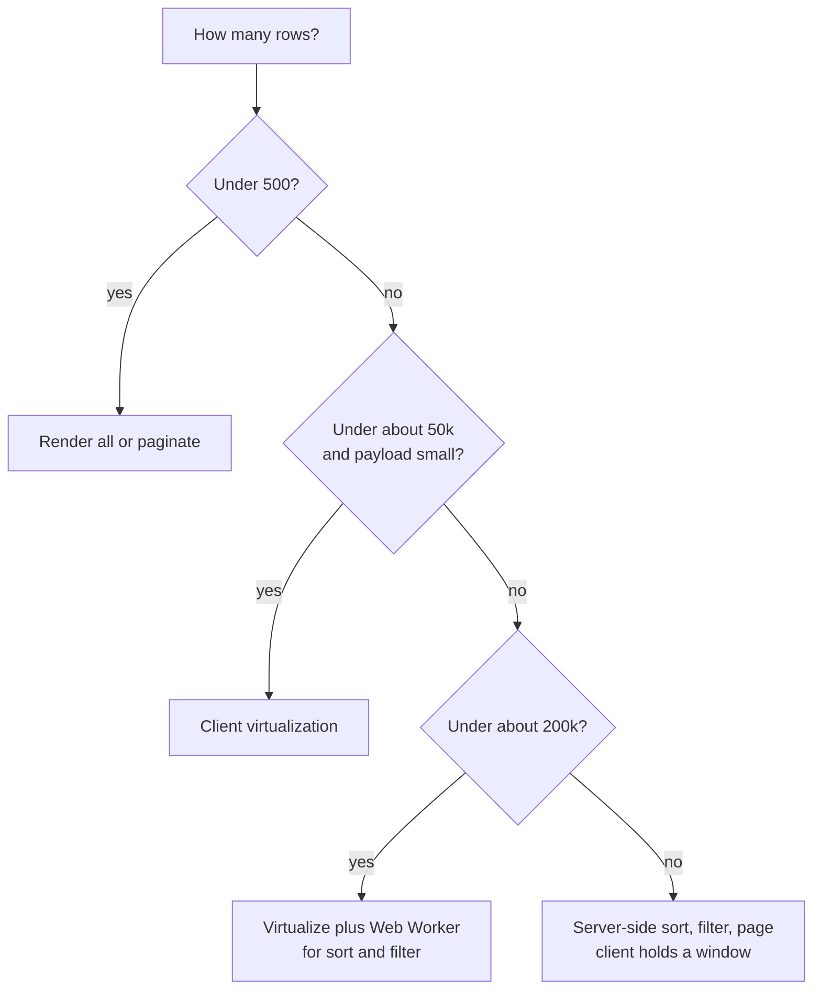
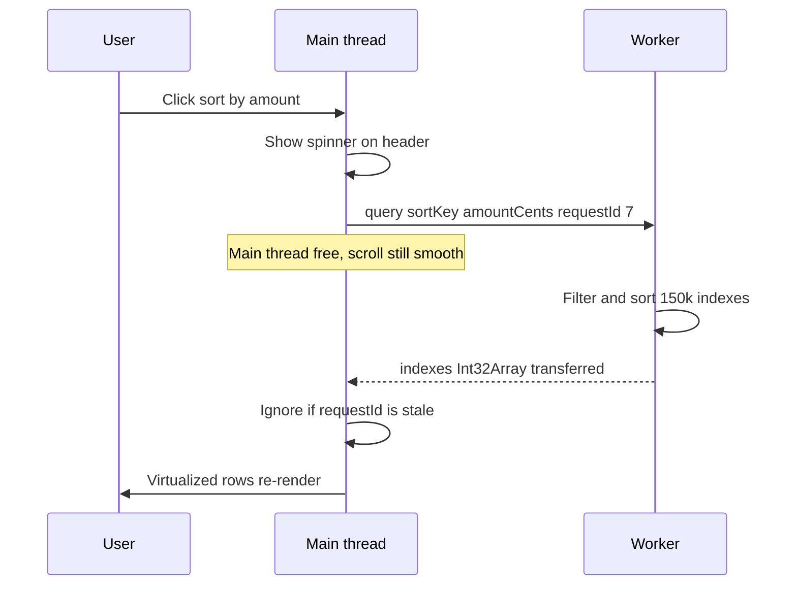
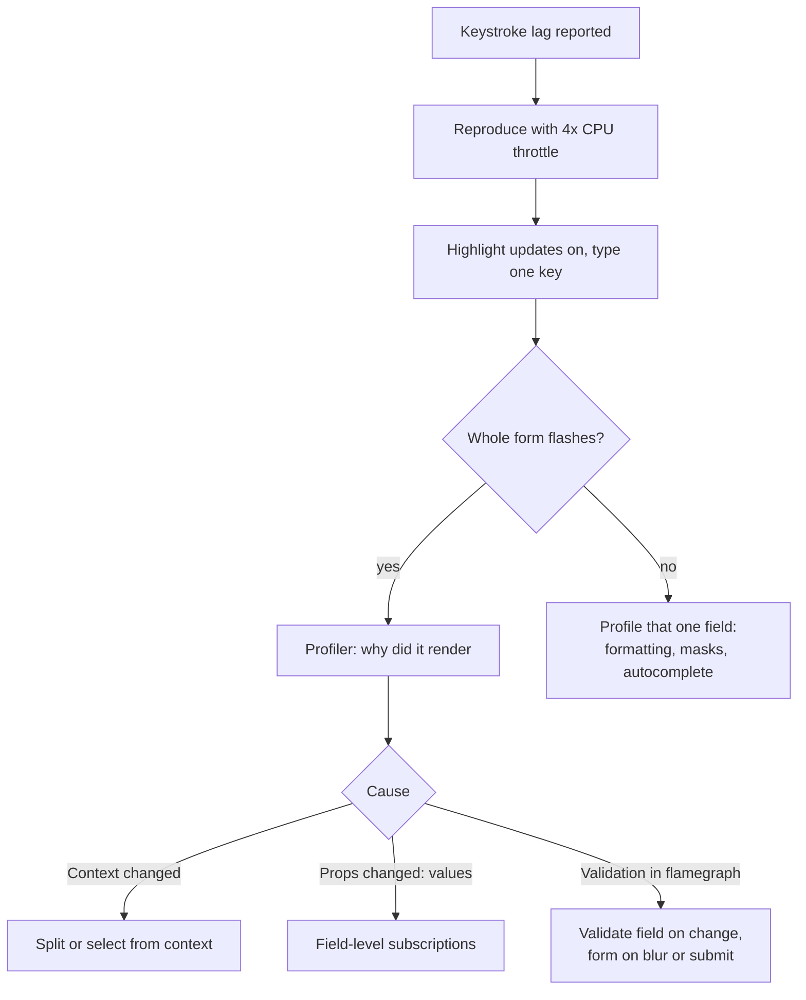
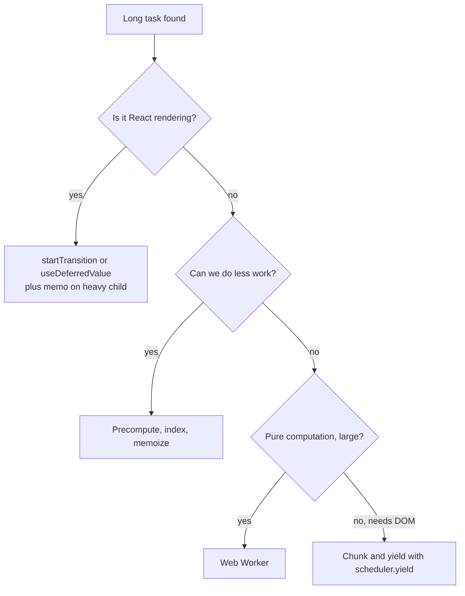
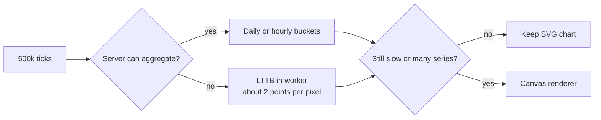
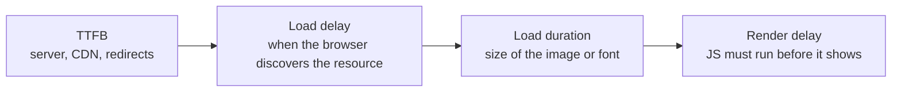
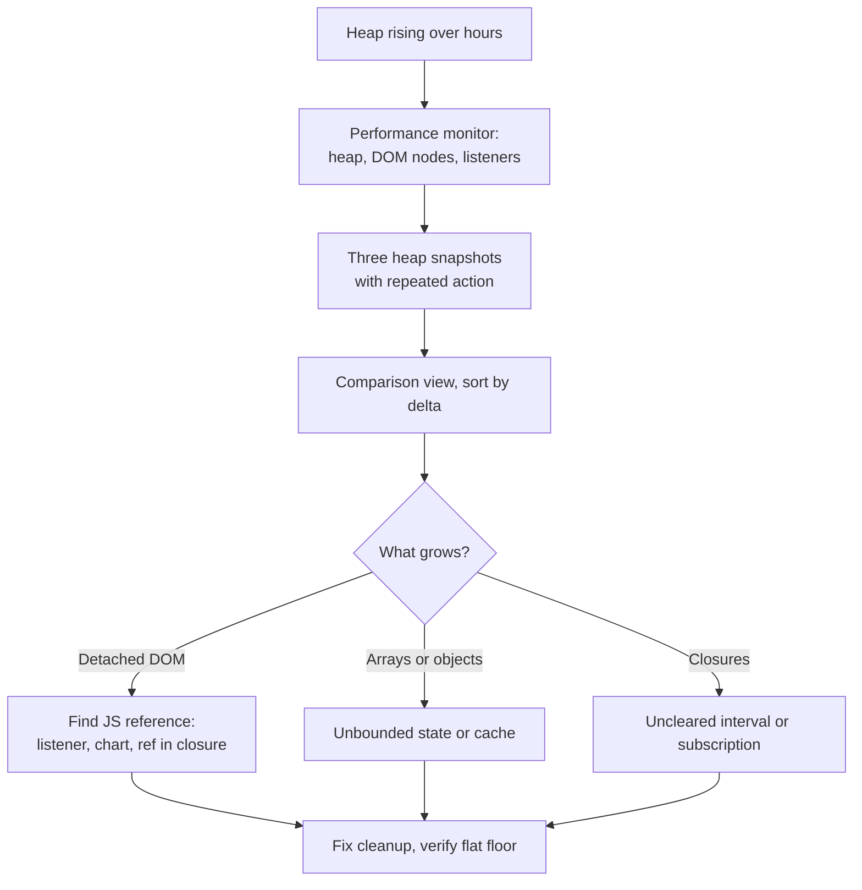
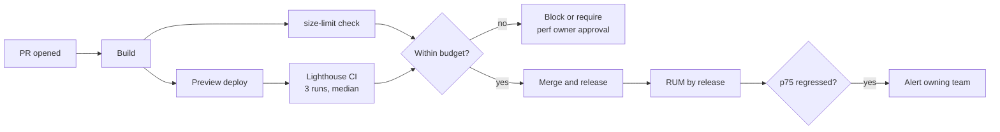

## 1. Large Data: Tables and Lists

#### Q: [Staff] A transactions page has to show 10k rows today, and product says it will be 100k next year and maybe 1M for big institutional clients. How do you design for each size?

**Short answer:** The browser does not care how many rows you have in memory. It cares how many DOM nodes you render and how much JavaScript runs per interaction. At 10k I virtualize the rows. At 100k I virtualize and move sort and filter off the main thread. At 1M I stop shipping the data to the browser and let the server sort, filter and page, with the client only holding a window.

**Clarify first:**
- What does the user actually do with the rows? Scan, search, export, reconcile? Nobody reads 1M rows. They filter.
- Do they need sort and filter across all rows, or within the loaded set?
- What devices? A trader's desktop and a support agent's old laptop behave very differently.
- How wide is each row? 8 columns or 60? Width matters as much as height.
- Is the data live (websocket updates) or a static statement?
- Must "select all" or "export CSV" work on the full set?

**Diagnose:** Before choosing, measure the current page.
1. Chrome Performance panel, record a load and a sort. Look at the "Main" track. Long yellow blocks are scripting, purple are style and layout.
2. Count DOM nodes: `document.querySelectorAll('*').length` in the console. Above roughly 1,500 to 3,000 nodes, Lighthouse starts warning. 10k rows by 10 cells is 100k+ nodes.
3. Check the payload in the Network tab. 100k transactions at ~300 bytes of JSON each is ~30 MB uncompressed. Parsing that alone blocks the main thread.
4. React DevTools Profiler: how long does one commit take when you change the sort?

**Solution:** The decision depends on size, from simplest to most powerful.

| Rows | Approach | Data lives |
| --- | --- | --- |
| Under ~500 | Render all, maybe paginate for UX | Client |
| ~1k to ~50k | Row virtualization | Client |
| ~50k to ~200k | Virtualization plus sort/filter in a Web Worker | Client, off main thread |
| 200k to 1M+ | Server-side sort/filter/paging, infinite or windowed loading | Server |

These thresholds are rough. Row width and device speed shift them.

Option 1, pagination. Simplest. Each page renders 50 rows. Works well when users think in pages, like statements. It breaks "scroll to find" workflows.

Option 2, virtualization. Only render rows in the viewport plus a small overscan. With TanStack Virtual:

```tsx
import { useVirtualizer } from '@tanstack/react-virtual';
import { useRef } from 'react';

type Txn = { id: string; date: string; description: string; amountCents: number };

export function TxnTable({ rows }: { rows: Txn[] }) {
  const parentRef = useRef<HTMLDivElement>(null);

  const virtualizer = useVirtualizer({
    count: rows.length,
    getScrollElement: () => parentRef.current,
    estimateSize: () => 36, // fixed row height keeps math cheap
    overscan: 10,
    getItemKey: (index) => rows[index].id, // stable key, not index
  });

  return (
    <div ref={parentRef} style={{ height: 600, overflow: 'auto' }}>
      <div style={{ height: virtualizer.getTotalSize(), position: 'relative' }}>
        {virtualizer.getVirtualItems().map((item) => {
          const row = rows[item.index];
          return (
            <div
              key={item.key}
              style={{
                position: 'absolute',
                top: 0,
                left: 0,
                width: '100%',
                height: item.size,
                transform: `translateY(${item.start}px)`,
              }}
            >
              <TxnRow row={row} />
            </div>
          );
        })}
      </div>
    </div>
  );
}
```

Now 100k rows render about 30 DOM rows. Scroll cost stays flat.

Option 3, virtualization plus a worker for sort and filter (next question).

Option 4, server-side. The client sends `{ sort, filters, cursor, limit }`. The server uses an index and returns one page. The virtualizer's `count` becomes the server's total, and you fetch pages as the visible range moves.

```ts
// Keyset pagination is stable under inserts; OFFSET gets slow on deep pages.
// GET /transactions?sort=date_desc&after=2026-09-30T10:00:00Z_txn_8812&limit=200
```

```sql
SELECT id, posted_at, description, amount_cents
FROM transactions
WHERE account_id = $1
  AND (posted_at, id) < ($2, $3)
ORDER BY posted_at DESC, id DESC
LIMIT 200;
-- needs an index on (account_id, posted_at DESC, id DESC)
```



**Trade-offs:**
- Pagination: simple and accessible, but breaks Ctrl+F and continuous scanning.
- Virtualization: rows outside the viewport are not in the DOM, so browser find-in-page, printing and some screen reader navigation break. Variable row heights need measurement and can cause scroll jumps.
- Worker: extra complexity, data copying cost between threads, harder debugging.
- Server-side: every sort is a network round trip. Needs proper indexes. Cursor pagination makes "jump to page 400" hard.

**What interviewers listen for:**
- You ask what users actually do before picking a technique.
- You separate DOM cost, JS cost and network/parse cost.
- You mention the accessibility and find-in-page cost of virtualization.
- You know keyset pagination beats OFFSET for deep pages.
- Red flag: "just use React.memo" as the whole answer. Red flag: loading 1M rows into Redux.

> **Finance tip:** For statements and reconciliation, users often need a total for the filtered set. Compute totals on the server in integer cents. Do not sum a partial client window and show it as the total.

#### Q: [Senior] Sorting 150k transactions freezes the UI for two seconds. The data is already on the client. Walk me through the fix.

**Short answer:** First confirm the time is in the sort itself and not in re-rendering. If it is the sort, move it into a Web Worker so the main thread stays free, use a cheap comparator, and keep the UI responsive with a loading state. If the cost is rendering, fix that with virtualization and memoization first.

**Clarify first:**
- Which column? Sorting by `amountCents` (number) is far cheaper than by `description` with locale-aware compare.
- Is the data already virtualized?
- How often does data change? If it streams, you may re-sort constantly.

**Diagnose:**
1. Performance panel, record the click. Expand the long task. If you see `Array.prototype.sort` and `localeCompare` dominating, it is the sort. If you see `performWorkUntilDeadline`, `renderWithHooks` and many component names, it is React rendering.
2. Quick check in code: wrap the sort in `performance.mark` and `performance.measure` and look at the Timings track.

```ts
performance.mark('sort-start');
const sorted = [...rows].sort(compare);
performance.mark('sort-end');
performance.measure('txn-sort', 'sort-start', 'sort-end');
```

3. A common hidden cost: `a.description.localeCompare(b.description)` creates collation work on every compare. 150k rows is about 2.5M comparisons.

**Solution:**

Step 1, cheaper comparator. Reuse one `Intl.Collator` instead of `localeCompare` per call.

```ts
const collator = new Intl.Collator('en', { sensitivity: 'base', numeric: true });
const byDescription = (a: Txn, b: Txn) => collator.compare(a.description, b.description);
const byAmount = (a: Txn, b: Txn) => a.amountCents - b.amountCents;
```

Step 2, sort indexes, not objects. Sort an `Int32Array` or `number[]` of row indexes so you never copy the row objects.

Step 3, move it to a worker. The worker keeps the dataset once. The main thread sends only "sort by X" and receives an index array.

```ts
// txn-worker.ts
type Txn = { id: string; description: string; amountCents: number; postedAt: number };
type Msg =
  | { type: 'load'; rows: Txn[] }
  | { type: 'query'; requestId: number; sortKey: keyof Txn; dir: 1 | -1; search: string };

let rows: Txn[] = [];
const collator = new Intl.Collator('en', { sensitivity: 'base', numeric: true });

self.onmessage = (e: MessageEvent<Msg>) => {
  const msg = e.data;
  if (msg.type === 'load') {
    rows = msg.rows;
    return;
  }
  const { sortKey, dir, search, requestId } = msg;
  const q = search.toLowerCase();
  const idx: number[] = [];
  for (let i = 0; i < rows.length; i++) {
    if (!q || rows[i].description.toLowerCase().includes(q)) idx.push(i);
  }
  idx.sort((a, b) => {
    const va = rows[a][sortKey];
    const vb = rows[b][sortKey];
    const c =
      typeof va === 'string' ? collator.compare(va, vb as string) : (va as number) - (vb as number);
    return c * dir;
  });
  const result = Int32Array.from(idx);
  // Transfer the buffer instead of copying it.
  (self as unknown as Worker).postMessage({ requestId, indexes: result }, [result.buffer]);
};
```

```ts
// useTxnQuery.ts
import { useEffect, useRef, useState } from 'react';

export function useTxnQuery(rows: Txn[], sortKey: keyof Txn, dir: 1 | -1, search: string) {
  const workerRef = useRef<Worker | null>(null);
  const latest = useRef(0);
  const [indexes, setIndexes] = useState<Int32Array | null>(null);
  const [pending, setPending] = useState(false);

  useEffect(() => {
    const w = new Worker(new URL('./txn-worker.ts', import.meta.url), { type: 'module' });
    w.onmessage = (e: MessageEvent<{ requestId: number; indexes: Int32Array }>) => {
      if (e.data.requestId !== latest.current) return; // drop stale answers
      setIndexes(e.data.indexes);
      setPending(false);
    };
    workerRef.current = w;
    return () => w.terminate();
  }, []);

  useEffect(() => {
    workerRef.current?.postMessage({ type: 'load', rows });
  }, [rows]);

  useEffect(() => {
    const requestId = ++latest.current;
    setPending(true);
    workerRef.current?.postMessage({ type: 'query', requestId, sortKey, dir, search });
  }, [rows, sortKey, dir, search]);

  return { indexes, pending };
}
```

The table reads `rows[indexes[i]]` for each virtual row.



Step 4, only if needed: keep pre-sorted index arrays per column so a re-sort is instant, at the cost of memory.

**Trade-offs:**
- `postMessage` uses structured clone. Sending 150k objects to the worker can itself take hundreds of milliseconds. Send them once on load, or fetch the data inside the worker so it never touches the main thread.
- Transferable `ArrayBuffer`s move with no copy, but the sender loses access.
- Workers have no DOM and need bundler support (`new URL(..., import.meta.url)` works in Vite and webpack 5).
- `SharedArrayBuffer` avoids copies entirely but requires cross-origin isolation headers (COOP/COEP), which can break third-party embeds.

**What interviewers listen for:**
- You measure to separate sort cost from render cost.
- You know structured clone has a cost and use transferables.
- You handle out-of-order responses with a request id.
- Red flag: wrapping the sort in `setTimeout(..., 0)`. It still blocks, just later.

> **Gotcha:** `new Date(row.date)` inside a comparator is a classic hidden cost. Parse dates to epoch numbers once when data arrives, then compare numbers.

#### Q: [Mid] Why do stable row keys and memoized cells matter in a big table, and when does memoization not help?

**Short answer:** Keys tell React which row is which between renders. With stable ids, React reuses existing row components and DOM. With index keys, a sort or insert makes React think every row changed content, so it re-renders and can mix up local state like an open menu. Memoized rows skip re-rendering when their props are unchanged, but only if the props really are stable.

**Clarify first:** Is the table virtualized? Do rows hold local state (expanded, editing, checkbox)? Are props passed as new objects or inline functions each render?

**Diagnose:**
1. React DevTools, Components tab, settings, turn on "Highlight updates when components render." Sort the table. If every row flashes even when only the order changed, keys or props are wrong.
2. Profiler: select a row component and check "Why did this render?" (enable "Record why each component rendered while profiling" in Profiler settings).

**Solution:**

```tsx
import { memo, useCallback } from 'react';

type RowProps = { row: Txn; selected: boolean; onToggle: (id: string) => void };

const TxnRow = memo(function TxnRow({ row, selected, onToggle }: RowProps) {
  return (
    <div role="row" aria-selected={selected}>
      <input type="checkbox" checked={selected} onChange={() => onToggle(row.id)} />
      <span>{row.description}</span>
      <Money cents={row.amountCents} />
    </div>
  );
});

function Table({ rows, selectedIds, setSelectedIds }: Props) {
  // Stable function identity, so memo is not defeated.
  const onToggle = useCallback(
    (id: string) =>
      setSelectedIds((prev) => {
        const next = new Set(prev);
        if (next.has(id)) next.delete(id);
        else next.add(id);
        return next;
      }),
    [setSelectedIds],
  );

  return rows.map((row) => (
    <TxnRow key={row.id} row={row} selected={selectedIds.has(row.id)} onToggle={onToggle} />
  ));
}
```

Passing `selected` as a boolean, not the whole `Set`, means only the toggled row re-renders.

For wide tables, use column virtualization too. TanStack Virtual supports `horizontal: true`. Render a second virtualizer for columns and only draw visible cells. A 60-column grid with 30 visible rows goes from 1,800 cells to maybe 300.

**Trade-offs:**
- `memo` costs a shallow compare per render. On cheap components it can be slower than just rendering.
- Memoization is defeated by inline objects (`style={{...}}`), inline arrow functions, and new arrays from `.map` in the parent.
- If your rows come from a selector that returns new objects every time, every row is "changed" anyway. Fix the data shape first.
- The React Compiler (stable since late 2025) can auto-memoize components and values. It reduces manual `useCallback` work but does not fix bad keys or bad data shapes.

**What interviewers listen for:**
- You explain keys in terms of identity and reconciliation, not "React warns about it."
- You know what breaks memo (unstable references).
- You mention column virtualization for wide data.
- Red flag: `key={Math.random()}` or `key={index}` on sortable lists.

> **Gotcha:** Index keys plus an uncontrolled input inside a row is a real bug, not just a perf issue. After a sort, the typed value stays in position 3 while the row data moves.

## 2. Re-renders and Slow Forms

#### Q: [Senior] Users say the payment form lags when typing. There is a 1–2 frame delay on every keystroke. How do you find out what is slow?

**Short answer:** I reproduce it with CPU throttling, record with the React Profiler, and look at what renders on each keystroke. The usual causes are a single controlled state object that re-renders the whole form, a context that changes on every keystroke, or validation running across all fields on every change. The fix is to isolate fields so typing in one only re-renders that one.

**Clarify first:**
- Which form library? Final Form, React Hook Form, Formik, or hand-rolled `useState`?
- How many fields? Are there field arrays (e.g. 50 payment lines)?
- Is the lag in every field or one specific field (like a currency input or an autocomplete)?
- Which devices? Lag at 4x CPU throttle is what a mid-range laptop feels.

**Diagnose:**
1. Chrome DevTools, Performance, set CPU to 4x or 6x slowdown. Type a few characters and stop. Look for long tasks after each `keydown`/`input` event. The Interactions track shows each interaction's duration.
2. React DevTools, turn on "Highlight updates when components render." Type one character. If the whole form flashes, you found the shape of the problem.
3. React DevTools Profiler, record while typing 5 characters. Look at the flamegraph for one commit:
   - Wide bars are components that took long to render.
   - Grey bars did not render. You want almost everything grey except the field you typed in.
   - Use "Ranked" view to see the most expensive components.
   - With "Record why each component rendered" on, it tells you "Props changed: values" or "Context changed."
4. Look for these specific culprits:
   - `const [values, setValues] = useState({...})` at the top of the form, passed down to every field.
   - `<FormContext.Provider value={{ values, errors, setValue }}>` where every field reads the context.
   - A schema validation (Yup or Zod) of the whole form on every keystroke.
   - Expensive derived values (fee calculation, FX lookup) computed inline in render.
   - A third-party currency input that formats on every change and causes cursor jumps plus re-renders.



**Solution:**

Fix 1, subscription-based forms. Final Form lets each field subscribe only to what it needs.

```tsx
import { Form, Field } from 'react-final-form';

<Form
  onSubmit={submitPayment}
  subscription={{ submitting: true, pristine: true }} // form re-renders only on these
  render={({ handleSubmit, submitting }) => (
    <form onSubmit={handleSubmit}>
      <Field name="payeeName" subscription={{ value: true, error: true, touched: true }}>
        {({ input, meta }) => <TextInput {...input} error={meta.touched && meta.error} />}
      </Field>
      <Field name="amountCents" validate={validateAmount} subscription={{ value: true, error: true }}>
        {({ input, meta }) => <MoneyInput {...input} error={meta.error} />}
      </Field>
      <button disabled={submitting}>Pay</button>
    </form>
  )}
/>
```

Without `subscription`, Final Form's `<Form>` subscribes to all form state and re-renders the whole render prop on every change.

React Hook Form takes a different route: inputs are uncontrolled and registered by ref, so typing does not re-render React at all unless you `watch` a field.

```tsx
const { register, handleSubmit, control } = useForm<PaymentForm>({ mode: 'onBlur' });
// Only this small component re-renders when amount changes:
function FeePreview({ control }: { control: Control<PaymentForm> }) {
  const amount = useWatch({ control, name: 'amountCents' });
  return <span>Fee: {formatCents(calcFee(amount))}</span>;
}
```

Fix 2, field isolation in hand-rolled forms. Move state down, or use a store with selectors so each field subscribes to its own slice.

```tsx
import { create } from 'zustand';

type FormStore = { values: Record<string, string>; set: (k: string, v: string) => void };
const useFormStore = create<FormStore>((set) => ({
  values: {},
  set: (k, v) => set((s) => ({ values: { ...s.values, [k]: v } })),
}));

function FieldInput({ name }: { name: string }) {
  const value = useFormStore((s) => s.values[name] ?? ''); // re-renders only when this changes
  const setValue = useFormStore((s) => s.set);
  return <input value={value} onChange={(e) => setValue(name, e.target.value)} />;
}
```

Fix 3, validation timing. Validate the changed field on change. Validate cross-field rules and the full schema on blur or submit. Debounce async checks (like "is this IBAN valid" on the server) by ~300 ms and cancel stale ones.

Fix 4, expensive derived values. Wrap in `useMemo` keyed on the inputs, or move to a child component that subscribes only to those inputs.

**Trade-offs:**
- Subscriptions add boilerplate and are easy to forget on new fields.
- Uncontrolled inputs (RHF) are fast but integrating controlled third-party widgets needs `Controller`, which brings back re-renders for that field.
- Validating less often means errors appear later. For money fields, show format errors live and business rules on blur.

**What interviewers listen for:**
- You reproduce under throttling, not on a fast MacBook.
- You use the Profiler's "why did this render" rather than guessing.
- You name the real mechanisms: state too high, context fan-out, eager validation.
- You know your form library's re-render model.
- Red flag: "add debounce to the input." Debouncing a controlled input's value makes typing feel broken.

> **Interview tip:** Say the numbers. "At 6x throttle each keystroke took 80 ms. After field subscriptions it took 6 ms, and only the amount field rendered."

#### Q: [Mid] How do you find unnecessary re-renders in a React app, and how do you decide which ones are worth fixing?

**Short answer:** Use React DevTools "Highlight updates" to see what renders, then the Profiler to see what it costs. A re-render is only a problem if it is expensive or happens very often. Fix the ones that show up in a slow interaction, not every flash on screen.

**Clarify first:** Is there a user-visible problem (slow interaction, janky scroll) or is this a general cleanup? Which React version, and is the React Compiler on?

**Diagnose:**
1. Highlight updates: see the blast radius of an action.
2. Profiler, record one interaction. Check commit duration in the top bar. Under ~16 ms per commit is usually fine.
3. Turn on "Record why each component rendered." Common answers:
   - "The parent component rendered." Normal. Only fix if the child is expensive.
   - "Props changed: onClick." An inline function. Stabilize it if the child is memoized.
   - "Context changed." Check if the context value is a new object each render.
   - "Hooks changed." A state or store hook returned something new.
4. `why-did-you-render` (a dev-only library) logs re-renders where props are deep-equal but referentially different. Good for finding "same data, new object" bugs. It patches React internals, so check it supports your React version before relying on it.
5. In code, a quick probe:

```tsx
import { Profiler } from 'react';

<Profiler
  id="PortfolioChart"
  onRender={(id, phase, actualDuration) => {
    if (actualDuration > 8) console.warn(id, phase, actualDuration.toFixed(1), 'ms');
  }}
>
  <PortfolioChart />
</Profiler>
```

**Solution:** Typical fixes in order of preference.
1. Move state down to the component that uses it.
2. Lift content up: pass expensive children as `children` so they are created by a parent that does not re-render.

```tsx
// Before: Dashboard re-renders the chart every time `hovered` changes.
// After: the chart is created by the parent and passed as children.
function HoverCard({ children }: { children: React.ReactNode }) {
  const [hovered, setHovered] = useState(false);
  return <div onMouseEnter={() => setHovered(true)} className={hovered ? 'hot' : ''}>{children}</div>;
}
<HoverCard><PortfolioChart data={data} /></HoverCard>
```

3. Stabilize references with `useMemo`/`useCallback`, then `memo` the expensive child.
4. Use selectors: `useSelector((s) => s.accounts.byId[id])` instead of `useSelector((s) => s.accounts)`. In Redux, a selector that returns a new array every time (`s.txns.filter(...)`) re-renders on every store update. Use `createSelector`.
5. Enable the React Compiler if your stack supports it, and let it handle most memoization.

**Trade-offs:** Every `useMemo` is code to maintain and a dependency array to get wrong. Over-memoizing makes code harder to read and can hide stale-closure bugs. Fix structure first.

**What interviewers listen for:**
- "A re-render is not a bug. A slow re-render is."
- You know the composition tricks (state down, children up), not only `memo`.
- You know selectors returning new references cause renders.
- Red flag: wrapping every component in `memo` by default.

> **Gotcha:** Profiling a development build exaggerates costs. Confirm big wins with a production build that has profiling enabled (`react-dom/profiling` alias), or with the Chrome Performance panel on a production build.

#### Q: [Senior] The app has one `AppContext` with user, theme, accounts, selected account and notifications. Clicking a notification re-renders the whole dashboard. Explain why and fix it.

**Short answer:** Every consumer of a context re-renders when the context value changes, and React compares the value by reference. A single big context object that changes for any reason re-renders every consumer. Split the context by how often each piece changes, memoize the value, or move fast-changing state to a store with selectors.

**Clarify first:** How many consumers? Which parts change often (notifications, live prices) versus rarely (user, theme)? Is there already Redux or React Query in the app?

**Diagnose:** Profiler with "why did this render" will say "Context changed" for dozens of components. Search for `<AppContext.Provider value={{` — an inline object is a new reference every render of the provider, even if nothing changed.

**Solution:**

```tsx
// 1. Memoize the value so provider re-renders do not create new references.
const value = useMemo(() => ({ user, theme }), [user, theme]);

// 2. Split by change frequency.
<UserContext.Provider value={user}>
  <ThemeContext.Provider value={theme}>
    <SelectedAccountContext.Provider value={selectedAccountId}>
      <NotificationsProvider>{children}</NotificationsProvider>
    </SelectedAccountContext.Provider>
  </ThemeContext.Provider>
</UserContext.Provider>;

// 3. Split state from actions so components that only dispatch never re-render.
const NotificationsStateContext = createContext<Notification[]>([]);
const NotificationsActionsContext = createContext<{ markRead: (id: string) => void } | null>(null);
```

For data that changes many times per second (live prices), context is the wrong tool. Use an external store with `useSyncExternalStore` or a library (Zustand, Redux) so each component subscribes to a slice.

```ts
import { useSyncExternalStore } from 'react';

const prices = new Map<string, number>();
const listeners = new Set<() => void>();
export function setPrice(symbol: string, p: number) {
  prices.set(symbol, p);
  listeners.forEach((l) => l());
}
function subscribe(l: () => void) {
  listeners.add(l);
  return () => {
    listeners.delete(l);
  };
}

export function usePrice(symbol: string) {
  // React re-renders this component only if the returned number changes.
  return useSyncExternalStore(subscribe, () => prices.get(symbol));
}
```

Server data (accounts, balances) belongs in React Query, which already gives per-query subscriptions and `select` to narrow re-renders.

**Trade-offs:** More contexts means more providers and more nesting. An external store adds a dependency and a new mental model. For a small app, one memoized context is fine.

**What interviewers listen for:**
- You explain the reference-equality rule.
- You split by change frequency and separate state from actions.
- You know context is not a state manager for high-frequency data.
- Red flag: putting live websocket prices into a top-level context.

## 3. Main Thread, Responsiveness and Charts

#### Q: [Senior] Filtering the portfolio screen blocks the main thread for 400 ms. Explain long tasks and the ways to stop blocking.

**Short answer:** The browser runs JavaScript, style, layout and paint on one main thread. Any task over 50 ms is a "long task" and the page cannot respond to input during it. You fix it by doing less work, splitting the work and yielding between chunks, marking non-urgent React updates as transitions, or moving the work to a worker.

**Clarify first:** Is the 400 ms our own code, React rendering, or a third-party script? Does the user need the result instantly, or can the list update a moment later while the input stays responsive?

**Diagnose:**
1. Performance panel: long tasks have a red triangle in the corner. Click one and use "Bottom-Up" sorted by self time to find the hot function.
2. Long Animation Frames API (Chrome 123+) gives script attribution in production:

```ts
new PerformanceObserver((list) => {
  for (const entry of list.getEntries()) {
    // toJSON() includes duration, blockingDuration and scripts[] with sourceURL and invoker
    reportLongFrame(entry.toJSON());
  }
}).observe({ type: 'long-animation-frame', buffered: true });
```

The older `longtask` entry type exists too, but gives almost no attribution. LoAF is Chromium-only as far as I know, so treat it as sampled data, not full coverage.

**Solution:**

Option 1, do less. Memoize derived data, pre-index data once (a `Map` by id instead of `.find` in a loop), avoid re-parsing dates.

Option 2, React concurrent features for render-heavy work. Keep the input urgent and the list non-urgent.

```tsx
import { useDeferredValue, useMemo, useState, useTransition } from 'react';

function HoldingsFilter({ holdings }: { holdings: Holding[] }) {
  const [query, setQuery] = useState('');
  const deferredQuery = useDeferredValue(query); // lags behind while React is busy
  const isStale = query !== deferredQuery;

  const visible = useMemo(
    () => holdings.filter((h) => h.name.toLowerCase().includes(deferredQuery.toLowerCase())),
    [holdings, deferredQuery],
  );

  return (
    <>
      <input value={query} onChange={(e) => setQuery(e.target.value)} />
      <div style={{ opacity: isStale ? 0.6 : 1 }}>
        <HoldingsList items={visible} />
      </div>
    </>
  );
}

// Or with a transition when you own the setter:
const [isPending, startTransition] = useTransition();
const onTabChange = (tab: Tab) => startTransition(() => setTab(tab));
```

Transitions only help with React rendering work, because React can pause and resume rendering between components. They do not split a single 400 ms synchronous `filter` call. For `HoldingsList` to benefit, it should be wrapped in `memo` so it does not re-render on the urgent update.

Option 3, yield inside plain JS loops.

```ts
function yieldToMain(): Promise<void> {
  // scheduler.yield() keeps your continuation at the front of the queue.
  // Chromium has it; check support for other browsers and fall back.
  const s = (globalThis as { scheduler?: { yield?: () => Promise<void> } }).scheduler;
  if (s?.yield) return s.yield();
  return new Promise((resolve) => setTimeout(resolve, 0));
}

export async function categorizeAll(txns: Txn[], onProgress: (n: number) => void) {
  const out: Categorized[] = [];
  let lastYield = performance.now();
  for (let i = 0; i < txns.length; i++) {
    out.push(categorize(txns[i]));
    if (performance.now() - lastYield > 40) {
      onProgress(i);
      await yieldToMain();
      lastYield = performance.now();
    }
  }
  return out;
}
```

Yield by time, not by a fixed count, so slow devices yield more often.

Option 4, move to a Web Worker when the work is pure computation and large.



**Trade-offs:**
- `useDeferredValue` shows stale results briefly. Show it visually (opacity, spinner).
- Yielding makes total time longer. The goal is responsiveness, not throughput.
- `setTimeout(0)` puts you at the back of the task queue, and browsers clamp nested timeouts to ~4 ms after several levels.
- Workers need data copied in and out.

**What interviewers listen for:**
- The 50 ms long-task threshold and why (input must be handled within ~100 ms to feel instant).
- You know transitions do not make synchronous JS interruptible.
- Feature detection for `scheduler.yield`.
- Red flag: "use `requestIdleCallback`" for user-triggered work. Idle callbacks may not run for a long time on a busy page.

#### Q: [Senior] INP for the account dashboard is 450 ms at p75 in the field, but it feels fine on your machine. How do you diagnose and fix it?

**Short answer:** INP (Interaction to Next Paint) measures the delay from a user click, tap or key press until the next frame is painted, and reports roughly the worst interaction per page visit. Field data comes from real, slower devices, so I need field attribution to find which interaction and which phase is slow: input delay, processing time, or presentation delay. Then I fix that phase.

**Clarify first:** Which page and which device class? Is this from CrUX or our own RUM? Which interaction (opening a dropdown, switching account, typing in search)?

**Diagnose:**
1. Use the attribution build of `web-vitals` in production:

```ts
import { onINP } from 'web-vitals/attribution';

onINP(
  ({ value, rating, attribution }) => {
    sendToAnalytics('INP', {
      value,
      rating,
      target: attribution.interactionTarget, // CSS selector of the element
      type: attribution.interactionType, // 'pointer' | 'keyboard'
      inputDelay: attribution.inputDelay,
      processing: attribution.processingDuration,
      presentation: attribution.presentationDelay,
      loafScripts: attribution.longAnimationFrameEntries?.flatMap((e) =>
        (e as unknown as { scripts: { sourceURL: string }[] }).scripts.map((s) => s.sourceURL),
      ),
    });
  },
  { reportAllChanges: false },
);
```

2. Group by `interactionTarget`. Usually one or two elements explain most bad INP.
3. Reproduce locally with 6x CPU throttle. The Performance panel has an Interactions track that shows each interaction split into the same phases.

Thresholds (at p75): good is 200 ms or less, poor is over 500 ms. INP replaced FID as a Core Web Vital in March 2024.

**Solution:** Fix by phase.

| Phase | Typical cause | Fix |
| --- | --- | --- |
| Input delay | Main thread busy with something else (hydration, polling handler, analytics) | Break up long tasks, delay third-party scripts, avoid heavy work on timers |
| Processing | Your event handler and the React render it triggers | Smaller state updates, transitions, memo, less work in handlers |
| Presentation | Huge DOM, expensive layout or paint after the update | Virtualize, reduce DOM size, avoid layout thrashing, `content-visibility` |

A common pattern: give immediate visual feedback, then do the heavy work.

```tsx
function AccountSwitcher() {
  const [open, setOpen] = useState(false);
  const [isPending, startTransition] = useTransition();

  const choose = (id: string) => {
    setOpen(false); // urgent: close menu now, paint fast
    startTransition(() => setSelectedAccount(id)); // heavy dashboard re-render later
  };
  // ...
}
```

Layout thrashing in handlers is another common processing cost:

```ts
// Bad: read-write-read-write forces layout each iteration.
rows.forEach((el) => (el.style.width = el.offsetWidth + 10 + 'px'));

// Good: read all, then write all.
const widths = rows.map((el) => el.offsetWidth);
rows.forEach((el, i) => (el.style.width = widths[i] + 10 + 'px'));
```

**Trade-offs:** Transitions add a pending state you must design for. Delaying third-party scripts can reduce analytics accuracy. `content-visibility: auto` can cause scrollbar jumps unless you set `contain-intrinsic-size`.

**What interviewers listen for:**
- You know lab and field differ and you trust field data for INP.
- You split INP into its three phases.
- You know INP replaced FID and the thresholds.
- Red flag: "Lighthouse says 98 so we are fine." A default Lighthouse page-load run has no user interaction, so it cannot report INP. It reports Total Blocking Time as a lab proxy. (Lighthouse timespan mode can capture interactions you perform, but it is still one device.)

#### Q: [Senior] A portfolio performance chart with 5 years of tick data (about 500k points) takes 3 seconds to render with Recharts and freezes on hover. What do you do?

**Short answer:** A 900-pixel-wide chart cannot show more than about 900 distinct x positions, so sending 500k points to the renderer is pure waste. I downsample to a few thousand points with an algorithm that keeps the visual shape, like LTTB, and switch to a canvas-based renderer if I still need many points or many series. SVG charts create one DOM node per point, which is what kills performance.

**Clarify first:** Does the user need exact values on hover, or just the shape? Is zoom required (then re-sample per zoom range)? How many series? Can the server pre-aggregate (daily OHLC instead of ticks)?

**Diagnose:**
1. Count SVG nodes: `document.querySelectorAll('svg *').length`.
2. Performance panel: look for long "Recalculate Style" and "Layout" from SVG, plus React render of Recharts components.
3. Hover lag often comes from the tooltip re-rendering the whole chart on every mouse move.

**Solution:**

Option 1, aggregate on the server. For a 5-year view, daily close is enough. 1,260 trading days instead of 500k ticks. This is the best fix when possible.

Option 2, downsample with LTTB (Largest-Triangle-Three-Buckets). It splits data into buckets and, in each bucket, keeps the point that forms the largest triangle with the previous chosen point and the average of the next bucket. Peaks and dips survive, unlike naive "every Nth point."

```ts
type Pt = { x: number; y: number };

export function lttb(data: Pt[], threshold: number): Pt[] {
  const n = data.length;
  if (threshold >= n || threshold < 3) return data;

  const sampled: Pt[] = [data[0]];
  const bucketSize = (n - 2) / (threshold - 2);
  let a = 0; // index of previously selected point

  for (let i = 0; i < threshold - 2; i++) {
    // Average of the next bucket.
    const nextStart = Math.floor((i + 1) * bucketSize) + 1;
    const nextEnd = Math.min(Math.floor((i + 2) * bucketSize) + 1, n);
    let avgX = 0;
    let avgY = 0;
    for (let j = nextStart; j < nextEnd; j++) {
      avgX += data[j].x;
      avgY += data[j].y;
    }
    const len = Math.max(nextEnd - nextStart, 1);
    avgX /= len;
    avgY /= len;

    // Current bucket.
    const start = Math.floor(i * bucketSize) + 1;
    const end = Math.floor((i + 1) * bucketSize) + 1;
    let maxArea = -1;
    let chosen = start;
    for (let j = start; j < end; j++) {
      const area = Math.abs(
        (data[a].x - avgX) * (data[j].y - data[a].y) - (data[a].x - data[j].x) * (avgY - data[a].y),
      );
      if (area > maxArea) {
        maxArea = area;
        chosen = j;
      }
    }
    sampled.push(data[chosen]);
    a = chosen;
  }

  sampled.push(data[n - 1]);
  return sampled;
}

// Target about 2 points per horizontal pixel.
const points = useMemo(() => lttb(raw, Math.round(chartWidth * 2)), [raw, chartWidth]);
```

Run it in a worker if the raw data is very large. On zoom, re-run LTTB on just the visible range so detail appears as the user zooms in.

Option 3, chart tweaks in Recharts: `isAnimationActive={false}`, `dot={false}`, no per-point `activeDot` customizations, and memoize the data array so the chart does not recompute on unrelated renders.

Option 4, canvas or WebGL renderer. Canvas draws pixels with no DOM node per point. Libraries like uPlot or ECharts (canvas mode) handle hundreds of thousands of points. Hover uses math (binary search on x) instead of DOM hit testing.



**Trade-offs:**
- Downsampling loses exact values. Tooltips should show values from the raw data at that x, found by binary search, not from the sampled point.
- Canvas is not accessible by default. Add a visually hidden data table or summary, and keyboard navigation.
- Canvas is harder to style with CSS and to test with DOM queries.
- Server aggregation needs an API change.

**What interviewers listen for:**
- "Pixels are the limit" reasoning.
- You know why naive decimation hides spikes, and name LTTB or min/max bucketing.
- SVG vs canvas trade-off including accessibility.
- Red flag: "use a faster chart library" without reducing the data.

> **Finance tip:** For price charts, min/max per bucket (or OHLC candles) is often more honest than LTTB, because traders care about the true high and low in each period.

## 4. Loading Performance: Bundles, LCP, CLS, Images and Fonts

#### Q: [Senior] The main JS bundle is 2.4 MB minified and the login-to-dashboard time is slow on mobile. How do you cut it down?

**Short answer:** First measure what is in the bundle with an analyzer. Then remove or replace heavy dependencies, split code by route so the dashboard does not ship the admin screens, lazy-load rarely used heavy features, and make sure tree-shaking actually works. JavaScript is the most expensive byte type because it must be downloaded, parsed, compiled and executed.

**Clarify first:** Is the 2.4 MB one file or the total? What is the gzip/brotli size? Which bundler (Vite, webpack)? What are the main routes and how often is each used?

**Diagnose:**
1. Run an analyzer.
   - Vite: `rollup-plugin-visualizer` gives a treemap.
   - webpack: `webpack-bundle-analyzer`.
   - Any bundler with source maps: `source-map-explorer dist/assets/*.js`.
2. Chrome DevTools Coverage tab (Cmd+Shift+P, "Show Coverage"). Load the dashboard. Red bars are code downloaded but not executed. 60 to 70 percent unused on first load is common.
3. Look for the usual suspects:
   - `moment` with all locales (around 300 KB minified with locales).
   - `lodash` imported as `import _ from 'lodash'` (the whole library, around 70 KB minified).
   - Chart libraries, PDF viewers (`react-pdf` plus pdf.js worker), rich text editors, date pickers loaded on every page.
   - Two copies of the same library at different versions (check `npm ls <pkg>`).
   - Polyfills for browsers you no longer support.

**Solution:**

Step 1, replace or slim heavy dependencies.

```ts
// Before
import _ from 'lodash';
import moment from 'moment';
const d = moment(txn.postedAt).format('DD MMM YYYY');
const grouped = _.groupBy(txns, 'category');

// After
import groupBy from 'lodash/groupBy'; // or lodash-es with tree-shaking, or native Object.groupBy
import { format } from 'date-fns';
const d = format(new Date(txn.postedAt), 'dd MMM yyyy');
const grouped = groupBy(txns, 'category');
```

`Intl.DateTimeFormat` and `Intl.NumberFormat` replace a lot of formatting code with zero bytes. `Object.groupBy` is in modern browsers (2024+), so check your support matrix.

> **Outdated:** Moment.js is in maintenance mode, and its own docs recommend alternatives such as Luxon, date-fns or Day.js. The Temporal API is arriving in browsers but support is still uneven as of late 2026, so check before relying on it without a polyfill.

Step 2, route-level code splitting.

```tsx
import { lazy, Suspense } from 'react';

const Dashboard = lazy(() => import('./routes/Dashboard'));
const Statements = lazy(() => import('./routes/Statements'));
const AdminConsole = lazy(() => import('./routes/AdminConsole'));

<Suspense fallback={<PageSkeleton />}>
  <Routes>
    <Route path="/" element={<Dashboard />} />
    <Route path="/statements" element={<Statements />} />
    <Route path="/admin/*" element={<AdminConsole />} />
  </Routes>
</Suspense>;
```

Step 3, component-level lazy loading for heavy, optional features (PDF viewer, export dialog, charts below the fold). Prefetch on hover or idle so it is ready when clicked.

```ts
const loadPdfViewer = () => import('./PdfViewer');
const PdfViewer = lazy(loadPdfViewer);
// <button onMouseEnter={loadPdfViewer} onClick={openStatement}>View PDF</button>
```

Step 4, make tree-shaking work.
- Use ESM builds of libraries (`lodash-es`, not `lodash`).
- Mark your own packages `"sideEffects": false` in `package.json` if true (keep CSS imports listed as side effects).
- Avoid barrel files that re-export everything with side effects. A single `import { Button } from '@/components'` can pull in the whole folder if tree-shaking cannot prove modules are pure.
- Check that Babel or TS does not compile ESM to CommonJS before the bundler sees it.

Step 5, vendor chunk strategy. Split rarely changing vendor code into its own chunk so it stays cached across deploys.

```ts
// vite.config.ts
export default defineConfig({
  build: {
    rollupOptions: {
      output: {
        manualChunks: {
          react: ['react', 'react-dom', 'react-router-dom'],
          charts: ['recharts'],
        },
      },
    },
  },
});
```

**Trade-offs:**
- More chunks mean more requests and possible waterfalls (route chunk loads, then its data, then a nested lazy chunk). Prefetch to hide it.
- Lazy loading adds loading states and introduces ChunkLoadError risk after deploys (see the debugging playbook).
- Replacing moment across a large codebase is a migration with timezone risk. Do it with tests around formatting.

**What interviewers listen for:**
- Measure first (analyzer plus Coverage).
- Know the cost of JS beyond download size: parse and execute on slow CPUs.
- Concrete replacements and tree-shaking pitfalls (barrels, CommonJS, sideEffects).
- Red flag: "enable gzip" as the main answer. Compression helps transfer, not parse and execute.

#### Q: [Senior] LCP on the login page is 4.2 seconds at p75. Walk me through the diagnosis.

**Short answer:** LCP (Largest Contentful Paint) is when the largest image or text block in the viewport renders. Good is 2.5 s or less at p75. I find out what the LCP element is, then break its time into four parts: time to first byte, resource load delay, resource load time and element render delay. The biggest part tells me the fix.

**Clarify first:** Is this field data (RUM, CrUX) or lab? Which element is LCP? Is the page client-side rendered? Is auth (an Okta redirect) part of the measured path?

**Diagnose:**
1. Use `web-vitals/attribution`:

```ts
import { onLCP } from 'web-vitals/attribution';

onLCP(({ value, attribution }) => {
  sendToAnalytics('LCP', {
    value,
    element: attribution.target,
    url: attribution.url,
    ttfb: attribution.timeToFirstByte,
    loadDelay: attribution.resourceLoadDelay,
    loadDuration: attribution.resourceLoadDuration,
    renderDelay: attribution.elementRenderDelay,
  });
});
```

2. In the lab, the Performance panel marks LCP and highlights the element. Lighthouse "Largest Contentful Paint element" audit shows the phase breakdown.



**Solution:** Fix the largest phase.
- **High TTFB:** cache HTML at the CDN, reduce redirects (an auth redirect chain can cost a second on mobile), use `103 Early Hints` if your CDN supports it.
- **High load delay:** the hero image is only discovered after JS runs. Put it in the HTML, or preload it, and mark it high priority. Never lazy-load the LCP image.

```html
<link rel="preload" as="image" href="/img/hero-1200.avif" fetchpriority="high" />

```

- **High load duration:** compress (AVIF/WebP), serve responsive sizes with `srcset`, use a CDN.
- **High render delay:** typical in client-rendered SPAs. The LCP text is the "Welcome back" heading that only renders after the full bundle downloads and runs. Fixes: smaller entry bundle, render a static shell in `index.html`, server-side rendering or pre-rendering for public pages, and make sure web fonts do not hide text (`font-display: swap`).

**Trade-offs:** SSR improves LCP but adds server cost and hydration complexity. Preloading too many resources makes them compete and can slow LCP down. `fetchpriority="high"` should be used on one or two resources.

**What interviewers listen for:**
- You identify the LCP element first.
- You know the four sub-parts and map each to fixes.
- You mention auth redirects and SPA render delay, which are common in fintech apps.
- Red flag: `loading="lazy"` on the hero image.

#### Q: [Mid] The account summary jumps down when the balance banner loads. CLS is 0.28. What causes this and how do you fix it?

**Short answer:** CLS (Cumulative Layout Shift) measures unexpected movement of visible content. Good is 0.1 or less. Shifts happen when something appears or resizes without reserved space: images without dimensions, late banners, ads, web fonts swapping, or content inserted above what the user is reading. Reserve the space up front.

**Clarify first:** Which element shifts? Is the shift right after load or after an interaction? (Shifts within 500 ms of a user input do not count.)

**Diagnose:**
- Performance panel shows "Layout shift" entries in the Experience track. Click one to see which nodes moved.
- `web-vitals/attribution` `onCLS` gives `largestShiftTarget` and `largestShiftTime`.
- DevTools Rendering tab, "Layout Shift Regions" flashes blue on shifts.

**Solution:**

```tsx
// 1. Reserve space for async content with a skeleton of the same size.
function BalanceBanner() {
  const { data, isLoading } = useQuery({ queryKey: ['balance'], queryFn: fetchBalance });
  return (
    <div style={{ minHeight: 72 }}>
      {isLoading ? <Skeleton height={72} /> : <Banner balance={data} />}
    </div>
  );
}
```

```css
/* 2. Images and media: always set dimensions or aspect-ratio. */
.logo { width: 120px; aspect-ratio: 3 / 1; }

/* 3. Animate with transform, not top/height. Transforms do not cause layout shifts. */
.toast { transform: translateY(-100%); transition: transform 200ms; }
.toast.visible { transform: translateY(0); }
```

4. Insert new notices as overlays or below the fold, not above content the user is reading.
5. Fonts: use `size-adjust` and related `@font-face` descriptors so the fallback font has similar metrics to the web font, which makes the swap shift-free or close to it.

**Trade-offs:** Fixed min heights can leave empty space if the content is shorter. Skeletons must match the real layout or they just move the shift.

**What interviewers listen for:** The 0.1 threshold, the main causes, `aspect-ratio`, skeletons that match the final size, and transforms for animation.

#### Q: [Mid] What is your checklist for loading images and fonts in a dashboard app?

**Short answer:** Size images to their display size, use modern formats, give them dimensions, lazy-load below the fold, and prioritize the one LCP image. For fonts, load few weights, self-host or preconnect, preload the critical one, use `font-display: swap` or `optional`, and subset.

**Clarify first:** Are images user-uploaded (avatars, cheque scans) or static? Is there an image CDN? How many font families and weights does the design use?

**Diagnose:** Lighthouse "Properly size images", "Serve images in next-gen formats" and "Ensure text remains visible during webfont load." Network tab filtered by Img and Font, sorted by size.

**Solution:**

```html
<!-- Responsive, lazy, sized -->


<!-- Fonts -->
<link rel="preload" href="/fonts/inter-var-latin.woff2" as="font" type="font/woff2" crossorigin />
```

```css
@font-face {
  font-family: 'Inter';
  src: url('/fonts/inter-var-latin.woff2') format('woff2');
  font-weight: 100 900; /* one variable file instead of 6 static weights */
  font-display: swap;
  unicode-range: U+0000-00FF; /* latin subset */
}
```

Other points:
- Icons: an SVG sprite or tree-shaken icon imports (e.g. importing individual Font Awesome icons) instead of a full icon font.
- Tabular numbers for money columns: `font-variant-numeric: tabular-nums` so digits align and do not change width when values update.
- Font preloads need `crossorigin` even for same-origin fonts, or the browser fetches twice.

**Trade-offs:** `font-display: swap` shows fallback text first (good for LCP) but can shift layout. `optional` avoids the shift but may never show the web font on slow connections. Preloading fonts that a page does not use wastes bandwidth.

**What interviewers listen for:** `srcset`/`sizes`, explicit dimensions, never lazy-loading the LCP image, variable fonts, the `crossorigin` gotcha, tabular numbers for financial tables.

## 5. Production: Memory, Measurement and Guardrails

#### Q: [Senior] Traders keep the dashboard open all day. After 6 hours the tab uses 2 GB and becomes sluggish. How do you investigate?

**Short answer:** That is memory growth, either a leak (objects that should be freed are still referenced) or an unbounded cache (data we keep on purpose but never trim). I reproduce with a compressed timeline, take heap snapshots before and after, compare them to find what grows, then follow the retainer chain back to the code that holds the reference.

**Clarify first:** Does it grow steadily or in steps (each account switch)? Does a page reload fix it? Is there a websocket or polling? Which browser?

**Diagnose:**
1. Performance monitor (DevTools, More tools) shows JS heap size, DOM nodes and event listeners live. A sawtooth that returns to baseline is healthy garbage collection. A rising floor is a leak.
2. Memory panel, three-snapshot technique:
   - Load the page, do the action once to warm caches, take snapshot 1.
   - Repeat the action 10 times (switch accounts, open and close a drawer), take snapshot 2.
   - Repeat 10 more, take snapshot 3.
   - In snapshot 3, choose "Comparison" against snapshot 2 and sort by "# Delta" or "Size Delta." Things that grow by ~10 per step are suspects.
3. Filter by "Detached" to find detached DOM trees (removed from the page but still referenced from JS). Recent Chrome versions also have a "Detached elements" profile type.
4. Click a suspect and read the "Retainers" panel from bottom to top. It often ends in a closure from a `setInterval`, a global event listener, a chart instance, or a module-level cache.
5. "Allocation instrumentation on timeline" shows when objects were allocated and which ones survived.

**Solution:** Common causes in long-running dashboards, and the fix for each.

```tsx
// 1. Intervals and listeners not cleared.
useEffect(() => {
  const id = setInterval(refreshPrices, 5000);
  const onResize = () => chart.resize();
  window.addEventListener('resize', onResize);
  return () => {
    clearInterval(id);
    window.removeEventListener('resize', onResize);
  };
}, [chart]);

// 2. Subscriptions not closed.
useEffect(() => {
  const ws = new WebSocket(PRICE_URL);
  ws.onmessage = (e) => applyTick(JSON.parse(e.data));
  return () => ws.close();
}, []);

// 3. Imperative chart or map libraries not destroyed.
useEffect(() => {
  const instance = createChart(containerRef.current!, options);
  return () => instance.destroy();
}, []);
```

4. Unbounded arrays: appending every tick to state forever.

```ts
const MAX_TICKS = 5_000;
setTicks((prev) => {
  const next = prev.length >= MAX_TICKS ? prev.slice(prev.length - MAX_TICKS + 1) : prev.slice();
  next.push(tick);
  return next;
});
```

5. Caches: React Query keeps inactive queries for `gcTime` (5 minutes by default in v5, called `cacheTime` in v3). Queries keyed by a changing timestamp create a new cache entry every refetch. Use stable keys.
6. Logging and replay tools buffering console output or DOM mutations in memory. Check their buffer limits.
7. Module-level `Map`s used as caches. Bound them (LRU) or use `WeakMap` keyed by objects.



To catch regressions in the field, you can sample memory. `performance.memory` is Chrome-only and non-standard. `performance.measureUserAgentSpecificMemory()` is more accurate but requires cross-origin isolation, so many apps cannot use it.

**Trade-offs:** Bounding caches means some data is re-fetched. A forced "soft reload" after N hours is a pragmatic safety net for kiosk-like screens, but it hides bugs instead of fixing them.

**What interviewers listen for:**
- Leak vs unbounded growth distinction.
- Three-snapshot comparison and reading retainers.
- Detached DOM.
- Cleanup in effects for every interval, listener, socket and imperative instance.
- Red flag: "the garbage collector handles it."

> **Gotcha:** React StrictMode in development mounts, unmounts and re-mounts effects. If an effect without cleanup causes a visible double subscription in dev, that is StrictMode showing you a real leak.

#### Q: [Mid] How do you measure frontend performance in production, not just on your laptop?

**Short answer:** With Real User Monitoring (RUM). I collect Core Web Vitals from real sessions using the `web-vitals` library or a RUM vendor, tag them with route, device and release, and look at p75 and p95 over time. Lab tools like Lighthouse are for debugging and CI. Field data is the truth about what users feel.

**Clarify first:** Is there an existing RUM vendor (Datadog RUM, Sentry, New Relic)? What is the traffic volume (sampling)? Is it an SPA (route changes are not page loads)?

**Diagnose:** Lab tools run one device on one network. To know what users feel, collect metrics from real sessions and compare by segment and release.

**Solution:**

```ts
import { onCLS, onINP, onLCP, onTTFB, type Metric } from 'web-vitals';

function send(metric: Metric) {
  const body = JSON.stringify({
    name: metric.name,
    value: metric.value,
    rating: metric.rating, // 'good' | 'needs-improvement' | 'poor'
    id: metric.id,
    navigationType: metric.navigationType,
    route: currentRoutePattern(), // '/accounts/:id', not the real id
    release: import.meta.env.VITE_RELEASE,
    deviceMemory: (navigator as { deviceMemory?: number }).deviceMemory,
    connection: (navigator as { connection?: { effectiveType?: string } }).connection?.effectiveType,
  });
  // sendBeacon survives page unload; fall back to keepalive fetch.
  if (!navigator.sendBeacon?.('/rum', body)) {
    fetch('/rum', { method: 'POST', body, keepalive: true });
  }
}

onLCP(send);
onINP(send);
onCLS(send);
onTTFB(send);
```

Add custom marks for business-critical moments, which matter more than generic metrics:

```ts
performance.mark('balances-visible');
// RUM vendors can pick up User Timing marks, or send it yourself:
const t = performance.getEntriesByName('balances-visible')[0]?.startTime;
```

Things to know:
- Report percentiles (p75 is the Core Web Vitals standard), not averages.
- Segment by route pattern, device class, country, and release. A regression often appears only on Android or only after one release.
- CrUX (Chrome UX Report) gives public field data for origins with enough traffic. Logged-in fintech pages often do not appear in it, so your own RUM is required.
- SPA soft navigations: standard LCP is only for the initial page load. Chrome has been experimenting with soft navigation measurement, but treat that as not yet standard. Add your own route-change timing.

**Trade-offs:** RUM adds a small script and network calls. Sample at high traffic. Do not send PII in metric payloads (use route patterns, not URLs with account ids).

**What interviewers listen for:** Lab vs field, p75, segmentation by release, custom business timings, `sendBeacon`, no PII in URLs.

#### Q: [Staff] How would you stop performance from regressing as 8 teams ship to the same app every day?

**Short answer:** Make performance a checked contract, not a hero project. Set budgets for bundle size and key lab metrics, enforce them in CI on every PR, track field metrics per release with alerts, and give each team ownership of the routes they ship. Make the right thing easy with shared components (virtualized table, chart wrapper) that are fast by default.

**Clarify first:** What are the current baselines? Which routes matter most to the business? Is there a release train or continuous deploy? Who owns the shared shell and dependencies?

**Diagnose:** Look at history. Plot bundle size and p75 LCP/INP per release for the last six months. Regressions usually come from new dependencies, a new third-party script, or a shared component change.

**Solution:**

1. Bundle budgets per entry chunk with `size-limit` or bundler warnings.

`.size-limit.json`:

```json
[
  { "name": "app entry", "path": "dist/assets/index-*.js", "limit": "180 KB" },
  { "name": "dashboard route", "path": "dist/assets/Dashboard-*.js", "limit": "120 KB" }
]
```

2. Lighthouse CI with assertions on key routes, run against a preview deploy.

```js
// lighthouserc.js
module.exports = {
  ci: {
    collect: {
      url: ['https://preview.example.com/login', 'https://preview.example.com/dashboard'],
      numberOfRuns: 3,
    },
    assert: {
      assertions: {
        'largest-contentful-paint': ['error', { maxNumericValue: 2500 }],
        'total-blocking-time': ['warn', { maxNumericValue: 200 }],
        'cumulative-layout-shift': ['error', { maxNumericValue: 0.1 }],
        'resource-summary:script:size': ['error', { maxNumericValue: 400000 }],
      },
    },
  },
};
```

3. Dependency review. A bot comment on any PR that adds a dependency, showing its size impact. Ban list for known heavy packages (full `moment`, full `lodash`) with an ESLint `no-restricted-imports` rule.

```js
// eslint config
'no-restricted-imports': ['error', {
  paths: [
    { name: 'lodash', message: 'Import from lodash/<fn> or use native methods.' },
    { name: 'moment', message: 'Use date-fns or Intl.' },
  ],
}],
```

4. Field alerts. Dashboard of p75 LCP, INP and CLS by route and release. Alert when a release moves p75 by more than a set threshold.
5. Interaction tests for critical flows, such as a Playwright test that types into the payment form and asserts the Profiler or a User Timing measure stays under a budget. Keep these as warnings at first because they are noisy.
6. Ownership and process: each route has an owning team on the dashboard, a performance review step for new third-party scripts, and a quarterly "budget reset" meeting.



**Trade-offs:**
- Lab metrics in CI are noisy. Use multiple runs and median, generous thresholds, and stable CI hardware, or teams will learn to ignore failures.
- Hard blocks slow delivery. Start with warnings, then block only the bundle budget, which is deterministic.
- Budgets need an exception process, or people will raise the limit in the same PR.

**What interviewers listen for:**
- Deterministic gates (bundle size) vs noisy gates (Lighthouse), and treating them differently.
- Lab in CI plus field after release, tied by release tag.
- Ownership and an exception process, not just tools.
- Fast-by-default shared components.
- Red flag: a quarterly "performance sprint" as the whole plan.

#### Q: [Staff] Leadership says "the app feels slow." You have two weeks. How do you decide what to work on?

**Short answer:** Turn "feels slow" into numbers on specific user journeys, rank by business impact times size of the gap, and fix the top two or three with measurable before/after. I would rather ship two proven wins with a dashboard than ten speculative micro-optimizations.

**Clarify first:** Who said it and about which flow (login, dashboard load, payments, statements)? Which users (internal ops on old laptops, retail on phones)? Is there existing RUM? Are there support tickets or session replays?

**Diagnose:**
1. Day 1 to 2: gather data. RUM by route (LCP, INP, CLS at p75 and p95), API latency from APM for the same routes, support tickets mentioning slowness, a few session replays of slow sessions.
2. Map the top journeys and their time-to-useful: login to balances visible, open statement, submit payment.
3. Find where time goes per journey: network waterfall (sequential API calls), bundle size, render cost, backend latency.

**Solution:** A typical prioritization.

| Finding | User impact | Effort | Priority |
| --- | --- | --- | --- |
| Dashboard makes 6 sequential API calls before showing balances | Every login, +1.8 s | Medium (parallelize, add a summary endpoint) | 1 |
| 2.4 MB entry bundle | Every cold load, worst on mobile | Medium (route splitting, moment removal) | 2 |
| Transactions sort freezes 2 s | Ops users, many times per day | Medium (worker plus virtualization) | 3 |
| Settings page CLS | Rare page | Low | Later |

The waterfall fix often wins because it is pure waiting:

```ts
// Before: sequential awaits
const user = await getUser();
const accounts = await getAccounts(user.id);
const balances = await getBalances(accounts.map((a) => a.id));

// After: start what does not depend on previous results in parallel, or add a BFF summary endpoint
const [user, accounts] = await Promise.all([getUser(), getAccounts()]);
const balances = await getBalances(accounts.map((a) => a.id));
```

With React Query, prefetch the dashboard queries during the auth callback so they are in flight before the route renders.

End of week 2: before/after numbers on the RUM dashboard, a short write-up, and proposed budgets so the wins stick.

**Trade-offs:** Focusing on two journeys leaves other pages untouched. A summary endpoint couples frontend and backend more tightly. Perceived performance tricks (skeletons, optimistic UI) improve feel without changing metrics, and are worth doing, but say so honestly.

**What interviewers listen for:**
- Turning vague complaints into journeys and metrics.
- Including backend and network, not just React.
- Impact-over-effort ranking and before/after proof.
- Setting up guardrails so it does not regress.
- Red flag: starting with "I would add `useMemo` everywhere."
