## 1. XSS & Content Injection

#### Q: [Mid] What is XSS, what types exist, and how much does React protect you?

**Short answer:** XSS (cross-site scripting) is when an attacker gets their JavaScript to run in your page, with your user's session and your origin's permissions. The types are stored, reflected and DOM-based. React escapes text by default when you render `{value}`, which blocks the most common case, but it does not protect `dangerouslySetInnerHTML`, `javascript:` URLs in older React versions, direct DOM APIs, or third-party code.

**Clarify first:**
- Where does user-controlled data enter the app: profile names, transaction memos, URL params, uploaded files, rich-text notes, data from partner APIs?
- Is there any server-side rendering or HTML templating outside React?

**Diagnose:** Search the codebase for the escape hatches:

```bash
rg -n "dangerouslySetInnerHTML|innerHTML|outerHTML|insertAdjacentHTML|document\.write|eval\(|new Function\(" src
rg -n "href=\{|src=\{" src           # dynamic URLs
rg -n "setTimeout\(\s*['\"]" src      # string-based timers
```

Also test inputs like `` in every free-text field, and look at where they show up later (admin panels and support tools are frequent victims of stored XSS).

**Solution:**

The three types:

| Type | Where the payload lives | Example |
|---|---|---|
| Stored | Database, shown to other users later | Payee nickname `` rendered in an admin tool |
| Reflected | Request (URL), echoed by the server | `/search?q=<script>...` rendered into HTML by the server |
| DOM-based | Client-side code reads a source and writes to a sink | `el.innerHTML = location.hash.slice(1)` |

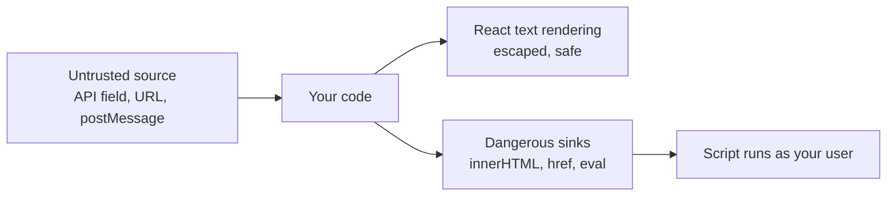

What React does:

```tsx
const memo = '';
<p>{memo}</p>; // safe: renders the literal text, not an image
```

What React does not do for you:

```tsx
<div dangerouslySetInnerHTML={{ __html: memo }} />;      // runs the payload
<a href={user.website}>Website</a>;                      // "javascript:..." is dangerous
divRef.current!.innerHTML = memo;                          // bypasses React entirely
<iframe srcDoc={memo} />;                                  // HTML document from data
```

For `javascript:` URLs: React 16.9+ logs a warning, and React 19 blocks them by replacing the URL with one that throws. Do not rely on this; validate URLs yourself, especially if any code still runs on React 18.

> **Why:** XSS is the worst frontend bug because it defeats almost every other defense. Script running in your origin can read any token in JavaScript-accessible storage, call your APIs with the user's cookies, and change what the user sees on a payment confirmation.

**Trade-offs:** Escaping by default costs nothing. The cost comes when product wants rich content (markdown notes, HTML statements from a partner), which needs sanitizing and a review process.

**What interviewers listen for:**
- Clear source-to-sink thinking.
- Knowing React's protection covers text interpolation only.
- Mentioning internal tools and admin panels as stored-XSS targets.
- Red flag: "React apps are immune to XSS."

#### Q: [Senior] Support agents need to see customer messages with formatting, and users can add a "website" link to their business profile. How do you render these safely?

**Short answer:** For HTML content I sanitize with a well-maintained allowlist sanitizer like DOMPurify right before rendering, with a strict list of tags and attributes, and ideally render it in a component that is the only place allowed to use `dangerouslySetInnerHTML`. For links I parse the URL and only allow `https:` (and maybe `mailto:`), and open external links with `rel="noopener noreferrer"`.

**Clarify first:**
- Do we need HTML at all, or would Markdown rendered to React elements (no raw HTML) be enough?
- Where is it sanitized today: on input, on output, or nowhere?
- Do images need to load? External images can track agents (IP, time read).

**Diagnose:** Find every `dangerouslySetInnerHTML` and trace each `__html` value back to its source. Check stored data for existing payloads (`<script`, `onerror=`, `javascript:`) because sanitizing new input does not clean old records.

**Solution:**

One safe component, used everywhere:

```tsx
// shared/ui/SafeHtml.tsx - the ONLY allowed use of dangerouslySetInnerHTML (lint enforces it)
import DOMPurify from "dompurify";
import { useMemo } from "react";

DOMPurify.addHook("afterSanitizeAttributes", (node) => {
  if (node.tagName === "A") {
    node.setAttribute("target", "_blank");
    node.setAttribute("rel", "noopener noreferrer");
  }
});

const CONFIG = {
  ALLOWED_TAGS: ["b", "i", "em", "strong", "p", "br", "ul", "ol", "li", "a", "code", "pre", "blockquote"],
  ALLOWED_ATTR: ["href"],
  ALLOWED_URI_REGEXP: /^(?:https:|mailto:)/i,
};

export function SafeHtml({ html }: { html: string }) {
  const clean = useMemo(() => DOMPurify.sanitize(html, CONFIG), [html]);
  return <div className="rich-text" dangerouslySetInnerHTML={{ __html: clean }} />;
}
```

```js
// eslint: block the escape hatch everywhere except SafeHtml
// "react/no-danger": "error"  plus an override that turns it off for shared/ui/SafeHtml.tsx
```

Safe URL helper:

```ts
export function safeExternalUrl(input: string | null | undefined): string | undefined {
  if (!input) return undefined;
  try {
    const url = new URL(input);
    return url.protocol === "https:" ? url.toString() : undefined;
  } catch {
    return undefined; // not an absolute URL
  }
}

// usage
const href = safeExternalUrl(profile.website);
{href ? (
  <a href={href} target="_blank" rel="noopener noreferrer">{profile.website}</a>
) : (
  <span>{profile.website}</span>
)}
```

`new URL()` normalizes tricks like leading spaces, mixed case `JaVaScRiPt:` and tab characters inside the scheme, so checking `protocol` after parsing is more reliable than a regex on the raw string.

Defense in depth:
- Sanitize on output (in the browser, where the context is known). Sanitizing only on input breaks when the same data is later rendered in a different context.
- Add a CSP so that even if something slips through, inline scripts cannot run (next question).
- Consider Trusted Types (`require-trusted-types-for 'script'`), which forces all `innerHTML` assignments through a policy. Browser support was Chromium-first for a long time; check current support before relying on it.

> **Gotcha:** Sanitize, then do not modify. If you sanitize HTML and then pass it through another library that re-parses or string-replaces it (for example to highlight search terms), you can re-introduce a payload. Sanitize as the last step before rendering.

**Trade-offs:**
- Markdown to React elements (no raw HTML) is the safest rich-text option. HTML with sanitizing is more flexible but needs an up-to-date sanitizer.
- A strict allowlist breaks some legitimate formatting. That is the right failure direction.
- DOMPurify adds roughly 20 KB minified to the bundle. Lazy-load it with the rich-text view.

**What interviewers listen for:**
- Allowlist sanitizing with a maintained library, never a homemade regex.
- One chokepoint component plus a lint rule.
- URL scheme validation with `new URL`, and `rel="noopener noreferrer"`.
- Red flag: "We strip `<script>` tags." Event handler attributes and `javascript:` URLs still work.

#### Q: [Senior] Security asks you to add a Content Security Policy to an existing React app that loads Google Tag Manager, Datadog RUM and inline styles from a chart library. How do you roll it out without breaking production?

**Short answer:** I would start with `Content-Security-Policy-Report-Only` so the browser reports violations without blocking anything, collect and fix reports for a few weeks, then enforce. The target is a nonce- or hash-based policy with `'strict-dynamic'` for scripts, plus `object-src 'none'`, `base-uri 'none'` and `frame-ancestors`. Styles are usually loosened (`'unsafe-inline'` for style-src) because that risk is much lower than inline script.

**Clarify first:**
- How is `index.html` served: a static CDN (same HTML for everyone) or a server/edge function that can inject a per-request nonce?
- Which third parties load scripts, and do they inject more scripts (tag managers do)?
- Is there a reporting endpoint, or will we use a vendor (many RUM tools accept CSP reports)?

**Diagnose:**
- Open DevTools Console with a test policy. Every violation is logged with the directive and blocked URL.
- List inline scripts in `index.html` and any `eval`-like usage (some older libraries use `new Function`).
- Collect reports from real users in report-only mode, because extensions and rare flows show up only at scale.

**Solution:**

Phase 1, report-only, broad but informative:

```http
Content-Security-Policy-Report-Only:
  default-src 'self';
  script-src 'self' 'nonce-{RANDOM}' 'strict-dynamic';
  style-src 'self' 'unsafe-inline';
  img-src 'self' data: https:;
  connect-src 'self' https://api.example.com https://*.datadoghq.com;
  font-src 'self';
  object-src 'none';
  base-uri 'none';
  frame-ancestors 'none';
  report-to csp-endpoint
Reporting-Endpoints: csp-endpoint="https://example.com/csp-reports"
```

(Headers are one line in reality; split here for reading.) `report-uri` is the older directive and still more widely supported; sending both `report-uri` and `report-to` is common during the transition.

Per-request nonce at the edge or server:

```ts
// Express example: generate a nonce per response and inject it into index.html
import crypto from "node:crypto";

app.get("*", (req, res) => {
  const nonce = crypto.randomBytes(16).toString("base64");
  const html = indexHtmlTemplate.replaceAll("__CSP_NONCE__", nonce);
  res.setHeader(
    "Content-Security-Policy",
    `script-src 'nonce-${nonce}' 'strict-dynamic'; object-src 'none'; base-uri 'none'; frame-ancestors 'none'`,
  );
  res.setHeader("Cache-Control", "no-store"); // HTML with a nonce must not be cached and reused
  res.send(html);
});
```

```html
<!-- index.html template -->
<script nonce="__CSP_NONCE__" type="module" src="/assets/index-abc123.js"></script>
```

`'strict-dynamic'` means scripts loaded by a trusted (nonced) script are also trusted. That is what makes tag managers and lazy-loaded chunks work without listing every domain. Recent Vite versions also have an `html.cspNonce` option that adds a nonce placeholder to the tags it generates; check your version's docs.

If the HTML must be fully static (pure CDN), use hashes of inline scripts (`'sha256-...'`) instead of nonces, and keep all other scripts as external files from `'self'`.

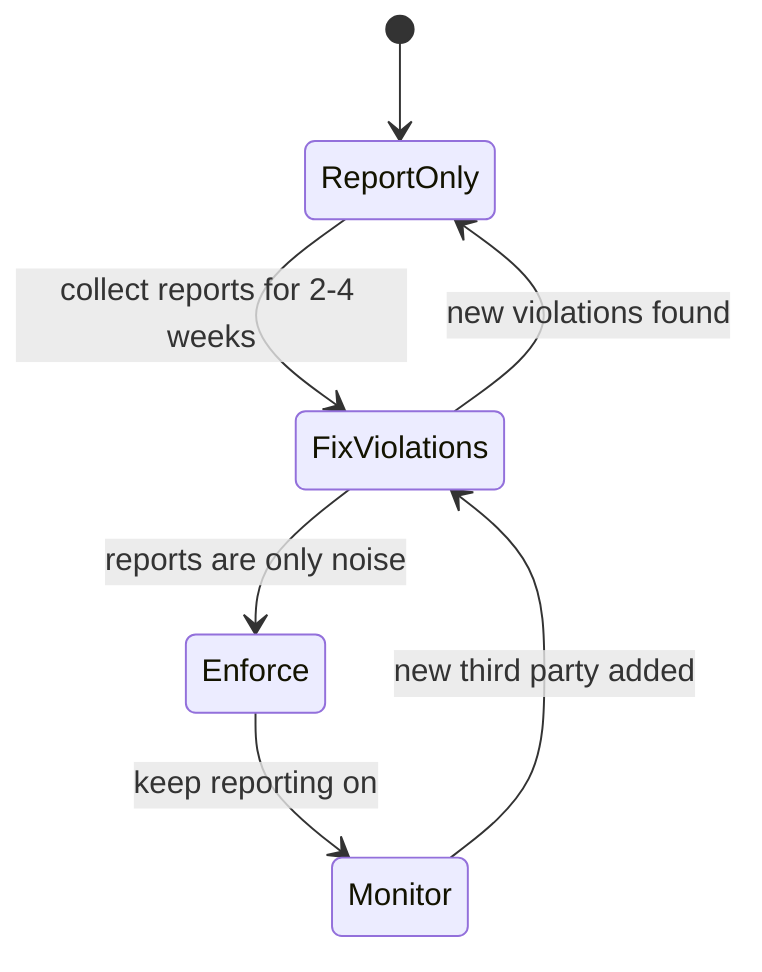

Handling noise: browser extensions inject scripts and cause many reports. Filter reports whose `source-file` or `blocked-uri` start with `chrome-extension://`, `moz-extension://` or `safari-web-extension://`.

> **Gotcha:** A tag manager under `'strict-dynamic'` can load anything marketing configures, which partly defeats CSP for scripts. Restrict who can publish tags, or load the tag manager only on pages without sensitive data.

**Trade-offs:**
- Nonces require dynamic HTML and `no-store` for it. Hashes work with static hosting but break whenever inline script content changes.
- Allowlisting domains (`script-src https://cdn.vendor.com`) is easy but weak: research has shown allowlists are often bypassable through JSONP endpoints or hosted libraries on those domains.
- `style-src 'unsafe-inline'` is a common, pragmatic compromise. CSS injection can still leak some data, so tighten it later if the threat model needs it.

**What interviewers listen for:**
- Report-only first, measured rollout, monitoring after enforcement.
- Nonce + `strict-dynamic` over long domain allowlists.
- `object-src`, `base-uri`, `frame-ancestors`, not only `script-src`.
- Red flag: `script-src 'self' 'unsafe-inline' 'unsafe-eval' *` and calling it done.

#### Q: [Staff] Marketing wants to add five third-party scripts (analytics, chat widget, A/B testing, ad pixels) to the logged-in banking dashboard. What do you say?

**Short answer:** Every third-party script runs with the same power as our own code: it can read the DOM, including balances and account numbers, intercept form input, and call our APIs. I would push for no third-party scripts on authenticated pages unless there is a clear need, and for those that stay: vendor review, a data processing agreement, loading only on specific pages, CSP restrictions, Subresource Integrity where the file is versioned, or isolation in a sandboxed iframe.

**Clarify first:**
- What business question does each script answer? Can our own RUM or server-side analytics answer it?
- Which pages: marketing pages, login, or authenticated pages with financial data?
- What do our privacy policy and regulators (GDPR, PCI DSS if card data is present) require for consent and data sharing?

**Diagnose:**
- Inventory all third-party requests: DevTools Network tab filtered by domain, or a crawler. Tag managers often load scripts nobody on the dev team knows about.
- Check what each script reads: watch for scripts that attach listeners to inputs.
- Measure performance impact: Lighthouse "Reduce the impact of third-party code" and Chrome Performance panel main-thread time per domain.

**Solution:**

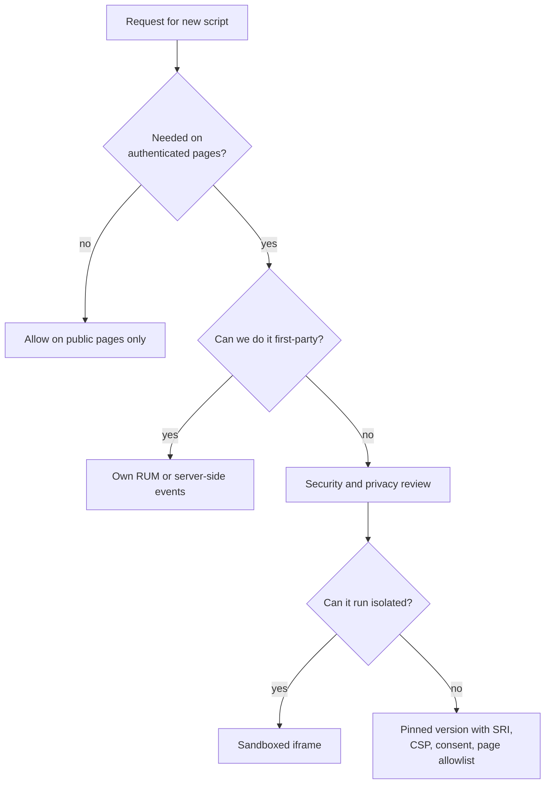

Options from simplest to strongest:

1. **Don't load it on sensitive pages.** Route-based loading:

```tsx
const ALLOWED_PATHS = ["/", "/pricing", "/help"];

export function ThirdPartyLoader() {
  const { pathname } = useLocation();
  const consent = useConsent();
  useEffect(() => {
    if (!consent.analytics || !ALLOWED_PATHS.includes(pathname)) return;
    loadScriptOnce("https://cdn.analytics-vendor.example/v3/sdk.js");
  }, [pathname, consent.analytics]);
  return null;
}
```

Note: once loaded, a script stays in memory after navigating to a sensitive route in an SPA. True isolation requires a full page load or not loading it at all in the app.

2. **Subresource Integrity** for versioned files, so a compromised CDN cannot change them:

```html
<script
  src="https://cdn.vendor.example/widget-4.2.1.min.js"
  integrity="sha384-BASE64HASH"
  crossorigin="anonymous"></script>
```

SRI does not work for "always latest" URLs, which is why many vendors do not support it. That itself is a risk signal.

3. **Sandboxed iframe** on a separate origin for widgets like chat: the widget cannot read the parent DOM, and you pass only the data it needs through `postMessage`, validating `event.origin` on both sides.

```tsx
<iframe
  src="https://chat-widget.example-sandbox.com/embed"
  sandbox="allow-scripts allow-forms allow-same-origin"
  title="Support chat"
/>
```

`allow-same-origin` lets the iframe keep its own origin's storage. Because it is a different origin from your app, it still cannot touch your DOM. Never combine `allow-scripts` and `allow-same-origin` for a same-origin iframe; that lets it remove its own sandbox.

4. **Mask sensitive DOM** for scripts that record sessions (covered in section 4).

> **Finance tip:** In 2018 attackers modified a third-party script on a major airline's payment page and skimmed card data for weeks. PCI DSS v4.0 now requires an inventory and integrity monitoring of scripts on payment pages (requirements 6.4.3 and 11.6.1). Mentioning this shows you know the risk is real and regulated.

**Trade-offs:**
- Saying no costs marketing insight. Offering a first-party alternative (server-side events, our own RUM) keeps the relationship good.
- Iframes add UX friction (sizing, focus, styling).
- SRI makes vendor updates manual, which is safer but slower.

**What interviewers listen for:**
- "Third-party script equals full trust" stated clearly.
- Page-level scoping, SRI, CSP, iframe isolation, consent.
- Tying it to real incidents and compliance rules.
- Red flag: "Just add it to Google Tag Manager."

## 2. Authentication, Tokens & Sessions

#### Q: [Senior] Your SPA uses Okta. Tokens are in localStorage by default. A security review flags it. Where should tokens live, and what is the BFF pattern?

**Short answer:** Anything in JavaScript-accessible storage (localStorage, sessionStorage, memory) can be stolen or used by XSS. Memory is better than localStorage because it disappears on reload and is not readable later, but XSS can still use it while the page is open. The strongest option for a high-risk app is a Backend-for-Frontend: the server does the OAuth flow, keeps tokens server-side, and gives the browser only an `HttpOnly`, `Secure`, `SameSite` session cookie.

**Clarify first:**
- Threat model and compliance: is this a banking app with strict review, or an internal tool?
- Do we control a backend that can sit on the same site as the SPA?
- Do we call multiple APIs on different domains with the access token?
- What token lifetimes and is refresh token rotation enabled in Okta?

**Diagnose:** Check where tokens are now (DevTools Application tab, look for `okta-token-storage`). Check token lifetimes and whether refresh tokens are present in the browser. Check whether you have any XSS sinks (section 1), because that is what makes storage choice matter.

**Solution:**

| Option | XSS can steal token? | XSS can use session? | Survives reload | CSRF risk | Effort |
|---|---|---|---|---|---|
| localStorage | Yes, persists | Yes | Yes | No | Low (Okta default) |
| sessionStorage | Yes, per tab | Yes | Per tab | No | Low |
| In memory | Harder, only while open | Yes | No, re-auth silently | No | Medium |
| HttpOnly cookie via BFF | No | Yes, while page open | Yes | Yes, needs SameSite and CSRF defense | High |

Key point: no storage choice stops XSS from *using* the session while the attacker's script runs. What `HttpOnly` cookies stop is *exfiltrating* long-lived tokens for use elsewhere, later.

Okta's JS SDK lets you choose token storage:

```ts
import { OktaAuth } from "@okta/okta-auth-js";

export const oktaAuth = new OktaAuth({
  issuer: "https://example.okta.com/oauth2/default",
  clientId: import.meta.env.VITE_OKTA_CLIENT_ID,
  redirectUri: `${window.location.origin}/login/callback`,
  pkce: true,
  tokenManager: {
    storage: "memory",   // instead of the default localStorage
    autoRenew: true,
  },
});
```

With memory storage, a reload loses tokens, so the app must re-obtain them silently (via the Okta session cookie or a refresh token). Test this flow carefully in browsers that block third-party cookies, because hidden-iframe silent renew depends on them.

BFF pattern:

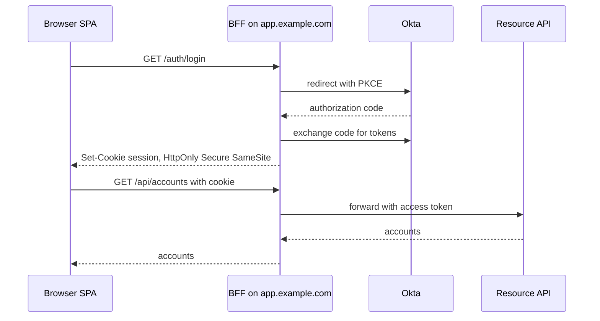

```ts
// BFF cookie settings (Node/Express)
res.cookie("__Host-session", sessionId, {
  httpOnly: true,    // JS cannot read it
  secure: true,      // HTTPS only
  sameSite: "lax",   // or "strict" for very sensitive apps
  path: "/",         // required by the __Host- prefix
  maxAge: 30 * 60 * 1000,
});
```

The `__Host-` prefix makes the browser reject the cookie unless it is `Secure`, has `Path=/` and no `Domain`, which prevents subdomains from overwriting it.

> **Gotcha:** Moving to cookies brings CSRF back into scope. `SameSite=Lax` blocks most cross-site POSTs, but you still want a CSRF token or a custom header check on state-changing requests (next question).

**Trade-offs:**
- BFF: strongest token protection, works with strict third-party cookie blocking, but you now run a backend with sessions, scaling and its own attack surface.
- Memory: cheap improvement, but more complexity in silent renew and multi-tab behavior.
- Short access token lifetimes (5 to 15 minutes) plus refresh token rotation limit damage from theft in any model.

**What interviewers listen for:**
- "Steal vs use" distinction: XSS defense comes first, storage is damage limitation.
- Knowing Okta's `tokenManager.storage` options and the reload consequence.
- BFF with `HttpOnly`, `Secure`, `SameSite`, `__Host-` and CSRF follow-up.
- Red flag: "Cookies are always secure" or "localStorage is fine because we use HTTPS."

#### Q: [Mid] What is CSRF, and does `SameSite` solve it?

**Short answer:** CSRF (cross-site request forgery) is when another site makes the user's browser send a request to your site, and the browser attaches your cookies automatically, so the request looks authenticated. `SameSite=Lax` or `Strict` cookies stop most of it because the browser does not send them on cross-site subrequests, but you should still add a second defense for state-changing requests. Bearer tokens in an `Authorization` header are not vulnerable to classic CSRF, because the browser does not attach them automatically.

**Clarify first:**
- Is auth cookie-based or header-based?
- Are there sibling subdomains we do not fully trust? "Same-site" includes all subdomains of the registrable domain.
- Are there any state-changing GET endpoints?

**Diagnose:** Check cookie attributes in DevTools Application, Cookies. Check API endpoints that change state with GET. Try a cross-site form post from a test page to a staging endpoint.

**Solution:**

```html
<!-- attacker page on evil.example -->
<form action="https://bank.example.com/api/transfers" method="POST">
  <input name="toAccount" value="attacker" />
  <input name="amountCents" value="500000" />
</form>
<script>document.forms[0].submit()</script>
```

With `SameSite=Lax`, the cookie is not sent on this cross-site POST. With `SameSite=None`, it is, and the transfer happens if the server accepts form-encoded data.

Defenses in layers:
1. `SameSite=Lax` or `Strict` on session cookies. Modern browsers treat cookies without a `SameSite` attribute as `Lax` by default, but set it explicitly.
2. Never change state on GET (Lax still sends cookies on top-level GET navigations).
3. Require a custom header or CSRF token on POST/PUT/PATCH/DELETE. A cross-site form cannot set custom headers, and a cross-origin `fetch` with custom headers triggers a CORS preflight that your server rejects.

```ts
// client: one HTTP client sends the token on every mutation
const csrf = document.querySelector<HTMLMetaElement>('meta[name="csrf-token"]')?.content;

await fetch("/api/transfers", {
  method: "POST",
  credentials: "include",
  headers: { "Content-Type": "application/json", "X-CSRF-Token": csrf ?? "" },
  body: JSON.stringify({ toAccountId, amountCents, idempotencyKey }),
});
```

```ts
// server (Express): reject mutations without a valid token, and check Origin
app.use((req, res, next) => {
  if (["GET", "HEAD", "OPTIONS"].includes(req.method)) return next();
  const origin = req.get("Origin");
  if (origin && origin !== "https://bank.example.com") return res.status(403).end();
  if (req.get("X-CSRF-Token") !== req.session.csrfToken) return res.status(403).end();
  next();
});
```

4. Accept only `application/json` on API endpoints, so simple form posts fail.

**Trade-offs:** `SameSite=Strict` is strongest but means the user appears logged out when they arrive from an email link (the first request is cross-site). Many apps use `Lax` for the session plus CSRF tokens.

**What interviewers listen for:**
- Cookies are attached automatically, headers are not.
- "Same-site" vs "same-origin" difference.
- SameSite as one layer, plus tokens or Origin checks.
- Red flag: "We use CORS, so CSRF is impossible." CORS controls reading responses, not whether a simple request is sent.

#### Q: [Senior] After login, the app redirects users to `?returnTo=...`. A pentest reports an open redirect. Why does it matter and how do you fix it?

**Short answer:** An open redirect lets an attacker send a real link to your login page that ends on their phishing site, which looks trustworthy because it starts on your domain. In OAuth flows it can also leak codes or tokens. The fix is to accept only same-origin relative paths, validated by parsing with `new URL` and checking the origin, or better, to store the return path in session state instead of the URL.

**Clarify first:**
- Where is `returnTo` read: the SPA, the BFF, or both?
- Are there legitimate cross-domain redirects (a partner portal)? Those need an explicit allowlist.

**Diagnose:** Test payloads: `https://evil.com`, `//evil.com`, `/\evil.com`, `https:evil.com`, `javascript:alert(1)`, `%2F%2Fevil.com`. Check both client-side code (`window.location.href = returnTo`, `navigate(returnTo)`) and server redirects.

**Solution:**

```ts
export function safeReturnTo(raw: string | null, fallback = "/dashboard"): string {
  if (!raw) return fallback;
  try {
    const url = new URL(raw, window.location.origin);
    if (url.origin !== window.location.origin) return fallback;
    if (!url.pathname.startsWith("/")) return fallback;
    return url.pathname + url.search + url.hash;
  } catch {
    return fallback;
  }
}
```

Why `new URL` with a base works: `//evil.com` and `/\evil.com` both resolve to `https://evil.com` (browsers treat backslash like slash in http URLs), so the origin check rejects them. `javascript:alert(1)` parses with origin `"null"`, which is also rejected. A `startsWith("/")` check alone would wrongly accept `//evil.com`.

With Okta React, avoid putting the path in the URL at all. The SDK saves the original URI before redirecting and gives it back in `restoreOriginalUri`:

```tsx
<Security
  oktaAuth={oktaAuth}
  restoreOriginalUri={async (_oktaAuth, originalUri) => {
    navigate(safeReturnTo(originalUri ?? "/"), { replace: true });
  }}
>
```

Validate even here, because `originalUri` can come from a link the attacker crafted.

**Trade-offs:** Strict same-origin rules may break legitimate flows to other subdomains. Add an explicit allowlist of exact origins for those instead of loosening the check to "ends with example.com" (which `evil-example.com` also matches if you are careless).

**What interviewers listen for:**
- Phishing and OAuth token leakage as the impact.
- Parsing, not string checks, and the `//` and backslash tricks.
- Red flag: `if (returnTo.includes("example.com"))`.

#### Q: [Senior] Compliance requires that users are logged out after 15 minutes of inactivity, with a 2-minute warning, across all tabs. How do you build it?

**Short answer:** I track user activity in the browser with an idle timer that syncs across tabs, show a warning modal 2 minutes before timeout, and on timeout clear local state and end the session on the server and identity provider. The server must also enforce an idle timeout independently, because the client timer can be bypassed or killed with the tab.

**Clarify first:**
- What counts as activity: mouse, keyboard, touch, or also background API polling? Polling should not keep the session alive.
- Is there also an absolute session limit (for example 8 hours, regardless of activity)?
- What happens to unsaved work, like a half-filled payment form?
- Which sessions must end: app session, Okta session, BFF session?

**Diagnose:** Test with several tabs open, a laptop that sleeps, and a tab in the background (browsers throttle timers in background tabs). Check that the server rejects requests after its own idle limit.

**Solution:**

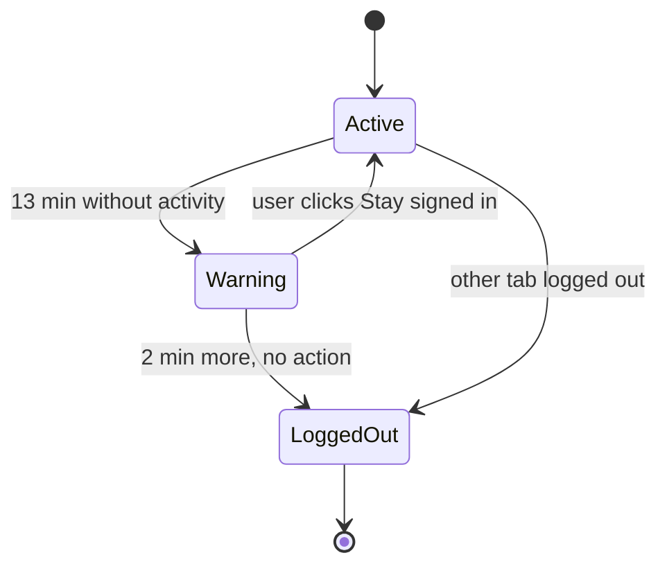

Using `react-idle-timer` (v5 API):

```tsx
import { useIdleTimer } from "react-idle-timer";

const IDLE_MS = 15 * 60_000;
const WARN_MS = 2 * 60_000;

export function SessionTimeout() {
  const [warning, setWarning] = useState(false);
  const [remaining, setRemaining] = useState(WARN_MS);

  const { activate, getRemainingTime } = useIdleTimer({
    timeout: IDLE_MS,
    promptBeforeIdle: WARN_MS,
    crossTab: true,          // activity in any tab resets all tabs
    syncTimers: 200,
    onPrompt: () => setWarning(true),
    onIdle: () => logout("idle"),
    onActive: () => setWarning(false),
  });

  useEffect(() => {
    if (!warning) return;
    const id = setInterval(() => setRemaining(getRemainingTime()), 1000);
    return () => clearInterval(id);
  }, [warning, getRemainingTime]);

  if (!warning) return null;
  return (
    <Dialog role="alertdialog" aria-labelledby="timeout-title">
      <h2 id="timeout-title">You will be signed out soon</h2>
      <p>For your security, you will be signed out in {Math.ceil(remaining / 1000)} seconds.</p>
      <button onClick={async () => { await keepAliveOnServer(); activate(); setWarning(false); }}>
        Stay signed in
      </button>
      <button onClick={() => logout("user")}>Sign out now</button>
    </Dialog>
  );
}
```

Logout must clean up everywhere:

```ts
const channel = new BroadcastChannel("auth");

export async function logout(reason: "idle" | "user" | "expired") {
  channel.postMessage({ type: "logout", reason });  // other tabs log out too
  queryClient.clear();                              // remove cached financial data from memory
  sessionStorage.clear();
  await oktaAuth.signOut({ postLogoutRedirectUri: `${location.origin}/signed-out?reason=${reason}` });
}

channel.onmessage = (e) => {
  if (e.data?.type === "logout") window.location.replace("/signed-out");
};
```

Server side: every API request checks last activity time for the session and returns 401 when it is over the limit. The client's "Stay signed in" calls a keep-alive endpoint so the server's clock resets too.

> **Gotcha:** Background polling (balance refresh every 30 seconds) can keep the server session alive forever if the server treats every request as activity. Mark polling requests (a header like `X-Background: 1`) so the server does not extend the session for them.

**Trade-offs:**
- Strict timeouts annoy users in the middle of long tasks. Saving drafts (non-sensitive fields only) before logout helps.
- Timers in sleeping laptops and throttled background tabs are unreliable. Compare against timestamps (`Date.now()` vs last activity) rather than counting intervals.

**What interviewers listen for:**
- Server-side enforcement as the real control.
- Cross-tab sync, clearing caches, ending IdP sessions.
- Accessibility of the warning (focus, `alertdialog`, enough time to react).
- Red flag: a `setTimeout(logout, 900000)` that resets on mousemove in one tab.

#### Q: [Mid] A developer hides the "Approve payment" button for non-approvers and considers the feature secure. What is wrong?

**Short answer:** Hiding a button is a UX decision, not a security control. Anyone can call the API directly with DevTools, curl, or by editing the JavaScript. The server must check the user's permission for that specific action and resource on every request. The UI check only makes the experience match what the server allows.

**Clarify first:** Does the API check permissions per resource, for example "can approve payments for this business account", or only "is logged in"?

**Diagnose:** As a low-privilege test user, copy the approve request from the Network tab as cURL and run it. If it succeeds, there is a broken access control bug, which is number one in the OWASP Top 10 (2021).

**Solution:**

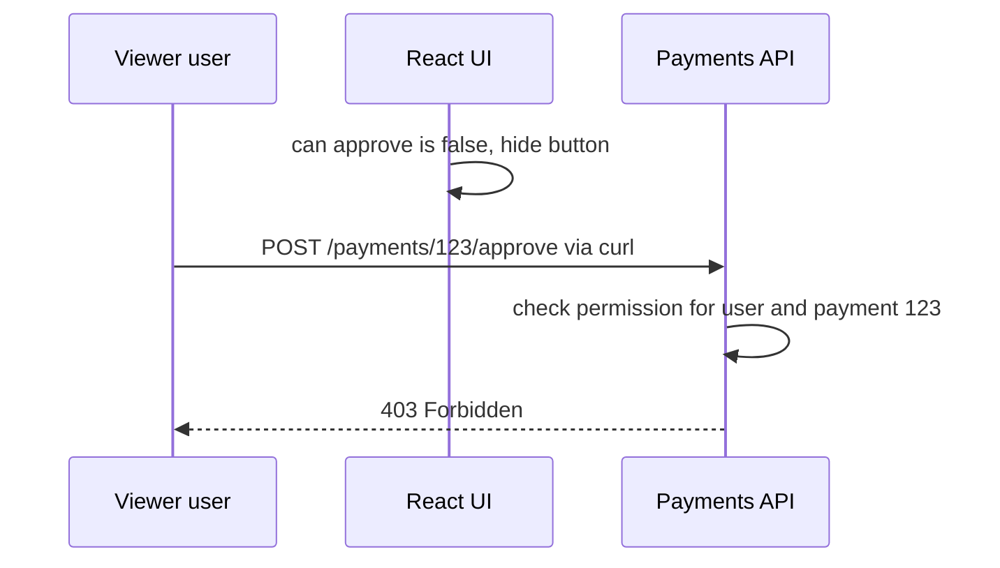

```ts
// server: check on every request, per resource
app.post("/payments/:id/approve", requireAuth, async (req, res) => {
  const payment = await payments.findById(req.params.id);
  if (!payment) return res.status(404).end();
  const allowed = await authz.can(req.user, "payments:approve", payment.accountId);
  if (!allowed) return res.status(403).json({ error: "forbidden" });
  if (payment.createdBy === req.user.id) return res.status(403).json({ error: "four_eyes_required" });
  await payments.approve(payment.id, req.user.id);
  res.status(204).end();
});
```

```tsx
// client: drive the UI from server-provided allowed actions
{payment.allowedActions.includes("approve") && (
  <Button onClick={() => approve.mutate(payment.id)}>Approve payment</Button>
)}
```

Also: do not send data the user must not see and then hide it with CSS or conditional rendering. If the API returns full account numbers to a viewer role, they are in the Network tab.

**Trade-offs:** Returning `allowedActions` with resources keeps UI and server in sync but costs some payload size and backend work.

**What interviewers listen for:**
- "Client checks are UX, server checks are security."
- Per-resource checks (IDOR) and four-eyes rules in finance.
- Not over-fetching sensitive data.
- Red flag: "We obfuscate the bundle, so it's fine."

## 3. Browser-Level Defenses

#### Q: [Mid] What is clickjacking, and how do you prevent it?

**Short answer:** Clickjacking is when an attacker loads your page in an invisible iframe on their site and tricks the user into clicking real buttons, like "Confirm transfer", while they think they are clicking something else. You prevent it by telling the browser your page may not be framed: `Content-Security-Policy: frame-ancestors 'none'` (or a list of allowed parents), plus `X-Frame-Options: DENY` for older browsers.

**Clarify first:** Does any legitimate parent need to embed the app, such as a partner portal or an internal tool? Then list those exact origins.

**Diagnose:** Create a local HTML file with `<iframe src="https://app.example.com">`. If the app loads inside, it is frameable. Check response headers in DevTools Network for `frame-ancestors` or `X-Frame-Options`.

**Solution:**

```http
Content-Security-Policy: frame-ancestors 'none'
X-Frame-Options: DENY
```

Allowing one partner:

```http
Content-Security-Policy: frame-ancestors https://portal.partner-bank.example
```

`X-Frame-Options` supports only `DENY` and `SAMEORIGIN` reliably (`ALLOW-FROM` is obsolete), which is why `frame-ancestors` is the modern control. If both are present, modern browsers use `frame-ancestors`.

> **Gotcha:** `frame-ancestors` does not work in a `<meta>` CSP tag. It must be an HTTP response header. Teams on static hosting sometimes add CSP via meta and think they are protected.

JavaScript frame-busting (`if (top !== self) top.location = self.location`) is outdated and can be defeated with the iframe `sandbox` attribute. Use headers.

**Trade-offs:** None for most apps. Only embedding scenarios need care.

**What interviewers listen for:**
- Header, not meta or JavaScript.
- Both headers for compatibility, `frame-ancestors` as the main one.
- Red flag: frame-busting scripts as the main defense.

#### Q: [Senior] You are asked for a security headers checklist for the app and its API. What do you include and why?

**Short answer:** For the HTML document: HSTS, CSP, `X-Content-Type-Options: nosniff`, a strict `Referrer-Policy`, `Permissions-Policy`, framing protection and `Cache-Control` for sensitive responses. For cross-origin isolation, COOP and optionally CORP/COEP. For the API: strict CORS, `nosniff`, `no-store` on sensitive data, and correct `Content-Type`. I would also remove headers that leak server versions and ones that are deprecated.

**Clarify first:**
- Who sets headers: CDN, load balancer, server, or a mix? Duplicate or conflicting headers are common.
- Are any subdomains still on HTTP? That affects HSTS `includeSubDomains` and preload.

**Diagnose:** Use `curl -sI https://app.example.com` and the DevTools Network tab. Online scanners (for example Mozilla's HTTP Observatory) give a quick report. Check both the HTML response and API responses, and error pages (404/500), which often skip middleware.

**Solution:**

| Header | Value | Why |
|---|---|---|
| `Strict-Transport-Security` | `max-age=63072000; includeSubDomains; preload` | Forces HTTPS, prevents SSL stripping. Start with a short max-age. |
| `Content-Security-Policy` | nonce-based, see section 1 | Limits XSS impact, framing, base tag injection |
| `X-Content-Type-Options` | `nosniff` | Stops browsers guessing a script from a text or upload |
| `Referrer-Policy` | `strict-origin-when-cross-origin` or `no-referrer` | Prevents URLs with ids leaking to third parties |
| `Permissions-Policy` | `camera=(), microphone=(), geolocation=(), payment=()` | Disables powerful features you do not use, also for embedded iframes |
| `X-Frame-Options` | `DENY` | Legacy clickjacking protection |
| `Cross-Origin-Opener-Policy` | `same-origin` | Isolates your window from cross-origin popups (window.opener attacks, some side channels) |
| `Cross-Origin-Resource-Policy` | `same-origin` (API, private assets) | Stops other sites embedding your resources |
| `Cache-Control` | `no-store` on HTML with nonces and on sensitive API responses | No sensitive data in disk caches |
| `X-XSS-Protection` | remove it, or `0` | The old XSS auditor is gone and caused its own bugs |
| `Server`, `X-Powered-By` | remove | Do not advertise versions |

API CORS done right:

```ts
const ALLOWED = new Set(["https://app.example.com", "https://admin.example.com"]);

app.use((req, res, next) => {
  const origin = req.get("Origin");
  if (origin && ALLOWED.has(origin)) {
    res.setHeader("Access-Control-Allow-Origin", origin);
    res.setHeader("Access-Control-Allow-Credentials", "true");
    res.setHeader("Vary", "Origin");
  }
  next();
});
```

Never reflect any `Origin` value with credentials allowed. That lets any website read your API responses as the logged-in user.

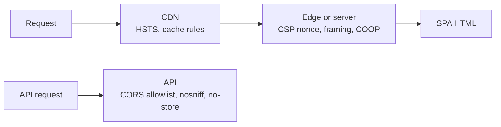

> **Gotcha:** HSTS `preload` is hard to undo. Submitting your domain to the preload list affects all subdomains for months. Make sure every subdomain works on HTTPS first.

**Trade-offs:**
- COEP (`require-corp`) enables powerful features like `SharedArrayBuffer` but breaks third-party embeds that do not send CORP headers. Only add it if you need it.
- `Referrer-Policy: no-referrer` breaks some analytics and partner integrations. `strict-origin-when-cross-origin` is a good default.

**What interviewers listen for:**
- Knowing why each header exists, not a memorized list.
- Checking error pages and API responses, not only the homepage.
- CORS reflection with credentials as a classic bug.
- Red flag: adding `X-XSS-Protection: 1; mode=block` as an important control.

#### Q: [Senior] After logout on a shared computer, the next person presses Back and sees the previous user's account balances. How do you prevent sensitive data from staying in the browser cache and history?

**Short answer:** There are three places: the HTTP cache (fixed with `Cache-Control: no-store` on sensitive responses), the back/forward cache, which restores the whole page from memory (fixed by listening to `pageshow` and re-checking the session), and the in-memory JS caches like TanStack Query (cleared on logout). Also, never put sensitive data in URLs, because history and logs keep them.

**Clarify first:**
- Is this a shared-device context (branch kiosks, family computers)? It raises the priority.
- Which data is sensitive: balances, account numbers, statements, documents?
- Are PDFs or exports downloaded, which then live in the downloads folder no matter what we do?

**Diagnose:**
- Log in, view balances, log out, press Back. Check what appears.
- DevTools Application, Back/forward cache section lets you test whether a page is eligible for bfcache.
- DevTools Network: check `Cache-Control` on API responses with financial data.
- Check URLs in history for account numbers, emails or tokens.

**Solution:**

1. HTTP caching for API data:

```http
Cache-Control: no-store
```

`no-store` means do not keep the response at all. `no-cache` only means "revalidate before use" and still stores it, which is not what you want here. `private` stops shared caches (CDNs) but allows the browser cache.

2. Back/forward cache: the browser can restore a page with its JS state after you navigate away. Handle it:

```ts
window.addEventListener("pageshow", async (event) => {
  if (!event.persisted) return; // normal load, nothing to do
  const isAuthenticated = await oktaAuth.isAuthenticated();
  if (!isAuthenticated) {
    queryClient.clear();
    window.location.replace("/signed-out");
  }
});
```

Historically, `Cache-Control: no-store` on the HTML made pages ineligible for bfcache, which also protected against this. Browsers have been experimenting with allowing bfcache for `no-store` pages in some conditions, so do not rely on it; the `pageshow` check is the robust fix.

3. In-memory caches on logout:

```ts
async function onLogout() {
  queryClient.clear();          // TanStack Query cache
  store.dispatch(resetAll());   // Redux, if used
  sessionStorage.clear();
  // remove any persisted query cache, e.g. an IndexedDB persister
  await persister?.removeClient();
  window.location.replace("/signed-out"); // full reload drops everything in memory
}
```

4. URLs and history: use opaque ids (`/accounts/acc_8f3k`) instead of account numbers. Never put tokens, emails or SSNs in query strings. Use `replace: true` for navigations after sensitive steps so Back does not land on a "payment confirmed" page that re-submits.

5. Forms: `autocomplete="off"` on fields like one-time codes or answers to security questions. Note that browsers often ignore `autocomplete="off"` for login fields on purpose, for password manager support. For OTPs use `autocomplete="one-time-code"`.

**Trade-offs:**
- `no-store` on everything makes the app slower (no HTTP caching). Apply it to sensitive data endpoints, and keep static assets (hashed JS and CSS) cacheable for a year.
- A full reload on logout costs a second, but it is the simplest way to guarantee nothing stays in memory.

**What interviewers listen for:**
- `no-store` vs `no-cache` distinction.
- bfcache and `pageshow` with `event.persisted`.
- Clearing client caches and avoiding PII in URLs.
- Red flag: "We clear localStorage on logout" as the whole answer.

## 4. Privacy & Sensitive Data

#### Q: [Senior] You discover that Datadog RUM and LogRocket session replays contain full account numbers, emails and balances, and `console.error` logs include request bodies. What do you do?

**Short answer:** First contain it: stop or mask the leak in the next deploy, and ask the vendors to delete or restrict affected data, involving security and privacy teams because this may be a reportable incident. Then fix it structurally: default-deny masking in session replay, scrubbing in a central `beforeSend` hook for RUM and logs, a typed logger that redacts known sensitive fields, and tests that check for PII patterns.

**Clarify first:**
- What exactly leaked, since when, and who has access to the vendor dashboards?
- Which regulations apply (GDPR, CCPA, GLBA, PCI DSS if card numbers)? Card numbers (PAN) in logs is a serious PCI issue.
- Do we have data processing agreements with these vendors, and what retention is configured?

**Diagnose:**
- Search a sample of replays and RUM events for patterns: 16-digit numbers, `@` signs, IBAN formats.
- Find where data enters: input fields recorded by replay, text on screen, network request/response bodies captured by replay, URLs with ids, error messages that include payloads.
- `rg -n "console\.(log|error)\(.*(body|response|data)" src` for logging of whole payloads.

**Solution:**

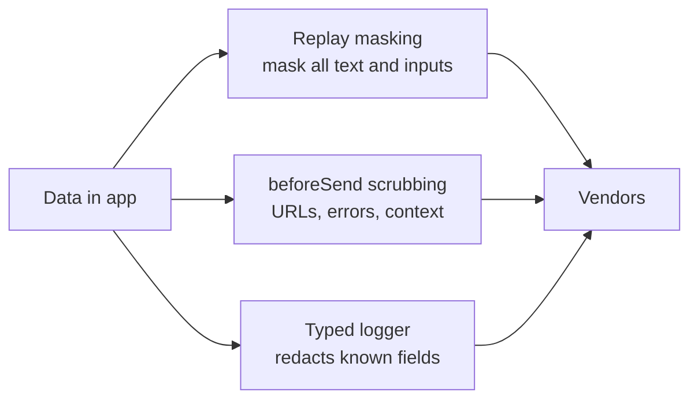

Datadog RUM: use privacy-first defaults and scrub events:

```ts
import { datadogRum } from "@datadog/browser-rum";

datadogRum.init({
  applicationId: import.meta.env.VITE_DD_APP_ID,
  clientToken: import.meta.env.VITE_DD_CLIENT_TOKEN, // a public client token, by design
  site: "datadoghq.com",
  service: "web-banking",
  sessionReplaySampleRate: 20,
  defaultPrivacyLevel: "mask",       // mask all text and inputs in replays by default
  beforeSend: (event) => {
    if (event.view?.url) event.view.url = redactUrl(event.view.url);
    if (event.type === "error" && event.error?.message) {
      event.error.message = redactText(event.error.message);
    }
    return true; // returning false drops the event
  },
});
```

LogRocket: sanitize inputs, text and network bodies:

```ts
import LogRocket from "logrocket";

LogRocket.init("org/app", {
  dom: { inputSanitizer: true, textSanitizer: true },
  network: {
    requestSanitizer: (request) => {
      request.body = undefined;          // never record request bodies
      if (request.headers) request.headers["Authorization"] = undefined;
      return request;
    },
    responseSanitizer: (response) => {
      response.body = undefined;
      return response;
    },
  },
});
```

Unmask only explicitly safe UI (navigation labels) with the vendors' allow attributes, such as `data-dd-privacy="allow"` for Datadog. Mark extra-sensitive areas with `data-dd-privacy="hidden"` so they are not recorded at all.

Central redaction helpers:

```ts
const PATTERNS: [RegExp, string][] = [
  [/\b\d{13,19}\b/g, "[REDACTED_NUMBER]"],                       // card or account numbers
  [/[A-Z0-9._%+-]+@[A-Z0-9.-]+\.[A-Z]{2,}/gi, "[REDACTED_EMAIL]"],
  [/\b[A-Z]{2}\d{2}[A-Z0-9]{11,30}\b/g, "[REDACTED_IBAN]"],
];

export function redactText(s: string): string {
  return PATTERNS.reduce((acc, [re, rep]) => acc.replace(re, rep), s);
}

export function redactUrl(u: string): string {
  const url = new URL(u);
  for (const key of ["email", "accountNumber", "token", "code"]) {
    if (url.searchParams.has(key)) url.searchParams.set(key, "REDACTED");
  }
  return redactText(url.toString());
}
```

A logger that only accepts safe fields:

```ts
type LogContext = { feature: string; action: string; requestId?: string; status?: number };

export const log = {
  error(message: string, ctx: LogContext, error?: unknown) {
    datadogRum.addError(error ?? new Error(message), ctx); // ctx type blocks free-form payloads
  },
};
```

Add a CI test that renders key screens with fake data containing sentinel values (`4111111111111111`, `pii-canary@example.com`), runs the RUM `beforeSend` and logger, and fails if the sentinels appear in output.

> **Finance tip:** Regex redaction is a safety net, not the primary control. A balance like "$12,345.67" does not match a pattern but may still be sensitive. Default-mask in replays and allow only what is safe, rather than trying to find every sensitive thing.

**Trade-offs:**
- Full masking makes replays less useful for debugging. Teams usually accept "see clicks and layout, not content".
- Dropping request bodies loses debugging detail. Log a request id and look up details in server logs with proper access control.

**What interviewers listen for:**
- Incident handling first (contain, notify, delete), then structural fixes.
- Default-deny masking and central scrubbing hooks.
- Typed logging and automated PII tests.
- Red flag: "Tell developers to be careful with console.log."

#### Q: [Mid] A teammate puts `VITE_STRIPE_SECRET_KEY` and `VITE_INTERNAL_API_KEY` in `.env` because "env vars are secret". What do you tell them?

**Short answer:** In a frontend build, every `VITE_*` variable (or `REACT_APP_*` in CRA, `NEXT_PUBLIC_*` in Next.js) is inlined into the JavaScript bundle as plain text. Anyone can read it in DevTools. Only values that are safe to be public belong there; real secrets must live on a server that the frontend calls.

**Clarify first:** Has this already been deployed? If yes, the keys are compromised and must be rotated now, even after the code is fixed, because old bundles may be cached on CDNs and in archives.

**Diagnose:**

```bash
# after a build, search the output for secrets
rg -n "sk_live_|AKIA|BEGIN PRIVATE KEY|secret" dist/
# scan git history too, secrets in old commits are still exposed
npx gitleaks detect --source .
```

**Solution:**

```ts
// What Vite does at build time:
const key = import.meta.env.VITE_STRIPE_SECRET_KEY;
// becomes, in dist/assets/index-abc.js:
const key = "sk_live_51H...";
```

Safe to expose: public identifiers designed for browsers, like a Stripe publishable key (`pk_...`), an Okta client id for a public SPA client, a RUM client token, a Sentry DSN. These are restricted by the vendor (origin checks, limited scopes).

Never expose: API secret keys, database credentials, signing keys, internal service tokens, OAuth client secrets.

Fix pattern: move the secret behind your own backend endpoint:

```ts
// server (Node): the secret stays here
import Stripe from "stripe";
const stripe = new Stripe(process.env.STRIPE_SECRET_KEY!);

app.post("/api/payment-intents", requireAuth, async (req, res) => {
  const { amountCents, currency } = validate(req.body);
  const intent = await stripe.paymentIntents.create(
    { amount: amountCents, currency, customer: req.user.stripeCustomerId },
    { idempotencyKey: req.get("Idempotency-Key") ?? undefined },
  );
  res.json({ clientSecret: intent.client_secret });
});
```

Prevent repeats:
- Secret scanning in CI and pre-commit (gitleaks, GitHub secret scanning with push protection).
- A build check that fails if any env var name matching `SECRET|PRIVATE|PASSWORD` has the public prefix.
- `.env` files with real values in `.gitignore`; commit only `.env.example`.

> **Gotcha:** Vite's `envPrefix` option can be changed. Setting it to `""` exposes every environment variable on the build machine, including CI secrets. Vite refuses an empty prefix for this reason in current versions, but custom `define` configs can cause the same leak.

**Trade-offs:** A backend proxy adds latency and a service to maintain, but there is no safe alternative for a real secret.

**What interviewers listen for:**
- "The bundle is public."
- Rotating already-exposed keys, not just deleting them.
- Distinguishing publishable keys from secrets.
- Red flag: "We'll obfuscate the key" or "we'll base64 encode it".

#### Q: [Senior] Users upload bank statements and ID documents (PDF, JPG, PNG, up to 20 MB). What should the frontend do to make uploads safe, and what must the backend do?

**Short answer:** The frontend improves UX and reduces junk: it restricts accepted types and size, checks magic bytes, uploads directly to storage with a short-lived pre-signed URL, and never renders untrusted files inline in our origin. Real security is server-side: verify type by content, scan for malware, store outside the web root with random names, serve with `Content-Disposition: attachment` and `nosniff` from a separate domain. Client checks can be bypassed, so they are never the control.

**Clarify first:**
- Which file types are truly needed? Allowing SVG or HTML is very risky because they can contain script.
- Do support agents preview files in an internal tool? That tool is where malicious files do the most damage.
- Retention and encryption requirements for ID documents?

**Diagnose:** Try uploading a renamed file (`evil.html` as `statement.pdf`), an SVG with `<script>`, a zero-byte file, and a 2 GB file. Check how the file is served back: which domain, which `Content-Type`, and whether it opens inline.

**Solution:**

Client-side validation with `react-dropzone`:

```tsx
import { useDropzone } from "react-dropzone";

const MAX_BYTES = 20 * 1024 * 1024;

export function StatementUpload({ onFiles }: { onFiles: (files: File[]) => void }) {
  const { getRootProps, getInputProps, fileRejections } = useDropzone({
    accept: {
      "application/pdf": [".pdf"],
      "image/jpeg": [".jpg", ".jpeg"],
      "image/png": [".png"],
    },
    maxSize: MAX_BYTES,
    maxFiles: 5,
    onDropAccepted: async (files) => {
      const checked = await Promise.all(files.map(async (f) => ((await looksLikeAllowedType(f)) ? f : null)));
      onFiles(checked.filter((f): f is File => f !== null));
    },
  });
  return (
    <div {...getRootProps()} className="dropzone">
      <input {...getInputProps()} />
      <p>Drop PDF, JPG or PNG files, up to 20 MB each.</p>
      {fileRejections.length > 0 && <p role="alert">Some files were rejected.</p>}
    </div>
  );
}
```

The browser's `file.type` comes from the extension, so it is easy to fake. Checking the first bytes catches honest mistakes and simple renames:

```ts
async function looksLikeAllowedType(file: File): Promise<boolean> {
  const bytes = new Uint8Array(await file.slice(0, 8).arrayBuffer());
  const startsWith = (sig: number[]) => sig.every((b, i) => bytes[i] === b);
  return (
    startsWith([0x25, 0x50, 0x44, 0x46]) ||       // %PDF
    startsWith([0xff, 0xd8, 0xff]) ||             // JPEG
    startsWith([0x89, 0x50, 0x4e, 0x47, 0x0d, 0x0a, 0x1a, 0x0a]) // PNG
  );
}
```

Upload flow with pre-signed URLs:

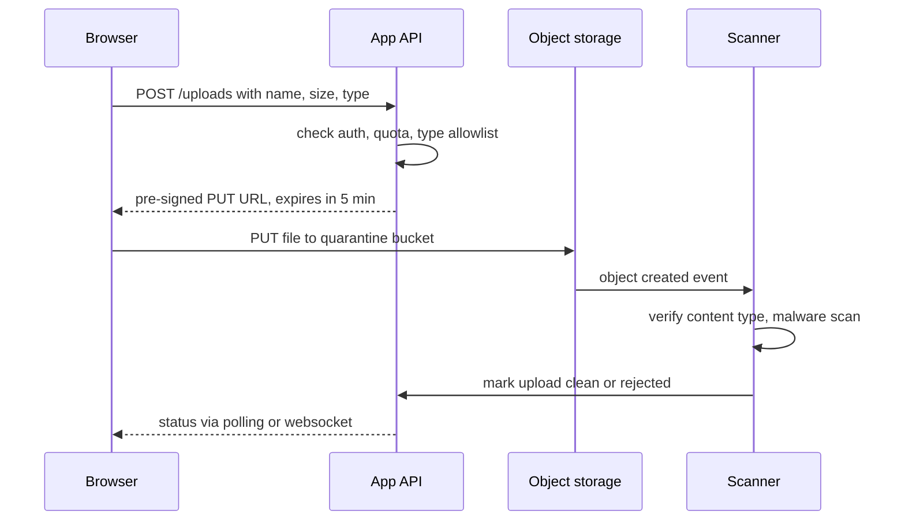

Previewing safely in the app:
- Images: render with `` before upload (revoke the URL after), or from the storage domain after upload. Images in `` cannot run script, even SVG.
- PDFs: render with a PDF library into a canvas (like `react-pdf`, which uses PDF.js) rather than opening the raw file in our origin. Keep PDF.js updated; it had a serious vulnerability in 2024 (CVE-2024-4367) that allowed script execution with untrusted PDFs when `isEvalSupported` was left on in old versions.
- Never serve user files from the app's origin with an inline `Content-Type: text/html` or `image/svg+xml`.

Backend checklist: content-based type check, malware scan before files become available, random object keys (no user-controlled paths), size limits enforced by the pre-signed policy, encryption at rest, `Content-Disposition: attachment`, `X-Content-Type-Options: nosniff`, separate sandbox domain for downloads, and audit logging for ID document access.

**Trade-offs:**
- Pre-signed direct uploads save backend bandwidth but make server-side checks asynchronous, so the UI needs a "processing" state.
- Client magic-byte checks add code for little security value, but they give users fast, clear errors.

**What interviewers listen for:**
- Client checks for UX, server checks for security.
- Quarantine and scanning before use, separate download domain.
- Danger of SVG/HTML and inline rendering, especially in internal tools.
- Red flag: "We check the file extension in the browser, so it's safe."

## 5. Supply Chain & Security Process

#### Q: [Staff] A popular npm package your app depends on was compromised and published a version that steals tokens. How do you protect a frontend build from supply-chain attacks, and what do you do on the day it happens?

**Short answer:** Prevention: commit lockfiles and install with `npm ci` or `pnpm install --frozen-lockfile`, delay adoption of brand-new versions, block install scripts by default, review dependency updates through Renovate or Dependabot PRs with CI, prefer packages with npm provenance, and keep the dependency count low. On the day: find out if the bad version entered any lockfile or build, roll back and rebuild, rotate any secrets the build or users may have exposed, and check logs for abuse.

**Clarify first:**
- Which versions were malicious and during which time window?
- Did the package run during install (CI secrets at risk), at build time, or ship in the browser bundle (user tokens at risk)?
- Which repos and deployed builds used it? Do we keep an SBOM?

**Diagnose:**

```bash
# is the bad version in our lockfiles?
npm ls compromised-pkg --all
pnpm why compromised-pkg
rg -n "compromised-pkg@" pnpm-lock.yaml package-lock.json

# known vulnerabilities and signature/provenance checks
npm audit --omit=dev
npm audit signatures
```

Check CI logs for builds during the window, and the deployed bundle for the malicious code signature from the advisory.

**Solution:**

Prevention layers:

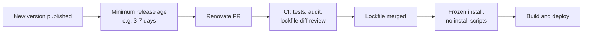

1. **Lockfiles and frozen installs.** Builds use exactly what was reviewed.

```bash
npm ci                          # fails if package.json and lockfile disagree
pnpm install --frozen-lockfile
```

2. **Delay brand-new versions.** Many recent attacks (for example the September 2025 compromises of widely used packages like `debug` and `chalk`, and the self-spreading "Shai-Hulud" worm) were detected within hours or days. A waiting period avoids most of them.

```json
// renovate.json
{
  "extends": ["config:recommended"],
  "minimumReleaseAge": "3 days",
  "packageRules": [
    { "matchUpdateTypes": ["minor", "patch"], "groupName": "non-major deps" }
  ]
}
```

pnpm also added a `minimumReleaseAge` setting in recent 10.x versions; check your version's docs.

3. **Block install scripts.** `postinstall` is the most common way to steal CI secrets. pnpm 10 does not run dependency lifecycle scripts unless the package is listed in `onlyBuiltDependencies`. With npm, use `ignore-scripts=true` in `.npmrc` and allow specific ones.

4. **Least privilege in CI.** Install dependencies in a step without deploy tokens. Use short-lived OIDC credentials instead of long-lived tokens in environment variables.

5. **Provenance.** Packages published with `npm publish --provenance` carry a signed statement linking them to a source repo and build. `npm audit signatures` verifies registry signatures and provenance attestations. Prefer packages that publish it, and publish your own internal packages with it.

6. **Fewer dependencies.** Each package is someone else's code running with your privileges. Prefer platform APIs (`Intl` over a formatting library, `structuredClone` over a clone utility).

7. **Runtime limits in the browser.** CSP `connect-src` allowlist means a malicious package in the bundle cannot easily send tokens to an unknown domain with `fetch`. This is a strong reason to keep `connect-src` tight.

Incident day:
1. Pin to a known-good version (or remove the package) using `overrides` (npm) or `pnpm.overrides`, regenerate the lockfile, rebuild, redeploy.
2. Purge CDN caches for affected bundles.
3. Rotate secrets that were in CI during affected builds (npm tokens, cloud keys, GitHub tokens).
4. If the bad code reached users: assess what it could read (tokens, form data), invalidate sessions, and work with security on user notification.
5. Write a post-incident review and add the missing control.

**Trade-offs:**
- Waiting periods delay urgent security fixes. Allow manual fast-track for patches tied to a known advisory.
- Blocking install scripts breaks some packages (native modules, binary downloaders). Allowlist them explicitly.
- Strict CSP `connect-src` needs maintenance as you add vendors.

**What interviewers listen for:**
- Lockfiles, frozen installs, delayed updates, install script control.
- Thinking about CI secrets, not only the browser.
- A calm incident playbook with rotation and cache purge.
- Red flag: "We run `npm audit` sometimes." Audit only finds known, reported issues.

#### Q: [Staff] A security researcher emails you: "Your transfer page has a stored XSS through the payee nickname field." What do you do, step by step?

**Short answer:** Treat it as a potential incident: acknowledge quickly, reproduce safely in a non-production environment, assess impact and severity, contain (often a quick server-side or rendering fix, or a feature flag kill switch), fix the root cause and check for similar bugs, check logs and stored data for exploitation, then disclose and credit the researcher according to policy. Communication with security, legal and support runs in parallel.

**Clarify first:**
- Is there a security team and a vulnerability disclosure policy or bug bounty? Follow it.
- Was it reported privately, or is it already public?
- Who are the affected users: only the attacker themselves (self-XSS) or others, like support agents viewing the payee?

**Diagnose:**
- Reproduce in staging with the exact payload. Determine where it renders: customer UI, admin tool, emails, PDF statements.
- Find the sink (`dangerouslySetInnerHTML`, a third-party component rendering HTML, an `href`).
- Search the database for stored payloads in that field and related fields: `<`, `onerror`, `javascript:`.
- Check logs and RUM for signs of exploitation: unusual requests from admin sessions, CSP violation reports with inline scripts.

**Solution:**

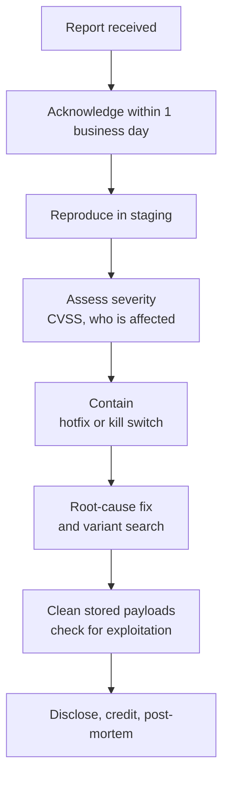

Containment options, fastest first:
1. Turn off the feature with a kill switch, or render the field as plain text everywhere.
2. Hotfix the sink: replace the HTML rendering with text, or wrap it in the sanitizing component.
3. Enforce CSP if you were in report-only mode, as an extra layer.

Root-cause fix and variants:

```tsx
// before: a "rich" label component used for many fields
<span dangerouslySetInnerHTML={{ __html: payee.nickname }} />

// after: nicknames are plain text
<span>{payee.nickname}</span>
```

Then search for every other use of the same component or pattern, because the same developer habit likely exists elsewhere. Add server-side validation (reasonable length and character rules for nicknames), and a regression test:

```tsx
it("renders payee nickname as text, not HTML", () => {
  render(<PayeeRow payee={{ id: "p1", nickname: '' }} />);
  expect(screen.getByText('')).toBeInTheDocument();
  expect((window as any).__xss).toBeUndefined();
});
```

Process items:
- Publish `/.well-known/security.txt` (RFC 9116) with a contact and policy link, so the next researcher knows where to report.
- Keep the researcher informed with timelines, and do not threaten legal action against good-faith reports.
- If user data was accessed, legal and compliance decide on notification duties, which can have strict deadlines (for example 72 hours to the regulator under GDPR for qualifying breaches).

> **Interview tip:** Interviewers care more about calm, ordered process than about the fix itself. Say "reproduce, assess, contain, fix, look for variants, verify, communicate" and show you would involve the right people early.

**Trade-offs:**
- A kill switch is fast but removes a feature for all users. A targeted hotfix takes longer but is less disruptive. Severity decides.
- Public disclosure builds trust but must wait until the fix is deployed everywhere, including mobile clients.

**What interviewers listen for:**
- Severity assessment based on who is affected (support agents with high privileges make it critical).
- Variant analysis and regression tests, not just patching one line.
- Cleaning stored payloads and checking for exploitation.
- Communication, disclosure policy and respect for the researcher.
- Red flag: "Fix it quietly and don't tell anyone."
