## 1. How to run the interview

#### Q: [Senior] "Design the frontend for X." You have 45 minutes. Walk me through how you structure the answer before you draw anything.

**Short answer:** I use a fixed sequence so nothing important gets skipped: requirements, component architecture, data model and API, state, performance, accessibility and i18n, security, then testing and observability. It maps closely to the RADIO framework (Requirements, Architecture, Data model, Interface/API, Optimizations). I spend the first 5–8 minutes on requirements because every later decision depends on the numbers.

**Clarify first:**
- Who are the users and on what devices? A trader on a 4K desktop and a field agent on a cheap Android phone need different designs.
- What scale? Rows, items per page, updates per second, concurrent users, file sizes.
- What is in scope? Only the widget, or also the API contract and the backend shape?
- Non-functional needs: latency budget, offline, real-time, compliance (PII, audit), supported browsers, locales.
- What already exists? Design system, state library, auth (for example Okta), monitoring.

**Diagnose:** In an interview "diagnose" means finding the hard part. Most prompts have one or two real problems hidden in them: "1M rows" is a rendering and data-transfer problem, "autocomplete" is a race-condition and latency problem, "offline" is a sync and conflict problem. Name the hard part out loud after requirements, then spend most of the time there.

**Solution:** A timeline that works for 45 minutes:

| Minutes | Step | Output on the whiteboard |
|---|---|---|
| 0–7 | Requirements | Functional list, non-functional list, numbers |
| 7–15 | Architecture | Component tree and data-flow diagram |
| 15–22 | Data model and API | Entity shapes, endpoints, pagination, real-time channel |
| 22–28 | State | Server cache vs client UI state vs URL state |
| 28–36 | Performance | Virtualization, code splitting, caching, budgets |
| 36–40 | a11y, i18n, security | ARIA patterns, keyboard, locale formatting, XSS, auth |
| 40–45 | Testing, observability, trade-offs | Test pyramid, RUM metrics, what you would do next |

The RADIO steps in more detail:

- **R – Requirements.** Functional (what the user does) and non-functional (performance, scale, devices, offline, a11y). Write numbers down.
- **A – Architecture.** Boxes for the main components and arrows for data flow. Show where server data enters and where it is cached.
- **D – Data model.** Client-side entity shapes, normalized where entities are shared. Separate server state from UI state.
- **I – Interface.** The API between client and server (REST, GraphQL, WebSocket, SSE) and the props API of the main components.
- **O – Optimizations.** Performance, a11y, i18n, security, testing, observability, failure modes.

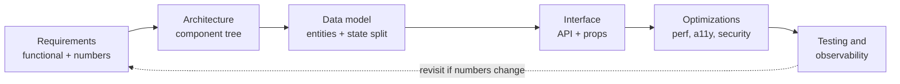

A useful state split you can reuse in every answer:

```ts
// 1. Server state: owned by the backend, cached on the client.
//    Use TanStack Query, RTK Query, or SWR. Has staleness, refetch, retries.
type ServerState = { transactions: Transaction[]; account: Account };

// 2. Client UI state: owned by the browser session.
//    Use useState / useReducer / Zustand / Redux slice.
type UiState = { selectedRowIds: Set<string>; isFilterPanelOpen: boolean };

// 3. URL state: shareable and survives refresh.
//    Filters, sort, page, selected tab.
type UrlState = { sort: 'date' | 'amount'; dir: 'asc' | 'desc'; q: string };

// 4. Form state: transient, validated, often in a form library.
type FormState = { values: LoanApplication; errors: Record<string, string> };
```

**Trade-offs:** A rigid framework can feel mechanical. If the interviewer wants to jump to one area ("let's go deep on the real-time part"), follow them and come back to the checklist only to mention what you skipped. Spending too long on requirements is also a failure; cap it.

**What interviewers listen for:**
- You ask for numbers and then use them later ("50 updates per second, so I will batch to one render per animation frame").
- You separate server state from UI state and say why.
- You name the hard part early and spend time there.
- You mention a11y, security, and observability without being asked.
- Red flags: drawing components before knowing the scale, naming libraries instead of explaining mechanisms, no failure handling, ignoring mobile or keyboard users.

> **Interview tip:** Say "I'll come back to that" and write it in a "parking lot" corner of the board. It shows you noticed a concern without derailing the timeline.

#### Q: [Mid] The interviewer says "Design a dashboard" and nothing else. What do you ask, and how do you turn vague answers into design constraints?

**Short answer:** I ask about users, data, scale, freshness, and devices, then convert each answer into a constraint I can design against. If they say "you decide," I state an assumption with a number and move on.

**Clarify first:** These five questions cover most prompts:

1. Who uses it and what is the one task they must finish? ("A relationship manager checks client portfolio value each morning.")
2. How much data? (Number of widgets, rows per table, points per chart.)
3. How fresh must it be? (Static daily, poll every minute, or live ticks.)
4. Which devices and network? (Desktop only, mobile, slow 3G, offline.)
5. Constraints: auth model, compliance, existing design system, browser support, locales.

**Diagnose:** Convert each answer into a constraint:

| Answer | Constraint |
|---|---|
| "About 5k positions" | Table needs virtualization or server pagination |
| "Prices move every second" | WebSocket or SSE, batched rendering, no full re-render per tick |
| "Used on iPads in branches" | Touch targets 44px, responsive layout, no hover-only actions |
| "Regulated data" | No PII in logs or URLs, session timeout, audit events |
| "English and Nepali" | ICU message format, Intl formatting, text expansion room |

**Solution:** When the interviewer will not give numbers, say an assumption out loud:

> "I'll assume up to 10k rows, 20 widgets, updates every 5 seconds, desktop first with tablet support. If that is wrong, the main thing that changes is whether I virtualize."

Then write two lists on the board: functional (view, filter, drill down, export) and non-functional (load under 2s on a mid-range laptop, INP under 200ms, WCAG 2.2 AA).

**Trade-offs:** Too many questions wastes time and looks indecisive. Too few means you design the wrong thing. Five targeted questions plus stated assumptions is the balance.

**What interviewers listen for:**
- Assumptions stated with numbers, not "it depends."
- Each requirement mapped to a design consequence.
- Prioritization: "Must have: view and filter. Nice to have: export."
- Red flags: no questions at all, or 15 minutes of questions with no design.

> **Why:** Interviewers often keep the prompt vague on purpose. The test is whether you can create structure, not whether you know a "correct" dashboard.

## 2. Data-heavy components

#### Q: [Staff] Design a data grid component that can show 1 million transaction rows with sort, filter, column resize, row selection and inline edit.

**Short answer:** You never send or render 1M rows. The grid is a viewport onto a server-side dataset: the server sorts, filters and pages; the client fetches row blocks on demand and virtualizes both rows and columns so only about 50 rows by 15 columns exist in the DOM. Selection is stored as a rule ("all except these IDs") rather than a list of 1M IDs.

**Clarify first:**
- Must all 1M rows be scrollable as one list, or is paging acceptable? (Finance users often want "scroll to the end" plus total counts.)
- Row height fixed or variable? Fixed makes everything simpler.
- Which operations: sort on one or many columns, filter by text or ranges, grouping, pinned columns?
- Inline edit: optimistic? Conflicts if two people edit the same row?
- Export of the full filtered set? (That belongs on the server.)
- Is it a reusable component for many teams or one screen?

**Diagnose:** The bottlenecks are, in order:
1. Network and memory: 1M rows at ~300 bytes each is ~300MB of JSON. Impossible on the client.
2. DOM: more than a few thousand nodes makes layout and style recalculation slow. Check the Chrome Performance panel for long "Recalculate Style" and "Layout" tasks.
3. React reconciliation: re-rendering every visible cell on each scroll event. Check with the React DevTools Profiler ("Highlight updates").
4. Main-thread work on sort/filter if done client-side.

**Solution:**

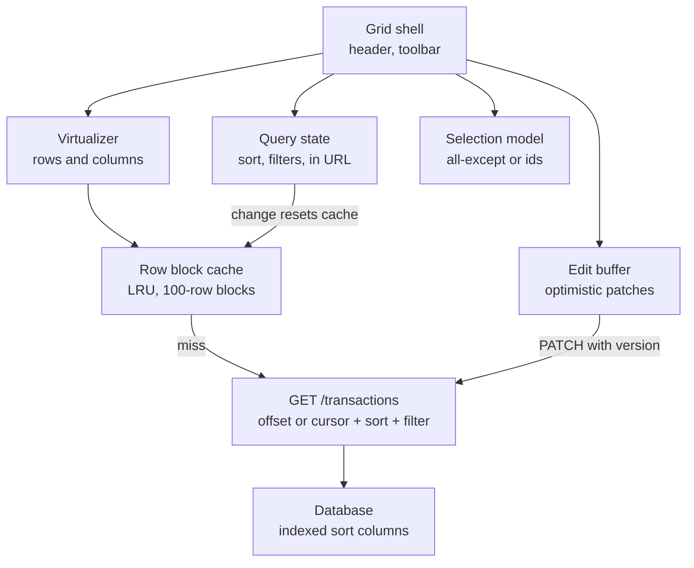

Component architecture:
- `DataGrid` (headless core + rendering): owns query state, column state and selection model.
- `useRowBlocks(query)`: fetches blocks of 100 rows by index range, caches them in an LRU map, cancels stale requests.
- `Virtualizer`: computes visible index range from `scrollTop`, row height and viewport height, with an overscan of ~10 rows.
- `Cell` renderers memoized by `(rowId, columnId, value)`.

Data model and API:

```ts
type SortSpec = { columnId: string; dir: 'asc' | 'desc' }[];
type FilterSpec = Record<string, { op: 'eq' | 'contains' | 'gte' | 'lte'; value: string | number }>;

interface RowsRequest {
  offset: number;        // index of first row in the block
  limit: number;         // block size, e.g. 100
  sort: SortSpec;
  filters: FilterSpec;
  snapshotId?: string;   // keeps a consistent view while scrolling
}

interface RowsResponse<T> {
  rows: T[];
  totalCount: number;    // may be an estimate for very large sets
  snapshotId: string;
}

type Selection =
  | { mode: 'some'; ids: Set<string> }
  | { mode: 'allExcept'; excludedIds: Set<string>; query: { sort: SortSpec; filters: FilterSpec } };
```

Block fetching with a simple cache:

```ts
const BLOCK = 100;

function useRowBlocks<T>(queryKey: string, fetchBlock: (offset: number, signal: AbortSignal) => Promise<RowsResponse<T>>) {
  const cache = useRef(new Map<number, T[]>());          // blockIndex -> rows
  const inFlight = useRef(new Map<number, AbortController>());
  const [, force] = useReducer((x: number) => x + 1, 0);

  // Reset cache whenever sort or filters change.
  useEffect(() => {
    cache.current.clear();
    inFlight.current.forEach((c) => c.abort());
    inFlight.current.clear();
    force();
  }, [queryKey]);

  const ensureRange = useCallback((start: number, end: number) => {
    const first = Math.floor(start / BLOCK);
    const last = Math.floor(end / BLOCK);
    for (let b = first; b <= last; b++) {
      if (cache.current.has(b) || inFlight.current.has(b)) continue;
      const ctrl = new AbortController();
      inFlight.current.set(b, ctrl);
      fetchBlock(b * BLOCK, ctrl.signal)
        .then((res) => {
          cache.current.set(b, res.rows);
          if (cache.current.size > 50) {
            const oldest = cache.current.keys().next().value as number;
            cache.current.delete(oldest);                   // crude LRU by insertion order
          }
          force();
        })
        .catch((e) => { if (e.name !== 'AbortError') console.error(e); })
        .finally(() => inFlight.current.delete(b));
    }
  }, [fetchBlock]);

  const getRow = (index: number): T | undefined =>
    cache.current.get(Math.floor(index / BLOCK))?.[index % BLOCK];

  return { ensureRange, getRow };
}
```

In practice I would use TanStack Virtual for the virtualizer and TanStack Table for column logic rather than writing them. Unloaded rows render as skeletons.

Scroll height: browsers cap element height (roughly 16–33 million pixels depending on the browser). At 32px per row, 1M rows is 32M pixels, which is at or beyond that limit. Options: scale the scrollbar (map scroll position to index with a ratio), or use a paged "jump to" plus virtualized pages of 100k rows.

Server side: offset pagination at offset 900,000 is slow because the database still walks those rows. Use keyset pagination when the user scrolls sequentially, and use an estimate plus snapshot for random jumps:

```sql
-- Keyset: next block after the last seen (posted_at, id)
SELECT id, posted_at, description, amount_cents
FROM transactions
WHERE account_id = $1
  AND (posted_at, id) < ($2, $3)
ORDER BY posted_at DESC, id DESC
LIMIT 100;
-- Needs index: (account_id, posted_at DESC, id DESC)
```

Inline edit: keep an edit buffer keyed by row ID, apply optimistically, send `PATCH /transactions/:id` with `If-Match: <version>`. On `412 Precondition Failed`, show the server value and let the user retry.

Accessibility: use the ARIA grid pattern (`role="grid"`, `aria-rowcount={totalCount}`, `aria-rowindex` on each rendered row) so screen readers know the true size even though only 50 rows exist. Roving `tabIndex` for arrow-key navigation between cells.

**Trade-offs:**
- Server-side sort/filter means every change is a round trip (100–300ms). Client-side is instant but only works up to roughly 50k–100k rows in memory, ideally with sorting in a Web Worker.
- Virtualization breaks browser find (Ctrl+F) and printing. Provide in-grid search and server export.
- "Select all" as a rule is efficient but the backend must accept bulk actions by query, which is more API work.
- Snapshots give consistent scrolling but show slightly stale data.

**What interviewers listen for:**
- "The browser never holds 1M rows" said in the first minute.
- Both row and column virtualization, overscan, fixed row height.
- Keyset vs offset pagination and the index that supports the sort.
- Selection model that does not store 1M IDs.
- ARIA grid attributes for virtual rows.
- Red flags: `rows.map(...)` over all rows, client-side sorting of 1M items, `React.memo` as the only answer.

> **Finance tip:** Never sum `amountCents` for a filtered set on the client from partial blocks. The footer total must come from the server, or it will be wrong whenever blocks are missing.

#### Q: [Senior] Design an autocomplete for searching payees across 2 million records. It must feel instant and work with keyboard and screen readers.

**Short answer:** Debounce input, cancel stale requests, cache results by query, and render a small list with the ARIA combobox pattern. The server does prefix search on an index; the client's job is avoiding race conditions, wasted requests and inaccessible markup.

**Clarify first:**
- Results from the server or a local list? 2M records means server.
- Prefix match, fuzzy match, or full-text? Ranking rules (recent payees first)?
- Latency target: results within ~150ms of the user pausing.
- Free text allowed or must the user pick an option?
- Mobile support and IME input (Chinese, Japanese input composes text before committing).

**Diagnose:** Typical bugs to look for in an existing implementation:
- Out-of-order responses: typing "ab" then "abc", the "ab" response arrives last and overwrites. Reproduce with Network throttling in DevTools.
- One request per keystroke: visible in the Network tab.
- List re-renders on every keystroke even when results are unchanged: React Profiler.
- Focus lost or screen reader silent: test with VoiceOver or NVDA.

**Solution:**

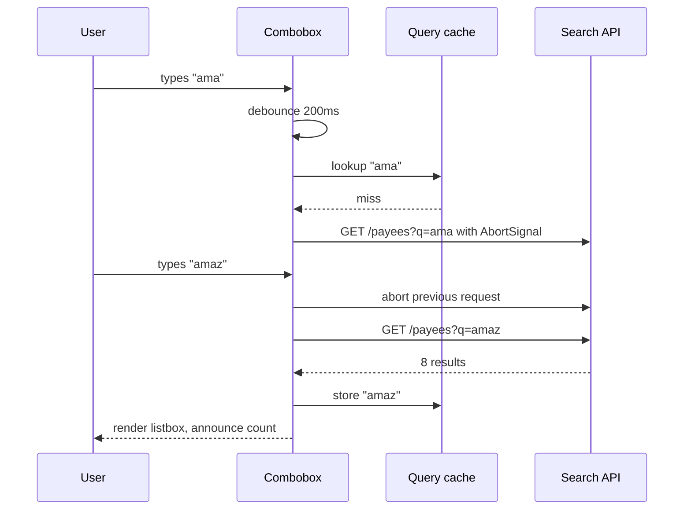

Hook:

```ts
function usePayeeSearch(input: string) {
  const [debounced, setDebounced] = useState(input);
  useEffect(() => {
    const t = setTimeout(() => setDebounced(input.trim()), 200);
    return () => clearTimeout(t);
  }, [input]);

  return useQuery({
    queryKey: ['payees', debounced.toLowerCase()],
    queryFn: ({ signal }) =>
      fetch(`/api/payees?q=${encodeURIComponent(debounced)}&limit=8`, { signal })
        .then((r) => {
          if (!r.ok) throw new Error(`Search failed: ${r.status}`);
          return r.json() as Promise<Payee[]>;
        }),
    enabled: debounced.length >= 2,
    staleTime: 60_000,
    placeholderData: (prev) => prev,   // keep old results visible while loading (TanStack Query v5)
  });
}
```

TanStack Query passes an `AbortSignal` and cancels the previous query when the key changes and nobody is observing it, and because results are keyed by query, a late response for "ab" cannot overwrite "abc". Without a library, track the latest request ID and ignore older responses.

Accessible markup (ARIA 1.2 combobox):

```tsx
<label htmlFor="payee">Payee</label>
<input
  id="payee"
  role="combobox"
  aria-expanded={open}
  aria-controls="payee-list"
  aria-autocomplete="list"
  aria-activedescendant={activeIndex >= 0 ? `payee-opt-${activeIndex}` : undefined}
  value={input}
  onChange={(e) => setInput(e.target.value)}
  onKeyDown={onKeyDown}   // ArrowDown/ArrowUp move activeIndex, Enter selects, Escape closes
/>
<ul id="payee-list" role="listbox" hidden={!open}>
  {results.map((p, i) => (
    <li key={p.id} id={`payee-opt-${i}`} role="option" aria-selected={i === activeIndex}
        onMouseDown={(e) => { e.preventDefault(); select(p); }}>
      {highlight(p.name, input)}
    </li>
  ))}
</ul>
<div aria-live="polite" className="sr-only">{open ? `${results.length} results` : ''}</div>
```

`onMouseDown` with `preventDefault` stops the input from blurring before the click registers. Focus stays in the input; `aria-activedescendant` tells the screen reader which option is "active."

IME: ignore Enter while `e.nativeEvent.isComposing` is true so a Japanese user confirming a character does not select an option.

Server: a prefix index (`CREATE INDEX ON payees (lower(name) text_pattern_ops)` in Postgres, or a trigram index for fuzzy match, or a search engine like OpenSearch). Return at most 8–10 results, ranked by the user's recent usage first.

Highlighting: build React nodes, never `dangerouslySetInnerHTML` with the user's query, which would be an XSS hole.

**Trade-offs:**
- Debounce delay vs perceived speed: 150–250ms is typical. Throttle gives faster first feedback but more requests.
- Client cache of recent payees gives instant results but can be stale.
- Fuzzy search improves recall but costs server CPU and gives surprising ranking.

**What interviewers listen for:**
- Race conditions handled by cancellation or request IDs, not just debounce.
- ARIA combobox with `aria-activedescendant`, keyboard handling, live region for counts.
- Minimum query length and result limit.
- Red flags: `dangerouslySetInnerHTML` for highlighting, no abort, clearing results to empty on every keystroke (flicker).

> **Gotcha:** Debounce alone does not fix races. A slow response for an older query can still arrive after a fast response for a newer one.

#### Q: [Senior] Design an infinite activity feed (transactions, alerts, news) that a user can scroll for thousands of items, with new items arriving at the top.

**Short answer:** Cursor-based pagination for older items, a real-time channel or polling for newer ones, a virtualized list with variable row heights, and a "N new items" pill instead of pushing content under the user's eyes. Scroll position must survive navigation back to the feed.

**Clarify first:**
- Item types and heights: fixed or variable (images, expandable cards)?
- Real-time or refresh-on-demand?
- Can items be edited or deleted after they appear?
- Do we need deep links to a single item and back navigation to the same scroll spot?
- Mobile web? Then memory and battery matter.

**Diagnose:** Common problems and how to see them:
- Duplicate or missing items at page boundaries: caused by offset pagination when new items are inserted. Reproduce by inserting rows between page fetches.
- Jank while scrolling: Performance panel shows long tasks from image decoding or layout. Check that images have fixed dimensions.
- Memory growing without bound: Memory panel heap snapshots after scrolling 2,000 items.
- Scroll jumping when items above the viewport change height.

**Solution:**

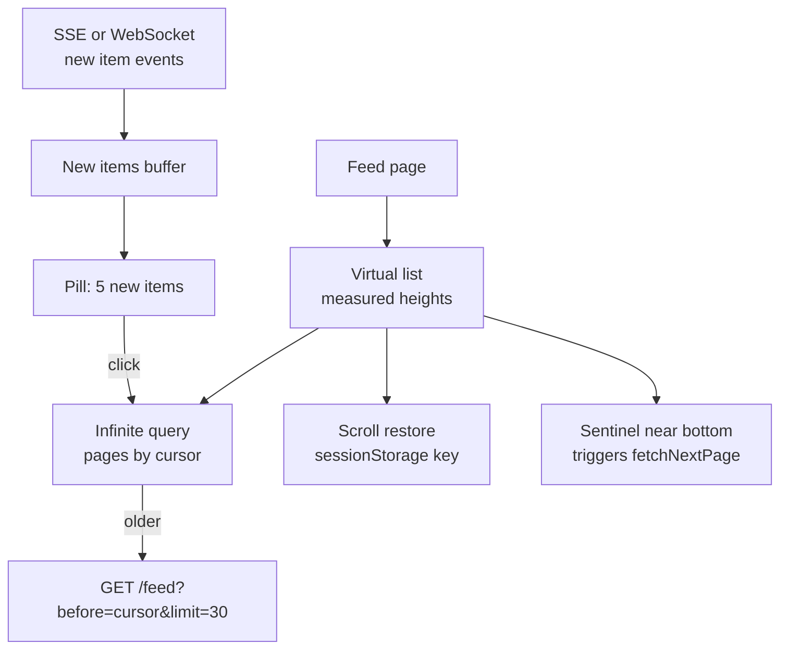

API with opaque cursors:

```ts
// GET /feed?before=<cursor>&limit=30
interface FeedPage {
  items: FeedItem[];
  nextCursor: string | null;   // base64 of (createdAt, id) of the last item
}

type FeedItem =
  | { id: string; type: 'transaction'; createdAt: string; amountCents: number; currency: string; merchant: string }
  | { id: string; type: 'alert'; createdAt: string; severity: 'info' | 'warn'; message: string }
  | { id: string; type: 'news'; createdAt: string; title: string; imageUrl?: string; imageW?: number; imageH?: number };
```

Client:

```ts
const feed = useInfiniteQuery({
  queryKey: ['feed'],
  queryFn: ({ pageParam, signal }) =>
    api.get<FeedPage>('/feed', { params: { before: pageParam, limit: 30 }, signal }),
  initialPageParam: undefined as string | undefined,
  getNextPageParam: (last) => last.nextCursor ?? undefined,
  maxPages: 20,              // TanStack Query v5: drop old pages to cap memory.
                             // Scrolling back needs getPreviousPageParam, so the API also needs an "after" cursor.
});

const items = useMemo(() => feed.data?.pages.flatMap((p) => p.items) ?? [], [feed.data]);

const virtualizer = useVirtualizer({
  count: items.length,
  getScrollElement: () => parentRef.current,
  estimateSize: () => 96,
  overscan: 6,
  getItemKey: (i) => items[i].id,      // stable keys keep measurements correct
});
```

Use `virtualizer.measureElement` as a ref on each row so variable heights are measured once and cached by key.

New items at the top: buffer incoming events and show a pill. When the user clicks it, prepend and scroll to top. If you insert directly while the user is reading, the content shifts down; if you must insert, adjust `scrollTop` by the inserted height (scroll anchoring). CSS `overflow-anchor` helps in non-virtualized lists but virtualizers usually handle this themselves.

Scroll restoration: store `{ firstVisibleId, offset }` in `sessionStorage` on unmount, keep the query cache alive (`gcTime`), and on return scroll to that item.

Images: always reserve space with `width`/`height` or `aspect-ratio` to avoid layout shift (CLS), use `loading="lazy"` and responsive `srcset`.

Accessibility: use `role="feed"` with `article` children that have `aria-setsize` (or `-1` if unknown) and `aria-posinset`. Give a "Load more" button as an alternative to pure scroll-triggered loading so keyboard and screen reader users are not stuck, and so users can reach the footer.

**Trade-offs:**
- `maxPages` caps memory but scrolling back up refetches.
- The new-items pill is less "live" but far less disorienting.
- Variable heights need measurement, which can cause small jumps on first render; fixed heights are simpler but limit design.

**What interviewers listen for:**
- Cursor pagination with a tiebreaker (`createdAt, id`), and why offset breaks with inserts.
- Stable keys, measured heights, reserved image space.
- A plan for new items that does not move content under the user.
- Scroll restoration on back navigation.
- Red flags: infinite scroll with no virtualization, offset paging on a live feed, no footer access.

#### Q: [Mid] Design an analytics page with several charts (portfolio value over time, allocation, cash flow) and an "Export" button that produces CSV and PDF.

**Short answer:** Charts render from pre-aggregated server data sized to the chart's pixel width, not raw rows. CSV export of large data is generated on the server and streamed or emailed; small exports can be built on the client. PDF uses a server-side renderer for anything official, because client-side PDF of charts is fragile.

**Clarify first:**
- Time ranges and granularity (1D at 1-minute points vs 10Y at daily points)?
- How many points per chart? A line chart 800px wide cannot show more than ~800 meaningful points.
- Export: what the user sees (chart + summary) or the underlying raw data? How many rows?
- Is the PDF an official statement (needs branding, page numbers, legal text, audit) or a convenience snapshot?

**Diagnose:**
- Slow chart: check payload size in Network tab and SVG node count. Recharts and other SVG libraries slow down with many thousands of elements; canvas-based libraries handle more.
- Slow export: check whether the browser builds a huge string in memory and blocks the main thread.

**Solution:**

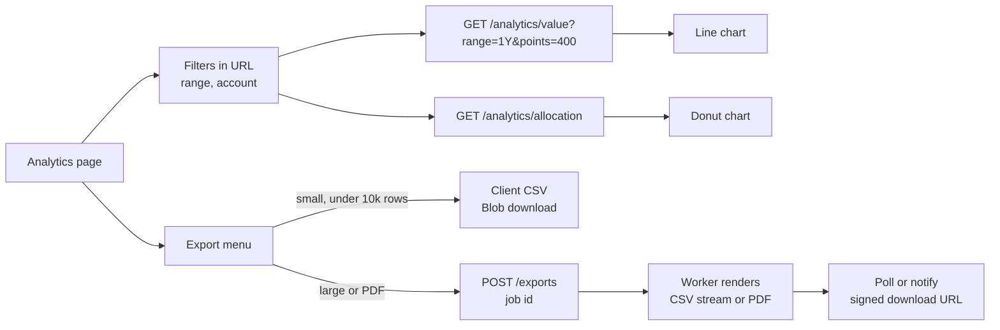

Server downsampling: the API accepts `points` and returns aggregated buckets (or uses an algorithm like LTTB to keep visual shape). The client sends `points = chartWidthPx / 2`.

Client CSV for small sets, with correct escaping:

```ts
function toCsv(rows: Record<string, string | number>[], columns: string[]): string {
  const esc = (v: string | number) => {
    let s = String(v);
    // Defend against CSV/formula injection in Excel: prefix TEXT cells starting with = + - @
    if (typeof v === 'string' && /^[=+\-@\t\r]/.test(s)) s = `'${s}`;
    return /[",\n]/.test(s) ? `"${s.replace(/"/g, '""')}"` : s;
  };
  return [columns.join(','), ...rows.map((r) => columns.map((c) => esc(r[c] ?? '')).join(','))].join('\r\n');
}

function downloadCsv(name: string, csv: string) {
  const blob = new Blob(['' + csv], { type: 'text/csv;charset=utf-8' }); // BOM so Excel reads UTF-8
  const url = URL.createObjectURL(blob);
  const a = Object.assign(document.createElement('a'), { href: url, download: name });
  a.click();
  URL.revokeObjectURL(url);
}
```

The formula-injection prefix is applied only to string values, so numeric columns such as `-120.50` stay numeric. Pass amounts as numbers or as a dedicated numeric column.

Large exports: `POST /exports { type: 'csv', filters }` returns `{ jobId }`. A worker streams rows from the database to object storage, then the UI gets a signed URL by polling `GET /exports/:jobId` or through a notification. This keeps the browser and API servers out of the heavy path.

PDF: a server-side headless browser (for example Puppeteer/Playwright rendering a print route) or a PDF library gives consistent output, fonts and page breaks. The print route reuses the same chart components with animations disabled.

Accessibility: every chart needs a text alternative: a summary ("Portfolio up 4.2% over 1 year") and a "View as table" toggle. Do not rely on color alone; use patterns or direct labels.

Formatting: `Intl.NumberFormat(locale, { style: 'currency', currency })` for display, but export raw numeric values in CSV with a separate currency column so spreadsheets can compute.

**Trade-offs:**
- Client CSV is instant and cheap but limited by memory and blocks the main thread on large sets (use a Web Worker if you must).
- Server export adds a job system but scales and can be audited.
- Client PDF libraries avoid servers but struggle with SVG charts, fonts and pagination.

**What interviewers listen for:**
- Downsampling tied to pixel width.
- CSV escaping, UTF-8 BOM, formula injection.
- Async job pattern for big exports.
- Chart accessibility with table alternatives.
- Red flags: shipping 500k points to a chart, building a 200MB CSV string in the browser.

> **Finance tip:** Derive exported amounts from integer `amountCents` with integer formatting (whole part and `Math.abs(cents % 100)` padded to two digits), never from float arithmetic that can produce values like `0.30000000000000004`. Keep the amount column numeric so the injection guard does not prefix negative values.

## 3. Real-time and collaboration

#### Q: [Staff] Design a real-time portfolio dashboard: 2,000 positions, prices tick up to 50 times per second per symbol, totals and P&L update live, plus a chart and alerts.

**Short answer:** One WebSocket connection, subscriptions only for symbols the user can see, prices written into an external store outside React, and rendering batched to at most one update per animation frame. Components subscribe to individual symbols with `useSyncExternalStore` so a tick re-renders one row, not the page. Derived totals are computed incrementally and displayed with a short throttle.

**Clarify first:**
- How fresh must the UI be? Humans cannot read 50 changes per second; 4–10 visual updates per second is usually enough. Is the displayed price used for trading decisions (then latency matters) or for monitoring?
- Number of symbols in view vs total held.
- Must the client compute P&L or does the server send it?
- Behavior when the connection drops: show stale indicators, freeze, or fall back to polling?
- Multiple tabs open at once?

**Diagnose:** In a slow existing dashboard, check:
- React Profiler: does each tick re-render the whole table? Usually caused by price state in a top-level context or Redux slice that every row selects broadly.
- Performance panel: long tasks, frames dropped, layout thrash from reading `offsetHeight` during updates.
- WebSocket frames in the Network tab: message rate and payload size. Is the server sending symbols nobody sees?
- Memory: chart series growing forever.

**Solution:**

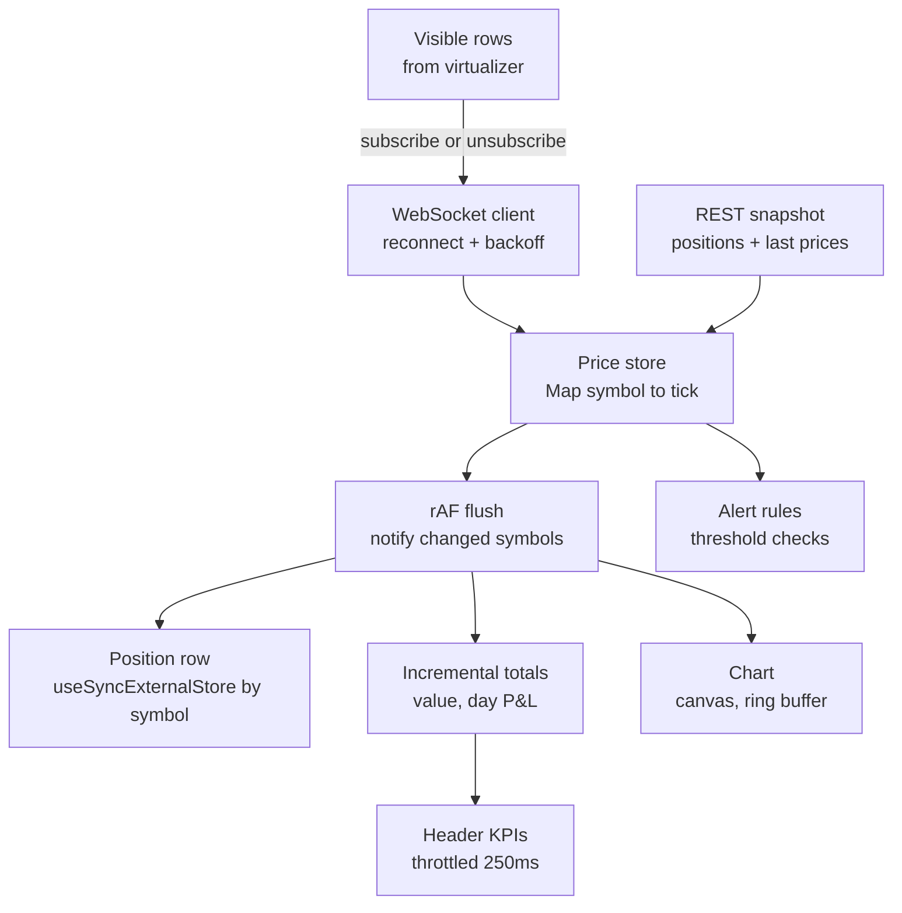

Flow on load: fetch a REST snapshot of positions and last prices (with a sequence number), then open the socket and subscribe to visible symbols. Ignore ticks with a sequence lower than what you already have.

External store with frame batching:

```ts
type Tick = { symbol: string; priceMicros: number; seq: number; ts: number };

class PriceStore {
  private prices = new Map<string, Tick>();
  private listeners = new Map<string, Set<() => void>>();
  private dirty = new Set<string>();
  private scheduled = false;

  apply(t: Tick) {
    const prev = this.prices.get(t.symbol);
    if (prev && prev.seq >= t.seq) return;           // drop out-of-order ticks
    this.prices.set(t.symbol, t);
    this.dirty.add(t.symbol);
    if (!this.scheduled) {
      this.scheduled = true;
      requestAnimationFrame(this.flush);
    }
  }

  private flush = () => {
    this.scheduled = false;
    const changed = [...this.dirty];
    this.dirty.clear();
    for (const s of changed) this.listeners.get(s)?.forEach((l) => l());
  };

  subscribe(symbol: string, l: () => void) {
    let set = this.listeners.get(symbol);
    if (!set) this.listeners.set(symbol, (set = new Set()));
    set.add(l);
    return () => { set!.delete(l); };
  }

  get(symbol: string) { return this.prices.get(symbol); }
}

export const priceStore = new PriceStore();

export function usePrice(symbol: string) {
  // Stable subscribe function, otherwise React resubscribes on every render.
  const subscribe = useCallback((cb: () => void) => priceStore.subscribe(symbol, cb), [symbol]);
  return useSyncExternalStore(subscribe, () => priceStore.get(symbol));
}
```

If 50 ticks arrive for a symbol within one frame, the row renders once with the latest value. `getSnapshot` returns the same object reference until a new tick replaces it, which `useSyncExternalStore` requires.

Note `requestAnimationFrame` pauses in background tabs. That is good for rendering, but alert checks should run in `apply`, not in `flush`, so alerts still fire.

Totals: keep `quantity` per symbol and update the portfolio value by the delta: `total += qty * (newPrice - oldPrice)`. Recompute fully every few seconds to remove drift. Store prices as integers (micros or cents) to avoid float errors in sums; format only at display.

Rows: virtualize the 2,000-row table; the virtualizer tells you which symbols are visible so the socket subscribes only to those (plus symbols needed for totals, which may be streamed as server-computed aggregates instead).

Chart: canvas rendering, ring buffer of the last N points, append-only updates. Avoid re-creating the whole SVG on each tick.

Connection handling:
- Heartbeat ping; if no message in 10s, mark "stale" (grey prices with a timestamp) and reconnect with exponential backoff and jitter.
- On reconnect, resubscribe and request a fresh snapshot to fill gaps.
- Multiple tabs: optionally share one socket through a `SharedWorker` or elect a leader tab with `BroadcastChannel` + Web Locks. Worth mentioning, not always worth building.

Accessibility: do not put live prices in an `aria-live` region; it would flood screen readers. Announce only alerts. Flash animations for up/down must respect `prefers-reduced-motion`, and up/down must use an arrow or sign, not only green and red.

**Trade-offs:**
- Frame batching adds up to 16ms latency; throttling KPIs to 250ms adds more but makes numbers readable.
- Client-side P&L reduces server load but risks disagreeing with the official server value; label it "indicative."
- A SharedWorker saves connections but adds complexity and browser support caveats (it is not available in some mobile browsers, so verify for your targets).

**What interviewers listen for:**
- Decoupling network rate from render rate.
- Per-symbol subscriptions so a tick re-renders one row.
- Snapshot plus sequence numbers to avoid gaps and out-of-order data.
- Stale-data UX and reconnect strategy.
- Red flags: `setState` on every socket message at the top of the tree, prices in a single Context, float math for money totals.

> **Finance tip:** Show the "as of" time on every price when the feed is delayed or stale. Users making decisions on stale prices without knowing it is a real compliance and trust issue.

#### Q: [Mid] Design a notification center: a bell icon with an unread count, a dropdown list, mark as read, and toasts for urgent items.

**Short answer:** The server owns notifications and the unread count. The client fetches a paginated list, receives new items over SSE or WebSocket (or polls), updates the cache, and marks items read optimistically. Urgent items also show a toast; everything else just increments the badge.

**Clarify first:**
- Volume per user per day? Retention period?
- Real-time required or is a 30–60s poll fine?
- Read state synced across devices and tabs?
- Types: transactional (payment received), security (new login), marketing. Can users mute types?
- Click behavior: deep link to the related entity.

**Diagnose:** In an existing implementation, look for: the unread count computed on the client from a partial list (wrong once there are more than one page), duplicate toasts across tabs, and polling that continues in background tabs and drains battery.

**Solution:**

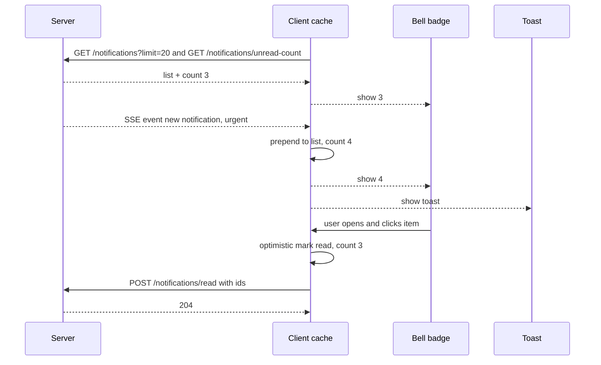

Data model:

```ts
interface Notification {
  id: string;
  type: 'payment_received' | 'login_new_device' | 'statement_ready';
  priority: 'urgent' | 'normal';
  title: string;
  body: string;
  link?: string;           // in-app route, validated
  createdAt: string;
  readAt: string | null;
}
```

Optimistic mark-as-read with TanStack Query:

```ts
const markRead = useMutation({
  mutationFn: (ids: string[]) => api.post('/notifications/read', { ids }),
  onMutate: async (ids) => {
    await qc.cancelQueries({ queryKey: ['notifications'] });
    const prevCount = qc.getQueryData<number>(['notifications', 'unread-count']);
    qc.setQueryData<number>(['notifications', 'unread-count'], (c = 0) => Math.max(0, c - ids.length));
    return { prevCount };
  },
  onError: (_e, _ids, ctx) => qc.setQueryData(['notifications', 'unread-count'], ctx?.prevCount),
  onSettled: () => qc.invalidateQueries({ queryKey: ['notifications'] }),
});
```

Real-time: SSE (`EventSource`) is a good fit because traffic is one-way, it reconnects automatically and supports `Last-Event-ID` to resume. Stop or slow polling when `document.visibilityState === 'hidden'`.

Cross-tab: post read events on a `BroadcastChannel('notifications')` so other tabs update the badge without a round trip; only the focused tab shows the toast.

Accessibility: the bell is a `button` with `aria-label="Notifications, 3 unread"` and `aria-expanded`. Toasts use `role="status"` (polite) for normal items and `role="alert"` only for truly urgent ones. Toasts must not auto-dismiss too quickly if they contain actions; WCAG 2.2.1 requires users can extend time limits.

Security: `link` must be an internal path; never navigate to an arbitrary URL from notification payloads. Render `title`/`body` as text, not HTML.

**Trade-offs:** Polling is simple and cache-friendly but delayed; SSE is lightweight but each open connection costs a server resource; WebSocket is only worth it if you already have one. Optimistic updates feel instant but need rollback.

**What interviewers listen for:**
- Server-authoritative unread count.
- Visibility-aware polling or SSE with resume.
- Cross-tab consistency.
- Toast accessibility and the difference between `status` and `alert`.
- Red flags: rendering notification HTML from the server, toasts for every item.

#### Q: [Senior] Design an embeddable customer-support chat widget that partner sites and our own app can drop in with one script tag.

**Short answer:** A tiny loader script injects a launcher button and an iframe that hosts the full chat app from our domain. The iframe isolates CSS, JS and cookies from the host page; the host and widget talk through a typed `postMessage` API with origin checks. Messages use a WebSocket with client-generated IDs, optimistic sending, and resume after reconnect.

**Clarify first:**
- Embedded on third-party sites, or only our own app?
- Authenticated users (pass identity) or anonymous visitors?
- Attachments, typing indicators, read receipts, bot before human handoff?
- Message history length and retention?
- Bundle-size budget for the host page (the loader should be a few KB).

**Diagnose:** Risks to check for: host CSS leaking into the widget (or the reverse), the widget slowing the host page's LCP, duplicate messages after reconnect, and lost messages when the tab sleeps.

**Solution:**

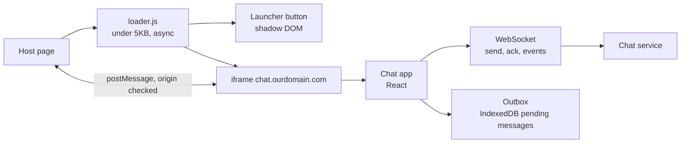

Loader:

```ts
// loader.ts, served from CDN, loaded with <script async src=".../loader.js" data-tenant="acme">
(function () {
  const script = document.currentScript as HTMLScriptElement;
  const tenant = script.dataset.tenant;
  const host = document.createElement('div');
  const shadow = host.attachShadow({ mode: 'closed' });  // isolates launcher styles
  shadow.innerHTML = `<style>button{position:fixed;bottom:24px;right:24px}</style>
    <button aria-label="Open support chat">Chat</button>`;
  document.body.appendChild(host);

  let frame: HTMLIFrameElement | null = null;
  shadow.querySelector('button')!.addEventListener('click', () => {
    if (!frame) {
      frame = document.createElement('iframe');
      frame.src = `https://chat.ourdomain.com/widget?tenant=${encodeURIComponent(tenant ?? '')}`;
      frame.title = 'Support chat';
      frame.allow = 'clipboard-write';
      Object.assign(frame.style, { position: 'fixed', bottom: '90px', right: '24px', width: '380px', height: '560px', border: '0' });
      document.body.appendChild(frame);
    }
  });
})();
```

The heavy chat app loads only on first click, so the host page pays almost nothing.

postMessage protocol:

```ts
type HostToWidget = { type: 'identify'; token: string } | { type: 'open' } | { type: 'close' };
type WidgetToHost = { type: 'ready' } | { type: 'unread'; count: number } | { type: 'resize'; height: number };

window.addEventListener('message', (e: MessageEvent) => {
  if (e.origin !== ALLOWED_HOST_ORIGIN) return;          // always check origin
  const msg = e.data as HostToWidget;
  if (msg.type === 'identify') exchangeTokenForSession(msg.token);
});
```

Identity: the host passes a short-lived signed token (issued by the partner's backend); the widget exchanges it for its own session. Never pass long-lived credentials through `postMessage`.

Message sending:

```ts
interface OutgoingMessage { clientId: string; conversationId: string; body: string; createdAt: string; status: 'pending' | 'sent' | 'failed' }
```

1. Generate `clientId = crypto.randomUUID()`, show the message immediately as "pending," save it to an outbox.
2. Send over the socket. Server stores it idempotently by `clientId` and returns an ack with the server ID and sequence number.
3. On reconnect, resend unacked outbox items (safe because of idempotency) and fetch messages after the last seen sequence.

Rendering: virtualized message list anchored at the bottom; if the user has scrolled up, show "New messages" instead of jumping.

Accessibility: the message log is `role="log"` with `aria-live="polite"`. Focus moves into the chat when it opens and returns to the launcher on close. Escape closes it.

Security: render messages as text with link detection, sanitize any rich text, set a strict CSP inside the iframe, and use `frame-ancestors` to control which sites may embed it.

**Trade-offs:**
- An iframe gives isolation but complicates sizing, focus and theming (pass theme tokens through `postMessage`).
- Shadow DOM alone is lighter but shares the JS realm with the host; a broken host script can break you.
- Third-party cookies are blocked in many browsers, so the widget should use tokens, not cookie sessions, inside the iframe. Partitioned cookies (CHIPS) are an option to research; verify current browser support.

**What interviewers listen for:**
- Isolation reasoning (iframe vs shadow DOM vs plain script).
- Lazy loading to protect the host's performance.
- Idempotent send with client IDs and resume by sequence.
- Origin checks and short-lived tokens.
- Red flags: injecting React and global CSS directly into a partner page, `postMessage` with `'*'` target origin for sensitive data.

#### Q: [Senior] Design a collaborative comment and annotation feature on a PDF statement or a document page: users highlight text, leave threaded comments, and see others' comments appear live.

**Short answer:** Anchor each annotation to stable content coordinates (page + text offsets or a text quote with context), not pixel positions. Comments are ordinary server records with threads; live updates come over a room-based WebSocket or SSE channel. Because comments are append-mostly, simple server ordering with optimistic inserts is enough; you do not need CRDTs unless you are co-editing the same text.

**Clarify first:**
- What is being annotated: a fixed PDF (content never changes) or an editable document (content moves)?
- Number of simultaneous viewers per document? Comments per document?
- Mentions, notifications, resolve/reopen, permissions (who can see internal notes)?
- Presence (who is viewing) and typing indicators?

**Diagnose:** The hard part is anchoring. Test cases: the window resizes, zoom changes, the font loads late, the document gets a new version. If anchors are stored as `x, y` pixels, every one of these breaks them.

**Solution:**

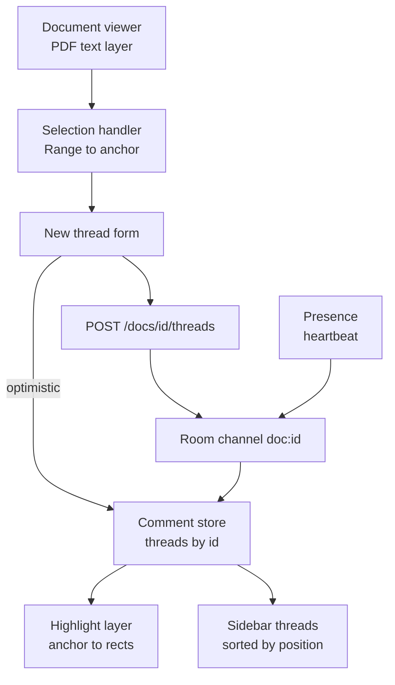

Anchor model (similar to the W3C Web Annotation selectors):

```ts
interface TextAnchor {
  docId: string;
  docVersion: string;          // content hash of the document version
  page: number;
  start: number;               // character offset in the page text
  end: number;
  quote: { exact: string; prefix: string; suffix: string };   // fallback for re-anchoring
}

interface Thread {
  id: string;
  anchor: TextAnchor;
  status: 'open' | 'resolved';
  comments: { id: string; clientId: string; authorId: string; body: string; createdAt: string }[];
}
```

Re-anchoring: if `docVersion` matches, use offsets. If not, search the new text for `quote.exact` near `prefix`/`suffix`; if not found, mark the thread "orphaned" and show it in the sidebar without a highlight.

Rendering highlights: convert the anchor back to a DOM `Range` on the text layer, call `range.getClientRects()`, and draw absolutely positioned boxes in an overlay layer. Recompute on resize and zoom (a `ResizeObserver` on the page container), not on every scroll.

Live updates: join room `doc:<id>`. The server broadcasts `thread.created`, `comment.added`, `thread.resolved`. Each event carries a version per thread; the client applies it if newer. Optimistic inserts use `clientId` so the server echo replaces the pending item instead of duplicating it.

Conflicts: two people resolving and replying at once is fine with last-writer-wins on `status` and append for comments. Only rich co-editing of the same text needs operational transforms or CRDTs (for example Yjs).

Accessibility: highlights are not keyboard-reachable by default. Provide the sidebar as the primary keyboard path; each thread has a "Go to text" button that scrolls and focuses the highlighted region (`tabIndex=-1` and a visible focus ring). Use `<mark>` semantics or `aria-describedby` linking highlight to thread.

Security and privacy: permissions checked on the server per thread (internal vs customer-visible); mentions only resolve to users with document access; sanitize comment Markdown.

**Trade-offs:**
- Text-quote anchors survive edits but can match the wrong occurrence; combining offset + quote + context is the usual compromise.
- WebSocket rooms give instant updates; polling every 10s is acceptable for low-traffic review flows and much simpler.
- CRDTs solve concurrent text editing but add size and complexity you probably do not need for comments.

**What interviewers listen for:**
- Content-based anchoring and a re-anchor strategy.
- Clear statement of when CRDT/OT is and is not needed.
- Optimistic insert with dedup by client ID.
- Keyboard path to annotations.
- Red flags: storing pixel coordinates, broadcasting full document state on each comment.

## 4. Forms, files and offline

#### Q: [Mid] Design a multi-step loan application: 6 steps, about 80 fields, conditional sections, document upload, save and resume later, and a final review page.

**Short answer:** One form model for the whole application, a schema per step for validation, and a step state machine that decides which steps apply based on answers. Drafts autosave to the server (debounced) so the user can resume on any device. The final submit sends one idempotent request and the server re-validates everything.

**Clarify first:**
- Can users go back and forth freely, or must steps be completed in order?
- Save and resume across devices (server draft) or same browser only?
- Which fields drive branching (for example, "self-employed" adds an income-documents step)?
- Regulatory needs: consent text versioning, audit of what the user saw, PII handling.
- Average completion time and drop-off concerns: mobile users?

**Diagnose:** In a slow or buggy existing flow:
- Typing lag: React Profiler shows the whole 80-field form re-rendering per keystroke. Fix with field-level subscriptions (React Hook Form, Final Form) instead of one big `useState` object.
- Lost data: refresh during step 4 loses everything. Check whether drafts are saved.
- Wrong validation: hidden conditional fields still validated, or values from a skipped branch still submitted.

**Solution:**

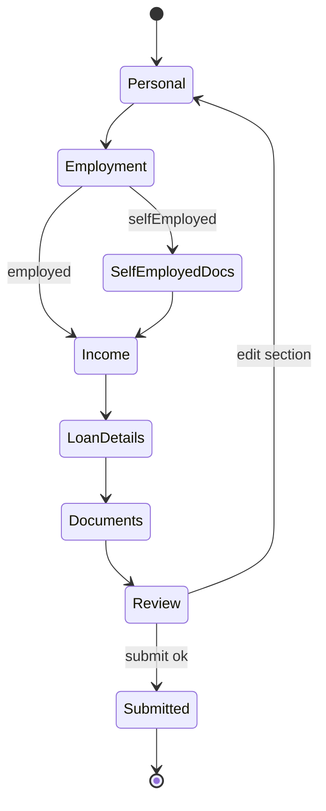

Schema per step (zod shown; any schema library works):

```ts
import { z } from 'zod';

const personal = z.object({
  firstName: z.string().min(1, 'Required'),
  lastName: z.string().min(1, 'Required'),
  dateOfBirth: z.string().regex(/^\d{4}-\d{2}-\d{2}$/),
});

const employment = z.discriminatedUnion('employmentType', [
  z.object({ employmentType: z.literal('employed'), employerName: z.string().min(1) }),
  z.object({ employmentType: z.literal('selfEmployed'), businessName: z.string().min(1), yearsTrading: z.number().int().min(0) }),
]);

const loanDetails = z.object({
  amountCents: z.number().int().min(100_000).max(5_000_000_00),
  termMonths: z.union([z.literal(12), z.literal(24), z.literal(36), z.literal(60)]),
});

type Application = z.infer<typeof personal> & z.infer<typeof employment> & z.infer<typeof loanDetails>;

const steps = [
  { id: 'personal', schema: personal, applies: () => true },
  { id: 'employment', schema: employment, applies: () => true },
  { id: 'selfEmployedDocs', schema: z.object({ taxReturnFileId: z.string() }),
    applies: (a: Partial<Application>) => a.employmentType === 'selfEmployed' },
  { id: 'loanDetails', schema: loanDetails, applies: () => true },
] as const;

const activeSteps = (a: Partial<Application>) => steps.filter((s) => s.applies(a));
```

Validation runs on the current step's schema on "Next"; on submit, validate every active step and drop fields that belong to inactive branches.

Autosave:

```ts
function useDraftAutosave(applicationId: string, values: unknown) {
  const save = useMutation({
    mutationFn: (v: unknown) => api.put(`/applications/${applicationId}/draft`, v),
  });
  useEffect(() => {
    const t = setTimeout(() => save.mutate(values), 1500);
    return () => clearTimeout(t);
  }, [values]);   // values must be a stable snapshot (e.g. from watch() serialized), not a new object each render
  return save.status;   // show "Saved" / "Saving..." / "Couldn't save" indicator
}
```

The draft endpoint stores a version; if two tabs edit, the server rejects older versions and the UI asks which to keep.

Routing: each step has a URL (`/apply/:id/employment`) so back/forward buttons work and analytics can measure drop-off per step. Guard routes: if the user deep-links to step 5 with step 2 incomplete, redirect to the first incomplete step.

Documents: upload as soon as the file is chosen (see the file manager design), store only the returned `fileId` in the form.

Submit: `POST /applications/:id/submit` with an `Idempotency-Key` header so a double click or retry does not create two applications. Disable the button while pending, but rely on the key, not the button.

Accessibility: a step indicator with `aria-current="step"`; on "Next" with errors, move focus to an error summary at the top that links to each invalid field; each input has `aria-invalid` and `aria-describedby` pointing to its error. Do not rely on placeholder text as a label.

Money fields: store `amountCents` as an integer; parse locale input ("12,500.00" vs "12.500,00") into cents carefully; display with `Intl.NumberFormat`.

**Trade-offs:**
- Server drafts enable cross-device resume but store PII earlier, which needs retention rules and encryption.
- One big form model is simpler than per-step forms but needs field-level subscriptions for performance.
- A formal state machine library (XState) is clearer for complex branching; a step array with `applies` is enough for most cases.

**What interviewers listen for:**
- Schema-driven validation and branch-aware submission.
- Autosave with status indicator and version conflict handling.
- Idempotent final submit and server-side re-validation.
- Error summary and focus management.
- Red flags: one `useState` holding 80 fields, validating hidden fields, trusting client validation.

> **Finance tip:** Record which version of consent and disclosure text the user accepted, with a timestamp, in the submit payload. Regulators may ask what the applicant saw.

#### Q: [Senior] Design a file manager: folder tree, list and grid views, drag-and-drop upload of files up to 5GB, progress, pause/resume, and previews.

**Short answer:** Upload directly from the browser to object storage using presigned multipart URLs, so large files never pass through our API servers. A client upload queue limits concurrency, tracks progress per part, retries failed parts, and resumes from the parts the server already has. The browsing UI is a normal paginated, virtualized list with optimistic moves and renames.

**Clarify first:**
- Max file size and typical size? Number of files per folder?
- Resume after a page refresh or only after a network blip?
- Virus scanning or content checks before files become available?
- Sharing and permissions per folder?
- Mobile support (camera uploads)?

**Diagnose:** Typical failures: uploads through the API server time out or exhaust memory; `XMLHttpRequest`/`fetch` of a 5GB body fails at 90% and restarts from zero; the browser freezes when reading a large file into memory; dropping 2,000 files spawns 2,000 parallel requests.

**Solution:**

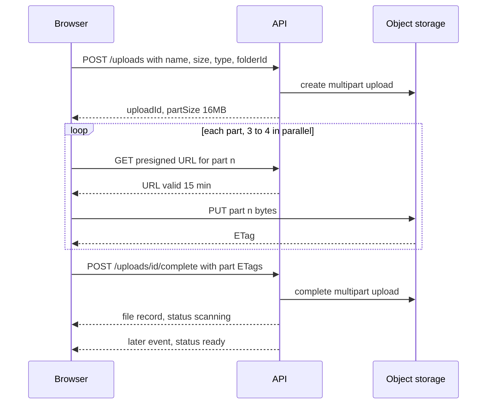

Upload queue:

```ts
type UploadTask = {
  id: string; file: File; folderId: string;
  uploadId?: string; partSize: number; doneParts: Map<number, string>;   // partNumber -> ETag
  status: 'queued' | 'uploading' | 'paused' | 'failed' | 'done';
  bytesSent: number;
};

async function uploadPart(task: UploadTask, partNumber: number, signal: AbortSignal) {
  const start = (partNumber - 1) * task.partSize;
  const blob = task.file.slice(start, Math.min(start + task.partSize, task.file.size)); // no full read into memory
  const { url } = await api.get(`/uploads/${task.uploadId}/parts/${partNumber}/url`);
  for (let attempt = 0; attempt < 4; attempt++) {
    try {
      const res = await fetch(url, { method: 'PUT', body: blob, signal });
      if (!res.ok) throw new Error(`part ${partNumber} failed: ${res.status}`);
      const etag = res.headers.get('ETag');   // storage CORS must expose the ETag header
      if (!etag) throw new Error('missing ETag');
      task.doneParts.set(partNumber, etag);
      return;
    } catch (e) {
      if (signal.aborted) throw e;
      await new Promise((r) => setTimeout(r, 2 ** attempt * 500 + Math.random() * 250));
    }
  }
  throw new Error(`part ${partNumber} gave up`);
}
```

Progress: `fetch` does not report upload progress in a widely supported way, so either count completed parts (coarse but simple) or use `XMLHttpRequest` with `xhr.upload.onprogress` per part for smooth bars.

Concurrency: a global pool, for example 4 parts in flight across all files. Small files can skip multipart and use a single presigned PUT.

Pause and resume: pause aborts in-flight parts via `AbortController`. Resume after refresh: persist `{ uploadId, fileName, size, lastModified, doneParts }` in IndexedDB; on return, ask the user to re-select the file (browsers do not let you reopen a file path), match it by name, size and `lastModified`, then ask the server which parts exist (`ListParts`) and continue.

Integrity: compute a checksum per part if the storage supports it, or rely on ETags. Hashing a 5GB file fully in the browser is slow; do it in a Web Worker if required.

Browsing: folder contents via cursor pagination, virtualized grid. Thumbnails generated server-side after upload. Moves and renames are optimistic with rollback. Drag-and-drop between folders also needs a keyboard alternative ("Move to..." menu).

Previews: images natively, PDFs with a viewer, other types by server-generated preview. Serve user files from a separate domain or with `Content-Disposition: attachment` to avoid stored XSS through uploaded HTML/SVG.

Accessibility: the drop zone is also a button that opens the file picker; progress uses `role="progressbar"` with `aria-valuenow`; announce completion and failures in a polite live region.

**Trade-offs:**
- Direct-to-storage needs CORS setup, presign endpoints and a cleanup job for abandoned multipart uploads (lifecycle rule), but removes servers from the data path.
- Smaller parts mean better retry granularity but more requests; storage services set minimum part sizes (5MB for S3 except the last part) and a max part count (10,000 for S3), so a 5GB file at 16MB is about 320 parts.
- Resumable protocols like tus are an alternative with their own server.

**What interviewers listen for:**
- Presigned multipart upload and why the API server is not in the data path.
- `File.slice`, bounded concurrency, retries with backoff, resume via persisted state.
- Post-upload scanning state and safe serving of user content.
- Red flags: reading the file with `FileReader.readAsDataURL`, base64 in JSON, unlimited parallel requests.

#### Q: [Senior] Design an offline-capable PWA for field agents who collect loan applications and customer KYC photos in areas with no signal for hours.

**Short answer:** App shell cached by a service worker, reference data cached in IndexedDB, every user action written locally first to an outbox, and a sync engine that uploads in order when the network returns. Conflicts are rare by design (agents own their own records) and handled with server versions. Photos are compressed and stored as blobs until uploaded.

**Clarify first:**
- How long offline? Hours or days? How many records and photos per day?
- Devices: low-end Android with limited storage? Which browsers? (iOS Safari has stricter storage and background limits.)
- Which data must be available offline: product catalog, customer list, previous applications?
- Can two agents edit the same customer? Who wins?
- Security: shared devices, lost devices, PII at rest.

**Diagnose:** Check: does the app load with the network disabled (DevTools Application panel, "Offline")? Is storage persistent or best-effort (`navigator.storage.persisted()`)? How much quota is used (`navigator.storage.estimate()`)? What happens if the tab is killed mid-sync?

**Solution:**

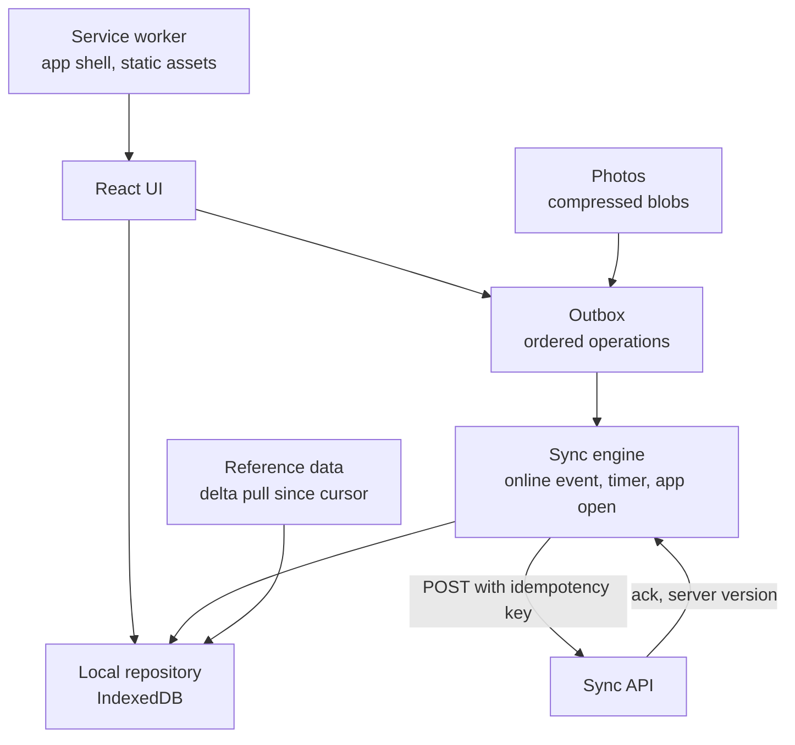

Outbox operation:

```ts
interface OutboxOp {
  opId: string;                 // UUID, used as Idempotency-Key
  entity: 'application' | 'customer' | 'photo';
  entityId: string;             // client-generated UUID so records exist before the server sees them
  type: 'create' | 'update';
  baseVersion: number | null;   // server version this edit was based on
  payload: unknown;
  createdAt: number;
  attempts: number;
}

async function drainOutbox(db: IDBPDatabase) {
  const ops = await db.getAllFromIndex('outbox', 'by-createdAt');
  for (const op of ops) {
    try {
      const res = await fetch(`/api/sync/${op.entity}`, {
        method: 'POST',
        headers: { 'Content-Type': 'application/json', 'Idempotency-Key': op.opId },
        body: JSON.stringify(op),
      });
      if (res.status === 409) { await markConflict(db, op, await res.json()); continue; }
      if (!res.ok) throw new Error(String(res.status));
      const { version } = await res.json();
      await db.put('records', { ...(await db.get('records', op.entityId)), version, syncState: 'synced' });
      await db.delete('outbox', op.opId);
    } catch {
      await db.put('outbox', { ...op, attempts: op.attempts + 1 });
      break;   // keep order: stop and retry later
    }
  }
}
```

(`IDBPDatabase` is from the `idb` wrapper library.)

Triggers for sync: app start, the `online` event, a periodic timer while open, and Background Sync where supported. Background Sync is Chromium-only, so never depend on it; treat it as a bonus.

Photos: resize and compress with a canvas or `createImageBitmap` to around 1600px JPEG before storing; a 12MP phone photo drops from ~4MB to ~300KB. Upload photos as separate operations with the multipart pattern for large files.

Storage: call `navigator.storage.persist()` to reduce eviction risk, show used storage, and warn before quota runs out. Never delete local records until the server ack is stored.

Conflicts: server compares `baseVersion` with current version. Agent-owned records rarely conflict; for shared customer records, apply field-level merge where possible and show a conflict screen otherwise.

Security: PII at rest on a device is the big risk. Keep the Okta (or other) session short, require re-auth after inactivity, and consider encrypting sensitive IndexedDB fields with a key derived at login (Web Crypto) so a lost device with an expired session does not expose data. Clear local data on logout after sync completes. Admit the limit: browser storage encryption is defense in depth, not a guarantee.

UX: a clear sync status ("12 items waiting, last synced 10:42"), per-record badges (pending, synced, conflict), and a manual "Sync now" button.

Service worker update: new versions wait until the agent finishes; show "Update available, reload" rather than swapping code mid-application.

**Trade-offs:**
- Offline-first adds a local data layer and sync protocol: large engineering cost, justified only by real offline needs.
- Strict ordering is simple and safe but one poison operation blocks the queue; move ops that fail repeatedly with 4xx to a "needs attention" list.
- A native app would get better background sync and storage guarantees; PWA wins on distribution and one codebase.

**What interviewers listen for:**
- Local-first writes with client-generated IDs and an outbox.
- Idempotency keys on sync, versioned conflicts.
- Honest browser limits (iOS, Background Sync, quota).
- PII-at-rest and lost-device thinking.
- Red flags: "the service worker caches API responses" as the whole answer, no conflict strategy, deleting local data before ack.

> **Gotcha:** Caching GET responses in the service worker makes reads work offline, but writes are the real problem. Offline design is mostly about the outbox.

## 5. Platform design

#### Q: [Staff] Design a design system and component library used by 6 product teams across 4 React apps, with theming per brand, accessibility guarantees and safe upgrades.

**Short answer:** Three layers: design tokens (colors, spacing, type) as the single source of truth, unstyled or lightly styled accessible primitives, and composed product components on top. Ship as a versioned package with semver, codemods for breaking changes, visual regression tests and automated a11y checks in CI. Governance matters as much as code: a clear contribution model and adoption metrics.

**Clarify first:**
- Are the apps on the same React version and build tool? Any SSR (Next.js) or micro-frontends?
- How many brands or themes, and do they need runtime switching (dark mode, white-label)?
- Is there a Figma library already? Who owns design tokens?
- Team size for the platform and expected contribution from product teams?
- Accessibility target (WCAG 2.2 AA) and legal requirements?

**Diagnose:** Before designing, measure the current state: count duplicate components across repos (for example 9 different date pickers), collect a11y audit results (axe), check bundle impact of existing UI libraries, and interview teams about pain (upgrade fear, missing components, slow review).

**Solution:**

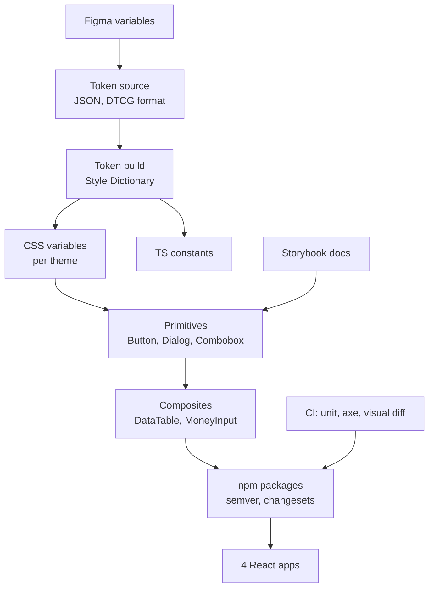

Tokens: define semantic tokens (`color.text.primary`, `color.bg.danger`) that map to raw palette values per theme. Components only use semantic tokens, so a new brand is a new mapping, not new components.

```css
:root { --color-bg-surface: #ffffff; --color-text-primary: #111827; --radius-md: 8px; }
[data-theme='dark'] { --color-bg-surface: #0b1220; --color-text-primary: #e5e7eb; }
[data-brand='partner'] { --color-action-primary: #0a7d4f; }
```

CSS variables give runtime theming without re-rendering React and work with SSR.

Component API principles:

```tsx
// Composition over configuration; forward refs; pass through native props.
type ButtonProps = React.ButtonHTMLAttributes<HTMLButtonElement> & {
  variant?: 'primary' | 'secondary' | 'danger';
  size?: 'sm' | 'md';
  loading?: boolean;
};

export const Button = React.forwardRef<HTMLButtonElement, ButtonProps>(
  ({ variant = 'primary', size = 'md', loading = false, disabled, children, ...rest }, ref) => (
    <button
      ref={ref}
      className={cx('ds-btn', `ds-btn--${variant}`, `ds-btn--${size}`)}
      disabled={disabled || loading}
      aria-busy={loading || undefined}
      {...rest}
    >
      {loading ? <Spinner aria-hidden /> : null}
      {children}
    </button>
  ),
);
```

In React 19, `ref` is available as a normal prop for function components and `forwardRef` is no longer needed, but it still works; pick based on the oldest React version your consumers use.

Accessibility guarantees: build complex widgets (Dialog, Menu, Combobox, Tabs) on a proven headless library (for example Radix UI or React Aria) instead of re-implementing focus traps and keyboard models. Every component's story runs axe in CI, plus keyboard interaction tests with Testing Library.

Packaging: ESM output, `sideEffects` set so unused components tree-shake, CSS shipped per component or as one file with clear import guidance, React as a `peerDependency`. Use changesets for versioning and changelogs.

Safe upgrades:
- Semver strictly: breaking prop changes only in majors.
- Deprecate first: console warnings in development for one minor cycle.
- Ship codemods (jscodeshift) for renames.
- Visual regression tests (Chromatic, Playwright screenshots) on every PR.
- Track adoption: script that scans app repos for component imports and versions.

Governance: a core team owns primitives; product teams contribute composites through an RFC and review. "Inner source" with clear criteria (used by at least 2 teams) prevents the library from becoming a dumping ground.

**Trade-offs:**
- Headless primitives plus tokens give flexibility but require teams to compose more; fully styled components are faster to adopt but harder to brand.
- A monorepo for the library is easy; forcing all apps into one monorepo is a bigger organizational decision.
- CSS-in-JS with runtime styles is losing favor for SSR and performance reasons; CSS variables with CSS Modules or a utility system are common choices in 2026.

**What interviewers listen for:**
- Token layering (raw to semantic) and theming via CSS variables.
- Using proven a11y primitives and testing them automatically.
- Versioning, deprecation, codemods and visual regression as an upgrade story.
- Governance and adoption metrics, not only code.
- Red flags: copying components between repos, one giant `Button` with 40 props, no a11y testing, breaking changes in minors.

> **Interview tip:** At Staff level, the interviewer wants to hear about people and process: how six teams adopt it, who decides, and how you measure success (fewer duplicate components, a11y issues trending down, upgrade lag).
