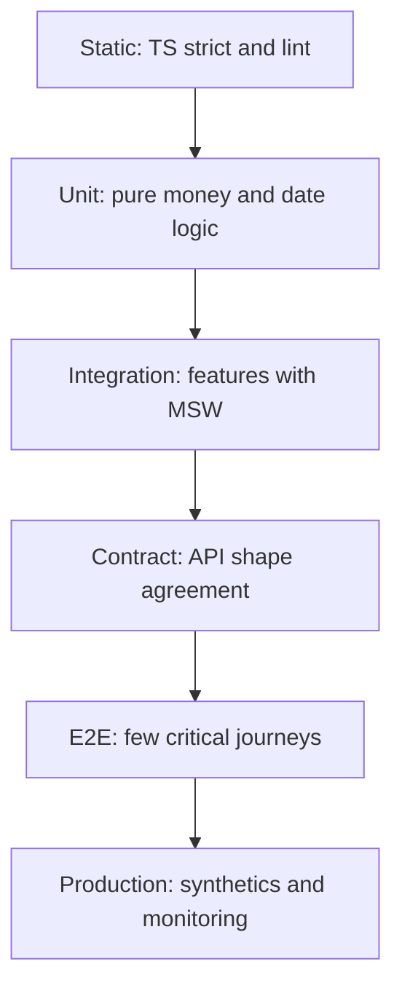
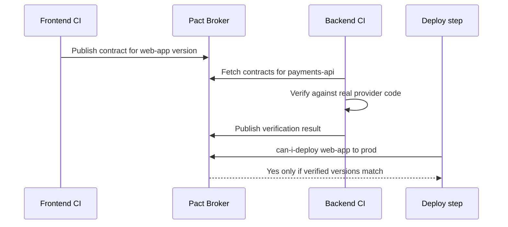
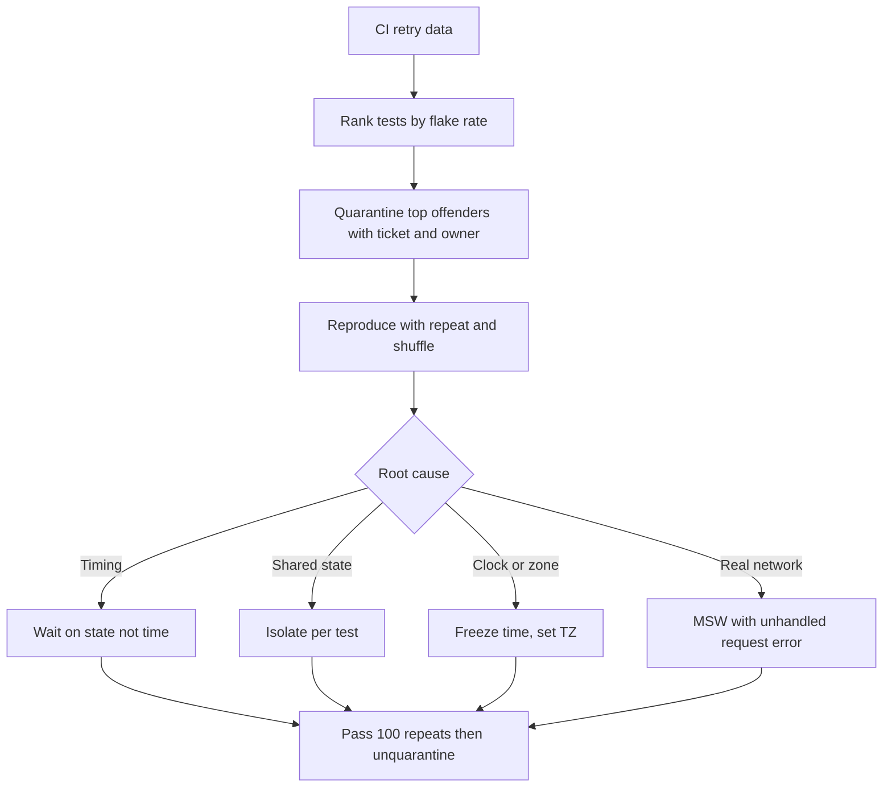
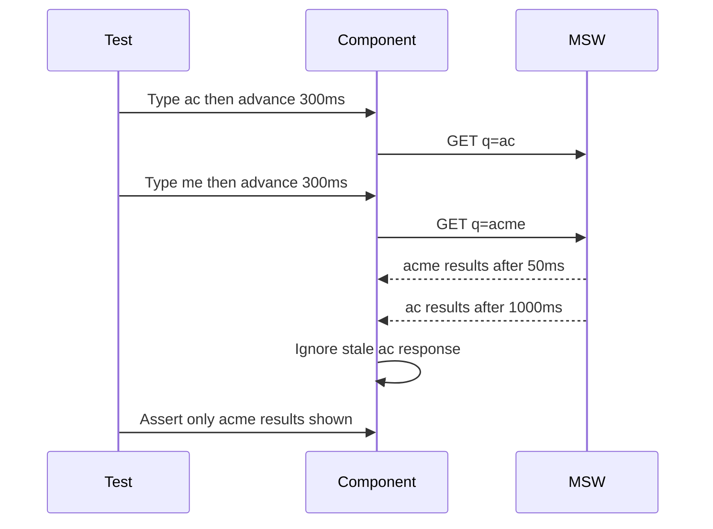
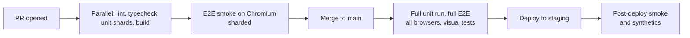
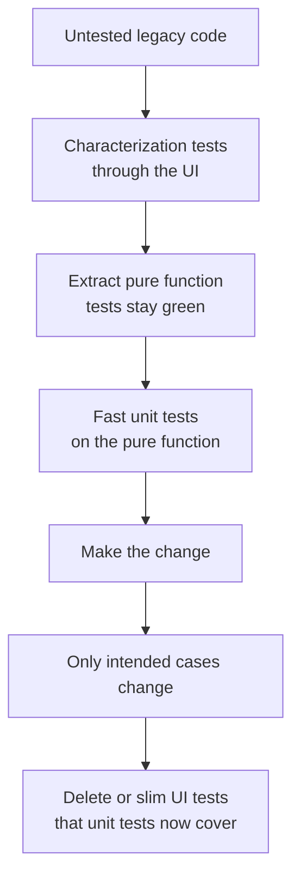
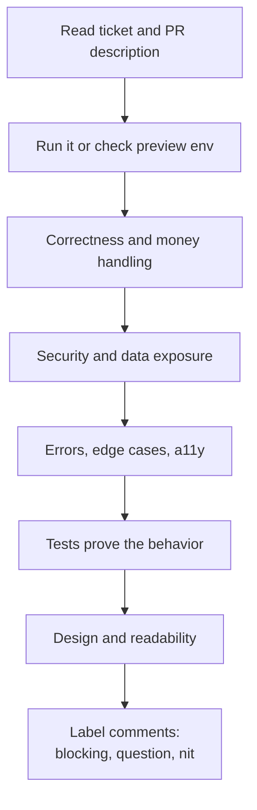
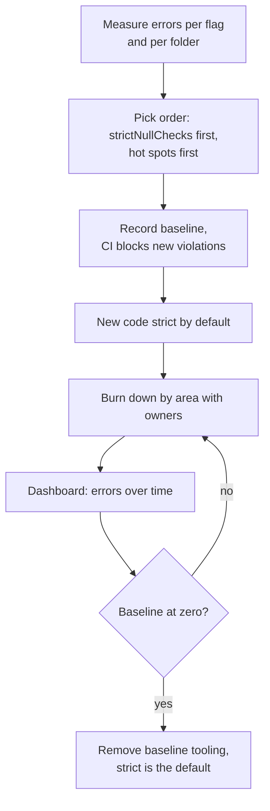
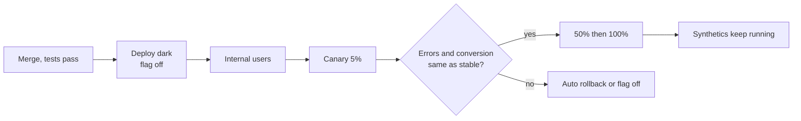

## 1. Designing a Test Strategy

#### Q: [Staff] You are the first senior engineer on a new React money-movement app (accounts, transfers, bill pay). Design the test strategy. Pyramid or trophy?

**Short answer:** I would start from risk, not from a shape. For a React app with thin UI logic and a lot of wiring, the "testing trophy" fits best: static checks (TypeScript, lint) as the base, a lot of integration tests that render real components with a mocked network, a few unit tests for pure money and date logic, and a small set of end-to-end tests for the money-moving journeys. The classic pyramid's "mostly unit tests" advice came from backend code where units carry the logic; in React UIs, isolated unit tests of components often test implementation details and miss wiring bugs.

**Clarify first:**
- What is the cost of a bug? A wrong transfer amount is a regulatory and trust incident; a misaligned icon is not. Risk decides where tests go.
- What does the backend give us: a stable OpenAPI spec, a staging environment, test accounts?
- Team size and skill with testing? A strategy the team will not follow is worse than a simple one they will.
- Release cadence: daily deploys need faster, more automated confidence than monthly releases.

**Diagnose:** For a new app, "diagnose" means a risk map. List the top journeys (log in with Okta, view balances, transfer between own accounts, pay a bill, download a statement) and the top failure modes (wrong amount, double submit, wrong account, stale balance, timezone date errors, auth expiry mid-flow). Each failure mode gets a test at the cheapest level that can catch it.

**Solution:**

| Layer | Tool | What goes here | Rough share of effort |
|---|---|---|---|
| Static | TypeScript strict, ESLint, typescript-eslint | Typos, null bugs, unhandled promises, hook rule violations | Always on |
| Unit | Vitest | Money math, formatting, validation rules, reducers, date helpers | ~20% |
| Integration | Vitest + Testing Library + MSW | A page or feature rendered with real providers, router, query client; network mocked at HTTP level | ~60% |
| Contract | Pact or OpenAPI schema checks | Frontend expectations vs real API shapes | Per API |
| E2E | Playwright | 5 to 15 critical journeys against a deployed environment | ~15% |
| Production | Synthetic checks, RUM, error tracking | Is it working right now for real users | Ongoing |



An integration test example, the core of the strategy:

```tsx
// TransferForm.test.tsx
import { render, screen } from "@testing-library/react";
import userEvent from "@testing-library/user-event";
import { http, HttpResponse } from "msw";
import { server } from "../test/server";
import { renderWithProviders } from "../test/render";

test("submits a transfer once with an idempotency key and shows confirmation", async () => {
  const user = userEvent.setup();
  const requests: Request[] = [];
  server.use(
    http.post("/api/transfers", async ({ request }) => {
      requests.push(request.clone());
      return HttpResponse.json({ id: "tr_1", status: "PENDING" }, { status: 201 });
    })
  );

  renderWithProviders(<TransferForm />);
  await user.selectOptions(screen.getByLabelText(/from account/i), "chk_1");
  await user.selectOptions(screen.getByLabelText(/to account/i), "sav_1");
  await user.type(screen.getByLabelText(/amount/i), "250.00");
  await user.dblClick(screen.getByRole("button", { name: /transfer/i })); // double click on purpose

  expect(await screen.findByText(/transfer submitted/i)).toBeInTheDocument();
  expect(requests).toHaveLength(1);
  const body = await requests[0].json();
  expect(body).toMatchObject({ fromAccountId: "chk_1", toAccountId: "sav_1", amountMinor: 25000 });
  expect(requests[0].headers.get("Idempotency-Key")).toBeTruthy();
});
```

This one test covers form wiring, validation, amount parsing into minor units, double-submit protection, the API contract the component uses, and the success UI. A unit test of `TransferForm` with mocked hooks would cover none of that.

Ground rules to write down:
- Query by role and label, as users do. Avoid test IDs unless there is no accessible name.
- Mock the network, not your own modules.
- Every bug fix comes with a test that fails before the fix.
- E2E tests are for journeys, not for every validation message.
- Tests must pass 100 times in a row before merge for anything touching async flows (run with `--repeat-each` in Playwright, or a loop in Vitest during review).

**Trade-offs:** Integration-heavy suites run slower than pure unit tests (jsdom rendering) and failures point to a feature, not a line. Fewer E2E tests mean some cross-system bugs reach staging; contract tests and synthetics close that gap. The trophy needs good test utilities (`renderWithProviders`, MSW handlers) built early, which is setup time on a new project.

**What interviewers listen for:**
- Starts from risk and journeys, not percentages.
- Knows why the trophy fits React UIs and when the pyramid still applies (pure logic, backend services).
- Network-level mocking for integration tests.
- Production monitoring as part of the strategy.
- Red flag: "we will aim for 100% unit test coverage" or "we will test everything with E2E".

> **Interview tip:** Say "the shape follows the risk". Then give one concrete failure mode and say where you would catch it. That beats reciting the pyramid.

#### Q: [Mid] For a payments feature, how do you decide what to unit test, what to integration test, and what to E2E test?

**Short answer:** Unit test pure logic with many input cases (amount parsing, fee calculation, date rules). Integration test user-visible behavior of a feature with the network mocked (form validation, loading and error states, what gets sent). E2E test the few journeys where the real browser, real backend and real auth must all work together (log in, pay a bill end to end).

**Clarify first:** Is there logic in the frontend at all, or does the server calculate fees? Is there a stable test environment for E2E? How long does the current suite take?

**Diagnose:** Look at a bug list from the last six months and ask, for each bug: which cheapest test would have caught it? That tells you where your gaps are better than any rule.

**Solution:**

Unit: table-driven tests for logic with edge cases.

```ts
// parseAmount.test.ts
import { parseAmount } from "./money";

test.each([
  ["1,234.56", "en-US", "USD", 123456],
  ["1.234,56", "de-DE", "EUR", 123456],
  ["1234", "ja-JP", "JPY", 1234],
  ["0.1", "en-US", "USD", 10],
  ["10.555", "en-US", "USD", null], // too many decimals: reject, do not round
  ["abc", "en-US", "USD", null],
])("parseAmount(%s, %s, %s) -> %s", (input, locale, currency, expected) => {
  expect(parseAmount(input, locale, currency)).toBe(expected);
});
```

Integration: one feature, real components, mocked HTTP.
- Shows a field error when the amount exceeds the available balance.
- Disables submit while the request is in flight.
- Shows a translated message for `DAILY_LIMIT_EXCEEDED`.
- Refetches the balance after success.

E2E: only journeys.
- Log in, pay a bill, see it in recent activity.
- Session expiry mid-form does not lose input (or behaves as designed).

A useful question for each candidate test: "If this breaks, would a user notice, and which layer is the cheapest place to see it?"

**Trade-offs:** Pushing a check down to unit level makes it fast and precise but can miss wiring. Pushing it up to E2E makes it realistic but slow and flaky. Duplicating the same check at every level wastes CI time and makes refactors painful.

**What interviewers listen for:**
- Table-driven unit tests for edge cases.
- Integration tests assert what the user sees and what is sent over the wire.
- E2E kept to journeys.
- Uses past bugs to guide coverage.
- Red flag: testing that `useState` was called, or snapshotting entire pages.

#### Q: [Senior] Management wants a 90% coverage gate on every PR. What do you say?

**Short answer:** Coverage tells you which code is not tested; it does not tell you that tested code is tested well. A hard high gate makes people write assertion-free tests to hit the number, and 100% is especially wasteful because the last 10% is usually glue, error branches for impossible states, and generated code. I would propose a moderate floor on changed code, focus on risk areas, and use mutation testing or bug escape rates to measure test quality.

**Clarify first:** What problem triggered this? Usually a production bug. Was that bug in untested code, or in code that had tests that did not check the right thing? The answer shapes the fix.

**Diagnose:**
- Look at coverage by directory. 40% overall may hide 95% in `money/` and 10% in `admin/`, which might be fine.
- Find tests with no assertions or only `toBeTruthy()` on a render. These inflate coverage.
- Run mutation testing (Stryker supports JS and TS) on a critical module. It changes code (flips `>` to `>=`, removes a line) and checks if any test fails. Surviving mutants show weak tests.

```ts
// 100% line coverage, zero value
test("renders", () => {
  render(<FeeCalculator amountMinor={10000} />);
  // no assertion
});

// Lower coverage, real value
test("charges 1% fee capped at $10", () => {
  expect(calcFeeMinor(50_000)).toBe(500);
  expect(calcFeeMinor(2_000_000)).toBe(1_000); // cap
  expect(calcFeeMinor(0)).toBe(0);
});
```

**Solution:**
1. Coverage on changed lines (diff coverage) with a reasonable floor, say 80%, rather than a global number. Tools like Codecov or the CI's coverage reports support patch coverage checks.
2. Higher bar, plus mutation testing, for critical modules (money math, permission checks, date rules).
3. Exclude generated code, stories and type-only files from coverage.
4. Track outcome metrics: escaped bugs per release, time to detect, flaky test rate.
5. Review tests in code review as seriously as code.

```ts
// vitest.config.ts
export default defineConfig({
  test: {
    coverage: {
      provider: "v8",
      include: ["src/**/*.{ts,tsx}"],
      exclude: ["src/**/*.stories.tsx", "src/**/generated/**", "src/**/*.d.ts"],
      thresholds: {
        "src/money/**": { lines: 95, branches: 90 },
        lines: 70, // global floor, a ratchet you raise over time
      },
    },
  },
});
```

**Trade-offs:** Diff coverage is fairer but can be gamed the same way. Mutation testing is slow, so run it nightly or only on critical folders. No gate at all lets coverage rot in fast-moving teams.

**What interviewers listen for:**
- Coverage as a gap finder, not a quality measure.
- Concrete alternative: diff coverage, per-module thresholds, mutation testing.
- Ties it back to the bug that prompted the request.
- Red flag: "100% coverage means no bugs", or the opposite extreme "coverage is useless".

#### Q: [Senior] Our E2E suite against staging breaks every time the backend team renames a field, and it takes 40 minutes. Should contract tests replace some E2E tests?

**Short answer:** Yes, for the job of checking that frontend and backend agree on API shapes. Consumer-driven contract tests (Pact) let the frontend record what it expects from each endpoint, and the backend verifies those expectations in its own CI before it deploys. Field renames get caught in the backend's pipeline in minutes, not in our E2E run after the fact. Keep a small E2E suite for journeys; stop using E2E as a schema checker.

**Clarify first:**
- Do teams deploy independently? Contract testing pays off most when they do.
- Is there an OpenAPI spec that is generated from backend code? If yes, a cheaper first step is generating frontend types and validating mocks against the spec.
- Who will own the Pact Broker (or PactFlow) and the verification step on the backend?

**Diagnose:** Categorize the last 30 E2E failures: how many were API shape mismatches, how many were environment problems (staging down, test data missing), how many were real UI bugs, how many were flakes? Typically the real UI bugs are a minority.

**Solution:**

Option 1, schema-first: generate TypeScript types and a client from the OpenAPI spec (`openapi-typescript`, Orval), and validate MSW mock responses against the same spec in tests. Drift in the spec becomes a type error.

Option 2, consumer-driven contracts with Pact:

```ts
// payments.pact.test.ts, consumer side (Pact JS V3 API)
import { PactV3, MatchersV3 } from "@pact-foundation/pact";
const { like, integer, string } = MatchersV3;

const provider = new PactV3({ consumer: "web-app", provider: "payments-api" });

test("get transfer by id", async () => {
  provider
    .given("transfer tr_1 exists")
    .uponReceiving("a request for transfer tr_1")
    .withRequest({ method: "GET", path: "/api/transfers/tr_1" })
    .willRespondWith({
      status: 200,
      body: like({
        id: string("tr_1"),
        amountMinor: integer(25000),
        currency: string("USD"),
        status: string("PENDING"),
      }),
    });

  await provider.executeTest(async (mock) => {
    const api = createApiClient(mock.url);
    const t = await api.getTransfer("tr_1");
    expect(t.amountMinor).toBe(25000);
  });
});
```

The generated pact file is published to a broker. The backend runs provider verification against it. Before either side deploys, `can-i-deploy` checks that the versions in the target environment are compatible.



Then shrink E2E to 5 to 15 journeys, run them on deploy to staging and as synthetics in production.

**Trade-offs:** Pact needs buy-in from backend teams and a broker; without the provider verification step it is just a fancy mock. Contracts check shape and some semantics, not full business flows. Schema-first is cheaper but only works if the spec is truthful (generated from code, not hand-written).

**What interviewers listen for:**
- Different tests answer different questions: shape agreement vs journey works.
- Knows consumer-driven means the consumer writes expectations and the provider verifies.
- Mentions `can-i-deploy` or equivalent gating.
- Reduces E2E deliberately, does not delete it.
- Red flag: "just make the backend team stop renaming fields".

## 2. Writing Reliable Tests

#### Q: [Senior] 8% of CI runs fail on a random test and pass on retry. The team just clicks "re-run". How do you fix the flakiness?

**Short answer:** Treat flakiness as a bug with a backlog, not as noise. Measure which tests flake, quarantine the worst ones so the main pipeline is trustworthy again, then fix the root causes, which are usually a short list: waiting on time instead of state, shared state between tests, test order dependence, unmocked network or real timers, animation timing, and environment differences (time zone, CPU speed).

**Clarify first:** Unit, integration or E2E flakes? Does it happen more under parallel runs? Is there a pattern by runner type or time of day (tests that depend on the current date flake at midnight or at month end)?

**Diagnose:**
1. Collect data: most CI systems and Playwright's reporters record retries. Rank tests by flake rate.
2. Reproduce locally by repetition: `npx playwright test transfer.spec.ts --repeat-each=50 --workers=4` or `vitest run TransferForm --sequence.shuffle` in a loop.
3. Shuffle order to expose shared state: Vitest `--sequence.shuffle`, Jest `--randomize`.
4. Slow the machine down: Chrome DevTools CPU throttling for manual repro, or run with fewer CPU cores in Docker.
5. For Playwright, open the trace of a failed run (`trace: "on-first-retry"`) to see DOM snapshots, network and console at each step.

Common causes and fixes:

```ts
// 1. Fixed sleeps. Flaky on slow CI.
await page.waitForTimeout(2000);
await page.click("#submit");
// Fix: wait for state with web-first assertions (auto-retrying).
await expect(page.getByRole("button", { name: "Submit" })).toBeEnabled();
await page.getByRole("button", { name: "Submit" }).click();

// 2. Asserting before async UI settles (Testing Library).
expect(screen.getByText("Saved")).toBeInTheDocument(); // may run too early
// Fix:
expect(await screen.findByText("Saved")).toBeInTheDocument();

// 3. Shared module state across tests (a query cache created once at module level).
const queryClient = new QueryClient(); // shared: cached data leaks between tests
// Fix: new client per test, retries off.
function createTestQueryClient() {
  return new QueryClient({ defaultOptions: { queries: { retry: false } } });
}

// 4. MSW overrides not reset.
afterEach(() => server.resetHandlers());

// 5. Depends on the real clock.
expect(formatDueLabel(due)).toBe("Due tomorrow"); // fails at 23:59 UTC
// Fix:
vi.setSystemTime(new Date("2026-04-14T12:00:00Z"));
```

6. E2E shared data: two parallel tests use the same test user and one changes its balance. Fix by creating data per test via API in a fixture, or giving each worker its own account.

```ts
// playwright fixture: isolated account per test
export const test = base.extend<{ account: TestAccount }>({
  account: async ({ request }, use) => {
    const res = await request.post("/test-api/accounts", { data: { balanceMinor: 100_000 } });
    const account = (await res.json()) as TestAccount;
    await use(account);
    await request.delete(`/test-api/accounts/${account.id}`);
  },
});
```

**Solution (process):**



Rules that stop new flakes: `onUnhandledRequest: "error"` in MSW, ESLint rules from `eslint-plugin-testing-library` (for example preferring `findBy` over `waitFor` + `getBy`), no `waitForTimeout` in Playwright (lint for it), and a "new tests must pass `--repeat-each=20`" check for new E2E specs.

**Trade-offs:** Quarantine restores trust quickly but risks forgetting tests forever; give each one an owner and an expiry. Automatic retries hide flakes; allow one retry in CI only if flakes are still reported and tracked. Per-test data creation makes E2E slower but removes a whole class of failures.

**What interviewers listen for:**
- Measurement first, then quarantine, then root-cause fixes.
- A concrete list of root causes with concrete fixes.
- Uses traces and repetition to reproduce.
- Process to prevent new flakes.
- Red flag: "increase the timeout" or "add retries: 3" as the fix.

#### Q: [Senior] Should we mock API calls with MSW or with `jest.mock("../api")`? When would you use each?

**Short answer:** Default to MSW for anything that renders components: it intercepts at the network level, so your real fetch client, interceptors (auth headers, Okta token refresh), React Query or Redux logic, and error parsing all run in the test. Use module mocks for things that are not network: a third-party SDK that touches globals, analytics, a heavy chart library, or a time source. Mocking your own data hooks hides exactly the bugs you want to catch.

**Clarify first:** What HTTP client do we use (fetch, axios)? Is there an OpenAPI spec we could generate handlers from? Do the same mocks need to power Storybook and local development too? MSW works in all three.

**Diagnose:** Look at a recent production bug that tests missed. Many come from the layer a module mock skipped: wrong query key, missing header, wrong error shape handling.

**Solution:**

```ts
// test/handlers.ts, shared defaults (MSW v2 API)
import { http, HttpResponse } from "msw";

export const handlers = [
  http.get("/api/accounts", () =>
    HttpResponse.json([
      { id: "chk_1", name: "Checking", balanceMinor: 120_000, currency: "USD" },
      { id: "sav_1", name: "Savings", balanceMinor: 500_000, currency: "USD" },
    ])
  ),
];

// test/server.ts
import { setupServer } from "msw/node";
export const server = setupServer(...handlers);

// vitest.setup.ts
beforeAll(() => server.listen({ onUnhandledRequest: "error" }));
afterEach(() => server.resetHandlers());
afterAll(() => server.close());
```

Per-test overrides for error paths:

```ts
test("shows limit error from API", async () => {
  server.use(
    http.post("/api/transfers", () =>
      HttpResponse.json(
        { code: "DAILY_LIMIT_EXCEEDED", params: { limitMinor: 500_000 } },
        { status: 422 }
      )
    )
  );
  // ...fill form and submit...
  expect(await screen.findByRole("alert")).toHaveTextContent(/daily limit/i);
});

test("network failure", async () => {
  server.use(http.post("/api/transfers", () => HttpResponse.error()));
  // ...
});
```

Module mocks where they fit:

```ts
// Analytics is a side effect we only want to observe.
vi.mock("../analytics", () => ({ track: vi.fn() }));

// A canvas-based chart that jsdom cannot render.
vi.mock("recharts", async (orig) => {
  const actual = await orig<typeof import("recharts")>();
  return { ...actual, ResponsiveContainer: ({ children }: any) => <div style={{ width: 800, height: 400 }}>{children}</div> };
});
```

Rule of thumb: mock at the boundary of your system, not inside it.

**Trade-offs:** MSW tests are a bit slower and need handler upkeep; generated handlers from the spec reduce that. Module mocks are fast and precise but couple tests to file structure, so moving a file breaks tests, and they skip real code paths. Neither checks that mocks match the real API; that is the job of contract or schema tests.

**What interviewers listen for:**
- "Mock at the network boundary" for UI tests.
- `onUnhandledRequest: "error"` and `resetHandlers`.
- Knows the legitimate uses of module mocks.
- Mentions mocks drifting from reality and how to control it.
- Red flag: mocking `useQuery` or your own `useAccounts` hook in every component test.

#### Q: [Senior] How do you test a search box that debounces 300ms and must ignore out-of-order responses?

**Short answer:** Use fake timers to control the debounce, control response order with MSW (delay the first response longer than the second), and assert that only the latest query's results are shown. Configure `userEvent` to advance fake timers, otherwise typing hangs.

**Clarify first:** How does the component handle races: `AbortController`, React Query keys (only the current key's data is shown), or a request counter? The test should verify behavior, not the mechanism, so it survives a refactor.

**Diagnose:** Write the failing test first. A race bug often only shows when the network is slow for the first request. Reproducing that by hand needs Chrome's network throttling and luck; a test makes it deterministic.

**Solution:**

```tsx
import { render, screen, act } from "@testing-library/react";
import userEvent from "@testing-library/user-event";
import { http, HttpResponse, delay } from "msw";

beforeEach(() => vi.useFakeTimers({ shouldAdvanceTime: true }));
afterEach(() => vi.useRealTimers());

test("shows results only for the latest query when responses arrive out of order", async () => {
  server.use(
    http.get("/api/payees", async ({ request }) => {
      const q = new URL(request.url).searchParams.get("q");
      if (q === "ac") await delay(1000); // slow, stale request
      if (q === "acme") await delay(50);  // fast, latest request
      return HttpResponse.json([{ id: q, name: `Result for ${q}` }]);
    })
  );

  const user = userEvent.setup({ advanceTimers: vi.advanceTimersByTime });
  renderWithProviders(<PayeeSearch />);
  const box = screen.getByRole("combobox", { name: /payee/i });

  await user.type(box, "ac");
  await act(() => vi.advanceTimersByTimeAsync(300)); // debounce fires for "ac"
  await user.type(box, "me");
  await act(() => vi.advanceTimersByTimeAsync(300)); // debounce fires for "acme"
  await act(() => vi.advanceTimersByTimeAsync(1100)); // both responses arrive

  expect(await screen.findByText("Result for acme")).toBeInTheDocument();
  expect(screen.queryByText("Result for ac")).not.toBeInTheDocument();
});
```

Notes:
- MSW's `delay()` uses timers; with fake timers you must advance them. `shouldAdvanceTime: true` lets fake time also move with real time, which avoids hangs in libraries that rely on it. Whether you need it depends on your setup; if a test hangs, timers are the first suspect.
- Advance with the async variant (`advanceTimersByTimeAsync`) so promises queued by timers resolve between ticks.
- Also test: typing quickly sends one request, not one per key.

```ts
test("debounces to one request", async () => {
  let calls = 0;
  server.use(http.get("/api/payees", () => { calls++; return HttpResponse.json([]); }));
  const user = userEvent.setup({ advanceTimers: vi.advanceTimersByTime });
  renderWithProviders(<PayeeSearch />);
  await user.type(screen.getByRole("combobox", { name: /payee/i }), "acme");
  await act(() => vi.advanceTimersByTimeAsync(300));
  await vi.waitFor(() => expect(calls).toBe(1));
});
```



**Trade-offs:** Fake timers make tests deterministic but interact badly with some libraries and with `await` chains; you must learn the async advance APIs. Real timers with short debounces are simpler but slower and timing dependent. Testing at E2E level with network throttling is realistic but nondeterministic.

**What interviewers listen for:**
- Deterministic control of time and response order.
- Knows the `userEvent.setup({ advanceTimers })` requirement.
- Asserts behavior (latest wins), not implementation (abort was called).
- Red flag: `await new Promise(r => setTimeout(r, 500))` in tests.

#### Q: [Mid] How do you test a custom hook like `useAccountBalance(accountId)` that uses React Query and an `AuthContext`?

**Short answer:** If the hook is only used by one component, test it through that component. If it is shared and has its own contract, use `renderHook` from `@testing-library/react` with a `wrapper` that provides the real providers (a fresh QueryClient, a test AuthContext value), and mock the network with MSW. Assert on the returned values over time with `waitFor`.

**Clarify first:** What does the hook promise: loading, data, error, refetch on account change? Does it read context that needs a specific value (user, token, locale)?

**Diagnose:** If the hook test needs many mocks of internal modules, the hook may be doing too much; consider splitting pure logic out into a function that can be unit tested.

**Solution:**

```tsx
import { renderHook, waitFor } from "@testing-library/react";
import { QueryClient, QueryClientProvider } from "@tanstack/react-query";

function createWrapper(user = { id: "u1", roles: ["customer"] }) {
  const queryClient = new QueryClient({ defaultOptions: { queries: { retry: false } } });
  return ({ children }: { children: React.ReactNode }) => (
    <QueryClientProvider client={queryClient}>
      <AuthContext.Provider value={{ user, getAccessToken: async () => "test-token" }}>
        {children}
      </AuthContext.Provider>
    </QueryClientProvider>
  );
}

test("loads balance and refetches when account changes", async () => {
  server.use(
    http.get("/api/accounts/:id/balance", ({ params }) =>
      HttpResponse.json({ amountMinor: params.id === "chk_1" ? 1000 : 2000, currency: "USD" })
    )
  );

  const { result, rerender } = renderHook(({ id }) => useAccountBalance(id), {
    initialProps: { id: "chk_1" },
    wrapper: createWrapper(),
  });

  expect(result.current.isLoading).toBe(true);
  await waitFor(() => expect(result.current.data?.amountMinor).toBe(1000));

  rerender({ id: "sav_1" });
  await waitFor(() => expect(result.current.data?.amountMinor).toBe(2000));
});
```

Testing context providers: render the provider with a small test consumer component and assert on what it shows, rather than reaching into the context value.

> **Outdated:** `@testing-library/react-hooks` was the separate package for `renderHook`. Since React 18, `renderHook` lives in `@testing-library/react`, and the old package is deprecated.

**Trade-offs:** Hook tests are fast and focused but can drift from how components use the hook. Component-level tests are more realistic but less precise when they fail. A fresh QueryClient per test costs nothing and prevents cache leaks.

**What interviewers listen for:**
- Real providers in a wrapper, fresh client per test, retries off.
- Network mocked, not the hook's internals.
- `rerender` with new props to test dependency changes.
- Red flag: calling the hook directly outside a component, or mocking `useQuery`.

#### Q: [Mid] A CSS refactor broke the layout of the statements page and no test noticed. How would visual regression testing help, and how do you keep it from being noisy?

**Short answer:** Visual regression tests take screenshots of components or pages and compare them to approved baselines, failing on pixel differences. They catch what DOM assertions cannot: overlapping text, broken spacing, wrong colors. To keep them useful, render in a fixed environment (same OS, fonts, browser, viewport), freeze dynamic data (dates, random IDs, animations), and snapshot components in known states rather than whole live pages.

**Clarify first:** Do we have Storybook? Then a component-level service (Chromatic, Percy) or Storybook's test runner is a natural fit. Otherwise Playwright's `toHaveScreenshot()` works with no extra service. Who approves changes, and is it part of PR review?

**Diagnose:** Find where layout bugs come from: shared CSS, design tokens, third-party component upgrades. Those are the places that need visual coverage.

**Solution:**

```ts
// statements.visual.spec.ts
import { test, expect } from "@playwright/test";

test("statements list", async ({ page }) => {
  await page.clock.setFixedTime(new Date("2026-04-15T10:00:00Z")); // stable "today"
  await page.route("**/api/statements", (route) =>
    route.fulfill({ path: "fixtures/statements.json" }) // stable data
  );
  await page.goto("/statements");
  await expect(page.getByRole("table")).toBeVisible();
  await expect(page).toHaveScreenshot("statements.png", {
    fullPage: true,
    animations: "disabled",
    mask: [page.getByTestId("session-timer")], // hide changing areas
    maxDiffPixelRatio: 0.01,
  });
});
```

Run visual tests inside the official Playwright Docker image in CI, and generate baselines in the same image (`--update-snapshots`). Baselines made on a Mac will not match Linux CI because of font rendering.

Coverage choices: key components in every state (default, error, loading, long text, RTL), plus a handful of full pages at mobile and desktop widths.

**Trade-offs:** Hosted services handle baselines, review UI and cross-browser rendering but cost money. Self-hosted Playwright snapshots are free but baselines live in git and need a consistent environment. Too many full-page snapshots create noise; people start approving diffs blindly, which defeats the purpose.

**What interviewers listen for:**
- Deterministic rendering: fonts, OS, data, time, animations.
- Component states over whole pages.
- A human review step for diffs.
- Red flag: snapshotting the live staging site.

> **Gotcha:** Jest/Vitest DOM snapshots (`toMatchSnapshot()` on HTML) are not visual tests. They break on any markup change and say nothing about how it looks. Most teams should use them sparingly, if at all.

## 3. Testing in Practice

#### Q: [Senior] Our PR pipeline takes 35 minutes: 4,000 Vitest tests, 120 Playwright tests, lint and type-check. Developers batch changes to avoid waiting. How do you get it under 10 minutes without losing confidence?

**Short answer:** Measure where the time goes, then attack it in order: cache dependencies and build outputs, run independent jobs in parallel, shard the slow suites across machines, and only run what the change can affect. Move the slowest, broadest tests (full E2E across browsers) to merge or deploy time, and keep a small smoke set on every PR. Fix the slowest individual tests too; a few usually dominate.

**Clarify first:** Is it a monorepo with several apps and packages? What CI system and how many runners can we afford? How flaky is the suite (retries add time)? Which checks are required by policy before merge?

**Diagnose:**
- Get a timing breakdown per job and step from CI. Typical finding: 6 minutes of `npm ci` with no cache, type-check and lint running in sequence after tests, E2E running all browsers on one machine.
- Find slow tests: `vitest --reporter=verbose` or a JUnit report with timings; Playwright's HTML report shows per-test duration. Often 5% of tests take 50% of the time (real timers, big fixtures, rendering full pages).
- Check the Vitest pool and isolation settings: running each test file in a fresh environment is safe but costs time.

**Solution:**

1. Cache. Cache the package manager store keyed by the lockfile, and cache Playwright browsers keyed by the Playwright version. In a monorepo, use the task runner's cache (Nx, Turborepo) so unchanged packages skip lint, type-check and tests entirely, ideally with a remote cache shared by CI and developers.

2. Parallelize jobs. Lint, type-check, unit tests and build do not depend on each other; run them as separate jobs at the same time.

3. Shard. Both Vitest and Playwright support `--shard`:

```yaml
# .github/workflows/ci.yml (excerpt)
jobs:
  unit:
    runs-on: ubuntu-latest
    strategy:
      matrix:
        shard: [1, 2, 3, 4]
    steps:
      - uses: actions/checkout@v4
      - uses: actions/setup-node@v4
        with: { node-version: 22, cache: npm }
      - run: npm ci
      - run: npx vitest run --shard=${{ matrix.shard }}/4

  e2e-smoke:
    runs-on: ubuntu-latest
    strategy:
      matrix:
        shard: [1, 2, 3]
    steps:
      - uses: actions/checkout@v4
      - uses: actions/setup-node@v4
        with: { node-version: 22, cache: npm }
      - run: npm ci
      - run: npx playwright install --with-deps chromium
      - run: npx playwright test --project=chromium --grep @smoke --shard=${{ matrix.shard }}/3
```

4. Run only what is affected. In a monorepo: `nx affected -t test` or `turbo run test --filter=...[origin/main]`. In a single app, Vitest can run tests related to changed files (`vitest --changed origin/main`), which is useful locally and for a fast first signal; keep a full run on merge to main because dependency tracking can miss things like config or global setup changes.

5. Split by stage:



6. Make tests themselves faster: fake timers instead of real waits, smaller fixtures, test components instead of full pages where possible, `happy-dom` instead of `jsdom` where compatible, and avoid `waitFor` with long timeouts.

7. Quarantine flaky tests (tracked, with an owner) instead of retrying the whole job.

**Trade-offs:** Affected-only runs are fast but can miss changes in shared config or test setup; the full run on main is the safety net. Sharding costs more runner minutes even though wall time drops. Moving tests after merge means some breakages reach main; you need fast revert and a rule that a red main is fixed first.

**What interviewers listen for:**
- Measure before optimizing, with a breakdown.
- Caching, parallel jobs, sharding, affected-only, in that kind of order.
- A clear split between PR checks and merge/deploy checks.
- Speeding up slow tests, not only adding machines.
- Red flag: "turn off E2E on PRs" with nothing in its place.

> **Interview tip:** Give a target: "PR feedback under 10 minutes, main pipeline under 20." A target makes the trade-offs concrete.

#### Q: [Senior] You inherit a 6-year-old React app with no tests. You must change the fee calculation in the transfer form next sprint. How do you make the change safely?

**Short answer:** Before changing anything, write characterization tests: tests that record what the code does today, right or wrong, for a wide range of inputs. Then refactor just enough to make the code testable (extract the fee logic from the component into a pure function), confirm the characterization tests still pass, then make the actual change with new tests for the new behavior. Do not try to add tests to the whole app first; add them where you are working.

**Clarify first:** Is the current behavior correct, or are we also fixing bugs? Where does the fee logic live: in the component, in a hook, on the server? Is there a spec or product owner who can say what the fee should be? Can we compare against production data?

**Diagnose:** Read the code path and list its inputs: amount, currency, account type, transfer speed, maybe date. Find side effects (API calls, global state, `Date.now()`) that make it hard to test. Check production logs or the backend for real fee values you can compare against.

**Solution:**

Step 1: an outside-in safety net. If the logic is tangled inside the component, test through the UI with Testing Library and MSW, asserting the fee shown for several inputs.

```tsx
// TransferForm.characterization.test.tsx
import { render, screen } from "@testing-library/react";
import userEvent from "@testing-library/user-event";

const cases = [
  { amount: "10.00", speed: "standard", expected: "$0.00" },
  { amount: "10.00", speed: "instant", expected: "$0.25" },
  { amount: "2500.00", speed: "instant", expected: "$25.00" },
  { amount: "0.01", speed: "instant", expected: "$0.25" },
];

test.each(cases)("fee for $amount $speed is $expected (current behavior)", async ({ amount, speed, expected }) => {
  const user = userEvent.setup();
  render(<TransferForm />, { wrapper: TestProviders });
  await user.type(screen.getByLabelText(/amount/i), amount);
  await user.click(screen.getByRole("radio", { name: new RegExp(speed, "i") }));
  expect(await screen.findByTestId("fee")).toHaveTextContent(expected);
});
```

The expected values come from running the current code, not from a spec. If a value looks wrong, note it in the test name and ask, but do not fix it in the same step.

Step 2: extract a seam. Move the calculation into a pure function with no React and no I/O. The characterization tests must still pass.

```ts
// fees.ts
export type Speed = "standard" | "instant";

export function calculateFeeCents(amountCents: number, speed: Speed): number {
  if (speed === "standard") return 0;
  const pct = Math.round(amountCents * 0.01); // 1%
  return Math.max(25, pct); // minimum 25 cents
}
```

Step 3: now cheap, broad unit tests on the pure function, including edges (0, 1 cent, rounding at half a cent, very large amounts). A property-based test (fast-check) is useful for invariants like "fee is never negative" or "fee is never more than X% of amount".

Step 4: make the change, update the specific expected values that should change, and add tests for the new rule. Every other characterization case should stay the same, which proves you changed only what you meant to.



Also consider comparing with production: if the server computes the fee too, a test or script that compares client and server results for a sample of inputs catches mismatches.

**Trade-offs:** Characterization tests lock in current behavior, including bugs, so they need review once the change is done. UI-level tests are slower, which is why you push logic down to a pure function. Refactoring before the change takes time, but it is cheaper than a fee bug in production.

**What interviewers listen for:**
- Characterization tests before changes, and why they record current behavior.
- Finding a seam and extracting pure logic.
- Changing behavior in a separate, visible step.
- Incremental: test where you work, not a big test-everything project.
- Red flag: "I would rewrite the form first and then add tests."

> **Finance tip:** Fees shown on the client must match what the server charges. The server is the source of truth; the client value is a preview. Show the server-confirmed fee on the review step before the user submits.

#### Q: [Mid] We are starting a new E2E suite. Playwright or Cypress? Explain the differences that matter.

**Short answer:** For a new suite in 2026 I would pick Playwright by default: it runs Chromium, Firefox and WebKit, handles multiple tabs, iframes and origins without workarounds, runs tests in parallel for free, and has strong debugging through its trace viewer. Cypress is still good, with an excellent interactive runner and a big ecosystem, and is a fine choice if the team already knows it well. The decision should be based on browser coverage, multi-origin flows like SSO, and CI parallelism cost.

**Clarify first:** Do we need Safari/WebKit coverage? Does login go through an external IdP (Okta) on another origin? Does the team already have Cypress experience or tests? What is the CI budget?

**Solution:**

| Aspect | Playwright | Cypress |
|---|---|---|
| Architecture | Test runs in Node, controls browser over a protocol | Test code runs inside the browser next to the app |
| Browsers | Chromium, Firefox, WebKit | Chrome-family, Firefox, Electron. WebKit support is experimental |
| Multiple tabs, popups | Supported | Not supported. Usually stub or remove the target attribute |
| Cross-origin | Natural | Needs `cy.origin()` for steps on another origin |
| Parallelism | Built in: workers on one machine, `--shard` across machines | Across machines through Cypress Cloud (paid) or third-party tools |
| Waiting | Auto-waiting locators and web-first assertions | Automatic retries of commands and assertions |
| Debugging | Trace viewer with DOM snapshots, network, console per step; UI mode | Interactive runner with time-travel; very approachable |
| Async style | `async/await` | Command chain, not real promises |
| Component testing | Experimental | Mature |

Playwright example, with auth state reused so tests do not log in through Okta every time:

```ts
// auth.setup.ts: runs once, saves cookies and storage
import { test as setup, expect } from "@playwright/test";

setup("authenticate", async ({ page }) => {
  await page.goto("/login");
  await page.getByLabel("Username").fill(process.env.E2E_USER!);
  await page.getByLabel("Password").fill(process.env.E2E_PASSWORD!);
  await page.getByRole("button", { name: "Sign in" }).click();
  await expect(page.getByRole("heading", { name: "Accounts" })).toBeVisible();
  await page.context().storageState({ path: "playwright/.auth/user.json" });
});
```

```ts
// playwright.config.ts (excerpt)
import { defineConfig, devices } from "@playwright/test";

export default defineConfig({
  use: { baseURL: process.env.BASE_URL, trace: "on-first-retry" },
  projects: [
    { name: "setup", testMatch: /auth\.setup\.ts/ },
    {
      name: "chromium",
      use: { ...devices["Desktop Chrome"], storageState: "playwright/.auth/user.json" },
      dependencies: ["setup"],
    },
    {
      name: "webkit",
      use: { ...devices["Desktop Safari"], storageState: "playwright/.auth/user.json" },
      dependencies: ["setup"],
    },
  ],
});
```

Whatever tool you choose, the habits matter more: role-based locators (`getByRole`), no fixed sleeps, isolated test data, and a small number of high-value journeys.

**Trade-offs:** Migrating an existing large Cypress suite is expensive and rarely worth it just for the tool; migrate when you hit a real limit (WebKit, multi-origin, CI cost). Playwright's WebKit is not identical to real Safari on iOS, so it reduces but does not remove real-device testing.

**What interviewers listen for:**
- Concrete differences: browsers, multi-tab and origin, parallelism, architecture.
- Decision tied to the app's needs (SSO, Safari users), not hype.
- Reusing auth state instead of logging in through the UI in every test.
- Red flag: "Cypress is old, Playwright is new" as the whole argument.

## 4. Code Quality and Release Confidence

#### Q: [Mid] You are asked to review a 600-line PR that adds a new payment method to the checkout. What do you look for, and how do you give feedback?

**Short answer:** First understand the goal and the risk, then review in order of importance: correctness and money handling, security and data exposure, error and edge cases, tests that prove the behavior, then design and readability, and only last style (which should be automated anyway). Give specific, kind, actionable comments, mark which ones block merge, and ask questions instead of making assumptions. Also say if the PR is too big to review well and suggest how to split it.

**Clarify first:** What is the ticket and the expected behavior? Is it behind a feature flag? Who else must review (security, backend owner)? Is there a deadline that changes what is a blocker?

**Solution:**

A review checklist ordered by risk:

| Area | Questions |
|---|---|
| Correctness | Does it do what the ticket says? Amounts in integer minor units? Currency passed everywhere? Rounding consistent with the backend? |
| Idempotency and retries | Can a double click or retry create two payments? Is an idempotency key sent and reused on retry? |
| Errors | What does the user see on timeout, 4xx, 5xx? Is the button disabled while submitting? Is the state recoverable? |
| Security and privacy | Any sensitive data in logs, URLs or local storage? Input validated on the server too? New third-party script? |
| Accessibility | Labels on new inputs, focus management on errors, keyboard flow |
| Tests | Do tests cover the risky paths (failure, retry, edge amounts), not only the happy path? Would they fail if the code were wrong? |
| Design | Fits existing patterns? Abstraction justified? Types precise (no `any`, unions for states)? |
| Operability | Feature flag, metrics or logs for the new flow, error reporting tags |
| Style | Should be handled by Prettier and ESLint, not comments |

Example comments:

```text
Blocking: If the request times out and the user clicks "Pay" again, we generate a new
idempotencyKey (line 88), so the server sees a second payment. Could we create the key
once when the review step mounts and reuse it on retry?

Question: Is `fee` here in cents or dollars? The type is `number` in both places.
A branded `Cents` type or a name like `feeCents` would make this impossible to mix up.

Nit (non-blocking): This helper duplicates `formatMoney` in shared/money.ts.
```

How to give feedback:
- Prefix comments: Blocking, Question, Suggestion, Nit. The author knows what must change.
- Comment on code and behavior, not the person.
- Explain why, and link to a doc or example.
- Praise good things briefly; it helps the author know what to keep doing.
- For big disagreements, talk instead of a 20-comment thread.
- Respond fast. A slow review is often worse than an imperfect one.



**Trade-offs:** Deep reviews take time; for very large PRs, ask to split (for example API client and types first, then UI, then flag removal). Too many nits slow teams and annoy authors; automate style and keep nits optional.

**What interviewers listen for:**
- Reviewing by risk, with money-specific checks (units, idempotency, double submit).
- Checking that tests would fail if the code were wrong.
- Clear labeling of blocking vs optional.
- Respectful, specific feedback and fast turnaround.
- Red flag: a review that only comments on naming and formatting.

#### Q: [Staff] Our 400k-line TypeScript codebase has `strict: false`, 2,000 `any`s and a weak ESLint config. Leadership wants strict mode and stronger lint rules, but the team cannot stop feature work. How do you roll this out?

**Short answer:** Ratchet, do not big-bang. Turn the new rules on immediately for new and changed code, record the existing violations as a baseline that can only shrink, and burn the baseline down gradually by area, with owners and a visible metric. Fix the highest-value rules first (`strictNullChecks` catches the most real bugs). CI fails on any new violation, so the codebase gets better every week without blocking feature work.

**Clarify first:** Is it one project or many packages (separate `tsconfig`s make per-package rollout easy)? How many errors does each strict flag produce? Which areas change most often and which have the most production bugs? Who owns each area?

**Diagnose:** Measure the size of each change first.

```bash
# Count errors per strict flag, without changing the config
npx tsc --noEmit --strictNullChecks 2>&1 | grep -c "error TS"
npx tsc --noEmit --noImplicitAny 2>&1 | grep -c "error TS"
# Group by folder to find owners and hot spots
npx tsc --noEmit --strictNullChecks 2>&1 | grep "error TS" | cut -d/ -f1-3 | sort | uniq -c | sort -rn | head
```

Cross-reference with the error tracker: the folders with the most `Cannot read properties of undefined` errors in production get fixed first.

**Solution:**

Strategies for TypeScript, from simplest:

1. **Per package.** In a monorepo, enable `strict: true` in packages one by one. New packages start strict.
2. **Baseline with a ratchet.** Tools like Betterer record the current error count per file in a committed results file and fail CI if it goes up, while letting it go down. Each PR that touches a file tends to fix a few errors.
3. **Per-file opt-in.** A strict `tsconfig` that includes a growing list of files (or a plugin such as `typescript-strict-plugin` that checks files marked strict). New files must be in the strict list.
4. **Suppress and burn down.** Turn on strict, add `// @ts-expect-error` to every existing error with a script, then remove them over time. Simple, and `@ts-expect-error` (unlike `@ts-ignore`) errors when the issue is fixed, so stale suppressions get cleaned up.

For ESLint:
- Add new rules as `warn` first, measure, then switch to `error` with a baseline. Recent ESLint versions include bulk suppressions (a suppressions file that records existing violations); older setups use per-line disables generated by a script or a ratchet tool.
- Run lint with `--max-warnings` set to the current count and lower it over time.
- Use `lint-staged` so changed files are checked locally before commit.
- Prioritize rules that catch bugs (`@typescript-eslint/no-floating-promises`, `no-misused-promises`, `react-hooks/exhaustive-deps`, `no-explicit-any` on new code) over stylistic ones.



Make it social, not only technical:
- Write a short RFC: why, which rules, the plan, how long. Get buy-in from tech leads.
- Publish examples of how to fix common errors (narrowing, `unknown` instead of `any`, typing API responses with Zod).
- Budget it: for example 10% of each sprint, or "boy scout rule" on touched files.
- Celebrate progress with a visible chart.

**Trade-offs:** Baselines add tooling and a committed results file that can cause merge conflicts. `@ts-expect-error` everywhere makes the code look noisy and can hide real problems until removed. Per-package rollout is clean but slow if most code is in one package. Forcing fixes in every touched file can make small PRs big; allow a cap or a follow-up ticket.

**What interviewers listen for:**
- Incremental rollout with a ratchet so things only get better.
- Data-driven prioritization (production errors, churn, flag-by-flag counts).
- Bug-catching rules before style rules.
- Change management: RFC, docs, budget, visible metric.
- Red flag: "one engineer fixes all 2,000 errors in a two-week branch." It will conflict with everything and likely break behavior.

> **Gotcha:** Fixing strict errors by adding `!` (non-null assertion) or `as` casts everywhere makes the count drop without making the code safer. Review burn-down PRs for this, and consider the `@typescript-eslint/no-non-null-assertion` rule.

#### Q: [Senior] Tests pass, but the team is still nervous on every release because production surprises keep happening. How do you build release confidence beyond the test suite?

**Short answer:** Tests check what you thought of. Release confidence comes from limiting how many users a change reaches before you know it works, and from watching production closely. Ship changes behind feature flags, release to a canary or small percentage first, compare its error and business metrics with the stable version, and run synthetic checks of critical journeys continuously. Make rollback one step. Then releases become small, frequent and boring.

**Clarify first:** How often do we release, and how big are releases? What were the recent surprises: data we did not test with, a browser, scale, a third party? Do we have per-release metrics in RUM and the error tracker? Can our hosting route a percentage of users to a new version?

**Diagnose:** Review the last few production surprises. For each, ask: could a test have caught it reasonably? If not, what would have caught it early with few users affected? This usually points to monitoring and gradual rollout, not more tests.

**Solution:**

Layers of confidence after the tests pass:

1. **Small releases.** Smaller diffs are easier to review, test and roll back. Release daily rather than every two weeks.

2. **Feature flags.** Deploy code dark, then enable for internal staff, then 1%, 10%, 50%, 100%. Turning off is instant.

3. **Canary for the frontend build.** Serve the new build to a small share of users (by cookie or CDN rule), keep them on it for the session, and compare.

```ts
// Edge function or CDN rule, simplified: sticky assignment to the canary build.
export function chooseBuild(req: Request, canaryPercent: number): "stable" | "canary" {
  const cookie = req.headers.get("cookie") ?? "";
  const existing = /build=(stable|canary)/.exec(cookie)?.[1];
  if (existing === "stable" || existing === "canary") return existing;
  return Math.random() * 100 < canaryPercent ? "canary" : "stable";
}
// The response then sets "build=<choice>" as a cookie and serves that build's index.html.
```

4. **Automated canary analysis.** Compare canary vs stable on: JS error rate, failed API calls, Web Vitals, and business metrics like the share of started transfers that complete. Promote if healthy for a set time; roll back automatically if not.



5. **Synthetic monitoring.** Scripted journeys (often Playwright scripts run by a monitoring service such as Checkly or Datadog Synthetics) every few minutes from several regions against production: log in with a test account, load the dashboard, start a transfer to a test account without completing it. They catch breakage during low traffic and from third parties, not only from your releases.

6. **Release markers and dashboards.** Every release annotated on the error and RUM dashboards, so a change in a metric is easy to link to a version.

7. **Practiced rollback.** One command or button, tested regularly.

8. **Production-like data in testing.** Many surprises come from real data shapes. Use anonymized production samples in staging and contract tests on API shapes.

**Trade-offs:** Canaries need enough traffic to be statistically meaningful; with low traffic, a 5% canary may need hours to show anything, so internal users and synthetics matter more. Sticky canary routing adds complexity at the edge. Synthetic tests in production need dedicated test accounts and must never move real money. Flags add code paths that must be tested and cleaned up.

**What interviewers listen for:**
- Accepting that tests cannot catch everything and limiting blast radius instead.
- Flags, canary with metric comparison, synthetics, release markers, fast rollback.
- Business metrics (completion rate), not only error rates.
- Red flag: "we add a manual QA week before every release." It makes releases bigger and riskier.

> **Finance tip:** Synthetic checks for money movement should use sandbox or internal test accounts and stop before the final submit, or submit to a test account the ledger team knows about, so they never create real transfers or confuse reconciliation.
