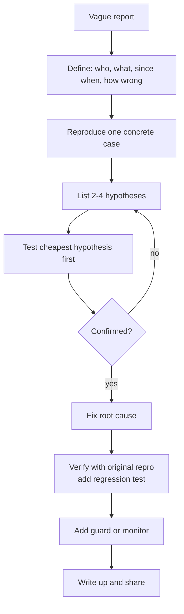
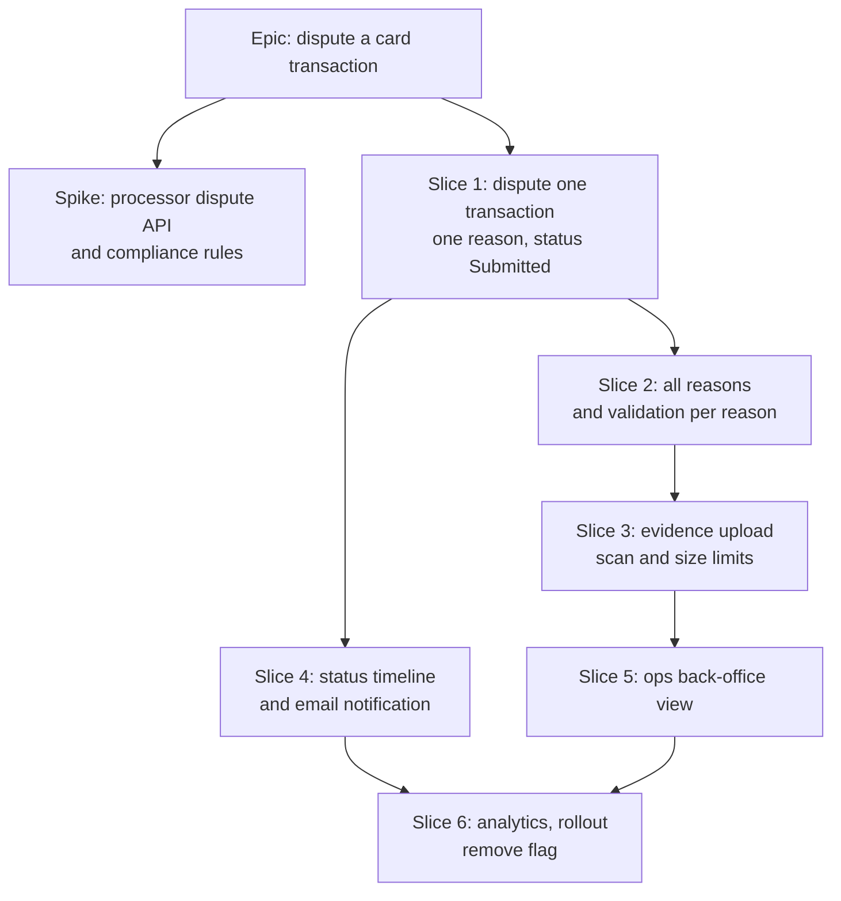
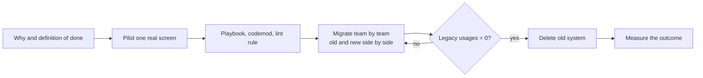
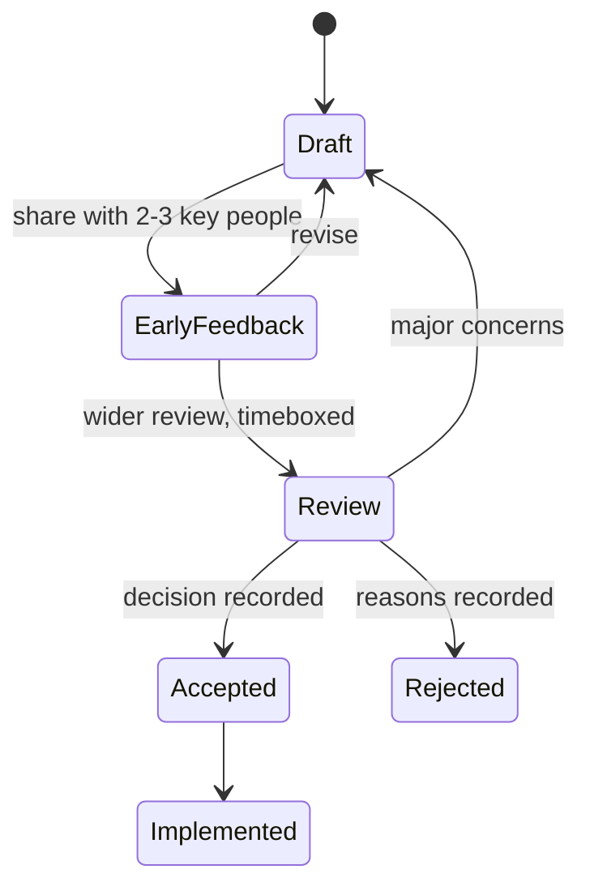
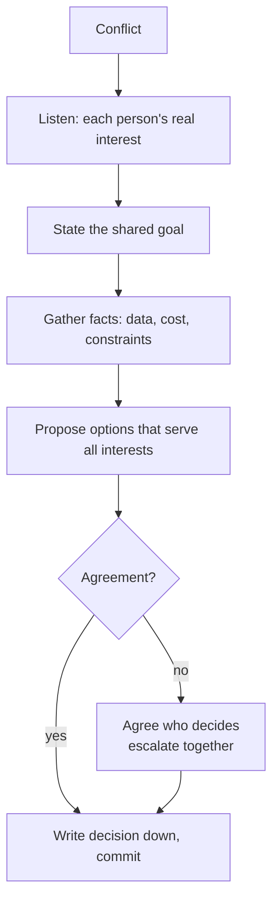
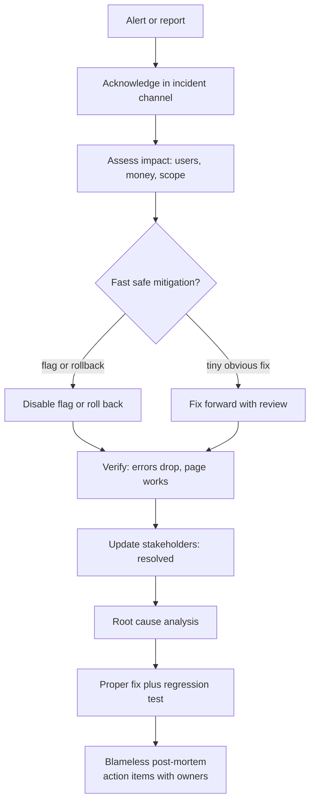
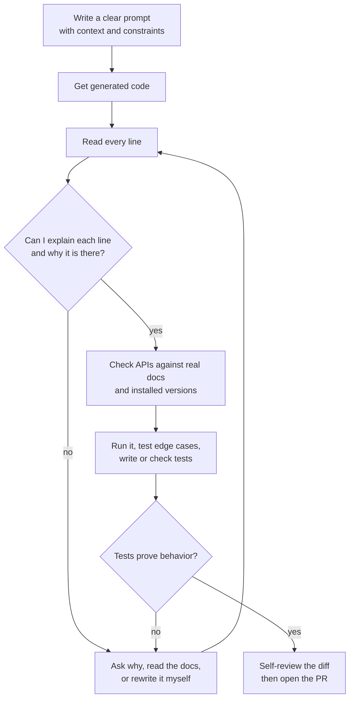
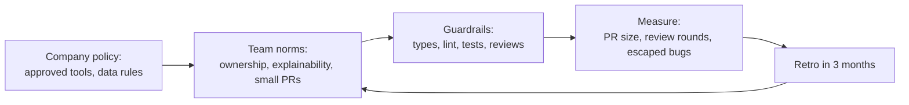

> **Interview tip:** Every STAR story in this entry is a template set in a financial web app. Do not memorize and repeat them as your own history. Interviewers ask follow-up questions ("What was the error rate exactly?", "What did your manager say?") and invented stories fall apart. Use each one as a shape, then fill it with something that really happened to you, even if it was smaller. A small true story beats a big fake one every time.

How to use this entry. Most answers follow four parts:

- **Short answer:** what you say in the first 20 seconds. It shows you have a method.
- **How I'd approach it:** the method itself, step by step. This is the part that transfers to questions you have never seen.
- **Example answer (STAR):** Situation, Task, Action, Result. Keep it to about 90 seconds spoken. Spend most of the time on Action, and say "I", not "we", for the parts you did.
- **What interviewers listen for:** signals that read as senior, and red flags.

## 1. Thinking, Estimating and Planning

#### Q: [Senior] You're handed a problem nobody on the team understands yet: "Some users see the wrong portfolio balance, sometimes." How do you approach a problem like that?

**Short answer:** I don't start by changing code. I first make the problem precise: who sees it, how often, what "wrong" means, and how to reproduce it. Then I form a few hypotheses, test the cheapest one first, fix the root cause, and add a guard so it cannot come back silently.

**How I'd approach it:** I use the same loop for any unknown problem, whether it's a bug, a slow page or a vague feature request.

1. **Define the problem.** Turn "sometimes wrong" into facts. Which users? Which accounts? Wrong by how much: off by cents, stale, or completely different? Since when? Is there a ticket, a screenshot, a user ID, a timestamp?
2. **Measure and reproduce.** Find one concrete case. Look at logs, the APM trace for that request, the network response in the browser, the database row. A bug you can reproduce is half fixed.
3. **List hypotheses.** Write down two to four plausible causes. For a balance: stale cache, a race between two requests, a timezone cut-off on "today", floating-point maths, or the backend returning a pending transaction.
4. **Test the cheapest hypothesis first.** Cheap means fast to prove or disprove, not most likely. Checking whether the API response is already wrong takes two minutes and splits the problem in half: frontend or backend.
5. **Fix the root cause, not the symptom.** If two requests race, adding a `setTimeout` is a symptom fix. Cancelling the stale request or keying the cache correctly is a root-cause fix.
6. **Verify and guard.** Prove the fix with the original reproduction, add a test that fails without the fix, and add monitoring if the failure could be silent.
7. **Share what you learned.** A short write-up in the ticket or channel so the next person does not repeat the investigation.



The key move is **bisection**: every check should cut the search space roughly in half. "Is the API response wrong?" splits frontend from backend. "Does it happen on a fresh login?" splits cache issues from data issues. "Did it start after release 4.12?" splits code changes from data changes.

```ts
// A tiny, practical tool for "sometimes wrong" bugs: log enough context
// to reproduce, without logging sensitive values.
function logBalanceMismatch(params: {
  accountId: string;
  shownCents: number;
  serverCents: number;
  requestId: string;
  renderedAt: string;
}) {
  if (params.shownCents !== params.serverCents) {
    logger.warn('balance_mismatch', {
      accountId: params.accountId, // an internal id, not a PAN or account number
      diffCents: params.serverCents - params.shownCents,
      requestId: params.requestId,
      renderedAt: params.renderedAt,
    });
  }
}
```

**Example answer (STAR):**

- **Situation:** On a wealth dashboard, about a dozen support tickets a week said the portfolio total "jumps" to an old number after switching accounts.
- **Task:** I picked it up. Nobody had reproduced it, and it was eroding trust in the numbers.
- **Action:** I asked support for user IDs and timestamps, then found matching traces. The API responses were correct, so the problem was on the frontend. My hypotheses were a cache key collision or a request race. I throttled the network in DevTools to Slow 3G and switched accounts quickly. The old account's response arrived last and overwrote the new one. The fetch was in a `useEffect` with no cancellation. I moved it to our query library with the account ID in the query key, which made late responses for the old account harmless. I added a test that resolves two promises out of order.
- **Result:** The tickets stopped within a week. I also wrote a one-page note on "request races in effects" and we found and fixed two more places with the same pattern.

> **Why:** Interviewers ask this because they cannot predict what your next job's problems will be. They are testing whether you have a repeatable method or whether you thrash.

**What interviewers listen for:**

- You clarify and reproduce before you fix.
- You name hypotheses out loud and test the cheapest one first.
- You separate root cause from symptom.
- You close the loop: regression test, monitor, write-up.
- Red flag: "I'd just add some console logs and try things." Red flag: jumping to a rewrite.
- Red flag: "I'd paste the error into an AI tool and apply the fix." Using AI to suggest hypotheses is fine. Applying a fix you cannot explain is not.

#### Q: [Mid] Your PM asks, "How long will the recurring payments feature take?" You have never built one. What do you say, and what do you do when you realize halfway through you'll miss the date?

**Short answer:** I don't give a number on the spot. I ask for a day to break it into tasks, find the unknowns, and come back with a range and the assumptions behind it. If I see I'm going to miss the date, I say so as soon as I know, with options, not at the deadline.

**How I'd approach it:**

1. **Clarify scope.** What's in version one? Weekly and monthly only, or custom schedules? Edit and cancel? Notifications? Which edge cases matter: the 31st of a month, weekends, insufficient funds?
2. **Break it down** into tasks of half a day to two days each. Anything bigger hides unknowns.
3. **Mark the unknowns.** "Does the payments API support scheduled transfers?" is an unknown. Don't estimate unknowns; **spike** them: a timeboxed investigation of a few hours that turns an unknown into a known.
4. **Estimate as a range.** Give a best case and a realistic case, for example "6 to 9 working days". Add time for code review, QA, accessibility checks and release, which people forget.
5. **State assumptions.** "This assumes backend has the schedule endpoint ready by Wednesday and design is final."
6. **Track and re-forecast.** Check progress against the plan every couple of days.

A simple, honest estimation table:

| Task | Estimate | Confidence |
| --- | --- | --- |
| Schedule form (frequency, start date, amount) with validation | 1.5 days | High |
| Review and confirm step with idempotency key | 1 day | High |
| List of scheduled payments, edit and cancel | 2 days | Medium |
| Date edge cases: 29 to 31, weekends, holidays | 1 day | Low, needs a spike on backend rules |
| Error and empty states, a11y pass | 1 day | Medium |
| Tests, review, QA fixes | 1.5 days | Medium |
| **Total** | **8 days, range 7 to 11** | |

When you will miss a date:

- **Tell early.** The moment the forecast changes, not on the last day. Bad news gets more expensive with time.
- **Explain why in one sentence.** "The backend doesn't handle month-end dates, so we need extra logic."
- **Bring options.** Usually the levers are **scope**, **time**, and **people**. Quality is not a lever in a payments app.
  - Cut scope: ship weekly and monthly on days 1 to 28, add month-end next sprint.
  - Move the date: two more days for the full version.
  - Add help: pair with the backend dev for a day.
- **Let the PM decide** the trade-off. Your job is to make the options and costs clear.

**Example answer (STAR):**

- **Situation:** I estimated a "download statement as PDF" feature at five days.
- **Task:** On day three I found the PDF library did not render our currency formatting and fonts correctly for some locales.
- **Action:** That afternoon I messaged the PM: "I'll miss Friday. The PDF renderer breaks some locale formatting. Options: ship English-only on Friday and add the other locales next week, or ship everything next Wednesday." I attached two screenshots. She chose English-only because the launch was English-market first. I created a follow-up ticket with the details.
- **Result:** We shipped on Friday. The rest followed four days later. In the retro I proposed that we spike third-party libraries before estimating, and the team adopted it.

> **Gotcha:** "It'll take two weeks" heard by a PM becomes "it will be done on the 14th". Always say the range and the assumptions, and write them in the ticket.

**What interviewers listen for:**

- You don't guess on the spot. You break down, find unknowns and spike them.
- Ranges and assumptions, not a single number.
- Early, calm communication with options. You let the business pick the trade-off.
- Red flag: "I'd work weekends to hit it" as the default plan. Occasional effort is fine. A hero habit is not a plan.
- Red flag: silently cutting tests or quality to hit the date.

#### Q: [Senior] You're given an epic: "Customers can dispute a card transaction." It's about six weeks of work across frontend, backend and ops. How do you break it down?

**Short answer:** I slice it vertically into thin, shippable pieces that each deliver something end to end, starting with the smallest version a real user can complete. I identify the risky unknowns and do those first, and I put the pieces behind a feature flag so we can ship to production early without exposing them.

**How I'd approach it:**

1. **Understand the outcome.** Why does this exist? Fewer support calls? A regulatory requirement? What does success look like in numbers?
2. **Map the user journey.** Find transaction, start dispute, choose reason, add evidence, submit, see status, get notified, see the result.
3. **Slice vertically, not horizontally.** A horizontal slice is "build all the APIs, then all the UI". Nothing works until the end. A vertical slice is "a user can dispute one transaction with one reason and see 'Submitted'", touching UI, API and database thinly.
4. **Order by risk and value.** Do the riskiest unknowns early: integration with the card processor's dispute API, file upload security, compliance rules.
5. **Define done for each slice:** tests, analytics events, accessibility, docs.
6. **Find dependencies and parallel work.** Backend can build the API contract while frontend builds against a mock.



Agree on the API contract first so frontend and backend can work in parallel:

```ts
// Shared contract, agreed in week 1. Frontend mocks it until backend ships it.
type DisputeReason = 'not_recognized' | 'duplicate' | 'wrong_amount' | 'not_received';

interface CreateDisputeRequest {
  transactionId: string;
  reason: DisputeReason;
  description?: string;
  idempotencyKey: string; // prevents double-submits creating two disputes
}

interface Dispute {
  id: string;
  transactionId: string;
  status: 'submitted' | 'under_review' | 'won' | 'lost' | 'withdrawn';
  amountCents: number;
  currency: string;
  createdAt: string; // ISO 8601
}
```

**Example answer (STAR):**

- **Situation:** Our team was given "account statements v2", about six weeks of work. The original plan was "backend for three weeks, then frontend for three weeks".
- **Task:** As the frontend lead, I was worried we'd find integration problems in week five.
- **Action:** I proposed vertical slices instead. Slice one was "view the latest monthly statement as a list", end to end, behind a flag. We agreed the API contract on day two, and I built the UI against a mock service worker. I also pulled the riskiest item, PDF generation, into week one as a spike.
- **Result:** The spike showed that PDF generation took up to 20 seconds for large accounts. We changed the design to an async "we'll email you when it's ready" flow in week one, not week five. We shipped slice one to internal users in week two and the full feature a few days early.

**What interviewers listen for:**

- Vertical slices, with a real user outcome in each.
- Risk first: spikes on unknowns before committing.
- Contract-first so teams work in parallel.
- Feature flags and early internal release.
- A clear definition of done that includes tests, a11y and analytics.
- Red flag: a task list by layer ("all components, then all API calls") with integration at the end.

## 2. Technical Leadership

#### Q: [Senior] Your team's transaction table code is a mess: three versions of the same table, no tests, every change breaks something. Product wants new features, not cleanup. How do you handle the tech debt and convince them?

**Short answer:** I translate the debt into business terms: slower delivery, more bugs, more risk. I back it with numbers from our own tickets and incidents, then propose a small, incremental plan that runs alongside feature work instead of a big "stop everything" rewrite.

**How I'd approach it:**

1. **Make it visible.** Keep a short tech-debt list with, for each item, the pain it causes and how often. "Messy code" is not an argument. "Every table change takes three days and causes a bug in one of the other two copies" is.
2. **Gather evidence.** Count bugs linked to the area, time spent on changes, incidents, on-call pages, onboarding time. Even rough numbers from the last quarter are persuasive.
3. **Prioritize by cost of delay.** Debt that sits in code you change every sprint costs more than debt in code nobody touches. Leave stable ugly code alone.
4. **Propose incremental work.** Options that usually work:
   - **Boy-scout rule:** improve the code you touch for a feature.
   - **Pair debt with features:** "The new filter feature needs the table anyway. If we first merge the three tables into one, the feature takes four days instead of six, and we remove the duplicate bugs."
   - **A fixed allocation:** for example, around 15 to 20 percent of each sprint.
5. **Show results.** After the work, report back: fewer bugs, faster changes. That earns trust for the next request.

How to frame it for a PM:

| Engineer phrasing | Business phrasing |
| --- | --- |
| "The table code is spaghetti." | "Each table change takes about 3 days instead of 1, and 5 of last quarter's 12 UI bugs came from it." |
| "We have no tests." | "We find bugs in QA or production, which is when they are most expensive to fix." |
| "We need to refactor." | "Two days of consolidation makes the next three roadmap features faster and lowers regression risk." |

> **Finance tip:** In financial apps, the strongest argument is often risk, not speed. "This code formats amounts in three different ways, and one of them rounds wrong for JPY" gets prioritized fast.

**Example answer (STAR):**

- **Situation:** We had three transaction table components, copied over two years. The PM wanted CSV export and column customization next quarter.
- **Task:** I believed building those features three times would be slow and buggy, but I needed the PM to agree.
- **Action:** I went through the last quarter's tickets. Seven bugs came from the tables being out of sync, and the last table feature had taken nine days across the three copies. I wrote a one-page proposal: build one shared table with tests in five days as the first step of the export feature. I estimated export plus customization at eight days with consolidation, compared with about fifteen without. I did the migration one page at a time behind a flag.
- **Result:** The PM agreed because the plan made her roadmap faster. Both features shipped in the quarter. Table-related bugs dropped from seven to one the next quarter, and I shared those numbers in the sprint review.

**What interviewers listen for:**

- You speak the business's language: time, bugs, risk, money.
- Evidence from real data, even rough.
- Incremental plans tied to features, not a rewrite.
- Prioritizing debt by how often the code changes.
- You report results afterwards.
- Red flag: "I'd just refactor it in my spare time" or a "big rewrite" proposal with no plan.
- Red flag: treating PMs as the enemy.

#### Q: [Staff] You're asked to lead the migration of a large React app from a home-grown Redux setup to a server-state library plus small local state, across 60 screens and four teams. How do you run it?

**Short answer:** I treat it as a project, not a refactor. I write down why we're migrating and how we'll know it's done, prove the new pattern on one real screen, then migrate incrementally so old and new code run side by side. I make the right way the easy way with docs, codemods and lint rules, track progress visibly, and only remove the old system when usage hits zero.

**How I'd approach it:**

1. **Justify it.** What problem does the migration solve? For example: "40 percent of our Redux code is caching API responses by hand, and stale data bugs are our top bug category." If you cannot name the problem, don't migrate.
2. **Define done.** "No screen imports from `store/legacy`, the old middleware is deleted, and the stale-data bug count has fallen."
3. **Pilot on one real, medium-complexity screen.** Not the easiest one. The pilot finds the hard cases: optimistic updates, pagination, auth token refresh.
4. **Write the playbook.** A short guide with before and after examples, and the decisions made: query key conventions, where mutations live, how to handle errors.
5. **Run old and new side by side** (the strangler fig pattern). New code uses the new pattern. Old code moves screen by screen. Nothing breaks in between.
6. **Automate where possible.** A codemod for the mechanical parts. A lint rule that blocks new imports from the old system, so the problem stops growing.
7. **Track and communicate.** A dashboard or a simple count of remaining usages, shared each week. Celebrate milestones.
8. **Finish it.** The last 10 percent is where migrations die. Plan and staff it explicitly. Then delete the old code.



A lint rule that stops the old system from growing. ESLint's built-in `no-restricted-imports` handles this:

```js
// eslint.config.js (flat config)
export default [
  {
    files: ['src/**/*.{ts,tsx}'],
    ignores: ['src/store/legacy/**'],
    rules: {
      'no-restricted-imports': ['error', {
        patterns: [{
          group: ['**/store/legacy/*'],
          message: 'Legacy store is being migrated. Use the query hooks in src/api. See docs/migration.md',
        }],
      }],
    },
  },
];
```

For existing usages, many teams add a list of allowed files that only shrinks, or use per-file disable comments that a script counts. The count becomes your progress metric:

```bash
# Progress metric: how many files still import the legacy store?
grep -rl "store/legacy" src --include=*.ts --include=*.tsx | wc -l
```

**Example answer (STAR):**

- **Situation:** Our banking app had about 50 screens using a custom Redux layer to cache API data. Stale balances after payments were the most common bug type.
- **Task:** I was asked to lead the move to TanStack Query for server state across three teams without a feature freeze.
- **Action:** I wrote a two-page RFC with the problem, the target, and the rollout plan. I migrated the payments history screen as the pilot, because it had pagination and optimistic updates. That surfaced a token-refresh issue we solved once, in a shared fetch wrapper. I wrote a guide with three before and after examples, added the lint rule, and ran two short workshops. Each team owned its own screens. I posted the remaining count in our channel every Friday. When we got stuck at eight hard screens, I paired with each team on them.
- **Result:** We finished in about four months, deleted roughly 6,000 lines of code, and stale-data bugs went from the top bug category to rare. New engineers no longer needed a week to learn the custom store.

> **Gotcha:** The most common failure is a half-finished migration. Now you have two systems forever, which is worse than either one. Do not start without a plan and owner for the last 10 percent.

**What interviewers listen for:**

- A clear "why" and a measurable definition of done.
- A pilot on a realistic screen, then a playbook.
- Incremental, side-by-side migration with no big bang.
- Leverage: codemods, lint rules, docs, workshops. You scale yourself across teams.
- Visible progress tracking and a plan to finish.
- Red flag: "We'd freeze features and rewrite it in a month."
- Red flag: doing all 60 screens yourself. At staff level the job is to enable others.

#### Q: [Staff] When do you write an RFC or design doc, and what goes in a good one? Walk me through one you wrote.

**Short answer:** I write one when a decision is expensive to reverse, affects other teams, or has several reasonable options. A good one states the problem and goals, compares real alternatives with trade-offs, recommends one, and lists risks and open questions. The goal is a better decision and shared understanding, not paperwork.

**How I'd approach it:**

When to write one:

- The change touches several teams or a shared system (auth, design system, data fetching).
- It's hard to undo (a database schema, a public API, a framework choice).
- People disagree, or there are several valid options.
- It needs more than a couple of weeks of work.

When not to: small, reversible changes. A PR description is enough.

A structure that works:

1. **Context and problem.** What is happening today, with numbers. Why it matters now.
2. **Goals and non-goals.** Non-goals stop scope creep. "Non-goal: changing the backend auth flow."
3. **Options considered.** At least two, plus "do nothing". For each: how it works, pros, cons, cost.
4. **Recommendation** and why it beats the others for *our* constraints.
5. **Detailed design** of the chosen option: diagrams, API shapes, data flow.
6. **Rollout and rollback plan.** Feature flags, phases, how to undo it.
7. **Risks and open questions.** Be honest about what you don't know.
8. **Metrics.** How you'll know it worked.



Practical habits:

- **Share a rough draft early** with the two or three people most likely to object. Surprises in a big review meeting create conflict. Early conversations create allies.
- **Timebox the review.** "Comments by Thursday, decision Friday."
- **Record the decision** and the reasons. A short Architecture Decision Record (ADR) in the repo works well. Six months later, someone will ask "why did we do it this way?"
- **Keep it short.** Two to five pages. Long docs don't get read.

**Example answer (STAR):**

- **Situation:** Our app stored Okta tokens in `localStorage`. A security review flagged the XSS risk, and three teams had different ideas about the fix.
- **Task:** I was asked to drive a decision.
- **Action:** I wrote an RFC with three options: keep tokens in memory with refresh on reload, move to a backend-for-frontend (BFF) with HTTP-only cookies, or keep `localStorage` with a stricter Content Security Policy. For each I described the security properties, the work for each team, and the effect on the user experience. I shared a draft with the security engineer and the backend lead first. The backend lead pointed out that our API gateway could already handle sessions, which made the BFF option much cheaper. I updated the doc, recommended the BFF, and included a phased rollout behind a flag.
- **Result:** The review took one meeting because the main concerns had already been addressed. We rolled it out over three sprints, and the security finding was closed. The ADR is still the first link new engineers get about auth.

> **Interview tip:** If you have never written a formal RFC, talk about a smaller decision you documented: a PR description that compared two approaches, or a Slack thread you turned into a short decision note. The skill is structured thinking about options, not the template.

**What interviewers listen for:**

- Clear criteria for when a doc is worth it.
- Real alternatives, including "do nothing", with honest trade-offs.
- Goals and non-goals.
- Getting early feedback from the people most affected.
- Rollout, rollback and success metrics.
- Red flag: a doc written to justify a decision already made, with straw-man alternatives.

#### Q: [Senior] "What impact did you have in your last role?" How do you measure and talk about the impact of your work?

**Short answer:** I connect my work to outcomes the business cares about: users, revenue, cost, risk, or team speed. Where I can, I measure before and after with real numbers. Where I can't, I'm honest about it and describe the change in concrete terms.

**How I'd approach it:**

Types of impact, roughly in order of how much they impress:

1. **User or business outcomes:** conversion, completion rate, support tickets, retention. "Payment form completion rose from 71 to 78 percent."
2. **Risk reduction:** incidents, security findings, compliance. "Closed a high-severity token-storage finding."
3. **Performance:** Core Web Vitals, load time, error rate. "INP on the transactions page went from about 450 ms to under 200 ms."
4. **Team productivity:** build time, PR cycle time, onboarding time, bug count. "CI went from 18 to 7 minutes for 25 engineers."
5. **Output:** "I built the dispute flow." This is the weakest unless you connect it to one of the above.

How to measure:

- **Before you start, capture the baseline.** You can't show improvement without it. This is the habit most people lack.
- Use the tools you have: analytics events, Real User Monitoring (RUM) data, Sentry error counts, CI timing, support ticket tags.
- Agree on the metric with the PM *before* building.
- Be careful with attribution. If a marketing campaign launched the same week, say so.

```ts
// Capture a baseline before a change: instrument the funnel first.
// track() stands for whatever analytics client the team uses.
track('payment_form_viewed', { flow: 'transfer' });
track('payment_form_submitted', { flow: 'transfer' });
track('payment_form_error', { flow: 'transfer', field: 'amount', code: 'exceeds_balance' });
// Completion rate = submitted / viewed. Error events show where people drop off.
```

Rough numbers you can compute for productivity wins:

```text
CI saved: 11 minutes x ~40 runs per day ≈ 7 engineer-hours of waiting per day
```

**Example answer (STAR):**

- **Situation:** Our transfer form had a lot of drop-off, but nobody knew why.
- **Task:** I was asked to improve the form. I suggested we measure first.
- **Action:** I added analytics events for view, submit and each validation error. After two weeks, the data showed 30 percent of errors were "amount exceeds daily limit", which users only learned about after they submitted. I worked with the designer to show the remaining daily limit next to the amount field and validate as they type.
- **Result:** Completion rose from about 71 to 78 percent over the next month, and limit-related support tickets fell by about half. I presented the before and after in our product review. It also gave the team a pattern for other forms.

> **Gotcha:** Don't invent precise percentages in an interview. If you don't know the exact number, say "roughly" or describe the direction: "build times went from long enough to get coffee to under ten minutes." Precise fake numbers fall apart under follow-up questions.

**What interviewers listen for:**

- Outcomes, not just outputs.
- The baseline habit: measuring before changing.
- Honest attribution and approximate numbers when exact ones aren't available.
- Credit to others where it's due.
- Red flag: a list of technologies used, with no outcome.
- Red flag: claiming the whole team's result as yours alone.

## 3. Collaboration and Influence

#### Q: [Senior] The designer wants a fancy animated portfolio chart, the PM wants it this sprint, and the backend engineer says the API can't return the data at that granularity. How do you handle disagreements like this?

**Short answer:** I go back to the shared goal, separate facts from opinions, and look for the option that meets the real need at a cost everyone can accept. I disagree directly but respectfully, with data, and once a decision is made I commit to it even if it wasn't my preference.

**How I'd approach it:**

1. **Understand each person's real concern.** People argue for positions, but they care about interests. The designer cares that users understand performance over time. The PM cares about the launch date. The backend engineer cares about database load and not shipping a slow endpoint.
2. **Find the shared goal.** "We all want users to see how their portfolio changed this month, in time for launch."
3. **Get facts.** What granularity does the API return today? Daily? How many points would the design need? What does the animation cost on a mid-range Android phone?
4. **Propose options** that serve all the interests. For example: launch with daily points, which the API already has, and a simple transition. Add intraday data in phase two once backend adds a pre-aggregated endpoint.
5. **Decide and commit.** If we still disagree, agree on who decides (usually the PM for scope, the designer for UX, the tech lead for technical risk). Then "disagree and commit": I support the decision fully and don't undermine it later.
6. **Escalate only as a last resort**, and together: "We have two options and can't agree. Can you help us decide?" Never go around someone.



Useful phrases:

- "Help me understand what's most important to you here."
- "What if we did X now and Y in the next phase? Does that meet your need?"
- "I see it differently, and here's why. But I might be missing something."
- "I still think A is better, but I understand the reasons for B. I'm on board."

**Example answer (STAR):**

- **Situation:** A designer handed off a portfolio chart with smooth intraday animation and 5-minute data points. Backend only stored daily snapshots, and the PM wanted it in the current release.
- **Task:** I needed to get the three of us to a plan quickly, without anyone feeling overruled.
- **Action:** I set up a 30-minute call. I asked the designer what the animation was meant to communicate. It was mostly "show the trend clearly", not the intraday detail. I asked the backend engineer what intraday data would need, and he said a new aggregation job, about two weeks. I built a quick prototype with daily data and a simple fade-in, and tested it on a low-end Android device. I proposed shipping that now, with intraday as a follow-up ticket that the backend engineer estimated.
- **Result:** Everyone agreed. We shipped on time. Usage data later showed that most users looked at the 1M and 1Y ranges, where intraday points don't matter, so the follow-up dropped in priority. The designer and I agreed to involve backend earlier in design reviews.

> **Why:** Interviewers are not testing whether you win arguments. They're testing whether people would want to work with you, and whether conflicts end in good decisions.

**What interviewers listen for:**

- Curiosity about the other person's view before arguing.
- Data and prototypes over opinions.
- Creative options, like phasing, instead of win or lose.
- "Disagree and commit" after a decision.
- Escalating together, not around people.
- Red flag: a story where you were right and everyone else was wrong.
- Red flag: "I just did what the PM said" with no input of your own.

#### Q: [Senior] Two days before a release, the PM asks you to "just add" multi-currency support to the transfer form. How do you push back on scope?

**Short answer:** I don't say no outright, and I don't silently say yes. I explain what the request really involves and what it would cost, then offer options: ship it later, ship a smaller version, or move the date. Then the PM decides with full information.

**How I'd approach it:**

1. **Understand the why.** "What's driving this? Is a customer or a deal waiting on it?" Sometimes there's a good reason, and sometimes a smaller version solves it.
2. **Make the cost visible.** "Just add" often hides a lot of work. Multi-currency means: FX rates and their freshness, showing the rate and fees, rounding rules per currency (JPY has no minor units, some currencies have three decimals), validation against limits in each currency, backend support, tests, and possibly compliance review.
3. **Name the risk.** Rushed money-movement code two days before release is how incidents happen.
4. **Offer options.**
   - Ship as planned and deliver multi-currency in the next release, with a real estimate.
   - A smaller version now: show the converted amount as information only, no foreign-currency transfers yet.
   - Move the release date.
5. **Put it in writing** after the conversation, so everyone has the same understanding.

```ts
// Why "just add currency" is not small: amounts are integers in minor units,
// and minor-unit exponents differ by currency.
const minorUnitExponent: Record<string, number> = {
  USD: 2, // 1 USD = 100 cents
  EUR: 2,
  JPY: 0, // no minor unit
  KWD: 3, // 1 KWD = 1000 fils
};

function formatAmount(amountMinor: number, currency: string, locale: string): string {
  const exp = minorUnitExponent[currency];
  if (exp === undefined) throw new Error(`Unsupported currency: ${currency}`);
  return new Intl.NumberFormat(locale, { style: 'currency', currency })
    .format(amountMinor / 10 ** exp);
}
// Conversion, rate expiry, fee display and rounding policy are still to do.
```

> **Finance tip:** `Intl.NumberFormat` handles display, but the conversion and rounding policy belongs to the backend and the business. The frontend should never decide how a converted amount is rounded.

**Example answer (STAR):**

- **Situation:** Two days before a release, our PM asked if we could add multi-currency to the transfer form, because a sales lead mentioned a client wanted it.
- **Task:** I didn't want to say no without reasons, but I knew it was much bigger than it sounded.
- **Action:** I asked what the client needed. It turned out they wanted to *see* the amount in their home currency, not send foreign transfers yet. I wrote a short list of what full multi-currency would need, about two sprints including backend work, and offered a smaller option: show an approximate converted amount as information, using a rate the backend already exposed, labelled "approximate". That was about half a day. I wrote it up in the ticket.
- **Result:** The PM took the smaller option for the release and put full multi-currency on the roadmap with a proper estimate. The client was happy with the display version, and we avoided rushing money-movement logic into a release.

**What interviewers listen for:**

- You ask why before saying no.
- You make hidden complexity visible, with specifics.
- You offer options, often a smaller version that meets the real need.
- You protect quality and risk, especially for money.
- Red flag: "I'd just tell them no, it's too late."
- Red flag: "I'd stay up and get it done" for risky changes.

#### Q: [Mid] What's your code review philosophy? How do you give feedback on a PR that has real problems without upsetting the author?

**Short answer:** Code review is for catching problems and sharing knowledge, not for proving I'm smart. I focus on correctness, security and maintainability first, I separate must-fix issues from suggestions, and I explain the why. I review the code, not the person.

**How I'd approach it:**

What I check, in priority order:

1. **Correctness:** does it do what the ticket says? Edge cases: empty states, errors, double clicks, slow networks, timezone boundaries.
2. **Security and money:** amounts in integer minor units, no floats for money, no secrets or PII in logs, input validated on the server, idempotency keys on payment submits.
3. **Design:** is the logic in the right place? Will this be easy to change?
4. **Tests:** do they test behavior, and would they fail if the code were wrong?
5. **Readability:** naming, size, comments where the why is not obvious.
6. **Style:** last, and ideally automated with a formatter and linter so humans don't argue about it.

How I write comments:

- **Label the severity.** Many teams use prefixes like `blocking:`, `suggestion:`, `nit:` and `question:`. The author then knows what must change.
- **Explain why** and suggest a fix.
- **Ask questions** when I'm not sure: "What happens if the user clicks submit twice here?" is better than "This is wrong."
- **Praise good things.** It's not fake. It tells people what to keep doing.
- **Move big discussions offline.** If there are more than a few back-and-forth comments, a 10-minute call is faster and kinder.
- **Be fast.** A review within a few hours keeps the team moving.

Examples:

```text
blocking: amount is parsed with parseFloat("10.10") * 100, which can give 1009.9999999999999.
Parse the string into integer cents instead, e.g. with our parseAmountToCents() helper.
Happy to pair on it if useful.

question: if the request fails after the user clicks Pay, can they retry?
If yes, do we reuse the same idempotencyKey, so we don't charge twice?

nit: could we name this `pendingTransfers` instead of `data2`? Not blocking.

Really nice job splitting the validation into a pure function. That makes it easy to test.
```

Receiving feedback matters too. I assume good intent, ask questions when I don't understand, and don't take it personally. If I disagree, I explain my reasons once, and if we still disagree, we ask a third person or follow the team convention.

**Example answer (STAR):**

- **Situation:** A newer engineer opened a large PR for a payment confirmation screen. It computed fees with floating-point maths in the component and had no tests.
- **Task:** I needed to stop the bug from shipping without discouraging him.
- **Action:** I started with what was good: the UI matched the design closely and the loading states were well handled. Then I left one `blocking:` comment explaining the float problem with a concrete example (`0.1 + 0.2`), and linked our money helper. I left a `question:` about the double-submit case. I suggested, as non-blocking, moving the fee logic into a pure function so it could be tested, and I offered to pair. We paired for 30 minutes and wrote the tests together.
- **Result:** The fix shipped the same day. Two weeks later he caught the same float issue in someone else's PR. I've found that one well-explained blocking comment teaches more than twenty nits.

**What interviewers listen for:**

- Clear priorities: correctness and security before style.
- Severity labels and explaining why.
- Kindness and speed. Questions instead of accusations.
- Automating style debates.
- Review as teaching, both ways.
- Red flag: "I reject PRs until they're perfect."
- Red flag: rubber-stamping big PRs with "LGTM".

#### Q: [Senior] You've been asked to mentor two junior developers. How do you help them grow, and how do you know it's working?

**Short answer:** I find out where each person is and what they want, give them work slightly beyond their comfort zone with support, and gradually step back. I teach how to think, not just answers. It's working when they need me less and start solving problems and helping others on their own.

**How I'd approach it:**

1. **Start with a conversation.** What do they enjoy? What do they find hard? Where do they want to be in a year? Two juniors usually need different things.
2. **Choose stretch tasks.** Work that's a bit beyond them but with a safety net: a well-scoped feature, not a vague epic or a critical payment path on day one.
3. **Teach the process, not the answer.** When they're stuck, ask questions: "What have you tried? What does the error say? Where could you look next?" Then show how *I* would investigate, out loud, while pairing.
4. **Set a "stuck rule".** For example: try for 30 to 60 minutes, write down what you tried, then ask. This prevents both spinning for a day and asking too early.
5. **Give specific feedback, often.** "Your PR description explained the trade-off well, keep doing that" is useful. "Good job" isn't.
6. **Make it safe to not know.** I say "I don't know, let's find out" myself. Juniors copy what seniors do.
7. **Give visibility.** Let them demo their work and present in sprint review, so their growth is seen.
8. **Step back gradually.** From pairing, to reviewing their plan, to reviewing their PR, to them reviewing others.

On AI tools with juniors: I encourage using them, but I ask them to explain any generated code in the PR or when we pair. If they can't explain a line, that's the next thing to learn. This keeps the tool as a learning accelerator instead of a crutch.

How to tell it's working:

- They ask better questions: more specific, with what they already tried.
- They take on bigger and vaguer tasks.
- Their PRs need fewer review rounds.
- They start helping others, and other people go to them.

**Example answer (STAR):**

- **Situation:** I mentored a junior developer who was quick at building UI but avoided anything involving async data and errors. Her PRs often missed failure states.
- **Task:** Help her get comfortable with data fetching and error handling.
- **Action:** We agreed on a goal for the quarter: own a full feature that included API work. I gave her the "scheduled payments list" with clear acceptance criteria, including the error and empty states. We paired for an hour on day one, where I talked through how I'd read the API docs and plan the states. After that we did 15-minute check-ins twice a week. I reviewed her plan before she coded. In reviews, I asked "what happens when this request fails?" instead of pointing out the bug.
- **Result:** She shipped the feature with all states covered. By the end of the quarter she was writing the error-state checklist into her own PR descriptions. A few months later she ran a short session for the team on testing loading and error states with mocked APIs.

**What interviewers listen for:**

- Tailoring to the individual.
- Teaching how to think, using questions.
- Stretch work with safety nets, and gradually stepping back.
- Concrete signals of growth.
- A sensible stance on juniors using AI tools.
- Red flag: "I just answer their questions when they ask" or "I fix their code for them."

## 4. Ownership Under Pressure

#### Q: [Senior] It's 6 pm on Friday. Twenty minutes after your release, support reports that some users see a blank screen on the payments page, and error tracking shows a spike. Walk me through what you do.

**Short answer:** First I stop the damage: confirm the impact, tell people, and roll back or turn off the feature flag. I fix forward only if that is clearly faster and safer. Once users are safe, I find the root cause, fix it properly, and run a blameless post-mortem so it doesn't happen again.

**How I'd approach it:**

1. **Acknowledge and assess (first 5 minutes).** Say in the incident channel that I'm looking: "I'm on it. Investigating blank payments page after release 4.18." Check the scale: what percentage of sessions, which browsers or devices, which routes. Is money affected (failed or duplicate payments) or only display?
2. **Communicate.** Follow the team's incident process. Name an incident lead if there isn't one. Tell support what to say to customers. Post updates on a regular schedule, even if the update is "still investigating".
3. **Mitigate first.** The fastest safe action is usually:
   - Turn off the feature flag if the change is behind one.
   - Roll back to the previous build.
   - Fix forward only if the fix is tiny, obvious and quicker than rolling back.
   Don't debug for an hour while users are blocked.
4. **Verify recovery.** Watch the error rate drop. Test the page yourself. Ask support to confirm.
5. **Find the root cause** without time pressure: stack traces in Sentry, source maps, the diff between releases, reproduction in staging with the same browser.
6. **Fix properly**, with a test that would have caught it.
7. **Post-mortem.** Blameless: focus on how the system allowed the mistake, not who made it. Timeline, impact, root cause, what went well, and action items with owners.



A protection that would have contained this incident: a route-level error boundary, so one broken widget doesn't blank the whole page.

```tsx
import { ErrorBoundary } from 'react-error-boundary';

function PaymentsRoute() {
  return (
    <ErrorBoundary
      fallbackRender={({ resetErrorBoundary }) => (
        <div role="alert">
          <p>We couldn't load payments right now. Your money is safe.</p>
          <button onClick={resetErrorBoundary}>Try again</button>
        </div>
      )}
      onError={(error, info) => {
        // Report to error tracking with the component stack.
        reportError(error, { componentStack: info.componentStack });
      }}
    >
      <PaymentsPage />
    </ErrorBoundary>
  );
}
```

A short post-mortem template:

```text
Title: Blank payments page after release 4.18
Impact: ~9% of web sessions, 6:02-6:41 pm. No failed or duplicate payments.
Detection: Sentry spike alert at 6:05 and a support ticket at 6:09.
Timeline: 6:00 release ... 6:22 rollback started ... 6:41 errors at baseline.
Root cause: Array.prototype.toSorted() used in the payee list. Not supported in
  some older Safari versions still in our support matrix. No polyfill, no
  browser-matrix test.
What went well: alert fired within 3 minutes. Rollback was a one-click job.
What didn't: the page had no error boundary, so one component blanked the page.
Actions:
  1. Add route-level error boundaries (owner: me, due: next sprint)
  2. Align the build's browser targets with our support matrix (owner: A.)
  3. Add the oldest supported Safari to the smoke test run (owner: B.)
```

> **Gotcha:** Releasing on Friday evening isn't forbidden everywhere, but if you do, make sure someone who can roll back is around. Many teams avoid late-Friday releases for exactly this reason. Mention this as an action item, not as blame.

**Example answer (STAR):**

- **Situation:** Shortly after a release, error tracking showed a spike of `TypeError` on the payments page, and support reported blank screens.
- **Task:** I had shipped the change, so I took ownership of the response.
- **Action:** I posted in the incident channel within a few minutes and checked the impact. It was about 9 percent of sessions, all on older Safari versions, and only display: no payment was affected. The change wasn't behind a flag, so I started a rollback rather than debugging live, and told support to tell customers we were fixing a display issue. Once errors were back to baseline, I found the cause: an array method that those Safari versions didn't support. I fixed it, added the browser to our smoke tests, and led the post-mortem.
- **Result:** Users were affected for about 40 minutes. The post-mortem produced three actions, including route-level error boundaries, which I implemented the following sprint. A similar bug a few months later only broke one widget instead of the whole page.

**What interviewers listen for:**

- Mitigate first, investigate later.
- Clear, regular communication, including to support.
- Checking whether money or data is affected.
- Owning it without self-blame or blaming others.
- Blameless post-mortem with concrete actions and owners.
- Red flag: "I'd debug until I found the bug" while users are still blocked.
- Red flag: hiding the incident or quietly fixing it.

#### Q: [Mid] You join a team with a 400k-line React codebase and you're expected to ship something in your first two weeks. How do you learn it fast?

**Short answer:** I don't try to read it all. I learn the big shape first: how the app starts, how routing, data fetching, state and auth work. Then I go deep only where my first task needs it, by tracing one real user flow end to end. Shipping a small change early teaches me the build, test and release process too.

**How I'd approach it:**

1. **Get it running locally on day one.** Note every step that was confusing and fix the README as you go. That's a useful first PR.
2. **Learn the shape.** Look at `package.json` (libraries and scripts), the folder structure, the entry point, the router, the API client, the auth setup, and the state management. Draw a rough diagram for yourself.
3. **Trace one real flow.** For example, "user opens transactions and filters by date". Start at the route, follow the component tree, find the data fetch, find the API endpoint, look at the response in the Network tab. Use React DevTools to see the component tree and props live.
4. **Read the tests** for the area. They show intended behavior and edge cases.
5. **Use git history.** `git log` and blame on key files show why things are the way they are and who knows the area.
6. **Ask good questions.** Batch them, and say what you already checked. Ask "why" questions, not only "where" questions: "Why do we have two API clients?"
7. **Ship something small in week one.** A bug fix or a small UI change. It forces you through review, CI, deploy and the team's conventions.
8. **Use AI tools as a guide, then verify.** Asking an assistant to explain a module or find where something is defined is a good speed-up. Then confirm by reading the code it points to. It can be confidently wrong about a codebase it only partly sees.

Commands that help:

```bash
# Who knows this area, and how has it changed?
git log --oneline --follow -- src/features/transactions/TransactionsTable.tsx | head -20
git shortlog -sn -- src/features/transactions | head -5

# Where is this used?
grep -rn "useTransactions" src --include=*.tsx | head

# What changes together? Files changed in the same recent commits
git log --name-only --pretty=format: -50 -- src/features/payments | sort | uniq -c | sort -rn | head
```

**Example answer (STAR):**

- **Situation:** I joined a team working on a large trading dashboard. My first ticket was adding a column to the orders table.
- **Task:** Ship it in my first sprint without breaking anything in a codebase I didn't know.
- **Action:** On day one I got the app running and fixed two outdated steps in the README in my first PR. I traced the orders page from the route to the API call and drew a quick diagram of the data flow. It showed a mapping layer between the API and UI types that I wouldn't have found by searching. I read the table tests to understand the column config. I asked the engineer with the most recent commits for 20 minutes to review my plan before I wrote code.
- **Result:** The column shipped in my first week with tests. My diagram was added to the team docs because the mapping layer had confused other new joiners too.

> **Interview tip:** Mentioning "I fix the onboarding docs as I go" is a strong, cheap signal. It shows you leave things better for the next person.

**What interviewers listen for:**

- Breadth first, then depth where the task needs it.
- Tracing a real flow with real tools.
- Using tests and git history as documentation.
- Good questions, asked efficiently.
- Shipping small and early.
- Red flag: "I'd read the whole codebase first" or "I'd wait until I fully understand it."

## 5. AI-Assisted Engineering and Closing the Interview

#### Q: [Senior] How do you use AI coding tools day to day, and how do you make sure you're not shipping code you don't understand?

**Short answer:** I use AI tools heavily for speed: scaffolding, exploring unfamiliar code, writing first drafts of tests, and talking through options. But I treat the output like a PR from a fast new teammate who has never seen our system. I read every line, I make sure I can explain it, and I verify it with tests and by running it. If I can't explain a line, it doesn't ship.

**How I'd approach it:**

Where AI tools help a lot:

- **Boilerplate and scaffolding:** form schemas, types from an API spec, test setup.
- **Explaining code:** "What does this reducer do?" or "Why might this effect run twice?"
- **First drafts of tests**, especially edge-case lists. I then check each test asserts the right thing.
- **Exploring options:** "Give me three ways to virtualize this table and their trade-offs." Then I check the claims against the docs.
- **Refactors with a clear spec**, where tests already exist to catch mistakes.

Where I'm most careful:

- **Money, auth and security code.** Rounding, idempotency, token handling, permissions. AI tools commonly produce code that looks right but uses floats for money or stores tokens unsafely.
- **APIs and library versions.** Tools can invent functions or use old APIs. I check the library's real docs and our installed version.
- **Anything touching our private context.** The tool doesn't know our conventions, our backend's quirks or why a weird line exists.
- **Data and secrets.** I follow the company's policy on which tools are approved and never paste credentials, customer data or PII into a prompt.

My verification loop:



A concrete example of the kind of bug I look for:

```ts
// A plausible AI-generated helper. It looks fine and passes a happy-path test.
function toCents(amount: string): number {
  return Math.round(parseFloat(amount) * 100);
}
// Problems a reviewer should spot:
// 1. "1,000.50" -> parseFloat gives 1 -> 100 cents. Silent, wrong.
// 2. "abc" -> NaN, which flows into the payment request.
// 3. Locale: "10,50" in de-DE means 10.50, but parseFloat gives 10.

// A version I can defend line by line: accept one strict format and reject the rest.
function parseAmountToCents(input: string): number {
  const trimmed = input.trim();
  const match = /^(\d{1,12})(?:\.(\d{1,2}))?$/.exec(trimmed);
  if (!match) throw new Error('Invalid amount format');
  const whole = Number(match[1]);
  const fraction = Number((match[2] ?? '').padEnd(2, '0'));
  return whole * 100 + fraction;
}
// Tests I'd insist on: "0", "0.5", "10.05", "999999999999.99",
// and rejections for "", "1,000", "-1", "1.234", "abc".
```

Self-check questions before I open a PR with generated code:

- Could I rewrite this from scratch without the tool, even if slower?
- Do I know why each import, condition and dependency is there?
- What happens with empty, null, huge, negative, slow or duplicate inputs?
- Does it follow our conventions, or did it introduce a new pattern?
- Did I check every library call against the docs for our installed version?

**Example answer (STAR):**

- **Situation:** I used an AI assistant to generate a hook that polled a payment's status after submission.
- **Task:** Ship it quickly but safely. Polling bugs can hammer the API or leave users with a stuck spinner.
- **Action:** The generated code worked in the happy path. When I read it line by line, I saw three issues: it never stopped polling on a terminal status like `failed`, it didn't clean up the interval when the component unmounted, and it had no maximum duration. I rewrote those parts myself, using our query library's refetch interval instead of a raw `setInterval`. I wrote tests with fake timers for success, failure, timeout and unmount.
- **Result:** It shipped with the tests. In review, I noted in the PR description which parts were generated and what I changed. A teammate later reused the pattern for statement generation status.

**What interviewers listen for:**

- Honest, specific use of AI tools, not denial and not blind trust.
- A verification habit: read, explain, check docs, test.
- Knowing the high-risk areas: money, auth, security, data privacy.
- Respect for company policy on tools and data.
- Red flag: "I don't use AI at all" when it's clearly not true. Interviewers can tell.
- Red flag: "AI writes most of my code and it's usually right." That signals you don't review it.

#### Q: [Mid] "Walk me through this code you wrote." The interviewer suspects a lot of your past work was AI-generated. How do you talk about your AI use honestly without hurting your chances?

**Short answer:** I'm honest that I use AI tools a lot, and I put the focus on what I own: the problem framing, the decisions, the verification and the result. Then I prove understanding by explaining the code, the trade-offs, and what I would change. Most companies now expect engineers to use AI tools. What they're testing is whether you're the engineer or the tool is.

**How I'd approach it:**

What interviewers are really asking:

- Do you understand the code you ship?
- Can you work when the tool is wrong or unavailable?
- Can you debug and reason on your own?
- Do you have judgment about what to accept?

How to answer well:

1. **Be honest and matter-of-fact.** "Yes, I use AI assistants a lot, mostly for first drafts, tests and exploring code I don't know."
2. **Describe your ownership.** "I decide the approach, I review every line, and I'm responsible for what ships. Here's an example where the generated code was wrong and how I caught it."
3. **Show understanding live.** When explaining code, cover: why this approach over alternatives, what the edge cases are, what would break it, and how you'd test it. This matters far more than who typed it.
4. **Admit gaps without panic.** "I'm not sure why this `useMemo` is here. Let me reason it through." Then reason out loud. A calm "let me think" beats a confident wrong answer.
5. **Show that you're growing.** "I noticed I'd leaned on it for TypeScript generics, so I've been working through them deliberately."

How to prepare, practically:

- **Re-read your recent projects.** For each main file, make sure you can explain every line. Where you can't, study it until you can. This is the most valuable prep for someone who has relied on AI.
- **Practise without the tool.** Do a few small exercises with AI off: a debounced search, a form with validation, a sortable table, a custom hook with cleanup. Timed, in a plain editor.
- **Practise explaining out loud.** Pick a component and explain it as if teaching someone, including why each hook is there.
- **Know the fundamentals behind common generated code:** closures, the event loop, promises and `async`/`await`, React rendering and effects, the dependency array, keys, controlled inputs, TypeScript narrowing and generics.
- **Prepare one "AI was wrong" story.** It's a strong signal that you review critically.

Phrases that work:

- "I use it like a fast pair programmer. I'm still the one making the decisions."
- "This part was generated. I changed X because Y."
- "I don't know that offhand. Here's how I'd find out."

Phrases to avoid:

- "I just asked the AI and it worked."
- "I don't really know what that part does, but the tests pass."
- Pretending you never use AI tools when your work shows you do.

> **Interview tip:** In live coding rounds, check the rules first. Some companies allow AI tools and watch how you use them, others don't. If they're allowed, narrate: "I'll ask for a draft of the reducer, then check it." Reviewing out loud is the skill they're scoring.

**Example answer (STAR):**

- **Situation:** In a previous interview, the panel asked me to explain a data-fetching hook from my portfolio project, and asked directly whether I'd written it myself.
- **Task:** Be honest and show I understood it.
- **Action:** I said the first draft came from an AI assistant and that I'd changed the cancellation logic. Then I walked through it: why the query key included the account ID, why I used `AbortController` to cancel stale requests, and what happened on a 401 when the token expired. They asked what would happen if the component unmounted mid-request. I explained it and pointed out a case I hadn't handled, which was retrying on network errors without backoff.
- **Result:** The feedback said my explanation of the trade-offs was a strength. Being open about the AI part didn't hurt. Not understanding it would have.

> **Why:** Hiding AI use is risky, because one follow-up question can expose it. Owning it and showing judgment turns it into a strength.

**What interviewers listen for:**

- Honesty without being defensive.
- Clear ownership of decisions and results.
- Real understanding under follow-up questions.
- Self-awareness and a plan to close gaps.
- Red flag: denial, vagueness, or "the AI did that part" with no understanding.

#### Q: [Staff] Your engineering manager asks you to propose how the frontend team should use AI coding tools. Half the team loves them, half thinks they're producing sloppy PRs. What do you propose?

**Short answer:** I'd propose a short set of team norms, not a ban or a free-for-all: authors own every line regardless of who or what generated it, high-risk areas get extra scrutiny, guardrails like tests, types and lint are what keep quality up, and we measure the effect instead of arguing from opinions. And it all sits inside the company's security and data policies.

**How I'd approach it:**

1. **Listen to both sides.** The enthusiasts are seeing real speed gains. The skeptics are seeing real problems: large unreviewed diffs, invented APIs, inconsistent patterns. Both are right.
2. **Start from company policy.** Which tools are approved, and what data may be shared with them. Security and legal set this, not the team.
3. **Agree on principles:**
   - **The author owns the code.** "The AI wrote it" is never an excuse in review or in an incident.
   - **Explainability:** the author must be able to explain any line in their PR.
   - **Smaller PRs.** Generated code makes it easy to produce huge diffs. Keep PRs reviewable, for example a few hundred lines at most where possible.
   - **Extra care zones:** money calculations, auth, permissions, PII handling and security-sensitive code need a careful human review and tests, however they were written.
4. **Strengthen guardrails**, because they catch mistakes from any source: strict TypeScript, lint rules, tests in CI, required reviews, and project context files or instructions that tell tools about our conventions, where the tool supports them.
5. **Share good practice.** A short internal guide with good prompts for our stack, and examples of where tools went wrong.
6. **Support learning.** Make sure juniors still build fundamentals. For example, pairing sessions where they explain generated code.
7. **Measure and revisit.** Track PR size, review rounds, bugs found after release, and time to merge, before and after. Review the norms in three months.



A sample of what the written norms could look like:

```text
AI tools: team norms (v1)
1. Use only approved tools. Never paste secrets, tokens, customer data or PII.
2. You own every line you submit. Be ready to explain any of it.
3. Keep PRs small. Split generated changes into reviewable pieces.
4. Money, auth, permissions and PII code: tests required, and call out any
   generated parts in the PR description so reviewers look closely.
5. Check library APIs against the docs for our installed versions.
6. Follow existing patterns. Don't let a tool introduce a new library or pattern
   without team agreement.
7. Reviewers: review generated code to the same standard as any other code.
```

**Example answer (STAR):**

- **Situation:** On my last team, PR sizes grew a lot after AI assistants were rolled out, and two bugs reached production from generated code that nobody had read closely. One was a currency rounding issue.
- **Task:** The manager asked me to propose team norms.
- **Action:** I talked one-on-one with four engineers from both camps. I wrote a one-page proposal similar to the norms above, focused on ownership, small PRs and extra-care zones, and suggested we measure PR size and escaped bugs. I also added a project context file describing our money helpers and conventions, so the tool suggested them by default. We trialled it for six weeks.
- **Result:** Average PR size came down, and review rounds dropped because reviewers could actually read the diffs. The skeptics felt heard, and the enthusiasts kept their speed. We adjusted one rule after the trial, which made the norms feel like the team's own.

**What interviewers listen for:**

- Balance: neither hype nor fear.
- Ownership and explainability as the core principles.
- Guardrails that work for any code, human or generated.
- Respect for security and data policy.
- Measuring outcomes and iterating.
- Caring about juniors' growth.
- Red flag: "Ban it" or "Let everyone do whatever they want."

#### Q: [Mid] At the end, the interviewer asks, "Do you have any questions for us?" What do you ask?

**Short answer:** Always ask something. Two to four thoughtful questions about how the team actually works, what success looks like in the role, and the challenges they face. Good questions show you're evaluating them too, and the answers tell you whether you want the job.

**How I'd approach it:**

Pick questions that fit the interviewer's role. An engineer, a manager and a PM know different things.

About the role and success:

- "What would a great first 90 days look like for this role?"
- "What's the biggest challenge the person in this role will face?"
- "How do you measure success for engineers on this team?"

About how the team works:

- "How does a feature go from idea to production here? Who's involved?"
- "How do you balance roadmap work and tech debt?"
- "What does code review look like? How long does a typical PR take to merge?"
- "How do you handle incidents? Do you do post-mortems?"
- "How is the frontend team organized relative to backend and design?"

About tech and AI:

- "What's the frontend stack, and is anything changing in the next year?"
- "How does the team use AI coding tools? Are there guidelines?"
- "What's your testing setup, and how confident is the team when deploying?"

About growth:

- "How do engineers here grow into senior roles? What does that path look like?"
- "Is there mentoring or pairing for people joining the team?"

About the interviewer:

- "What do you enjoy most about working here?"
- "What's something you'd change about how the team works if you could?"

For financial products specifically:

- "How do compliance or security reviews fit into the delivery process?"
- "How do you test changes that involve money movement before release?"

Questions to avoid early in the process:

- Anything answered on the careers page. It shows you didn't prepare.
- Leading with salary, perks or time off in a technical round. Those are for the recruiter.
- "Did I pass?" It puts the interviewer on the spot. "Is there anything in my background you'd like me to clarify?" is a better version.

> **Interview tip:** Listen to the answers and ask one follow-up. "You mentioned releases are weekly. What usually blocks a faster cadence?" A follow-up shows real interest and turns the end of the interview into a conversation.

**What interviewers listen for:**

- Preparation: you know what the company does.
- Curiosity about how work actually happens.
- Questions that show senior concerns: quality, delivery, collaboration, growth.
- Red flag: "No, I think you covered everything."
- Red flag: only asking about perks.
