## 1. How to approach

#### Q: [Senior] You get 45–60 minutes to "design a system." What structure do you follow, and how is it different from a frontend design round?

**Short answer:** Requirements and numbers first, then a high-level architecture, then the data model and API, then a deep dive into the one or two hardest parts, then scaling and failure handling. The difference from a frontend round is that the hard parts are usually consistency, throughput and failure, not rendering. I always end by saying how I would monitor it and what I would build first.

**Clarify first:**
- Functional scope: the 3–5 core use cases. Write them down and get agreement.
- Scale: daily active users, requests per second (average and peak), data size, growth per year.
- Consistency needs: can a user see slightly stale data? Is money involved (then no lost or duplicated writes)?
- Latency targets: p99 for reads and writes.
- Availability target: 99.9% (about 43 minutes of downtime per month) vs 99.99% (about 4.3 minutes).
- Constraints: regions, compliance (PCI DSS, GDPR, data residency), existing stack.

**Diagnose:** "Diagnose" here means finding the bottleneck before the interviewer points at it. Ask: is this read-heavy or write-heavy? Where is the single point of failure? What happens if a step fails halfway? Which operation must never happen twice?

**Solution:**

| Minutes | Step | Output |
|---|---|---|
| 0–8 | Requirements and estimates | Use cases, QPS, storage, bandwidth |
| 8–15 | High-level design | Boxes: clients, gateway, services, stores, queues |
| 15–22 | Data model and API | Tables or documents, keys, indexes, endpoints |
| 22–40 | Deep dives | The hard parts: consistency, hot keys, fan-out |
| 40–50 | Scaling and failure | Sharding, caching, replication, retries, idempotency |
| 50–55 | Operations | Metrics, alerts, rollout, what to build first |

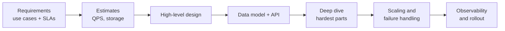

A reusable checklist for the deep dive and failure section:

- **Idempotency:** every write that can be retried has a key.
- **Retries:** exponential backoff with jitter, bounded attempts, only for retryable errors.
- **Timeouts:** every network call has one, shorter than the caller's timeout.
- **Queues:** at-least-once delivery means consumers must be idempotent; dead-letter queue for poison messages.
- **Caching:** what is cached, TTL, invalidation, what happens on a cache miss storm.
- **Data:** replication, backups, point-in-time recovery, partition key choice.
- **Overload:** rate limits, load shedding, circuit breakers.
- **Observability:** RED metrics (rate, errors, duration) per endpoint, traces across services, business metrics.

**Trade-offs:** Going deep everywhere is impossible in 45 minutes. Pick depth where the interviewer shows interest, and name what you are skipping. Starting with microservices for a small scale is a red flag; a modular monolith plus a queue is often the right first design.

**What interviewers listen for:**
- Numbers driving decisions ("2k writes per second fits one Postgres primary, so I won't shard yet").
- Explicit consistency choices per data type.
- Failure modes discussed without prompting: partial failure, retries, duplicates.
- Simple first, then evolve.
- Red flags: drawing Kafka, Redis and Kubernetes before knowing the load; "we'll just scale horizontally" with no partition key; ignoring money correctness.

> **Interview tip:** For a frontend engineer in a full-stack round, connect back to the client: how the API shape helps the UI (pagination, idempotency keys from the client, error codes the UI can act on). It turns your frontend background into a strength.

#### Q: [Mid] Walk me through a back-of-envelope estimate: 10 million users, 20% daily active, each makes 5 transfers and views history 10 times a day. How many requests per second, and how much storage per year?

**Short answer:** Daily actives are 2M. That gives 10M transfers and 20M history reads per day. Divide by about 100k seconds per day: roughly 100 writes/s and 200 reads/s on average, with peaks of 5–10x. At about 1KB per transfer row plus indexes, that is around 10GB per day and 3.5–4TB per year including overhead. All of this fits a well-tuned relational database with read replicas.

**Clarify first:**
- Peak-to-average ratio: payroll days and month-end are spiky in finance.
- Does one "transfer" create several rows (ledger entries, events, audit)?
- Retention: 7 years is common for financial records.

**Diagnose:** Find which number drives the design. Here storage over years and peak write rate matter; average read QPS is small.

**Solution:**

Useful constants:

| Item | Value |
|---|---|
| Seconds per day | 86,400, round to 100,000 |
| 1 million requests per day | about 12 per second |
| 1KB x 1 million | 1GB |
| Read from memory (Redis) | under 1ms in the same zone |
| Same-region network round trip | about 0.5–1ms |
| Cross-continent round trip | 100–150ms |
| One Postgres primary, simple indexed writes | several thousand per second on good hardware, verify by benchmark |

Calculation:

```text
DAU                = 10M * 20%               = 2M
Transfers per day  = 2M * 5                  = 10M
Reads per day      = 2M * 10                 = 20M
Average write QPS  = 10M / 100k s            = 100/s
Average read QPS   = 20M / 100k s            = 200/s
Peak (x10)         = 1,000 writes/s, 2,000 reads/s

Rows per transfer  = 1 transfer + 2 ledger entries + 1 outbox event = 4
Bytes per row      ~ 250 B data, ~ 1 KB per transfer total with indexes
Storage per day    = 10M * 1 KB              = 10 GB
Storage per year   = 10 GB * 365             = 3.65 TB
7-year retention   ~ 25 TB, so partition by month and move old partitions to cheaper storage
```

Bandwidth: history response of 20 rows at ~300B each is ~6KB; 2,000 reads/s peak is ~12MB/s. Small.

Conclusion you say out loud: "One primary database handles the writes. I'd add read replicas or a cache for history, partition the transactions table by month, and archive partitions older than 2 years to object storage or a warehouse."

**Trade-offs:** Rounding is fine and expected; precision wastes time. But be clear when a number is an assumption so the interviewer can correct it.

**What interviewers listen for:**
- Clean arithmetic with stated assumptions and rounding.
- Peak vs average.
- Turning numbers into decisions (shard or not, cache or not).
- Red flags: exact math that takes five minutes, no conclusion drawn from the numbers.

> **Gotcha:** People forget write amplification. One business action often writes 3–6 rows (entity, ledger, outbox, audit). Multiply before estimating storage and write QPS.

## 2. Classic building blocks

#### Q: [Mid] Design a URL shortener like bit.ly. 100 million new links per month, reads 100x writes.

**Short answer:** Generate a short unique code, store `code → long URL` in a key-value store, and serve redirects from a cache. Writes are about 40 per second and reads about 4,000 per second on average, so the main concerns are code generation without collisions, a cache-heavy read path, and abuse prevention.

**Clarify first:**
- Custom aliases? Expiration? Analytics (click counts, referrers)?
- 301 (permanent, browsers cache it, fewer hits to us) or 302 (temporary, every click hits us, better analytics)?
- Code length and character set?

**Diagnose:** The interesting parts are uniqueness of codes at scale and the hot read path.

**Solution:**

##### Capacity

```text
Writes: 100M / month / (30 * 100k s) ~ 33/s, call it 40/s, peak 400/s
Reads:  100x = 4,000/s average, peak 40k/s
Storage: 100M * 12 months * 5 years = 6B links * ~500 B = 3 TB
Code space: base62, 7 chars = 62^7 ~ 3.5 trillion, plenty for 6B
```

##### Architecture

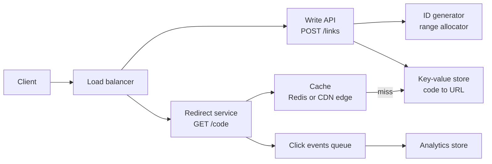

##### Code generation

Options:
1. **Random 7 chars + insert-if-not-exists.** Simple. Collision chance is tiny early but grows; retry on conflict.
2. **Counter + base62 encoding.** Each write server leases a range of 1,000 IDs from a central counter (a database sequence or ZooKeeper/etcd), then encodes locally. No collisions, no coordination per write. Codes are guessable in sequence; shuffle with a reversible bijection if that matters.
3. **Hash of the URL.** Deterministic dedupe, but collisions need handling and the same URL from different users shares a code.

```ts
const ALPHABET = '0123456789abcdefghijklmnopqrstuvwxyzABCDEFGHIJKLMNOPQRSTUVWXYZ';
function toBase62(n: bigint): string {
  if (n === 0n) return '0';
  let s = '';
  while (n > 0n) { s = ALPHABET[Number(n % 62n)] + s; n /= 62n; }
  return s;
}
```

##### Data model and API

```sql
CREATE TABLE links (
  code        VARCHAR(10) PRIMARY KEY,
  long_url    TEXT NOT NULL,
  owner_id    BIGINT,
  created_at  TIMESTAMPTZ NOT NULL DEFAULT now(),
  expires_at  TIMESTAMPTZ
);
```

```text
POST /links { url, customAlias?, expiresAt? } -> 201 { code, shortUrl }
GET  /{code} -> 302 Location: long_url   (or 404 / 410 if expired)
```

##### Scaling and failure

- Reads: cache in Redis with LRU; popular links can be cached at the CDN edge. A 90%+ hit rate is realistic because traffic follows a power law.
- Storage: a key-value or wide-column store (DynamoDB, Cassandra) partitions by `code` naturally; Postgres works up to billions of rows with care.
- Analytics: write click events to a queue asynchronously so redirects stay fast; losing a few clicks is acceptable.
- Abuse: validate URLs, check against malware lists, rate-limit creation per user/IP.
- If the ID allocator is down, servers keep using their leased range; lease larger ranges to ride out outages.

**Trade-offs:** 301 reduces load but kills analytics accuracy. Counter-based IDs avoid collisions but need an allocator. Random codes are coordination-free but need a uniqueness check.

**What interviewers listen for:**
- Correct capacity math and base62 reasoning.
- A collision-free ID strategy and its trade-offs.
- Cache-first read path; async analytics.
- Red flags: a single auto-increment database as the only write path at high scale without discussing limits, ignoring abuse.

#### Q: [Senior] Design a rate limiter for a public API: per API key, 100 requests per minute, enforced across 30 gateway instances.

**Short answer:** A shared counter store (Redis) with an atomic algorithm, token bucket or sliding window, executed as a Lua script so check-and-increment is one step. Gateways call it on every request, return `429` with `Retry-After` when over limit, and fail open or closed depending on the endpoint's risk.

**Clarify first:**
- Limit by API key, user, IP, or endpoint? Multiple tiers (free vs paid)?
- Burst allowed? (Token bucket allows bursts up to bucket size; sliding window is smoother.)
- Strictness: is 105 instead of 100 occasionally OK? (Affects whether local approximate limiting is acceptable.)
- Total traffic: say 50k requests per second across all keys.

**Diagnose:** Problems with naive limiters: a fixed window lets a client send 200 requests in 2 seconds around the minute boundary; per-instance counters let a client get 30x the limit; a non-atomic read-then-write races under concurrency.

**Solution:**

##### Architecture

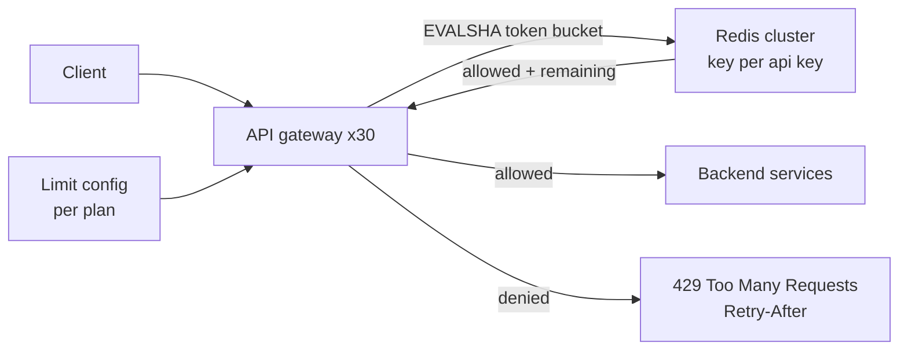

##### Algorithm: token bucket in Redis Lua

```lua
-- KEYS[1] = bucket key, ARGV: capacity, refill_per_ms, now_ms, cost
local cap    = tonumber(ARGV[1])
local rate   = tonumber(ARGV[2])
local now    = tonumber(ARGV[3])
local cost   = tonumber(ARGV[4])
local b      = redis.call('HMGET', KEYS[1], 'tokens', 'ts')
local tokens = tonumber(b[1]) or cap
local ts     = tonumber(b[2]) or now
tokens = math.min(cap, tokens + (now - ts) * rate)
local allowed = tokens >= cost
if allowed then tokens = tokens - cost end
redis.call('HSET', KEYS[1], 'tokens', tokens, 'ts', now)
redis.call('PEXPIRE', KEYS[1], math.ceil(cap / rate) * 2)
return { allowed and 1 or 0, math.floor(tokens) }
```

For 100 per minute: `capacity = 100`, `refill_per_ms = 100 / 60000`. Prefer Redis server time (`redis.call('TIME')`) over client clocks if gateway clocks may drift; note scripts that call `TIME` need care with replication modes, so many teams pass a gateway timestamp and accept small drift.

Gateway middleware:

```ts
async function rateLimit(req: Request, res: Response, next: NextFunction) {
  const key = `rl:${req.apiKey.id}`;
  try {
    const [allowed, remaining] = (await redis.evalsha(sha, 1, key, 100, 100 / 60000, Date.now(), 1)) as [number, number];
    res.setHeader('RateLimit-Limit', '100');
    res.setHeader('RateLimit-Remaining', String(remaining));
    if (!allowed) {
      res.setHeader('Retry-After', '1');
      return res.status(429).json({ error: 'rate_limited' });
    }
    next();
  } catch (e) {
    // Redis down: fail open for read endpoints, fail closed for expensive or risky ones.
    if (req.method === 'GET') return next();
    return res.status(503).json({ error: 'temporarily_unavailable' });
  }
}
```

The `RateLimit-*` header names come from an IETF draft; many APIs use `X-RateLimit-*`. Pick one and document it.

##### Capacity

50k requests/s means 50k Redis script calls/s. A single Redis node can do roughly 100k+ simple operations per second; Lua scripts are heavier, so use a Redis Cluster sharded by key, or a local pre-check.

##### Scaling and failure

- Hot keys: one huge customer hits one Redis shard. Give them a dedicated limit tier or split their bucket.
- Latency: each check adds ~0.5–1ms. For very high volume, use a two-tier approach: each gateway keeps a local token bucket with `limit / instances` and syncs periodically. Less exact, much cheaper.
- Redis failure: decide fail-open vs fail-closed per endpoint; alert either way.
- Layering: an edge/CDN limit by IP for DDoS, the gateway limit per key for fairness, and per-service concurrency limits to protect databases.

**Trade-offs:**
- Fixed window: simplest, boundary bursts. Sliding log: exact, memory per request. Sliding window counter: good approximation, cheap. Token bucket: allows controlled bursts, common default.
- Central store: accurate, adds a network hop and dependency. Local: fast, approximate.

**What interviewers listen for:**
- Atomicity (Lua or `INCR` + `EXPIRE` patterns) and why a read-then-write fails.
- Algorithm comparison with boundary-burst explanation.
- `429` with `Retry-After`, and client guidance (backoff with jitter).
- A fail-open vs fail-closed decision.
- Red flags: per-instance in-memory counters only, no TTL on keys, rate limiting in the database.

#### Q: [Senior] Design a file storage service: users upload statements and documents up to 2GB, share them by link, and download them. 5 million users, 50 million files.

**Short answer:** Metadata in a relational database, bytes in object storage (S3 or equivalent). Clients upload and download directly to storage with presigned URLs, so API servers only handle metadata and authorization. Files are scanned after upload, and downloads go through short-lived signed URLs or a CDN with signed cookies.

**Clarify first:**
- Average file size? Say 2MB average, 2GB max.
- Versioning of files? Folder hierarchy? Quotas?
- Sharing: public links, expiring links, specific users only?
- Compliance: encryption at rest with customer-managed keys? Retention and legal hold? Data residency?

**Diagnose:** Bottlenecks: bandwidth through app servers if they proxy bytes; metadata queries for large folders; the cost of storage at scale; malware in uploaded files.

**Solution:**

##### Capacity

```text
Files:     50M * 2 MB average = 100 TB, plus replication handled by object storage
Growth:    say 1M new files/day -> 2 TB/day ingress ~ 23 MB/s average
Metadata:  50M rows * ~1 KB = 50 GB, fits one Postgres with replicas
Downloads: 5M files/day -> ~60/s average, bytes served by storage/CDN not API
```

##### Architecture

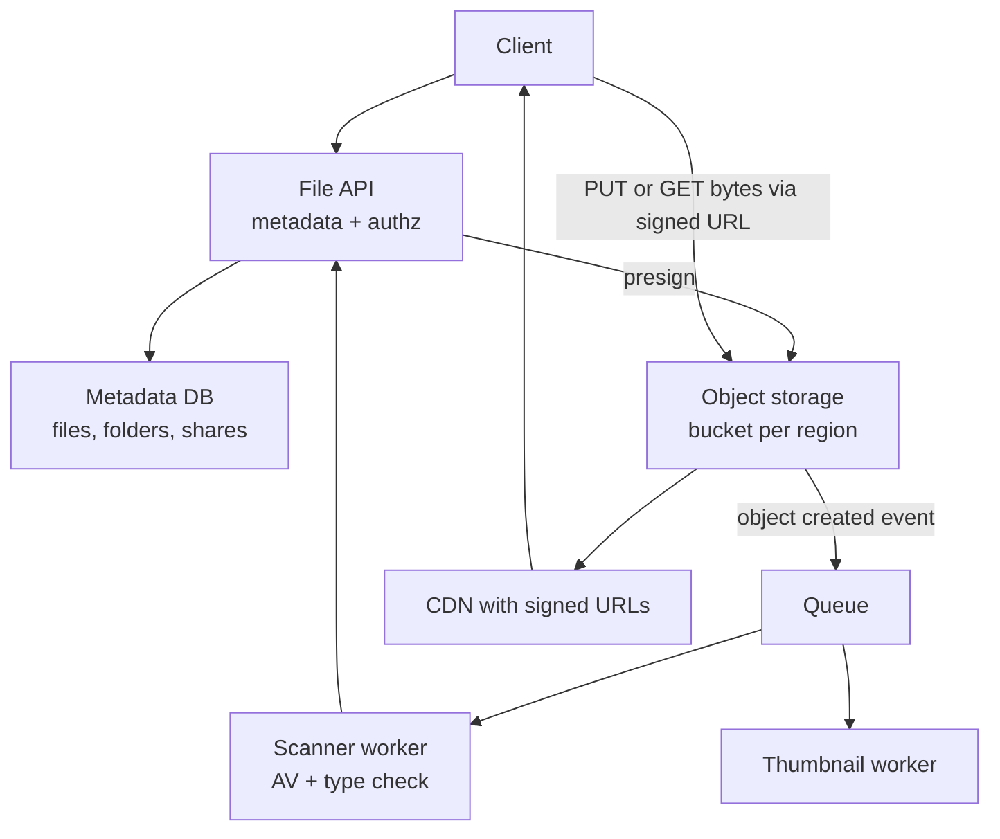

##### Data model

```sql
CREATE TABLE files (
  id            UUID PRIMARY KEY,
  owner_id      BIGINT NOT NULL,
  folder_id     UUID,
  name          TEXT NOT NULL,
  size_bytes    BIGINT NOT NULL,
  content_type  TEXT NOT NULL,
  storage_key   TEXT NOT NULL UNIQUE,      -- e.g. tenant/2026/10/<uuid>, never the user's file name
  sha256        CHAR(64),
  status        TEXT NOT NULL CHECK (status IN ('uploading','scanning','ready','quarantined','deleted')),
  created_at    TIMESTAMPTZ NOT NULL DEFAULT now()
);
CREATE INDEX ON files (owner_id, folder_id, name);

CREATE TABLE shares (
  id          UUID PRIMARY KEY,
  file_id     UUID NOT NULL REFERENCES files(id),
  token_hash  CHAR(64) NOT NULL UNIQUE,     -- store hash of the share token, not the token
  expires_at  TIMESTAMPTZ,
  created_by  BIGINT NOT NULL
);
```

##### API

```text
POST /files                  { name, size, contentType, folderId } -> { fileId, uploadUrl | multipart info }
POST /files/{id}/complete    -> { status: 'scanning' }
GET  /files/{id}/download    -> 302 to signed URL valid 5 minutes (after authz check)
POST /files/{id}/shares      { expiresAt } -> { url }
GET  /s/{token}              -> validates hash + expiry, then 302 to signed URL
```

##### Scaling and failure

- Large uploads use multipart upload (parts retried independently). A lifecycle rule aborts incomplete multipart uploads after N days to avoid paying for orphaned parts.
- Files are not downloadable until `status = 'ready'`. Quarantined files never get signed URLs.
- Serve downloads with `Content-Disposition: attachment` and from a separate domain to prevent stored XSS.
- Orphans: if the client uploads but never calls complete, a sweeper job reconciles storage objects with metadata.
- Deletes are soft first (recycle bin), then hard delete; legal hold blocks hard delete.
- Cost: lifecycle to infrequent-access tiers after 90 days. Deduplicate by `sha256` only within a tenant (cross-tenant dedupe can leak information).
- Region outage: object storage is durable within a region; cross-region replication if the RTO requires it.

**Trade-offs:** Presigned URLs remove servers from the data path but make authorization a one-time check at signing time; keep TTLs short. Proxying through the API gives full control and logging but costs bandwidth and scale.

**What interviewers listen for:**
- Metadata and bytes separated; direct-to-storage uploads.
- Scanning pipeline with explicit states.
- Secure sharing (hashed tokens, expiry) and safe serving.
- Lifecycle and orphan cleanup.
- Red flags: storing files as database BLOBs at this scale, using the user's file name as the storage key, long-lived public URLs.

## 3. Money systems

#### Q: [Staff] Design a payments and transfer system: users send money between accounts and to external banks. It must never lose or double-spend money, even when clients retry and services crash.

**Short answer:** Three ideas carry the design. First, every write API takes an idempotency key, so retries return the original result instead of moving money twice. Second, balances come from a double-entry ledger: each transfer writes balanced debit and credit entries in one database transaction, and entries are append-only. Third, anything that talks to an external system (bank rails, card networks) runs as a state machine driven by a transactional outbox and reconciled against the external system's records.

**Clarify first:**
- Internal transfers only, or also external rails (ACH, SEPA, Faster Payments, cards)? External rails are asynchronous and can fail or reverse days later.
- Volume: say 1,000 transfers per second at peak.
- Multi-currency? FX?
- Overdraft allowed? Holds and pending balances?
- Regulatory: audit trail, reconciliation, sanctions/fraud screening before release.

**Diagnose:** Find the failure windows. A client times out but the server committed: the retry must not create a second transfer. The service debits, then crashes before calling the bank: we need to know whether the bank got it. Two concurrent transfers from one account both see enough balance: overdraft by race.

**Solution:**

##### Capacity

```text
Peak 1,000 transfers/s. Each transfer = 1 transfer row + 2+ ledger entries + 1 outbox row + idempotency row
-> ~5,000 row writes/s at peak. A well-tuned Postgres primary can be in range; benchmark before deciding.
If not enough: shard by account_id. Transfers across shards then need a saga, which is why we avoid sharding early.
Ledger growth: 2,000 entries/s peak, ~50M/day average -> ~15 GB/day with indexes. Partition by month.
```

##### Architecture

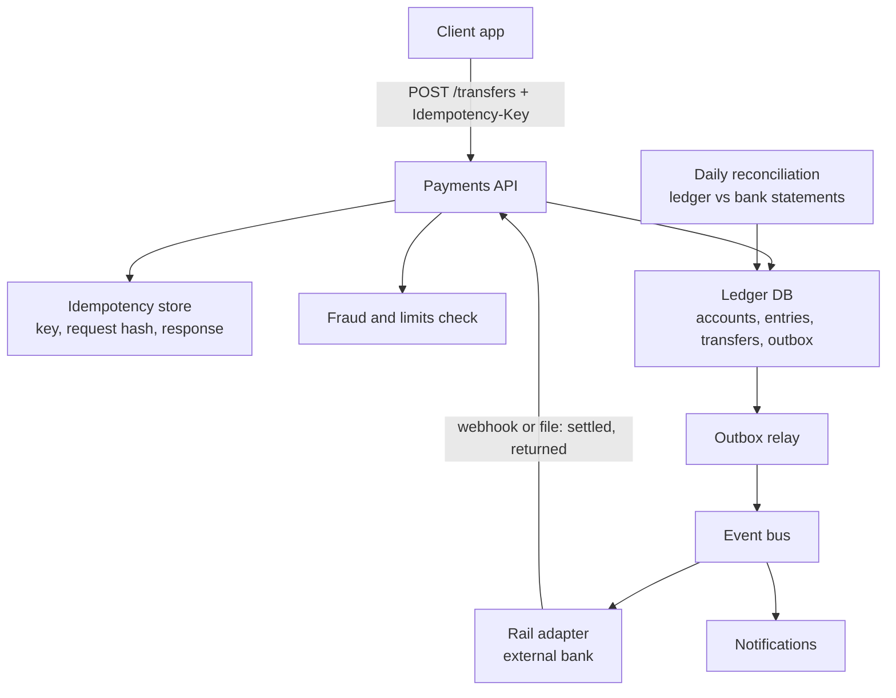

##### Double-entry ledger data model

Every movement is recorded as entries that sum to zero per transfer and currency. An external payout debits the user's account and credits a "clearing" account; when the bank confirms, clearing is debited and an "external settlement" account is credited.

```sql
CREATE TABLE ledger_accounts (
  id           BIGINT PRIMARY KEY,
  owner_type   TEXT NOT NULL,             -- 'customer', 'clearing', 'fees', 'settlement'
  currency     CHAR(3) NOT NULL,
  balance_minor BIGINT NOT NULL DEFAULT 0, -- cached balance, derived from entries
  version      BIGINT NOT NULL DEFAULT 0,
  allow_negative BOOLEAN NOT NULL DEFAULT false
);

CREATE TABLE transfers (
  id              UUID PRIMARY KEY,
  idempotency_key TEXT NOT NULL,
  client_id       BIGINT NOT NULL,
  status          TEXT NOT NULL,          -- 'posted','pending_external','settled','failed','reversed'
  amount_minor    BIGINT NOT NULL CHECK (amount_minor > 0),
  currency        CHAR(3) NOT NULL,
  created_at      TIMESTAMPTZ NOT NULL DEFAULT now(),
  UNIQUE (client_id, idempotency_key)
);

CREATE TABLE ledger_entries (
  id            BIGSERIAL PRIMARY KEY,
  transfer_id   UUID NOT NULL REFERENCES transfers(id),
  account_id    BIGINT NOT NULL REFERENCES ledger_accounts(id),
  direction     TEXT NOT NULL CHECK (direction IN ('debit','credit')),
  amount_minor  BIGINT NOT NULL CHECK (amount_minor > 0),
  currency      CHAR(3) NOT NULL,
  created_at    TIMESTAMPTZ NOT NULL DEFAULT now()
);
-- Append-only: no UPDATE or DELETE grants on ledger_entries. Corrections are new reversing entries.

CREATE TABLE outbox (
  id          BIGSERIAL PRIMARY KEY,
  topic       TEXT NOT NULL,
  payload     JSONB NOT NULL,
  created_at  TIMESTAMPTZ NOT NULL DEFAULT now(),
  published_at TIMESTAMPTZ
);
```

Money is stored in integer minor units (`amount_minor`, like `amountCents`), never floats.

##### API

```text
POST /transfers
  Headers: Idempotency-Key: 3f6c...   (client generates a UUID per user intent)
  Body:    { fromAccountId, toAccountId | externalBeneficiaryId, amountMinor, currency, reference }
  201 { transferId, status: 'posted' | 'pending_external' }
  409 { error: 'idempotency_key_reused' }   (same key, different body)
  422 { error: 'insufficient_funds' }
GET /transfers/{id}
GET /accounts/{id}/balance -> { available, ledger, pending }
```

##### Posting a transfer atomically

```ts
async function createInternalTransfer(clientId: number, key: string, req: TransferRequest) {
  return db.tx(async (t) => {
    // 1. Idempotency: insert-or-get. The unique constraint makes this race-safe.
    const existing = await t.oneOrNone(
      `SELECT id, status FROM transfers WHERE client_id = $1 AND idempotency_key = $2`, [clientId, key]);
    if (existing) return existing;                       // also compare stored request hash in real code

    // 2. Lock both accounts in a consistent order to avoid deadlocks.
    const [a, b] = [req.fromAccountId, req.toAccountId].sort((x, y) => x - y);
    const rows = await t.many(
      `SELECT id, balance_minor, allow_negative FROM ledger_accounts WHERE id IN ($1, $2) ORDER BY id FOR UPDATE`, [a, b]);
    const from = rows.find((r) => r.id === req.fromAccountId)!;
    if (!from.allow_negative && BigInt(from.balance_minor) < BigInt(req.amountMinor)) {
      throw new BusinessError('insufficient_funds');
    }

    // 3. Write transfer, two balanced entries, update cached balances, outbox event. One commit.
    const transferId = crypto.randomUUID();
    await t.none(`INSERT INTO transfers (id, idempotency_key, client_id, status, amount_minor, currency)
                  VALUES ($1, $2, $3, 'posted', $4, $5)`, [transferId, key, clientId, req.amountMinor, req.currency]);
    await t.none(`INSERT INTO ledger_entries (transfer_id, account_id, direction, amount_minor, currency) VALUES
                  ($1, $2, 'debit', $4, $5), ($1, $3, 'credit', $4, $5)`,
                 [transferId, req.fromAccountId, req.toAccountId, req.amountMinor, req.currency]);
    await t.none(`UPDATE ledger_accounts SET balance_minor = balance_minor - $2, version = version + 1 WHERE id = $1`,
                 [req.fromAccountId, req.amountMinor]);
    await t.none(`UPDATE ledger_accounts SET balance_minor = balance_minor + $2, version = version + 1 WHERE id = $1`,
                 [req.toAccountId, req.amountMinor]);
    await t.none(`INSERT INTO outbox (topic, payload) VALUES ('transfer.posted', $1)`,
                 [{ transferId, ...req }]);
    return { id: transferId, status: 'posted' };
  });
}
```

If two requests with the same key race, one insert fails on the unique constraint; catch that error, re-read, and return the stored result.

Here "debit" reduces a customer account and "credit" increases it. Accountants use the opposite sign conventions for liability accounts; pick one convention and document it. The invariant is what matters: for every transfer and currency, sum of debits equals sum of credits.

##### External payouts as a state machine

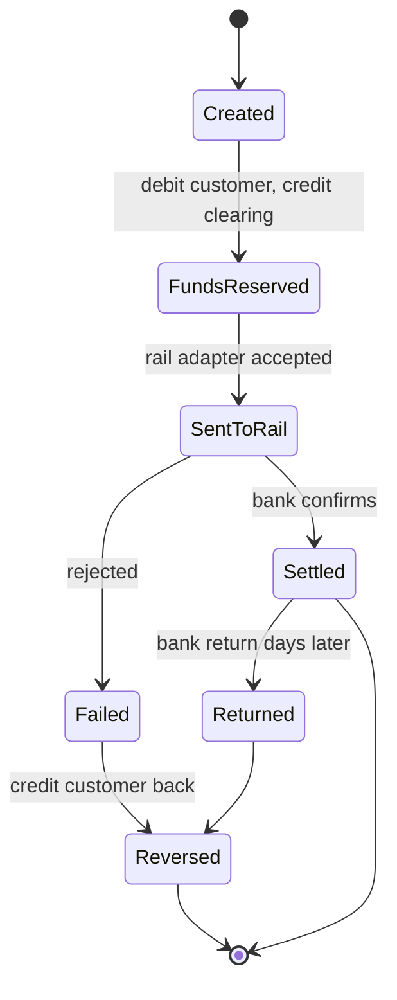

The rail adapter consumes `transfer.posted` events from the outbox. It sends its own idempotency key (the transfer ID) to the bank API, so a retried send is safe if the bank supports it; if not, it queries the bank for the payment status before resending.

##### Failure handling

- Client timeout: client retries with the same key and gets the original result.
- Crash after commit, before publishing: the outbox relay publishes later. Consumers are idempotent by `transferId` because delivery is at-least-once.
- Crash between "debited" and "sent to bank": the state is `FundsReserved` in the database; a recovery job resumes stuck transfers.
- Unknown bank outcome (timeout): never assume failure. Mark `unknown`, query status, and reconcile. Reversing a transfer that actually succeeded loses money.
- Reconciliation: daily (or more often) match ledger clearing entries to bank statements. Unmatched items create exceptions for operations.
- Invariant checks: a scheduled job verifies that entries sum to zero per transfer and that cached balances equal the sum of entries.

##### Scaling

- Hot accounts (a merchant receiving thousands of credits per second) serialize on one row lock. Options: split into sub-accounts and sum them, or batch credits.
- Read balances from the cached `balance_minor` column, history from replicas.
- If one primary is not enough, shard by account. Cross-shard transfers become two local transactions linked by a saga through a clearing account, which is more complex, so delay this.

**Trade-offs:**
- Cached balances need careful updates inside the same transaction; computing from entries on every read is simpler but slower.
- Pessimistic locks (`FOR UPDATE`) are simple and correct; optimistic version checks scale better under low contention but retry under high contention.
- Strong consistency in one database is far easier than distributed transactions; accept the scale ceiling until numbers prove otherwise.

**What interviewers listen for:**
- Idempotency key semantics: scope per client, stored response, request-hash check, TTL.
- Double-entry invariant and append-only ledger with reversals.
- Transactional outbox instead of "write DB then publish" (dual write).
- Unknown outcomes treated as unknown, plus reconciliation.
- Lock ordering for deadlocks.
- Red flags: `UPDATE balance = balance - x` with no ledger, floats for money, distributed 2PC as the first idea, deleting or editing ledger rows.

> **Finance tip:** "Available balance" (ledger minus holds) and "ledger balance" are different numbers. Card authorizations create holds before settlement. Ask which one the UI shows.

#### Q: [Senior] Design transaction history for 20 million users: list with filters (date, amount range, merchant text), full-text search, and export of up to 5 years to CSV.

**Short answer:** The ledger database stays the source of truth, but history reads come from a read-optimized store: a partitioned table keyed by account and time for listing, plus a search index (OpenSearch/Elasticsearch) fed by change events for text search. Listing uses keyset pagination. Exports run as background jobs that stream to object storage and notify the user.

**Clarify first:**
- Transactions per user: say 100 per month on average, heavy users 10k per month.
- Freshness: must a transfer appear in history within 1 second, or is 5–10 seconds fine?
- Search: merchant prefix, fuzzy, or free text on description and notes?
- Export formats and size: 5 years for a heavy user is 600k rows.

**Diagnose:** Signs of trouble in an existing system: `OFFSET 10000` queries slow; `ILIKE '%coffee%'` doing sequential scans (check `EXPLAIN ANALYZE`); exports timing out on the API; history queries competing with payment writes on the primary.

**Solution:**

##### Capacity

```text
Rows: 20M users * 100/month * 12 * 5 years = 120B rows? That is too high for "average active".
Re-check: assume 20M users, 40% active, 60 tx/month -> 8M * 60 * 12 = ~5.8B rows per year.
At ~200 B per row + indexes ~ 500 B -> ~3 TB per year. 5 years ~ 15 TB.
Reads: history views ~ 50M/day -> ~600/s average, ~5k/s peak.
```

Saying the correction out loud is fine; interviewers like seeing you sanity-check.

##### Architecture

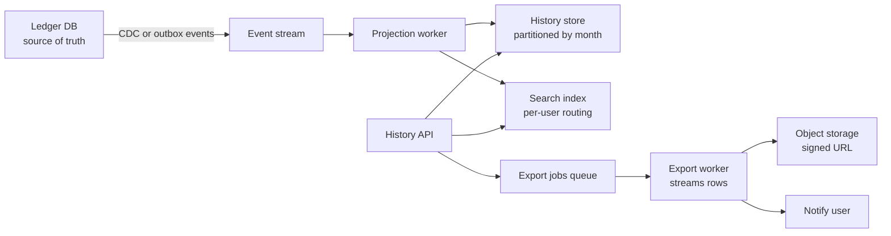

##### Data model and query

```sql
CREATE TABLE tx_history (
  account_id    BIGINT NOT NULL,
  posted_at     TIMESTAMPTZ NOT NULL,
  tx_id         UUID NOT NULL,
  amount_minor  BIGINT NOT NULL,
  currency      CHAR(3) NOT NULL,
  merchant      TEXT,
  description   TEXT,
  category      TEXT,
  PRIMARY KEY (account_id, posted_at, tx_id)
) PARTITION BY RANGE (posted_at);

-- First page / next page, newest first, with optional amount filter
SELECT tx_id, posted_at, amount_minor, currency, merchant
FROM tx_history
WHERE account_id = $1
  AND posted_at >= $2 AND posted_at < $3
  AND ($4::bigint IS NULL OR amount_minor >= $4)
  AND (posted_at, tx_id) < ($5, $6)          -- cursor from last row
ORDER BY posted_at DESC, tx_id DESC
LIMIT 50;
```

The primary key index on `(account_id, posted_at, tx_id)` supports this; partition pruning skips months outside the range. The `(a, b) < (x, y)` row comparison works with descending scans of that index in Postgres.

Search: index documents with `account_id` as a routing key so a query touches one shard, and always filter by `account_id` server-side. Text queries go to the search index, which returns IDs and fields for display.

##### API

```text
GET  /accounts/{id}/transactions?from=2026-01-01&to=2026-10-01&minAmount=1000&cursor=...&limit=50
GET  /accounts/{id}/transactions/search?q=coffee&cursor=...
POST /accounts/{id}/exports { from, to, format: 'csv' } -> 202 { exportId }
GET  /exports/{exportId} -> { status, downloadUrl? }
```

##### Export worker

```ts
import { pipeline } from 'node:stream/promises';
import { Transform } from 'node:stream';
import QueryStream from 'pg-query-stream';

async function runExport(job: ExportJob) {
  const client = await pool.connect();
  try {
    const rows = client.query(new QueryStream(
      `SELECT posted_at, tx_id, amount_minor, currency, merchant FROM tx_history
       WHERE account_id = $1 AND posted_at >= $2 AND posted_at < $3 ORDER BY posted_at`,
      [job.accountId, job.from, job.to], { batchSize: 1000 }));
    const toCsv = new Transform({
      objectMode: true,
      transform(r, _enc, cb) { cb(null, `${r.posted_at.toISOString()},${r.tx_id},${formatMinor(r.amount_minor)},${r.currency},${csvEscape(r.merchant)}\n`); },
    });
    await pipeline(rows, toCsv, createGzip(), uploadStream(`exports/${job.id}.csv.gz`)); // memory stays flat
  } finally {
    client.release();
  }
}
```

(`createGzip` is from `node:zlib`; `uploadStream` stands for a multipart upload helper such as `@aws-sdk/lib-storage`'s `Upload`.)

##### Scaling and failure

- Read path is separate from the ledger primary, so payments are not slowed by history traffic.
- Projection lag: show "recent transactions may take a few seconds to appear," or merge the last few minutes from the ledger for the first page.
- Projection worker is idempotent (upsert by `tx_id`); on bugs, rebuild the projection by replaying events.
- Export jobs: limit concurrent exports per user, retry on failure, expire files after 7 days, audit every export (it is bulk PII).
- Old partitions move to cheaper storage; a 5-year export can read from a warehouse copy.

**Trade-offs:** A separate read store adds lag and another system to operate, but protects the write path. A search engine gives good text search at the cost of eventual consistency and infrastructure. Postgres trigram indexes (`pg_trgm`) are a simpler start if the dataset per user is small.

**What interviewers listen for:**
- CQRS-style split justified by numbers, not fashion.
- Keyset pagination with a tiebreaker and a matching index.
- Partitioning and retention.
- Streaming exports as async jobs.
- Red flags: `OFFSET` pagination, `LIKE '%x%'` on billions of rows, building exports in API memory, search without tenant/account filtering.

#### Q: [Mid] Design a report generation service: users request monthly statements and custom PDF/Excel reports. Some take 2 minutes to build. At month-end, 2 million statements are generated.

**Short answer:** An async job system. The API accepts a request and returns a job ID; workers pull jobs from a queue, query a read replica or warehouse, render the file, store it in object storage, and notify the user. Month-end batch work is scheduled and rate-controlled so it does not starve on-demand reports.

**Clarify first:**
- Statement generation is regulatory? Then it must be complete, immutable once issued, and archived.
- Deadline: all statements available by day 3 of the month?
- On-demand report SLA: under 2 minutes?
- Template changes: who edits them, how are they versioned?

**Diagnose:** Failure patterns: generating in the HTTP request (timeouts at 30–60s); workers hitting the primary database; one huge report blocking the queue; duplicates when a job is retried after the worker died mid-upload.

**Solution:**

##### Capacity

```text
Month-end: 2M statements in 48 hours -> ~12/s.
At 3 s per statement per worker -> ~36 worker processes busy. Scale workers to ~50 for headroom.
Output: 2M * 200 KB PDF = 400 GB per month, retained 7 years -> ~34 TB.
```

##### Architecture

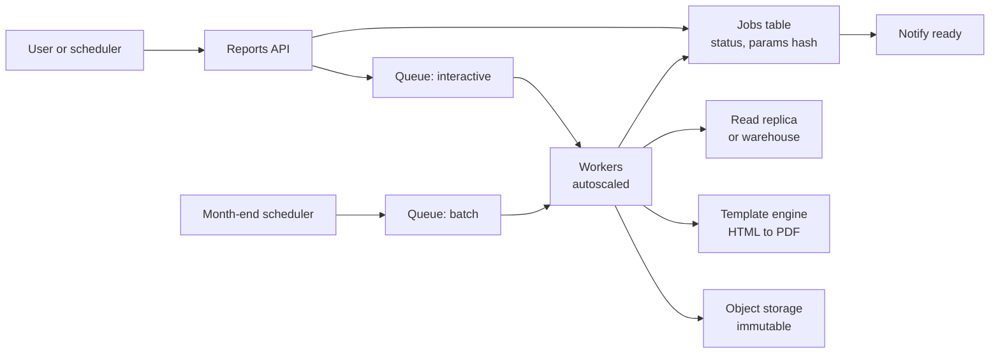

##### Data model and API

```sql
CREATE TABLE report_jobs (
  id            UUID PRIMARY KEY,
  owner_id      BIGINT NOT NULL,
  kind          TEXT NOT NULL,                  -- 'monthly_statement', 'custom_pnl'
  params        JSONB NOT NULL,
  params_hash   CHAR(64) NOT NULL,
  status        TEXT NOT NULL,                  -- queued, running, succeeded, failed
  attempts      INT NOT NULL DEFAULT 0,
  output_key    TEXT,
  template_version TEXT NOT NULL,
  created_at    TIMESTAMPTZ NOT NULL DEFAULT now(),
  UNIQUE (owner_id, kind, params_hash)          -- dedupe identical requests
);
```

```text
POST /reports { kind, params } -> 202 { jobId }   (returns existing job if identical and recent)
GET  /reports/{jobId}          -> { status, downloadUrl? }
```

##### Worker loop

```ts
async function handle(job: ReportJob) {
  const key = `reports/${job.ownerId}/${job.id}.pdf`;       // deterministic: a retry overwrites, never duplicates
  await jobs.update(job.id, { status: 'running', attempts: job.attempts + 1 });
  const data = await readReplica.fetchStatementData(job.params);
  const pdf = await renderPdf(templates.get(job.kind, job.templateVersion), data);
  await storage.put(key, pdf, { contentType: 'application/pdf' });
  await jobs.update(job.id, { status: 'succeeded', outputKey: key });
  await events.publish('report.ready', { jobId: job.id, ownerId: job.ownerId });
}
```

##### Scaling and failure

- Separate queues (or priorities) for interactive and batch; reserve worker capacity for interactive.
- Visibility timeout on the queue longer than the slowest report; workers heartbeat to extend it.
- Max attempts then dead-letter queue and an alert; the user sees "failed, we're on it" rather than spinning forever.
- Deterministic output keys make retries idempotent.
- Read from a replica or warehouse snapshot taken at month close, so all statements reflect the same cutoff.
- Headless browser rendering is memory-hungry; cap concurrency per worker and recycle processes.

**Trade-offs:** HTML-to-PDF through a headless browser gives design flexibility but is slow and heavy; PDF libraries are faster but harder to template. Precomputing all statements costs storage but makes month-end downloads instant.

**What interviewers listen for:**
- Async job pattern with status polling or notification.
- Capacity math for the batch window.
- Idempotent retries, DLQ, isolation of batch from interactive work.
- Immutability and template versioning for regulated documents.
- Red flags: generating PDFs inside the request, reading from the primary, no retry limit.

## 4. Communication and real-time systems

#### Q: [Senior] Design a notification system: email, SMS and push for 10 million users. It sends OTP codes, "transfer received" alerts and marketing campaigns. Users choose their preferences, and nobody should get the same alert twice.

**Short answer:** Producers publish a notification *event* ("transfer.received for user 42"), not a message. A notification service looks up the user's preferences and quiet hours, renders templates per channel, deduplicates with an idempotency key, and enqueues one delivery job per channel on priority-separated queues. Channel workers call providers (email, SMS, push) with retries and fallbacks, and record delivery status from provider webhooks. OTPs get their own fast lane so a 5-million-user marketing campaign can never delay a login code.

**Clarify first:**
- Notification types and their priority: OTP (seconds, critical), transactional (minutes), marketing (hours, opt-in only).
- Volume: say 30 million notifications per day normally, campaigns of 5 million at once.
- Which channels are mandatory for regulated messages (some alerts must be delivered regardless of preferences)?
- Do we need an in-app inbox (history) too?
- Localization, per-user time zones, quiet hours.

**Diagnose:** Typical failures to design against: OTPs stuck behind campaign traffic; duplicate SMS when a worker retries after a timeout; sending to users who unsubscribed (legal risk); a provider outage dropping messages; a push token that expired years ago still being tried.

**Solution:**

##### Capacity

```text
30M/day -> ~350/s average; peak 10x -> ~3,500/s.
Campaign: 5M emails over 2 hours -> ~700/s, throttled to the provider's send rate.
Storage: notification log 30M rows/day * ~500 bytes -> ~15 GB/day; keep 90 days hot (~1.4 TB), archive the rest.
```

##### Architecture

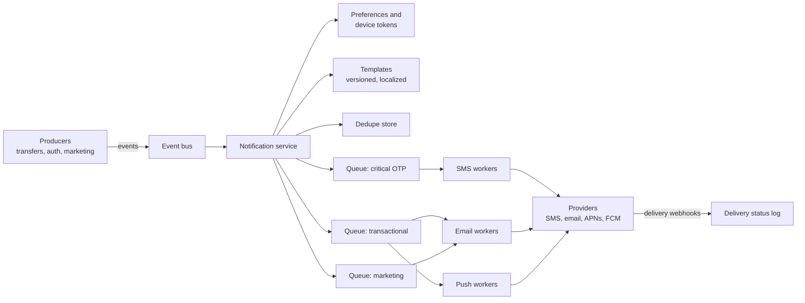

##### Data model

```sql
CREATE TABLE notification_preferences (
  user_id     BIGINT NOT NULL,
  category    TEXT NOT NULL,           -- 'security', 'transactions', 'marketing'
  channel     TEXT NOT NULL,           -- 'email', 'sms', 'push'
  enabled     BOOLEAN NOT NULL,
  PRIMARY KEY (user_id, category, channel)
);

CREATE TABLE notifications (
  id            UUID PRIMARY KEY,
  dedupe_key    TEXT NOT NULL UNIQUE,  -- e.g. 'transfer.received:tr_123:user_42'
  user_id       BIGINT NOT NULL,
  category      TEXT NOT NULL,
  template_id   TEXT NOT NULL,
  template_ver  INT NOT NULL,
  payload       JSONB NOT NULL,        -- no secrets: never store the OTP code itself here
  created_at    TIMESTAMPTZ NOT NULL DEFAULT now()
);

CREATE TABLE deliveries (
  id              UUID PRIMARY KEY,
  notification_id UUID NOT NULL REFERENCES notifications(id),
  channel         TEXT NOT NULL,
  provider        TEXT,
  provider_msg_id TEXT,
  status          TEXT NOT NULL,       -- queued, sent, delivered, bounced, failed
  attempts        INT NOT NULL DEFAULT 0,
  updated_at      TIMESTAMPTZ NOT NULL DEFAULT now(),
  UNIQUE (notification_id, channel)    -- one delivery per channel per notification
);
```

##### API

```text
POST /notifications   (internal)
  { dedupeKey, userId, category, templateId, data, channels?: ["sms"] }
  -> 202 { notificationId }   (same response if dedupeKey was already seen)

GET  /users/me/notification-preferences
PUT  /users/me/notification-preferences  [{ category, channel, enabled }]
POST /webhooks/{provider}                 (signed delivery receipts)
```

Dedupe happens at insert time:

```ts
async function accept(cmd: NotifyCommand) {
  const inserted = await db.query(
    `INSERT INTO notifications (id, dedupe_key, user_id, category, template_id, template_ver, payload)
     VALUES ($1, $2, $3, $4, $5, $6, $7)
     ON CONFLICT (dedupe_key) DO NOTHING
     RETURNING id`,
    [uuid(), cmd.dedupeKey, cmd.userId, cmd.category, cmd.templateId, cmd.templateVer, cmd.data],
  );
  if (inserted.rowCount === 0) return; // already handled: a duplicate event or a retry

  const channels = await resolveChannels(cmd.userId, cmd.category); // preferences, quiet hours, mandatory rules
  for (const channel of channels) {
    await queues[priorityOf(cmd.category)].add('deliver', { notificationId: inserted.rows[0].id, channel }, {
      jobId: `${inserted.rows[0].id}:${channel}`, // queue-level dedupe too
      attempts: 6,
      backoff: { type: 'exponential', delay: 2000 },
    });
  }
}
```

##### Scaling and failure

- **Priority isolation:** separate queues and worker pools per priority; OTP workers are never shared with campaigns.
- **Provider failover:** two SMS providers; on a breaker opening, route to the secondary. Email providers rate-limit per sending domain, so throttle campaign workers to the agreed rate.
- **Exactly-once is impossible at the provider boundary:** if the provider accepted the SMS but the response timed out, a retry may send it twice. Pass our delivery id as the provider's idempotency key or reference where supported; otherwise accept rare duplicates for transactional messages and never retry OTPs blindly (the user can tap "resend").
- **Token hygiene:** remove push tokens when APNs or FCM reports them invalid; suppress email addresses that hard-bounce.
- **Campaigns:** expand the audience in a batch job that writes notifications in chunks and respects preferences at send time, not at campaign creation (a user may unsubscribe in between).
- **Expiry:** OTP jobs carry `expiresAt`; workers drop them if they're too old instead of sending a useless code.

> **Gotcha:** Don't store OTP codes or full account numbers in the notification payload or logs. Store a reference and render the secret only in the worker, in memory.

> **Finance tip:** Security notifications ("new device signed in", "password changed") are usually mandatory and should bypass marketing opt-outs. Model this with categories, not with special cases in code.

**Trade-offs:** One queue per channel and priority is more infrastructure but gives isolation. Storing every notification enables an in-app inbox and audits but costs storage; set retention. Multiple providers improve availability but add template and reporting differences.

**What interviewers listen for:**
- Events in, preferences and templates in the notification service, not in every producer.
- Dedupe keys at multiple layers and honesty that provider-level duplicates can still happen.
- Priority isolation for OTPs, throttling for campaigns.
- Delivery status via webhooks, token and bounce hygiene.
- Red flags: services calling Twilio directly from request handlers, one shared queue, ignoring unsubscribe at send time.

#### Q: [Staff] Design a real-time price feed for our trading app: about 5,000 instruments, prices tick up to 10 times per second, and up to 1 million connected web and mobile clients at market open, each watching 20–50 symbols.

**Short answer:** Separate ingestion from fan-out. A small ingestion tier consumes the market data feed, normalizes it and publishes the latest price per symbol to an internal pub/sub layer. A large, horizontally scaled tier of WebSocket gateways holds the client connections, subscribes only to the symbols its clients want, and *conflates*: instead of forwarding every tick, it sends each client the latest value per symbol in one batched frame every 250–500 ms. Clients get a snapshot on subscribe and sequence-numbered updates after, and reconnect with jittered backoff to a different gateway when one dies.

**Clarify first:**
- Who needs every tick (none of our retail UI users can see 10 updates a second) versus who needs the latest value? Conflation depends on this.
- Data licensing: are we allowed to redistribute real-time prices, or must some users see 15-minute delayed data?
- Latency target: under 1 s from exchange to screen is typical for retail UIs.
- Is ordering important across symbols? Usually only per symbol.
- Do clients also place orders over the same connection? (Keep orders on normal HTTPS APIs.)

**Diagnose:** Naive designs fail here: one server can't hold 1 million connections; broadcasting every tick to every client is 5,000 x 10 x 1M messages per second; a single gateway restart reconnecting 40,000 clients at once overloads the auth service; a slow mobile client fills server memory with unsent messages.

**Solution:**

##### Capacity

```text
Inbound: 5,000 symbols * 10 ticks/s = 50k updates/s. Small; a few ingestion nodes.
Outbound without conflation: 1M clients * 35 symbols * 10/s = 350M messages/s. Not feasible or useful.
With conflation and batching: 1 frame per client every 250 ms = 4M frames/s, each with only the symbols that changed.
Connections: at ~40k connections per gateway node (tune by load test) -> ~25 nodes, run 40 for headroom and failures.
Bandwidth: ~4M frames/s * ~300 bytes -> ~1.2 GB/s egress total, ~30 MB/s per node.
```

These per-node numbers depend heavily on runtime, message size and TLS; treat them as a starting point for load tests, not facts.

##### Architecture

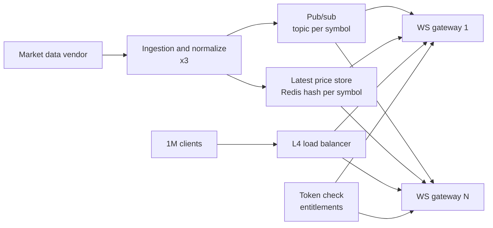

The pub/sub layer can be Redis Pub/Sub, NATS or Kafka. Each gateway subscribes once per symbol that at least one of its clients wants, so internal fan-out is gateways x symbols, not clients x symbols.

##### Protocol and API

```text
WSS /v1/prices?token=...   (or token in the first message, so it isn't logged in URLs)

client -> { "op": "subscribe", "symbols": ["AAPL", "MSFT"] }
server -> { "op": "snapshot", "data": { "AAPL": { "px": "189.42", "seq": 88121, "ts": 1759411200123 } } }
server -> { "op": "update", "data": { "AAPL": { "px": "189.44", "seq": 88125, "ts": 1759411200373 } } }
client -> { "op": "unsubscribe", "symbols": ["MSFT"] }
server -> { "op": "ping" }   client -> { "op": "pong" }
```

Prices are strings (or integer minor units with a scale), never floats. `seq` is per symbol; a client that sees a gap or reconnects asks for a fresh snapshot.

##### Gateway conflation loop

```ts
type Tick = { px: string; seq: number; ts: number };

class ClientSession {
  readonly symbols = new Set<string>();
  private pending = new Map<string, Tick>(); // latest value per symbol only

  constructor(private readonly ws: WebSocket) {}

  onTick(symbol: string, tick: Tick) {
    this.pending.set(symbol, tick); // overwrite: older unsent ticks are dropped on purpose
  }

  flush() {
    if (this.pending.size === 0) return;
    if (this.ws.bufferedAmount > 1_000_000) return; // slow client: skip this round, keep only latest
    this.ws.send(JSON.stringify({ op: 'update', data: Object.fromEntries(this.pending) }));
    this.pending.clear();
  }
}

setInterval(() => sessions.forEach((s) => s.flush()), 250);
```

Memory per client is bounded by the number of subscribed symbols, regardless of tick rate or client speed.

##### Scaling and failure

- **Gateway death:** clients reconnect with exponential backoff and jitter (and a random initial delay of 0–5 s) to avoid a thundering herd, then resubscribe and receive a snapshot.
- **Deploys:** drain gateways gradually, sending a "reconnect" message to a slice of clients at a time.
- **Auth at scale:** validate a signed short-lived token locally on the gateway (JWT with cached JWKS) rather than calling the auth service per connection. Re-check entitlements (real-time vs delayed data) periodically and when the token expires.
- **Ingestion failure:** run ingestion as active-passive or active-active with dedupe by sequence; mark prices "stale" in the UI if no update for N seconds.
- **Hot symbols:** a meme stock watched by 800k clients is fine because each gateway subscribes once; the cost is per-client frame building, spread over all gateways.
- **Mobile:** background apps disconnect; use push notifications for price alerts rather than keeping sockets alive.
- **Alternative:** Server-Sent Events works well for one-way feeds over HTTP/2 and is simpler behind some proxies; WebSockets are better if clients send subscribe messages often.

> **Why:** Conflation is the key idea. A human can't read 10 price changes per second, and a phone on 4G can't receive them reliably. Sending "latest value every 250 ms" cuts traffic by orders of magnitude without hurting the experience.

> **Gotcha:** Without backpressure handling (`bufferedAmount` checks or dropping old data), a few slow clients can make a gateway run out of memory and disconnect 40,000 healthy ones.

**Trade-offs:** Conflation loses intermediate ticks, which is wrong for charting every trade or for algorithmic clients; give those a separate, smaller, unconflated feed. Kafka gives replay and durability but higher latency than Redis Pub/Sub or NATS; for latest-price fan-out, durability usually matters less than speed. Bigger gateway nodes mean fewer machines but larger blast radius on failure.

**What interviewers listen for:**
- Capacity math that shows why naive fan-out fails.
- Ingestion separated from connection tier; gateways subscribe per symbol, not per client.
- Conflation, batching, backpressure, snapshot plus sequence numbers.
- Reconnect storms with jitter, local token validation, entitlement checks.
- Red flags: one Node server with `socket.io` broadcasting everything, floats for prices, polling the database per client.

## 5. Platform systems

#### Q: [Senior] We're turning our wealth dashboard into a B2B SaaS: 500 advisory firms (tenants), from 5-user boutiques to one bank with 20,000 users. Design the multi-tenant architecture so one tenant can never see another's data.

**Short answer:** Pick an isolation model per tier: a shared database with a `tenant_id` on every row and Postgres row-level security (RLS) for most tenants, and a dedicated database (or schema) for the few large or regulated ones. The tenant is resolved once at the edge from the authenticated user, carried in the request context, and enforced in the database, not just in application `WHERE` clauses. Add per-tenant rate limits, quotas and metrics so a noisy tenant can't degrade everyone.

**Clarify first:**
- Do some tenants require data residency (EU data stays in EU) or a dedicated environment by contract?
- Do tenants need custom domains, SSO with their own identity provider, custom branding?
- Can one user belong to multiple tenants (an advisor working with two firms)?
- Size spread: the bank alone may be 40% of total data.
- Do we need per-tenant backups and restores ("restore our firm to yesterday")?

**Diagnose:** The main risks: a missing `WHERE tenant_id = ...` in one query leaking data; one big tenant's report job slowing everyone; migrations that take hours because one shared table is huge; inability to delete or export one tenant's data on request.

**Solution:**

##### Isolation models

| Model | Isolation | Cost and ops | Good for |
|---|---|---|---|
| Shared tables + `tenant_id` + RLS | Logical | Cheapest, one migration | Most small and mid tenants |
| Schema per tenant | Stronger | Many schemas, migrations per schema | Dozens to a few hundred tenants |
| Database per tenant | Strong, separate backups | Highest, fleet management | Large, regulated, residency |

A hybrid is common: a "pooled" tier and a "silo" tier behind the same application code, with a tenant directory that says where each tenant's data lives.

##### Architecture

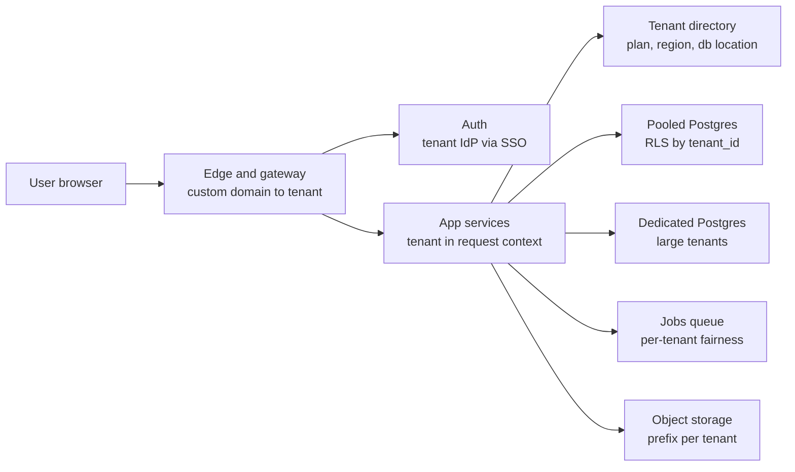

##### Data model with RLS

```sql
CREATE TABLE tenants (
  id         UUID PRIMARY KEY,
  slug       TEXT UNIQUE NOT NULL,
  plan       TEXT NOT NULL,
  region     TEXT NOT NULL,
  db_cluster TEXT NOT NULL            -- 'pool-eu-1' or 'silo-bigbank'
);

CREATE TABLE client_accounts (
  tenant_id    UUID NOT NULL REFERENCES tenants(id),
  id           UUID NOT NULL,
  name         TEXT NOT NULL,
  balance_cents BIGINT NOT NULL,
  PRIMARY KEY (tenant_id, id)         -- tenant first: data for one tenant is clustered in indexes
);

ALTER TABLE client_accounts ENABLE ROW LEVEL SECURITY;
ALTER TABLE client_accounts FORCE ROW LEVEL SECURITY;   -- applies even to the table owner
CREATE POLICY tenant_isolation ON client_accounts
  USING (tenant_id = current_setting('app.tenant_id')::uuid)
  WITH CHECK (tenant_id = current_setting('app.tenant_id')::uuid);
```

The application connects as a role without `BYPASSRLS` and sets the tenant per transaction:

```ts
export async function withTenant<T>(tenantId: string, fn: (tx: PoolClient) => Promise<T>): Promise<T> {
  const client = await poolFor(tenantId).connect(); // pooled or dedicated cluster from the directory
  try {
    await client.query('BEGIN');
    await client.query(`SELECT set_config('app.tenant_id', $1, true)`, [tenantId]); // true = local to this transaction
    const result = await fn(client);
    await client.query('COMMIT');
    return result;
  } catch (e) {
    await client.query('ROLLBACK');
    throw e;
  } finally {
    client.release();
  }
}
```

Transaction-local settings matter with connection pools: a session-level `SET` would leak the tenant to the next request that reuses the connection.

##### API

The tenant comes from the authenticated token (`tenant_id` claim) or the custom domain, never from a request body field. URLs can still include it for clarity: `GET /t/{tenantSlug}/clients`, with the gateway rejecting a slug that doesn't match the token.

##### Scaling and failure

- **Noisy neighbors:** rate limits and job concurrency per tenant; fair scheduling in queues (round-robin across tenants) so one firm's 50,000-report batch doesn't block others.
- **Big tenants:** move them to a silo when they cross a size threshold; the tenant directory makes this a data migration, not a code change.
- **Migrations:** run against all clusters with a tool that tracks per-database state; keep changes backward compatible (expand, migrate, contract).
- **Per-tenant operations:** export and delete by `tenant_id`; per-tenant restore is easy only in the silo model, which is a selling point for that tier.
- **Observability:** tag metrics and traces with tenant id (traces and logs freely; metrics only if the tenant count is bounded) to answer "is it slow for everyone or only for firm X?"
- **Caches and files:** prefix every cache key and storage path with tenant id; a cache key without it is a cross-tenant leak waiting to happen.

> **Gotcha:** RLS doesn't protect you from a role with `BYPASSRLS`, a superuser, or the table owner unless `FORCE ROW LEVEL SECURITY` is set. Run the app as a dedicated restricted role and test that a query without the setting returns nothing or errors.

> **Interview tip:** Add a test that runs every repository query with tenant A's context and asserts no row of tenant B is returned. Interviewers like defense in depth: token, app layer, database.

**Trade-offs:** Pooled is cheap and simple to operate but weaker isolation and harder per-tenant restore. Silos cost more and multiply operational work, but satisfy enterprise contracts. RLS adds a small query planning overhead and can surprise developers during debugging.

**What interviewers listen for:**
- Explicit isolation model choice with reasons, hybrid tiers.
- Tenant derived from authentication, enforced in the database with RLS, transaction-local settings.
- Noisy-neighbor controls and tenant-aware caches, files and jobs.
- Red flags: tenant id from the request body, "we'll just remember to add `WHERE tenant_id`", one shared cache namespace.

#### Q: [Senior] Design the authentication service for our platform: our own users log in with email and password plus MFA, and enterprise customers want SSO with their Okta or Azure AD. Web and mobile apps call several backend APIs.

**Short answer:** Build (or buy) one identity service that acts as an OpenID Connect provider for our apps and as a relying party (OIDC or SAML) towards customers' identity providers. Apps use the authorization code flow with PKCE. The service issues short-lived signed access tokens (JWTs, 5–15 minutes) that APIs verify locally with cached public keys, plus rotating refresh tokens stored server-side so sessions can be revoked. For the web app, a backend-for-frontend keeps tokens out of JavaScript and uses `httpOnly` cookies.

**Clarify first:**
- Build vs buy: Okta/Auth0, Azure AD B2C/Entra External ID, Cognito, Keycloak. Building auth is a big security commitment; most teams should buy or use an open-source server.
- How is SSO matched to a tenant: by email domain ("@bigbank.com goes to their Okta") or by a tenant login URL?
- Do enterprises need SCIM provisioning (auto-create and deactivate users)?
- Session length rules: finance apps often require re-authentication for sensitive actions (step-up) and idle timeouts.

**Diagnose:** Common weaknesses: long-lived JWTs that can't be revoked; tokens in `localStorage` exposed to XSS; every API calling the auth service per request (latency and a single point of failure); no key rotation plan; deprovisioned employees still logged in via SSO.

**Solution:**

##### Architecture

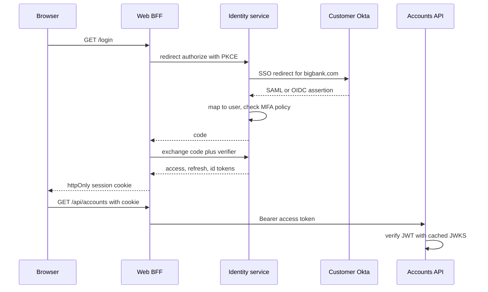

##### Data model

```sql
CREATE TABLE users (
  id            UUID PRIMARY KEY,
  tenant_id     UUID NOT NULL,
  email         CITEXT NOT NULL,
  password_hash TEXT,                  -- argon2id or bcrypt, NULL for SSO-only users
  status        TEXT NOT NULL,         -- active, locked, deprovisioned
  UNIQUE (tenant_id, email)
);

CREATE TABLE identity_links (           -- external IdP subject -> our user
  provider_id  UUID NOT NULL,           -- this tenant's Okta config
  external_sub TEXT NOT NULL,
  user_id      UUID NOT NULL REFERENCES users(id),
  PRIMARY KEY (provider_id, external_sub)
);

CREATE TABLE refresh_tokens (
  id          UUID PRIMARY KEY,
  family_id   UUID NOT NULL,            -- all rotations of one login session
  user_id     UUID NOT NULL,
  token_hash  CHAR(64) NOT NULL UNIQUE, -- store a hash, never the token
  used_at     TIMESTAMPTZ,
  revoked_at  TIMESTAMPTZ,
  expires_at  TIMESTAMPTZ NOT NULL
);
```

Link external identities by the IdP's stable subject (`sub` or SAML NameID configured as persistent), not by email, because emails change and can be reassigned.

##### API

```text
GET  /.well-known/openid-configuration
GET  /.well-known/jwks.json             public signing keys with kid
GET  /authorize                          code flow with PKCE
POST /token                              code exchange, refresh rotation
POST /revoke                             logout, revoke refresh family
POST /scim/v2/Users                      enterprise provisioning
```

APIs verify tokens locally; with the `jose` library:

```ts
import { createRemoteJWKSet, jwtVerify } from 'jose';

const JWKS = createRemoteJWKSet(new URL('https://id.example.com/.well-known/jwks.json')); // cached, refetched on unknown kid

export async function authenticate(authHeader: string | undefined) {
  if (!authHeader?.startsWith('Bearer ')) throw new Unauthorized();
  const { payload } = await jwtVerify(authHeader.slice(7), JWKS, {
    issuer: 'https://id.example.com',
    audience: 'accounts-api',
  });
  return { userId: payload.sub!, tenantId: payload.tenant_id as string, scopes: String(payload.scope ?? '').split(' ') };
}
```

Refresh token rotation with reuse detection: each refresh returns a new token and marks the old one used. If a used token is presented again, someone stole it; revoke the whole family.

##### Scaling and failure

- **Local verification:** APIs don't call the identity service per request, so it isn't on the hot path. Only login and refresh hit it.
- **Revocation:** short access token lifetime bounds the damage; for urgent revocation (fired employee, stolen device), revoke the refresh family and optionally keep a small deny-list of token ids checked at the gateway.
- **Key rotation:** publish the new key in JWKS before signing with it, keep the old key until all tokens signed with it expire.
- **Customer IdP down:** their users can't log in, by design; existing sessions continue until refresh. Offer break-glass admin accounts with MFA.
- **Brute force:** rate limit per account and per IP, lock after N failures with exponential delays, MFA with TOTP or WebAuthn passkeys.
- **Deprovisioning:** SCIM `active: false` or IdP back-channel logout revokes sessions immediately.

> **Gotcha:** Don't accept `alg: none` or let the token's header choose the algorithm freely. Pin the expected algorithms when verifying.

> **Finance tip:** Use step-up authentication for risky actions: a valid session lets the user view balances, but adding a new payee or a large transfer asks for MFA again and records `auth_time` and `amr` claims.

**Trade-offs:** Buying an identity provider costs money and limits customization, but avoids years of security work. JWTs scale well but are hard to revoke; opaque tokens with introspection are revocable but add a network call per request. A BFF improves web security but adds a service to run.

**What interviewers listen for:**
- OIDC code flow with PKCE, SAML/OIDC federation for enterprise SSO, linking by stable subject.
- Short-lived JWTs verified locally, refresh rotation with reuse detection, key rotation via `kid`.
- Tokens out of `localStorage`, BFF with `httpOnly` cookies.
- SCIM, step-up auth, brute-force protection.
- Red flags: rolling your own crypto, 30-day JWTs, matching SSO users by email only.

#### Q: [Mid] Regulators require an audit log: who did what, when, from where, for every change to accounts, payees and permissions. It must be tamper-evident and kept for 7 years. Design it.

**Short answer:** Write an audit event in the same database transaction as the business change (or via a transactional outbox), with actor, action, target, before/after values, time, IP and request id. Stream events to append-only storage: an insert-only table for recent searchable data and object storage with write-once retention (for example S3 Object Lock in compliance mode) for the 7-year archive. Make tampering detectable by hash-chaining events, so changing or deleting any event breaks the chain.

**Clarify first:**
- Which actions: only writes, or also sensitive reads ("advisor viewed client statement")?
- Who searches it and how: compliance officers by user and date range, or also customers ("show my account activity")?
- Volume: say 20 million events per day.
- Must personal data be erasable (GDPR) while audit data must be kept? This conflict needs legal guidance; a common approach stores PII separately or encrypted per subject.

**Diagnose:** Weak designs: logging audit events with the normal app logger (lost on log rotation, mutable, mixed with debug noise); writing the audit event after the commit (the change happens but the audit write fails); letting admins with database access edit the table.

**Solution:**

##### Capacity

```text
20M events/day * ~1 KB -> ~20 GB/day, ~7 TB/year, ~50 TB over 7 years (before compression).
Hot searchable window: 90 days (~1.8 TB) in Postgres partitions or a search store.
Archive: compressed Parquet or JSON lines in object storage, often 5-10x smaller.
```

##### Architecture

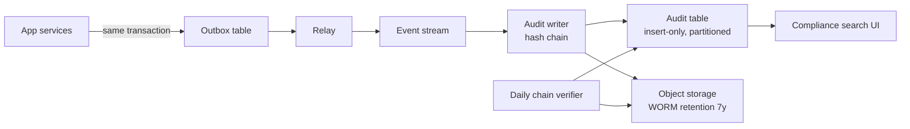

##### Data model

```sql
CREATE TABLE audit_events (
  id           BIGINT GENERATED ALWAYS AS IDENTITY,
  tenant_id    UUID NOT NULL,
  seq          BIGINT NOT NULL,           -- per-tenant sequence
  occurred_at  TIMESTAMPTZ NOT NULL,
  actor_id     UUID NOT NULL,
  actor_type   TEXT NOT NULL,             -- user, admin, service
  action       TEXT NOT NULL,             -- 'payee.created', 'permission.granted'
  target_type  TEXT NOT NULL,
  target_id    TEXT NOT NULL,
  changes      JSONB NOT NULL,            -- { field: [old, new] }, sensitive values masked
  ip           INET,
  request_id   TEXT,
  prev_hash    CHAR(64) NOT NULL,
  hash         CHAR(64) NOT NULL,
  PRIMARY KEY (tenant_id, seq, occurred_at)
) PARTITION BY RANGE (occurred_at);

REVOKE UPDATE, DELETE, TRUNCATE ON audit_events FROM app_role;  -- insert and select only
```

Hash chaining per tenant (so tenants don't serialize on one global chain):

```ts
import { createHash } from 'node:crypto';

function chainHash(prevHash: string, event: AuditEvent): string {
  const canonical = JSON.stringify(event, Object.keys(event).sort()); // stable key order for top-level fields
  return createHash('sha256').update(prevHash).update(canonical).digest('hex');
}
```

The `JSON.stringify` replacer-array trick only orders top-level keys and also filters nested objects by that same key list, so for nested `changes` use a proper canonical JSON library (for example, one implementing RFC 8785). The audit writer processes one tenant's events in order (partition the stream by tenant id), reads the last hash, computes the new one and inserts. Periodically, publish the latest hash per tenant somewhere independent (a separate account, or a signed daily digest) so even a full database rewrite is detectable.

##### API

```text
GET /audit-events?targetType=payee&targetId=...&from=...&to=...&cursor=...
GET /audit-events/export?from=...&to=...   -> async job, signed download link
POST /audit-events/verify?tenantId=...&from=...  (internal: recompute chain)
```

Access to the audit API is itself audited.

##### Scaling and failure

- **Never lose events:** outbox in the business transaction; relay is at-least-once; the writer dedupes by event id.
- **Lag:** search may be seconds behind; that's acceptable for compliance, monitor the lag.
- **Partitions:** monthly partitions; detach old ones after they are verified in the archive.
- **Search:** Postgres indexes on `(tenant_id, target_type, target_id, occurred_at)` and `(tenant_id, actor_id, occurred_at)`; move to a search engine only if free-text search is needed.
- **Verification:** a daily job recomputes chains and compares with the published digests; any break pages security.

> **Why:** Hash chaining doesn't prevent tampering, it makes it *evident*. WORM storage prevents deletion during retention, even by administrators, when compliance mode is used.

> **Gotcha:** Don't store secrets or full card numbers in `changes`. Mask them (`"****1234"`) before writing; an audit log holding raw PII becomes a high-value target.

**Trade-offs:** Writing in the same transaction gives strong guarantees but adds write load to the main database; the outbox keeps it small. Per-tenant chains scale but don't prove ordering across tenants. WORM storage is safe but irreversible: a mistake (wrong data stored) can't be deleted until retention ends.

**What interviewers listen for:** Atomic capture with the business change; append-only permissions; tamper evidence via hash chains and external anchoring; WORM retention; masking; access to the audit log is audited. Red flags: "we'll grep application logs", updating audit rows, writing the audit after commit.

#### Q: [Staff] Design an event-driven order system for a brokerage: users place stock orders; we run risk checks, reserve cash, route to an exchange broker, receive partial fills, update positions and the ledger, and notify users. Peak 5,000 orders per second at market open.

**Short answer:** The order service owns an order state machine and is the only writer of order state. Each state change is committed together with an event in a transactional outbox and published to a log like Kafka, partitioned by account id so each account's events stay ordered. Downstream services (risk, cash reservation, routing, positions, ledger, notifications) consume events, act idempotently, and emit their own events. The flow is a saga: failure at any step triggers explicit compensations (release reserved cash, cancel the order). Fills are applied with exchange execution ids as dedupe keys, so retries and replays never double-count shares.

**Clarify first:**
- Order types: market, limit, stop? Day orders vs good-till-cancelled?
- Do we route to one execution broker or several venues?
- Latency target from click to "order accepted": say under 300 ms p99.
- Is cash reservation required before routing (cash account) or is margin involved (credit risk)?
- Regulatory needs: full order history, best-execution records, audit.

**Diagnose:** Typical mistakes: synchronous chains (order API calls risk, then cash, then router; one slow service blocks everything); events published after commit and lost on crash; two consumers updating positions out of order; duplicate fill messages doubling a position.

**Solution:**

##### Capacity

```text
Peak 5,000 orders/s; each order produces ~6-10 events (accepted, risk passed, cash reserved, routed, fills, done).
-> ~50k events/s at peak. Kafka handles this with modest partition counts (e.g. 64 partitions per topic).
Orders: 20M/day on busy days * 1 KB -> ~20 GB/day in the orders database, fills separately.
```

##### Architecture

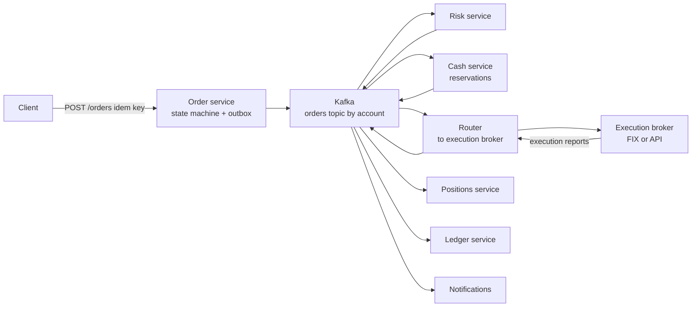

##### Order state machine

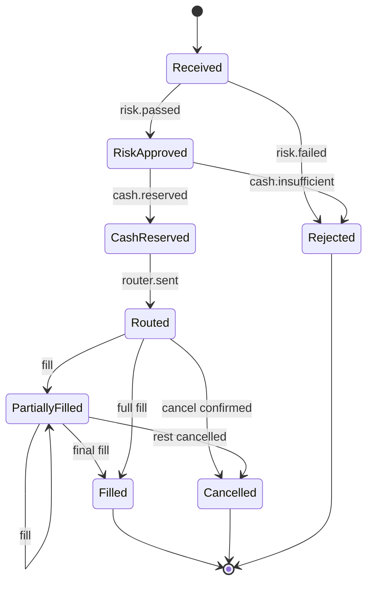

##### Data model

```sql
CREATE TABLE orders (
  id              UUID PRIMARY KEY,
  account_id      UUID NOT NULL,
  client_order_id TEXT NOT NULL,           -- idempotency key from the client
  symbol          TEXT NOT NULL,
  side            TEXT NOT NULL CHECK (side IN ('buy', 'sell')),
  type            TEXT NOT NULL,           -- market, limit
  qty             NUMERIC(20, 6) NOT NULL CHECK (qty > 0),
  limit_price     NUMERIC(20, 6),
  filled_qty      NUMERIC(20, 6) NOT NULL DEFAULT 0,
  status          TEXT NOT NULL,
  version         INT NOT NULL DEFAULT 0,
  created_at      TIMESTAMPTZ NOT NULL DEFAULT now(),
  UNIQUE (account_id, client_order_id)
);

CREATE TABLE fills (
  execution_id  TEXT PRIMARY KEY,          -- from the broker: dedupe key
  order_id      UUID NOT NULL REFERENCES orders(id),
  qty           NUMERIC(20, 6) NOT NULL,
  price         NUMERIC(20, 6) NOT NULL,
  executed_at   TIMESTAMPTZ NOT NULL
);

CREATE TABLE outbox (
  id           BIGINT GENERATED ALWAYS AS IDENTITY PRIMARY KEY,
  aggregate_id UUID NOT NULL,
  partition_key TEXT NOT NULL,             -- account id
  type         TEXT NOT NULL,
  payload      JSONB NOT NULL,
  published_at TIMESTAMPTZ
);
```

##### API

```text
POST   /orders        { clientOrderId, symbol, side, type, qty, limitPrice? } -> 202 { orderId, status: "received" }
GET    /orders/{id}   -> { status, filledQty, avgPrice, fills: [...] }
DELETE /orders/{id}   -> 202 { status: "cancel_requested" }
WS     /orders/stream -> order status events for this account
```

`202` because the order is accepted for processing, not executed. The client shows "Received" and updates from the stream.

Applying a fill idempotently and atomically:

```ts
async function applyFill(report: ExecutionReport) {
  await db.tx(async (tx) => {
    const inserted = await tx.query(
      `INSERT INTO fills (execution_id, order_id, qty, price, executed_at)
       VALUES ($1, $2, $3, $4, $5) ON CONFLICT (execution_id) DO NOTHING RETURNING 1`,
      [report.executionId, report.orderId, report.qty, report.price, report.executedAt],
    );
    if (inserted.rowCount === 0) return; // duplicate execution report: already applied

    const { rows } = await tx.query(
      `UPDATE orders SET filled_qty = filled_qty + $2,
              status = CASE WHEN filled_qty + $2 >= qty THEN 'filled' ELSE 'partially_filled' END,
              version = version + 1
       WHERE id = $1 AND status IN ('routed', 'partially_filled')
       RETURNING account_id, status, filled_qty`,
      [report.orderId, report.qty],
    );
    if (rows.length === 0) throw new Error(`fill for order in unexpected state: ${report.orderId}`); // alert, investigate

    await tx.query(
      `INSERT INTO outbox (aggregate_id, partition_key, type, payload) VALUES ($1, $2, 'order.filled', $3)`,
      [report.orderId, rows[0].account_id, { ...report, status: rows[0].status, filledQty: rows[0].filled_qty }],
    );
  });
}
```

Downstream, the positions and ledger services keep a `processed_events (event_id PRIMARY KEY)` table and apply each event in the same transaction as their insert into it, so replays are safe.

##### Scaling and failure

- **Ordering:** partition by account id. All events of one account are processed in order by one consumer at a time; different accounts scale in parallel. Hot accounts (a big institutional client) can be split by order id if their events don't depend on each other.
- **Outbox relay:** polls unpublished rows (or uses change data capture such as Debezium), publishes, marks published. At-least-once, so every consumer dedupes.
- **Saga compensations:** risk passes but cash reservation fails: reject the order. Order routed but broker rejects: release reserved cash. A cancel races a fill: the broker's report is the truth; apply the fill, cancel only the remainder.
- **Broker connection loss:** orders in `routed` state with no acknowledgement go to "unknown"; on reconnect, request order status from the broker before resending (resending can duplicate a real order).
- **Market open spike:** pre-scale consumers and partitions; the order API only writes an order and outbox row, so it stays fast; queues absorb the rest.
- **Reconciliation:** end-of-day comparison of our fills and positions with the broker's and clearing firm's reports.
- **Event schema:** versioned schemas in a registry; consumers tolerate unknown fields.

> **Finance tip:** Use exact decimals (`NUMERIC`, or integer units with a fixed scale) for quantity and price. Fractional shares make floating-point errors very visible in positions.

> **Interview tip:** Name the source of truth for each fact: the order service for order state, the broker for executions, the ledger for cash. Events notify; they don't replace ownership.

**Trade-offs:** Event-driven sagas decouple services and absorb spikes, but make the flow harder to follow and debug (you need tracing across Kafka, see the observability playbook) and give eventual consistency to the UI. A central orchestrator service is easier to reason about than pure choreography but becomes a coordination point. Kafka gives replay and ordering per partition but adds operational weight compared with a managed queue.

**What interviewers listen for:**
- Explicit state machine with a single owner, `202 Accepted` semantics.
- Transactional outbox, partitioning by account for ordering, idempotent consumers with dedupe keys.
- Saga compensations, including the cancel-vs-fill race and unknown broker state.
- Capacity math, reconciliation, exact decimals.
- Red flags: a synchronous chain of HTTP calls, "Kafka gives exactly-once so we don't need dedupe", floats for quantities.
